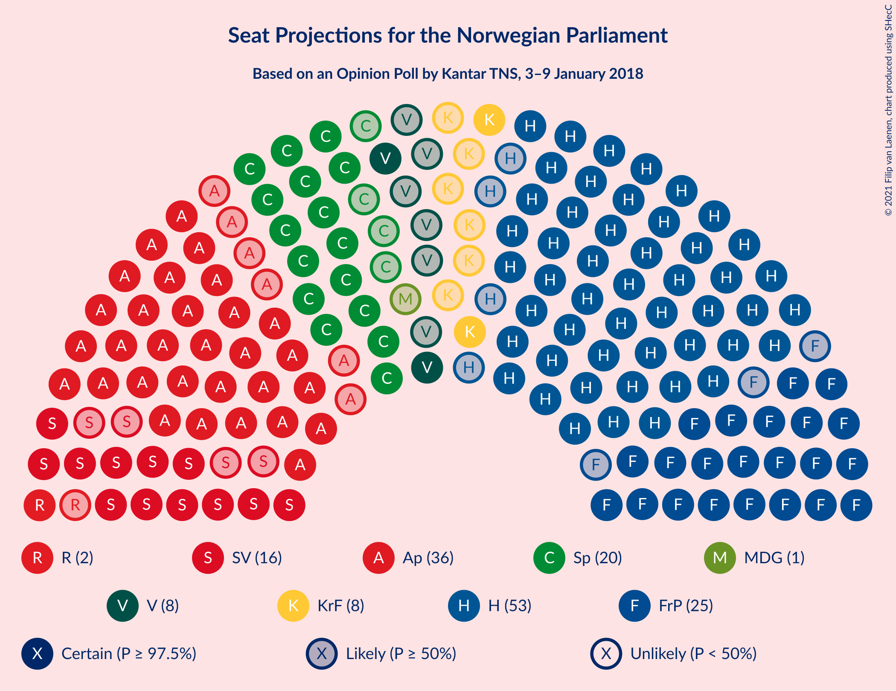
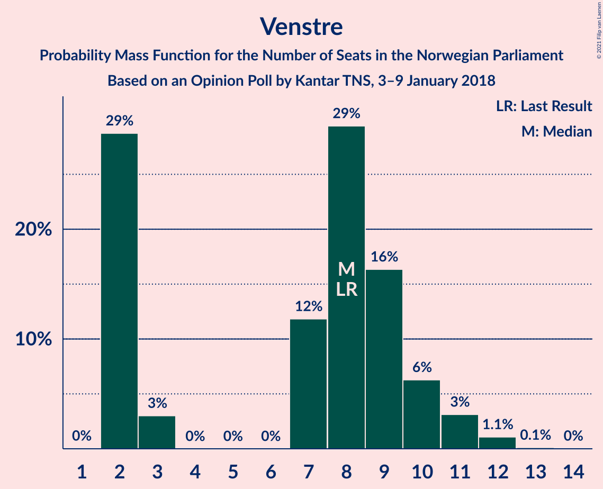
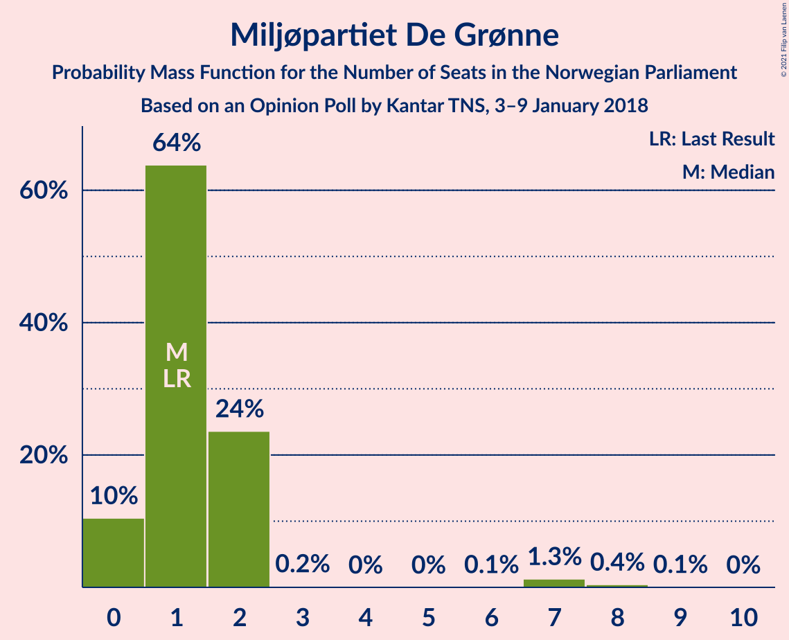
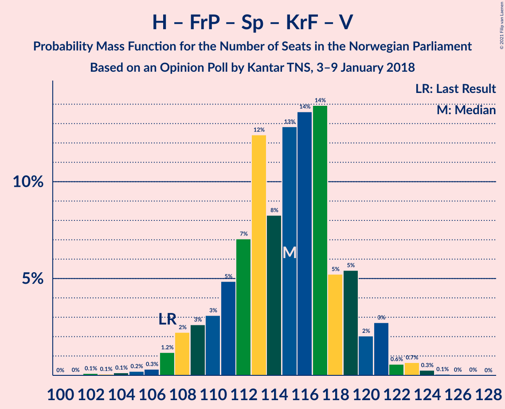
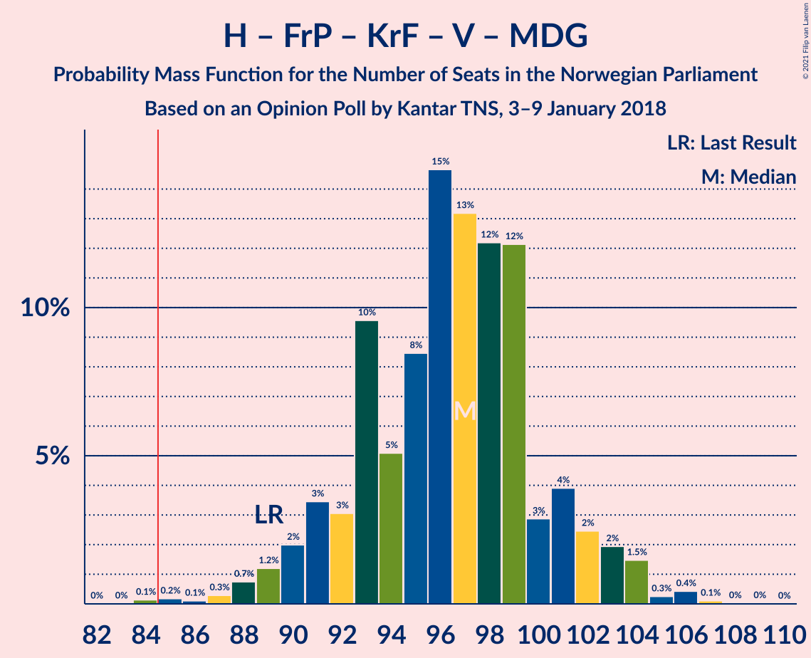
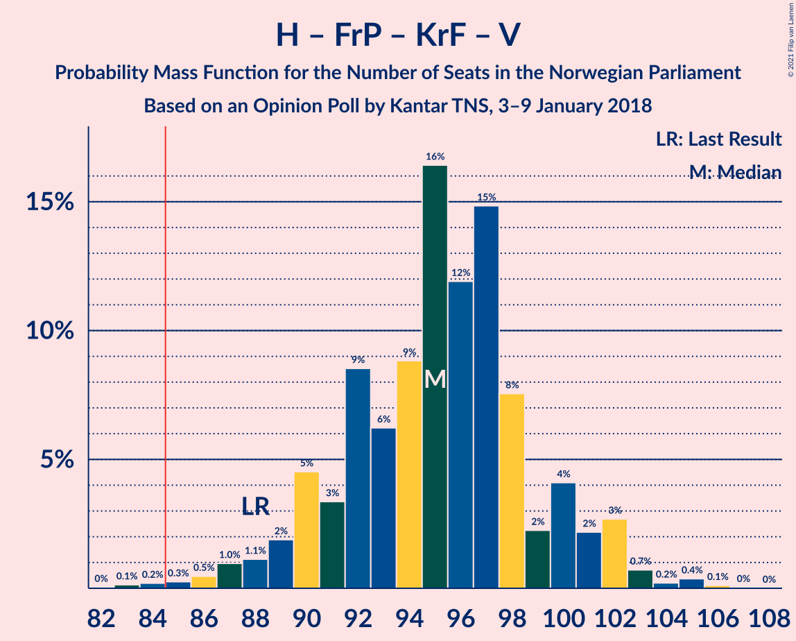
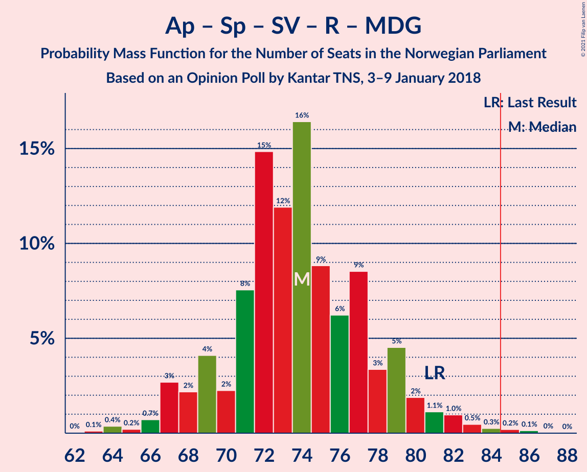
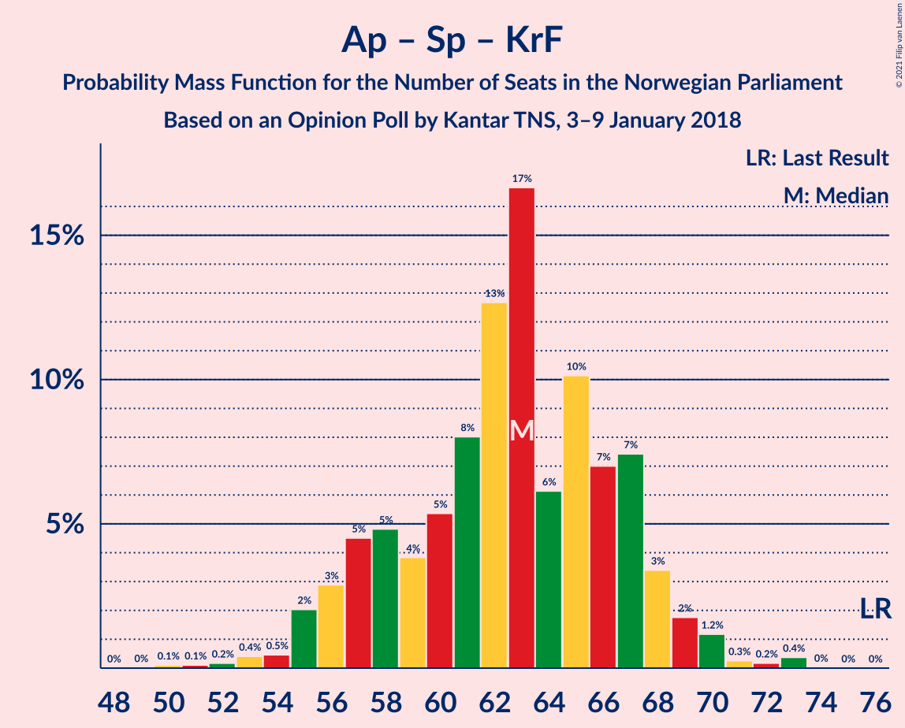

# Opinion Poll by Kantar TNS, 3–9 January 2018

<a href="#voting-intentions">Voting Intentions</a> | <a href="#seats">Seats</a> | <a href="#coalitions">Coalitions</a> | <a href="#technical-information">Technical Information</a>

## Voting Intentions

### Confidence Intervals

| Party | Last Result | Poll Result | 80% Confidence Interval | 90% Confidence Interval | 95% Confidence Interval | 99% Confidence Interval |
|:-----:|:-----------:|:-----------:|:-----------------------:|:-----------------------:|:-----------------------:|:-----------------------:|
| Høyre | 25.0% | 30.5% | 28.5–32.7% |27.9–33.3% |27.4–33.8% |26.4–34.9% |
| Arbeiderpartiet | 27.4% | 19.4% | 17.6–21.3% |17.1–21.8% |16.7–22.3% |15.9–23.2% |
| Fremskrittspartiet | 15.2% | 14.7% | 13.2–16.5% |12.8–17.0% |12.4–17.4% |11.7–18.3% |
| Senterpartiet | 10.3% | 10.9% | 9.6–12.5% |9.2–12.9% |8.9–13.3% |8.3–14.1% |
| Sosialistisk Venstreparti | 6.0% | 8.6% | 7.4–10.0% |7.1–10.4% |6.8–10.8% |6.3–11.5% |
| Kristelig Folkeparti | 4.2% | 4.5% | 3.7–5.6% |3.4–5.9% |3.2–6.2% |2.9–6.8% |
| Venstre | 4.4% | 4.4% | 3.6–5.5% |3.3–5.8% |3.1–6.0% |2.8–6.6% |
| Rødt | 2.4% | 2.9% | 2.3–3.9% |2.1–4.2% |2.0–4.4% |1.7–4.9% |
| Miljøpartiet De Grønne | 3.2% | 2.6% | 2.0–3.5% |1.8–3.7% |1.7–3.9% |1.4–4.4% |

*Note:* The poll result column reflects the actual value used in the calculations. Published results may vary slightly, and in addition be rounded to fewer digits.

## Seats

### Confidence Intervals

| Party | Last Result | Median | 80% Confidence Interval | 90% Confidence Interval | 95% Confidence Interval | 99% Confidence Interval |
|:-----:|:-----------:|:------:|:-----------------------:|:-----------------------:|:-----------------------:|:-----------------------:|
| <a href="#høyre">Høyre</a> | 45 | 55 | 51–59 |50–60 |49–61 |47–64 |
| <a href="#arbeiderpartiet">Arbeiderpartiet</a> | 49 | 36 | 32–39 |31–40 |30–41 |28–42 |
| <a href="#fremskrittspartiet">Fremskrittspartiet</a> | 27 | 26 | 24–30 |23–31 |22–31 |20–33 |
| <a href="#senterpartiet">Senterpartiet</a> | 19 | 20 | 17–23 |16–23 |16–24 |15–25 |
| <a href="#sosialistisk-venstreparti">Sosialistisk Venstreparti</a> | 11 | 16 | 13–18 |12–19 |12–20 |11–21 |
| <a href="#kristelig-folkeparti">Kristelig Folkeparti</a> | 8 | 8 | 3–10 |2–11 |2–11 |1–12 |
| <a href="#venstre">Venstre</a> | 8 | 8 | 2–10 |2–10 |2–11 |2–12 |
| <a href="#rødt">Rødt</a> | 1 | 2 | 1–2 |1–7 |1–8 |1–8 |
| <a href="#miljøpartiet-de-grønne">Miljøpartiet De Grønne</a> | 1 | 1 | 0–2 |0–2 |0–2 |0–8 |

### Høyre

*For a full overview of the results for this party, see the [Høyre](party-høyre.html) page.*

| Number of Seats | Probability | Accumulated | Special Marks |
|:---------------:|:-----------:|:-----------:|:-------------:|
| 44 | 0.1% | 100% |  |
| 45 | 0.1% | 99.9% | Last Result |
| 46 | 0.3% | 99.8% |  |
| 47 | 0.9% | 99.5% |  |
| 48 | 0.9% | 98.6% |  |
| 49 | 3% | 98% |  |
| 50 | 3% | 95% |  |
| 51 | 4% | 92% |  |
| 52 | 8% | 88% |  |
| 53 | 15% | 80% |  |
| 54 | 12% | 64% |  |
| 55 | 14% | 52% | Median |
| 56 | 11% | 38% |  |
| 57 | 5% | 27% |  |
| 58 | 10% | 22% |  |
| 59 | 3% | 12% |  |
| 60 | 5% | 9% |  |
| 61 | 2% | 4% |  |
| 62 | 0.8% | 2% |  |
| 63 | 0.4% | 0.9% |  |
| 64 | 0.3% | 0.5% |  |
| 65 | 0.2% | 0.2% |  |
| 66 | 0% | 0.1% |  |
| 67 | 0% | 0% |  |

### Arbeiderpartiet

*For a full overview of the results for this party, see the [Arbeiderpartiet](party-arbeiderpartiet.html) page.*

| Number of Seats | Probability | Accumulated | Special Marks |
|:---------------:|:-----------:|:-----------:|:-------------:|
| 27 | 0.1% | 100% |  |
| 28 | 0.5% | 99.8% |  |
| 29 | 0.8% | 99.3% |  |
| 30 | 3% | 98% |  |
| 31 | 4% | 96% |  |
| 32 | 4% | 91% |  |
| 33 | 9% | 88% |  |
| 34 | 8% | 79% |  |
| 35 | 16% | 71% |  |
| 36 | 22% | 56% | Median |
| 37 | 15% | 34% |  |
| 38 | 6% | 20% |  |
| 39 | 7% | 13% |  |
| 40 | 3% | 6% |  |
| 41 | 2% | 3% |  |
| 42 | 0.7% | 1.1% |  |
| 43 | 0.2% | 0.3% |  |
| 44 | 0.1% | 0.1% |  |
| 45 | 0% | 0% |  |
| 46 | 0% | 0% |  |
| 47 | 0% | 0% |  |
| 48 | 0% | 0% |  |
| 49 | 0% | 0% | Last Result |

### Fremskrittspartiet

*For a full overview of the results for this party, see the [Fremskrittspartiet](party-fremskrittspartiet.html) page.*

| Number of Seats | Probability | Accumulated | Special Marks |
|:---------------:|:-----------:|:-----------:|:-------------:|
| 19 | 0.1% | 100% |  |
| 20 | 0.6% | 99.9% |  |
| 21 | 0.9% | 99.3% |  |
| 22 | 2% | 98% |  |
| 23 | 3% | 96% |  |
| 24 | 13% | 93% |  |
| 25 | 15% | 79% |  |
| 26 | 19% | 64% | Median |
| 27 | 13% | 45% | Last Result |
| 28 | 10% | 32% |  |
| 29 | 11% | 22% |  |
| 30 | 6% | 12% |  |
| 31 | 4% | 6% |  |
| 32 | 1.1% | 2% |  |
| 33 | 0.3% | 0.8% |  |
| 34 | 0.4% | 0.5% |  |
| 35 | 0.1% | 0.1% |  |
| 36 | 0% | 0% |  |

### Senterpartiet

*For a full overview of the results for this party, see the [Senterpartiet](party-senterpartiet.html) page.*

| Number of Seats | Probability | Accumulated | Special Marks |
|:---------------:|:-----------:|:-----------:|:-------------:|
| 14 | 0.3% | 100% |  |
| 15 | 1.3% | 99.6% |  |
| 16 | 4% | 98% |  |
| 17 | 10% | 94% |  |
| 18 | 16% | 84% |  |
| 19 | 17% | 68% | Last Result |
| 20 | 21% | 51% | Median |
| 21 | 10% | 30% |  |
| 22 | 8% | 20% |  |
| 23 | 8% | 12% |  |
| 24 | 2% | 3% |  |
| 25 | 1.3% | 2% |  |
| 26 | 0.2% | 0.4% |  |
| 27 | 0.1% | 0.1% |  |
| 28 | 0% | 0% |  |

### Sosialistisk Venstreparti

*For a full overview of the results for this party, see the [Sosialistisk Venstreparti](party-sosialistiskvenstreparti.html) page.*

| Number of Seats | Probability | Accumulated | Special Marks |
|:---------------:|:-----------:|:-----------:|:-------------:|
| 10 | 0.1% | 100% |  |
| 11 | 1.1% | 99.9% | Last Result |
| 12 | 5% | 98.8% |  |
| 13 | 10% | 94% |  |
| 14 | 18% | 84% |  |
| 15 | 13% | 67% |  |
| 16 | 25% | 53% | Median |
| 17 | 17% | 29% |  |
| 18 | 5% | 11% |  |
| 19 | 4% | 6% |  |
| 20 | 2% | 3% |  |
| 21 | 0.5% | 0.6% |  |
| 22 | 0.1% | 0.1% |  |
| 23 | 0% | 0% |  |

### Kristelig Folkeparti

*For a full overview of the results for this party, see the [Kristelig Folkeparti](party-kristeligfolkeparti.html) page.*

| Number of Seats | Probability | Accumulated | Special Marks |
|:---------------:|:-----------:|:-----------:|:-------------:|
| 1 | 2% | 100% |  |
| 2 | 6% | 98% |  |
| 3 | 14% | 93% |  |
| 4 | 0% | 79% |  |
| 5 | 0% | 79% |  |
| 6 | 0% | 79% |  |
| 7 | 10% | 79% |  |
| 8 | 26% | 69% | Last Result, Median |
| 9 | 26% | 43% |  |
| 10 | 11% | 16% |  |
| 11 | 4% | 5% |  |
| 12 | 0.7% | 0.9% |  |
| 13 | 0.2% | 0.2% |  |
| 14 | 0% | 0% |  |

### Venstre

*For a full overview of the results for this party, see the [Venstre](party-venstre.html) page.*

| Number of Seats | Probability | Accumulated | Special Marks |
|:---------------:|:-----------:|:-----------:|:-------------:|
| 2 | 29% | 100% |  |
| 3 | 3% | 71% |  |
| 4 | 0% | 68% |  |
| 5 | 0% | 68% |  |
| 6 | 0% | 68% |  |
| 7 | 12% | 68% |  |
| 8 | 29% | 56% | Last Result, Median |
| 9 | 16% | 27% |  |
| 10 | 6% | 11% |  |
| 11 | 3% | 4% |  |
| 12 | 1.1% | 1.2% |  |
| 13 | 0.1% | 0.1% |  |
| 14 | 0% | 0% |  |

### Rødt

*For a full overview of the results for this party, see the [Rødt](party-rødt.html) page.*

| Number of Seats | Probability | Accumulated | Special Marks |
|:---------------:|:-----------:|:-----------:|:-------------:|
| 1 | 41% | 100% | Last Result |
| 2 | 53% | 59% | Median |
| 3 | 0% | 6% |  |
| 4 | 0% | 6% |  |
| 5 | 0% | 6% |  |
| 6 | 0.1% | 6% |  |
| 7 | 3% | 6% |  |
| 8 | 2% | 3% |  |
| 9 | 0.2% | 0.3% |  |
| 10 | 0.1% | 0.1% |  |
| 11 | 0% | 0% |  |

### Miljøpartiet De Grønne

*For a full overview of the results for this party, see the [Miljøpartiet De Grønne](party-miljøpartietdegrønne.html) page.*

| Number of Seats | Probability | Accumulated | Special Marks |
|:---------------:|:-----------:|:-----------:|:-------------:|
| 0 | 10% | 100% |  |
| 1 | 64% | 90% | Last Result, Median |
| 2 | 24% | 26% |  |
| 3 | 0.2% | 2% |  |
| 4 | 0% | 2% |  |
| 5 | 0% | 2% |  |
| 6 | 0.1% | 2% |  |
| 7 | 1.3% | 2% |  |
| 8 | 0.4% | 0.5% |  |
| 9 | 0.1% | 0.1% |  |
| 10 | 0% | 0% |  |

## Coalitions

### Confidence Intervals

| Coalition | Last Result | Median | Majority? | 80% Confidence Interval | 90% Confidence Interval | 95% Confidence Interval | 99% Confidence Interval |
|:---------:|:-----------:|:------:|:---------:|:-----------------------:|:-----------------------:|:-----------------------:|:-----------------------:|
| Høyre – Fremskrittspartiet – Senterpartiet – Kristelig Folkeparti – Venstre | 107 | 115 | 100% | 111–119 | 109–120 | 108–121 | 105–123 |
| Høyre – Fremskrittspartiet – Kristelig Folkeparti – Venstre – Miljøpartiet De Grønne | 89 | 97 | 99.8% | 92–101 | 91–102 | 89–103 | 87–106 |
| Høyre – Fremskrittspartiet – Kristelig Folkeparti – Venstre | 88 | 95 | 99.6% | 91–100 | 89–101 | 88–102 | 85–105 |
| Høyre – Fremskrittspartiet – Venstre | 80 | 88 | 82% | 83–93 | 82–94 | 80–95 | 78–98 |
| Høyre – Fremskrittspartiet | 72 | 81 | 23% | 77–86 | 75–87 | 74–89 | 72–92 |
| Arbeiderpartiet – Senterpartiet – Sosialistisk Venstreparti – Kristelig Folkeparti – Miljøpartiet De Grønne | 88 | 80 | 10% | 74–85 | 73–85 | 72–86 | 69–88 |
| Arbeiderpartiet – Senterpartiet – Sosialistisk Venstreparti – Rødt – Miljøpartiet De Grønne | 81 | 74 | 0.4% | 69–78 | 68–80 | 67–81 | 64–84 |
| Arbeiderpartiet – Senterpartiet – Sosialistisk Venstreparti – Rødt | 80 | 72 | 0.2% | 68–77 | 67–78 | 66–80 | 63–82 |
| Arbeiderpartiet – Senterpartiet – Sosialistisk Venstreparti – Miljøpartiet De Grønne | 80 | 72 | 0% | 68–77 | 66–78 | 66–79 | 63–82 |
| Arbeiderpartiet – Senterpartiet – Sosialistisk Venstreparti | 79 | 70 | 0% | 66–75 | 65–76 | 64–77 | 62–80 |
| Høyre – Kristelig Folkeparti – Venstre | 61 | 69 | 0% | 64–73 | 63–74 | 61–75 | 59–78 |
| Arbeiderpartiet – Senterpartiet – Kristelig Folkeparti – Miljøpartiet De Grønne | 77 | 64 | 0% | 59–68 | 57–69 | 56–71 | 54–74 |
| Arbeiderpartiet – Senterpartiet – Kristelig Folkeparti | 76 | 63 | 0% | 57–67 | 56–68 | 55–69 | 53–72 |
| Arbeiderpartiet – Senterpartiet | 68 | 55 | 0% | 52–59 | 50–60 | 49–61 | 47–63 |
| Arbeiderpartiet – Sosialistisk Venstreparti | 60 | 51 | 0% | 47–55 | 46–57 | 45–58 | 43–59 |
| Senterpartiet – Kristelig Folkeparti – Venstre | 35 | 34 | 0% | 28–38 | 27–40 | 26–40 | 23–42 |

### Høyre – Fremskrittspartiet – Senterpartiet – Kristelig Folkeparti – Venstre

| Number of Seats | Probability | Accumulated | Special Marks |
|:---------------:|:-----------:|:-----------:|:-------------:|
| 102 | 0.1% | 100% |  |
| 103 | 0.1% | 99.9% |  |
| 104 | 0.1% | 99.8% |  |
| 105 | 0.2% | 99.7% |  |
| 106 | 0.3% | 99.5% |  |
| 107 | 1.2% | 99.1% | Last Result |
| 108 | 2% | 98% |  |
| 109 | 3% | 96% |  |
| 110 | 3% | 93% |  |
| 111 | 5% | 90% |  |
| 112 | 7% | 85% |  |
| 113 | 12% | 78% |  |
| 114 | 8% | 66% |  |
| 115 | 13% | 57% |  |
| 116 | 14% | 45% |  |
| 117 | 14% | 31% | Median |
| 118 | 5% | 17% |  |
| 119 | 5% | 12% |  |
| 120 | 2% | 6% |  |
| 121 | 3% | 4% |  |
| 122 | 0.6% | 2% |  |
| 123 | 0.7% | 1.0% |  |
| 124 | 0.3% | 0.4% |  |
| 125 | 0.1% | 0.1% |  |
| 126 | 0% | 0.1% |  |
| 127 | 0% | 0% |  |

### Høyre – Fremskrittspartiet – Kristelig Folkeparti – Venstre – Miljøpartiet De Grønne

| Number of Seats | Probability | Accumulated | Special Marks |
|:---------------:|:-----------:|:-----------:|:-------------:|
| 84 | 0.1% | 100% |  |
| 85 | 0.2% | 99.8% | Majority |
| 86 | 0.1% | 99.7% |  |
| 87 | 0.3% | 99.6% |  |
| 88 | 0.7% | 99.3% |  |
| 89 | 1.2% | 98.5% | Last Result |
| 90 | 2% | 97% |  |
| 91 | 3% | 95% |  |
| 92 | 3% | 92% |  |
| 93 | 10% | 89% |  |
| 94 | 5% | 79% |  |
| 95 | 8% | 74% |  |
| 96 | 15% | 66% |  |
| 97 | 13% | 51% |  |
| 98 | 12% | 38% | Median |
| 99 | 12% | 26% |  |
| 100 | 3% | 14% |  |
| 101 | 4% | 11% |  |
| 102 | 2% | 7% |  |
| 103 | 2% | 4% |  |
| 104 | 1.5% | 2% |  |
| 105 | 0.3% | 0.8% |  |
| 106 | 0.4% | 0.6% |  |
| 107 | 0.1% | 0.2% |  |
| 108 | 0% | 0.1% |  |
| 109 | 0% | 0% |  |

### Høyre – Fremskrittspartiet – Kristelig Folkeparti – Venstre

| Number of Seats | Probability | Accumulated | Special Marks |
|:---------------:|:-----------:|:-----------:|:-------------:|
| 82 | 0% | 100% |  |
| 83 | 0.1% | 99.9% |  |
| 84 | 0.2% | 99.8% |  |
| 85 | 0.3% | 99.6% | Majority |
| 86 | 0.5% | 99.3% |  |
| 87 | 1.0% | 98.9% |  |
| 88 | 1.1% | 98% | Last Result |
| 89 | 2% | 97% |  |
| 90 | 5% | 95% |  |
| 91 | 3% | 90% |  |
| 92 | 9% | 87% |  |
| 93 | 6% | 78% |  |
| 94 | 9% | 72% |  |
| 95 | 16% | 63% |  |
| 96 | 12% | 47% |  |
| 97 | 15% | 35% | Median |
| 98 | 8% | 20% |  |
| 99 | 2% | 13% |  |
| 100 | 4% | 10% |  |
| 101 | 2% | 6% |  |
| 102 | 3% | 4% |  |
| 103 | 0.7% | 1.5% |  |
| 104 | 0.2% | 0.7% |  |
| 105 | 0.4% | 0.5% |  |
| 106 | 0.1% | 0.2% |  |
| 107 | 0% | 0.1% |  |
| 108 | 0% | 0% |  |

### Høyre – Fremskrittspartiet – Venstre

| Number of Seats | Probability | Accumulated | Special Marks |
|:---------------:|:-----------:|:-----------:|:-------------:|
| 75 | 0.1% | 100% |  |
| 76 | 0.1% | 99.9% |  |
| 77 | 0.1% | 99.8% |  |
| 78 | 0.3% | 99.7% |  |
| 79 | 0.4% | 99.4% |  |
| 80 | 2% | 99.0% | Last Result |
| 81 | 2% | 97% |  |
| 82 | 5% | 95% |  |
| 83 | 4% | 91% |  |
| 84 | 5% | 87% |  |
| 85 | 5% | 82% | Majority |
| 86 | 11% | 77% |  |
| 87 | 14% | 66% |  |
| 88 | 16% | 52% |  |
| 89 | 7% | 36% | Median |
| 90 | 8% | 29% |  |
| 91 | 3% | 21% |  |
| 92 | 6% | 18% |  |
| 93 | 6% | 12% |  |
| 94 | 3% | 7% |  |
| 95 | 2% | 4% |  |
| 96 | 0.5% | 2% |  |
| 97 | 1.0% | 2% |  |
| 98 | 0.2% | 0.7% |  |
| 99 | 0.4% | 0.5% |  |
| 100 | 0.1% | 0.1% |  |
| 101 | 0% | 0% |  |

### Høyre – Fremskrittspartiet

| Number of Seats | Probability | Accumulated | Special Marks |
|:---------------:|:-----------:|:-----------:|:-------------:|
| 70 | 0% | 100% |  |
| 71 | 0.2% | 99.9% |  |
| 72 | 0.6% | 99.7% | Last Result |
| 73 | 1.1% | 99.1% |  |
| 74 | 1.3% | 98% |  |
| 75 | 3% | 97% |  |
| 76 | 4% | 94% |  |
| 77 | 5% | 90% |  |
| 78 | 7% | 85% |  |
| 79 | 13% | 79% |  |
| 80 | 14% | 66% |  |
| 81 | 6% | 52% | Median |
| 82 | 9% | 46% |  |
| 83 | 6% | 37% |  |
| 84 | 8% | 31% |  |
| 85 | 8% | 23% | Majority |
| 86 | 7% | 15% |  |
| 87 | 3% | 7% |  |
| 88 | 1.0% | 5% |  |
| 89 | 1.4% | 4% |  |
| 90 | 0.9% | 2% |  |
| 91 | 0.1% | 1.4% |  |
| 92 | 1.0% | 1.3% |  |
| 93 | 0.1% | 0.2% |  |
| 94 | 0.1% | 0.2% |  |
| 95 | 0% | 0% |  |

### Arbeiderpartiet – Senterpartiet – Sosialistisk Venstreparti – Kristelig Folkeparti – Miljøpartiet De Grønne

| Number of Seats | Probability | Accumulated | Special Marks |
|:---------------:|:-----------:|:-----------:|:-------------:|
| 66 | 0% | 100% |  |
| 67 | 0.1% | 99.9% |  |
| 68 | 0.1% | 99.9% |  |
| 69 | 0.5% | 99.8% |  |
| 70 | 0.5% | 99.2% |  |
| 71 | 1.1% | 98.8% |  |
| 72 | 1.1% | 98% |  |
| 73 | 3% | 97% |  |
| 74 | 4% | 93% |  |
| 75 | 6% | 89% |  |
| 76 | 6% | 83% |  |
| 77 | 4% | 77% |  |
| 78 | 10% | 73% |  |
| 79 | 13% | 64% |  |
| 80 | 18% | 51% |  |
| 81 | 8% | 33% | Median |
| 82 | 6% | 25% |  |
| 83 | 5% | 19% |  |
| 84 | 4% | 14% |  |
| 85 | 5% | 10% | Majority |
| 86 | 2% | 5% |  |
| 87 | 1.2% | 2% |  |
| 88 | 0.8% | 1.2% | Last Result |
| 89 | 0.2% | 0.5% |  |
| 90 | 0.2% | 0.3% |  |
| 91 | 0.1% | 0.1% |  |
| 92 | 0% | 0% |  |

### Arbeiderpartiet – Senterpartiet – Sosialistisk Venstreparti – Rødt – Miljøpartiet De Grønne

| Number of Seats | Probability | Accumulated | Special Marks |
|:---------------:|:-----------:|:-----------:|:-------------:|
| 62 | 0% | 100% |  |
| 63 | 0.1% | 99.9% |  |
| 64 | 0.4% | 99.8% |  |
| 65 | 0.2% | 99.5% |  |
| 66 | 0.7% | 99.3% |  |
| 67 | 3% | 98.5% |  |
| 68 | 2% | 96% |  |
| 69 | 4% | 94% |  |
| 70 | 2% | 90% |  |
| 71 | 8% | 87% |  |
| 72 | 15% | 80% |  |
| 73 | 12% | 65% |  |
| 74 | 16% | 53% |  |
| 75 | 9% | 37% | Median |
| 76 | 6% | 28% |  |
| 77 | 9% | 22% |  |
| 78 | 3% | 13% |  |
| 79 | 5% | 10% |  |
| 80 | 2% | 5% |  |
| 81 | 1.1% | 3% | Last Result |
| 82 | 1.0% | 2% |  |
| 83 | 0.5% | 1.1% |  |
| 84 | 0.3% | 0.7% |  |
| 85 | 0.2% | 0.4% | Majority |
| 86 | 0.1% | 0.2% |  |
| 87 | 0% | 0.1% |  |
| 88 | 0% | 0% |  |

### Arbeiderpartiet – Senterpartiet – Sosialistisk Venstreparti – Rødt

| Number of Seats | Probability | Accumulated | Special Marks |
|:---------------:|:-----------:|:-----------:|:-------------:|
| 61 | 0% | 100% |  |
| 62 | 0.1% | 99.9% |  |
| 63 | 0.4% | 99.8% |  |
| 64 | 0.3% | 99.4% |  |
| 65 | 1.5% | 99.2% |  |
| 66 | 2% | 98% |  |
| 67 | 2% | 96% |  |
| 68 | 4% | 93% |  |
| 69 | 3% | 89% |  |
| 70 | 12% | 86% |  |
| 71 | 12% | 74% |  |
| 72 | 13% | 62% |  |
| 73 | 15% | 49% |  |
| 74 | 8% | 34% | Median |
| 75 | 5% | 26% |  |
| 76 | 10% | 21% |  |
| 77 | 3% | 11% |  |
| 78 | 3% | 8% |  |
| 79 | 2% | 5% |  |
| 80 | 1.2% | 3% | Last Result |
| 81 | 0.7% | 1.5% |  |
| 82 | 0.3% | 0.7% |  |
| 83 | 0.1% | 0.4% |  |
| 84 | 0.2% | 0.3% |  |
| 85 | 0.1% | 0.2% | Majority |
| 86 | 0% | 0% |  |

### Arbeiderpartiet – Senterpartiet – Sosialistisk Venstreparti – Miljøpartiet De Grønne

| Number of Seats | Probability | Accumulated | Special Marks |
|:---------------:|:-----------:|:-----------:|:-------------:|
| 61 | 0.1% | 100% |  |
| 62 | 0.2% | 99.9% |  |
| 63 | 0.5% | 99.7% |  |
| 64 | 0.5% | 99.2% |  |
| 65 | 1.0% | 98.7% |  |
| 66 | 4% | 98% |  |
| 67 | 3% | 94% |  |
| 68 | 5% | 91% |  |
| 69 | 6% | 86% |  |
| 70 | 13% | 80% |  |
| 71 | 13% | 68% |  |
| 72 | 17% | 54% |  |
| 73 | 11% | 38% | Median |
| 74 | 5% | 26% |  |
| 75 | 7% | 22% |  |
| 76 | 5% | 15% |  |
| 77 | 4% | 10% |  |
| 78 | 3% | 6% |  |
| 79 | 1.5% | 3% |  |
| 80 | 0.5% | 2% | Last Result |
| 81 | 0.5% | 1.1% |  |
| 82 | 0.5% | 0.7% |  |
| 83 | 0% | 0.2% |  |
| 84 | 0.1% | 0.1% |  |
| 85 | 0% | 0% | Majority |

### Arbeiderpartiet – Senterpartiet – Sosialistisk Venstreparti

| Number of Seats | Probability | Accumulated | Special Marks |
|:---------------:|:-----------:|:-----------:|:-------------:|
| 59 | 0% | 100% |  |
| 60 | 0.1% | 99.9% |  |
| 61 | 0.2% | 99.9% |  |
| 62 | 0.7% | 99.6% |  |
| 63 | 0.3% | 98.9% |  |
| 64 | 2% | 98.6% |  |
| 65 | 3% | 97% |  |
| 66 | 4% | 94% |  |
| 67 | 5% | 90% |  |
| 68 | 10% | 85% |  |
| 69 | 8% | 75% |  |
| 70 | 17% | 67% |  |
| 71 | 15% | 50% |  |
| 72 | 9% | 34% | Median |
| 73 | 4% | 25% |  |
| 74 | 8% | 21% |  |
| 75 | 5% | 13% |  |
| 76 | 4% | 8% |  |
| 77 | 2% | 5% |  |
| 78 | 1.2% | 2% |  |
| 79 | 0.6% | 1.2% | Last Result |
| 80 | 0.4% | 0.6% |  |
| 81 | 0.1% | 0.2% |  |
| 82 | 0% | 0.1% |  |
| 83 | 0.1% | 0.1% |  |
| 84 | 0% | 0% |  |

### Høyre – Kristelig Folkeparti – Venstre

| Number of Seats | Probability | Accumulated | Special Marks |
|:---------------:|:-----------:|:-----------:|:-------------:|
| 55 | 0% | 100% |  |
| 56 | 0.2% | 99.9% |  |
| 57 | 0.1% | 99.8% |  |
| 58 | 0.1% | 99.7% |  |
| 59 | 0.6% | 99.6% |  |
| 60 | 1.0% | 99.0% |  |
| 61 | 1.4% | 98% | Last Result |
| 62 | 1.3% | 97% |  |
| 63 | 3% | 95% |  |
| 64 | 4% | 92% |  |
| 65 | 8% | 89% |  |
| 66 | 9% | 81% |  |
| 67 | 6% | 72% |  |
| 68 | 6% | 66% |  |
| 69 | 17% | 59% |  |
| 70 | 11% | 43% |  |
| 71 | 14% | 32% | Median |
| 72 | 5% | 17% |  |
| 73 | 4% | 12% |  |
| 74 | 3% | 8% |  |
| 75 | 2% | 4% |  |
| 76 | 1.2% | 2% |  |
| 77 | 0.5% | 1.0% |  |
| 78 | 0.2% | 0.5% |  |
| 79 | 0.1% | 0.3% |  |
| 80 | 0.2% | 0.2% |  |
| 81 | 0% | 0% |  |

### Arbeiderpartiet – Senterpartiet – Kristelig Folkeparti – Miljøpartiet De Grønne

| Number of Seats | Probability | Accumulated | Special Marks |
|:---------------:|:-----------:|:-----------:|:-------------:|
| 51 | 0.1% | 100% |  |
| 52 | 0% | 99.9% |  |
| 53 | 0.2% | 99.8% |  |
| 54 | 0.4% | 99.6% |  |
| 55 | 0.8% | 99.3% |  |
| 56 | 1.1% | 98% |  |
| 57 | 4% | 97% |  |
| 58 | 3% | 94% |  |
| 59 | 5% | 91% |  |
| 60 | 4% | 86% |  |
| 61 | 6% | 82% |  |
| 62 | 8% | 76% |  |
| 63 | 12% | 68% |  |
| 64 | 14% | 56% |  |
| 65 | 9% | 43% | Median |
| 66 | 7% | 34% |  |
| 67 | 11% | 27% |  |
| 68 | 8% | 16% |  |
| 69 | 3% | 8% |  |
| 70 | 2% | 5% |  |
| 71 | 1.5% | 3% |  |
| 72 | 0.4% | 1.1% |  |
| 73 | 0.2% | 0.7% |  |
| 74 | 0.4% | 0.5% |  |
| 75 | 0.1% | 0.1% |  |
| 76 | 0% | 0% |  |
| 77 | 0% | 0% | Last Result |

### Arbeiderpartiet – Senterpartiet – Kristelig Folkeparti

| Number of Seats | Probability | Accumulated | Special Marks |
|:---------------:|:-----------:|:-----------:|:-------------:|
| 50 | 0.1% | 100% |  |
| 51 | 0.1% | 99.9% |  |
| 52 | 0.2% | 99.8% |  |
| 53 | 0.4% | 99.6% |  |
| 54 | 0.5% | 99.2% |  |
| 55 | 2% | 98.7% |  |
| 56 | 3% | 97% |  |
| 57 | 5% | 94% |  |
| 58 | 5% | 89% |  |
| 59 | 4% | 84% |  |
| 60 | 5% | 81% |  |
| 61 | 8% | 75% |  |
| 62 | 13% | 67% |  |
| 63 | 17% | 55% |  |
| 64 | 6% | 38% | Median |
| 65 | 10% | 32% |  |
| 66 | 7% | 22% |  |
| 67 | 7% | 15% |  |
| 68 | 3% | 7% |  |
| 69 | 2% | 4% |  |
| 70 | 1.2% | 2% |  |
| 71 | 0.3% | 0.8% |  |
| 72 | 0.2% | 0.6% |  |
| 73 | 0.4% | 0.4% |  |
| 74 | 0% | 0% |  |
| 75 | 0% | 0% |  |
| 76 | 0% | 0% | Last Result |

### Arbeiderpartiet – Senterpartiet

| Number of Seats | Probability | Accumulated | Special Marks |
|:---------------:|:-----------:|:-----------:|:-------------:|
| 45 | 0.1% | 100% |  |
| 46 | 0.3% | 99.9% |  |
| 47 | 0.6% | 99.6% |  |
| 48 | 1.3% | 99.0% |  |
| 49 | 2% | 98% |  |
| 50 | 2% | 95% |  |
| 51 | 3% | 93% |  |
| 52 | 6% | 90% |  |
| 53 | 9% | 84% |  |
| 54 | 18% | 76% |  |
| 55 | 14% | 58% |  |
| 56 | 12% | 44% | Median |
| 57 | 11% | 32% |  |
| 58 | 6% | 21% |  |
| 59 | 8% | 15% |  |
| 60 | 2% | 7% |  |
| 61 | 2% | 4% |  |
| 62 | 1.1% | 2% |  |
| 63 | 0.8% | 1.2% |  |
| 64 | 0.3% | 0.4% |  |
| 65 | 0.1% | 0.1% |  |
| 66 | 0% | 0% |  |
| 67 | 0% | 0% |  |
| 68 | 0% | 0% | Last Result |

### Arbeiderpartiet – Sosialistisk Venstreparti

| Number of Seats | Probability | Accumulated | Special Marks |
|:---------------:|:-----------:|:-----------:|:-------------:|
| 40 | 0% | 100% |  |
| 41 | 0.1% | 99.9% |  |
| 42 | 0.3% | 99.9% |  |
| 43 | 0.4% | 99.6% |  |
| 44 | 1.1% | 99.3% |  |
| 45 | 2% | 98% |  |
| 46 | 2% | 96% |  |
| 47 | 5% | 94% |  |
| 48 | 7% | 89% |  |
| 49 | 14% | 82% |  |
| 50 | 17% | 68% |  |
| 51 | 6% | 50% |  |
| 52 | 12% | 44% | Median |
| 53 | 12% | 32% |  |
| 54 | 6% | 20% |  |
| 55 | 6% | 14% |  |
| 56 | 2% | 8% |  |
| 57 | 2% | 5% |  |
| 58 | 2% | 3% |  |
| 59 | 0.9% | 1.2% |  |
| 60 | 0.1% | 0.3% | Last Result |
| 61 | 0.1% | 0.2% |  |
| 62 | 0% | 0% |  |

### Senterpartiet – Kristelig Folkeparti – Venstre

| Number of Seats | Probability | Accumulated | Special Marks |
|:---------------:|:-----------:|:-----------:|:-------------:|
| 20 | 0.1% | 100% |  |
| 21 | 0.1% | 99.9% |  |
| 22 | 0.2% | 99.8% |  |
| 23 | 0.6% | 99.6% |  |
| 24 | 0.4% | 99.0% |  |
| 25 | 0.6% | 98.6% |  |
| 26 | 2% | 98% |  |
| 27 | 2% | 96% |  |
| 28 | 6% | 94% |  |
| 29 | 3% | 88% |  |
| 30 | 9% | 84% |  |
| 31 | 9% | 76% |  |
| 32 | 6% | 67% |  |
| 33 | 9% | 61% |  |
| 34 | 10% | 52% |  |
| 35 | 7% | 42% | Last Result |
| 36 | 9% | 35% | Median |
| 37 | 12% | 26% |  |
| 38 | 5% | 13% |  |
| 39 | 2% | 9% |  |
| 40 | 4% | 6% |  |
| 41 | 0.8% | 2% |  |
| 42 | 0.6% | 0.9% |  |
| 43 | 0.2% | 0.3% |  |
| 44 | 0.1% | 0.1% |  |
| 45 | 0% | 0% |  |

## Technical Information

### Opinion Poll

+ **Polling firm:** Kantar TNS
+ **Commissioner(s):** —
+ **Fieldwork period:** 3–9 January 2018

### Calculations

+ **Sample size:** 780
+ **Simulations done:** 1,048,576
+ **Error estimate:** 1.68%

