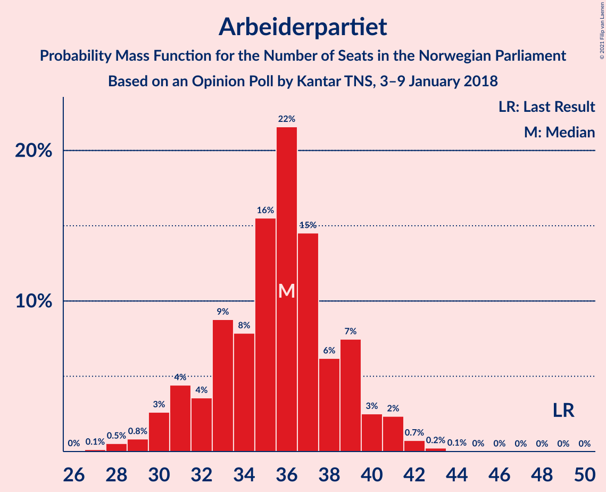
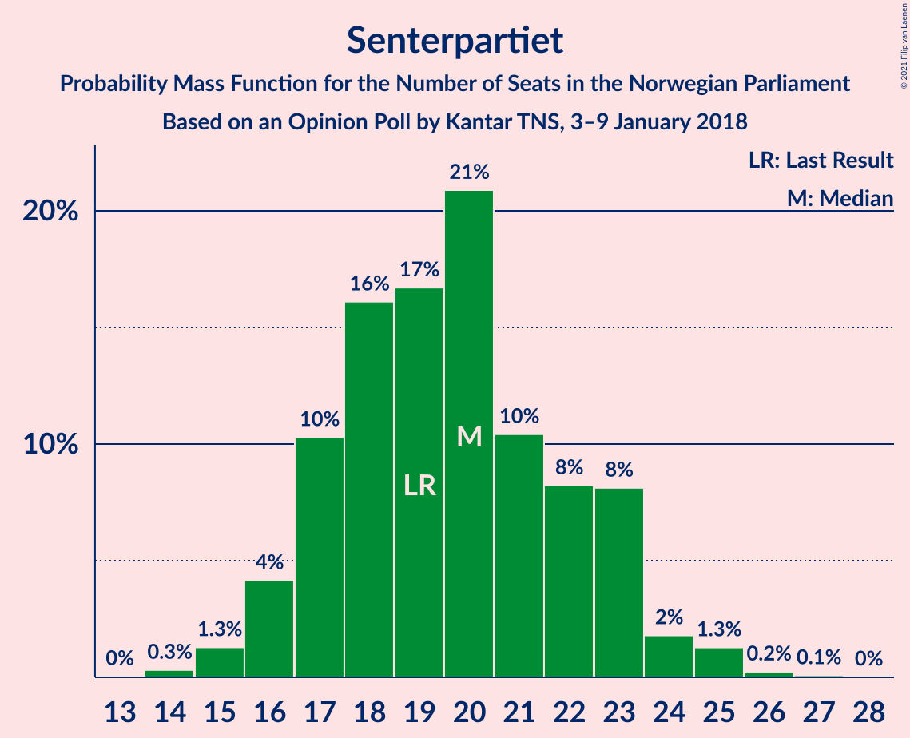
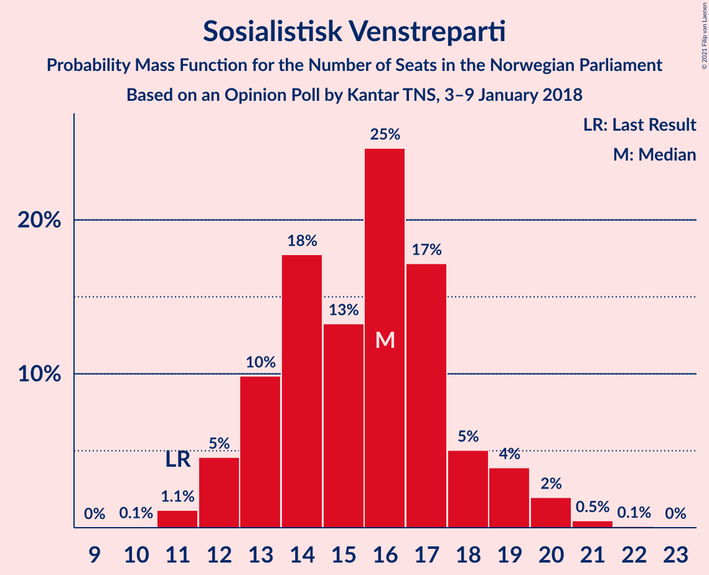
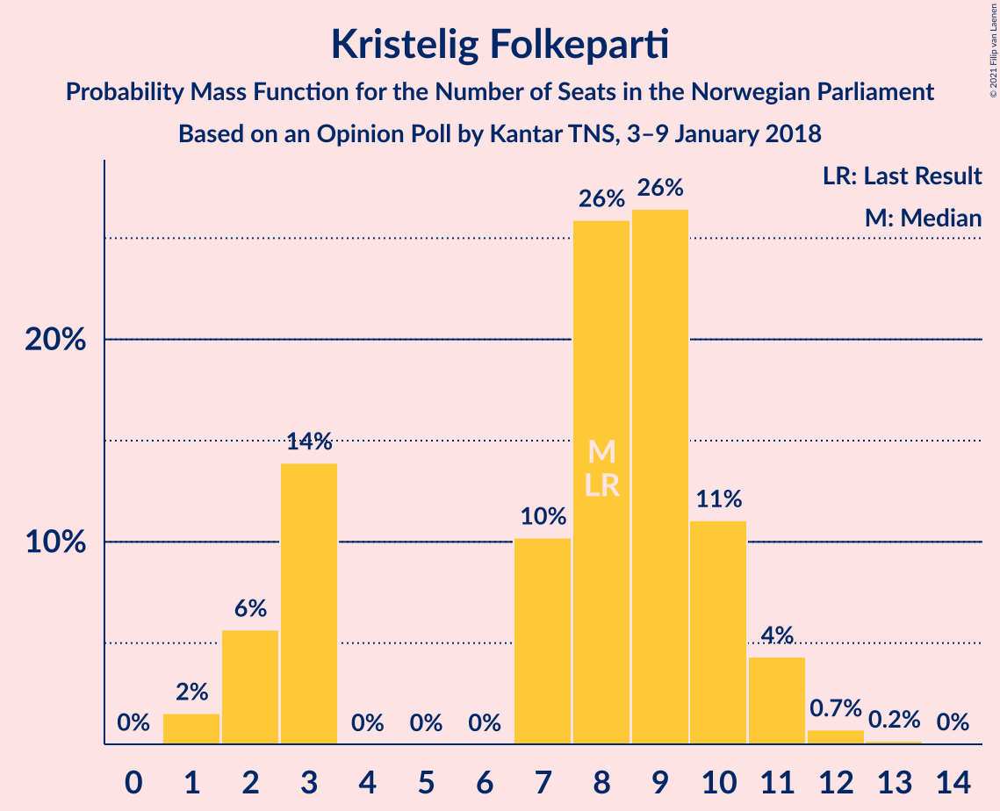
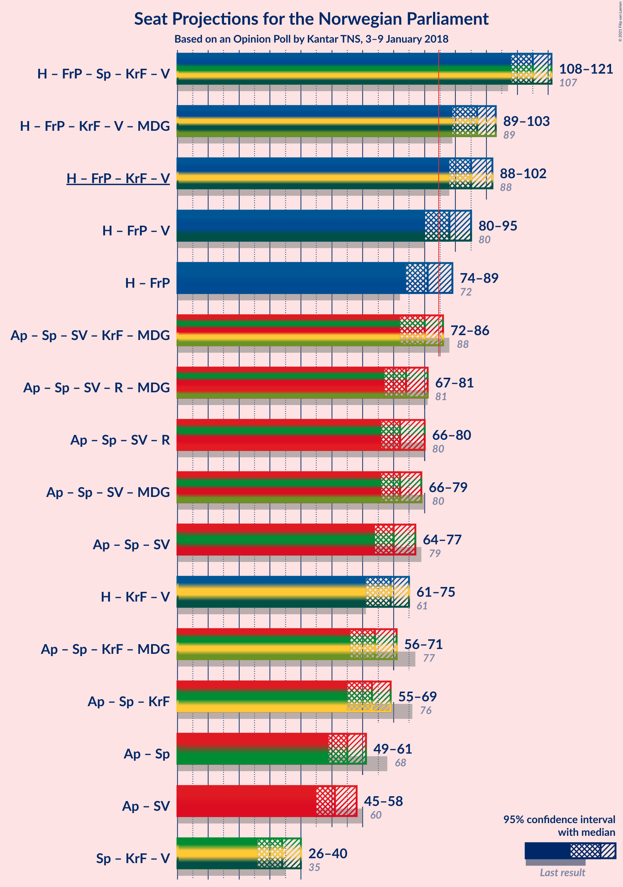
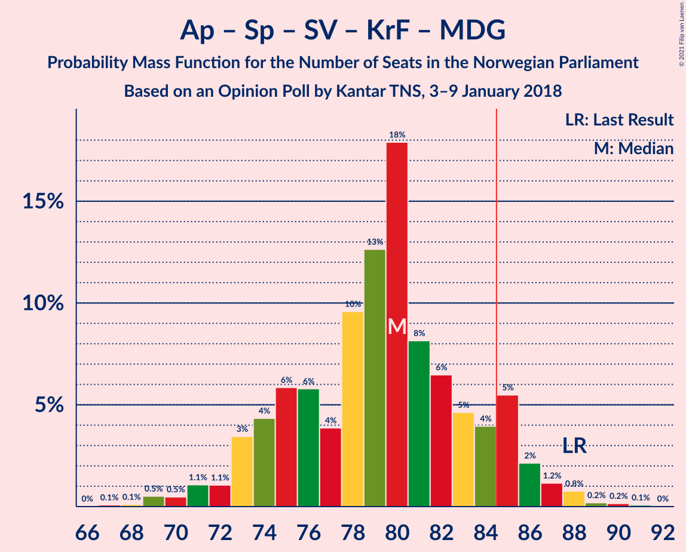
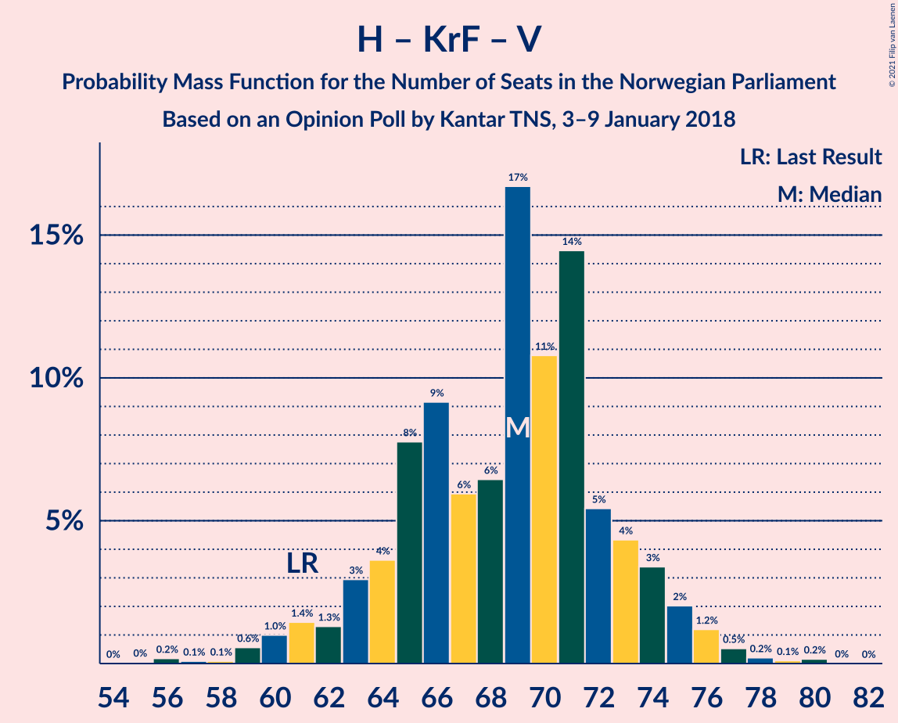
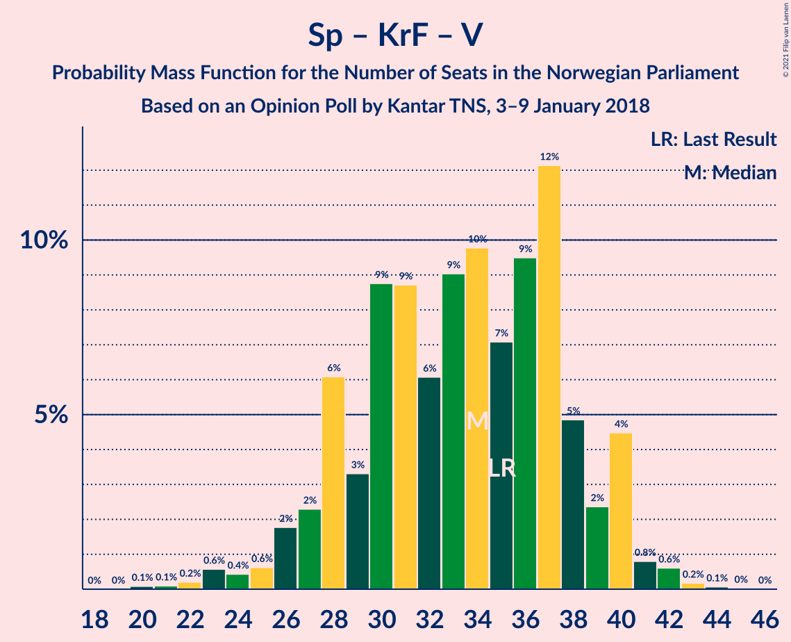

# Opinion Poll by Kantar TNS, 3–9 January 2018

<a href="#voting-intentions">Voting Intentions</a> | <a href="#seats">Seats</a> | <a href="#coalitions">Coalitions</a> | <a href="#technical-information">Technical Information</a>

## Voting Intentions

### Confidence Intervals

| Party | Last Result | Poll Result | 80% Confidence Interval | 90% Confidence Interval | 95% Confidence Interval | 99% Confidence Interval |
|:-----:|:-----------:|:-----------:|:-----------------------:|:-----------------------:|:-----------------------:|:-----------------------:|
| Høyre | 25.0% | 30.5% | 28.5–32.7% |27.9–33.3% |27.4–33.8% |26.4–34.9% |
| Arbeiderpartiet | 27.4% | 19.4% | 17.6–21.3% |17.1–21.8% |16.7–22.3% |15.9–23.2% |
| Fremskrittspartiet | 15.2% | 14.7% | 13.2–16.5% |12.8–17.0% |12.4–17.4% |11.7–18.3% |
| Senterpartiet | 10.3% | 10.9% | 9.6–12.5% |9.2–12.9% |8.9–13.3% |8.3–14.1% |
| Sosialistisk Venstreparti | 6.0% | 8.6% | 7.4–10.0% |7.1–10.4% |6.8–10.8% |6.3–11.5% |
| Kristelig Folkeparti | 4.2% | 4.5% | 3.7–5.6% |3.4–5.9% |3.2–6.2% |2.9–6.8% |
| Venstre | 4.4% | 4.4% | 3.6–5.5% |3.3–5.8% |3.1–6.0% |2.8–6.6% |
| Rødt | 2.4% | 2.9% | 2.3–3.9% |2.1–4.2% |2.0–4.4% |1.7–4.9% |
| Miljøpartiet De Grønne | 3.2% | 2.6% | 2.0–3.5% |1.8–3.7% |1.7–3.9% |1.4–4.4% |

*Note:* The poll result column reflects the actual value used in the calculations. Published results may vary slightly, and in addition be rounded to fewer digits.

## Seats

### Confidence Intervals

| Party | Last Result | Median | 80% Confidence Interval | 90% Confidence Interval | 95% Confidence Interval | 99% Confidence Interval |
|:-----:|:-----------:|:------:|:-----------------------:|:-----------------------:|:-----------------------:|:-----------------------:|
| <a href="#høyre">Høyre</a> | 45 | 55 | 51–60 |51–61 |50–61 |48–63 |
| <a href="#arbeiderpartiet">Arbeiderpartiet</a> | 49 | 36 | 33–38 |31–40 |30–40 |29–42 |
| <a href="#fremskrittspartiet">Fremskrittspartiet</a> | 27 | 26 | 24–31 |23–31 |22–31 |21–34 |
| <a href="#senterpartiet">Senterpartiet</a> | 19 | 21 | 18–23 |17–23 |16–23 |14–25 |
| <a href="#sosialistisk-venstreparti">Sosialistisk Venstreparti</a> | 11 | 13 | 13–18 |12–18 |12–18 |11–21 |
| <a href="#kristelig-folkeparti">Kristelig Folkeparti</a> | 8 | 7 | 3–10 |3–11 |2–11 |1–12 |
| <a href="#venstre">Venstre</a> | 8 | 7 | 2–10 |2–10 |2–10 |2–12 |
| <a href="#rødt">Rødt</a> | 1 | 2 | 1–2 |1–2 |1–8 |1–9 |
| <a href="#miljøpartiet-de-grønne">Miljøpartiet De Grønne</a> | 1 | 1 | 0–2 |0–2 |0–2 |0–8 |

### Høyre

*For a full overview of the results for this party, see the [Høyre](party-høyre.html) page.*

| Number of Seats | Probability | Accumulated | Special Marks |
|:---------------:|:-----------:|:-----------:|:-------------:|
| 45 | 0.1% | 100% | Last Result |
| 46 | 0.1% | 99.8% |  |
| 47 | 0.2% | 99.7% |  |
| 48 | 0.5% | 99.5% |  |
| 49 | 1.3% | 99.0% |  |
| 50 | 2% | 98% |  |
| 51 | 8% | 96% |  |
| 52 | 5% | 88% |  |
| 53 | 15% | 83% |  |
| 54 | 8% | 69% |  |
| 55 | 37% | 61% | Median |
| 56 | 5% | 23% |  |
| 57 | 2% | 18% |  |
| 58 | 2% | 16% |  |
| 59 | 2% | 14% |  |
| 60 | 3% | 12% |  |
| 61 | 8% | 9% |  |
| 62 | 0.4% | 1.0% |  |
| 63 | 0.2% | 0.6% |  |
| 64 | 0.1% | 0.4% |  |
| 65 | 0.2% | 0.3% |  |
| 66 | 0% | 0.1% |  |
| 67 | 0% | 0.1% |  |
| 68 | 0% | 0% |  |

### Arbeiderpartiet

*For a full overview of the results for this party, see the [Arbeiderpartiet](party-arbeiderpartiet.html) page.*

| Number of Seats | Probability | Accumulated | Special Marks |
|:---------------:|:-----------:|:-----------:|:-------------:|
| 27 | 0.1% | 100% |  |
| 28 | 0.4% | 99.9% |  |
| 29 | 0.6% | 99.5% |  |
| 30 | 2% | 98.9% |  |
| 31 | 3% | 97% |  |
| 32 | 2% | 94% |  |
| 33 | 10% | 92% |  |
| 34 | 13% | 82% |  |
| 35 | 8% | 69% |  |
| 36 | 41% | 61% | Median |
| 37 | 7% | 20% |  |
| 38 | 4% | 13% |  |
| 39 | 4% | 9% |  |
| 40 | 3% | 5% |  |
| 41 | 1.5% | 2% |  |
| 42 | 0.3% | 0.6% |  |
| 43 | 0.1% | 0.3% |  |
| 44 | 0.2% | 0.2% |  |
| 45 | 0% | 0% |  |
| 46 | 0% | 0% |  |
| 47 | 0% | 0% |  |
| 48 | 0% | 0% |  |
| 49 | 0% | 0% | Last Result |

### Fremskrittspartiet

*For a full overview of the results for this party, see the [Fremskrittspartiet](party-fremskrittspartiet.html) page.*

| Number of Seats | Probability | Accumulated | Special Marks |
|:---------------:|:-----------:|:-----------:|:-------------:|
| 20 | 0.1% | 100% |  |
| 21 | 0.6% | 99.9% |  |
| 22 | 2% | 99.2% |  |
| 23 | 3% | 97% |  |
| 24 | 11% | 95% |  |
| 25 | 30% | 84% |  |
| 26 | 9% | 54% | Median |
| 27 | 14% | 45% | Last Result |
| 28 | 3% | 31% |  |
| 29 | 5% | 28% |  |
| 30 | 6% | 23% |  |
| 31 | 15% | 17% |  |
| 32 | 0.7% | 2% |  |
| 33 | 0.3% | 0.9% |  |
| 34 | 0.5% | 0.7% |  |
| 35 | 0.1% | 0.2% |  |
| 36 | 0% | 0% |  |

### Senterpartiet

*For a full overview of the results for this party, see the [Senterpartiet](party-senterpartiet.html) page.*

| Number of Seats | Probability | Accumulated | Special Marks |
|:---------------:|:-----------:|:-----------:|:-------------:|
| 14 | 0.8% | 100% |  |
| 15 | 0.7% | 99.1% |  |
| 16 | 2% | 98% |  |
| 17 | 3% | 96% |  |
| 18 | 11% | 93% |  |
| 19 | 20% | 82% | Last Result |
| 20 | 10% | 62% |  |
| 21 | 11% | 51% | Median |
| 22 | 10% | 40% |  |
| 23 | 28% | 30% |  |
| 24 | 0.4% | 2% |  |
| 25 | 1.3% | 2% |  |
| 26 | 0.2% | 0.4% |  |
| 27 | 0.1% | 0.2% |  |
| 28 | 0.2% | 0.2% |  |
| 29 | 0% | 0% |  |

### Sosialistisk Venstreparti

*For a full overview of the results for this party, see the [Sosialistisk Venstreparti](party-sosialistiskvenstreparti.html) page.*

| Number of Seats | Probability | Accumulated | Special Marks |
|:---------------:|:-----------:|:-----------:|:-------------:|
| 10 | 0.1% | 100% |  |
| 11 | 1.0% | 99.9% | Last Result |
| 12 | 4% | 98.9% |  |
| 13 | 45% | 95% | Median |
| 14 | 12% | 50% |  |
| 15 | 2% | 38% |  |
| 16 | 11% | 36% |  |
| 17 | 13% | 25% |  |
| 18 | 11% | 12% |  |
| 19 | 0.6% | 2% |  |
| 20 | 0.2% | 1.1% |  |
| 21 | 0.8% | 0.9% |  |
| 22 | 0% | 0.1% |  |
| 23 | 0% | 0% |  |

### Kristelig Folkeparti

*For a full overview of the results for this party, see the [Kristelig Folkeparti](party-kristeligfolkeparti.html) page.*

| Number of Seats | Probability | Accumulated | Special Marks |
|:---------------:|:-----------:|:-----------:|:-------------:|
| 1 | 2% | 100% |  |
| 2 | 2% | 98% |  |
| 3 | 23% | 97% |  |
| 4 | 0% | 73% |  |
| 5 | 0% | 73% |  |
| 6 | 0% | 73% |  |
| 7 | 26% | 73% | Median |
| 8 | 11% | 47% | Last Result |
| 9 | 21% | 36% |  |
| 10 | 8% | 15% |  |
| 11 | 6% | 7% |  |
| 12 | 0.4% | 0.7% |  |
| 13 | 0.2% | 0.3% |  |
| 14 | 0% | 0% |  |

### Venstre

*For a full overview of the results for this party, see the [Venstre](party-venstre.html) page.*

| Number of Seats | Probability | Accumulated | Special Marks |
|:---------------:|:-----------:|:-----------:|:-------------:|
| 2 | 19% | 100% |  |
| 3 | 1.0% | 81% |  |
| 4 | 0% | 80% |  |
| 5 | 0% | 80% |  |
| 6 | 0% | 80% |  |
| 7 | 40% | 80% | Median |
| 8 | 20% | 40% | Last Result |
| 9 | 8% | 20% |  |
| 10 | 11% | 13% |  |
| 11 | 0.8% | 2% |  |
| 12 | 0.8% | 1.2% |  |
| 13 | 0.4% | 0.4% |  |
| 14 | 0% | 0% |  |

### Rødt

*For a full overview of the results for this party, see the [Rødt](party-rødt.html) page.*

| Number of Seats | Probability | Accumulated | Special Marks |
|:---------------:|:-----------:|:-----------:|:-------------:|
| 1 | 25% | 100% | Last Result |
| 2 | 70% | 75% | Median |
| 3 | 0% | 4% |  |
| 4 | 0% | 4% |  |
| 5 | 0% | 4% |  |
| 6 | 0% | 4% |  |
| 7 | 1.2% | 4% |  |
| 8 | 2% | 3% |  |
| 9 | 0.3% | 0.6% |  |
| 10 | 0.2% | 0.2% |  |
| 11 | 0% | 0% |  |

### Miljøpartiet De Grønne

*For a full overview of the results for this party, see the [Miljøpartiet De Grønne](party-miljøpartietdegrønne.html) page.*

| Number of Seats | Probability | Accumulated | Special Marks |
|:---------------:|:-----------:|:-----------:|:-------------:|
| 0 | 12% | 100% |  |
| 1 | 73% | 88% | Last Result, Median |
| 2 | 14% | 15% |  |
| 3 | 0% | 0.8% |  |
| 4 | 0% | 0.7% |  |
| 5 | 0% | 0.7% |  |
| 6 | 0% | 0.7% |  |
| 7 | 0.2% | 0.7% |  |
| 8 | 0.3% | 0.6% |  |
| 9 | 0.2% | 0.2% |  |
| 10 | 0% | 0% |  |

## Coalitions

### Confidence Intervals

| Coalition | Last Result | Median | Majority? | 80% Confidence Interval | 90% Confidence Interval | 95% Confidence Interval | 99% Confidence Interval |
|:---------:|:-----------:|:------:|:---------:|:-----------------------:|:-----------------------:|:-----------------------:|:-----------------------:|
| Høyre – Fremskrittspartiet – Senterpartiet – Kristelig Folkeparti – Venstre | 107 | 117 | 100% | 112–119 | 110–119 | 109–120 | 106–123 |
| Høyre – Fremskrittspartiet – Kristelig Folkeparti – Venstre – Miljøpartiet De Grønne | 89 | 97 | 99.7% | 93–99 | 91–101 | 90–102 | 87–104 |
| Høyre – Fremskrittspartiet – Kristelig Folkeparti – Venstre | 88 | 95 | 99.6% | 92–98 | 91–100 | 89–101 | 86–103 |
| Høyre – Fremskrittspartiet – Venstre | 80 | 87 | 93% | 85–94 | 83–94 | 81–95 | 79–99 |
| Høyre – Fremskrittspartiet | 72 | 80 | 18% | 77–87 | 76–92 | 75–92 | 72–92 |
| Arbeiderpartiet – Senterpartiet – Sosialistisk Venstreparti – Kristelig Folkeparti – Miljøpartiet De Grønne | 88 | 80 | 3% | 73–82 | 73–83 | 72–85 | 68–87 |
| Arbeiderpartiet – Senterpartiet – Sosialistisk Venstreparti – Rødt – Miljøpartiet De Grønne | 81 | 74 | 0.4% | 71–77 | 69–78 | 68–80 | 66–83 |
| Arbeiderpartiet – Senterpartiet – Sosialistisk Venstreparti – Rødt | 80 | 72 | 0.3% | 70–76 | 68–78 | 67–79 | 65–82 |
| Arbeiderpartiet – Senterpartiet – Sosialistisk Venstreparti – Miljøpartiet De Grønne | 80 | 72 | 0% | 69–75 | 67–76 | 66–78 | 64–80 |
| Arbeiderpartiet – Senterpartiet – Sosialistisk Venstreparti | 79 | 71 | 0% | 68–74 | 66–75 | 65–76 | 62–78 |
| Høyre – Kristelig Folkeparti – Venstre | 61 | 69 | 0% | 64–72 | 63–73 | 62–74 | 56–77 |
| Arbeiderpartiet – Senterpartiet – Kristelig Folkeparti – Miljøpartiet De Grønne | 77 | 65 | 0% | 59–68 | 58–68 | 56–70 | 54–73 |
| Arbeiderpartiet – Senterpartiet – Kristelig Folkeparti | 76 | 64 | 0% | 57–67 | 57–67 | 55–68 | 53–71 |
| Arbeiderpartiet – Senterpartiet | 68 | 55 | 0% | 52–59 | 51–60 | 49–61 | 47–63 |
| Arbeiderpartiet – Sosialistisk Venstreparti | 60 | 49 | 0% | 47–54 | 47–56 | 45–56 | 43–58 |
| Senterpartiet – Kristelig Folkeparti – Venstre | 35 | 35 | 0% | 27–38 | 27–39 | 27–40 | 24–42 |

### Høyre – Fremskrittspartiet – Senterpartiet – Kristelig Folkeparti – Venstre

| Number of Seats | Probability | Accumulated | Special Marks |
|:---------------:|:-----------:|:-----------:|:-------------:|
| 103 | 0% | 100% |  |
| 104 | 0.3% | 99.9% |  |
| 105 | 0.1% | 99.6% |  |
| 106 | 0.1% | 99.5% |  |
| 107 | 0.8% | 99.4% | Last Result |
| 108 | 0.7% | 98.6% |  |
| 109 | 2% | 98% |  |
| 110 | 2% | 96% |  |
| 111 | 4% | 95% |  |
| 112 | 2% | 91% |  |
| 113 | 4% | 89% |  |
| 114 | 5% | 85% |  |
| 115 | 18% | 81% |  |
| 116 | 6% | 62% | Median |
| 117 | 40% | 56% |  |
| 118 | 2% | 16% |  |
| 119 | 10% | 14% |  |
| 120 | 2% | 4% |  |
| 121 | 0.9% | 2% |  |
| 122 | 0.3% | 1.4% |  |
| 123 | 0.9% | 1.2% |  |
| 124 | 0.2% | 0.3% |  |
| 125 | 0% | 0.1% |  |
| 126 | 0% | 0% |  |

### Høyre – Fremskrittspartiet – Kristelig Folkeparti – Venstre – Miljøpartiet De Grønne

| Number of Seats | Probability | Accumulated | Special Marks |
|:---------------:|:-----------:|:-----------:|:-------------:|
| 84 | 0.3% | 100% |  |
| 85 | 0% | 99.7% | Majority |
| 86 | 0% | 99.6% |  |
| 87 | 0.1% | 99.6% |  |
| 88 | 0.8% | 99.4% |  |
| 89 | 0.8% | 98.6% | Last Result |
| 90 | 1.0% | 98% |  |
| 91 | 2% | 97% |  |
| 92 | 1.4% | 95% |  |
| 93 | 3% | 93% |  |
| 94 | 4% | 90% |  |
| 95 | 27% | 86% |  |
| 96 | 8% | 59% | Median |
| 97 | 18% | 51% |  |
| 98 | 11% | 33% |  |
| 99 | 14% | 22% |  |
| 100 | 3% | 8% |  |
| 101 | 2% | 6% |  |
| 102 | 2% | 4% |  |
| 103 | 1.4% | 2% |  |
| 104 | 0.5% | 0.7% |  |
| 105 | 0.1% | 0.2% |  |
| 106 | 0% | 0.1% |  |
| 107 | 0% | 0.1% |  |
| 108 | 0% | 0.1% |  |
| 109 | 0% | 0% |  |

### Høyre – Fremskrittspartiet – Kristelig Folkeparti – Venstre

| Number of Seats | Probability | Accumulated | Special Marks |
|:---------------:|:-----------:|:-----------:|:-------------:|
| 82 | 0.3% | 100% |  |
| 83 | 0.1% | 99.7% |  |
| 84 | 0.1% | 99.7% |  |
| 85 | 0.1% | 99.6% | Majority |
| 86 | 0.2% | 99.5% |  |
| 87 | 1.0% | 99.3% |  |
| 88 | 0.7% | 98% | Last Result |
| 89 | 1.1% | 98% |  |
| 90 | 1.1% | 96% |  |
| 91 | 2% | 95% |  |
| 92 | 4% | 93% |  |
| 93 | 5% | 89% |  |
| 94 | 26% | 85% |  |
| 95 | 14% | 59% | Median |
| 96 | 11% | 45% |  |
| 97 | 14% | 35% |  |
| 98 | 13% | 21% |  |
| 99 | 2% | 8% |  |
| 100 | 3% | 6% |  |
| 101 | 2% | 4% |  |
| 102 | 1.1% | 2% |  |
| 103 | 0.6% | 0.8% |  |
| 104 | 0% | 0.2% |  |
| 105 | 0% | 0.1% |  |
| 106 | 0% | 0.1% |  |
| 107 | 0% | 0.1% |  |
| 108 | 0% | 0% |  |

### Høyre – Fremskrittspartiet – Venstre

| Number of Seats | Probability | Accumulated | Special Marks |
|:---------------:|:-----------:|:-----------:|:-------------:|
| 77 | 0.1% | 100% |  |
| 78 | 0.1% | 99.8% |  |
| 79 | 1.1% | 99.7% |  |
| 80 | 0.4% | 98.6% | Last Result |
| 81 | 1.0% | 98% |  |
| 82 | 0.8% | 97% |  |
| 83 | 2% | 96% |  |
| 84 | 2% | 95% |  |
| 85 | 6% | 93% | Majority |
| 86 | 7% | 87% |  |
| 87 | 33% | 80% |  |
| 88 | 5% | 47% | Median |
| 89 | 15% | 42% |  |
| 90 | 3% | 27% |  |
| 91 | 1.4% | 24% |  |
| 92 | 9% | 22% |  |
| 93 | 2% | 13% |  |
| 94 | 9% | 12% |  |
| 95 | 0.9% | 3% |  |
| 96 | 0.2% | 2% |  |
| 97 | 0.4% | 2% |  |
| 98 | 0.2% | 1.3% |  |
| 99 | 1.1% | 1.2% |  |
| 100 | 0.1% | 0.1% |  |
| 101 | 0% | 0% |  |

### Høyre – Fremskrittspartiet

| Number of Seats | Probability | Accumulated | Special Marks |
|:---------------:|:-----------:|:-----------:|:-------------:|
| 69 | 0% | 100% |  |
| 70 | 0.1% | 99.9% |  |
| 71 | 0% | 99.9% |  |
| 72 | 0.8% | 99.8% | Last Result |
| 73 | 0.6% | 99.0% |  |
| 74 | 0.6% | 98% |  |
| 75 | 2% | 98% |  |
| 76 | 4% | 96% |  |
| 77 | 7% | 92% |  |
| 78 | 7% | 85% |  |
| 79 | 3% | 78% |  |
| 80 | 25% | 75% |  |
| 81 | 4% | 50% | Median |
| 82 | 16% | 46% |  |
| 83 | 3% | 30% |  |
| 84 | 9% | 27% |  |
| 85 | 3% | 18% | Majority |
| 86 | 4% | 15% |  |
| 87 | 2% | 12% |  |
| 88 | 0.2% | 10% |  |
| 89 | 1.3% | 10% |  |
| 90 | 0.4% | 8% |  |
| 91 | 0.3% | 8% |  |
| 92 | 8% | 8% |  |
| 93 | 0.1% | 0.2% |  |
| 94 | 0% | 0.1% |  |
| 95 | 0% | 0.1% |  |
| 96 | 0% | 0% |  |

### Arbeiderpartiet – Senterpartiet – Sosialistisk Venstreparti – Kristelig Folkeparti – Miljøpartiet De Grønne

| Number of Seats | Probability | Accumulated | Special Marks |
|:---------------:|:-----------:|:-----------:|:-------------:|
| 67 | 0.2% | 100% |  |
| 68 | 0.3% | 99.7% |  |
| 69 | 1.1% | 99.4% |  |
| 70 | 0.1% | 98% |  |
| 71 | 0.4% | 98% |  |
| 72 | 1.4% | 98% |  |
| 73 | 8% | 96% |  |
| 74 | 1.4% | 88% |  |
| 75 | 9% | 87% |  |
| 76 | 3% | 78% |  |
| 77 | 2% | 75% |  |
| 78 | 14% | 73% | Median |
| 79 | 4% | 59% |  |
| 80 | 34% | 55% |  |
| 81 | 7% | 21% |  |
| 82 | 4% | 14% |  |
| 83 | 5% | 9% |  |
| 84 | 1.3% | 5% |  |
| 85 | 2% | 3% | Majority |
| 86 | 0.7% | 2% |  |
| 87 | 0.7% | 1.2% |  |
| 88 | 0.2% | 0.5% | Last Result |
| 89 | 0.2% | 0.3% |  |
| 90 | 0% | 0.1% |  |
| 91 | 0.1% | 0.1% |  |
| 92 | 0% | 0% |  |

### Arbeiderpartiet – Senterpartiet – Sosialistisk Venstreparti – Rødt – Miljøpartiet De Grønne

| Number of Seats | Probability | Accumulated | Special Marks |
|:---------------:|:-----------:|:-----------:|:-------------:|
| 62 | 0% | 100% |  |
| 63 | 0% | 99.9% |  |
| 64 | 0% | 99.9% |  |
| 65 | 0% | 99.9% |  |
| 66 | 0.6% | 99.8% |  |
| 67 | 1.1% | 99.2% |  |
| 68 | 2% | 98% |  |
| 69 | 3% | 96% |  |
| 70 | 2% | 94% |  |
| 71 | 13% | 92% |  |
| 72 | 14% | 79% |  |
| 73 | 11% | 65% | Median |
| 74 | 14% | 55% |  |
| 75 | 26% | 41% |  |
| 76 | 5% | 15% |  |
| 77 | 4% | 11% |  |
| 78 | 2% | 7% |  |
| 79 | 1.1% | 5% |  |
| 80 | 1.1% | 4% |  |
| 81 | 0.7% | 2% | Last Result |
| 82 | 1.0% | 2% |  |
| 83 | 0.2% | 0.7% |  |
| 84 | 0.1% | 0.5% |  |
| 85 | 0.1% | 0.4% | Majority |
| 86 | 0.1% | 0.3% |  |
| 87 | 0.3% | 0.3% |  |
| 88 | 0% | 0% |  |

### Arbeiderpartiet – Senterpartiet – Sosialistisk Venstreparti – Rødt

| Number of Seats | Probability | Accumulated | Special Marks |
|:---------------:|:-----------:|:-----------:|:-------------:|
| 61 | 0% | 100% |  |
| 62 | 0% | 99.9% |  |
| 63 | 0% | 99.9% |  |
| 64 | 0.1% | 99.9% |  |
| 65 | 0.5% | 99.8% |  |
| 66 | 1.4% | 99.3% |  |
| 67 | 2% | 98% |  |
| 68 | 2% | 96% |  |
| 69 | 3% | 94% |  |
| 70 | 14% | 92% |  |
| 71 | 11% | 78% |  |
| 72 | 18% | 67% | Median |
| 73 | 8% | 49% |  |
| 74 | 27% | 41% |  |
| 75 | 4% | 14% |  |
| 76 | 3% | 10% |  |
| 77 | 1.4% | 7% |  |
| 78 | 2% | 5% |  |
| 79 | 1.0% | 3% |  |
| 80 | 0.8% | 2% | Last Result |
| 81 | 0.8% | 1.4% |  |
| 82 | 0.1% | 0.6% |  |
| 83 | 0% | 0.4% |  |
| 84 | 0% | 0.4% |  |
| 85 | 0.3% | 0.3% | Majority |
| 86 | 0% | 0% |  |

### Arbeiderpartiet – Senterpartiet – Sosialistisk Venstreparti – Miljøpartiet De Grønne

| Number of Seats | Probability | Accumulated | Special Marks |
|:---------------:|:-----------:|:-----------:|:-------------:|
| 60 | 0.1% | 100% |  |
| 61 | 0% | 99.9% |  |
| 62 | 0% | 99.9% |  |
| 63 | 0% | 99.8% |  |
| 64 | 0.8% | 99.8% |  |
| 65 | 0.5% | 98.9% |  |
| 66 | 2% | 98% |  |
| 67 | 3% | 97% |  |
| 68 | 3% | 94% |  |
| 69 | 14% | 92% |  |
| 70 | 13% | 78% |  |
| 71 | 5% | 65% | Median |
| 72 | 18% | 60% |  |
| 73 | 28% | 42% |  |
| 74 | 2% | 13% |  |
| 75 | 4% | 11% |  |
| 76 | 4% | 8% |  |
| 77 | 0.7% | 4% |  |
| 78 | 1.3% | 3% |  |
| 79 | 0.8% | 2% |  |
| 80 | 0.4% | 0.8% | Last Result |
| 81 | 0.2% | 0.4% |  |
| 82 | 0% | 0.2% |  |
| 83 | 0% | 0.1% |  |
| 84 | 0.1% | 0.1% |  |
| 85 | 0% | 0% | Majority |

### Arbeiderpartiet – Senterpartiet – Sosialistisk Venstreparti

| Number of Seats | Probability | Accumulated | Special Marks |
|:---------------:|:-----------:|:-----------:|:-------------:|
| 58 | 0.1% | 100% |  |
| 59 | 0% | 99.9% |  |
| 60 | 0% | 99.9% |  |
| 61 | 0.1% | 99.9% |  |
| 62 | 0.4% | 99.8% |  |
| 63 | 0.5% | 99.4% |  |
| 64 | 0.6% | 98.9% |  |
| 65 | 2% | 98% |  |
| 66 | 3% | 97% |  |
| 67 | 2% | 94% |  |
| 68 | 15% | 92% |  |
| 69 | 10% | 77% |  |
| 70 | 13% | 67% | Median |
| 71 | 12% | 54% |  |
| 72 | 28% | 42% |  |
| 73 | 3% | 13% |  |
| 74 | 3% | 11% |  |
| 75 | 3% | 8% |  |
| 76 | 2% | 5% |  |
| 77 | 1.1% | 2% |  |
| 78 | 0.7% | 1.2% |  |
| 79 | 0.1% | 0.5% | Last Result |
| 80 | 0.3% | 0.4% |  |
| 81 | 0% | 0.1% |  |
| 82 | 0% | 0.1% |  |
| 83 | 0.1% | 0.1% |  |
| 84 | 0% | 0% |  |

### Høyre – Kristelig Folkeparti – Venstre

| Number of Seats | Probability | Accumulated | Special Marks |
|:---------------:|:-----------:|:-----------:|:-------------:|
| 55 | 0.3% | 100% |  |
| 56 | 0.3% | 99.7% |  |
| 57 | 0.1% | 99.4% |  |
| 58 | 0% | 99.3% |  |
| 59 | 0.7% | 99.3% |  |
| 60 | 0.1% | 98.5% |  |
| 61 | 0.6% | 98% | Last Result |
| 62 | 3% | 98% |  |
| 63 | 0.6% | 95% |  |
| 64 | 9% | 94% |  |
| 65 | 2% | 86% |  |
| 66 | 13% | 83% |  |
| 67 | 1.3% | 71% |  |
| 68 | 3% | 69% |  |
| 69 | 27% | 66% | Median |
| 70 | 4% | 39% |  |
| 71 | 23% | 35% |  |
| 72 | 6% | 12% |  |
| 73 | 2% | 5% |  |
| 74 | 1.2% | 3% |  |
| 75 | 0.2% | 2% |  |
| 76 | 0.3% | 2% |  |
| 77 | 1.4% | 2% |  |
| 78 | 0% | 0.2% |  |
| 79 | 0.1% | 0.1% |  |
| 80 | 0.1% | 0.1% |  |
| 81 | 0% | 0% |  |

### Arbeiderpartiet – Senterpartiet – Kristelig Folkeparti – Miljøpartiet De Grønne

| Number of Seats | Probability | Accumulated | Special Marks |
|:---------------:|:-----------:|:-----------:|:-------------:|
| 51 | 0.2% | 100% |  |
| 52 | 0% | 99.8% |  |
| 53 | 0.1% | 99.7% |  |
| 54 | 0.1% | 99.6% |  |
| 55 | 0.6% | 99.5% |  |
| 56 | 2% | 98.9% |  |
| 57 | 0.8% | 97% |  |
| 58 | 2% | 96% |  |
| 59 | 16% | 95% |  |
| 60 | 2% | 79% |  |
| 61 | 4% | 77% |  |
| 62 | 6% | 73% |  |
| 63 | 6% | 67% |  |
| 64 | 3% | 61% |  |
| 65 | 16% | 58% | Median |
| 66 | 6% | 42% |  |
| 67 | 26% | 36% |  |
| 68 | 6% | 10% |  |
| 69 | 1.3% | 4% |  |
| 70 | 1.4% | 3% |  |
| 71 | 0.7% | 2% |  |
| 72 | 0.3% | 0.9% |  |
| 73 | 0.2% | 0.5% |  |
| 74 | 0.3% | 0.4% |  |
| 75 | 0.1% | 0.1% |  |
| 76 | 0% | 0% |  |
| 77 | 0% | 0% | Last Result |

### Arbeiderpartiet – Senterpartiet – Kristelig Folkeparti

| Number of Seats | Probability | Accumulated | Special Marks |
|:---------------:|:-----------:|:-----------:|:-------------:|
| 51 | 0.3% | 100% |  |
| 52 | 0.2% | 99.7% |  |
| 53 | 0.1% | 99.5% |  |
| 54 | 0.9% | 99.4% |  |
| 55 | 2% | 98.6% |  |
| 56 | 0.4% | 97% |  |
| 57 | 8% | 96% |  |
| 58 | 10% | 89% |  |
| 59 | 2% | 79% |  |
| 60 | 3% | 77% |  |
| 61 | 4% | 74% |  |
| 62 | 9% | 70% |  |
| 63 | 4% | 61% |  |
| 64 | 16% | 58% | Median |
| 65 | 5% | 41% |  |
| 66 | 27% | 37% |  |
| 67 | 6% | 10% |  |
| 68 | 2% | 4% |  |
| 69 | 0.6% | 2% |  |
| 70 | 0.6% | 1.3% |  |
| 71 | 0.3% | 0.7% |  |
| 72 | 0.4% | 0.5% |  |
| 73 | 0.1% | 0.1% |  |
| 74 | 0% | 0% |  |
| 75 | 0% | 0% |  |
| 76 | 0% | 0% | Last Result |

### Arbeiderpartiet – Senterpartiet

| Number of Seats | Probability | Accumulated | Special Marks |
|:---------------:|:-----------:|:-----------:|:-------------:|
| 45 | 0.1% | 100% |  |
| 46 | 0% | 99.9% |  |
| 47 | 0.5% | 99.9% |  |
| 48 | 0.4% | 99.4% |  |
| 49 | 2% | 99.0% |  |
| 50 | 2% | 97% |  |
| 51 | 2% | 95% |  |
| 52 | 6% | 93% |  |
| 53 | 3% | 87% |  |
| 54 | 16% | 85% |  |
| 55 | 22% | 69% |  |
| 56 | 3% | 47% |  |
| 57 | 6% | 44% | Median |
| 58 | 7% | 39% |  |
| 59 | 27% | 32% |  |
| 60 | 1.3% | 5% |  |
| 61 | 2% | 4% |  |
| 62 | 0.5% | 2% |  |
| 63 | 1.0% | 1.4% |  |
| 64 | 0.2% | 0.4% |  |
| 65 | 0% | 0.2% |  |
| 66 | 0.1% | 0.2% |  |
| 67 | 0% | 0.1% |  |
| 68 | 0.1% | 0.1% | Last Result |
| 69 | 0% | 0% |  |

### Arbeiderpartiet – Sosialistisk Venstreparti

| Number of Seats | Probability | Accumulated | Special Marks |
|:---------------:|:-----------:|:-----------:|:-------------:|
| 40 | 0% | 100% |  |
| 41 | 0.1% | 99.9% |  |
| 42 | 0.3% | 99.9% |  |
| 43 | 0.3% | 99.6% |  |
| 44 | 1.5% | 99.3% |  |
| 45 | 1.2% | 98% |  |
| 46 | 1.0% | 97% |  |
| 47 | 9% | 96% |  |
| 48 | 4% | 86% |  |
| 49 | 39% | 82% | Median |
| 50 | 12% | 43% |  |
| 51 | 4% | 31% |  |
| 52 | 11% | 27% |  |
| 53 | 4% | 16% |  |
| 54 | 4% | 12% |  |
| 55 | 2% | 8% |  |
| 56 | 4% | 6% |  |
| 57 | 0.2% | 2% |  |
| 58 | 1.2% | 2% |  |
| 59 | 0.1% | 0.3% |  |
| 60 | 0.1% | 0.2% | Last Result |
| 61 | 0.1% | 0.1% |  |
| 62 | 0% | 0% |  |

### Senterpartiet – Kristelig Folkeparti – Venstre

| Number of Seats | Probability | Accumulated | Special Marks |
|:---------------:|:-----------:|:-----------:|:-------------:|
| 21 | 0.1% | 100% |  |
| 22 | 0.1% | 99.9% |  |
| 23 | 0.2% | 99.8% |  |
| 24 | 0.3% | 99.6% |  |
| 25 | 0.9% | 99.4% |  |
| 26 | 0.2% | 98% |  |
| 27 | 8% | 98% |  |
| 28 | 2% | 90% |  |
| 29 | 4% | 88% |  |
| 30 | 4% | 84% |  |
| 31 | 7% | 80% |  |
| 32 | 3% | 72% |  |
| 33 | 3% | 69% |  |
| 34 | 5% | 66% |  |
| 35 | 14% | 61% | Last Result, Median |
| 36 | 3% | 48% |  |
| 37 | 28% | 45% |  |
| 38 | 10% | 17% |  |
| 39 | 4% | 7% |  |
| 40 | 2% | 3% |  |
| 41 | 0.3% | 0.8% |  |
| 42 | 0.1% | 0.5% |  |
| 43 | 0.2% | 0.4% |  |
| 44 | 0.2% | 0.2% |  |
| 45 | 0% | 0% |  |

## Technical Information

### Opinion Poll

+ **Polling firm:** Kantar TNS
+ **Commissioner(s):** —
+ **Fieldwork period:** 3–9 January 2018

### Calculations

+ **Sample size:** 780
+ **Simulations done:** 131,072
+ **Error estimate:** 2.65%

