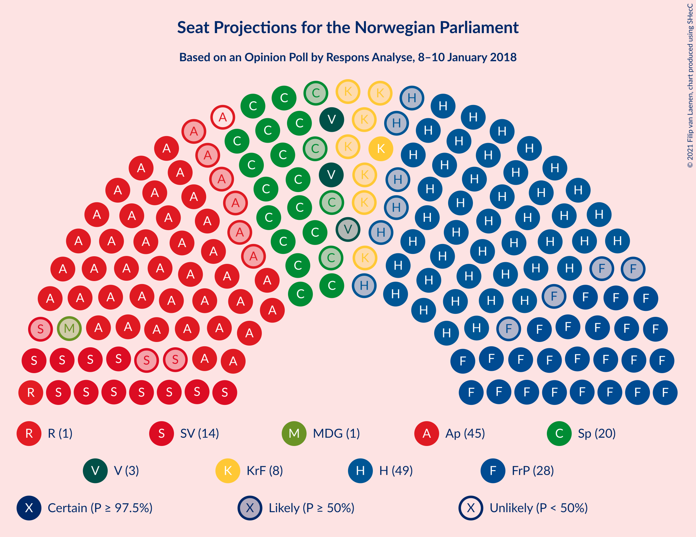
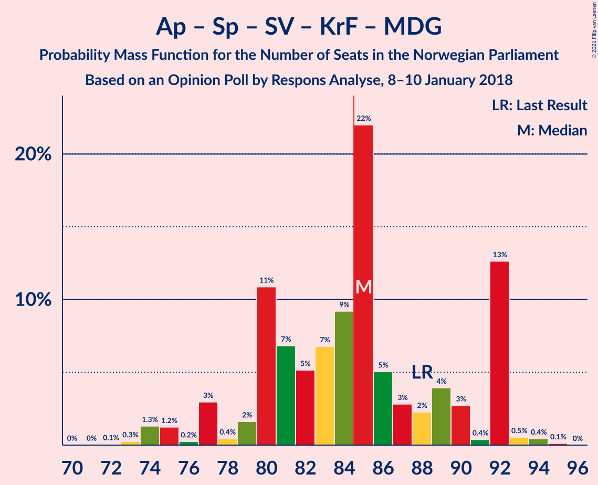

# Opinion Poll by Respons Analyse, 8–10 January 2018

<a href="#voting-intentions">Voting Intentions</a> | <a href="#seats">Seats</a> | <a href="#coalitions">Coalitions</a> | <a href="#technical-information">Technical Information</a>

## Voting Intentions

### Confidence Intervals

| Party | Last Result | Poll Result | 80% Confidence Interval | 90% Confidence Interval | 95% Confidence Interval | 99% Confidence Interval |
|:-----:|:-----------:|:-----------:|:-----------------------:|:-----------------------:|:-----------------------:|:-----------------------:|
| Høyre | 25.0% | 27.2% | 25.2–29.2% |24.7–29.8% |24.2–30.3% |23.3–31.4% |
| Arbeiderpartiet | 27.4% | 23.1% | 21.3–25.1% |20.7–25.6% |20.3–26.1% |19.5–27.1% |
| Fremskrittspartiet | 15.2% | 15.6% | 14.0–17.3% |13.6–17.8% |13.2–18.2% |12.5–19.1% |
| Senterpartiet | 10.3% | 10.7% | 9.4–12.3% |9.1–12.7% |8.8–13.1% |8.2–13.8% |
| Sosialistisk Venstreparti | 6.0% | 7.7% | 6.6–9.0% |6.3–9.4% |6.0–9.7% |5.5–10.4% |
| Venstre | 4.4% | 4.1% | 3.3–5.1% |3.1–5.4% |2.9–5.7% |2.6–6.2% |
| Kristelig Folkeparti | 4.2% | 4.1% | 3.3–5.1% |3.1–5.4% |2.9–5.7% |2.6–6.2% |
| Rødt | 2.4% | 2.7% | 2.1–3.6% |1.9–3.9% |1.8–4.1% |1.5–4.6% |
| Miljøpartiet De Grønne | 3.2% | 2.7% | 2.1–3.6% |1.9–3.9% |1.8–4.1% |1.5–4.6% |

*Note:* The poll result column reflects the actual value used in the calculations. Published results may vary slightly, and in addition be rounded to fewer digits.

## Seats

### Confidence Intervals

| Party | Last Result | Median | 80% Confidence Interval | 90% Confidence Interval | 95% Confidence Interval | 99% Confidence Interval |
|:-----:|:-----------:|:------:|:-----------------------:|:-----------------------:|:-----------------------:|:-----------------------:|
| <a href="#høyre">Høyre</a> | 45 | 49 | 44–52 |43–55 |43–58 |42–60 |
| <a href="#arbeiderpartiet">Arbeiderpartiet</a> | 49 | 44 | 40–46 |39–47 |38–48 |35–49 |
| <a href="#fremskrittspartiet">Fremskrittspartiet</a> | 27 | 28 | 25–32 |25–33 |24–33 |22–35 |
| <a href="#senterpartiet">Senterpartiet</a> | 19 | 20 | 17–22 |17–22 |16–23 |15–26 |
| <a href="#sosialistisk-venstreparti">Sosialistisk Venstreparti</a> | 11 | 14 | 12–17 |11–18 |11–19 |10–19 |
| <a href="#venstre">Venstre</a> | 8 | 3 | 2–9 |2–10 |2–10 |2–12 |
| <a href="#kristelig-folkeparti">Kristelig Folkeparti</a> | 8 | 8 | 2–9 |2–10 |1–11 |1–11 |
| <a href="#rødt">Rødt</a> | 1 | 1 | 1–2 |1–7 |1–7 |1–8 |
| <a href="#miljøpartiet-de-grønne">Miljøpartiet De Grønne</a> | 1 | 1 | 1–2 |0–2 |0–2 |0–8 |

### Høyre

*For a full overview of the results for this party, see the [Høyre](party-høyre.html) page.*

| Number of Seats | Probability | Accumulated | Special Marks |
|:---------------:|:-----------:|:-----------:|:-------------:|
| 39 | 0.1% | 100% |  |
| 40 | 0.1% | 99.9% |  |
| 41 | 0.2% | 99.9% |  |
| 42 | 0.9% | 99.6% |  |
| 43 | 5% | 98.8% |  |
| 44 | 5% | 94% |  |
| 45 | 7% | 89% | Last Result |
| 46 | 6% | 82% |  |
| 47 | 6% | 75% |  |
| 48 | 13% | 69% |  |
| 49 | 17% | 56% | Median |
| 50 | 5% | 39% |  |
| 51 | 16% | 35% |  |
| 52 | 10% | 18% |  |
| 53 | 1.0% | 8% |  |
| 54 | 2% | 7% |  |
| 55 | 2% | 6% |  |
| 56 | 0.3% | 3% |  |
| 57 | 0.2% | 3% |  |
| 58 | 2% | 3% |  |
| 59 | 0.3% | 1.0% |  |
| 60 | 0.7% | 0.7% |  |
| 61 | 0% | 0% |  |

### Arbeiderpartiet

*For a full overview of the results for this party, see the [Arbeiderpartiet](party-arbeiderpartiet.html) page.*

| Number of Seats | Probability | Accumulated | Special Marks |
|:---------------:|:-----------:|:-----------:|:-------------:|
| 34 | 0.1% | 100% |  |
| 35 | 0.4% | 99.8% |  |
| 36 | 0.6% | 99.4% |  |
| 37 | 0.8% | 98.8% |  |
| 38 | 1.1% | 98% |  |
| 39 | 2% | 97% |  |
| 40 | 9% | 95% |  |
| 41 | 17% | 85% |  |
| 42 | 8% | 68% |  |
| 43 | 10% | 60% |  |
| 44 | 9% | 50% | Median |
| 45 | 14% | 42% |  |
| 46 | 21% | 28% |  |
| 47 | 3% | 7% |  |
| 48 | 3% | 4% |  |
| 49 | 1.0% | 1.4% | Last Result |
| 50 | 0.2% | 0.4% |  |
| 51 | 0.1% | 0.2% |  |
| 52 | 0.1% | 0.1% |  |
| 53 | 0% | 0% |  |

### Fremskrittspartiet

*For a full overview of the results for this party, see the [Fremskrittspartiet](party-fremskrittspartiet.html) page.*

| Number of Seats | Probability | Accumulated | Special Marks |
|:---------------:|:-----------:|:-----------:|:-------------:|
| 21 | 0% | 100% |  |
| 22 | 0.7% | 99.9% |  |
| 23 | 0.3% | 99.3% |  |
| 24 | 3% | 99.0% |  |
| 25 | 15% | 96% |  |
| 26 | 8% | 81% |  |
| 27 | 19% | 73% | Last Result |
| 28 | 16% | 54% | Median |
| 29 | 1.2% | 38% |  |
| 30 | 8% | 37% |  |
| 31 | 7% | 29% |  |
| 32 | 14% | 22% |  |
| 33 | 7% | 8% |  |
| 34 | 1.3% | 2% |  |
| 35 | 0.4% | 0.5% |  |
| 36 | 0.1% | 0.2% |  |
| 37 | 0% | 0% |  |

### Senterpartiet

*For a full overview of the results for this party, see the [Senterpartiet](party-senterpartiet.html) page.*

| Number of Seats | Probability | Accumulated | Special Marks |
|:---------------:|:-----------:|:-----------:|:-------------:|
| 13 | 0% | 100% |  |
| 14 | 0.2% | 99.9% |  |
| 15 | 0.8% | 99.8% |  |
| 16 | 2% | 99.0% |  |
| 17 | 11% | 97% |  |
| 18 | 14% | 85% |  |
| 19 | 11% | 71% | Last Result |
| 20 | 27% | 60% | Median |
| 21 | 23% | 33% |  |
| 22 | 7% | 10% |  |
| 23 | 0.8% | 3% |  |
| 24 | 1.1% | 2% |  |
| 25 | 0.5% | 1.3% |  |
| 26 | 0.5% | 0.8% |  |
| 27 | 0.1% | 0.3% |  |
| 28 | 0.3% | 0.3% |  |
| 29 | 0% | 0% |  |

### Sosialistisk Venstreparti

*For a full overview of the results for this party, see the [Sosialistisk Venstreparti](party-sosialistiskvenstreparti.html) page.*

| Number of Seats | Probability | Accumulated | Special Marks |
|:---------------:|:-----------:|:-----------:|:-------------:|
| 9 | 0.2% | 100% |  |
| 10 | 0.8% | 99.8% |  |
| 11 | 7% | 99.1% | Last Result |
| 12 | 16% | 92% |  |
| 13 | 12% | 76% |  |
| 14 | 28% | 64% | Median |
| 15 | 15% | 36% |  |
| 16 | 10% | 21% |  |
| 17 | 5% | 12% |  |
| 18 | 4% | 7% |  |
| 19 | 2% | 3% |  |
| 20 | 0.3% | 0.3% |  |
| 21 | 0% | 0% |  |

### Venstre

*For a full overview of the results for this party, see the [Venstre](party-venstre.html) page.*

| Number of Seats | Probability | Accumulated | Special Marks |
|:---------------:|:-----------:|:-----------:|:-------------:|
| 1 | 0.2% | 100% |  |
| 2 | 47% | 99.8% |  |
| 3 | 4% | 53% | Median |
| 4 | 0% | 49% |  |
| 5 | 0% | 49% |  |
| 6 | 0% | 49% |  |
| 7 | 3% | 49% |  |
| 8 | 24% | 45% | Last Result |
| 9 | 15% | 21% |  |
| 10 | 4% | 7% |  |
| 11 | 1.2% | 2% |  |
| 12 | 0.7% | 0.9% |  |
| 13 | 0.1% | 0.1% |  |
| 14 | 0% | 0% |  |

### Kristelig Folkeparti

*For a full overview of the results for this party, see the [Kristelig Folkeparti](party-kristeligfolkeparti.html) page.*

| Number of Seats | Probability | Accumulated | Special Marks |
|:---------------:|:-----------:|:-----------:|:-------------:|
| 0 | 0.1% | 100% |  |
| 1 | 4% | 99.9% |  |
| 2 | 8% | 96% |  |
| 3 | 33% | 89% |  |
| 4 | 0% | 56% |  |
| 5 | 0% | 56% |  |
| 6 | 0% | 56% |  |
| 7 | 3% | 56% |  |
| 8 | 26% | 52% | Last Result, Median |
| 9 | 21% | 27% |  |
| 10 | 3% | 6% |  |
| 11 | 2% | 3% |  |
| 12 | 0.3% | 0.3% |  |
| 13 | 0% | 0% |  |

### Rødt

*For a full overview of the results for this party, see the [Rødt](party-rødt.html) page.*

| Number of Seats | Probability | Accumulated | Special Marks |
|:---------------:|:-----------:|:-----------:|:-------------:|
| 0 | 0.1% | 100% |  |
| 1 | 54% | 99.9% | Last Result, Median |
| 2 | 37% | 46% |  |
| 3 | 0% | 8% |  |
| 4 | 0% | 8% |  |
| 5 | 0% | 8% |  |
| 6 | 0% | 8% |  |
| 7 | 6% | 8% |  |
| 8 | 1.5% | 2% |  |
| 9 | 0.4% | 0.4% |  |
| 10 | 0% | 0% |  |

### Miljøpartiet De Grønne

*For a full overview of the results for this party, see the [Miljøpartiet De Grønne](party-miljøpartietdegrønne.html) page.*

| Number of Seats | Probability | Accumulated | Special Marks |
|:---------------:|:-----------:|:-----------:|:-------------:|
| 0 | 5% | 100% |  |
| 1 | 48% | 95% | Last Result, Median |
| 2 | 45% | 47% |  |
| 3 | 0.2% | 2% |  |
| 4 | 0.1% | 2% |  |
| 5 | 0% | 2% |  |
| 6 | 0% | 2% |  |
| 7 | 0.6% | 2% |  |
| 8 | 1.0% | 1.3% |  |
| 9 | 0.2% | 0.2% |  |
| 10 | 0% | 0% |  |

## Coalitions

### Confidence Intervals

| Coalition | Last Result | Median | Majority? | 80% Confidence Interval | 90% Confidence Interval | 95% Confidence Interval | 99% Confidence Interval |
|:---------:|:-----------:|:------:|:---------:|:-----------------------:|:-----------------------:|:-----------------------:|:-----------------------:|
| Høyre – Fremskrittspartiet – Senterpartiet – Kristelig Folkeparti – Venstre | 107 | 107 | 100% | 104–113 | 100–115 | 100–116 | 99–118 |
| Høyre – Fremskrittspartiet – Kristelig Folkeparti – Venstre – Miljøpartiet De Grønne | 89 | 89 | 92% | 85–98 | 82–98 | 82–99 | 82–100 |
| Høyre – Fremskrittspartiet – Kristelig Folkeparti – Venstre | 88 | 87 | 86% | 84–96 | 80–96 | 80–98 | 80–98 |
| Arbeiderpartiet – Senterpartiet – Sosialistisk Venstreparti – Kristelig Folkeparti – Miljøpartiet De Grønne | 88 | 85 | 53% | 80–92 | 77–92 | 75–92 | 74–94 |
| Høyre – Fremskrittspartiet – Venstre | 80 | 83 | 32% | 76–88 | 76–91 | 75–92 | 74–94 |
| Arbeiderpartiet – Senterpartiet – Sosialistisk Venstreparti – Miljøpartiet De Grønne – Rødt | 81 | 82 | 14% | 73–85 | 73–89 | 71–89 | 71–89 |
| Høyre – Fremskrittspartiet | 72 | 77 | 4% | 73–82 | 71–84 | 70–89 | 68–90 |
| Arbeiderpartiet – Senterpartiet – Sosialistisk Venstreparti – Rødt | 80 | 80 | 8% | 71–84 | 71–87 | 70–87 | 69–87 |
| Arbeiderpartiet – Senterpartiet – Sosialistisk Venstreparti – Miljøpartiet De Grønne | 80 | 80 | 2% | 72–83 | 72–83 | 70–84 | 69–87 |
| Arbeiderpartiet – Senterpartiet – Sosialistisk Venstreparti | 79 | 79 | 0.3% | 70–81 | 70–82 | 69–82 | 68–84 |
| Arbeiderpartiet – Senterpartiet – Kristelig Folkeparti – Miljøpartiet De Grønne | 77 | 70 | 0% | 65–78 | 64–78 | 63–78 | 60–79 |
| Arbeiderpartiet – Senterpartiet – Kristelig Folkeparti | 76 | 68 | 0% | 64–76 | 63–76 | 61–76 | 59–78 |
| Høyre – Kristelig Folkeparti – Venstre | 61 | 60 | 0% | 54–68 | 53–69 | 52–70 | 51–71 |
| Arbeiderpartiet – Senterpartiet | 68 | 63 | 0% | 58–67 | 58–68 | 56–69 | 54–71 |
| Arbeiderpartiet – Sosialistisk Venstreparti | 60 | 59 | 0% | 53–61 | 52–61 | 51–62 | 48–64 |
| Senterpartiet – Kristelig Folkeparti – Venstre | 35 | 32 | 0% | 25–36 | 25–37 | 23–38 | 21–42 |

### Høyre – Fremskrittspartiet – Senterpartiet – Kristelig Folkeparti – Venstre

| Number of Seats | Probability | Accumulated | Special Marks |
|:---------------:|:-----------:|:-----------:|:-------------:|
| 97 | 0.1% | 100% |  |
| 98 | 0% | 99.8% |  |
| 99 | 0.3% | 99.8% |  |
| 100 | 6% | 99.5% |  |
| 101 | 1.1% | 94% |  |
| 102 | 0.4% | 93% |  |
| 103 | 1.2% | 92% |  |
| 104 | 4% | 91% |  |
| 105 | 11% | 87% |  |
| 106 | 17% | 76% |  |
| 107 | 12% | 59% | Last Result |
| 108 | 5% | 47% | Median |
| 109 | 7% | 42% |  |
| 110 | 8% | 35% |  |
| 111 | 0.6% | 27% |  |
| 112 | 5% | 27% |  |
| 113 | 14% | 22% |  |
| 114 | 2% | 8% |  |
| 115 | 2% | 6% |  |
| 116 | 2% | 4% |  |
| 117 | 0.3% | 1.3% |  |
| 118 | 0.6% | 1.0% |  |
| 119 | 0.3% | 0.3% |  |
| 120 | 0% | 0% |  |

### Høyre – Fremskrittspartiet – Kristelig Folkeparti – Venstre – Miljøpartiet De Grønne

| Number of Seats | Probability | Accumulated | Special Marks |
|:---------------:|:-----------:|:-----------:|:-------------:|
| 80 | 0.1% | 100% |  |
| 81 | 0.1% | 99.9% |  |
| 82 | 6% | 99.8% |  |
| 83 | 0.8% | 94% |  |
| 84 | 1.0% | 93% |  |
| 85 | 5% | 92% | Majority |
| 86 | 6% | 87% |  |
| 87 | 24% | 81% |  |
| 88 | 7% | 58% |  |
| 89 | 7% | 51% | Last Result, Median |
| 90 | 3% | 44% |  |
| 91 | 9% | 41% |  |
| 92 | 1.4% | 31% |  |
| 93 | 4% | 30% |  |
| 94 | 1.2% | 25% |  |
| 95 | 6% | 24% |  |
| 96 | 4% | 18% |  |
| 97 | 1.1% | 14% |  |
| 98 | 10% | 13% |  |
| 99 | 2% | 3% |  |
| 100 | 0.4% | 0.8% |  |
| 101 | 0.2% | 0.3% |  |
| 102 | 0.1% | 0.2% |  |
| 103 | 0.1% | 0.1% |  |
| 104 | 0% | 0% |  |

### Høyre – Fremskrittspartiet – Kristelig Folkeparti – Venstre

| Number of Seats | Probability | Accumulated | Special Marks |
|:---------------:|:-----------:|:-----------:|:-------------:|
| 77 | 0% | 100% |  |
| 78 | 0.3% | 99.9% |  |
| 79 | 0.1% | 99.7% |  |
| 80 | 6% | 99.6% |  |
| 81 | 0.3% | 94% |  |
| 82 | 0.8% | 93% |  |
| 83 | 1.2% | 93% |  |
| 84 | 5% | 91% |  |
| 85 | 23% | 86% | Majority |
| 86 | 7% | 63% |  |
| 87 | 8% | 56% |  |
| 88 | 5% | 47% | Last Result, Median |
| 89 | 5% | 42% |  |
| 90 | 7% | 37% |  |
| 91 | 1.0% | 30% |  |
| 92 | 4% | 29% |  |
| 93 | 1.5% | 25% |  |
| 94 | 6% | 24% |  |
| 95 | 5% | 18% |  |
| 96 | 9% | 13% |  |
| 97 | 1.3% | 4% |  |
| 98 | 2% | 3% |  |
| 99 | 0.2% | 0.4% |  |
| 100 | 0.1% | 0.2% |  |
| 101 | 0% | 0.1% |  |
| 102 | 0.1% | 0.1% |  |
| 103 | 0% | 0% |  |

### Arbeiderpartiet – Senterpartiet – Sosialistisk Venstreparti – Kristelig Folkeparti – Miljøpartiet De Grønne

| Number of Seats | Probability | Accumulated | Special Marks |
|:---------------:|:-----------:|:-----------:|:-------------:|
| 71 | 0% | 100% |  |
| 72 | 0.1% | 99.9% |  |
| 73 | 0.3% | 99.9% |  |
| 74 | 1.3% | 99.6% |  |
| 75 | 1.2% | 98% |  |
| 76 | 0.2% | 97% |  |
| 77 | 3% | 97% |  |
| 78 | 0.4% | 94% |  |
| 79 | 2% | 93% |  |
| 80 | 11% | 92% |  |
| 81 | 7% | 81% |  |
| 82 | 5% | 74% |  |
| 83 | 7% | 69% |  |
| 84 | 9% | 62% |  |
| 85 | 22% | 53% | Majority |
| 86 | 5% | 31% |  |
| 87 | 3% | 26% | Median |
| 88 | 2% | 23% | Last Result |
| 89 | 4% | 21% |  |
| 90 | 3% | 17% |  |
| 91 | 0.4% | 14% |  |
| 92 | 13% | 14% |  |
| 93 | 0.5% | 1.1% |  |
| 94 | 0.4% | 0.6% |  |
| 95 | 0.1% | 0.1% |  |
| 96 | 0% | 0% |  |

### Høyre – Fremskrittspartiet – Venstre

| Number of Seats | Probability | Accumulated | Special Marks |
|:---------------:|:-----------:|:-----------:|:-------------:|
| 73 | 0.1% | 100% |  |
| 74 | 0.6% | 99.8% |  |
| 75 | 3% | 99.2% |  |
| 76 | 11% | 96% |  |
| 77 | 7% | 85% |  |
| 78 | 3% | 78% |  |
| 79 | 4% | 76% |  |
| 80 | 4% | 72% | Last Result, Median |
| 81 | 5% | 68% |  |
| 82 | 10% | 62% |  |
| 83 | 13% | 52% |  |
| 84 | 7% | 39% |  |
| 85 | 4% | 32% | Majority |
| 86 | 7% | 28% |  |
| 87 | 3% | 21% |  |
| 88 | 11% | 18% |  |
| 89 | 1.3% | 7% |  |
| 90 | 0.8% | 6% |  |
| 91 | 3% | 5% |  |
| 92 | 0.3% | 3% |  |
| 93 | 2% | 2% |  |
| 94 | 0.4% | 0.5% |  |
| 95 | 0.1% | 0.1% |  |
| 96 | 0% | 0% |  |

### Arbeiderpartiet – Senterpartiet – Sosialistisk Venstreparti – Miljøpartiet De Grønne – Rødt

| Number of Seats | Probability | Accumulated | Special Marks |
|:---------------:|:-----------:|:-----------:|:-------------:|
| 67 | 0.1% | 100% |  |
| 68 | 0% | 99.9% |  |
| 69 | 0.1% | 99.9% |  |
| 70 | 0.2% | 99.8% |  |
| 71 | 2% | 99.6% |  |
| 72 | 1.4% | 97% |  |
| 73 | 9% | 96% |  |
| 74 | 5% | 87% |  |
| 75 | 6% | 82% |  |
| 76 | 2% | 76% |  |
| 77 | 4% | 75% |  |
| 78 | 1.0% | 71% |  |
| 79 | 7% | 70% |  |
| 80 | 5% | 63% | Median |
| 81 | 5% | 58% | Last Result |
| 82 | 8% | 52% |  |
| 83 | 7% | 44% |  |
| 84 | 23% | 37% |  |
| 85 | 5% | 14% | Majority |
| 86 | 1.2% | 9% |  |
| 87 | 0.8% | 7% |  |
| 88 | 0.3% | 7% |  |
| 89 | 6% | 6% |  |
| 90 | 0.1% | 0.4% |  |
| 91 | 0.3% | 0.3% |  |
| 92 | 0% | 0% |  |

### Høyre – Fremskrittspartiet

| Number of Seats | Probability | Accumulated | Special Marks |
|:---------------:|:-----------:|:-----------:|:-------------:|
| 66 | 0% | 100% |  |
| 67 | 0.2% | 99.9% |  |
| 68 | 0.6% | 99.7% |  |
| 69 | 0.4% | 99.1% |  |
| 70 | 4% | 98.7% |  |
| 71 | 1.1% | 95% |  |
| 72 | 2% | 94% | Last Result |
| 73 | 3% | 92% |  |
| 74 | 16% | 88% |  |
| 75 | 15% | 73% |  |
| 76 | 3% | 57% |  |
| 77 | 7% | 55% | Median |
| 78 | 8% | 48% |  |
| 79 | 15% | 39% |  |
| 80 | 7% | 25% |  |
| 81 | 4% | 17% |  |
| 82 | 5% | 13% |  |
| 83 | 1.2% | 8% |  |
| 84 | 3% | 7% |  |
| 85 | 1.1% | 4% | Majority |
| 86 | 0.2% | 3% |  |
| 87 | 0.1% | 3% |  |
| 88 | 0.3% | 3% |  |
| 89 | 2% | 3% |  |
| 90 | 0.8% | 0.9% |  |
| 91 | 0% | 0% |  |

### Arbeiderpartiet – Senterpartiet – Sosialistisk Venstreparti – Rødt

| Number of Seats | Probability | Accumulated | Special Marks |
|:---------------:|:-----------:|:-----------:|:-------------:|
| 66 | 0.1% | 100% |  |
| 67 | 0.1% | 99.9% |  |
| 68 | 0.2% | 99.8% |  |
| 69 | 0.4% | 99.7% |  |
| 70 | 2% | 99.2% |  |
| 71 | 10% | 97% |  |
| 72 | 1.1% | 87% |  |
| 73 | 4% | 86% |  |
| 74 | 6% | 82% |  |
| 75 | 1.2% | 76% |  |
| 76 | 5% | 74% |  |
| 77 | 1.5% | 70% |  |
| 78 | 9% | 68% |  |
| 79 | 3% | 59% | Median |
| 80 | 7% | 56% | Last Result |
| 81 | 7% | 49% |  |
| 82 | 23% | 42% |  |
| 83 | 6% | 18% |  |
| 84 | 4% | 12% |  |
| 85 | 1.0% | 8% | Majority |
| 86 | 0.9% | 7% |  |
| 87 | 6% | 6% |  |
| 88 | 0.1% | 0.2% |  |
| 89 | 0.1% | 0.1% |  |
| 90 | 0% | 0% |  |

### Arbeiderpartiet – Senterpartiet – Sosialistisk Venstreparti – Miljøpartiet De Grønne

| Number of Seats | Probability | Accumulated | Special Marks |
|:---------------:|:-----------:|:-----------:|:-------------:|
| 66 | 0.1% | 100% |  |
| 67 | 0.1% | 99.9% |  |
| 68 | 0.1% | 99.8% |  |
| 69 | 0.6% | 99.7% |  |
| 70 | 2% | 99.1% |  |
| 71 | 1.1% | 97% |  |
| 72 | 11% | 96% |  |
| 73 | 4% | 84% |  |
| 74 | 4% | 80% |  |
| 75 | 3% | 76% |  |
| 76 | 3% | 72% |  |
| 77 | 7% | 69% |  |
| 78 | 2% | 62% |  |
| 79 | 7% | 60% | Median |
| 80 | 6% | 53% | Last Result |
| 81 | 5% | 47% |  |
| 82 | 24% | 42% |  |
| 83 | 14% | 18% |  |
| 84 | 2% | 3% |  |
| 85 | 0.7% | 2% | Majority |
| 86 | 0.4% | 1.1% |  |
| 87 | 0.2% | 0.7% |  |
| 88 | 0.1% | 0.4% |  |
| 89 | 0% | 0.3% |  |
| 90 | 0.3% | 0.3% |  |
| 91 | 0% | 0% |  |

### Arbeiderpartiet – Senterpartiet – Sosialistisk Venstreparti

| Number of Seats | Probability | Accumulated | Special Marks |
|:---------------:|:-----------:|:-----------:|:-------------:|
| 65 | 0.2% | 100% |  |
| 66 | 0.1% | 99.8% |  |
| 67 | 0.1% | 99.7% |  |
| 68 | 0.6% | 99.6% |  |
| 69 | 3% | 98.9% |  |
| 70 | 10% | 96% |  |
| 71 | 3% | 86% |  |
| 72 | 4% | 84% |  |
| 73 | 4% | 79% |  |
| 74 | 3% | 75% |  |
| 75 | 4% | 72% |  |
| 76 | 7% | 68% |  |
| 77 | 5% | 61% |  |
| 78 | 4% | 56% | Median |
| 79 | 8% | 51% | Last Result |
| 80 | 16% | 43% |  |
| 81 | 21% | 27% |  |
| 82 | 4% | 6% |  |
| 83 | 1.2% | 2% |  |
| 84 | 0.8% | 1.1% |  |
| 85 | 0.1% | 0.3% | Majority |
| 86 | 0.1% | 0.2% |  |
| 87 | 0.1% | 0.1% |  |
| 88 | 0% | 0% |  |

### Arbeiderpartiet – Senterpartiet – Kristelig Folkeparti – Miljøpartiet De Grønne

| Number of Seats | Probability | Accumulated | Special Marks |
|:---------------:|:-----------:|:-----------:|:-------------:|
| 57 | 0% | 100% |  |
| 58 | 0.1% | 99.9% |  |
| 59 | 0.1% | 99.8% |  |
| 60 | 0.3% | 99.7% |  |
| 61 | 0.3% | 99.4% |  |
| 62 | 1.2% | 99.2% |  |
| 63 | 2% | 98% |  |
| 64 | 2% | 96% |  |
| 65 | 5% | 93% |  |
| 66 | 2% | 89% |  |
| 67 | 6% | 87% |  |
| 68 | 15% | 81% |  |
| 69 | 10% | 66% |  |
| 70 | 12% | 56% |  |
| 71 | 12% | 44% |  |
| 72 | 4% | 33% |  |
| 73 | 8% | 29% | Median |
| 74 | 3% | 20% |  |
| 75 | 0.7% | 17% |  |
| 76 | 4% | 16% |  |
| 77 | 0.7% | 12% | Last Result |
| 78 | 10% | 12% |  |
| 79 | 1.0% | 1.3% |  |
| 80 | 0.2% | 0.3% |  |
| 81 | 0.1% | 0.1% |  |
| 82 | 0% | 0% |  |

### Arbeiderpartiet – Senterpartiet – Kristelig Folkeparti

| Number of Seats | Probability | Accumulated | Special Marks |
|:---------------:|:-----------:|:-----------:|:-------------:|
| 56 | 0.1% | 100% |  |
| 57 | 0.1% | 99.9% |  |
| 58 | 0% | 99.7% |  |
| 59 | 0.4% | 99.7% |  |
| 60 | 1.3% | 99.3% |  |
| 61 | 1.2% | 98% |  |
| 62 | 2% | 97% |  |
| 63 | 3% | 95% |  |
| 64 | 4% | 92% |  |
| 65 | 5% | 88% |  |
| 66 | 14% | 83% |  |
| 67 | 6% | 70% |  |
| 68 | 15% | 64% |  |
| 69 | 6% | 49% |  |
| 70 | 13% | 43% |  |
| 71 | 4% | 30% |  |
| 72 | 7% | 26% | Median |
| 73 | 3% | 19% |  |
| 74 | 3% | 16% |  |
| 75 | 2% | 13% |  |
| 76 | 11% | 12% | Last Result |
| 77 | 0.1% | 0.9% |  |
| 78 | 0.6% | 0.8% |  |
| 79 | 0.1% | 0.1% |  |
| 80 | 0.1% | 0.1% |  |
| 81 | 0% | 0% |  |

### Høyre – Kristelig Folkeparti – Venstre

| Number of Seats | Probability | Accumulated | Special Marks |
|:---------------:|:-----------:|:-----------:|:-------------:|
| 49 | 0.1% | 100% |  |
| 50 | 0% | 99.9% |  |
| 51 | 0.5% | 99.9% |  |
| 52 | 3% | 99.3% |  |
| 53 | 7% | 97% |  |
| 54 | 6% | 90% |  |
| 55 | 4% | 84% |  |
| 56 | 8% | 80% |  |
| 57 | 8% | 73% |  |
| 58 | 7% | 65% |  |
| 59 | 6% | 58% |  |
| 60 | 16% | 51% | Median |
| 61 | 3% | 36% | Last Result |
| 62 | 5% | 33% |  |
| 63 | 4% | 28% |  |
| 64 | 2% | 24% |  |
| 65 | 0.7% | 22% |  |
| 66 | 2% | 21% |  |
| 67 | 2% | 19% |  |
| 68 | 12% | 17% |  |
| 69 | 2% | 6% |  |
| 70 | 1.1% | 3% |  |
| 71 | 2% | 2% |  |
| 72 | 0.1% | 0.1% |  |
| 73 | 0.1% | 0.1% |  |
| 74 | 0% | 0% |  |

### Arbeiderpartiet – Senterpartiet

| Number of Seats | Probability | Accumulated | Special Marks |
|:---------------:|:-----------:|:-----------:|:-------------:|
| 51 | 0.1% | 100% |  |
| 52 | 0% | 99.9% |  |
| 53 | 0.2% | 99.9% |  |
| 54 | 0.3% | 99.7% |  |
| 55 | 0.9% | 99.4% |  |
| 56 | 1.5% | 98% |  |
| 57 | 1.1% | 97% |  |
| 58 | 13% | 96% |  |
| 59 | 2% | 83% |  |
| 60 | 8% | 80% |  |
| 61 | 6% | 72% |  |
| 62 | 10% | 66% |  |
| 63 | 11% | 56% |  |
| 64 | 6% | 46% | Median |
| 65 | 11% | 40% |  |
| 66 | 6% | 29% |  |
| 67 | 17% | 24% |  |
| 68 | 3% | 7% | Last Result |
| 69 | 3% | 4% |  |
| 70 | 0.5% | 1.1% |  |
| 71 | 0.4% | 0.5% |  |
| 72 | 0% | 0.2% |  |
| 73 | 0.1% | 0.1% |  |
| 74 | 0% | 0% |  |

### Arbeiderpartiet – Sosialistisk Venstreparti

| Number of Seats | Probability | Accumulated | Special Marks |
|:---------------:|:-----------:|:-----------:|:-------------:|
| 47 | 0.4% | 100% |  |
| 48 | 0.3% | 99.6% |  |
| 49 | 0.7% | 99.3% |  |
| 50 | 0.8% | 98.5% |  |
| 51 | 2% | 98% |  |
| 52 | 3% | 96% |  |
| 53 | 13% | 93% |  |
| 54 | 6% | 80% |  |
| 55 | 4% | 74% |  |
| 56 | 5% | 70% |  |
| 57 | 7% | 65% |  |
| 58 | 8% | 58% | Median |
| 59 | 5% | 50% |  |
| 60 | 35% | 46% | Last Result |
| 61 | 7% | 11% |  |
| 62 | 1.3% | 3% |  |
| 63 | 1.3% | 2% |  |
| 64 | 0.1% | 0.5% |  |
| 65 | 0.2% | 0.4% |  |
| 66 | 0.2% | 0.2% |  |
| 67 | 0% | 0% |  |

### Senterpartiet – Kristelig Folkeparti – Venstre

| Number of Seats | Probability | Accumulated | Special Marks |
|:---------------:|:-----------:|:-----------:|:-------------:|
| 20 | 0.1% | 100% |  |
| 21 | 0.8% | 99.9% |  |
| 22 | 0.4% | 99.0% |  |
| 23 | 2% | 98.7% |  |
| 24 | 2% | 97% |  |
| 25 | 13% | 95% |  |
| 26 | 3% | 82% |  |
| 27 | 6% | 79% |  |
| 28 | 2% | 73% |  |
| 29 | 3% | 71% |  |
| 30 | 10% | 67% |  |
| 31 | 4% | 58% | Median |
| 32 | 17% | 54% |  |
| 33 | 6% | 36% |  |
| 34 | 13% | 30% |  |
| 35 | 4% | 17% | Last Result |
| 36 | 5% | 12% |  |
| 37 | 4% | 7% |  |
| 38 | 0.8% | 3% |  |
| 39 | 1.5% | 2% |  |
| 40 | 0.2% | 0.9% |  |
| 41 | 0.1% | 0.6% |  |
| 42 | 0.3% | 0.5% |  |
| 43 | 0.2% | 0.2% |  |
| 44 | 0% | 0% |  |

## Technical Information

### Opinion Poll

+ **Polling firm:** Respons Analyse
+ **Commissioner(s):** —
+ **Fieldwork period:** 8–10 January 2018

### Calculations

+ **Sample size:** 810
+ **Simulations done:** 131,072
+ **Error estimate:** 1.31%

