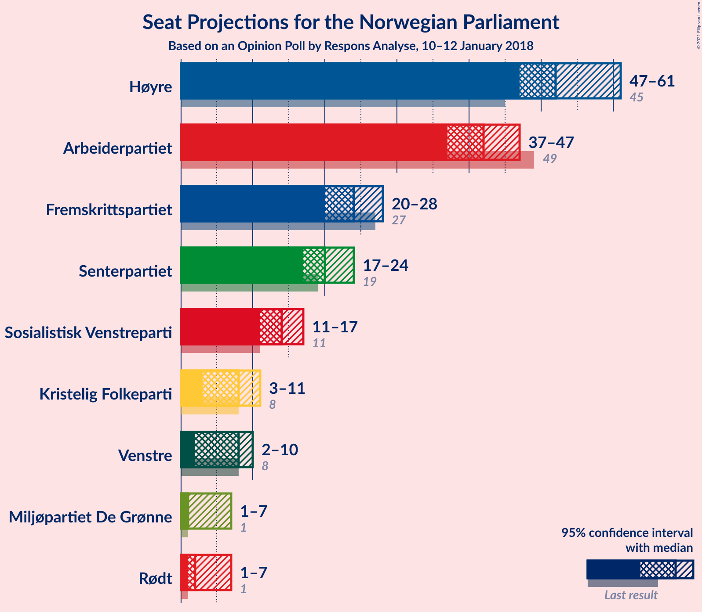
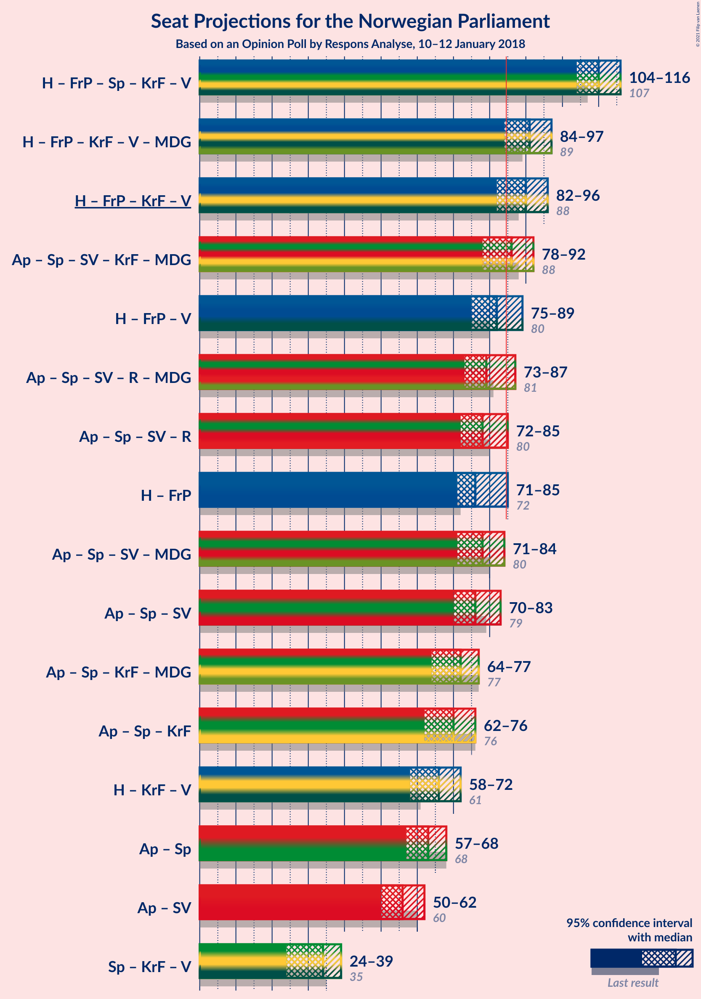
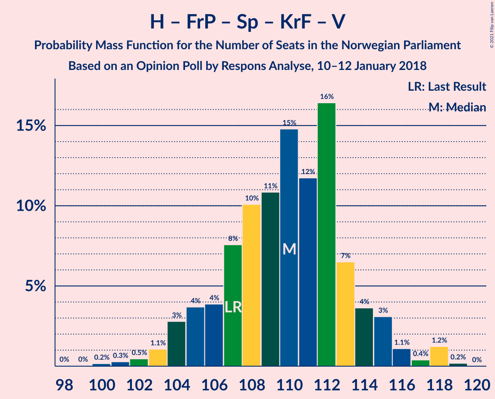
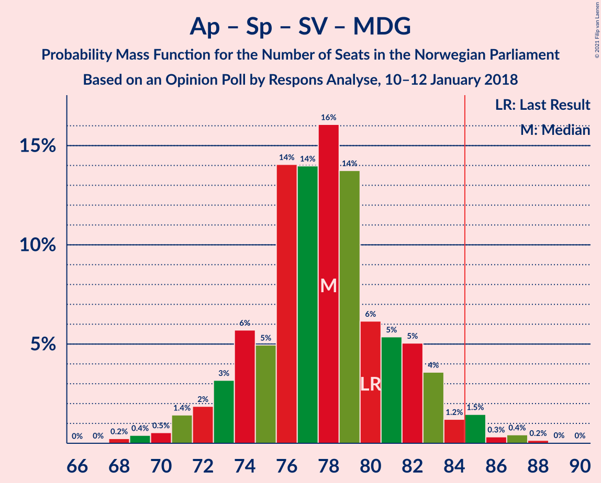
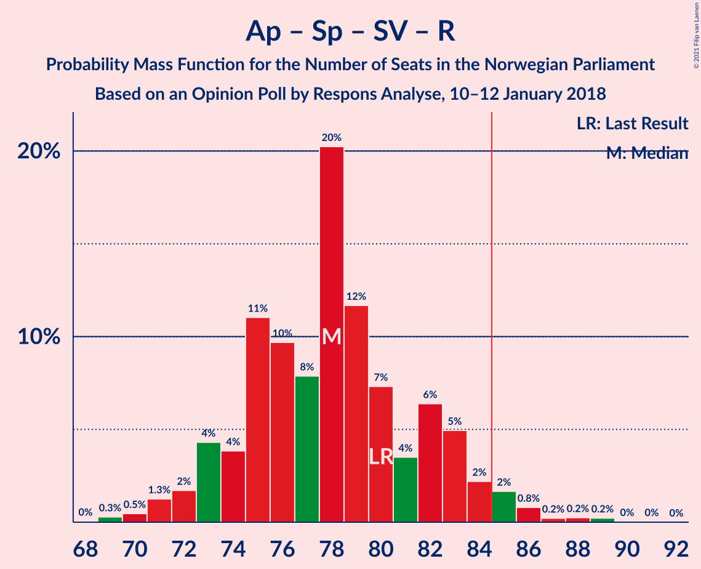
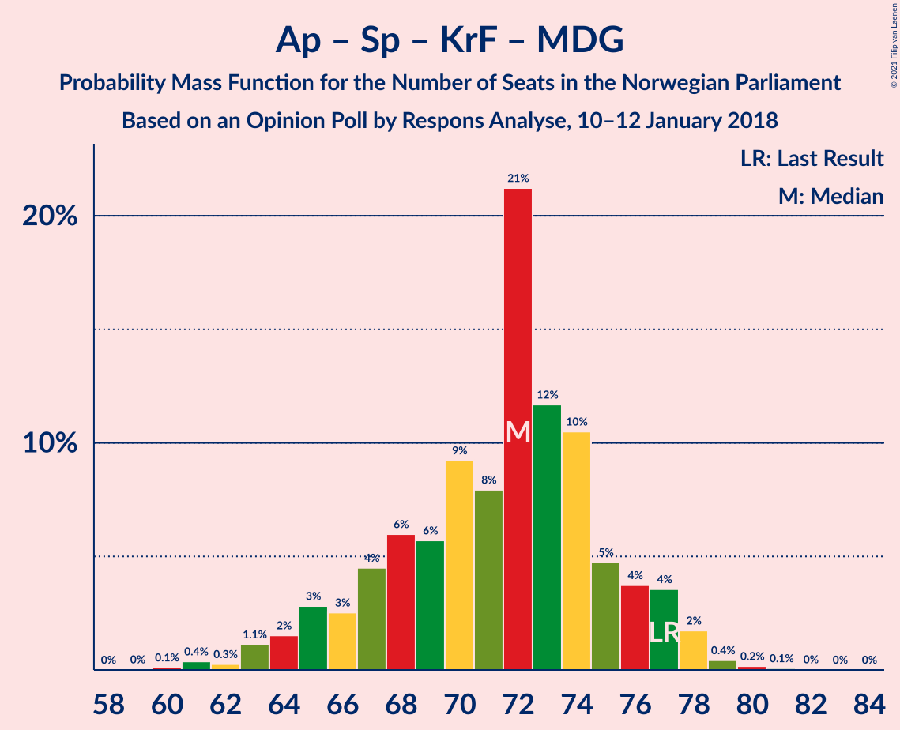
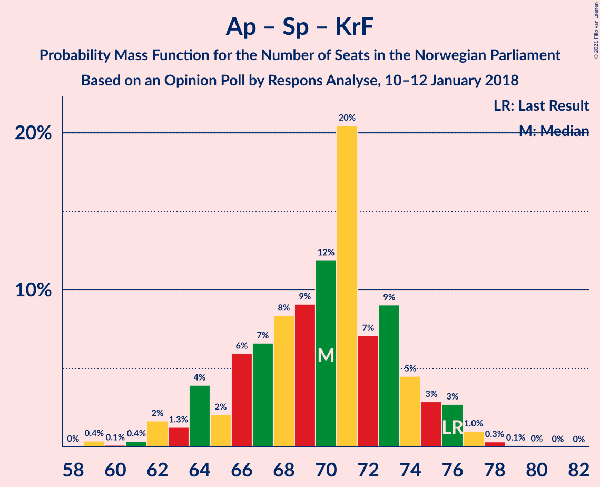
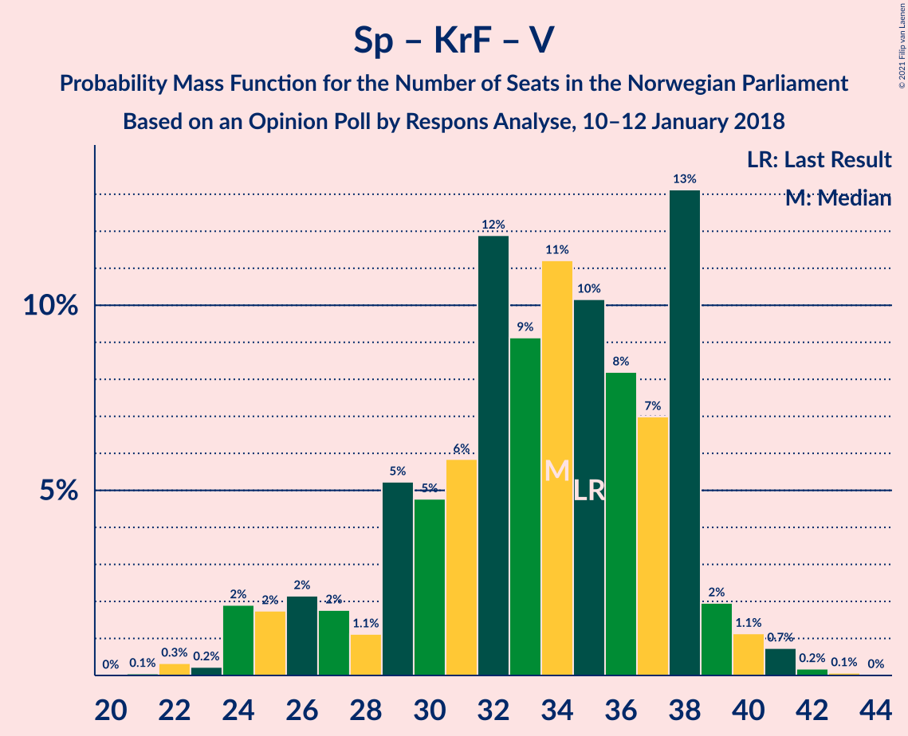

# Opinion Poll by Respons Analyse, 10–12 January 2018

<a href="#voting-intentions">Voting Intentions</a> | <a href="#seats">Seats</a> | <a href="#coalitions">Coalitions</a> | <a href="#technical-information">Technical Information</a>

## Voting Intentions

### Confidence Intervals

| Party | Last Result | Poll Result | 80% Confidence Interval | 90% Confidence Interval | 95% Confidence Interval | 99% Confidence Interval |
|:-----:|:-----------:|:-----------:|:-----------------------:|:-----------------------:|:-----------------------:|:-----------------------:|
| Høyre | 25.0% | 29.4% | 27.6–31.3% |27.1–31.8% |26.7–32.3% |25.8–33.2% |
| Arbeiderpartiet | 27.4% | 23.2% | 21.6–25.0% |21.1–25.5% |20.7–25.9% |19.9–26.8% |
| Fremskrittspartiet | 15.2% | 13.2% | 11.9–14.7% |11.6–15.1% |11.2–15.5% |10.7–16.2% |
| Senterpartiet | 10.3% | 11.3% | 10.1–12.7% |9.8–13.1% |9.5–13.4% |8.9–14.1% |
| Sosialistisk Venstreparti | 6.0% | 7.5% | 6.5–8.7% |6.2–9.0% |6.0–9.3% |5.6–9.9% |
| Kristelig Folkeparti | 4.2% | 4.4% | 3.7–5.3% |3.5–5.6% |3.3–5.9% |3.0–6.4% |
| Venstre | 4.4% | 4.1% | 3.4–5.0% |3.2–5.3% |3.0–5.5% |2.7–6.0% |
| Rødt | 2.4% | 2.9% | 2.3–3.7% |2.2–3.9% |2.0–4.1% |1.8–4.6% |
| Miljøpartiet De Grønne | 3.2% | 2.8% | 2.2–3.6% |2.1–3.8% |1.9–4.0% |1.7–4.4% |

*Note:* The poll result column reflects the actual value used in the calculations. Published results may vary slightly, and in addition be rounded to fewer digits.

## Seats

### Confidence Intervals

| Party | Last Result | Median | 80% Confidence Interval | 90% Confidence Interval | 95% Confidence Interval | 99% Confidence Interval |
|:-----:|:-----------:|:------:|:-----------------------:|:-----------------------:|:-----------------------:|:-----------------------:|
| <a href="#høyre">Høyre</a> | 45 | 52 | 48–55 |47–57 |47–58 |45–59 |
| <a href="#arbeiderpartiet">Arbeiderpartiet</a> | 49 | 41 | 39–46 |38–47 |38–47 |36–48 |
| <a href="#fremskrittspartiet">Fremskrittspartiet</a> | 27 | 26 | 22–27 |22–27 |21–28 |19–30 |
| <a href="#senterpartiet">Senterpartiet</a> | 19 | 21 | 19–23 |18–24 |17–25 |17–26 |
| <a href="#sosialistisk-venstreparti">Sosialistisk Venstreparti</a> | 11 | 14 | 12–16 |12–16 |11–17 |10–18 |
| <a href="#kristelig-folkeparti">Kristelig Folkeparti</a> | 8 | 8 | 3–9 |3–10 |2–11 |1–11 |
| <a href="#venstre">Venstre</a> | 8 | 3 | 2–9 |2–9 |2–10 |2–10 |
| <a href="#rødt">Rødt</a> | 1 | 2 | 1–2 |1–2 |1–2 |1–7 |
| <a href="#miljøpartiet-de-grønne">Miljøpartiet De Grønne</a> | 1 | 1 | 1–2 |1–3 |1–3 |0–8 |

### Høyre

*For a full overview of the results for this party, see the [Høyre](party-høyre.html) page.*

| Number of Seats | Probability | Accumulated | Special Marks |
|:---------------:|:-----------:|:-----------:|:-------------:|
| 44 | 0.2% | 100% |  |
| 45 | 0.3% | 99.8% | Last Result |
| 46 | 1.0% | 99.5% |  |
| 47 | 6% | 98% |  |
| 48 | 6% | 92% |  |
| 49 | 9% | 87% |  |
| 50 | 6% | 77% |  |
| 51 | 16% | 71% |  |
| 52 | 5% | 55% | Median |
| 53 | 7% | 50% |  |
| 54 | 33% | 43% |  |
| 55 | 4% | 11% |  |
| 56 | 1.1% | 7% |  |
| 57 | 2% | 6% |  |
| 58 | 3% | 4% |  |
| 59 | 0.4% | 0.8% |  |
| 60 | 0.1% | 0.4% |  |
| 61 | 0.3% | 0.3% |  |
| 62 | 0% | 0.1% |  |
| 63 | 0% | 0% |  |

### Arbeiderpartiet

*For a full overview of the results for this party, see the [Arbeiderpartiet](party-arbeiderpartiet.html) page.*

| Number of Seats | Probability | Accumulated | Special Marks |
|:---------------:|:-----------:|:-----------:|:-------------:|
| 35 | 0.2% | 100% |  |
| 36 | 0.9% | 99.7% |  |
| 37 | 1.0% | 98.8% |  |
| 38 | 5% | 98% |  |
| 39 | 9% | 93% |  |
| 40 | 12% | 84% |  |
| 41 | 24% | 71% | Median |
| 42 | 7% | 47% |  |
| 43 | 20% | 40% |  |
| 44 | 4% | 20% |  |
| 45 | 6% | 16% |  |
| 46 | 2% | 10% |  |
| 47 | 8% | 8% |  |
| 48 | 0.4% | 0.5% |  |
| 49 | 0% | 0.1% | Last Result |
| 50 | 0% | 0.1% |  |
| 51 | 0.1% | 0.1% |  |
| 52 | 0% | 0% |  |

### Fremskrittspartiet

*For a full overview of the results for this party, see the [Fremskrittspartiet](party-fremskrittspartiet.html) page.*

| Number of Seats | Probability | Accumulated | Special Marks |
|:---------------:|:-----------:|:-----------:|:-------------:|
| 18 | 0% | 100% |  |
| 19 | 0.5% | 99.9% |  |
| 20 | 0.8% | 99.5% |  |
| 21 | 1.4% | 98.7% |  |
| 22 | 19% | 97% |  |
| 23 | 10% | 78% |  |
| 24 | 5% | 68% |  |
| 25 | 13% | 63% |  |
| 26 | 5% | 50% | Median |
| 27 | 41% | 45% | Last Result |
| 28 | 2% | 4% |  |
| 29 | 1.3% | 2% |  |
| 30 | 0.5% | 0.6% |  |
| 31 | 0.1% | 0.1% |  |
| 32 | 0% | 0% |  |

### Senterpartiet

*For a full overview of the results for this party, see the [Senterpartiet](party-senterpartiet.html) page.*

| Number of Seats | Probability | Accumulated | Special Marks |
|:---------------:|:-----------:|:-----------:|:-------------:|
| 15 | 0% | 100% |  |
| 16 | 0.3% | 99.9% |  |
| 17 | 4% | 99.6% |  |
| 18 | 2% | 96% |  |
| 19 | 11% | 93% | Last Result |
| 20 | 16% | 83% |  |
| 21 | 42% | 67% | Median |
| 22 | 8% | 25% |  |
| 23 | 9% | 17% |  |
| 24 | 5% | 9% |  |
| 25 | 2% | 3% |  |
| 26 | 1.4% | 1.4% |  |
| 27 | 0% | 0.1% |  |
| 28 | 0% | 0% |  |

### Sosialistisk Venstreparti

*For a full overview of the results for this party, see the [Sosialistisk Venstreparti](party-sosialistiskvenstreparti.html) page.*

| Number of Seats | Probability | Accumulated | Special Marks |
|:---------------:|:-----------:|:-----------:|:-------------:|
| 9 | 0.2% | 100% |  |
| 10 | 0.4% | 99.8% |  |
| 11 | 3% | 99.5% | Last Result |
| 12 | 25% | 97% |  |
| 13 | 15% | 72% |  |
| 14 | 22% | 56% | Median |
| 15 | 16% | 35% |  |
| 16 | 14% | 18% |  |
| 17 | 3% | 4% |  |
| 18 | 1.2% | 1.4% |  |
| 19 | 0.1% | 0.1% |  |
| 20 | 0% | 0% |  |

### Kristelig Folkeparti

*For a full overview of the results for this party, see the [Kristelig Folkeparti](party-kristeligfolkeparti.html) page.*

| Number of Seats | Probability | Accumulated | Special Marks |
|:---------------:|:-----------:|:-----------:|:-------------:|
| 1 | 0.7% | 100% |  |
| 2 | 3% | 99.3% |  |
| 3 | 25% | 96% |  |
| 4 | 0% | 72% |  |
| 5 | 0% | 72% |  |
| 6 | 0% | 72% |  |
| 7 | 5% | 72% |  |
| 8 | 42% | 67% | Last Result, Median |
| 9 | 15% | 24% |  |
| 10 | 5% | 9% |  |
| 11 | 4% | 4% |  |
| 12 | 0.1% | 0.2% |  |
| 13 | 0.1% | 0.1% |  |
| 14 | 0% | 0% |  |

### Venstre

*For a full overview of the results for this party, see the [Venstre](party-venstre.html) page.*

| Number of Seats | Probability | Accumulated | Special Marks |
|:---------------:|:-----------:|:-----------:|:-------------:|
| 2 | 48% | 100% |  |
| 3 | 2% | 52% | Median |
| 4 | 0% | 50% |  |
| 5 | 0% | 50% |  |
| 6 | 0% | 50% |  |
| 7 | 12% | 50% |  |
| 8 | 18% | 38% | Last Result |
| 9 | 16% | 20% |  |
| 10 | 3% | 3% |  |
| 11 | 0.4% | 0.4% |  |
| 12 | 0% | 0% |  |

### Rødt

*For a full overview of the results for this party, see the [Rødt](party-rødt.html) page.*

| Number of Seats | Probability | Accumulated | Special Marks |
|:---------------:|:-----------:|:-----------:|:-------------:|
| 1 | 40% | 100% | Last Result |
| 2 | 59% | 60% | Median |
| 3 | 0% | 0.8% |  |
| 4 | 0% | 0.8% |  |
| 5 | 0% | 0.8% |  |
| 6 | 0% | 0.8% |  |
| 7 | 0.5% | 0.8% |  |
| 8 | 0.2% | 0.3% |  |
| 9 | 0% | 0.1% |  |
| 10 | 0% | 0% |  |

### Miljøpartiet De Grønne

*For a full overview of the results for this party, see the [Miljøpartiet De Grønne](party-miljøpartietdegrønne.html) page.*

| Number of Seats | Probability | Accumulated | Special Marks |
|:---------------:|:-----------:|:-----------:|:-------------:|
| 0 | 1.4% | 100% |  |
| 1 | 53% | 98.6% | Last Result, Median |
| 2 | 39% | 46% |  |
| 3 | 5% | 7% |  |
| 4 | 0% | 2% |  |
| 5 | 0% | 2% |  |
| 6 | 0% | 2% |  |
| 7 | 1.2% | 2% |  |
| 8 | 1.1% | 1.2% |  |
| 9 | 0% | 0% |  |

## Coalitions

### Confidence Intervals

| Coalition | Last Result | Median | Majority? | 80% Confidence Interval | 90% Confidence Interval | 95% Confidence Interval | 99% Confidence Interval |
|:---------:|:-----------:|:------:|:---------:|:-----------------------:|:-----------------------:|:-----------------------:|:-----------------------:|
| Høyre – Fremskrittspartiet – Senterpartiet – Kristelig Folkeparti – Venstre | 107 | 111 | 100% | 106–113 | 106–114 | 104–115 | 102–116 |
| Høyre – Fremskrittspartiet – Kristelig Folkeparti – Venstre – Miljøpartiet De Grønne | 89 | 91 | 99.2% | 87–94 | 85–95 | 85–96 | 84–99 |
| Høyre – Fremskrittspartiet – Kristelig Folkeparti – Venstre | 88 | 90 | 93% | 86–91 | 83–93 | 83–95 | 81–97 |
| Arbeiderpartiet – Senterpartiet – Sosialistisk Venstreparti – Kristelig Folkeparti – Miljøpartiet De Grønne | 88 | 84 | 47% | 83–89 | 80–92 | 79–93 | 76–94 |
| Høyre – Fremskrittspartiet – Venstre | 80 | 83 | 13% | 79–85 | 75–88 | 74–89 | 74–91 |
| Arbeiderpartiet – Senterpartiet – Sosialistisk Venstreparti – Rødt – Miljøpartiet De Grønne | 81 | 79 | 7% | 78–83 | 76–86 | 74–86 | 72–88 |
| Arbeiderpartiet – Senterpartiet – Sosialistisk Venstreparti – Miljøpartiet De Grønne | 80 | 78 | 3% | 76–82 | 75–84 | 72–85 | 71–85 |
| Arbeiderpartiet – Senterpartiet – Sosialistisk Venstreparti – Rødt | 80 | 78 | 0.8% | 75–82 | 74–84 | 73–84 | 70–85 |
| Arbeiderpartiet – Senterpartiet – Sosialistisk Venstreparti | 79 | 76 | 0.2% | 74–80 | 72–82 | 71–83 | 68–83 |
| Høyre – Fremskrittspartiet | 72 | 77 | 0.5% | 73–81 | 72–81 | 71–82 | 69–85 |
| Arbeiderpartiet – Senterpartiet – Kristelig Folkeparti – Miljøpartiet De Grønne | 77 | 72 | 0% | 69–76 | 66–77 | 65–77 | 64–79 |
| Arbeiderpartiet – Senterpartiet – Kristelig Folkeparti | 76 | 70 | 0% | 67–74 | 64–75 | 63–76 | 62–78 |
| Høyre – Kristelig Folkeparti – Venstre | 61 | 64 | 0% | 59–68 | 59–69 | 58–69 | 57–73 |
| Arbeiderpartiet – Senterpartiet | 68 | 62 | 0% | 60–67 | 59–67 | 58–68 | 56–70 |
| Arbeiderpartiet – Sosialistisk Venstreparti | 60 | 56 | 0% | 53–60 | 52–60 | 51–62 | 49–62 |
| Senterpartiet – Kristelig Folkeparti – Venstre | 35 | 33 | 0% | 29–38 | 25–38 | 25–40 | 25–41 |

### Høyre – Fremskrittspartiet – Senterpartiet – Kristelig Folkeparti – Venstre

| Number of Seats | Probability | Accumulated | Special Marks |
|:---------------:|:-----------:|:-----------:|:-------------:|
| 98 | 0.1% | 100% |  |
| 99 | 0% | 99.9% |  |
| 100 | 0.1% | 99.9% |  |
| 101 | 0.3% | 99.8% |  |
| 102 | 0.1% | 99.6% |  |
| 103 | 0.6% | 99.5% |  |
| 104 | 3% | 98.8% |  |
| 105 | 0.4% | 96% |  |
| 106 | 9% | 95% |  |
| 107 | 7% | 87% | Last Result |
| 108 | 11% | 79% |  |
| 109 | 8% | 68% |  |
| 110 | 5% | 59% | Median |
| 111 | 15% | 54% |  |
| 112 | 25% | 39% |  |
| 113 | 5% | 14% |  |
| 114 | 5% | 9% |  |
| 115 | 2% | 4% |  |
| 116 | 0.8% | 1.3% |  |
| 117 | 0.1% | 0.5% |  |
| 118 | 0% | 0.4% |  |
| 119 | 0.3% | 0.4% |  |
| 120 | 0% | 0% |  |

### Høyre – Fremskrittspartiet – Kristelig Folkeparti – Venstre – Miljøpartiet De Grønne

| Number of Seats | Probability | Accumulated | Special Marks |
|:---------------:|:-----------:|:-----------:|:-------------:|
| 78 | 0.1% | 100% |  |
| 79 | 0% | 99.9% |  |
| 80 | 0.1% | 99.9% |  |
| 81 | 0.1% | 99.8% |  |
| 82 | 0% | 99.7% |  |
| 83 | 0.1% | 99.7% |  |
| 84 | 0.4% | 99.6% |  |
| 85 | 6% | 99.2% | Majority |
| 86 | 2% | 94% |  |
| 87 | 16% | 91% |  |
| 88 | 6% | 76% |  |
| 89 | 3% | 70% | Last Result |
| 90 | 2% | 67% | Median |
| 91 | 20% | 65% |  |
| 92 | 6% | 45% |  |
| 93 | 25% | 39% |  |
| 94 | 7% | 13% |  |
| 95 | 2% | 6% |  |
| 96 | 2% | 4% |  |
| 97 | 1.0% | 2% |  |
| 98 | 0.5% | 1.1% |  |
| 99 | 0.4% | 0.7% |  |
| 100 | 0.2% | 0.2% |  |
| 101 | 0% | 0% |  |

### Høyre – Fremskrittspartiet – Kristelig Folkeparti – Venstre

| Number of Seats | Probability | Accumulated | Special Marks |
|:---------------:|:-----------:|:-----------:|:-------------:|
| 77 | 0.1% | 100% |  |
| 78 | 0% | 99.9% |  |
| 79 | 0.2% | 99.8% |  |
| 80 | 0.1% | 99.6% |  |
| 81 | 0% | 99.5% |  |
| 82 | 0.1% | 99.5% |  |
| 83 | 5% | 99.3% |  |
| 84 | 1.3% | 95% |  |
| 85 | 3% | 93% | Majority |
| 86 | 17% | 90% |  |
| 87 | 6% | 73% |  |
| 88 | 1.1% | 66% | Last Result |
| 89 | 5% | 65% | Median |
| 90 | 18% | 61% |  |
| 91 | 33% | 42% |  |
| 92 | 3% | 10% |  |
| 93 | 2% | 6% |  |
| 94 | 1.3% | 4% |  |
| 95 | 2% | 3% |  |
| 96 | 0.8% | 1.4% |  |
| 97 | 0.2% | 0.5% |  |
| 98 | 0.2% | 0.4% |  |
| 99 | 0.1% | 0.1% |  |
| 100 | 0% | 0% |  |

### Arbeiderpartiet – Senterpartiet – Sosialistisk Venstreparti – Kristelig Folkeparti – Miljøpartiet De Grønne

| Number of Seats | Probability | Accumulated | Special Marks |
|:---------------:|:-----------:|:-----------:|:-------------:|
| 71 | 0.1% | 100% |  |
| 72 | 0.1% | 99.9% |  |
| 73 | 0% | 99.9% |  |
| 74 | 0% | 99.9% |  |
| 75 | 0% | 99.9% |  |
| 76 | 0.4% | 99.8% |  |
| 77 | 0.1% | 99.4% |  |
| 78 | 0.5% | 99.3% |  |
| 79 | 2% | 98.8% |  |
| 80 | 3% | 97% |  |
| 81 | 1.4% | 93% |  |
| 82 | 2% | 92% |  |
| 83 | 5% | 90% |  |
| 84 | 38% | 85% |  |
| 85 | 8% | 47% | Median, Majority |
| 86 | 20% | 39% |  |
| 87 | 5% | 19% |  |
| 88 | 0.8% | 14% | Last Result |
| 89 | 4% | 13% |  |
| 90 | 2% | 9% |  |
| 91 | 0.7% | 7% |  |
| 92 | 3% | 6% |  |
| 93 | 0.5% | 3% |  |
| 94 | 2% | 2% |  |
| 95 | 0.1% | 0.1% |  |
| 96 | 0% | 0.1% |  |
| 97 | 0% | 0% |  |

### Høyre – Fremskrittspartiet – Venstre

| Number of Seats | Probability | Accumulated | Special Marks |
|:---------------:|:-----------:|:-----------:|:-------------:|
| 72 | 0.1% | 100% |  |
| 73 | 0.1% | 99.9% |  |
| 74 | 3% | 99.8% |  |
| 75 | 3% | 97% |  |
| 76 | 1.0% | 94% |  |
| 77 | 0.8% | 93% |  |
| 78 | 1.3% | 92% |  |
| 79 | 4% | 91% |  |
| 80 | 4% | 86% | Last Result |
| 81 | 8% | 82% | Median |
| 82 | 18% | 74% |  |
| 83 | 37% | 55% |  |
| 84 | 5% | 18% |  |
| 85 | 5% | 13% | Majority |
| 86 | 0.6% | 8% |  |
| 87 | 1.4% | 8% |  |
| 88 | 3% | 6% |  |
| 89 | 2% | 3% |  |
| 90 | 0.4% | 1.0% |  |
| 91 | 0.3% | 0.5% |  |
| 92 | 0.1% | 0.2% |  |
| 93 | 0% | 0.1% |  |
| 94 | 0% | 0.1% |  |
| 95 | 0% | 0.1% |  |
| 96 | 0.1% | 0.1% |  |
| 97 | 0% | 0% |  |

### Arbeiderpartiet – Senterpartiet – Sosialistisk Venstreparti – Rødt – Miljøpartiet De Grønne

| Number of Seats | Probability | Accumulated | Special Marks |
|:---------------:|:-----------:|:-----------:|:-------------:|
| 70 | 0.1% | 100% |  |
| 71 | 0.2% | 99.9% |  |
| 72 | 0.2% | 99.6% |  |
| 73 | 0.8% | 99.5% |  |
| 74 | 2% | 98.6% |  |
| 75 | 1.3% | 97% |  |
| 76 | 2% | 96% |  |
| 77 | 3% | 94% |  |
| 78 | 33% | 90% |  |
| 79 | 18% | 58% | Median |
| 80 | 5% | 39% |  |
| 81 | 1.1% | 35% | Last Result |
| 82 | 6% | 34% |  |
| 83 | 17% | 27% |  |
| 84 | 3% | 10% |  |
| 85 | 1.3% | 7% | Majority |
| 86 | 5% | 5% |  |
| 87 | 0.1% | 0.7% |  |
| 88 | 0% | 0.5% |  |
| 89 | 0.1% | 0.5% |  |
| 90 | 0.2% | 0.4% |  |
| 91 | 0% | 0.2% |  |
| 92 | 0.1% | 0.1% |  |
| 93 | 0% | 0% |  |

### Arbeiderpartiet – Senterpartiet – Sosialistisk Venstreparti – Miljøpartiet De Grønne

| Number of Seats | Probability | Accumulated | Special Marks |
|:---------------:|:-----------:|:-----------:|:-------------:|
| 68 | 0.1% | 100% |  |
| 69 | 0.3% | 99.9% |  |
| 70 | 0.1% | 99.6% |  |
| 71 | 0.3% | 99.5% |  |
| 72 | 2% | 99.2% |  |
| 73 | 1.1% | 97% |  |
| 74 | 0.9% | 96% |  |
| 75 | 3% | 95% |  |
| 76 | 26% | 92% |  |
| 77 | 14% | 66% | Median |
| 78 | 16% | 51% |  |
| 79 | 2% | 36% |  |
| 80 | 2% | 34% | Last Result |
| 81 | 22% | 32% |  |
| 82 | 2% | 10% |  |
| 83 | 2% | 8% |  |
| 84 | 3% | 6% |  |
| 85 | 3% | 3% | Majority |
| 86 | 0.1% | 0.5% |  |
| 87 | 0% | 0.4% |  |
| 88 | 0.2% | 0.3% |  |
| 89 | 0% | 0.1% |  |
| 90 | 0% | 0.1% |  |
| 91 | 0.1% | 0.1% |  |
| 92 | 0% | 0% |  |

### Arbeiderpartiet – Senterpartiet – Sosialistisk Venstreparti – Rødt

| Number of Seats | Probability | Accumulated | Special Marks |
|:---------------:|:-----------:|:-----------:|:-------------:|
| 69 | 0.2% | 100% |  |
| 70 | 0.4% | 99.8% |  |
| 71 | 0.5% | 99.3% |  |
| 72 | 1.0% | 98.9% |  |
| 73 | 2% | 98% |  |
| 74 | 2% | 96% |  |
| 75 | 7% | 94% |  |
| 76 | 25% | 87% |  |
| 77 | 6% | 61% |  |
| 78 | 20% | 55% | Median |
| 79 | 2% | 35% |  |
| 80 | 3% | 33% | Last Result |
| 81 | 6% | 30% |  |
| 82 | 16% | 24% |  |
| 83 | 2% | 9% |  |
| 84 | 6% | 6% |  |
| 85 | 0.4% | 0.8% | Majority |
| 86 | 0.1% | 0.4% |  |
| 87 | 0% | 0.3% |  |
| 88 | 0.1% | 0.3% |  |
| 89 | 0.1% | 0.2% |  |
| 90 | 0% | 0.1% |  |
| 91 | 0.1% | 0.1% |  |
| 92 | 0% | 0% |  |

### Arbeiderpartiet – Senterpartiet – Sosialistisk Venstreparti

| Number of Seats | Probability | Accumulated | Special Marks |
|:---------------:|:-----------:|:-----------:|:-------------:|
| 67 | 0.1% | 100% |  |
| 68 | 0.5% | 99.9% |  |
| 69 | 0.1% | 99.3% |  |
| 70 | 0.7% | 99.2% |  |
| 71 | 2% | 98.5% |  |
| 72 | 2% | 96% |  |
| 73 | 2% | 95% |  |
| 74 | 27% | 92% |  |
| 75 | 9% | 66% |  |
| 76 | 9% | 56% | Median |
| 77 | 14% | 48% |  |
| 78 | 0.8% | 33% |  |
| 79 | 5% | 33% | Last Result |
| 80 | 19% | 28% |  |
| 81 | 2% | 9% |  |
| 82 | 2% | 7% |  |
| 83 | 4% | 4% |  |
| 84 | 0.1% | 0.3% |  |
| 85 | 0% | 0.2% | Majority |
| 86 | 0.1% | 0.2% |  |
| 87 | 0% | 0.1% |  |
| 88 | 0% | 0.1% |  |
| 89 | 0.1% | 0.1% |  |
| 90 | 0.1% | 0.1% |  |
| 91 | 0% | 0% |  |

### Høyre – Fremskrittspartiet

| Number of Seats | Probability | Accumulated | Special Marks |
|:---------------:|:-----------:|:-----------:|:-------------:|
| 66 | 0% | 100% |  |
| 67 | 0.3% | 99.9% |  |
| 68 | 0.2% | 99.7% |  |
| 69 | 0.3% | 99.5% |  |
| 70 | 1.3% | 99.2% |  |
| 71 | 2% | 98% |  |
| 72 | 3% | 96% | Last Result |
| 73 | 16% | 93% |  |
| 74 | 13% | 77% |  |
| 75 | 6% | 64% |  |
| 76 | 2% | 58% |  |
| 77 | 9% | 57% |  |
| 78 | 6% | 48% | Median |
| 79 | 3% | 42% |  |
| 80 | 8% | 39% |  |
| 81 | 28% | 31% |  |
| 82 | 0.8% | 3% |  |
| 83 | 1.5% | 2% |  |
| 84 | 0.2% | 0.7% |  |
| 85 | 0.2% | 0.5% | Majority |
| 86 | 0.2% | 0.3% |  |
| 87 | 0% | 0.1% |  |
| 88 | 0.1% | 0.1% |  |
| 89 | 0% | 0% |  |

### Arbeiderpartiet – Senterpartiet – Kristelig Folkeparti – Miljøpartiet De Grønne

| Number of Seats | Probability | Accumulated | Special Marks |
|:---------------:|:-----------:|:-----------:|:-------------:|
| 57 | 0.1% | 100% |  |
| 58 | 0% | 99.9% |  |
| 59 | 0% | 99.9% |  |
| 60 | 0.1% | 99.9% |  |
| 61 | 0.1% | 99.8% |  |
| 62 | 0.1% | 99.7% |  |
| 63 | 0.2% | 99.7% |  |
| 64 | 2% | 99.5% |  |
| 65 | 1.4% | 98% |  |
| 66 | 4% | 96% |  |
| 67 | 0.5% | 92% |  |
| 68 | 0.9% | 92% |  |
| 69 | 9% | 91% |  |
| 70 | 17% | 82% |  |
| 71 | 14% | 66% | Median |
| 72 | 31% | 51% |  |
| 73 | 6% | 20% |  |
| 74 | 3% | 14% |  |
| 75 | 2% | 12% |  |
| 76 | 5% | 10% |  |
| 77 | 4% | 5% | Last Result |
| 78 | 0.5% | 1.3% |  |
| 79 | 0.5% | 0.8% |  |
| 80 | 0.1% | 0.3% |  |
| 81 | 0.1% | 0.2% |  |
| 82 | 0% | 0.1% |  |
| 83 | 0% | 0% |  |

### Arbeiderpartiet – Senterpartiet – Kristelig Folkeparti

| Number of Seats | Probability | Accumulated | Special Marks |
|:---------------:|:-----------:|:-----------:|:-------------:|
| 56 | 0.1% | 100% |  |
| 57 | 0% | 99.9% |  |
| 58 | 0% | 99.9% |  |
| 59 | 0.2% | 99.9% |  |
| 60 | 0.1% | 99.8% |  |
| 61 | 0.2% | 99.7% |  |
| 62 | 0.5% | 99.5% |  |
| 63 | 2% | 99.1% |  |
| 64 | 4% | 97% |  |
| 65 | 1.5% | 92% |  |
| 66 | 0.8% | 91% |  |
| 67 | 4% | 90% |  |
| 68 | 11% | 87% |  |
| 69 | 18% | 76% |  |
| 70 | 31% | 58% | Median |
| 71 | 9% | 27% |  |
| 72 | 4% | 17% |  |
| 73 | 3% | 14% |  |
| 74 | 2% | 11% |  |
| 75 | 6% | 9% |  |
| 76 | 2% | 3% | Last Result |
| 77 | 0.1% | 0.8% |  |
| 78 | 0.5% | 0.7% |  |
| 79 | 0.1% | 0.1% |  |
| 80 | 0% | 0.1% |  |
| 81 | 0% | 0% |  |

### Høyre – Kristelig Folkeparti – Venstre

| Number of Seats | Probability | Accumulated | Special Marks |
|:---------------:|:-----------:|:-----------:|:-------------:|
| 53 | 0.2% | 100% |  |
| 54 | 0.1% | 99.8% |  |
| 55 | 0.1% | 99.7% |  |
| 56 | 0.1% | 99.6% |  |
| 57 | 0.4% | 99.5% |  |
| 58 | 4% | 99.1% |  |
| 59 | 12% | 95% |  |
| 60 | 4% | 83% |  |
| 61 | 3% | 79% | Last Result |
| 62 | 3% | 76% |  |
| 63 | 9% | 73% | Median |
| 64 | 27% | 64% |  |
| 65 | 4% | 37% |  |
| 66 | 5% | 32% |  |
| 67 | 4% | 27% |  |
| 68 | 14% | 23% |  |
| 69 | 7% | 9% |  |
| 70 | 0.5% | 2% |  |
| 71 | 0.7% | 2% |  |
| 72 | 0.4% | 1.1% |  |
| 73 | 0.5% | 0.7% |  |
| 74 | 0.1% | 0.2% |  |
| 75 | 0% | 0.1% |  |
| 76 | 0% | 0% |  |

### Arbeiderpartiet – Senterpartiet

| Number of Seats | Probability | Accumulated | Special Marks |
|:---------------:|:-----------:|:-----------:|:-------------:|
| 53 | 0.1% | 100% |  |
| 54 | 0.1% | 99.9% |  |
| 55 | 0.2% | 99.8% |  |
| 56 | 1.2% | 99.6% |  |
| 57 | 0.6% | 98% |  |
| 58 | 2% | 98% |  |
| 59 | 1.1% | 96% |  |
| 60 | 12% | 94% |  |
| 61 | 14% | 83% |  |
| 62 | 30% | 69% | Median |
| 63 | 2% | 39% |  |
| 64 | 7% | 37% |  |
| 65 | 11% | 29% |  |
| 66 | 4% | 19% |  |
| 67 | 11% | 15% |  |
| 68 | 2% | 4% | Last Result |
| 69 | 1.3% | 2% |  |
| 70 | 0.5% | 0.6% |  |
| 71 | 0.1% | 0.2% |  |
| 72 | 0.1% | 0.1% |  |
| 73 | 0% | 0% |  |

### Arbeiderpartiet – Sosialistisk Venstreparti

| Number of Seats | Probability | Accumulated | Special Marks |
|:---------------:|:-----------:|:-----------:|:-------------:|
| 47 | 0.2% | 100% |  |
| 48 | 0.2% | 99.8% |  |
| 49 | 0.3% | 99.6% |  |
| 50 | 0.5% | 99.3% |  |
| 51 | 2% | 98.8% |  |
| 52 | 6% | 96% |  |
| 53 | 21% | 90% |  |
| 54 | 11% | 69% |  |
| 55 | 5% | 57% | Median |
| 56 | 14% | 52% |  |
| 57 | 10% | 38% |  |
| 58 | 8% | 29% |  |
| 59 | 8% | 21% |  |
| 60 | 9% | 13% | Last Result |
| 61 | 0.5% | 4% |  |
| 62 | 3% | 3% |  |
| 63 | 0.1% | 0.3% |  |
| 64 | 0.1% | 0.2% |  |
| 65 | 0% | 0.1% |  |
| 66 | 0% | 0.1% |  |
| 67 | 0% | 0.1% |  |
| 68 | 0% | 0.1% |  |
| 69 | 0.1% | 0.1% |  |
| 70 | 0% | 0% |  |

### Senterpartiet – Kristelig Folkeparti – Venstre

| Number of Seats | Probability | Accumulated | Special Marks |
|:---------------:|:-----------:|:-----------:|:-------------:|
| 22 | 0% | 100% |  |
| 23 | 0% | 99.9% |  |
| 24 | 0.2% | 99.9% |  |
| 25 | 8% | 99.7% |  |
| 26 | 0.5% | 92% |  |
| 27 | 0.6% | 92% |  |
| 28 | 0.6% | 91% |  |
| 29 | 5% | 90% |  |
| 30 | 3% | 85% |  |
| 31 | 22% | 82% |  |
| 32 | 5% | 60% | Median |
| 33 | 10% | 55% |  |
| 34 | 14% | 45% |  |
| 35 | 8% | 31% | Last Result |
| 36 | 2% | 23% |  |
| 37 | 3% | 21% |  |
| 38 | 14% | 18% |  |
| 39 | 0.8% | 4% |  |
| 40 | 3% | 3% |  |
| 41 | 0.5% | 0.9% |  |
| 42 | 0.3% | 0.4% |  |
| 43 | 0.1% | 0.2% |  |
| 44 | 0% | 0% |  |

## Technical Information

### Opinion Poll

+ **Polling firm:** Respons Analyse
+ **Commissioner(s):** —
+ **Fieldwork period:** 10–12 January 2018

### Calculations

+ **Sample size:** 1000
+ **Simulations done:** 131,072
+ **Error estimate:** 2.47%

