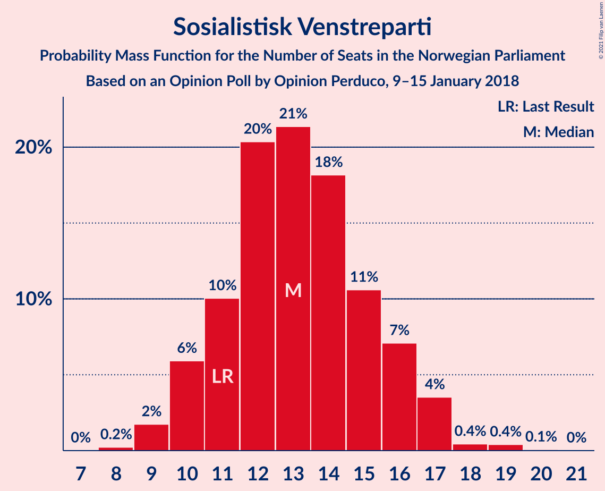
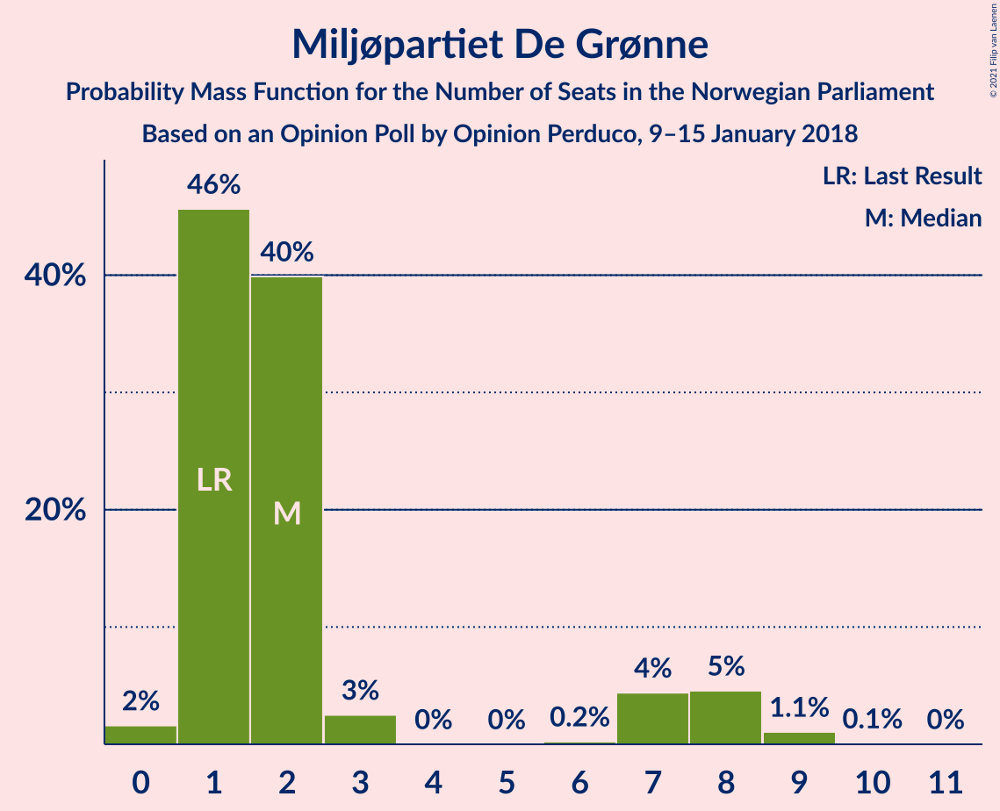
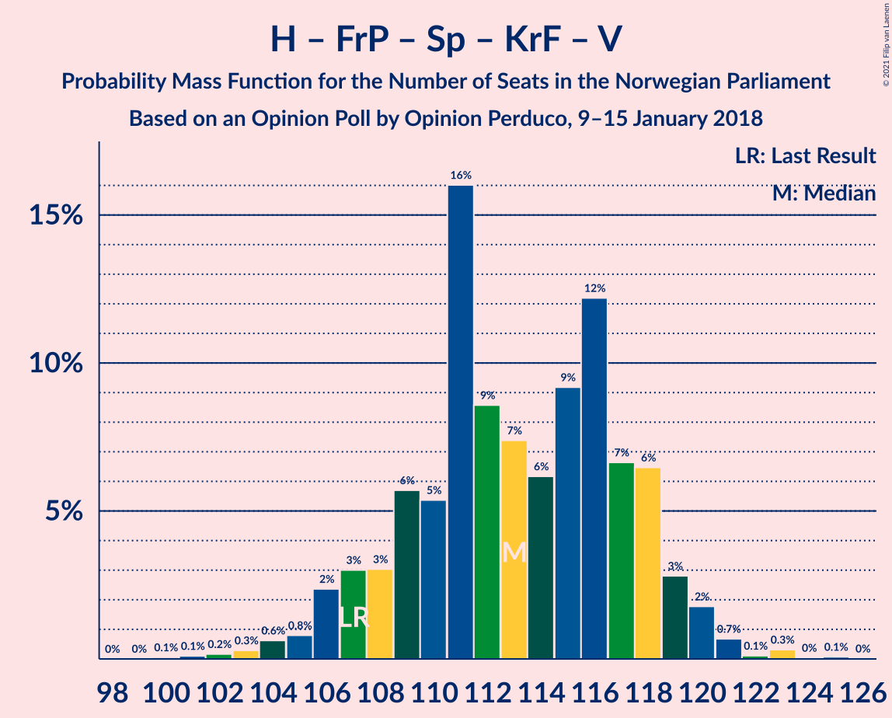
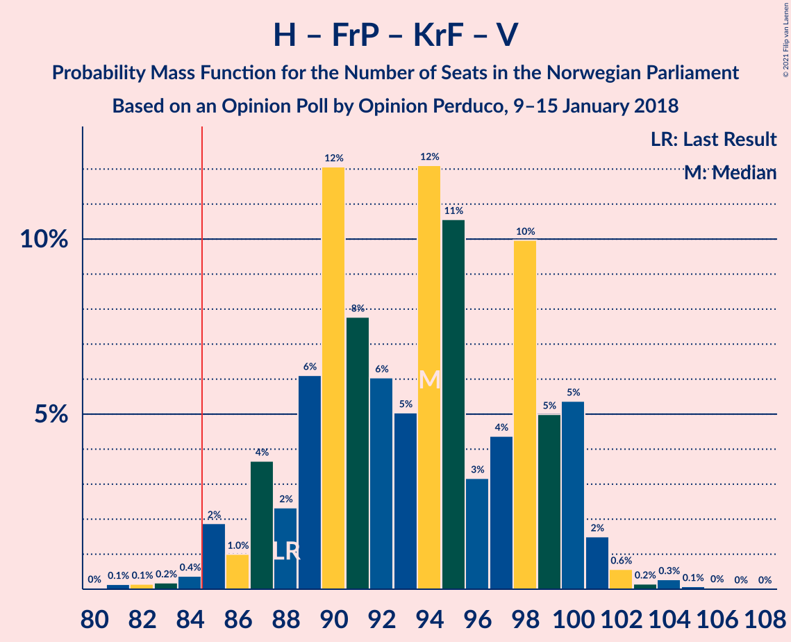
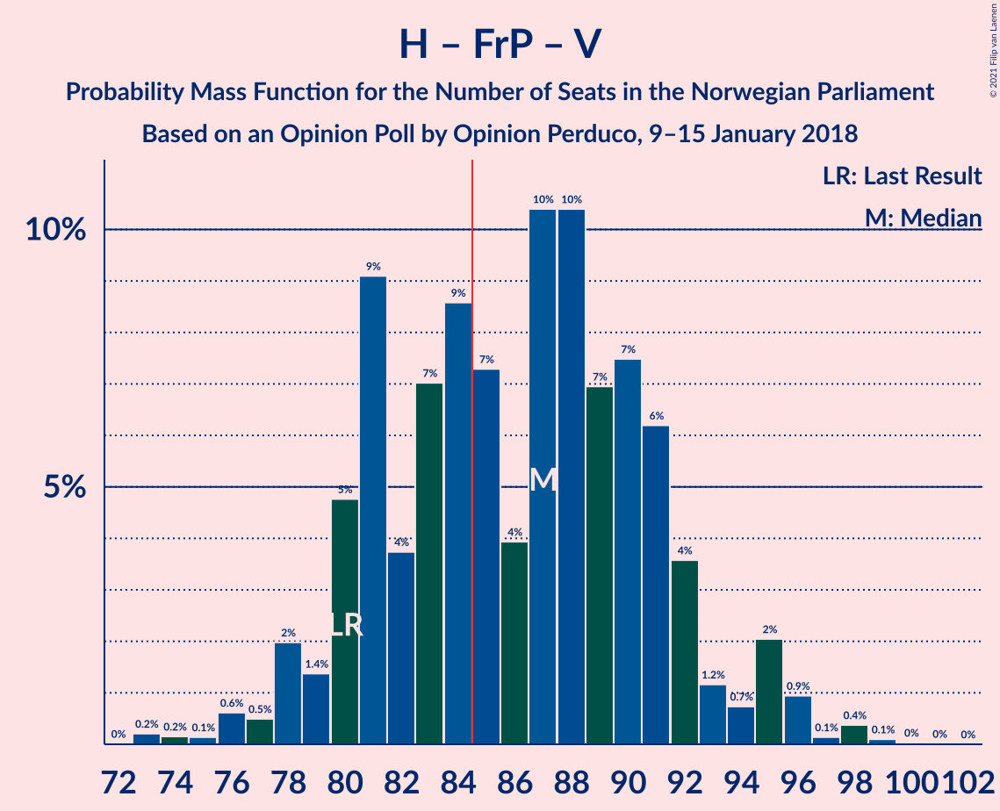
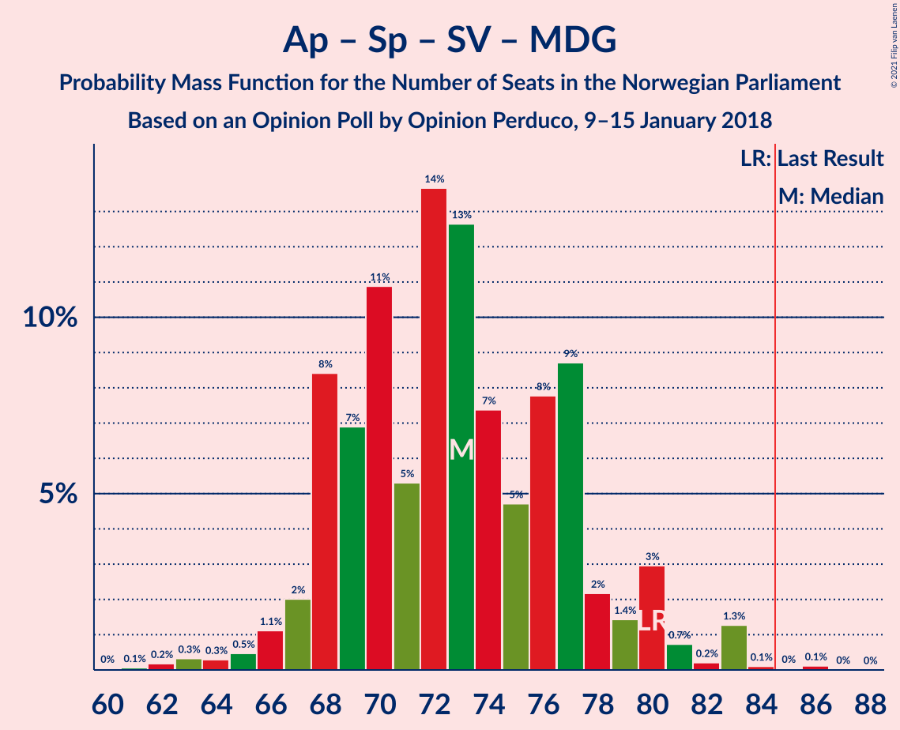
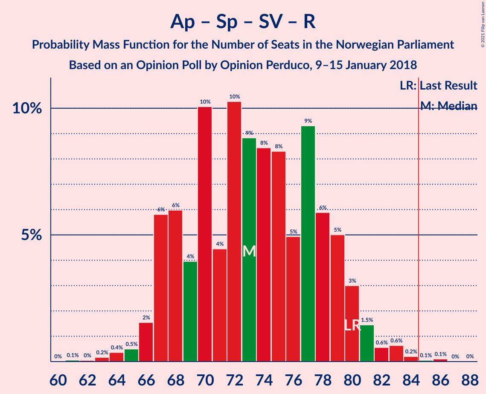
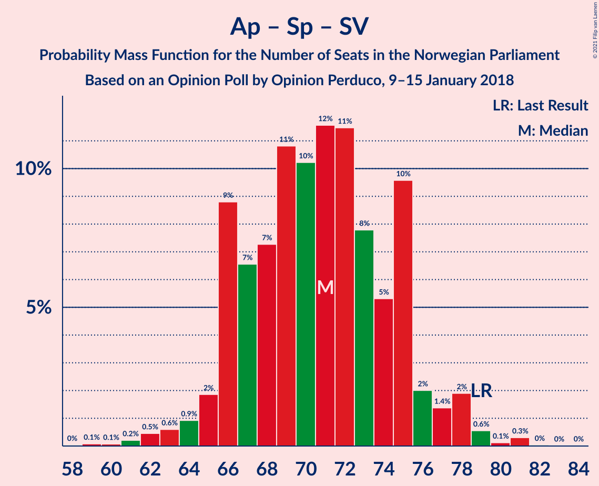

# Opinion Poll by Opinion Perduco, 9–15 January 2018

<a href="#voting-intentions">Voting Intentions</a> | <a href="#seats">Seats</a> | <a href="#coalitions">Coalitions</a> | <a href="#technical-information">Technical Information</a>

## Voting Intentions

### Confidence Intervals

| Party | Last Result | Poll Result | 80% Confidence Interval | 90% Confidence Interval | 95% Confidence Interval | 99% Confidence Interval |
|:-----:|:-----------:|:-----------:|:-----------------------:|:-----------------------:|:-----------------------:|:-----------------------:|
| Høyre | 25.0% | 30.3% | 28.1–32.6% |27.5–33.2% |27.0–33.8% |26.0–34.9% |
| Arbeiderpartiet | 27.4% | 20.9% | 19.1–23.0% |18.5–23.6% |18.1–24.1% |17.2–25.1% |
| Fremskrittspartiet | 15.2% | 14.5% | 12.9–16.3% |12.5–16.9% |12.1–17.3% |11.3–18.2% |
| Senterpartiet | 10.3% | 10.9% | 9.5–12.6% |9.1–13.0% |8.8–13.4% |8.2–14.3% |
| Sosialistisk Venstreparti | 6.0% | 7.3% | 6.2–8.7% |5.9–9.1% |5.6–9.5% |5.1–10.2% |
| Kristelig Folkeparti | 4.2% | 4.6% | 3.7–5.8% |3.5–6.1% |3.3–6.4% |2.9–7.0% |
| Venstre | 4.4% | 4.4% | 3.6–5.6% |3.4–6.0% |3.2–6.2% |2.8–6.9% |
| Rødt | 2.4% | 3.0% | 2.3–4.0% |2.1–4.3% |2.0–4.6% |1.7–5.1% |
| Miljøpartiet De Grønne | 3.2% | 3.0% | 2.3–4.0% |2.1–4.3% |2.0–4.6% |1.7–5.1% |

*Note:* The poll result column reflects the actual value used in the calculations. Published results may vary slightly, and in addition be rounded to fewer digits.

## Seats

### Confidence Intervals

| Party | Last Result | Median | 80% Confidence Interval | 90% Confidence Interval | 95% Confidence Interval | 99% Confidence Interval |
|:-----:|:-----------:|:------:|:-----------------------:|:-----------------------:|:-----------------------:|:-----------------------:|
| <a href="#høyre">Høyre</a> | 45 | 52 | 49–57 |48–60 |47–61 |46–63 |
| <a href="#arbeiderpartiet">Arbeiderpartiet</a> | 49 | 38 | 36–41 |36–42 |34–42 |32–43 |
| <a href="#fremskrittspartiet">Fremskrittspartiet</a> | 27 | 26 | 23–30 |22–31 |21–33 |19–33 |
| <a href="#senterpartiet">Senterpartiet</a> | 19 | 20 | 16–22 |16–22 |15–23 |14–26 |
| <a href="#sosialistisk-venstreparti">Sosialistisk Venstreparti</a> | 11 | 13 | 11–15 |10–16 |10–17 |9–19 |
| <a href="#kristelig-folkeparti">Kristelig Folkeparti</a> | 8 | 8 | 3–10 |3–10 |3–11 |1–12 |
| <a href="#venstre">Venstre</a> | 8 | 8 | 2–10 |2–10 |2–11 |2–12 |
| <a href="#rødt">Rødt</a> | 1 | 2 | 1–7 |1–7 |1–8 |1–9 |
| <a href="#miljøpartiet-de-grønne">Miljøpartiet De Grønne</a> | 1 | 2 | 1–2 |1–8 |1–8 |0–8 |

### Høyre

*For a full overview of the results for this party, see the [Høyre](party-høyre.html) page.*

| Number of Seats | Probability | Accumulated | Special Marks |
|:---------------:|:-----------:|:-----------:|:-------------:|
| 43 | 0.1% | 100% |  |
| 44 | 0.1% | 99.9% |  |
| 45 | 0.2% | 99.8% | Last Result |
| 46 | 0.3% | 99.6% |  |
| 47 | 3% | 99.3% |  |
| 48 | 5% | 96% |  |
| 49 | 4% | 92% |  |
| 50 | 21% | 87% |  |
| 51 | 8% | 66% |  |
| 52 | 25% | 58% | Median |
| 53 | 5% | 34% |  |
| 54 | 4% | 28% |  |
| 55 | 2% | 25% |  |
| 56 | 9% | 22% |  |
| 57 | 5% | 13% |  |
| 58 | 0.5% | 8% |  |
| 59 | 0.7% | 8% |  |
| 60 | 4% | 7% |  |
| 61 | 1.2% | 3% |  |
| 62 | 0.6% | 2% |  |
| 63 | 1.3% | 2% |  |
| 64 | 0.1% | 0.2% |  |
| 65 | 0% | 0.1% |  |
| 66 | 0.1% | 0.1% |  |
| 67 | 0% | 0% |  |

### Arbeiderpartiet

*For a full overview of the results for this party, see the [Arbeiderpartiet](party-arbeiderpartiet.html) page.*

| Number of Seats | Probability | Accumulated | Special Marks |
|:---------------:|:-----------:|:-----------:|:-------------:|
| 27 | 0.1% | 100% |  |
| 28 | 0% | 99.9% |  |
| 29 | 0.1% | 99.9% |  |
| 30 | 0.1% | 99.8% |  |
| 31 | 0.1% | 99.7% |  |
| 32 | 0.1% | 99.6% |  |
| 33 | 0.2% | 99.5% |  |
| 34 | 2% | 99.3% |  |
| 35 | 1.5% | 97% |  |
| 36 | 9% | 96% |  |
| 37 | 19% | 87% |  |
| 38 | 25% | 67% | Median |
| 39 | 14% | 42% |  |
| 40 | 15% | 28% |  |
| 41 | 5% | 13% |  |
| 42 | 7% | 8% |  |
| 43 | 0.4% | 0.7% |  |
| 44 | 0.1% | 0.3% |  |
| 45 | 0.1% | 0.2% |  |
| 46 | 0% | 0.1% |  |
| 47 | 0.1% | 0.1% |  |
| 48 | 0% | 0% |  |
| 49 | 0% | 0% | Last Result |

### Fremskrittspartiet

*For a full overview of the results for this party, see the [Fremskrittspartiet](party-fremskrittspartiet.html) page.*

| Number of Seats | Probability | Accumulated | Special Marks |
|:---------------:|:-----------:|:-----------:|:-------------:|
| 17 | 0.1% | 100% |  |
| 18 | 0.4% | 99.9% |  |
| 19 | 0.1% | 99.5% |  |
| 20 | 0.3% | 99.4% |  |
| 21 | 3% | 99.1% |  |
| 22 | 3% | 96% |  |
| 23 | 5% | 93% |  |
| 24 | 8% | 88% |  |
| 25 | 29% | 80% |  |
| 26 | 15% | 52% | Median |
| 27 | 7% | 37% | Last Result |
| 28 | 5% | 29% |  |
| 29 | 2% | 24% |  |
| 30 | 16% | 22% |  |
| 31 | 1.0% | 6% |  |
| 32 | 1.5% | 5% |  |
| 33 | 3% | 3% |  |
| 34 | 0.1% | 0.1% |  |
| 35 | 0% | 0% |  |

### Senterpartiet

*For a full overview of the results for this party, see the [Senterpartiet](party-senterpartiet.html) page.*

| Number of Seats | Probability | Accumulated | Special Marks |
|:---------------:|:-----------:|:-----------:|:-------------:|
| 13 | 0.1% | 100% |  |
| 14 | 0.8% | 99.9% |  |
| 15 | 3% | 99.1% |  |
| 16 | 15% | 96% |  |
| 17 | 7% | 82% |  |
| 18 | 6% | 75% |  |
| 19 | 11% | 68% | Last Result |
| 20 | 24% | 58% | Median |
| 21 | 10% | 34% |  |
| 22 | 19% | 24% |  |
| 23 | 2% | 5% |  |
| 24 | 0.8% | 2% |  |
| 25 | 0.9% | 2% |  |
| 26 | 0.7% | 0.8% |  |
| 27 | 0.1% | 0.1% |  |
| 28 | 0% | 0% |  |

### Sosialistisk Venstreparti

*For a full overview of the results for this party, see the [Sosialistisk Venstreparti](party-sosialistiskvenstreparti.html) page.*

| Number of Seats | Probability | Accumulated | Special Marks |
|:---------------:|:-----------:|:-----------:|:-------------:|
| 8 | 0.3% | 100% |  |
| 9 | 2% | 99.6% |  |
| 10 | 4% | 98% |  |
| 11 | 12% | 94% | Last Result |
| 12 | 28% | 82% |  |
| 13 | 28% | 54% | Median |
| 14 | 8% | 26% |  |
| 15 | 9% | 18% |  |
| 16 | 6% | 9% |  |
| 17 | 2% | 3% |  |
| 18 | 0.5% | 1.3% |  |
| 19 | 0.8% | 0.8% |  |
| 20 | 0% | 0% |  |

### Kristelig Folkeparti

*For a full overview of the results for this party, see the [Kristelig Folkeparti](party-kristeligfolkeparti.html) page.*

| Number of Seats | Probability | Accumulated | Special Marks |
|:---------------:|:-----------:|:-----------:|:-------------:|
| 1 | 1.3% | 100% |  |
| 2 | 0.8% | 98.7% |  |
| 3 | 11% | 98% |  |
| 4 | 0% | 86% |  |
| 5 | 0% | 86% |  |
| 6 | 0% | 86% |  |
| 7 | 24% | 86% |  |
| 8 | 16% | 62% | Last Result, Median |
| 9 | 24% | 46% |  |
| 10 | 17% | 22% |  |
| 11 | 4% | 5% |  |
| 12 | 0.8% | 1.1% |  |
| 13 | 0.2% | 0.3% |  |
| 14 | 0% | 0% |  |

### Venstre

*For a full overview of the results for this party, see the [Venstre](party-venstre.html) page.*

| Number of Seats | Probability | Accumulated | Special Marks |
|:---------------:|:-----------:|:-----------:|:-------------:|
| 2 | 16% | 100% |  |
| 3 | 16% | 84% |  |
| 4 | 0% | 68% |  |
| 5 | 0% | 68% |  |
| 6 | 0% | 68% |  |
| 7 | 6% | 68% |  |
| 8 | 31% | 62% | Last Result, Median |
| 9 | 18% | 31% |  |
| 10 | 9% | 13% |  |
| 11 | 3% | 4% |  |
| 12 | 0.8% | 1.0% |  |
| 13 | 0.1% | 0.1% |  |
| 14 | 0% | 0% |  |

### Rødt

*For a full overview of the results for this party, see the [Rødt](party-rødt.html) page.*

| Number of Seats | Probability | Accumulated | Special Marks |
|:---------------:|:-----------:|:-----------:|:-------------:|
| 0 | 0.1% | 100% |  |
| 1 | 29% | 99.9% | Last Result |
| 2 | 47% | 71% | Median |
| 3 | 0% | 25% |  |
| 4 | 0% | 25% |  |
| 5 | 0% | 25% |  |
| 6 | 0% | 25% |  |
| 7 | 21% | 25% |  |
| 8 | 2% | 3% |  |
| 9 | 0.8% | 0.9% |  |
| 10 | 0.1% | 0.2% |  |
| 11 | 0% | 0% |  |

### Miljøpartiet De Grønne

*For a full overview of the results for this party, see the [Miljøpartiet De Grønne](party-miljøpartietdegrønne.html) page.*

| Number of Seats | Probability | Accumulated | Special Marks |
|:---------------:|:-----------:|:-----------:|:-------------:|
| 0 | 0.6% | 100% |  |
| 1 | 47% | 99.4% | Last Result |
| 2 | 43% | 52% | Median |
| 3 | 0.1% | 9% |  |
| 4 | 0% | 9% |  |
| 5 | 0% | 9% |  |
| 6 | 0.3% | 9% |  |
| 7 | 2% | 9% |  |
| 8 | 6% | 6% |  |
| 9 | 0.3% | 0.4% |  |
| 10 | 0.1% | 0.1% |  |
| 11 | 0% | 0% |  |

## Coalitions

### Confidence Intervals

| Coalition | Last Result | Median | Majority? | 80% Confidence Interval | 90% Confidence Interval | 95% Confidence Interval | 99% Confidence Interval |
|:---------:|:-----------:|:------:|:---------:|:-----------------------:|:-----------------------:|:-----------------------:|:-----------------------:|
| Høyre – Fremskrittspartiet – Senterpartiet – Kristelig Folkeparti – Venstre | 107 | 113 | 100% | 107–116 | 106–118 | 106–118 | 104–121 |
| Høyre – Fremskrittspartiet – Kristelig Folkeparti – Venstre – Miljøpartiet De Grønne | 89 | 96 | 99.9% | 90–101 | 90–102 | 89–102 | 88–104 |
| Høyre – Fremskrittspartiet – Kristelig Folkeparti – Venstre | 88 | 94 | 99.6% | 89–99 | 87–100 | 85–100 | 85–101 |
| Høyre – Fremskrittspartiet – Venstre | 80 | 86 | 55% | 80–91 | 80–92 | 80–95 | 78–97 |
| Arbeiderpartiet – Senterpartiet – Sosialistisk Venstreparti – Kristelig Folkeparti – Miljøpartiet De Grønne | 88 | 81 | 18% | 76–86 | 73–86 | 72–87 | 69–90 |
| Høyre – Fremskrittspartiet | 72 | 79 | 10% | 74–84 | 74–86 | 72–87 | 70–89 |
| Arbeiderpartiet – Senterpartiet – Sosialistisk Venstreparti – Miljøpartiet De Grønne – Rødt | 81 | 75 | 0.4% | 70–80 | 69–82 | 69–84 | 68–84 |
| Arbeiderpartiet – Senterpartiet – Sosialistisk Venstreparti – Miljøpartiet De Grønne | 80 | 72 | 0.1% | 68–78 | 68–80 | 67–83 | 64–83 |
| Arbeiderpartiet – Senterpartiet – Sosialistisk Venstreparti – Rødt | 80 | 73 | 0.1% | 68–79 | 67–79 | 67–80 | 65–81 |
| Arbeiderpartiet – Senterpartiet – Sosialistisk Venstreparti | 79 | 70 | 0% | 66–75 | 66–75 | 66–77 | 61–78 |
| Høyre – Kristelig Folkeparti – Venstre | 61 | 65 | 0% | 62–74 | 62–75 | 60–75 | 59–78 |
| Arbeiderpartiet – Senterpartiet – Kristelig Folkeparti – Miljøpartiet De Grønne | 77 | 67 | 0% | 63–73 | 60–74 | 59–74 | 57–77 |
| Arbeiderpartiet – Senterpartiet – Kristelig Folkeparti | 76 | 65 | 0% | 61–69 | 58–71 | 58–72 | 56–73 |
| Arbeiderpartiet – Senterpartiet | 68 | 58 | 0% | 55–61 | 55–62 | 53–62 | 51–64 |
| Arbeiderpartiet – Sosialistisk Venstreparti | 60 | 50 | 0% | 49–55 | 48–55 | 46–56 | 44–58 |
| Senterpartiet – Kristelig Folkeparti – Venstre | 35 | 34 | 0% | 30–38 | 29–40 | 29–40 | 25–42 |

### Høyre – Fremskrittspartiet – Senterpartiet – Kristelig Folkeparti – Venstre

| Number of Seats | Probability | Accumulated | Special Marks |
|:---------------:|:-----------:|:-----------:|:-------------:|
| 100 | 0.1% | 100% |  |
| 101 | 0% | 99.9% |  |
| 102 | 0% | 99.9% |  |
| 103 | 0% | 99.9% |  |
| 104 | 1.1% | 99.8% |  |
| 105 | 0.6% | 98.7% |  |
| 106 | 4% | 98% |  |
| 107 | 4% | 94% | Last Result |
| 108 | 2% | 89% |  |
| 109 | 6% | 87% |  |
| 110 | 6% | 81% |  |
| 111 | 16% | 75% |  |
| 112 | 7% | 59% |  |
| 113 | 3% | 52% |  |
| 114 | 4% | 49% | Median |
| 115 | 18% | 44% |  |
| 116 | 19% | 27% |  |
| 117 | 1.5% | 8% |  |
| 118 | 4% | 6% |  |
| 119 | 0.3% | 2% |  |
| 120 | 0.5% | 2% |  |
| 121 | 1.0% | 1.1% |  |
| 122 | 0% | 0.2% |  |
| 123 | 0.1% | 0.1% |  |
| 124 | 0% | 0% |  |

### Høyre – Fremskrittspartiet – Kristelig Folkeparti – Venstre – Miljøpartiet De Grønne

| Number of Seats | Probability | Accumulated | Special Marks |
|:---------------:|:-----------:|:-----------:|:-------------:|
| 84 | 0.1% | 100% |  |
| 85 | 0% | 99.9% | Majority |
| 86 | 0.1% | 99.9% |  |
| 87 | 0.1% | 99.8% |  |
| 88 | 0.8% | 99.7% |  |
| 89 | 4% | 98.9% | Last Result |
| 90 | 14% | 95% |  |
| 91 | 1.5% | 81% |  |
| 92 | 5% | 79% |  |
| 93 | 8% | 74% |  |
| 94 | 7% | 66% |  |
| 95 | 7% | 59% |  |
| 96 | 7% | 53% | Median |
| 97 | 21% | 46% |  |
| 98 | 7% | 25% |  |
| 99 | 4% | 19% |  |
| 100 | 3% | 14% |  |
| 101 | 2% | 11% |  |
| 102 | 8% | 9% |  |
| 103 | 0.2% | 0.7% |  |
| 104 | 0.2% | 0.5% |  |
| 105 | 0.2% | 0.4% |  |
| 106 | 0.1% | 0.2% |  |
| 107 | 0.1% | 0.1% |  |
| 108 | 0% | 0.1% |  |
| 109 | 0% | 0% |  |

### Høyre – Fremskrittspartiet – Kristelig Folkeparti – Venstre

| Number of Seats | Probability | Accumulated | Special Marks |
|:---------------:|:-----------:|:-----------:|:-------------:|
| 80 | 0% | 100% |  |
| 81 | 0% | 99.9% |  |
| 82 | 0.1% | 99.9% |  |
| 83 | 0.1% | 99.8% |  |
| 84 | 0.1% | 99.8% |  |
| 85 | 3% | 99.6% | Majority |
| 86 | 0.4% | 96% |  |
| 87 | 2% | 96% |  |
| 88 | 4% | 94% | Last Result |
| 89 | 16% | 91% |  |
| 90 | 7% | 74% |  |
| 91 | 4% | 67% |  |
| 92 | 6% | 63% |  |
| 93 | 3% | 57% |  |
| 94 | 9% | 55% | Median |
| 95 | 20% | 45% |  |
| 96 | 3% | 26% |  |
| 97 | 5% | 23% |  |
| 98 | 4% | 17% |  |
| 99 | 3% | 13% |  |
| 100 | 8% | 10% |  |
| 101 | 1.3% | 2% |  |
| 102 | 0.1% | 0.3% |  |
| 103 | 0.1% | 0.1% |  |
| 104 | 0% | 0.1% |  |
| 105 | 0% | 0% |  |

### Høyre – Fremskrittspartiet – Venstre

| Number of Seats | Probability | Accumulated | Special Marks |
|:---------------:|:-----------:|:-----------:|:-------------:|
| 73 | 0.1% | 100% |  |
| 74 | 0% | 99.9% |  |
| 75 | 0% | 99.9% |  |
| 76 | 0.1% | 99.8% |  |
| 77 | 0.2% | 99.7% |  |
| 78 | 1.3% | 99.5% |  |
| 79 | 0.7% | 98% |  |
| 80 | 13% | 98% | Last Result |
| 81 | 12% | 84% |  |
| 82 | 7% | 73% |  |
| 83 | 2% | 66% |  |
| 84 | 9% | 64% |  |
| 85 | 3% | 55% | Majority |
| 86 | 6% | 52% | Median |
| 87 | 6% | 46% |  |
| 88 | 18% | 40% |  |
| 89 | 2% | 21% |  |
| 90 | 7% | 19% |  |
| 91 | 2% | 12% |  |
| 92 | 4% | 9% |  |
| 93 | 0.6% | 5% |  |
| 94 | 0.5% | 4% |  |
| 95 | 3% | 4% |  |
| 96 | 0.7% | 1.2% |  |
| 97 | 0% | 0.5% |  |
| 98 | 0.4% | 0.5% |  |
| 99 | 0% | 0.1% |  |
| 100 | 0.1% | 0.1% |  |
| 101 | 0% | 0% |  |

### Arbeiderpartiet – Senterpartiet – Sosialistisk Venstreparti – Kristelig Folkeparti – Miljøpartiet De Grønne

| Number of Seats | Probability | Accumulated | Special Marks |
|:---------------:|:-----------:|:-----------:|:-------------:|
| 67 | 0.1% | 100% |  |
| 68 | 0% | 99.9% |  |
| 69 | 0.5% | 99.9% |  |
| 70 | 0.4% | 99.4% |  |
| 71 | 0.2% | 99.0% |  |
| 72 | 4% | 98.9% |  |
| 73 | 0.4% | 95% |  |
| 74 | 0.4% | 95% |  |
| 75 | 4% | 94% |  |
| 76 | 4% | 90% |  |
| 77 | 1.0% | 86% |  |
| 78 | 11% | 85% |  |
| 79 | 19% | 73% |  |
| 80 | 4% | 54% |  |
| 81 | 11% | 51% | Median |
| 82 | 15% | 40% |  |
| 83 | 3% | 25% |  |
| 84 | 4% | 22% |  |
| 85 | 2% | 18% | Majority |
| 86 | 14% | 17% |  |
| 87 | 2% | 3% |  |
| 88 | 0.1% | 1.4% | Last Result |
| 89 | 0.2% | 1.3% |  |
| 90 | 0.9% | 1.1% |  |
| 91 | 0.2% | 0.2% |  |
| 92 | 0% | 0% |  |

### Høyre – Fremskrittspartiet

| Number of Seats | Probability | Accumulated | Special Marks |
|:---------------:|:-----------:|:-----------:|:-------------:|
| 68 | 0% | 100% |  |
| 69 | 0.1% | 99.9% |  |
| 70 | 0.7% | 99.8% |  |
| 71 | 0.8% | 99.1% |  |
| 72 | 1.5% | 98% | Last Result |
| 73 | 1.2% | 97% |  |
| 74 | 8% | 96% |  |
| 75 | 4% | 87% |  |
| 76 | 11% | 83% |  |
| 77 | 15% | 72% |  |
| 78 | 3% | 57% | Median |
| 79 | 10% | 53% |  |
| 80 | 15% | 43% |  |
| 81 | 9% | 28% |  |
| 82 | 5% | 20% |  |
| 83 | 3% | 15% |  |
| 84 | 2% | 12% |  |
| 85 | 4% | 10% | Majority |
| 86 | 0.6% | 5% |  |
| 87 | 3% | 5% |  |
| 88 | 0.4% | 1.1% |  |
| 89 | 0.3% | 0.7% |  |
| 90 | 0.2% | 0.5% |  |
| 91 | 0.2% | 0.3% |  |
| 92 | 0% | 0.1% |  |
| 93 | 0% | 0% |  |

### Arbeiderpartiet – Senterpartiet – Sosialistisk Venstreparti – Miljøpartiet De Grønne – Rødt

| Number of Seats | Probability | Accumulated | Special Marks |
|:---------------:|:-----------:|:-----------:|:-------------:|
| 65 | 0% | 100% |  |
| 66 | 0.1% | 99.9% |  |
| 67 | 0.1% | 99.9% |  |
| 68 | 1.3% | 99.7% |  |
| 69 | 8% | 98% |  |
| 70 | 3% | 90% |  |
| 71 | 4% | 87% |  |
| 72 | 5% | 83% |  |
| 73 | 3% | 77% |  |
| 74 | 20% | 74% |  |
| 75 | 9% | 55% | Median |
| 76 | 3% | 45% |  |
| 77 | 6% | 43% |  |
| 78 | 4% | 37% |  |
| 79 | 7% | 33% |  |
| 80 | 16% | 26% |  |
| 81 | 4% | 9% | Last Result |
| 82 | 2% | 6% |  |
| 83 | 0.4% | 4% |  |
| 84 | 3% | 4% |  |
| 85 | 0.1% | 0.4% | Majority |
| 86 | 0.1% | 0.2% |  |
| 87 | 0.1% | 0.2% |  |
| 88 | 0% | 0.1% |  |
| 89 | 0% | 0.1% |  |
| 90 | 0% | 0% |  |

### Arbeiderpartiet – Senterpartiet – Sosialistisk Venstreparti – Miljøpartiet De Grønne

| Number of Seats | Probability | Accumulated | Special Marks |
|:---------------:|:-----------:|:-----------:|:-------------:|
| 60 | 0.1% | 100% |  |
| 61 | 0% | 99.9% |  |
| 62 | 0.3% | 99.9% |  |
| 63 | 0% | 99.6% |  |
| 64 | 0.1% | 99.5% |  |
| 65 | 0.2% | 99.5% |  |
| 66 | 0.5% | 99.3% |  |
| 67 | 1.5% | 98.8% |  |
| 68 | 12% | 97% |  |
| 69 | 5% | 85% |  |
| 70 | 5% | 80% |  |
| 71 | 7% | 75% |  |
| 72 | 19% | 68% |  |
| 73 | 20% | 49% | Median |
| 74 | 8% | 30% |  |
| 75 | 1.5% | 22% |  |
| 76 | 4% | 20% |  |
| 77 | 6% | 16% |  |
| 78 | 4% | 10% |  |
| 79 | 1.0% | 6% |  |
| 80 | 2% | 5% | Last Result |
| 81 | 0.2% | 4% |  |
| 82 | 0.1% | 4% |  |
| 83 | 3% | 3% |  |
| 84 | 0% | 0.1% |  |
| 85 | 0% | 0.1% | Majority |
| 86 | 0% | 0.1% |  |
| 87 | 0% | 0% |  |

### Arbeiderpartiet – Senterpartiet – Sosialistisk Venstreparti – Rødt

| Number of Seats | Probability | Accumulated | Special Marks |
|:---------------:|:-----------:|:-----------:|:-------------:|
| 61 | 0% | 100% |  |
| 62 | 0.1% | 99.9% |  |
| 63 | 0.1% | 99.9% |  |
| 64 | 0.2% | 99.8% |  |
| 65 | 0.2% | 99.6% |  |
| 66 | 0.2% | 99.5% |  |
| 67 | 8% | 99.3% |  |
| 68 | 2% | 91% |  |
| 69 | 3% | 89% |  |
| 70 | 4% | 86% |  |
| 71 | 7% | 81% |  |
| 72 | 21% | 75% |  |
| 73 | 7% | 54% | Median |
| 74 | 7% | 47% |  |
| 75 | 7% | 41% |  |
| 76 | 8% | 34% |  |
| 77 | 5% | 26% |  |
| 78 | 1.5% | 21% |  |
| 79 | 14% | 19% |  |
| 80 | 4% | 5% | Last Result |
| 81 | 0.8% | 1.1% |  |
| 82 | 0.1% | 0.3% |  |
| 83 | 0.1% | 0.2% |  |
| 84 | 0% | 0.1% |  |
| 85 | 0.1% | 0.1% | Majority |
| 86 | 0% | 0% |  |

### Arbeiderpartiet – Senterpartiet – Sosialistisk Venstreparti

| Number of Seats | Probability | Accumulated | Special Marks |
|:---------------:|:-----------:|:-----------:|:-------------:|
| 59 | 0.1% | 100% |  |
| 60 | 0% | 99.9% |  |
| 61 | 0.4% | 99.8% |  |
| 62 | 0.2% | 99.4% |  |
| 63 | 0.2% | 99.3% |  |
| 64 | 0.3% | 99.1% |  |
| 65 | 0.5% | 98.8% |  |
| 66 | 9% | 98% |  |
| 67 | 7% | 89% |  |
| 68 | 5% | 83% |  |
| 69 | 10% | 78% |  |
| 70 | 19% | 68% |  |
| 71 | 5% | 49% | Median |
| 72 | 22% | 44% |  |
| 73 | 5% | 22% |  |
| 74 | 4% | 17% |  |
| 75 | 8% | 13% |  |
| 76 | 1.2% | 5% |  |
| 77 | 2% | 3% |  |
| 78 | 2% | 2% |  |
| 79 | 0.2% | 0.2% | Last Result |
| 80 | 0% | 0.1% |  |
| 81 | 0% | 0% |  |

### Høyre – Kristelig Folkeparti – Venstre

| Number of Seats | Probability | Accumulated | Special Marks |
|:---------------:|:-----------:|:-----------:|:-------------:|
| 55 | 0.1% | 100% |  |
| 56 | 0.1% | 99.9% |  |
| 57 | 0.1% | 99.8% |  |
| 58 | 0.1% | 99.7% |  |
| 59 | 0.3% | 99.7% |  |
| 60 | 3% | 99.4% |  |
| 61 | 0.6% | 96% | Last Result |
| 62 | 9% | 96% |  |
| 63 | 4% | 86% |  |
| 64 | 15% | 82% |  |
| 65 | 20% | 67% |  |
| 66 | 7% | 47% |  |
| 67 | 1.4% | 39% |  |
| 68 | 5% | 38% | Median |
| 69 | 2% | 33% |  |
| 70 | 8% | 31% |  |
| 71 | 6% | 23% |  |
| 72 | 1.1% | 17% |  |
| 73 | 3% | 16% |  |
| 74 | 5% | 13% |  |
| 75 | 7% | 9% |  |
| 76 | 0.1% | 2% |  |
| 77 | 0.5% | 2% |  |
| 78 | 1.0% | 1.0% |  |
| 79 | 0% | 0% |  |

### Arbeiderpartiet – Senterpartiet – Kristelig Folkeparti – Miljøpartiet De Grønne

| Number of Seats | Probability | Accumulated | Special Marks |
|:---------------:|:-----------:|:-----------:|:-------------:|
| 54 | 0.1% | 100% |  |
| 55 | 0% | 99.9% |  |
| 56 | 0.1% | 99.9% |  |
| 57 | 0.5% | 99.8% |  |
| 58 | 0.1% | 99.4% |  |
| 59 | 3% | 99.2% |  |
| 60 | 3% | 96% |  |
| 61 | 1.1% | 93% |  |
| 62 | 0.9% | 92% |  |
| 63 | 2% | 91% |  |
| 64 | 1.0% | 89% |  |
| 65 | 11% | 88% |  |
| 66 | 7% | 77% |  |
| 67 | 25% | 70% |  |
| 68 | 2% | 46% | Median |
| 69 | 19% | 44% |  |
| 70 | 3% | 25% |  |
| 71 | 9% | 22% |  |
| 72 | 3% | 13% |  |
| 73 | 3% | 10% |  |
| 74 | 6% | 7% |  |
| 75 | 0.3% | 2% |  |
| 76 | 0.1% | 1.4% |  |
| 77 | 1.0% | 1.2% | Last Result |
| 78 | 0.1% | 0.2% |  |
| 79 | 0.1% | 0.1% |  |
| 80 | 0% | 0% |  |

### Arbeiderpartiet – Senterpartiet – Kristelig Folkeparti

| Number of Seats | Probability | Accumulated | Special Marks |
|:---------------:|:-----------:|:-----------:|:-------------:|
| 52 | 0.1% | 100% |  |
| 53 | 0% | 99.9% |  |
| 54 | 0% | 99.9% |  |
| 55 | 0% | 99.9% |  |
| 56 | 0.6% | 99.8% |  |
| 57 | 0.2% | 99.3% |  |
| 58 | 6% | 99.0% |  |
| 59 | 0.9% | 93% |  |
| 60 | 2% | 93% |  |
| 61 | 0.7% | 91% |  |
| 62 | 3% | 90% |  |
| 63 | 5% | 87% |  |
| 64 | 10% | 83% |  |
| 65 | 30% | 73% |  |
| 66 | 5% | 43% | Median |
| 67 | 2% | 38% |  |
| 68 | 19% | 36% |  |
| 69 | 8% | 16% |  |
| 70 | 3% | 8% |  |
| 71 | 0.8% | 5% |  |
| 72 | 4% | 5% |  |
| 73 | 0.5% | 0.8% |  |
| 74 | 0.1% | 0.3% |  |
| 75 | 0.1% | 0.2% |  |
| 76 | 0.1% | 0.1% | Last Result |
| 77 | 0% | 0% |  |

### Arbeiderpartiet – Senterpartiet

| Number of Seats | Probability | Accumulated | Special Marks |
|:---------------:|:-----------:|:-----------:|:-------------:|
| 47 | 0.1% | 100% |  |
| 48 | 0.1% | 99.9% |  |
| 49 | 0.1% | 99.8% |  |
| 50 | 0.1% | 99.7% |  |
| 51 | 0.9% | 99.6% |  |
| 52 | 0.7% | 98.7% |  |
| 53 | 2% | 98% |  |
| 54 | 1.1% | 96% |  |
| 55 | 19% | 95% |  |
| 56 | 7% | 76% |  |
| 57 | 9% | 70% |  |
| 58 | 20% | 60% | Median |
| 59 | 17% | 40% |  |
| 60 | 11% | 23% |  |
| 61 | 3% | 12% |  |
| 62 | 7% | 9% |  |
| 63 | 2% | 2% |  |
| 64 | 0.2% | 0.5% |  |
| 65 | 0.1% | 0.3% |  |
| 66 | 0% | 0.1% |  |
| 67 | 0.1% | 0.1% |  |
| 68 | 0% | 0% | Last Result |

### Arbeiderpartiet – Sosialistisk Venstreparti

| Number of Seats | Probability | Accumulated | Special Marks |
|:---------------:|:-----------:|:-----------:|:-------------:|
| 38 | 0.1% | 100% |  |
| 39 | 0% | 99.9% |  |
| 40 | 0.1% | 99.9% |  |
| 41 | 0% | 99.8% |  |
| 42 | 0% | 99.8% |  |
| 43 | 0.1% | 99.8% |  |
| 44 | 0.3% | 99.7% |  |
| 45 | 1.1% | 99.5% |  |
| 46 | 1.2% | 98% |  |
| 47 | 0.9% | 97% |  |
| 48 | 4% | 96% |  |
| 49 | 3% | 92% |  |
| 50 | 45% | 89% |  |
| 51 | 9% | 44% | Median |
| 52 | 6% | 36% |  |
| 53 | 6% | 29% |  |
| 54 | 10% | 23% |  |
| 55 | 9% | 13% |  |
| 56 | 2% | 3% |  |
| 57 | 1.1% | 2% |  |
| 58 | 0.5% | 0.7% |  |
| 59 | 0.1% | 0.2% |  |
| 60 | 0% | 0.1% | Last Result |
| 61 | 0% | 0.1% |  |
| 62 | 0% | 0.1% |  |
| 63 | 0% | 0% |  |

### Senterpartiet – Kristelig Folkeparti – Venstre

| Number of Seats | Probability | Accumulated | Special Marks |
|:---------------:|:-----------:|:-----------:|:-------------:|
| 20 | 0% | 100% |  |
| 21 | 0% | 99.9% |  |
| 22 | 0% | 99.9% |  |
| 23 | 0.1% | 99.9% |  |
| 24 | 0.1% | 99.8% |  |
| 25 | 0.2% | 99.7% |  |
| 26 | 0.6% | 99.4% |  |
| 27 | 0.2% | 98.8% |  |
| 28 | 0.7% | 98.6% |  |
| 29 | 6% | 98% |  |
| 30 | 6% | 92% |  |
| 31 | 14% | 86% |  |
| 32 | 6% | 72% |  |
| 33 | 4% | 67% |  |
| 34 | 16% | 63% |  |
| 35 | 25% | 47% | Last Result |
| 36 | 5% | 22% | Median |
| 37 | 4% | 17% |  |
| 38 | 5% | 13% |  |
| 39 | 1.2% | 9% |  |
| 40 | 6% | 7% |  |
| 41 | 0.6% | 2% |  |
| 42 | 0.9% | 1.1% |  |
| 43 | 0.1% | 0.2% |  |
| 44 | 0.1% | 0.1% |  |
| 45 | 0% | 0.1% |  |
| 46 | 0.1% | 0.1% |  |
| 47 | 0% | 0% |  |

## Technical Information

### Opinion Poll

+ **Polling firm:** Opinion Perduco
+ **Commissioner(s):** —
+ **Fieldwork period:** 9–15 January 2018

### Calculations

+ **Sample size:** 697
+ **Simulations done:** 131,072
+ **Error estimate:** 2.76%

