# Opinion Poll by Sentio, 16–21 January 2018

<a href="#voting-intentions">Voting Intentions</a> | <a href="#seats">Seats</a> | <a href="#coalitions">Coalitions</a> | <a href="#technical-information">Technical Information</a>

## Voting Intentions

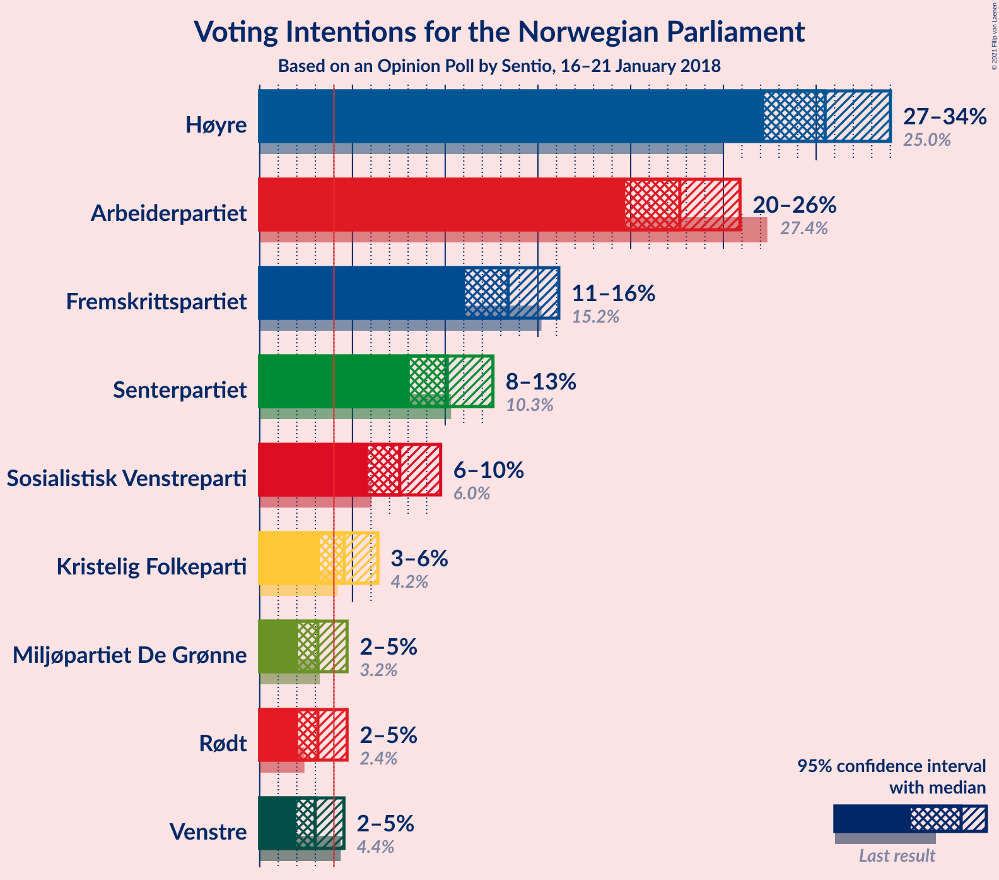

### Confidence Intervals

| Party | Last Result | Poll Result | 80% Confidence Interval | 90% Confidence Interval | 95% Confidence Interval | 99% Confidence Interval |
|:-----:|:-----------:|:-----------:|:-----------------------:|:-----------------------:|:-----------------------:|:-----------------------:|
| Høyre | 25.0% | 30.5% | 28.3–32.8% |27.7–33.4% |27.2–34.0% |26.2–35.1% |
| Arbeiderpartiet | 27.4% | 22.6% | 20.7–24.8% |20.2–25.4% |19.7–25.9% |18.8–26.9% |
| Fremskrittspartiet | 15.2% | 13.4% | 11.9–15.2% |11.4–15.7% |11.1–16.1% |10.4–17.0% |
| Senterpartiet | 10.3% | 10.1% | 8.8–11.7% |8.4–12.2% |8.1–12.6% |7.5–13.4% |
| Sosialistisk Venstreparti | 6.0% | 7.5% | 6.4–9.0% |6.1–9.4% |5.8–9.8% |5.3–10.5% |
| Kristelig Folkeparti | 4.2% | 4.6% | 3.7–5.7% |3.4–6.1% |3.2–6.4% |2.9–7.0% |
| Rødt | 2.4% | 3.1% | 2.4–4.2% |2.2–4.5% |2.1–4.7% |1.8–5.2% |
| Miljøpartiet De Grønne | 3.2% | 3.1% | 2.4–4.2% |2.2–4.5% |2.1–4.7% |1.8–5.2% |
| Venstre | 4.4% | 3.0% | 2.3–4.0% |2.1–4.3% |2.0–4.5% |1.7–5.1% |

*Note:* The poll result column reflects the actual value used in the calculations. Published results may vary slightly, and in addition be rounded to fewer digits.

## Seats

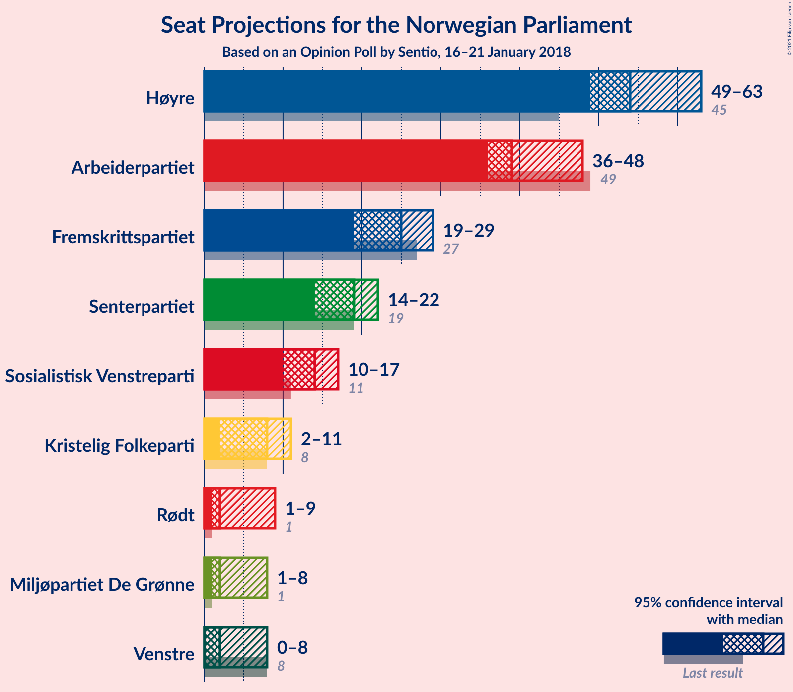

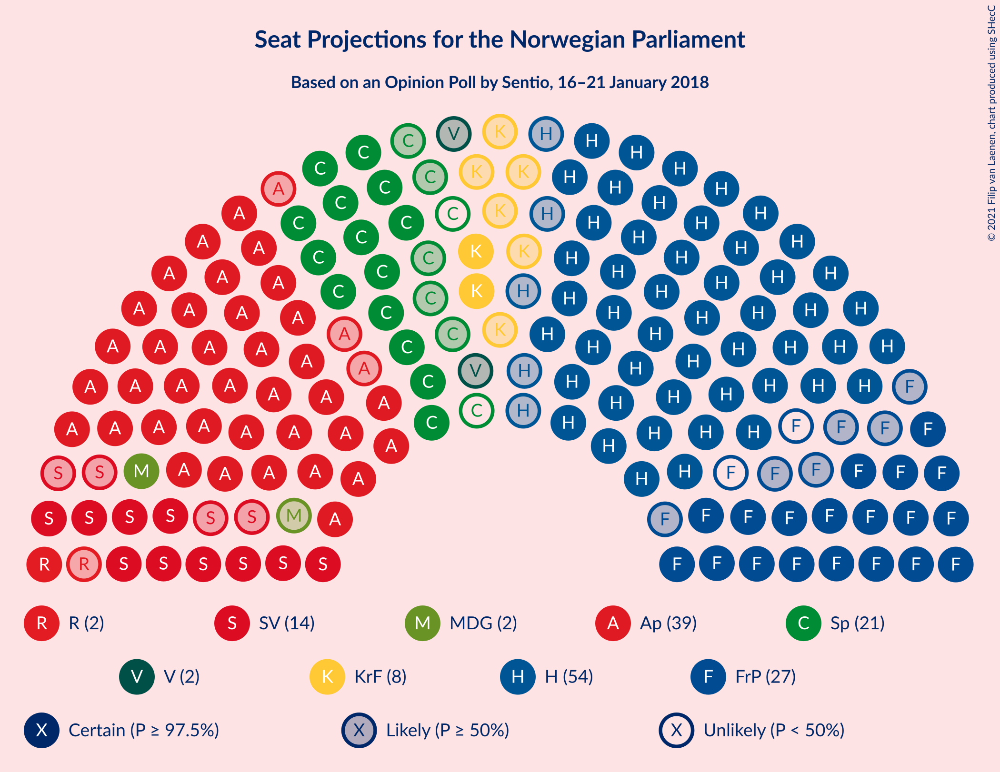

### Confidence Intervals

| Party | Last Result | Median | 80% Confidence Interval | 90% Confidence Interval | 95% Confidence Interval | 99% Confidence Interval |
|:-----:|:-----------:|:------:|:-----------------------:|:-----------------------:|:-----------------------:|:-----------------------:|
| <a href="#høyre">Høyre</a> | 45 | 54 | 51–60 |50–61 |49–63 |45–65 |
| <a href="#arbeiderpartiet">Arbeiderpartiet</a> | 49 | 39 | 38–47 |37–47 |36–48 |36–50 |
| <a href="#fremskrittspartiet">Fremskrittspartiet</a> | 27 | 25 | 21–28 |20–28 |19–29 |19–31 |
| <a href="#senterpartiet">Senterpartiet</a> | 19 | 19 | 15–21 |15–21 |14–22 |13–24 |
| <a href="#sosialistisk-venstreparti">Sosialistisk Venstreparti</a> | 11 | 14 | 12–17 |11–17 |10–17 |10–18 |
| <a href="#kristelig-folkeparti">Kristelig Folkeparti</a> | 8 | 8 | 3–10 |3–11 |2–11 |1–13 |
| <a href="#rødt">Rødt</a> | 1 | 2 | 1–8 |1–9 |1–9 |1–10 |
| <a href="#miljøpartiet-de-grønne">Miljøpartiet De Grønne</a> | 1 | 2 | 1–2 |1–7 |1–8 |0–9 |
| <a href="#venstre">Venstre</a> | 8 | 2 | 2–7 |1–8 |0–8 |0–9 |

### Høyre

*For a full overview of the results for this party, see the [Høyre](party-høyre.html) page.*

| Number of Seats | Probability | Accumulated | Special Marks |
|:---------------:|:-----------:|:-----------:|:-------------:|
| 45 | 0.5% | 100% | Last Result |
| 46 | 0.2% | 99.5% |  |
| 47 | 0.2% | 99.3% |  |
| 48 | 0.5% | 99.1% |  |
| 49 | 2% | 98.6% |  |
| 50 | 2% | 97% |  |
| 51 | 6% | 94% |  |
| 52 | 11% | 88% |  |
| 53 | 4% | 77% |  |
| 54 | 26% | 73% | Median |
| 55 | 8% | 48% |  |
| 56 | 10% | 40% |  |
| 57 | 7% | 30% |  |
| 58 | 4% | 23% |  |
| 59 | 2% | 19% |  |
| 60 | 8% | 16% |  |
| 61 | 4% | 8% |  |
| 62 | 0.8% | 4% |  |
| 63 | 2% | 3% |  |
| 64 | 0.2% | 1.3% |  |
| 65 | 1.0% | 1.1% |  |
| 66 | 0% | 0.1% |  |
| 67 | 0% | 0.1% |  |
| 68 | 0% | 0.1% |  |
| 69 | 0.1% | 0.1% |  |
| 70 | 0% | 0% |  |

### Arbeiderpartiet

*For a full overview of the results for this party, see the [Arbeiderpartiet](party-arbeiderpartiet.html) page.*

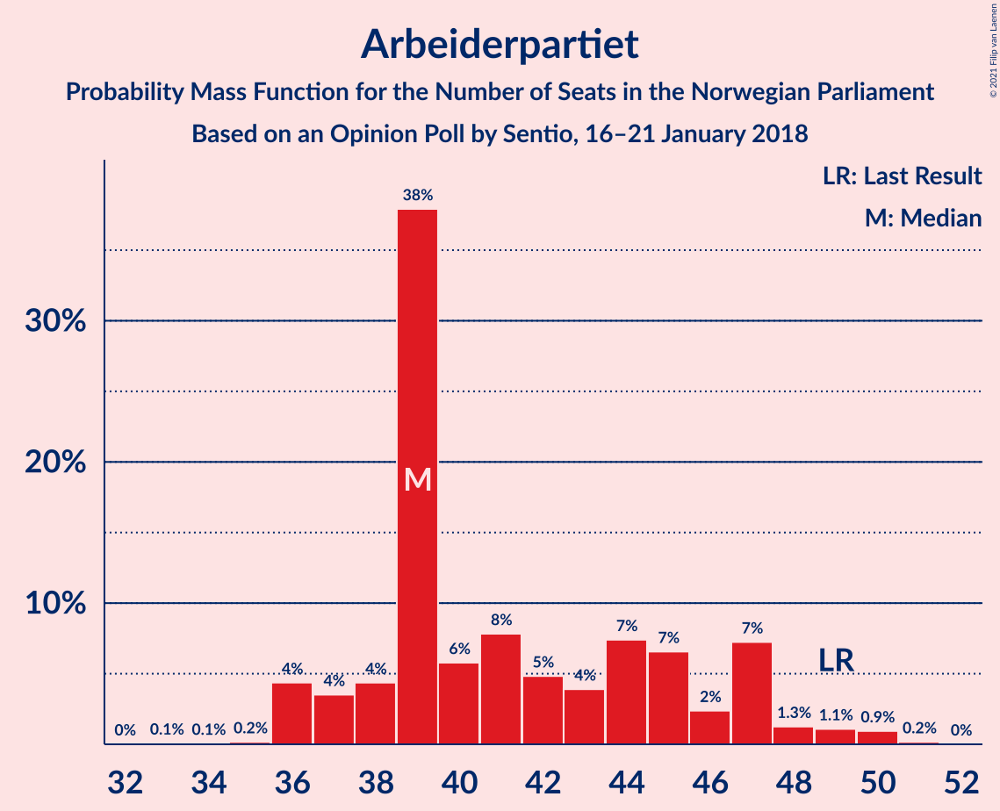

| Number of Seats | Probability | Accumulated | Special Marks |
|:---------------:|:-----------:|:-----------:|:-------------:|
| 33 | 0.1% | 100% |  |
| 34 | 0.1% | 99.9% |  |
| 35 | 0.2% | 99.8% |  |
| 36 | 4% | 99.6% |  |
| 37 | 4% | 95% |  |
| 38 | 4% | 92% |  |
| 39 | 38% | 87% | Median |
| 40 | 6% | 49% |  |
| 41 | 8% | 44% |  |
| 42 | 5% | 36% |  |
| 43 | 4% | 31% |  |
| 44 | 7% | 27% |  |
| 45 | 7% | 20% |  |
| 46 | 2% | 13% |  |
| 47 | 7% | 11% |  |
| 48 | 1.3% | 3% |  |
| 49 | 1.1% | 2% | Last Result |
| 50 | 0.9% | 1.2% |  |
| 51 | 0.2% | 0.2% |  |
| 52 | 0% | 0% |  |

### Fremskrittspartiet

*For a full overview of the results for this party, see the [Fremskrittspartiet](party-fremskrittspartiet.html) page.*

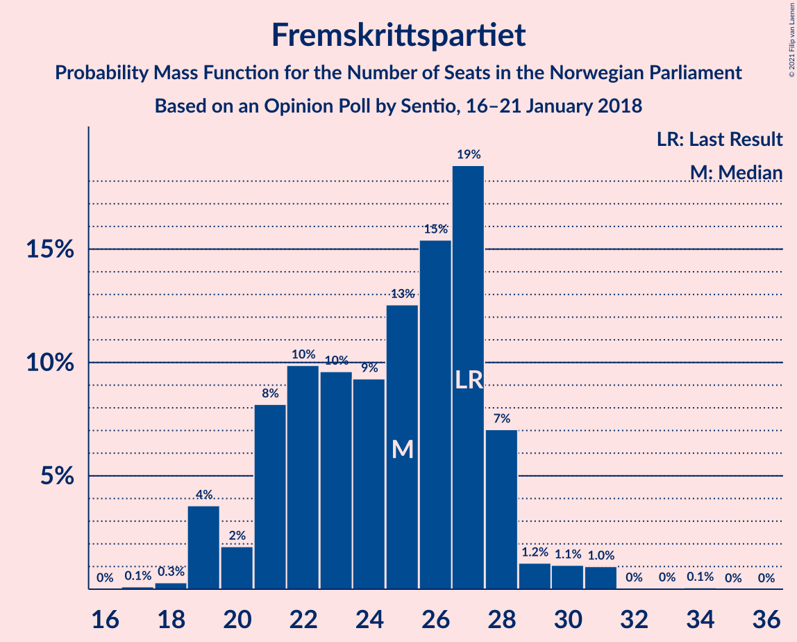

| Number of Seats | Probability | Accumulated | Special Marks |
|:---------------:|:-----------:|:-----------:|:-------------:|
| 17 | 0.1% | 100% |  |
| 18 | 0.3% | 99.9% |  |
| 19 | 4% | 99.6% |  |
| 20 | 2% | 96% |  |
| 21 | 8% | 94% |  |
| 22 | 10% | 86% |  |
| 23 | 10% | 76% |  |
| 24 | 9% | 66% |  |
| 25 | 13% | 57% | Median |
| 26 | 15% | 45% |  |
| 27 | 19% | 29% | Last Result |
| 28 | 7% | 10% |  |
| 29 | 1.2% | 3% |  |
| 30 | 1.1% | 2% |  |
| 31 | 1.0% | 1.2% |  |
| 32 | 0% | 0.2% |  |
| 33 | 0% | 0.1% |  |
| 34 | 0.1% | 0.1% |  |
| 35 | 0% | 0% |  |

### Senterpartiet

*For a full overview of the results for this party, see the [Senterpartiet](party-senterpartiet.html) page.*

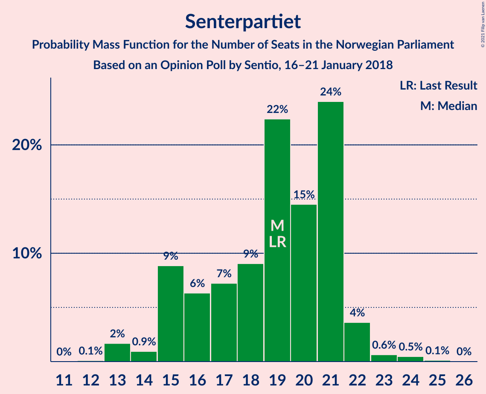

| Number of Seats | Probability | Accumulated | Special Marks |
|:---------------:|:-----------:|:-----------:|:-------------:|
| 12 | 0.1% | 100% |  |
| 13 | 2% | 99.9% |  |
| 14 | 0.9% | 98% |  |
| 15 | 9% | 97% |  |
| 16 | 6% | 88% |  |
| 17 | 7% | 82% |  |
| 18 | 9% | 75% |  |
| 19 | 22% | 66% | Last Result, Median |
| 20 | 15% | 43% |  |
| 21 | 24% | 29% |  |
| 22 | 4% | 5% |  |
| 23 | 0.6% | 1.3% |  |
| 24 | 0.5% | 0.6% |  |
| 25 | 0.1% | 0.2% |  |
| 26 | 0% | 0% |  |

### Sosialistisk Venstreparti

*For a full overview of the results for this party, see the [Sosialistisk Venstreparti](party-sosialistiskvenstreparti.html) page.*

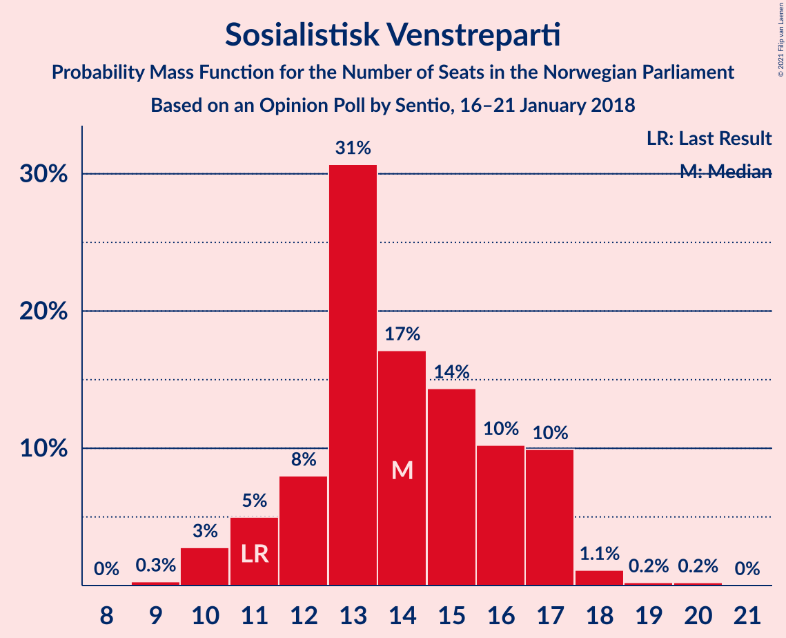

| Number of Seats | Probability | Accumulated | Special Marks |
|:---------------:|:-----------:|:-----------:|:-------------:|
| 9 | 0.3% | 100% |  |
| 10 | 3% | 99.7% |  |
| 11 | 5% | 97% | Last Result |
| 12 | 8% | 92% |  |
| 13 | 31% | 84% |  |
| 14 | 17% | 53% | Median |
| 15 | 14% | 36% |  |
| 16 | 10% | 22% |  |
| 17 | 10% | 12% |  |
| 18 | 1.1% | 2% |  |
| 19 | 0.2% | 0.5% |  |
| 20 | 0.2% | 0.3% |  |
| 21 | 0% | 0% |  |

### Kristelig Folkeparti

*For a full overview of the results for this party, see the [Kristelig Folkeparti](party-kristeligfolkeparti.html) page.*

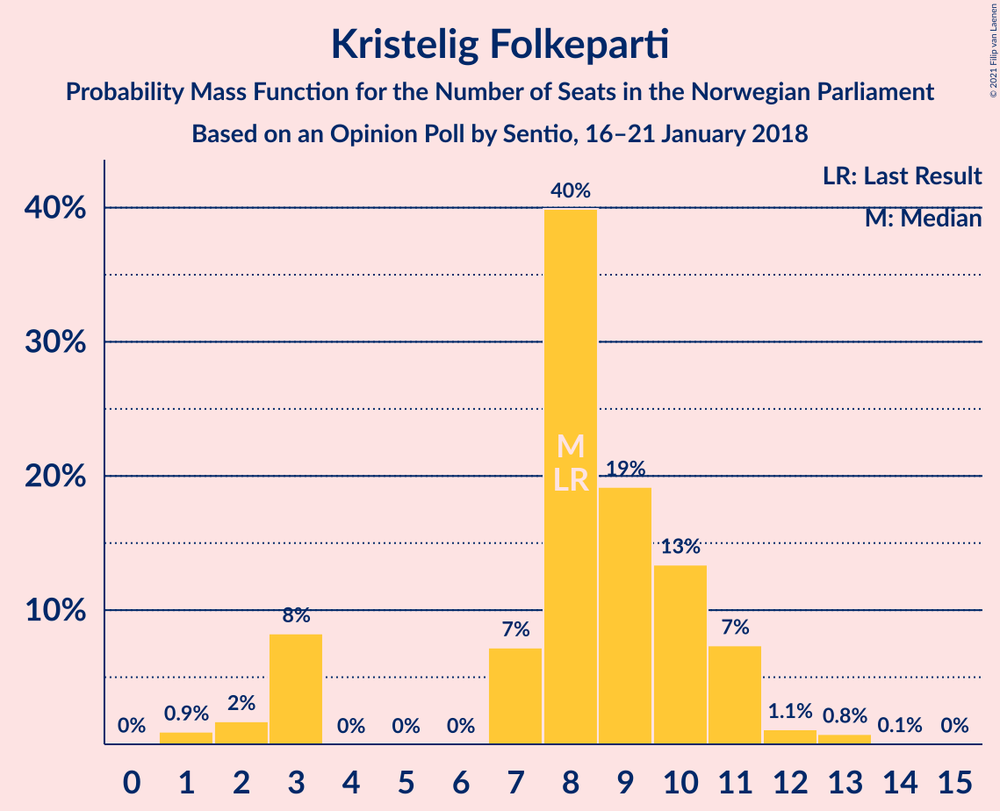

| Number of Seats | Probability | Accumulated | Special Marks |
|:---------------:|:-----------:|:-----------:|:-------------:|
| 1 | 0.9% | 100% |  |
| 2 | 2% | 99.0% |  |
| 3 | 8% | 97% |  |
| 4 | 0% | 89% |  |
| 5 | 0% | 89% |  |
| 6 | 0% | 89% |  |
| 7 | 7% | 89% |  |
| 8 | 40% | 82% | Last Result, Median |
| 9 | 19% | 42% |  |
| 10 | 13% | 23% |  |
| 11 | 7% | 9% |  |
| 12 | 1.1% | 2% |  |
| 13 | 0.8% | 0.9% |  |
| 14 | 0.1% | 0.1% |  |
| 15 | 0% | 0% |  |

### Rødt

*For a full overview of the results for this party, see the [Rødt](party-rødt.html) page.*

| Number of Seats | Probability | Accumulated | Special Marks |
|:---------------:|:-----------:|:-----------:|:-------------:|
| 1 | 44% | 100% | Last Result |
| 2 | 42% | 56% | Median |
| 3 | 0% | 14% |  |
| 4 | 0% | 14% |  |
| 5 | 0% | 14% |  |
| 6 | 0% | 14% |  |
| 7 | 3% | 14% |  |
| 8 | 5% | 11% |  |
| 9 | 5% | 6% |  |
| 10 | 0.5% | 0.5% |  |
| 11 | 0.1% | 0.1% |  |
| 12 | 0% | 0% |  |

### Miljøpartiet De Grønne

*For a full overview of the results for this party, see the [Miljøpartiet De Grønne](party-miljøpartietdegrønne.html) page.*

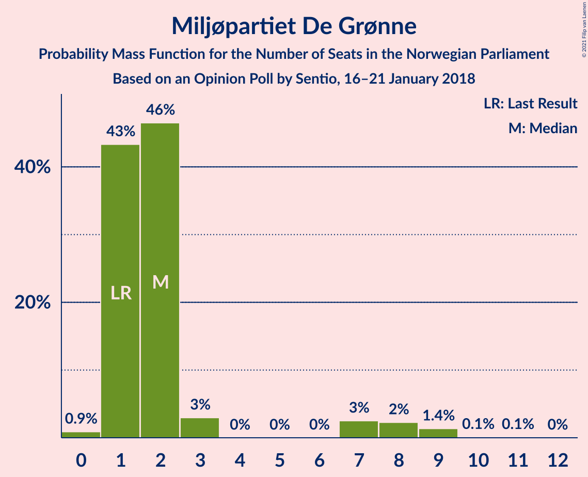

| Number of Seats | Probability | Accumulated | Special Marks |
|:---------------:|:-----------:|:-----------:|:-------------:|
| 0 | 0.9% | 100% |  |
| 1 | 43% | 99.1% | Last Result |
| 2 | 46% | 56% | Median |
| 3 | 3% | 9% |  |
| 4 | 0% | 6% |  |
| 5 | 0% | 6% |  |
| 6 | 0% | 6% |  |
| 7 | 3% | 6% |  |
| 8 | 2% | 4% |  |
| 9 | 1.4% | 2% |  |
| 10 | 0.1% | 0.2% |  |
| 11 | 0.1% | 0.1% |  |
| 12 | 0% | 0% |  |

### Venstre

*For a full overview of the results for this party, see the [Venstre](party-venstre.html) page.*

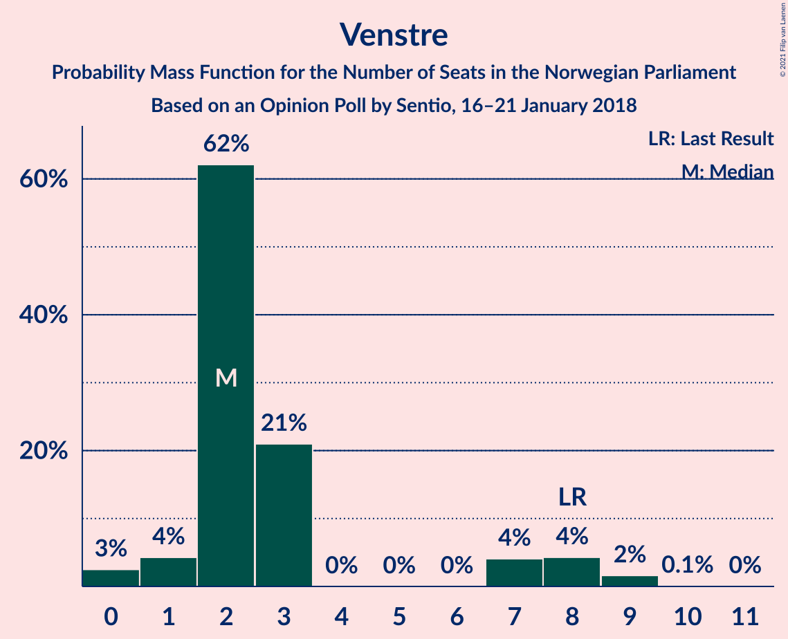

| Number of Seats | Probability | Accumulated | Special Marks |
|:---------------:|:-----------:|:-----------:|:-------------:|
| 0 | 3% | 100% |  |
| 1 | 4% | 97% |  |
| 2 | 62% | 93% | Median |
| 3 | 21% | 31% |  |
| 4 | 0% | 10% |  |
| 5 | 0% | 10% |  |
| 6 | 0% | 10% |  |
| 7 | 4% | 10% |  |
| 8 | 4% | 6% | Last Result |
| 9 | 2% | 2% |  |
| 10 | 0.1% | 0.1% |  |
| 11 | 0% | 0% |  |

## Coalitions

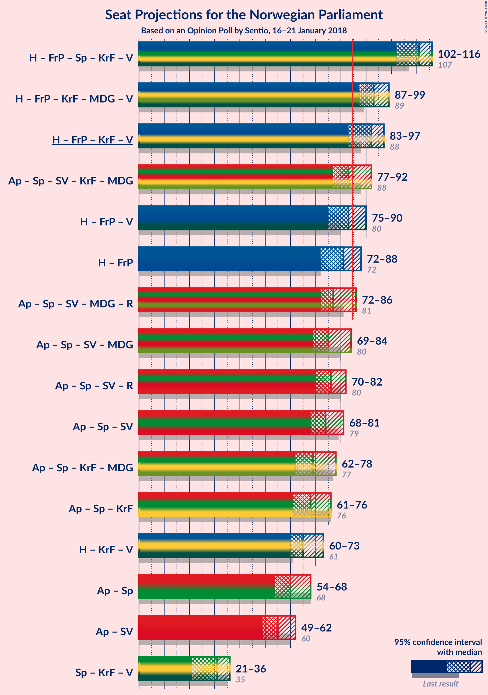

### Confidence Intervals

| Coalition | Last Result | Median | Majority? | 80% Confidence Interval | 90% Confidence Interval | 95% Confidence Interval | 99% Confidence Interval |
|:---------:|:-----------:|:------:|:---------:|:-----------------------:|:-----------------------:|:-----------------------:|:-----------------------:|
| Høyre – Fremskrittspartiet – Senterpartiet – Kristelig Folkeparti – Venstre | 107 | 111 | 100% | 104–113 | 103–115 | 102–116 | 98–118 |
| Høyre – Fremskrittspartiet – Kristelig Folkeparti – Miljøpartiet De Grønne – Venstre | 89 | 93 | 98.9% | 87–97 | 87–99 | 87–99 | 83–101 |
| Høyre – Fremskrittspartiet – Kristelig Folkeparti – Venstre | 88 | 92 | 95% | 85–94 | 85–96 | 83–97 | 80–99 |
| Arbeiderpartiet – Senterpartiet – Sosialistisk Venstreparti – Kristelig Folkeparti – Miljøpartiet De Grønne | 88 | 83 | 43% | 79–89 | 78–92 | 77–92 | 72–94 |
| Høyre – Fremskrittspartiet – Venstre | 80 | 83 | 25% | 77–87 | 76–89 | 75–90 | 72–95 |
| Høyre – Fremskrittspartiet | 72 | 81 | 8% | 74–83 | 74–86 | 72–88 | 70–90 |
| Arbeiderpartiet – Senterpartiet – Sosialistisk Venstreparti – Miljøpartiet De Grønne – Rødt | 81 | 77 | 4% | 75–84 | 73–84 | 72–86 | 70–88 |
| Arbeiderpartiet – Senterpartiet – Sosialistisk Venstreparti – Miljøpartiet De Grønne | 80 | 75 | 1.1% | 71–81 | 70–83 | 69–84 | 68–85 |
| Arbeiderpartiet – Senterpartiet – Sosialistisk Venstreparti – Rødt | 80 | 76 | 1.0% | 72–82 | 70–82 | 70–82 | 68–86 |
| Arbeiderpartiet – Senterpartiet – Sosialistisk Venstreparti | 79 | 74 | 0.2% | 69–79 | 68–81 | 68–81 | 66–83 |
| Arbeiderpartiet – Senterpartiet – Kristelig Folkeparti – Miljøpartiet De Grønne | 77 | 69 | 0% | 66–76 | 64–78 | 62–78 | 59–81 |
| Arbeiderpartiet – Senterpartiet – Kristelig Folkeparti | 76 | 68 | 0% | 65–73 | 62–76 | 61–76 | 57–78 |
| Høyre – Kristelig Folkeparti – Venstre | 61 | 65 | 0% | 62–71 | 61–72 | 60–73 | 56–73 |
| Arbeiderpartiet – Senterpartiet | 68 | 60 | 0% | 56–65 | 55–67 | 54–68 | 53–69 |
| Arbeiderpartiet – Sosialistisk Venstreparti | 60 | 55 | 0% | 51–61 | 49–62 | 49–62 | 47–63 |
| Senterpartiet – Kristelig Folkeparti – Venstre | 35 | 31 | 0% | 23–33 | 22–36 | 21–36 | 19–39 |

### Høyre – Fremskrittspartiet – Senterpartiet – Kristelig Folkeparti – Venstre

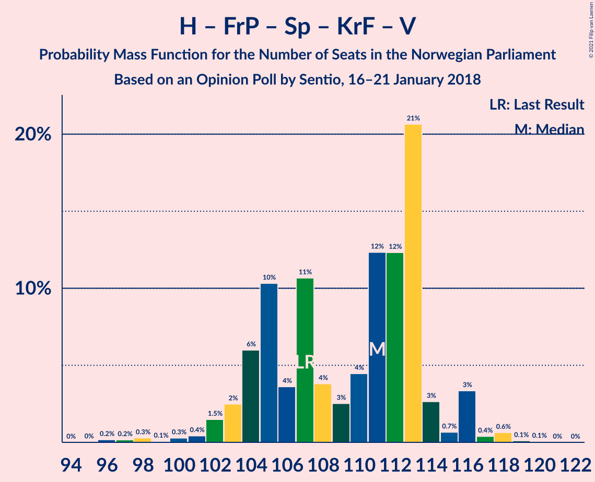

| Number of Seats | Probability | Accumulated | Special Marks |
|:---------------:|:-----------:|:-----------:|:-------------:|
| 96 | 0.2% | 100% |  |
| 97 | 0.2% | 99.8% |  |
| 98 | 0.3% | 99.6% |  |
| 99 | 0.1% | 99.3% |  |
| 100 | 0.3% | 99.3% |  |
| 101 | 0.4% | 99.0% |  |
| 102 | 1.5% | 98.5% |  |
| 103 | 2% | 97% |  |
| 104 | 6% | 95% |  |
| 105 | 10% | 89% |  |
| 106 | 4% | 78% |  |
| 107 | 11% | 75% | Last Result |
| 108 | 4% | 64% | Median |
| 109 | 3% | 60% |  |
| 110 | 4% | 58% |  |
| 111 | 12% | 53% |  |
| 112 | 12% | 41% |  |
| 113 | 21% | 29% |  |
| 114 | 3% | 8% |  |
| 115 | 0.7% | 5% |  |
| 116 | 3% | 5% |  |
| 117 | 0.4% | 1.2% |  |
| 118 | 0.6% | 0.8% |  |
| 119 | 0.1% | 0.2% |  |
| 120 | 0.1% | 0.1% |  |
| 121 | 0% | 0% |  |

### Høyre – Fremskrittspartiet – Kristelig Folkeparti – Miljøpartiet De Grønne – Venstre

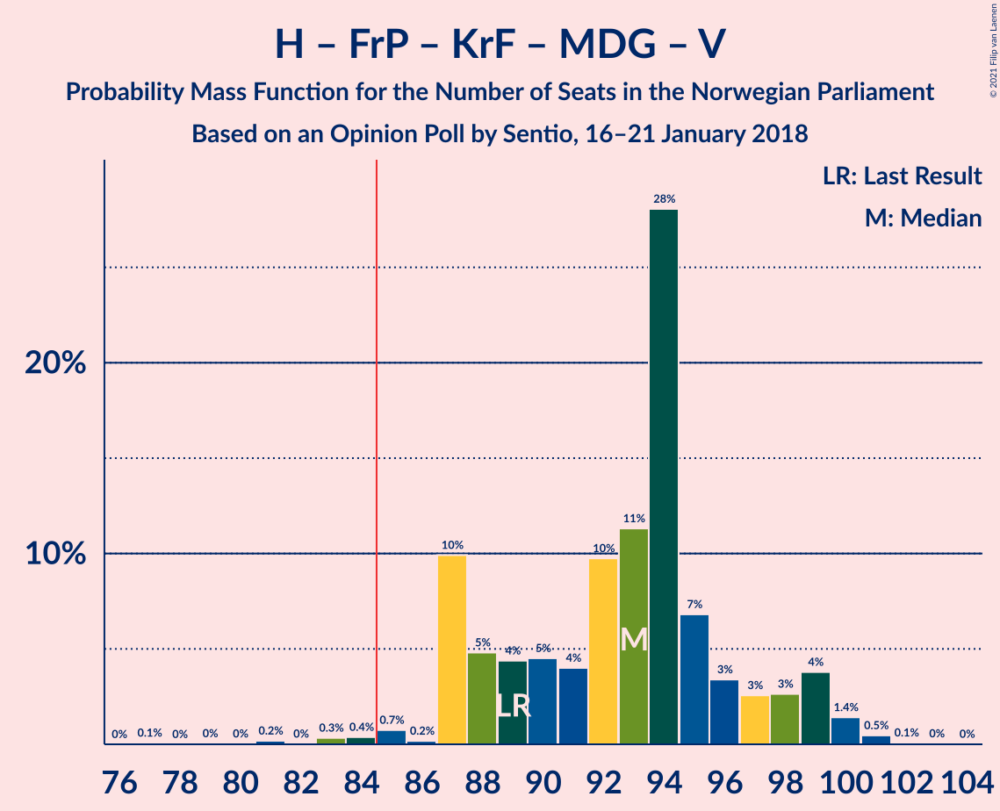

| Number of Seats | Probability | Accumulated | Special Marks |
|:---------------:|:-----------:|:-----------:|:-------------:|
| 77 | 0.1% | 100% |  |
| 78 | 0% | 99.9% |  |
| 79 | 0% | 99.9% |  |
| 80 | 0% | 99.9% |  |
| 81 | 0.2% | 99.8% |  |
| 82 | 0% | 99.7% |  |
| 83 | 0.3% | 99.6% |  |
| 84 | 0.4% | 99.3% |  |
| 85 | 0.7% | 98.9% | Majority |
| 86 | 0.2% | 98% |  |
| 87 | 10% | 98% |  |
| 88 | 5% | 88% |  |
| 89 | 4% | 83% | Last Result |
| 90 | 5% | 79% |  |
| 91 | 4% | 74% | Median |
| 92 | 10% | 70% |  |
| 93 | 11% | 61% |  |
| 94 | 28% | 49% |  |
| 95 | 7% | 21% |  |
| 96 | 3% | 14% |  |
| 97 | 3% | 11% |  |
| 98 | 3% | 8% |  |
| 99 | 4% | 6% |  |
| 100 | 1.4% | 2% |  |
| 101 | 0.5% | 0.6% |  |
| 102 | 0.1% | 0.2% |  |
| 103 | 0% | 0.1% |  |
| 104 | 0% | 0% |  |

### Høyre – Fremskrittspartiet – Kristelig Folkeparti – Venstre

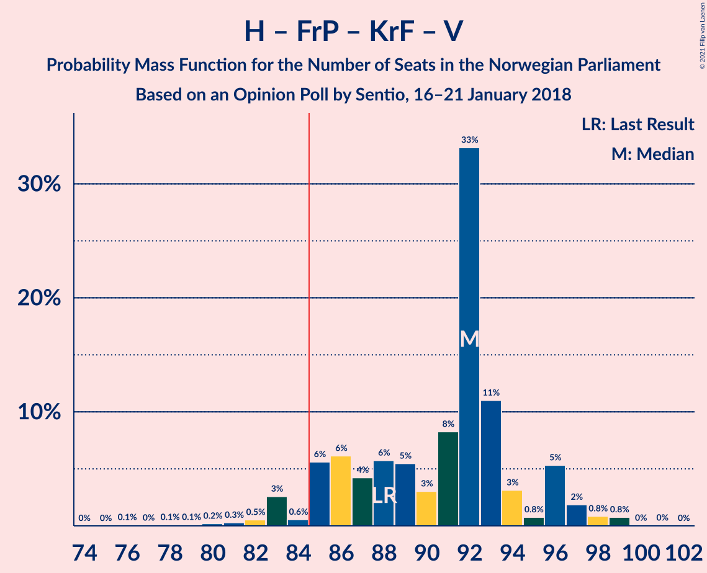

| Number of Seats | Probability | Accumulated | Special Marks |
|:---------------:|:-----------:|:-----------:|:-------------:|
| 76 | 0.1% | 100% |  |
| 77 | 0% | 99.9% |  |
| 78 | 0.1% | 99.9% |  |
| 79 | 0.1% | 99.8% |  |
| 80 | 0.2% | 99.7% |  |
| 81 | 0.3% | 99.5% |  |
| 82 | 0.5% | 99.2% |  |
| 83 | 3% | 98.6% |  |
| 84 | 0.6% | 96% |  |
| 85 | 6% | 95% | Majority |
| 86 | 6% | 90% |  |
| 87 | 4% | 84% |  |
| 88 | 6% | 80% | Last Result |
| 89 | 5% | 74% | Median |
| 90 | 3% | 68% |  |
| 91 | 8% | 65% |  |
| 92 | 33% | 57% |  |
| 93 | 11% | 24% |  |
| 94 | 3% | 13% |  |
| 95 | 0.8% | 10% |  |
| 96 | 5% | 9% |  |
| 97 | 2% | 4% |  |
| 98 | 0.8% | 2% |  |
| 99 | 0.8% | 0.9% |  |
| 100 | 0% | 0.1% |  |
| 101 | 0% | 0.1% |  |
| 102 | 0% | 0% |  |

### Arbeiderpartiet – Senterpartiet – Sosialistisk Venstreparti – Kristelig Folkeparti – Miljøpartiet De Grønne

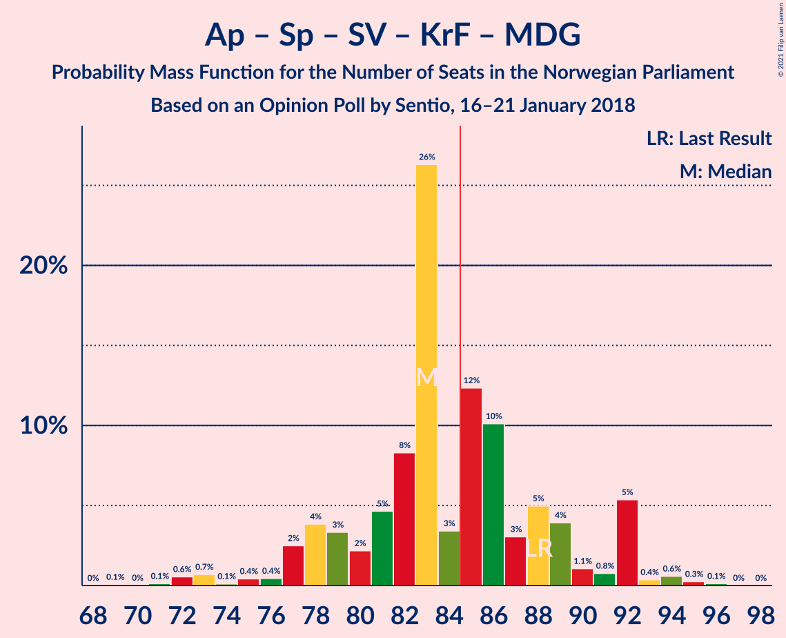

| Number of Seats | Probability | Accumulated | Special Marks |
|:---------------:|:-----------:|:-----------:|:-------------:|
| 69 | 0.1% | 100% |  |
| 70 | 0% | 99.9% |  |
| 71 | 0.1% | 99.9% |  |
| 72 | 0.6% | 99.8% |  |
| 73 | 0.7% | 99.2% |  |
| 74 | 0.1% | 98.5% |  |
| 75 | 0.4% | 98% |  |
| 76 | 0.4% | 98% |  |
| 77 | 2% | 98% |  |
| 78 | 4% | 95% |  |
| 79 | 3% | 91% |  |
| 80 | 2% | 88% |  |
| 81 | 5% | 86% |  |
| 82 | 8% | 81% | Median |
| 83 | 26% | 73% |  |
| 84 | 3% | 46% |  |
| 85 | 12% | 43% | Majority |
| 86 | 10% | 31% |  |
| 87 | 3% | 21% |  |
| 88 | 5% | 17% | Last Result |
| 89 | 4% | 13% |  |
| 90 | 1.1% | 9% |  |
| 91 | 0.8% | 8% |  |
| 92 | 5% | 7% |  |
| 93 | 0.4% | 1.4% |  |
| 94 | 0.6% | 1.0% |  |
| 95 | 0.3% | 0.4% |  |
| 96 | 0.1% | 0.2% |  |
| 97 | 0% | 0% |  |

### Høyre – Fremskrittspartiet – Venstre

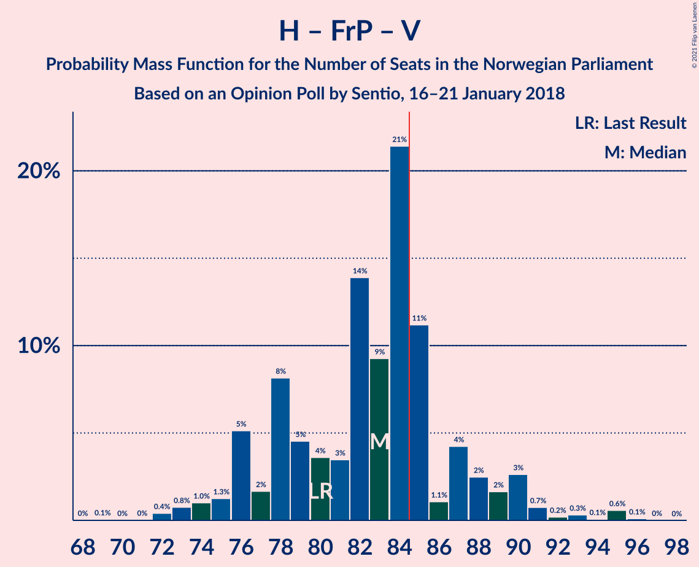

| Number of Seats | Probability | Accumulated | Special Marks |
|:---------------:|:-----------:|:-----------:|:-------------:|
| 69 | 0.1% | 100% |  |
| 70 | 0% | 99.9% |  |
| 71 | 0% | 99.9% |  |
| 72 | 0.4% | 99.9% |  |
| 73 | 0.8% | 99.5% |  |
| 74 | 1.0% | 98.7% |  |
| 75 | 1.3% | 98% |  |
| 76 | 5% | 96% |  |
| 77 | 2% | 91% |  |
| 78 | 8% | 90% |  |
| 79 | 5% | 81% |  |
| 80 | 4% | 77% | Last Result |
| 81 | 3% | 73% | Median |
| 82 | 14% | 70% |  |
| 83 | 9% | 56% |  |
| 84 | 21% | 47% |  |
| 85 | 11% | 25% | Majority |
| 86 | 1.1% | 14% |  |
| 87 | 4% | 13% |  |
| 88 | 2% | 9% |  |
| 89 | 2% | 6% |  |
| 90 | 3% | 5% |  |
| 91 | 0.7% | 2% |  |
| 92 | 0.2% | 1.3% |  |
| 93 | 0.3% | 1.1% |  |
| 94 | 0.1% | 0.8% |  |
| 95 | 0.6% | 0.7% |  |
| 96 | 0.1% | 0.1% |  |
| 97 | 0% | 0% |  |

### Høyre – Fremskrittspartiet

| Number of Seats | Probability | Accumulated | Special Marks |
|:---------------:|:-----------:|:-----------:|:-------------:|
| 68 | 0.1% | 100% |  |
| 69 | 0.1% | 99.9% |  |
| 70 | 1.0% | 99.8% |  |
| 71 | 0.8% | 98.8% |  |
| 72 | 1.2% | 98% | Last Result |
| 73 | 1.4% | 97% |  |
| 74 | 5% | 95% |  |
| 75 | 2% | 90% |  |
| 76 | 6% | 88% |  |
| 77 | 7% | 81% |  |
| 78 | 4% | 74% |  |
| 79 | 5% | 70% | Median |
| 80 | 14% | 65% |  |
| 81 | 27% | 51% |  |
| 82 | 4% | 24% |  |
| 83 | 10% | 19% |  |
| 84 | 0.9% | 9% |  |
| 85 | 1.1% | 8% | Majority |
| 86 | 2% | 7% |  |
| 87 | 1.5% | 5% |  |
| 88 | 2% | 3% |  |
| 89 | 0.9% | 2% |  |
| 90 | 0.1% | 0.6% |  |
| 91 | 0.3% | 0.5% |  |
| 92 | 0% | 0.2% |  |
| 93 | 0% | 0.1% |  |
| 94 | 0.1% | 0.1% |  |
| 95 | 0% | 0% |  |

### Arbeiderpartiet – Senterpartiet – Sosialistisk Venstreparti – Miljøpartiet De Grønne – Rødt

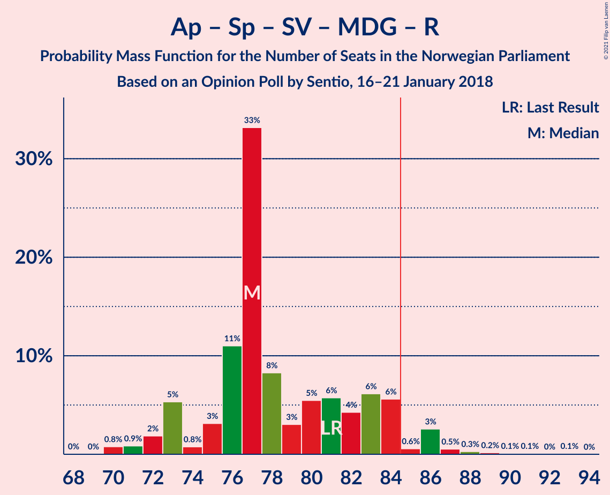

| Number of Seats | Probability | Accumulated | Special Marks |
|:---------------:|:-----------:|:-----------:|:-------------:|
| 68 | 0% | 100% |  |
| 69 | 0% | 99.9% |  |
| 70 | 0.8% | 99.9% |  |
| 71 | 0.9% | 99.1% |  |
| 72 | 2% | 98% |  |
| 73 | 5% | 96% |  |
| 74 | 0.8% | 91% |  |
| 75 | 3% | 90% |  |
| 76 | 11% | 87% | Median |
| 77 | 33% | 76% |  |
| 78 | 8% | 43% |  |
| 79 | 3% | 35% |  |
| 80 | 5% | 32% |  |
| 81 | 6% | 26% | Last Result |
| 82 | 4% | 20% |  |
| 83 | 6% | 16% |  |
| 84 | 6% | 10% |  |
| 85 | 0.6% | 4% | Majority |
| 86 | 3% | 4% |  |
| 87 | 0.5% | 1.3% |  |
| 88 | 0.3% | 0.8% |  |
| 89 | 0.2% | 0.5% |  |
| 90 | 0.1% | 0.3% |  |
| 91 | 0.1% | 0.2% |  |
| 92 | 0% | 0.1% |  |
| 93 | 0.1% | 0.1% |  |
| 94 | 0% | 0% |  |

### Arbeiderpartiet – Senterpartiet – Sosialistisk Venstreparti – Miljøpartiet De Grønne

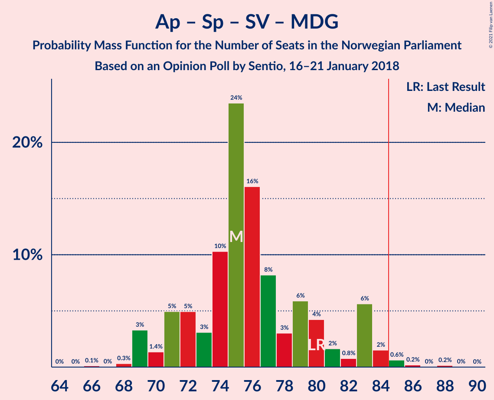

| Number of Seats | Probability | Accumulated | Special Marks |
|:---------------:|:-----------:|:-----------:|:-------------:|
| 66 | 0.1% | 100% |  |
| 67 | 0% | 99.8% |  |
| 68 | 0.3% | 99.8% |  |
| 69 | 3% | 99.5% |  |
| 70 | 1.4% | 96% |  |
| 71 | 5% | 95% |  |
| 72 | 5% | 90% |  |
| 73 | 3% | 85% |  |
| 74 | 10% | 82% | Median |
| 75 | 24% | 72% |  |
| 76 | 16% | 48% |  |
| 77 | 8% | 32% |  |
| 78 | 3% | 24% |  |
| 79 | 6% | 21% |  |
| 80 | 4% | 15% | Last Result |
| 81 | 2% | 11% |  |
| 82 | 0.8% | 9% |  |
| 83 | 6% | 8% |  |
| 84 | 2% | 3% |  |
| 85 | 0.6% | 1.1% | Majority |
| 86 | 0.2% | 0.4% |  |
| 87 | 0% | 0.2% |  |
| 88 | 0.2% | 0.2% |  |
| 89 | 0% | 0% |  |

### Arbeiderpartiet – Senterpartiet – Sosialistisk Venstreparti – Rødt

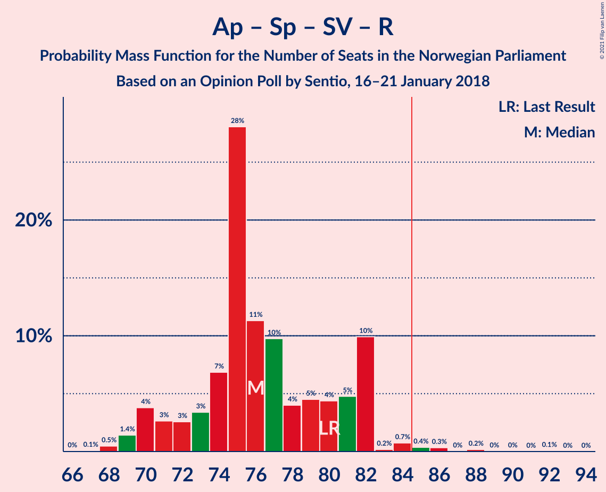

| Number of Seats | Probability | Accumulated | Special Marks |
|:---------------:|:-----------:|:-----------:|:-------------:|
| 66 | 0% | 100% |  |
| 67 | 0.1% | 99.9% |  |
| 68 | 0.5% | 99.8% |  |
| 69 | 1.4% | 99.4% |  |
| 70 | 4% | 98% |  |
| 71 | 3% | 94% |  |
| 72 | 3% | 92% |  |
| 73 | 3% | 89% |  |
| 74 | 7% | 86% | Median |
| 75 | 28% | 79% |  |
| 76 | 11% | 51% |  |
| 77 | 10% | 39% |  |
| 78 | 4% | 30% |  |
| 79 | 5% | 26% |  |
| 80 | 4% | 21% | Last Result |
| 81 | 5% | 17% |  |
| 82 | 10% | 12% |  |
| 83 | 0.2% | 2% |  |
| 84 | 0.7% | 2% |  |
| 85 | 0.4% | 1.0% | Majority |
| 86 | 0.3% | 0.7% |  |
| 87 | 0% | 0.3% |  |
| 88 | 0.2% | 0.3% |  |
| 89 | 0% | 0.1% |  |
| 90 | 0% | 0.1% |  |
| 91 | 0% | 0.1% |  |
| 92 | 0.1% | 0.1% |  |
| 93 | 0% | 0% |  |

### Arbeiderpartiet – Senterpartiet – Sosialistisk Venstreparti

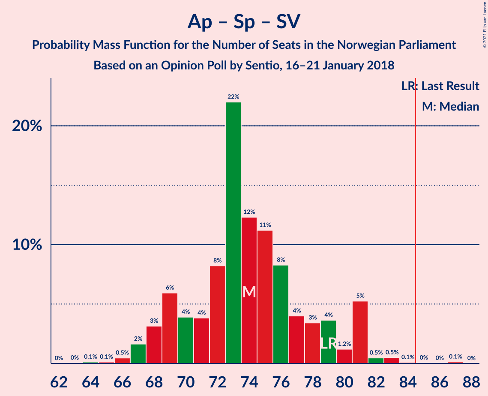

| Number of Seats | Probability | Accumulated | Special Marks |
|:---------------:|:-----------:|:-----------:|:-------------:|
| 63 | 0% | 100% |  |
| 64 | 0.1% | 99.9% |  |
| 65 | 0.1% | 99.8% |  |
| 66 | 0.5% | 99.7% |  |
| 67 | 2% | 99.2% |  |
| 68 | 3% | 98% |  |
| 69 | 6% | 94% |  |
| 70 | 4% | 89% |  |
| 71 | 4% | 85% |  |
| 72 | 8% | 81% | Median |
| 73 | 22% | 73% |  |
| 74 | 12% | 51% |  |
| 75 | 11% | 38% |  |
| 76 | 8% | 27% |  |
| 77 | 4% | 19% |  |
| 78 | 3% | 15% |  |
| 79 | 4% | 11% | Last Result |
| 80 | 1.2% | 8% |  |
| 81 | 5% | 7% |  |
| 82 | 0.5% | 1.3% |  |
| 83 | 0.5% | 0.8% |  |
| 84 | 0.1% | 0.3% |  |
| 85 | 0% | 0.2% | Majority |
| 86 | 0% | 0.2% |  |
| 87 | 0.1% | 0.1% |  |
| 88 | 0% | 0% |  |

### Arbeiderpartiet – Senterpartiet – Kristelig Folkeparti – Miljøpartiet De Grønne

| Number of Seats | Probability | Accumulated | Special Marks |
|:---------------:|:-----------:|:-----------:|:-------------:|
| 57 | 0.1% | 100% |  |
| 58 | 0.1% | 99.9% |  |
| 59 | 0.7% | 99.9% |  |
| 60 | 0.6% | 99.2% |  |
| 61 | 0.1% | 98.6% |  |
| 62 | 1.4% | 98.5% |  |
| 63 | 2% | 97% |  |
| 64 | 0.9% | 95% |  |
| 65 | 1.2% | 95% |  |
| 66 | 5% | 93% |  |
| 67 | 7% | 89% |  |
| 68 | 11% | 82% | Median |
| 69 | 21% | 70% |  |
| 70 | 19% | 49% |  |
| 71 | 6% | 30% |  |
| 72 | 3% | 24% |  |
| 73 | 3% | 21% |  |
| 74 | 6% | 18% |  |
| 75 | 2% | 12% |  |
| 76 | 1.0% | 10% |  |
| 77 | 1.4% | 9% | Last Result |
| 78 | 5% | 8% |  |
| 79 | 1.2% | 2% |  |
| 80 | 0.6% | 1.1% |  |
| 81 | 0.3% | 0.6% |  |
| 82 | 0.2% | 0.2% |  |
| 83 | 0% | 0% |  |

### Arbeiderpartiet – Senterpartiet – Kristelig Folkeparti

| Number of Seats | Probability | Accumulated | Special Marks |
|:---------------:|:-----------:|:-----------:|:-------------:|
| 55 | 0% | 100% |  |
| 56 | 0.2% | 99.9% |  |
| 57 | 0.7% | 99.7% |  |
| 58 | 0.6% | 99.0% |  |
| 59 | 0.1% | 98% |  |
| 60 | 0.5% | 98% |  |
| 61 | 3% | 98% |  |
| 62 | 1.4% | 95% |  |
| 63 | 2% | 94% |  |
| 64 | 2% | 92% |  |
| 65 | 10% | 91% |  |
| 66 | 11% | 81% | Median |
| 67 | 3% | 70% |  |
| 68 | 38% | 67% |  |
| 69 | 7% | 29% |  |
| 70 | 3% | 22% |  |
| 71 | 3% | 19% |  |
| 72 | 3% | 16% |  |
| 73 | 4% | 13% |  |
| 74 | 1.4% | 9% |  |
| 75 | 1.2% | 7% |  |
| 76 | 5% | 6% | Last Result |
| 77 | 0.2% | 2% |  |
| 78 | 1.0% | 1.4% |  |
| 79 | 0.4% | 0.4% |  |
| 80 | 0% | 0% |  |

### Høyre – Kristelig Folkeparti – Venstre

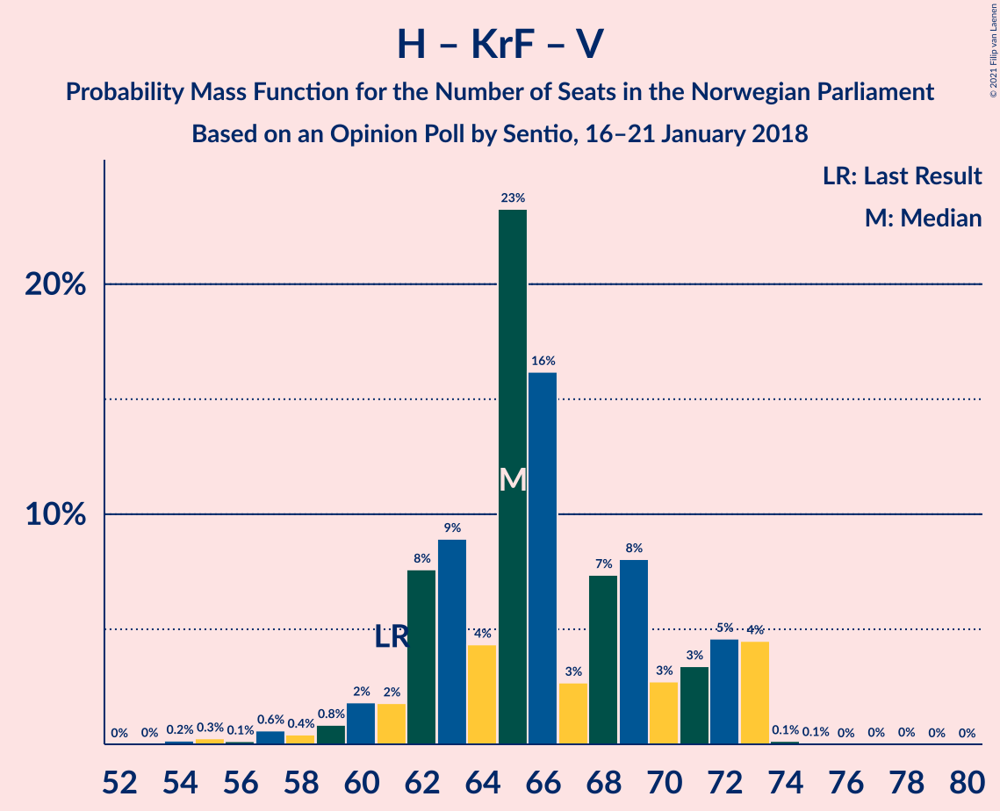

| Number of Seats | Probability | Accumulated | Special Marks |
|:---------------:|:-----------:|:-----------:|:-------------:|
| 54 | 0.2% | 100% |  |
| 55 | 0.3% | 99.8% |  |
| 56 | 0.1% | 99.5% |  |
| 57 | 0.6% | 99.4% |  |
| 58 | 0.4% | 98.8% |  |
| 59 | 0.8% | 98% |  |
| 60 | 2% | 98% |  |
| 61 | 2% | 96% | Last Result |
| 62 | 8% | 94% |  |
| 63 | 9% | 86% |  |
| 64 | 4% | 77% | Median |
| 65 | 23% | 73% |  |
| 66 | 16% | 50% |  |
| 67 | 3% | 34% |  |
| 68 | 7% | 31% |  |
| 69 | 8% | 24% |  |
| 70 | 3% | 16% |  |
| 71 | 3% | 13% |  |
| 72 | 5% | 9% |  |
| 73 | 4% | 5% |  |
| 74 | 0.1% | 0.3% |  |
| 75 | 0.1% | 0.2% |  |
| 76 | 0% | 0.1% |  |
| 77 | 0% | 0.1% |  |
| 78 | 0% | 0.1% |  |
| 79 | 0% | 0% |  |

### Arbeiderpartiet – Senterpartiet

| Number of Seats | Probability | Accumulated | Special Marks |
|:---------------:|:-----------:|:-----------:|:-------------:|
| 51 | 0.1% | 100% |  |
| 52 | 0.2% | 99.9% |  |
| 53 | 2% | 99.7% |  |
| 54 | 1.0% | 98% |  |
| 55 | 4% | 97% |  |
| 56 | 8% | 93% |  |
| 57 | 2% | 85% |  |
| 58 | 16% | 83% | Median |
| 59 | 11% | 67% |  |
| 60 | 29% | 56% |  |
| 61 | 3% | 26% |  |
| 62 | 5% | 24% |  |
| 63 | 3% | 19% |  |
| 64 | 3% | 16% |  |
| 65 | 4% | 13% |  |
| 66 | 1.0% | 9% |  |
| 67 | 5% | 8% |  |
| 68 | 1.1% | 3% | Last Result |
| 69 | 1.0% | 1.4% |  |
| 70 | 0.3% | 0.5% |  |
| 71 | 0.1% | 0.1% |  |
| 72 | 0% | 0% |  |

### Arbeiderpartiet – Sosialistisk Venstreparti

| Number of Seats | Probability | Accumulated | Special Marks |
|:---------------:|:-----------:|:-----------:|:-------------:|
| 45 | 0% | 100% |  |
| 46 | 0.1% | 99.9% |  |
| 47 | 0.5% | 99.8% |  |
| 48 | 0.2% | 99.4% |  |
| 49 | 5% | 99.2% |  |
| 50 | 1.1% | 95% |  |
| 51 | 4% | 94% |  |
| 52 | 20% | 90% |  |
| 53 | 9% | 70% | Median |
| 54 | 8% | 61% |  |
| 55 | 9% | 53% |  |
| 56 | 14% | 44% |  |
| 57 | 5% | 29% |  |
| 58 | 3% | 25% |  |
| 59 | 10% | 21% |  |
| 60 | 0.5% | 11% | Last Result |
| 61 | 6% | 11% |  |
| 62 | 3% | 5% |  |
| 63 | 2% | 2% |  |
| 64 | 0.3% | 0.5% |  |
| 65 | 0% | 0.2% |  |
| 66 | 0.1% | 0.2% |  |
| 67 | 0% | 0% |  |

### Senterpartiet – Kristelig Folkeparti – Venstre

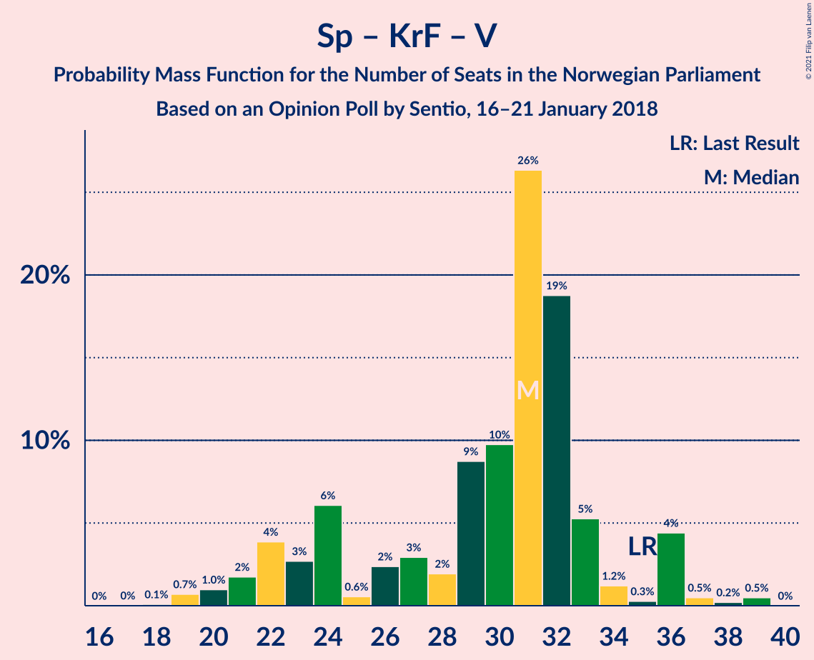

| Number of Seats | Probability | Accumulated | Special Marks |
|:---------------:|:-----------:|:-----------:|:-------------:|
| 18 | 0.1% | 100% |  |
| 19 | 0.7% | 99.9% |  |
| 20 | 1.0% | 99.2% |  |
| 21 | 2% | 98% |  |
| 22 | 4% | 96% |  |
| 23 | 3% | 93% |  |
| 24 | 6% | 90% |  |
| 25 | 0.6% | 84% |  |
| 26 | 2% | 83% |  |
| 27 | 3% | 81% |  |
| 28 | 2% | 78% |  |
| 29 | 9% | 76% | Median |
| 30 | 10% | 67% |  |
| 31 | 26% | 57% |  |
| 32 | 19% | 31% |  |
| 33 | 5% | 12% |  |
| 34 | 1.2% | 7% |  |
| 35 | 0.3% | 6% | Last Result |
| 36 | 4% | 6% |  |
| 37 | 0.5% | 1.2% |  |
| 38 | 0.2% | 0.7% |  |
| 39 | 0.5% | 0.5% |  |
| 40 | 0% | 0% |  |

## Technical Information

### Opinion Poll

+ **Polling firm:** Sentio
+ **Commissioner(s):** —
+ **Fieldwork period:** 16–21 January 2018

### Calculations

+ **Sample size:** 702
+ **Simulations done:** 131,072
+ **Error estimate:** 1.28%

