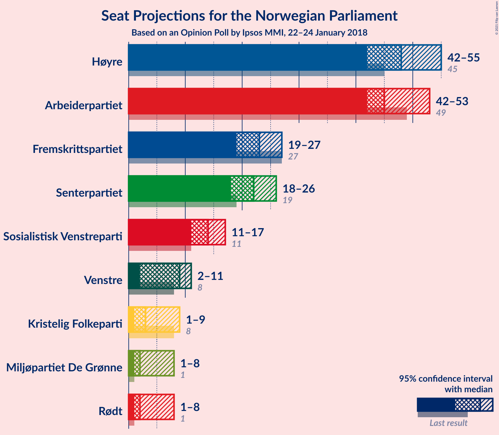
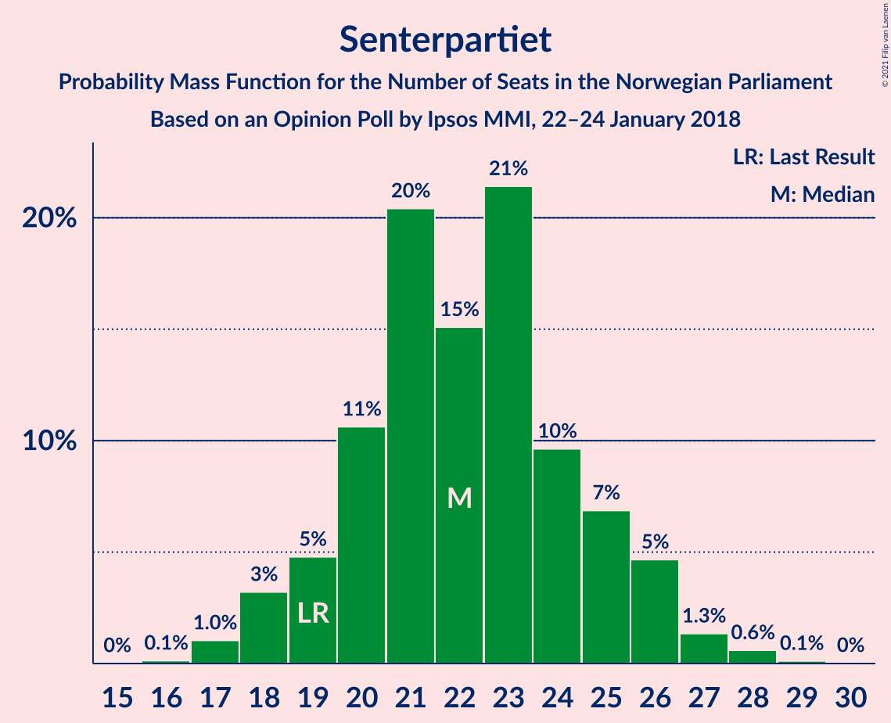
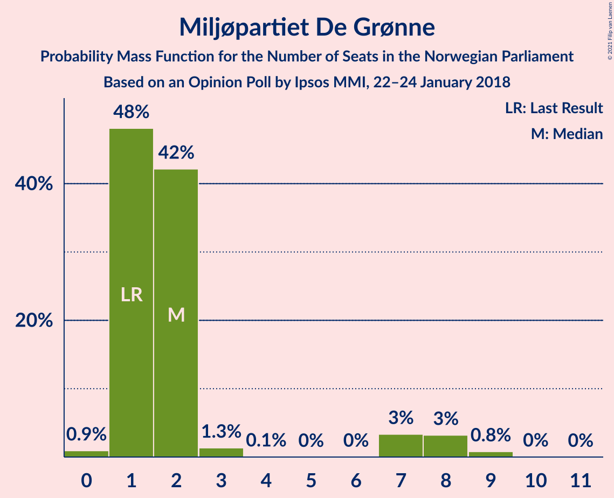
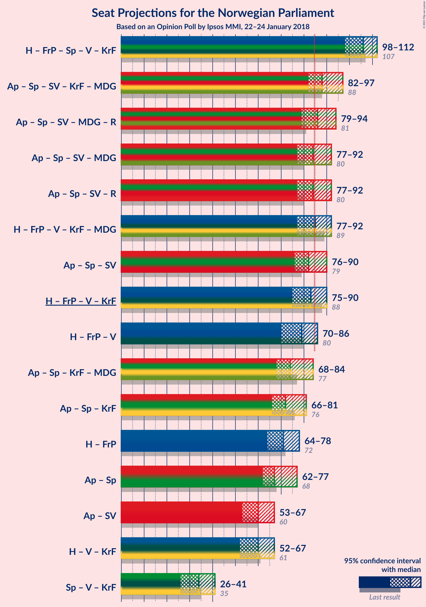
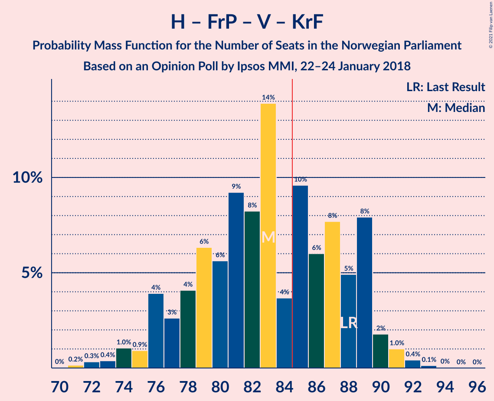
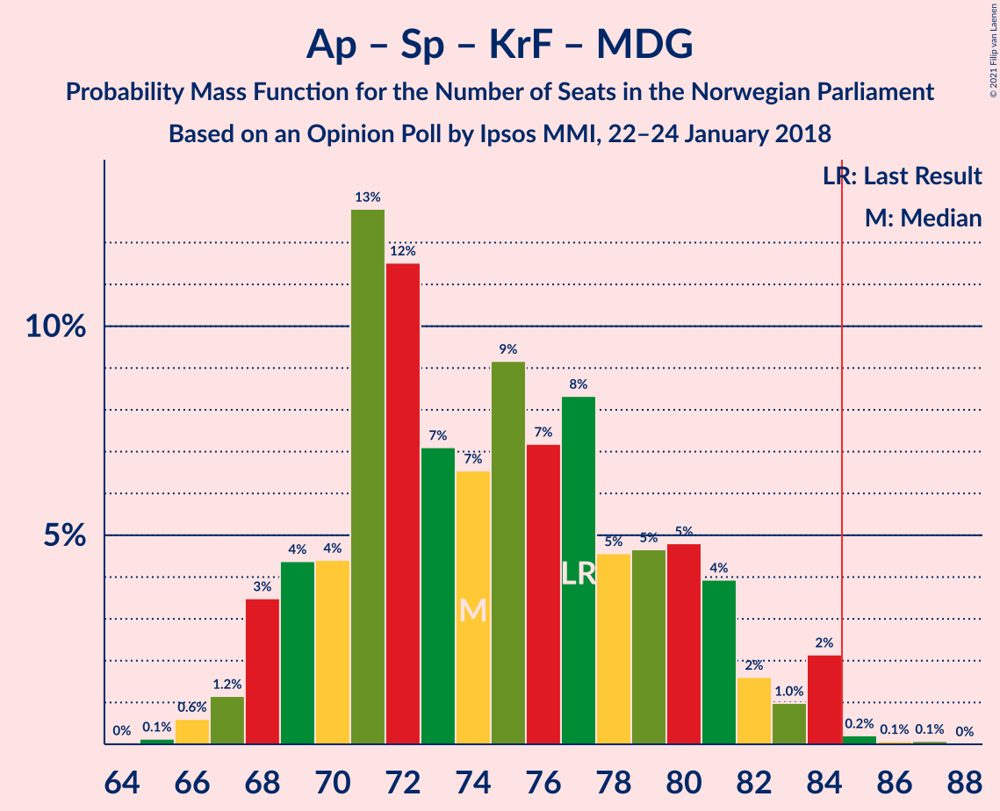
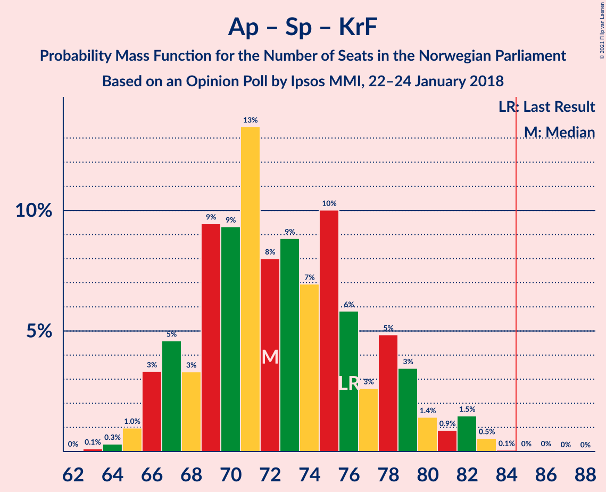

# Opinion Poll by Ipsos MMI, 22–24 January 2018

<a href="#voting-intentions">Voting Intentions</a> | <a href="#seats">Seats</a> | <a href="#coalitions">Coalitions</a> | <a href="#technical-information">Technical Information</a>

## Voting Intentions

### Confidence Intervals

| Party | Last Result | Poll Result | 80% Confidence Interval | 90% Confidence Interval | 95% Confidence Interval | 99% Confidence Interval |
|:-----:|:-----------:|:-----------:|:-----------------------:|:-----------------------:|:-----------------------:|:-----------------------:|
| Høyre | 25.0% | 26.2% | 24.4–28.2% |23.9–28.7% |23.4–29.2% |22.6–30.1% |
| Arbeiderpartiet | 27.4% | 25.4% | 23.6–27.4% |23.1–27.9% |22.7–28.4% |21.8–29.3% |
| Fremskrittspartiet | 15.2% | 12.5% | 11.2–14.1% |10.8–14.5% |10.5–14.9% |9.9–15.6% |
| Senterpartiet | 10.3% | 12.1% | 10.8–13.6% |10.4–14.0% |10.1–14.4% |9.5–15.2% |
| Sosialistisk Venstreparti | 6.0% | 7.6% | 6.6–8.9% |6.3–9.2% |6.1–9.6% |5.6–10.2% |
| Venstre | 4.4% | 4.6% | 3.8–5.6% |3.6–5.9% |3.4–6.2% |3.1–6.7% |
| Kristelig Folkeparti | 4.2% | 3.7% | 3.0–4.6% |2.8–4.9% |2.6–5.2% |2.3–5.6% |
| Rødt | 2.4% | 3.0% | 2.4–3.9% |2.2–4.1% |2.1–4.4% |1.8–4.8% |
| Miljøpartiet De Grønne | 3.2% | 3.0% | 2.4–3.9% |2.2–4.1% |2.1–4.4% |1.8–4.8% |

*Note:* The poll result column reflects the actual value used in the calculations. Published results may vary slightly, and in addition be rounded to fewer digits.

## Seats

### Confidence Intervals

| Party | Last Result | Median | 80% Confidence Interval | 90% Confidence Interval | 95% Confidence Interval | 99% Confidence Interval |
|:-----:|:-----------:|:------:|:-----------------------:|:-----------------------:|:-----------------------:|:-----------------------:|
| <a href="#høyre">Høyre</a> | 45 | 48 | 44–52 |43–53 |42–55 |40–56 |
| <a href="#arbeiderpartiet">Arbeiderpartiet</a> | 49 | 45 | 43–51 |42–52 |42–53 |40–54 |
| <a href="#fremskrittspartiet">Fremskrittspartiet</a> | 27 | 23 | 20–26 |19–27 |19–27 |18–29 |
| <a href="#senterpartiet">Senterpartiet</a> | 19 | 22 | 20–25 |19–26 |18–26 |17–28 |
| <a href="#sosialistisk-venstreparti">Sosialistisk Venstreparti</a> | 11 | 14 | 12–16 |11–17 |11–17 |10–19 |
| <a href="#venstre">Venstre</a> | 8 | 9 | 2–10 |2–11 |2–11 |2–13 |
| <a href="#kristelig-folkeparti">Kristelig Folkeparti</a> | 8 | 3 | 1–8 |1–9 |1–9 |1–10 |
| <a href="#rødt">Rødt</a> | 1 | 2 | 1–2 |1–2 |1–8 |1–9 |
| <a href="#miljøpartiet-de-grønne">Miljøpartiet De Grønne</a> | 1 | 2 | 1–2 |1–7 |1–8 |0–9 |

### Høyre

*For a full overview of the results for this party, see the [Høyre](party-høyre.html) page.*

| Number of Seats | Probability | Accumulated | Special Marks |
|:---------------:|:-----------:|:-----------:|:-------------:|
| 38 | 0.1% | 100% |  |
| 39 | 0.1% | 99.9% |  |
| 40 | 0.3% | 99.8% |  |
| 41 | 1.0% | 99.5% |  |
| 42 | 3% | 98% |  |
| 43 | 5% | 96% |  |
| 44 | 5% | 91% |  |
| 45 | 10% | 86% | Last Result |
| 46 | 8% | 76% |  |
| 47 | 14% | 68% |  |
| 48 | 9% | 54% | Median |
| 49 | 11% | 44% |  |
| 50 | 12% | 33% |  |
| 51 | 8% | 21% |  |
| 52 | 5% | 13% |  |
| 53 | 4% | 8% |  |
| 54 | 2% | 4% |  |
| 55 | 2% | 3% |  |
| 56 | 0.5% | 0.7% |  |
| 57 | 0.1% | 0.3% |  |
| 58 | 0.2% | 0.2% |  |
| 59 | 0% | 0% |  |

### Arbeiderpartiet

*For a full overview of the results for this party, see the [Arbeiderpartiet](party-arbeiderpartiet.html) page.*

| Number of Seats | Probability | Accumulated | Special Marks |
|:---------------:|:-----------:|:-----------:|:-------------:|
| 38 | 0.1% | 100% |  |
| 39 | 0.2% | 99.9% |  |
| 40 | 0.3% | 99.7% |  |
| 41 | 2% | 99.4% |  |
| 42 | 7% | 98% |  |
| 43 | 22% | 91% |  |
| 44 | 12% | 69% |  |
| 45 | 14% | 57% | Median |
| 46 | 7% | 43% |  |
| 47 | 6% | 37% |  |
| 48 | 5% | 30% |  |
| 49 | 8% | 25% | Last Result |
| 50 | 6% | 17% |  |
| 51 | 5% | 12% |  |
| 52 | 2% | 6% |  |
| 53 | 2% | 4% |  |
| 54 | 2% | 2% |  |
| 55 | 0.2% | 0.3% |  |
| 56 | 0% | 0.1% |  |
| 57 | 0% | 0% |  |

### Fremskrittspartiet

*For a full overview of the results for this party, see the [Fremskrittspartiet](party-fremskrittspartiet.html) page.*

| Number of Seats | Probability | Accumulated | Special Marks |
|:---------------:|:-----------:|:-----------:|:-------------:|
| 16 | 0.1% | 100% |  |
| 17 | 0.3% | 99.9% |  |
| 18 | 1.0% | 99.6% |  |
| 19 | 4% | 98.6% |  |
| 20 | 8% | 95% |  |
| 21 | 11% | 87% |  |
| 22 | 15% | 75% |  |
| 23 | 18% | 61% | Median |
| 24 | 16% | 42% |  |
| 25 | 14% | 26% |  |
| 26 | 7% | 12% |  |
| 27 | 3% | 5% | Last Result |
| 28 | 2% | 2% |  |
| 29 | 0.4% | 0.7% |  |
| 30 | 0.2% | 0.2% |  |
| 31 | 0% | 0% |  |

### Senterpartiet

*For a full overview of the results for this party, see the [Senterpartiet](party-senterpartiet.html) page.*

| Number of Seats | Probability | Accumulated | Special Marks |
|:---------------:|:-----------:|:-----------:|:-------------:|
| 16 | 0.1% | 100% |  |
| 17 | 1.0% | 99.8% |  |
| 18 | 3% | 98.8% |  |
| 19 | 5% | 96% | Last Result |
| 20 | 11% | 91% |  |
| 21 | 20% | 80% |  |
| 22 | 15% | 60% | Median |
| 23 | 21% | 45% |  |
| 24 | 10% | 23% |  |
| 25 | 7% | 14% |  |
| 26 | 5% | 7% |  |
| 27 | 1.3% | 2% |  |
| 28 | 0.6% | 0.8% |  |
| 29 | 0.1% | 0.2% |  |
| 30 | 0% | 0% |  |

### Sosialistisk Venstreparti

*For a full overview of the results for this party, see the [Sosialistisk Venstreparti](party-sosialistiskvenstreparti.html) page.*

| Number of Seats | Probability | Accumulated | Special Marks |
|:---------------:|:-----------:|:-----------:|:-------------:|
| 9 | 0.1% | 100% |  |
| 10 | 2% | 99.9% |  |
| 11 | 7% | 98% | Last Result |
| 12 | 9% | 91% |  |
| 13 | 19% | 82% |  |
| 14 | 27% | 63% | Median |
| 15 | 11% | 35% |  |
| 16 | 18% | 24% |  |
| 17 | 4% | 6% |  |
| 18 | 1.2% | 2% |  |
| 19 | 0.6% | 0.8% |  |
| 20 | 0.1% | 0.2% |  |
| 21 | 0% | 0% |  |

### Venstre

*For a full overview of the results for this party, see the [Venstre](party-venstre.html) page.*

| Number of Seats | Probability | Accumulated | Special Marks |
|:---------------:|:-----------:|:-----------:|:-------------:|
| 2 | 13% | 100% |  |
| 3 | 6% | 87% |  |
| 4 | 0% | 81% |  |
| 5 | 0% | 81% |  |
| 6 | 0% | 81% |  |
| 7 | 8% | 81% |  |
| 8 | 23% | 73% | Last Result |
| 9 | 29% | 50% | Median |
| 10 | 16% | 21% |  |
| 11 | 4% | 6% |  |
| 12 | 1.0% | 2% |  |
| 13 | 0.5% | 0.5% |  |
| 14 | 0.1% | 0.1% |  |
| 15 | 0% | 0% |  |

### Kristelig Folkeparti

*For a full overview of the results for this party, see the [Kristelig Folkeparti](party-kristeligfolkeparti.html) page.*

| Number of Seats | Probability | Accumulated | Special Marks |
|:---------------:|:-----------:|:-----------:|:-------------:|
| 0 | 0.5% | 100% |  |
| 1 | 11% | 99.5% |  |
| 2 | 13% | 88% |  |
| 3 | 38% | 75% | Median |
| 4 | 0% | 37% |  |
| 5 | 0% | 37% |  |
| 6 | 0% | 37% |  |
| 7 | 10% | 37% |  |
| 8 | 19% | 27% | Last Result |
| 9 | 6% | 8% |  |
| 10 | 2% | 2% |  |
| 11 | 0.2% | 0.3% |  |
| 12 | 0% | 0% |  |

### Rødt

*For a full overview of the results for this party, see the [Rødt](party-rødt.html) page.*

| Number of Seats | Probability | Accumulated | Special Marks |
|:---------------:|:-----------:|:-----------:|:-------------:|
| 1 | 43% | 100% | Last Result |
| 2 | 53% | 57% | Median |
| 3 | 0% | 5% |  |
| 4 | 0% | 5% |  |
| 5 | 0% | 5% |  |
| 6 | 0% | 5% |  |
| 7 | 0.7% | 5% |  |
| 8 | 3% | 4% |  |
| 9 | 0.5% | 0.6% |  |
| 10 | 0.1% | 0.1% |  |
| 11 | 0% | 0% |  |

### Miljøpartiet De Grønne

*For a full overview of the results for this party, see the [Miljøpartiet De Grønne](party-miljøpartietdegrønne.html) page.*

| Number of Seats | Probability | Accumulated | Special Marks |
|:---------------:|:-----------:|:-----------:|:-------------:|
| 0 | 0.9% | 100% |  |
| 1 | 48% | 99.1% | Last Result |
| 2 | 42% | 51% | Median |
| 3 | 1.3% | 9% |  |
| 4 | 0.1% | 7% |  |
| 5 | 0% | 7% |  |
| 6 | 0% | 7% |  |
| 7 | 3% | 7% |  |
| 8 | 3% | 4% |  |
| 9 | 0.8% | 0.9% |  |
| 10 | 0% | 0.1% |  |
| 11 | 0% | 0% |  |

## Coalitions

### Confidence Intervals

| Coalition | Last Result | Median | Majority? | 80% Confidence Interval | 90% Confidence Interval | 95% Confidence Interval | 99% Confidence Interval |
|:---------:|:-----------:|:------:|:---------:|:-----------------------:|:-----------------------:|:-----------------------:|:-----------------------:|
| Høyre – Fremskrittspartiet – Senterpartiet – Venstre – Kristelig Folkeparti | 107 | 106 | 100% | 100–110 | 99–111 | 98–112 | 95–113 |
| Arbeiderpartiet – Senterpartiet – Sosialistisk Venstreparti – Kristelig Folkeparti – Miljøpartiet De Grønne | 88 | 88 | 84% | 83–94 | 83–95 | 82–97 | 80–98 |
| Arbeiderpartiet – Senterpartiet – Sosialistisk Venstreparti – Miljøpartiet De Grønne – Rødt | 81 | 86 | 60% | 80–91 | 80–93 | 79–94 | 77–97 |
| Arbeiderpartiet – Senterpartiet – Sosialistisk Venstreparti – Miljøpartiet De Grønne | 80 | 84 | 46% | 79–90 | 78–91 | 77–92 | 76–94 |
| Arbeiderpartiet – Senterpartiet – Sosialistisk Venstreparti – Rødt | 80 | 84 | 42% | 79–89 | 78–91 | 77–92 | 75–95 |
| Høyre – Fremskrittspartiet – Venstre – Kristelig Folkeparti – Miljøpartiet De Grønne | 89 | 85 | 58% | 80–90 | 78–91 | 77–92 | 74–94 |
| Arbeiderpartiet – Senterpartiet – Sosialistisk Venstreparti | 79 | 82 | 26% | 77–87 | 76–89 | 76–90 | 74–93 |
| Høyre – Fremskrittspartiet – Venstre – Kristelig Folkeparti | 88 | 83 | 40% | 78–89 | 76–89 | 75–90 | 72–92 |
| Høyre – Fremskrittspartiet – Venstre | 80 | 79 | 7% | 73–84 | 72–85 | 70–86 | 69–87 |
| Arbeiderpartiet – Senterpartiet – Kristelig Folkeparti – Miljøpartiet De Grønne | 77 | 74 | 0.4% | 70–80 | 68–82 | 68–84 | 66–84 |
| Arbeiderpartiet – Senterpartiet – Kristelig Folkeparti | 76 | 72 | 0.1% | 68–78 | 67–79 | 66–81 | 64–83 |
| Høyre – Fremskrittspartiet | 72 | 71 | 0% | 66–76 | 65–77 | 64–78 | 62–81 |
| Arbeiderpartiet – Senterpartiet | 68 | 67 | 0% | 64–73 | 63–75 | 62–77 | 61–78 |
| Arbeiderpartiet – Sosialistisk Venstreparti | 60 | 60 | 0% | 56–65 | 55–67 | 53–67 | 53–70 |
| Høyre – Venstre – Kristelig Folkeparti | 61 | 60 | 0% | 55–66 | 54–66 | 52–67 | 49–70 |
| Senterpartiet – Venstre – Kristelig Folkeparti | 35 | 34 | 0% | 29–39 | 27–41 | 26–41 | 24–43 |

### Høyre – Fremskrittspartiet – Senterpartiet – Venstre – Kristelig Folkeparti

| Number of Seats | Probability | Accumulated | Special Marks |
|:---------------:|:-----------:|:-----------:|:-------------:|
| 92 | 0% | 100% |  |
| 93 | 0% | 99.9% |  |
| 94 | 0.3% | 99.9% |  |
| 95 | 0.4% | 99.6% |  |
| 96 | 0.4% | 99.2% |  |
| 97 | 1.0% | 98.8% |  |
| 98 | 1.4% | 98% |  |
| 99 | 6% | 96% |  |
| 100 | 4% | 91% |  |
| 101 | 7% | 86% |  |
| 102 | 5% | 80% |  |
| 103 | 5% | 75% |  |
| 104 | 9% | 69% |  |
| 105 | 8% | 60% | Median |
| 106 | 14% | 51% |  |
| 107 | 7% | 38% | Last Result |
| 108 | 5% | 31% |  |
| 109 | 9% | 26% |  |
| 110 | 9% | 17% |  |
| 111 | 3% | 7% |  |
| 112 | 3% | 4% |  |
| 113 | 0.6% | 0.8% |  |
| 114 | 0.1% | 0.2% |  |
| 115 | 0.1% | 0.1% |  |
| 116 | 0% | 0% |  |

### Arbeiderpartiet – Senterpartiet – Sosialistisk Venstreparti – Kristelig Folkeparti – Miljøpartiet De Grønne

| Number of Seats | Probability | Accumulated | Special Marks |
|:---------------:|:-----------:|:-----------:|:-------------:|
| 78 | 0% | 100% |  |
| 79 | 0.1% | 99.9% |  |
| 80 | 0.5% | 99.8% |  |
| 81 | 0.6% | 99.3% |  |
| 82 | 4% | 98.7% |  |
| 83 | 6% | 95% |  |
| 84 | 6% | 90% |  |
| 85 | 11% | 84% | Majority |
| 86 | 10% | 73% | Median |
| 87 | 12% | 63% |  |
| 88 | 8% | 51% | Last Result |
| 89 | 6% | 43% |  |
| 90 | 3% | 37% |  |
| 91 | 6% | 35% |  |
| 92 | 6% | 29% |  |
| 93 | 7% | 22% |  |
| 94 | 7% | 15% |  |
| 95 | 4% | 9% |  |
| 96 | 2% | 5% |  |
| 97 | 2% | 3% |  |
| 98 | 0.8% | 1.0% |  |
| 99 | 0.1% | 0.2% |  |
| 100 | 0.1% | 0.1% |  |
| 101 | 0% | 0% |  |

### Arbeiderpartiet – Senterpartiet – Sosialistisk Venstreparti – Miljøpartiet De Grønne – Rødt

| Number of Seats | Probability | Accumulated | Special Marks |
|:---------------:|:-----------:|:-----------:|:-------------:|
| 75 | 0% | 100% |  |
| 76 | 0.1% | 99.9% |  |
| 77 | 0.4% | 99.8% |  |
| 78 | 1.0% | 99.4% |  |
| 79 | 2% | 98% |  |
| 80 | 8% | 97% |  |
| 81 | 5% | 89% | Last Result |
| 82 | 8% | 84% |  |
| 83 | 6% | 76% |  |
| 84 | 10% | 70% |  |
| 85 | 4% | 60% | Median, Majority |
| 86 | 14% | 57% |  |
| 87 | 8% | 43% |  |
| 88 | 9% | 35% |  |
| 89 | 6% | 25% |  |
| 90 | 6% | 20% |  |
| 91 | 4% | 13% |  |
| 92 | 3% | 9% |  |
| 93 | 4% | 7% |  |
| 94 | 0.9% | 3% |  |
| 95 | 1.0% | 2% |  |
| 96 | 0.4% | 0.9% |  |
| 97 | 0.3% | 0.5% |  |
| 98 | 0.2% | 0.2% |  |
| 99 | 0% | 0.1% |  |
| 100 | 0% | 0% |  |

### Arbeiderpartiet – Senterpartiet – Sosialistisk Venstreparti – Miljøpartiet De Grønne

| Number of Seats | Probability | Accumulated | Special Marks |
|:---------------:|:-----------:|:-----------:|:-------------:|
| 74 | 0.1% | 100% |  |
| 75 | 0.3% | 99.9% |  |
| 76 | 0.8% | 99.5% |  |
| 77 | 1.5% | 98.7% |  |
| 78 | 5% | 97% |  |
| 79 | 7% | 92% |  |
| 80 | 7% | 85% | Last Result |
| 81 | 8% | 78% |  |
| 82 | 10% | 70% |  |
| 83 | 5% | 60% | Median |
| 84 | 9% | 55% |  |
| 85 | 13% | 46% | Majority |
| 86 | 8% | 34% |  |
| 87 | 4% | 25% |  |
| 88 | 5% | 21% |  |
| 89 | 5% | 16% |  |
| 90 | 3% | 10% |  |
| 91 | 3% | 7% |  |
| 92 | 3% | 5% |  |
| 93 | 1.0% | 2% |  |
| 94 | 0.5% | 1.0% |  |
| 95 | 0.3% | 0.5% |  |
| 96 | 0.1% | 0.1% |  |
| 97 | 0% | 0% |  |

### Arbeiderpartiet – Senterpartiet – Sosialistisk Venstreparti – Rødt

| Number of Seats | Probability | Accumulated | Special Marks |
|:---------------:|:-----------:|:-----------:|:-------------:|
| 73 | 0.1% | 100% |  |
| 74 | 0.1% | 99.9% |  |
| 75 | 0.4% | 99.8% |  |
| 76 | 0.9% | 99.4% |  |
| 77 | 1.3% | 98.5% |  |
| 78 | 5% | 97% |  |
| 79 | 8% | 93% |  |
| 80 | 7% | 85% | Last Result |
| 81 | 7% | 78% |  |
| 82 | 7% | 71% |  |
| 83 | 10% | 64% | Median |
| 84 | 12% | 54% |  |
| 85 | 7% | 42% | Majority |
| 86 | 8% | 35% |  |
| 87 | 10% | 27% |  |
| 88 | 5% | 17% |  |
| 89 | 3% | 12% |  |
| 90 | 3% | 10% |  |
| 91 | 4% | 7% |  |
| 92 | 0.7% | 3% |  |
| 93 | 1.0% | 2% |  |
| 94 | 0.5% | 1.0% |  |
| 95 | 0.4% | 0.6% |  |
| 96 | 0.1% | 0.2% |  |
| 97 | 0.1% | 0.1% |  |
| 98 | 0% | 0% |  |

### Høyre – Fremskrittspartiet – Venstre – Kristelig Folkeparti – Miljøpartiet De Grønne

| Number of Seats | Probability | Accumulated | Special Marks |
|:---------------:|:-----------:|:-----------:|:-------------:|
| 72 | 0.1% | 100% |  |
| 73 | 0.1% | 99.9% |  |
| 74 | 0.4% | 99.8% |  |
| 75 | 0.5% | 99.4% |  |
| 76 | 1.0% | 99.0% |  |
| 77 | 0.7% | 98% |  |
| 78 | 4% | 97% |  |
| 79 | 3% | 93% |  |
| 80 | 3% | 90% |  |
| 81 | 5% | 88% |  |
| 82 | 10% | 83% |  |
| 83 | 8% | 73% |  |
| 84 | 7% | 65% |  |
| 85 | 12% | 58% | Median, Majority |
| 86 | 10% | 46% |  |
| 87 | 7% | 36% |  |
| 88 | 7% | 29% |  |
| 89 | 7% | 22% | Last Result |
| 90 | 8% | 15% |  |
| 91 | 5% | 7% |  |
| 92 | 1.3% | 3% |  |
| 93 | 0.9% | 1.5% |  |
| 94 | 0.4% | 0.6% |  |
| 95 | 0.1% | 0.2% |  |
| 96 | 0.1% | 0.1% |  |
| 97 | 0% | 0% |  |

### Arbeiderpartiet – Senterpartiet – Sosialistisk Venstreparti

| Number of Seats | Probability | Accumulated | Special Marks |
|:---------------:|:-----------:|:-----------:|:-------------:|
| 71 | 0.1% | 100% |  |
| 72 | 0.1% | 99.9% |  |
| 73 | 0.3% | 99.9% |  |
| 74 | 0.6% | 99.5% |  |
| 75 | 1.3% | 98.9% |  |
| 76 | 4% | 98% |  |
| 77 | 3% | 93% |  |
| 78 | 10% | 90% |  |
| 79 | 7% | 80% | Last Result |
| 80 | 10% | 73% |  |
| 81 | 8% | 63% | Median |
| 82 | 10% | 55% |  |
| 83 | 11% | 45% |  |
| 84 | 8% | 34% |  |
| 85 | 8% | 26% | Majority |
| 86 | 4% | 18% |  |
| 87 | 4% | 14% |  |
| 88 | 3% | 10% |  |
| 89 | 2% | 7% |  |
| 90 | 3% | 5% |  |
| 91 | 0.8% | 2% |  |
| 92 | 0.4% | 1.1% |  |
| 93 | 0.5% | 0.7% |  |
| 94 | 0.1% | 0.1% |  |
| 95 | 0.1% | 0.1% |  |
| 96 | 0% | 0% |  |

### Høyre – Fremskrittspartiet – Venstre – Kristelig Folkeparti

| Number of Seats | Probability | Accumulated | Special Marks |
|:---------------:|:-----------:|:-----------:|:-------------:|
| 70 | 0% | 100% |  |
| 71 | 0.2% | 99.9% |  |
| 72 | 0.3% | 99.8% |  |
| 73 | 0.4% | 99.5% |  |
| 74 | 1.0% | 99.1% |  |
| 75 | 0.9% | 98% |  |
| 76 | 4% | 97% |  |
| 77 | 3% | 93% |  |
| 78 | 4% | 91% |  |
| 79 | 6% | 86% |  |
| 80 | 6% | 80% |  |
| 81 | 9% | 75% |  |
| 82 | 8% | 65% |  |
| 83 | 14% | 57% | Median |
| 84 | 4% | 43% |  |
| 85 | 10% | 40% | Majority |
| 86 | 6% | 30% |  |
| 87 | 8% | 24% |  |
| 88 | 5% | 16% | Last Result |
| 89 | 8% | 11% |  |
| 90 | 2% | 3% |  |
| 91 | 1.0% | 2% |  |
| 92 | 0.4% | 0.6% |  |
| 93 | 0.1% | 0.2% |  |
| 94 | 0% | 0.1% |  |
| 95 | 0% | 0% |  |

### Høyre – Fremskrittspartiet – Venstre

| Number of Seats | Probability | Accumulated | Special Marks |
|:---------------:|:-----------:|:-----------:|:-------------:|
| 65 | 0% | 100% |  |
| 66 | 0% | 99.9% |  |
| 67 | 0.1% | 99.9% |  |
| 68 | 0.2% | 99.8% |  |
| 69 | 0.7% | 99.6% |  |
| 70 | 1.5% | 98.9% |  |
| 71 | 2% | 97% |  |
| 72 | 2% | 95% |  |
| 73 | 6% | 93% |  |
| 74 | 4% | 87% |  |
| 75 | 10% | 83% |  |
| 76 | 6% | 74% |  |
| 77 | 7% | 67% |  |
| 78 | 5% | 61% |  |
| 79 | 9% | 56% |  |
| 80 | 12% | 47% | Last Result, Median |
| 81 | 6% | 35% |  |
| 82 | 11% | 29% |  |
| 83 | 7% | 18% |  |
| 84 | 4% | 11% |  |
| 85 | 4% | 7% | Majority |
| 86 | 2% | 3% |  |
| 87 | 0.3% | 0.8% |  |
| 88 | 0.4% | 0.5% |  |
| 89 | 0% | 0.1% |  |
| 90 | 0% | 0% |  |

### Arbeiderpartiet – Senterpartiet – Kristelig Folkeparti – Miljøpartiet De Grønne

| Number of Seats | Probability | Accumulated | Special Marks |
|:---------------:|:-----------:|:-----------:|:-------------:|
| 64 | 0% | 100% |  |
| 65 | 0.1% | 99.9% |  |
| 66 | 0.6% | 99.8% |  |
| 67 | 1.2% | 99.2% |  |
| 68 | 3% | 98% |  |
| 69 | 4% | 95% |  |
| 70 | 4% | 90% |  |
| 71 | 13% | 86% |  |
| 72 | 12% | 73% | Median |
| 73 | 7% | 61% |  |
| 74 | 7% | 54% |  |
| 75 | 9% | 48% |  |
| 76 | 7% | 39% |  |
| 77 | 8% | 31% | Last Result |
| 78 | 5% | 23% |  |
| 79 | 5% | 19% |  |
| 80 | 5% | 14% |  |
| 81 | 4% | 9% |  |
| 82 | 2% | 5% |  |
| 83 | 1.0% | 4% |  |
| 84 | 2% | 3% |  |
| 85 | 0.2% | 0.4% | Majority |
| 86 | 0.1% | 0.2% |  |
| 87 | 0.1% | 0.1% |  |
| 88 | 0% | 0% |  |

### Arbeiderpartiet – Senterpartiet – Kristelig Folkeparti

| Number of Seats | Probability | Accumulated | Special Marks |
|:---------------:|:-----------:|:-----------:|:-------------:|
| 62 | 0% | 100% |  |
| 63 | 0.1% | 99.9% |  |
| 64 | 0.3% | 99.8% |  |
| 65 | 1.0% | 99.5% |  |
| 66 | 3% | 98.5% |  |
| 67 | 5% | 95% |  |
| 68 | 3% | 91% |  |
| 69 | 9% | 87% |  |
| 70 | 9% | 78% | Median |
| 71 | 13% | 69% |  |
| 72 | 8% | 55% |  |
| 73 | 9% | 47% |  |
| 74 | 7% | 38% |  |
| 75 | 10% | 31% |  |
| 76 | 6% | 21% | Last Result |
| 77 | 3% | 15% |  |
| 78 | 5% | 13% |  |
| 79 | 3% | 8% |  |
| 80 | 1.4% | 5% |  |
| 81 | 0.9% | 3% |  |
| 82 | 1.5% | 2% |  |
| 83 | 0.5% | 0.7% |  |
| 84 | 0.1% | 0.2% |  |
| 85 | 0% | 0.1% | Majority |
| 86 | 0% | 0.1% |  |
| 87 | 0% | 0% |  |

### Høyre – Fremskrittspartiet

| Number of Seats | Probability | Accumulated | Special Marks |
|:---------------:|:-----------:|:-----------:|:-------------:|
| 59 | 0.1% | 100% |  |
| 60 | 0.1% | 99.9% |  |
| 61 | 0.1% | 99.8% |  |
| 62 | 0.4% | 99.7% |  |
| 63 | 1.1% | 99.3% |  |
| 64 | 3% | 98% |  |
| 65 | 4% | 96% |  |
| 66 | 3% | 92% |  |
| 67 | 6% | 88% |  |
| 68 | 10% | 83% |  |
| 69 | 7% | 73% |  |
| 70 | 9% | 66% |  |
| 71 | 12% | 57% | Median |
| 72 | 11% | 45% | Last Result |
| 73 | 10% | 34% |  |
| 74 | 6% | 24% |  |
| 75 | 6% | 18% |  |
| 76 | 4% | 12% |  |
| 77 | 5% | 8% |  |
| 78 | 0.9% | 3% |  |
| 79 | 0.3% | 2% |  |
| 80 | 1.3% | 2% |  |
| 81 | 0.5% | 0.6% |  |
| 82 | 0.1% | 0.1% |  |
| 83 | 0% | 0% |  |

### Arbeiderpartiet – Senterpartiet

| Number of Seats | Probability | Accumulated | Special Marks |
|:---------------:|:-----------:|:-----------:|:-------------:|
| 59 | 0.1% | 100% |  |
| 60 | 0.3% | 99.8% |  |
| 61 | 1.0% | 99.5% |  |
| 62 | 3% | 98.6% |  |
| 63 | 2% | 96% |  |
| 64 | 10% | 94% |  |
| 65 | 11% | 84% |  |
| 66 | 9% | 73% |  |
| 67 | 15% | 64% | Median |
| 68 | 9% | 49% | Last Result |
| 69 | 7% | 39% |  |
| 70 | 7% | 32% |  |
| 71 | 6% | 25% |  |
| 72 | 6% | 19% |  |
| 73 | 4% | 13% |  |
| 74 | 3% | 9% |  |
| 75 | 2% | 6% |  |
| 76 | 1.4% | 4% |  |
| 77 | 2% | 3% |  |
| 78 | 0.3% | 0.6% |  |
| 79 | 0.2% | 0.3% |  |
| 80 | 0.1% | 0.1% |  |
| 81 | 0% | 0% |  |

### Arbeiderpartiet – Sosialistisk Venstreparti

| Number of Seats | Probability | Accumulated | Special Marks |
|:---------------:|:-----------:|:-----------:|:-------------:|
| 51 | 0.1% | 100% |  |
| 52 | 0.2% | 99.9% |  |
| 53 | 2% | 99.7% |  |
| 54 | 2% | 97% |  |
| 55 | 4% | 95% |  |
| 56 | 6% | 91% |  |
| 57 | 14% | 85% |  |
| 58 | 7% | 71% |  |
| 59 | 12% | 64% | Median |
| 60 | 10% | 51% | Last Result |
| 61 | 10% | 41% |  |
| 62 | 9% | 31% |  |
| 63 | 6% | 22% |  |
| 64 | 5% | 16% |  |
| 65 | 3% | 11% |  |
| 66 | 3% | 9% |  |
| 67 | 4% | 6% |  |
| 68 | 0.9% | 2% |  |
| 69 | 0.5% | 1.1% |  |
| 70 | 0.4% | 0.6% |  |
| 71 | 0.1% | 0.2% |  |
| 72 | 0.1% | 0.1% |  |
| 73 | 0% | 0% |  |

### Høyre – Venstre – Kristelig Folkeparti

| Number of Seats | Probability | Accumulated | Special Marks |
|:---------------:|:-----------:|:-----------:|:-------------:|
| 47 | 0% | 100% |  |
| 48 | 0.2% | 99.9% |  |
| 49 | 0.4% | 99.8% |  |
| 50 | 0.4% | 99.3% |  |
| 51 | 1.0% | 98.9% |  |
| 52 | 1.4% | 98% |  |
| 53 | 0.9% | 96% |  |
| 54 | 4% | 96% |  |
| 55 | 6% | 91% |  |
| 56 | 5% | 85% |  |
| 57 | 7% | 80% |  |
| 58 | 6% | 73% |  |
| 59 | 9% | 66% |  |
| 60 | 12% | 58% | Median |
| 61 | 10% | 46% | Last Result |
| 62 | 7% | 36% |  |
| 63 | 9% | 29% |  |
| 64 | 5% | 20% |  |
| 65 | 3% | 15% |  |
| 66 | 9% | 12% |  |
| 67 | 1.2% | 4% |  |
| 68 | 1.2% | 2% |  |
| 69 | 0.5% | 1.1% |  |
| 70 | 0.4% | 0.6% |  |
| 71 | 0.2% | 0.2% |  |
| 72 | 0% | 0% |  |

### Senterpartiet – Venstre – Kristelig Folkeparti

| Number of Seats | Probability | Accumulated | Special Marks |
|:---------------:|:-----------:|:-----------:|:-------------:|
| 22 | 0% | 100% |  |
| 23 | 0.1% | 99.9% |  |
| 24 | 0.7% | 99.8% |  |
| 25 | 1.1% | 99.1% |  |
| 26 | 0.6% | 98% |  |
| 27 | 3% | 97% |  |
| 28 | 4% | 95% |  |
| 29 | 2% | 91% |  |
| 30 | 5% | 89% |  |
| 31 | 9% | 84% |  |
| 32 | 7% | 75% |  |
| 33 | 6% | 68% |  |
| 34 | 11% | 61% | Median |
| 35 | 11% | 50% | Last Result |
| 36 | 6% | 39% |  |
| 37 | 14% | 32% |  |
| 38 | 7% | 18% |  |
| 39 | 2% | 12% |  |
| 40 | 4% | 10% |  |
| 41 | 4% | 5% |  |
| 42 | 0.9% | 2% |  |
| 43 | 0.4% | 0.7% |  |
| 44 | 0.2% | 0.3% |  |
| 45 | 0.1% | 0.1% |  |
| 46 | 0% | 0% |  |

## Technical Information

### Opinion Poll

+ **Polling firm:** Ipsos MMI
+ **Commissioner(s):** —
+ **Fieldwork period:** 22–24 January 2018

### Calculations

+ **Sample size:** 893
+ **Simulations done:** 1,048,576
+ **Error estimate:** 2.90%

