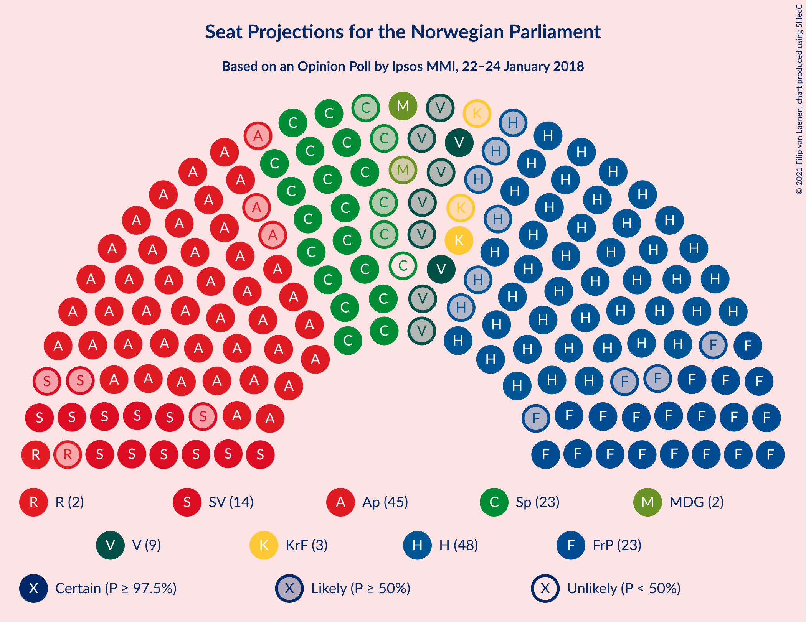
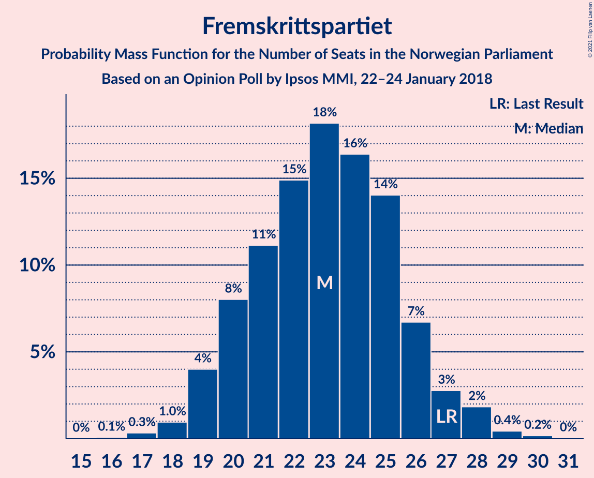
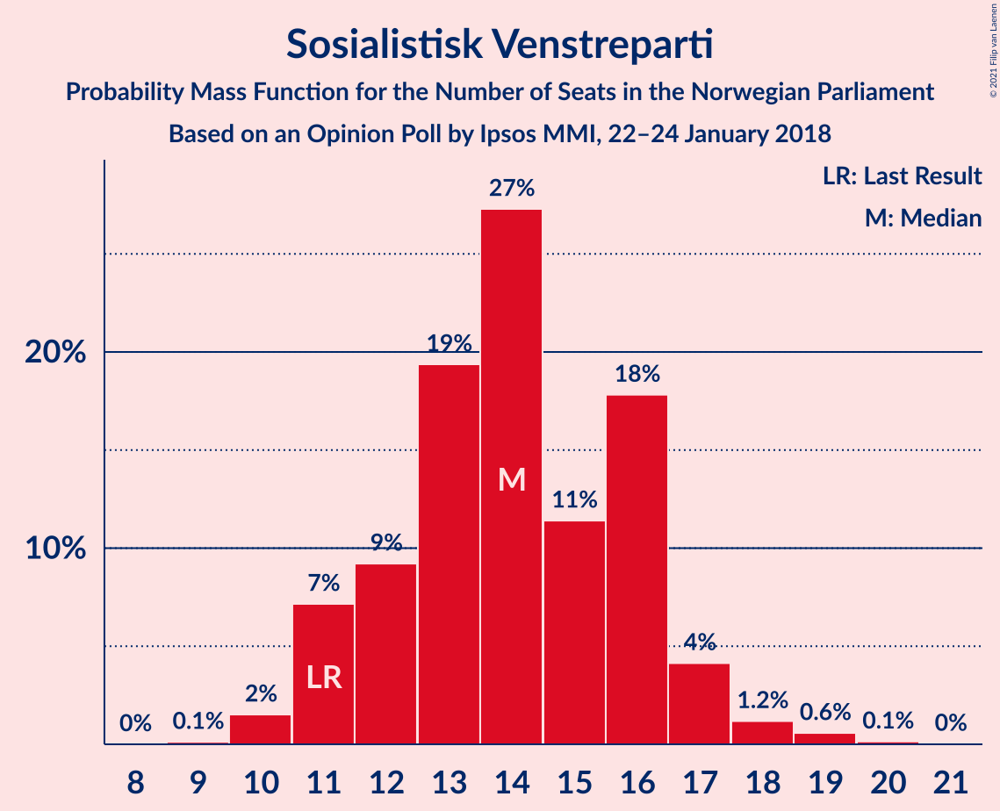
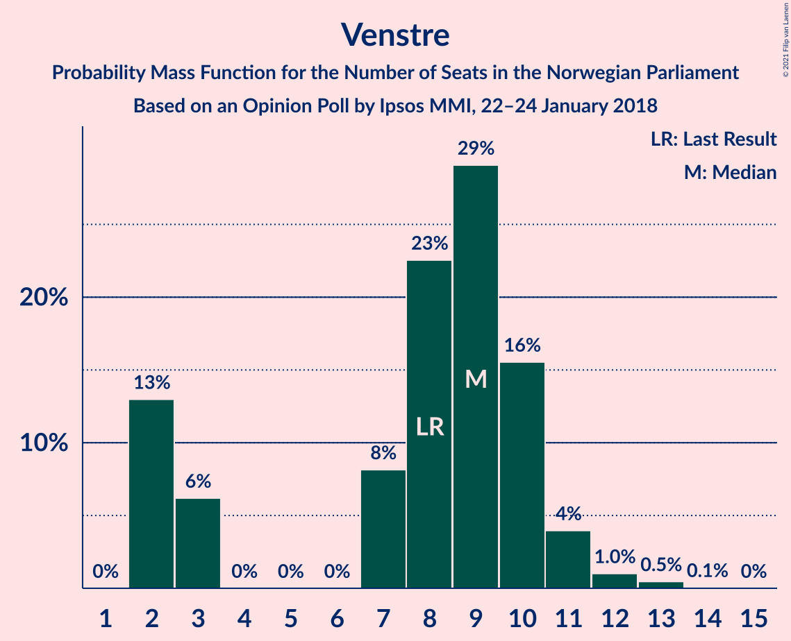
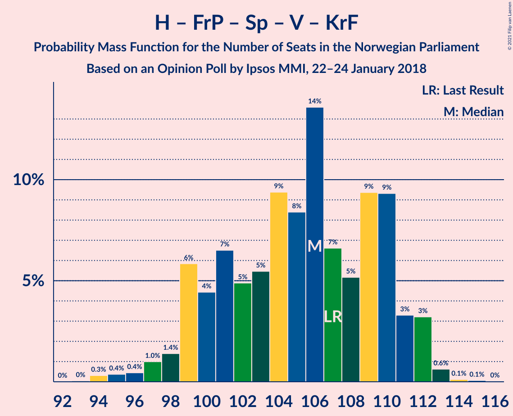
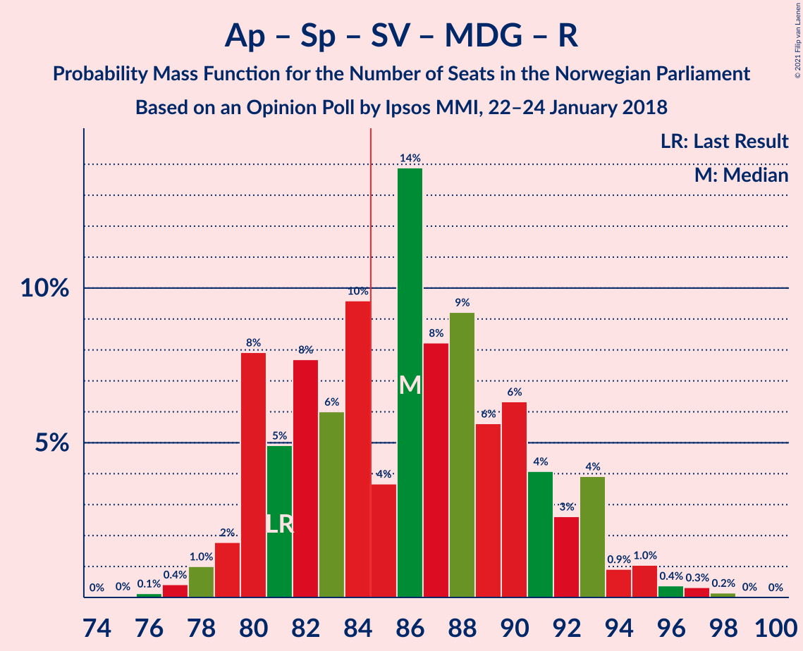

# Opinion Poll by Ipsos MMI, 22–24 January 2018

<a href="#voting-intentions">Voting Intentions</a> | <a href="#seats">Seats</a> | <a href="#coalitions">Coalitions</a> | <a href="#technical-information">Technical Information</a>

## Voting Intentions

### Confidence Intervals

| Party | Last Result | Poll Result | 80% Confidence Interval | 90% Confidence Interval | 95% Confidence Interval | 99% Confidence Interval |
|:-----:|:-----------:|:-----------:|:-----------------------:|:-----------------------:|:-----------------------:|:-----------------------:|
| Høyre | 25.0% | 26.2% | 24.4–28.2% |23.9–28.7% |23.4–29.2% |22.6–30.1% |
| Arbeiderpartiet | 27.4% | 25.4% | 23.6–27.4% |23.1–27.9% |22.7–28.4% |21.8–29.3% |
| Fremskrittspartiet | 15.2% | 12.5% | 11.2–14.1% |10.8–14.5% |10.5–14.9% |9.9–15.6% |
| Senterpartiet | 10.3% | 12.1% | 10.8–13.6% |10.4–14.0% |10.1–14.4% |9.5–15.2% |
| Sosialistisk Venstreparti | 6.0% | 7.6% | 6.6–8.9% |6.3–9.2% |6.1–9.6% |5.6–10.2% |
| Venstre | 4.4% | 4.6% | 3.8–5.6% |3.6–5.9% |3.4–6.2% |3.1–6.7% |
| Kristelig Folkeparti | 4.2% | 3.7% | 3.0–4.6% |2.8–4.9% |2.6–5.2% |2.3–5.6% |
| Rødt | 2.4% | 3.0% | 2.4–3.9% |2.2–4.1% |2.1–4.4% |1.8–4.8% |
| Miljøpartiet De Grønne | 3.2% | 3.0% | 2.4–3.9% |2.2–4.1% |2.1–4.4% |1.8–4.8% |

*Note:* The poll result column reflects the actual value used in the calculations. Published results may vary slightly, and in addition be rounded to fewer digits.

## Seats

### Confidence Intervals

| Party | Last Result | Median | 80% Confidence Interval | 90% Confidence Interval | 95% Confidence Interval | 99% Confidence Interval |
|:-----:|:-----------:|:------:|:-----------------------:|:-----------------------:|:-----------------------:|:-----------------------:|
| <a href="#høyre">Høyre</a> | 45 | 47 | 45–53 |42–53 |42–53 |40–54 |
| <a href="#arbeiderpartiet">Arbeiderpartiet</a> | 49 | 44 | 43–51 |43–51 |42–51 |41–54 |
| <a href="#fremskrittspartiet">Fremskrittspartiet</a> | 27 | 23 | 20–25 |19–25 |19–27 |18–28 |
| <a href="#senterpartiet">Senterpartiet</a> | 19 | 23 | 20–25 |18–26 |18–27 |17–28 |
| <a href="#sosialistisk-venstreparti">Sosialistisk Venstreparti</a> | 11 | 14 | 12–16 |12–17 |11–17 |10–18 |
| <a href="#venstre">Venstre</a> | 8 | 8 | 7–10 |2–11 |2–12 |2–13 |
| <a href="#kristelig-folkeparti">Kristelig Folkeparti</a> | 8 | 3 | 1–8 |1–9 |1–9 |1–10 |
| <a href="#rødt">Rødt</a> | 1 | 1 | 1–2 |1–2 |1–2 |1–8 |
| <a href="#miljøpartiet-de-grønne">Miljøpartiet De Grønne</a> | 1 | 2 | 1–2 |1–7 |1–8 |1–9 |

### Høyre

*For a full overview of the results for this party, see the [Høyre](party-høyre.html) page.*

| Number of Seats | Probability | Accumulated | Special Marks |
|:---------------:|:-----------:|:-----------:|:-------------:|
| 38 | 0.1% | 100% |  |
| 39 | 0.1% | 99.8% |  |
| 40 | 0.3% | 99.8% |  |
| 41 | 2% | 99.4% |  |
| 42 | 4% | 98% |  |
| 43 | 2% | 94% |  |
| 44 | 1.3% | 91% |  |
| 45 | 29% | 90% | Last Result |
| 46 | 6% | 61% |  |
| 47 | 8% | 55% | Median |
| 48 | 7% | 47% |  |
| 49 | 9% | 41% |  |
| 50 | 5% | 32% |  |
| 51 | 2% | 28% |  |
| 52 | 14% | 25% |  |
| 53 | 10% | 11% |  |
| 54 | 0.5% | 0.8% |  |
| 55 | 0.1% | 0.3% |  |
| 56 | 0.2% | 0.2% |  |
| 57 | 0.1% | 0.1% |  |
| 58 | 0% | 0% |  |

### Arbeiderpartiet

*For a full overview of the results for this party, see the [Arbeiderpartiet](party-arbeiderpartiet.html) page.*

| Number of Seats | Probability | Accumulated | Special Marks |
|:---------------:|:-----------:|:-----------:|:-------------:|
| 37 | 0.1% | 100% |  |
| 38 | 0% | 99.9% |  |
| 39 | 0.1% | 99.8% |  |
| 40 | 0.1% | 99.8% |  |
| 41 | 0.9% | 99.6% |  |
| 42 | 3% | 98.7% |  |
| 43 | 21% | 96% |  |
| 44 | 33% | 74% | Median |
| 45 | 5% | 42% |  |
| 46 | 5% | 37% |  |
| 47 | 4% | 32% |  |
| 48 | 3% | 28% |  |
| 49 | 11% | 24% | Last Result |
| 50 | 4% | 14% |  |
| 51 | 8% | 10% |  |
| 52 | 0.9% | 2% |  |
| 53 | 0.7% | 1.3% |  |
| 54 | 0.3% | 0.6% |  |
| 55 | 0.2% | 0.3% |  |
| 56 | 0% | 0.1% |  |
| 57 | 0.1% | 0.1% |  |
| 58 | 0% | 0% |  |

### Fremskrittspartiet

*For a full overview of the results for this party, see the [Fremskrittspartiet](party-fremskrittspartiet.html) page.*

| Number of Seats | Probability | Accumulated | Special Marks |
|:---------------:|:-----------:|:-----------:|:-------------:|
| 16 | 0.2% | 100% |  |
| 17 | 0.2% | 99.8% |  |
| 18 | 0.4% | 99.6% |  |
| 19 | 8% | 99.2% |  |
| 20 | 5% | 91% |  |
| 21 | 8% | 86% |  |
| 22 | 14% | 78% |  |
| 23 | 36% | 64% | Median |
| 24 | 7% | 29% |  |
| 25 | 17% | 22% |  |
| 26 | 1.3% | 5% |  |
| 27 | 2% | 4% | Last Result |
| 28 | 1.1% | 2% |  |
| 29 | 0.3% | 0.5% |  |
| 30 | 0.1% | 0.1% |  |
| 31 | 0% | 0% |  |

### Senterpartiet

*For a full overview of the results for this party, see the [Senterpartiet](party-senterpartiet.html) page.*

| Number of Seats | Probability | Accumulated | Special Marks |
|:---------------:|:-----------:|:-----------:|:-------------:|
| 16 | 0.1% | 100% |  |
| 17 | 0.5% | 99.9% |  |
| 18 | 5% | 99.5% |  |
| 19 | 2% | 95% | Last Result |
| 20 | 11% | 93% |  |
| 21 | 23% | 81% |  |
| 22 | 7% | 58% |  |
| 23 | 30% | 51% | Median |
| 24 | 12% | 22% |  |
| 25 | 4% | 10% |  |
| 26 | 2% | 6% |  |
| 27 | 3% | 4% |  |
| 28 | 1.4% | 2% |  |
| 29 | 0.1% | 0.1% |  |
| 30 | 0% | 0% |  |

### Sosialistisk Venstreparti

*For a full overview of the results for this party, see the [Sosialistisk Venstreparti](party-sosialistiskvenstreparti.html) page.*

| Number of Seats | Probability | Accumulated | Special Marks |
|:---------------:|:-----------:|:-----------:|:-------------:|
| 9 | 0.2% | 100% |  |
| 10 | 0.7% | 99.8% |  |
| 11 | 4% | 99.2% | Last Result |
| 12 | 15% | 96% |  |
| 13 | 10% | 81% |  |
| 14 | 25% | 70% | Median |
| 15 | 15% | 45% |  |
| 16 | 26% | 31% |  |
| 17 | 3% | 5% |  |
| 18 | 2% | 2% |  |
| 19 | 0.3% | 0.4% |  |
| 20 | 0.1% | 0.1% |  |
| 21 | 0% | 0% |  |

### Venstre

*For a full overview of the results for this party, see the [Venstre](party-venstre.html) page.*

| Number of Seats | Probability | Accumulated | Special Marks |
|:---------------:|:-----------:|:-----------:|:-------------:|
| 2 | 6% | 100% |  |
| 3 | 3% | 94% |  |
| 4 | 0% | 91% |  |
| 5 | 0% | 91% |  |
| 6 | 0% | 91% |  |
| 7 | 25% | 91% |  |
| 8 | 29% | 66% | Last Result, Median |
| 9 | 24% | 37% |  |
| 10 | 7% | 14% |  |
| 11 | 3% | 7% |  |
| 12 | 2% | 4% |  |
| 13 | 2% | 2% |  |
| 14 | 0% | 0% |  |

### Kristelig Folkeparti

*For a full overview of the results for this party, see the [Kristelig Folkeparti](party-kristeligfolkeparti.html) page.*

| Number of Seats | Probability | Accumulated | Special Marks |
|:---------------:|:-----------:|:-----------:|:-------------:|
| 0 | 0.5% | 100% |  |
| 1 | 14% | 99.5% |  |
| 2 | 22% | 86% |  |
| 3 | 16% | 64% | Median |
| 4 | 0% | 48% |  |
| 5 | 0% | 48% |  |
| 6 | 0.1% | 48% |  |
| 7 | 1.1% | 48% |  |
| 8 | 41% | 47% | Last Result |
| 9 | 5% | 6% |  |
| 10 | 0.3% | 0.7% |  |
| 11 | 0.4% | 0.4% |  |
| 12 | 0% | 0% |  |

### Rødt

*For a full overview of the results for this party, see the [Rødt](party-rødt.html) page.*

| Number of Seats | Probability | Accumulated | Special Marks |
|:---------------:|:-----------:|:-----------:|:-------------:|
| 1 | 60% | 100% | Last Result, Median |
| 2 | 38% | 40% |  |
| 3 | 0% | 2% |  |
| 4 | 0% | 2% |  |
| 5 | 0% | 2% |  |
| 6 | 0% | 2% |  |
| 7 | 0.4% | 2% |  |
| 8 | 0.8% | 1.1% |  |
| 9 | 0.3% | 0.4% |  |
| 10 | 0.1% | 0.1% |  |
| 11 | 0% | 0% |  |

### Miljøpartiet De Grønne

*For a full overview of the results for this party, see the [Miljøpartiet De Grønne](party-miljøpartietdegrønne.html) page.*

| Number of Seats | Probability | Accumulated | Special Marks |
|:---------------:|:-----------:|:-----------:|:-------------:|
| 0 | 0.4% | 100% |  |
| 1 | 28% | 99.6% | Last Result |
| 2 | 65% | 72% | Median |
| 3 | 0.8% | 7% |  |
| 4 | 0.1% | 6% |  |
| 5 | 0% | 6% |  |
| 6 | 0.1% | 6% |  |
| 7 | 3% | 6% |  |
| 8 | 2% | 3% |  |
| 9 | 0.5% | 0.6% |  |
| 10 | 0.1% | 0.1% |  |
| 11 | 0% | 0% |  |

## Coalitions

### Confidence Intervals

| Coalition | Last Result | Median | Majority? | 80% Confidence Interval | 90% Confidence Interval | 95% Confidence Interval | 99% Confidence Interval |
|:---------:|:-----------:|:------:|:---------:|:-----------------------:|:-----------------------:|:-----------------------:|:-----------------------:|
| Høyre – Fremskrittspartiet – Senterpartiet – Venstre – Kristelig Folkeparti | 107 | 106 | 100% | 100–110 | 99–110 | 98–111 | 96–114 |
| Arbeiderpartiet – Senterpartiet – Sosialistisk Venstreparti – Kristelig Folkeparti – Miljøpartiet De Grønne | 88 | 90 | 80% | 82–94 | 82–94 | 82–98 | 82–98 |
| Arbeiderpartiet – Senterpartiet – Sosialistisk Venstreparti – Miljøpartiet De Grønne – Rødt | 81 | 86 | 60% | 81–92 | 81–93 | 79–95 | 78–95 |
| Arbeiderpartiet – Senterpartiet – Sosialistisk Venstreparti – Rødt | 80 | 84 | 27% | 79–90 | 79–91 | 78–93 | 77–93 |
| Arbeiderpartiet – Senterpartiet – Sosialistisk Venstreparti – Miljøpartiet De Grønne | 80 | 85 | 54% | 80–90 | 79–91 | 77–93 | 77–93 |
| Arbeiderpartiet – Senterpartiet – Sosialistisk Venstreparti | 79 | 83 | 18% | 78–88 | 78–89 | 76–91 | 75–91 |
| Høyre – Fremskrittspartiet – Venstre – Kristelig Folkeparti – Miljøpartiet De Grønne | 89 | 85 | 73% | 79–90 | 78–90 | 76–91 | 76–92 |
| Høyre – Fremskrittspartiet – Venstre – Kristelig Folkeparti | 88 | 83 | 40% | 77–88 | 76–88 | 74–90 | 74–91 |
| Høyre – Fremskrittspartiet – Venstre | 80 | 77 | 15% | 73–86 | 73–86 | 69–86 | 69–86 |
| Arbeiderpartiet – Senterpartiet – Kristelig Folkeparti – Miljøpartiet De Grønne | 77 | 76 | 0.3% | 68–79 | 68–81 | 67–84 | 67–84 |
| Arbeiderpartiet – Senterpartiet – Kristelig Folkeparti | 76 | 73 | 0.1% | 66–77 | 66–79 | 66–82 | 65–82 |
| Høyre – Fremskrittspartiet | 72 | 69 | 0% | 66–77 | 65–77 | 65–77 | 63–78 |
| Arbeiderpartiet – Senterpartiet | 68 | 67 | 0% | 64–73 | 64–74 | 63–76 | 61–76 |
| Høyre – Venstre – Kristelig Folkeparti | 61 | 60 | 0% | 57–64 | 53–65 | 51–67 | 51–70 |
| Arbeiderpartiet – Sosialistisk Venstreparti | 60 | 60 | 0% | 56–64 | 56–66 | 55–66 | 53–68 |
| Senterpartiet – Venstre – Kristelig Folkeparti | 35 | 35 | 0% | 30–38 | 30–40 | 28–41 | 25–43 |

### Høyre – Fremskrittspartiet – Senterpartiet – Venstre – Kristelig Folkeparti

| Number of Seats | Probability | Accumulated | Special Marks |
|:---------------:|:-----------:|:-----------:|:-------------:|
| 93 | 0% | 100% |  |
| 94 | 0% | 99.9% |  |
| 95 | 0.2% | 99.9% |  |
| 96 | 0.3% | 99.7% |  |
| 97 | 0.7% | 99.4% |  |
| 98 | 1.3% | 98.7% |  |
| 99 | 7% | 97% |  |
| 100 | 1.3% | 91% |  |
| 101 | 2% | 90% |  |
| 102 | 7% | 87% |  |
| 103 | 9% | 81% |  |
| 104 | 7% | 72% | Median |
| 105 | 2% | 65% |  |
| 106 | 29% | 62% |  |
| 107 | 2% | 34% | Last Result |
| 108 | 4% | 32% |  |
| 109 | 14% | 28% |  |
| 110 | 10% | 14% |  |
| 111 | 2% | 4% |  |
| 112 | 1.1% | 2% |  |
| 113 | 0.3% | 0.8% |  |
| 114 | 0.3% | 0.5% |  |
| 115 | 0.2% | 0.2% |  |
| 116 | 0% | 0% |  |

### Arbeiderpartiet – Senterpartiet – Sosialistisk Venstreparti – Kristelig Folkeparti – Miljøpartiet De Grønne

| Number of Seats | Probability | Accumulated | Special Marks |
|:---------------:|:-----------:|:-----------:|:-------------:|
| 79 | 0% | 100% |  |
| 80 | 0.2% | 99.9% |  |
| 81 | 0.3% | 99.8% |  |
| 82 | 13% | 99.5% |  |
| 83 | 3% | 86% |  |
| 84 | 3% | 84% |  |
| 85 | 11% | 80% | Majority |
| 86 | 3% | 70% | Median |
| 87 | 8% | 67% |  |
| 88 | 2% | 59% | Last Result |
| 89 | 4% | 57% |  |
| 90 | 6% | 53% |  |
| 91 | 4% | 47% |  |
| 92 | 7% | 44% |  |
| 93 | 25% | 37% |  |
| 94 | 8% | 12% |  |
| 95 | 1.1% | 4% |  |
| 96 | 0.3% | 3% |  |
| 97 | 0.3% | 3% |  |
| 98 | 3% | 3% |  |
| 99 | 0% | 0.1% |  |
| 100 | 0% | 0.1% |  |
| 101 | 0.1% | 0.1% |  |
| 102 | 0% | 0% |  |

### Arbeiderpartiet – Senterpartiet – Sosialistisk Venstreparti – Miljøpartiet De Grønne – Rødt

| Number of Seats | Probability | Accumulated | Special Marks |
|:---------------:|:-----------:|:-----------:|:-------------:|
| 77 | 0.2% | 100% |  |
| 78 | 1.0% | 99.7% |  |
| 79 | 2% | 98.7% |  |
| 80 | 1.1% | 97% |  |
| 81 | 12% | 95% | Last Result |
| 82 | 3% | 83% |  |
| 83 | 12% | 80% |  |
| 84 | 8% | 68% | Median |
| 85 | 4% | 60% | Majority |
| 86 | 26% | 56% |  |
| 87 | 8% | 30% |  |
| 88 | 6% | 23% |  |
| 89 | 2% | 16% |  |
| 90 | 0.8% | 14% |  |
| 91 | 1.3% | 13% |  |
| 92 | 3% | 12% |  |
| 93 | 4% | 8% |  |
| 94 | 0.9% | 5% |  |
| 95 | 3% | 4% |  |
| 96 | 0.1% | 0.3% |  |
| 97 | 0.1% | 0.2% |  |
| 98 | 0.1% | 0.1% |  |
| 99 | 0% | 0% |  |

### Arbeiderpartiet – Senterpartiet – Sosialistisk Venstreparti – Rødt

| Number of Seats | Probability | Accumulated | Special Marks |
|:---------------:|:-----------:|:-----------:|:-------------:|
| 74 | 0% | 100% |  |
| 75 | 0.2% | 99.9% |  |
| 76 | 0.1% | 99.8% |  |
| 77 | 2% | 99.6% |  |
| 78 | 2% | 98% |  |
| 79 | 13% | 96% |  |
| 80 | 2% | 83% | Last Result |
| 81 | 14% | 81% |  |
| 82 | 7% | 67% | Median |
| 83 | 7% | 60% |  |
| 84 | 26% | 54% |  |
| 85 | 2% | 27% | Majority |
| 86 | 8% | 25% |  |
| 87 | 4% | 16% |  |
| 88 | 0.4% | 12% |  |
| 89 | 0.9% | 12% |  |
| 90 | 3% | 11% |  |
| 91 | 3% | 8% |  |
| 92 | 1.0% | 5% |  |
| 93 | 3% | 4% |  |
| 94 | 0.1% | 0.2% |  |
| 95 | 0.1% | 0.1% |  |
| 96 | 0% | 0.1% |  |
| 97 | 0.1% | 0.1% |  |
| 98 | 0% | 0% |  |

### Arbeiderpartiet – Senterpartiet – Sosialistisk Venstreparti – Miljøpartiet De Grønne

| Number of Seats | Probability | Accumulated | Special Marks |
|:---------------:|:-----------:|:-----------:|:-------------:|
| 74 | 0% | 100% |  |
| 75 | 0.1% | 99.9% |  |
| 76 | 0.3% | 99.9% |  |
| 77 | 3% | 99.6% |  |
| 78 | 0.8% | 97% |  |
| 79 | 1.3% | 96% |  |
| 80 | 13% | 95% | Last Result |
| 81 | 4% | 82% |  |
| 82 | 16% | 78% |  |
| 83 | 4% | 62% | Median |
| 84 | 4% | 58% |  |
| 85 | 31% | 54% | Majority |
| 86 | 7% | 23% |  |
| 87 | 2% | 16% |  |
| 88 | 1.4% | 14% |  |
| 89 | 1.1% | 13% |  |
| 90 | 3% | 12% |  |
| 91 | 4% | 8% |  |
| 92 | 0.8% | 5% |  |
| 93 | 3% | 4% |  |
| 94 | 0% | 0.3% |  |
| 95 | 0% | 0.2% |  |
| 96 | 0.2% | 0.2% |  |
| 97 | 0% | 0% |  |

### Arbeiderpartiet – Senterpartiet – Sosialistisk Venstreparti

| Number of Seats | Probability | Accumulated | Special Marks |
|:---------------:|:-----------:|:-----------:|:-------------:|
| 71 | 0.1% | 100% |  |
| 72 | 0% | 99.9% |  |
| 73 | 0.1% | 99.8% |  |
| 74 | 0.2% | 99.7% |  |
| 75 | 1.1% | 99.5% |  |
| 76 | 2% | 98% |  |
| 77 | 1.3% | 96% |  |
| 78 | 14% | 95% |  |
| 79 | 5% | 81% | Last Result |
| 80 | 13% | 76% |  |
| 81 | 6% | 63% | Median |
| 82 | 6% | 57% |  |
| 83 | 26% | 51% |  |
| 84 | 8% | 25% |  |
| 85 | 6% | 18% | Majority |
| 86 | 0.7% | 12% |  |
| 87 | 0.7% | 11% |  |
| 88 | 3% | 11% |  |
| 89 | 3% | 8% |  |
| 90 | 0.6% | 4% |  |
| 91 | 3% | 3% |  |
| 92 | 0.1% | 0.2% |  |
| 93 | 0% | 0.1% |  |
| 94 | 0% | 0.1% |  |
| 95 | 0.1% | 0.1% |  |
| 96 | 0% | 0% |  |

### Høyre – Fremskrittspartiet – Venstre – Kristelig Folkeparti – Miljøpartiet De Grønne

| Number of Seats | Probability | Accumulated | Special Marks |
|:---------------:|:-----------:|:-----------:|:-------------:|
| 72 | 0.1% | 100% |  |
| 73 | 0% | 99.9% |  |
| 74 | 0.1% | 99.9% |  |
| 75 | 0.1% | 99.9% |  |
| 76 | 3% | 99.8% |  |
| 77 | 1.0% | 96% |  |
| 78 | 3% | 95% |  |
| 79 | 3% | 92% |  |
| 80 | 0.9% | 89% |  |
| 81 | 0.4% | 88% |  |
| 82 | 4% | 88% |  |
| 83 | 8% | 84% | Median |
| 84 | 2% | 75% |  |
| 85 | 26% | 73% | Majority |
| 86 | 7% | 46% |  |
| 87 | 7% | 40% |  |
| 88 | 14% | 33% |  |
| 89 | 2% | 19% | Last Result |
| 90 | 13% | 17% |  |
| 91 | 2% | 4% |  |
| 92 | 2% | 2% |  |
| 93 | 0.1% | 0.4% |  |
| 94 | 0.2% | 0.2% |  |
| 95 | 0% | 0.1% |  |
| 96 | 0% | 0% |  |

### Høyre – Fremskrittspartiet – Venstre – Kristelig Folkeparti

| Number of Seats | Probability | Accumulated | Special Marks |
|:---------------:|:-----------:|:-----------:|:-------------:|
| 71 | 0.1% | 100% |  |
| 72 | 0.1% | 99.9% |  |
| 73 | 0.1% | 99.8% |  |
| 74 | 3% | 99.7% |  |
| 75 | 0.9% | 96% |  |
| 76 | 4% | 95% |  |
| 77 | 3% | 92% |  |
| 78 | 1.3% | 88% |  |
| 79 | 0.8% | 87% |  |
| 80 | 2% | 86% |  |
| 81 | 6% | 84% | Median |
| 82 | 8% | 77% |  |
| 83 | 26% | 70% |  |
| 84 | 4% | 44% |  |
| 85 | 8% | 40% | Majority |
| 86 | 12% | 32% |  |
| 87 | 3% | 20% |  |
| 88 | 12% | 17% | Last Result |
| 89 | 1.1% | 5% |  |
| 90 | 2% | 3% |  |
| 91 | 1.0% | 1.3% |  |
| 92 | 0.2% | 0.3% |  |
| 93 | 0% | 0% |  |

### Høyre – Fremskrittspartiet – Venstre

| Number of Seats | Probability | Accumulated | Special Marks |
|:---------------:|:-----------:|:-----------:|:-------------:|
| 66 | 0.1% | 100% |  |
| 67 | 0.2% | 99.9% |  |
| 68 | 0.1% | 99.7% |  |
| 69 | 3% | 99.6% |  |
| 70 | 0.1% | 97% |  |
| 71 | 0.5% | 97% |  |
| 72 | 1.2% | 96% |  |
| 73 | 7% | 95% |  |
| 74 | 2% | 89% |  |
| 75 | 29% | 87% |  |
| 76 | 6% | 58% |  |
| 77 | 4% | 52% |  |
| 78 | 5% | 48% | Median |
| 79 | 2% | 43% |  |
| 80 | 8% | 42% | Last Result |
| 81 | 3% | 33% |  |
| 82 | 2% | 30% |  |
| 83 | 10% | 28% |  |
| 84 | 3% | 18% |  |
| 85 | 2% | 15% | Majority |
| 86 | 13% | 14% |  |
| 87 | 0.3% | 0.3% |  |
| 88 | 0% | 0.1% |  |
| 89 | 0% | 0% |  |

### Arbeiderpartiet – Senterpartiet – Kristelig Folkeparti – Miljøpartiet De Grønne

| Number of Seats | Probability | Accumulated | Special Marks |
|:---------------:|:-----------:|:-----------:|:-------------:|
| 66 | 0.3% | 100% |  |
| 67 | 2% | 99.7% |  |
| 68 | 12% | 97% |  |
| 69 | 0.3% | 85% |  |
| 70 | 2% | 85% |  |
| 71 | 5% | 83% |  |
| 72 | 7% | 78% | Median |
| 73 | 11% | 71% |  |
| 74 | 3% | 60% |  |
| 75 | 4% | 57% |  |
| 76 | 4% | 53% |  |
| 77 | 30% | 49% | Last Result |
| 78 | 4% | 18% |  |
| 79 | 5% | 15% |  |
| 80 | 4% | 10% |  |
| 81 | 1.5% | 6% |  |
| 82 | 2% | 5% |  |
| 83 | 0.6% | 3% |  |
| 84 | 2% | 3% |  |
| 85 | 0.3% | 0.3% | Majority |
| 86 | 0% | 0.1% |  |
| 87 | 0.1% | 0.1% |  |
| 88 | 0% | 0% |  |

### Arbeiderpartiet – Senterpartiet – Kristelig Folkeparti

| Number of Seats | Probability | Accumulated | Special Marks |
|:---------------:|:-----------:|:-----------:|:-------------:|
| 63 | 0% | 100% |  |
| 64 | 0.3% | 99.9% |  |
| 65 | 1.1% | 99.7% |  |
| 66 | 13% | 98.6% |  |
| 67 | 0.7% | 85% |  |
| 68 | 0.6% | 84% |  |
| 69 | 4% | 84% |  |
| 70 | 4% | 80% | Median |
| 71 | 15% | 76% |  |
| 72 | 4% | 62% |  |
| 73 | 8% | 57% |  |
| 74 | 3% | 49% |  |
| 75 | 29% | 46% |  |
| 76 | 6% | 17% | Last Result |
| 77 | 4% | 11% |  |
| 78 | 0.9% | 7% |  |
| 79 | 1.3% | 6% |  |
| 80 | 1.2% | 5% |  |
| 81 | 0.9% | 3% |  |
| 82 | 2% | 3% |  |
| 83 | 0.2% | 0.3% |  |
| 84 | 0.1% | 0.2% |  |
| 85 | 0.1% | 0.1% | Majority |
| 86 | 0% | 0% |  |

### Høyre – Fremskrittspartiet

| Number of Seats | Probability | Accumulated | Special Marks |
|:---------------:|:-----------:|:-----------:|:-------------:|
| 59 | 0.2% | 100% |  |
| 60 | 0% | 99.8% |  |
| 61 | 0% | 99.8% |  |
| 62 | 0.2% | 99.8% |  |
| 63 | 0.7% | 99.5% |  |
| 64 | 0.7% | 98.8% |  |
| 65 | 8% | 98% |  |
| 66 | 7% | 90% |  |
| 67 | 4% | 83% |  |
| 68 | 27% | 79% |  |
| 69 | 3% | 52% |  |
| 70 | 4% | 49% | Median |
| 71 | 6% | 45% |  |
| 72 | 9% | 39% | Last Result |
| 73 | 1.3% | 30% |  |
| 74 | 4% | 29% |  |
| 75 | 8% | 25% |  |
| 76 | 2% | 17% |  |
| 77 | 14% | 15% |  |
| 78 | 1.4% | 2% |  |
| 79 | 0.4% | 0.5% |  |
| 80 | 0% | 0.1% |  |
| 81 | 0% | 0.1% |  |
| 82 | 0% | 0.1% |  |
| 83 | 0% | 0% |  |

### Arbeiderpartiet – Senterpartiet

| Number of Seats | Probability | Accumulated | Special Marks |
|:---------------:|:-----------:|:-----------:|:-------------:|
| 60 | 0.3% | 100% |  |
| 61 | 0.5% | 99.7% |  |
| 62 | 1.4% | 99.2% |  |
| 63 | 1.4% | 98% |  |
| 64 | 15% | 96% |  |
| 65 | 7% | 81% |  |
| 66 | 4% | 75% |  |
| 67 | 30% | 71% | Median |
| 68 | 11% | 41% | Last Result |
| 69 | 8% | 30% |  |
| 70 | 1.0% | 21% |  |
| 71 | 6% | 20% |  |
| 72 | 2% | 15% |  |
| 73 | 2% | 12% |  |
| 74 | 5% | 10% |  |
| 75 | 0.5% | 5% |  |
| 76 | 4% | 4% |  |
| 77 | 0.2% | 0.3% |  |
| 78 | 0.1% | 0.2% |  |
| 79 | 0% | 0.1% |  |
| 80 | 0% | 0.1% |  |
| 81 | 0% | 0.1% |  |
| 82 | 0.1% | 0.1% |  |
| 83 | 0% | 0% |  |

### Høyre – Venstre – Kristelig Folkeparti

| Number of Seats | Probability | Accumulated | Special Marks |
|:---------------:|:-----------:|:-----------:|:-------------:|
| 48 | 0% | 100% |  |
| 49 | 0.1% | 99.9% |  |
| 50 | 0.2% | 99.9% |  |
| 51 | 4% | 99.7% |  |
| 52 | 0.5% | 96% |  |
| 53 | 1.1% | 95% |  |
| 54 | 0.7% | 94% |  |
| 55 | 1.1% | 93% |  |
| 56 | 1.4% | 92% |  |
| 57 | 7% | 91% |  |
| 58 | 3% | 84% | Median |
| 59 | 9% | 81% |  |
| 60 | 29% | 72% |  |
| 61 | 2% | 43% | Last Result |
| 62 | 6% | 41% |  |
| 63 | 14% | 34% |  |
| 64 | 12% | 20% |  |
| 65 | 3% | 8% |  |
| 66 | 1.4% | 5% |  |
| 67 | 0.9% | 3% |  |
| 68 | 0.6% | 2% |  |
| 69 | 1.1% | 2% |  |
| 70 | 0.5% | 0.6% |  |
| 71 | 0% | 0% |  |

### Arbeiderpartiet – Sosialistisk Venstreparti

| Number of Seats | Probability | Accumulated | Special Marks |
|:---------------:|:-----------:|:-----------:|:-------------:|
| 51 | 0.1% | 100% |  |
| 52 | 0.3% | 99.9% |  |
| 53 | 0.4% | 99.6% |  |
| 54 | 1.2% | 99.2% |  |
| 55 | 3% | 98% |  |
| 56 | 9% | 95% |  |
| 57 | 18% | 86% |  |
| 58 | 3% | 68% | Median |
| 59 | 7% | 66% |  |
| 60 | 26% | 59% | Last Result |
| 61 | 6% | 33% |  |
| 62 | 6% | 27% |  |
| 63 | 4% | 21% |  |
| 64 | 8% | 17% |  |
| 65 | 1.1% | 9% |  |
| 66 | 6% | 8% |  |
| 67 | 1.1% | 2% |  |
| 68 | 0.4% | 0.7% |  |
| 69 | 0.1% | 0.4% |  |
| 70 | 0.2% | 0.2% |  |
| 71 | 0% | 0% |  |

### Senterpartiet – Venstre – Kristelig Folkeparti

| Number of Seats | Probability | Accumulated | Special Marks |
|:---------------:|:-----------:|:-----------:|:-------------:|
| 22 | 0% | 100% |  |
| 23 | 0.2% | 99.9% |  |
| 24 | 0.2% | 99.8% |  |
| 25 | 0.7% | 99.6% |  |
| 26 | 0.7% | 98.9% |  |
| 27 | 0.2% | 98% |  |
| 28 | 0.7% | 98% |  |
| 29 | 0.5% | 97% |  |
| 30 | 7% | 97% |  |
| 31 | 2% | 90% |  |
| 32 | 18% | 87% |  |
| 33 | 5% | 70% |  |
| 34 | 6% | 65% | Median |
| 35 | 11% | 59% | Last Result |
| 36 | 4% | 48% |  |
| 37 | 8% | 44% |  |
| 38 | 28% | 36% |  |
| 39 | 2% | 7% |  |
| 40 | 3% | 6% |  |
| 41 | 1.3% | 3% |  |
| 42 | 0.9% | 2% |  |
| 43 | 0.5% | 0.6% |  |
| 44 | 0.1% | 0.1% |  |
| 45 | 0% | 0% |  |

## Technical Information

### Opinion Poll

+ **Polling firm:** Ipsos MMI
+ **Commissioner(s):** —
+ **Fieldwork period:** 22–24 January 2018

### Calculations

+ **Sample size:** 893
+ **Simulations done:** 131,072
+ **Error estimate:** 3.43%

