# Opinion Poll by Norstat, 23–28 January 2018

<a href="#voting-intentions">Voting Intentions</a> | <a href="#seats">Seats</a> | <a href="#coalitions">Coalitions</a> | <a href="#technical-information">Technical Information</a>

## Voting Intentions

### Confidence Intervals

| Party | Last Result | Poll Result | 80% Confidence Interval | 90% Confidence Interval | 95% Confidence Interval | 99% Confidence Interval |
|:-----:|:-----------:|:-----------:|:-----------------------:|:-----------------------:|:-----------------------:|:-----------------------:|
| Høyre | 25.0% | 29.9% | 28.0–31.9% |27.5–32.4% |27.1–32.9% |26.2–33.9% |
| Arbeiderpartiet | 27.4% | 22.8% | 21.1–24.6% |20.6–25.1% |20.2–25.6% |19.4–26.5% |
| Fremskrittspartiet | 15.2% | 12.8% | 11.5–14.3% |11.1–14.8% |10.8–15.1% |10.2–15.9% |
| Senterpartiet | 10.3% | 11.0% | 9.8–12.4% |9.4–12.8% |9.1–13.2% |8.6–13.9% |
| Sosialistisk Venstreparti | 6.0% | 7.4% | 6.4–8.6% |6.1–8.9% |5.9–9.2% |5.4–9.8% |
| Kristelig Folkeparti | 4.2% | 4.3% | 3.5–5.3% |3.3–5.5% |3.2–5.8% |2.8–6.3% |
| Venstre | 4.4% | 4.0% | 3.2–4.9% |3.0–5.2% |2.9–5.4% |2.6–5.9% |
| Rødt | 2.4% | 2.8% | 2.2–3.6% |2.0–3.8% |1.9–4.1% |1.7–4.5% |
| Miljøpartiet De Grønne | 3.2% | 2.7% | 2.1–3.5% |2.0–3.7% |1.8–3.9% |1.6–4.3% |

*Note:* The poll result column reflects the actual value used in the calculations. Published results may vary slightly, and in addition be rounded to fewer digits.

## Seats

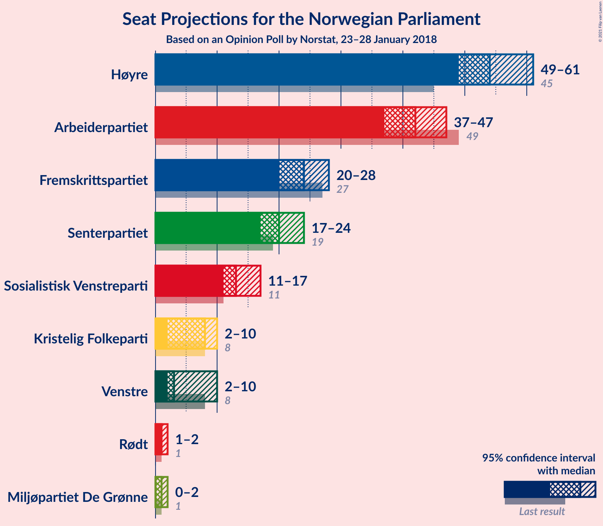

### Confidence Intervals

| Party | Last Result | Median | 80% Confidence Interval | 90% Confidence Interval | 95% Confidence Interval | 99% Confidence Interval |
|:-----:|:-----------:|:------:|:-----------------------:|:-----------------------:|:-----------------------:|:-----------------------:|
| <a href="#høyre">Høyre</a> | 45 | 54 | 52–57 |50–58 |50–60 |49–63 |
| <a href="#arbeiderpartiet">Arbeiderpartiet</a> | 49 | 43 | 40–45 |38–46 |37–47 |37–48 |
| <a href="#fremskrittspartiet">Fremskrittspartiet</a> | 27 | 24 | 22–25 |21–25 |20–26 |18–29 |
| <a href="#senterpartiet">Senterpartiet</a> | 19 | 20 | 19–23 |18–23 |17–24 |16–25 |
| <a href="#sosialistisk-venstreparti">Sosialistisk Venstreparti</a> | 11 | 13 | 13–15 |12–15 |11–16 |10–18 |
| <a href="#kristelig-folkeparti">Kristelig Folkeparti</a> | 8 | 8 | 3–10 |3–10 |3–10 |1–11 |
| <a href="#venstre">Venstre</a> | 8 | 3 | 2–9 |2–9 |2–9 |2–10 |
| <a href="#rødt">Rødt</a> | 1 | 1 | 1–2 |1–2 |1–2 |1–7 |
| <a href="#miljøpartiet-de-grønne">Miljøpartiet De Grønne</a> | 1 | 1 | 1–2 |1–2 |1–2 |1–3 |

### Høyre

*For a full overview of the results for this party, see the [Høyre](party-høyre.html) page.*

| Number of Seats | Probability | Accumulated | Special Marks |
|:---------------:|:-----------:|:-----------:|:-------------:|
| 45 | 0% | 100% | Last Result |
| 46 | 0.1% | 100% |  |
| 47 | 0.2% | 99.9% |  |
| 48 | 0.1% | 99.8% |  |
| 49 | 1.0% | 99.7% |  |
| 50 | 4% | 98.6% |  |
| 51 | 1.0% | 95% |  |
| 52 | 14% | 94% |  |
| 53 | 14% | 80% |  |
| 54 | 27% | 66% | Median |
| 55 | 2% | 38% |  |
| 56 | 5% | 36% |  |
| 57 | 25% | 31% |  |
| 58 | 2% | 6% |  |
| 59 | 1.3% | 4% |  |
| 60 | 2% | 3% |  |
| 61 | 0.1% | 1.2% |  |
| 62 | 0.3% | 1.0% |  |
| 63 | 0.3% | 0.8% |  |
| 64 | 0% | 0.5% |  |
| 65 | 0% | 0.5% |  |
| 66 | 0.4% | 0.4% |  |
| 67 | 0% | 0% |  |

### Arbeiderpartiet

*For a full overview of the results for this party, see the [Arbeiderpartiet](party-arbeiderpartiet.html) page.*

| Number of Seats | Probability | Accumulated | Special Marks |
|:---------------:|:-----------:|:-----------:|:-------------:|
| 35 | 0.1% | 100% |  |
| 36 | 0.2% | 99.9% |  |
| 37 | 3% | 99.7% |  |
| 38 | 3% | 97% |  |
| 39 | 3% | 94% |  |
| 40 | 11% | 91% |  |
| 41 | 21% | 79% |  |
| 42 | 8% | 58% |  |
| 43 | 16% | 50% | Median |
| 44 | 0.8% | 34% |  |
| 45 | 28% | 33% |  |
| 46 | 0.8% | 6% |  |
| 47 | 4% | 5% |  |
| 48 | 0.3% | 0.7% |  |
| 49 | 0% | 0.3% | Last Result |
| 50 | 0.2% | 0.3% |  |
| 51 | 0.1% | 0.1% |  |
| 52 | 0% | 0% |  |

### Fremskrittspartiet

*For a full overview of the results for this party, see the [Fremskrittspartiet](party-fremskrittspartiet.html) page.*

| Number of Seats | Probability | Accumulated | Special Marks |
|:---------------:|:-----------:|:-----------:|:-------------:|
| 17 | 0.1% | 100% |  |
| 18 | 0.5% | 99.9% |  |
| 19 | 0.3% | 99.4% |  |
| 20 | 2% | 99.1% |  |
| 21 | 6% | 97% |  |
| 22 | 10% | 91% |  |
| 23 | 3% | 82% |  |
| 24 | 49% | 79% | Median |
| 25 | 26% | 30% |  |
| 26 | 2% | 4% |  |
| 27 | 0.9% | 2% | Last Result |
| 28 | 0.1% | 0.8% |  |
| 29 | 0.6% | 0.7% |  |
| 30 | 0% | 0.1% |  |
| 31 | 0% | 0% |  |

### Senterpartiet

*For a full overview of the results for this party, see the [Senterpartiet](party-senterpartiet.html) page.*

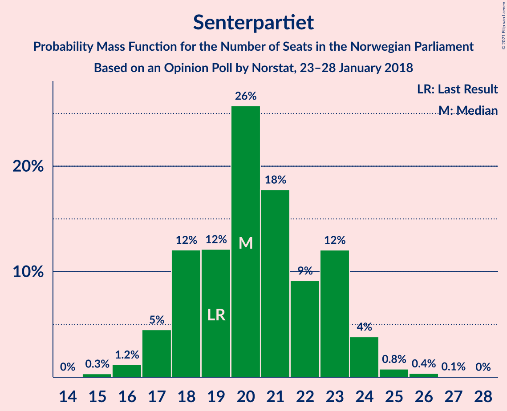

| Number of Seats | Probability | Accumulated | Special Marks |
|:---------------:|:-----------:|:-----------:|:-------------:|
| 14 | 0% | 100% |  |
| 15 | 0.2% | 99.9% |  |
| 16 | 0.5% | 99.7% |  |
| 17 | 3% | 99.2% |  |
| 18 | 4% | 97% |  |
| 19 | 7% | 92% | Last Result |
| 20 | 36% | 85% | Median |
| 21 | 15% | 50% |  |
| 22 | 6% | 35% |  |
| 23 | 27% | 29% |  |
| 24 | 2% | 3% |  |
| 25 | 0.6% | 1.0% |  |
| 26 | 0.4% | 0.4% |  |
| 27 | 0% | 0% |  |

### Sosialistisk Venstreparti

*For a full overview of the results for this party, see the [Sosialistisk Venstreparti](party-sosialistiskvenstreparti.html) page.*

| Number of Seats | Probability | Accumulated | Special Marks |
|:---------------:|:-----------:|:-----------:|:-------------:|
| 9 | 0% | 100% |  |
| 10 | 0.5% | 99.9% |  |
| 11 | 4% | 99.4% | Last Result |
| 12 | 3% | 96% |  |
| 13 | 55% | 93% | Median |
| 14 | 10% | 38% |  |
| 15 | 24% | 29% |  |
| 16 | 3% | 5% |  |
| 17 | 0.9% | 1.4% |  |
| 18 | 0.4% | 0.5% |  |
| 19 | 0.1% | 0.1% |  |
| 20 | 0.1% | 0.1% |  |
| 21 | 0% | 0% |  |

### Kristelig Folkeparti

*For a full overview of the results for this party, see the [Kristelig Folkeparti](party-kristeligfolkeparti.html) page.*

| Number of Seats | Probability | Accumulated | Special Marks |
|:---------------:|:-----------:|:-----------:|:-------------:|
| 1 | 1.0% | 100% |  |
| 2 | 0.3% | 99.0% |  |
| 3 | 39% | 98.7% |  |
| 4 | 0% | 60% |  |
| 5 | 0% | 60% |  |
| 6 | 0% | 60% |  |
| 7 | 1.3% | 60% |  |
| 8 | 19% | 59% | Last Result, Median |
| 9 | 23% | 40% |  |
| 10 | 16% | 17% |  |
| 11 | 1.0% | 1.3% |  |
| 12 | 0.3% | 0.3% |  |
| 13 | 0% | 0% |  |

### Venstre

*For a full overview of the results for this party, see the [Venstre](party-venstre.html) page.*

| Number of Seats | Probability | Accumulated | Special Marks |
|:---------------:|:-----------:|:-----------:|:-------------:|
| 2 | 49% | 100% |  |
| 3 | 14% | 51% | Median |
| 4 | 0% | 37% |  |
| 5 | 0% | 37% |  |
| 6 | 0% | 37% |  |
| 7 | 6% | 37% |  |
| 8 | 20% | 31% | Last Result |
| 9 | 10% | 11% |  |
| 10 | 0.9% | 1.2% |  |
| 11 | 0.2% | 0.3% |  |
| 12 | 0.1% | 0.1% |  |
| 13 | 0% | 0% |  |

### Rødt

*For a full overview of the results for this party, see the [Rødt](party-rødt.html) page.*

| Number of Seats | Probability | Accumulated | Special Marks |
|:---------------:|:-----------:|:-----------:|:-------------:|
| 1 | 66% | 100% | Last Result, Median |
| 2 | 33% | 34% |  |
| 3 | 0% | 0.7% |  |
| 4 | 0% | 0.7% |  |
| 5 | 0% | 0.7% |  |
| 6 | 0% | 0.7% |  |
| 7 | 0.4% | 0.7% |  |
| 8 | 0.1% | 0.2% |  |
| 9 | 0.1% | 0.1% |  |
| 10 | 0% | 0% |  |

### Miljøpartiet De Grønne

*For a full overview of the results for this party, see the [Miljøpartiet De Grønne](party-miljøpartietdegrønne.html) page.*

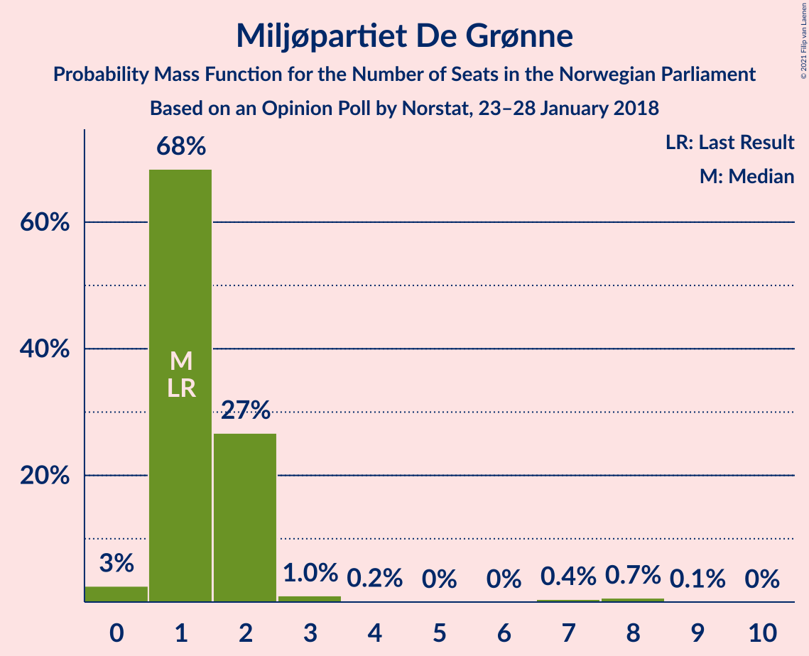

| Number of Seats | Probability | Accumulated | Special Marks |
|:---------------:|:-----------:|:-----------:|:-------------:|
| 0 | 0.5% | 100% |  |
| 1 | 80% | 99.5% | Last Result, Median |
| 2 | 19% | 20% |  |
| 3 | 0.4% | 0.7% |  |
| 4 | 0% | 0.3% |  |
| 5 | 0% | 0.3% |  |
| 6 | 0% | 0.3% |  |
| 7 | 0.2% | 0.3% |  |
| 8 | 0.1% | 0.1% |  |
| 9 | 0% | 0% |  |

## Coalitions

### Confidence Intervals

| Coalition | Last Result | Median | Majority? | 80% Confidence Interval | 90% Confidence Interval | 95% Confidence Interval | 99% Confidence Interval |
|:---------:|:-----------:|:------:|:---------:|:-----------------------:|:-----------------------:|:-----------------------:|:-----------------------:|
| Høyre – Fremskrittspartiet – Senterpartiet – Kristelig Folkeparti – Venstre | 107 | 110 | 100% | 108–113 | 106–115 | 105–115 | 103–119 |
| Høyre – Fremskrittspartiet – Kristelig Folkeparti – Venstre – Miljøpartiet De Grønne | 89 | 91 | 98% | 87–95 | 86–96 | 86–98 | 83–99 |
| Høyre – Fremskrittspartiet – Kristelig Folkeparti – Venstre | 88 | 90 | 98% | 86–93 | 85–95 | 85–96 | 82–98 |
| Arbeiderpartiet – Senterpartiet – Sosialistisk Venstreparti – Kristelig Folkeparti – Miljøpartiet De Grønne | 88 | 85 | 67% | 80–88 | 79–90 | 77–92 | 77–92 |
| Høyre – Fremskrittspartiet – Venstre | 80 | 83 | 29% | 79–87 | 77–88 | 76–90 | 76–91 |
| Arbeiderpartiet – Senterpartiet – Sosialistisk Venstreparti – Rødt – Miljøpartiet De Grønne | 81 | 79 | 2% | 76–83 | 74–84 | 73–84 | 71–87 |
| Høyre – Fremskrittspartiet | 72 | 78 | 2% | 75–81 | 74–82 | 74–83 | 71–88 |
| Arbeiderpartiet – Senterpartiet – Sosialistisk Venstreparti – Miljøpartiet De Grønne | 80 | 78 | 1.4% | 75–82 | 73–82 | 72–83 | 69–85 |
| Arbeiderpartiet – Senterpartiet – Sosialistisk Venstreparti – Rødt | 80 | 78 | 2% | 74–82 | 73–82 | 71–83 | 70–86 |
| Arbeiderpartiet – Senterpartiet – Sosialistisk Venstreparti | 79 | 76 | 0.1% | 73–81 | 72–81 | 70–82 | 68–84 |
| Arbeiderpartiet – Senterpartiet – Kristelig Folkeparti – Miljøpartiet De Grønne | 77 | 72 | 0% | 66–73 | 65–76 | 64–77 | 63–77 |
| Arbeiderpartiet – Senterpartiet – Kristelig Folkeparti | 76 | 71 | 0% | 65–72 | 64–75 | 63–76 | 62–76 |
| Høyre – Kristelig Folkeparti – Venstre | 61 | 66 | 0% | 62–70 | 62–71 | 61–73 | 57–74 |
| Arbeiderpartiet – Senterpartiet | 68 | 62 | 0% | 60–68 | 58–68 | 56–68 | 55–69 |
| Arbeiderpartiet – Sosialistisk Venstreparti | 60 | 56 | 0% | 53–58 | 52–61 | 51–62 | 48–63 |
| Senterpartiet – Kristelig Folkeparti – Venstre | 35 | 32 | 0% | 28–36 | 28–36 | 27–38 | 23–40 |

### Høyre – Fremskrittspartiet – Senterpartiet – Kristelig Folkeparti – Venstre

| Number of Seats | Probability | Accumulated | Special Marks |
|:---------------:|:-----------:|:-----------:|:-------------:|
| 99 | 0.1% | 100% |  |
| 100 | 0% | 99.9% |  |
| 101 | 0.1% | 99.9% |  |
| 102 | 0.2% | 99.8% |  |
| 103 | 0.3% | 99.6% |  |
| 104 | 1.0% | 99.3% |  |
| 105 | 3% | 98% |  |
| 106 | 2% | 95% |  |
| 107 | 0.8% | 93% | Last Result |
| 108 | 14% | 92% |  |
| 109 | 26% | 78% | Median |
| 110 | 14% | 51% |  |
| 111 | 4% | 38% |  |
| 112 | 1.5% | 34% |  |
| 113 | 24% | 33% |  |
| 114 | 4% | 9% |  |
| 115 | 4% | 5% |  |
| 116 | 0.2% | 2% |  |
| 117 | 0.2% | 1.3% |  |
| 118 | 0.2% | 1.1% |  |
| 119 | 0.8% | 0.9% |  |
| 120 | 0% | 0% |  |

### Høyre – Fremskrittspartiet – Kristelig Folkeparti – Venstre – Miljøpartiet De Grønne

| Number of Seats | Probability | Accumulated | Special Marks |
|:---------------:|:-----------:|:-----------:|:-------------:|
| 80 | 0.1% | 100% |  |
| 81 | 0% | 99.9% |  |
| 82 | 0.1% | 99.9% |  |
| 83 | 1.1% | 99.8% |  |
| 84 | 0.3% | 98.7% |  |
| 85 | 0.4% | 98% | Majority |
| 86 | 3% | 98% |  |
| 87 | 24% | 95% |  |
| 88 | 4% | 71% |  |
| 89 | 13% | 67% | Last Result |
| 90 | 2% | 54% | Median |
| 91 | 8% | 52% |  |
| 92 | 10% | 44% |  |
| 93 | 17% | 34% |  |
| 94 | 2% | 18% |  |
| 95 | 10% | 16% |  |
| 96 | 2% | 6% |  |
| 97 | 0.9% | 4% |  |
| 98 | 1.0% | 3% |  |
| 99 | 2% | 2% |  |
| 100 | 0% | 0.2% |  |
| 101 | 0.1% | 0.2% |  |
| 102 | 0% | 0% |  |

### Høyre – Fremskrittspartiet – Kristelig Folkeparti – Venstre

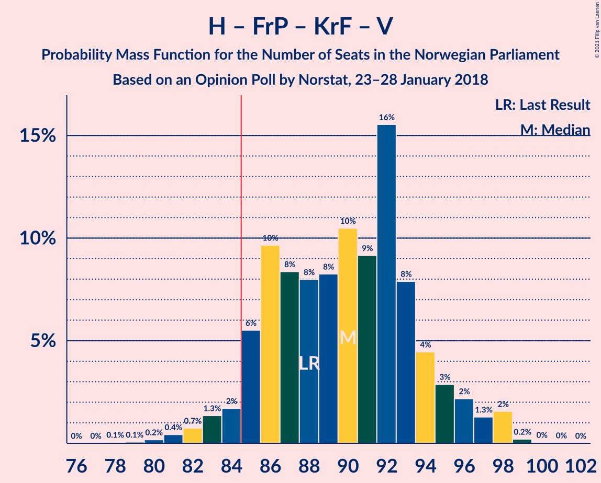

| Number of Seats | Probability | Accumulated | Special Marks |
|:---------------:|:-----------:|:-----------:|:-------------:|
| 78 | 0.1% | 100% |  |
| 79 | 0% | 99.9% |  |
| 80 | 0% | 99.9% |  |
| 81 | 0.1% | 99.9% |  |
| 82 | 1.1% | 99.8% |  |
| 83 | 0.3% | 98.7% |  |
| 84 | 0.5% | 98% |  |
| 85 | 3% | 98% | Majority |
| 86 | 25% | 95% |  |
| 87 | 3% | 69% |  |
| 88 | 13% | 67% | Last Result |
| 89 | 3% | 54% | Median |
| 90 | 12% | 51% |  |
| 91 | 5% | 39% |  |
| 92 | 17% | 34% |  |
| 93 | 10% | 17% |  |
| 94 | 2% | 7% |  |
| 95 | 2% | 5% |  |
| 96 | 1.5% | 4% |  |
| 97 | 0.3% | 2% |  |
| 98 | 2% | 2% |  |
| 99 | 0.1% | 0.2% |  |
| 100 | 0% | 0.1% |  |
| 101 | 0% | 0% |  |

### Arbeiderpartiet – Senterpartiet – Sosialistisk Venstreparti – Kristelig Folkeparti – Miljøpartiet De Grønne

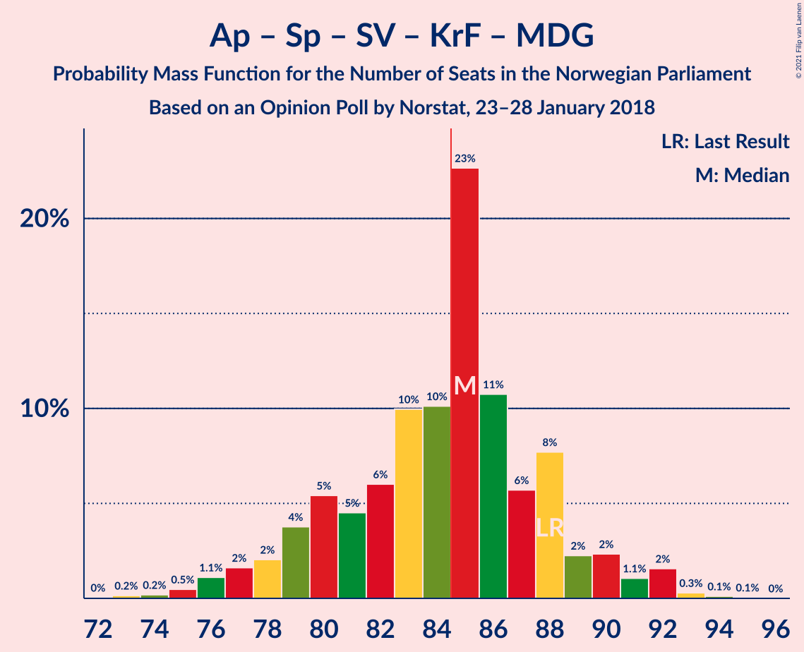

| Number of Seats | Probability | Accumulated | Special Marks |
|:---------------:|:-----------:|:-----------:|:-------------:|
| 73 | 0.1% | 100% |  |
| 74 | 0.1% | 99.9% |  |
| 75 | 0.1% | 99.8% |  |
| 76 | 0.2% | 99.7% |  |
| 77 | 2% | 99.5% |  |
| 78 | 0.3% | 97% |  |
| 79 | 4% | 97% |  |
| 80 | 8% | 93% |  |
| 81 | 2% | 86% |  |
| 82 | 2% | 84% |  |
| 83 | 13% | 81% |  |
| 84 | 2% | 69% |  |
| 85 | 25% | 67% | Median, Majority |
| 86 | 19% | 42% |  |
| 87 | 2% | 22% |  |
| 88 | 13% | 20% | Last Result |
| 89 | 0.7% | 7% |  |
| 90 | 3% | 7% |  |
| 91 | 0.3% | 3% |  |
| 92 | 3% | 3% |  |
| 93 | 0.1% | 0.1% |  |
| 94 | 0% | 0% |  |

### Høyre – Fremskrittspartiet – Venstre

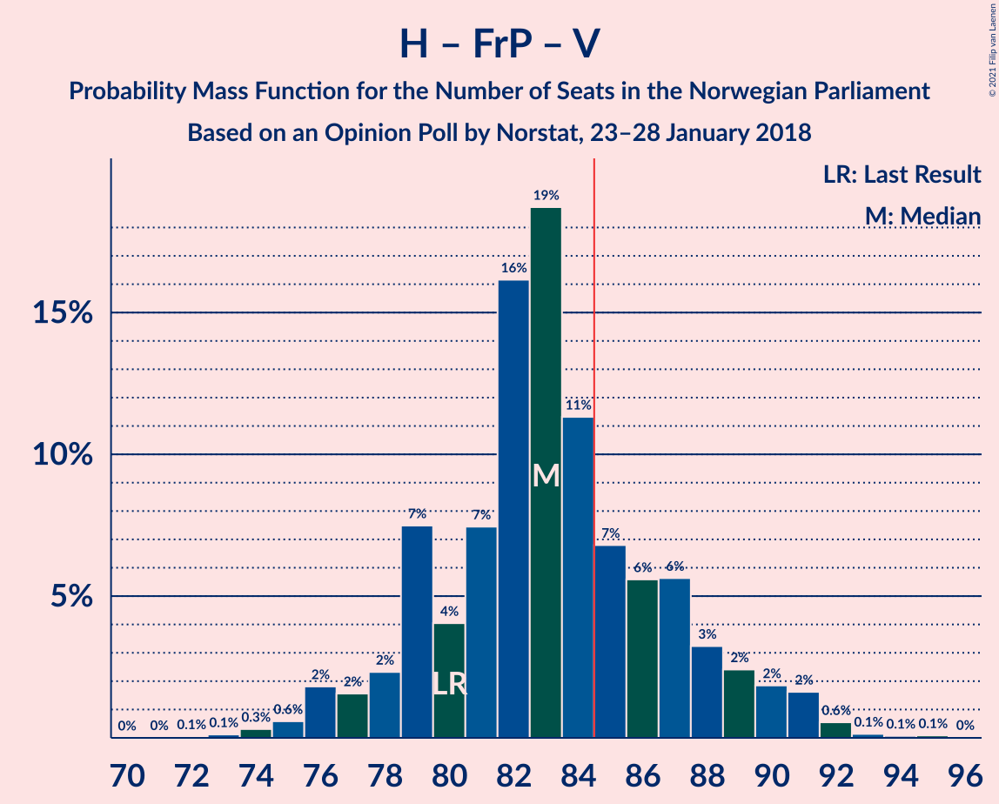

| Number of Seats | Probability | Accumulated | Special Marks |
|:---------------:|:-----------:|:-----------:|:-------------:|
| 73 | 0% | 100% |  |
| 74 | 0.1% | 99.9% |  |
| 75 | 0.2% | 99.8% |  |
| 76 | 3% | 99.6% |  |
| 77 | 2% | 97% |  |
| 78 | 2% | 95% |  |
| 79 | 13% | 93% |  |
| 80 | 0.8% | 80% | Last Result |
| 81 | 2% | 79% | Median |
| 82 | 20% | 76% |  |
| 83 | 24% | 57% |  |
| 84 | 3% | 33% |  |
| 85 | 12% | 29% | Majority |
| 86 | 2% | 17% |  |
| 87 | 8% | 16% |  |
| 88 | 4% | 7% |  |
| 89 | 0.6% | 3% |  |
| 90 | 2% | 3% |  |
| 91 | 0.6% | 0.9% |  |
| 92 | 0.1% | 0.3% |  |
| 93 | 0.1% | 0.2% |  |
| 94 | 0.1% | 0.1% |  |
| 95 | 0% | 0% |  |

### Arbeiderpartiet – Senterpartiet – Sosialistisk Venstreparti – Rødt – Miljøpartiet De Grønne

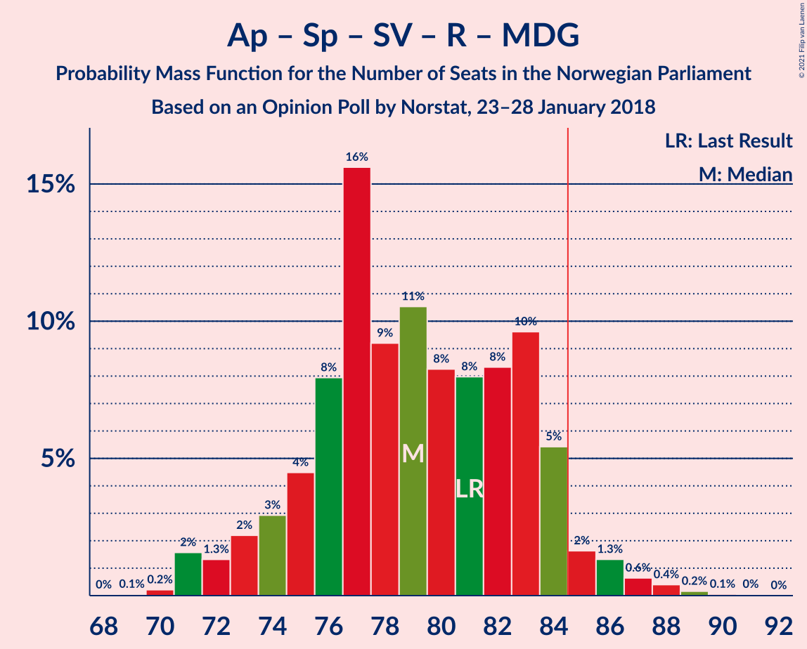

| Number of Seats | Probability | Accumulated | Special Marks |
|:---------------:|:-----------:|:-----------:|:-------------:|
| 69 | 0% | 100% |  |
| 70 | 0.1% | 99.9% |  |
| 71 | 2% | 99.8% |  |
| 72 | 0.3% | 98% |  |
| 73 | 1.5% | 98% |  |
| 74 | 2% | 96% |  |
| 75 | 2% | 95% |  |
| 76 | 10% | 93% |  |
| 77 | 17% | 83% |  |
| 78 | 5% | 66% | Median |
| 79 | 12% | 61% |  |
| 80 | 3% | 49% |  |
| 81 | 13% | 46% | Last Result |
| 82 | 3% | 33% |  |
| 83 | 25% | 31% |  |
| 84 | 3% | 5% |  |
| 85 | 0.5% | 2% | Majority |
| 86 | 0.3% | 2% |  |
| 87 | 1.1% | 1.3% |  |
| 88 | 0.1% | 0.2% |  |
| 89 | 0% | 0.1% |  |
| 90 | 0% | 0.1% |  |
| 91 | 0.1% | 0.1% |  |
| 92 | 0% | 0% |  |

### Høyre – Fremskrittspartiet

| Number of Seats | Probability | Accumulated | Special Marks |
|:---------------:|:-----------:|:-----------:|:-------------:|
| 69 | 0.1% | 100% |  |
| 70 | 0.1% | 99.9% |  |
| 71 | 0.6% | 99.8% |  |
| 72 | 0.7% | 99.2% | Last Result |
| 73 | 0.9% | 98.5% |  |
| 74 | 6% | 98% |  |
| 75 | 7% | 92% |  |
| 76 | 3% | 84% |  |
| 77 | 24% | 82% |  |
| 78 | 10% | 58% | Median |
| 79 | 14% | 48% |  |
| 80 | 3% | 34% |  |
| 81 | 25% | 31% |  |
| 82 | 3% | 6% |  |
| 83 | 1.4% | 3% |  |
| 84 | 0.3% | 2% |  |
| 85 | 0.1% | 2% | Majority |
| 86 | 0.5% | 1.4% |  |
| 87 | 0.4% | 1.0% |  |
| 88 | 0% | 0.5% |  |
| 89 | 0.5% | 0.5% |  |
| 90 | 0% | 0% |  |

### Arbeiderpartiet – Senterpartiet – Sosialistisk Venstreparti – Miljøpartiet De Grønne

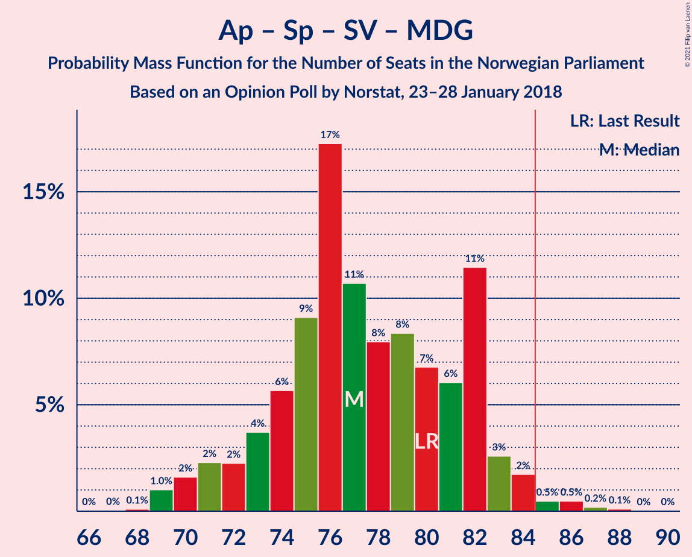

| Number of Seats | Probability | Accumulated | Special Marks |
|:---------------:|:-----------:|:-----------:|:-------------:|
| 67 | 0% | 100% |  |
| 68 | 0% | 99.9% |  |
| 69 | 2% | 99.9% |  |
| 70 | 0.3% | 98% |  |
| 71 | 0.2% | 98% |  |
| 72 | 2% | 98% |  |
| 73 | 1.4% | 96% |  |
| 74 | 2% | 94% |  |
| 75 | 10% | 92% |  |
| 76 | 20% | 82% |  |
| 77 | 8% | 61% | Median |
| 78 | 7% | 54% |  |
| 79 | 13% | 47% |  |
| 80 | 1.2% | 34% | Last Result |
| 81 | 5% | 33% |  |
| 82 | 24% | 28% |  |
| 83 | 3% | 5% |  |
| 84 | 0.2% | 2% |  |
| 85 | 1.2% | 1.4% | Majority |
| 86 | 0% | 0.1% |  |
| 87 | 0% | 0.1% |  |
| 88 | 0% | 0.1% |  |
| 89 | 0.1% | 0.1% |  |
| 90 | 0% | 0% |  |

### Arbeiderpartiet – Senterpartiet – Sosialistisk Venstreparti – Rødt

| Number of Seats | Probability | Accumulated | Special Marks |
|:---------------:|:-----------:|:-----------:|:-------------:|
| 68 | 0.1% | 100% |  |
| 69 | 0% | 99.8% |  |
| 70 | 2% | 99.8% |  |
| 71 | 1.0% | 98% |  |
| 72 | 0.9% | 97% |  |
| 73 | 2% | 96% |  |
| 74 | 11% | 94% |  |
| 75 | 2% | 84% |  |
| 76 | 17% | 82% |  |
| 77 | 10% | 65% | Median |
| 78 | 8% | 56% |  |
| 79 | 2% | 48% |  |
| 80 | 13% | 46% | Last Result |
| 81 | 4% | 33% |  |
| 82 | 24% | 29% |  |
| 83 | 3% | 5% |  |
| 84 | 0.4% | 2% |  |
| 85 | 0.3% | 2% | Majority |
| 86 | 1.1% | 1.2% |  |
| 87 | 0.1% | 0.1% |  |
| 88 | 0% | 0.1% |  |
| 89 | 0.1% | 0.1% |  |
| 90 | 0% | 0% |  |

### Arbeiderpartiet – Senterpartiet – Sosialistisk Venstreparti

| Number of Seats | Probability | Accumulated | Special Marks |
|:---------------:|:-----------:|:-----------:|:-------------:|
| 66 | 0% | 100% |  |
| 67 | 0.1% | 99.9% |  |
| 68 | 2% | 99.8% |  |
| 69 | 0.3% | 98% |  |
| 70 | 1.0% | 98% |  |
| 71 | 1.4% | 97% |  |
| 72 | 2% | 95% |  |
| 73 | 11% | 94% |  |
| 74 | 1.4% | 82% |  |
| 75 | 20% | 81% |  |
| 76 | 12% | 61% | Median |
| 77 | 3% | 49% |  |
| 78 | 13% | 46% |  |
| 79 | 3% | 34% | Last Result |
| 80 | 3% | 30% |  |
| 81 | 24% | 28% |  |
| 82 | 3% | 4% |  |
| 83 | 0.2% | 2% |  |
| 84 | 1.2% | 1.3% |  |
| 85 | 0% | 0.1% | Majority |
| 86 | 0% | 0.1% |  |
| 87 | 0.1% | 0.1% |  |
| 88 | 0% | 0% |  |

### Arbeiderpartiet – Senterpartiet – Kristelig Folkeparti – Miljøpartiet De Grønne

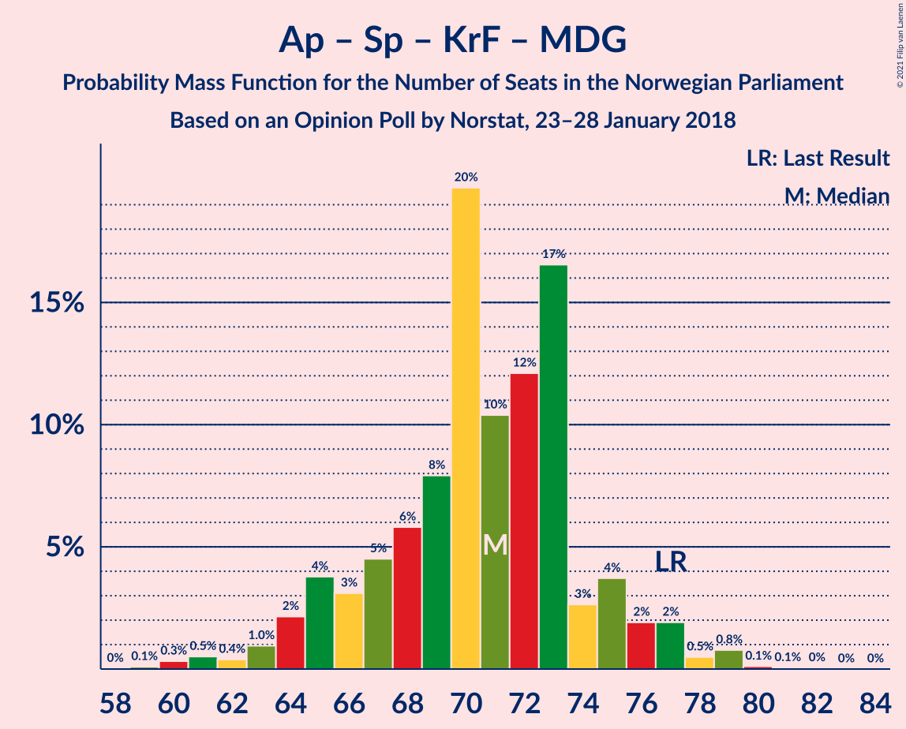

| Number of Seats | Probability | Accumulated | Special Marks |
|:---------------:|:-----------:|:-----------:|:-------------:|
| 60 | 0.1% | 100% |  |
| 61 | 0.2% | 99.8% |  |
| 62 | 0.1% | 99.7% |  |
| 63 | 0.2% | 99.6% |  |
| 64 | 2% | 99.4% |  |
| 65 | 7% | 97% |  |
| 66 | 3% | 90% |  |
| 67 | 3% | 87% |  |
| 68 | 1.1% | 84% |  |
| 69 | 5% | 83% |  |
| 70 | 10% | 78% |  |
| 71 | 3% | 68% |  |
| 72 | 28% | 64% | Median |
| 73 | 27% | 36% |  |
| 74 | 2% | 9% |  |
| 75 | 0.5% | 7% |  |
| 76 | 2% | 7% |  |
| 77 | 5% | 5% | Last Result |
| 78 | 0.1% | 0.3% |  |
| 79 | 0.1% | 0.2% |  |
| 80 | 0.1% | 0.1% |  |
| 81 | 0% | 0.1% |  |
| 82 | 0% | 0% |  |

### Arbeiderpartiet – Senterpartiet – Kristelig Folkeparti

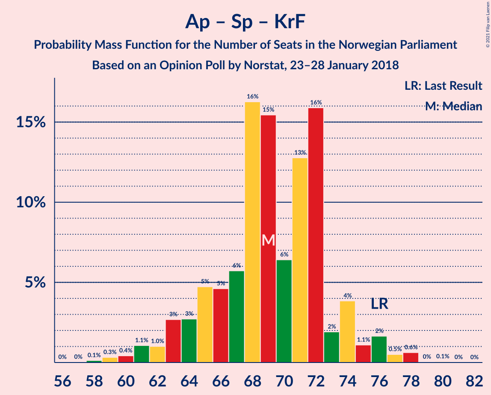

| Number of Seats | Probability | Accumulated | Special Marks |
|:---------------:|:-----------:|:-----------:|:-------------:|
| 58 | 0% | 100% |  |
| 59 | 0.1% | 99.9% |  |
| 60 | 0.2% | 99.8% |  |
| 61 | 0.1% | 99.6% |  |
| 62 | 0.1% | 99.5% |  |
| 63 | 2% | 99.4% |  |
| 64 | 7% | 97% |  |
| 65 | 5% | 90% |  |
| 66 | 2% | 85% |  |
| 67 | 1.3% | 83% |  |
| 68 | 13% | 82% |  |
| 69 | 2% | 68% |  |
| 70 | 7% | 67% |  |
| 71 | 24% | 60% | Median |
| 72 | 27% | 36% |  |
| 73 | 2% | 9% |  |
| 74 | 2% | 7% |  |
| 75 | 0.3% | 5% |  |
| 76 | 5% | 5% | Last Result |
| 77 | 0% | 0.2% |  |
| 78 | 0.1% | 0.1% |  |
| 79 | 0% | 0% |  |

### Høyre – Kristelig Folkeparti – Venstre

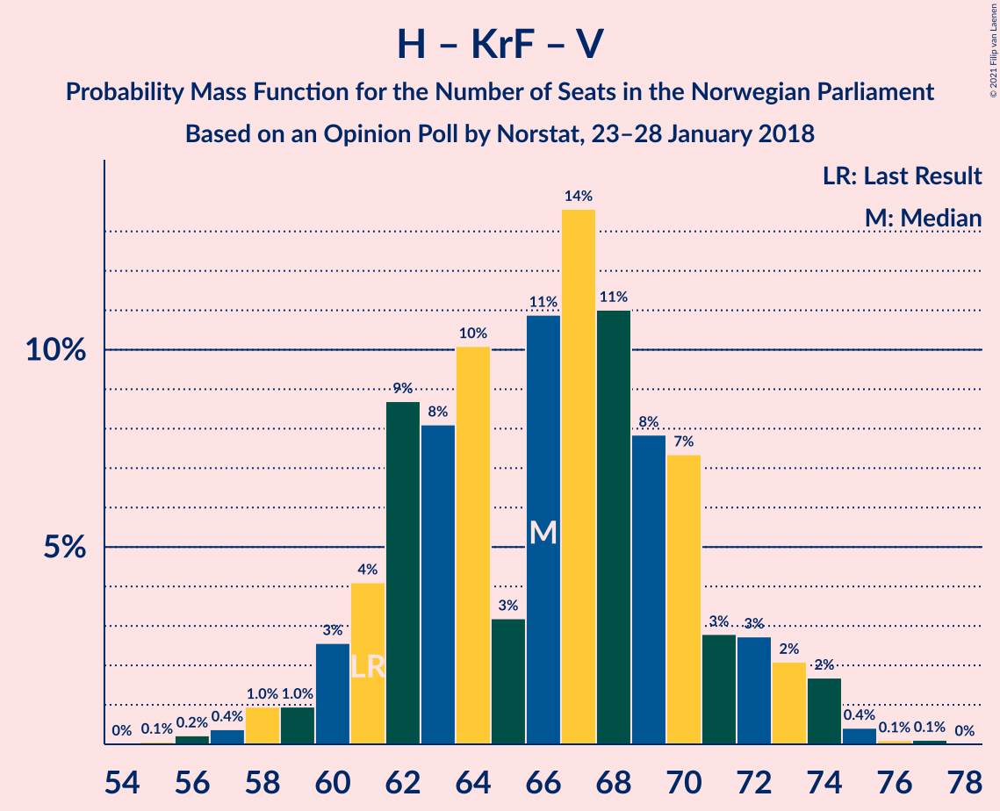

| Number of Seats | Probability | Accumulated | Special Marks |
|:---------------:|:-----------:|:-----------:|:-------------:|
| 56 | 0.2% | 100% |  |
| 57 | 0.3% | 99.8% |  |
| 58 | 0.2% | 99.5% |  |
| 59 | 0.1% | 99.3% |  |
| 60 | 1.3% | 99.1% |  |
| 61 | 2% | 98% | Last Result |
| 62 | 24% | 96% |  |
| 63 | 4% | 72% |  |
| 64 | 13% | 68% |  |
| 65 | 2% | 55% | Median |
| 66 | 8% | 53% |  |
| 67 | 17% | 45% |  |
| 68 | 12% | 28% |  |
| 69 | 5% | 15% |  |
| 70 | 3% | 11% |  |
| 71 | 3% | 7% |  |
| 72 | 0.8% | 4% |  |
| 73 | 1.5% | 3% |  |
| 74 | 2% | 2% |  |
| 75 | 0% | 0.2% |  |
| 76 | 0% | 0.2% |  |
| 77 | 0.1% | 0.1% |  |
| 78 | 0% | 0% |  |

### Arbeiderpartiet – Senterpartiet

| Number of Seats | Probability | Accumulated | Special Marks |
|:---------------:|:-----------:|:-----------:|:-------------:|
| 53 | 0.1% | 100% |  |
| 54 | 0% | 99.9% |  |
| 55 | 2% | 99.9% |  |
| 56 | 0.9% | 98% |  |
| 57 | 1.1% | 97% |  |
| 58 | 1.3% | 96% |  |
| 59 | 2% | 95% |  |
| 60 | 13% | 93% |  |
| 61 | 8% | 80% |  |
| 62 | 22% | 72% |  |
| 63 | 13% | 49% | Median |
| 64 | 3% | 37% |  |
| 65 | 3% | 33% |  |
| 66 | 1.1% | 31% |  |
| 67 | 4% | 30% |  |
| 68 | 24% | 25% | Last Result |
| 69 | 1.2% | 2% |  |
| 70 | 0.3% | 0.4% |  |
| 71 | 0% | 0.1% |  |
| 72 | 0.1% | 0.1% |  |
| 73 | 0% | 0% |  |

### Arbeiderpartiet – Sosialistisk Venstreparti

| Number of Seats | Probability | Accumulated | Special Marks |
|:---------------:|:-----------:|:-----------:|:-------------:|
| 47 | 0% | 100% |  |
| 48 | 1.1% | 99.9% |  |
| 49 | 0.2% | 98.8% |  |
| 50 | 0.3% | 98.7% |  |
| 51 | 3% | 98% |  |
| 52 | 4% | 95% |  |
| 53 | 11% | 91% |  |
| 54 | 14% | 80% |  |
| 55 | 3% | 66% |  |
| 56 | 13% | 63% | Median |
| 57 | 4% | 50% |  |
| 58 | 38% | 45% |  |
| 59 | 0.9% | 7% |  |
| 60 | 1.2% | 6% | Last Result |
| 61 | 1.2% | 5% |  |
| 62 | 4% | 4% |  |
| 63 | 0.2% | 0.5% |  |
| 64 | 0.2% | 0.3% |  |
| 65 | 0.1% | 0.1% |  |
| 66 | 0.1% | 0.1% |  |
| 67 | 0% | 0% |  |

### Senterpartiet – Kristelig Folkeparti – Venstre

| Number of Seats | Probability | Accumulated | Special Marks |
|:---------------:|:-----------:|:-----------:|:-------------:|
| 22 | 0.1% | 100% |  |
| 23 | 0.5% | 99.8% |  |
| 24 | 0.1% | 99.3% |  |
| 25 | 1.1% | 99.3% |  |
| 26 | 0.5% | 98% |  |
| 27 | 1.2% | 98% |  |
| 28 | 24% | 96% |  |
| 29 | 2% | 73% |  |
| 30 | 2% | 71% |  |
| 31 | 16% | 69% | Median |
| 32 | 7% | 53% |  |
| 33 | 6% | 45% |  |
| 34 | 16% | 39% |  |
| 35 | 5% | 23% | Last Result |
| 36 | 13% | 18% |  |
| 37 | 2% | 5% |  |
| 38 | 2% | 3% |  |
| 39 | 0.3% | 0.8% |  |
| 40 | 0.4% | 0.5% |  |
| 41 | 0% | 0.1% |  |
| 42 | 0% | 0.1% |  |
| 43 | 0% | 0% |  |

## Technical Information

### Opinion Poll

+ **Polling firm:** Norstat
+ **Commissioner(s):** —
+ **Fieldwork period:** 23–28 January 2018

### Calculations

+ **Sample size:** 936
+ **Simulations done:** 131,072
+ **Error estimate:** 1.89%

