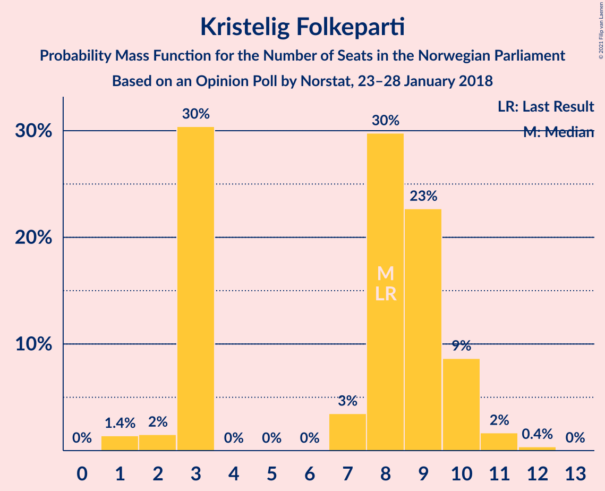
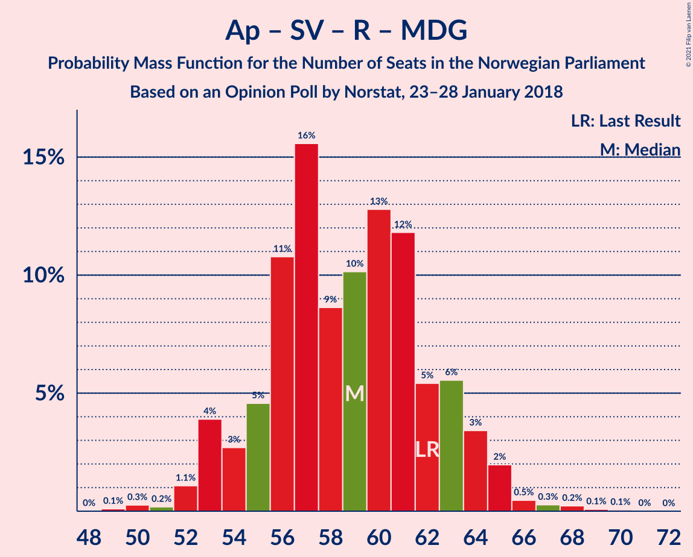

# Opinion Poll by Norstat, 23–28 January 2018

<a href="#voting-intentions">Voting Intentions</a> | <a href="#seats">Seats</a> | <a href="#coalitions">Coalitions</a> | <a href="#technical-information">Technical Information</a>

## Voting Intentions

### Confidence Intervals

| Party | Last Result | Poll Result | 80% Confidence Interval | 90% Confidence Interval | 95% Confidence Interval | 99% Confidence Interval |
|:-----:|:-----------:|:-----------:|:-----------------------:|:-----------------------:|:-----------------------:|:-----------------------:|
| Høyre | 25.0% | 29.9% | 28.0–31.9% |27.5–32.4% |27.1–32.9% |26.2–33.9% |
| Arbeiderpartiet | 27.4% | 22.8% | 21.1–24.6% |20.6–25.1% |20.2–25.6% |19.4–26.5% |
| Fremskrittspartiet | 15.2% | 12.8% | 11.5–14.3% |11.1–14.8% |10.8–15.1% |10.2–15.9% |
| Senterpartiet | 10.3% | 11.0% | 9.8–12.4% |9.4–12.8% |9.1–13.2% |8.6–13.9% |
| Sosialistisk Venstreparti | 6.0% | 7.4% | 6.4–8.6% |6.1–8.9% |5.9–9.2% |5.4–9.8% |
| Kristelig Folkeparti | 4.2% | 4.3% | 3.5–5.3% |3.3–5.5% |3.2–5.8% |2.8–6.3% |
| Venstre | 4.4% | 4.0% | 3.2–4.9% |3.0–5.2% |2.9–5.4% |2.6–5.9% |
| Rødt | 2.4% | 2.8% | 2.2–3.6% |2.0–3.8% |1.9–4.1% |1.7–4.5% |
| Miljøpartiet De Grønne | 3.2% | 2.7% | 2.1–3.5% |2.0–3.7% |1.8–3.9% |1.6–4.3% |

*Note:* The poll result column reflects the actual value used in the calculations. Published results may vary slightly, and in addition be rounded to fewer digits.

## Seats

### Confidence Intervals

| Party | Last Result | Median | 80% Confidence Interval | 90% Confidence Interval | 95% Confidence Interval | 99% Confidence Interval |
|:-----:|:-----------:|:------:|:-----------------------:|:-----------------------:|:-----------------------:|:-----------------------:|
| <a href="#høyre">Høyre</a> | 45 | 54 | 51–58 |50–59 |49–61 |47–63 |
| <a href="#arbeiderpartiet">Arbeiderpartiet</a> | 49 | 42 | 39–46 |38–46 |37–47 |36–48 |
| <a href="#fremskrittspartiet">Fremskrittspartiet</a> | 27 | 24 | 22–26 |21–26 |20–28 |18–29 |
| <a href="#senterpartiet">Senterpartiet</a> | 19 | 20 | 18–23 |17–24 |17–24 |16–25 |
| <a href="#sosialistisk-venstreparti">Sosialistisk Venstreparti</a> | 11 | 13 | 12–15 |11–16 |11–16 |10–18 |
| <a href="#kristelig-folkeparti">Kristelig Folkeparti</a> | 8 | 8 | 3–10 |3–10 |2–10 |1–11 |
| <a href="#venstre">Venstre</a> | 8 | 3 | 2–9 |2–9 |2–9 |2–11 |
| <a href="#rødt">Rødt</a> | 1 | 1 | 1–2 |1–2 |1–2 |1–8 |
| <a href="#miljøpartiet-de-grønne">Miljøpartiet De Grønne</a> | 1 | 1 | 1–2 |1–2 |1–2 |0–8 |

### Høyre

*For a full overview of the results for this party, see the [Høyre](party-høyre.html) page.*

| Number of Seats | Probability | Accumulated | Special Marks |
|:---------------:|:-----------:|:-----------:|:-------------:|
| 45 | 0% | 100% | Last Result |
| 46 | 0.2% | 99.9% |  |
| 47 | 0.3% | 99.8% |  |
| 48 | 0.3% | 99.5% |  |
| 49 | 3% | 99.2% |  |
| 50 | 4% | 96% |  |
| 51 | 3% | 92% |  |
| 52 | 15% | 89% |  |
| 53 | 11% | 74% |  |
| 54 | 14% | 64% | Median |
| 55 | 6% | 50% |  |
| 56 | 6% | 44% |  |
| 57 | 18% | 38% |  |
| 58 | 12% | 19% |  |
| 59 | 3% | 8% |  |
| 60 | 2% | 5% |  |
| 61 | 2% | 3% |  |
| 62 | 0.5% | 1.3% |  |
| 63 | 0.5% | 0.7% |  |
| 64 | 0% | 0.3% |  |
| 65 | 0% | 0.2% |  |
| 66 | 0.2% | 0.2% |  |
| 67 | 0% | 0% |  |

### Arbeiderpartiet

*For a full overview of the results for this party, see the [Arbeiderpartiet](party-arbeiderpartiet.html) page.*

| Number of Seats | Probability | Accumulated | Special Marks |
|:---------------:|:-----------:|:-----------:|:-------------:|
| 34 | 0% | 100% |  |
| 35 | 0.1% | 99.9% |  |
| 36 | 0.9% | 99.8% |  |
| 37 | 2% | 98.9% |  |
| 38 | 4% | 96% |  |
| 39 | 5% | 93% |  |
| 40 | 14% | 88% |  |
| 41 | 17% | 75% |  |
| 42 | 13% | 58% | Median |
| 43 | 15% | 45% |  |
| 44 | 6% | 30% |  |
| 45 | 13% | 24% |  |
| 46 | 8% | 11% |  |
| 47 | 2% | 3% |  |
| 48 | 0.6% | 1.0% |  |
| 49 | 0.2% | 0.4% | Last Result |
| 50 | 0.2% | 0.2% |  |
| 51 | 0% | 0.1% |  |
| 52 | 0% | 0% |  |

### Fremskrittspartiet

*For a full overview of the results for this party, see the [Fremskrittspartiet](party-fremskrittspartiet.html) page.*

| Number of Seats | Probability | Accumulated | Special Marks |
|:---------------:|:-----------:|:-----------:|:-------------:|
| 17 | 0.1% | 100% |  |
| 18 | 0.4% | 99.9% |  |
| 19 | 1.2% | 99.4% |  |
| 20 | 2% | 98% |  |
| 21 | 6% | 96% |  |
| 22 | 11% | 91% |  |
| 23 | 20% | 79% |  |
| 24 | 25% | 59% | Median |
| 25 | 24% | 34% |  |
| 26 | 5% | 10% |  |
| 27 | 2% | 5% | Last Result |
| 28 | 1.3% | 3% |  |
| 29 | 1.0% | 1.5% |  |
| 30 | 0.4% | 0.5% |  |
| 31 | 0% | 0% |  |

### Senterpartiet

*For a full overview of the results for this party, see the [Senterpartiet](party-senterpartiet.html) page.*

| Number of Seats | Probability | Accumulated | Special Marks |
|:---------------:|:-----------:|:-----------:|:-------------:|
| 14 | 0% | 100% |  |
| 15 | 0.2% | 99.9% |  |
| 16 | 2% | 99.7% |  |
| 17 | 5% | 98% |  |
| 18 | 11% | 93% |  |
| 19 | 13% | 82% | Last Result |
| 20 | 25% | 69% | Median |
| 21 | 18% | 44% |  |
| 22 | 7% | 26% |  |
| 23 | 13% | 19% |  |
| 24 | 5% | 6% |  |
| 25 | 0.7% | 1.2% |  |
| 26 | 0.4% | 0.5% |  |
| 27 | 0.1% | 0.1% |  |
| 28 | 0% | 0% |  |

### Sosialistisk Venstreparti

*For a full overview of the results for this party, see the [Sosialistisk Venstreparti](party-sosialistiskvenstreparti.html) page.*

| Number of Seats | Probability | Accumulated | Special Marks |
|:---------------:|:-----------:|:-----------:|:-------------:|
| 9 | 0.2% | 100% |  |
| 10 | 0.8% | 99.8% |  |
| 11 | 7% | 98.9% | Last Result |
| 12 | 6% | 92% |  |
| 13 | 39% | 86% | Median |
| 14 | 12% | 47% |  |
| 15 | 28% | 35% |  |
| 16 | 4% | 7% |  |
| 17 | 2% | 2% |  |
| 18 | 0.5% | 0.7% |  |
| 19 | 0.1% | 0.1% |  |
| 20 | 0% | 0% |  |

### Kristelig Folkeparti

*For a full overview of the results for this party, see the [Kristelig Folkeparti](party-kristeligfolkeparti.html) page.*

| Number of Seats | Probability | Accumulated | Special Marks |
|:---------------:|:-----------:|:-----------:|:-------------:|
| 1 | 2% | 100% |  |
| 2 | 2% | 98% |  |
| 3 | 33% | 97% |  |
| 4 | 0% | 63% |  |
| 5 | 0% | 63% |  |
| 6 | 0% | 63% |  |
| 7 | 3% | 63% |  |
| 8 | 32% | 61% | Last Result, Median |
| 9 | 16% | 29% |  |
| 10 | 11% | 13% |  |
| 11 | 1.3% | 2% |  |
| 12 | 0.2% | 0.3% |  |
| 13 | 0% | 0% |  |

### Venstre

*For a full overview of the results for this party, see the [Venstre](party-venstre.html) page.*

| Number of Seats | Probability | Accumulated | Special Marks |
|:---------------:|:-----------:|:-----------:|:-------------:|
| 2 | 48% | 100% |  |
| 3 | 12% | 52% | Median |
| 4 | 0% | 40% |  |
| 5 | 0% | 40% |  |
| 6 | 0% | 40% |  |
| 7 | 8% | 40% |  |
| 8 | 21% | 33% | Last Result |
| 9 | 9% | 12% |  |
| 10 | 2% | 2% |  |
| 11 | 0.4% | 0.5% |  |
| 12 | 0.1% | 0.1% |  |
| 13 | 0% | 0% |  |

### Rødt

*For a full overview of the results for this party, see the [Rødt](party-rødt.html) page.*

| Number of Seats | Probability | Accumulated | Special Marks |
|:---------------:|:-----------:|:-----------:|:-------------:|
| 1 | 57% | 100% | Last Result, Median |
| 2 | 41% | 43% |  |
| 3 | 0% | 2% |  |
| 4 | 0% | 2% |  |
| 5 | 0% | 2% |  |
| 6 | 0% | 2% |  |
| 7 | 0.9% | 2% |  |
| 8 | 0.9% | 1.0% |  |
| 9 | 0.1% | 0.2% |  |
| 10 | 0% | 0% |  |

### Miljøpartiet De Grønne

*For a full overview of the results for this party, see the [Miljøpartiet De Grønne](party-miljøpartietdegrønne.html) page.*

| Number of Seats | Probability | Accumulated | Special Marks |
|:---------------:|:-----------:|:-----------:|:-------------:|
| 0 | 2% | 100% |  |
| 1 | 66% | 98% | Last Result, Median |
| 2 | 30% | 32% |  |
| 3 | 0.6% | 2% |  |
| 4 | 0% | 1.3% |  |
| 5 | 0% | 1.3% |  |
| 6 | 0% | 1.3% |  |
| 7 | 0.4% | 1.2% |  |
| 8 | 0.8% | 0.9% |  |
| 9 | 0.1% | 0.1% |  |
| 10 | 0% | 0% |  |

## Coalitions

### Confidence Intervals

| Coalition | Last Result | Median | Majority? | 80% Confidence Interval | 90% Confidence Interval | 95% Confidence Interval | 99% Confidence Interval |
|:---------:|:-----------:|:------:|:---------:|:-----------------------:|:-----------------------:|:-----------------------:|:-----------------------:|
| Høyre – Fremskrittspartiet – Senterpartiet – Kristelig Folkeparti – Venstre | 107 | 110 | 100% | 106–114 | 105–115 | 104–116 | 101–118 |
| Høyre – Fremskrittspartiet – Kristelig Folkeparti – Venstre – Miljøpartiet De Grønne | 89 | 91 | 98% | 87–96 | 86–97 | 85–98 | 83–99 |
| Høyre – Fremskrittspartiet – Kristelig Folkeparti – Venstre | 88 | 90 | 95% | 86–94 | 85–96 | 83–97 | 81–98 |
| Arbeiderpartiet – Senterpartiet – Sosialistisk Venstreparti – Kristelig Folkeparti – Miljøpartiet De Grønne | 88 | 85 | 53% | 79–88 | 78–90 | 76–91 | 75–93 |
| Høyre – Fremskrittspartiet – Venstre | 80 | 83 | 29% | 79–88 | 77–89 | 76–91 | 75–92 |
| Høyre – Fremskrittspartiet | 72 | 79 | 3% | 74–82 | 73–84 | 73–85 | 70–87 |
| Arbeiderpartiet – Senterpartiet – Sosialistisk Venstreparti – Rødt – Miljøpartiet De Grønne | 81 | 79 | 4% | 75–83 | 73–84 | 72–85 | 71–88 |
| Arbeiderpartiet – Senterpartiet – Sosialistisk Venstreparti – Miljøpartiet De Grønne | 80 | 77 | 1.4% | 73–82 | 72–82 | 70–84 | 69–86 |
| Arbeiderpartiet – Senterpartiet – Sosialistisk Venstreparti – Rødt | 80 | 78 | 2% | 73–82 | 72–83 | 70–84 | 70–86 |
| Arbeiderpartiet – Senterpartiet – Sosialistisk Venstreparti | 79 | 76 | 0.5% | 72–81 | 70–81 | 69–82 | 68–84 |
| Arbeiderpartiet – Senterpartiet – Kristelig Folkeparti – Miljøpartiet De Grønne | 77 | 71 | 0% | 66–75 | 65–76 | 64–77 | 61–78 |
| Arbeiderpartiet – Senterpartiet – Kristelig Folkeparti | 76 | 69 | 0% | 65–73 | 63–74 | 62–76 | 60–76 |
| Høyre – Kristelig Folkeparti – Venstre | 61 | 66 | 0% | 62–70 | 61–72 | 60–73 | 57–74 |
| Arbeiderpartiet – Senterpartiet | 68 | 62 | 0% | 59–68 | 57–68 | 56–68 | 55–70 |
| Arbeiderpartiet – Sosialistisk Venstreparti – Rødt – Miljøpartiet De Grønne | 62 | 59 | 0% | 55–63 | 54–64 | 53–65 | 51–67 |
| Arbeiderpartiet – Sosialistisk Venstreparti | 60 | 56 | 0% | 52–60 | 51–61 | 50–62 | 48–63 |
| Senterpartiet – Kristelig Folkeparti – Venstre | 35 | 31 | 0% | 28–36 | 25–37 | 24–38 | 23–40 |

### Høyre – Fremskrittspartiet – Senterpartiet – Kristelig Folkeparti – Venstre

| Number of Seats | Probability | Accumulated | Special Marks |
|:---------------:|:-----------:|:-----------:|:-------------:|
| 99 | 0.1% | 100% |  |
| 100 | 0.1% | 99.9% |  |
| 101 | 0.4% | 99.8% |  |
| 102 | 0.2% | 99.4% |  |
| 103 | 0.6% | 99.2% |  |
| 104 | 2% | 98.7% |  |
| 105 | 5% | 96% |  |
| 106 | 3% | 91% |  |
| 107 | 5% | 88% | Last Result |
| 108 | 14% | 83% |  |
| 109 | 15% | 69% | Median |
| 110 | 9% | 54% |  |
| 111 | 5% | 45% |  |
| 112 | 13% | 39% |  |
| 113 | 14% | 26% |  |
| 114 | 5% | 11% |  |
| 115 | 2% | 7% |  |
| 116 | 2% | 4% |  |
| 117 | 1.1% | 2% |  |
| 118 | 0.2% | 0.7% |  |
| 119 | 0.4% | 0.5% |  |
| 120 | 0% | 0.1% |  |
| 121 | 0% | 0% |  |

### Høyre – Fremskrittspartiet – Kristelig Folkeparti – Venstre – Miljøpartiet De Grønne

| Number of Seats | Probability | Accumulated | Special Marks |
|:---------------:|:-----------:|:-----------:|:-------------:|
| 80 | 0.1% | 100% |  |
| 81 | 0% | 99.9% |  |
| 82 | 0.2% | 99.9% |  |
| 83 | 1.0% | 99.7% |  |
| 84 | 1.0% | 98.7% |  |
| 85 | 2% | 98% | Majority |
| 86 | 2% | 96% |  |
| 87 | 11% | 94% |  |
| 88 | 8% | 83% |  |
| 89 | 12% | 75% | Last Result |
| 90 | 7% | 63% | Median |
| 91 | 6% | 56% |  |
| 92 | 12% | 50% |  |
| 93 | 17% | 37% |  |
| 94 | 3% | 21% |  |
| 95 | 7% | 18% |  |
| 96 | 4% | 11% |  |
| 97 | 3% | 7% |  |
| 98 | 1.3% | 4% |  |
| 99 | 2% | 2% |  |
| 100 | 0.1% | 0.2% |  |
| 101 | 0.1% | 0.1% |  |
| 102 | 0% | 0% |  |

### Høyre – Fremskrittspartiet – Kristelig Folkeparti – Venstre

| Number of Seats | Probability | Accumulated | Special Marks |
|:---------------:|:-----------:|:-----------:|:-------------:|
| 78 | 0.1% | 100% |  |
| 79 | 0.1% | 99.9% |  |
| 80 | 0.2% | 99.9% |  |
| 81 | 0.4% | 99.7% |  |
| 82 | 1.0% | 99.3% |  |
| 83 | 1.0% | 98% |  |
| 84 | 2% | 97% |  |
| 85 | 3% | 95% | Majority |
| 86 | 15% | 93% |  |
| 87 | 6% | 78% |  |
| 88 | 10% | 72% | Last Result |
| 89 | 8% | 62% | Median |
| 90 | 11% | 54% |  |
| 91 | 12% | 43% |  |
| 92 | 12% | 31% |  |
| 93 | 6% | 19% |  |
| 94 | 4% | 13% |  |
| 95 | 4% | 9% |  |
| 96 | 2% | 5% |  |
| 97 | 1.1% | 3% |  |
| 98 | 2% | 2% |  |
| 99 | 0.1% | 0.2% |  |
| 100 | 0% | 0.1% |  |
| 101 | 0% | 0% |  |

### Arbeiderpartiet – Senterpartiet – Sosialistisk Venstreparti – Kristelig Folkeparti – Miljøpartiet De Grønne

| Number of Seats | Probability | Accumulated | Special Marks |
|:---------------:|:-----------:|:-----------:|:-------------:|
| 72 | 0% | 100% |  |
| 73 | 0.1% | 99.9% |  |
| 74 | 0.3% | 99.8% |  |
| 75 | 0.7% | 99.6% |  |
| 76 | 2% | 98.9% |  |
| 77 | 1.2% | 97% |  |
| 78 | 2% | 96% |  |
| 79 | 4% | 94% |  |
| 80 | 7% | 90% |  |
| 81 | 4% | 83% |  |
| 82 | 4% | 80% |  |
| 83 | 9% | 75% |  |
| 84 | 13% | 66% | Median |
| 85 | 21% | 53% | Majority |
| 86 | 12% | 32% |  |
| 87 | 5% | 21% |  |
| 88 | 8% | 15% | Last Result |
| 89 | 1.1% | 7% |  |
| 90 | 2% | 6% |  |
| 91 | 1.3% | 4% |  |
| 92 | 2% | 2% |  |
| 93 | 0.4% | 0.5% |  |
| 94 | 0.1% | 0.2% |  |
| 95 | 0% | 0.1% |  |
| 96 | 0% | 0% |  |

### Høyre – Fremskrittspartiet – Venstre

| Number of Seats | Probability | Accumulated | Special Marks |
|:---------------:|:-----------:|:-----------:|:-------------:|
| 72 | 0% | 100% |  |
| 73 | 0.1% | 99.9% |  |
| 74 | 0.3% | 99.8% |  |
| 75 | 0.7% | 99.5% |  |
| 76 | 2% | 98.8% |  |
| 77 | 2% | 97% |  |
| 78 | 2% | 95% |  |
| 79 | 6% | 93% |  |
| 80 | 4% | 87% | Last Result |
| 81 | 6% | 82% | Median |
| 82 | 17% | 76% |  |
| 83 | 21% | 59% |  |
| 84 | 9% | 39% |  |
| 85 | 8% | 29% | Majority |
| 86 | 3% | 21% |  |
| 87 | 7% | 18% |  |
| 88 | 4% | 11% |  |
| 89 | 3% | 8% |  |
| 90 | 2% | 4% |  |
| 91 | 2% | 3% |  |
| 92 | 0.7% | 1.0% |  |
| 93 | 0.2% | 0.3% |  |
| 94 | 0.1% | 0.1% |  |
| 95 | 0% | 0.1% |  |
| 96 | 0% | 0% |  |

### Høyre – Fremskrittspartiet

| Number of Seats | Probability | Accumulated | Special Marks |
|:---------------:|:-----------:|:-----------:|:-------------:|
| 68 | 0.1% | 100% |  |
| 69 | 0.1% | 99.9% |  |
| 70 | 0.3% | 99.8% |  |
| 71 | 1.0% | 99.5% |  |
| 72 | 0.9% | 98% | Last Result |
| 73 | 3% | 98% |  |
| 74 | 8% | 95% |  |
| 75 | 9% | 87% |  |
| 76 | 4% | 78% |  |
| 77 | 14% | 74% |  |
| 78 | 6% | 60% | Median |
| 79 | 10% | 54% |  |
| 80 | 10% | 44% |  |
| 81 | 16% | 34% |  |
| 82 | 8% | 18% |  |
| 83 | 4% | 9% |  |
| 84 | 3% | 6% |  |
| 85 | 0.9% | 3% | Majority |
| 86 | 1.2% | 2% |  |
| 87 | 0.4% | 0.7% |  |
| 88 | 0.1% | 0.3% |  |
| 89 | 0.2% | 0.3% |  |
| 90 | 0% | 0.1% |  |
| 91 | 0% | 0% |  |

### Arbeiderpartiet – Senterpartiet – Sosialistisk Venstreparti – Rødt – Miljøpartiet De Grønne

| Number of Seats | Probability | Accumulated | Special Marks |
|:---------------:|:-----------:|:-----------:|:-------------:|
| 69 | 0% | 100% |  |
| 70 | 0.2% | 99.9% |  |
| 71 | 2% | 99.8% |  |
| 72 | 1.2% | 98% |  |
| 73 | 2% | 97% |  |
| 74 | 4% | 94% |  |
| 75 | 4% | 91% |  |
| 76 | 6% | 87% |  |
| 77 | 12% | 81% | Median |
| 78 | 12% | 69% |  |
| 79 | 11% | 57% |  |
| 80 | 8% | 46% |  |
| 81 | 10% | 38% | Last Result |
| 82 | 6% | 28% |  |
| 83 | 15% | 22% |  |
| 84 | 2% | 7% |  |
| 85 | 2% | 4% | Majority |
| 86 | 1.0% | 2% |  |
| 87 | 0.8% | 1.4% |  |
| 88 | 0.4% | 0.6% |  |
| 89 | 0.2% | 0.3% |  |
| 90 | 0.1% | 0.1% |  |
| 91 | 0% | 0.1% |  |
| 92 | 0% | 0% |  |

### Arbeiderpartiet – Senterpartiet – Sosialistisk Venstreparti – Miljøpartiet De Grønne

| Number of Seats | Probability | Accumulated | Special Marks |
|:---------------:|:-----------:|:-----------:|:-------------:|
| 68 | 0.1% | 100% |  |
| 69 | 1.2% | 99.9% |  |
| 70 | 1.5% | 98.7% |  |
| 71 | 2% | 97% |  |
| 72 | 3% | 95% |  |
| 73 | 4% | 92% |  |
| 74 | 3% | 88% |  |
| 75 | 8% | 85% |  |
| 76 | 18% | 77% | Median |
| 77 | 11% | 59% |  |
| 78 | 7% | 48% |  |
| 79 | 10% | 41% |  |
| 80 | 6% | 31% | Last Result |
| 81 | 6% | 25% |  |
| 82 | 15% | 20% |  |
| 83 | 2% | 5% |  |
| 84 | 1.1% | 3% |  |
| 85 | 0.7% | 1.4% | Majority |
| 86 | 0.4% | 0.8% |  |
| 87 | 0.2% | 0.3% |  |
| 88 | 0.1% | 0.1% |  |
| 89 | 0% | 0.1% |  |
| 90 | 0% | 0% |  |

### Arbeiderpartiet – Senterpartiet – Sosialistisk Venstreparti – Rødt

| Number of Seats | Probability | Accumulated | Special Marks |
|:---------------:|:-----------:|:-----------:|:-------------:|
| 67 | 0% | 100% |  |
| 68 | 0.1% | 99.9% |  |
| 69 | 0.1% | 99.9% |  |
| 70 | 2% | 99.7% |  |
| 71 | 1.4% | 97% |  |
| 72 | 3% | 96% |  |
| 73 | 4% | 93% |  |
| 74 | 7% | 89% |  |
| 75 | 3% | 82% |  |
| 76 | 17% | 79% | Median |
| 77 | 12% | 62% |  |
| 78 | 6% | 50% |  |
| 79 | 7% | 44% |  |
| 80 | 12% | 36% | Last Result |
| 81 | 8% | 25% |  |
| 82 | 11% | 17% |  |
| 83 | 2% | 6% |  |
| 84 | 2% | 4% |  |
| 85 | 1.0% | 2% | Majority |
| 86 | 0.8% | 1.1% |  |
| 87 | 0.2% | 0.3% |  |
| 88 | 0% | 0.1% |  |
| 89 | 0.1% | 0.1% |  |
| 90 | 0% | 0% |  |

### Arbeiderpartiet – Senterpartiet – Sosialistisk Venstreparti

| Number of Seats | Probability | Accumulated | Special Marks |
|:---------------:|:-----------:|:-----------:|:-------------:|
| 66 | 0.1% | 100% |  |
| 67 | 0.1% | 99.9% |  |
| 68 | 1.3% | 99.8% |  |
| 69 | 1.4% | 98% |  |
| 70 | 3% | 97% |  |
| 71 | 3% | 94% |  |
| 72 | 6% | 91% |  |
| 73 | 6% | 86% |  |
| 74 | 9% | 80% |  |
| 75 | 17% | 71% | Median |
| 76 | 10% | 54% |  |
| 77 | 5% | 44% |  |
| 78 | 10% | 40% |  |
| 79 | 8% | 29% | Last Result |
| 80 | 7% | 22% |  |
| 81 | 11% | 15% |  |
| 82 | 2% | 4% |  |
| 83 | 0.9% | 2% |  |
| 84 | 0.6% | 1.1% |  |
| 85 | 0.3% | 0.5% | Majority |
| 86 | 0.1% | 0.2% |  |
| 87 | 0% | 0.1% |  |
| 88 | 0% | 0% |  |

### Arbeiderpartiet – Senterpartiet – Kristelig Folkeparti – Miljøpartiet De Grønne

| Number of Seats | Probability | Accumulated | Special Marks |
|:---------------:|:-----------:|:-----------:|:-------------:|
| 59 | 0% | 100% |  |
| 60 | 0.4% | 99.9% |  |
| 61 | 0.8% | 99.6% |  |
| 62 | 0.2% | 98.8% |  |
| 63 | 0.6% | 98.6% |  |
| 64 | 3% | 98% |  |
| 65 | 4% | 95% |  |
| 66 | 4% | 91% |  |
| 67 | 3% | 87% |  |
| 68 | 7% | 84% |  |
| 69 | 8% | 77% |  |
| 70 | 16% | 70% |  |
| 71 | 12% | 53% | Median |
| 72 | 17% | 42% |  |
| 73 | 12% | 25% |  |
| 74 | 2% | 13% |  |
| 75 | 5% | 11% |  |
| 76 | 3% | 6% |  |
| 77 | 3% | 3% | Last Result |
| 78 | 0.4% | 0.8% |  |
| 79 | 0.2% | 0.4% |  |
| 80 | 0.1% | 0.2% |  |
| 81 | 0.1% | 0.1% |  |
| 82 | 0% | 0% |  |

### Arbeiderpartiet – Senterpartiet – Kristelig Folkeparti

| Number of Seats | Probability | Accumulated | Special Marks |
|:---------------:|:-----------:|:-----------:|:-------------:|
| 58 | 0.1% | 100% |  |
| 59 | 0.4% | 99.9% |  |
| 60 | 0.4% | 99.5% |  |
| 61 | 0.9% | 99.1% |  |
| 62 | 0.8% | 98% |  |
| 63 | 3% | 97% |  |
| 64 | 4% | 95% |  |
| 65 | 5% | 91% |  |
| 66 | 4% | 86% |  |
| 67 | 6% | 82% |  |
| 68 | 19% | 76% |  |
| 69 | 13% | 57% |  |
| 70 | 5% | 44% | Median |
| 71 | 15% | 39% |  |
| 72 | 12% | 23% |  |
| 73 | 2% | 12% |  |
| 74 | 6% | 10% |  |
| 75 | 1.3% | 4% |  |
| 76 | 2% | 3% | Last Result |
| 77 | 0.4% | 0.5% |  |
| 78 | 0% | 0.1% |  |
| 79 | 0% | 0.1% |  |
| 80 | 0% | 0% |  |

### Høyre – Kristelig Folkeparti – Venstre

| Number of Seats | Probability | Accumulated | Special Marks |
|:---------------:|:-----------:|:-----------:|:-------------:|
| 55 | 0.1% | 100% |  |
| 56 | 0.2% | 99.9% |  |
| 57 | 0.3% | 99.7% |  |
| 58 | 0.8% | 99.4% |  |
| 59 | 0.5% | 98.7% |  |
| 60 | 3% | 98% |  |
| 61 | 2% | 96% | Last Result |
| 62 | 13% | 94% |  |
| 63 | 11% | 81% |  |
| 64 | 10% | 70% |  |
| 65 | 2% | 60% | Median |
| 66 | 8% | 58% |  |
| 67 | 14% | 50% |  |
| 68 | 14% | 36% |  |
| 69 | 8% | 21% |  |
| 70 | 4% | 14% |  |
| 71 | 4% | 10% |  |
| 72 | 2% | 6% |  |
| 73 | 2% | 4% |  |
| 74 | 1.4% | 2% |  |
| 75 | 0.1% | 0.3% |  |
| 76 | 0.1% | 0.2% |  |
| 77 | 0.1% | 0.1% |  |
| 78 | 0% | 0% |  |

### Arbeiderpartiet – Senterpartiet

| Number of Seats | Probability | Accumulated | Special Marks |
|:---------------:|:-----------:|:-----------:|:-------------:|
| 53 | 0.1% | 100% |  |
| 54 | 0.1% | 99.9% |  |
| 55 | 2% | 99.8% |  |
| 56 | 1.4% | 98% |  |
| 57 | 2% | 97% |  |
| 58 | 3% | 95% |  |
| 59 | 5% | 91% |  |
| 60 | 15% | 87% |  |
| 61 | 12% | 72% |  |
| 62 | 13% | 60% | Median |
| 63 | 11% | 47% |  |
| 64 | 7% | 37% |  |
| 65 | 9% | 30% |  |
| 66 | 6% | 21% |  |
| 67 | 3% | 15% |  |
| 68 | 10% | 12% | Last Result |
| 69 | 0.9% | 2% |  |
| 70 | 0.4% | 0.7% |  |
| 71 | 0.1% | 0.3% |  |
| 72 | 0.1% | 0.1% |  |
| 73 | 0% | 0% |  |

### Arbeiderpartiet – Sosialistisk Venstreparti – Rødt – Miljøpartiet De Grønne

| Number of Seats | Probability | Accumulated | Special Marks |
|:---------------:|:-----------:|:-----------:|:-------------:|
| 49 | 0% | 100% |  |
| 50 | 0.4% | 99.9% |  |
| 51 | 0.2% | 99.5% |  |
| 52 | 1.1% | 99.3% |  |
| 53 | 2% | 98% |  |
| 54 | 2% | 96% |  |
| 55 | 5% | 93% |  |
| 56 | 14% | 88% |  |
| 57 | 13% | 74% | Median |
| 58 | 6% | 61% |  |
| 59 | 10% | 55% |  |
| 60 | 16% | 46% |  |
| 61 | 14% | 30% |  |
| 62 | 5% | 16% | Last Result |
| 63 | 3% | 11% |  |
| 64 | 5% | 9% |  |
| 65 | 2% | 3% |  |
| 66 | 0.5% | 1.1% |  |
| 67 | 0.2% | 0.6% |  |
| 68 | 0.3% | 0.4% |  |
| 69 | 0.1% | 0.1% |  |
| 70 | 0.1% | 0.1% |  |
| 71 | 0% | 0% |  |

### Arbeiderpartiet – Sosialistisk Venstreparti

| Number of Seats | Probability | Accumulated | Special Marks |
|:---------------:|:-----------:|:-----------:|:-------------:|
| 47 | 0.1% | 100% |  |
| 48 | 0.6% | 99.9% |  |
| 49 | 0.4% | 99.3% |  |
| 50 | 2% | 98.9% |  |
| 51 | 3% | 96% |  |
| 52 | 5% | 93% |  |
| 53 | 12% | 88% |  |
| 54 | 13% | 76% |  |
| 55 | 8% | 64% | Median |
| 56 | 10% | 55% |  |
| 57 | 9% | 45% |  |
| 58 | 21% | 36% |  |
| 59 | 3% | 15% |  |
| 60 | 4% | 12% | Last Result |
| 61 | 5% | 8% |  |
| 62 | 2% | 3% |  |
| 63 | 0.5% | 0.8% |  |
| 64 | 0.1% | 0.3% |  |
| 65 | 0.1% | 0.1% |  |
| 66 | 0% | 0.1% |  |
| 67 | 0% | 0% |  |

### Senterpartiet – Kristelig Folkeparti – Venstre

| Number of Seats | Probability | Accumulated | Special Marks |
|:---------------:|:-----------:|:-----------:|:-------------:|
| 21 | 0.1% | 100% |  |
| 22 | 0.1% | 99.9% |  |
| 23 | 1.3% | 99.8% |  |
| 24 | 2% | 98% |  |
| 25 | 4% | 97% |  |
| 26 | 1.0% | 93% |  |
| 27 | 2% | 92% |  |
| 28 | 16% | 90% |  |
| 29 | 3% | 74% |  |
| 30 | 11% | 72% |  |
| 31 | 14% | 61% | Median |
| 32 | 6% | 47% |  |
| 33 | 9% | 41% |  |
| 34 | 9% | 33% |  |
| 35 | 8% | 24% | Last Result |
| 36 | 8% | 16% |  |
| 37 | 3% | 8% |  |
| 38 | 3% | 5% |  |
| 39 | 0.7% | 1.5% |  |
| 40 | 0.6% | 0.8% |  |
| 41 | 0.2% | 0.3% |  |
| 42 | 0.1% | 0.1% |  |
| 43 | 0% | 0% |  |

## Technical Information

### Opinion Poll

+ **Polling firm:** Norstat
+ **Commissioner(s):** —
+ **Fieldwork period:** 23–28 January 2018

### Calculations

+ **Sample size:** 936
+ **Simulations done:** 524,288
+ **Error estimate:** 2.32%

