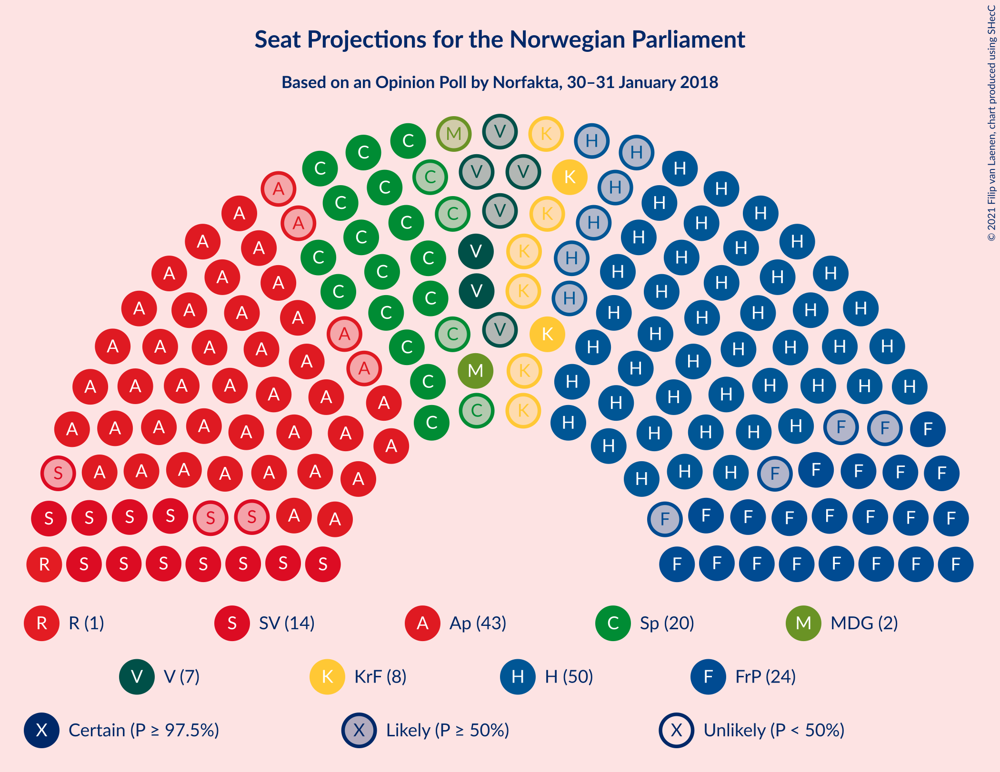
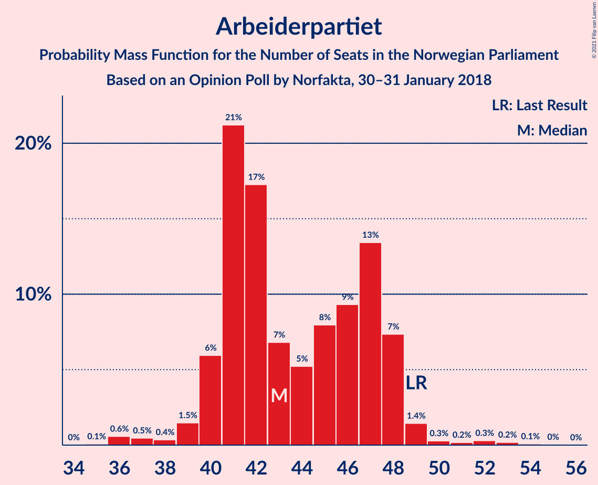
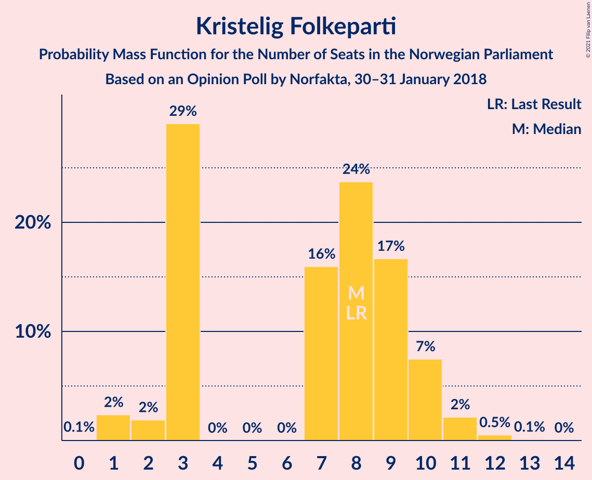
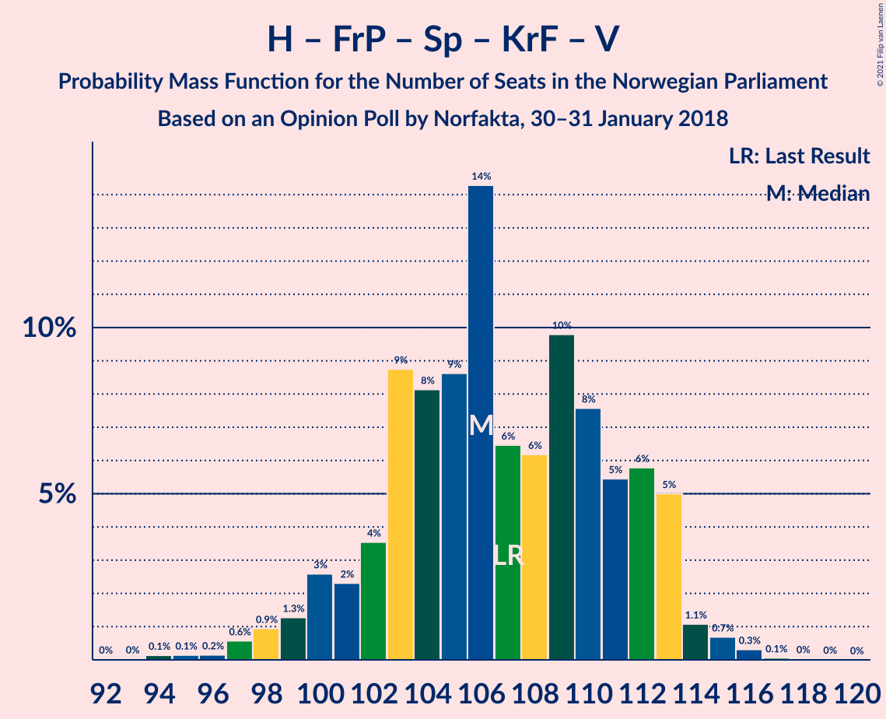
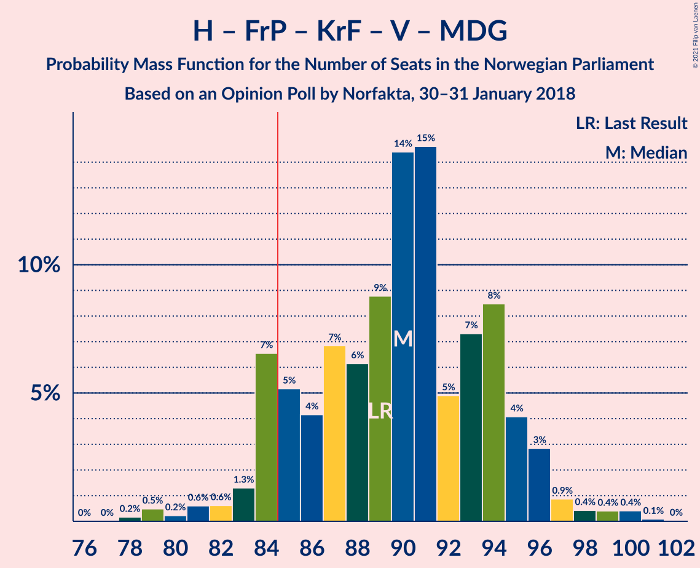
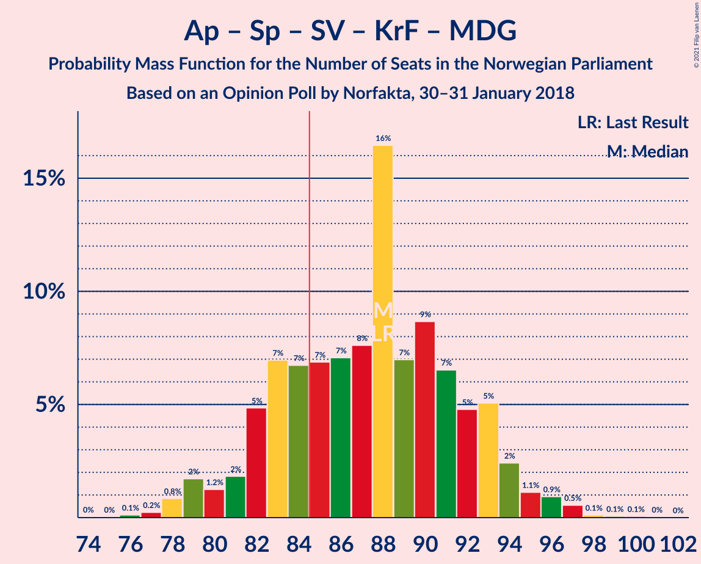
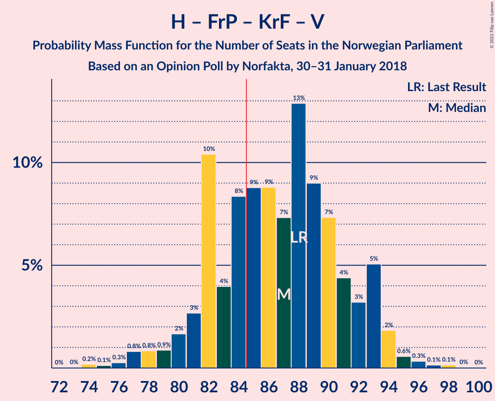
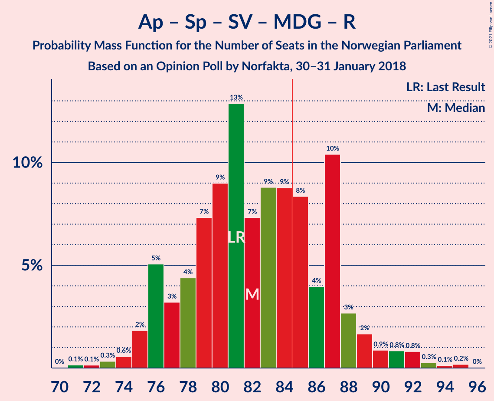
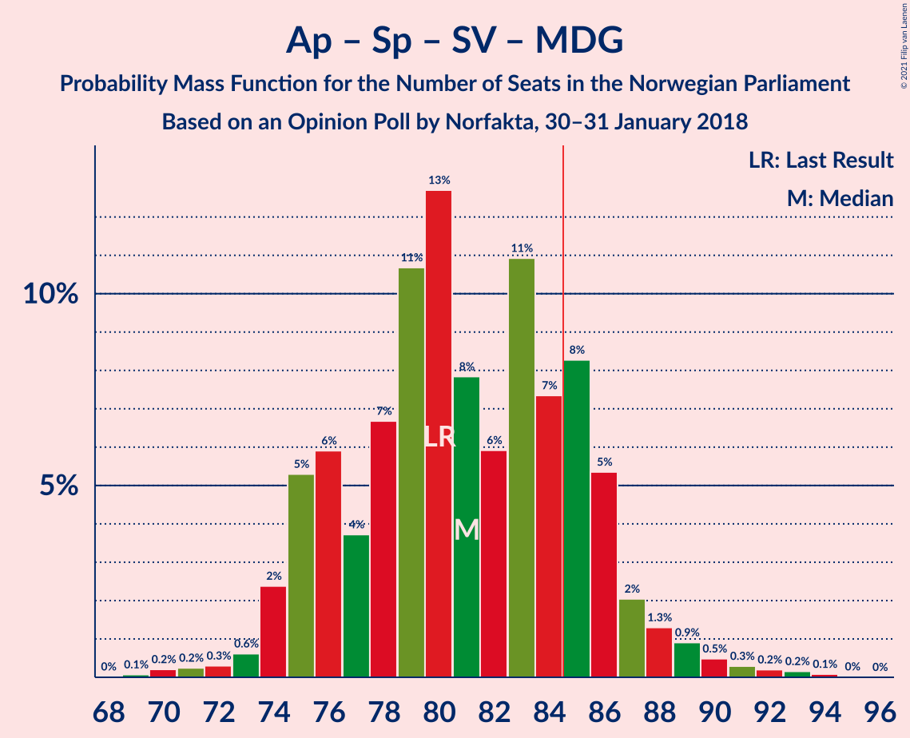
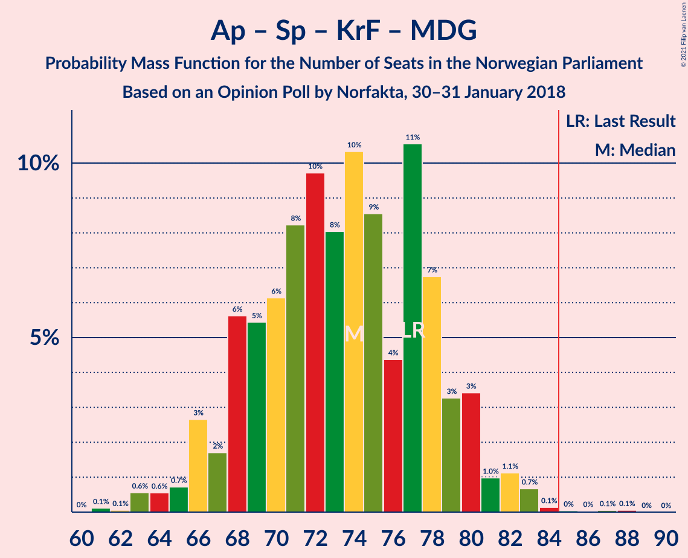

# Opinion Poll by Norfakta, 30–31 January 2018

<a href="#voting-intentions">Voting Intentions</a> | <a href="#seats">Seats</a> | <a href="#coalitions">Coalitions</a> | <a href="#technical-information">Technical Information</a>

## Voting Intentions

### Confidence Intervals

| Party | Last Result | Poll Result | 80% Confidence Interval | 90% Confidence Interval | 95% Confidence Interval | 99% Confidence Interval |
|:-----:|:-----------:|:-----------:|:-----------------------:|:-----------------------:|:-----------------------:|:-----------------------:|
| Høyre | 25.0% | 27.8% | 25.8–30.0% |25.3–30.6% |24.8–31.1% |23.9–32.2% |
| Arbeiderpartiet | 27.4% | 24.0% | 22.1–26.0% |21.5–26.6% |21.1–27.1% |20.2–28.1% |
| Fremskrittspartiet | 15.2% | 13.3% | 11.9–15.0% |11.5–15.5% |11.1–15.9% |10.5–16.8% |
| Senterpartiet | 10.3% | 11.0% | 9.7–12.6% |9.3–13.0% |9.0–13.4% |8.4–14.2% |
| Sosialistisk Venstreparti | 6.0% | 7.6% | 6.5–9.0% |6.2–9.4% |6.0–9.7% |5.5–10.4% |
| Kristelig Folkeparti | 4.2% | 4.3% | 3.5–5.4% |3.2–5.7% |3.1–5.9% |2.7–6.5% |
| Venstre | 4.4% | 4.1% | 3.4–5.2% |3.1–5.5% |2.9–5.8% |2.6–6.4% |
| Miljøpartiet De Grønne | 3.2% | 3.5% | 2.8–4.5% |2.6–4.8% |2.4–5.0% |2.1–5.6% |
| Rødt | 2.4% | 2.6% | 2.0–3.5% |1.8–3.7% |1.7–4.0% |1.4–4.5% |

*Note:* The poll result column reflects the actual value used in the calculations. Published results may vary slightly, and in addition be rounded to fewer digits.

## Seats

### Confidence Intervals

| Party | Last Result | Median | 80% Confidence Interval | 90% Confidence Interval | 95% Confidence Interval | 99% Confidence Interval |
|:-----:|:-----------:|:------:|:-----------------------:|:-----------------------:|:-----------------------:|:-----------------------:|
| <a href="#høyre">Høyre</a> | 45 | 49 | 45–54 |43–55 |43–56 |42–61 |
| <a href="#arbeiderpartiet">Arbeiderpartiet</a> | 49 | 42 | 40–47 |40–47 |39–48 |36–51 |
| <a href="#fremskrittspartiet">Fremskrittspartiet</a> | 27 | 23 | 20–28 |20–28 |19–30 |19–31 |
| <a href="#senterpartiet">Senterpartiet</a> | 19 | 19 | 18–21 |17–23 |16–25 |14–26 |
| <a href="#sosialistisk-venstreparti">Sosialistisk Venstreparti</a> | 11 | 14 | 11–16 |11–16 |10–17 |9–19 |
| <a href="#kristelig-folkeparti">Kristelig Folkeparti</a> | 8 | 7 | 3–10 |2–10 |2–11 |1–12 |
| <a href="#venstre">Venstre</a> | 8 | 8 | 2–10 |2–10 |2–10 |2–11 |
| <a href="#miljøpartiet-de-grønne">Miljøpartiet De Grønne</a> | 1 | 2 | 1–8 |1–9 |1–9 |1–10 |
| <a href="#rødt">Rødt</a> | 1 | 1 | 1–2 |1–2 |1–7 |1–8 |

### Høyre

*For a full overview of the results for this party, see the [Høyre](party-høyre.html) page.*

| Number of Seats | Probability | Accumulated | Special Marks |
|:---------------:|:-----------:|:-----------:|:-------------:|
| 40 | 0% | 100% |  |
| 41 | 0.1% | 99.9% |  |
| 42 | 0.6% | 99.9% |  |
| 43 | 5% | 99.3% |  |
| 44 | 2% | 94% |  |
| 45 | 4% | 92% | Last Result |
| 46 | 4% | 88% |  |
| 47 | 9% | 84% |  |
| 48 | 3% | 75% |  |
| 49 | 26% | 71% | Median |
| 50 | 3% | 45% |  |
| 51 | 9% | 42% |  |
| 52 | 5% | 33% |  |
| 53 | 10% | 28% |  |
| 54 | 12% | 19% |  |
| 55 | 2% | 6% |  |
| 56 | 2% | 4% |  |
| 57 | 0.7% | 2% |  |
| 58 | 0.3% | 1.3% |  |
| 59 | 0.1% | 0.9% |  |
| 60 | 0.1% | 0.8% |  |
| 61 | 0.7% | 0.7% |  |
| 62 | 0.1% | 0.1% |  |
| 63 | 0% | 0% |  |

### Arbeiderpartiet

*For a full overview of the results for this party, see the [Arbeiderpartiet](party-arbeiderpartiet.html) page.*

| Number of Seats | Probability | Accumulated | Special Marks |
|:---------------:|:-----------:|:-----------:|:-------------:|
| 35 | 0.1% | 100% |  |
| 36 | 0.7% | 99.9% |  |
| 37 | 0.5% | 99.2% |  |
| 38 | 0.6% | 98.7% |  |
| 39 | 1.4% | 98% |  |
| 40 | 7% | 97% |  |
| 41 | 25% | 89% |  |
| 42 | 18% | 65% | Median |
| 43 | 4% | 47% |  |
| 44 | 7% | 43% |  |
| 45 | 7% | 37% |  |
| 46 | 16% | 30% |  |
| 47 | 10% | 14% |  |
| 48 | 3% | 4% |  |
| 49 | 0.2% | 1.1% | Last Result |
| 50 | 0.1% | 0.8% |  |
| 51 | 0.2% | 0.7% |  |
| 52 | 0.2% | 0.5% |  |
| 53 | 0.2% | 0.3% |  |
| 54 | 0.1% | 0.1% |  |
| 55 | 0% | 0% |  |

### Fremskrittspartiet

*For a full overview of the results for this party, see the [Fremskrittspartiet](party-fremskrittspartiet.html) page.*

| Number of Seats | Probability | Accumulated | Special Marks |
|:---------------:|:-----------:|:-----------:|:-------------:|
| 17 | 0.1% | 100% |  |
| 18 | 0.3% | 99.9% |  |
| 19 | 3% | 99.6% |  |
| 20 | 8% | 97% |  |
| 21 | 10% | 88% |  |
| 22 | 6% | 79% |  |
| 23 | 24% | 73% | Median |
| 24 | 11% | 48% |  |
| 25 | 9% | 37% |  |
| 26 | 5% | 27% |  |
| 27 | 9% | 23% | Last Result |
| 28 | 11% | 14% |  |
| 29 | 0.7% | 4% |  |
| 30 | 2% | 3% |  |
| 31 | 0.6% | 0.7% |  |
| 32 | 0.1% | 0.1% |  |
| 33 | 0% | 0% |  |

### Senterpartiet

*For a full overview of the results for this party, see the [Senterpartiet](party-senterpartiet.html) page.*

| Number of Seats | Probability | Accumulated | Special Marks |
|:---------------:|:-----------:|:-----------:|:-------------:|
| 13 | 0.1% | 100% |  |
| 14 | 0.4% | 99.9% |  |
| 15 | 1.3% | 99.5% |  |
| 16 | 0.9% | 98% |  |
| 17 | 4% | 97% |  |
| 18 | 20% | 93% |  |
| 19 | 36% | 73% | Last Result, Median |
| 20 | 7% | 37% |  |
| 21 | 20% | 30% |  |
| 22 | 2% | 10% |  |
| 23 | 3% | 8% |  |
| 24 | 2% | 5% |  |
| 25 | 0.9% | 3% |  |
| 26 | 2% | 2% |  |
| 27 | 0.1% | 0.1% |  |
| 28 | 0% | 0% |  |

### Sosialistisk Venstreparti

*For a full overview of the results for this party, see the [Sosialistisk Venstreparti](party-sosialistiskvenstreparti.html) page.*

| Number of Seats | Probability | Accumulated | Special Marks |
|:---------------:|:-----------:|:-----------:|:-------------:|
| 8 | 0.1% | 100% |  |
| 9 | 0.6% | 99.9% |  |
| 10 | 3% | 99.3% |  |
| 11 | 6% | 96% | Last Result |
| 12 | 11% | 89% |  |
| 13 | 13% | 78% |  |
| 14 | 23% | 65% | Median |
| 15 | 23% | 41% |  |
| 16 | 14% | 18% |  |
| 17 | 3% | 4% |  |
| 18 | 0.6% | 1.4% |  |
| 19 | 0.7% | 0.8% |  |
| 20 | 0.1% | 0.2% |  |
| 21 | 0.1% | 0.1% |  |
| 22 | 0% | 0% |  |

### Kristelig Folkeparti

*For a full overview of the results for this party, see the [Kristelig Folkeparti](party-kristeligfolkeparti.html) page.*

| Number of Seats | Probability | Accumulated | Special Marks |
|:---------------:|:-----------:|:-----------:|:-------------:|
| 1 | 2% | 100% |  |
| 2 | 3% | 98% |  |
| 3 | 37% | 94% |  |
| 4 | 0% | 57% |  |
| 5 | 0% | 57% |  |
| 6 | 0% | 57% |  |
| 7 | 12% | 57% | Median |
| 8 | 13% | 45% | Last Result |
| 9 | 16% | 32% |  |
| 10 | 12% | 17% |  |
| 11 | 4% | 4% |  |
| 12 | 0.5% | 0.7% |  |
| 13 | 0.2% | 0.2% |  |
| 14 | 0% | 0% |  |

### Venstre

*For a full overview of the results for this party, see the [Venstre](party-venstre.html) page.*

| Number of Seats | Probability | Accumulated | Special Marks |
|:---------------:|:-----------:|:-----------:|:-------------:|
| 1 | 0.1% | 100% |  |
| 2 | 30% | 99.9% |  |
| 3 | 1.2% | 70% |  |
| 4 | 0.1% | 68% |  |
| 5 | 0% | 68% |  |
| 6 | 0.1% | 68% |  |
| 7 | 4% | 68% |  |
| 8 | 33% | 64% | Last Result, Median |
| 9 | 11% | 31% |  |
| 10 | 19% | 20% |  |
| 11 | 0.5% | 0.8% |  |
| 12 | 0.2% | 0.3% |  |
| 13 | 0% | 0% |  |

### Miljøpartiet De Grønne

*For a full overview of the results for this party, see the [Miljøpartiet De Grønne](party-miljøpartietdegrønne.html) page.*

| Number of Seats | Probability | Accumulated | Special Marks |
|:---------------:|:-----------:|:-----------:|:-------------:|
| 0 | 0.2% | 100% |  |
| 1 | 24% | 99.8% | Last Result |
| 2 | 31% | 76% | Median |
| 3 | 0.1% | 45% |  |
| 4 | 3% | 45% |  |
| 5 | 0% | 41% |  |
| 6 | 0% | 41% |  |
| 7 | 11% | 41% |  |
| 8 | 24% | 30% |  |
| 9 | 6% | 7% |  |
| 10 | 0.3% | 0.6% |  |
| 11 | 0.2% | 0.2% |  |
| 12 | 0% | 0% |  |

### Rødt

*For a full overview of the results for this party, see the [Rødt](party-rødt.html) page.*

| Number of Seats | Probability | Accumulated | Special Marks |
|:---------------:|:-----------:|:-----------:|:-------------:|
| 0 | 0.2% | 100% |  |
| 1 | 70% | 99.8% | Last Result, Median |
| 2 | 27% | 30% |  |
| 3 | 0% | 3% |  |
| 4 | 0% | 3% |  |
| 5 | 0% | 3% |  |
| 6 | 0.1% | 3% |  |
| 7 | 1.4% | 3% |  |
| 8 | 2% | 2% |  |
| 9 | 0.1% | 0.1% |  |
| 10 | 0% | 0% |  |

## Coalitions

### Confidence Intervals

| Coalition | Last Result | Median | Majority? | 80% Confidence Interval | 90% Confidence Interval | 95% Confidence Interval | 99% Confidence Interval |
|:---------:|:-----------:|:------:|:---------:|:-----------------------:|:-----------------------:|:-----------------------:|:-----------------------:|
| Høyre – Fremskrittspartiet – Senterpartiet – Kristelig Folkeparti – Venstre | 107 | 106 | 100% | 100–112 | 100–113 | 99–113 | 96–115 |
| Høyre – Fremskrittspartiet – Kristelig Folkeparti – Venstre – Miljøpartiet De Grønne | 89 | 91 | 95% | 87–94 | 84–96 | 83–97 | 78–99 |
| Arbeiderpartiet – Senterpartiet – Sosialistisk Venstreparti – Kristelig Folkeparti – Miljøpartiet De Grønne | 88 | 87 | 75% | 82–93 | 81–94 | 79–94 | 78–97 |
| Høyre – Fremskrittspartiet – Kristelig Folkeparti – Venstre | 88 | 87 | 74% | 82–92 | 81–93 | 79–93 | 76–96 |
| Arbeiderpartiet – Senterpartiet – Sosialistisk Venstreparti – Miljøpartiet De Grønne – Rødt | 81 | 82 | 26% | 77–87 | 76–88 | 76–90 | 73–93 |
| Høyre – Fremskrittspartiet – Venstre | 80 | 80 | 20% | 75–85 | 74–86 | 74–89 | 70–90 |
| Arbeiderpartiet – Senterpartiet – Sosialistisk Venstreparti – Miljøpartiet De Grønne | 80 | 81 | 22% | 76–86 | 75–86 | 74–88 | 72–91 |
| Arbeiderpartiet – Senterpartiet – Sosialistisk Venstreparti – Rødt | 80 | 78 | 5% | 75–82 | 73–85 | 72–86 | 70–91 |
| Arbeiderpartiet – Senterpartiet – Sosialistisk Venstreparti | 79 | 77 | 1.1% | 73–80 | 71–83 | 70–84 | 68–85 |
| Høyre – Fremskrittspartiet | 72 | 72 | 0.4% | 68–81 | 67–81 | 67–82 | 63–83 |
| Arbeiderpartiet – Senterpartiet – Kristelig Folkeparti – Miljøpartiet De Grønne | 77 | 73 | 0.1% | 69–78 | 66–80 | 66–82 | 63–83 |
| Arbeiderpartiet – Senterpartiet – Kristelig Folkeparti | 76 | 69 | 0% | 63–75 | 63–75 | 62–76 | 61–81 |
| Arbeiderpartiet – Senterpartiet | 68 | 63 | 0% | 59–66 | 59–69 | 58–71 | 55–73 |
| Høyre – Kristelig Folkeparti – Venstre | 61 | 62 | 0% | 58–68 | 55–69 | 55–70 | 53–73 |
| Arbeiderpartiet – Sosialistisk Venstreparti | 60 | 57 | 0% | 53–61 | 52–61 | 51–63 | 49–65 |
| Senterpartiet – Kristelig Folkeparti – Venstre | 35 | 32 | 0% | 27–39 | 24–39 | 24–40 | 22–42 |

### Høyre – Fremskrittspartiet – Senterpartiet – Kristelig Folkeparti – Venstre

| Number of Seats | Probability | Accumulated | Special Marks |
|:---------------:|:-----------:|:-----------:|:-------------:|
| 93 | 0% | 100% |  |
| 94 | 0% | 99.9% |  |
| 95 | 0.1% | 99.9% |  |
| 96 | 0.4% | 99.9% |  |
| 97 | 0.7% | 99.4% |  |
| 98 | 0.7% | 98.7% |  |
| 99 | 0.6% | 98% |  |
| 100 | 11% | 97% |  |
| 101 | 1.3% | 86% |  |
| 102 | 4% | 85% |  |
| 103 | 3% | 81% |  |
| 104 | 15% | 78% |  |
| 105 | 5% | 63% |  |
| 106 | 14% | 58% | Median |
| 107 | 10% | 44% | Last Result |
| 108 | 6% | 34% |  |
| 109 | 8% | 28% |  |
| 110 | 7% | 20% |  |
| 111 | 2% | 14% |  |
| 112 | 3% | 11% |  |
| 113 | 7% | 9% |  |
| 114 | 2% | 2% |  |
| 115 | 0.2% | 0.5% |  |
| 116 | 0.1% | 0.3% |  |
| 117 | 0.1% | 0.2% |  |
| 118 | 0% | 0.1% |  |
| 119 | 0.1% | 0.1% |  |
| 120 | 0% | 0% |  |

### Høyre – Fremskrittspartiet – Kristelig Folkeparti – Venstre – Miljøpartiet De Grønne

| Number of Seats | Probability | Accumulated | Special Marks |
|:---------------:|:-----------:|:-----------:|:-------------:|
| 77 | 0% | 100% |  |
| 78 | 0.7% | 99.9% |  |
| 79 | 0% | 99.2% |  |
| 80 | 0.1% | 99.2% |  |
| 81 | 0.1% | 99.1% |  |
| 82 | 0.1% | 99.0% |  |
| 83 | 2% | 98.8% |  |
| 84 | 2% | 96% |  |
| 85 | 2% | 95% | Majority |
| 86 | 1.1% | 93% |  |
| 87 | 2% | 92% |  |
| 88 | 11% | 90% |  |
| 89 | 22% | 79% | Last Result, Median |
| 90 | 6% | 57% |  |
| 91 | 7% | 51% |  |
| 92 | 4% | 44% |  |
| 93 | 16% | 40% |  |
| 94 | 14% | 24% |  |
| 95 | 5% | 10% |  |
| 96 | 1.3% | 5% |  |
| 97 | 2% | 4% |  |
| 98 | 1.1% | 2% |  |
| 99 | 0.5% | 0.9% |  |
| 100 | 0.1% | 0.4% |  |
| 101 | 0.3% | 0.3% |  |
| 102 | 0% | 0% |  |

### Arbeiderpartiet – Senterpartiet – Sosialistisk Venstreparti – Kristelig Folkeparti – Miljøpartiet De Grønne

| Number of Seats | Probability | Accumulated | Special Marks |
|:---------------:|:-----------:|:-----------:|:-------------:|
| 75 | 0.1% | 100% |  |
| 76 | 0% | 99.9% |  |
| 77 | 0% | 99.9% |  |
| 78 | 2% | 99.8% |  |
| 79 | 0.5% | 98% |  |
| 80 | 0.7% | 97% |  |
| 81 | 2% | 96% |  |
| 82 | 6% | 95% |  |
| 83 | 10% | 89% |  |
| 84 | 4% | 78% | Median |
| 85 | 7% | 75% | Majority |
| 86 | 17% | 68% |  |
| 87 | 4% | 51% |  |
| 88 | 11% | 47% | Last Result |
| 89 | 10% | 36% |  |
| 90 | 3% | 26% |  |
| 91 | 5% | 23% |  |
| 92 | 5% | 18% |  |
| 93 | 7% | 13% |  |
| 94 | 4% | 6% |  |
| 95 | 0.2% | 1.5% |  |
| 96 | 0.5% | 1.2% |  |
| 97 | 0.2% | 0.7% |  |
| 98 | 0.3% | 0.5% |  |
| 99 | 0.1% | 0.2% |  |
| 100 | 0.1% | 0.1% |  |
| 101 | 0% | 0.1% |  |
| 102 | 0% | 0% |  |

### Høyre – Fremskrittspartiet – Kristelig Folkeparti – Venstre

| Number of Seats | Probability | Accumulated | Special Marks |
|:---------------:|:-----------:|:-----------:|:-------------:|
| 74 | 0.1% | 100% |  |
| 75 | 0% | 99.9% |  |
| 76 | 0.4% | 99.8% |  |
| 77 | 1.0% | 99.4% |  |
| 78 | 0.2% | 98% |  |
| 79 | 2% | 98% |  |
| 80 | 0.4% | 96% |  |
| 81 | 5% | 95% |  |
| 82 | 11% | 90% |  |
| 83 | 3% | 79% |  |
| 84 | 2% | 75% |  |
| 85 | 13% | 74% | Majority |
| 86 | 9% | 60% |  |
| 87 | 9% | 51% | Median |
| 88 | 12% | 42% | Last Result |
| 89 | 8% | 30% |  |
| 90 | 5% | 22% |  |
| 91 | 4% | 18% |  |
| 92 | 8% | 13% |  |
| 93 | 3% | 5% |  |
| 94 | 0.1% | 2% |  |
| 95 | 1.3% | 2% |  |
| 96 | 0.2% | 0.6% |  |
| 97 | 0.1% | 0.3% |  |
| 98 | 0.2% | 0.2% |  |
| 99 | 0% | 0% |  |

### Arbeiderpartiet – Senterpartiet – Sosialistisk Venstreparti – Miljøpartiet De Grønne – Rødt

| Number of Seats | Probability | Accumulated | Special Marks |
|:---------------:|:-----------:|:-----------:|:-------------:|
| 71 | 0.2% | 100% |  |
| 72 | 0.1% | 99.8% |  |
| 73 | 0.2% | 99.7% |  |
| 74 | 1.3% | 99.4% |  |
| 75 | 0.1% | 98% |  |
| 76 | 3% | 98% |  |
| 77 | 8% | 95% |  |
| 78 | 4% | 87% | Median |
| 79 | 5% | 82% |  |
| 80 | 8% | 78% |  |
| 81 | 12% | 70% | Last Result |
| 82 | 9% | 58% |  |
| 83 | 9% | 48% |  |
| 84 | 13% | 40% |  |
| 85 | 2% | 26% | Majority |
| 86 | 3% | 25% |  |
| 87 | 11% | 21% |  |
| 88 | 5% | 10% |  |
| 89 | 0.4% | 5% |  |
| 90 | 2% | 4% |  |
| 91 | 0.2% | 2% |  |
| 92 | 1.0% | 2% |  |
| 93 | 0.4% | 0.6% |  |
| 94 | 0% | 0.2% |  |
| 95 | 0.1% | 0.1% |  |
| 96 | 0% | 0% |  |

### Høyre – Fremskrittspartiet – Venstre

| Number of Seats | Probability | Accumulated | Special Marks |
|:---------------:|:-----------:|:-----------:|:-------------:|
| 67 | 0% | 100% |  |
| 68 | 0.1% | 99.9% |  |
| 69 | 0.2% | 99.9% |  |
| 70 | 0.3% | 99.7% |  |
| 71 | 0.6% | 99.4% |  |
| 72 | 0.2% | 98.8% |  |
| 73 | 0.9% | 98.6% |  |
| 74 | 5% | 98% |  |
| 75 | 8% | 93% |  |
| 76 | 10% | 85% |  |
| 77 | 1.2% | 75% |  |
| 78 | 7% | 74% |  |
| 79 | 8% | 67% |  |
| 80 | 10% | 59% | Last Result, Median |
| 81 | 5% | 49% |  |
| 82 | 13% | 44% |  |
| 83 | 8% | 31% |  |
| 84 | 3% | 23% |  |
| 85 | 12% | 20% | Majority |
| 86 | 3% | 8% |  |
| 87 | 2% | 5% |  |
| 88 | 0.3% | 3% |  |
| 89 | 0.5% | 3% |  |
| 90 | 2% | 2% |  |
| 91 | 0% | 0.1% |  |
| 92 | 0% | 0.1% |  |
| 93 | 0% | 0% |  |

### Arbeiderpartiet – Senterpartiet – Sosialistisk Venstreparti – Miljøpartiet De Grønne

| Number of Seats | Probability | Accumulated | Special Marks |
|:---------------:|:-----------:|:-----------:|:-------------:|
| 69 | 0.1% | 100% |  |
| 70 | 0.1% | 99.9% |  |
| 71 | 0.2% | 99.8% |  |
| 72 | 0.5% | 99.5% |  |
| 73 | 1.3% | 99.0% |  |
| 74 | 0.4% | 98% |  |
| 75 | 5% | 97% |  |
| 76 | 9% | 92% |  |
| 77 | 2% | 83% | Median |
| 78 | 6% | 81% |  |
| 79 | 9% | 75% |  |
| 80 | 10% | 66% | Last Result |
| 81 | 14% | 55% |  |
| 82 | 4% | 41% |  |
| 83 | 13% | 37% |  |
| 84 | 2% | 24% |  |
| 85 | 3% | 22% | Majority |
| 86 | 16% | 19% |  |
| 87 | 0.3% | 3% |  |
| 88 | 0.7% | 3% |  |
| 89 | 1.4% | 2% |  |
| 90 | 0.1% | 0.7% |  |
| 91 | 0.3% | 0.6% |  |
| 92 | 0.2% | 0.3% |  |
| 93 | 0.1% | 0.1% |  |
| 94 | 0% | 0.1% |  |
| 95 | 0% | 0% |  |

### Arbeiderpartiet – Senterpartiet – Sosialistisk Venstreparti – Rødt

| Number of Seats | Probability | Accumulated | Special Marks |
|:---------------:|:-----------:|:-----------:|:-------------:|
| 68 | 0.3% | 100% |  |
| 69 | 0.1% | 99.7% |  |
| 70 | 0.5% | 99.6% |  |
| 71 | 1.1% | 99.1% |  |
| 72 | 2% | 98% |  |
| 73 | 1.3% | 96% |  |
| 74 | 5% | 95% |  |
| 75 | 14% | 90% |  |
| 76 | 16% | 76% | Median |
| 77 | 4% | 60% |  |
| 78 | 7% | 56% |  |
| 79 | 6% | 49% |  |
| 80 | 22% | 43% | Last Result |
| 81 | 11% | 21% |  |
| 82 | 2% | 10% |  |
| 83 | 1.1% | 8% |  |
| 84 | 2% | 7% |  |
| 85 | 2% | 5% | Majority |
| 86 | 2% | 4% |  |
| 87 | 0.1% | 1.2% |  |
| 88 | 0.1% | 1.0% |  |
| 89 | 0.1% | 0.9% |  |
| 90 | 0% | 0.8% |  |
| 91 | 0.7% | 0.8% |  |
| 92 | 0% | 0.1% |  |
| 93 | 0% | 0% |  |

### Arbeiderpartiet – Senterpartiet – Sosialistisk Venstreparti

| Number of Seats | Probability | Accumulated | Special Marks |
|:---------------:|:-----------:|:-----------:|:-------------:|
| 66 | 0% | 100% |  |
| 67 | 0.3% | 99.9% |  |
| 68 | 0.2% | 99.6% |  |
| 69 | 1.2% | 99.5% |  |
| 70 | 1.0% | 98% |  |
| 71 | 3% | 97% |  |
| 72 | 2% | 94% |  |
| 73 | 5% | 93% |  |
| 74 | 15% | 88% |  |
| 75 | 17% | 73% | Median |
| 76 | 3% | 56% |  |
| 77 | 9% | 53% |  |
| 78 | 9% | 45% |  |
| 79 | 23% | 36% | Last Result |
| 80 | 5% | 13% |  |
| 81 | 1.1% | 8% |  |
| 82 | 1.0% | 7% |  |
| 83 | 1.3% | 6% |  |
| 84 | 3% | 4% |  |
| 85 | 0.7% | 1.1% | Majority |
| 86 | 0.1% | 0.4% |  |
| 87 | 0.1% | 0.3% |  |
| 88 | 0% | 0.2% |  |
| 89 | 0.1% | 0.1% |  |
| 90 | 0% | 0.1% |  |
| 91 | 0% | 0.1% |  |
| 92 | 0% | 0% |  |

### Høyre – Fremskrittspartiet

| Number of Seats | Probability | Accumulated | Special Marks |
|:---------------:|:-----------:|:-----------:|:-------------:|
| 62 | 0.1% | 100% |  |
| 63 | 0.5% | 99.9% |  |
| 64 | 0.1% | 99.4% |  |
| 65 | 0.3% | 99.3% |  |
| 66 | 0.1% | 99.0% |  |
| 67 | 8% | 99.0% |  |
| 68 | 9% | 91% |  |
| 69 | 1.3% | 82% |  |
| 70 | 5% | 81% |  |
| 71 | 4% | 76% |  |
| 72 | 23% | 72% | Last Result, Median |
| 73 | 1.2% | 49% |  |
| 74 | 2% | 48% |  |
| 75 | 3% | 46% |  |
| 76 | 12% | 43% |  |
| 77 | 12% | 32% |  |
| 78 | 7% | 19% |  |
| 79 | 1.1% | 12% |  |
| 80 | 0.3% | 11% |  |
| 81 | 8% | 11% |  |
| 82 | 2% | 3% |  |
| 83 | 0.7% | 1.1% |  |
| 84 | 0% | 0.4% |  |
| 85 | 0.1% | 0.4% | Majority |
| 86 | 0.2% | 0.3% |  |
| 87 | 0.1% | 0.1% |  |
| 88 | 0% | 0% |  |

### Arbeiderpartiet – Senterpartiet – Kristelig Folkeparti – Miljøpartiet De Grønne

| Number of Seats | Probability | Accumulated | Special Marks |
|:---------------:|:-----------:|:-----------:|:-------------:|
| 60 | 0% | 100% |  |
| 61 | 0% | 99.9% |  |
| 62 | 0.2% | 99.9% |  |
| 63 | 2% | 99.7% |  |
| 64 | 0.2% | 98% |  |
| 65 | 0.3% | 98% |  |
| 66 | 4% | 98% |  |
| 67 | 0.5% | 93% |  |
| 68 | 2% | 93% |  |
| 69 | 10% | 91% |  |
| 70 | 6% | 81% | Median |
| 71 | 16% | 75% |  |
| 72 | 4% | 59% |  |
| 73 | 7% | 55% |  |
| 74 | 6% | 47% |  |
| 75 | 8% | 41% |  |
| 76 | 8% | 34% |  |
| 77 | 8% | 26% | Last Result |
| 78 | 11% | 18% |  |
| 79 | 2% | 7% |  |
| 80 | 2% | 5% |  |
| 81 | 0.2% | 3% |  |
| 82 | 2% | 3% |  |
| 83 | 0.5% | 0.9% |  |
| 84 | 0.3% | 0.4% |  |
| 85 | 0.1% | 0.1% | Majority |
| 86 | 0.1% | 0.1% |  |
| 87 | 0% | 0% |  |

### Arbeiderpartiet – Senterpartiet – Kristelig Folkeparti

| Number of Seats | Probability | Accumulated | Special Marks |
|:---------------:|:-----------:|:-----------:|:-------------:|
| 58 | 0.1% | 100% |  |
| 59 | 0.1% | 99.9% |  |
| 60 | 0.3% | 99.8% |  |
| 61 | 0.2% | 99.5% |  |
| 62 | 2% | 99.3% |  |
| 63 | 14% | 97% |  |
| 64 | 5% | 83% |  |
| 65 | 1.2% | 79% |  |
| 66 | 2% | 78% |  |
| 67 | 4% | 75% |  |
| 68 | 18% | 71% | Median |
| 69 | 6% | 53% |  |
| 70 | 7% | 47% |  |
| 71 | 17% | 41% |  |
| 72 | 6% | 24% |  |
| 73 | 5% | 18% |  |
| 74 | 2% | 13% |  |
| 75 | 8% | 12% |  |
| 76 | 2% | 4% | Last Result |
| 77 | 0.2% | 1.2% |  |
| 78 | 0.3% | 1.0% |  |
| 79 | 0.1% | 0.7% |  |
| 80 | 0.1% | 0.6% |  |
| 81 | 0.4% | 0.5% |  |
| 82 | 0% | 0.1% |  |
| 83 | 0.1% | 0.1% |  |
| 84 | 0% | 0.1% |  |
| 85 | 0% | 0% | Majority |

### Arbeiderpartiet – Senterpartiet

| Number of Seats | Probability | Accumulated | Special Marks |
|:---------------:|:-----------:|:-----------:|:-------------:|
| 54 | 0.2% | 100% |  |
| 55 | 0.5% | 99.8% |  |
| 56 | 0.2% | 99.2% |  |
| 57 | 1.1% | 99.0% |  |
| 58 | 2% | 98% |  |
| 59 | 7% | 96% |  |
| 60 | 16% | 89% |  |
| 61 | 12% | 72% | Median |
| 62 | 10% | 60% |  |
| 63 | 6% | 50% |  |
| 64 | 14% | 45% |  |
| 65 | 20% | 31% |  |
| 66 | 2% | 11% |  |
| 67 | 3% | 9% |  |
| 68 | 1.2% | 6% | Last Result |
| 69 | 2% | 5% |  |
| 70 | 0.3% | 3% |  |
| 71 | 1.0% | 3% |  |
| 72 | 0.4% | 2% |  |
| 73 | 1.2% | 1.3% |  |
| 74 | 0% | 0.1% |  |
| 75 | 0% | 0.1% |  |
| 76 | 0% | 0% |  |

### Høyre – Kristelig Folkeparti – Venstre

| Number of Seats | Probability | Accumulated | Special Marks |
|:---------------:|:-----------:|:-----------:|:-------------:|
| 50 | 0.2% | 100% |  |
| 51 | 0.1% | 99.8% |  |
| 52 | 0.1% | 99.8% |  |
| 53 | 0.9% | 99.7% |  |
| 54 | 0.4% | 98.8% |  |
| 55 | 4% | 98% |  |
| 56 | 1.0% | 94% |  |
| 57 | 1.0% | 93% |  |
| 58 | 6% | 92% |  |
| 59 | 3% | 86% |  |
| 60 | 12% | 83% |  |
| 61 | 6% | 71% | Last Result |
| 62 | 24% | 65% |  |
| 63 | 5% | 41% |  |
| 64 | 2% | 36% | Median |
| 65 | 9% | 34% |  |
| 66 | 11% | 26% |  |
| 67 | 3% | 15% |  |
| 68 | 7% | 13% |  |
| 69 | 2% | 6% |  |
| 70 | 1.0% | 3% |  |
| 71 | 0.9% | 2% |  |
| 72 | 0.2% | 2% |  |
| 73 | 1.2% | 1.3% |  |
| 74 | 0.1% | 0.1% |  |
| 75 | 0% | 0% |  |

### Arbeiderpartiet – Sosialistisk Venstreparti

| Number of Seats | Probability | Accumulated | Special Marks |
|:---------------:|:-----------:|:-----------:|:-------------:|
| 47 | 0.1% | 100% |  |
| 48 | 0.1% | 99.9% |  |
| 49 | 0.6% | 99.8% |  |
| 50 | 1.2% | 99.2% |  |
| 51 | 0.9% | 98% |  |
| 52 | 4% | 97% |  |
| 53 | 7% | 93% |  |
| 54 | 5% | 87% |  |
| 55 | 10% | 82% |  |
| 56 | 22% | 72% | Median |
| 57 | 3% | 50% |  |
| 58 | 13% | 47% |  |
| 59 | 10% | 34% |  |
| 60 | 2% | 25% | Last Result |
| 61 | 18% | 23% |  |
| 62 | 2% | 5% |  |
| 63 | 2% | 3% |  |
| 64 | 0.4% | 1.1% |  |
| 65 | 0.3% | 0.7% |  |
| 66 | 0.2% | 0.3% |  |
| 67 | 0.1% | 0.2% |  |
| 68 | 0% | 0.1% |  |
| 69 | 0% | 0.1% |  |
| 70 | 0% | 0% |  |

### Senterpartiet – Kristelig Folkeparti – Venstre

| Number of Seats | Probability | Accumulated | Special Marks |
|:---------------:|:-----------:|:-----------:|:-------------:|
| 20 | 0.2% | 100% |  |
| 21 | 0% | 99.8% |  |
| 22 | 0.3% | 99.8% |  |
| 23 | 1.2% | 99.5% |  |
| 24 | 5% | 98% |  |
| 25 | 0.4% | 93% |  |
| 26 | 0.6% | 93% |  |
| 27 | 3% | 92% |  |
| 28 | 2% | 89% |  |
| 29 | 11% | 87% |  |
| 30 | 6% | 76% |  |
| 31 | 8% | 70% |  |
| 32 | 24% | 62% |  |
| 33 | 8% | 38% |  |
| 34 | 2% | 30% | Median |
| 35 | 7% | 28% | Last Result |
| 36 | 3% | 22% |  |
| 37 | 2% | 19% |  |
| 38 | 6% | 17% |  |
| 39 | 6% | 10% |  |
| 40 | 4% | 5% |  |
| 41 | 0.2% | 0.7% |  |
| 42 | 0.4% | 0.5% |  |
| 43 | 0% | 0.1% |  |
| 44 | 0.1% | 0.1% |  |
| 45 | 0% | 0% |  |

## Technical Information

### Opinion Poll

+ **Polling firm:** Norfakta
+ **Commissioner(s):** —
+ **Fieldwork period:** 30–31 January 2018

### Calculations

+ **Sample size:** 772
+ **Simulations done:** 131,072
+ **Error estimate:** 2.94%

