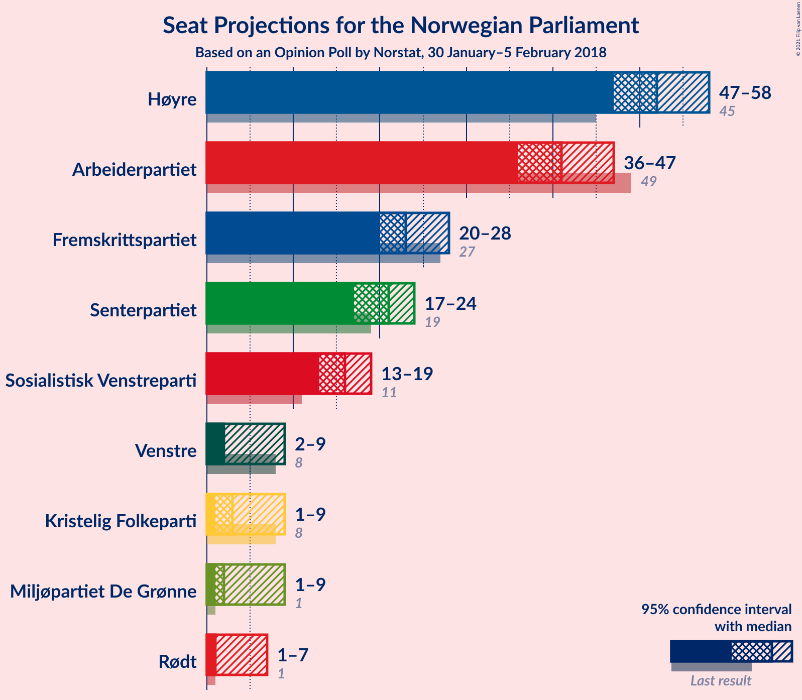
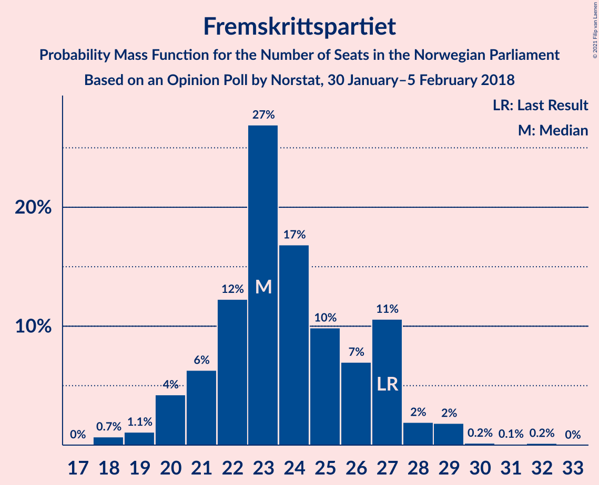
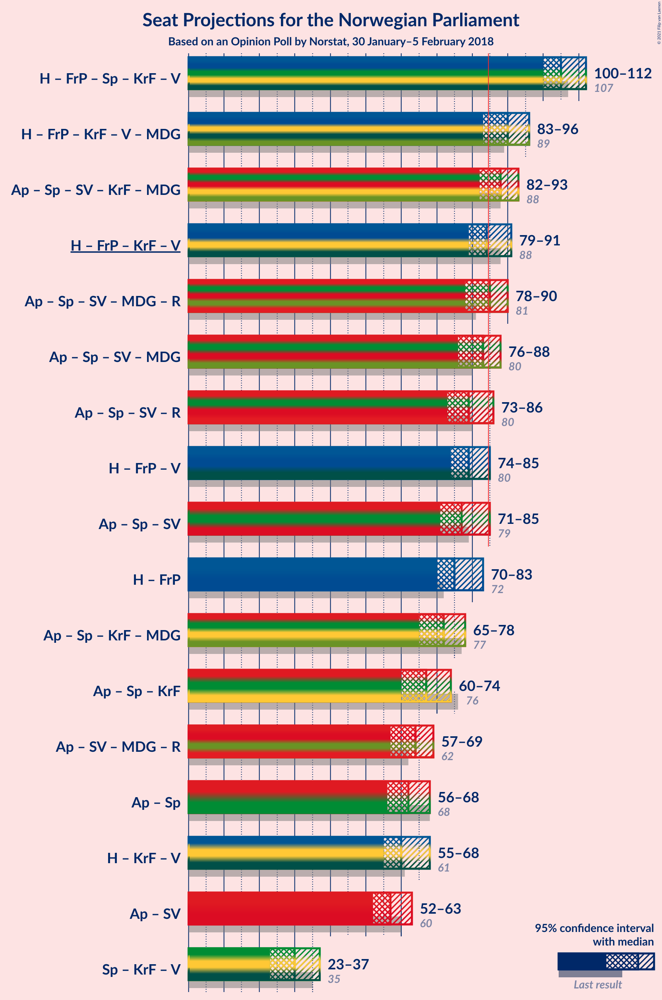
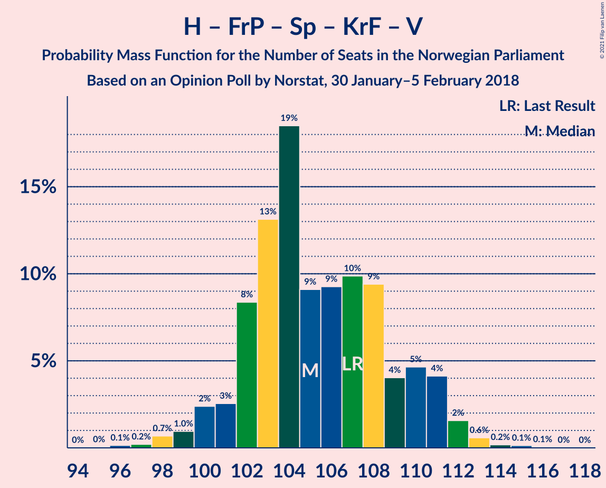
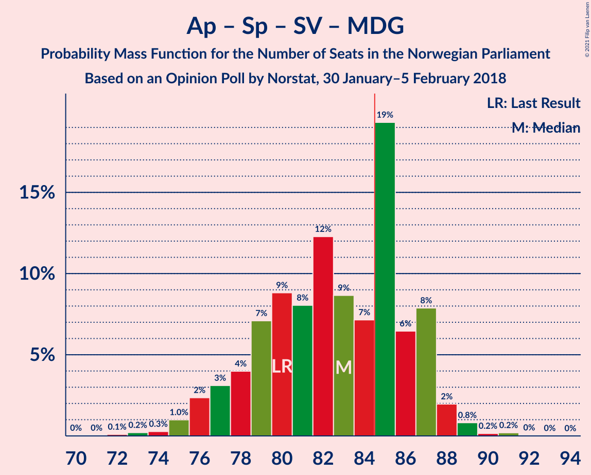
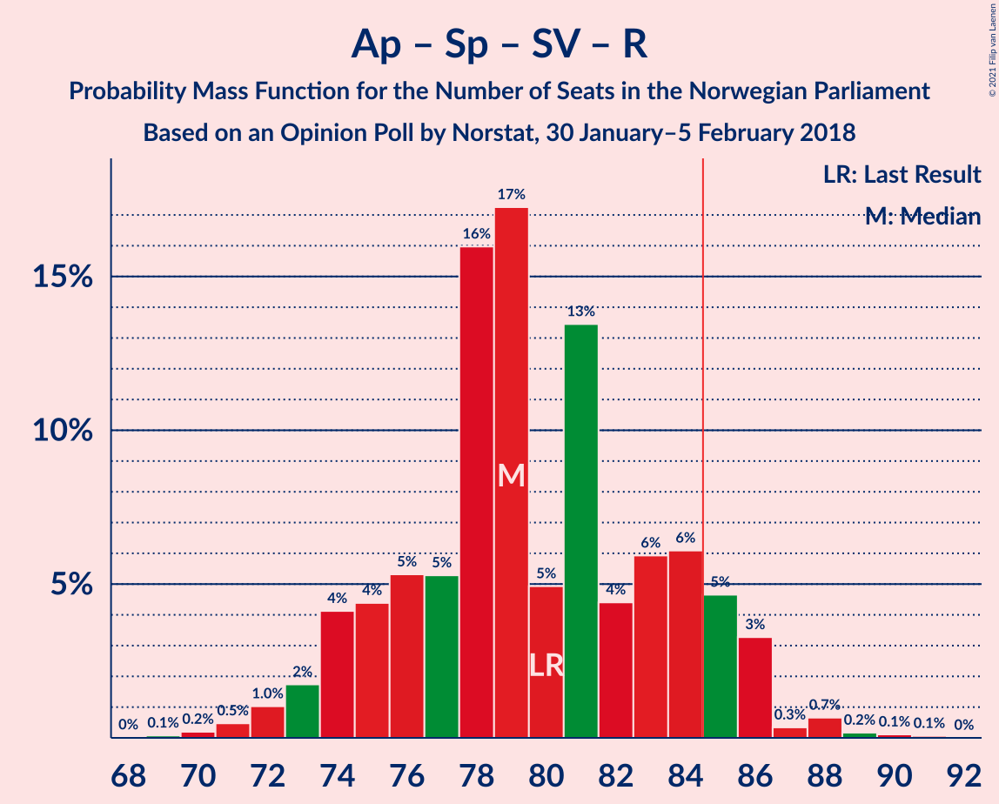
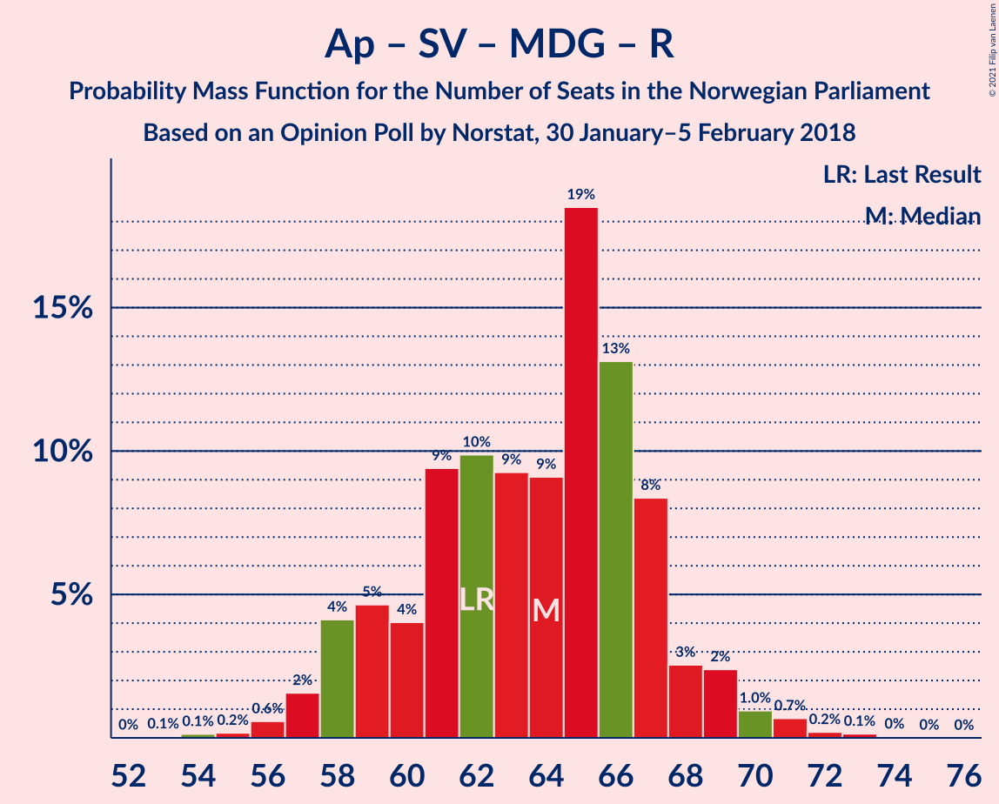
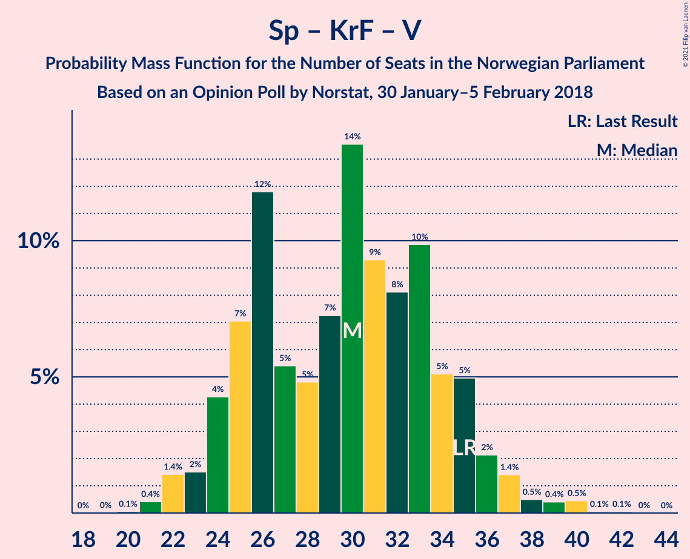

# Opinion Poll by Norstat, 30 January–5 February 2018

<a href="#voting-intentions">Voting Intentions</a> | <a href="#seats">Seats</a> | <a href="#coalitions">Coalitions</a> | <a href="#technical-information">Technical Information</a>

## Voting Intentions

### Confidence Intervals

| Party | Last Result | Poll Result | 80% Confidence Interval | 90% Confidence Interval | 95% Confidence Interval | 99% Confidence Interval |
|:-----:|:-----------:|:-----------:|:-----------------------:|:-----------------------:|:-----------------------:|:-----------------------:|
| Høyre | 25.0% | 29.0% | 27.1–30.9% |26.6–31.5% |26.1–31.9% |25.3–32.9% |
| Arbeiderpartiet | 27.4% | 22.4% | 20.7–24.2% |20.2–24.7% |19.8–25.1% |19.1–26.0% |
| Fremskrittspartiet | 15.2% | 13.1% | 11.8–14.7% |11.4–15.1% |11.1–15.5% |10.5–16.2% |
| Senterpartiet | 10.3% | 11.2% | 10.0–12.7% |9.7–13.1% |9.4–13.4% |8.8–14.1% |
| Sosialistisk Venstreparti | 6.0% | 8.6% | 7.5–9.9% |7.2–10.2% |7.0–10.6% |6.5–11.2% |
| Kristelig Folkeparti | 4.2% | 3.9% | 3.2–4.9% |3.0–5.1% |2.9–5.4% |2.5–5.9% |
| Venstre | 4.4% | 3.8% | 3.1–4.8% |2.9–5.0% |2.8–5.2% |2.5–5.7% |
| Miljøpartiet De Grønne | 3.2% | 3.7% | 3.0–4.6% |2.8–4.9% |2.7–5.1% |2.4–5.6% |
| Rødt | 2.4% | 2.9% | 2.3–3.7% |2.1–3.9% |2.0–4.1% |1.7–4.6% |

*Note:* The poll result column reflects the actual value used in the calculations. Published results may vary slightly, and in addition be rounded to fewer digits.

## Seats

### Confidence Intervals

| Party | Last Result | Median | 80% Confidence Interval | 90% Confidence Interval | 95% Confidence Interval | 99% Confidence Interval |
|:-----:|:-----------:|:------:|:-----------------------:|:-----------------------:|:-----------------------:|:-----------------------:|
| <a href="#høyre">Høyre</a> | 45 | 52 | 49–57 |48–58 |47–58 |45–59 |
| <a href="#arbeiderpartiet">Arbeiderpartiet</a> | 49 | 41 | 38–44 |37–45 |36–47 |35–48 |
| <a href="#fremskrittspartiet">Fremskrittspartiet</a> | 27 | 24 | 21–27 |20–27 |20–27 |18–30 |
| <a href="#senterpartiet">Senterpartiet</a> | 19 | 21 | 18–24 |17–24 |17–24 |15–25 |
| <a href="#sosialistisk-venstreparti">Sosialistisk Venstreparti</a> | 11 | 16 | 14–18 |13–18 |13–19 |12–20 |
| <a href="#kristelig-folkeparti">Kristelig Folkeparti</a> | 8 | 3 | 2–8 |1–9 |1–9 |1–10 |
| <a href="#venstre">Venstre</a> | 8 | 2 | 2–8 |2–9 |2–9 |2–9 |
| <a href="#miljøpartiet-de-grønne">Miljøpartiet De Grønne</a> | 1 | 2 | 1–8 |1–9 |1–9 |1–10 |
| <a href="#rødt">Rødt</a> | 1 | 2 | 1–2 |1–7 |1–8 |1–8 |

### Høyre

*For a full overview of the results for this party, see the [Høyre](party-høyre.html) page.*

| Number of Seats | Probability | Accumulated | Special Marks |
|:---------------:|:-----------:|:-----------:|:-------------:|
| 43 | 0.1% | 100% |  |
| 44 | 0.1% | 99.9% |  |
| 45 | 0.7% | 99.9% | Last Result |
| 46 | 0.8% | 99.1% |  |
| 47 | 2% | 98% |  |
| 48 | 4% | 97% |  |
| 49 | 15% | 93% |  |
| 50 | 12% | 78% |  |
| 51 | 11% | 66% |  |
| 52 | 6% | 55% | Median |
| 53 | 12% | 49% |  |
| 54 | 5% | 37% |  |
| 55 | 11% | 32% |  |
| 56 | 10% | 21% |  |
| 57 | 6% | 11% |  |
| 58 | 4% | 5% |  |
| 59 | 0.9% | 1.4% |  |
| 60 | 0.4% | 0.5% |  |
| 61 | 0% | 0.1% |  |
| 62 | 0% | 0% |  |

### Arbeiderpartiet

*For a full overview of the results for this party, see the [Arbeiderpartiet](party-arbeiderpartiet.html) page.*

| Number of Seats | Probability | Accumulated | Special Marks |
|:---------------:|:-----------:|:-----------:|:-------------:|
| 33 | 0.1% | 100% |  |
| 34 | 0.1% | 99.9% |  |
| 35 | 0.8% | 99.7% |  |
| 36 | 3% | 98.9% |  |
| 37 | 4% | 96% |  |
| 38 | 6% | 92% |  |
| 39 | 8% | 86% |  |
| 40 | 20% | 78% |  |
| 41 | 18% | 58% | Median |
| 42 | 21% | 41% |  |
| 43 | 7% | 19% |  |
| 44 | 5% | 12% |  |
| 45 | 3% | 7% |  |
| 46 | 1.5% | 4% |  |
| 47 | 0.6% | 3% |  |
| 48 | 2% | 2% |  |
| 49 | 0.1% | 0.2% | Last Result |
| 50 | 0.1% | 0.1% |  |
| 51 | 0% | 0% |  |

### Fremskrittspartiet

*For a full overview of the results for this party, see the [Fremskrittspartiet](party-fremskrittspartiet.html) page.*

| Number of Seats | Probability | Accumulated | Special Marks |
|:---------------:|:-----------:|:-----------:|:-------------:|
| 17 | 0.1% | 100% |  |
| 18 | 0.7% | 99.9% |  |
| 19 | 1.2% | 99.2% |  |
| 20 | 3% | 98% |  |
| 21 | 10% | 95% |  |
| 22 | 22% | 85% |  |
| 23 | 8% | 63% |  |
| 24 | 14% | 54% | Median |
| 25 | 11% | 40% |  |
| 26 | 8% | 29% |  |
| 27 | 19% | 21% | Last Result |
| 28 | 1.3% | 2% |  |
| 29 | 0.5% | 1.2% |  |
| 30 | 0.2% | 0.7% |  |
| 31 | 0.1% | 0.5% |  |
| 32 | 0.3% | 0.3% |  |
| 33 | 0% | 0% |  |

### Senterpartiet

*For a full overview of the results for this party, see the [Senterpartiet](party-senterpartiet.html) page.*

| Number of Seats | Probability | Accumulated | Special Marks |
|:---------------:|:-----------:|:-----------:|:-------------:|
| 14 | 0.1% | 100% |  |
| 15 | 0.5% | 99.9% |  |
| 16 | 1.0% | 99.4% |  |
| 17 | 4% | 98% |  |
| 18 | 8% | 94% |  |
| 19 | 10% | 86% | Last Result |
| 20 | 17% | 76% |  |
| 21 | 23% | 59% | Median |
| 22 | 16% | 35% |  |
| 23 | 8% | 19% |  |
| 24 | 10% | 12% |  |
| 25 | 1.3% | 2% |  |
| 26 | 0.3% | 0.5% |  |
| 27 | 0.1% | 0.1% |  |
| 28 | 0% | 0% |  |

### Sosialistisk Venstreparti

*For a full overview of the results for this party, see the [Sosialistisk Venstreparti](party-sosialistiskvenstreparti.html) page.*

| Number of Seats | Probability | Accumulated | Special Marks |
|:---------------:|:-----------:|:-----------:|:-------------:|
| 11 | 0.2% | 100% | Last Result |
| 12 | 1.1% | 99.7% |  |
| 13 | 8% | 98.6% |  |
| 14 | 16% | 90% |  |
| 15 | 17% | 74% |  |
| 16 | 28% | 57% | Median |
| 17 | 13% | 29% |  |
| 18 | 13% | 16% |  |
| 19 | 2% | 3% |  |
| 20 | 0.6% | 0.8% |  |
| 21 | 0.2% | 0.2% |  |
| 22 | 0% | 0% |  |

### Kristelig Folkeparti

*For a full overview of the results for this party, see the [Kristelig Folkeparti](party-kristeligfolkeparti.html) page.*

| Number of Seats | Probability | Accumulated | Special Marks |
|:---------------:|:-----------:|:-----------:|:-------------:|
| 0 | 0.2% | 100% |  |
| 1 | 5% | 99.8% |  |
| 2 | 11% | 95% |  |
| 3 | 49% | 83% | Median |
| 4 | 0% | 34% |  |
| 5 | 0% | 34% |  |
| 6 | 0.1% | 34% |  |
| 7 | 10% | 34% |  |
| 8 | 15% | 24% | Last Result |
| 9 | 7% | 9% |  |
| 10 | 2% | 2% |  |
| 11 | 0.3% | 0.3% |  |
| 12 | 0% | 0% |  |

### Venstre

*For a full overview of the results for this party, see the [Venstre](party-venstre.html) page.*

| Number of Seats | Probability | Accumulated | Special Marks |
|:---------------:|:-----------:|:-----------:|:-------------:|
| 1 | 0.3% | 100% |  |
| 2 | 54% | 99.7% | Median |
| 3 | 3% | 46% |  |
| 4 | 0% | 43% |  |
| 5 | 0% | 43% |  |
| 6 | 0.1% | 43% |  |
| 7 | 9% | 43% |  |
| 8 | 29% | 34% | Last Result |
| 9 | 5% | 5% |  |
| 10 | 0.3% | 0.4% |  |
| 11 | 0% | 0.1% |  |
| 12 | 0% | 0% |  |

### Miljøpartiet De Grønne

*For a full overview of the results for this party, see the [Miljøpartiet De Grønne](party-miljøpartietdegrønne.html) page.*

| Number of Seats | Probability | Accumulated | Special Marks |
|:---------------:|:-----------:|:-----------:|:-------------:|
| 1 | 17% | 100% | Last Result |
| 2 | 41% | 83% | Median |
| 3 | 2% | 42% |  |
| 4 | 0% | 39% |  |
| 5 | 0% | 39% |  |
| 6 | 0.1% | 39% |  |
| 7 | 8% | 39% |  |
| 8 | 23% | 31% |  |
| 9 | 7% | 8% |  |
| 10 | 0.8% | 0.9% |  |
| 11 | 0.1% | 0.1% |  |
| 12 | 0% | 0% |  |

### Rødt

*For a full overview of the results for this party, see the [Rødt](party-rødt.html) page.*

| Number of Seats | Probability | Accumulated | Special Marks |
|:---------------:|:-----------:|:-----------:|:-------------:|
| 1 | 43% | 100% | Last Result |
| 2 | 50% | 57% | Median |
| 3 | 0% | 7% |  |
| 4 | 0% | 7% |  |
| 5 | 0% | 7% |  |
| 6 | 0% | 7% |  |
| 7 | 3% | 7% |  |
| 8 | 4% | 4% |  |
| 9 | 0.2% | 0.3% |  |
| 10 | 0% | 0% |  |

## Coalitions

### Confidence Intervals

| Coalition | Last Result | Median | Majority? | 80% Confidence Interval | 90% Confidence Interval | 95% Confidence Interval | 99% Confidence Interval |
|:---------:|:-----------:|:------:|:---------:|:-----------------------:|:-----------------------:|:-----------------------:|:-----------------------:|
| Høyre – Fremskrittspartiet – Senterpartiet – Kristelig Folkeparti – Venstre | 107 | 106 | 100% | 103–110 | 101–111 | 101–111 | 99–113 |
| Høyre – Fremskrittspartiet – Kristelig Folkeparti – Venstre – Miljøpartiet De Grønne | 89 | 90 | 93% | 85–94 | 84–95 | 84–97 | 82–98 |
| Høyre – Fremskrittspartiet – Kristelig Folkeparti – Venstre | 88 | 86 | 59% | 82–89 | 81–90 | 80–92 | 78–93 |
| Arbeiderpartiet – Senterpartiet – Sosialistisk Venstreparti – Kristelig Folkeparti – Miljøpartiet De Grønne | 88 | 86 | 71% | 83–90 | 82–90 | 82–91 | 80–93 |
| Arbeiderpartiet – Senterpartiet – Sosialistisk Venstreparti – Miljøpartiet De Grønne – Rødt | 81 | 83 | 41% | 80–87 | 79–88 | 77–89 | 76–91 |
| Arbeiderpartiet – Senterpartiet – Sosialistisk Venstreparti – Miljøpartiet De Grønne | 80 | 82 | 23% | 78–85 | 77–86 | 76–87 | 74–89 |
| Høyre – Fremskrittspartiet – Venstre | 80 | 81 | 7% | 78–84 | 77–85 | 75–86 | 74–87 |
| Arbeiderpartiet – Senterpartiet – Sosialistisk Venstreparti – Rødt | 80 | 79 | 7% | 75–84 | 74–85 | 72–85 | 71–87 |
| Arbeiderpartiet – Senterpartiet – Sosialistisk Venstreparti | 79 | 77 | 2% | 73–82 | 72–83 | 71–84 | 69–85 |
| Høyre – Fremskrittspartiet | 72 | 76 | 0.4% | 71–82 | 71–82 | 70–84 | 69–84 |
| Arbeiderpartiet – Senterpartiet – Kristelig Folkeparti – Miljøpartiet De Grønne | 77 | 71 | 0% | 66–75 | 65–76 | 64–77 | 63–79 |
| Arbeiderpartiet – Senterpartiet – Kristelig Folkeparti | 76 | 66 | 0% | 62–70 | 60–72 | 60–74 | 58–75 |
| Høyre – Kristelig Folkeparti – Venstre | 61 | 61 | 0% | 58–66 | 57–68 | 55–69 | 53–70 |
| Arbeiderpartiet – Sosialistisk Venstreparti – Miljøpartiet De Grønne – Rødt | 62 | 63 | 0% | 59–66 | 58–68 | 58–68 | 56–70 |
| Arbeiderpartiet – Senterpartiet | 68 | 62 | 0% | 58–66 | 57–67 | 56–68 | 54–69 |
| Arbeiderpartiet – Sosialistisk Venstreparti | 60 | 57 | 0% | 53–60 | 52–61 | 52–62 | 49–63 |
| Senterpartiet – Kristelig Folkeparti – Venstre | 35 | 30 | 0% | 25–35 | 24–36 | 23–37 | 22–40 |

### Høyre – Fremskrittspartiet – Senterpartiet – Kristelig Folkeparti – Venstre

| Number of Seats | Probability | Accumulated | Special Marks |
|:---------------:|:-----------:|:-----------:|:-------------:|
| 95 | 0% | 100% |  |
| 96 | 0% | 99.9% |  |
| 97 | 0% | 99.9% |  |
| 98 | 0.2% | 99.9% |  |
| 99 | 0.4% | 99.7% |  |
| 100 | 1.4% | 99.2% |  |
| 101 | 3% | 98% |  |
| 102 | 4% | 95% | Median |
| 103 | 7% | 91% |  |
| 104 | 17% | 84% |  |
| 105 | 10% | 67% |  |
| 106 | 9% | 57% |  |
| 107 | 13% | 48% | Last Result |
| 108 | 14% | 35% |  |
| 109 | 5% | 20% |  |
| 110 | 7% | 15% |  |
| 111 | 6% | 8% |  |
| 112 | 0.9% | 2% |  |
| 113 | 0.9% | 1.2% |  |
| 114 | 0.1% | 0.3% |  |
| 115 | 0.1% | 0.2% |  |
| 116 | 0.1% | 0.1% |  |
| 117 | 0% | 0% |  |

### Høyre – Fremskrittspartiet – Kristelig Folkeparti – Venstre – Miljøpartiet De Grønne

| Number of Seats | Probability | Accumulated | Special Marks |
|:---------------:|:-----------:|:-----------:|:-------------:|
| 80 | 0.1% | 100% |  |
| 81 | 0.2% | 99.8% |  |
| 82 | 0.3% | 99.6% |  |
| 83 | 2% | 99.3% | Median |
| 84 | 5% | 98% |  |
| 85 | 6% | 93% | Majority |
| 86 | 7% | 87% |  |
| 87 | 3% | 80% |  |
| 88 | 17% | 77% |  |
| 89 | 8% | 59% | Last Result |
| 90 | 13% | 52% |  |
| 91 | 14% | 39% |  |
| 92 | 6% | 25% |  |
| 93 | 3% | 19% |  |
| 94 | 7% | 16% |  |
| 95 | 4% | 8% |  |
| 96 | 1.5% | 4% |  |
| 97 | 1.4% | 3% |  |
| 98 | 0.8% | 1.2% |  |
| 99 | 0.3% | 0.4% |  |
| 100 | 0.1% | 0.1% |  |
| 101 | 0% | 0% |  |

### Høyre – Fremskrittspartiet – Kristelig Folkeparti – Venstre

| Number of Seats | Probability | Accumulated | Special Marks |
|:---------------:|:-----------:|:-----------:|:-------------:|
| 76 | 0.2% | 100% |  |
| 77 | 0.1% | 99.8% |  |
| 78 | 0.3% | 99.7% |  |
| 79 | 1.1% | 99.4% |  |
| 80 | 1.1% | 98% |  |
| 81 | 3% | 97% | Median |
| 82 | 15% | 94% |  |
| 83 | 10% | 78% |  |
| 84 | 9% | 68% |  |
| 85 | 9% | 59% | Majority |
| 86 | 15% | 50% |  |
| 87 | 13% | 35% |  |
| 88 | 5% | 22% | Last Result |
| 89 | 7% | 17% |  |
| 90 | 5% | 10% |  |
| 91 | 2% | 5% |  |
| 92 | 1.3% | 3% |  |
| 93 | 1.1% | 1.4% |  |
| 94 | 0.1% | 0.3% |  |
| 95 | 0.1% | 0.2% |  |
| 96 | 0% | 0.1% |  |
| 97 | 0% | 0% |  |

### Arbeiderpartiet – Senterpartiet – Sosialistisk Venstreparti – Kristelig Folkeparti – Miljøpartiet De Grønne

| Number of Seats | Probability | Accumulated | Special Marks |
|:---------------:|:-----------:|:-----------:|:-------------:|
| 76 | 0% | 100% |  |
| 77 | 0% | 99.9% |  |
| 78 | 0.1% | 99.9% |  |
| 79 | 0.2% | 99.8% |  |
| 80 | 0.4% | 99.6% |  |
| 81 | 2% | 99.2% |  |
| 82 | 5% | 98% |  |
| 83 | 10% | 92% | Median |
| 84 | 11% | 82% |  |
| 85 | 13% | 71% | Majority |
| 86 | 11% | 58% |  |
| 87 | 10% | 47% |  |
| 88 | 21% | 37% | Last Result |
| 89 | 5% | 16% |  |
| 90 | 6% | 10% |  |
| 91 | 3% | 4% |  |
| 92 | 1.0% | 2% |  |
| 93 | 0.3% | 0.6% |  |
| 94 | 0.2% | 0.3% |  |
| 95 | 0.1% | 0.2% |  |
| 96 | 0% | 0.1% |  |
| 97 | 0% | 0% |  |

### Arbeiderpartiet – Senterpartiet – Sosialistisk Venstreparti – Miljøpartiet De Grønne – Rødt

| Number of Seats | Probability | Accumulated | Special Marks |
|:---------------:|:-----------:|:-----------:|:-------------:|
| 73 | 0% | 100% |  |
| 74 | 0.1% | 99.9% |  |
| 75 | 0.1% | 99.8% |  |
| 76 | 1.1% | 99.7% |  |
| 77 | 1.3% | 98.6% |  |
| 78 | 2% | 97% |  |
| 79 | 5% | 95% |  |
| 80 | 7% | 90% |  |
| 81 | 5% | 83% | Last Result |
| 82 | 13% | 78% | Median |
| 83 | 15% | 65% |  |
| 84 | 9% | 50% |  |
| 85 | 9% | 41% | Majority |
| 86 | 10% | 32% |  |
| 87 | 15% | 22% |  |
| 88 | 3% | 6% |  |
| 89 | 1.1% | 3% |  |
| 90 | 1.1% | 2% |  |
| 91 | 0.3% | 0.6% |  |
| 92 | 0.1% | 0.3% |  |
| 93 | 0.2% | 0.2% |  |
| 94 | 0% | 0% |  |

### Arbeiderpartiet – Senterpartiet – Sosialistisk Venstreparti – Miljøpartiet De Grønne

| Number of Seats | Probability | Accumulated | Special Marks |
|:---------------:|:-----------:|:-----------:|:-------------:|
| 71 | 0% | 100% |  |
| 72 | 0.1% | 99.9% |  |
| 73 | 0.2% | 99.9% |  |
| 74 | 0.4% | 99.7% |  |
| 75 | 2% | 99.3% |  |
| 76 | 2% | 98% |  |
| 77 | 4% | 96% |  |
| 78 | 6% | 92% |  |
| 79 | 10% | 85% |  |
| 80 | 11% | 75% | Last Result, Median |
| 81 | 12% | 64% |  |
| 82 | 14% | 52% |  |
| 83 | 10% | 38% |  |
| 84 | 5% | 28% |  |
| 85 | 16% | 23% | Majority |
| 86 | 3% | 8% |  |
| 87 | 3% | 4% |  |
| 88 | 0.4% | 2% |  |
| 89 | 0.8% | 1.2% |  |
| 90 | 0.2% | 0.3% |  |
| 91 | 0.1% | 0.1% |  |
| 92 | 0% | 0.1% |  |
| 93 | 0% | 0% |  |

### Høyre – Fremskrittspartiet – Venstre

| Number of Seats | Probability | Accumulated | Special Marks |
|:---------------:|:-----------:|:-----------:|:-------------:|
| 72 | 0% | 100% |  |
| 73 | 0.1% | 99.9% |  |
| 74 | 0.5% | 99.8% |  |
| 75 | 2% | 99.3% |  |
| 76 | 1.5% | 97% |  |
| 77 | 5% | 95% |  |
| 78 | 6% | 90% | Median |
| 79 | 17% | 85% |  |
| 80 | 15% | 68% | Last Result |
| 81 | 11% | 53% |  |
| 82 | 14% | 42% |  |
| 83 | 8% | 28% |  |
| 84 | 14% | 20% |  |
| 85 | 3% | 7% | Majority |
| 86 | 3% | 3% |  |
| 87 | 0.4% | 0.7% |  |
| 88 | 0.2% | 0.3% |  |
| 89 | 0.1% | 0.1% |  |
| 90 | 0% | 0.1% |  |
| 91 | 0% | 0.1% |  |
| 92 | 0% | 0% |  |

### Arbeiderpartiet – Senterpartiet – Sosialistisk Venstreparti – Rødt

| Number of Seats | Probability | Accumulated | Special Marks |
|:---------------:|:-----------:|:-----------:|:-------------:|
| 69 | 0.1% | 100% |  |
| 70 | 0.3% | 99.9% |  |
| 71 | 0.8% | 99.6% |  |
| 72 | 1.4% | 98.8% |  |
| 73 | 1.5% | 97% |  |
| 74 | 4% | 96% |  |
| 75 | 7% | 92% |  |
| 76 | 3% | 84% |  |
| 77 | 6% | 81% |  |
| 78 | 14% | 75% |  |
| 79 | 13% | 61% |  |
| 80 | 8% | 48% | Last Result, Median |
| 81 | 17% | 41% |  |
| 82 | 3% | 23% |  |
| 83 | 7% | 20% |  |
| 84 | 6% | 13% |  |
| 85 | 5% | 7% | Majority |
| 86 | 2% | 2% |  |
| 87 | 0.3% | 0.7% |  |
| 88 | 0.2% | 0.4% |  |
| 89 | 0.1% | 0.2% |  |
| 90 | 0% | 0% |  |

### Arbeiderpartiet – Senterpartiet – Sosialistisk Venstreparti

| Number of Seats | Probability | Accumulated | Special Marks |
|:---------------:|:-----------:|:-----------:|:-------------:|
| 67 | 0% | 100% |  |
| 68 | 0.1% | 99.9% |  |
| 69 | 0.7% | 99.8% |  |
| 70 | 1.0% | 99.1% |  |
| 71 | 2% | 98% |  |
| 72 | 2% | 96% |  |
| 73 | 8% | 94% |  |
| 74 | 5% | 86% |  |
| 75 | 5% | 81% |  |
| 76 | 10% | 76% |  |
| 77 | 19% | 65% |  |
| 78 | 5% | 46% | Median |
| 79 | 15% | 41% | Last Result |
| 80 | 8% | 26% |  |
| 81 | 7% | 18% |  |
| 82 | 4% | 10% |  |
| 83 | 4% | 6% |  |
| 84 | 0.9% | 3% |  |
| 85 | 1.3% | 2% | Majority |
| 86 | 0.2% | 0.3% |  |
| 87 | 0.1% | 0.1% |  |
| 88 | 0.1% | 0.1% |  |
| 89 | 0% | 0% |  |

### Høyre – Fremskrittspartiet

| Number of Seats | Probability | Accumulated | Special Marks |
|:---------------:|:-----------:|:-----------:|:-------------:|
| 66 | 0% | 100% |  |
| 67 | 0.1% | 99.9% |  |
| 68 | 0.3% | 99.9% |  |
| 69 | 0.6% | 99.6% |  |
| 70 | 3% | 99.0% |  |
| 71 | 10% | 96% |  |
| 72 | 12% | 85% | Last Result |
| 73 | 6% | 73% |  |
| 74 | 9% | 67% |  |
| 75 | 5% | 58% |  |
| 76 | 5% | 53% | Median |
| 77 | 8% | 48% |  |
| 78 | 3% | 40% |  |
| 79 | 7% | 37% |  |
| 80 | 9% | 30% |  |
| 81 | 4% | 21% |  |
| 82 | 12% | 17% |  |
| 83 | 2% | 5% |  |
| 84 | 2% | 3% |  |
| 85 | 0.2% | 0.4% | Majority |
| 86 | 0.1% | 0.2% |  |
| 87 | 0% | 0% |  |

### Arbeiderpartiet – Senterpartiet – Kristelig Folkeparti – Miljøpartiet De Grønne

| Number of Seats | Probability | Accumulated | Special Marks |
|:---------------:|:-----------:|:-----------:|:-------------:|
| 60 | 0% | 100% |  |
| 61 | 0.1% | 99.9% |  |
| 62 | 0.2% | 99.8% |  |
| 63 | 0.7% | 99.6% |  |
| 64 | 2% | 98.8% |  |
| 65 | 2% | 97% |  |
| 66 | 8% | 95% |  |
| 67 | 13% | 87% | Median |
| 68 | 6% | 74% |  |
| 69 | 11% | 68% |  |
| 70 | 5% | 57% |  |
| 71 | 10% | 52% |  |
| 72 | 12% | 42% |  |
| 73 | 10% | 30% |  |
| 74 | 7% | 20% |  |
| 75 | 4% | 13% |  |
| 76 | 4% | 9% |  |
| 77 | 3% | 4% | Last Result |
| 78 | 1.1% | 2% |  |
| 79 | 0.3% | 0.7% |  |
| 80 | 0.3% | 0.4% |  |
| 81 | 0.1% | 0.2% |  |
| 82 | 0% | 0% |  |

### Arbeiderpartiet – Senterpartiet – Kristelig Folkeparti

| Number of Seats | Probability | Accumulated | Special Marks |
|:---------------:|:-----------:|:-----------:|:-------------:|
| 56 | 0.1% | 100% |  |
| 57 | 0.2% | 99.9% |  |
| 58 | 0.7% | 99.7% |  |
| 59 | 0.6% | 99.0% |  |
| 60 | 4% | 98% |  |
| 61 | 2% | 95% |  |
| 62 | 3% | 93% |  |
| 63 | 4% | 90% |  |
| 64 | 14% | 86% |  |
| 65 | 15% | 72% | Median |
| 66 | 16% | 57% |  |
| 67 | 8% | 41% |  |
| 68 | 7% | 33% |  |
| 69 | 11% | 26% |  |
| 70 | 5% | 15% |  |
| 71 | 4% | 10% |  |
| 72 | 2% | 6% |  |
| 73 | 1.2% | 4% |  |
| 74 | 1.0% | 3% |  |
| 75 | 1.1% | 1.5% |  |
| 76 | 0.2% | 0.4% | Last Result |
| 77 | 0.2% | 0.2% |  |
| 78 | 0% | 0% |  |

### Høyre – Kristelig Folkeparti – Venstre

| Number of Seats | Probability | Accumulated | Special Marks |
|:---------------:|:-----------:|:-----------:|:-------------:|
| 52 | 0.1% | 100% |  |
| 53 | 0.8% | 99.9% |  |
| 54 | 0.6% | 99.1% |  |
| 55 | 1.4% | 98% |  |
| 56 | 2% | 97% |  |
| 57 | 2% | 95% | Median |
| 58 | 7% | 93% |  |
| 59 | 9% | 86% |  |
| 60 | 20% | 77% |  |
| 61 | 11% | 57% | Last Result |
| 62 | 16% | 46% |  |
| 63 | 8% | 30% |  |
| 64 | 4% | 21% |  |
| 65 | 6% | 18% |  |
| 66 | 4% | 12% |  |
| 67 | 3% | 8% |  |
| 68 | 2% | 6% |  |
| 69 | 2% | 4% |  |
| 70 | 1.5% | 2% |  |
| 71 | 0.2% | 0.3% |  |
| 72 | 0.1% | 0.2% |  |
| 73 | 0.1% | 0.1% |  |
| 74 | 0% | 0% |  |

### Arbeiderpartiet – Sosialistisk Venstreparti – Miljøpartiet De Grønne – Rødt

| Number of Seats | Probability | Accumulated | Special Marks |
|:---------------:|:-----------:|:-----------:|:-------------:|
| 53 | 0.1% | 100% |  |
| 54 | 0.1% | 99.9% |  |
| 55 | 0.1% | 99.8% |  |
| 56 | 0.9% | 99.7% |  |
| 57 | 0.9% | 98.8% |  |
| 58 | 6% | 98% |  |
| 59 | 7% | 92% |  |
| 60 | 5% | 85% |  |
| 61 | 14% | 80% | Median |
| 62 | 13% | 65% | Last Result |
| 63 | 9% | 52% |  |
| 64 | 10% | 43% |  |
| 65 | 17% | 33% |  |
| 66 | 7% | 16% |  |
| 67 | 4% | 9% |  |
| 68 | 3% | 5% |  |
| 69 | 1.4% | 2% |  |
| 70 | 0.4% | 0.8% |  |
| 71 | 0.2% | 0.3% |  |
| 72 | 0% | 0.1% |  |
| 73 | 0% | 0.1% |  |
| 74 | 0% | 0.1% |  |
| 75 | 0% | 0% |  |

### Arbeiderpartiet – Senterpartiet

| Number of Seats | Probability | Accumulated | Special Marks |
|:---------------:|:-----------:|:-----------:|:-------------:|
| 52 | 0% | 100% |  |
| 53 | 0.2% | 99.9% |  |
| 54 | 0.5% | 99.7% |  |
| 55 | 0.7% | 99.2% |  |
| 56 | 2% | 98.5% |  |
| 57 | 5% | 97% |  |
| 58 | 4% | 92% |  |
| 59 | 9% | 88% |  |
| 60 | 9% | 79% |  |
| 61 | 18% | 70% |  |
| 62 | 14% | 52% | Median |
| 63 | 14% | 38% |  |
| 64 | 7% | 24% |  |
| 65 | 5% | 17% |  |
| 66 | 6% | 12% |  |
| 67 | 3% | 7% |  |
| 68 | 2% | 3% | Last Result |
| 69 | 0.7% | 1.1% |  |
| 70 | 0.1% | 0.4% |  |
| 71 | 0.2% | 0.3% |  |
| 72 | 0.1% | 0.1% |  |
| 73 | 0% | 0.1% |  |
| 74 | 0% | 0% |  |

### Arbeiderpartiet – Sosialistisk Venstreparti

| Number of Seats | Probability | Accumulated | Special Marks |
|:---------------:|:-----------:|:-----------:|:-------------:|
| 48 | 0.2% | 100% |  |
| 49 | 0.4% | 99.8% |  |
| 50 | 0.5% | 99.3% |  |
| 51 | 1.1% | 98.8% |  |
| 52 | 4% | 98% |  |
| 53 | 6% | 94% |  |
| 54 | 8% | 88% |  |
| 55 | 15% | 80% |  |
| 56 | 14% | 65% |  |
| 57 | 12% | 51% | Median |
| 58 | 13% | 39% |  |
| 59 | 12% | 26% |  |
| 60 | 8% | 14% | Last Result |
| 61 | 3% | 6% |  |
| 62 | 2% | 4% |  |
| 63 | 1.0% | 1.5% |  |
| 64 | 0.2% | 0.4% |  |
| 65 | 0.1% | 0.2% |  |
| 66 | 0.1% | 0.1% |  |
| 67 | 0% | 0% |  |

### Senterpartiet – Kristelig Folkeparti – Venstre

| Number of Seats | Probability | Accumulated | Special Marks |
|:---------------:|:-----------:|:-----------:|:-------------:|
| 20 | 0.1% | 100% |  |
| 21 | 0.3% | 99.9% |  |
| 22 | 2% | 99.6% |  |
| 23 | 1.3% | 98% |  |
| 24 | 3% | 96% |  |
| 25 | 12% | 93% |  |
| 26 | 9% | 81% | Median |
| 27 | 5% | 72% |  |
| 28 | 5% | 67% |  |
| 29 | 10% | 62% |  |
| 30 | 6% | 52% |  |
| 31 | 5% | 46% |  |
| 32 | 10% | 42% |  |
| 33 | 12% | 31% |  |
| 34 | 6% | 20% |  |
| 35 | 7% | 14% | Last Result |
| 36 | 3% | 6% |  |
| 37 | 2% | 4% |  |
| 38 | 0.4% | 2% |  |
| 39 | 0.7% | 2% |  |
| 40 | 0.7% | 0.9% |  |
| 41 | 0.1% | 0.2% |  |
| 42 | 0.1% | 0.1% |  |
| 43 | 0% | 0% |  |

## Technical Information

### Opinion Poll

+ **Polling firm:** Norstat
+ **Commissioner(s):** —
+ **Fieldwork period:** 30 January–5 February 2018

### Calculations

+ **Sample size:** 943
+ **Simulations done:** 524,288
+ **Error estimate:** 2.21%

