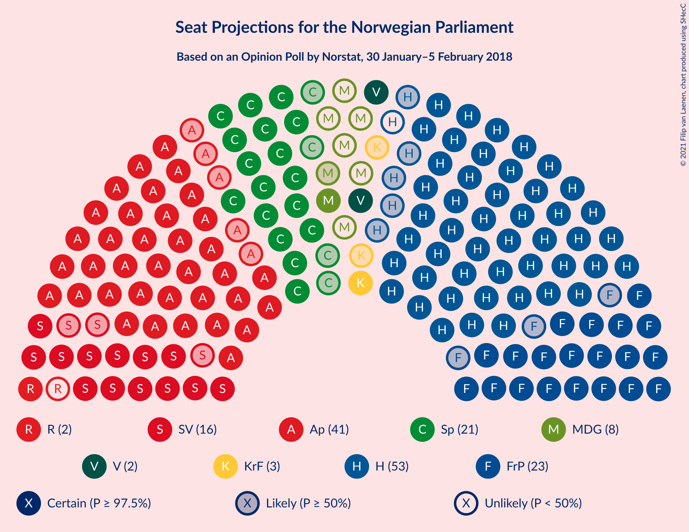
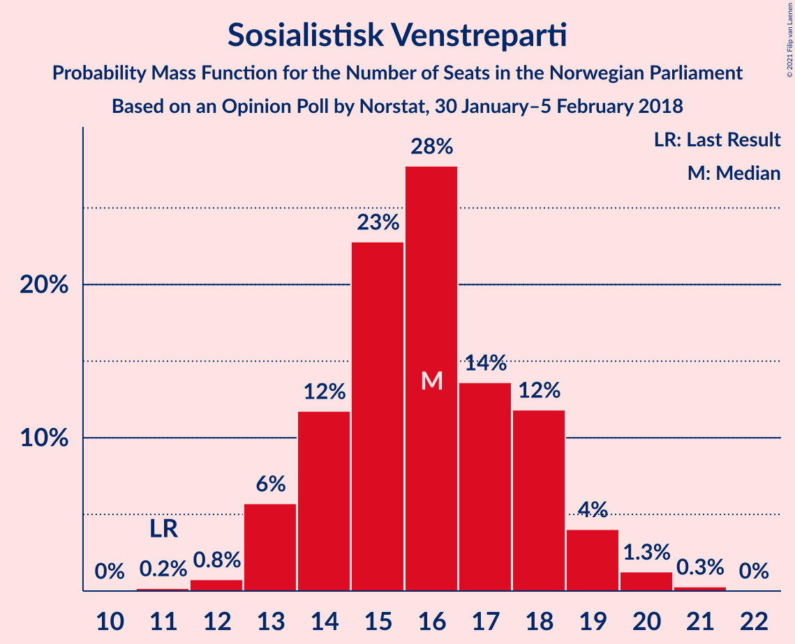
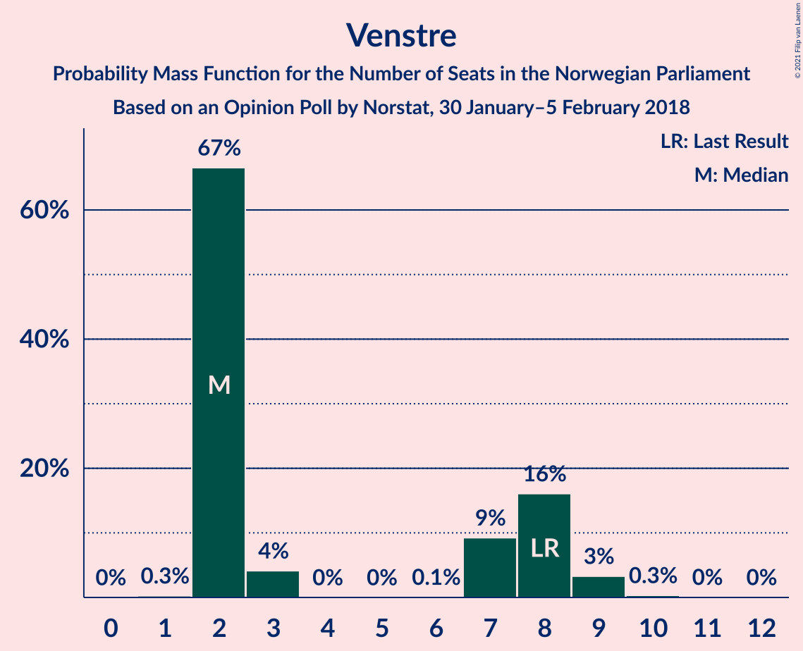
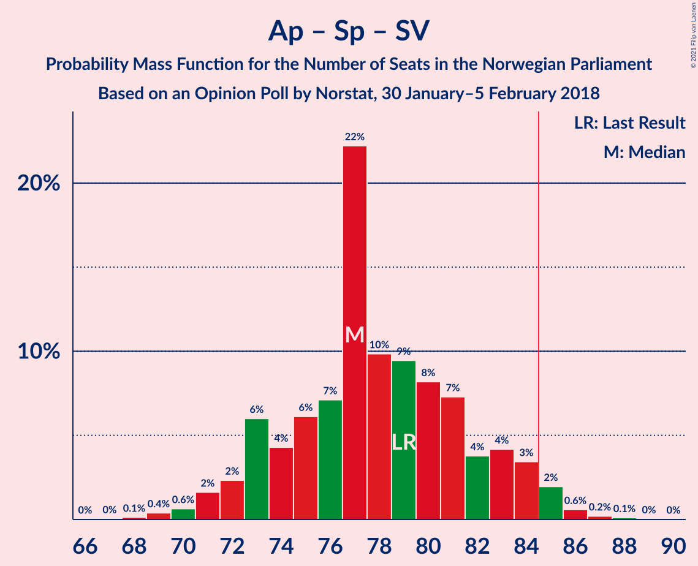

# Opinion Poll by Norstat, 30 January–5 February 2018

<a href="#voting-intentions">Voting Intentions</a> | <a href="#seats">Seats</a> | <a href="#coalitions">Coalitions</a> | <a href="#technical-information">Technical Information</a>

## Voting Intentions

### Confidence Intervals

| Party | Last Result | Poll Result | 80% Confidence Interval | 90% Confidence Interval | 95% Confidence Interval | 99% Confidence Interval |
|:-----:|:-----------:|:-----------:|:-----------------------:|:-----------------------:|:-----------------------:|:-----------------------:|
| Høyre | 25.0% | 29.0% | 27.1–30.9% |26.6–31.5% |26.1–31.9% |25.3–32.9% |
| Arbeiderpartiet | 27.4% | 22.4% | 20.7–24.2% |20.2–24.7% |19.8–25.1% |19.1–26.0% |
| Fremskrittspartiet | 15.2% | 13.1% | 11.8–14.7% |11.4–15.1% |11.1–15.5% |10.5–16.2% |
| Senterpartiet | 10.3% | 11.2% | 10.0–12.7% |9.7–13.1% |9.4–13.4% |8.8–14.1% |
| Sosialistisk Venstreparti | 6.0% | 8.6% | 7.5–9.9% |7.2–10.2% |7.0–10.6% |6.5–11.2% |
| Kristelig Folkeparti | 4.2% | 3.9% | 3.2–4.9% |3.0–5.1% |2.9–5.4% |2.5–5.9% |
| Venstre | 4.4% | 3.8% | 3.1–4.8% |2.9–5.0% |2.8–5.2% |2.5–5.7% |
| Miljøpartiet De Grønne | 3.2% | 3.7% | 3.0–4.6% |2.8–4.9% |2.7–5.1% |2.4–5.6% |
| Rødt | 2.4% | 2.9% | 2.3–3.7% |2.1–3.9% |2.0–4.1% |1.7–4.6% |

*Note:* The poll result column reflects the actual value used in the calculations. Published results may vary slightly, and in addition be rounded to fewer digits.

## Seats

### Confidence Intervals

| Party | Last Result | Median | 80% Confidence Interval | 90% Confidence Interval | 95% Confidence Interval | 99% Confidence Interval |
|:-----:|:-----------:|:------:|:-----------------------:|:-----------------------:|:-----------------------:|:-----------------------:|
| <a href="#høyre">Høyre</a> | 45 | 53 | 49–58 |48–58 |47–58 |46–60 |
| <a href="#arbeiderpartiet">Arbeiderpartiet</a> | 49 | 41 | 37–45 |36–46 |35–47 |35–47 |
| <a href="#fremskrittspartiet">Fremskrittspartiet</a> | 27 | 22 | 21–27 |20–27 |19–30 |18–32 |
| <a href="#senterpartiet">Senterpartiet</a> | 19 | 20 | 17–24 |17–24 |16–25 |15–26 |
| <a href="#sosialistisk-venstreparti">Sosialistisk Venstreparti</a> | 11 | 15 | 13–17 |13–18 |12–18 |11–20 |
| <a href="#kristelig-folkeparti">Kristelig Folkeparti</a> | 8 | 3 | 2–8 |1–9 |1–9 |0–10 |
| <a href="#venstre">Venstre</a> | 8 | 2 | 2–9 |2–9 |2–9 |2–10 |
| <a href="#miljøpartiet-de-grønne">Miljøpartiet De Grønne</a> | 1 | 2 | 2–9 |1–9 |1–9 |1–10 |
| <a href="#rødt">Rødt</a> | 1 | 2 | 1–7 |1–7 |1–8 |1–9 |

### Høyre

*For a full overview of the results for this party, see the [Høyre](party-høyre.html) page.*

| Number of Seats | Probability | Accumulated | Special Marks |
|:---------------:|:-----------:|:-----------:|:-------------:|
| 44 | 0.1% | 100% |  |
| 45 | 0.1% | 99.9% | Last Result |
| 46 | 0.8% | 99.8% |  |
| 47 | 3% | 99.0% |  |
| 48 | 4% | 96% |  |
| 49 | 5% | 93% |  |
| 50 | 19% | 88% |  |
| 51 | 7% | 69% |  |
| 52 | 12% | 62% |  |
| 53 | 10% | 50% | Median |
| 54 | 4% | 40% |  |
| 55 | 4% | 37% |  |
| 56 | 6% | 32% |  |
| 57 | 13% | 26% |  |
| 58 | 10% | 13% |  |
| 59 | 2% | 2% |  |
| 60 | 0.4% | 0.6% |  |
| 61 | 0.1% | 0.1% |  |
| 62 | 0% | 0% |  |

### Arbeiderpartiet

*For a full overview of the results for this party, see the [Arbeiderpartiet](party-arbeiderpartiet.html) page.*

| Number of Seats | Probability | Accumulated | Special Marks |
|:---------------:|:-----------:|:-----------:|:-------------:|
| 34 | 0.2% | 100% |  |
| 35 | 3% | 99.8% |  |
| 36 | 5% | 96% |  |
| 37 | 3% | 92% |  |
| 38 | 1.2% | 89% |  |
| 39 | 7% | 88% |  |
| 40 | 20% | 81% |  |
| 41 | 24% | 60% | Median |
| 42 | 21% | 37% |  |
| 43 | 2% | 16% |  |
| 44 | 3% | 14% |  |
| 45 | 4% | 11% |  |
| 46 | 4% | 7% |  |
| 47 | 3% | 3% |  |
| 48 | 0.1% | 0.2% |  |
| 49 | 0% | 0.1% | Last Result |
| 50 | 0% | 0% |  |

### Fremskrittspartiet

*For a full overview of the results for this party, see the [Fremskrittspartiet](party-fremskrittspartiet.html) page.*

| Number of Seats | Probability | Accumulated | Special Marks |
|:---------------:|:-----------:|:-----------:|:-------------:|
| 17 | 0.2% | 100% |  |
| 18 | 2% | 99.8% |  |
| 19 | 2% | 98% |  |
| 20 | 3% | 95% |  |
| 21 | 3% | 93% |  |
| 22 | 47% | 90% | Median |
| 23 | 6% | 43% |  |
| 24 | 8% | 37% |  |
| 25 | 9% | 30% |  |
| 26 | 10% | 21% |  |
| 27 | 6% | 11% | Last Result |
| 28 | 0.9% | 5% |  |
| 29 | 2% | 4% |  |
| 30 | 0.8% | 3% |  |
| 31 | 0% | 2% |  |
| 32 | 2% | 2% |  |
| 33 | 0% | 0% |  |

### Senterpartiet

*For a full overview of the results for this party, see the [Senterpartiet](party-senterpartiet.html) page.*

| Number of Seats | Probability | Accumulated | Special Marks |
|:---------------:|:-----------:|:-----------:|:-------------:|
| 15 | 0.6% | 100% |  |
| 16 | 2% | 99.3% |  |
| 17 | 9% | 97% |  |
| 18 | 21% | 87% |  |
| 19 | 10% | 67% | Last Result |
| 20 | 13% | 57% | Median |
| 21 | 12% | 44% |  |
| 22 | 7% | 32% |  |
| 23 | 2% | 25% |  |
| 24 | 18% | 23% |  |
| 25 | 4% | 5% |  |
| 26 | 0.9% | 1.1% |  |
| 27 | 0.2% | 0.2% |  |
| 28 | 0% | 0% |  |

### Sosialistisk Venstreparti

*For a full overview of the results for this party, see the [Sosialistisk Venstreparti](party-sosialistiskvenstreparti.html) page.*

| Number of Seats | Probability | Accumulated | Special Marks |
|:---------------:|:-----------:|:-----------:|:-------------:|
| 11 | 0.9% | 100% | Last Result |
| 12 | 2% | 99.0% |  |
| 13 | 23% | 97% |  |
| 14 | 17% | 75% |  |
| 15 | 14% | 58% | Median |
| 16 | 20% | 44% |  |
| 17 | 18% | 23% |  |
| 18 | 4% | 6% |  |
| 19 | 1.1% | 2% |  |
| 20 | 0.5% | 0.6% |  |
| 21 | 0.1% | 0.1% |  |
| 22 | 0% | 0% |  |

### Kristelig Folkeparti

*For a full overview of the results for this party, see the [Kristelig Folkeparti](party-kristeligfolkeparti.html) page.*

| Number of Seats | Probability | Accumulated | Special Marks |
|:---------------:|:-----------:|:-----------:|:-------------:|
| 0 | 0.7% | 100% |  |
| 1 | 8% | 99.3% |  |
| 2 | 15% | 91% |  |
| 3 | 37% | 76% | Median |
| 4 | 0% | 39% |  |
| 5 | 0% | 39% |  |
| 6 | 0% | 39% |  |
| 7 | 17% | 39% |  |
| 8 | 13% | 22% | Last Result |
| 9 | 8% | 9% |  |
| 10 | 1.2% | 1.3% |  |
| 11 | 0.1% | 0.1% |  |
| 12 | 0% | 0% |  |

### Venstre

*For a full overview of the results for this party, see the [Venstre](party-venstre.html) page.*

| Number of Seats | Probability | Accumulated | Special Marks |
|:---------------:|:-----------:|:-----------:|:-------------:|
| 1 | 0.1% | 100% |  |
| 2 | 51% | 99.9% | Median |
| 3 | 0.6% | 49% |  |
| 4 | 0% | 48% |  |
| 5 | 0% | 48% |  |
| 6 | 0.2% | 48% |  |
| 7 | 4% | 48% |  |
| 8 | 33% | 44% | Last Result |
| 9 | 11% | 11% |  |
| 10 | 0.7% | 0.8% |  |
| 11 | 0.1% | 0.1% |  |
| 12 | 0% | 0% |  |

### Miljøpartiet De Grønne

*For a full overview of the results for this party, see the [Miljøpartiet De Grønne](party-miljøpartietdegrønne.html) page.*

| Number of Seats | Probability | Accumulated | Special Marks |
|:---------------:|:-----------:|:-----------:|:-------------:|
| 1 | 6% | 100% | Last Result |
| 2 | 51% | 94% | Median |
| 3 | 0.3% | 43% |  |
| 4 | 0.2% | 43% |  |
| 5 | 0% | 42% |  |
| 6 | 0% | 42% |  |
| 7 | 3% | 42% |  |
| 8 | 26% | 40% |  |
| 9 | 13% | 14% |  |
| 10 | 1.1% | 1.1% |  |
| 11 | 0% | 0.1% |  |
| 12 | 0% | 0% |  |

### Rødt

*For a full overview of the results for this party, see the [Rødt](party-rødt.html) page.*

| Number of Seats | Probability | Accumulated | Special Marks |
|:---------------:|:-----------:|:-----------:|:-------------:|
| 1 | 47% | 100% | Last Result |
| 2 | 43% | 53% | Median |
| 3 | 0% | 11% |  |
| 4 | 0% | 11% |  |
| 5 | 0% | 11% |  |
| 6 | 0% | 11% |  |
| 7 | 6% | 11% |  |
| 8 | 4% | 5% |  |
| 9 | 0.7% | 0.8% |  |
| 10 | 0.1% | 0.1% |  |
| 11 | 0% | 0% |  |

## Coalitions

### Confidence Intervals

| Coalition | Last Result | Median | Majority? | 80% Confidence Interval | 90% Confidence Interval | 95% Confidence Interval | 99% Confidence Interval |
|:---------:|:-----------:|:------:|:---------:|:-----------------------:|:-----------------------:|:-----------------------:|:-----------------------:|
| Høyre – Fremskrittspartiet – Senterpartiet – Kristelig Folkeparti – Venstre | 107 | 106 | 100% | 103–109 | 103–111 | 101–111 | 99–113 |
| Høyre – Fremskrittspartiet – Kristelig Folkeparti – Venstre – Miljøpartiet De Grønne | 89 | 91 | 96% | 85–95 | 85–97 | 84–98 | 82–99 |
| Høyre – Fremskrittspartiet – Kristelig Folkeparti – Venstre | 88 | 86 | 60% | 83–90 | 82–91 | 81–92 | 79–94 |
| Arbeiderpartiet – Senterpartiet – Sosialistisk Venstreparti – Kristelig Folkeparti – Miljøpartiet De Grønne | 88 | 86 | 73% | 81–88 | 81–89 | 81–90 | 79–94 |
| Arbeiderpartiet – Senterpartiet – Sosialistisk Venstreparti – Miljøpartiet De Grønne – Rødt | 81 | 83 | 40% | 79–86 | 78–87 | 77–88 | 75–90 |
| Høyre – Fremskrittspartiet – Venstre | 80 | 81 | 11% | 79–85 | 78–85 | 77–86 | 74–88 |
| Arbeiderpartiet – Senterpartiet – Sosialistisk Venstreparti – Miljøpartiet De Grønne | 80 | 81 | 8% | 77–84 | 76–85 | 75–86 | 73–88 |
| Arbeiderpartiet – Senterpartiet – Sosialistisk Venstreparti – Rødt | 80 | 78 | 4% | 74–84 | 72–84 | 71–85 | 70–87 |
| Høyre – Fremskrittspartiet | 72 | 76 | 2% | 72–81 | 71–83 | 70–83 | 69–86 |
| Arbeiderpartiet – Senterpartiet – Sosialistisk Venstreparti | 79 | 76 | 1.0% | 72–81 | 70–82 | 69–83 | 69–85 |
| Arbeiderpartiet – Senterpartiet – Kristelig Folkeparti – Miljøpartiet De Grønne | 77 | 71 | 0% | 66–75 | 65–75 | 64–76 | 62–80 |
| Arbeiderpartiet – Senterpartiet – Kristelig Folkeparti | 76 | 66 | 0% | 62–70 | 60–71 | 58–72 | 57–75 |
| Høyre – Kristelig Folkeparti – Venstre | 61 | 62 | 0% | 58–66 | 57–68 | 56–70 | 54–71 |
| Arbeiderpartiet – Senterpartiet | 68 | 61 | 0% | 57–65 | 56–66 | 55–67 | 54–70 |
| Arbeiderpartiet – Sosialistisk Venstreparti | 60 | 56 | 0% | 52–60 | 51–61 | 49–61 | 48–62 |
| Senterpartiet – Kristelig Folkeparti – Venstre | 35 | 30 | 0% | 25–34 | 24–35 | 22–37 | 22–40 |

### Høyre – Fremskrittspartiet – Senterpartiet – Kristelig Folkeparti – Venstre

| Number of Seats | Probability | Accumulated | Special Marks |
|:---------------:|:-----------:|:-----------:|:-------------:|
| 95 | 0% | 100% |  |
| 96 | 0% | 99.9% |  |
| 97 | 0.1% | 99.9% |  |
| 98 | 0.1% | 99.8% |  |
| 99 | 0.3% | 99.8% |  |
| 100 | 2% | 99.5% | Median |
| 101 | 0.6% | 98% |  |
| 102 | 1.0% | 97% |  |
| 103 | 13% | 96% |  |
| 104 | 6% | 83% |  |
| 105 | 23% | 78% |  |
| 106 | 5% | 55% |  |
| 107 | 12% | 50% | Last Result |
| 108 | 23% | 38% |  |
| 109 | 5% | 15% |  |
| 110 | 4% | 10% |  |
| 111 | 4% | 6% |  |
| 112 | 0.9% | 2% |  |
| 113 | 0.5% | 1.0% |  |
| 114 | 0.2% | 0.4% |  |
| 115 | 0.2% | 0.3% |  |
| 116 | 0.1% | 0.1% |  |
| 117 | 0% | 0% |  |

### Høyre – Fremskrittspartiet – Kristelig Folkeparti – Venstre – Miljøpartiet De Grønne

| Number of Seats | Probability | Accumulated | Special Marks |
|:---------------:|:-----------:|:-----------:|:-------------:|
| 80 | 0.1% | 100% |  |
| 81 | 0.4% | 99.9% |  |
| 82 | 0.4% | 99.5% | Median |
| 83 | 1.0% | 99.1% |  |
| 84 | 2% | 98% |  |
| 85 | 9% | 96% | Majority |
| 86 | 16% | 86% |  |
| 87 | 1.3% | 71% |  |
| 88 | 7% | 69% |  |
| 89 | 5% | 62% | Last Result |
| 90 | 7% | 57% |  |
| 91 | 5% | 50% |  |
| 92 | 7% | 46% |  |
| 93 | 4% | 39% |  |
| 94 | 10% | 34% |  |
| 95 | 15% | 25% |  |
| 96 | 3% | 10% |  |
| 97 | 3% | 7% |  |
| 98 | 3% | 4% |  |
| 99 | 1.1% | 1.1% |  |
| 100 | 0% | 0.1% |  |
| 101 | 0% | 0% |  |

### Høyre – Fremskrittspartiet – Kristelig Folkeparti – Venstre

| Number of Seats | Probability | Accumulated | Special Marks |
|:---------------:|:-----------:|:-----------:|:-------------:|
| 75 | 0% | 100% |  |
| 76 | 0.1% | 99.9% |  |
| 77 | 0% | 99.9% |  |
| 78 | 0.1% | 99.8% |  |
| 79 | 0.6% | 99.7% |  |
| 80 | 2% | 99.1% | Median |
| 81 | 2% | 98% |  |
| 82 | 4% | 96% |  |
| 83 | 13% | 91% |  |
| 84 | 18% | 78% |  |
| 85 | 6% | 60% | Majority |
| 86 | 9% | 54% |  |
| 87 | 17% | 45% |  |
| 88 | 8% | 27% | Last Result |
| 89 | 7% | 19% |  |
| 90 | 7% | 13% |  |
| 91 | 2% | 6% |  |
| 92 | 2% | 4% |  |
| 93 | 1.2% | 2% |  |
| 94 | 0.2% | 0.5% |  |
| 95 | 0.1% | 0.3% |  |
| 96 | 0.1% | 0.2% |  |
| 97 | 0.1% | 0.1% |  |
| 98 | 0% | 0% |  |

### Arbeiderpartiet – Senterpartiet – Sosialistisk Venstreparti – Kristelig Folkeparti – Miljøpartiet De Grønne

| Number of Seats | Probability | Accumulated | Special Marks |
|:---------------:|:-----------:|:-----------:|:-------------:|
| 76 | 0.1% | 100% |  |
| 77 | 0.1% | 99.9% |  |
| 78 | 0.3% | 99.8% |  |
| 79 | 0.7% | 99.5% |  |
| 80 | 1.2% | 98.8% |  |
| 81 | 8% | 98% | Median |
| 82 | 3% | 90% |  |
| 83 | 7% | 87% |  |
| 84 | 6% | 79% |  |
| 85 | 19% | 73% | Majority |
| 86 | 20% | 55% |  |
| 87 | 11% | 34% |  |
| 88 | 17% | 23% | Last Result |
| 89 | 3% | 7% |  |
| 90 | 3% | 4% |  |
| 91 | 0.1% | 1.0% |  |
| 92 | 0.1% | 0.9% |  |
| 93 | 0.1% | 0.7% |  |
| 94 | 0.4% | 0.6% |  |
| 95 | 0.1% | 0.2% |  |
| 96 | 0% | 0.1% |  |
| 97 | 0% | 0.1% |  |
| 98 | 0% | 0.1% |  |
| 99 | 0% | 0% |  |

### Arbeiderpartiet – Senterpartiet – Sosialistisk Venstreparti – Miljøpartiet De Grønne – Rødt

| Number of Seats | Probability | Accumulated | Special Marks |
|:---------------:|:-----------:|:-----------:|:-------------:|
| 72 | 0.1% | 100% |  |
| 73 | 0.1% | 99.9% |  |
| 74 | 0.1% | 99.8% |  |
| 75 | 0.2% | 99.7% |  |
| 76 | 1.2% | 99.5% |  |
| 77 | 2% | 98% |  |
| 78 | 2% | 96% |  |
| 79 | 7% | 94% |  |
| 80 | 7% | 87% | Median |
| 81 | 8% | 81% | Last Result |
| 82 | 17% | 73% |  |
| 83 | 9% | 55% |  |
| 84 | 6% | 46% |  |
| 85 | 18% | 40% | Majority |
| 86 | 13% | 22% |  |
| 87 | 4% | 9% |  |
| 88 | 2% | 4% |  |
| 89 | 2% | 2% |  |
| 90 | 0.6% | 0.9% |  |
| 91 | 0.1% | 0.3% |  |
| 92 | 0% | 0.2% |  |
| 93 | 0.1% | 0.1% |  |
| 94 | 0% | 0.1% |  |
| 95 | 0% | 0% |  |

### Høyre – Fremskrittspartiet – Venstre

| Number of Seats | Probability | Accumulated | Special Marks |
|:---------------:|:-----------:|:-----------:|:-------------:|
| 70 | 0% | 100% |  |
| 71 | 0% | 99.9% |  |
| 72 | 0.1% | 99.9% |  |
| 73 | 0% | 99.8% |  |
| 74 | 0.8% | 99.8% |  |
| 75 | 0.1% | 99.0% |  |
| 76 | 0.5% | 98.9% |  |
| 77 | 2% | 98% | Median |
| 78 | 4% | 97% |  |
| 79 | 5% | 93% |  |
| 80 | 23% | 88% | Last Result |
| 81 | 25% | 65% |  |
| 82 | 17% | 40% |  |
| 83 | 7% | 23% |  |
| 84 | 5% | 16% |  |
| 85 | 8% | 11% | Majority |
| 86 | 1.1% | 3% |  |
| 87 | 1.3% | 2% |  |
| 88 | 0.7% | 1.0% |  |
| 89 | 0.3% | 0.3% |  |
| 90 | 0.1% | 0.1% |  |
| 91 | 0% | 0% |  |

### Arbeiderpartiet – Senterpartiet – Sosialistisk Venstreparti – Miljøpartiet De Grønne

| Number of Seats | Probability | Accumulated | Special Marks |
|:---------------:|:-----------:|:-----------:|:-------------:|
| 71 | 0.1% | 100% |  |
| 72 | 0.1% | 99.8% |  |
| 73 | 0.3% | 99.7% |  |
| 74 | 0.8% | 99.4% |  |
| 75 | 1.3% | 98.6% |  |
| 76 | 4% | 97% |  |
| 77 | 5% | 93% |  |
| 78 | 10% | 88% | Median |
| 79 | 10% | 78% |  |
| 80 | 6% | 69% | Last Result |
| 81 | 17% | 63% |  |
| 82 | 10% | 46% |  |
| 83 | 22% | 36% |  |
| 84 | 5% | 14% |  |
| 85 | 4% | 8% | Majority |
| 86 | 3% | 4% |  |
| 87 | 1.3% | 2% |  |
| 88 | 0.3% | 0.5% |  |
| 89 | 0.1% | 0.3% |  |
| 90 | 0% | 0.2% |  |
| 91 | 0% | 0.1% |  |
| 92 | 0.1% | 0.1% |  |
| 93 | 0% | 0% |  |

### Arbeiderpartiet – Senterpartiet – Sosialistisk Venstreparti – Rødt

| Number of Seats | Probability | Accumulated | Special Marks |
|:---------------:|:-----------:|:-----------:|:-------------:|
| 69 | 0% | 100% |  |
| 70 | 1.1% | 99.9% |  |
| 71 | 3% | 98.9% |  |
| 72 | 3% | 96% |  |
| 73 | 3% | 93% |  |
| 74 | 15% | 90% |  |
| 75 | 10% | 75% |  |
| 76 | 4% | 66% |  |
| 77 | 7% | 61% |  |
| 78 | 5% | 54% | Median |
| 79 | 7% | 50% |  |
| 80 | 5% | 43% | Last Result |
| 81 | 7% | 38% |  |
| 82 | 1.3% | 31% |  |
| 83 | 16% | 29% |  |
| 84 | 9% | 14% |  |
| 85 | 2% | 4% | Majority |
| 86 | 1.0% | 2% |  |
| 87 | 0.4% | 0.9% |  |
| 88 | 0.4% | 0.5% |  |
| 89 | 0.1% | 0.1% |  |
| 90 | 0% | 0% |  |

### Høyre – Fremskrittspartiet

| Number of Seats | Probability | Accumulated | Special Marks |
|:---------------:|:-----------:|:-----------:|:-------------:|
| 66 | 0% | 100% |  |
| 67 | 0.1% | 99.9% |  |
| 68 | 0.3% | 99.9% |  |
| 69 | 1.3% | 99.5% |  |
| 70 | 0.8% | 98% |  |
| 71 | 3% | 97% |  |
| 72 | 18% | 94% | Last Result |
| 73 | 7% | 76% |  |
| 74 | 10% | 69% |  |
| 75 | 5% | 59% | Median |
| 76 | 5% | 54% |  |
| 77 | 2% | 49% |  |
| 78 | 6% | 47% |  |
| 79 | 19% | 41% |  |
| 80 | 10% | 22% |  |
| 81 | 2% | 12% |  |
| 82 | 2% | 10% |  |
| 83 | 6% | 8% |  |
| 84 | 0.4% | 2% |  |
| 85 | 0.9% | 2% | Majority |
| 86 | 0.6% | 0.7% |  |
| 87 | 0.1% | 0.1% |  |
| 88 | 0% | 0% |  |

### Arbeiderpartiet – Senterpartiet – Sosialistisk Venstreparti

| Number of Seats | Probability | Accumulated | Special Marks |
|:---------------:|:-----------:|:-----------:|:-------------:|
| 67 | 0.1% | 100% |  |
| 68 | 0.3% | 99.9% |  |
| 69 | 3% | 99.6% |  |
| 70 | 3% | 96% |  |
| 71 | 3% | 93% |  |
| 72 | 3% | 91% |  |
| 73 | 14% | 88% |  |
| 74 | 13% | 74% |  |
| 75 | 6% | 60% |  |
| 76 | 9% | 54% | Median |
| 77 | 7% | 45% |  |
| 78 | 5% | 38% |  |
| 79 | 5% | 33% | Last Result |
| 80 | 5% | 28% |  |
| 81 | 16% | 22% |  |
| 82 | 3% | 7% |  |
| 83 | 1.2% | 3% |  |
| 84 | 1.0% | 2% |  |
| 85 | 0.7% | 1.0% | Majority |
| 86 | 0.2% | 0.3% |  |
| 87 | 0.1% | 0.1% |  |
| 88 | 0% | 0% |  |

### Arbeiderpartiet – Senterpartiet – Kristelig Folkeparti – Miljøpartiet De Grønne

| Number of Seats | Probability | Accumulated | Special Marks |
|:---------------:|:-----------:|:-----------:|:-------------:|
| 58 | 0% | 100% |  |
| 59 | 0.1% | 99.9% |  |
| 60 | 0.1% | 99.8% |  |
| 61 | 0.1% | 99.7% |  |
| 62 | 1.0% | 99.6% |  |
| 63 | 1.0% | 98.6% |  |
| 64 | 1.1% | 98% |  |
| 65 | 4% | 97% |  |
| 66 | 9% | 92% | Median |
| 67 | 3% | 83% |  |
| 68 | 11% | 80% |  |
| 69 | 4% | 69% |  |
| 70 | 13% | 65% |  |
| 71 | 12% | 52% |  |
| 72 | 12% | 40% |  |
| 73 | 7% | 28% |  |
| 74 | 4% | 21% |  |
| 75 | 14% | 17% |  |
| 76 | 2% | 3% |  |
| 77 | 0.8% | 2% | Last Result |
| 78 | 0.2% | 0.9% |  |
| 79 | 0.2% | 0.7% |  |
| 80 | 0.4% | 0.5% |  |
| 81 | 0% | 0.1% |  |
| 82 | 0% | 0% |  |

### Arbeiderpartiet – Senterpartiet – Kristelig Folkeparti

| Number of Seats | Probability | Accumulated | Special Marks |
|:---------------:|:-----------:|:-----------:|:-------------:|
| 56 | 0.2% | 100% |  |
| 57 | 0.6% | 99.8% |  |
| 58 | 3% | 99.2% |  |
| 59 | 0.2% | 96% |  |
| 60 | 3% | 96% |  |
| 61 | 1.1% | 93% |  |
| 62 | 6% | 91% |  |
| 63 | 9% | 85% |  |
| 64 | 12% | 76% | Median |
| 65 | 4% | 64% |  |
| 66 | 14% | 60% |  |
| 67 | 15% | 47% |  |
| 68 | 12% | 31% |  |
| 69 | 9% | 19% |  |
| 70 | 2% | 11% |  |
| 71 | 4% | 8% |  |
| 72 | 2% | 4% |  |
| 73 | 1.1% | 2% |  |
| 74 | 0.2% | 0.9% |  |
| 75 | 0.3% | 0.7% |  |
| 76 | 0.2% | 0.4% | Last Result |
| 77 | 0.1% | 0.1% |  |
| 78 | 0% | 0.1% |  |
| 79 | 0% | 0% |  |

### Høyre – Kristelig Folkeparti – Venstre

| Number of Seats | Probability | Accumulated | Special Marks |
|:---------------:|:-----------:|:-----------:|:-------------:|
| 53 | 0.4% | 100% |  |
| 54 | 1.3% | 99.6% |  |
| 55 | 0.6% | 98% |  |
| 56 | 3% | 98% |  |
| 57 | 3% | 95% |  |
| 58 | 5% | 92% | Median |
| 59 | 3% | 87% |  |
| 60 | 5% | 85% |  |
| 61 | 12% | 80% | Last Result |
| 62 | 19% | 67% |  |
| 63 | 8% | 49% |  |
| 64 | 9% | 41% |  |
| 65 | 18% | 31% |  |
| 66 | 5% | 14% |  |
| 67 | 3% | 9% |  |
| 68 | 2% | 6% |  |
| 69 | 1.1% | 4% |  |
| 70 | 2% | 3% |  |
| 71 | 0.6% | 1.0% |  |
| 72 | 0% | 0.5% |  |
| 73 | 0.4% | 0.5% |  |
| 74 | 0% | 0% |  |

### Arbeiderpartiet – Senterpartiet

| Number of Seats | Probability | Accumulated | Special Marks |
|:---------------:|:-----------:|:-----------:|:-------------:|
| 52 | 0.1% | 100% |  |
| 53 | 0.3% | 99.9% |  |
| 54 | 0.8% | 99.6% |  |
| 55 | 2% | 98.8% |  |
| 56 | 3% | 96% |  |
| 57 | 8% | 93% |  |
| 58 | 5% | 86% |  |
| 59 | 5% | 80% |  |
| 60 | 21% | 75% |  |
| 61 | 11% | 54% | Median |
| 62 | 7% | 43% |  |
| 63 | 6% | 36% |  |
| 64 | 9% | 30% |  |
| 65 | 11% | 21% |  |
| 66 | 7% | 10% |  |
| 67 | 0.7% | 3% |  |
| 68 | 1.1% | 2% | Last Result |
| 69 | 0.6% | 1.1% |  |
| 70 | 0.3% | 0.5% |  |
| 71 | 0.1% | 0.2% |  |
| 72 | 0% | 0.1% |  |
| 73 | 0% | 0.1% |  |
| 74 | 0% | 0% |  |

### Arbeiderpartiet – Sosialistisk Venstreparti

| Number of Seats | Probability | Accumulated | Special Marks |
|:---------------:|:-----------:|:-----------:|:-------------:|
| 48 | 0.9% | 100% |  |
| 49 | 2% | 99.1% |  |
| 50 | 1.0% | 97% |  |
| 51 | 0.9% | 96% |  |
| 52 | 5% | 95% |  |
| 53 | 7% | 90% |  |
| 54 | 5% | 83% |  |
| 55 | 21% | 77% |  |
| 56 | 8% | 56% | Median |
| 57 | 26% | 48% |  |
| 58 | 6% | 22% |  |
| 59 | 6% | 16% |  |
| 60 | 4% | 11% | Last Result |
| 61 | 5% | 6% |  |
| 62 | 0.6% | 1.1% |  |
| 63 | 0.3% | 0.5% |  |
| 64 | 0.1% | 0.2% |  |
| 65 | 0.1% | 0.1% |  |
| 66 | 0% | 0% |  |

### Senterpartiet – Kristelig Folkeparti – Venstre

| Number of Seats | Probability | Accumulated | Special Marks |
|:---------------:|:-----------:|:-----------:|:-------------:|
| 20 | 0.1% | 100% |  |
| 21 | 0.1% | 99.9% |  |
| 22 | 3% | 99.8% |  |
| 23 | 0.9% | 97% |  |
| 24 | 6% | 96% |  |
| 25 | 5% | 90% | Median |
| 26 | 2% | 85% |  |
| 27 | 4% | 83% |  |
| 28 | 11% | 79% |  |
| 29 | 16% | 68% |  |
| 30 | 10% | 52% |  |
| 31 | 7% | 42% |  |
| 32 | 7% | 36% |  |
| 33 | 17% | 29% |  |
| 34 | 3% | 12% |  |
| 35 | 4% | 8% | Last Result |
| 36 | 2% | 5% |  |
| 37 | 2% | 3% |  |
| 38 | 0.4% | 1.4% |  |
| 39 | 0.2% | 1.0% |  |
| 40 | 0.6% | 0.8% |  |
| 41 | 0.1% | 0.2% |  |
| 42 | 0% | 0% |  |

## Technical Information

### Opinion Poll

+ **Polling firm:** Norstat
+ **Commissioner(s):** —
+ **Fieldwork period:** 30 January–5 February 2018

### Calculations

+ **Sample size:** 943
+ **Simulations done:** 131,072
+ **Error estimate:** 2.45%

