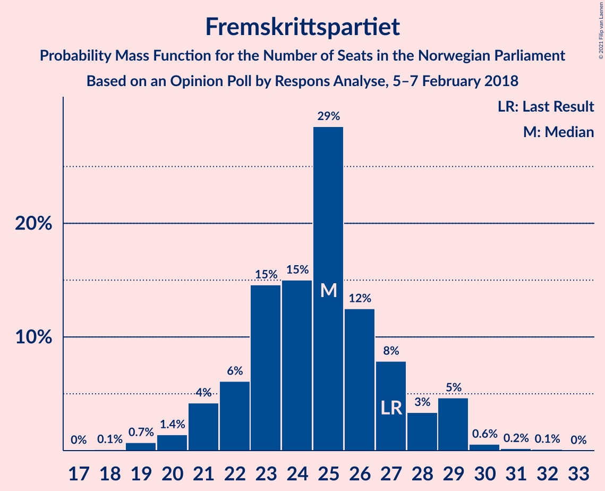
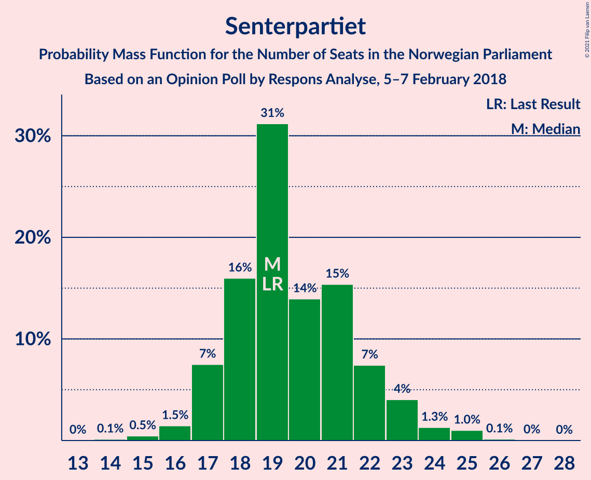
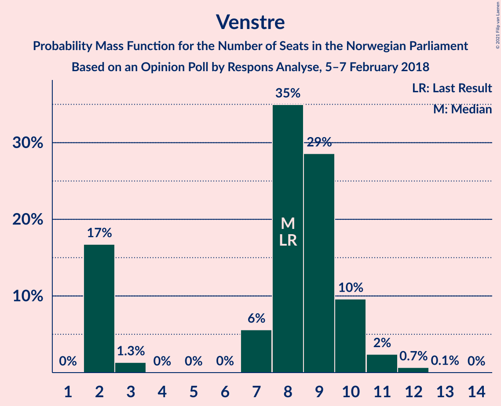
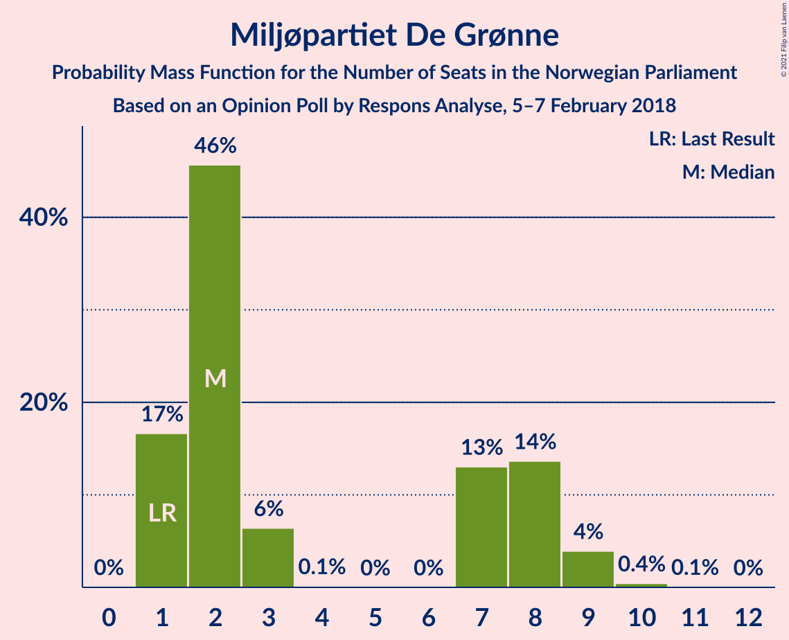
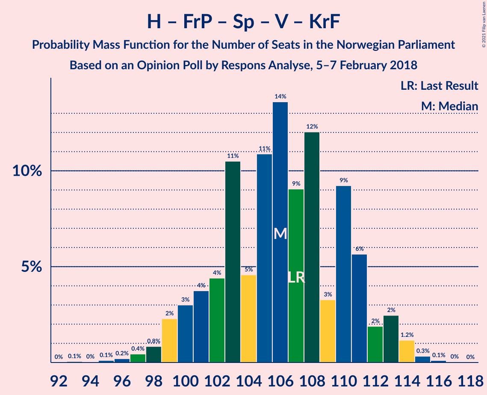
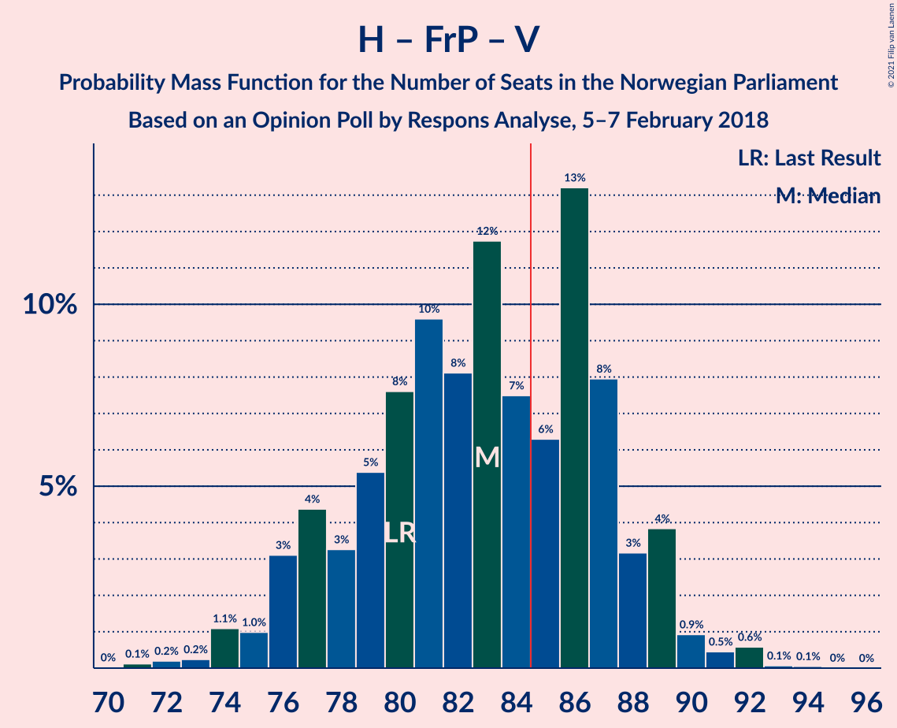
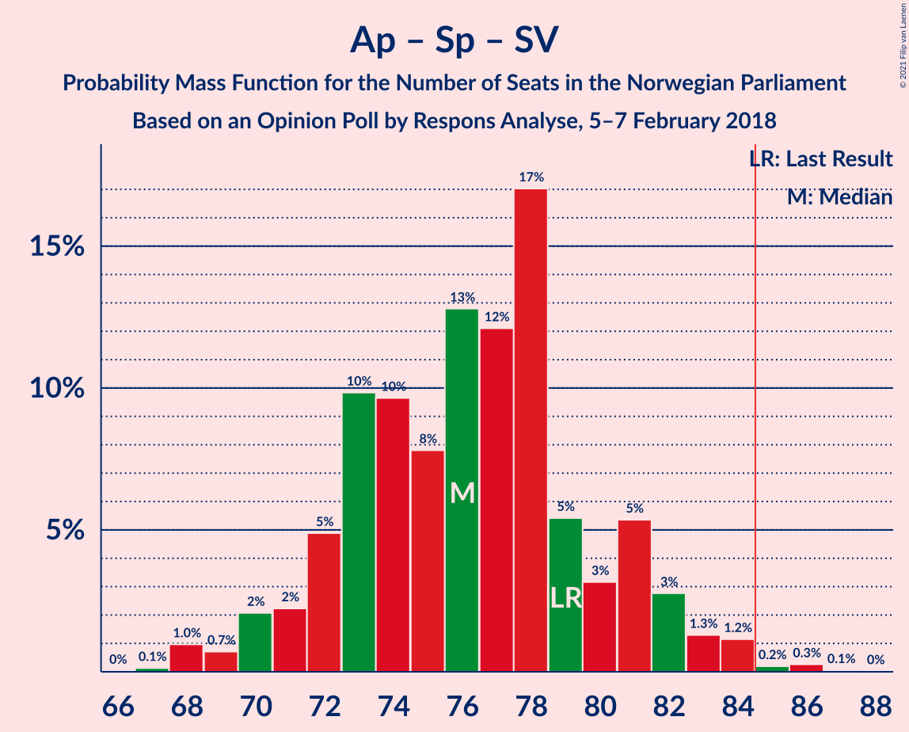
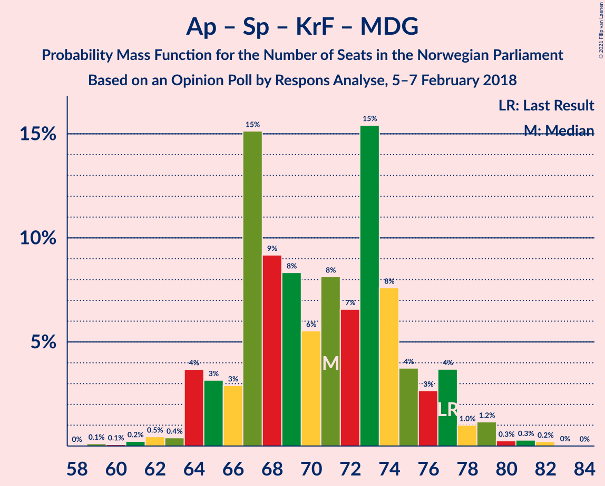

# Opinion Poll by Respons Analyse, 5–7 February 2018

<a href="#voting-intentions">Voting Intentions</a> | <a href="#seats">Seats</a> | <a href="#coalitions">Coalitions</a> | <a href="#technical-information">Technical Information</a>

## Voting Intentions

### Confidence Intervals

| Party | Last Result | Poll Result | 80% Confidence Interval | 90% Confidence Interval | 95% Confidence Interval | 99% Confidence Interval |
|:-----:|:-----------:|:-----------:|:-----------------------:|:-----------------------:|:-----------------------:|:-----------------------:|
| Høyre | 25.0% | 27.9% | 26.2–29.8% |25.7–30.3% |25.2–30.8% |24.4–31.7% |
| Arbeiderpartiet | 27.4% | 24.0% | 22.3–25.7% |21.8–26.3% |21.4–26.7% |20.6–27.6% |
| Fremskrittspartiet | 15.2% | 13.6% | 12.3–15.1% |11.9–15.5% |11.6–15.8% |11.0–16.6% |
| Senterpartiet | 10.3% | 10.9% | 9.7–12.2% |9.4–12.6% |9.1–13.0% |8.6–13.6% |
| Sosialistisk Venstreparti | 6.0% | 7.2% | 6.2–8.4% |6.0–8.7% |5.7–9.0% |5.3–9.5% |
| Venstre | 4.4% | 4.5% | 3.7–5.5% |3.5–5.7% |3.4–6.0% |3.0–6.5% |
| Miljøpartiet De Grønne | 3.2% | 3.6% | 2.9–4.5% |2.8–4.7% |2.6–4.9% |2.3–5.4% |
| Kristelig Folkeparti | 4.2% | 3.6% | 2.9–4.5% |2.8–4.7% |2.6–4.9% |2.3–5.4% |
| Rødt | 2.4% | 3.3% | 2.7–4.1% |2.5–4.4% |2.3–4.6% |2.1–5.0% |

*Note:* The poll result column reflects the actual value used in the calculations. Published results may vary slightly, and in addition be rounded to fewer digits.

## Seats

### Confidence Intervals

| Party | Last Result | Median | 80% Confidence Interval | 90% Confidence Interval | 95% Confidence Interval | 99% Confidence Interval |
|:-----:|:-----------:|:------:|:-----------------------:|:-----------------------:|:-----------------------:|:-----------------------:|
| <a href="#høyre">Høyre</a> | 45 | 49 | 48–54 |46–55 |45–55 |44–56 |
| <a href="#arbeiderpartiet">Arbeiderpartiet</a> | 49 | 44 | 41–45 |40–47 |39–48 |38–50 |
| <a href="#fremskrittspartiet">Fremskrittspartiet</a> | 27 | 23 | 22–26 |21–28 |20–28 |19–29 |
| <a href="#senterpartiet">Senterpartiet</a> | 19 | 19 | 18–23 |18–23 |17–25 |16–25 |
| <a href="#sosialistisk-venstreparti">Sosialistisk Venstreparti</a> | 11 | 14 | 12–15 |11–16 |11–16 |10–16 |
| <a href="#venstre">Venstre</a> | 8 | 9 | 2–10 |2–10 |2–10 |2–12 |
| <a href="#miljøpartiet-de-grønne">Miljøpartiet De Grønne</a> | 1 | 3 | 1–8 |1–8 |1–9 |1–10 |
| <a href="#kristelig-folkeparti">Kristelig Folkeparti</a> | 8 | 3 | 2–3 |1–8 |1–8 |1–10 |
| <a href="#rødt">Rødt</a> | 1 | 1 | 1–8 |1–8 |1–8 |1–9 |

### Høyre

*For a full overview of the results for this party, see the [Høyre](party-høyre.html) page.*

| Number of Seats | Probability | Accumulated | Special Marks |
|:---------------:|:-----------:|:-----------:|:-------------:|
| 42 | 0% | 100% |  |
| 43 | 0.1% | 99.9% |  |
| 44 | 2% | 99.8% |  |
| 45 | 1.2% | 98% | Last Result |
| 46 | 2% | 96% |  |
| 47 | 3% | 94% |  |
| 48 | 24% | 92% |  |
| 49 | 18% | 67% | Median |
| 50 | 6% | 50% |  |
| 51 | 17% | 44% |  |
| 52 | 8% | 27% |  |
| 53 | 2% | 19% |  |
| 54 | 10% | 17% |  |
| 55 | 6% | 8% |  |
| 56 | 1.5% | 2% |  |
| 57 | 0.3% | 0.4% |  |
| 58 | 0.1% | 0.2% |  |
| 59 | 0% | 0.1% |  |
| 60 | 0% | 0.1% |  |
| 61 | 0.1% | 0.1% |  |
| 62 | 0% | 0% |  |

### Arbeiderpartiet

*For a full overview of the results for this party, see the [Arbeiderpartiet](party-arbeiderpartiet.html) page.*

| Number of Seats | Probability | Accumulated | Special Marks |
|:---------------:|:-----------:|:-----------:|:-------------:|
| 36 | 0% | 100% |  |
| 37 | 0.1% | 99.9% |  |
| 38 | 1.5% | 99.9% |  |
| 39 | 3% | 98% |  |
| 40 | 3% | 96% |  |
| 41 | 4% | 93% |  |
| 42 | 26% | 89% |  |
| 43 | 11% | 63% |  |
| 44 | 27% | 52% | Median |
| 45 | 16% | 25% |  |
| 46 | 3% | 10% |  |
| 47 | 3% | 6% |  |
| 48 | 2% | 3% |  |
| 49 | 0.5% | 1.0% | Last Result |
| 50 | 0.3% | 0.5% |  |
| 51 | 0% | 0.2% |  |
| 52 | 0.1% | 0.2% |  |
| 53 | 0% | 0% |  |

### Fremskrittspartiet

*For a full overview of the results for this party, see the [Fremskrittspartiet](party-fremskrittspartiet.html) page.*

| Number of Seats | Probability | Accumulated | Special Marks |
|:---------------:|:-----------:|:-----------:|:-------------:|
| 17 | 0.1% | 100% |  |
| 18 | 0.1% | 99.9% |  |
| 19 | 1.0% | 99.8% |  |
| 20 | 2% | 98.8% |  |
| 21 | 4% | 97% |  |
| 22 | 6% | 93% |  |
| 23 | 41% | 88% | Median |
| 24 | 6% | 47% |  |
| 25 | 27% | 41% |  |
| 26 | 7% | 14% |  |
| 27 | 2% | 8% | Last Result |
| 28 | 4% | 5% |  |
| 29 | 1.2% | 2% |  |
| 30 | 0.2% | 0.4% |  |
| 31 | 0.1% | 0.2% |  |
| 32 | 0.1% | 0.1% |  |
| 33 | 0% | 0% |  |

### Senterpartiet

*For a full overview of the results for this party, see the [Senterpartiet](party-senterpartiet.html) page.*

| Number of Seats | Probability | Accumulated | Special Marks |
|:---------------:|:-----------:|:-----------:|:-------------:|
| 14 | 0.1% | 100% |  |
| 15 | 0.2% | 99.9% |  |
| 16 | 0.7% | 99.7% |  |
| 17 | 3% | 99.1% |  |
| 18 | 17% | 96% |  |
| 19 | 34% | 78% | Last Result, Median |
| 20 | 11% | 44% |  |
| 21 | 19% | 33% |  |
| 22 | 4% | 14% |  |
| 23 | 7% | 11% |  |
| 24 | 0.6% | 4% |  |
| 25 | 3% | 3% |  |
| 26 | 0.2% | 0.3% |  |
| 27 | 0% | 0% |  |

### Sosialistisk Venstreparti

*For a full overview of the results for this party, see the [Sosialistisk Venstreparti](party-sosialistiskvenstreparti.html) page.*

| Number of Seats | Probability | Accumulated | Special Marks |
|:---------------:|:-----------:|:-----------:|:-------------:|
| 9 | 0.5% | 100% |  |
| 10 | 1.4% | 99.5% |  |
| 11 | 5% | 98% | Last Result |
| 12 | 8% | 93% |  |
| 13 | 14% | 84% |  |
| 14 | 42% | 71% | Median |
| 15 | 24% | 29% |  |
| 16 | 6% | 6% |  |
| 17 | 0.1% | 0.1% |  |
| 18 | 0% | 0% |  |

### Venstre

*For a full overview of the results for this party, see the [Venstre](party-venstre.html) page.*

| Number of Seats | Probability | Accumulated | Special Marks |
|:---------------:|:-----------:|:-----------:|:-------------:|
| 2 | 21% | 100% |  |
| 3 | 3% | 79% |  |
| 4 | 0% | 76% |  |
| 5 | 0% | 76% |  |
| 6 | 0% | 76% |  |
| 7 | 8% | 76% |  |
| 8 | 12% | 69% | Last Result |
| 9 | 19% | 57% | Median |
| 10 | 36% | 38% |  |
| 11 | 2% | 2% |  |
| 12 | 0.4% | 0.5% |  |
| 13 | 0.2% | 0.2% |  |
| 14 | 0% | 0% |  |

### Miljøpartiet De Grønne

*For a full overview of the results for this party, see the [Miljøpartiet De Grønne](party-miljøpartietdegrønne.html) page.*

| Number of Seats | Probability | Accumulated | Special Marks |
|:---------------:|:-----------:|:-----------:|:-------------:|
| 1 | 19% | 100% | Last Result |
| 2 | 29% | 81% |  |
| 3 | 3% | 51% | Median |
| 4 | 0% | 48% |  |
| 5 | 0% | 48% |  |
| 6 | 0% | 48% |  |
| 7 | 27% | 48% |  |
| 8 | 19% | 22% |  |
| 9 | 2% | 3% |  |
| 10 | 0.5% | 0.6% |  |
| 11 | 0% | 0% |  |

### Kristelig Folkeparti

*For a full overview of the results for this party, see the [Kristelig Folkeparti](party-kristeligfolkeparti.html) page.*

| Number of Seats | Probability | Accumulated | Special Marks |
|:---------------:|:-----------:|:-----------:|:-------------:|
| 0 | 0.1% | 100% |  |
| 1 | 5% | 99.9% |  |
| 2 | 23% | 95% |  |
| 3 | 65% | 72% | Median |
| 4 | 0% | 7% |  |
| 5 | 0% | 7% |  |
| 6 | 0% | 7% |  |
| 7 | 2% | 7% |  |
| 8 | 3% | 6% | Last Result |
| 9 | 2% | 2% |  |
| 10 | 0.8% | 0.8% |  |
| 11 | 0% | 0% |  |

### Rødt

*For a full overview of the results for this party, see the [Rødt](party-rødt.html) page.*

| Number of Seats | Probability | Accumulated | Special Marks |
|:---------------:|:-----------:|:-----------:|:-------------:|
| 1 | 53% | 100% | Last Result, Median |
| 2 | 23% | 47% |  |
| 3 | 0% | 24% |  |
| 4 | 0% | 24% |  |
| 5 | 0% | 24% |  |
| 6 | 0% | 24% |  |
| 7 | 8% | 24% |  |
| 8 | 14% | 15% |  |
| 9 | 1.0% | 1.2% |  |
| 10 | 0.1% | 0.1% |  |
| 11 | 0% | 0% |  |

## Coalitions

### Confidence Intervals

| Coalition | Last Result | Median | Majority? | 80% Confidence Interval | 90% Confidence Interval | 95% Confidence Interval | 99% Confidence Interval |
|:---------:|:-----------:|:------:|:---------:|:-----------------------:|:-----------------------:|:-----------------------:|:-----------------------:|
| Høyre – Fremskrittspartiet – Senterpartiet – Venstre – Kristelig Folkeparti | 107 | 103 | 100% | 100–109 | 99–111 | 99–111 | 96–113 |
| Høyre – Fremskrittspartiet – Venstre – Kristelig Folkeparti – Miljøpartiet De Grønne | 89 | 89 | 92% | 86–92 | 84–94 | 83–95 | 81–99 |
| Arbeiderpartiet – Senterpartiet – Sosialistisk Venstreparti – Kristelig Folkeparti – Miljøpartiet De Grønne | 88 | 85 | 56% | 78–92 | 78–92 | 77–92 | 74–92 |
| Høyre – Fremskrittspartiet – Venstre – Kristelig Folkeparti | 88 | 84 | 49% | 79–89 | 79–91 | 79–91 | 77–94 |
| Arbeiderpartiet – Senterpartiet – Sosialistisk Venstreparti – Miljøpartiet De Grønne – Rødt | 81 | 85 | 51% | 80–90 | 78–90 | 78–90 | 75–92 |
| Arbeiderpartiet – Senterpartiet – Sosialistisk Venstreparti – Miljøpartiet De Grønne | 80 | 82 | 20% | 76–89 | 75–89 | 74–89 | 71–89 |
| Høyre – Fremskrittspartiet – Venstre | 80 | 81 | 22% | 76–87 | 76–87 | 76–88 | 74–91 |
| Arbeiderpartiet – Senterpartiet – Sosialistisk Venstreparti – Rødt | 80 | 80 | 8% | 77–83 | 75–85 | 74–86 | 70–88 |
| Arbeiderpartiet – Senterpartiet – Sosialistisk Venstreparti | 79 | 77 | 0.8% | 74–81 | 72–82 | 70–84 | 68–86 |
| Høyre – Fremskrittspartiet | 72 | 74 | 0.1% | 71–78 | 69–80 | 69–80 | 67–84 |
| Arbeiderpartiet – Senterpartiet – Kristelig Folkeparti – Miljøpartiet De Grønne | 77 | 73 | 0% | 64–77 | 64–77 | 64–77 | 59–79 |
| Arbeiderpartiet – Senterpartiet – Kristelig Folkeparti | 76 | 66 | 0% | 62–70 | 62–73 | 60–73 | 58–75 |
| Arbeiderpartiet – Senterpartiet | 68 | 63 | 0% | 60–66 | 60–69 | 57–70 | 55–72 |
| Høyre – Venstre – Kristelig Folkeparti | 61 | 61 | 0% | 56–66 | 56–66 | 55–67 | 53–69 |
| Arbeiderpartiet – Sosialistisk Venstreparti | 60 | 57 | 0% | 54–60 | 53–60 | 52–62 | 50–63 |
| Senterpartiet – Venstre – Kristelig Folkeparti | 35 | 31 | 0% | 26–35 | 24–36 | 23–37 | 23–39 |

### Høyre – Fremskrittspartiet – Senterpartiet – Venstre – Kristelig Folkeparti

| Number of Seats | Probability | Accumulated | Special Marks |
|:---------------:|:-----------:|:-----------:|:-------------:|
| 93 | 0.2% | 100% |  |
| 94 | 0% | 99.8% |  |
| 95 | 0.1% | 99.8% |  |
| 96 | 0.3% | 99.7% |  |
| 97 | 0.1% | 99.5% |  |
| 98 | 2% | 99.4% |  |
| 99 | 3% | 98% |  |
| 100 | 12% | 95% |  |
| 101 | 2% | 83% |  |
| 102 | 2% | 81% |  |
| 103 | 36% | 79% | Median |
| 104 | 4% | 43% |  |
| 105 | 4% | 39% |  |
| 106 | 2% | 35% |  |
| 107 | 3% | 32% | Last Result |
| 108 | 16% | 29% |  |
| 109 | 4% | 14% |  |
| 110 | 1.0% | 10% |  |
| 111 | 7% | 9% |  |
| 112 | 1.0% | 2% |  |
| 113 | 1.0% | 1.4% |  |
| 114 | 0.2% | 0.5% |  |
| 115 | 0.1% | 0.2% |  |
| 116 | 0.1% | 0.1% |  |
| 117 | 0% | 0% |  |

### Høyre – Fremskrittspartiet – Venstre – Kristelig Folkeparti – Miljøpartiet De Grønne

| Number of Seats | Probability | Accumulated | Special Marks |
|:---------------:|:-----------:|:-----------:|:-------------:|
| 79 | 0% | 100% |  |
| 80 | 0.1% | 99.9% |  |
| 81 | 0.5% | 99.9% |  |
| 82 | 2% | 99.4% |  |
| 83 | 0.5% | 98% |  |
| 84 | 6% | 97% |  |
| 85 | 0.6% | 92% | Majority |
| 86 | 4% | 91% |  |
| 87 | 23% | 87% | Median |
| 88 | 4% | 64% |  |
| 89 | 13% | 60% | Last Result |
| 90 | 4% | 48% |  |
| 91 | 31% | 44% |  |
| 92 | 5% | 13% |  |
| 93 | 2% | 9% |  |
| 94 | 4% | 7% |  |
| 95 | 2% | 3% |  |
| 96 | 0.4% | 2% |  |
| 97 | 0.6% | 1.3% |  |
| 98 | 0% | 0.7% |  |
| 99 | 0.6% | 0.6% |  |
| 100 | 0% | 0.1% |  |
| 101 | 0.1% | 0.1% |  |
| 102 | 0% | 0% |  |

### Arbeiderpartiet – Senterpartiet – Sosialistisk Venstreparti – Kristelig Folkeparti – Miljøpartiet De Grønne

| Number of Seats | Probability | Accumulated | Special Marks |
|:---------------:|:-----------:|:-----------:|:-------------:|
| 73 | 0% | 100% |  |
| 74 | 0.5% | 99.9% |  |
| 75 | 0.1% | 99.4% |  |
| 76 | 1.1% | 99.3% |  |
| 77 | 0.9% | 98% |  |
| 78 | 12% | 97% |  |
| 79 | 0.9% | 86% |  |
| 80 | 10% | 85% |  |
| 81 | 2% | 74% |  |
| 82 | 5% | 72% |  |
| 83 | 7% | 67% | Median |
| 84 | 4% | 60% |  |
| 85 | 9% | 56% | Majority |
| 86 | 2% | 46% |  |
| 87 | 23% | 44% |  |
| 88 | 6% | 21% | Last Result |
| 89 | 0.7% | 15% |  |
| 90 | 3% | 14% |  |
| 91 | 0.6% | 12% |  |
| 92 | 11% | 11% |  |
| 93 | 0.1% | 0.1% |  |
| 94 | 0% | 0.1% |  |
| 95 | 0% | 0% |  |

### Høyre – Fremskrittspartiet – Venstre – Kristelig Folkeparti

| Number of Seats | Probability | Accumulated | Special Marks |
|:---------------:|:-----------:|:-----------:|:-------------:|
| 73 | 0.1% | 100% |  |
| 74 | 0% | 99.9% |  |
| 75 | 0% | 99.9% |  |
| 76 | 0.1% | 99.8% |  |
| 77 | 0.3% | 99.7% |  |
| 78 | 0.2% | 99.4% |  |
| 79 | 13% | 99.3% |  |
| 80 | 3% | 87% |  |
| 81 | 5% | 84% |  |
| 82 | 2% | 79% |  |
| 83 | 6% | 77% |  |
| 84 | 23% | 72% | Median |
| 85 | 16% | 49% | Majority |
| 86 | 2% | 33% |  |
| 87 | 7% | 31% |  |
| 88 | 10% | 24% | Last Result |
| 89 | 7% | 14% |  |
| 90 | 2% | 7% |  |
| 91 | 3% | 5% |  |
| 92 | 0.6% | 2% |  |
| 93 | 1.0% | 2% |  |
| 94 | 0.6% | 0.7% |  |
| 95 | 0% | 0.2% |  |
| 96 | 0.1% | 0.1% |  |
| 97 | 0% | 0% |  |

### Arbeiderpartiet – Senterpartiet – Sosialistisk Venstreparti – Miljøpartiet De Grønne – Rødt

| Number of Seats | Probability | Accumulated | Special Marks |
|:---------------:|:-----------:|:-----------:|:-------------:|
| 73 | 0.1% | 100% |  |
| 74 | 0% | 99.9% |  |
| 75 | 0.6% | 99.8% |  |
| 76 | 1.0% | 99.3% |  |
| 77 | 0.6% | 98% |  |
| 78 | 3% | 98% |  |
| 79 | 2% | 95% |  |
| 80 | 7% | 93% |  |
| 81 | 10% | 86% | Last Result, Median |
| 82 | 7% | 76% |  |
| 83 | 2% | 69% |  |
| 84 | 16% | 67% |  |
| 85 | 23% | 51% | Majority |
| 86 | 6% | 28% |  |
| 87 | 2% | 23% |  |
| 88 | 5% | 21% |  |
| 89 | 3% | 16% |  |
| 90 | 13% | 13% |  |
| 91 | 0.2% | 0.7% |  |
| 92 | 0.3% | 0.6% |  |
| 93 | 0.1% | 0.3% |  |
| 94 | 0% | 0.2% |  |
| 95 | 0% | 0.1% |  |
| 96 | 0.1% | 0.1% |  |
| 97 | 0% | 0% |  |

### Arbeiderpartiet – Senterpartiet – Sosialistisk Venstreparti – Miljøpartiet De Grønne

| Number of Seats | Probability | Accumulated | Special Marks |
|:---------------:|:-----------:|:-----------:|:-------------:|
| 69 | 0% | 100% |  |
| 70 | 0.1% | 99.9% |  |
| 71 | 0.7% | 99.9% |  |
| 72 | 0.3% | 99.2% |  |
| 73 | 0.6% | 98.9% |  |
| 74 | 3% | 98% |  |
| 75 | 2% | 95% |  |
| 76 | 10% | 93% |  |
| 77 | 4% | 83% |  |
| 78 | 8% | 79% |  |
| 79 | 4% | 70% |  |
| 80 | 9% | 66% | Last Result, Median |
| 81 | 4% | 57% |  |
| 82 | 8% | 53% |  |
| 83 | 3% | 45% |  |
| 84 | 23% | 43% |  |
| 85 | 5% | 20% | Majority |
| 86 | 0.5% | 14% |  |
| 87 | 2% | 14% |  |
| 88 | 0.7% | 12% |  |
| 89 | 11% | 11% |  |
| 90 | 0.1% | 0.1% |  |
| 91 | 0% | 0.1% |  |
| 92 | 0% | 0% |  |

### Høyre – Fremskrittspartiet – Venstre

| Number of Seats | Probability | Accumulated | Special Marks |
|:---------------:|:-----------:|:-----------:|:-------------:|
| 72 | 0.2% | 100% |  |
| 73 | 0.1% | 99.8% |  |
| 74 | 0.5% | 99.7% |  |
| 75 | 0.4% | 99.3% |  |
| 76 | 11% | 98.9% |  |
| 77 | 5% | 88% |  |
| 78 | 2% | 83% |  |
| 79 | 4% | 80% |  |
| 80 | 7% | 76% | Last Result |
| 81 | 22% | 69% | Median |
| 82 | 6% | 46% |  |
| 83 | 12% | 40% |  |
| 84 | 6% | 28% |  |
| 85 | 8% | 22% | Majority |
| 86 | 2% | 13% |  |
| 87 | 7% | 11% |  |
| 88 | 2% | 4% |  |
| 89 | 0.5% | 2% |  |
| 90 | 0.7% | 1.3% |  |
| 91 | 0.3% | 0.5% |  |
| 92 | 0.1% | 0.2% |  |
| 93 | 0.1% | 0.1% |  |
| 94 | 0% | 0% |  |

### Arbeiderpartiet – Senterpartiet – Sosialistisk Venstreparti – Rødt

| Number of Seats | Probability | Accumulated | Special Marks |
|:---------------:|:-----------:|:-----------:|:-------------:|
| 68 | 0.1% | 100% |  |
| 69 | 0% | 99.9% |  |
| 70 | 0.6% | 99.9% |  |
| 71 | 0% | 99.4% |  |
| 72 | 0.6% | 99.3% |  |
| 73 | 0.4% | 98.7% |  |
| 74 | 2% | 98% |  |
| 75 | 4% | 97% |  |
| 76 | 2% | 93% |  |
| 77 | 5% | 91% |  |
| 78 | 31% | 87% | Median |
| 79 | 4% | 56% |  |
| 80 | 13% | 52% | Last Result |
| 81 | 4% | 40% |  |
| 82 | 23% | 36% |  |
| 83 | 4% | 13% |  |
| 84 | 0.6% | 9% |  |
| 85 | 6% | 8% | Majority |
| 86 | 0.5% | 3% |  |
| 87 | 2% | 2% |  |
| 88 | 0.5% | 0.6% |  |
| 89 | 0.1% | 0.1% |  |
| 90 | 0% | 0.1% |  |
| 91 | 0% | 0% |  |

### Arbeiderpartiet – Senterpartiet – Sosialistisk Venstreparti

| Number of Seats | Probability | Accumulated | Special Marks |
|:---------------:|:-----------:|:-----------:|:-------------:|
| 67 | 0.1% | 100% |  |
| 68 | 1.0% | 99.9% |  |
| 69 | 1.2% | 98.9% |  |
| 70 | 0.4% | 98% |  |
| 71 | 0.7% | 97% |  |
| 72 | 2% | 97% |  |
| 73 | 3% | 94% |  |
| 74 | 14% | 91% |  |
| 75 | 5% | 77% |  |
| 76 | 12% | 73% |  |
| 77 | 25% | 60% | Median |
| 78 | 6% | 35% |  |
| 79 | 10% | 29% | Last Result |
| 80 | 0.7% | 19% |  |
| 81 | 13% | 18% |  |
| 82 | 0.2% | 5% |  |
| 83 | 2% | 5% |  |
| 84 | 2% | 3% |  |
| 85 | 0.1% | 0.8% | Majority |
| 86 | 0.6% | 0.7% |  |
| 87 | 0% | 0% |  |

### Høyre – Fremskrittspartiet

| Number of Seats | Probability | Accumulated | Special Marks |
|:---------------:|:-----------:|:-----------:|:-------------:|
| 65 | 0.1% | 100% |  |
| 66 | 0.1% | 99.8% |  |
| 67 | 0.5% | 99.7% |  |
| 68 | 0.5% | 99.2% |  |
| 69 | 5% | 98.8% |  |
| 70 | 1.4% | 94% |  |
| 71 | 23% | 93% |  |
| 72 | 5% | 70% | Last Result, Median |
| 73 | 3% | 64% |  |
| 74 | 24% | 62% |  |
| 75 | 7% | 38% |  |
| 76 | 2% | 31% |  |
| 77 | 16% | 28% |  |
| 78 | 5% | 13% |  |
| 79 | 1.2% | 8% |  |
| 80 | 4% | 7% |  |
| 81 | 0.8% | 2% |  |
| 82 | 0.7% | 1.5% |  |
| 83 | 0.1% | 0.8% |  |
| 84 | 0.5% | 0.6% |  |
| 85 | 0% | 0.1% | Majority |
| 86 | 0.1% | 0.1% |  |
| 87 | 0% | 0.1% |  |
| 88 | 0% | 0% |  |

### Arbeiderpartiet – Senterpartiet – Kristelig Folkeparti – Miljøpartiet De Grønne

| Number of Seats | Probability | Accumulated | Special Marks |
|:---------------:|:-----------:|:-----------:|:-------------:|
| 59 | 0.5% | 100% |  |
| 60 | 0% | 99.5% |  |
| 61 | 0.6% | 99.5% |  |
| 62 | 0% | 98.9% |  |
| 63 | 0.3% | 98.8% |  |
| 64 | 12% | 98.6% |  |
| 65 | 7% | 87% |  |
| 66 | 3% | 80% |  |
| 67 | 6% | 77% |  |
| 68 | 5% | 71% |  |
| 69 | 2% | 66% | Median |
| 70 | 7% | 65% |  |
| 71 | 3% | 58% |  |
| 72 | 4% | 55% |  |
| 73 | 28% | 51% |  |
| 74 | 6% | 23% |  |
| 75 | 1.4% | 17% |  |
| 76 | 2% | 16% |  |
| 77 | 13% | 14% | Last Result |
| 78 | 0.5% | 1.5% |  |
| 79 | 0.8% | 0.9% |  |
| 80 | 0.1% | 0.1% |  |
| 81 | 0.1% | 0.1% |  |
| 82 | 0% | 0% |  |

### Arbeiderpartiet – Senterpartiet – Kristelig Folkeparti

| Number of Seats | Probability | Accumulated | Special Marks |
|:---------------:|:-----------:|:-----------:|:-------------:|
| 58 | 1.4% | 100% |  |
| 59 | 0.6% | 98.6% |  |
| 60 | 0.6% | 98% |  |
| 61 | 0.2% | 97% |  |
| 62 | 11% | 97% |  |
| 63 | 10% | 86% |  |
| 64 | 3% | 76% |  |
| 65 | 8% | 74% |  |
| 66 | 32% | 65% | Median |
| 67 | 2% | 33% |  |
| 68 | 2% | 31% |  |
| 69 | 18% | 29% |  |
| 70 | 2% | 12% |  |
| 71 | 2% | 10% |  |
| 72 | 3% | 8% |  |
| 73 | 3% | 5% |  |
| 74 | 0.8% | 2% |  |
| 75 | 1.2% | 2% |  |
| 76 | 0.4% | 0.4% | Last Result |
| 77 | 0% | 0.1% |  |
| 78 | 0% | 0% |  |

### Arbeiderpartiet – Senterpartiet

| Number of Seats | Probability | Accumulated | Special Marks |
|:---------------:|:-----------:|:-----------:|:-------------:|
| 55 | 1.1% | 100% |  |
| 56 | 0.6% | 98.9% |  |
| 57 | 1.0% | 98% |  |
| 58 | 1.0% | 97% |  |
| 59 | 1.1% | 96% |  |
| 60 | 13% | 95% |  |
| 61 | 9% | 82% |  |
| 62 | 9% | 73% |  |
| 63 | 33% | 65% | Median |
| 64 | 3% | 32% |  |
| 65 | 4% | 29% |  |
| 66 | 16% | 25% |  |
| 67 | 2% | 9% |  |
| 68 | 0.4% | 6% | Last Result |
| 69 | 2% | 6% |  |
| 70 | 3% | 4% |  |
| 71 | 0.2% | 0.8% |  |
| 72 | 0.2% | 0.6% |  |
| 73 | 0.4% | 0.5% |  |
| 74 | 0% | 0.1% |  |
| 75 | 0% | 0% |  |

### Høyre – Venstre – Kristelig Folkeparti

| Number of Seats | Probability | Accumulated | Special Marks |
|:---------------:|:-----------:|:-----------:|:-------------:|
| 51 | 0.1% | 100% |  |
| 52 | 0.3% | 99.9% |  |
| 53 | 0.3% | 99.6% |  |
| 54 | 0.2% | 99.4% |  |
| 55 | 2% | 99.2% |  |
| 56 | 15% | 97% |  |
| 57 | 3% | 82% |  |
| 58 | 3% | 78% |  |
| 59 | 4% | 75% |  |
| 60 | 14% | 71% |  |
| 61 | 23% | 57% | Last Result, Median |
| 62 | 11% | 35% |  |
| 63 | 4% | 24% |  |
| 64 | 3% | 20% |  |
| 65 | 6% | 17% |  |
| 66 | 7% | 11% |  |
| 67 | 1.4% | 4% |  |
| 68 | 1.0% | 2% |  |
| 69 | 0.6% | 1.1% |  |
| 70 | 0.2% | 0.5% |  |
| 71 | 0.2% | 0.3% |  |
| 72 | 0% | 0.1% |  |
| 73 | 0% | 0% |  |

### Arbeiderpartiet – Sosialistisk Venstreparti

| Number of Seats | Probability | Accumulated | Special Marks |
|:---------------:|:-----------:|:-----------:|:-------------:|
| 49 | 0.1% | 100% |  |
| 50 | 0.5% | 99.9% |  |
| 51 | 2% | 99.4% |  |
| 52 | 2% | 98% |  |
| 53 | 2% | 95% |  |
| 54 | 5% | 93% |  |
| 55 | 4% | 88% |  |
| 56 | 21% | 84% |  |
| 57 | 14% | 63% |  |
| 58 | 27% | 49% | Median |
| 59 | 4% | 22% |  |
| 60 | 13% | 18% | Last Result |
| 61 | 0.9% | 5% |  |
| 62 | 3% | 4% |  |
| 63 | 0.2% | 0.7% |  |
| 64 | 0.3% | 0.5% |  |
| 65 | 0.1% | 0.2% |  |
| 66 | 0.1% | 0.1% |  |
| 67 | 0% | 0% |  |

### Senterpartiet – Venstre – Kristelig Folkeparti

| Number of Seats | Probability | Accumulated | Special Marks |
|:---------------:|:-----------:|:-----------:|:-------------:|
| 20 | 0.1% | 100% |  |
| 21 | 0.1% | 99.9% |  |
| 22 | 0.1% | 99.8% |  |
| 23 | 2% | 99.7% |  |
| 24 | 3% | 97% |  |
| 25 | 0.2% | 94% |  |
| 26 | 13% | 94% |  |
| 27 | 1.2% | 81% |  |
| 28 | 3% | 80% |  |
| 29 | 14% | 77% |  |
| 30 | 6% | 63% |  |
| 31 | 17% | 58% | Median |
| 32 | 25% | 41% |  |
| 33 | 2% | 16% |  |
| 34 | 3% | 14% |  |
| 35 | 0.7% | 11% | Last Result |
| 36 | 6% | 10% |  |
| 37 | 2% | 4% |  |
| 38 | 1.3% | 2% |  |
| 39 | 0.4% | 0.5% |  |
| 40 | 0.1% | 0.1% |  |
| 41 | 0% | 0% |  |

## Technical Information

### Opinion Poll

+ **Polling firm:** Respons Analyse
+ **Commissioner(s):** —
+ **Fieldwork period:** 5–7 February 2018

### Calculations

+ **Sample size:** 1002
+ **Simulations done:** 131,072
+ **Error estimate:** 2.13%

