# Opinion Poll by Opinion Perduco, 6–12 February 2018

<a href="#voting-intentions">Voting Intentions</a> | <a href="#seats">Seats</a> | <a href="#coalitions">Coalitions</a> | <a href="#technical-information">Technical Information</a>

## Voting Intentions

### Confidence Intervals

| Party | Last Result | Poll Result | 80% Confidence Interval | 90% Confidence Interval | 95% Confidence Interval | 99% Confidence Interval |
|:-----:|:-----------:|:-----------:|:-----------------------:|:-----------------------:|:-----------------------:|:-----------------------:|
| Høyre | 25.0% | 29.2% | 27.1–31.5% |26.4–32.1% |25.9–32.7% |24.9–33.8% |
| Arbeiderpartiet | 27.4% | 21.3% | 19.4–23.4% |18.9–24.0% |18.4–24.5% |17.6–25.5% |
| Fremskrittspartiet | 15.2% | 15.9% | 14.2–17.8% |13.7–18.3% |13.4–18.8% |12.6–19.7% |
| Senterpartiet | 10.3% | 10.0% | 8.7–11.6% |8.3–12.1% |8.0–12.5% |7.4–13.3% |
| Sosialistisk Venstreparti | 6.0% | 7.3% | 6.2–8.7% |5.9–9.1% |5.6–9.5% |5.1–10.2% |
| Rødt | 2.4% | 4.0% | 3.2–5.1% |3.0–5.5% |2.8–5.7% |2.4–6.3% |
| Miljøpartiet De Grønne | 3.2% | 4.0% | 3.2–5.1% |3.0–5.5% |2.8–5.7% |2.4–6.3% |
| Venstre | 4.4% | 3.9% | 3.1–5.0% |2.9–5.3% |2.7–5.6% |2.3–6.1% |
| Kristelig Folkeparti | 4.2% | 3.6% | 2.8–4.6% |2.6–5.0% |2.4–5.2% |2.1–5.8% |

*Note:* The poll result column reflects the actual value used in the calculations. Published results may vary slightly, and in addition be rounded to fewer digits.

## Seats

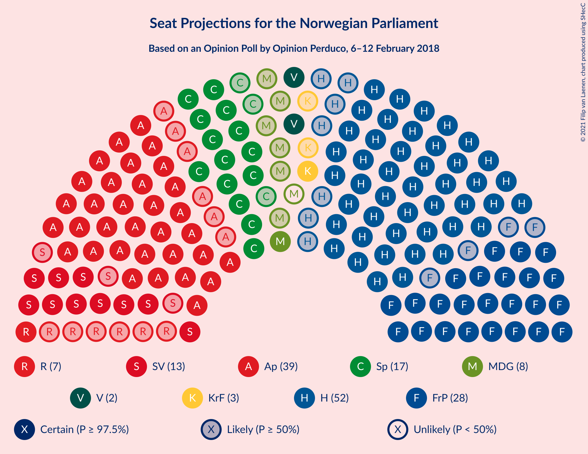

### Confidence Intervals

| Party | Last Result | Median | 80% Confidence Interval | 90% Confidence Interval | 95% Confidence Interval | 99% Confidence Interval |
|:-----:|:-----------:|:------:|:-----------------------:|:-----------------------:|:-----------------------:|:-----------------------:|
| <a href="#høyre">Høyre</a> | 45 | 52 | 48–56 |47–57 |45–59 |43–60 |
| <a href="#arbeiderpartiet">Arbeiderpartiet</a> | 49 | 39 | 35–42 |34–43 |33–44 |31–46 |
| <a href="#fremskrittspartiet">Fremskrittspartiet</a> | 27 | 28 | 25–32 |25–34 |24–34 |22–36 |
| <a href="#senterpartiet">Senterpartiet</a> | 19 | 17 | 16–20 |15–21 |14–22 |12–24 |
| <a href="#sosialistisk-venstreparti">Sosialistisk Venstreparti</a> | 11 | 13 | 11–15 |10–16 |10–17 |9–18 |
| <a href="#rødt">Rødt</a> | 1 | 7 | 2–9 |1–9 |1–10 |1–11 |
| <a href="#miljøpartiet-de-grønne">Miljøpartiet De Grønne</a> | 1 | 7 | 2–9 |1–10 |1–10 |1–11 |
| <a href="#venstre">Venstre</a> | 8 | 2 | 2–8 |2–9 |2–10 |1–11 |
| <a href="#kristelig-folkeparti">Kristelig Folkeparti</a> | 8 | 3 | 1–8 |1–8 |1–9 |0–10 |

### Høyre

*For a full overview of the results for this party, see the [Høyre](party-høyre.html) page.*

| Number of Seats | Probability | Accumulated | Special Marks |
|:---------------:|:-----------:|:-----------:|:-------------:|
| 41 | 0% | 100% |  |
| 42 | 0.3% | 99.9% |  |
| 43 | 0.6% | 99.6% |  |
| 44 | 0.5% | 99.0% |  |
| 45 | 1.2% | 98.5% | Last Result |
| 46 | 2% | 97% |  |
| 47 | 2% | 95% |  |
| 48 | 4% | 93% |  |
| 49 | 10% | 89% |  |
| 50 | 16% | 78% |  |
| 51 | 10% | 63% |  |
| 52 | 12% | 52% | Median |
| 53 | 18% | 41% |  |
| 54 | 7% | 23% |  |
| 55 | 5% | 17% |  |
| 56 | 4% | 11% |  |
| 57 | 3% | 8% |  |
| 58 | 2% | 5% |  |
| 59 | 2% | 3% |  |
| 60 | 1.1% | 2% |  |
| 61 | 0.2% | 0.5% |  |
| 62 | 0.1% | 0.3% |  |
| 63 | 0.1% | 0.2% |  |
| 64 | 0.1% | 0.1% |  |
| 65 | 0% | 0% |  |

### Arbeiderpartiet

*For a full overview of the results for this party, see the [Arbeiderpartiet](party-arbeiderpartiet.html) page.*

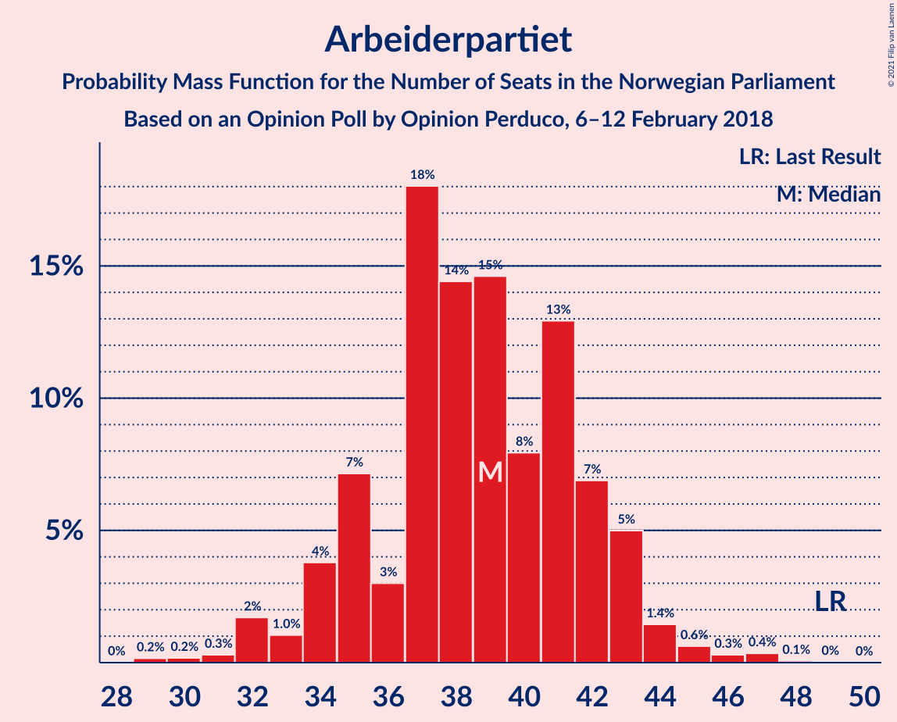

| Number of Seats | Probability | Accumulated | Special Marks |
|:---------------:|:-----------:|:-----------:|:-------------:|
| 29 | 0.2% | 100% |  |
| 30 | 0.2% | 99.8% |  |
| 31 | 0.3% | 99.6% |  |
| 32 | 2% | 99.3% |  |
| 33 | 1.0% | 98% |  |
| 34 | 4% | 97% |  |
| 35 | 7% | 93% |  |
| 36 | 3% | 86% |  |
| 37 | 18% | 83% |  |
| 38 | 14% | 65% |  |
| 39 | 15% | 50% | Median |
| 40 | 8% | 36% |  |
| 41 | 13% | 28% |  |
| 42 | 7% | 15% |  |
| 43 | 5% | 8% |  |
| 44 | 1.4% | 3% |  |
| 45 | 0.6% | 1.4% |  |
| 46 | 0.3% | 0.8% |  |
| 47 | 0.4% | 0.5% |  |
| 48 | 0.1% | 0.1% |  |
| 49 | 0% | 0% | Last Result |

### Fremskrittspartiet

*For a full overview of the results for this party, see the [Fremskrittspartiet](party-fremskrittspartiet.html) page.*

| Number of Seats | Probability | Accumulated | Special Marks |
|:---------------:|:-----------:|:-----------:|:-------------:|
| 20 | 0.1% | 100% |  |
| 21 | 0.3% | 99.9% |  |
| 22 | 0.4% | 99.6% |  |
| 23 | 2% | 99.2% |  |
| 24 | 2% | 98% |  |
| 25 | 10% | 95% |  |
| 26 | 12% | 86% |  |
| 27 | 16% | 74% | Last Result |
| 28 | 11% | 58% | Median |
| 29 | 9% | 47% |  |
| 30 | 10% | 38% |  |
| 31 | 16% | 28% |  |
| 32 | 4% | 13% |  |
| 33 | 3% | 9% |  |
| 34 | 4% | 6% |  |
| 35 | 1.3% | 2% |  |
| 36 | 0.3% | 0.6% |  |
| 37 | 0.2% | 0.2% |  |
| 38 | 0% | 0% |  |

### Senterpartiet

*For a full overview of the results for this party, see the [Senterpartiet](party-senterpartiet.html) page.*

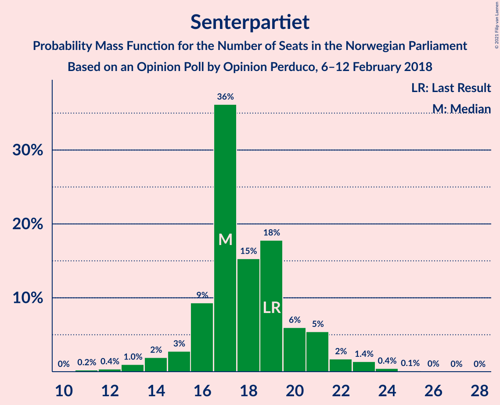

| Number of Seats | Probability | Accumulated | Special Marks |
|:---------------:|:-----------:|:-----------:|:-------------:|
| 11 | 0.2% | 100% |  |
| 12 | 0.4% | 99.8% |  |
| 13 | 1.0% | 99.4% |  |
| 14 | 2% | 98% |  |
| 15 | 3% | 96% |  |
| 16 | 9% | 94% |  |
| 17 | 36% | 84% | Median |
| 18 | 15% | 48% |  |
| 19 | 18% | 33% | Last Result |
| 20 | 6% | 15% |  |
| 21 | 5% | 9% |  |
| 22 | 2% | 4% |  |
| 23 | 1.4% | 2% |  |
| 24 | 0.4% | 0.6% |  |
| 25 | 0.1% | 0.2% |  |
| 26 | 0% | 0.1% |  |
| 27 | 0% | 0% |  |

### Sosialistisk Venstreparti

*For a full overview of the results for this party, see the [Sosialistisk Venstreparti](party-sosialistiskvenstreparti.html) page.*

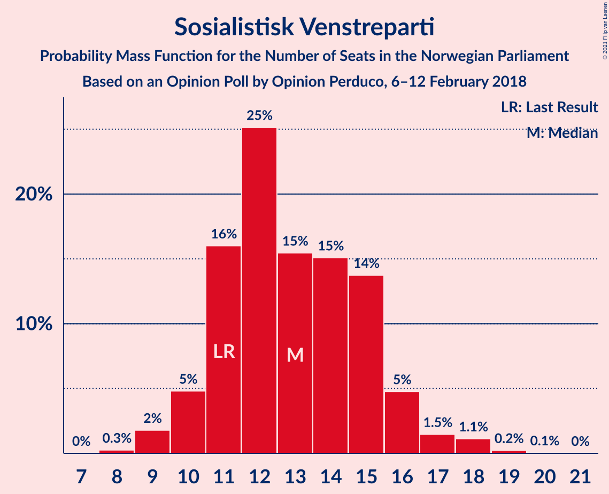

| Number of Seats | Probability | Accumulated | Special Marks |
|:---------------:|:-----------:|:-----------:|:-------------:|
| 8 | 0.3% | 100% |  |
| 9 | 2% | 99.7% |  |
| 10 | 5% | 98% |  |
| 11 | 16% | 93% | Last Result |
| 12 | 25% | 77% |  |
| 13 | 15% | 52% | Median |
| 14 | 15% | 37% |  |
| 15 | 14% | 21% |  |
| 16 | 5% | 8% |  |
| 17 | 1.5% | 3% |  |
| 18 | 1.1% | 1.4% |  |
| 19 | 0.2% | 0.3% |  |
| 20 | 0.1% | 0.1% |  |
| 21 | 0% | 0% |  |

### Rødt

*For a full overview of the results for this party, see the [Rødt](party-rødt.html) page.*

| Number of Seats | Probability | Accumulated | Special Marks |
|:---------------:|:-----------:|:-----------:|:-------------:|
| 1 | 7% | 100% | Last Result |
| 2 | 35% | 93% |  |
| 3 | 0% | 58% |  |
| 4 | 0% | 58% |  |
| 5 | 0% | 58% |  |
| 6 | 4% | 58% |  |
| 7 | 17% | 55% | Median |
| 8 | 18% | 38% |  |
| 9 | 15% | 20% |  |
| 10 | 4% | 5% |  |
| 11 | 0.8% | 1.1% |  |
| 12 | 0.2% | 0.3% |  |
| 13 | 0% | 0% |  |

### Miljøpartiet De Grønne

*For a full overview of the results for this party, see the [Miljøpartiet De Grønne](party-miljøpartietdegrønne.html) page.*

| Number of Seats | Probability | Accumulated | Special Marks |
|:---------------:|:-----------:|:-----------:|:-------------:|
| 1 | 9% | 100% | Last Result |
| 2 | 35% | 91% |  |
| 3 | 3% | 56% |  |
| 4 | 0% | 53% |  |
| 5 | 0% | 53% |  |
| 6 | 0.2% | 53% |  |
| 7 | 10% | 53% | Median |
| 8 | 26% | 42% |  |
| 9 | 11% | 16% |  |
| 10 | 5% | 6% |  |
| 11 | 0.9% | 1.1% |  |
| 12 | 0.2% | 0.2% |  |
| 13 | 0% | 0% |  |

### Venstre

*For a full overview of the results for this party, see the [Venstre](party-venstre.html) page.*

| Number of Seats | Probability | Accumulated | Special Marks |
|:---------------:|:-----------:|:-----------:|:-------------:|
| 1 | 1.0% | 100% |  |
| 2 | 56% | 98.9% | Median |
| 3 | 2% | 43% |  |
| 4 | 0% | 41% |  |
| 5 | 0% | 41% |  |
| 6 | 0.9% | 41% |  |
| 7 | 11% | 40% |  |
| 8 | 20% | 29% | Last Result |
| 9 | 6% | 9% |  |
| 10 | 2% | 3% |  |
| 11 | 0.4% | 0.5% |  |
| 12 | 0.1% | 0.1% |  |
| 13 | 0% | 0% |  |

### Kristelig Folkeparti

*For a full overview of the results for this party, see the [Kristelig Folkeparti](party-kristeligfolkeparti.html) page.*

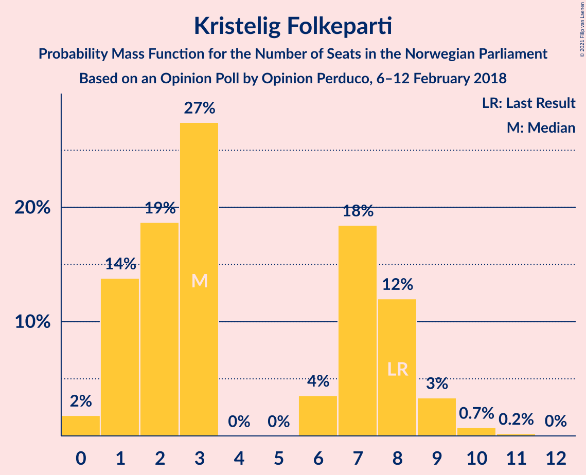

| Number of Seats | Probability | Accumulated | Special Marks |
|:---------------:|:-----------:|:-----------:|:-------------:|
| 0 | 2% | 100% |  |
| 1 | 14% | 98% |  |
| 2 | 19% | 84% |  |
| 3 | 27% | 66% | Median |
| 4 | 0% | 38% |  |
| 5 | 0% | 38% |  |
| 6 | 4% | 38% |  |
| 7 | 18% | 35% |  |
| 8 | 12% | 16% | Last Result |
| 9 | 3% | 4% |  |
| 10 | 0.7% | 1.0% |  |
| 11 | 0.2% | 0.2% |  |
| 12 | 0% | 0% |  |

## Coalitions

### Confidence Intervals

| Coalition | Last Result | Median | Majority? | 80% Confidence Interval | 90% Confidence Interval | 95% Confidence Interval | 99% Confidence Interval |
|:---------:|:-----------:|:------:|:---------:|:-----------------------:|:-----------------------:|:-----------------------:|:-----------------------:|
| Høyre – Fremskrittspartiet – Senterpartiet – Venstre – Kristelig Folkeparti | 107 | 106 | 100% | 101–112 | 100–114 | 98–116 | 96–118 |
| Høyre – Fremskrittspartiet – Miljøpartiet De Grønne – Venstre – Kristelig Folkeparti | 89 | 95 | 98.9% | 89–99 | 88–101 | 86–102 | 83–105 |
| Høyre – Fremskrittspartiet – Venstre – Kristelig Folkeparti | 88 | 89 | 82% | 84–95 | 82–97 | 81–97 | 78–100 |
| Høyre – Fremskrittspartiet – Venstre | 80 | 84 | 47% | 80–91 | 79–92 | 77–94 | 74–97 |
| Arbeiderpartiet – Senterpartiet – Sosialistisk Venstreparti – Miljøpartiet De Grønne – Rødt | 81 | 80 | 18% | 74–85 | 72–87 | 72–88 | 69–91 |
| Høyre – Fremskrittspartiet | 72 | 80 | 13% | 75–85 | 73–86 | 72–88 | 70–91 |
| Arbeiderpartiet – Senterpartiet – Sosialistisk Venstreparti – Miljøpartiet De Grønne – Kristelig Folkeparti | 88 | 79 | 8% | 74–83 | 72–86 | 69–88 | 67–91 |
| Arbeiderpartiet – Senterpartiet – Sosialistisk Venstreparti – Miljøpartiet De Grønne | 80 | 74 | 0.9% | 69–80 | 67–81 | 67–83 | 64–86 |
| Arbeiderpartiet – Senterpartiet – Sosialistisk Venstreparti – Rødt | 80 | 74 | 1.1% | 70–80 | 68–81 | 67–83 | 64–86 |
| Arbeiderpartiet – Senterpartiet – Sosialistisk Venstreparti | 79 | 69 | 0% | 65–73 | 64–76 | 63–76 | 60–80 |
| Arbeiderpartiet – Senterpartiet – Miljøpartiet De Grønne – Kristelig Folkeparti | 77 | 66 | 0% | 60–71 | 58–73 | 57–74 | 55–77 |
| Arbeiderpartiet – Senterpartiet – Kristelig Folkeparti | 76 | 61 | 0% | 56–65 | 55–67 | 53–69 | 51–72 |
| Høyre – Venstre – Kristelig Folkeparti | 61 | 60 | 0% | 55–66 | 54–68 | 53–69 | 51–71 |
| Arbeiderpartiet – Senterpartiet | 68 | 57 | 0% | 53–61 | 51–62 | 50–63 | 48–65 |
| Arbeiderpartiet – Sosialistisk Venstreparti | 60 | 52 | 0% | 48–56 | 47–57 | 45–58 | 43–60 |
| Senterpartiet – Venstre – Kristelig Folkeparti | 35 | 27 | 0% | 21–32 | 21–34 | 20–34 | 17–37 |

### Høyre – Fremskrittspartiet – Senterpartiet – Venstre – Kristelig Folkeparti

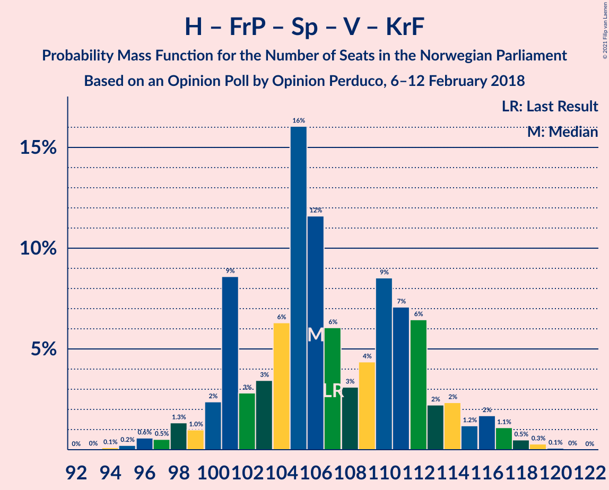

| Number of Seats | Probability | Accumulated | Special Marks |
|:---------------:|:-----------:|:-----------:|:-------------:|
| 94 | 0.1% | 100% |  |
| 95 | 0.2% | 99.9% |  |
| 96 | 0.6% | 99.6% |  |
| 97 | 0.5% | 99.1% |  |
| 98 | 1.3% | 98.5% |  |
| 99 | 1.0% | 97% |  |
| 100 | 2% | 96% |  |
| 101 | 9% | 94% |  |
| 102 | 3% | 85% | Median |
| 103 | 3% | 82% |  |
| 104 | 6% | 79% |  |
| 105 | 16% | 73% |  |
| 106 | 12% | 57% |  |
| 107 | 6% | 45% | Last Result |
| 108 | 3% | 39% |  |
| 109 | 4% | 36% |  |
| 110 | 9% | 32% |  |
| 111 | 7% | 23% |  |
| 112 | 6% | 16% |  |
| 113 | 2% | 9% |  |
| 114 | 2% | 7% |  |
| 115 | 1.2% | 5% |  |
| 116 | 2% | 4% |  |
| 117 | 1.1% | 2% |  |
| 118 | 0.5% | 0.9% |  |
| 119 | 0.3% | 0.4% |  |
| 120 | 0.1% | 0.1% |  |
| 121 | 0% | 0.1% |  |
| 122 | 0% | 0% |  |

### Høyre – Fremskrittspartiet – Miljøpartiet De Grønne – Venstre – Kristelig Folkeparti

| Number of Seats | Probability | Accumulated | Special Marks |
|:---------------:|:-----------:|:-----------:|:-------------:|
| 81 | 0.1% | 100% |  |
| 82 | 0.2% | 99.9% |  |
| 83 | 0.2% | 99.7% |  |
| 84 | 0.6% | 99.5% |  |
| 85 | 0.5% | 98.9% | Majority |
| 86 | 1.2% | 98% |  |
| 87 | 2% | 97% |  |
| 88 | 2% | 95% |  |
| 89 | 8% | 94% | Last Result |
| 90 | 5% | 86% |  |
| 91 | 8% | 81% |  |
| 92 | 10% | 73% | Median |
| 93 | 4% | 63% |  |
| 94 | 4% | 59% |  |
| 95 | 14% | 55% |  |
| 96 | 10% | 41% |  |
| 97 | 14% | 31% |  |
| 98 | 5% | 17% |  |
| 99 | 6% | 13% |  |
| 100 | 1.4% | 7% |  |
| 101 | 2% | 5% |  |
| 102 | 1.0% | 3% |  |
| 103 | 1.3% | 2% |  |
| 104 | 0.2% | 0.7% |  |
| 105 | 0.3% | 0.5% |  |
| 106 | 0.1% | 0.2% |  |
| 107 | 0.1% | 0.1% |  |
| 108 | 0% | 0% |  |

### Høyre – Fremskrittspartiet – Venstre – Kristelig Folkeparti

| Number of Seats | Probability | Accumulated | Special Marks |
|:---------------:|:-----------:|:-----------:|:-------------:|
| 76 | 0.1% | 100% |  |
| 77 | 0.2% | 99.9% |  |
| 78 | 0.3% | 99.7% |  |
| 79 | 0.8% | 99.4% |  |
| 80 | 0.6% | 98.7% |  |
| 81 | 1.0% | 98% |  |
| 82 | 2% | 97% |  |
| 83 | 4% | 95% |  |
| 84 | 8% | 90% |  |
| 85 | 2% | 82% | Median, Majority |
| 86 | 6% | 80% |  |
| 87 | 12% | 74% |  |
| 88 | 7% | 61% | Last Result |
| 89 | 17% | 55% |  |
| 90 | 5% | 38% |  |
| 91 | 3% | 32% |  |
| 92 | 7% | 29% |  |
| 93 | 7% | 22% |  |
| 94 | 3% | 15% |  |
| 95 | 5% | 12% |  |
| 96 | 2% | 7% |  |
| 97 | 3% | 5% |  |
| 98 | 0.3% | 2% |  |
| 99 | 0.8% | 1.4% |  |
| 100 | 0.1% | 0.6% |  |
| 101 | 0.3% | 0.5% |  |
| 102 | 0.1% | 0.2% |  |
| 103 | 0% | 0.1% |  |
| 104 | 0% | 0% |  |

### Høyre – Fremskrittspartiet – Venstre

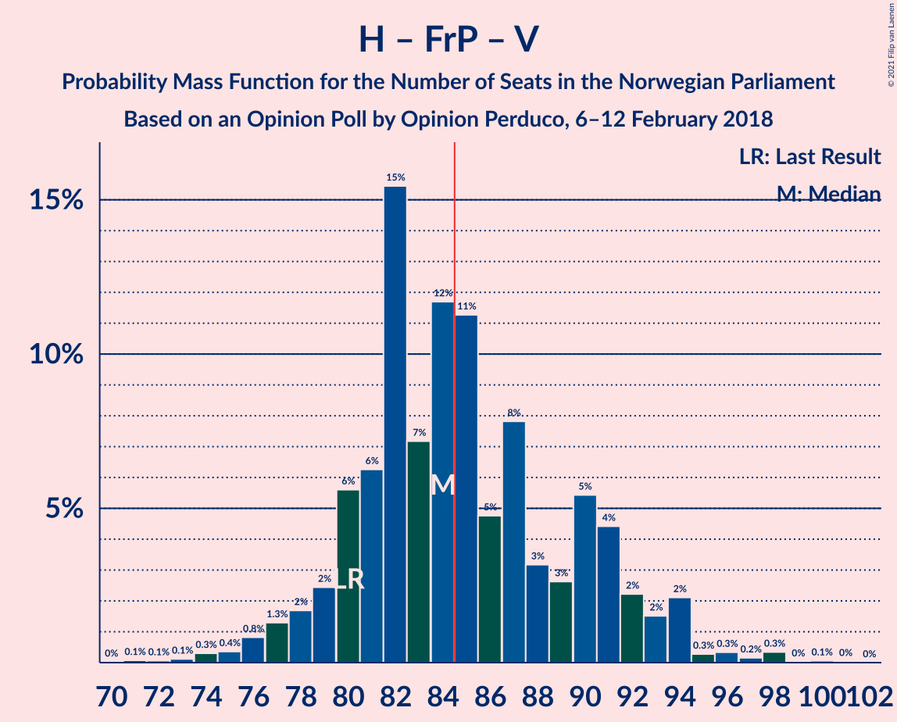

| Number of Seats | Probability | Accumulated | Special Marks |
|:---------------:|:-----------:|:-----------:|:-------------:|
| 71 | 0.1% | 100% |  |
| 72 | 0.1% | 99.9% |  |
| 73 | 0.1% | 99.8% |  |
| 74 | 0.3% | 99.7% |  |
| 75 | 0.4% | 99.4% |  |
| 76 | 0.8% | 99.1% |  |
| 77 | 1.3% | 98% |  |
| 78 | 2% | 97% |  |
| 79 | 2% | 95% |  |
| 80 | 6% | 93% | Last Result |
| 81 | 6% | 87% |  |
| 82 | 15% | 81% | Median |
| 83 | 7% | 65% |  |
| 84 | 12% | 58% |  |
| 85 | 11% | 47% | Majority |
| 86 | 5% | 35% |  |
| 87 | 8% | 31% |  |
| 88 | 3% | 23% |  |
| 89 | 3% | 20% |  |
| 90 | 5% | 17% |  |
| 91 | 4% | 12% |  |
| 92 | 2% | 7% |  |
| 93 | 2% | 5% |  |
| 94 | 2% | 3% |  |
| 95 | 0.3% | 1.2% |  |
| 96 | 0.3% | 1.0% |  |
| 97 | 0.2% | 0.6% |  |
| 98 | 0.3% | 0.5% |  |
| 99 | 0% | 0.1% |  |
| 100 | 0.1% | 0.1% |  |
| 101 | 0% | 0% |  |

### Arbeiderpartiet – Senterpartiet – Sosialistisk Venstreparti – Miljøpartiet De Grønne – Rødt

| Number of Seats | Probability | Accumulated | Special Marks |
|:---------------:|:-----------:|:-----------:|:-------------:|
| 66 | 0% | 100% |  |
| 67 | 0.1% | 99.9% |  |
| 68 | 0.3% | 99.8% |  |
| 69 | 0.1% | 99.5% |  |
| 70 | 0.8% | 99.4% |  |
| 71 | 0.3% | 98.6% |  |
| 72 | 3% | 98% |  |
| 73 | 2% | 95% |  |
| 74 | 5% | 93% |  |
| 75 | 3% | 88% |  |
| 76 | 7% | 85% |  |
| 77 | 7% | 78% |  |
| 78 | 3% | 71% |  |
| 79 | 5% | 68% |  |
| 80 | 17% | 62% |  |
| 81 | 7% | 45% | Last Result |
| 82 | 12% | 39% |  |
| 83 | 6% | 26% | Median |
| 84 | 2% | 20% |  |
| 85 | 8% | 18% | Majority |
| 86 | 4% | 10% |  |
| 87 | 2% | 5% |  |
| 88 | 1.0% | 3% |  |
| 89 | 0.6% | 2% |  |
| 90 | 0.8% | 1.3% |  |
| 91 | 0.3% | 0.6% |  |
| 92 | 0.2% | 0.3% |  |
| 93 | 0.1% | 0.1% |  |
| 94 | 0% | 0% |  |

### Høyre – Fremskrittspartiet

| Number of Seats | Probability | Accumulated | Special Marks |
|:---------------:|:-----------:|:-----------:|:-------------:|
| 68 | 0.1% | 100% |  |
| 69 | 0.2% | 99.9% |  |
| 70 | 0.5% | 99.7% |  |
| 71 | 0.7% | 99.2% |  |
| 72 | 2% | 98% | Last Result |
| 73 | 2% | 97% |  |
| 74 | 2% | 95% |  |
| 75 | 6% | 92% |  |
| 76 | 3% | 87% |  |
| 77 | 6% | 84% |  |
| 78 | 9% | 78% |  |
| 79 | 5% | 69% |  |
| 80 | 18% | 64% | Median |
| 81 | 4% | 46% |  |
| 82 | 13% | 41% |  |
| 83 | 10% | 28% |  |
| 84 | 5% | 18% |  |
| 85 | 5% | 13% | Majority |
| 86 | 3% | 7% |  |
| 87 | 2% | 5% |  |
| 88 | 0.6% | 3% |  |
| 89 | 1.0% | 2% |  |
| 90 | 0.5% | 1.0% |  |
| 91 | 0.2% | 0.5% |  |
| 92 | 0.1% | 0.4% |  |
| 93 | 0.1% | 0.2% |  |
| 94 | 0% | 0.2% |  |
| 95 | 0% | 0.1% |  |
| 96 | 0% | 0.1% |  |
| 97 | 0% | 0.1% |  |
| 98 | 0% | 0.1% |  |
| 99 | 0% | 0% |  |

### Arbeiderpartiet – Senterpartiet – Sosialistisk Venstreparti – Miljøpartiet De Grønne – Kristelig Folkeparti

| Number of Seats | Probability | Accumulated | Special Marks |
|:---------------:|:-----------:|:-----------:|:-------------:|
| 65 | 0% | 100% |  |
| 66 | 0.1% | 99.9% |  |
| 67 | 0.4% | 99.8% |  |
| 68 | 2% | 99.4% |  |
| 69 | 0.9% | 98% |  |
| 70 | 0.6% | 97% |  |
| 71 | 0.9% | 96% |  |
| 72 | 0.5% | 95% |  |
| 73 | 3% | 95% |  |
| 74 | 3% | 92% |  |
| 75 | 6% | 89% |  |
| 76 | 14% | 83% |  |
| 77 | 8% | 69% |  |
| 78 | 4% | 62% |  |
| 79 | 11% | 57% | Median |
| 80 | 16% | 46% |  |
| 81 | 9% | 30% |  |
| 82 | 6% | 21% |  |
| 83 | 6% | 15% |  |
| 84 | 1.4% | 9% |  |
| 85 | 2% | 8% | Majority |
| 86 | 2% | 6% |  |
| 87 | 1.2% | 4% |  |
| 88 | 0.7% | 3% | Last Result |
| 89 | 0.8% | 2% |  |
| 90 | 0.7% | 1.3% |  |
| 91 | 0.3% | 0.5% |  |
| 92 | 0.2% | 0.2% |  |
| 93 | 0% | 0.1% |  |
| 94 | 0% | 0% |  |

### Arbeiderpartiet – Senterpartiet – Sosialistisk Venstreparti – Miljøpartiet De Grønne

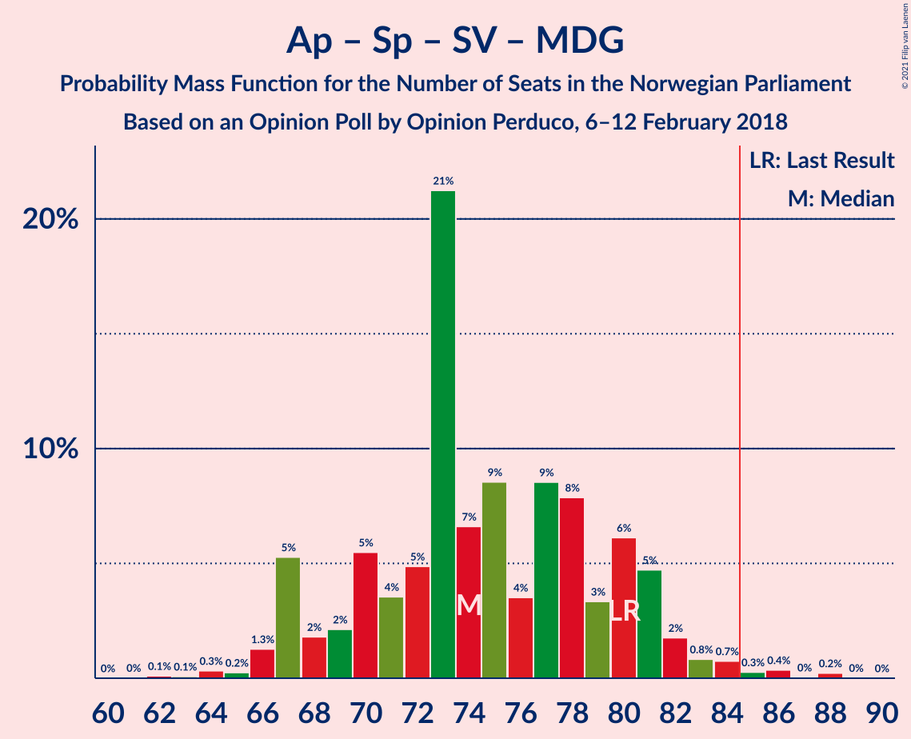

| Number of Seats | Probability | Accumulated | Special Marks |
|:---------------:|:-----------:|:-----------:|:-------------:|
| 62 | 0.1% | 100% |  |
| 63 | 0.1% | 99.9% |  |
| 64 | 0.3% | 99.8% |  |
| 65 | 0.2% | 99.4% |  |
| 66 | 1.3% | 99.2% |  |
| 67 | 5% | 98% |  |
| 68 | 2% | 93% |  |
| 69 | 2% | 91% |  |
| 70 | 5% | 89% |  |
| 71 | 4% | 83% |  |
| 72 | 5% | 80% |  |
| 73 | 21% | 75% |  |
| 74 | 7% | 54% |  |
| 75 | 9% | 47% |  |
| 76 | 4% | 38% | Median |
| 77 | 9% | 35% |  |
| 78 | 8% | 26% |  |
| 79 | 3% | 18% |  |
| 80 | 6% | 15% | Last Result |
| 81 | 5% | 9% |  |
| 82 | 2% | 4% |  |
| 83 | 0.8% | 3% |  |
| 84 | 0.7% | 2% |  |
| 85 | 0.3% | 0.9% | Majority |
| 86 | 0.4% | 0.7% |  |
| 87 | 0% | 0.3% |  |
| 88 | 0.2% | 0.3% |  |
| 89 | 0% | 0% |  |

### Arbeiderpartiet – Senterpartiet – Sosialistisk Venstreparti – Rødt

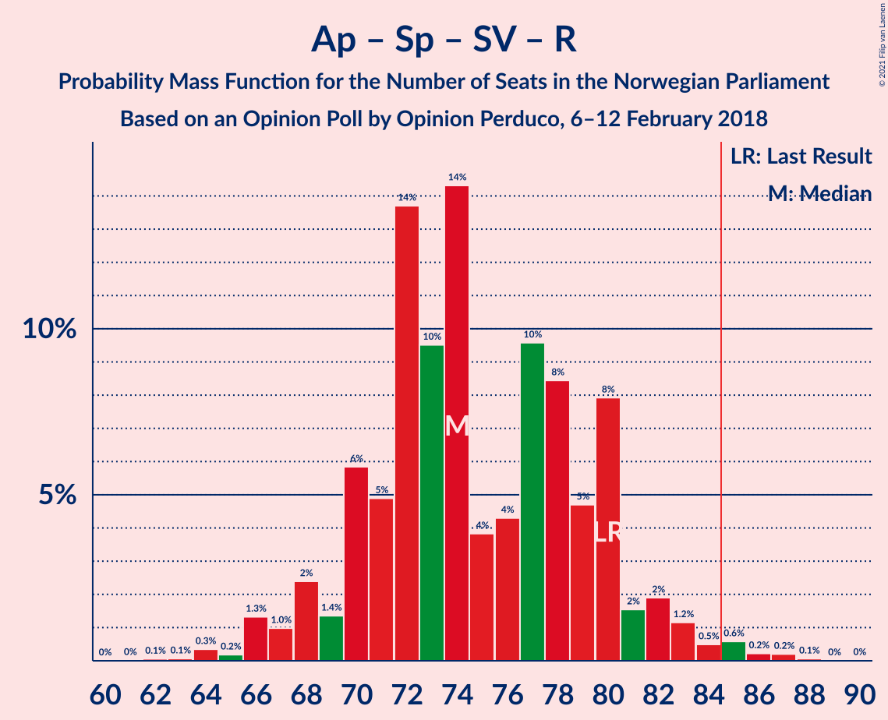

| Number of Seats | Probability | Accumulated | Special Marks |
|:---------------:|:-----------:|:-----------:|:-------------:|
| 62 | 0.1% | 100% |  |
| 63 | 0.1% | 99.9% |  |
| 64 | 0.3% | 99.8% |  |
| 65 | 0.2% | 99.5% |  |
| 66 | 1.3% | 99.3% |  |
| 67 | 1.0% | 98% |  |
| 68 | 2% | 97% |  |
| 69 | 1.4% | 95% |  |
| 70 | 6% | 93% |  |
| 71 | 5% | 87% |  |
| 72 | 14% | 83% |  |
| 73 | 10% | 69% |  |
| 74 | 14% | 59% |  |
| 75 | 4% | 45% |  |
| 76 | 4% | 41% | Median |
| 77 | 10% | 37% |  |
| 78 | 8% | 27% |  |
| 79 | 5% | 19% |  |
| 80 | 8% | 14% | Last Result |
| 81 | 2% | 6% |  |
| 82 | 2% | 5% |  |
| 83 | 1.2% | 3% |  |
| 84 | 0.5% | 2% |  |
| 85 | 0.6% | 1.1% | Majority |
| 86 | 0.2% | 0.5% |  |
| 87 | 0.2% | 0.3% |  |
| 88 | 0.1% | 0.1% |  |
| 89 | 0% | 0% |  |

### Arbeiderpartiet – Senterpartiet – Sosialistisk Venstreparti

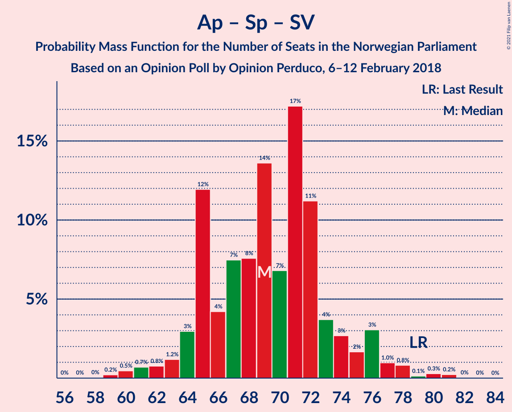

| Number of Seats | Probability | Accumulated | Special Marks |
|:---------------:|:-----------:|:-----------:|:-------------:|
| 57 | 0% | 100% |  |
| 58 | 0% | 99.9% |  |
| 59 | 0.2% | 99.9% |  |
| 60 | 0.5% | 99.7% |  |
| 61 | 0.7% | 99.2% |  |
| 62 | 0.8% | 98.5% |  |
| 63 | 1.2% | 98% |  |
| 64 | 3% | 97% |  |
| 65 | 12% | 94% |  |
| 66 | 4% | 82% |  |
| 67 | 7% | 77% |  |
| 68 | 8% | 70% |  |
| 69 | 14% | 62% | Median |
| 70 | 7% | 49% |  |
| 71 | 17% | 42% |  |
| 72 | 11% | 25% |  |
| 73 | 4% | 14% |  |
| 74 | 3% | 10% |  |
| 75 | 2% | 7% |  |
| 76 | 3% | 6% |  |
| 77 | 1.0% | 2% |  |
| 78 | 0.8% | 2% |  |
| 79 | 0.1% | 0.7% | Last Result |
| 80 | 0.3% | 0.6% |  |
| 81 | 0.2% | 0.3% |  |
| 82 | 0% | 0.1% |  |
| 83 | 0% | 0% |  |

### Arbeiderpartiet – Senterpartiet – Miljøpartiet De Grønne – Kristelig Folkeparti

| Number of Seats | Probability | Accumulated | Special Marks |
|:---------------:|:-----------:|:-----------:|:-------------:|
| 52 | 0% | 100% |  |
| 53 | 0% | 99.9% |  |
| 54 | 0.2% | 99.9% |  |
| 55 | 0.4% | 99.7% |  |
| 56 | 1.0% | 99.3% |  |
| 57 | 1.5% | 98% |  |
| 58 | 3% | 97% |  |
| 59 | 2% | 94% |  |
| 60 | 2% | 92% |  |
| 61 | 3% | 90% |  |
| 62 | 9% | 87% |  |
| 63 | 3% | 77% |  |
| 64 | 15% | 74% |  |
| 65 | 5% | 58% |  |
| 66 | 6% | 53% | Median |
| 67 | 7% | 48% |  |
| 68 | 9% | 41% |  |
| 69 | 15% | 32% |  |
| 70 | 5% | 17% |  |
| 71 | 3% | 12% |  |
| 72 | 3% | 8% |  |
| 73 | 2% | 5% |  |
| 74 | 1.0% | 3% |  |
| 75 | 0.7% | 2% |  |
| 76 | 0.7% | 2% |  |
| 77 | 0.4% | 0.8% | Last Result |
| 78 | 0.2% | 0.4% |  |
| 79 | 0.2% | 0.3% |  |
| 80 | 0% | 0% |  |

### Arbeiderpartiet – Senterpartiet – Kristelig Folkeparti

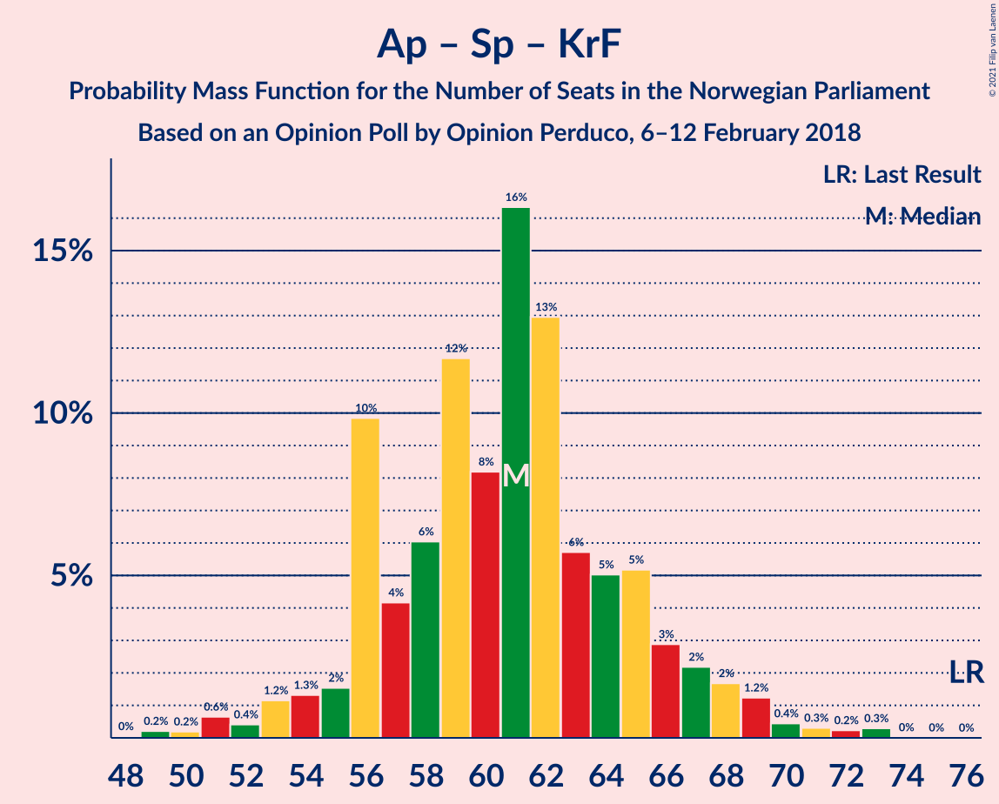

| Number of Seats | Probability | Accumulated | Special Marks |
|:---------------:|:-----------:|:-----------:|:-------------:|
| 48 | 0% | 100% |  |
| 49 | 0.2% | 99.9% |  |
| 50 | 0.2% | 99.7% |  |
| 51 | 0.6% | 99.5% |  |
| 52 | 0.4% | 98.9% |  |
| 53 | 1.2% | 98% |  |
| 54 | 1.3% | 97% |  |
| 55 | 2% | 96% |  |
| 56 | 10% | 94% |  |
| 57 | 4% | 85% |  |
| 58 | 6% | 80% |  |
| 59 | 12% | 74% | Median |
| 60 | 8% | 63% |  |
| 61 | 16% | 55% |  |
| 62 | 13% | 38% |  |
| 63 | 6% | 25% |  |
| 64 | 5% | 20% |  |
| 65 | 5% | 14% |  |
| 66 | 3% | 9% |  |
| 67 | 2% | 6% |  |
| 68 | 2% | 4% |  |
| 69 | 1.2% | 3% |  |
| 70 | 0.4% | 1.3% |  |
| 71 | 0.3% | 0.9% |  |
| 72 | 0.2% | 0.6% |  |
| 73 | 0.3% | 0.3% |  |
| 74 | 0% | 0% |  |
| 75 | 0% | 0% |  |
| 76 | 0% | 0% | Last Result |

### Høyre – Venstre – Kristelig Folkeparti

| Number of Seats | Probability | Accumulated | Special Marks |
|:---------------:|:-----------:|:-----------:|:-------------:|
| 47 | 0% | 100% |  |
| 48 | 0.1% | 99.9% |  |
| 49 | 0.2% | 99.9% |  |
| 50 | 0.1% | 99.7% |  |
| 51 | 0.5% | 99.5% |  |
| 52 | 0.7% | 99.0% |  |
| 53 | 1.1% | 98% |  |
| 54 | 7% | 97% |  |
| 55 | 3% | 90% |  |
| 56 | 7% | 87% |  |
| 57 | 7% | 81% | Median |
| 58 | 8% | 73% |  |
| 59 | 5% | 65% |  |
| 60 | 10% | 60% |  |
| 61 | 5% | 50% | Last Result |
| 62 | 14% | 44% |  |
| 63 | 9% | 31% |  |
| 64 | 9% | 22% |  |
| 65 | 2% | 13% |  |
| 66 | 2% | 11% |  |
| 67 | 2% | 8% |  |
| 68 | 1.5% | 6% |  |
| 69 | 3% | 5% |  |
| 70 | 0.7% | 2% |  |
| 71 | 0.6% | 0.9% |  |
| 72 | 0.1% | 0.3% |  |
| 73 | 0.1% | 0.2% |  |
| 74 | 0% | 0.1% |  |
| 75 | 0% | 0% |  |

### Arbeiderpartiet – Senterpartiet

| Number of Seats | Probability | Accumulated | Special Marks |
|:---------------:|:-----------:|:-----------:|:-------------:|
| 45 | 0.1% | 100% |  |
| 46 | 0.1% | 99.9% |  |
| 47 | 0.2% | 99.8% |  |
| 48 | 0.4% | 99.6% |  |
| 49 | 1.3% | 99.2% |  |
| 50 | 2% | 98% |  |
| 51 | 1.4% | 96% |  |
| 52 | 4% | 95% |  |
| 53 | 4% | 90% |  |
| 54 | 19% | 86% |  |
| 55 | 9% | 68% |  |
| 56 | 6% | 59% | Median |
| 57 | 14% | 53% |  |
| 58 | 12% | 38% |  |
| 59 | 11% | 26% |  |
| 60 | 5% | 15% |  |
| 61 | 5% | 10% |  |
| 62 | 3% | 6% |  |
| 63 | 1.2% | 3% |  |
| 64 | 0.5% | 2% |  |
| 65 | 0.9% | 1.3% |  |
| 66 | 0.1% | 0.4% |  |
| 67 | 0.2% | 0.3% |  |
| 68 | 0% | 0.1% | Last Result |
| 69 | 0% | 0% |  |

### Arbeiderpartiet – Sosialistisk Venstreparti

| Number of Seats | Probability | Accumulated | Special Marks |
|:---------------:|:-----------:|:-----------:|:-------------:|
| 40 | 0% | 100% |  |
| 41 | 0.1% | 99.9% |  |
| 42 | 0.2% | 99.8% |  |
| 43 | 0.2% | 99.7% |  |
| 44 | 0.9% | 99.5% |  |
| 45 | 1.3% | 98.6% |  |
| 46 | 1.2% | 97% |  |
| 47 | 3% | 96% |  |
| 48 | 15% | 93% |  |
| 49 | 8% | 78% |  |
| 50 | 6% | 70% |  |
| 51 | 10% | 65% |  |
| 52 | 16% | 55% | Median |
| 53 | 17% | 38% |  |
| 54 | 4% | 21% |  |
| 55 | 6% | 17% |  |
| 56 | 5% | 11% |  |
| 57 | 2% | 6% |  |
| 58 | 2% | 3% |  |
| 59 | 0.8% | 2% |  |
| 60 | 0.5% | 0.8% | Last Result |
| 61 | 0.1% | 0.3% |  |
| 62 | 0.1% | 0.2% |  |
| 63 | 0.1% | 0.1% |  |
| 64 | 0% | 0% |  |

### Senterpartiet – Venstre – Kristelig Folkeparti

| Number of Seats | Probability | Accumulated | Special Marks |
|:---------------:|:-----------:|:-----------:|:-------------:|
| 16 | 0.1% | 100% |  |
| 17 | 0.5% | 99.9% |  |
| 18 | 0.8% | 99.3% |  |
| 19 | 0.9% | 98.6% |  |
| 20 | 2% | 98% |  |
| 21 | 9% | 96% |  |
| 22 | 5% | 87% | Median |
| 23 | 11% | 82% |  |
| 24 | 3% | 71% |  |
| 25 | 3% | 68% |  |
| 26 | 13% | 65% |  |
| 27 | 16% | 52% |  |
| 28 | 5% | 35% |  |
| 29 | 5% | 31% |  |
| 30 | 9% | 25% |  |
| 31 | 4% | 16% |  |
| 32 | 5% | 12% |  |
| 33 | 1.3% | 7% |  |
| 34 | 3% | 5% |  |
| 35 | 1.1% | 2% | Last Result |
| 36 | 0.7% | 1.3% |  |
| 37 | 0.2% | 0.6% |  |
| 38 | 0.3% | 0.3% |  |
| 39 | 0% | 0.1% |  |
| 40 | 0% | 0% |  |

## Technical Information

### Opinion Poll

+ **Polling firm:** Opinion Perduco
+ **Commissioner(s):** —
+ **Fieldwork period:** 6–12 February 2018

### Calculations

+ **Sample size:** 699
+ **Simulations done:** 1,048,576
+ **Error estimate:** 2.06%

