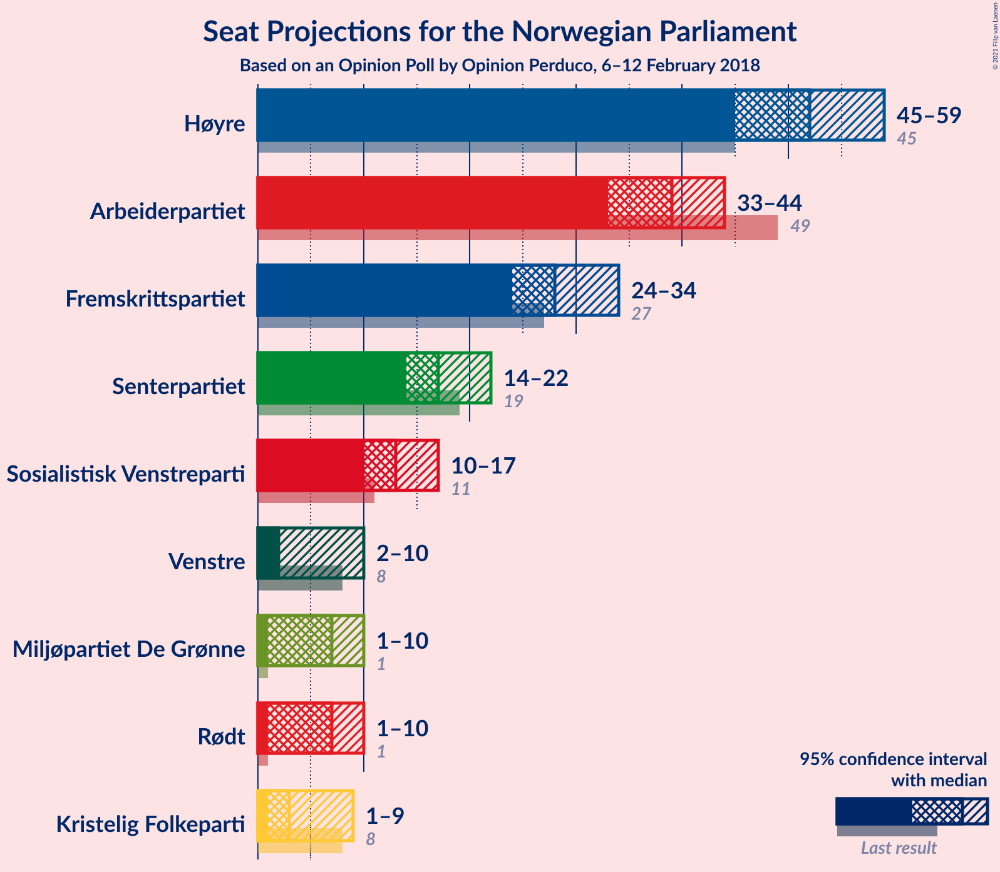
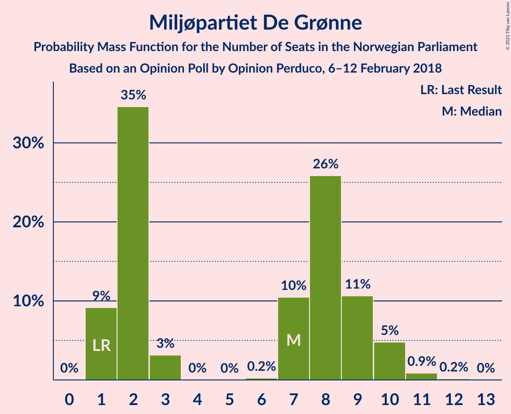
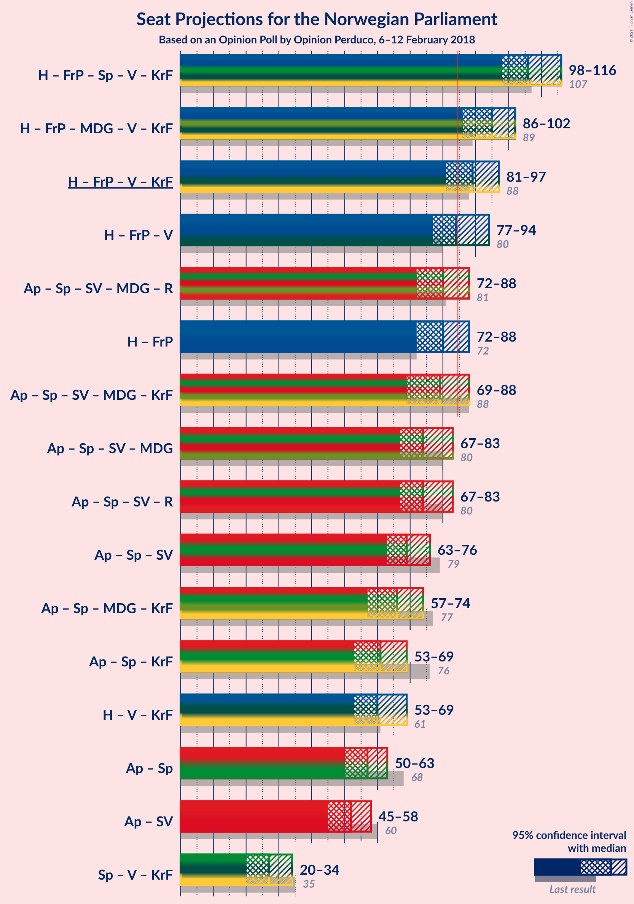
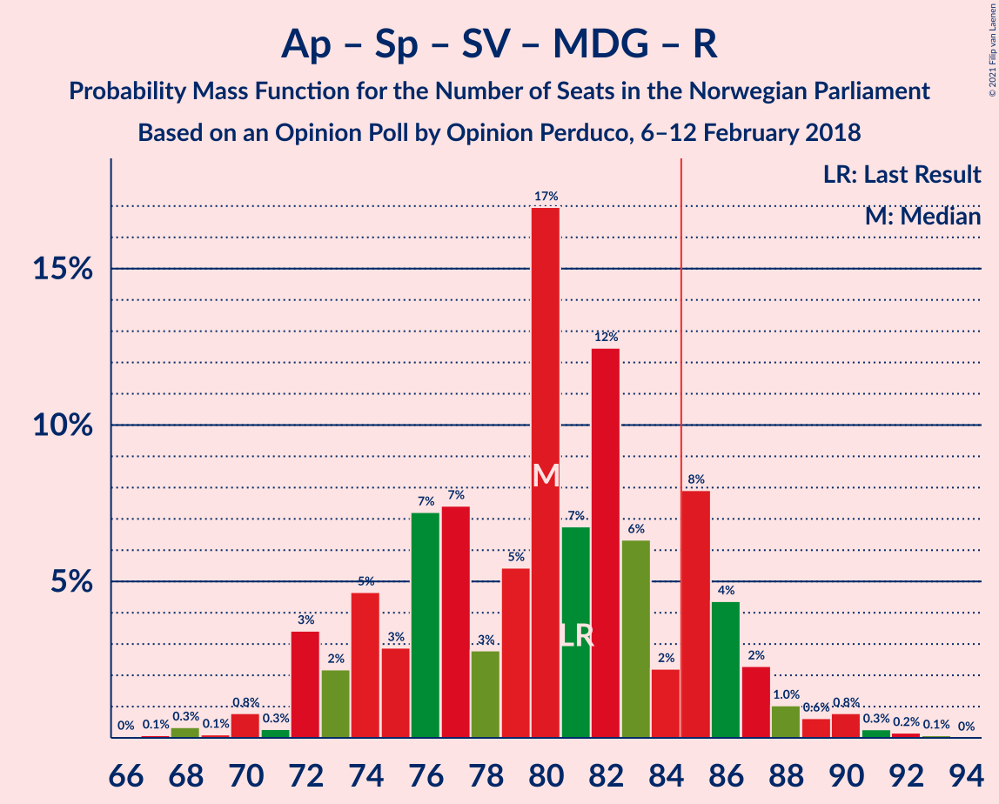
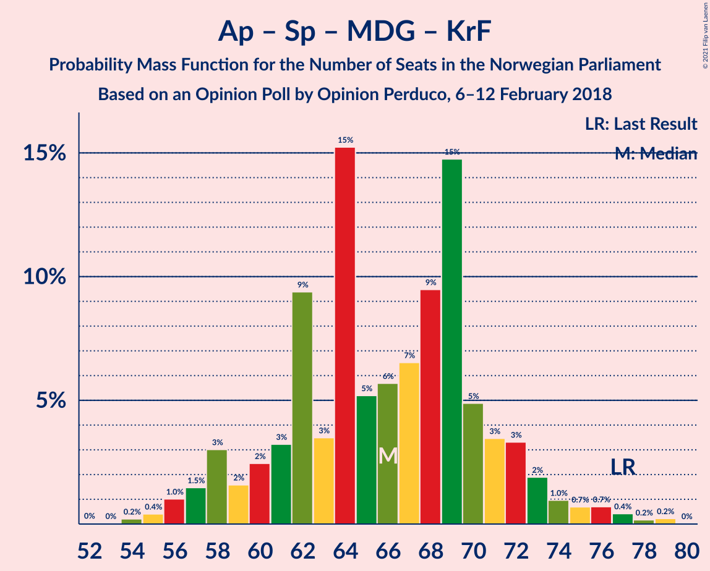

# Opinion Poll by Opinion Perduco, 6–12 February 2018

<a href="#voting-intentions">Voting Intentions</a> | <a href="#seats">Seats</a> | <a href="#coalitions">Coalitions</a> | <a href="#technical-information">Technical Information</a>

## Voting Intentions

### Confidence Intervals

| Party | Last Result | Poll Result | 80% Confidence Interval | 90% Confidence Interval | 95% Confidence Interval | 99% Confidence Interval |
|:-----:|:-----------:|:-----------:|:-----------------------:|:-----------------------:|:-----------------------:|:-----------------------:|
| Høyre | 25.0% | 29.2% | 27.1–31.5% |26.4–32.1% |25.9–32.7% |24.9–33.8% |
| Arbeiderpartiet | 27.4% | 21.3% | 19.4–23.4% |18.9–24.0% |18.4–24.5% |17.6–25.5% |
| Fremskrittspartiet | 15.2% | 15.9% | 14.2–17.8% |13.7–18.3% |13.4–18.8% |12.6–19.7% |
| Senterpartiet | 10.3% | 10.0% | 8.7–11.6% |8.3–12.1% |8.0–12.5% |7.4–13.3% |
| Sosialistisk Venstreparti | 6.0% | 7.3% | 6.2–8.7% |5.9–9.1% |5.6–9.5% |5.1–10.2% |
| Rødt | 2.4% | 4.0% | 3.2–5.1% |3.0–5.5% |2.8–5.7% |2.4–6.3% |
| Miljøpartiet De Grønne | 3.2% | 4.0% | 3.2–5.1% |3.0–5.5% |2.8–5.7% |2.4–6.3% |
| Venstre | 4.4% | 3.9% | 3.1–5.0% |2.9–5.3% |2.7–5.6% |2.3–6.1% |
| Kristelig Folkeparti | 4.2% | 3.6% | 2.8–4.6% |2.6–5.0% |2.4–5.2% |2.1–5.8% |

*Note:* The poll result column reflects the actual value used in the calculations. Published results may vary slightly, and in addition be rounded to fewer digits.

## Seats

### Confidence Intervals

| Party | Last Result | Median | 80% Confidence Interval | 90% Confidence Interval | 95% Confidence Interval | 99% Confidence Interval |
|:-----:|:-----------:|:------:|:-----------------------:|:-----------------------:|:-----------------------:|:-----------------------:|
| <a href="#høyre">Høyre</a> | 45 | 53 | 49–55 |47–58 |45–60 |43–60 |
| <a href="#arbeiderpartiet">Arbeiderpartiet</a> | 49 | 38 | 34–41 |32–42 |32–43 |31–46 |
| <a href="#fremskrittspartiet">Fremskrittspartiet</a> | 27 | 29 | 24–32 |23–33 |23–35 |22–37 |
| <a href="#senterpartiet">Senterpartiet</a> | 19 | 17 | 16–20 |15–21 |14–23 |13–23 |
| <a href="#sosialistisk-venstreparti">Sosialistisk Venstreparti</a> | 11 | 13 | 11–15 |11–16 |10–17 |9–17 |
| <a href="#rødt">Rødt</a> | 1 | 2 | 2–10 |2–10 |1–10 |1–11 |
| <a href="#miljøpartiet-de-grønne">Miljøpartiet De Grønne</a> | 1 | 2 | 1–10 |1–10 |1–10 |1–11 |
| <a href="#venstre">Venstre</a> | 8 | 2 | 2–8 |2–9 |2–10 |1–11 |
| <a href="#kristelig-folkeparti">Kristelig Folkeparti</a> | 8 | 3 | 1–8 |1–8 |1–9 |0–10 |

### Høyre

*For a full overview of the results for this party, see the [Høyre](party-høyre.html) page.*

| Number of Seats | Probability | Accumulated | Special Marks |
|:---------------:|:-----------:|:-----------:|:-------------:|
| 41 | 0.1% | 100% |  |
| 42 | 0.2% | 99.9% |  |
| 43 | 0.4% | 99.8% |  |
| 44 | 0.2% | 99.3% |  |
| 45 | 3% | 99.1% | Last Result |
| 46 | 1.2% | 97% |  |
| 47 | 2% | 95% |  |
| 48 | 3% | 93% |  |
| 49 | 27% | 90% |  |
| 50 | 7% | 63% |  |
| 51 | 2% | 57% |  |
| 52 | 3% | 55% |  |
| 53 | 32% | 52% | Median |
| 54 | 2% | 20% |  |
| 55 | 9% | 18% |  |
| 56 | 1.2% | 10% |  |
| 57 | 1.4% | 9% |  |
| 58 | 3% | 7% |  |
| 59 | 0.8% | 4% |  |
| 60 | 3% | 3% |  |
| 61 | 0% | 0.2% |  |
| 62 | 0% | 0.2% |  |
| 63 | 0.1% | 0.2% |  |
| 64 | 0% | 0.1% |  |
| 65 | 0.1% | 0.1% |  |
| 66 | 0% | 0% |  |

### Arbeiderpartiet

*For a full overview of the results for this party, see the [Arbeiderpartiet](party-arbeiderpartiet.html) page.*

| Number of Seats | Probability | Accumulated | Special Marks |
|:---------------:|:-----------:|:-----------:|:-------------:|
| 29 | 0.2% | 100% |  |
| 30 | 0.1% | 99.8% |  |
| 31 | 0.3% | 99.8% |  |
| 32 | 5% | 99.4% |  |
| 33 | 2% | 94% |  |
| 34 | 11% | 93% |  |
| 35 | 2% | 82% |  |
| 36 | 4% | 79% |  |
| 37 | 2% | 75% |  |
| 38 | 32% | 73% | Median |
| 39 | 4% | 41% |  |
| 40 | 4% | 38% |  |
| 41 | 27% | 34% |  |
| 42 | 3% | 7% |  |
| 43 | 1.2% | 3% |  |
| 44 | 0.9% | 2% |  |
| 45 | 0.4% | 1.2% |  |
| 46 | 0.3% | 0.8% |  |
| 47 | 0.3% | 0.4% |  |
| 48 | 0.1% | 0.1% |  |
| 49 | 0% | 0% | Last Result |

### Fremskrittspartiet

*For a full overview of the results for this party, see the [Fremskrittspartiet](party-fremskrittspartiet.html) page.*

| Number of Seats | Probability | Accumulated | Special Marks |
|:---------------:|:-----------:|:-----------:|:-------------:|
| 20 | 0.1% | 100% |  |
| 21 | 0.1% | 99.8% |  |
| 22 | 0.7% | 99.8% |  |
| 23 | 5% | 99.0% |  |
| 24 | 5% | 94% |  |
| 25 | 5% | 89% |  |
| 26 | 5% | 84% |  |
| 27 | 5% | 79% | Last Result |
| 28 | 11% | 74% |  |
| 29 | 19% | 63% | Median |
| 30 | 8% | 44% |  |
| 31 | 21% | 36% |  |
| 32 | 6% | 15% |  |
| 33 | 7% | 10% |  |
| 34 | 0.4% | 3% |  |
| 35 | 2% | 3% |  |
| 36 | 0.2% | 0.8% |  |
| 37 | 0.6% | 0.7% |  |
| 38 | 0% | 0% |  |

### Senterpartiet

*For a full overview of the results for this party, see the [Senterpartiet](party-senterpartiet.html) page.*

| Number of Seats | Probability | Accumulated | Special Marks |
|:---------------:|:-----------:|:-----------:|:-------------:|
| 11 | 0.3% | 100% |  |
| 12 | 0.2% | 99.7% |  |
| 13 | 0.6% | 99.5% |  |
| 14 | 1.4% | 98.9% |  |
| 15 | 3% | 97% |  |
| 16 | 12% | 94% |  |
| 17 | 34% | 82% | Median |
| 18 | 7% | 48% |  |
| 19 | 23% | 41% | Last Result |
| 20 | 12% | 18% |  |
| 21 | 3% | 6% |  |
| 22 | 0.8% | 4% |  |
| 23 | 2% | 3% |  |
| 24 | 0.3% | 0.5% |  |
| 25 | 0.1% | 0.2% |  |
| 26 | 0% | 0.1% |  |
| 27 | 0% | 0% |  |

### Sosialistisk Venstreparti

*For a full overview of the results for this party, see the [Sosialistisk Venstreparti](party-sosialistiskvenstreparti.html) page.*

| Number of Seats | Probability | Accumulated | Special Marks |
|:---------------:|:-----------:|:-----------:|:-------------:|
| 8 | 0.1% | 100% |  |
| 9 | 2% | 99.9% |  |
| 10 | 1.4% | 98% |  |
| 11 | 12% | 97% | Last Result |
| 12 | 23% | 85% |  |
| 13 | 17% | 62% | Median |
| 14 | 32% | 45% |  |
| 15 | 7% | 14% |  |
| 16 | 3% | 6% |  |
| 17 | 2% | 3% |  |
| 18 | 0.1% | 0.3% |  |
| 19 | 0.1% | 0.1% |  |
| 20 | 0% | 0% |  |

### Rødt

*For a full overview of the results for this party, see the [Rødt](party-rødt.html) page.*

| Number of Seats | Probability | Accumulated | Special Marks |
|:---------------:|:-----------:|:-----------:|:-------------:|
| 1 | 3% | 100% | Last Result |
| 2 | 52% | 97% | Median |
| 3 | 0% | 45% |  |
| 4 | 0% | 45% |  |
| 5 | 0% | 45% |  |
| 6 | 0% | 45% |  |
| 7 | 15% | 45% |  |
| 8 | 9% | 31% |  |
| 9 | 10% | 21% |  |
| 10 | 10% | 11% |  |
| 11 | 0.5% | 0.7% |  |
| 12 | 0.1% | 0.1% |  |
| 13 | 0.1% | 0.1% |  |
| 14 | 0% | 0% |  |

### Miljøpartiet De Grønne

*For a full overview of the results for this party, see the [Miljøpartiet De Grønne](party-miljøpartietdegrønne.html) page.*

| Number of Seats | Probability | Accumulated | Special Marks |
|:---------------:|:-----------:|:-----------:|:-------------:|
| 1 | 15% | 100% | Last Result |
| 2 | 35% | 85% | Median |
| 3 | 0.4% | 50% |  |
| 4 | 0.1% | 50% |  |
| 5 | 0% | 49% |  |
| 6 | 0% | 49% |  |
| 7 | 10% | 49% |  |
| 8 | 12% | 39% |  |
| 9 | 7% | 27% |  |
| 10 | 19% | 19% |  |
| 11 | 0.5% | 0.7% |  |
| 12 | 0.2% | 0.2% |  |
| 13 | 0% | 0% |  |

### Venstre

*For a full overview of the results for this party, see the [Venstre](party-venstre.html) page.*

| Number of Seats | Probability | Accumulated | Special Marks |
|:---------------:|:-----------:|:-----------:|:-------------:|
| 1 | 0.8% | 100% |  |
| 2 | 51% | 99.1% | Median |
| 3 | 0.3% | 48% |  |
| 4 | 0% | 47% |  |
| 5 | 0% | 47% |  |
| 6 | 0.1% | 47% |  |
| 7 | 15% | 47% |  |
| 8 | 25% | 33% | Last Result |
| 9 | 5% | 7% |  |
| 10 | 2% | 3% |  |
| 11 | 0.6% | 0.9% |  |
| 12 | 0.3% | 0.4% |  |
| 13 | 0% | 0% |  |

### Kristelig Folkeparti

*For a full overview of the results for this party, see the [Kristelig Folkeparti](party-kristeligfolkeparti.html) page.*

| Number of Seats | Probability | Accumulated | Special Marks |
|:---------------:|:-----------:|:-----------:|:-------------:|
| 0 | 2% | 100% |  |
| 1 | 14% | 98% |  |
| 2 | 24% | 84% |  |
| 3 | 21% | 60% | Median |
| 4 | 0% | 40% |  |
| 5 | 0% | 40% |  |
| 6 | 0% | 40% |  |
| 7 | 23% | 40% |  |
| 8 | 13% | 16% | Last Result |
| 9 | 2% | 4% |  |
| 10 | 1.2% | 1.5% |  |
| 11 | 0.1% | 0.2% |  |
| 12 | 0.1% | 0.1% |  |
| 13 | 0% | 0% |  |

## Coalitions

### Confidence Intervals

| Coalition | Last Result | Median | Majority? | 80% Confidence Interval | 90% Confidence Interval | 95% Confidence Interval | 99% Confidence Interval |
|:---------:|:-----------:|:------:|:---------:|:-----------------------:|:-----------------------:|:-----------------------:|:-----------------------:|
| Høyre – Fremskrittspartiet – Senterpartiet – Venstre – Kristelig Folkeparti | 107 | 106 | 100% | 101–112 | 98–113 | 98–114 | 96–118 |
| Høyre – Fremskrittspartiet – Miljøpartiet De Grønne – Venstre – Kristelig Folkeparti | 89 | 96 | 99.6% | 87–99 | 87–100 | 86–101 | 85–105 |
| Høyre – Fremskrittspartiet – Venstre – Kristelig Folkeparti | 88 | 90 | 88% | 83–95 | 82–96 | 81–96 | 78–100 |
| Høyre – Fremskrittspartiet – Venstre | 80 | 84 | 48% | 79–92 | 79–94 | 77–94 | 76–96 |
| Høyre – Fremskrittspartiet | 72 | 81 | 19% | 74–86 | 72–86 | 72–89 | 70–91 |
| Arbeiderpartiet – Senterpartiet – Sosialistisk Venstreparti – Miljøpartiet De Grønne – Rødt | 81 | 79 | 12% | 74–86 | 73–87 | 73–88 | 69–91 |
| Arbeiderpartiet – Senterpartiet – Sosialistisk Venstreparti – Miljøpartiet De Grønne – Kristelig Folkeparti | 88 | 79 | 4% | 73–83 | 68–84 | 68–88 | 67–91 |
| Arbeiderpartiet – Senterpartiet – Sosialistisk Venstreparti – Rødt | 80 | 73 | 0.4% | 70–82 | 69–82 | 68–83 | 64–84 |
| Arbeiderpartiet – Senterpartiet – Sosialistisk Venstreparti – Miljøpartiet De Grønne | 80 | 73 | 1.0% | 67–81 | 66–81 | 66–82 | 65–86 |
| Arbeiderpartiet – Senterpartiet – Sosialistisk Venstreparti | 79 | 70 | 0% | 64–73 | 63–75 | 63–75 | 60–80 |
| Arbeiderpartiet – Senterpartiet – Miljøpartiet De Grønne – Kristelig Folkeparti | 77 | 67 | 0% | 58–70 | 57–71 | 57–74 | 55–77 |
| Høyre – Venstre – Kristelig Folkeparti | 61 | 60 | 0% | 57–66 | 55–69 | 52–70 | 51–71 |
| Arbeiderpartiet – Senterpartiet – Kristelig Folkeparti | 76 | 60 | 0% | 56–65 | 56–66 | 53–68 | 52–69 |
| Arbeiderpartiet – Senterpartiet | 68 | 57 | 0% | 50–59 | 49–61 | 49–61 | 49–65 |
| Arbeiderpartiet – Sosialistisk Venstreparti | 60 | 52 | 0% | 47–55 | 47–56 | 46–57 | 43–60 |
| Senterpartiet – Venstre – Kristelig Folkeparti | 35 | 26 | 0% | 23–32 | 21–34 | 20–34 | 18–35 |

### Høyre – Fremskrittspartiet – Senterpartiet – Venstre – Kristelig Folkeparti

| Number of Seats | Probability | Accumulated | Special Marks |
|:---------------:|:-----------:|:-----------:|:-------------:|
| 94 | 0.1% | 100% |  |
| 95 | 0% | 99.9% |  |
| 96 | 0.7% | 99.8% |  |
| 97 | 0.6% | 99.2% |  |
| 98 | 6% | 98.6% |  |
| 99 | 0.5% | 93% |  |
| 100 | 0.3% | 92% |  |
| 101 | 3% | 92% |  |
| 102 | 3% | 89% |  |
| 103 | 2% | 86% |  |
| 104 | 1.2% | 85% | Median |
| 105 | 19% | 83% |  |
| 106 | 15% | 64% |  |
| 107 | 3% | 50% | Last Result |
| 108 | 2% | 47% |  |
| 109 | 1.4% | 45% |  |
| 110 | 4% | 43% |  |
| 111 | 5% | 39% |  |
| 112 | 25% | 34% |  |
| 113 | 7% | 10% |  |
| 114 | 0.3% | 3% |  |
| 115 | 0.7% | 2% |  |
| 116 | 0.1% | 2% |  |
| 117 | 0.2% | 2% |  |
| 118 | 1.3% | 1.4% |  |
| 119 | 0.1% | 0.1% |  |
| 120 | 0% | 0% |  |

### Høyre – Fremskrittspartiet – Miljøpartiet De Grønne – Venstre – Kristelig Folkeparti

| Number of Seats | Probability | Accumulated | Special Marks |
|:---------------:|:-----------:|:-----------:|:-------------:|
| 81 | 0% | 100% |  |
| 82 | 0.1% | 99.9% |  |
| 83 | 0% | 99.8% |  |
| 84 | 0.2% | 99.8% |  |
| 85 | 2% | 99.6% | Majority |
| 86 | 2% | 98% |  |
| 87 | 8% | 96% |  |
| 88 | 0.9% | 88% |  |
| 89 | 1.2% | 87% | Last Result, Median |
| 90 | 0.6% | 86% |  |
| 91 | 9% | 85% |  |
| 92 | 1.3% | 77% |  |
| 93 | 3% | 75% |  |
| 94 | 3% | 72% |  |
| 95 | 2% | 69% |  |
| 96 | 25% | 67% |  |
| 97 | 25% | 42% |  |
| 98 | 7% | 18% |  |
| 99 | 6% | 11% |  |
| 100 | 1.4% | 5% |  |
| 101 | 1.1% | 4% |  |
| 102 | 0.2% | 2% |  |
| 103 | 1.0% | 2% |  |
| 104 | 0.2% | 1.3% |  |
| 105 | 0.9% | 1.1% |  |
| 106 | 0% | 0.2% |  |
| 107 | 0.1% | 0.2% |  |
| 108 | 0% | 0% |  |

### Høyre – Fremskrittspartiet – Venstre – Kristelig Folkeparti

| Number of Seats | Probability | Accumulated | Special Marks |
|:---------------:|:-----------:|:-----------:|:-------------:|
| 77 | 0.1% | 100% |  |
| 78 | 0.8% | 99.8% |  |
| 79 | 0.5% | 99.0% |  |
| 80 | 0.4% | 98.5% |  |
| 81 | 0.6% | 98% |  |
| 82 | 5% | 97% |  |
| 83 | 2% | 92% |  |
| 84 | 2% | 90% |  |
| 85 | 1.4% | 88% | Majority |
| 86 | 27% | 86% |  |
| 87 | 1.3% | 59% | Median |
| 88 | 2% | 58% | Last Result |
| 89 | 5% | 56% |  |
| 90 | 7% | 51% |  |
| 91 | 6% | 44% |  |
| 92 | 3% | 38% |  |
| 93 | 1.1% | 34% |  |
| 94 | 1.2% | 33% |  |
| 95 | 23% | 32% |  |
| 96 | 7% | 9% |  |
| 97 | 2% | 2% |  |
| 98 | 0.1% | 0.9% |  |
| 99 | 0.3% | 0.8% |  |
| 100 | 0.3% | 0.5% |  |
| 101 | 0.1% | 0.2% |  |
| 102 | 0.1% | 0.1% |  |
| 103 | 0% | 0% |  |

### Høyre – Fremskrittspartiet – Venstre

| Number of Seats | Probability | Accumulated | Special Marks |
|:---------------:|:-----------:|:-----------:|:-------------:|
| 71 | 0.1% | 100% |  |
| 72 | 0.1% | 99.9% |  |
| 73 | 0.1% | 99.8% |  |
| 74 | 0.1% | 99.8% |  |
| 75 | 0.1% | 99.6% |  |
| 76 | 0.8% | 99.5% |  |
| 77 | 1.5% | 98.7% |  |
| 78 | 2% | 97% |  |
| 79 | 5% | 95% |  |
| 80 | 0.7% | 90% | Last Result |
| 81 | 3% | 89% |  |
| 82 | 7% | 87% |  |
| 83 | 11% | 79% |  |
| 84 | 20% | 68% | Median |
| 85 | 3% | 48% | Majority |
| 86 | 4% | 45% |  |
| 87 | 7% | 41% |  |
| 88 | 14% | 33% |  |
| 89 | 7% | 20% |  |
| 90 | 0.5% | 12% |  |
| 91 | 1.1% | 12% |  |
| 92 | 1.4% | 11% |  |
| 93 | 2% | 9% |  |
| 94 | 6% | 8% |  |
| 95 | 0% | 2% |  |
| 96 | 2% | 2% |  |
| 97 | 0.4% | 0.5% |  |
| 98 | 0.1% | 0.1% |  |
| 99 | 0% | 0% |  |

### Høyre – Fremskrittspartiet

| Number of Seats | Probability | Accumulated | Special Marks |
|:---------------:|:-----------:|:-----------:|:-------------:|
| 68 | 0% | 100% |  |
| 69 | 0.2% | 99.9% |  |
| 70 | 1.1% | 99.8% |  |
| 71 | 0.1% | 98.7% |  |
| 72 | 6% | 98.6% | Last Result |
| 73 | 1.0% | 92% |  |
| 74 | 1.2% | 91% |  |
| 75 | 2% | 90% |  |
| 76 | 2% | 88% |  |
| 77 | 6% | 86% |  |
| 78 | 2% | 80% |  |
| 79 | 2% | 78% |  |
| 80 | 20% | 76% |  |
| 81 | 11% | 56% |  |
| 82 | 24% | 45% | Median |
| 83 | 0.9% | 22% |  |
| 84 | 2% | 21% |  |
| 85 | 8% | 19% | Majority |
| 86 | 7% | 11% |  |
| 87 | 1.2% | 4% |  |
| 88 | 0.3% | 3% |  |
| 89 | 0.6% | 3% |  |
| 90 | 1.3% | 2% |  |
| 91 | 0.7% | 0.7% |  |
| 92 | 0% | 0% |  |

### Arbeiderpartiet – Senterpartiet – Sosialistisk Venstreparti – Miljøpartiet De Grønne – Rødt

| Number of Seats | Probability | Accumulated | Special Marks |
|:---------------:|:-----------:|:-----------:|:-------------:|
| 67 | 0.1% | 100% |  |
| 68 | 0.1% | 99.9% |  |
| 69 | 0.3% | 99.8% |  |
| 70 | 0.3% | 99.5% |  |
| 71 | 0.1% | 99.2% |  |
| 72 | 2% | 99.1% | Median |
| 73 | 7% | 98% |  |
| 74 | 23% | 91% |  |
| 75 | 1.2% | 68% |  |
| 76 | 1.1% | 67% |  |
| 77 | 3% | 66% |  |
| 78 | 6% | 62% |  |
| 79 | 7% | 56% |  |
| 80 | 5% | 49% |  |
| 81 | 2% | 44% | Last Result |
| 82 | 1.3% | 42% |  |
| 83 | 27% | 41% |  |
| 84 | 1.4% | 14% |  |
| 85 | 2% | 12% | Majority |
| 86 | 2% | 10% |  |
| 87 | 5% | 8% |  |
| 88 | 0.6% | 3% |  |
| 89 | 0.4% | 2% |  |
| 90 | 0.5% | 1.5% |  |
| 91 | 0.8% | 1.0% |  |
| 92 | 0.1% | 0.2% |  |
| 93 | 0% | 0% |  |

### Arbeiderpartiet – Senterpartiet – Sosialistisk Venstreparti – Miljøpartiet De Grønne – Kristelig Folkeparti

| Number of Seats | Probability | Accumulated | Special Marks |
|:---------------:|:-----------:|:-----------:|:-------------:|
| 66 | 0.1% | 100% |  |
| 67 | 0.6% | 99.9% |  |
| 68 | 6% | 99.3% |  |
| 69 | 0.3% | 93% |  |
| 70 | 0.4% | 93% |  |
| 71 | 2% | 93% |  |
| 72 | 0.5% | 91% |  |
| 73 | 6% | 90% | Median |
| 74 | 2% | 85% |  |
| 75 | 4% | 82% |  |
| 76 | 10% | 78% |  |
| 77 | 0.9% | 68% |  |
| 78 | 8% | 67% |  |
| 79 | 16% | 60% |  |
| 80 | 5% | 43% |  |
| 81 | 3% | 38% |  |
| 82 | 7% | 35% |  |
| 83 | 22% | 29% |  |
| 84 | 2% | 7% |  |
| 85 | 0.7% | 4% | Majority |
| 86 | 0.6% | 4% |  |
| 87 | 0.4% | 3% |  |
| 88 | 0.2% | 3% | Last Result |
| 89 | 1.4% | 2% |  |
| 90 | 0.4% | 0.9% |  |
| 91 | 0.4% | 0.6% |  |
| 92 | 0.1% | 0.1% |  |
| 93 | 0% | 0% |  |

### Arbeiderpartiet – Senterpartiet – Sosialistisk Venstreparti – Rødt

| Number of Seats | Probability | Accumulated | Special Marks |
|:---------------:|:-----------:|:-----------:|:-------------:|
| 62 | 0.1% | 100% |  |
| 63 | 0% | 99.8% |  |
| 64 | 0.9% | 99.8% |  |
| 65 | 0.2% | 98.9% |  |
| 66 | 1.0% | 98.7% |  |
| 67 | 0.2% | 98% |  |
| 68 | 1.1% | 98% |  |
| 69 | 1.4% | 96% |  |
| 70 | 6% | 95% | Median |
| 71 | 7% | 89% |  |
| 72 | 25% | 82% |  |
| 73 | 25% | 58% |  |
| 74 | 2% | 33% |  |
| 75 | 3% | 31% |  |
| 76 | 3% | 28% |  |
| 77 | 1.3% | 25% |  |
| 78 | 9% | 23% |  |
| 79 | 0.6% | 15% |  |
| 80 | 1.2% | 14% | Last Result |
| 81 | 0.9% | 13% |  |
| 82 | 8% | 12% |  |
| 83 | 2% | 4% |  |
| 84 | 2% | 2% |  |
| 85 | 0.2% | 0.4% | Majority |
| 86 | 0% | 0.2% |  |
| 87 | 0.1% | 0.2% |  |
| 88 | 0% | 0.1% |  |
| 89 | 0% | 0% |  |

### Arbeiderpartiet – Senterpartiet – Sosialistisk Venstreparti – Miljøpartiet De Grønne

| Number of Seats | Probability | Accumulated | Special Marks |
|:---------------:|:-----------:|:-----------:|:-------------:|
| 62 | 0% | 100% |  |
| 63 | 0.1% | 99.9% |  |
| 64 | 0.1% | 99.8% |  |
| 65 | 0.4% | 99.7% |  |
| 66 | 6% | 99.3% |  |
| 67 | 7% | 93% |  |
| 68 | 0.6% | 87% |  |
| 69 | 1.1% | 86% |  |
| 70 | 8% | 85% | Median |
| 71 | 2% | 77% |  |
| 72 | 18% | 75% |  |
| 73 | 10% | 58% |  |
| 74 | 1.1% | 48% |  |
| 75 | 6% | 47% |  |
| 76 | 5% | 41% |  |
| 77 | 4% | 36% |  |
| 78 | 3% | 31% |  |
| 79 | 6% | 28% |  |
| 80 | 0.3% | 23% | Last Result |
| 81 | 18% | 22% |  |
| 82 | 2% | 4% |  |
| 83 | 0.8% | 2% |  |
| 84 | 0.3% | 1.2% |  |
| 85 | 0.1% | 1.0% | Majority |
| 86 | 0.5% | 0.9% |  |
| 87 | 0.1% | 0.4% |  |
| 88 | 0.3% | 0.3% |  |
| 89 | 0% | 0% |  |

### Arbeiderpartiet – Senterpartiet – Sosialistisk Venstreparti

| Number of Seats | Probability | Accumulated | Special Marks |
|:---------------:|:-----------:|:-----------:|:-------------:|
| 58 | 0% | 100% |  |
| 59 | 0% | 99.9% |  |
| 60 | 0.7% | 99.9% |  |
| 61 | 0.2% | 99.3% |  |
| 62 | 1.0% | 99.0% |  |
| 63 | 6% | 98% |  |
| 64 | 8% | 92% |  |
| 65 | 0.8% | 84% |  |
| 66 | 6% | 83% |  |
| 67 | 4% | 77% |  |
| 68 | 6% | 73% | Median |
| 69 | 2% | 67% |  |
| 70 | 24% | 65% |  |
| 71 | 21% | 41% |  |
| 72 | 9% | 20% |  |
| 73 | 3% | 11% |  |
| 74 | 2% | 8% |  |
| 75 | 3% | 5% |  |
| 76 | 0.9% | 2% |  |
| 77 | 0.2% | 1.4% |  |
| 78 | 0.6% | 1.2% |  |
| 79 | 0.1% | 0.6% | Last Result |
| 80 | 0.4% | 0.5% |  |
| 81 | 0% | 0.1% |  |
| 82 | 0% | 0.1% |  |
| 83 | 0% | 0% |  |

### Arbeiderpartiet – Senterpartiet – Miljøpartiet De Grønne – Kristelig Folkeparti

| Number of Seats | Probability | Accumulated | Special Marks |
|:---------------:|:-----------:|:-----------:|:-------------:|
| 51 | 0% | 100% |  |
| 52 | 0% | 99.9% |  |
| 53 | 0.1% | 99.9% |  |
| 54 | 0.1% | 99.8% |  |
| 55 | 0.8% | 99.8% |  |
| 56 | 0.6% | 98.9% |  |
| 57 | 6% | 98% |  |
| 58 | 5% | 93% |  |
| 59 | 2% | 87% |  |
| 60 | 2% | 85% | Median |
| 61 | 4% | 83% |  |
| 62 | 9% | 79% |  |
| 63 | 3% | 71% |  |
| 64 | 2% | 68% |  |
| 65 | 9% | 66% |  |
| 66 | 0.6% | 57% |  |
| 67 | 15% | 57% |  |
| 68 | 5% | 42% |  |
| 69 | 24% | 37% |  |
| 70 | 4% | 13% |  |
| 71 | 4% | 8% |  |
| 72 | 1.4% | 4% |  |
| 73 | 0.4% | 3% |  |
| 74 | 0.1% | 3% |  |
| 75 | 0.8% | 2% |  |
| 76 | 1.1% | 2% |  |
| 77 | 0.3% | 0.5% | Last Result |
| 78 | 0.2% | 0.3% |  |
| 79 | 0% | 0% |  |

### Høyre – Venstre – Kristelig Folkeparti

| Number of Seats | Probability | Accumulated | Special Marks |
|:---------------:|:-----------:|:-----------:|:-------------:|
| 48 | 0.1% | 100% |  |
| 49 | 0% | 99.9% |  |
| 50 | 0.3% | 99.9% |  |
| 51 | 0.4% | 99.6% |  |
| 52 | 2% | 99.2% |  |
| 53 | 0.4% | 97% |  |
| 54 | 0.8% | 97% |  |
| 55 | 2% | 96% |  |
| 56 | 3% | 94% |  |
| 57 | 21% | 91% |  |
| 58 | 9% | 70% | Median |
| 59 | 8% | 62% |  |
| 60 | 8% | 54% |  |
| 61 | 2% | 46% | Last Result |
| 62 | 1.2% | 44% |  |
| 63 | 9% | 43% |  |
| 64 | 22% | 34% |  |
| 65 | 2% | 12% |  |
| 66 | 2% | 11% |  |
| 67 | 3% | 9% |  |
| 68 | 0.2% | 6% |  |
| 69 | 2% | 5% |  |
| 70 | 3% | 4% |  |
| 71 | 0% | 0.5% |  |
| 72 | 0.3% | 0.5% |  |
| 73 | 0.1% | 0.2% |  |
| 74 | 0% | 0% |  |

### Arbeiderpartiet – Senterpartiet – Kristelig Folkeparti

| Number of Seats | Probability | Accumulated | Special Marks |
|:---------------:|:-----------:|:-----------:|:-------------:|
| 49 | 0.1% | 100% |  |
| 50 | 0.1% | 99.9% |  |
| 51 | 0.1% | 99.8% |  |
| 52 | 0.4% | 99.7% |  |
| 53 | 3% | 99.3% |  |
| 54 | 0.8% | 97% |  |
| 55 | 0.5% | 96% |  |
| 56 | 13% | 95% |  |
| 57 | 3% | 82% |  |
| 58 | 9% | 79% | Median |
| 59 | 20% | 70% |  |
| 60 | 7% | 50% |  |
| 61 | 9% | 43% |  |
| 62 | 4% | 34% |  |
| 63 | 7% | 30% |  |
| 64 | 1.0% | 23% |  |
| 65 | 13% | 22% |  |
| 66 | 4% | 9% |  |
| 67 | 1.3% | 5% |  |
| 68 | 2% | 3% |  |
| 69 | 0.7% | 1.0% |  |
| 70 | 0.1% | 0.3% |  |
| 71 | 0.1% | 0.2% |  |
| 72 | 0.1% | 0.1% |  |
| 73 | 0% | 0.1% |  |
| 74 | 0% | 0% |  |
| 75 | 0% | 0% |  |
| 76 | 0% | 0% | Last Result |

### Arbeiderpartiet – Senterpartiet

| Number of Seats | Probability | Accumulated | Special Marks |
|:---------------:|:-----------:|:-----------:|:-------------:|
| 45 | 0.1% | 100% |  |
| 46 | 0% | 99.9% |  |
| 47 | 0.1% | 99.9% |  |
| 48 | 0.2% | 99.9% |  |
| 49 | 5% | 99.6% |  |
| 50 | 7% | 94% |  |
| 51 | 2% | 87% |  |
| 52 | 2% | 85% |  |
| 53 | 3% | 84% |  |
| 54 | 2% | 80% |  |
| 55 | 8% | 79% | Median |
| 56 | 7% | 71% |  |
| 57 | 27% | 65% |  |
| 58 | 25% | 38% |  |
| 59 | 3% | 13% |  |
| 60 | 3% | 9% |  |
| 61 | 3% | 6% |  |
| 62 | 0.9% | 2% |  |
| 63 | 0.4% | 1.4% |  |
| 64 | 0.5% | 1.0% |  |
| 65 | 0.3% | 0.5% |  |
| 66 | 0.2% | 0.2% |  |
| 67 | 0.1% | 0.1% |  |
| 68 | 0% | 0% | Last Result |

### Arbeiderpartiet – Sosialistisk Venstreparti

| Number of Seats | Probability | Accumulated | Special Marks |
|:---------------:|:-----------:|:-----------:|:-------------:|
| 41 | 0.1% | 100% |  |
| 42 | 0.3% | 99.9% |  |
| 43 | 0.5% | 99.6% |  |
| 44 | 0.2% | 99.1% |  |
| 45 | 1.2% | 99.0% |  |
| 46 | 1.2% | 98% |  |
| 47 | 14% | 97% |  |
| 48 | 7% | 83% |  |
| 49 | 7% | 76% |  |
| 50 | 4% | 69% |  |
| 51 | 2% | 66% | Median |
| 52 | 27% | 63% |  |
| 53 | 17% | 36% |  |
| 54 | 8% | 19% |  |
| 55 | 4% | 12% |  |
| 56 | 4% | 8% |  |
| 57 | 0.7% | 3% |  |
| 58 | 1.3% | 2% |  |
| 59 | 0.3% | 1.0% |  |
| 60 | 0.3% | 0.8% | Last Result |
| 61 | 0.1% | 0.5% |  |
| 62 | 0.3% | 0.4% |  |
| 63 | 0% | 0% |  |

### Senterpartiet – Venstre – Kristelig Folkeparti

| Number of Seats | Probability | Accumulated | Special Marks |
|:---------------:|:-----------:|:-----------:|:-------------:|
| 16 | 0.3% | 100% |  |
| 17 | 0.1% | 99.7% |  |
| 18 | 0.6% | 99.6% |  |
| 19 | 0.7% | 99.1% |  |
| 20 | 3% | 98% |  |
| 21 | 1.4% | 96% |  |
| 22 | 1.4% | 94% | Median |
| 23 | 20% | 93% |  |
| 24 | 4% | 73% |  |
| 25 | 9% | 69% |  |
| 26 | 16% | 61% |  |
| 27 | 7% | 45% |  |
| 28 | 3% | 38% |  |
| 29 | 4% | 35% |  |
| 30 | 3% | 32% |  |
| 31 | 7% | 29% |  |
| 32 | 15% | 22% |  |
| 33 | 1.3% | 7% |  |
| 34 | 5% | 6% |  |
| 35 | 0.2% | 0.7% | Last Result |
| 36 | 0.3% | 0.5% |  |
| 37 | 0.1% | 0.2% |  |
| 38 | 0.1% | 0.1% |  |
| 39 | 0% | 0% |  |

## Technical Information

### Opinion Poll

+ **Polling firm:** Opinion Perduco
+ **Commissioner(s):** —
+ **Fieldwork period:** 6–12 February 2018

### Calculations

+ **Sample size:** 699
+ **Simulations done:** 131,072
+ **Error estimate:** 2.51%

