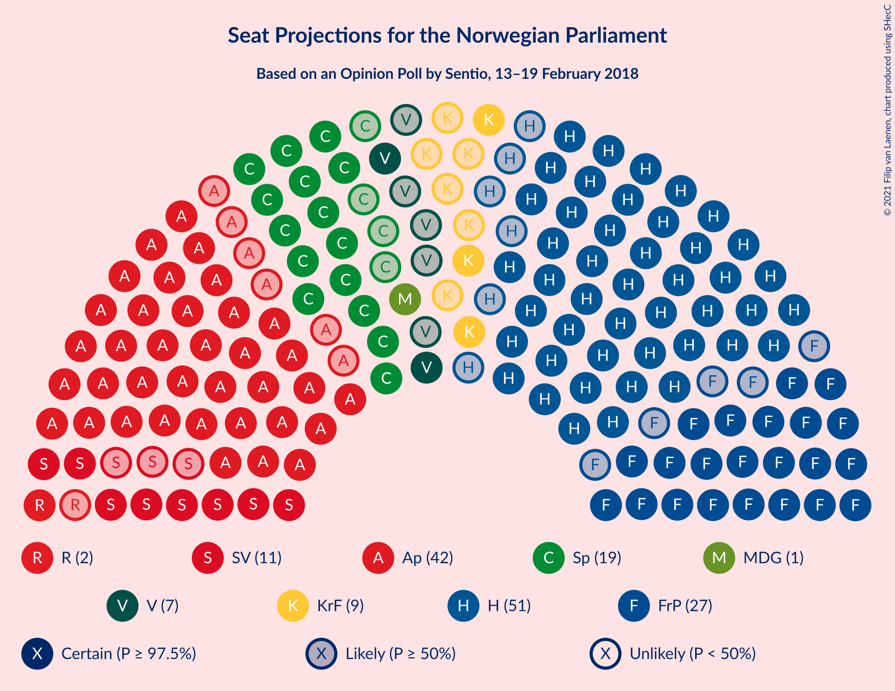
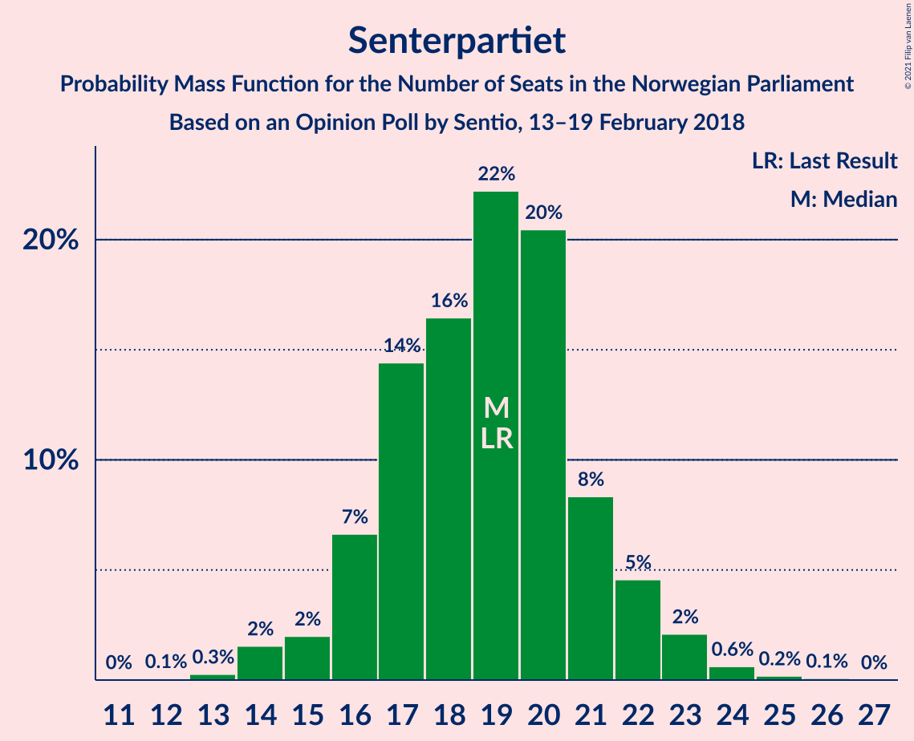
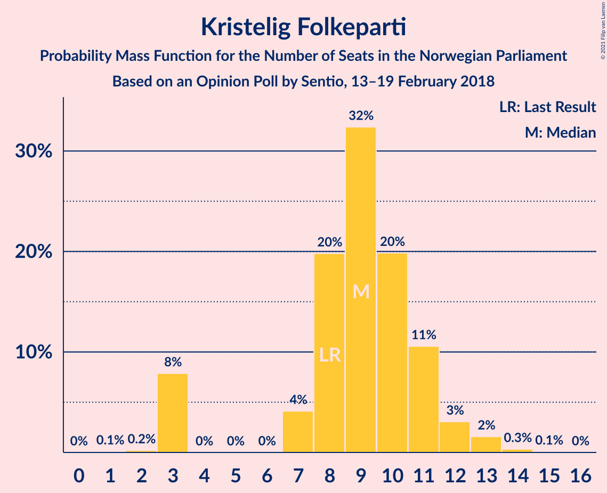
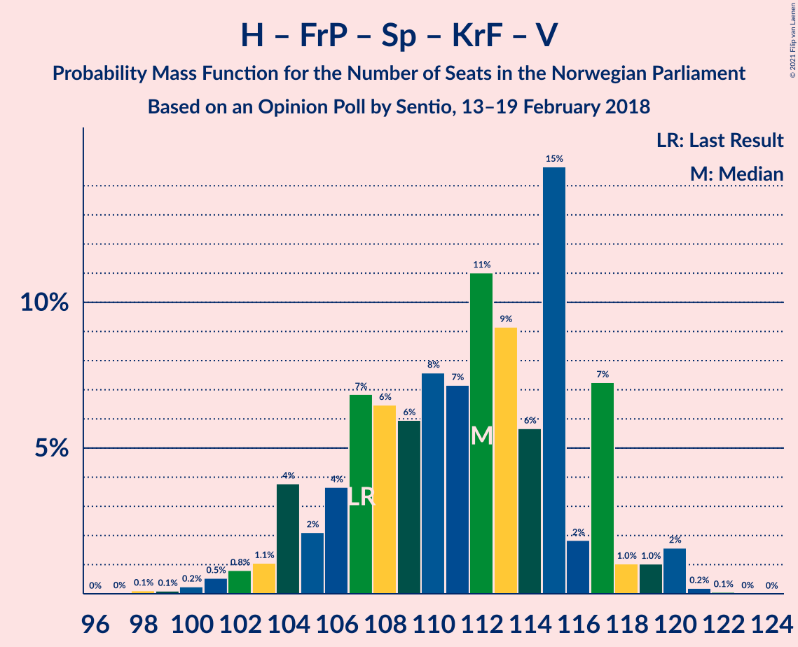
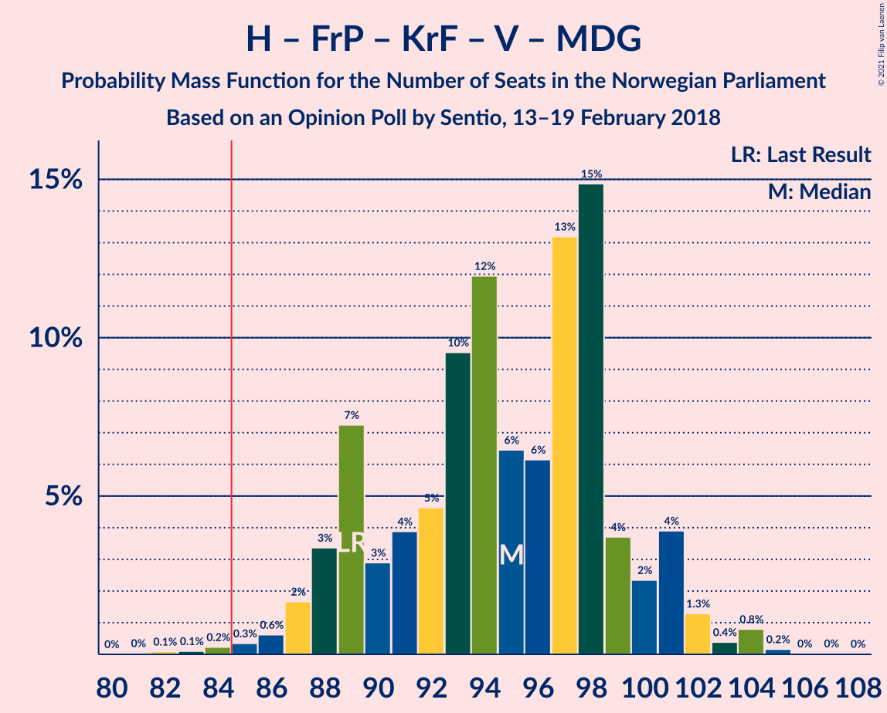
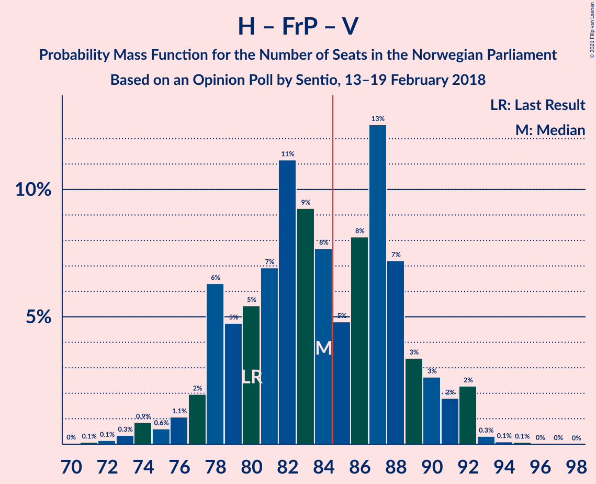
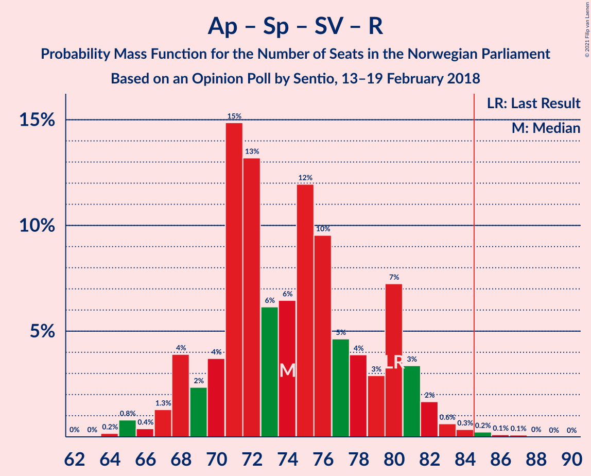
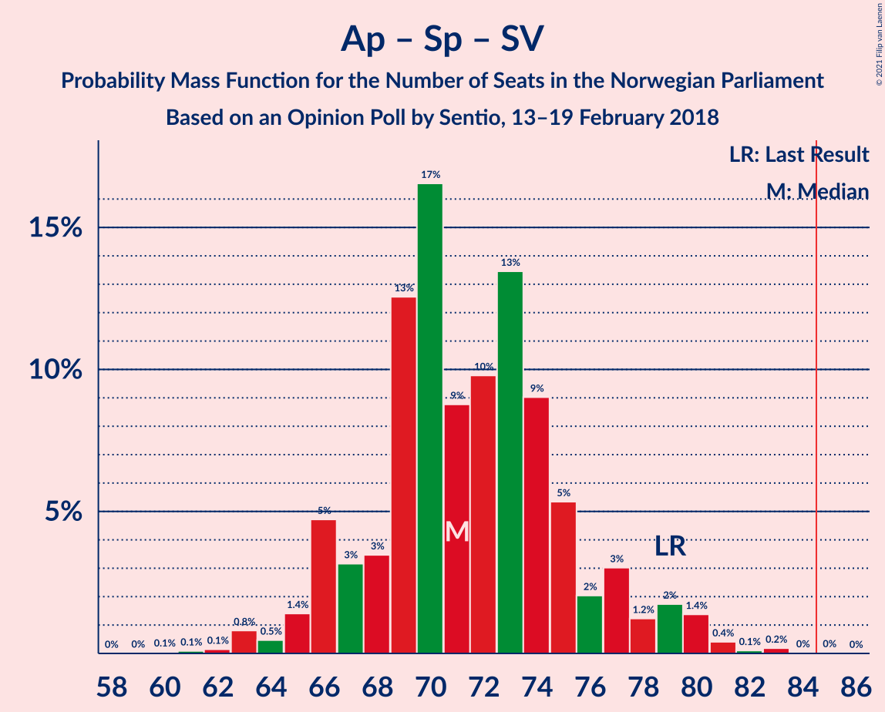
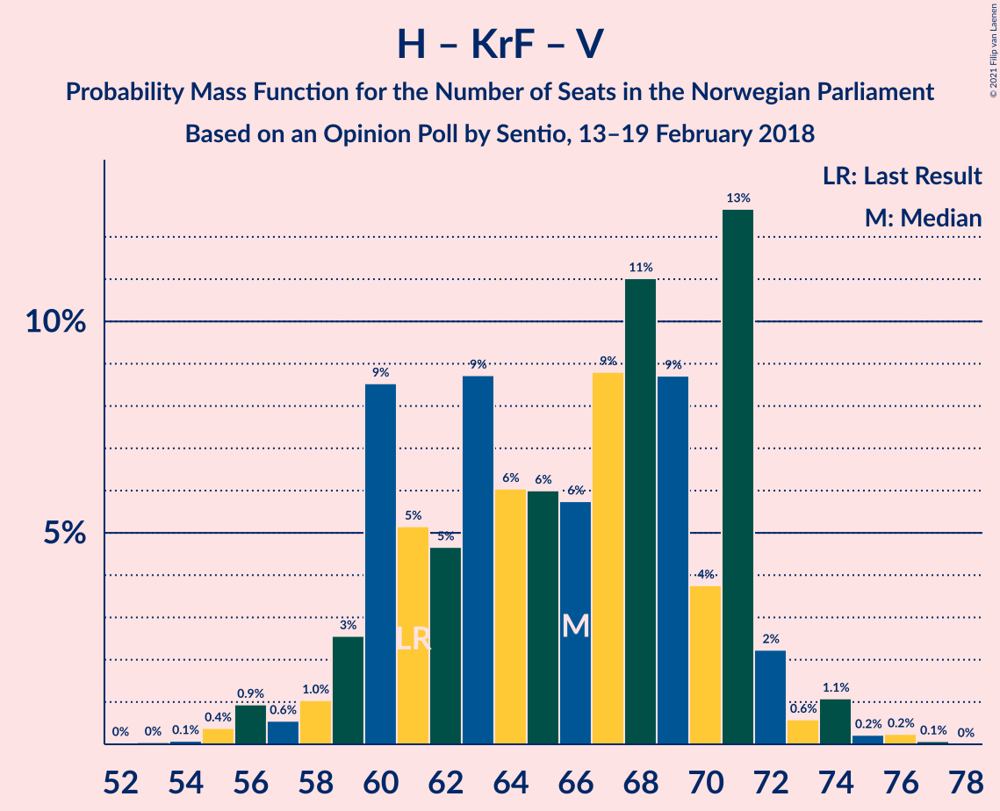

# Opinion Poll by Sentio, 13–19 February 2018

<a href="#voting-intentions">Voting Intentions</a> | <a href="#seats">Seats</a> | <a href="#coalitions">Coalitions</a> | <a href="#technical-information">Technical Information</a>

## Voting Intentions

### Confidence Intervals

| Party | Last Result | Poll Result | 80% Confidence Interval | 90% Confidence Interval | 95% Confidence Interval | 99% Confidence Interval |
|:-----:|:-----------:|:-----------:|:-----------------------:|:-----------------------:|:-----------------------:|:-----------------------:|
| Høyre | 25.0% | 28.7% | 26.6–30.9% |26.0–31.5% |25.5–32.0% |24.6–33.1% |
| Arbeiderpartiet | 27.4% | 23.3% | 21.4–25.4% |20.8–26.0% |20.4–26.5% |19.5–27.5% |
| Fremskrittspartiet | 15.2% | 14.9% | 13.4–16.7% |12.9–17.2% |12.6–17.7% |11.8–18.6% |
| Senterpartiet | 10.3% | 10.4% | 9.1–11.9% |8.7–12.4% |8.4–12.8% |7.8–13.6% |
| Sosialistisk Venstreparti | 6.0% | 6.1% | 5.1–7.3% |4.8–7.7% |4.6–8.0% |4.1–8.7% |
| Kristelig Folkeparti | 4.2% | 5.1% | 4.2–6.3% |4.0–6.6% |3.7–7.0% |3.4–7.6% |
| Venstre | 4.4% | 4.0% | 3.2–5.1% |3.0–5.4% |2.8–5.7% |2.5–6.3% |
| Rødt | 2.4% | 3.2% | 2.5–4.2% |2.3–4.5% |2.2–4.8% |1.9–5.3% |
| Miljøpartiet De Grønne | 3.2% | 3.2% | 2.5–4.2% |2.3–4.5% |2.2–4.8% |1.9–5.3% |

*Note:* The poll result column reflects the actual value used in the calculations. Published results may vary slightly, and in addition be rounded to fewer digits.

## Seats

### Confidence Intervals

| Party | Last Result | Median | 80% Confidence Interval | 90% Confidence Interval | 95% Confidence Interval | 99% Confidence Interval |
|:-----:|:-----------:|:------:|:-----------------------:|:-----------------------:|:-----------------------:|:-----------------------:|
| <a href="#høyre">Høyre</a> | 45 | 51 | 48–53 |47–55 |46–57 |42–60 |
| <a href="#arbeiderpartiet">Arbeiderpartiet</a> | 49 | 42 | 39–45 |38–46 |38–47 |36–48 |
| <a href="#fremskrittspartiet">Fremskrittspartiet</a> | 27 | 25 | 24–30 |23–31 |22–32 |20–33 |
| <a href="#senterpartiet">Senterpartiet</a> | 19 | 19 | 16–20 |15–21 |14–23 |14–24 |
| <a href="#sosialistisk-venstreparti">Sosialistisk Venstreparti</a> | 11 | 12 | 9–13 |8–13 |8–14 |7–16 |
| <a href="#kristelig-folkeparti">Kristelig Folkeparti</a> | 8 | 9 | 3–10 |3–11 |3–12 |3–13 |
| <a href="#venstre">Venstre</a> | 8 | 8 | 2–9 |2–9 |2–9 |1–10 |
| <a href="#rødt">Rødt</a> | 1 | 2 | 1–8 |1–8 |1–8 |1–9 |
| <a href="#miljøpartiet-de-grønne">Miljøpartiet De Grønne</a> | 1 | 1 | 1–7 |1–8 |1–8 |0–9 |

### Høyre

*For a full overview of the results for this party, see the [Høyre](party-høyre.html) page.*

| Number of Seats | Probability | Accumulated | Special Marks |
|:---------------:|:-----------:|:-----------:|:-------------:|
| 41 | 0.1% | 100% |  |
| 42 | 0.6% | 99.9% |  |
| 43 | 0.2% | 99.3% |  |
| 44 | 0.3% | 99.1% |  |
| 45 | 0.5% | 98.8% | Last Result |
| 46 | 2% | 98% |  |
| 47 | 6% | 96% |  |
| 48 | 7% | 91% |  |
| 49 | 4% | 83% |  |
| 50 | 19% | 79% |  |
| 51 | 38% | 60% | Median |
| 52 | 5% | 22% |  |
| 53 | 10% | 17% |  |
| 54 | 1.1% | 7% |  |
| 55 | 0.8% | 5% |  |
| 56 | 2% | 5% |  |
| 57 | 0.9% | 3% |  |
| 58 | 0.2% | 2% |  |
| 59 | 0.5% | 2% |  |
| 60 | 1.0% | 1.2% |  |
| 61 | 0.1% | 0.1% |  |
| 62 | 0% | 0.1% |  |
| 63 | 0.1% | 0.1% |  |
| 64 | 0% | 0% |  |

### Arbeiderpartiet

*For a full overview of the results for this party, see the [Arbeiderpartiet](party-arbeiderpartiet.html) page.*

| Number of Seats | Probability | Accumulated | Special Marks |
|:---------------:|:-----------:|:-----------:|:-------------:|
| 34 | 0.1% | 100% |  |
| 35 | 0.1% | 99.9% |  |
| 36 | 0.9% | 99.9% |  |
| 37 | 0.5% | 98.9% |  |
| 38 | 7% | 98% |  |
| 39 | 12% | 92% |  |
| 40 | 4% | 79% |  |
| 41 | 8% | 75% |  |
| 42 | 35% | 67% | Median |
| 43 | 13% | 32% |  |
| 44 | 3% | 19% |  |
| 45 | 9% | 16% |  |
| 46 | 2% | 7% |  |
| 47 | 3% | 5% |  |
| 48 | 1.1% | 2% |  |
| 49 | 0.3% | 0.5% | Last Result |
| 50 | 0.1% | 0.2% |  |
| 51 | 0.1% | 0.1% |  |
| 52 | 0% | 0% |  |

### Fremskrittspartiet

*For a full overview of the results for this party, see the [Fremskrittspartiet](party-fremskrittspartiet.html) page.*

| Number of Seats | Probability | Accumulated | Special Marks |
|:---------------:|:-----------:|:-----------:|:-------------:|
| 19 | 0.1% | 100% |  |
| 20 | 0.4% | 99.9% |  |
| 21 | 0.7% | 99.5% |  |
| 22 | 2% | 98.7% |  |
| 23 | 2% | 97% |  |
| 24 | 35% | 95% |  |
| 25 | 11% | 60% | Median |
| 26 | 22% | 49% |  |
| 27 | 7% | 28% | Last Result |
| 28 | 8% | 20% |  |
| 29 | 2% | 12% |  |
| 30 | 3% | 10% |  |
| 31 | 4% | 7% |  |
| 32 | 2% | 3% |  |
| 33 | 0.3% | 0.7% |  |
| 34 | 0.1% | 0.4% |  |
| 35 | 0.3% | 0.3% |  |
| 36 | 0% | 0% |  |

### Senterpartiet

*For a full overview of the results for this party, see the [Senterpartiet](party-senterpartiet.html) page.*

| Number of Seats | Probability | Accumulated | Special Marks |
|:---------------:|:-----------:|:-----------:|:-------------:|
| 12 | 0% | 100% |  |
| 13 | 0.3% | 99.9% |  |
| 14 | 3% | 99.6% |  |
| 15 | 2% | 97% |  |
| 16 | 8% | 95% |  |
| 17 | 16% | 87% |  |
| 18 | 11% | 71% |  |
| 19 | 12% | 60% | Last Result, Median |
| 20 | 40% | 48% |  |
| 21 | 3% | 7% |  |
| 22 | 1.4% | 4% |  |
| 23 | 2% | 3% |  |
| 24 | 0.9% | 1.1% |  |
| 25 | 0.1% | 0.1% |  |
| 26 | 0% | 0.1% |  |
| 27 | 0% | 0% |  |

### Sosialistisk Venstreparti

*For a full overview of the results for this party, see the [Sosialistisk Venstreparti](party-sosialistiskvenstreparti.html) page.*

| Number of Seats | Probability | Accumulated | Special Marks |
|:---------------:|:-----------:|:-----------:|:-------------:|
| 1 | 0.1% | 100% |  |
| 2 | 0.1% | 99.9% |  |
| 3 | 0% | 99.8% |  |
| 4 | 0% | 99.8% |  |
| 5 | 0% | 99.8% |  |
| 6 | 0% | 99.8% |  |
| 7 | 0.9% | 99.8% |  |
| 8 | 6% | 98.8% |  |
| 9 | 6% | 93% |  |
| 10 | 9% | 87% |  |
| 11 | 15% | 78% | Last Result |
| 12 | 47% | 63% | Median |
| 13 | 11% | 16% |  |
| 14 | 3% | 5% |  |
| 15 | 1.0% | 2% |  |
| 16 | 0.6% | 0.8% |  |
| 17 | 0.2% | 0.2% |  |
| 18 | 0% | 0% |  |

### Kristelig Folkeparti

*For a full overview of the results for this party, see the [Kristelig Folkeparti](party-kristeligfolkeparti.html) page.*

| Number of Seats | Probability | Accumulated | Special Marks |
|:---------------:|:-----------:|:-----------:|:-------------:|
| 1 | 0.1% | 100% |  |
| 2 | 0.1% | 99.9% |  |
| 3 | 11% | 99.8% |  |
| 4 | 0% | 89% |  |
| 5 | 0% | 89% |  |
| 6 | 0% | 89% |  |
| 7 | 2% | 89% |  |
| 8 | 17% | 87% | Last Result |
| 9 | 47% | 70% | Median |
| 10 | 14% | 23% |  |
| 11 | 5% | 9% |  |
| 12 | 1.4% | 3% |  |
| 13 | 2% | 2% |  |
| 14 | 0.2% | 0.3% |  |
| 15 | 0.1% | 0.1% |  |
| 16 | 0% | 0% |  |

### Venstre

*For a full overview of the results for this party, see the [Venstre](party-venstre.html) page.*

| Number of Seats | Probability | Accumulated | Special Marks |
|:---------------:|:-----------:|:-----------:|:-------------:|
| 1 | 0.7% | 100% |  |
| 2 | 16% | 99.3% |  |
| 3 | 0.3% | 83% |  |
| 4 | 0% | 83% |  |
| 5 | 0% | 83% |  |
| 6 | 0% | 83% |  |
| 7 | 5% | 83% |  |
| 8 | 58% | 78% | Last Result, Median |
| 9 | 19% | 21% |  |
| 10 | 2% | 2% |  |
| 11 | 0.1% | 0.2% |  |
| 12 | 0% | 0.1% |  |
| 13 | 0% | 0% |  |

### Rødt

*For a full overview of the results for this party, see the [Rødt](party-rødt.html) page.*

| Number of Seats | Probability | Accumulated | Special Marks |
|:---------------:|:-----------:|:-----------:|:-------------:|
| 1 | 16% | 100% | Last Result |
| 2 | 66% | 84% | Median |
| 3 | 0% | 18% |  |
| 4 | 0% | 18% |  |
| 5 | 0% | 18% |  |
| 6 | 0.2% | 18% |  |
| 7 | 3% | 18% |  |
| 8 | 13% | 14% |  |
| 9 | 0.6% | 0.9% |  |
| 10 | 0.3% | 0.3% |  |
| 11 | 0% | 0% |  |

### Miljøpartiet De Grønne

*For a full overview of the results for this party, see the [Miljøpartiet De Grønne](party-miljøpartietdegrønne.html) page.*

| Number of Seats | Probability | Accumulated | Special Marks |
|:---------------:|:-----------:|:-----------:|:-------------:|
| 0 | 1.1% | 100% |  |
| 1 | 72% | 98.9% | Last Result, Median |
| 2 | 14% | 27% |  |
| 3 | 1.1% | 12% |  |
| 4 | 0.6% | 11% |  |
| 5 | 0% | 11% |  |
| 6 | 0% | 11% |  |
| 7 | 2% | 11% |  |
| 8 | 6% | 8% |  |
| 9 | 2% | 2% |  |
| 10 | 0.1% | 0.2% |  |
| 11 | 0% | 0% |  |

## Coalitions

### Confidence Intervals

| Coalition | Last Result | Median | Majority? | 80% Confidence Interval | 90% Confidence Interval | 95% Confidence Interval | 99% Confidence Interval |
|:---------:|:-----------:|:------:|:---------:|:-----------------------:|:-----------------------:|:-----------------------:|:-----------------------:|
| Høyre – Fremskrittspartiet – Senterpartiet – Kristelig Folkeparti – Venstre | 107 | 112 | 100% | 106–115 | 106–115 | 105–117 | 102–119 |
| Høyre – Fremskrittspartiet – Kristelig Folkeparti – Venstre – Miljøpartiet De Grønne | 89 | 93 | 99.8% | 88–99 | 88–102 | 88–104 | 87–104 |
| Høyre – Fremskrittspartiet – Kristelig Folkeparti – Venstre | 88 | 92 | 99.2% | 87–96 | 87–97 | 87–98 | 84–100 |
| Høyre – Fremskrittspartiet – Venstre | 80 | 83 | 24% | 81–87 | 80–88 | 78–89 | 76–91 |
| Arbeiderpartiet – Senterpartiet – Sosialistisk Venstreparti – Kristelig Folkeparti – Miljøpartiet De Grønne | 88 | 84 | 17% | 77–86 | 77–87 | 77–88 | 73–91 |
| Høyre – Fremskrittspartiet | 72 | 76 | 2% | 74–82 | 73–83 | 72–83 | 69–87 |
| Arbeiderpartiet – Senterpartiet – Sosialistisk Venstreparti – Miljøpartiet De Grønne – Rødt | 81 | 77 | 0.8% | 73–82 | 72–82 | 71–82 | 69–85 |
| Arbeiderpartiet – Senterpartiet – Sosialistisk Venstreparti – Rødt | 80 | 76 | 0.2% | 70–81 | 67–81 | 65–81 | 65–82 |
| Arbeiderpartiet – Senterpartiet – Sosialistisk Venstreparti – Miljøpartiet De Grønne | 80 | 75 | 0.2% | 69–76 | 69–79 | 68–80 | 66–83 |
| Arbeiderpartiet – Senterpartiet – Kristelig Folkeparti – Miljøpartiet De Grønne | 77 | 72 | 0.1% | 66–75 | 66–76 | 66–78 | 62–80 |
| Arbeiderpartiet – Senterpartiet – Sosialistisk Venstreparti | 79 | 73 | 0% | 67–75 | 65–76 | 63–77 | 63–79 |
| Arbeiderpartiet – Senterpartiet – Kristelig Folkeparti | 76 | 71 | 0% | 65–72 | 65–73 | 64–75 | 61–78 |
| Høyre – Kristelig Folkeparti – Venstre | 61 | 68 | 0% | 61–70 | 60–70 | 60–74 | 57–76 |
| Arbeiderpartiet – Senterpartiet | 68 | 62 | 0% | 56–63 | 55–65 | 55–65 | 54–69 |
| Arbeiderpartiet – Sosialistisk Venstreparti | 60 | 54 | 0% | 49–58 | 48–59 | 46–59 | 46–60 |
| Senterpartiet – Kristelig Folkeparti – Venstre | 35 | 36 | 0% | 30–37 | 28–38 | 28–39 | 25–41 |

### Høyre – Fremskrittspartiet – Senterpartiet – Kristelig Folkeparti – Venstre

| Number of Seats | Probability | Accumulated | Special Marks |
|:---------------:|:-----------:|:-----------:|:-------------:|
| 97 | 0% | 100% |  |
| 98 | 0% | 99.9% |  |
| 99 | 0% | 99.9% |  |
| 100 | 0% | 99.9% |  |
| 101 | 0.2% | 99.8% |  |
| 102 | 0.3% | 99.7% |  |
| 103 | 1.2% | 99.4% |  |
| 104 | 0.2% | 98% |  |
| 105 | 0.9% | 98% |  |
| 106 | 9% | 97% |  |
| 107 | 1.5% | 88% | Last Result |
| 108 | 7% | 86% |  |
| 109 | 12% | 79% |  |
| 110 | 5% | 67% |  |
| 111 | 7% | 62% |  |
| 112 | 35% | 55% | Median |
| 113 | 5% | 20% |  |
| 114 | 4% | 14% |  |
| 115 | 6% | 10% |  |
| 116 | 1.2% | 5% |  |
| 117 | 2% | 4% |  |
| 118 | 1.2% | 2% |  |
| 119 | 0.7% | 1.0% |  |
| 120 | 0.1% | 0.3% |  |
| 121 | 0.1% | 0.1% |  |
| 122 | 0% | 0.1% |  |
| 123 | 0.1% | 0.1% |  |
| 124 | 0% | 0% |  |

### Høyre – Fremskrittspartiet – Kristelig Folkeparti – Venstre – Miljøpartiet De Grønne

| Number of Seats | Probability | Accumulated | Special Marks |
|:---------------:|:-----------:|:-----------:|:-------------:|
| 81 | 0% | 100% |  |
| 82 | 0% | 99.9% |  |
| 83 | 0% | 99.9% |  |
| 84 | 0.1% | 99.9% |  |
| 85 | 0% | 99.8% | Majority |
| 86 | 0.1% | 99.8% |  |
| 87 | 1.4% | 99.7% |  |
| 88 | 8% | 98% |  |
| 89 | 1.3% | 90% | Last Result |
| 90 | 3% | 89% |  |
| 91 | 3% | 86% |  |
| 92 | 1.4% | 83% |  |
| 93 | 44% | 82% |  |
| 94 | 4% | 38% | Median |
| 95 | 5% | 34% |  |
| 96 | 10% | 29% |  |
| 97 | 3% | 19% |  |
| 98 | 3% | 16% |  |
| 99 | 3% | 13% |  |
| 100 | 1.2% | 10% |  |
| 101 | 2% | 8% |  |
| 102 | 2% | 6% |  |
| 103 | 0.8% | 4% |  |
| 104 | 3% | 3% |  |
| 105 | 0% | 0.1% |  |
| 106 | 0% | 0% |  |

### Høyre – Fremskrittspartiet – Kristelig Folkeparti – Venstre

| Number of Seats | Probability | Accumulated | Special Marks |
|:---------------:|:-----------:|:-----------:|:-------------:|
| 79 | 0% | 100% |  |
| 80 | 0% | 99.9% |  |
| 81 | 0.2% | 99.9% |  |
| 82 | 0.1% | 99.7% |  |
| 83 | 0.1% | 99.7% |  |
| 84 | 0.4% | 99.6% |  |
| 85 | 0.4% | 99.2% | Majority |
| 86 | 1.3% | 98.8% |  |
| 87 | 10% | 98% |  |
| 88 | 3% | 88% | Last Result |
| 89 | 2% | 85% |  |
| 90 | 2% | 83% |  |
| 91 | 3% | 81% |  |
| 92 | 47% | 78% |  |
| 93 | 5% | 32% | Median |
| 94 | 7% | 26% |  |
| 95 | 7% | 19% |  |
| 96 | 6% | 12% |  |
| 97 | 1.3% | 6% |  |
| 98 | 3% | 5% |  |
| 99 | 0.1% | 2% |  |
| 100 | 1.4% | 2% |  |
| 101 | 0.2% | 0.5% |  |
| 102 | 0.2% | 0.3% |  |
| 103 | 0.1% | 0.1% |  |
| 104 | 0% | 0% |  |

### Høyre – Fremskrittspartiet – Venstre

| Number of Seats | Probability | Accumulated | Special Marks |
|:---------------:|:-----------:|:-----------:|:-------------:|
| 70 | 0% | 100% |  |
| 71 | 0.1% | 99.9% |  |
| 72 | 0% | 99.9% |  |
| 73 | 0.1% | 99.9% |  |
| 74 | 0.1% | 99.8% |  |
| 75 | 0.2% | 99.7% |  |
| 76 | 0.3% | 99.5% |  |
| 77 | 0.3% | 99.3% |  |
| 78 | 2% | 99.0% |  |
| 79 | 1.2% | 97% |  |
| 80 | 4% | 96% | Last Result |
| 81 | 2% | 92% |  |
| 82 | 8% | 90% |  |
| 83 | 37% | 82% |  |
| 84 | 20% | 45% | Median |
| 85 | 7% | 24% | Majority |
| 86 | 5% | 17% |  |
| 87 | 7% | 13% |  |
| 88 | 2% | 5% |  |
| 89 | 2% | 4% |  |
| 90 | 1.4% | 2% |  |
| 91 | 0.2% | 0.7% |  |
| 92 | 0.1% | 0.5% |  |
| 93 | 0.2% | 0.4% |  |
| 94 | 0.1% | 0.2% |  |
| 95 | 0% | 0.1% |  |
| 96 | 0% | 0.1% |  |
| 97 | 0% | 0.1% |  |
| 98 | 0% | 0.1% |  |
| 99 | 0.1% | 0.1% |  |
| 100 | 0% | 0% |  |

### Arbeiderpartiet – Senterpartiet – Sosialistisk Venstreparti – Kristelig Folkeparti – Miljøpartiet De Grønne

| Number of Seats | Probability | Accumulated | Special Marks |
|:---------------:|:-----------:|:-----------:|:-------------:|
| 69 | 0.1% | 100% |  |
| 70 | 0% | 99.9% |  |
| 71 | 0% | 99.9% |  |
| 72 | 0.2% | 99.9% |  |
| 73 | 0.2% | 99.6% |  |
| 74 | 0.1% | 99.5% |  |
| 75 | 0.3% | 99.4% |  |
| 76 | 0.2% | 99.1% |  |
| 77 | 10% | 98.9% |  |
| 78 | 8% | 88% |  |
| 79 | 1.3% | 81% |  |
| 80 | 7% | 80% |  |
| 81 | 6% | 73% |  |
| 82 | 6% | 67% |  |
| 83 | 5% | 61% | Median |
| 84 | 39% | 56% |  |
| 85 | 4% | 17% | Majority |
| 86 | 5% | 12% |  |
| 87 | 3% | 7% |  |
| 88 | 2% | 4% | Last Result |
| 89 | 1.1% | 2% |  |
| 90 | 0.7% | 1.2% |  |
| 91 | 0.2% | 0.6% |  |
| 92 | 0.2% | 0.4% |  |
| 93 | 0.1% | 0.2% |  |
| 94 | 0.1% | 0.1% |  |
| 95 | 0% | 0.1% |  |
| 96 | 0% | 0% |  |

### Høyre – Fremskrittspartiet

| Number of Seats | Probability | Accumulated | Special Marks |
|:---------------:|:-----------:|:-----------:|:-------------:|
| 66 | 0% | 100% |  |
| 67 | 0.1% | 99.9% |  |
| 68 | 0.2% | 99.8% |  |
| 69 | 0.2% | 99.6% |  |
| 70 | 0.4% | 99.4% |  |
| 71 | 0.6% | 99.0% |  |
| 72 | 2% | 98% | Last Result |
| 73 | 3% | 96% |  |
| 74 | 7% | 93% |  |
| 75 | 36% | 86% |  |
| 76 | 17% | 50% | Median |
| 77 | 8% | 33% |  |
| 78 | 8% | 26% |  |
| 79 | 4% | 18% |  |
| 80 | 1.4% | 14% |  |
| 81 | 2% | 13% |  |
| 82 | 4% | 11% |  |
| 83 | 4% | 6% |  |
| 84 | 0.6% | 2% |  |
| 85 | 1.3% | 2% | Majority |
| 86 | 0.1% | 0.6% |  |
| 87 | 0% | 0.5% |  |
| 88 | 0.2% | 0.5% |  |
| 89 | 0.1% | 0.3% |  |
| 90 | 0.1% | 0.2% |  |
| 91 | 0.1% | 0.1% |  |
| 92 | 0% | 0% |  |

### Arbeiderpartiet – Senterpartiet – Sosialistisk Venstreparti – Miljøpartiet De Grønne – Rødt

| Number of Seats | Probability | Accumulated | Special Marks |
|:---------------:|:-----------:|:-----------:|:-------------:|
| 66 | 0.1% | 100% |  |
| 67 | 0.2% | 99.9% |  |
| 68 | 0.2% | 99.7% |  |
| 69 | 1.4% | 99.5% |  |
| 70 | 0.1% | 98% |  |
| 71 | 3% | 98% |  |
| 72 | 1.3% | 95% |  |
| 73 | 6% | 94% |  |
| 74 | 7% | 88% |  |
| 75 | 7% | 81% |  |
| 76 | 5% | 74% | Median |
| 77 | 47% | 68% |  |
| 78 | 3% | 22% |  |
| 79 | 2% | 19% |  |
| 80 | 2% | 17% |  |
| 81 | 3% | 15% | Last Result |
| 82 | 10% | 12% |  |
| 83 | 1.3% | 2% |  |
| 84 | 0.4% | 1.2% |  |
| 85 | 0.4% | 0.8% | Majority |
| 86 | 0.1% | 0.4% |  |
| 87 | 0.1% | 0.3% |  |
| 88 | 0.2% | 0.3% |  |
| 89 | 0% | 0.1% |  |
| 90 | 0% | 0.1% |  |
| 91 | 0% | 0% |  |

### Arbeiderpartiet – Senterpartiet – Sosialistisk Venstreparti – Rødt

| Number of Seats | Probability | Accumulated | Special Marks |
|:---------------:|:-----------:|:-----------:|:-------------:|
| 64 | 0% | 100% |  |
| 65 | 3% | 99.9% |  |
| 66 | 0.8% | 97% |  |
| 67 | 2% | 96% |  |
| 68 | 2% | 94% |  |
| 69 | 1.2% | 92% |  |
| 70 | 3% | 90% |  |
| 71 | 3% | 87% |  |
| 72 | 3% | 84% |  |
| 73 | 10% | 81% |  |
| 74 | 5% | 71% |  |
| 75 | 4% | 66% | Median |
| 76 | 44% | 62% |  |
| 77 | 1.4% | 18% |  |
| 78 | 3% | 17% |  |
| 79 | 3% | 14% |  |
| 80 | 1.3% | 11% | Last Result |
| 81 | 8% | 10% |  |
| 82 | 1.4% | 2% |  |
| 83 | 0.1% | 0.3% |  |
| 84 | 0% | 0.2% |  |
| 85 | 0.1% | 0.2% | Majority |
| 86 | 0% | 0.1% |  |
| 87 | 0% | 0.1% |  |
| 88 | 0% | 0.1% |  |
| 89 | 0% | 0% |  |

### Arbeiderpartiet – Senterpartiet – Sosialistisk Venstreparti – Miljøpartiet De Grønne

| Number of Seats | Probability | Accumulated | Special Marks |
|:---------------:|:-----------:|:-----------:|:-------------:|
| 63 | 0% | 100% |  |
| 64 | 0% | 99.9% |  |
| 65 | 0.2% | 99.9% |  |
| 66 | 0.9% | 99.8% |  |
| 67 | 0.3% | 98.9% |  |
| 68 | 2% | 98.5% |  |
| 69 | 8% | 97% |  |
| 70 | 1.0% | 89% |  |
| 71 | 5% | 88% |  |
| 72 | 8% | 83% |  |
| 73 | 5% | 75% |  |
| 74 | 14% | 70% | Median |
| 75 | 39% | 56% |  |
| 76 | 9% | 17% |  |
| 77 | 2% | 9% |  |
| 78 | 1.4% | 7% |  |
| 79 | 3% | 5% |  |
| 80 | 1.3% | 3% | Last Result |
| 81 | 0.5% | 1.2% |  |
| 82 | 0.2% | 0.7% |  |
| 83 | 0.1% | 0.6% |  |
| 84 | 0.3% | 0.5% |  |
| 85 | 0% | 0.2% | Majority |
| 86 | 0.1% | 0.2% |  |
| 87 | 0% | 0% |  |

### Arbeiderpartiet – Senterpartiet – Kristelig Folkeparti – Miljøpartiet De Grønne

| Number of Seats | Probability | Accumulated | Special Marks |
|:---------------:|:-----------:|:-----------:|:-------------:|
| 58 | 0.1% | 100% |  |
| 59 | 0.2% | 99.9% |  |
| 60 | 0% | 99.7% |  |
| 61 | 0.1% | 99.7% |  |
| 62 | 0.2% | 99.6% |  |
| 63 | 0.1% | 99.5% |  |
| 64 | 0.3% | 99.4% |  |
| 65 | 0.3% | 99.1% |  |
| 66 | 13% | 98.8% |  |
| 67 | 3% | 86% |  |
| 68 | 9% | 83% |  |
| 69 | 5% | 74% |  |
| 70 | 4% | 69% |  |
| 71 | 1.4% | 66% | Median |
| 72 | 40% | 64% |  |
| 73 | 11% | 24% |  |
| 74 | 3% | 14% |  |
| 75 | 3% | 11% |  |
| 76 | 2% | 7% |  |
| 77 | 2% | 5% | Last Result |
| 78 | 1.2% | 3% |  |
| 79 | 0.3% | 2% |  |
| 80 | 0.8% | 1.3% |  |
| 81 | 0.2% | 0.5% |  |
| 82 | 0.2% | 0.3% |  |
| 83 | 0% | 0.1% |  |
| 84 | 0% | 0.1% |  |
| 85 | 0% | 0.1% | Majority |
| 86 | 0% | 0% |  |

### Arbeiderpartiet – Senterpartiet – Sosialistisk Venstreparti

| Number of Seats | Probability | Accumulated | Special Marks |
|:---------------:|:-----------:|:-----------:|:-------------:|
| 60 | 0% | 100% |  |
| 61 | 0.1% | 99.9% |  |
| 62 | 0.1% | 99.8% |  |
| 63 | 3% | 99.7% |  |
| 64 | 0.7% | 96% |  |
| 65 | 1.2% | 96% |  |
| 66 | 4% | 95% |  |
| 67 | 1.3% | 91% |  |
| 68 | 8% | 89% |  |
| 69 | 2% | 81% |  |
| 70 | 4% | 79% |  |
| 71 | 11% | 76% |  |
| 72 | 2% | 65% |  |
| 73 | 14% | 63% | Median |
| 74 | 35% | 49% |  |
| 75 | 8% | 14% |  |
| 76 | 1.3% | 6% |  |
| 77 | 3% | 5% |  |
| 78 | 0.9% | 2% |  |
| 79 | 0.3% | 0.7% | Last Result |
| 80 | 0.3% | 0.4% |  |
| 81 | 0.1% | 0.1% |  |
| 82 | 0% | 0.1% |  |
| 83 | 0% | 0.1% |  |
| 84 | 0% | 0% |  |

### Arbeiderpartiet – Senterpartiet – Kristelig Folkeparti

| Number of Seats | Probability | Accumulated | Special Marks |
|:---------------:|:-----------:|:-----------:|:-------------:|
| 57 | 0.1% | 100% |  |
| 58 | 0.2% | 99.9% |  |
| 59 | 0% | 99.7% |  |
| 60 | 0.1% | 99.7% |  |
| 61 | 0.2% | 99.5% |  |
| 62 | 0.1% | 99.3% |  |
| 63 | 0.4% | 99.2% |  |
| 64 | 3% | 98.7% |  |
| 65 | 16% | 96% |  |
| 66 | 5% | 80% |  |
| 67 | 13% | 75% |  |
| 68 | 2% | 62% |  |
| 69 | 5% | 61% |  |
| 70 | 3% | 56% | Median |
| 71 | 40% | 53% |  |
| 72 | 4% | 13% |  |
| 73 | 5% | 9% |  |
| 74 | 0.9% | 4% |  |
| 75 | 1.2% | 3% |  |
| 76 | 0.8% | 2% | Last Result |
| 77 | 0.1% | 1.1% |  |
| 78 | 0.8% | 1.0% |  |
| 79 | 0.1% | 0.2% |  |
| 80 | 0.1% | 0.1% |  |
| 81 | 0% | 0% |  |

### Høyre – Kristelig Folkeparti – Venstre

| Number of Seats | Probability | Accumulated | Special Marks |
|:---------------:|:-----------:|:-----------:|:-------------:|
| 52 | 0.1% | 100% |  |
| 53 | 0% | 99.9% |  |
| 54 | 0.1% | 99.9% |  |
| 55 | 0.1% | 99.7% |  |
| 56 | 0.1% | 99.7% |  |
| 57 | 0.2% | 99.6% |  |
| 58 | 0.3% | 99.4% |  |
| 59 | 1.3% | 99.1% |  |
| 60 | 3% | 98% |  |
| 61 | 12% | 95% | Last Result |
| 62 | 1.1% | 82% |  |
| 63 | 6% | 81% |  |
| 64 | 5% | 75% |  |
| 65 | 2% | 71% |  |
| 66 | 6% | 69% |  |
| 67 | 8% | 62% |  |
| 68 | 37% | 55% | Median |
| 69 | 6% | 18% |  |
| 70 | 7% | 12% |  |
| 71 | 1.1% | 5% |  |
| 72 | 0.3% | 4% |  |
| 73 | 0.6% | 4% |  |
| 74 | 2% | 3% |  |
| 75 | 0.3% | 1.4% |  |
| 76 | 1.0% | 1.0% |  |
| 77 | 0% | 0% |  |

### Arbeiderpartiet – Senterpartiet

| Number of Seats | Probability | Accumulated | Special Marks |
|:---------------:|:-----------:|:-----------:|:-------------:|
| 51 | 0% | 100% |  |
| 52 | 0.1% | 99.9% |  |
| 53 | 0.1% | 99.9% |  |
| 54 | 1.1% | 99.8% |  |
| 55 | 4% | 98.7% |  |
| 56 | 6% | 94% |  |
| 57 | 4% | 88% |  |
| 58 | 8% | 84% |  |
| 59 | 10% | 76% |  |
| 60 | 2% | 66% |  |
| 61 | 3% | 64% | Median |
| 62 | 48% | 61% |  |
| 63 | 5% | 13% |  |
| 64 | 2% | 7% |  |
| 65 | 3% | 6% |  |
| 66 | 0.7% | 2% |  |
| 67 | 0.3% | 2% |  |
| 68 | 0.3% | 1.3% | Last Result |
| 69 | 1.0% | 1.1% |  |
| 70 | 0% | 0.1% |  |
| 71 | 0.1% | 0.1% |  |
| 72 | 0% | 0% |  |

### Arbeiderpartiet – Sosialistisk Venstreparti

| Number of Seats | Probability | Accumulated | Special Marks |
|:---------------:|:-----------:|:-----------:|:-------------:|
| 43 | 0.1% | 100% |  |
| 44 | 0.1% | 99.8% |  |
| 45 | 0.2% | 99.7% |  |
| 46 | 3% | 99.5% |  |
| 47 | 1.0% | 96% |  |
| 48 | 3% | 95% |  |
| 49 | 4% | 93% |  |
| 50 | 5% | 89% |  |
| 51 | 12% | 84% |  |
| 52 | 3% | 73% |  |
| 53 | 4% | 70% |  |
| 54 | 44% | 66% | Median |
| 55 | 4% | 22% |  |
| 56 | 5% | 18% |  |
| 57 | 2% | 12% |  |
| 58 | 5% | 10% |  |
| 59 | 5% | 6% |  |
| 60 | 0.8% | 1.2% | Last Result |
| 61 | 0.3% | 0.4% |  |
| 62 | 0.1% | 0.1% |  |
| 63 | 0.1% | 0.1% |  |
| 64 | 0% | 0% |  |

### Senterpartiet – Kristelig Folkeparti – Venstre

| Number of Seats | Probability | Accumulated | Special Marks |
|:---------------:|:-----------:|:-----------:|:-------------:|
| 21 | 0.1% | 100% |  |
| 22 | 0% | 99.9% |  |
| 23 | 0.2% | 99.9% |  |
| 24 | 0.1% | 99.7% |  |
| 25 | 0.4% | 99.7% |  |
| 26 | 0.6% | 99.3% |  |
| 27 | 1.0% | 98.7% |  |
| 28 | 5% | 98% |  |
| 29 | 3% | 93% |  |
| 30 | 10% | 90% |  |
| 31 | 3% | 80% |  |
| 32 | 5% | 77% |  |
| 33 | 10% | 71% |  |
| 34 | 3% | 61% |  |
| 35 | 6% | 58% | Last Result |
| 36 | 5% | 52% | Median |
| 37 | 41% | 47% |  |
| 38 | 2% | 6% |  |
| 39 | 2% | 4% |  |
| 40 | 0.8% | 2% |  |
| 41 | 0.5% | 0.8% |  |
| 42 | 0.1% | 0.2% |  |
| 43 | 0.1% | 0.1% |  |
| 44 | 0.1% | 0.1% |  |
| 45 | 0% | 0% |  |

## Technical Information

### Opinion Poll

+ **Polling firm:** Sentio
+ **Commissioner(s):** —
+ **Fieldwork period:** 13–19 February 2018

### Calculations

+ **Sample size:** 743
+ **Simulations done:** 131,072
+ **Error estimate:** 2.13%

