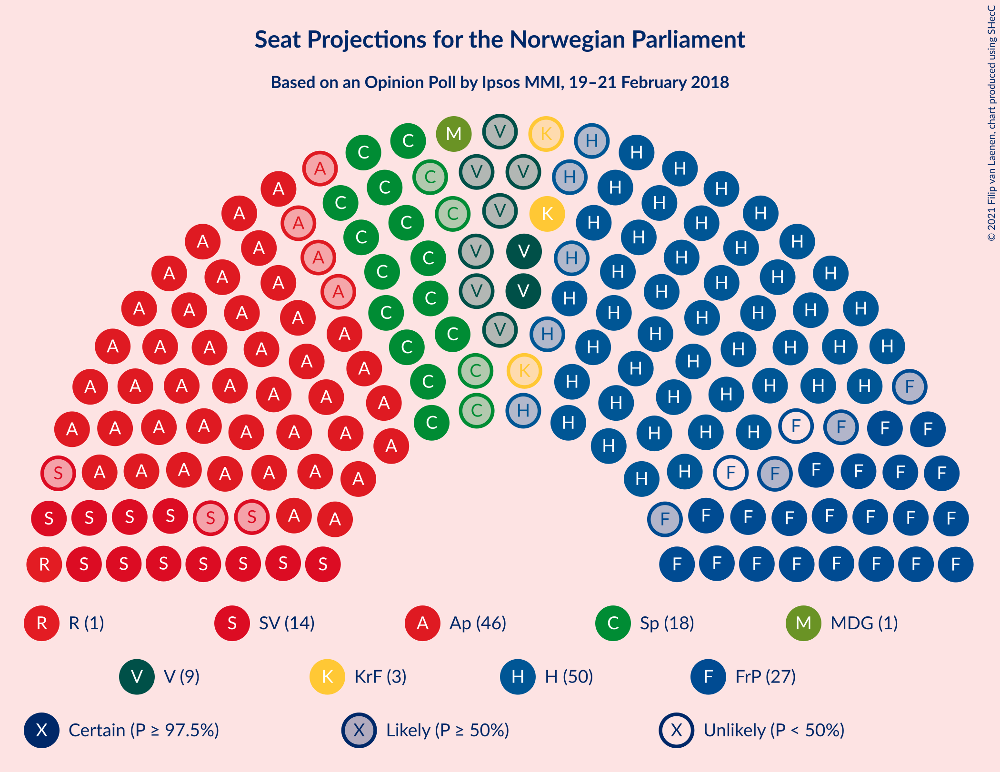
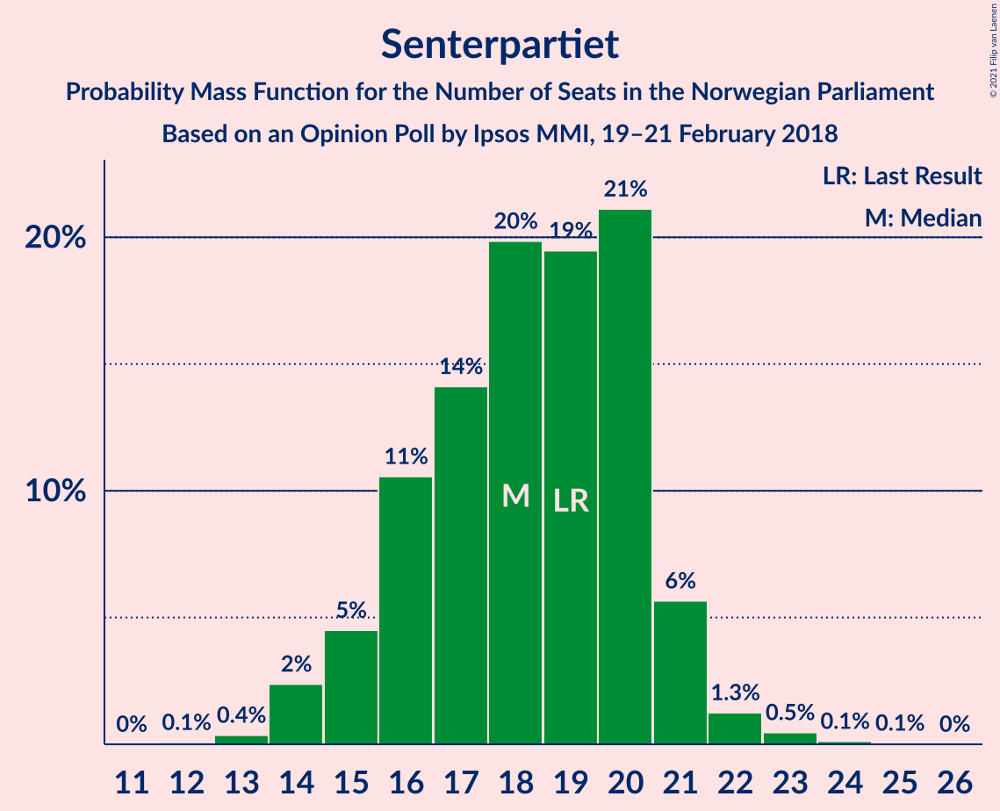
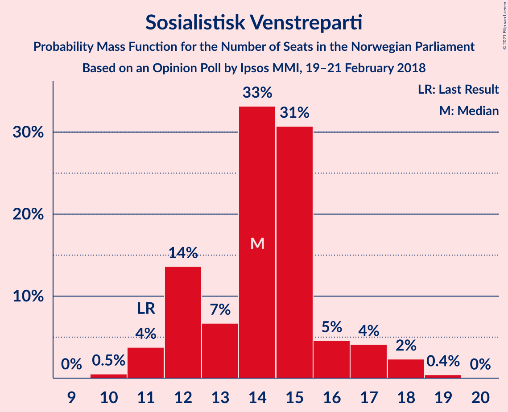
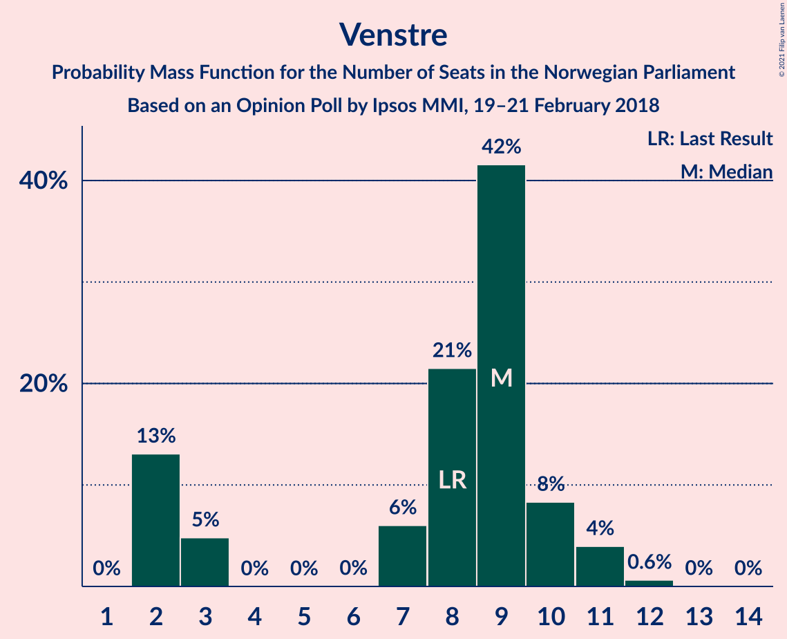
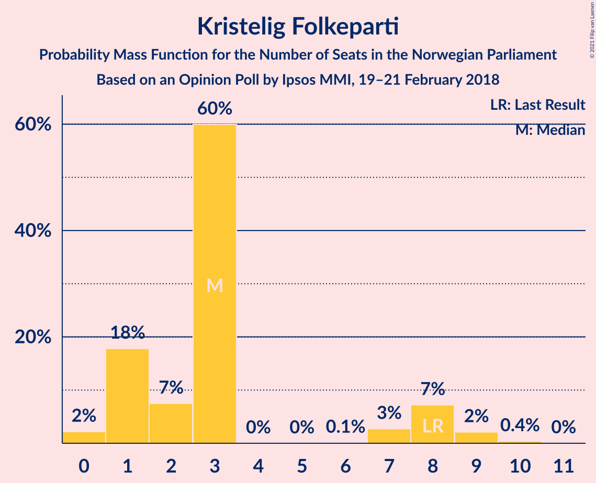
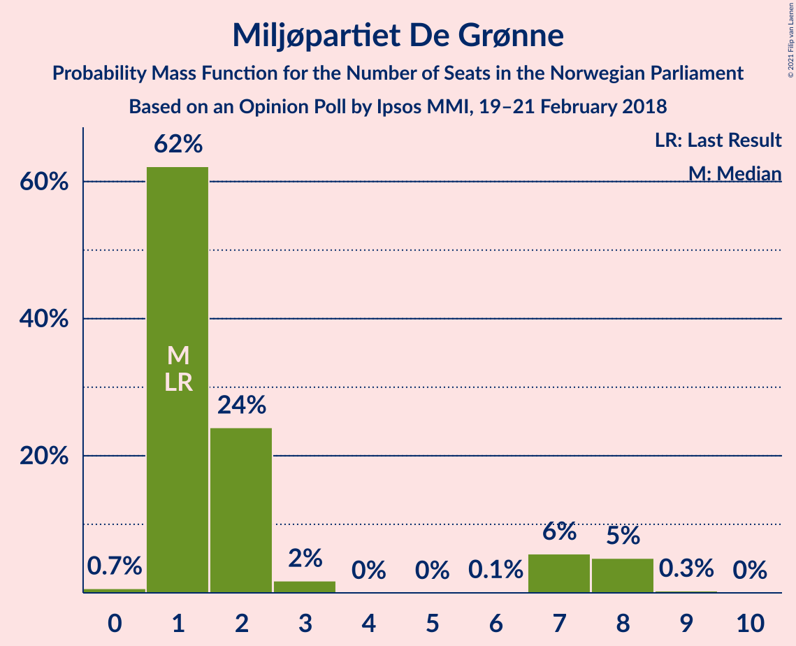
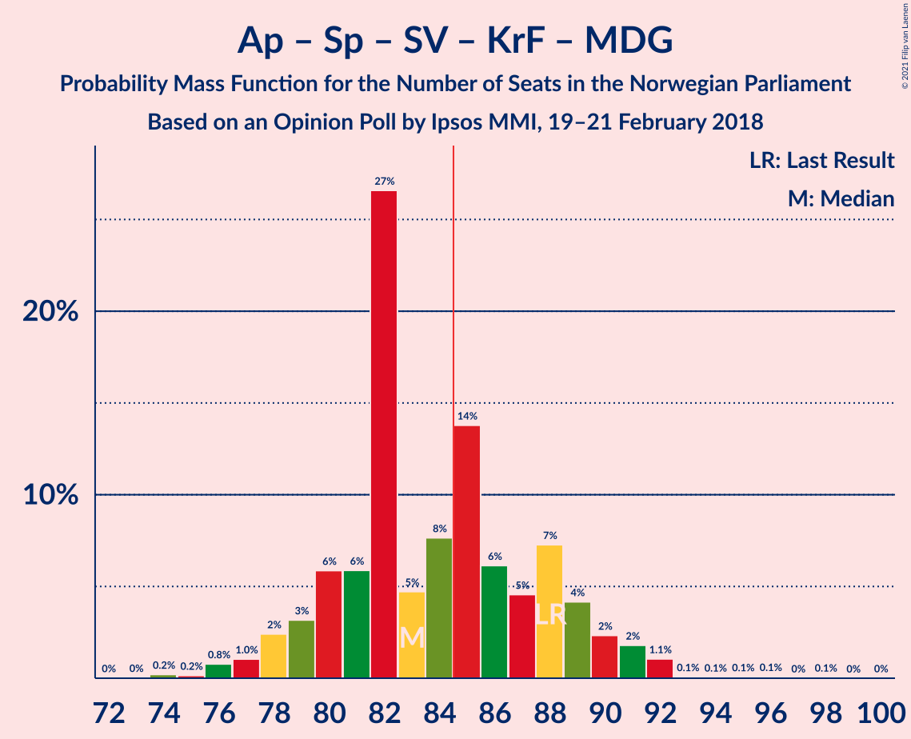
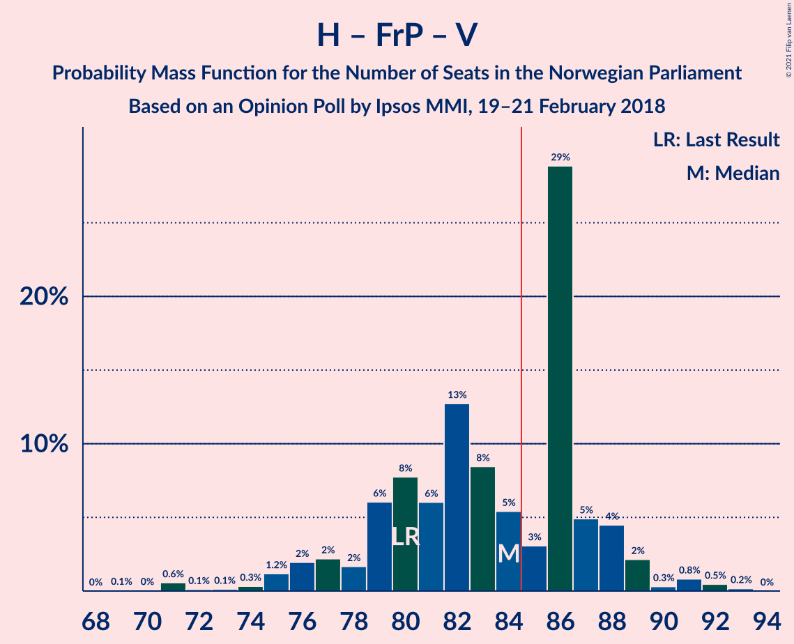
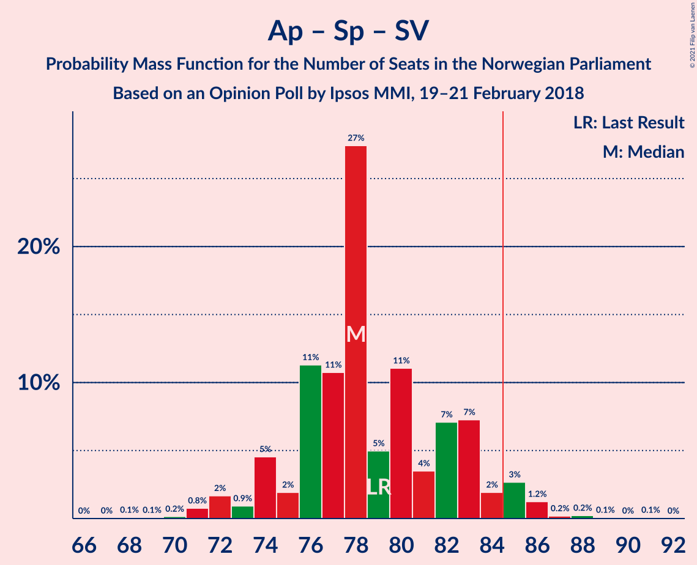

# Opinion Poll by Ipsos MMI, 19–21 February 2018

<a href="#voting-intentions">Voting Intentions</a> | <a href="#seats">Seats</a> | <a href="#coalitions">Coalitions</a> | <a href="#technical-information">Technical Information</a>

## Voting Intentions

### Confidence Intervals

| Party | Last Result | Poll Result | 80% Confidence Interval | 90% Confidence Interval | 95% Confidence Interval | 99% Confidence Interval |
|:-----:|:-----------:|:-----------:|:-----------------------:|:-----------------------:|:-----------------------:|:-----------------------:|
| Høyre | 25.0% | 27.3% | 25.5–29.2% |25.0–29.7% |24.5–30.2% |23.7–31.1% |
| Arbeiderpartiet | 27.4% | 25.4% | 23.6–27.3% |23.1–27.8% |22.7–28.2% |21.9–29.2% |
| Fremskrittspartiet | 15.2% | 13.6% | 12.2–15.1% |11.9–15.5% |11.5–15.9% |10.9–16.7% |
| Senterpartiet | 10.3% | 9.7% | 8.6–11.0% |8.2–11.4% |8.0–11.7% |7.4–12.4% |
| Sosialistisk Venstreparti | 6.0% | 7.5% | 6.5–8.7% |6.2–9.0% |6.0–9.3% |5.5–9.9% |
| Venstre | 4.4% | 4.4% | 3.7–5.4% |3.5–5.7% |3.3–5.9% |3.0–6.4% |
| Kristelig Folkeparti | 4.2% | 3.5% | 2.8–4.4% |2.6–4.6% |2.5–4.8% |2.2–5.3% |
| Rødt | 2.4% | 3.3% | 2.6–4.1% |2.5–4.4% |2.3–4.6% |2.0–5.1% |
| Miljøpartiet De Grønne | 3.2% | 3.1% | 2.4–3.9% |2.3–4.1% |2.1–4.4% |1.9–4.8% |

*Note:* The poll result column reflects the actual value used in the calculations. Published results may vary slightly, and in addition be rounded to fewer digits.

## Seats

### Confidence Intervals

| Party | Last Result | Median | 80% Confidence Interval | 90% Confidence Interval | 95% Confidence Interval | 99% Confidence Interval |
|:-----:|:-----------:|:------:|:-----------------------:|:-----------------------:|:-----------------------:|:-----------------------:|
| <a href="#høyre">Høyre</a> | 45 | 50 | 47–53 |46–54 |45–56 |43–58 |
| <a href="#arbeiderpartiet">Arbeiderpartiet</a> | 49 | 46 | 44–50 |43–51 |42–53 |41–54 |
| <a href="#fremskrittspartiet">Fremskrittspartiet</a> | 27 | 25 | 22–28 |22–28 |21–29 |20–30 |
| <a href="#senterpartiet">Senterpartiet</a> | 19 | 18 | 16–20 |15–21 |14–21 |14–23 |
| <a href="#sosialistisk-venstreparti">Sosialistisk Venstreparti</a> | 11 | 14 | 12–16 |12–17 |11–18 |10–18 |
| <a href="#venstre">Venstre</a> | 8 | 9 | 2–10 |2–10 |2–11 |2–12 |
| <a href="#kristelig-folkeparti">Kristelig Folkeparti</a> | 8 | 3 | 1–7 |1–8 |1–9 |0–9 |
| <a href="#rødt">Rødt</a> | 1 | 1 | 1–2 |1–7 |1–8 |1–9 |
| <a href="#miljøpartiet-de-grønne">Miljøpartiet De Grønne</a> | 1 | 1 | 1–7 |1–8 |1–8 |0–8 |

### Høyre

*For a full overview of the results for this party, see the [Høyre](party-høyre.html) page.*

| Number of Seats | Probability | Accumulated | Special Marks |
|:---------------:|:-----------:|:-----------:|:-------------:|
| 41 | 0% | 100% |  |
| 42 | 0.3% | 99.9% |  |
| 43 | 0.6% | 99.6% |  |
| 44 | 2% | 99.0% |  |
| 45 | 1.0% | 98% | Last Result |
| 46 | 3% | 97% |  |
| 47 | 5% | 94% |  |
| 48 | 4% | 89% |  |
| 49 | 19% | 85% |  |
| 50 | 20% | 65% | Median |
| 51 | 9% | 46% |  |
| 52 | 19% | 37% |  |
| 53 | 10% | 18% |  |
| 54 | 3% | 8% |  |
| 55 | 1.5% | 5% |  |
| 56 | 2% | 3% |  |
| 57 | 0.7% | 1.4% |  |
| 58 | 0.3% | 0.7% |  |
| 59 | 0.2% | 0.4% |  |
| 60 | 0.2% | 0.2% |  |
| 61 | 0% | 0% |  |

### Arbeiderpartiet

*For a full overview of the results for this party, see the [Arbeiderpartiet](party-arbeiderpartiet.html) page.*

| Number of Seats | Probability | Accumulated | Special Marks |
|:---------------:|:-----------:|:-----------:|:-------------:|
| 39 | 0.1% | 100% |  |
| 40 | 0.3% | 99.9% |  |
| 41 | 0.7% | 99.6% |  |
| 42 | 3% | 98.9% |  |
| 43 | 6% | 96% |  |
| 44 | 18% | 90% |  |
| 45 | 20% | 72% |  |
| 46 | 15% | 52% | Median |
| 47 | 9% | 37% |  |
| 48 | 7% | 28% |  |
| 49 | 8% | 21% | Last Result |
| 50 | 4% | 13% |  |
| 51 | 5% | 9% |  |
| 52 | 1.2% | 4% |  |
| 53 | 0.7% | 3% |  |
| 54 | 2% | 2% |  |
| 55 | 0.1% | 0.2% |  |
| 56 | 0.1% | 0.1% |  |
| 57 | 0% | 0% |  |

### Fremskrittspartiet

*For a full overview of the results for this party, see the [Fremskrittspartiet](party-fremskrittspartiet.html) page.*

| Number of Seats | Probability | Accumulated | Special Marks |
|:---------------:|:-----------:|:-----------:|:-------------:|
| 19 | 0.3% | 100% |  |
| 20 | 0.9% | 99.7% |  |
| 21 | 3% | 98.8% |  |
| 22 | 14% | 96% |  |
| 23 | 13% | 82% |  |
| 24 | 6% | 69% |  |
| 25 | 14% | 63% | Median |
| 26 | 6% | 48% |  |
| 27 | 20% | 43% | Last Result |
| 28 | 19% | 23% |  |
| 29 | 2% | 4% |  |
| 30 | 1.0% | 1.4% |  |
| 31 | 0.3% | 0.3% |  |
| 32 | 0% | 0.1% |  |
| 33 | 0% | 0% |  |

### Senterpartiet

*For a full overview of the results for this party, see the [Senterpartiet](party-senterpartiet.html) page.*

| Number of Seats | Probability | Accumulated | Special Marks |
|:---------------:|:-----------:|:-----------:|:-------------:|
| 12 | 0.1% | 100% |  |
| 13 | 0.4% | 99.9% |  |
| 14 | 2% | 99.6% |  |
| 15 | 5% | 97% |  |
| 16 | 11% | 93% |  |
| 17 | 14% | 82% |  |
| 18 | 20% | 68% | Median |
| 19 | 19% | 48% | Last Result |
| 20 | 21% | 29% |  |
| 21 | 6% | 8% |  |
| 22 | 1.3% | 2% |  |
| 23 | 0.5% | 0.6% |  |
| 24 | 0.1% | 0.2% |  |
| 25 | 0.1% | 0.1% |  |
| 26 | 0% | 0% |  |

### Sosialistisk Venstreparti

*For a full overview of the results for this party, see the [Sosialistisk Venstreparti](party-sosialistiskvenstreparti.html) page.*

| Number of Seats | Probability | Accumulated | Special Marks |
|:---------------:|:-----------:|:-----------:|:-------------:|
| 9 | 0% | 100% |  |
| 10 | 0.5% | 99.9% |  |
| 11 | 4% | 99.4% | Last Result |
| 12 | 14% | 96% |  |
| 13 | 7% | 82% |  |
| 14 | 33% | 75% | Median |
| 15 | 31% | 42% |  |
| 16 | 5% | 11% |  |
| 17 | 4% | 7% |  |
| 18 | 2% | 3% |  |
| 19 | 0.4% | 0.5% |  |
| 20 | 0% | 0% |  |

### Venstre

*For a full overview of the results for this party, see the [Venstre](party-venstre.html) page.*

| Number of Seats | Probability | Accumulated | Special Marks |
|:---------------:|:-----------:|:-----------:|:-------------:|
| 2 | 13% | 100% |  |
| 3 | 5% | 87% |  |
| 4 | 0% | 82% |  |
| 5 | 0% | 82% |  |
| 6 | 0% | 82% |  |
| 7 | 6% | 82% |  |
| 8 | 21% | 76% | Last Result |
| 9 | 42% | 55% | Median |
| 10 | 8% | 13% |  |
| 11 | 4% | 5% |  |
| 12 | 0.6% | 0.7% |  |
| 13 | 0% | 0.1% |  |
| 14 | 0% | 0% |  |

### Kristelig Folkeparti

*For a full overview of the results for this party, see the [Kristelig Folkeparti](party-kristeligfolkeparti.html) page.*

| Number of Seats | Probability | Accumulated | Special Marks |
|:---------------:|:-----------:|:-----------:|:-------------:|
| 0 | 2% | 100% |  |
| 1 | 18% | 98% |  |
| 2 | 7% | 80% |  |
| 3 | 60% | 73% | Median |
| 4 | 0% | 13% |  |
| 5 | 0% | 13% |  |
| 6 | 0.1% | 13% |  |
| 7 | 3% | 12% |  |
| 8 | 7% | 10% | Last Result |
| 9 | 2% | 3% |  |
| 10 | 0.4% | 0.4% |  |
| 11 | 0% | 0% |  |

### Rødt

*For a full overview of the results for this party, see the [Rødt](party-rødt.html) page.*

| Number of Seats | Probability | Accumulated | Special Marks |
|:---------------:|:-----------:|:-----------:|:-------------:|
| 1 | 54% | 100% | Last Result, Median |
| 2 | 41% | 46% |  |
| 3 | 0% | 5% |  |
| 4 | 0% | 5% |  |
| 5 | 0% | 5% |  |
| 6 | 0% | 5% |  |
| 7 | 1.4% | 5% |  |
| 8 | 3% | 4% |  |
| 9 | 0.9% | 1.1% |  |
| 10 | 0.1% | 0.2% |  |
| 11 | 0% | 0% |  |

### Miljøpartiet De Grønne

*For a full overview of the results for this party, see the [Miljøpartiet De Grønne](party-miljøpartietdegrønne.html) page.*

| Number of Seats | Probability | Accumulated | Special Marks |
|:---------------:|:-----------:|:-----------:|:-------------:|
| 0 | 0.7% | 100% |  |
| 1 | 62% | 99.3% | Last Result, Median |
| 2 | 24% | 37% |  |
| 3 | 2% | 13% |  |
| 4 | 0% | 11% |  |
| 5 | 0% | 11% |  |
| 6 | 0.1% | 11% |  |
| 7 | 6% | 11% |  |
| 8 | 5% | 5% |  |
| 9 | 0.3% | 0.3% |  |
| 10 | 0% | 0% |  |

## Coalitions

### Confidence Intervals

| Coalition | Last Result | Median | Majority? | 80% Confidence Interval | 90% Confidence Interval | 95% Confidence Interval | 99% Confidence Interval |
|:---------:|:-----------:|:------:|:---------:|:-----------------------:|:-----------------------:|:-----------------------:|:-----------------------:|
| Høyre – Fremskrittspartiet – Senterpartiet – Venstre – Kristelig Folkeparti | 107 | 106 | 100% | 99–109 | 98–109 | 97–110 | 92–113 |
| Høyre – Fremskrittspartiet – Venstre – Kristelig Folkeparti – Miljøpartiet De Grønne | 89 | 90 | 85% | 84–92 | 83–93 | 81–94 | 77–96 |
| Høyre – Fremskrittspartiet – Venstre – Kristelig Folkeparti | 88 | 87 | 70% | 82–90 | 81–92 | 78–92 | 75–95 |
| Arbeiderpartiet – Senterpartiet – Sosialistisk Venstreparti – Kristelig Folkeparti – Miljøpartiet De Grønne | 88 | 83 | 41% | 80–88 | 79–90 | 78–91 | 76–92 |
| Arbeiderpartiet – Senterpartiet – Sosialistisk Venstreparti – Rødt – Miljøpartiet De Grønne | 81 | 82 | 30% | 79–87 | 77–88 | 77–90 | 74–94 |
| Høyre – Fremskrittspartiet – Venstre | 80 | 84 | 45% | 79–87 | 77–88 | 76–89 | 71–92 |
| Arbeiderpartiet – Senterpartiet – Sosialistisk Venstreparti – Rødt | 80 | 79 | 15% | 77–85 | 76–86 | 75–88 | 73–91 |
| Arbeiderpartiet – Senterpartiet – Sosialistisk Venstreparti – Miljøpartiet De Grønne | 80 | 79 | 15% | 77–85 | 76–87 | 74–87 | 73–90 |
| Arbeiderpartiet – Senterpartiet – Sosialistisk Venstreparti | 79 | 78 | 5% | 75–83 | 74–84 | 72–85 | 71–87 |
| Høyre – Fremskrittspartiet | 72 | 77 | 0.8% | 71–79 | 71–80 | 69–82 | 68–85 |
| Arbeiderpartiet – Senterpartiet – Kristelig Folkeparti – Miljøpartiet De Grønne | 77 | 69 | 0% | 66–75 | 64–76 | 64–76 | 62–79 |
| Arbeiderpartiet – Senterpartiet – Kristelig Folkeparti | 76 | 67 | 0% | 64–72 | 63–74 | 62–74 | 61–78 |
| Arbeiderpartiet – Senterpartiet | 68 | 64 | 0% | 62–68 | 60–70 | 59–71 | 58–72 |
| Høyre – Venstre – Kristelig Folkeparti | 61 | 62 | 0% | 57–65 | 55–67 | 54–68 | 51–69 |
| Arbeiderpartiet – Sosialistisk Venstreparti | 60 | 60 | 0% | 57–65 | 57–66 | 55–67 | 53–69 |
| Senterpartiet – Venstre – Kristelig Folkeparti | 35 | 30 | 0% | 23–32 | 22–34 | 21–35 | 19–37 |

### Høyre – Fremskrittspartiet – Senterpartiet – Venstre – Kristelig Folkeparti

| Number of Seats | Probability | Accumulated | Special Marks |
|:---------------:|:-----------:|:-----------:|:-------------:|
| 91 | 0.2% | 100% |  |
| 92 | 0.3% | 99.8% |  |
| 93 | 0.1% | 99.5% |  |
| 94 | 0.3% | 99.4% |  |
| 95 | 0.3% | 99.1% |  |
| 96 | 0.6% | 98.9% |  |
| 97 | 2% | 98% |  |
| 98 | 3% | 97% |  |
| 99 | 4% | 94% |  |
| 100 | 6% | 89% |  |
| 101 | 4% | 83% |  |
| 102 | 7% | 79% |  |
| 103 | 6% | 72% |  |
| 104 | 13% | 66% |  |
| 105 | 2% | 53% | Median |
| 106 | 6% | 51% |  |
| 107 | 18% | 45% | Last Result |
| 108 | 8% | 27% |  |
| 109 | 16% | 19% |  |
| 110 | 0.7% | 3% |  |
| 111 | 0.5% | 2% |  |
| 112 | 0.5% | 1.5% |  |
| 113 | 0.7% | 0.9% |  |
| 114 | 0.2% | 0.2% |  |
| 115 | 0% | 0% |  |

### Høyre – Fremskrittspartiet – Venstre – Kristelig Folkeparti – Miljøpartiet De Grønne

| Number of Seats | Probability | Accumulated | Special Marks |
|:---------------:|:-----------:|:-----------:|:-------------:|
| 75 | 0.3% | 100% |  |
| 76 | 0.1% | 99.7% |  |
| 77 | 0.1% | 99.6% |  |
| 78 | 0.2% | 99.5% |  |
| 79 | 0.2% | 99.3% |  |
| 80 | 0.8% | 99.2% |  |
| 81 | 1.3% | 98% |  |
| 82 | 0.8% | 97% |  |
| 83 | 3% | 96% |  |
| 84 | 8% | 93% |  |
| 85 | 7% | 85% | Majority |
| 86 | 5% | 78% |  |
| 87 | 7% | 74% |  |
| 88 | 7% | 66% | Median |
| 89 | 4% | 59% | Last Result |
| 90 | 32% | 55% |  |
| 91 | 10% | 23% |  |
| 92 | 6% | 13% |  |
| 93 | 2% | 7% |  |
| 94 | 2% | 5% |  |
| 95 | 1.2% | 2% |  |
| 96 | 0.7% | 1.2% |  |
| 97 | 0.4% | 0.5% |  |
| 98 | 0% | 0.1% |  |
| 99 | 0.1% | 0.1% |  |
| 100 | 0% | 0% |  |

### Høyre – Fremskrittspartiet – Venstre – Kristelig Folkeparti

| Number of Seats | Probability | Accumulated | Special Marks |
|:---------------:|:-----------:|:-----------:|:-------------:|
| 73 | 0.3% | 100% |  |
| 74 | 0.1% | 99.7% |  |
| 75 | 0.1% | 99.6% |  |
| 76 | 0.2% | 99.4% |  |
| 77 | 0.9% | 99.3% |  |
| 78 | 0.9% | 98% |  |
| 79 | 0.8% | 97% |  |
| 80 | 1.3% | 97% |  |
| 81 | 3% | 95% |  |
| 82 | 7% | 92% |  |
| 83 | 8% | 85% |  |
| 84 | 7% | 77% |  |
| 85 | 11% | 70% | Majority |
| 86 | 5% | 59% |  |
| 87 | 5% | 55% | Median |
| 88 | 4% | 49% | Last Result |
| 89 | 32% | 45% |  |
| 90 | 4% | 13% |  |
| 91 | 2% | 9% |  |
| 92 | 4% | 6% |  |
| 93 | 0.6% | 2% |  |
| 94 | 1.0% | 2% |  |
| 95 | 0.6% | 0.7% |  |
| 96 | 0.1% | 0.2% |  |
| 97 | 0.1% | 0.1% |  |
| 98 | 0% | 0% |  |

### Arbeiderpartiet – Senterpartiet – Sosialistisk Venstreparti – Kristelig Folkeparti – Miljøpartiet De Grønne

| Number of Seats | Probability | Accumulated | Special Marks |
|:---------------:|:-----------:|:-----------:|:-------------:|
| 73 | 0% | 100% |  |
| 74 | 0.2% | 99.9% |  |
| 75 | 0.2% | 99.7% |  |
| 76 | 0.8% | 99.6% |  |
| 77 | 1.0% | 98.8% |  |
| 78 | 2% | 98% |  |
| 79 | 3% | 95% |  |
| 80 | 6% | 92% |  |
| 81 | 6% | 86% |  |
| 82 | 27% | 80% | Median |
| 83 | 5% | 54% |  |
| 84 | 8% | 49% |  |
| 85 | 14% | 41% | Majority |
| 86 | 6% | 28% |  |
| 87 | 5% | 22% |  |
| 88 | 7% | 17% | Last Result |
| 89 | 4% | 10% |  |
| 90 | 2% | 6% |  |
| 91 | 2% | 3% |  |
| 92 | 1.1% | 1.4% |  |
| 93 | 0.1% | 0.4% |  |
| 94 | 0.1% | 0.3% |  |
| 95 | 0.1% | 0.2% |  |
| 96 | 0.1% | 0.2% |  |
| 97 | 0% | 0.1% |  |
| 98 | 0.1% | 0.1% |  |
| 99 | 0% | 0% |  |

### Arbeiderpartiet – Senterpartiet – Sosialistisk Venstreparti – Rødt – Miljøpartiet De Grønne

| Number of Seats | Probability | Accumulated | Special Marks |
|:---------------:|:-----------:|:-----------:|:-------------:|
| 72 | 0.1% | 100% |  |
| 73 | 0.1% | 99.9% |  |
| 74 | 0.6% | 99.8% |  |
| 75 | 1.0% | 99.2% |  |
| 76 | 0.6% | 98% |  |
| 77 | 4% | 98% |  |
| 78 | 2% | 94% |  |
| 79 | 4% | 91% |  |
| 80 | 32% | 87% | Median |
| 81 | 4% | 55% | Last Result |
| 82 | 5% | 51% |  |
| 83 | 5% | 45% |  |
| 84 | 11% | 41% |  |
| 85 | 7% | 30% | Majority |
| 86 | 8% | 23% |  |
| 87 | 7% | 15% |  |
| 88 | 3% | 8% |  |
| 89 | 1.3% | 5% |  |
| 90 | 0.8% | 3% |  |
| 91 | 0.8% | 2% |  |
| 92 | 0.9% | 2% |  |
| 93 | 0.2% | 0.7% |  |
| 94 | 0.1% | 0.5% |  |
| 95 | 0.1% | 0.4% |  |
| 96 | 0.3% | 0.3% |  |
| 97 | 0% | 0% |  |

### Høyre – Fremskrittspartiet – Venstre

| Number of Seats | Probability | Accumulated | Special Marks |
|:---------------:|:-----------:|:-----------:|:-------------:|
| 69 | 0.1% | 100% |  |
| 70 | 0% | 99.9% |  |
| 71 | 0.6% | 99.9% |  |
| 72 | 0.1% | 99.3% |  |
| 73 | 0.1% | 99.2% |  |
| 74 | 0.3% | 99.1% |  |
| 75 | 1.2% | 98.7% |  |
| 76 | 2% | 98% |  |
| 77 | 2% | 96% |  |
| 78 | 2% | 93% |  |
| 79 | 6% | 92% |  |
| 80 | 8% | 86% | Last Result |
| 81 | 6% | 78% |  |
| 82 | 13% | 72% |  |
| 83 | 8% | 59% |  |
| 84 | 5% | 51% | Median |
| 85 | 3% | 45% | Majority |
| 86 | 29% | 42% |  |
| 87 | 5% | 13% |  |
| 88 | 4% | 8% |  |
| 89 | 2% | 4% |  |
| 90 | 0.3% | 2% |  |
| 91 | 0.8% | 1.5% |  |
| 92 | 0.5% | 0.7% |  |
| 93 | 0.2% | 0.2% |  |
| 94 | 0% | 0% |  |

### Arbeiderpartiet – Senterpartiet – Sosialistisk Venstreparti – Rødt

| Number of Seats | Probability | Accumulated | Special Marks |
|:---------------:|:-----------:|:-----------:|:-------------:|
| 70 | 0.1% | 100% |  |
| 71 | 0.1% | 99.9% |  |
| 72 | 0.4% | 99.9% |  |
| 73 | 0.7% | 99.5% |  |
| 74 | 1.2% | 98.8% |  |
| 75 | 2% | 98% |  |
| 76 | 2% | 95% |  |
| 77 | 6% | 93% |  |
| 78 | 10% | 87% |  |
| 79 | 32% | 77% | Median |
| 80 | 4% | 45% | Last Result |
| 81 | 7% | 41% |  |
| 82 | 7% | 34% |  |
| 83 | 5% | 26% |  |
| 84 | 7% | 22% |  |
| 85 | 8% | 15% | Majority |
| 86 | 3% | 7% |  |
| 87 | 0.8% | 4% |  |
| 88 | 1.3% | 3% |  |
| 89 | 0.7% | 2% |  |
| 90 | 0.1% | 0.8% |  |
| 91 | 0.1% | 0.6% |  |
| 92 | 0.1% | 0.5% |  |
| 93 | 0.1% | 0.4% |  |
| 94 | 0.3% | 0.3% |  |
| 95 | 0% | 0% |  |

### Arbeiderpartiet – Senterpartiet – Sosialistisk Venstreparti – Miljøpartiet De Grønne

| Number of Seats | Probability | Accumulated | Special Marks |
|:---------------:|:-----------:|:-----------:|:-------------:|
| 70 | 0.1% | 100% |  |
| 71 | 0.1% | 99.9% |  |
| 72 | 0.3% | 99.8% |  |
| 73 | 1.0% | 99.5% |  |
| 74 | 2% | 98.5% |  |
| 75 | 2% | 97% |  |
| 76 | 3% | 95% |  |
| 77 | 5% | 92% |  |
| 78 | 9% | 87% |  |
| 79 | 28% | 78% | Median |
| 80 | 6% | 49% | Last Result |
| 81 | 3% | 44% |  |
| 82 | 8% | 40% |  |
| 83 | 10% | 32% |  |
| 84 | 7% | 22% |  |
| 85 | 5% | 15% | Majority |
| 86 | 4% | 10% |  |
| 87 | 3% | 6% |  |
| 88 | 0.8% | 2% |  |
| 89 | 0.5% | 1.5% |  |
| 90 | 0.8% | 1.0% |  |
| 91 | 0.1% | 0.2% |  |
| 92 | 0% | 0.1% |  |
| 93 | 0.1% | 0.1% |  |
| 94 | 0% | 0% |  |

### Arbeiderpartiet – Senterpartiet – Sosialistisk Venstreparti

| Number of Seats | Probability | Accumulated | Special Marks |
|:---------------:|:-----------:|:-----------:|:-------------:|
| 68 | 0.1% | 100% |  |
| 69 | 0.1% | 99.9% |  |
| 70 | 0.2% | 99.8% |  |
| 71 | 0.8% | 99.7% |  |
| 72 | 2% | 98.9% |  |
| 73 | 0.9% | 97% |  |
| 74 | 5% | 96% |  |
| 75 | 2% | 92% |  |
| 76 | 11% | 90% |  |
| 77 | 11% | 79% |  |
| 78 | 27% | 68% | Median |
| 79 | 5% | 40% | Last Result |
| 80 | 11% | 35% |  |
| 81 | 4% | 24% |  |
| 82 | 7% | 21% |  |
| 83 | 7% | 14% |  |
| 84 | 2% | 6% |  |
| 85 | 3% | 5% | Majority |
| 86 | 1.2% | 2% |  |
| 87 | 0.2% | 0.6% |  |
| 88 | 0.2% | 0.4% |  |
| 89 | 0.1% | 0.2% |  |
| 90 | 0% | 0.1% |  |
| 91 | 0.1% | 0.1% |  |
| 92 | 0% | 0% |  |

### Høyre – Fremskrittspartiet

| Number of Seats | Probability | Accumulated | Special Marks |
|:---------------:|:-----------:|:-----------:|:-------------:|
| 65 | 0.1% | 100% |  |
| 66 | 0.1% | 99.9% |  |
| 67 | 0.3% | 99.8% |  |
| 68 | 0.6% | 99.5% |  |
| 69 | 2% | 98.9% |  |
| 70 | 2% | 97% |  |
| 71 | 6% | 96% |  |
| 72 | 7% | 90% | Last Result |
| 73 | 3% | 83% |  |
| 74 | 12% | 80% |  |
| 75 | 8% | 67% | Median |
| 76 | 4% | 59% |  |
| 77 | 37% | 54% |  |
| 78 | 3% | 17% |  |
| 79 | 7% | 14% |  |
| 80 | 3% | 7% |  |
| 81 | 2% | 4% |  |
| 82 | 0.3% | 3% |  |
| 83 | 1.2% | 2% |  |
| 84 | 0.2% | 1.1% |  |
| 85 | 0.7% | 0.8% | Majority |
| 86 | 0% | 0.1% |  |
| 87 | 0% | 0% |  |

### Arbeiderpartiet – Senterpartiet – Kristelig Folkeparti – Miljøpartiet De Grønne

| Number of Seats | Probability | Accumulated | Special Marks |
|:---------------:|:-----------:|:-----------:|:-------------:|
| 60 | 0% | 100% |  |
| 61 | 0.2% | 99.9% |  |
| 62 | 0.3% | 99.7% |  |
| 63 | 1.4% | 99.5% |  |
| 64 | 4% | 98% |  |
| 65 | 2% | 94% |  |
| 66 | 4% | 92% |  |
| 67 | 13% | 88% |  |
| 68 | 20% | 75% | Median |
| 69 | 9% | 54% |  |
| 70 | 13% | 45% |  |
| 71 | 5% | 33% |  |
| 72 | 6% | 28% |  |
| 73 | 6% | 22% |  |
| 74 | 4% | 16% |  |
| 75 | 6% | 12% |  |
| 76 | 3% | 6% |  |
| 77 | 1.3% | 2% | Last Result |
| 78 | 0.2% | 1.1% |  |
| 79 | 0.6% | 0.9% |  |
| 80 | 0.1% | 0.3% |  |
| 81 | 0% | 0.1% |  |
| 82 | 0% | 0.1% |  |
| 83 | 0% | 0.1% |  |
| 84 | 0% | 0% |  |

### Arbeiderpartiet – Senterpartiet – Kristelig Folkeparti

| Number of Seats | Probability | Accumulated | Special Marks |
|:---------------:|:-----------:|:-----------:|:-------------:|
| 58 | 0% | 100% |  |
| 59 | 0.1% | 99.9% |  |
| 60 | 0.3% | 99.8% |  |
| 61 | 0.2% | 99.5% |  |
| 62 | 3% | 99.3% |  |
| 63 | 5% | 96% |  |
| 64 | 4% | 91% |  |
| 65 | 4% | 88% |  |
| 66 | 14% | 84% |  |
| 67 | 28% | 70% | Median |
| 68 | 11% | 42% |  |
| 69 | 10% | 31% |  |
| 70 | 6% | 20% |  |
| 71 | 3% | 15% |  |
| 72 | 4% | 12% |  |
| 73 | 3% | 8% |  |
| 74 | 4% | 6% |  |
| 75 | 0.8% | 2% |  |
| 76 | 0.1% | 0.9% | Last Result |
| 77 | 0.2% | 0.8% |  |
| 78 | 0.4% | 0.6% |  |
| 79 | 0% | 0.1% |  |
| 80 | 0% | 0.1% |  |
| 81 | 0% | 0.1% |  |
| 82 | 0% | 0% |  |

### Arbeiderpartiet – Senterpartiet

| Number of Seats | Probability | Accumulated | Special Marks |
|:---------------:|:-----------:|:-----------:|:-------------:|
| 55 | 0% | 100% |  |
| 56 | 0.1% | 99.9% |  |
| 57 | 0.2% | 99.8% |  |
| 58 | 0.7% | 99.6% |  |
| 59 | 2% | 98.9% |  |
| 60 | 3% | 97% |  |
| 61 | 3% | 93% |  |
| 62 | 10% | 90% |  |
| 63 | 14% | 80% |  |
| 64 | 26% | 66% | Median |
| 65 | 12% | 41% |  |
| 66 | 8% | 29% |  |
| 67 | 3% | 21% |  |
| 68 | 8% | 17% | Last Result |
| 69 | 3% | 9% |  |
| 70 | 3% | 6% |  |
| 71 | 3% | 3% |  |
| 72 | 0.5% | 0.9% |  |
| 73 | 0.3% | 0.4% |  |
| 74 | 0% | 0.1% |  |
| 75 | 0.1% | 0.1% |  |
| 76 | 0% | 0% |  |

### Høyre – Venstre – Kristelig Folkeparti

| Number of Seats | Probability | Accumulated | Special Marks |
|:---------------:|:-----------:|:-----------:|:-------------:|
| 48 | 0.4% | 100% |  |
| 49 | 0% | 99.6% |  |
| 50 | 0% | 99.6% |  |
| 51 | 0.8% | 99.5% |  |
| 52 | 0.3% | 98.7% |  |
| 53 | 0.2% | 98% |  |
| 54 | 3% | 98% |  |
| 55 | 0.9% | 95% |  |
| 56 | 1.4% | 95% |  |
| 57 | 5% | 93% |  |
| 58 | 6% | 88% |  |
| 59 | 9% | 83% |  |
| 60 | 7% | 74% |  |
| 61 | 14% | 66% | Last Result |
| 62 | 25% | 53% | Median |
| 63 | 6% | 27% |  |
| 64 | 9% | 21% |  |
| 65 | 4% | 12% |  |
| 66 | 2% | 8% |  |
| 67 | 2% | 6% |  |
| 68 | 3% | 4% |  |
| 69 | 0.6% | 1.0% |  |
| 70 | 0.2% | 0.5% |  |
| 71 | 0.1% | 0.2% |  |
| 72 | 0% | 0.1% |  |
| 73 | 0.1% | 0.1% |  |
| 74 | 0% | 0% |  |

### Arbeiderpartiet – Sosialistisk Venstreparti

| Number of Seats | Probability | Accumulated | Special Marks |
|:---------------:|:-----------:|:-----------:|:-------------:|
| 51 | 0% | 100% |  |
| 52 | 0.1% | 99.9% |  |
| 53 | 0.6% | 99.8% |  |
| 54 | 1.0% | 99.2% |  |
| 55 | 1.0% | 98% |  |
| 56 | 2% | 97% |  |
| 57 | 6% | 95% |  |
| 58 | 23% | 89% |  |
| 59 | 6% | 66% |  |
| 60 | 20% | 60% | Last Result, Median |
| 61 | 9% | 40% |  |
| 62 | 6% | 31% |  |
| 63 | 8% | 25% |  |
| 64 | 6% | 17% |  |
| 65 | 5% | 11% |  |
| 66 | 2% | 6% |  |
| 67 | 4% | 5% |  |
| 68 | 0.2% | 1.0% |  |
| 69 | 0.5% | 0.8% |  |
| 70 | 0.3% | 0.4% |  |
| 71 | 0% | 0.1% |  |
| 72 | 0.1% | 0.1% |  |
| 73 | 0% | 0% |  |

### Senterpartiet – Venstre – Kristelig Folkeparti

| Number of Seats | Probability | Accumulated | Special Marks |
|:---------------:|:-----------:|:-----------:|:-------------:|
| 18 | 0.4% | 100% |  |
| 19 | 0.4% | 99.5% |  |
| 20 | 0.7% | 99.2% |  |
| 21 | 2% | 98% |  |
| 22 | 2% | 97% |  |
| 23 | 5% | 95% |  |
| 24 | 1.1% | 89% |  |
| 25 | 4% | 88% |  |
| 26 | 4% | 84% |  |
| 27 | 9% | 80% |  |
| 28 | 9% | 71% |  |
| 29 | 6% | 62% |  |
| 30 | 18% | 56% | Median |
| 31 | 10% | 38% |  |
| 32 | 21% | 28% |  |
| 33 | 2% | 7% |  |
| 34 | 2% | 5% |  |
| 35 | 1.2% | 3% | Last Result |
| 36 | 1.0% | 2% |  |
| 37 | 1.1% | 1.3% |  |
| 38 | 0.1% | 0.3% |  |
| 39 | 0.1% | 0.1% |  |
| 40 | 0% | 0% |  |

## Technical Information

### Opinion Poll

+ **Polling firm:** Ipsos MMI
+ **Commissioner(s):** —
+ **Fieldwork period:** 19–21 February 2018

### Calculations

+ **Sample size:** 950
+ **Simulations done:** 262,144
+ **Error estimate:** 1.11%

