# Opinion Poll by Ipsos MMI, 19–21 February 2018

<a href="#voting-intentions">Voting Intentions</a> | <a href="#seats">Seats</a> | <a href="#coalitions">Coalitions</a> | <a href="#technical-information">Technical Information</a>

## Voting Intentions

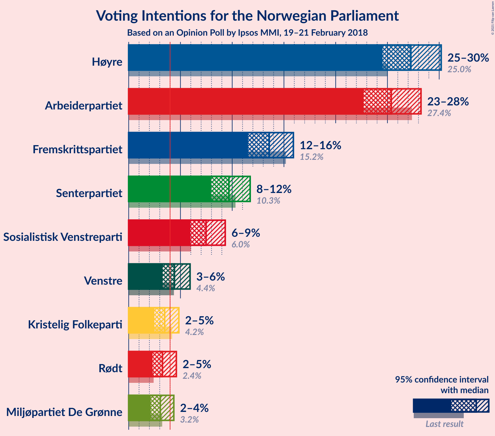

### Confidence Intervals

| Party | Last Result | Poll Result | 80% Confidence Interval | 90% Confidence Interval | 95% Confidence Interval | 99% Confidence Interval |
|:-----:|:-----------:|:-----------:|:-----------------------:|:-----------------------:|:-----------------------:|:-----------------------:|
| Høyre | 25.0% | 27.3% | 25.5–29.2% |25.0–29.7% |24.5–30.2% |23.7–31.1% |
| Arbeiderpartiet | 27.4% | 25.4% | 23.6–27.3% |23.1–27.8% |22.7–28.2% |21.9–29.2% |
| Fremskrittspartiet | 15.2% | 13.6% | 12.2–15.1% |11.9–15.5% |11.5–15.9% |10.9–16.7% |
| Senterpartiet | 10.3% | 9.7% | 8.6–11.0% |8.2–11.4% |8.0–11.7% |7.4–12.4% |
| Sosialistisk Venstreparti | 6.0% | 7.5% | 6.5–8.7% |6.2–9.0% |6.0–9.3% |5.5–9.9% |
| Venstre | 4.4% | 4.4% | 3.7–5.4% |3.5–5.7% |3.3–5.9% |3.0–6.4% |
| Kristelig Folkeparti | 4.2% | 3.5% | 2.8–4.4% |2.6–4.6% |2.5–4.8% |2.2–5.3% |
| Rødt | 2.4% | 3.3% | 2.6–4.1% |2.5–4.4% |2.3–4.6% |2.0–5.1% |
| Miljøpartiet De Grønne | 3.2% | 3.1% | 2.4–3.9% |2.3–4.1% |2.1–4.4% |1.9–4.8% |

*Note:* The poll result column reflects the actual value used in the calculations. Published results may vary slightly, and in addition be rounded to fewer digits.

## Seats

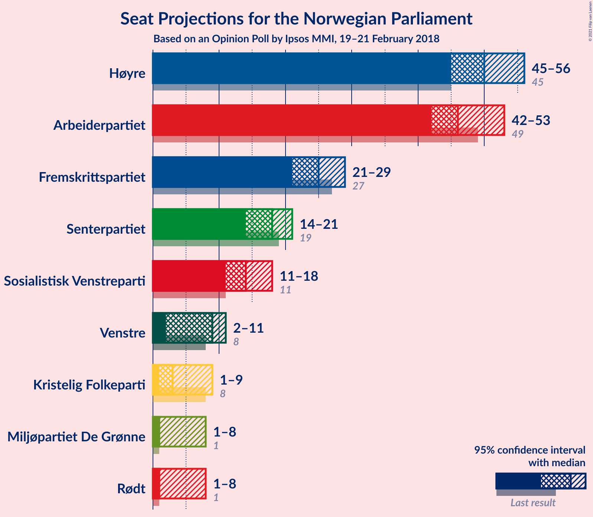

### Confidence Intervals

| Party | Last Result | Median | 80% Confidence Interval | 90% Confidence Interval | 95% Confidence Interval | 99% Confidence Interval |
|:-----:|:-----------:|:------:|:-----------------------:|:-----------------------:|:-----------------------:|:-----------------------:|
| <a href="#høyre">Høyre</a> | 45 | 50 | 47–54 |46–56 |45–56 |43–58 |
| <a href="#arbeiderpartiet">Arbeiderpartiet</a> | 49 | 46 | 43–51 |43–51 |42–52 |40–53 |
| <a href="#fremskrittspartiet">Fremskrittspartiet</a> | 27 | 25 | 22–28 |22–29 |21–29 |20–30 |
| <a href="#senterpartiet">Senterpartiet</a> | 19 | 18 | 16–21 |15–21 |15–21 |14–23 |
| <a href="#sosialistisk-venstreparti">Sosialistisk Venstreparti</a> | 11 | 15 | 12–16 |12–17 |11–18 |10–18 |
| <a href="#venstre">Venstre</a> | 8 | 9 | 2–9 |2–10 |2–11 |2–12 |
| <a href="#kristelig-folkeparti">Kristelig Folkeparti</a> | 8 | 3 | 1–3 |1–8 |1–8 |0–9 |
| <a href="#rødt">Rødt</a> | 1 | 1 | 1–2 |1–7 |1–8 |1–9 |
| <a href="#miljøpartiet-de-grønne">Miljøpartiet De Grønne</a> | 1 | 1 | 1–7 |1–8 |1–8 |1–8 |

### Høyre

*For a full overview of the results for this party, see the [Høyre](party-høyre.html) page.*

| Number of Seats | Probability | Accumulated | Special Marks |
|:---------------:|:-----------:|:-----------:|:-------------:|
| 41 | 0% | 100% |  |
| 42 | 0.4% | 99.9% |  |
| 43 | 0.6% | 99.6% |  |
| 44 | 0.8% | 99.0% |  |
| 45 | 0.9% | 98% | Last Result |
| 46 | 5% | 97% |  |
| 47 | 3% | 93% |  |
| 48 | 6% | 89% |  |
| 49 | 29% | 83% |  |
| 50 | 6% | 54% | Median |
| 51 | 10% | 48% |  |
| 52 | 19% | 38% |  |
| 53 | 9% | 19% |  |
| 54 | 4% | 10% |  |
| 55 | 0.5% | 6% |  |
| 56 | 3% | 5% |  |
| 57 | 1.2% | 2% |  |
| 58 | 0.4% | 0.8% |  |
| 59 | 0.1% | 0.5% |  |
| 60 | 0.4% | 0.4% |  |
| 61 | 0% | 0% |  |

### Arbeiderpartiet

*For a full overview of the results for this party, see the [Arbeiderpartiet](party-arbeiderpartiet.html) page.*

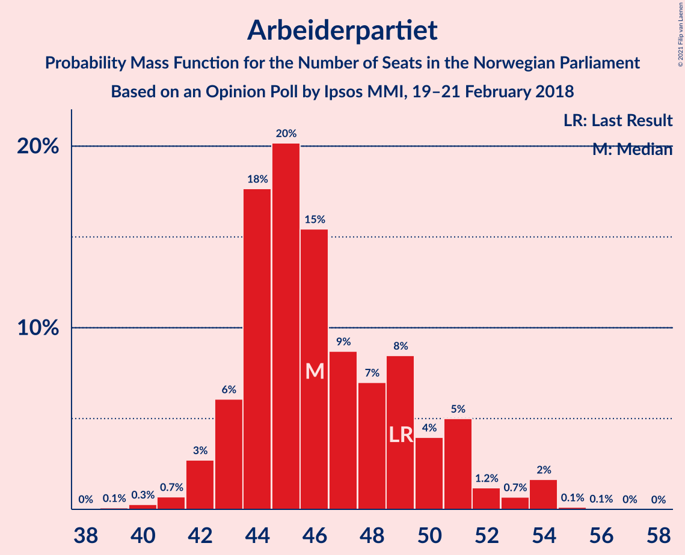

| Number of Seats | Probability | Accumulated | Special Marks |
|:---------------:|:-----------:|:-----------:|:-------------:|
| 38 | 0% | 100% |  |
| 39 | 0.1% | 99.9% |  |
| 40 | 0.4% | 99.9% |  |
| 41 | 0.5% | 99.5% |  |
| 42 | 3% | 99.0% |  |
| 43 | 7% | 96% |  |
| 44 | 3% | 89% |  |
| 45 | 32% | 86% |  |
| 46 | 9% | 53% | Median |
| 47 | 12% | 44% |  |
| 48 | 4% | 32% |  |
| 49 | 11% | 28% | Last Result |
| 50 | 4% | 17% |  |
| 51 | 10% | 13% |  |
| 52 | 2% | 3% |  |
| 53 | 1.2% | 1.4% |  |
| 54 | 0.1% | 0.2% |  |
| 55 | 0.1% | 0.1% |  |
| 56 | 0% | 0.1% |  |
| 57 | 0% | 0.1% |  |
| 58 | 0% | 0% |  |

### Fremskrittspartiet

*For a full overview of the results for this party, see the [Fremskrittspartiet](party-fremskrittspartiet.html) page.*

| Number of Seats | Probability | Accumulated | Special Marks |
|:---------------:|:-----------:|:-----------:|:-------------:|
| 19 | 0.2% | 100% |  |
| 20 | 1.1% | 99.8% |  |
| 21 | 3% | 98.7% |  |
| 22 | 8% | 95% |  |
| 23 | 16% | 88% |  |
| 24 | 7% | 72% |  |
| 25 | 20% | 64% | Median |
| 26 | 4% | 45% |  |
| 27 | 3% | 40% | Last Result |
| 28 | 32% | 37% |  |
| 29 | 4% | 5% |  |
| 30 | 1.3% | 2% |  |
| 31 | 0.4% | 0.5% |  |
| 32 | 0.1% | 0.1% |  |
| 33 | 0% | 0% |  |

### Senterpartiet

*For a full overview of the results for this party, see the [Senterpartiet](party-senterpartiet.html) page.*

| Number of Seats | Probability | Accumulated | Special Marks |
|:---------------:|:-----------:|:-----------:|:-------------:|
| 12 | 0.1% | 100% |  |
| 13 | 0.2% | 99.9% |  |
| 14 | 1.3% | 99.7% |  |
| 15 | 6% | 98% |  |
| 16 | 10% | 93% |  |
| 17 | 16% | 83% |  |
| 18 | 31% | 67% | Median |
| 19 | 15% | 36% | Last Result |
| 20 | 7% | 20% |  |
| 21 | 11% | 13% |  |
| 22 | 2% | 2% |  |
| 23 | 0.6% | 0.7% |  |
| 24 | 0.1% | 0.1% |  |
| 25 | 0% | 0% |  |

### Sosialistisk Venstreparti

*For a full overview of the results for this party, see the [Sosialistisk Venstreparti](party-sosialistiskvenstreparti.html) page.*

| Number of Seats | Probability | Accumulated | Special Marks |
|:---------------:|:-----------:|:-----------:|:-------------:|
| 9 | 0.1% | 100% |  |
| 10 | 0.8% | 99.9% |  |
| 11 | 3% | 99.2% | Last Result |
| 12 | 10% | 96% |  |
| 13 | 10% | 87% |  |
| 14 | 18% | 77% |  |
| 15 | 45% | 59% | Median |
| 16 | 6% | 14% |  |
| 17 | 4% | 8% |  |
| 18 | 4% | 4% |  |
| 19 | 0.4% | 0.5% |  |
| 20 | 0% | 0% |  |

### Venstre

*For a full overview of the results for this party, see the [Venstre](party-venstre.html) page.*

| Number of Seats | Probability | Accumulated | Special Marks |
|:---------------:|:-----------:|:-----------:|:-------------:|
| 2 | 16% | 100% |  |
| 3 | 7% | 84% |  |
| 4 | 0% | 77% |  |
| 5 | 0% | 77% |  |
| 6 | 0.1% | 77% |  |
| 7 | 7% | 76% |  |
| 8 | 16% | 69% | Last Result |
| 9 | 44% | 54% | Median |
| 10 | 5% | 9% |  |
| 11 | 3% | 4% |  |
| 12 | 0.8% | 0.9% |  |
| 13 | 0% | 0.1% |  |
| 14 | 0% | 0% |  |

### Kristelig Folkeparti

*For a full overview of the results for this party, see the [Kristelig Folkeparti](party-kristeligfolkeparti.html) page.*

| Number of Seats | Probability | Accumulated | Special Marks |
|:---------------:|:-----------:|:-----------:|:-------------:|
| 0 | 2% | 100% |  |
| 1 | 23% | 98% |  |
| 2 | 5% | 75% |  |
| 3 | 61% | 70% | Median |
| 4 | 0% | 10% |  |
| 5 | 0% | 10% |  |
| 6 | 0% | 10% |  |
| 7 | 4% | 10% |  |
| 8 | 4% | 6% | Last Result |
| 9 | 2% | 2% |  |
| 10 | 0.4% | 0.5% |  |
| 11 | 0% | 0% |  |

### Rødt

*For a full overview of the results for this party, see the [Rødt](party-rødt.html) page.*

| Number of Seats | Probability | Accumulated | Special Marks |
|:---------------:|:-----------:|:-----------:|:-------------:|
| 1 | 51% | 100% | Last Result, Median |
| 2 | 43% | 49% |  |
| 3 | 0% | 6% |  |
| 4 | 0% | 6% |  |
| 5 | 0% | 6% |  |
| 6 | 0% | 6% |  |
| 7 | 2% | 6% |  |
| 8 | 2% | 4% |  |
| 9 | 2% | 2% |  |
| 10 | 0.2% | 0.3% |  |
| 11 | 0% | 0% |  |

### Miljøpartiet De Grønne

*For a full overview of the results for this party, see the [Miljøpartiet De Grønne](party-miljøpartietdegrønne.html) page.*

| Number of Seats | Probability | Accumulated | Special Marks |
|:---------------:|:-----------:|:-----------:|:-------------:|
| 0 | 0.4% | 100% |  |
| 1 | 70% | 99.6% | Last Result, Median |
| 2 | 19% | 30% |  |
| 3 | 0.5% | 11% |  |
| 4 | 0% | 10% |  |
| 5 | 0% | 10% |  |
| 6 | 0% | 10% |  |
| 7 | 2% | 10% |  |
| 8 | 8% | 8% |  |
| 9 | 0.2% | 0.2% |  |
| 10 | 0% | 0% |  |

## Coalitions

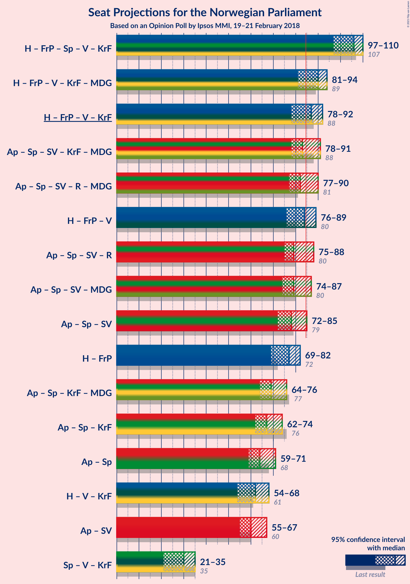

### Confidence Intervals

| Coalition | Last Result | Median | Majority? | 80% Confidence Interval | 90% Confidence Interval | 95% Confidence Interval | 99% Confidence Interval |
|:---------:|:-----------:|:------:|:---------:|:-----------------------:|:-----------------------:|:-----------------------:|:-----------------------:|
| Høyre – Fremskrittspartiet – Senterpartiet – Venstre – Kristelig Folkeparti | 107 | 106 | 100% | 100–108 | 98–108 | 97–110 | 93–113 |
| Høyre – Fremskrittspartiet – Venstre – Kristelig Folkeparti – Miljøpartiet De Grønne | 89 | 89 | 80% | 83–91 | 83–92 | 81–94 | 78–96 |
| Høyre – Fremskrittspartiet – Venstre – Kristelig Folkeparti | 88 | 87 | 61% | 82–89 | 80–90 | 78–93 | 76–94 |
| Arbeiderpartiet – Senterpartiet – Sosialistisk Venstreparti – Kristelig Folkeparti – Miljøpartiet De Grønne | 88 | 83 | 40% | 80–89 | 79–90 | 78–91 | 75–93 |
| Arbeiderpartiet – Senterpartiet – Sosialistisk Venstreparti – Rødt – Miljøpartiet De Grønne | 81 | 82 | 39% | 80–87 | 79–89 | 76–91 | 75–93 |
| Arbeiderpartiet – Senterpartiet – Sosialistisk Venstreparti – Rødt | 80 | 80 | 20% | 78–85 | 77–86 | 75–88 | 73–91 |
| Høyre – Fremskrittspartiet – Venstre | 80 | 84 | 45% | 79–87 | 76–88 | 75–88 | 72–92 |
| Arbeiderpartiet – Senterpartiet – Sosialistisk Venstreparti – Miljøpartiet De Grønne | 80 | 80 | 18% | 78–86 | 76–87 | 74–88 | 72–90 |
| Arbeiderpartiet – Senterpartiet – Sosialistisk Venstreparti | 79 | 78 | 7% | 76–83 | 74–85 | 72–85 | 71–87 |
| Høyre – Fremskrittspartiet | 72 | 77 | 1.2% | 72–79 | 71–80 | 69–83 | 67–85 |
| Arbeiderpartiet – Senterpartiet – Kristelig Folkeparti – Miljøpartiet De Grønne | 77 | 69 | 0% | 66–75 | 65–75 | 64–76 | 62–79 |
| Arbeiderpartiet – Senterpartiet – Kristelig Folkeparti | 76 | 67 | 0% | 64–72 | 63–73 | 62–74 | 60–76 |
| Arbeiderpartiet – Senterpartiet | 68 | 64 | 0% | 62–68 | 61–70 | 59–71 | 58–72 |
| Høyre – Venstre – Kristelig Folkeparti | 61 | 61 | 0% | 57–65 | 56–67 | 54–68 | 51–69 |
| Arbeiderpartiet – Sosialistisk Venstreparti | 60 | 60 | 0% | 58–65 | 57–67 | 55–67 | 53–69 |
| Senterpartiet – Venstre – Kristelig Folkeparti | 35 | 30 | 0% | 23–32 | 21–33 | 21–35 | 18–37 |

### Høyre – Fremskrittspartiet – Senterpartiet – Venstre – Kristelig Folkeparti

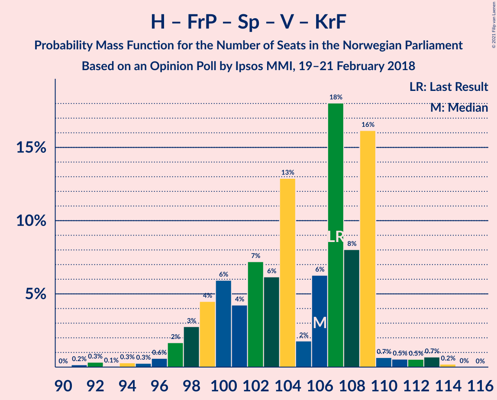

| Number of Seats | Probability | Accumulated | Special Marks |
|:---------------:|:-----------:|:-----------:|:-------------:|
| 91 | 0.3% | 100% |  |
| 92 | 0.1% | 99.7% |  |
| 93 | 0.1% | 99.6% |  |
| 94 | 0.1% | 99.5% |  |
| 95 | 0.1% | 99.3% |  |
| 96 | 0.7% | 99.2% |  |
| 97 | 3% | 98.6% |  |
| 98 | 3% | 95% |  |
| 99 | 2% | 92% |  |
| 100 | 11% | 91% |  |
| 101 | 7% | 80% |  |
| 102 | 11% | 73% |  |
| 103 | 5% | 62% |  |
| 104 | 5% | 57% |  |
| 105 | 1.1% | 52% | Median |
| 106 | 6% | 51% |  |
| 107 | 30% | 45% | Last Result |
| 108 | 12% | 15% |  |
| 109 | 1.0% | 4% |  |
| 110 | 0.9% | 3% |  |
| 111 | 0.3% | 2% |  |
| 112 | 0.3% | 2% |  |
| 113 | 1.1% | 1.2% |  |
| 114 | 0% | 0% |  |

### Høyre – Fremskrittspartiet – Venstre – Kristelig Folkeparti – Miljøpartiet De Grønne

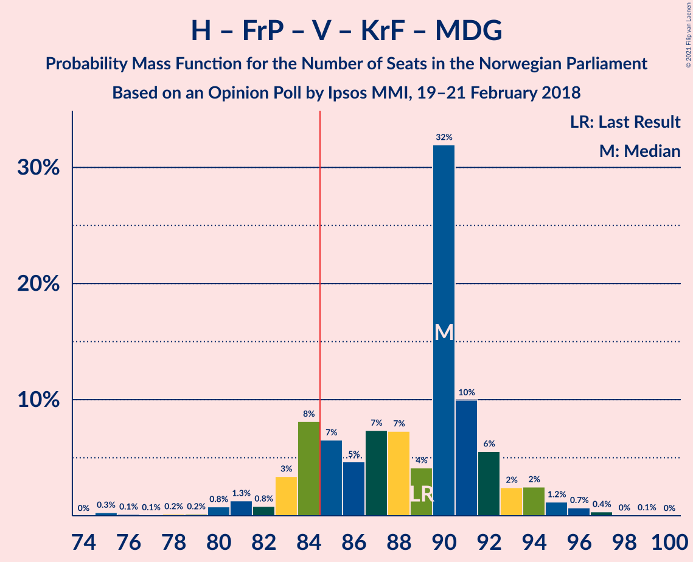

| Number of Seats | Probability | Accumulated | Special Marks |
|:---------------:|:-----------:|:-----------:|:-------------:|
| 76 | 0.2% | 100% |  |
| 77 | 0.2% | 99.7% |  |
| 78 | 0.2% | 99.6% |  |
| 79 | 0.1% | 99.4% |  |
| 80 | 0.5% | 99.4% |  |
| 81 | 2% | 98.9% |  |
| 82 | 1.2% | 97% |  |
| 83 | 6% | 96% |  |
| 84 | 10% | 90% |  |
| 85 | 9% | 80% | Majority |
| 86 | 4% | 70% |  |
| 87 | 3% | 66% |  |
| 88 | 9% | 63% | Median |
| 89 | 5% | 54% | Last Result |
| 90 | 30% | 49% |  |
| 91 | 12% | 19% |  |
| 92 | 2% | 6% |  |
| 93 | 2% | 5% |  |
| 94 | 0.9% | 3% |  |
| 95 | 1.3% | 2% |  |
| 96 | 0.6% | 0.8% |  |
| 97 | 0.1% | 0.2% |  |
| 98 | 0.1% | 0.1% |  |
| 99 | 0% | 0% |  |

### Høyre – Fremskrittspartiet – Venstre – Kristelig Folkeparti

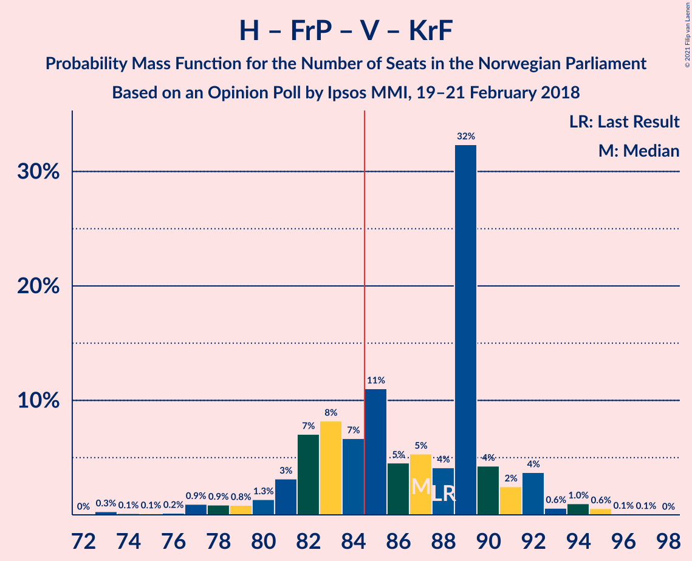

| Number of Seats | Probability | Accumulated | Special Marks |
|:---------------:|:-----------:|:-----------:|:-------------:|
| 74 | 0.2% | 100% |  |
| 75 | 0.2% | 99.7% |  |
| 76 | 0.1% | 99.6% |  |
| 77 | 2% | 99.4% |  |
| 78 | 0.4% | 98% |  |
| 79 | 1.1% | 97% |  |
| 80 | 2% | 96% |  |
| 81 | 2% | 94% |  |
| 82 | 7% | 92% |  |
| 83 | 15% | 85% |  |
| 84 | 9% | 70% |  |
| 85 | 4% | 61% | Majority |
| 86 | 6% | 58% |  |
| 87 | 8% | 52% | Median |
| 88 | 4% | 44% | Last Result |
| 89 | 31% | 40% |  |
| 90 | 5% | 9% |  |
| 91 | 0.4% | 4% |  |
| 92 | 1.3% | 4% |  |
| 93 | 0.8% | 3% |  |
| 94 | 1.4% | 2% |  |
| 95 | 0.2% | 0.3% |  |
| 96 | 0.1% | 0.2% |  |
| 97 | 0% | 0% |  |

### Arbeiderpartiet – Senterpartiet – Sosialistisk Venstreparti – Kristelig Folkeparti – Miljøpartiet De Grønne

| Number of Seats | Probability | Accumulated | Special Marks |
|:---------------:|:-----------:|:-----------:|:-------------:|
| 72 | 0% | 100% |  |
| 73 | 0% | 99.9% |  |
| 74 | 0.4% | 99.9% |  |
| 75 | 0.2% | 99.5% |  |
| 76 | 0.1% | 99.4% |  |
| 77 | 1.3% | 99.3% |  |
| 78 | 0.5% | 98% |  |
| 79 | 3% | 97% |  |
| 80 | 7% | 95% |  |
| 81 | 8% | 88% |  |
| 82 | 25% | 80% |  |
| 83 | 8% | 55% | Median |
| 84 | 7% | 47% |  |
| 85 | 10% | 40% | Majority |
| 86 | 4% | 29% |  |
| 87 | 7% | 25% |  |
| 88 | 6% | 19% | Last Result |
| 89 | 6% | 12% |  |
| 90 | 3% | 7% |  |
| 91 | 2% | 4% |  |
| 92 | 2% | 2% |  |
| 93 | 0.1% | 0.5% |  |
| 94 | 0.1% | 0.4% |  |
| 95 | 0.1% | 0.4% |  |
| 96 | 0.2% | 0.2% |  |
| 97 | 0% | 0.1% |  |
| 98 | 0% | 0.1% |  |
| 99 | 0% | 0% |  |

### Arbeiderpartiet – Senterpartiet – Sosialistisk Venstreparti – Rødt – Miljøpartiet De Grønne

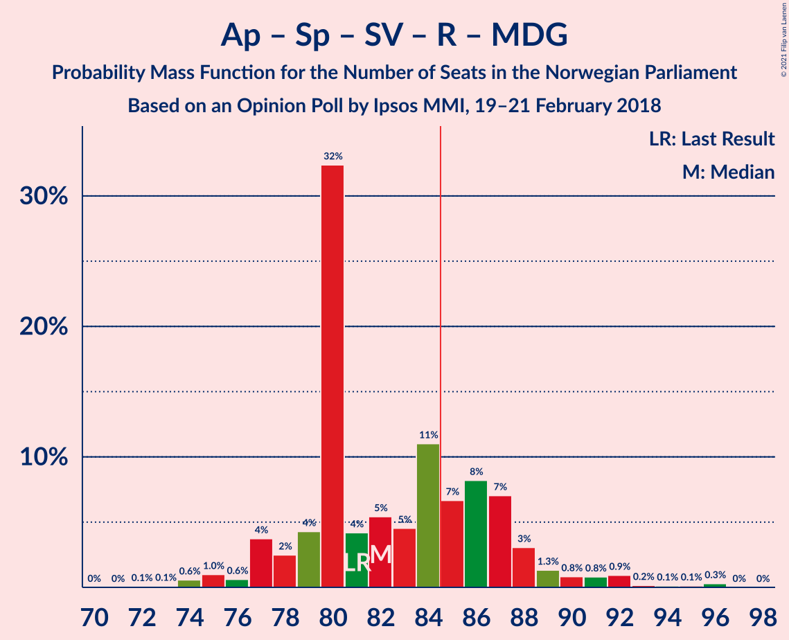

| Number of Seats | Probability | Accumulated | Special Marks |
|:---------------:|:-----------:|:-----------:|:-------------:|
| 73 | 0.1% | 100% |  |
| 74 | 0.2% | 99.8% |  |
| 75 | 1.4% | 99.6% |  |
| 76 | 0.9% | 98% |  |
| 77 | 1.3% | 97% |  |
| 78 | 0.4% | 96% |  |
| 79 | 5% | 96% |  |
| 80 | 31% | 91% |  |
| 81 | 4% | 60% | Last Result, Median |
| 82 | 8% | 56% |  |
| 83 | 6% | 48% |  |
| 84 | 4% | 42% |  |
| 85 | 9% | 39% | Majority |
| 86 | 15% | 30% |  |
| 87 | 7% | 15% |  |
| 88 | 2% | 8% |  |
| 89 | 2% | 6% |  |
| 90 | 1.0% | 4% |  |
| 91 | 0.4% | 3% |  |
| 92 | 2% | 2% |  |
| 93 | 0.1% | 0.5% |  |
| 94 | 0.2% | 0.4% |  |
| 95 | 0.2% | 0.3% |  |
| 96 | 0% | 0% |  |

### Arbeiderpartiet – Senterpartiet – Sosialistisk Venstreparti – Rødt

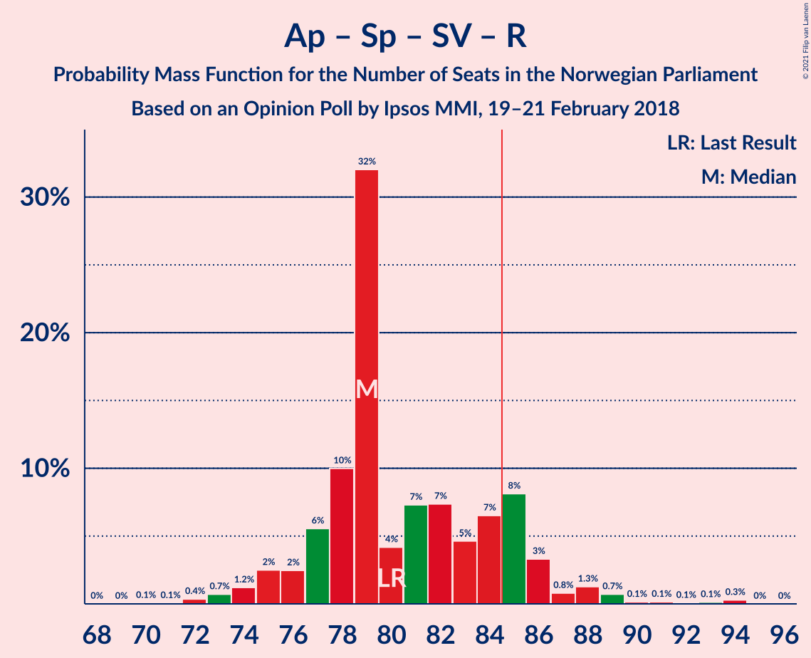

| Number of Seats | Probability | Accumulated | Special Marks |
|:---------------:|:-----------:|:-----------:|:-------------:|
| 71 | 0.1% | 100% |  |
| 72 | 0.1% | 99.9% |  |
| 73 | 0.6% | 99.8% |  |
| 74 | 1.4% | 99.1% |  |
| 75 | 0.9% | 98% |  |
| 76 | 2% | 97% |  |
| 77 | 2% | 95% |  |
| 78 | 12% | 93% |  |
| 79 | 31% | 81% |  |
| 80 | 5% | 51% | Last Result, Median |
| 81 | 9% | 46% |  |
| 82 | 3% | 37% |  |
| 83 | 4% | 34% |  |
| 84 | 9% | 30% |  |
| 85 | 10% | 20% | Majority |
| 86 | 6% | 10% |  |
| 87 | 1.2% | 4% |  |
| 88 | 2% | 3% |  |
| 89 | 0.5% | 1.1% |  |
| 90 | 0% | 0.6% |  |
| 91 | 0.2% | 0.5% |  |
| 92 | 0.2% | 0.4% |  |
| 93 | 0.2% | 0.2% |  |
| 94 | 0% | 0% |  |

### Høyre – Fremskrittspartiet – Venstre

| Number of Seats | Probability | Accumulated | Special Marks |
|:---------------:|:-----------:|:-----------:|:-------------:|
| 69 | 0% | 100% |  |
| 70 | 0.1% | 99.9% |  |
| 71 | 0.2% | 99.8% |  |
| 72 | 0.2% | 99.6% |  |
| 73 | 0.2% | 99.4% |  |
| 74 | 0.2% | 99.2% |  |
| 75 | 2% | 99.0% |  |
| 76 | 3% | 97% |  |
| 77 | 2% | 95% |  |
| 78 | 2% | 93% |  |
| 79 | 6% | 90% |  |
| 80 | 10% | 85% | Last Result |
| 81 | 6% | 75% |  |
| 82 | 11% | 69% |  |
| 83 | 7% | 58% |  |
| 84 | 6% | 51% | Median |
| 85 | 5% | 45% | Majority |
| 86 | 28% | 40% |  |
| 87 | 6% | 12% |  |
| 88 | 3% | 6% |  |
| 89 | 0.2% | 2% |  |
| 90 | 0.6% | 2% |  |
| 91 | 0.9% | 1.4% |  |
| 92 | 0.1% | 0.5% |  |
| 93 | 0.4% | 0.4% |  |
| 94 | 0% | 0% |  |

### Arbeiderpartiet – Senterpartiet – Sosialistisk Venstreparti – Miljøpartiet De Grønne

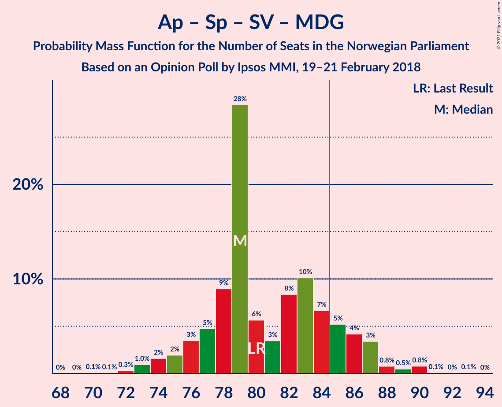

| Number of Seats | Probability | Accumulated | Special Marks |
|:---------------:|:-----------:|:-----------:|:-------------:|
| 69 | 0% | 100% |  |
| 70 | 0% | 99.9% |  |
| 71 | 0.1% | 99.9% |  |
| 72 | 0.5% | 99.8% |  |
| 73 | 0.5% | 99.3% |  |
| 74 | 2% | 98.9% |  |
| 75 | 1.5% | 97% |  |
| 76 | 1.1% | 95% |  |
| 77 | 3% | 94% |  |
| 78 | 11% | 91% |  |
| 79 | 25% | 80% |  |
| 80 | 8% | 54% | Last Result, Median |
| 81 | 3% | 47% |  |
| 82 | 7% | 43% |  |
| 83 | 7% | 37% |  |
| 84 | 11% | 29% |  |
| 85 | 6% | 18% | Majority |
| 86 | 6% | 12% |  |
| 87 | 3% | 6% |  |
| 88 | 0.9% | 3% |  |
| 89 | 0.2% | 2% |  |
| 90 | 2% | 2% |  |
| 91 | 0% | 0.2% |  |
| 92 | 0.1% | 0.2% |  |
| 93 | 0.1% | 0.2% |  |
| 94 | 0% | 0% |  |

### Arbeiderpartiet – Senterpartiet – Sosialistisk Venstreparti

| Number of Seats | Probability | Accumulated | Special Marks |
|:---------------:|:-----------:|:-----------:|:-------------:|
| 67 | 0% | 100% |  |
| 68 | 0% | 99.9% |  |
| 69 | 0.1% | 99.9% |  |
| 70 | 0.3% | 99.8% |  |
| 71 | 0.8% | 99.6% |  |
| 72 | 1.4% | 98.8% |  |
| 73 | 1.2% | 97% |  |
| 74 | 2% | 96% |  |
| 75 | 1.4% | 94% |  |
| 76 | 8% | 93% |  |
| 77 | 14% | 85% |  |
| 78 | 26% | 71% |  |
| 79 | 8% | 46% | Last Result, Median |
| 80 | 6% | 38% |  |
| 81 | 4% | 31% |  |
| 82 | 8% | 28% |  |
| 83 | 11% | 20% |  |
| 84 | 2% | 9% |  |
| 85 | 5% | 7% | Majority |
| 86 | 2% | 2% |  |
| 87 | 0.2% | 0.6% |  |
| 88 | 0.2% | 0.4% |  |
| 89 | 0% | 0.2% |  |
| 90 | 0% | 0.2% |  |
| 91 | 0.1% | 0.1% |  |
| 92 | 0% | 0% |  |

### Høyre – Fremskrittspartiet

| Number of Seats | Probability | Accumulated | Special Marks |
|:---------------:|:-----------:|:-----------:|:-------------:|
| 65 | 0.1% | 100% |  |
| 66 | 0.1% | 99.9% |  |
| 67 | 0.3% | 99.8% |  |
| 68 | 0.8% | 99.5% |  |
| 69 | 1.4% | 98.7% |  |
| 70 | 0.7% | 97% |  |
| 71 | 7% | 97% |  |
| 72 | 5% | 90% | Last Result |
| 73 | 3% | 86% |  |
| 74 | 14% | 82% |  |
| 75 | 4% | 68% | Median |
| 76 | 6% | 64% |  |
| 77 | 40% | 58% |  |
| 78 | 4% | 18% |  |
| 79 | 8% | 14% |  |
| 80 | 1.1% | 6% |  |
| 81 | 2% | 5% |  |
| 82 | 0.3% | 3% |  |
| 83 | 2% | 3% |  |
| 84 | 0% | 1.3% |  |
| 85 | 1.2% | 1.2% | Majority |
| 86 | 0% | 0.1% |  |
| 87 | 0% | 0.1% |  |
| 88 | 0% | 0% |  |

### Arbeiderpartiet – Senterpartiet – Kristelig Folkeparti – Miljøpartiet De Grønne

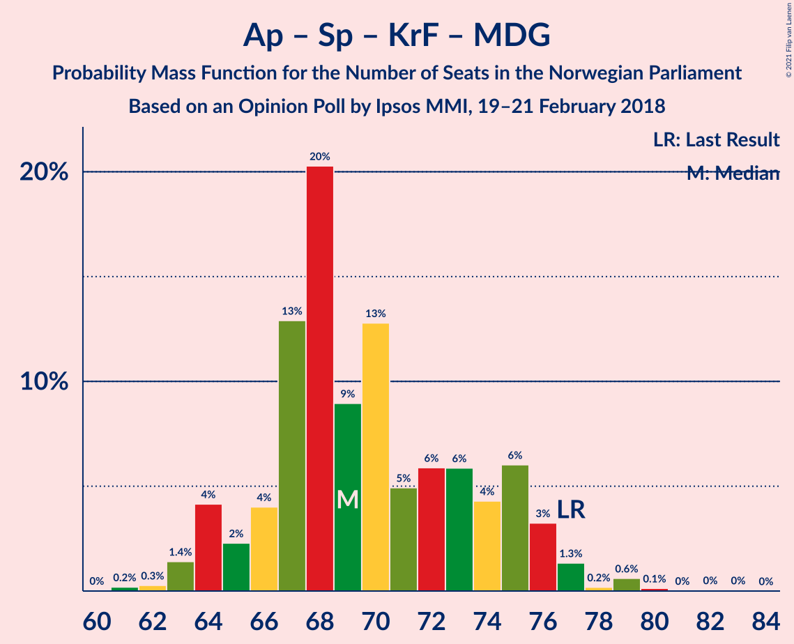

| Number of Seats | Probability | Accumulated | Special Marks |
|:---------------:|:-----------:|:-----------:|:-------------:|
| 59 | 0% | 100% |  |
| 60 | 0% | 99.9% |  |
| 61 | 0.2% | 99.9% |  |
| 62 | 0.5% | 99.7% |  |
| 63 | 0.3% | 99.2% |  |
| 64 | 3% | 98.9% |  |
| 65 | 4% | 96% |  |
| 66 | 5% | 93% |  |
| 67 | 24% | 88% |  |
| 68 | 7% | 64% | Median |
| 69 | 11% | 57% |  |
| 70 | 16% | 45% |  |
| 71 | 4% | 29% |  |
| 72 | 4% | 25% |  |
| 73 | 6% | 21% |  |
| 74 | 4% | 16% |  |
| 75 | 8% | 12% |  |
| 76 | 2% | 4% |  |
| 77 | 1.4% | 2% | Last Result |
| 78 | 0.2% | 0.9% |  |
| 79 | 0.4% | 0.7% |  |
| 80 | 0.1% | 0.3% |  |
| 81 | 0% | 0.2% |  |
| 82 | 0.1% | 0.1% |  |
| 83 | 0% | 0% |  |

### Arbeiderpartiet – Senterpartiet – Kristelig Folkeparti

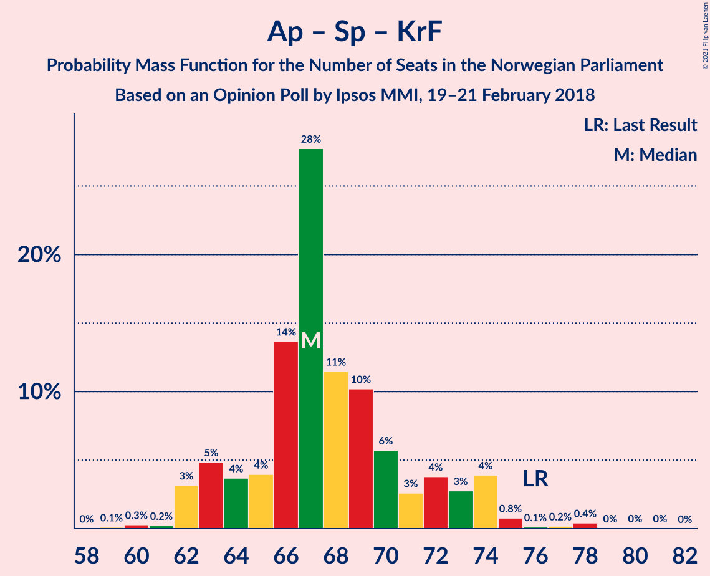

| Number of Seats | Probability | Accumulated | Special Marks |
|:---------------:|:-----------:|:-----------:|:-------------:|
| 57 | 0.1% | 100% |  |
| 58 | 0% | 99.9% |  |
| 59 | 0.1% | 99.9% |  |
| 60 | 0.5% | 99.8% |  |
| 61 | 0.3% | 99.3% |  |
| 62 | 3% | 99.0% |  |
| 63 | 2% | 96% |  |
| 64 | 5% | 95% |  |
| 65 | 5% | 90% |  |
| 66 | 23% | 85% |  |
| 67 | 18% | 62% | Median |
| 68 | 8% | 45% |  |
| 69 | 18% | 36% |  |
| 70 | 4% | 18% |  |
| 71 | 2% | 14% |  |
| 72 | 6% | 12% |  |
| 73 | 2% | 6% |  |
| 74 | 3% | 4% |  |
| 75 | 0.1% | 0.8% |  |
| 76 | 0.2% | 0.7% | Last Result |
| 77 | 0.2% | 0.5% |  |
| 78 | 0.2% | 0.3% |  |
| 79 | 0% | 0.1% |  |
| 80 | 0.1% | 0.1% |  |
| 81 | 0% | 0% |  |

### Arbeiderpartiet – Senterpartiet

| Number of Seats | Probability | Accumulated | Special Marks |
|:---------------:|:-----------:|:-----------:|:-------------:|
| 55 | 0.1% | 100% |  |
| 56 | 0.1% | 99.9% |  |
| 57 | 0.3% | 99.8% |  |
| 58 | 1.0% | 99.5% |  |
| 59 | 1.5% | 98% |  |
| 60 | 1.0% | 97% |  |
| 61 | 5% | 96% |  |
| 62 | 5% | 91% |  |
| 63 | 26% | 86% |  |
| 64 | 16% | 59% | Median |
| 65 | 9% | 43% |  |
| 66 | 7% | 34% |  |
| 67 | 5% | 27% |  |
| 68 | 13% | 23% | Last Result |
| 69 | 4% | 10% |  |
| 70 | 3% | 5% |  |
| 71 | 2% | 3% |  |
| 72 | 0.4% | 0.8% |  |
| 73 | 0.4% | 0.5% |  |
| 74 | 0% | 0.1% |  |
| 75 | 0% | 0% |  |

### Høyre – Venstre – Kristelig Folkeparti

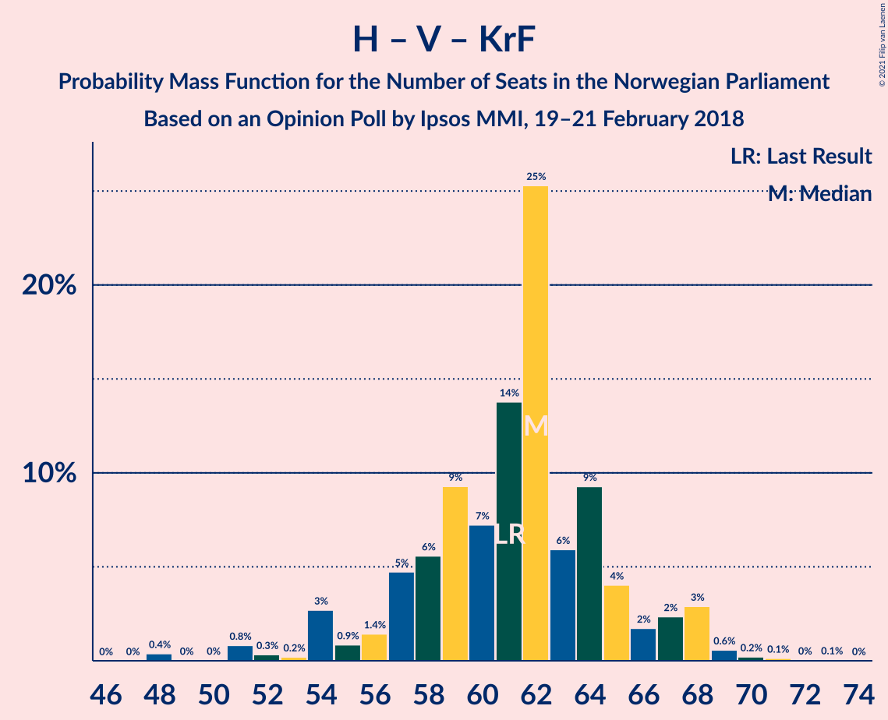

| Number of Seats | Probability | Accumulated | Special Marks |
|:---------------:|:-----------:|:-----------:|:-------------:|
| 48 | 0.2% | 100% |  |
| 49 | 0% | 99.8% |  |
| 50 | 0% | 99.7% |  |
| 51 | 0.6% | 99.7% |  |
| 52 | 0.4% | 99.0% |  |
| 53 | 0.3% | 98.7% |  |
| 54 | 2% | 98% |  |
| 55 | 1.2% | 96% |  |
| 56 | 0.4% | 95% |  |
| 57 | 9% | 95% |  |
| 58 | 10% | 86% |  |
| 59 | 12% | 76% |  |
| 60 | 10% | 64% |  |
| 61 | 25% | 54% | Last Result |
| 62 | 7% | 28% | Median |
| 63 | 3% | 21% |  |
| 64 | 5% | 18% |  |
| 65 | 7% | 14% |  |
| 66 | 1.5% | 7% |  |
| 67 | 3% | 5% |  |
| 68 | 1.0% | 3% |  |
| 69 | 1.0% | 2% |  |
| 70 | 0.3% | 0.5% |  |
| 71 | 0.1% | 0.1% |  |
| 72 | 0% | 0.1% |  |
| 73 | 0% | 0% |  |

### Arbeiderpartiet – Sosialistisk Venstreparti

| Number of Seats | Probability | Accumulated | Special Marks |
|:---------------:|:-----------:|:-----------:|:-------------:|
| 51 | 0% | 100% |  |
| 52 | 0.1% | 99.9% |  |
| 53 | 0.4% | 99.9% |  |
| 54 | 2% | 99.4% |  |
| 55 | 0.6% | 98% |  |
| 56 | 2% | 97% |  |
| 57 | 3% | 96% |  |
| 58 | 11% | 93% |  |
| 59 | 9% | 82% |  |
| 60 | 31% | 72% | Last Result |
| 61 | 5% | 41% | Median |
| 62 | 3% | 36% |  |
| 63 | 7% | 32% |  |
| 64 | 10% | 25% |  |
| 65 | 8% | 16% |  |
| 66 | 0.3% | 8% |  |
| 67 | 6% | 8% |  |
| 68 | 0.3% | 2% |  |
| 69 | 0.9% | 1.3% |  |
| 70 | 0.2% | 0.3% |  |
| 71 | 0% | 0.1% |  |
| 72 | 0.1% | 0.1% |  |
| 73 | 0% | 0% |  |

### Senterpartiet – Venstre – Kristelig Folkeparti

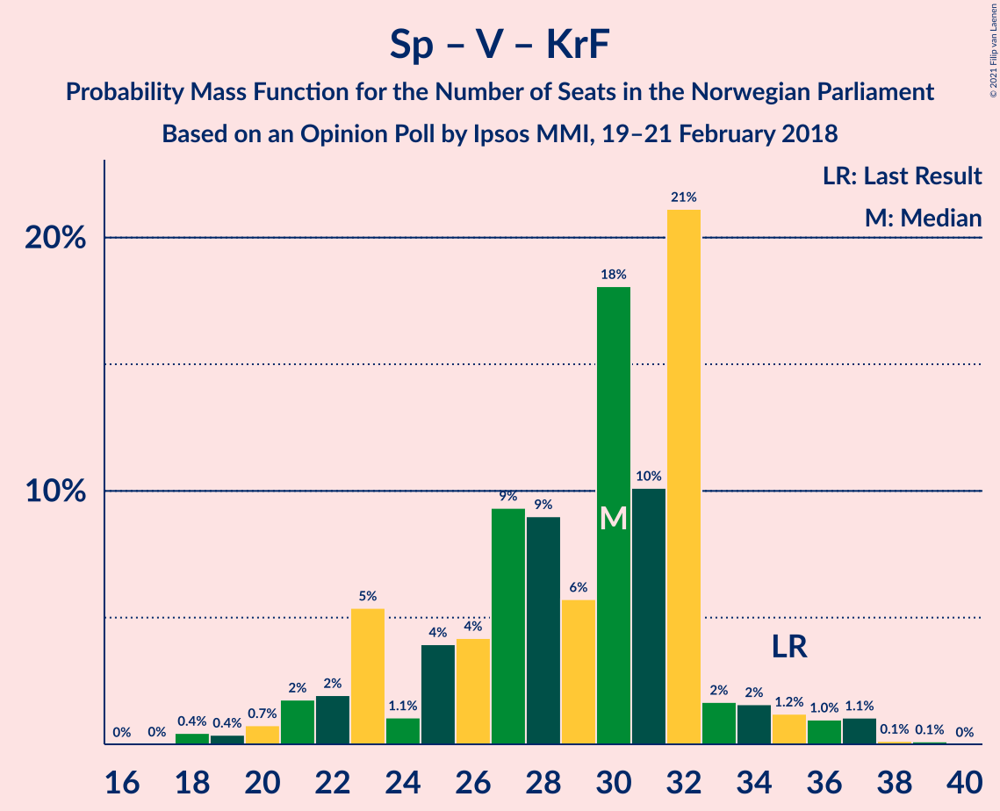

| Number of Seats | Probability | Accumulated | Special Marks |
|:---------------:|:-----------:|:-----------:|:-------------:|
| 18 | 0.9% | 100% |  |
| 19 | 0.6% | 99.1% |  |
| 20 | 0.3% | 98.5% |  |
| 21 | 4% | 98% |  |
| 22 | 0.4% | 95% |  |
| 23 | 10% | 94% |  |
| 24 | 0.8% | 84% |  |
| 25 | 5% | 84% |  |
| 26 | 3% | 78% |  |
| 27 | 11% | 75% |  |
| 28 | 10% | 64% |  |
| 29 | 1.2% | 54% |  |
| 30 | 28% | 53% | Median |
| 31 | 14% | 25% |  |
| 32 | 6% | 12% |  |
| 33 | 1.1% | 5% |  |
| 34 | 0.7% | 4% |  |
| 35 | 2% | 3% | Last Result |
| 36 | 0.6% | 1.5% |  |
| 37 | 0.7% | 0.9% |  |
| 38 | 0% | 0.2% |  |
| 39 | 0.2% | 0.2% |  |
| 40 | 0% | 0% |  |

## Technical Information

### Opinion Poll

+ **Polling firm:** Ipsos MMI
+ **Commissioner(s):** —
+ **Fieldwork period:** 19–21 February 2018

### Calculations

+ **Sample size:** 950
+ **Simulations done:** 131,072
+ **Error estimate:** 2.70%

