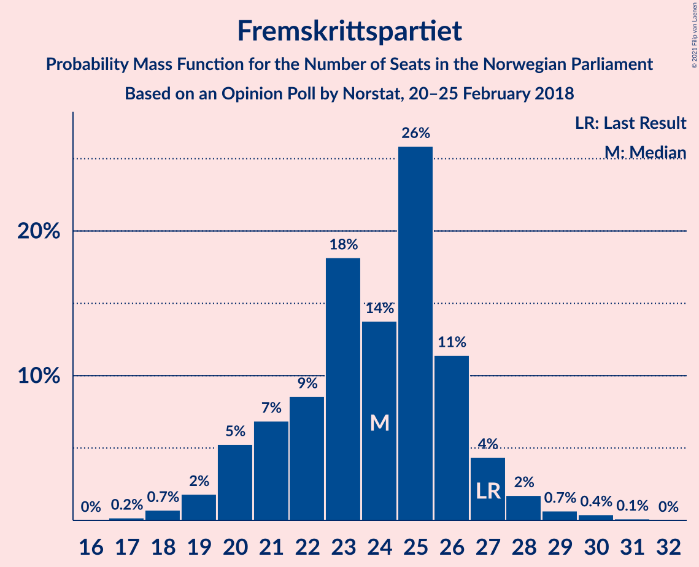
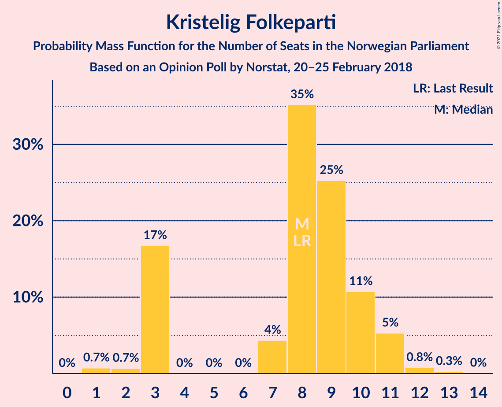
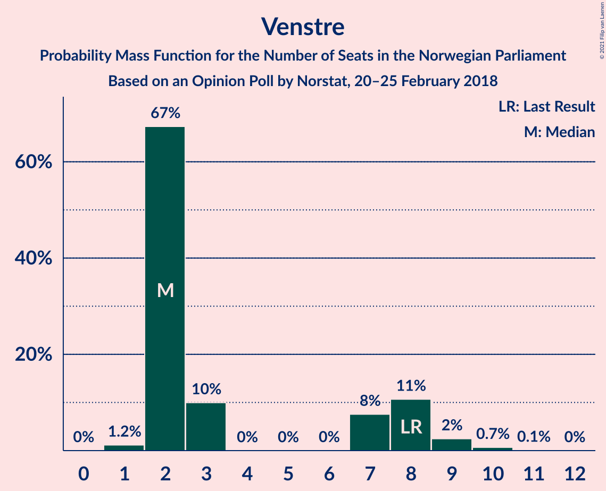
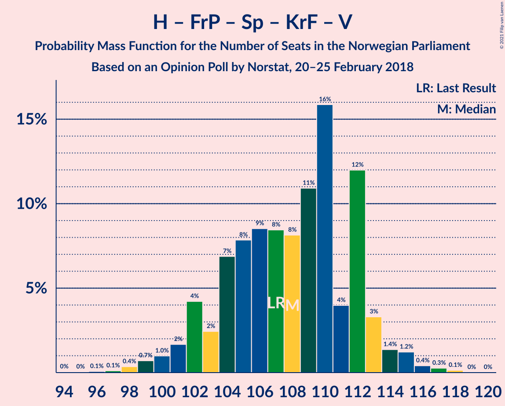
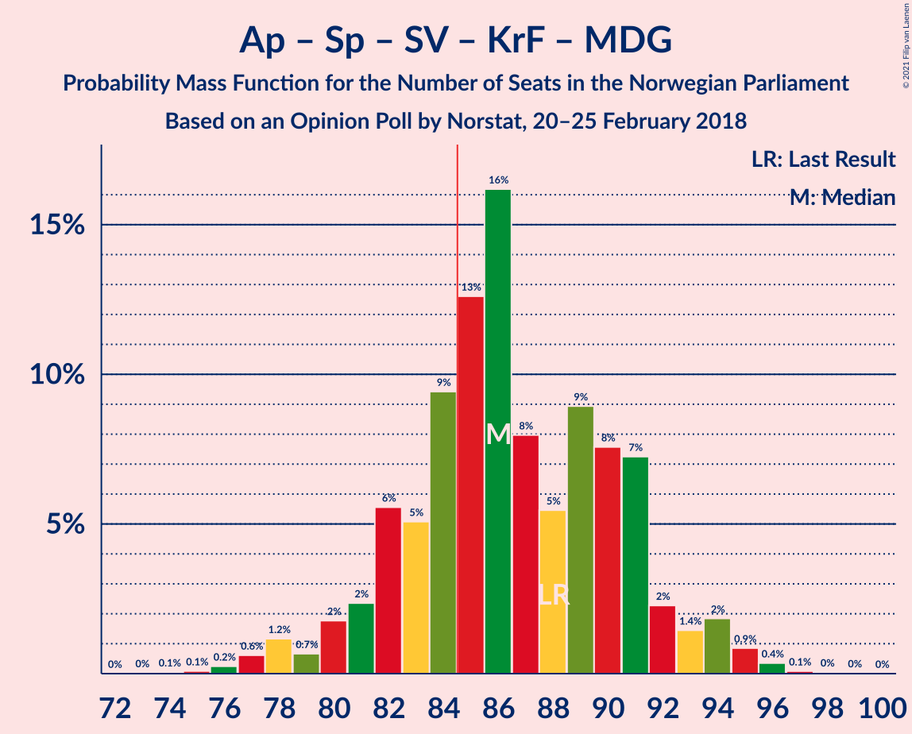
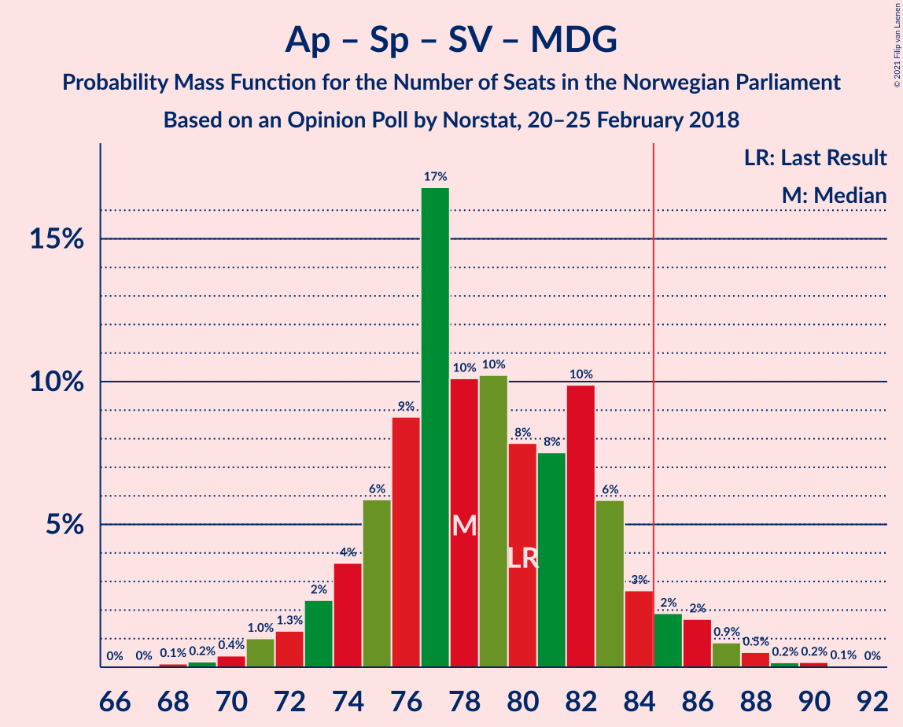
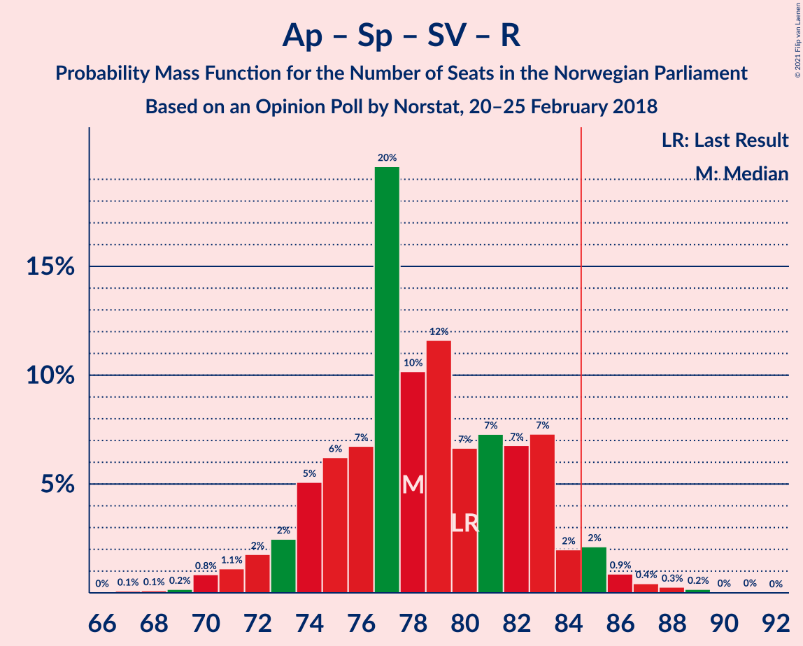
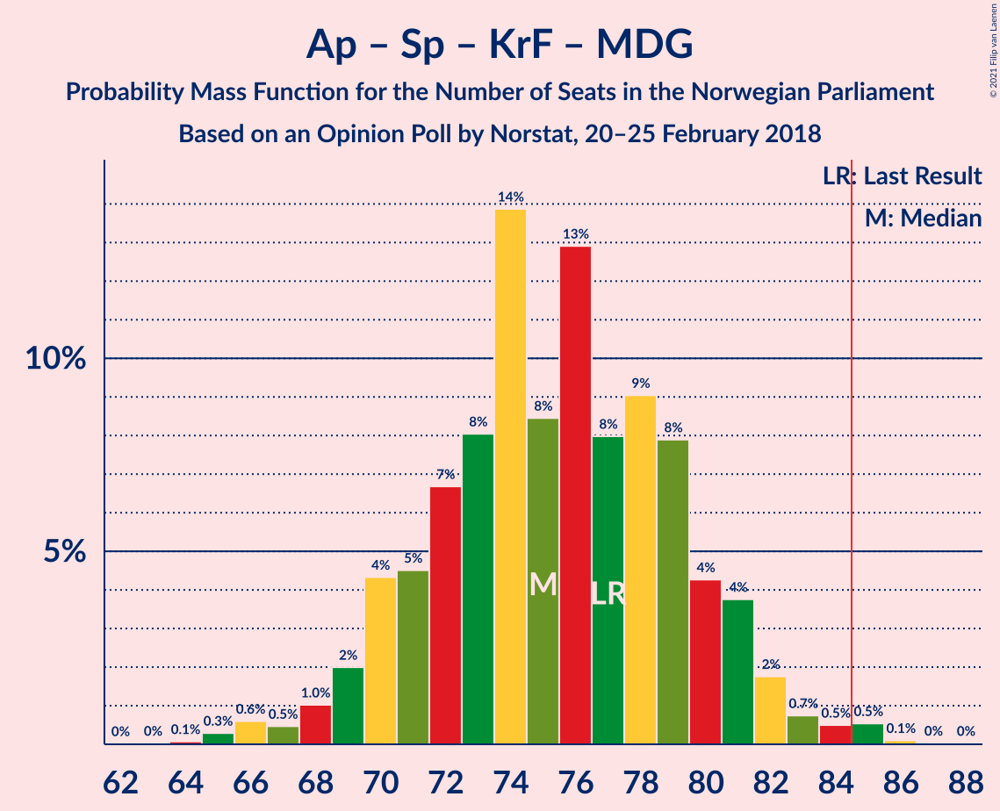
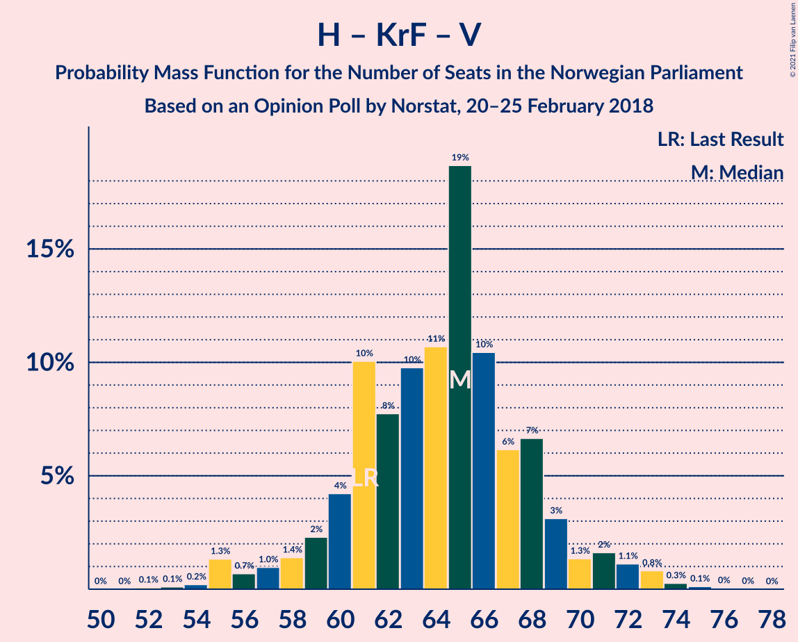

# Opinion Poll by Norstat, 20–25 February 2018

<a href="#voting-intentions">Voting Intentions</a> | <a href="#seats">Seats</a> | <a href="#coalitions">Coalitions</a> | <a href="#technical-information">Technical Information</a>

## Voting Intentions

### Confidence Intervals

| Party | Last Result | Poll Result | 80% Confidence Interval | 90% Confidence Interval | 95% Confidence Interval | 99% Confidence Interval |
|:-----:|:-----------:|:-----------:|:-----------------------:|:-----------------------:|:-----------------------:|:-----------------------:|
| Høyre | 25.0% | 28.8% | 27.0–30.8% |26.5–31.4% |26.0–31.8% |25.1–32.8% |
| Arbeiderpartiet | 27.4% | 24.5% | 22.8–26.4% |22.3–26.9% |21.9–27.4% |21.1–28.3% |
| Fremskrittspartiet | 15.2% | 12.9% | 11.5–14.4% |11.2–14.8% |10.9–15.2% |10.3–15.9% |
| Senterpartiet | 10.3% | 10.8% | 9.6–12.2% |9.3–12.6% |9.0–13.0% |8.4–13.7% |
| Sosialistisk Venstreparti | 6.0% | 6.0% | 5.1–7.1% |4.9–7.4% |4.6–7.7% |4.3–8.3% |
| Kristelig Folkeparti | 4.2% | 4.5% | 3.7–5.5% |3.5–5.8% |3.3–6.0% |3.0–6.6% |
| Venstre | 4.4% | 3.5% | 2.9–4.5% |2.7–4.7% |2.5–4.9% |2.2–5.4% |
| Miljøpartiet De Grønne | 3.2% | 3.3% | 2.7–4.2% |2.5–4.5% |2.3–4.7% |2.1–5.2% |
| Rødt | 2.4% | 3.1% | 2.5–4.0% |2.3–4.2% |2.2–4.4% |1.9–4.9% |

*Note:* The poll result column reflects the actual value used in the calculations. Published results may vary slightly, and in addition be rounded to fewer digits.

## Seats

### Confidence Intervals

| Party | Last Result | Median | 80% Confidence Interval | 90% Confidence Interval | 95% Confidence Interval | 99% Confidence Interval |
|:-----:|:-----------:|:------:|:-----------------------:|:-----------------------:|:-----------------------:|:-----------------------:|
| <a href="#høyre">Høyre</a> | 45 | 52 | 50–56 |49–58 |48–58 |45–60 |
| <a href="#arbeiderpartiet">Arbeiderpartiet</a> | 49 | 46 | 42–50 |41–50 |40–50 |37–53 |
| <a href="#fremskrittspartiet">Fremskrittspartiet</a> | 27 | 24 | 20–26 |20–27 |19–28 |17–30 |
| <a href="#senterpartiet">Senterpartiet</a> | 19 | 19 | 17–24 |17–24 |16–24 |15–26 |
| <a href="#sosialistisk-venstreparti">Sosialistisk Venstreparti</a> | 11 | 11 | 9–13 |9–14 |9–14 |8–15 |
| <a href="#kristelig-folkeparti">Kristelig Folkeparti</a> | 8 | 9 | 3–11 |3–11 |3–11 |1–13 |
| <a href="#venstre">Venstre</a> | 8 | 2 | 2–8 |2–8 |2–8 |1–10 |
| <a href="#miljøpartiet-de-grønne">Miljøpartiet De Grønne</a> | 1 | 2 | 1–8 |1–8 |1–9 |1–9 |
| <a href="#rødt">Rødt</a> | 1 | 2 | 1–2 |1–7 |1–8 |1–9 |

### Høyre

*For a full overview of the results for this party, see the [Høyre](party-høyre.html) page.*

| Number of Seats | Probability | Accumulated | Special Marks |
|:---------------:|:-----------:|:-----------:|:-------------:|
| 43 | 0.1% | 100% |  |
| 44 | 0% | 99.9% |  |
| 45 | 0.4% | 99.9% | Last Result |
| 46 | 0.5% | 99.5% |  |
| 47 | 0.5% | 99.0% |  |
| 48 | 2% | 98.5% |  |
| 49 | 3% | 97% |  |
| 50 | 16% | 94% |  |
| 51 | 15% | 79% |  |
| 52 | 21% | 64% | Median |
| 53 | 17% | 43% |  |
| 54 | 11% | 26% |  |
| 55 | 3% | 15% |  |
| 56 | 4% | 12% |  |
| 57 | 1.4% | 8% |  |
| 58 | 5% | 7% |  |
| 59 | 0.2% | 1.4% |  |
| 60 | 1.0% | 1.1% |  |
| 61 | 0.1% | 0.2% |  |
| 62 | 0% | 0.1% |  |
| 63 | 0.1% | 0.1% |  |
| 64 | 0% | 0% |  |

### Arbeiderpartiet

*For a full overview of the results for this party, see the [Arbeiderpartiet](party-arbeiderpartiet.html) page.*

| Number of Seats | Probability | Accumulated | Special Marks |
|:---------------:|:-----------:|:-----------:|:-------------:|
| 37 | 1.0% | 100% |  |
| 38 | 0.3% | 98.9% |  |
| 39 | 0.9% | 98.6% |  |
| 40 | 1.5% | 98% |  |
| 41 | 5% | 96% |  |
| 42 | 5% | 92% |  |
| 43 | 10% | 87% |  |
| 44 | 4% | 77% |  |
| 45 | 23% | 74% |  |
| 46 | 9% | 50% | Median |
| 47 | 9% | 41% |  |
| 48 | 19% | 32% |  |
| 49 | 3% | 13% | Last Result |
| 50 | 8% | 10% |  |
| 51 | 0.8% | 2% |  |
| 52 | 0.8% | 2% |  |
| 53 | 0.4% | 0.7% |  |
| 54 | 0.2% | 0.3% |  |
| 55 | 0% | 0.1% |  |
| 56 | 0.1% | 0.1% |  |
| 57 | 0% | 0% |  |

### Fremskrittspartiet

*For a full overview of the results for this party, see the [Fremskrittspartiet](party-fremskrittspartiet.html) page.*

| Number of Seats | Probability | Accumulated | Special Marks |
|:---------------:|:-----------:|:-----------:|:-------------:|
| 17 | 0.7% | 100% |  |
| 18 | 0.2% | 99.3% |  |
| 19 | 2% | 99.1% |  |
| 20 | 16% | 97% |  |
| 21 | 7% | 81% |  |
| 22 | 4% | 74% |  |
| 23 | 20% | 70% |  |
| 24 | 9% | 50% | Median |
| 25 | 21% | 42% |  |
| 26 | 12% | 20% |  |
| 27 | 5% | 8% | Last Result |
| 28 | 2% | 3% |  |
| 29 | 0.4% | 1.2% |  |
| 30 | 0.4% | 0.8% |  |
| 31 | 0.4% | 0.5% |  |
| 32 | 0% | 0% |  |

### Senterpartiet

*For a full overview of the results for this party, see the [Senterpartiet](party-senterpartiet.html) page.*

| Number of Seats | Probability | Accumulated | Special Marks |
|:---------------:|:-----------:|:-----------:|:-------------:|
| 14 | 0.1% | 100% |  |
| 15 | 0.5% | 99.9% |  |
| 16 | 2% | 99.4% |  |
| 17 | 21% | 97% |  |
| 18 | 14% | 76% |  |
| 19 | 15% | 62% | Last Result, Median |
| 20 | 15% | 47% |  |
| 21 | 10% | 32% |  |
| 22 | 5% | 22% |  |
| 23 | 3% | 17% |  |
| 24 | 12% | 14% |  |
| 25 | 2% | 2% |  |
| 26 | 0.3% | 0.5% |  |
| 27 | 0.1% | 0.2% |  |
| 28 | 0% | 0% |  |

### Sosialistisk Venstreparti

*For a full overview of the results for this party, see the [Sosialistisk Venstreparti](party-sosialistiskvenstreparti.html) page.*

| Number of Seats | Probability | Accumulated | Special Marks |
|:---------------:|:-----------:|:-----------:|:-------------:|
| 2 | 0.1% | 100% |  |
| 3 | 0% | 99.9% |  |
| 4 | 0% | 99.8% |  |
| 5 | 0% | 99.8% |  |
| 6 | 0% | 99.8% |  |
| 7 | 0.1% | 99.8% |  |
| 8 | 2% | 99.8% |  |
| 9 | 11% | 98% |  |
| 10 | 20% | 87% |  |
| 11 | 37% | 67% | Last Result, Median |
| 12 | 12% | 30% |  |
| 13 | 12% | 18% |  |
| 14 | 4% | 6% |  |
| 15 | 1.1% | 1.5% |  |
| 16 | 0.3% | 0.3% |  |
| 17 | 0% | 0% |  |

### Kristelig Folkeparti

*For a full overview of the results for this party, see the [Kristelig Folkeparti](party-kristeligfolkeparti.html) page.*

| Number of Seats | Probability | Accumulated | Special Marks |
|:---------------:|:-----------:|:-----------:|:-------------:|
| 1 | 0.9% | 100% |  |
| 2 | 0.6% | 99.1% |  |
| 3 | 11% | 98% |  |
| 4 | 0% | 87% |  |
| 5 | 0% | 87% |  |
| 6 | 0% | 87% |  |
| 7 | 3% | 87% |  |
| 8 | 31% | 84% | Last Result |
| 9 | 15% | 53% | Median |
| 10 | 15% | 38% |  |
| 11 | 21% | 23% |  |
| 12 | 0.5% | 2% |  |
| 13 | 1.4% | 1.5% |  |
| 14 | 0% | 0% |  |

### Venstre

*For a full overview of the results for this party, see the [Venstre](party-venstre.html) page.*

| Number of Seats | Probability | Accumulated | Special Marks |
|:---------------:|:-----------:|:-----------:|:-------------:|
| 1 | 0.7% | 100% |  |
| 2 | 56% | 99.2% | Median |
| 3 | 27% | 44% |  |
| 4 | 0% | 16% |  |
| 5 | 0% | 16% |  |
| 6 | 0.1% | 16% |  |
| 7 | 6% | 16% |  |
| 8 | 8% | 10% | Last Result |
| 9 | 2% | 2% |  |
| 10 | 0.6% | 0.7% |  |
| 11 | 0% | 0.1% |  |
| 12 | 0% | 0% |  |

### Miljøpartiet De Grønne

*For a full overview of the results for this party, see the [Miljøpartiet De Grønne](party-miljøpartietdegrønne.html) page.*

| Number of Seats | Probability | Accumulated | Special Marks |
|:---------------:|:-----------:|:-----------:|:-------------:|
| 0 | 0.2% | 100% |  |
| 1 | 21% | 99.8% | Last Result |
| 2 | 54% | 79% | Median |
| 3 | 10% | 25% |  |
| 4 | 2% | 14% |  |
| 5 | 0% | 13% |  |
| 6 | 0% | 13% |  |
| 7 | 3% | 13% |  |
| 8 | 6% | 10% |  |
| 9 | 4% | 5% |  |
| 10 | 0.1% | 0.1% |  |
| 11 | 0% | 0% |  |

### Rødt

*For a full overview of the results for this party, see the [Rødt](party-rødt.html) page.*

| Number of Seats | Probability | Accumulated | Special Marks |
|:---------------:|:-----------:|:-----------:|:-------------:|
| 1 | 33% | 100% | Last Result |
| 2 | 58% | 67% | Median |
| 3 | 0% | 9% |  |
| 4 | 0% | 9% |  |
| 5 | 0% | 9% |  |
| 6 | 0% | 9% |  |
| 7 | 4% | 9% |  |
| 8 | 4% | 5% |  |
| 9 | 0.7% | 0.8% |  |
| 10 | 0.1% | 0.1% |  |
| 11 | 0% | 0% |  |

## Coalitions

### Confidence Intervals

| Coalition | Last Result | Median | Majority? | 80% Confidence Interval | 90% Confidence Interval | 95% Confidence Interval | 99% Confidence Interval |
|:---------:|:-----------:|:------:|:---------:|:-----------------------:|:-----------------------:|:-----------------------:|:-----------------------:|
| Høyre – Fremskrittspartiet – Senterpartiet – Kristelig Folkeparti – Venstre | 107 | 107 | 100% | 103–111 | 101–114 | 100–114 | 98–117 |
| Høyre – Fremskrittspartiet – Kristelig Folkeparti – Venstre – Miljøpartiet De Grønne | 89 | 90 | 96% | 88–96 | 85–96 | 83–99 | 82–99 |
| Høyre – Fremskrittspartiet – Kristelig Folkeparti – Venstre | 88 | 87 | 88% | 84–91 | 82–93 | 81–94 | 79–96 |
| Arbeiderpartiet – Senterpartiet – Sosialistisk Venstreparti – Kristelig Folkeparti – Miljøpartiet De Grønne | 88 | 88 | 81% | 82–91 | 80–92 | 79–93 | 77–96 |
| Arbeiderpartiet – Senterpartiet – Sosialistisk Venstreparti – Miljøpartiet De Grønne – Rødt | 81 | 82 | 12% | 77–85 | 76–87 | 74–88 | 73–90 |
| Høyre – Fremskrittspartiet – Venstre | 80 | 79 | 12% | 75–85 | 75–87 | 73–87 | 71–89 |
| Arbeiderpartiet – Senterpartiet – Sosialistisk Venstreparti – Miljøpartiet De Grønne | 80 | 79 | 5% | 75–82 | 72–85 | 72–86 | 70–88 |
| Arbeiderpartiet – Senterpartiet – Sosialistisk Venstreparti – Rødt | 80 | 79 | 4% | 73–81 | 72–84 | 70–86 | 69–87 |
| Høyre – Fremskrittspartiet | 72 | 75 | 0.6% | 73–80 | 72–83 | 71–83 | 69–85 |
| Arbeiderpartiet – Senterpartiet – Sosialistisk Venstreparti | 79 | 77 | 0.8% | 71–80 | 70–81 | 69–83 | 67–85 |
| Arbeiderpartiet – Senterpartiet – Kristelig Folkeparti – Miljøpartiet De Grønne | 77 | 78 | 0.4% | 70–81 | 69–81 | 68–82 | 65–84 |
| Arbeiderpartiet – Senterpartiet – Kristelig Folkeparti | 76 | 75 | 0% | 68–79 | 67–79 | 66–79 | 64–82 |
| Arbeiderpartiet – Senterpartiet | 68 | 66 | 0% | 60–69 | 59–69 | 59–71 | 58–74 |
| Høyre – Kristelig Folkeparti – Venstre | 61 | 63 | 0% | 61–68 | 59–69 | 57–71 | 55–74 |
| Arbeiderpartiet – Sosialistisk Venstreparti | 60 | 56 | 0% | 52–61 | 51–61 | 50–62 | 48–65 |
| Senterpartiet – Kristelig Folkeparti – Venstre | 35 | 33 | 0% | 27–35 | 23–37 | 23–39 | 22–40 |

### Høyre – Fremskrittspartiet – Senterpartiet – Kristelig Folkeparti – Venstre

| Number of Seats | Probability | Accumulated | Special Marks |
|:---------------:|:-----------:|:-----------:|:-------------:|
| 95 | 0% | 100% |  |
| 96 | 0.2% | 99.9% |  |
| 97 | 0.1% | 99.7% |  |
| 98 | 0.6% | 99.6% |  |
| 99 | 1.5% | 99.1% |  |
| 100 | 2% | 98% |  |
| 101 | 1.3% | 96% |  |
| 102 | 3% | 94% |  |
| 103 | 1.5% | 91% |  |
| 104 | 9% | 90% |  |
| 105 | 7% | 81% |  |
| 106 | 13% | 74% | Median |
| 107 | 12% | 60% | Last Result |
| 108 | 14% | 48% |  |
| 109 | 10% | 35% |  |
| 110 | 14% | 25% |  |
| 111 | 0.7% | 10% |  |
| 112 | 1.1% | 10% |  |
| 113 | 3% | 9% |  |
| 114 | 3% | 5% |  |
| 115 | 0.7% | 2% |  |
| 116 | 0.5% | 2% |  |
| 117 | 1.3% | 1.3% |  |
| 118 | 0% | 0.1% |  |
| 119 | 0% | 0% |  |

### Høyre – Fremskrittspartiet – Kristelig Folkeparti – Venstre – Miljøpartiet De Grønne

| Number of Seats | Probability | Accumulated | Special Marks |
|:---------------:|:-----------:|:-----------:|:-------------:|
| 79 | 0.1% | 100% |  |
| 80 | 0% | 99.9% |  |
| 81 | 0.2% | 99.8% |  |
| 82 | 1.0% | 99.7% |  |
| 83 | 2% | 98.7% |  |
| 84 | 1.1% | 97% |  |
| 85 | 2% | 96% | Majority |
| 86 | 1.3% | 94% |  |
| 87 | 1.1% | 93% |  |
| 88 | 28% | 91% |  |
| 89 | 12% | 63% | Last Result, Median |
| 90 | 4% | 51% |  |
| 91 | 15% | 47% |  |
| 92 | 13% | 32% |  |
| 93 | 4% | 19% |  |
| 94 | 2% | 15% |  |
| 95 | 1.4% | 12% |  |
| 96 | 6% | 11% |  |
| 97 | 1.3% | 5% |  |
| 98 | 1.1% | 4% |  |
| 99 | 2% | 3% |  |
| 100 | 0.4% | 0.5% |  |
| 101 | 0.1% | 0.1% |  |
| 102 | 0% | 0% |  |

### Høyre – Fremskrittspartiet – Kristelig Folkeparti – Venstre

| Number of Seats | Probability | Accumulated | Special Marks |
|:---------------:|:-----------:|:-----------:|:-------------:|
| 76 | 0% | 100% |  |
| 77 | 0% | 99.9% |  |
| 78 | 0.1% | 99.9% |  |
| 79 | 1.1% | 99.8% |  |
| 80 | 1.1% | 98.6% |  |
| 81 | 1.0% | 98% |  |
| 82 | 2% | 97% |  |
| 83 | 2% | 94% |  |
| 84 | 4% | 92% |  |
| 85 | 2% | 88% | Majority |
| 86 | 24% | 86% |  |
| 87 | 15% | 62% | Median |
| 88 | 12% | 46% | Last Result |
| 89 | 9% | 34% |  |
| 90 | 12% | 25% |  |
| 91 | 4% | 14% |  |
| 92 | 4% | 10% |  |
| 93 | 2% | 6% |  |
| 94 | 2% | 4% |  |
| 95 | 1.3% | 2% |  |
| 96 | 0.7% | 1.2% |  |
| 97 | 0.1% | 0.4% |  |
| 98 | 0.1% | 0.4% |  |
| 99 | 0.2% | 0.3% |  |
| 100 | 0% | 0% |  |

### Arbeiderpartiet – Senterpartiet – Sosialistisk Venstreparti – Kristelig Folkeparti – Miljøpartiet De Grønne

| Number of Seats | Probability | Accumulated | Special Marks |
|:---------------:|:-----------:|:-----------:|:-------------:|
| 75 | 0.1% | 100% |  |
| 76 | 0.2% | 99.9% |  |
| 77 | 0.6% | 99.7% |  |
| 78 | 0.9% | 99.1% |  |
| 79 | 2% | 98% |  |
| 80 | 4% | 97% |  |
| 81 | 0.7% | 92% |  |
| 82 | 7% | 92% |  |
| 83 | 1.2% | 85% |  |
| 84 | 2% | 83% |  |
| 85 | 5% | 81% | Majority |
| 86 | 7% | 76% |  |
| 87 | 3% | 69% | Median |
| 88 | 17% | 66% | Last Result |
| 89 | 5% | 49% |  |
| 90 | 24% | 44% |  |
| 91 | 11% | 20% |  |
| 92 | 5% | 9% |  |
| 93 | 2% | 4% |  |
| 94 | 0.5% | 2% |  |
| 95 | 1.0% | 2% |  |
| 96 | 0.2% | 0.6% |  |
| 97 | 0.3% | 0.4% |  |
| 98 | 0% | 0.1% |  |
| 99 | 0% | 0% |  |

### Arbeiderpartiet – Senterpartiet – Sosialistisk Venstreparti – Miljøpartiet De Grønne – Rødt

| Number of Seats | Probability | Accumulated | Special Marks |
|:---------------:|:-----------:|:-----------:|:-------------:|
| 70 | 0.2% | 100% |  |
| 71 | 0.1% | 99.7% |  |
| 72 | 0.1% | 99.6% |  |
| 73 | 0.8% | 99.6% |  |
| 74 | 1.3% | 98.8% |  |
| 75 | 2% | 97% |  |
| 76 | 2% | 95% |  |
| 77 | 4% | 94% |  |
| 78 | 4% | 90% |  |
| 79 | 12% | 86% |  |
| 80 | 9% | 74% | Median |
| 81 | 12% | 65% | Last Result |
| 82 | 15% | 53% |  |
| 83 | 24% | 38% |  |
| 84 | 2% | 14% |  |
| 85 | 4% | 12% | Majority |
| 86 | 2% | 8% |  |
| 87 | 2% | 6% |  |
| 88 | 1.0% | 3% |  |
| 89 | 1.1% | 2% |  |
| 90 | 1.1% | 1.3% |  |
| 91 | 0.1% | 0.2% |  |
| 92 | 0% | 0.1% |  |
| 93 | 0% | 0.1% |  |
| 94 | 0% | 0% |  |

### Høyre – Fremskrittspartiet – Venstre

| Number of Seats | Probability | Accumulated | Special Marks |
|:---------------:|:-----------:|:-----------:|:-------------:|
| 69 | 0% | 100% |  |
| 70 | 0.1% | 99.9% |  |
| 71 | 0.4% | 99.8% |  |
| 72 | 0.9% | 99.4% |  |
| 73 | 1.0% | 98.5% |  |
| 74 | 1.4% | 97% |  |
| 75 | 7% | 96% |  |
| 76 | 13% | 89% |  |
| 77 | 10% | 76% |  |
| 78 | 15% | 66% | Median |
| 79 | 20% | 50% |  |
| 80 | 4% | 30% | Last Result |
| 81 | 5% | 26% |  |
| 82 | 4% | 21% |  |
| 83 | 4% | 17% |  |
| 84 | 1.2% | 13% |  |
| 85 | 2% | 12% | Majority |
| 86 | 4% | 10% |  |
| 87 | 3% | 6% |  |
| 88 | 1.3% | 2% |  |
| 89 | 0.5% | 0.8% |  |
| 90 | 0% | 0.4% |  |
| 91 | 0.3% | 0.4% |  |
| 92 | 0% | 0% |  |

### Arbeiderpartiet – Senterpartiet – Sosialistisk Venstreparti – Miljøpartiet De Grønne

| Number of Seats | Probability | Accumulated | Special Marks |
|:---------------:|:-----------:|:-----------:|:-------------:|
| 68 | 0.4% | 100% |  |
| 69 | 0% | 99.6% |  |
| 70 | 0.9% | 99.6% |  |
| 71 | 0.8% | 98.7% |  |
| 72 | 3% | 98% |  |
| 73 | 2% | 95% |  |
| 74 | 2% | 93% |  |
| 75 | 2% | 91% |  |
| 76 | 5% | 89% |  |
| 77 | 11% | 83% |  |
| 78 | 6% | 72% | Median |
| 79 | 16% | 66% |  |
| 80 | 9% | 50% | Last Result |
| 81 | 20% | 40% |  |
| 82 | 13% | 21% |  |
| 83 | 2% | 8% |  |
| 84 | 1.5% | 7% |  |
| 85 | 3% | 5% | Majority |
| 86 | 0.7% | 3% |  |
| 87 | 1.2% | 2% |  |
| 88 | 0.2% | 0.6% |  |
| 89 | 0.3% | 0.4% |  |
| 90 | 0% | 0.1% |  |
| 91 | 0% | 0.1% |  |
| 92 | 0% | 0% |  |

### Arbeiderpartiet – Senterpartiet – Sosialistisk Venstreparti – Rødt

| Number of Seats | Probability | Accumulated | Special Marks |
|:---------------:|:-----------:|:-----------:|:-------------:|
| 68 | 0.1% | 100% |  |
| 69 | 0.4% | 99.9% |  |
| 70 | 2% | 99.5% |  |
| 71 | 1.1% | 97% |  |
| 72 | 1.4% | 96% |  |
| 73 | 6% | 95% |  |
| 74 | 1.4% | 89% |  |
| 75 | 2% | 88% |  |
| 76 | 5% | 85% |  |
| 77 | 13% | 80% |  |
| 78 | 15% | 68% | Median |
| 79 | 4% | 52% |  |
| 80 | 12% | 48% | Last Result |
| 81 | 28% | 36% |  |
| 82 | 1.1% | 8% |  |
| 83 | 1.0% | 7% |  |
| 84 | 2% | 6% |  |
| 85 | 1.1% | 4% | Majority |
| 86 | 2% | 3% |  |
| 87 | 1.0% | 1.3% |  |
| 88 | 0.2% | 0.3% |  |
| 89 | 0% | 0.1% |  |
| 90 | 0.1% | 0.1% |  |
| 91 | 0% | 0% |  |

### Høyre – Fremskrittspartiet

| Number of Seats | Probability | Accumulated | Special Marks |
|:---------------:|:-----------:|:-----------:|:-------------:|
| 64 | 0.1% | 100% |  |
| 65 | 0.2% | 99.9% |  |
| 66 | 0% | 99.8% |  |
| 67 | 0.1% | 99.7% |  |
| 68 | 0.1% | 99.7% |  |
| 69 | 0.5% | 99.5% |  |
| 70 | 0.9% | 99.0% |  |
| 71 | 1.4% | 98% |  |
| 72 | 7% | 97% | Last Result |
| 73 | 5% | 90% |  |
| 74 | 15% | 85% |  |
| 75 | 24% | 70% |  |
| 76 | 10% | 46% | Median |
| 77 | 17% | 36% |  |
| 78 | 3% | 19% |  |
| 79 | 3% | 16% |  |
| 80 | 4% | 13% |  |
| 81 | 2% | 9% |  |
| 82 | 0.5% | 7% |  |
| 83 | 5% | 6% |  |
| 84 | 0.1% | 0.8% |  |
| 85 | 0.5% | 0.6% | Majority |
| 86 | 0% | 0.1% |  |
| 87 | 0% | 0.1% |  |
| 88 | 0% | 0.1% |  |
| 89 | 0% | 0% |  |

### Arbeiderpartiet – Senterpartiet – Sosialistisk Venstreparti

| Number of Seats | Probability | Accumulated | Special Marks |
|:---------------:|:-----------:|:-----------:|:-------------:|
| 66 | 0.2% | 100% |  |
| 67 | 0.3% | 99.8% |  |
| 68 | 2% | 99.4% |  |
| 69 | 2% | 98% |  |
| 70 | 4% | 95% |  |
| 71 | 2% | 92% |  |
| 72 | 6% | 90% |  |
| 73 | 4% | 84% |  |
| 74 | 3% | 80% |  |
| 75 | 11% | 77% |  |
| 76 | 13% | 66% | Median |
| 77 | 8% | 53% |  |
| 78 | 12% | 45% |  |
| 79 | 14% | 33% | Last Result |
| 80 | 14% | 19% |  |
| 81 | 0.7% | 5% |  |
| 82 | 0.7% | 4% |  |
| 83 | 1.1% | 4% |  |
| 84 | 2% | 2% |  |
| 85 | 0.6% | 0.8% | Majority |
| 86 | 0.2% | 0.2% |  |
| 87 | 0% | 0% |  |

### Arbeiderpartiet – Senterpartiet – Kristelig Folkeparti – Miljøpartiet De Grønne

| Number of Seats | Probability | Accumulated | Special Marks |
|:---------------:|:-----------:|:-----------:|:-------------:|
| 64 | 0.1% | 100% |  |
| 65 | 0.5% | 99.9% |  |
| 66 | 0.4% | 99.4% |  |
| 67 | 0.5% | 99.0% |  |
| 68 | 2% | 98.5% |  |
| 69 | 3% | 97% |  |
| 70 | 6% | 94% |  |
| 71 | 2% | 88% |  |
| 72 | 3% | 86% |  |
| 73 | 2% | 83% |  |
| 74 | 6% | 81% |  |
| 75 | 6% | 75% |  |
| 76 | 5% | 69% | Median |
| 77 | 14% | 65% | Last Result |
| 78 | 6% | 51% |  |
| 79 | 32% | 45% |  |
| 80 | 1.1% | 14% |  |
| 81 | 9% | 12% |  |
| 82 | 1.3% | 3% |  |
| 83 | 0.6% | 2% |  |
| 84 | 0.7% | 1.2% |  |
| 85 | 0.2% | 0.4% | Majority |
| 86 | 0.1% | 0.2% |  |
| 87 | 0% | 0.1% |  |
| 88 | 0% | 0% |  |

### Arbeiderpartiet – Senterpartiet – Kristelig Folkeparti

| Number of Seats | Probability | Accumulated | Special Marks |
|:---------------:|:-----------:|:-----------:|:-------------:|
| 61 | 0% | 100% |  |
| 62 | 0% | 99.9% |  |
| 63 | 0.3% | 99.9% |  |
| 64 | 0.8% | 99.6% |  |
| 65 | 0.3% | 98.8% |  |
| 66 | 2% | 98.5% |  |
| 67 | 4% | 97% |  |
| 68 | 6% | 93% |  |
| 69 | 7% | 87% |  |
| 70 | 5% | 80% |  |
| 71 | 2% | 74% |  |
| 72 | 4% | 72% |  |
| 73 | 6% | 69% |  |
| 74 | 5% | 62% | Median |
| 75 | 11% | 57% |  |
| 76 | 12% | 46% | Last Result |
| 77 | 22% | 34% |  |
| 78 | 1.2% | 12% |  |
| 79 | 9% | 10% |  |
| 80 | 0.2% | 1.4% |  |
| 81 | 0.6% | 1.2% |  |
| 82 | 0.4% | 0.6% |  |
| 83 | 0.1% | 0.2% |  |
| 84 | 0% | 0.1% |  |
| 85 | 0% | 0% | Majority |

### Arbeiderpartiet – Senterpartiet

| Number of Seats | Probability | Accumulated | Special Marks |
|:---------------:|:-----------:|:-----------:|:-------------:|
| 56 | 0.1% | 100% |  |
| 57 | 0.3% | 99.9% |  |
| 58 | 2% | 99.6% |  |
| 59 | 4% | 98% |  |
| 60 | 4% | 94% |  |
| 61 | 6% | 90% |  |
| 62 | 3% | 84% |  |
| 63 | 6% | 81% |  |
| 64 | 6% | 75% |  |
| 65 | 17% | 69% | Median |
| 66 | 13% | 52% |  |
| 67 | 13% | 40% |  |
| 68 | 2% | 27% | Last Result |
| 69 | 20% | 24% |  |
| 70 | 0.8% | 4% |  |
| 71 | 2% | 3% |  |
| 72 | 0.7% | 1.5% |  |
| 73 | 0.1% | 0.7% |  |
| 74 | 0.5% | 0.6% |  |
| 75 | 0.1% | 0.1% |  |
| 76 | 0% | 0% |  |

### Høyre – Kristelig Folkeparti – Venstre

| Number of Seats | Probability | Accumulated | Special Marks |
|:---------------:|:-----------:|:-----------:|:-------------:|
| 53 | 0% | 100% |  |
| 54 | 0.1% | 99.9% |  |
| 55 | 1.0% | 99.8% |  |
| 56 | 0.5% | 98.9% |  |
| 57 | 1.4% | 98% |  |
| 58 | 0.8% | 97% |  |
| 59 | 2% | 96% |  |
| 60 | 2% | 94% |  |
| 61 | 10% | 92% | Last Result |
| 62 | 7% | 82% |  |
| 63 | 28% | 76% | Median |
| 64 | 8% | 48% |  |
| 65 | 3% | 40% |  |
| 66 | 14% | 37% |  |
| 67 | 11% | 23% |  |
| 68 | 3% | 12% |  |
| 69 | 4% | 9% |  |
| 70 | 2% | 5% |  |
| 71 | 2% | 3% |  |
| 72 | 0.9% | 2% |  |
| 73 | 0.1% | 0.7% |  |
| 74 | 0.3% | 0.6% |  |
| 75 | 0.3% | 0.4% |  |
| 76 | 0% | 0% |  |

### Arbeiderpartiet – Sosialistisk Venstreparti

| Number of Seats | Probability | Accumulated | Special Marks |
|:---------------:|:-----------:|:-----------:|:-------------:|
| 47 | 0% | 100% |  |
| 48 | 1.3% | 99.9% |  |
| 49 | 1.0% | 98.7% |  |
| 50 | 2% | 98% |  |
| 51 | 1.3% | 95% |  |
| 52 | 5% | 94% |  |
| 53 | 4% | 89% |  |
| 54 | 7% | 85% |  |
| 55 | 4% | 78% |  |
| 56 | 29% | 74% |  |
| 57 | 1.0% | 45% | Median |
| 58 | 14% | 44% |  |
| 59 | 8% | 30% |  |
| 60 | 5% | 22% | Last Result |
| 61 | 14% | 17% |  |
| 62 | 0.6% | 3% |  |
| 63 | 0.6% | 2% |  |
| 64 | 0.8% | 2% |  |
| 65 | 0.8% | 1.1% |  |
| 66 | 0.1% | 0.3% |  |
| 67 | 0.1% | 0.2% |  |
| 68 | 0% | 0% |  |

### Senterpartiet – Kristelig Folkeparti – Venstre

| Number of Seats | Probability | Accumulated | Special Marks |
|:---------------:|:-----------:|:-----------:|:-------------:|
| 20 | 0.2% | 100% |  |
| 21 | 0.1% | 99.8% |  |
| 22 | 0.3% | 99.6% |  |
| 23 | 5% | 99.4% |  |
| 24 | 0.3% | 94% |  |
| 25 | 1.4% | 94% |  |
| 26 | 2% | 93% |  |
| 27 | 9% | 91% |  |
| 28 | 8% | 82% |  |
| 29 | 5% | 74% |  |
| 30 | 8% | 69% | Median |
| 31 | 5% | 60% |  |
| 32 | 3% | 56% |  |
| 33 | 24% | 53% |  |
| 34 | 8% | 29% |  |
| 35 | 14% | 21% | Last Result |
| 36 | 2% | 8% |  |
| 37 | 1.1% | 6% |  |
| 38 | 1.3% | 5% |  |
| 39 | 2% | 4% |  |
| 40 | 0.7% | 1.1% |  |
| 41 | 0.4% | 0.4% |  |
| 42 | 0% | 0% |  |

## Technical Information

### Opinion Poll

+ **Polling firm:** Norstat
+ **Commissioner(s):** —
+ **Fieldwork period:** 20–25 February 2018

### Calculations

+ **Sample size:** 933
+ **Simulations done:** 131,072
+ **Error estimate:** 2.03%

