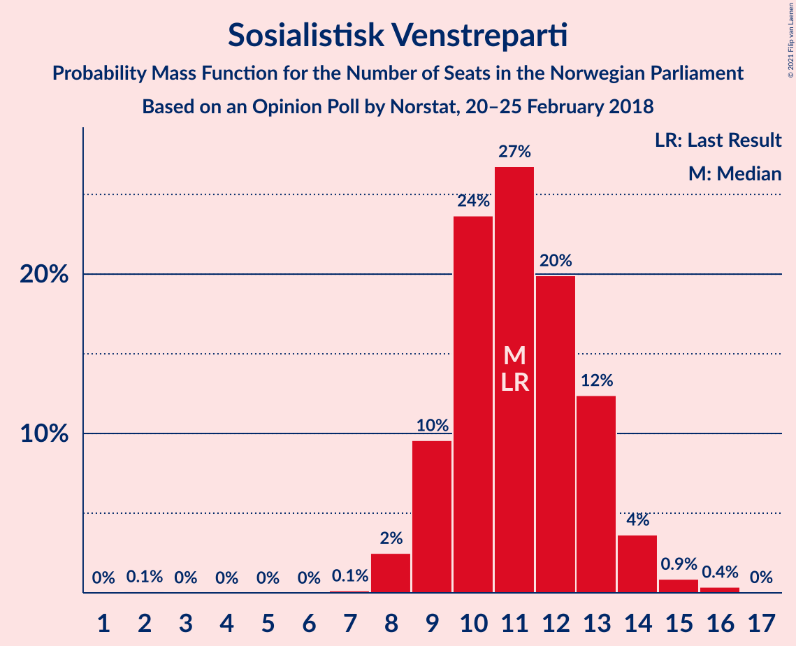
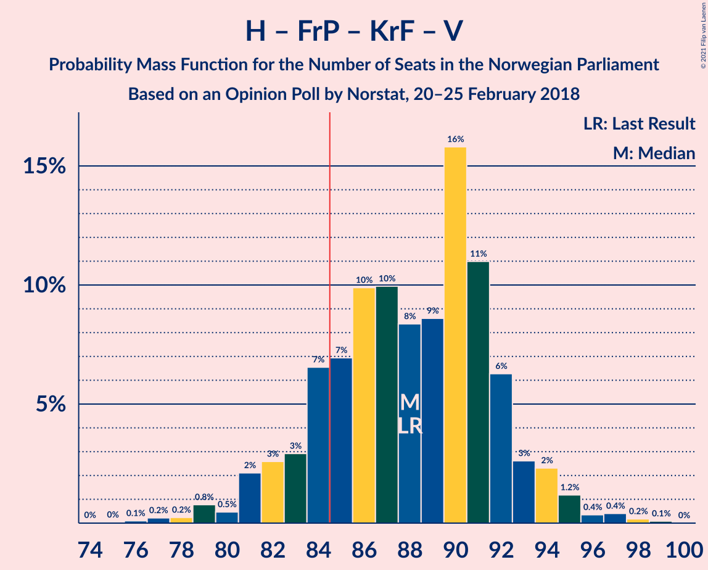
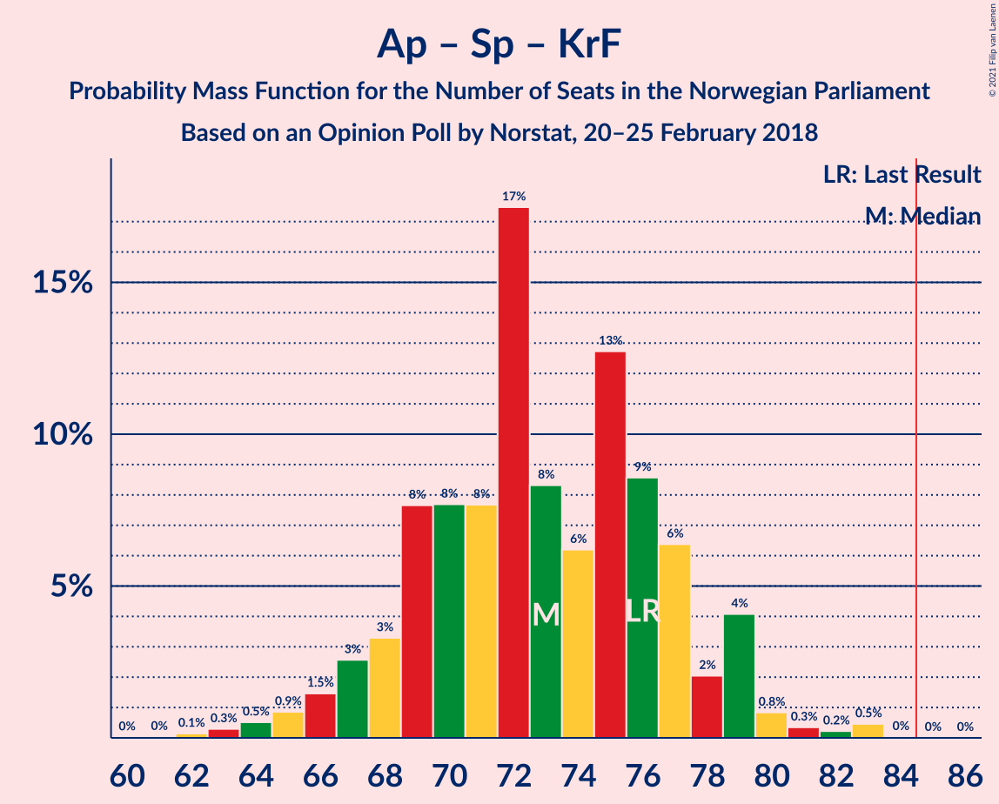

# Opinion Poll by Norstat, 20–25 February 2018

<a href="#voting-intentions">Voting Intentions</a> | <a href="#seats">Seats</a> | <a href="#coalitions">Coalitions</a> | <a href="#technical-information">Technical Information</a>

## Voting Intentions

### Confidence Intervals

| Party | Last Result | Poll Result | 80% Confidence Interval | 90% Confidence Interval | 95% Confidence Interval | 99% Confidence Interval |
|:-----:|:-----------:|:-----------:|:-----------------------:|:-----------------------:|:-----------------------:|:-----------------------:|
| Høyre | 25.0% | 28.8% | 27.0–30.8% |26.5–31.4% |26.0–31.8% |25.1–32.8% |
| Arbeiderpartiet | 27.4% | 24.5% | 22.8–26.4% |22.3–26.9% |21.9–27.4% |21.1–28.3% |
| Fremskrittspartiet | 15.2% | 12.9% | 11.5–14.4% |11.2–14.8% |10.9–15.2% |10.3–15.9% |
| Senterpartiet | 10.3% | 10.8% | 9.6–12.2% |9.3–12.6% |9.0–13.0% |8.4–13.7% |
| Sosialistisk Venstreparti | 6.0% | 6.0% | 5.1–7.1% |4.9–7.4% |4.6–7.7% |4.3–8.3% |
| Kristelig Folkeparti | 4.2% | 4.5% | 3.7–5.5% |3.5–5.8% |3.3–6.0% |3.0–6.6% |
| Venstre | 4.4% | 3.5% | 2.9–4.5% |2.7–4.7% |2.5–4.9% |2.2–5.4% |
| Miljøpartiet De Grønne | 3.2% | 3.3% | 2.7–4.2% |2.5–4.5% |2.3–4.7% |2.1–5.2% |
| Rødt | 2.4% | 3.1% | 2.5–4.0% |2.3–4.2% |2.2–4.4% |1.9–4.9% |

*Note:* The poll result column reflects the actual value used in the calculations. Published results may vary slightly, and in addition be rounded to fewer digits.

## Seats

### Confidence Intervals

| Party | Last Result | Median | 80% Confidence Interval | 90% Confidence Interval | 95% Confidence Interval | 99% Confidence Interval |
|:-----:|:-----------:|:------:|:-----------------------:|:-----------------------:|:-----------------------:|:-----------------------:|
| <a href="#høyre">Høyre</a> | 45 | 53 | 50–57 |49–58 |47–59 |45–60 |
| <a href="#arbeiderpartiet">Arbeiderpartiet</a> | 49 | 45 | 42–48 |41–50 |40–51 |38–53 |
| <a href="#fremskrittspartiet">Fremskrittspartiet</a> | 27 | 24 | 21–26 |20–27 |19–28 |18–30 |
| <a href="#senterpartiet">Senterpartiet</a> | 19 | 20 | 18–23 |17–23 |16–24 |15–25 |
| <a href="#sosialistisk-venstreparti">Sosialistisk Venstreparti</a> | 11 | 11 | 9–13 |9–13 |8–14 |8–15 |
| <a href="#kristelig-folkeparti">Kristelig Folkeparti</a> | 8 | 8 | 3–10 |3–11 |3–11 |1–12 |
| <a href="#venstre">Venstre</a> | 8 | 2 | 2–8 |2–8 |2–9 |1–10 |
| <a href="#miljøpartiet-de-grønne">Miljøpartiet De Grønne</a> | 1 | 2 | 1–7 |1–8 |1–8 |1–9 |
| <a href="#rødt">Rødt</a> | 1 | 2 | 1–2 |1–7 |1–8 |1–9 |

### Høyre

*For a full overview of the results for this party, see the [Høyre](party-høyre.html) page.*

| Number of Seats | Probability | Accumulated | Special Marks |
|:---------------:|:-----------:|:-----------:|:-------------:|
| 43 | 0.1% | 100% |  |
| 44 | 0.1% | 99.9% |  |
| 45 | 0.4% | 99.8% | Last Result |
| 46 | 0.8% | 99.3% |  |
| 47 | 1.3% | 98.5% |  |
| 48 | 2% | 97% |  |
| 49 | 3% | 95% |  |
| 50 | 12% | 92% |  |
| 51 | 8% | 80% |  |
| 52 | 13% | 72% |  |
| 53 | 14% | 60% | Median |
| 54 | 10% | 46% |  |
| 55 | 16% | 36% |  |
| 56 | 9% | 20% |  |
| 57 | 5% | 10% |  |
| 58 | 2% | 5% |  |
| 59 | 2% | 3% |  |
| 60 | 0.8% | 1.2% |  |
| 61 | 0.1% | 0.4% |  |
| 62 | 0.1% | 0.2% |  |
| 63 | 0.1% | 0.1% |  |
| 64 | 0% | 0% |  |

### Arbeiderpartiet

*For a full overview of the results for this party, see the [Arbeiderpartiet](party-arbeiderpartiet.html) page.*

| Number of Seats | Probability | Accumulated | Special Marks |
|:---------------:|:-----------:|:-----------:|:-------------:|
| 37 | 0.2% | 100% |  |
| 38 | 0.3% | 99.7% |  |
| 39 | 0.6% | 99.4% |  |
| 40 | 1.5% | 98.8% |  |
| 41 | 3% | 97% |  |
| 42 | 9% | 94% |  |
| 43 | 8% | 85% |  |
| 44 | 21% | 77% |  |
| 45 | 16% | 56% | Median |
| 46 | 8% | 41% |  |
| 47 | 9% | 32% |  |
| 48 | 14% | 23% |  |
| 49 | 2% | 9% | Last Result |
| 50 | 4% | 7% |  |
| 51 | 2% | 3% |  |
| 52 | 0.4% | 1.0% |  |
| 53 | 0.3% | 0.6% |  |
| 54 | 0.2% | 0.3% |  |
| 55 | 0% | 0.1% |  |
| 56 | 0% | 0% |  |

### Fremskrittspartiet

*For a full overview of the results for this party, see the [Fremskrittspartiet](party-fremskrittspartiet.html) page.*

| Number of Seats | Probability | Accumulated | Special Marks |
|:---------------:|:-----------:|:-----------:|:-------------:|
| 17 | 0.2% | 100% |  |
| 18 | 0.7% | 99.8% |  |
| 19 | 2% | 99.1% |  |
| 20 | 5% | 97% |  |
| 21 | 7% | 92% |  |
| 22 | 9% | 85% |  |
| 23 | 18% | 77% |  |
| 24 | 14% | 58% | Median |
| 25 | 26% | 45% |  |
| 26 | 11% | 19% |  |
| 27 | 4% | 7% | Last Result |
| 28 | 2% | 3% |  |
| 29 | 0.7% | 1.2% |  |
| 30 | 0.4% | 0.6% |  |
| 31 | 0.1% | 0.1% |  |
| 32 | 0% | 0% |  |

### Senterpartiet

*For a full overview of the results for this party, see the [Senterpartiet](party-senterpartiet.html) page.*

| Number of Seats | Probability | Accumulated | Special Marks |
|:---------------:|:-----------:|:-----------:|:-------------:|
| 14 | 0.1% | 100% |  |
| 15 | 0.5% | 99.8% |  |
| 16 | 2% | 99.3% |  |
| 17 | 6% | 97% |  |
| 18 | 17% | 90% |  |
| 19 | 15% | 73% | Last Result |
| 20 | 21% | 58% | Median |
| 21 | 17% | 37% |  |
| 22 | 8% | 20% |  |
| 23 | 8% | 12% |  |
| 24 | 3% | 4% |  |
| 25 | 0.9% | 1.3% |  |
| 26 | 0.2% | 0.4% |  |
| 27 | 0.1% | 0.2% |  |
| 28 | 0% | 0% |  |

### Sosialistisk Venstreparti

*For a full overview of the results for this party, see the [Sosialistisk Venstreparti](party-sosialistiskvenstreparti.html) page.*

| Number of Seats | Probability | Accumulated | Special Marks |
|:---------------:|:-----------:|:-----------:|:-------------:|
| 2 | 0.1% | 100% |  |
| 3 | 0% | 99.9% |  |
| 4 | 0% | 99.9% |  |
| 5 | 0% | 99.9% |  |
| 6 | 0% | 99.9% |  |
| 7 | 0.1% | 99.9% |  |
| 8 | 2% | 99.7% |  |
| 9 | 10% | 97% |  |
| 10 | 24% | 88% |  |
| 11 | 27% | 64% | Last Result, Median |
| 12 | 20% | 37% |  |
| 13 | 12% | 17% |  |
| 14 | 4% | 5% |  |
| 15 | 0.9% | 1.3% |  |
| 16 | 0.4% | 0.4% |  |
| 17 | 0% | 0% |  |

### Kristelig Folkeparti

*For a full overview of the results for this party, see the [Kristelig Folkeparti](party-kristeligfolkeparti.html) page.*

| Number of Seats | Probability | Accumulated | Special Marks |
|:---------------:|:-----------:|:-----------:|:-------------:|
| 1 | 0.7% | 100% |  |
| 2 | 0.7% | 99.3% |  |
| 3 | 17% | 98.6% |  |
| 4 | 0% | 82% |  |
| 5 | 0% | 82% |  |
| 6 | 0% | 82% |  |
| 7 | 4% | 82% |  |
| 8 | 35% | 78% | Last Result, Median |
| 9 | 25% | 42% |  |
| 10 | 11% | 17% |  |
| 11 | 5% | 6% |  |
| 12 | 0.8% | 1.1% |  |
| 13 | 0.3% | 0.3% |  |
| 14 | 0% | 0% |  |

### Venstre

*For a full overview of the results for this party, see the [Venstre](party-venstre.html) page.*

| Number of Seats | Probability | Accumulated | Special Marks |
|:---------------:|:-----------:|:-----------:|:-------------:|
| 1 | 1.2% | 100% |  |
| 2 | 67% | 98.8% | Median |
| 3 | 10% | 31% |  |
| 4 | 0% | 22% |  |
| 5 | 0% | 22% |  |
| 6 | 0% | 22% |  |
| 7 | 8% | 21% |  |
| 8 | 11% | 14% | Last Result |
| 9 | 2% | 3% |  |
| 10 | 0.7% | 0.8% |  |
| 11 | 0.1% | 0.1% |  |
| 12 | 0% | 0% |  |

### Miljøpartiet De Grønne

*For a full overview of the results for this party, see the [Miljøpartiet De Grønne](party-miljøpartietdegrønne.html) page.*

| Number of Seats | Probability | Accumulated | Special Marks |
|:---------------:|:-----------:|:-----------:|:-------------:|
| 0 | 0.1% | 100% |  |
| 1 | 36% | 99.9% | Last Result |
| 2 | 46% | 64% | Median |
| 3 | 4% | 18% |  |
| 4 | 0.3% | 15% |  |
| 5 | 0% | 14% |  |
| 6 | 0.1% | 14% |  |
| 7 | 5% | 14% |  |
| 8 | 7% | 9% |  |
| 9 | 2% | 2% |  |
| 10 | 0.3% | 0.3% |  |
| 11 | 0% | 0% |  |

### Rødt

*For a full overview of the results for this party, see the [Rødt](party-rødt.html) page.*

| Number of Seats | Probability | Accumulated | Special Marks |
|:---------------:|:-----------:|:-----------:|:-------------:|
| 1 | 31% | 100% | Last Result |
| 2 | 61% | 69% | Median |
| 3 | 0% | 8% |  |
| 4 | 0% | 8% |  |
| 5 | 0% | 8% |  |
| 6 | 0.1% | 8% |  |
| 7 | 3% | 8% |  |
| 8 | 4% | 5% |  |
| 9 | 0.7% | 0.8% |  |
| 10 | 0.1% | 0.2% |  |
| 11 | 0% | 0% |  |

## Coalitions

### Confidence Intervals

| Coalition | Last Result | Median | Majority? | 80% Confidence Interval | 90% Confidence Interval | 95% Confidence Interval | 99% Confidence Interval |
|:---------:|:-----------:|:------:|:---------:|:-----------------------:|:-----------------------:|:-----------------------:|:-----------------------:|
| Høyre – Fremskrittspartiet – Senterpartiet – Kristelig Folkeparti – Venstre | 107 | 108 | 100% | 103–112 | 102–113 | 101–114 | 98–116 |
| Høyre – Fremskrittspartiet – Kristelig Folkeparti – Venstre – Miljøpartiet De Grønne | 89 | 91 | 96% | 86–95 | 85–96 | 84–97 | 81–99 |
| Høyre – Fremskrittspartiet – Kristelig Folkeparti – Venstre | 88 | 88 | 84% | 84–92 | 82–93 | 81–94 | 78–97 |
| Arbeiderpartiet – Senterpartiet – Sosialistisk Venstreparti – Kristelig Folkeparti – Miljøpartiet De Grønne | 88 | 86 | 73% | 82–91 | 81–92 | 79–94 | 77–96 |
| Arbeiderpartiet – Senterpartiet – Sosialistisk Venstreparti – Miljøpartiet De Grønne – Rødt | 81 | 81 | 16% | 77–85 | 76–87 | 75–88 | 72–91 |
| Høyre – Fremskrittspartiet – Venstre | 80 | 81 | 9% | 76–84 | 74–86 | 73–87 | 72–90 |
| Arbeiderpartiet – Senterpartiet – Sosialistisk Venstreparti – Miljøpartiet De Grønne | 80 | 78 | 5% | 75–83 | 73–85 | 72–86 | 70–88 |
| Arbeiderpartiet – Senterpartiet – Sosialistisk Venstreparti – Rødt | 80 | 78 | 4% | 74–83 | 73–84 | 72–85 | 70–88 |
| Arbeiderpartiet – Senterpartiet – Sosialistisk Venstreparti | 79 | 76 | 0.8% | 72–81 | 71–81 | 70–83 | 68–85 |
| Høyre – Fremskrittspartiet | 72 | 77 | 0.7% | 72–81 | 71–82 | 70–83 | 68–85 |
| Arbeiderpartiet – Senterpartiet – Kristelig Folkeparti – Miljøpartiet De Grønne | 77 | 75 | 0.7% | 71–80 | 70–81 | 68–82 | 66–85 |
| Arbeiderpartiet – Senterpartiet – Kristelig Folkeparti | 76 | 73 | 0% | 69–77 | 67–79 | 66–79 | 63–83 |
| Arbeiderpartiet – Senterpartiet | 68 | 65 | 0% | 61–69 | 60–70 | 59–71 | 57–73 |
| Høyre – Kristelig Folkeparti – Venstre | 61 | 65 | 0% | 60–68 | 59–70 | 57–71 | 55–73 |
| Arbeiderpartiet – Sosialistisk Venstreparti – Miljøpartiet De Grønne – Rødt | 62 | 61 | 0% | 57–66 | 56–67 | 55–68 | 53–71 |
| Arbeiderpartiet – Sosialistisk Venstreparti | 60 | 56 | 0% | 53–60 | 52–61 | 51–62 | 48–65 |
| Senterpartiet – Kristelig Folkeparti – Venstre | 35 | 31 | 0% | 26–36 | 25–37 | 23–38 | 22–40 |

### Høyre – Fremskrittspartiet – Senterpartiet – Kristelig Folkeparti – Venstre

| Number of Seats | Probability | Accumulated | Special Marks |
|:---------------:|:-----------:|:-----------:|:-------------:|
| 94 | 0% | 100% |  |
| 95 | 0% | 99.9% |  |
| 96 | 0.1% | 99.9% |  |
| 97 | 0.1% | 99.8% |  |
| 98 | 0.4% | 99.7% |  |
| 99 | 0.7% | 99.4% |  |
| 100 | 1.0% | 98.7% |  |
| 101 | 2% | 98% |  |
| 102 | 4% | 96% |  |
| 103 | 2% | 92% |  |
| 104 | 7% | 89% |  |
| 105 | 8% | 82% |  |
| 106 | 9% | 75% |  |
| 107 | 8% | 66% | Last Result, Median |
| 108 | 8% | 58% |  |
| 109 | 11% | 49% |  |
| 110 | 16% | 39% |  |
| 111 | 4% | 23% |  |
| 112 | 12% | 19% |  |
| 113 | 3% | 7% |  |
| 114 | 1.4% | 3% |  |
| 115 | 1.2% | 2% |  |
| 116 | 0.4% | 0.8% |  |
| 117 | 0.3% | 0.4% |  |
| 118 | 0.1% | 0.2% |  |
| 119 | 0% | 0% |  |

### Høyre – Fremskrittspartiet – Kristelig Folkeparti – Venstre – Miljøpartiet De Grønne

| Number of Seats | Probability | Accumulated | Special Marks |
|:---------------:|:-----------:|:-----------:|:-------------:|
| 78 | 0% | 100% |  |
| 79 | 0% | 99.9% |  |
| 80 | 0.2% | 99.9% |  |
| 81 | 0.3% | 99.7% |  |
| 82 | 0.5% | 99.4% |  |
| 83 | 1.0% | 99.0% |  |
| 84 | 2% | 98% |  |
| 85 | 2% | 96% | Majority |
| 86 | 7% | 94% |  |
| 87 | 7% | 86% |  |
| 88 | 7% | 80% |  |
| 89 | 7% | 72% | Last Result, Median |
| 90 | 12% | 66% |  |
| 91 | 10% | 54% |  |
| 92 | 20% | 44% |  |
| 93 | 7% | 24% |  |
| 94 | 6% | 18% |  |
| 95 | 5% | 11% |  |
| 96 | 2% | 6% |  |
| 97 | 2% | 4% |  |
| 98 | 1.1% | 2% |  |
| 99 | 0.8% | 1.2% |  |
| 100 | 0.2% | 0.4% |  |
| 101 | 0.1% | 0.2% |  |
| 102 | 0.1% | 0.1% |  |
| 103 | 0% | 0% |  |

### Høyre – Fremskrittspartiet – Kristelig Folkeparti – Venstre

| Number of Seats | Probability | Accumulated | Special Marks |
|:---------------:|:-----------:|:-----------:|:-------------:|
| 75 | 0% | 100% |  |
| 76 | 0.1% | 99.9% |  |
| 77 | 0.2% | 99.8% |  |
| 78 | 0.2% | 99.6% |  |
| 79 | 0.8% | 99.4% |  |
| 80 | 0.5% | 98.6% |  |
| 81 | 2% | 98% |  |
| 82 | 3% | 96% |  |
| 83 | 3% | 93% |  |
| 84 | 7% | 91% |  |
| 85 | 7% | 84% | Majority |
| 86 | 10% | 77% |  |
| 87 | 10% | 67% | Median |
| 88 | 8% | 57% | Last Result |
| 89 | 9% | 49% |  |
| 90 | 16% | 40% |  |
| 91 | 11% | 24% |  |
| 92 | 6% | 13% |  |
| 93 | 3% | 7% |  |
| 94 | 2% | 5% |  |
| 95 | 1.2% | 2% |  |
| 96 | 0.4% | 1.0% |  |
| 97 | 0.4% | 0.7% |  |
| 98 | 0.2% | 0.3% |  |
| 99 | 0.1% | 0.1% |  |
| 100 | 0% | 0% |  |

### Arbeiderpartiet – Senterpartiet – Sosialistisk Venstreparti – Kristelig Folkeparti – Miljøpartiet De Grønne

| Number of Seats | Probability | Accumulated | Special Marks |
|:---------------:|:-----------:|:-----------:|:-------------:|
| 74 | 0.1% | 100% |  |
| 75 | 0.1% | 99.9% |  |
| 76 | 0.2% | 99.8% |  |
| 77 | 0.6% | 99.6% |  |
| 78 | 1.2% | 99.0% |  |
| 79 | 0.7% | 98% |  |
| 80 | 2% | 97% |  |
| 81 | 2% | 95% |  |
| 82 | 6% | 93% |  |
| 83 | 5% | 87% |  |
| 84 | 9% | 82% |  |
| 85 | 13% | 73% | Majority |
| 86 | 16% | 60% | Median |
| 87 | 8% | 44% |  |
| 88 | 5% | 36% | Last Result |
| 89 | 9% | 31% |  |
| 90 | 8% | 22% |  |
| 91 | 7% | 14% |  |
| 92 | 2% | 7% |  |
| 93 | 1.4% | 5% |  |
| 94 | 2% | 3% |  |
| 95 | 0.9% | 1.4% |  |
| 96 | 0.4% | 0.5% |  |
| 97 | 0.1% | 0.2% |  |
| 98 | 0% | 0.1% |  |
| 99 | 0% | 0% |  |

### Arbeiderpartiet – Senterpartiet – Sosialistisk Venstreparti – Miljøpartiet De Grønne – Rødt

| Number of Seats | Probability | Accumulated | Special Marks |
|:---------------:|:-----------:|:-----------:|:-------------:|
| 70 | 0.1% | 100% |  |
| 71 | 0.2% | 99.9% |  |
| 72 | 0.4% | 99.7% |  |
| 73 | 0.4% | 99.3% |  |
| 74 | 1.2% | 98.9% |  |
| 75 | 2% | 98% |  |
| 76 | 3% | 95% |  |
| 77 | 6% | 93% |  |
| 78 | 11% | 86% |  |
| 79 | 16% | 75% |  |
| 80 | 9% | 59% | Median |
| 81 | 8% | 51% | Last Result |
| 82 | 10% | 42% |  |
| 83 | 10% | 32% |  |
| 84 | 7% | 23% |  |
| 85 | 6% | 16% | Majority |
| 86 | 3% | 9% |  |
| 87 | 3% | 6% |  |
| 88 | 2% | 4% |  |
| 89 | 0.4% | 2% |  |
| 90 | 0.8% | 1.3% |  |
| 91 | 0.2% | 0.6% |  |
| 92 | 0.2% | 0.4% |  |
| 93 | 0.1% | 0.1% |  |
| 94 | 0% | 0.1% |  |
| 95 | 0% | 0% |  |

### Høyre – Fremskrittspartiet – Venstre

| Number of Seats | Probability | Accumulated | Special Marks |
|:---------------:|:-----------:|:-----------:|:-------------:|
| 68 | 0% | 100% |  |
| 69 | 0.1% | 99.9% |  |
| 70 | 0.1% | 99.9% |  |
| 71 | 0.2% | 99.8% |  |
| 72 | 1.1% | 99.5% |  |
| 73 | 2% | 98% |  |
| 74 | 2% | 96% |  |
| 75 | 3% | 94% |  |
| 76 | 6% | 92% |  |
| 77 | 7% | 85% |  |
| 78 | 10% | 78% |  |
| 79 | 8% | 69% | Median |
| 80 | 8% | 61% | Last Result |
| 81 | 9% | 52% |  |
| 82 | 19% | 43% |  |
| 83 | 10% | 25% |  |
| 84 | 6% | 15% |  |
| 85 | 2% | 9% | Majority |
| 86 | 4% | 7% |  |
| 87 | 1.3% | 4% |  |
| 88 | 0.8% | 2% |  |
| 89 | 0.3% | 2% |  |
| 90 | 0.9% | 1.2% |  |
| 91 | 0.2% | 0.4% |  |
| 92 | 0.1% | 0.1% |  |
| 93 | 0% | 0.1% |  |
| 94 | 0% | 0% |  |

### Arbeiderpartiet – Senterpartiet – Sosialistisk Venstreparti – Miljøpartiet De Grønne

| Number of Seats | Probability | Accumulated | Special Marks |
|:---------------:|:-----------:|:-----------:|:-------------:|
| 68 | 0.1% | 100% |  |
| 69 | 0.2% | 99.8% |  |
| 70 | 0.4% | 99.6% |  |
| 71 | 1.0% | 99.2% |  |
| 72 | 1.3% | 98% |  |
| 73 | 2% | 97% |  |
| 74 | 4% | 95% |  |
| 75 | 6% | 91% |  |
| 76 | 9% | 85% |  |
| 77 | 17% | 76% |  |
| 78 | 10% | 60% | Median |
| 79 | 10% | 49% |  |
| 80 | 8% | 39% | Last Result |
| 81 | 8% | 31% |  |
| 82 | 10% | 24% |  |
| 83 | 6% | 14% |  |
| 84 | 3% | 8% |  |
| 85 | 2% | 5% | Majority |
| 86 | 2% | 4% |  |
| 87 | 0.9% | 2% |  |
| 88 | 0.5% | 1.0% |  |
| 89 | 0.2% | 0.4% |  |
| 90 | 0.2% | 0.3% |  |
| 91 | 0.1% | 0.1% |  |
| 92 | 0% | 0% |  |

### Arbeiderpartiet – Senterpartiet – Sosialistisk Venstreparti – Rødt

| Number of Seats | Probability | Accumulated | Special Marks |
|:---------------:|:-----------:|:-----------:|:-------------:|
| 67 | 0.1% | 100% |  |
| 68 | 0.1% | 99.9% |  |
| 69 | 0.2% | 99.8% |  |
| 70 | 0.8% | 99.6% |  |
| 71 | 1.1% | 98.8% |  |
| 72 | 2% | 98% |  |
| 73 | 2% | 96% |  |
| 74 | 5% | 93% |  |
| 75 | 6% | 88% |  |
| 76 | 7% | 82% |  |
| 77 | 20% | 75% |  |
| 78 | 10% | 56% | Median |
| 79 | 12% | 46% |  |
| 80 | 7% | 34% | Last Result |
| 81 | 7% | 27% |  |
| 82 | 7% | 20% |  |
| 83 | 7% | 13% |  |
| 84 | 2% | 6% |  |
| 85 | 2% | 4% | Majority |
| 86 | 0.9% | 2% |  |
| 87 | 0.4% | 1.0% |  |
| 88 | 0.3% | 0.5% |  |
| 89 | 0.2% | 0.3% |  |
| 90 | 0% | 0.1% |  |
| 91 | 0% | 0.1% |  |
| 92 | 0% | 0% |  |

### Arbeiderpartiet – Senterpartiet – Sosialistisk Venstreparti

| Number of Seats | Probability | Accumulated | Special Marks |
|:---------------:|:-----------:|:-----------:|:-------------:|
| 65 | 0% | 100% |  |
| 66 | 0.2% | 99.9% |  |
| 67 | 0.2% | 99.7% |  |
| 68 | 0.6% | 99.5% |  |
| 69 | 1.4% | 98.9% |  |
| 70 | 2% | 98% |  |
| 71 | 2% | 95% |  |
| 72 | 6% | 93% |  |
| 73 | 6% | 87% |  |
| 74 | 7% | 81% |  |
| 75 | 16% | 74% |  |
| 76 | 12% | 57% | Median |
| 77 | 13% | 46% |  |
| 78 | 9% | 33% |  |
| 79 | 4% | 24% | Last Result |
| 80 | 7% | 19% |  |
| 81 | 8% | 12% |  |
| 82 | 1.1% | 4% |  |
| 83 | 2% | 3% |  |
| 84 | 0.6% | 1.3% |  |
| 85 | 0.5% | 0.8% | Majority |
| 86 | 0.2% | 0.3% |  |
| 87 | 0.1% | 0.1% |  |
| 88 | 0% | 0% |  |

### Høyre – Fremskrittspartiet

| Number of Seats | Probability | Accumulated | Special Marks |
|:---------------:|:-----------:|:-----------:|:-------------:|
| 65 | 0% | 100% |  |
| 66 | 0.1% | 99.9% |  |
| 67 | 0.1% | 99.8% |  |
| 68 | 0.5% | 99.7% |  |
| 69 | 0.4% | 99.2% |  |
| 70 | 2% | 98.7% |  |
| 71 | 3% | 97% |  |
| 72 | 5% | 94% | Last Result |
| 73 | 4% | 89% |  |
| 74 | 8% | 85% |  |
| 75 | 11% | 78% |  |
| 76 | 13% | 66% |  |
| 77 | 6% | 53% | Median |
| 78 | 9% | 47% |  |
| 79 | 11% | 38% |  |
| 80 | 15% | 27% |  |
| 81 | 5% | 13% |  |
| 82 | 4% | 7% |  |
| 83 | 2% | 3% |  |
| 84 | 0.9% | 2% |  |
| 85 | 0.3% | 0.7% | Majority |
| 86 | 0.1% | 0.4% |  |
| 87 | 0.2% | 0.3% |  |
| 88 | 0.1% | 0.1% |  |
| 89 | 0% | 0% |  |

### Arbeiderpartiet – Senterpartiet – Kristelig Folkeparti – Miljøpartiet De Grønne

| Number of Seats | Probability | Accumulated | Special Marks |
|:---------------:|:-----------:|:-----------:|:-------------:|
| 63 | 0% | 100% |  |
| 64 | 0.1% | 99.9% |  |
| 65 | 0.3% | 99.9% |  |
| 66 | 0.6% | 99.6% |  |
| 67 | 0.5% | 99.0% |  |
| 68 | 1.0% | 98.5% |  |
| 69 | 2% | 97% |  |
| 70 | 4% | 95% |  |
| 71 | 5% | 91% |  |
| 72 | 7% | 87% |  |
| 73 | 8% | 80% |  |
| 74 | 14% | 72% |  |
| 75 | 8% | 58% | Median |
| 76 | 13% | 50% |  |
| 77 | 8% | 37% | Last Result |
| 78 | 9% | 29% |  |
| 79 | 8% | 20% |  |
| 80 | 4% | 12% |  |
| 81 | 4% | 7% |  |
| 82 | 2% | 4% |  |
| 83 | 0.7% | 2% |  |
| 84 | 0.5% | 1.2% |  |
| 85 | 0.5% | 0.7% | Majority |
| 86 | 0.1% | 0.2% |  |
| 87 | 0% | 0.1% |  |
| 88 | 0% | 0% |  |

### Arbeiderpartiet – Senterpartiet – Kristelig Folkeparti

| Number of Seats | Probability | Accumulated | Special Marks |
|:---------------:|:-----------:|:-----------:|:-------------:|
| 61 | 0% | 100% |  |
| 62 | 0.1% | 99.9% |  |
| 63 | 0.3% | 99.8% |  |
| 64 | 0.5% | 99.5% |  |
| 65 | 0.9% | 99.0% |  |
| 66 | 1.5% | 98% |  |
| 67 | 3% | 97% |  |
| 68 | 3% | 94% |  |
| 69 | 8% | 91% |  |
| 70 | 8% | 83% |  |
| 71 | 8% | 75% |  |
| 72 | 17% | 68% |  |
| 73 | 8% | 50% | Median |
| 74 | 6% | 42% |  |
| 75 | 13% | 36% |  |
| 76 | 9% | 23% | Last Result |
| 77 | 6% | 14% |  |
| 78 | 2% | 8% |  |
| 79 | 4% | 6% |  |
| 80 | 0.8% | 2% |  |
| 81 | 0.3% | 1.1% |  |
| 82 | 0.2% | 0.7% |  |
| 83 | 0.5% | 0.5% |  |
| 84 | 0% | 0.1% |  |
| 85 | 0% | 0% | Majority |

### Arbeiderpartiet – Senterpartiet

| Number of Seats | Probability | Accumulated | Special Marks |
|:---------------:|:-----------:|:-----------:|:-------------:|
| 55 | 0% | 100% |  |
| 56 | 0.1% | 99.9% |  |
| 57 | 0.4% | 99.8% |  |
| 58 | 0.9% | 99.4% |  |
| 59 | 2% | 98.5% |  |
| 60 | 5% | 97% |  |
| 61 | 4% | 92% |  |
| 62 | 6% | 88% |  |
| 63 | 9% | 82% |  |
| 64 | 17% | 73% |  |
| 65 | 10% | 56% | Median |
| 66 | 12% | 46% |  |
| 67 | 12% | 35% |  |
| 68 | 11% | 23% | Last Result |
| 69 | 5% | 12% |  |
| 70 | 3% | 8% |  |
| 71 | 2% | 4% |  |
| 72 | 1.3% | 2% |  |
| 73 | 0.5% | 1.0% |  |
| 74 | 0.3% | 0.5% |  |
| 75 | 0.1% | 0.2% |  |
| 76 | 0.1% | 0.1% |  |
| 77 | 0% | 0% |  |

### Høyre – Kristelig Folkeparti – Venstre

| Number of Seats | Probability | Accumulated | Special Marks |
|:---------------:|:-----------:|:-----------:|:-------------:|
| 52 | 0.1% | 100% |  |
| 53 | 0.1% | 99.9% |  |
| 54 | 0.2% | 99.8% |  |
| 55 | 1.3% | 99.6% |  |
| 56 | 0.7% | 98% |  |
| 57 | 1.0% | 98% |  |
| 58 | 1.4% | 97% |  |
| 59 | 2% | 95% |  |
| 60 | 4% | 93% |  |
| 61 | 10% | 89% | Last Result |
| 62 | 8% | 79% |  |
| 63 | 10% | 71% | Median |
| 64 | 11% | 61% |  |
| 65 | 19% | 50% |  |
| 66 | 10% | 32% |  |
| 67 | 6% | 21% |  |
| 68 | 7% | 15% |  |
| 69 | 3% | 8% |  |
| 70 | 1.3% | 5% |  |
| 71 | 2% | 4% |  |
| 72 | 1.1% | 2% |  |
| 73 | 0.8% | 1.3% |  |
| 74 | 0.3% | 0.5% |  |
| 75 | 0.1% | 0.2% |  |
| 76 | 0% | 0.1% |  |
| 77 | 0% | 0% |  |

### Arbeiderpartiet – Sosialistisk Venstreparti – Miljøpartiet De Grønne – Rødt

| Number of Seats | Probability | Accumulated | Special Marks |
|:---------------:|:-----------:|:-----------:|:-------------:|
| 51 | 0.1% | 100% |  |
| 52 | 0.3% | 99.8% |  |
| 53 | 0.4% | 99.6% |  |
| 54 | 1.2% | 99.1% |  |
| 55 | 1.4% | 98% |  |
| 56 | 3% | 96% |  |
| 57 | 12% | 93% |  |
| 58 | 4% | 81% |  |
| 59 | 16% | 77% |  |
| 60 | 11% | 61% | Median |
| 61 | 8% | 50% |  |
| 62 | 8% | 42% | Last Result |
| 63 | 9% | 33% |  |
| 64 | 8% | 25% |  |
| 65 | 7% | 17% |  |
| 66 | 2% | 10% |  |
| 67 | 4% | 8% |  |
| 68 | 2% | 4% |  |
| 69 | 0.9% | 2% |  |
| 70 | 0.7% | 1.3% |  |
| 71 | 0.3% | 0.6% |  |
| 72 | 0.1% | 0.2% |  |
| 73 | 0.1% | 0.2% |  |
| 74 | 0% | 0.1% |  |
| 75 | 0% | 0.1% |  |
| 76 | 0% | 0% |  |

### Arbeiderpartiet – Sosialistisk Venstreparti

| Number of Seats | Probability | Accumulated | Special Marks |
|:---------------:|:-----------:|:-----------:|:-------------:|
| 46 | 0% | 100% |  |
| 47 | 0.1% | 99.9% |  |
| 48 | 0.4% | 99.9% |  |
| 49 | 0.6% | 99.5% |  |
| 50 | 0.9% | 98.9% |  |
| 51 | 2% | 98% |  |
| 52 | 3% | 96% |  |
| 53 | 6% | 92% |  |
| 54 | 13% | 86% |  |
| 55 | 21% | 74% |  |
| 56 | 10% | 53% | Median |
| 57 | 9% | 43% |  |
| 58 | 9% | 34% |  |
| 59 | 7% | 25% |  |
| 60 | 9% | 18% | Last Result |
| 61 | 5% | 9% |  |
| 62 | 2% | 4% |  |
| 63 | 1.0% | 2% |  |
| 64 | 0.4% | 1.1% |  |
| 65 | 0.4% | 0.6% |  |
| 66 | 0.1% | 0.2% |  |
| 67 | 0% | 0.1% |  |
| 68 | 0% | 0% |  |

### Senterpartiet – Kristelig Folkeparti – Venstre

| Number of Seats | Probability | Accumulated | Special Marks |
|:---------------:|:-----------:|:-----------:|:-------------:|
| 20 | 0.1% | 100% |  |
| 21 | 0.2% | 99.9% |  |
| 22 | 0.5% | 99.7% |  |
| 23 | 2% | 99.2% |  |
| 24 | 1.3% | 97% |  |
| 25 | 4% | 96% |  |
| 26 | 2% | 92% |  |
| 27 | 4% | 90% |  |
| 28 | 6% | 86% |  |
| 29 | 9% | 79% |  |
| 30 | 18% | 70% | Median |
| 31 | 9% | 53% |  |
| 32 | 10% | 44% |  |
| 33 | 12% | 33% |  |
| 34 | 6% | 22% |  |
| 35 | 4% | 16% | Last Result |
| 36 | 6% | 11% |  |
| 37 | 2% | 5% |  |
| 38 | 2% | 3% |  |
| 39 | 1.0% | 1.5% |  |
| 40 | 0.2% | 0.5% |  |
| 41 | 0.2% | 0.3% |  |
| 42 | 0.1% | 0.1% |  |
| 43 | 0.1% | 0.1% |  |
| 44 | 0% | 0% |  |

## Technical Information

### Opinion Poll

+ **Polling firm:** Norstat
+ **Commissioner(s):** —
+ **Fieldwork period:** 20–25 February 2018

### Calculations

+ **Sample size:** 933
+ **Simulations done:** 1,048,576
+ **Error estimate:** 2.23%

