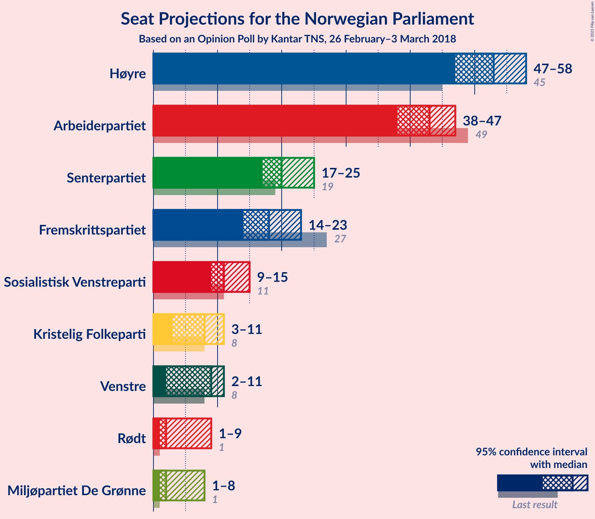
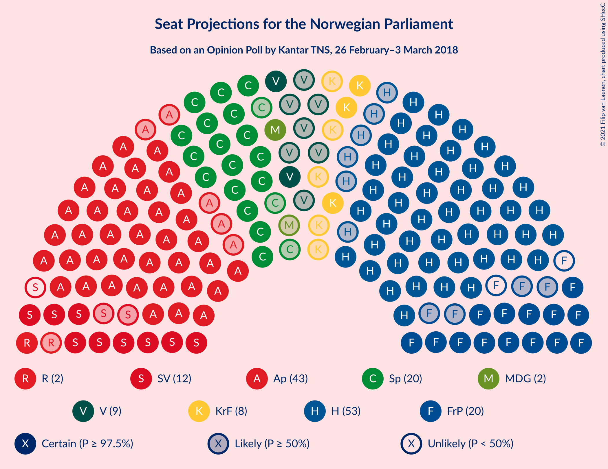
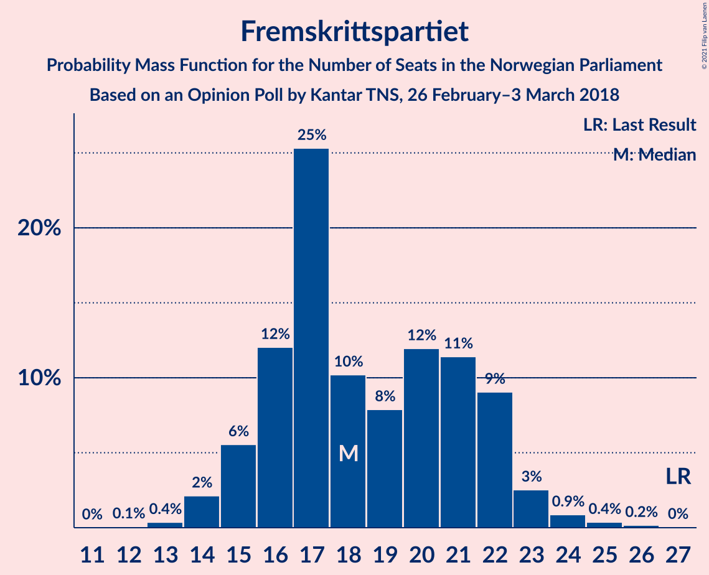
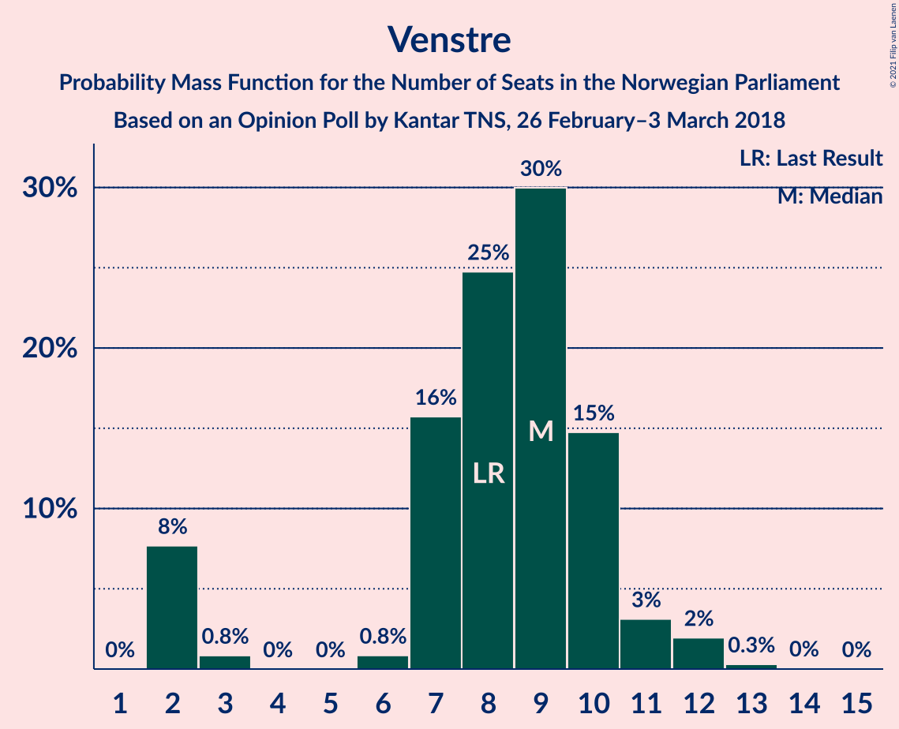
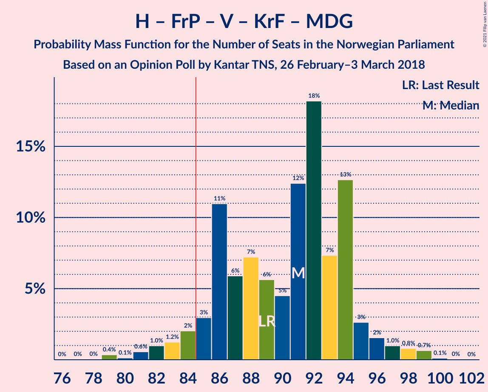
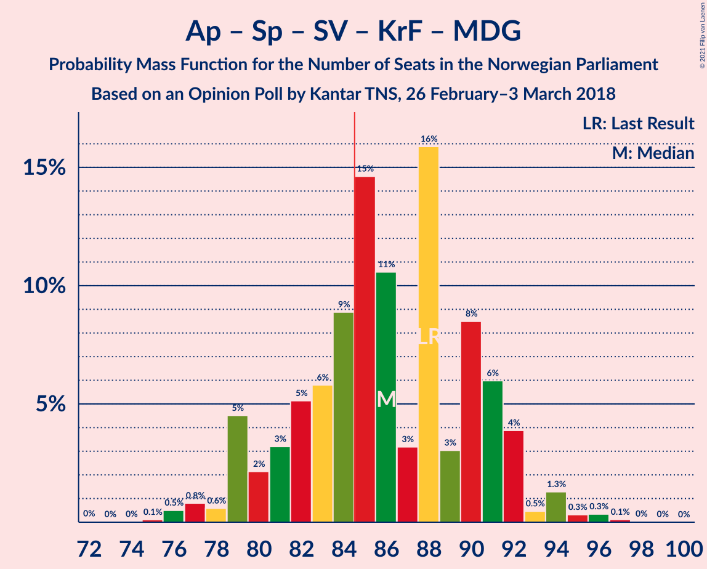
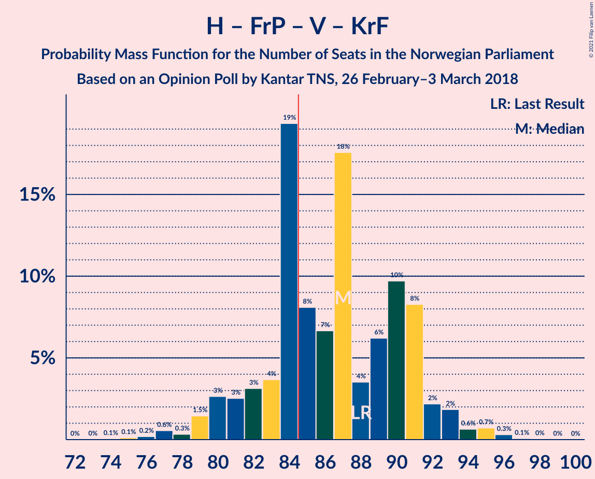
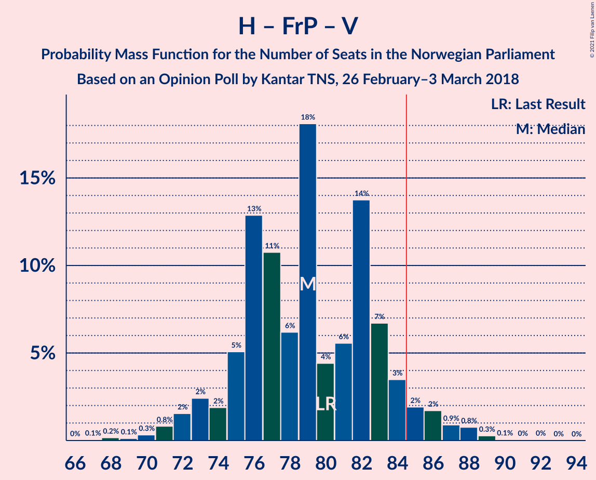
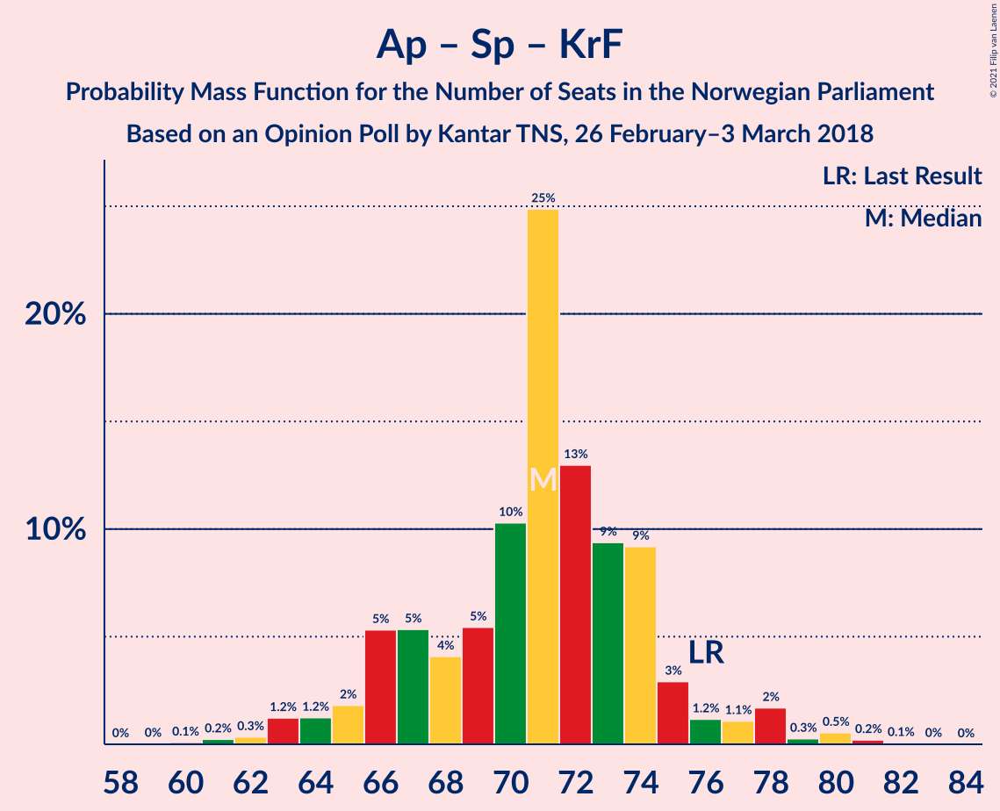

# Opinion Poll by Kantar TNS, 26 February–3 March 2018

<a href="#voting-intentions">Voting Intentions</a> | <a href="#seats">Seats</a> | <a href="#coalitions">Coalitions</a> | <a href="#technical-information">Technical Information</a>

## Voting Intentions

### Confidence Intervals

| Party | Last Result | Poll Result | 80% Confidence Interval | 90% Confidence Interval | 95% Confidence Interval | 99% Confidence Interval |
|:-----:|:-----------:|:-----------:|:-----------------------:|:-----------------------:|:-----------------------:|:-----------------------:|
| Høyre | 25.0% | 29.3% | 27.3–31.4% |26.8–32.0% |26.3–32.5% |25.3–33.6% |
| Arbeiderpartiet | 27.4% | 23.4% | 21.6–25.4% |21.0–26.0% |20.6–26.4% |19.8–27.4% |
| Senterpartiet | 10.3% | 12.1% | 10.7–13.7% |10.3–14.1% |10.0–14.5% |9.4–15.3% |
| Fremskrittspartiet | 15.2% | 10.8% | 9.5–12.4% |9.2–12.8% |8.9–13.2% |8.3–13.9% |
| Sosialistisk Venstreparti | 6.0% | 6.7% | 5.7–7.9% |5.4–8.3% |5.1–8.6% |4.7–9.2% |
| Venstre | 4.4% | 4.9% | 4.1–6.1% |3.8–6.4% |3.6–6.6% |3.3–7.2% |
| Kristelig Folkeparti | 4.2% | 4.6% | 3.7–5.6% |3.5–5.9% |3.3–6.2% |3.0–6.8% |
| Rødt | 2.4% | 3.8% | 3.1–4.8% |2.9–5.1% |2.7–5.4% |2.4–5.9% |
| Miljøpartiet De Grønne | 3.2% | 3.6% | 2.9–4.6% |2.7–4.8% |2.5–5.1% |2.2–5.6% |

*Note:* The poll result column reflects the actual value used in the calculations. Published results may vary slightly, and in addition be rounded to fewer digits.

## Seats

### Confidence Intervals

| Party | Last Result | Median | 80% Confidence Interval | 90% Confidence Interval | 95% Confidence Interval | 99% Confidence Interval |
|:-----:|:-----------:|:------:|:-----------------------:|:-----------------------:|:-----------------------:|:-----------------------:|
| <a href="#høyre">Høyre</a> | 45 | 53 | 49–57 |48–57 |47–58 |45–59 |
| <a href="#arbeiderpartiet">Arbeiderpartiet</a> | 49 | 43 | 40–47 |38–48 |37–49 |35–49 |
| <a href="#senterpartiet">Senterpartiet</a> | 19 | 21 | 18–24 |18–24 |18–25 |16–28 |
| <a href="#fremskrittspartiet">Fremskrittspartiet</a> | 27 | 19 | 16–22 |16–23 |15–23 |13–25 |
| <a href="#sosialistisk-venstreparti">Sosialistisk Venstreparti</a> | 11 | 12 | 9–14 |9–15 |9–15 |9–16 |
| <a href="#venstre">Venstre</a> | 8 | 9 | 8–10 |2–12 |2–12 |2–12 |
| <a href="#kristelig-folkeparti">Kristelig Folkeparti</a> | 8 | 7 | 3–9 |3–10 |3–10 |2–12 |
| <a href="#rødt">Rødt</a> | 1 | 2 | 2–8 |2–9 |1–9 |1–10 |
| <a href="#miljøpartiet-de-grønne">Miljøpartiet De Grønne</a> | 1 | 2 | 1–8 |1–8 |1–9 |1–9 |

### Høyre

*For a full overview of the results for this party, see the [Høyre](party-høyre.html) page.*

| Number of Seats | Probability | Accumulated | Special Marks |
|:---------------:|:-----------:|:-----------:|:-------------:|
| 43 | 0% | 100% |  |
| 44 | 0.2% | 99.9% |  |
| 45 | 0.4% | 99.8% | Last Result |
| 46 | 0.6% | 99.4% |  |
| 47 | 4% | 98.7% |  |
| 48 | 4% | 95% |  |
| 49 | 2% | 91% |  |
| 50 | 10% | 89% |  |
| 51 | 11% | 79% |  |
| 52 | 7% | 69% |  |
| 53 | 31% | 61% | Median |
| 54 | 7% | 30% |  |
| 55 | 10% | 23% |  |
| 56 | 0.9% | 13% |  |
| 57 | 8% | 12% |  |
| 58 | 3% | 4% |  |
| 59 | 0.8% | 1.2% |  |
| 60 | 0.3% | 0.4% |  |
| 61 | 0% | 0.1% |  |
| 62 | 0% | 0.1% |  |
| 63 | 0% | 0.1% |  |
| 64 | 0.1% | 0.1% |  |
| 65 | 0% | 0% |  |

### Arbeiderpartiet

*For a full overview of the results for this party, see the [Arbeiderpartiet](party-arbeiderpartiet.html) page.*

| Number of Seats | Probability | Accumulated | Special Marks |
|:---------------:|:-----------:|:-----------:|:-------------:|
| 34 | 0% | 100% |  |
| 35 | 2% | 99.9% |  |
| 36 | 0.3% | 98% |  |
| 37 | 0.7% | 98% |  |
| 38 | 4% | 97% |  |
| 39 | 0.4% | 93% |  |
| 40 | 7% | 93% |  |
| 41 | 13% | 86% |  |
| 42 | 18% | 73% |  |
| 43 | 8% | 55% | Median |
| 44 | 29% | 47% |  |
| 45 | 2% | 17% |  |
| 46 | 4% | 15% |  |
| 47 | 5% | 11% |  |
| 48 | 2% | 6% |  |
| 49 | 4% | 4% | Last Result |
| 50 | 0% | 0.2% |  |
| 51 | 0% | 0.1% |  |
| 52 | 0.1% | 0.1% |  |
| 53 | 0% | 0.1% |  |
| 54 | 0% | 0% |  |

### Senterpartiet

*For a full overview of the results for this party, see the [Senterpartiet](party-senterpartiet.html) page.*

| Number of Seats | Probability | Accumulated | Special Marks |
|:---------------:|:-----------:|:-----------:|:-------------:|
| 16 | 0.5% | 100% |  |
| 17 | 0.9% | 99.4% |  |
| 18 | 10% | 98.5% |  |
| 19 | 14% | 89% | Last Result |
| 20 | 18% | 75% |  |
| 21 | 9% | 57% | Median |
| 22 | 15% | 48% |  |
| 23 | 22% | 33% |  |
| 24 | 7% | 11% |  |
| 25 | 3% | 4% |  |
| 26 | 0.2% | 0.9% |  |
| 27 | 0.2% | 0.7% |  |
| 28 | 0.4% | 0.5% |  |
| 29 | 0% | 0.1% |  |
| 30 | 0% | 0.1% |  |
| 31 | 0% | 0% |  |

### Fremskrittspartiet

*For a full overview of the results for this party, see the [Fremskrittspartiet](party-fremskrittspartiet.html) page.*

| Number of Seats | Probability | Accumulated | Special Marks |
|:---------------:|:-----------:|:-----------:|:-------------:|
| 12 | 0.2% | 100% |  |
| 13 | 0.4% | 99.8% |  |
| 14 | 0.3% | 99.4% |  |
| 15 | 3% | 99.1% |  |
| 16 | 20% | 96% |  |
| 17 | 3% | 76% |  |
| 18 | 15% | 73% |  |
| 19 | 22% | 58% | Median |
| 20 | 8% | 36% |  |
| 21 | 15% | 28% |  |
| 22 | 7% | 13% |  |
| 23 | 4% | 6% |  |
| 24 | 1.0% | 2% |  |
| 25 | 0.2% | 0.6% |  |
| 26 | 0.3% | 0.4% |  |
| 27 | 0.1% | 0.1% | Last Result |
| 28 | 0% | 0% |  |

### Sosialistisk Venstreparti

*For a full overview of the results for this party, see the [Sosialistisk Venstreparti](party-sosialistiskvenstreparti.html) page.*

| Number of Seats | Probability | Accumulated | Special Marks |
|:---------------:|:-----------:|:-----------:|:-------------:|
| 7 | 0% | 100% |  |
| 8 | 0.4% | 99.9% |  |
| 9 | 13% | 99.5% |  |
| 10 | 9% | 87% |  |
| 11 | 20% | 79% | Last Result |
| 12 | 22% | 59% | Median |
| 13 | 7% | 36% |  |
| 14 | 22% | 29% |  |
| 15 | 5% | 7% |  |
| 16 | 1.2% | 1.3% |  |
| 17 | 0.1% | 0.2% |  |
| 18 | 0% | 0.1% |  |
| 19 | 0% | 0% |  |

### Venstre

*For a full overview of the results for this party, see the [Venstre](party-venstre.html) page.*

| Number of Seats | Probability | Accumulated | Special Marks |
|:---------------:|:-----------:|:-----------:|:-------------:|
| 2 | 7% | 100% |  |
| 3 | 0.5% | 93% |  |
| 4 | 0% | 92% |  |
| 5 | 0% | 92% |  |
| 6 | 0.1% | 92% |  |
| 7 | 2% | 92% |  |
| 8 | 30% | 90% | Last Result |
| 9 | 14% | 61% | Median |
| 10 | 38% | 47% |  |
| 11 | 2% | 9% |  |
| 12 | 7% | 7% |  |
| 13 | 0.2% | 0.3% |  |
| 14 | 0.1% | 0.1% |  |
| 15 | 0% | 0% |  |

### Kristelig Folkeparti

*For a full overview of the results for this party, see the [Kristelig Folkeparti](party-kristeligfolkeparti.html) page.*

| Number of Seats | Probability | Accumulated | Special Marks |
|:---------------:|:-----------:|:-----------:|:-------------:|
| 1 | 0.2% | 100% |  |
| 2 | 1.2% | 99.8% |  |
| 3 | 43% | 98.6% |  |
| 4 | 0% | 56% |  |
| 5 | 0% | 56% |  |
| 6 | 0% | 56% |  |
| 7 | 14% | 56% | Median |
| 8 | 7% | 42% | Last Result |
| 9 | 27% | 35% |  |
| 10 | 6% | 8% |  |
| 11 | 0.8% | 1.5% |  |
| 12 | 0.4% | 0.7% |  |
| 13 | 0.2% | 0.2% |  |
| 14 | 0% | 0% |  |

### Rødt

*For a full overview of the results for this party, see the [Rødt](party-rødt.html) page.*

| Number of Seats | Probability | Accumulated | Special Marks |
|:---------------:|:-----------:|:-----------:|:-------------:|
| 1 | 4% | 100% | Last Result |
| 2 | 62% | 96% | Median |
| 3 | 0% | 33% |  |
| 4 | 0% | 33% |  |
| 5 | 0% | 33% |  |
| 6 | 0.3% | 33% |  |
| 7 | 15% | 33% |  |
| 8 | 11% | 18% |  |
| 9 | 5% | 7% |  |
| 10 | 1.3% | 2% |  |
| 11 | 0.2% | 0.2% |  |
| 12 | 0% | 0% |  |

### Miljøpartiet De Grønne

*For a full overview of the results for this party, see the [Miljøpartiet De Grønne](party-miljøpartietdegrønne.html) page.*

| Number of Seats | Probability | Accumulated | Special Marks |
|:---------------:|:-----------:|:-----------:|:-------------:|
| 0 | 0.2% | 100% |  |
| 1 | 31% | 99.8% | Last Result |
| 2 | 50% | 69% | Median |
| 3 | 0.1% | 19% |  |
| 4 | 0% | 19% |  |
| 5 | 0% | 19% |  |
| 6 | 8% | 19% |  |
| 7 | 0.7% | 11% |  |
| 8 | 7% | 10% |  |
| 9 | 3% | 3% |  |
| 10 | 0.1% | 0.2% |  |
| 11 | 0.1% | 0.1% |  |
| 12 | 0% | 0% |  |

## Coalitions

### Confidence Intervals

| Coalition | Last Result | Median | Majority? | 80% Confidence Interval | 90% Confidence Interval | 95% Confidence Interval | 99% Confidence Interval |
|:---------:|:-----------:|:------:|:---------:|:-----------------------:|:-----------------------:|:-----------------------:|:-----------------------:|
| Høyre – Senterpartiet – Fremskrittspartiet – Venstre – Kristelig Folkeparti | 107 | 108 | 100% | 102–113 | 101–114 | 100–116 | 96–119 |
| Høyre – Fremskrittspartiet – Venstre – Kristelig Folkeparti – Miljøpartiet De Grønne | 89 | 88 | 90% | 85–95 | 84–96 | 82–97 | 79–99 |
| Arbeiderpartiet – Senterpartiet – Sosialistisk Venstreparti – Kristelig Folkeparti – Miljøpartiet De Grønne | 88 | 85 | 55% | 82–90 | 80–92 | 80–94 | 77–96 |
| Høyre – Fremskrittspartiet – Venstre – Kristelig Folkeparti | 88 | 86 | 75% | 82–91 | 80–93 | 79–94 | 75–95 |
| Arbeiderpartiet – Senterpartiet – Sosialistisk Venstreparti – Rødt – Miljøpartiet De Grønne | 81 | 83 | 25% | 78–87 | 76–89 | 75–90 | 74–94 |
| Høyre – Fremskrittspartiet – Venstre | 80 | 82 | 7% | 76–84 | 73–86 | 73–87 | 71–88 |
| Arbeiderpartiet – Senterpartiet – Sosialistisk Venstreparti – Miljøpartiet De Grønne | 80 | 79 | 5% | 74–83 | 72–84 | 72–87 | 70–87 |
| Arbeiderpartiet – Senterpartiet – Sosialistisk Venstreparti – Rødt | 80 | 81 | 10% | 74–84 | 73–85 | 72–87 | 70–90 |
| Arbeiderpartiet – Senterpartiet – Kristelig Folkeparti – Miljøpartiet De Grønne | 77 | 73 | 0.3% | 69–77 | 69–79 | 68–82 | 67–83 |
| Arbeiderpartiet – Senterpartiet – Sosialistisk Venstreparti | 79 | 76 | 0.1% | 69–81 | 69–81 | 68–82 | 67–83 |
| Arbeiderpartiet – Senterpartiet – Kristelig Folkeparti | 76 | 70 | 0% | 67–72 | 66–77 | 66–80 | 64–81 |
| Høyre – Fremskrittspartiet | 72 | 72 | 0% | 68–75 | 65–78 | 65–78 | 64–81 |
| Høyre – Venstre – Kristelig Folkeparti | 61 | 66 | 0% | 63–72 | 62–75 | 59–75 | 57–76 |
| Arbeiderpartiet – Senterpartiet | 68 | 65 | 0% | 60–68 | 59–69 | 58–70 | 57–70 |
| Arbeiderpartiet – Sosialistisk Venstreparti | 60 | 55 | 0% | 50–59 | 50–59 | 47–60 | 46–62 |
| Senterpartiet – Venstre – Kristelig Folkeparti | 35 | 36 | 0% | 31–42 | 31–42 | 29–42 | 26–44 |

### Høyre – Senterpartiet – Fremskrittspartiet – Venstre – Kristelig Folkeparti

| Number of Seats | Probability | Accumulated | Special Marks |
|:---------------:|:-----------:|:-----------:|:-------------:|
| 94 | 0.3% | 100% |  |
| 95 | 0.1% | 99.7% |  |
| 96 | 0.4% | 99.6% |  |
| 97 | 0.5% | 99.2% |  |
| 98 | 0.1% | 98.7% |  |
| 99 | 0.1% | 98.6% |  |
| 100 | 2% | 98.5% |  |
| 101 | 5% | 97% |  |
| 102 | 4% | 92% |  |
| 103 | 0.9% | 88% |  |
| 104 | 2% | 87% |  |
| 105 | 19% | 86% |  |
| 106 | 7% | 67% |  |
| 107 | 4% | 60% | Last Result |
| 108 | 28% | 56% |  |
| 109 | 2% | 29% | Median |
| 110 | 1.5% | 26% |  |
| 111 | 11% | 25% |  |
| 112 | 2% | 14% |  |
| 113 | 3% | 12% |  |
| 114 | 6% | 9% |  |
| 115 | 0.5% | 3% |  |
| 116 | 0.2% | 3% |  |
| 117 | 0.5% | 2% |  |
| 118 | 0% | 2% |  |
| 119 | 2% | 2% |  |
| 120 | 0% | 0% |  |

### Høyre – Fremskrittspartiet – Venstre – Kristelig Folkeparti – Miljøpartiet De Grønne

| Number of Seats | Probability | Accumulated | Special Marks |
|:---------------:|:-----------:|:-----------:|:-------------:|
| 79 | 2% | 100% |  |
| 80 | 0.1% | 98% |  |
| 81 | 0.2% | 98% |  |
| 82 | 0.7% | 98% |  |
| 83 | 2% | 97% |  |
| 84 | 5% | 95% |  |
| 85 | 4% | 90% | Majority |
| 86 | 24% | 86% |  |
| 87 | 10% | 62% |  |
| 88 | 3% | 52% |  |
| 89 | 8% | 49% | Last Result |
| 90 | 2% | 41% | Median |
| 91 | 4% | 39% |  |
| 92 | 11% | 36% |  |
| 93 | 12% | 24% |  |
| 94 | 1.0% | 12% |  |
| 95 | 5% | 12% |  |
| 96 | 2% | 6% |  |
| 97 | 2% | 5% |  |
| 98 | 0.2% | 2% |  |
| 99 | 2% | 2% |  |
| 100 | 0% | 0.1% |  |
| 101 | 0% | 0.1% |  |
| 102 | 0% | 0% |  |

### Arbeiderpartiet – Senterpartiet – Sosialistisk Venstreparti – Kristelig Folkeparti – Miljøpartiet De Grønne

| Number of Seats | Probability | Accumulated | Special Marks |
|:---------------:|:-----------:|:-----------:|:-------------:|
| 75 | 0.1% | 100% |  |
| 76 | 0.3% | 99.9% |  |
| 77 | 0.2% | 99.6% |  |
| 78 | 1.0% | 99.4% |  |
| 79 | 0.3% | 98% |  |
| 80 | 5% | 98% |  |
| 81 | 2% | 93% |  |
| 82 | 10% | 91% |  |
| 83 | 10% | 81% |  |
| 84 | 17% | 71% |  |
| 85 | 31% | 55% | Median, Majority |
| 86 | 8% | 23% |  |
| 87 | 2% | 16% |  |
| 88 | 2% | 14% | Last Result |
| 89 | 1.4% | 11% |  |
| 90 | 4% | 10% |  |
| 91 | 0.9% | 6% |  |
| 92 | 0.7% | 5% |  |
| 93 | 0.2% | 4% |  |
| 94 | 3% | 4% |  |
| 95 | 0% | 0.9% |  |
| 96 | 0.8% | 0.9% |  |
| 97 | 0% | 0.1% |  |
| 98 | 0% | 0.1% |  |
| 99 | 0% | 0% |  |

### Høyre – Fremskrittspartiet – Venstre – Kristelig Folkeparti

| Number of Seats | Probability | Accumulated | Special Marks |
|:---------------:|:-----------:|:-----------:|:-------------:|
| 72 | 0.1% | 100% |  |
| 73 | 0% | 99.9% |  |
| 74 | 0.1% | 99.9% |  |
| 75 | 0.3% | 99.8% |  |
| 76 | 0.1% | 99.5% |  |
| 77 | 2% | 99.3% |  |
| 78 | 0.1% | 98% |  |
| 79 | 0.4% | 98% |  |
| 80 | 3% | 97% |  |
| 81 | 2% | 94% |  |
| 82 | 5% | 92% |  |
| 83 | 5% | 87% |  |
| 84 | 6% | 81% |  |
| 85 | 24% | 75% | Majority |
| 86 | 14% | 51% |  |
| 87 | 7% | 37% |  |
| 88 | 2% | 31% | Last Result, Median |
| 89 | 3% | 28% |  |
| 90 | 4% | 25% |  |
| 91 | 12% | 21% |  |
| 92 | 1.0% | 9% |  |
| 93 | 5% | 8% |  |
| 94 | 1.0% | 3% |  |
| 95 | 2% | 2% |  |
| 96 | 0.1% | 0.2% |  |
| 97 | 0% | 0.1% |  |
| 98 | 0% | 0% |  |

### Arbeiderpartiet – Senterpartiet – Sosialistisk Venstreparti – Rødt – Miljøpartiet De Grønne

| Number of Seats | Probability | Accumulated | Special Marks |
|:---------------:|:-----------:|:-----------:|:-------------:|
| 72 | 0% | 100% |  |
| 73 | 0.1% | 99.9% |  |
| 74 | 2% | 99.8% |  |
| 75 | 1.0% | 98% |  |
| 76 | 5% | 97% |  |
| 77 | 1.0% | 92% |  |
| 78 | 12% | 91% |  |
| 79 | 4% | 79% |  |
| 80 | 3% | 75% | Median |
| 81 | 2% | 72% | Last Result |
| 82 | 7% | 69% |  |
| 83 | 14% | 63% |  |
| 84 | 24% | 49% |  |
| 85 | 6% | 25% | Majority |
| 86 | 5% | 19% |  |
| 87 | 5% | 13% |  |
| 88 | 2% | 8% |  |
| 89 | 3% | 6% |  |
| 90 | 0.4% | 3% |  |
| 91 | 0.1% | 2% |  |
| 92 | 2% | 2% |  |
| 93 | 0.1% | 0.7% |  |
| 94 | 0.3% | 0.5% |  |
| 95 | 0.1% | 0.2% |  |
| 96 | 0% | 0.1% |  |
| 97 | 0.1% | 0.1% |  |
| 98 | 0% | 0% |  |

### Høyre – Fremskrittspartiet – Venstre

| Number of Seats | Probability | Accumulated | Special Marks |
|:---------------:|:-----------:|:-----------:|:-------------:|
| 66 | 0% | 100% |  |
| 67 | 0% | 99.9% |  |
| 68 | 0% | 99.9% |  |
| 69 | 0.1% | 99.9% |  |
| 70 | 0.1% | 99.8% |  |
| 71 | 1.1% | 99.7% |  |
| 72 | 0.5% | 98.6% |  |
| 73 | 4% | 98% |  |
| 74 | 4% | 95% |  |
| 75 | 0.3% | 91% |  |
| 76 | 6% | 91% |  |
| 77 | 5% | 84% |  |
| 78 | 6% | 79% |  |
| 79 | 14% | 73% |  |
| 80 | 2% | 60% | Last Result |
| 81 | 7% | 58% | Median |
| 82 | 30% | 51% |  |
| 83 | 8% | 21% |  |
| 84 | 6% | 13% |  |
| 85 | 2% | 7% | Majority |
| 86 | 2% | 6% |  |
| 87 | 2% | 4% |  |
| 88 | 1.4% | 2% |  |
| 89 | 0.4% | 0.4% |  |
| 90 | 0% | 0% |  |

### Arbeiderpartiet – Senterpartiet – Sosialistisk Venstreparti – Miljøpartiet De Grønne

| Number of Seats | Probability | Accumulated | Special Marks |
|:---------------:|:-----------:|:-----------:|:-------------:|
| 68 | 0.3% | 100% |  |
| 69 | 0.1% | 99.6% |  |
| 70 | 0.7% | 99.6% |  |
| 71 | 0.3% | 98.9% |  |
| 72 | 4% | 98.7% |  |
| 73 | 1.0% | 95% |  |
| 74 | 5% | 94% |  |
| 75 | 17% | 88% |  |
| 76 | 11% | 71% |  |
| 77 | 5% | 60% |  |
| 78 | 3% | 55% | Median |
| 79 | 4% | 52% |  |
| 80 | 6% | 49% | Last Result |
| 81 | 8% | 43% |  |
| 82 | 21% | 35% |  |
| 83 | 6% | 14% |  |
| 84 | 4% | 9% |  |
| 85 | 0.8% | 5% | Majority |
| 86 | 0.7% | 4% |  |
| 87 | 3% | 3% |  |
| 88 | 0.2% | 0.5% |  |
| 89 | 0.1% | 0.3% |  |
| 90 | 0.1% | 0.1% |  |
| 91 | 0% | 0% |  |

### Arbeiderpartiet – Senterpartiet – Sosialistisk Venstreparti – Rødt

| Number of Seats | Probability | Accumulated | Special Marks |
|:---------------:|:-----------:|:-----------:|:-------------:|
| 68 | 0% | 100% |  |
| 69 | 0% | 99.9% |  |
| 70 | 2% | 99.9% |  |
| 71 | 0.2% | 98% |  |
| 72 | 2% | 98% |  |
| 73 | 2% | 95% |  |
| 74 | 5% | 94% |  |
| 75 | 1.0% | 88% |  |
| 76 | 12% | 88% |  |
| 77 | 11% | 76% |  |
| 78 | 4% | 64% | Median |
| 79 | 2% | 61% |  |
| 80 | 8% | 59% | Last Result |
| 81 | 3% | 51% |  |
| 82 | 10% | 48% |  |
| 83 | 24% | 38% |  |
| 84 | 4% | 14% |  |
| 85 | 5% | 10% | Majority |
| 86 | 2% | 5% |  |
| 87 | 0.7% | 3% |  |
| 88 | 0.2% | 2% |  |
| 89 | 0.1% | 2% |  |
| 90 | 2% | 2% |  |
| 91 | 0% | 0% |  |

### Arbeiderpartiet – Senterpartiet – Kristelig Folkeparti – Miljøpartiet De Grønne

| Number of Seats | Probability | Accumulated | Special Marks |
|:---------------:|:-----------:|:-----------:|:-------------:|
| 62 | 0% | 100% |  |
| 63 | 0.3% | 99.9% |  |
| 64 | 0% | 99.6% |  |
| 65 | 0% | 99.6% |  |
| 66 | 0% | 99.6% |  |
| 67 | 0.4% | 99.6% |  |
| 68 | 3% | 99.2% |  |
| 69 | 9% | 97% |  |
| 70 | 2% | 88% |  |
| 71 | 23% | 86% |  |
| 72 | 8% | 63% |  |
| 73 | 32% | 56% | Median |
| 74 | 6% | 24% |  |
| 75 | 3% | 18% |  |
| 76 | 4% | 15% |  |
| 77 | 3% | 11% | Last Result |
| 78 | 1.3% | 8% |  |
| 79 | 2% | 7% |  |
| 80 | 0.1% | 5% |  |
| 81 | 0.3% | 5% |  |
| 82 | 3% | 4% |  |
| 83 | 0.8% | 1.1% |  |
| 84 | 0.1% | 0.4% |  |
| 85 | 0.2% | 0.3% | Majority |
| 86 | 0% | 0.1% |  |
| 87 | 0% | 0.1% |  |
| 88 | 0% | 0% |  |

### Arbeiderpartiet – Senterpartiet – Sosialistisk Venstreparti

| Number of Seats | Probability | Accumulated | Special Marks |
|:---------------:|:-----------:|:-----------:|:-------------:|
| 65 | 0% | 100% |  |
| 66 | 0.3% | 99.9% |  |
| 67 | 0.2% | 99.6% |  |
| 68 | 3% | 99.4% |  |
| 69 | 8% | 97% |  |
| 70 | 5% | 89% |  |
| 71 | 3% | 84% |  |
| 72 | 6% | 81% |  |
| 73 | 9% | 76% |  |
| 74 | 12% | 66% |  |
| 75 | 1.2% | 54% |  |
| 76 | 4% | 53% | Median |
| 77 | 2% | 49% |  |
| 78 | 7% | 47% |  |
| 79 | 5% | 41% | Last Result |
| 80 | 7% | 35% |  |
| 81 | 25% | 29% |  |
| 82 | 3% | 4% |  |
| 83 | 0.7% | 0.9% |  |
| 84 | 0% | 0.2% |  |
| 85 | 0% | 0.1% | Majority |
| 86 | 0% | 0.1% |  |
| 87 | 0% | 0.1% |  |
| 88 | 0.1% | 0.1% |  |
| 89 | 0% | 0% |  |

### Arbeiderpartiet – Senterpartiet – Kristelig Folkeparti

| Number of Seats | Probability | Accumulated | Special Marks |
|:---------------:|:-----------:|:-----------:|:-------------:|
| 59 | 0% | 100% |  |
| 60 | 0% | 99.9% |  |
| 61 | 0.1% | 99.9% |  |
| 62 | 0.3% | 99.9% |  |
| 63 | 0% | 99.6% |  |
| 64 | 0.1% | 99.5% |  |
| 65 | 0.4% | 99.5% |  |
| 66 | 5% | 99.1% |  |
| 67 | 12% | 94% |  |
| 68 | 10% | 83% |  |
| 69 | 5% | 73% |  |
| 70 | 30% | 68% |  |
| 71 | 24% | 38% | Median |
| 72 | 5% | 14% |  |
| 73 | 0.3% | 8% |  |
| 74 | 1.4% | 8% |  |
| 75 | 0.1% | 7% |  |
| 76 | 0.3% | 7% | Last Result |
| 77 | 2% | 6% |  |
| 78 | 0.2% | 4% |  |
| 79 | 0.1% | 4% |  |
| 80 | 3% | 4% |  |
| 81 | 0.8% | 1.0% |  |
| 82 | 0% | 0.2% |  |
| 83 | 0.2% | 0.2% |  |
| 84 | 0% | 0% |  |

### Høyre – Fremskrittspartiet

| Number of Seats | Probability | Accumulated | Special Marks |
|:---------------:|:-----------:|:-----------:|:-------------:|
| 60 | 0% | 100% |  |
| 61 | 0.1% | 99.9% |  |
| 62 | 0.2% | 99.9% |  |
| 63 | 0.1% | 99.7% |  |
| 64 | 0.6% | 99.6% |  |
| 65 | 5% | 99.0% |  |
| 66 | 0.9% | 94% |  |
| 67 | 1.2% | 93% |  |
| 68 | 9% | 92% |  |
| 69 | 4% | 83% |  |
| 70 | 7% | 79% |  |
| 71 | 11% | 72% |  |
| 72 | 36% | 62% | Last Result, Median |
| 73 | 6% | 26% |  |
| 74 | 5% | 20% |  |
| 75 | 8% | 15% |  |
| 76 | 2% | 7% |  |
| 77 | 0.4% | 5% |  |
| 78 | 4% | 5% |  |
| 79 | 0.2% | 1.4% |  |
| 80 | 0.5% | 1.2% |  |
| 81 | 0.3% | 0.7% |  |
| 82 | 0% | 0.4% |  |
| 83 | 0.3% | 0.4% |  |
| 84 | 0.1% | 0.1% |  |
| 85 | 0% | 0% | Majority |

### Høyre – Venstre – Kristelig Folkeparti

| Number of Seats | Probability | Accumulated | Special Marks |
|:---------------:|:-----------:|:-----------:|:-------------:|
| 54 | 0.1% | 100% |  |
| 55 | 0% | 99.9% |  |
| 56 | 0.1% | 99.9% |  |
| 57 | 0.4% | 99.8% |  |
| 58 | 0.7% | 99.5% |  |
| 59 | 2% | 98.8% |  |
| 60 | 0.5% | 97% |  |
| 61 | 1.3% | 97% | Last Result |
| 62 | 5% | 95% |  |
| 63 | 1.5% | 91% |  |
| 64 | 10% | 89% |  |
| 65 | 6% | 79% |  |
| 66 | 23% | 73% |  |
| 67 | 3% | 50% |  |
| 68 | 8% | 47% |  |
| 69 | 1.1% | 39% | Median |
| 70 | 19% | 38% |  |
| 71 | 7% | 19% |  |
| 72 | 3% | 12% |  |
| 73 | 0.6% | 9% |  |
| 74 | 1.1% | 9% |  |
| 75 | 7% | 8% |  |
| 76 | 0.3% | 0.7% |  |
| 77 | 0.3% | 0.5% |  |
| 78 | 0.2% | 0.2% |  |
| 79 | 0% | 0% |  |

### Arbeiderpartiet – Senterpartiet

| Number of Seats | Probability | Accumulated | Special Marks |
|:---------------:|:-----------:|:-----------:|:-------------:|
| 54 | 0% | 100% |  |
| 55 | 0.1% | 99.9% |  |
| 56 | 0.1% | 99.8% |  |
| 57 | 0.5% | 99.7% |  |
| 58 | 2% | 99.3% |  |
| 59 | 5% | 97% |  |
| 60 | 10% | 91% |  |
| 61 | 8% | 82% |  |
| 62 | 20% | 73% |  |
| 63 | 0.8% | 53% |  |
| 64 | 1.2% | 52% | Median |
| 65 | 8% | 51% |  |
| 66 | 4% | 43% |  |
| 67 | 25% | 39% |  |
| 68 | 6% | 14% | Last Result |
| 69 | 5% | 9% |  |
| 70 | 4% | 4% |  |
| 71 | 0% | 0.4% |  |
| 72 | 0% | 0.3% |  |
| 73 | 0.2% | 0.3% |  |
| 74 | 0% | 0.1% |  |
| 75 | 0% | 0.1% |  |
| 76 | 0% | 0.1% |  |
| 77 | 0% | 0.1% |  |
| 78 | 0.1% | 0.1% |  |
| 79 | 0% | 0% |  |

### Arbeiderpartiet – Sosialistisk Venstreparti

| Number of Seats | Probability | Accumulated | Special Marks |
|:---------------:|:-----------:|:-----------:|:-------------:|
| 45 | 0% | 100% |  |
| 46 | 2% | 99.9% |  |
| 47 | 0.4% | 98% |  |
| 48 | 0.9% | 97% |  |
| 49 | 0.5% | 96% |  |
| 50 | 13% | 96% |  |
| 51 | 6% | 83% |  |
| 52 | 2% | 77% |  |
| 53 | 6% | 75% |  |
| 54 | 15% | 69% |  |
| 55 | 8% | 54% | Median |
| 56 | 2% | 46% |  |
| 57 | 4% | 44% |  |
| 58 | 29% | 40% |  |
| 59 | 9% | 11% |  |
| 60 | 1.4% | 3% | Last Result |
| 61 | 0.5% | 1.1% |  |
| 62 | 0.4% | 0.6% |  |
| 63 | 0.1% | 0.1% |  |
| 64 | 0% | 0% |  |

### Senterpartiet – Venstre – Kristelig Folkeparti

| Number of Seats | Probability | Accumulated | Special Marks |
|:---------------:|:-----------:|:-----------:|:-------------:|
| 25 | 0% | 100% |  |
| 26 | 0.5% | 99.9% |  |
| 27 | 0.1% | 99.5% |  |
| 28 | 1.1% | 99.4% |  |
| 29 | 1.0% | 98% |  |
| 30 | 0.7% | 97% |  |
| 31 | 8% | 97% |  |
| 32 | 1.3% | 89% |  |
| 33 | 14% | 88% |  |
| 34 | 10% | 74% |  |
| 35 | 4% | 64% | Last Result |
| 36 | 25% | 60% |  |
| 37 | 6% | 35% | Median |
| 38 | 2% | 29% |  |
| 39 | 11% | 27% |  |
| 40 | 0.9% | 16% |  |
| 41 | 5% | 15% |  |
| 42 | 8% | 10% |  |
| 43 | 0.5% | 2% |  |
| 44 | 1.1% | 1.3% |  |
| 45 | 0.1% | 0.2% |  |
| 46 | 0.1% | 0.1% |  |
| 47 | 0% | 0.1% |  |
| 48 | 0% | 0% |  |

## Technical Information

### Opinion Poll

+ **Polling firm:** Kantar TNS
+ **Commissioner(s):** —
+ **Fieldwork period:** 26 February–3 March 2018

### Calculations

+ **Sample size:** 812
+ **Simulations done:** 131,072
+ **Error estimate:** 1.54%

