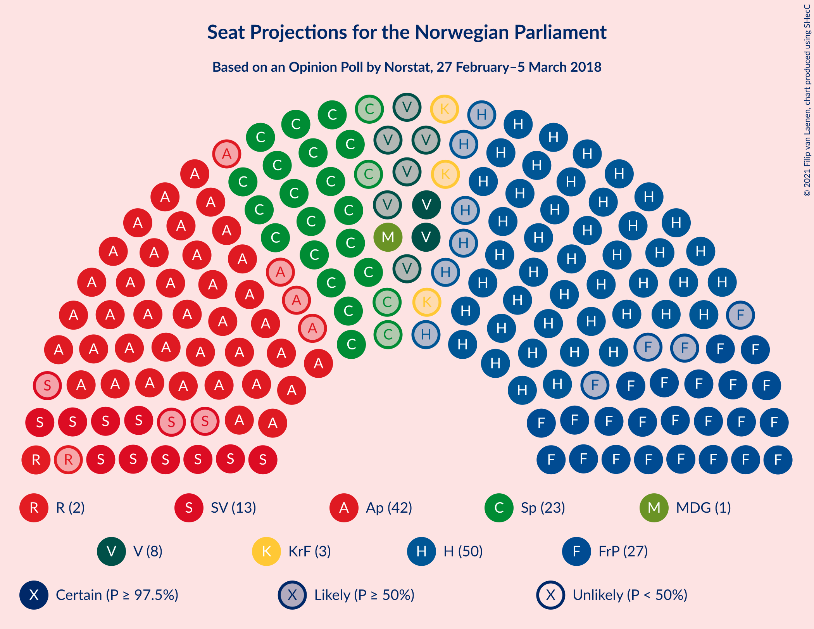
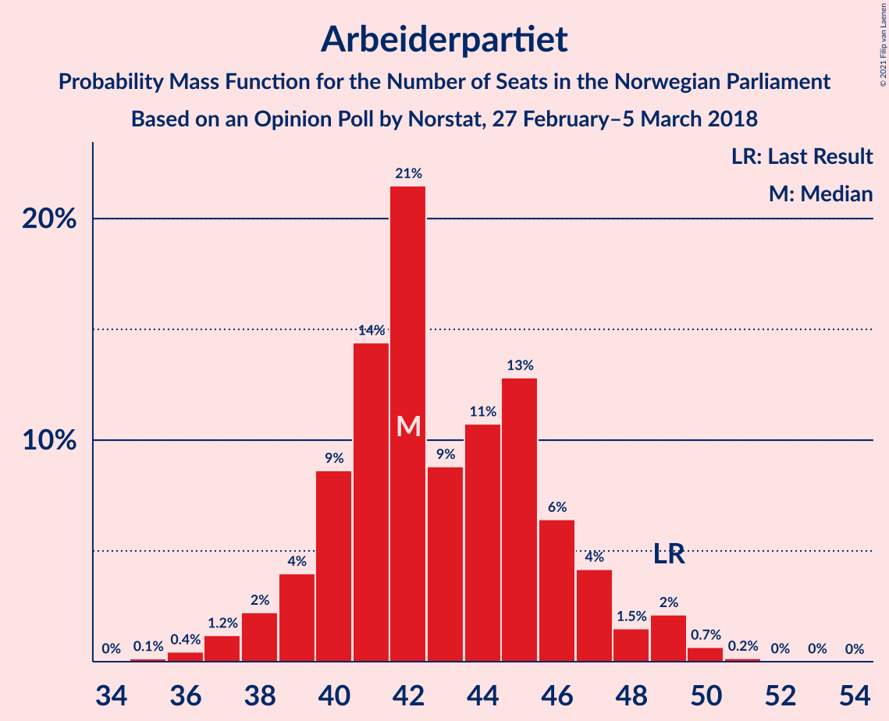
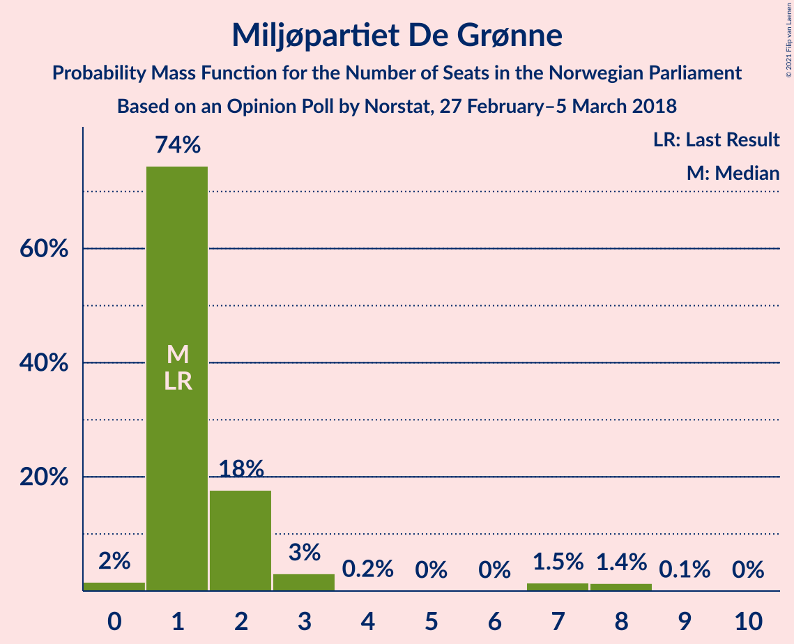
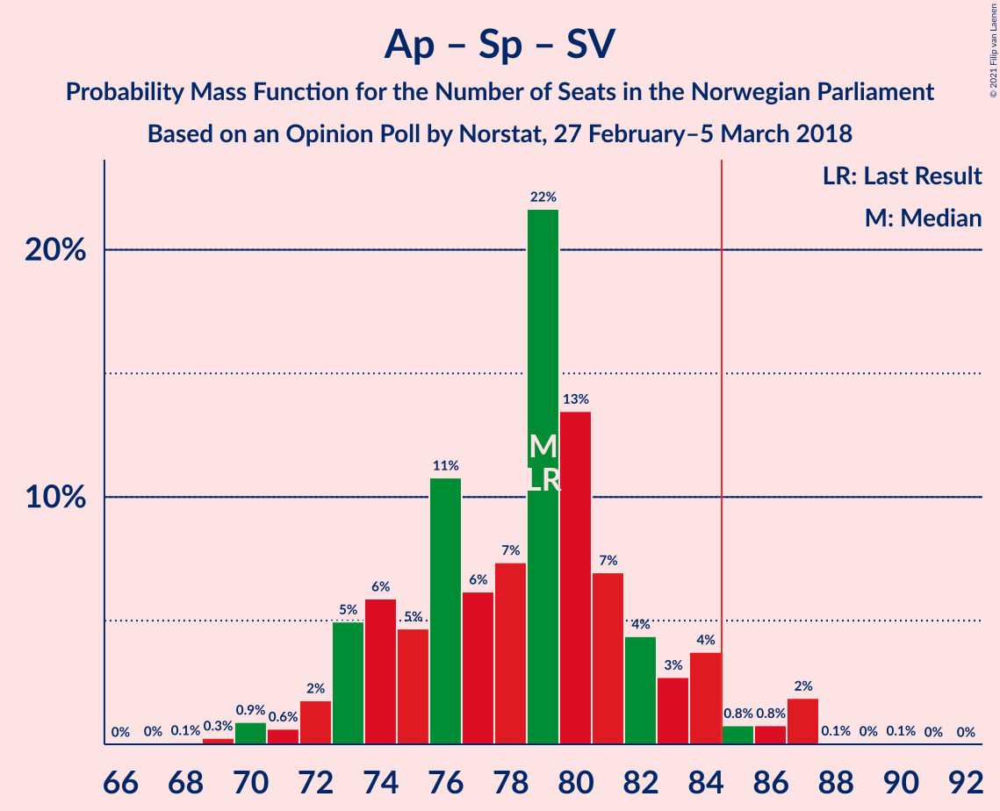
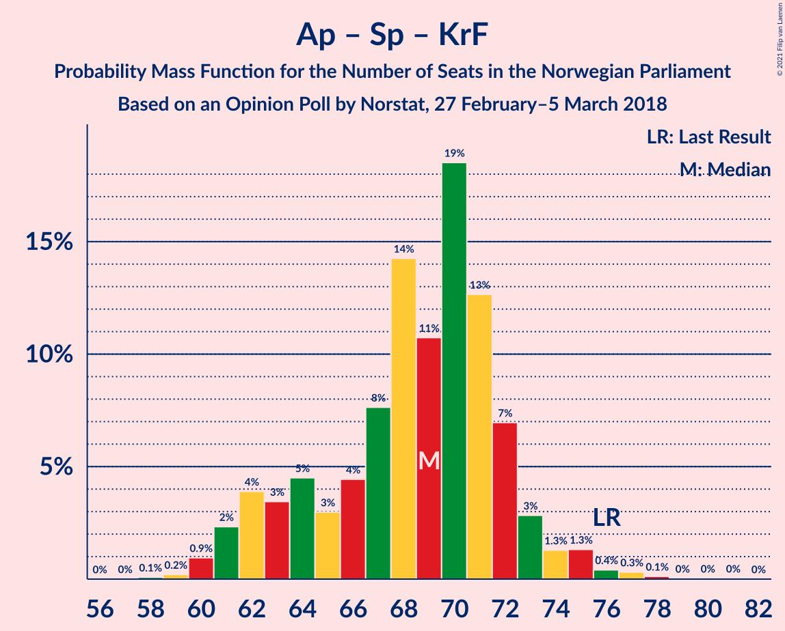

# Opinion Poll by Norstat, 27 February–5 March 2018

<a href="#voting-intentions">Voting Intentions</a> | <a href="#seats">Seats</a> | <a href="#coalitions">Coalitions</a> | <a href="#technical-information">Technical Information</a>

## Voting Intentions

### Confidence Intervals

| Party | Last Result | Poll Result | 80% Confidence Interval | 90% Confidence Interval | 95% Confidence Interval | 99% Confidence Interval |
|:-----:|:-----------:|:-----------:|:-----------------------:|:-----------------------:|:-----------------------:|:-----------------------:|
| Høyre | 25.0% | 27.4% | 25.6–29.4% |25.1–29.9% |24.6–30.4% |23.8–31.3% |
| Arbeiderpartiet | 27.4% | 23.3% | 21.6–25.2% |21.1–25.7% |20.7–26.2% |19.9–27.1% |
| Fremskrittspartiet | 15.2% | 15.1% | 13.6–16.7% |13.2–17.1% |12.9–17.5% |12.2–18.3% |
| Senterpartiet | 10.3% | 12.3% | 11.0–13.7% |10.6–14.2% |10.3–14.5% |9.7–15.3% |
| Sosialistisk Venstreparti | 6.0% | 7.0% | 6.0–8.2% |5.7–8.5% |5.5–8.8% |5.1–9.4% |
| Venstre | 4.4% | 4.3% | 3.6–5.3% |3.4–5.6% |3.2–5.8% |2.9–6.3% |
| Rødt | 2.4% | 3.2% | 2.6–4.1% |2.4–4.4% |2.3–4.6% |2.0–5.0% |
| Kristelig Folkeparti | 4.2% | 3.2% | 2.6–4.1% |2.4–4.4% |2.3–4.6% |2.0–5.0% |
| Miljøpartiet De Grønne | 3.2% | 2.8% | 2.2–3.6% |2.0–3.9% |1.9–4.1% |1.7–4.5% |

*Note:* The poll result column reflects the actual value used in the calculations. Published results may vary slightly, and in addition be rounded to fewer digits.

## Seats

### Confidence Intervals

| Party | Last Result | Median | 80% Confidence Interval | 90% Confidence Interval | 95% Confidence Interval | 99% Confidence Interval |
|:-----:|:-----------:|:------:|:-----------------------:|:-----------------------:|:-----------------------:|:-----------------------:|
| <a href="#høyre">Høyre</a> | 45 | 50 | 46–54 |45–54 |44–56 |43–57 |
| <a href="#arbeiderpartiet">Arbeiderpartiet</a> | 49 | 42 | 40–46 |39–47 |38–49 |36–50 |
| <a href="#fremskrittspartiet">Fremskrittspartiet</a> | 27 | 27 | 25–30 |24–31 |23–32 |22–34 |
| <a href="#senterpartiet">Senterpartiet</a> | 19 | 23 | 20–25 |19–26 |19–26 |18–28 |
| <a href="#sosialistisk-venstreparti">Sosialistisk Venstreparti</a> | 11 | 13 | 11–15 |10–16 |10–16 |9–17 |
| <a href="#venstre">Venstre</a> | 8 | 8 | 2–9 |2–10 |2–10 |2–11 |
| <a href="#rødt">Rødt</a> | 1 | 2 | 1–7 |1–8 |1–8 |1–9 |
| <a href="#kristelig-folkeparti">Kristelig Folkeparti</a> | 8 | 3 | 1–7 |1–8 |0–8 |0–9 |
| <a href="#miljøpartiet-de-grønne">Miljøpartiet De Grønne</a> | 1 | 1 | 1–2 |1–3 |1–7 |0–8 |

### Høyre

*For a full overview of the results for this party, see the [Høyre](party-høyre.html) page.*

| Number of Seats | Probability | Accumulated | Special Marks |
|:---------------:|:-----------:|:-----------:|:-------------:|
| 41 | 0.1% | 100% |  |
| 42 | 0.2% | 99.9% |  |
| 43 | 1.5% | 99.7% |  |
| 44 | 2% | 98% |  |
| 45 | 3% | 96% | Last Result |
| 46 | 5% | 93% |  |
| 47 | 7% | 88% |  |
| 48 | 13% | 81% |  |
| 49 | 15% | 68% |  |
| 50 | 14% | 53% | Median |
| 51 | 9% | 38% |  |
| 52 | 10% | 29% |  |
| 53 | 8% | 19% |  |
| 54 | 6% | 11% |  |
| 55 | 2% | 4% |  |
| 56 | 0.9% | 3% |  |
| 57 | 1.2% | 2% |  |
| 58 | 0.3% | 0.5% |  |
| 59 | 0.1% | 0.2% |  |
| 60 | 0.1% | 0.1% |  |
| 61 | 0% | 0% |  |

### Arbeiderpartiet

*For a full overview of the results for this party, see the [Arbeiderpartiet](party-arbeiderpartiet.html) page.*

| Number of Seats | Probability | Accumulated | Special Marks |
|:---------------:|:-----------:|:-----------:|:-------------:|
| 35 | 0.1% | 100% |  |
| 36 | 0.4% | 99.8% |  |
| 37 | 1.2% | 99.4% |  |
| 38 | 2% | 98% |  |
| 39 | 4% | 96% |  |
| 40 | 9% | 92% |  |
| 41 | 14% | 83% |  |
| 42 | 21% | 69% | Median |
| 43 | 9% | 47% |  |
| 44 | 11% | 39% |  |
| 45 | 13% | 28% |  |
| 46 | 6% | 15% |  |
| 47 | 4% | 9% |  |
| 48 | 1.5% | 5% |  |
| 49 | 2% | 3% | Last Result |
| 50 | 0.7% | 0.9% |  |
| 51 | 0.2% | 0.2% |  |
| 52 | 0% | 0.1% |  |
| 53 | 0% | 0% |  |

### Fremskrittspartiet

*For a full overview of the results for this party, see the [Fremskrittspartiet](party-fremskrittspartiet.html) page.*

| Number of Seats | Probability | Accumulated | Special Marks |
|:---------------:|:-----------:|:-----------:|:-------------:|
| 21 | 0.2% | 100% |  |
| 22 | 0.8% | 99.8% |  |
| 23 | 2% | 99.0% |  |
| 24 | 7% | 97% |  |
| 25 | 13% | 90% |  |
| 26 | 15% | 77% |  |
| 27 | 19% | 63% | Last Result, Median |
| 28 | 16% | 43% |  |
| 29 | 10% | 27% |  |
| 30 | 7% | 17% |  |
| 31 | 5% | 9% |  |
| 32 | 3% | 5% |  |
| 33 | 0.9% | 2% |  |
| 34 | 0.6% | 0.8% |  |
| 35 | 0.2% | 0.2% |  |
| 36 | 0% | 0% |  |

### Senterpartiet

*For a full overview of the results for this party, see the [Senterpartiet](party-senterpartiet.html) page.*

| Number of Seats | Probability | Accumulated | Special Marks |
|:---------------:|:-----------:|:-----------:|:-------------:|
| 16 | 0.1% | 100% |  |
| 17 | 0.3% | 99.9% |  |
| 18 | 1.5% | 99.6% |  |
| 19 | 4% | 98% | Last Result |
| 20 | 9% | 94% |  |
| 21 | 14% | 84% |  |
| 22 | 19% | 70% |  |
| 23 | 10% | 51% | Median |
| 24 | 13% | 41% |  |
| 25 | 19% | 28% |  |
| 26 | 6% | 9% |  |
| 27 | 2% | 2% |  |
| 28 | 0.4% | 0.6% |  |
| 29 | 0.1% | 0.2% |  |
| 30 | 0% | 0.1% |  |
| 31 | 0% | 0% |  |

### Sosialistisk Venstreparti

*For a full overview of the results for this party, see the [Sosialistisk Venstreparti](party-sosialistiskvenstreparti.html) page.*

| Number of Seats | Probability | Accumulated | Special Marks |
|:---------------:|:-----------:|:-----------:|:-------------:|
| 8 | 0.1% | 100% |  |
| 9 | 2% | 99.9% |  |
| 10 | 4% | 98% |  |
| 11 | 6% | 93% | Last Result |
| 12 | 34% | 87% |  |
| 13 | 32% | 53% | Median |
| 14 | 6% | 21% |  |
| 15 | 8% | 15% |  |
| 16 | 6% | 7% |  |
| 17 | 0.5% | 0.8% |  |
| 18 | 0.2% | 0.3% |  |
| 19 | 0.1% | 0.1% |  |
| 20 | 0% | 0% |  |

### Venstre

*For a full overview of the results for this party, see the [Venstre](party-venstre.html) page.*

| Number of Seats | Probability | Accumulated | Special Marks |
|:---------------:|:-----------:|:-----------:|:-------------:|
| 2 | 25% | 100% |  |
| 3 | 4% | 75% |  |
| 4 | 0% | 71% |  |
| 5 | 0% | 71% |  |
| 6 | 0% | 71% |  |
| 7 | 10% | 71% |  |
| 8 | 31% | 61% | Last Result, Median |
| 9 | 21% | 30% |  |
| 10 | 7% | 10% |  |
| 11 | 2% | 2% |  |
| 12 | 0.2% | 0.3% |  |
| 13 | 0% | 0% |  |

### Rødt

*For a full overview of the results for this party, see the [Rødt](party-rødt.html) page.*

| Number of Seats | Probability | Accumulated | Special Marks |
|:---------------:|:-----------:|:-----------:|:-------------:|
| 1 | 24% | 100% | Last Result |
| 2 | 61% | 76% | Median |
| 3 | 0% | 15% |  |
| 4 | 0% | 15% |  |
| 5 | 0% | 15% |  |
| 6 | 0% | 15% |  |
| 7 | 6% | 15% |  |
| 8 | 8% | 9% |  |
| 9 | 1.1% | 1.3% |  |
| 10 | 0.2% | 0.2% |  |
| 11 | 0% | 0% |  |

### Kristelig Folkeparti

*For a full overview of the results for this party, see the [Kristelig Folkeparti](party-kristeligfolkeparti.html) page.*

| Number of Seats | Probability | Accumulated | Special Marks |
|:---------------:|:-----------:|:-----------:|:-------------:|
| 0 | 4% | 100% |  |
| 1 | 22% | 96% |  |
| 2 | 13% | 74% |  |
| 3 | 50% | 61% | Median |
| 4 | 0% | 11% |  |
| 5 | 0% | 11% |  |
| 6 | 0% | 11% |  |
| 7 | 3% | 10% |  |
| 8 | 6% | 7% | Last Result |
| 9 | 0.9% | 1.2% |  |
| 10 | 0.2% | 0.2% |  |
| 11 | 0% | 0% |  |

### Miljøpartiet De Grønne

*For a full overview of the results for this party, see the [Miljøpartiet De Grønne](party-miljøpartietdegrønne.html) page.*

| Number of Seats | Probability | Accumulated | Special Marks |
|:---------------:|:-----------:|:-----------:|:-------------:|
| 0 | 2% | 100% |  |
| 1 | 74% | 98% | Last Result, Median |
| 2 | 18% | 24% |  |
| 3 | 3% | 6% |  |
| 4 | 0.2% | 3% |  |
| 5 | 0% | 3% |  |
| 6 | 0% | 3% |  |
| 7 | 1.5% | 3% |  |
| 8 | 1.4% | 1.5% |  |
| 9 | 0.1% | 0.1% |  |
| 10 | 0% | 0% |  |

## Coalitions

### Confidence Intervals

| Coalition | Last Result | Median | Majority? | 80% Confidence Interval | 90% Confidence Interval | 95% Confidence Interval | 99% Confidence Interval |
|:---------:|:-----------:|:------:|:---------:|:-----------------------:|:-----------------------:|:-----------------------:|:-----------------------:|
| Høyre – Fremskrittspartiet – Senterpartiet – Venstre – Kristelig Folkeparti | 107 | 110 | 100% | 104–113 | 103–115 | 101–115 | 100–117 |
| Høyre – Fremskrittspartiet – Venstre – Kristelig Folkeparti – Miljøpartiet De Grønne | 89 | 88 | 84% | 83–93 | 82–94 | 80–95 | 79–97 |
| Høyre – Fremskrittspartiet – Venstre – Kristelig Folkeparti | 88 | 87 | 73% | 82–92 | 81–93 | 79–94 | 78–96 |
| Høyre – Fremskrittspartiet – Venstre | 80 | 84 | 34% | 79–89 | 78–91 | 76–92 | 74–93 |
| Arbeiderpartiet – Senterpartiet – Sosialistisk Venstreparti – Kristelig Folkeparti – Miljøpartiet De Grønne | 88 | 83 | 26% | 78–87 | 76–89 | 75–90 | 74–92 |
| Arbeiderpartiet – Senterpartiet – Sosialistisk Venstreparti – Rødt – Miljøpartiet De Grønne | 81 | 82 | 27% | 77–87 | 76–88 | 75–90 | 73–91 |
| Arbeiderpartiet – Senterpartiet – Sosialistisk Venstreparti – Rødt | 80 | 81 | 16% | 76–86 | 75–87 | 74–89 | 72–90 |
| Arbeiderpartiet – Senterpartiet – Sosialistisk Venstreparti – Miljøpartiet De Grønne | 80 | 80 | 9% | 75–84 | 74–85 | 73–88 | 71–88 |
| Arbeiderpartiet – Senterpartiet – Sosialistisk Venstreparti | 79 | 79 | 4% | 74–83 | 73–84 | 72–86 | 70–87 |
| Høyre – Fremskrittspartiet | 72 | 77 | 2% | 73–82 | 72–83 | 71–84 | 69–88 |
| Arbeiderpartiet – Senterpartiet – Kristelig Folkeparti – Miljøpartiet De Grønne | 77 | 71 | 0% | 64–74 | 63–74 | 62–76 | 61–78 |
| Arbeiderpartiet – Senterpartiet – Kristelig Folkeparti | 76 | 69 | 0% | 63–72 | 62–73 | 61–74 | 60–77 |
| Arbeiderpartiet – Senterpartiet | 68 | 66 | 0% | 61–69 | 60–71 | 59–71 | 57–73 |
| Høyre – Venstre – Kristelig Folkeparti | 61 | 60 | 0% | 55–64 | 53–65 | 52–66 | 50–68 |
| Arbeiderpartiet – Sosialistisk Venstreparti | 60 | 55 | 0% | 52–59 | 51–61 | 50–62 | 48–65 |
| Senterpartiet – Venstre – Kristelig Folkeparti | 35 | 33 | 0% | 27–37 | 26–38 | 25–39 | 23–41 |

### Høyre – Fremskrittspartiet – Senterpartiet – Venstre – Kristelig Folkeparti

| Number of Seats | Probability | Accumulated | Special Marks |
|:---------------:|:-----------:|:-----------:|:-------------:|
| 96 | 0% | 100% |  |
| 97 | 0% | 99.9% |  |
| 98 | 0.1% | 99.9% |  |
| 99 | 0.1% | 99.8% |  |
| 100 | 0.6% | 99.7% |  |
| 101 | 2% | 99.0% |  |
| 102 | 0.7% | 97% |  |
| 103 | 3% | 97% |  |
| 104 | 4% | 94% |  |
| 105 | 5% | 90% |  |
| 106 | 8% | 85% |  |
| 107 | 7% | 76% | Last Result |
| 108 | 11% | 69% |  |
| 109 | 8% | 58% |  |
| 110 | 5% | 50% |  |
| 111 | 7% | 46% | Median |
| 112 | 20% | 39% |  |
| 113 | 10% | 19% |  |
| 114 | 4% | 9% |  |
| 115 | 4% | 5% |  |
| 116 | 0.6% | 1.5% |  |
| 117 | 0.5% | 0.9% |  |
| 118 | 0.2% | 0.3% |  |
| 119 | 0.1% | 0.1% |  |
| 120 | 0% | 0% |  |

### Høyre – Fremskrittspartiet – Venstre – Kristelig Folkeparti – Miljøpartiet De Grønne

| Number of Seats | Probability | Accumulated | Special Marks |
|:---------------:|:-----------:|:-----------:|:-------------:|
| 76 | 0.1% | 100% |  |
| 77 | 0.1% | 99.9% |  |
| 78 | 0.1% | 99.9% |  |
| 79 | 0.7% | 99.8% |  |
| 80 | 2% | 99.1% |  |
| 81 | 0.7% | 97% |  |
| 82 | 2% | 96% |  |
| 83 | 7% | 94% |  |
| 84 | 4% | 88% |  |
| 85 | 5% | 84% | Majority |
| 86 | 9% | 78% |  |
| 87 | 11% | 69% |  |
| 88 | 23% | 59% |  |
| 89 | 5% | 35% | Last Result, Median |
| 90 | 6% | 30% |  |
| 91 | 7% | 24% |  |
| 92 | 5% | 18% |  |
| 93 | 5% | 13% |  |
| 94 | 4% | 8% |  |
| 95 | 2% | 4% |  |
| 96 | 0.7% | 2% |  |
| 97 | 0.8% | 1.1% |  |
| 98 | 0.2% | 0.3% |  |
| 99 | 0.1% | 0.1% |  |
| 100 | 0% | 0% |  |

### Høyre – Fremskrittspartiet – Venstre – Kristelig Folkeparti

| Number of Seats | Probability | Accumulated | Special Marks |
|:---------------:|:-----------:|:-----------:|:-------------:|
| 75 | 0.1% | 100% |  |
| 76 | 0.2% | 99.9% |  |
| 77 | 0.1% | 99.7% |  |
| 78 | 0.9% | 99.6% |  |
| 79 | 2% | 98.7% |  |
| 80 | 1.0% | 96% |  |
| 81 | 2% | 95% |  |
| 82 | 8% | 94% |  |
| 83 | 4% | 85% |  |
| 84 | 8% | 81% |  |
| 85 | 9% | 73% | Majority |
| 86 | 10% | 64% |  |
| 87 | 22% | 54% |  |
| 88 | 6% | 32% | Last Result, Median |
| 89 | 5% | 26% |  |
| 90 | 6% | 21% |  |
| 91 | 3% | 15% |  |
| 92 | 5% | 11% |  |
| 93 | 3% | 6% |  |
| 94 | 2% | 3% |  |
| 95 | 0.5% | 1.3% |  |
| 96 | 0.7% | 0.9% |  |
| 97 | 0.1% | 0.2% |  |
| 98 | 0% | 0.1% |  |
| 99 | 0% | 0% |  |

### Høyre – Fremskrittspartiet – Venstre

| Number of Seats | Probability | Accumulated | Special Marks |
|:---------------:|:-----------:|:-----------:|:-------------:|
| 72 | 0% | 100% |  |
| 73 | 0.4% | 99.9% |  |
| 74 | 0.2% | 99.6% |  |
| 75 | 0.8% | 99.4% |  |
| 76 | 1.2% | 98.6% |  |
| 77 | 1.4% | 97% |  |
| 78 | 3% | 96% |  |
| 79 | 5% | 93% |  |
| 80 | 4% | 88% | Last Result |
| 81 | 9% | 84% |  |
| 82 | 10% | 75% |  |
| 83 | 13% | 65% |  |
| 84 | 18% | 52% |  |
| 85 | 10% | 34% | Median, Majority |
| 86 | 4% | 24% |  |
| 87 | 4% | 20% |  |
| 88 | 3% | 16% |  |
| 89 | 4% | 13% |  |
| 90 | 2% | 9% |  |
| 91 | 4% | 7% |  |
| 92 | 2% | 3% |  |
| 93 | 0.5% | 0.7% |  |
| 94 | 0% | 0.2% |  |
| 95 | 0.1% | 0.1% |  |
| 96 | 0% | 0.1% |  |
| 97 | 0% | 0% |  |

### Arbeiderpartiet – Senterpartiet – Sosialistisk Venstreparti – Kristelig Folkeparti – Miljøpartiet De Grønne

| Number of Seats | Probability | Accumulated | Special Marks |
|:---------------:|:-----------:|:-----------:|:-------------:|
| 71 | 0% | 100% |  |
| 72 | 0.1% | 99.9% |  |
| 73 | 0.2% | 99.9% |  |
| 74 | 0.6% | 99.7% |  |
| 75 | 2% | 99.1% |  |
| 76 | 4% | 97% |  |
| 77 | 3% | 93% |  |
| 78 | 4% | 90% |  |
| 79 | 3% | 86% |  |
| 80 | 7% | 83% |  |
| 81 | 8% | 76% |  |
| 82 | 11% | 68% | Median |
| 83 | 16% | 57% |  |
| 84 | 16% | 41% |  |
| 85 | 10% | 26% | Majority |
| 86 | 6% | 16% |  |
| 87 | 2% | 10% |  |
| 88 | 3% | 8% | Last Result |
| 89 | 2% | 5% |  |
| 90 | 1.2% | 3% |  |
| 91 | 1.0% | 2% |  |
| 92 | 0.4% | 0.6% |  |
| 93 | 0.1% | 0.2% |  |
| 94 | 0.1% | 0.1% |  |
| 95 | 0% | 0% |  |

### Arbeiderpartiet – Senterpartiet – Sosialistisk Venstreparti – Rødt – Miljøpartiet De Grønne

| Number of Seats | Probability | Accumulated | Special Marks |
|:---------------:|:-----------:|:-----------:|:-------------:|
| 71 | 0% | 100% |  |
| 72 | 0.1% | 99.9% |  |
| 73 | 0.7% | 99.8% |  |
| 74 | 0.5% | 99.1% |  |
| 75 | 2% | 98.7% |  |
| 76 | 3% | 97% |  |
| 77 | 5% | 94% |  |
| 78 | 3% | 89% |  |
| 79 | 6% | 85% |  |
| 80 | 5% | 79% |  |
| 81 | 6% | 74% | Last Result, Median |
| 82 | 22% | 68% |  |
| 83 | 10% | 46% |  |
| 84 | 9% | 36% |  |
| 85 | 8% | 27% | Majority |
| 86 | 4% | 19% |  |
| 87 | 8% | 15% |  |
| 88 | 2% | 6% |  |
| 89 | 1.0% | 5% |  |
| 90 | 2% | 4% |  |
| 91 | 0.9% | 1.3% |  |
| 92 | 0.1% | 0.4% |  |
| 93 | 0.2% | 0.3% |  |
| 94 | 0.1% | 0.1% |  |
| 95 | 0% | 0% |  |

### Arbeiderpartiet – Senterpartiet – Sosialistisk Venstreparti – Rødt

| Number of Seats | Probability | Accumulated | Special Marks |
|:---------------:|:-----------:|:-----------:|:-------------:|
| 70 | 0.1% | 100% |  |
| 71 | 0.2% | 99.9% |  |
| 72 | 0.8% | 99.7% |  |
| 73 | 0.7% | 98.9% |  |
| 74 | 2% | 98% |  |
| 75 | 4% | 96% |  |
| 76 | 5% | 92% |  |
| 77 | 5% | 87% |  |
| 78 | 7% | 82% |  |
| 79 | 6% | 76% |  |
| 80 | 5% | 70% | Last Result, Median |
| 81 | 23% | 65% |  |
| 82 | 11% | 41% |  |
| 83 | 9% | 31% |  |
| 84 | 5% | 22% |  |
| 85 | 4% | 16% | Majority |
| 86 | 7% | 12% |  |
| 87 | 2% | 6% |  |
| 88 | 0.7% | 4% |  |
| 89 | 2% | 3% |  |
| 90 | 0.7% | 0.9% |  |
| 91 | 0.1% | 0.2% |  |
| 92 | 0.1% | 0.1% |  |
| 93 | 0.1% | 0.1% |  |
| 94 | 0% | 0% |  |

### Arbeiderpartiet – Senterpartiet – Sosialistisk Venstreparti – Miljøpartiet De Grønne

| Number of Seats | Probability | Accumulated | Special Marks |
|:---------------:|:-----------:|:-----------:|:-------------:|
| 69 | 0% | 100% |  |
| 70 | 0.2% | 99.9% |  |
| 71 | 0.7% | 99.7% |  |
| 72 | 0.5% | 99.0% |  |
| 73 | 1.4% | 98.6% |  |
| 74 | 4% | 97% |  |
| 75 | 6% | 93% |  |
| 76 | 4% | 87% |  |
| 77 | 9% | 83% |  |
| 78 | 7% | 75% |  |
| 79 | 5% | 67% | Median |
| 80 | 23% | 62% | Last Result |
| 81 | 14% | 39% |  |
| 82 | 6% | 25% |  |
| 83 | 6% | 19% |  |
| 84 | 4% | 13% |  |
| 85 | 5% | 9% | Majority |
| 86 | 0.7% | 4% |  |
| 87 | 0.6% | 3% |  |
| 88 | 2% | 3% |  |
| 89 | 0.2% | 0.5% |  |
| 90 | 0.1% | 0.2% |  |
| 91 | 0.1% | 0.2% |  |
| 92 | 0% | 0% |  |

### Arbeiderpartiet – Senterpartiet – Sosialistisk Venstreparti

| Number of Seats | Probability | Accumulated | Special Marks |
|:---------------:|:-----------:|:-----------:|:-------------:|
| 68 | 0.1% | 100% |  |
| 69 | 0.3% | 99.9% |  |
| 70 | 0.9% | 99.6% |  |
| 71 | 0.6% | 98.7% |  |
| 72 | 2% | 98% |  |
| 73 | 5% | 96% |  |
| 74 | 6% | 91% |  |
| 75 | 5% | 85% |  |
| 76 | 11% | 81% |  |
| 77 | 6% | 70% |  |
| 78 | 7% | 64% | Median |
| 79 | 22% | 56% | Last Result |
| 80 | 13% | 35% |  |
| 81 | 7% | 21% |  |
| 82 | 4% | 14% |  |
| 83 | 3% | 10% |  |
| 84 | 4% | 7% |  |
| 85 | 0.8% | 4% | Majority |
| 86 | 0.8% | 3% |  |
| 87 | 2% | 2% |  |
| 88 | 0.1% | 0.2% |  |
| 89 | 0% | 0.1% |  |
| 90 | 0.1% | 0.1% |  |
| 91 | 0% | 0% |  |

### Høyre – Fremskrittspartiet

| Number of Seats | Probability | Accumulated | Special Marks |
|:---------------:|:-----------:|:-----------:|:-------------:|
| 67 | 0.1% | 100% |  |
| 68 | 0.2% | 99.9% |  |
| 69 | 0.5% | 99.7% |  |
| 70 | 1.4% | 99.2% |  |
| 71 | 2% | 98% |  |
| 72 | 3% | 96% | Last Result |
| 73 | 8% | 93% |  |
| 74 | 11% | 85% |  |
| 75 | 6% | 74% |  |
| 76 | 10% | 68% |  |
| 77 | 20% | 58% | Median |
| 78 | 6% | 39% |  |
| 79 | 7% | 33% |  |
| 80 | 8% | 25% |  |
| 81 | 6% | 17% |  |
| 82 | 4% | 11% |  |
| 83 | 5% | 8% |  |
| 84 | 1.0% | 3% |  |
| 85 | 1.0% | 2% | Majority |
| 86 | 0.1% | 1.0% |  |
| 87 | 0.2% | 0.9% |  |
| 88 | 0.5% | 0.6% |  |
| 89 | 0.1% | 0.1% |  |
| 90 | 0% | 0% |  |

### Arbeiderpartiet – Senterpartiet – Kristelig Folkeparti – Miljøpartiet De Grønne

| Number of Seats | Probability | Accumulated | Special Marks |
|:---------------:|:-----------:|:-----------:|:-------------:|
| 60 | 0.1% | 100% |  |
| 61 | 0.7% | 99.9% |  |
| 62 | 2% | 99.2% |  |
| 63 | 4% | 97% |  |
| 64 | 4% | 94% |  |
| 65 | 4% | 90% |  |
| 66 | 3% | 86% |  |
| 67 | 4% | 83% |  |
| 68 | 7% | 79% |  |
| 69 | 11% | 73% | Median |
| 70 | 11% | 62% |  |
| 71 | 20% | 51% |  |
| 72 | 13% | 31% |  |
| 73 | 6% | 18% |  |
| 74 | 7% | 11% |  |
| 75 | 1.4% | 5% |  |
| 76 | 2% | 4% |  |
| 77 | 0.5% | 1.3% | Last Result |
| 78 | 0.4% | 0.8% |  |
| 79 | 0.1% | 0.3% |  |
| 80 | 0.1% | 0.2% |  |
| 81 | 0.1% | 0.1% |  |
| 82 | 0% | 0.1% |  |
| 83 | 0% | 0% |  |

### Arbeiderpartiet – Senterpartiet – Kristelig Folkeparti

| Number of Seats | Probability | Accumulated | Special Marks |
|:---------------:|:-----------:|:-----------:|:-------------:|
| 58 | 0.1% | 100% |  |
| 59 | 0.2% | 99.9% |  |
| 60 | 0.9% | 99.7% |  |
| 61 | 2% | 98.7% |  |
| 62 | 4% | 96% |  |
| 63 | 3% | 93% |  |
| 64 | 5% | 89% |  |
| 65 | 3% | 85% |  |
| 66 | 4% | 82% |  |
| 67 | 8% | 77% |  |
| 68 | 14% | 70% | Median |
| 69 | 11% | 55% |  |
| 70 | 19% | 45% |  |
| 71 | 13% | 26% |  |
| 72 | 7% | 13% |  |
| 73 | 3% | 6% |  |
| 74 | 1.3% | 4% |  |
| 75 | 1.3% | 2% |  |
| 76 | 0.4% | 1.0% | Last Result |
| 77 | 0.3% | 0.5% |  |
| 78 | 0.1% | 0.2% |  |
| 79 | 0% | 0.1% |  |
| 80 | 0% | 0.1% |  |
| 81 | 0% | 0% |  |

### Arbeiderpartiet – Senterpartiet

| Number of Seats | Probability | Accumulated | Special Marks |
|:---------------:|:-----------:|:-----------:|:-------------:|
| 56 | 0.1% | 100% |  |
| 57 | 0.5% | 99.9% |  |
| 58 | 1.0% | 99.3% |  |
| 59 | 1.4% | 98% |  |
| 60 | 4% | 97% |  |
| 61 | 7% | 93% |  |
| 62 | 4% | 86% |  |
| 63 | 5% | 82% |  |
| 64 | 8% | 77% |  |
| 65 | 8% | 69% | Median |
| 66 | 18% | 61% |  |
| 67 | 19% | 43% |  |
| 68 | 9% | 24% | Last Result |
| 69 | 6% | 14% |  |
| 70 | 3% | 9% |  |
| 71 | 4% | 6% |  |
| 72 | 1.4% | 2% |  |
| 73 | 0.2% | 0.5% |  |
| 74 | 0.1% | 0.3% |  |
| 75 | 0.1% | 0.2% |  |
| 76 | 0% | 0.1% |  |
| 77 | 0% | 0.1% |  |
| 78 | 0% | 0% |  |

### Høyre – Venstre – Kristelig Folkeparti

| Number of Seats | Probability | Accumulated | Special Marks |
|:---------------:|:-----------:|:-----------:|:-------------:|
| 48 | 0.1% | 100% |  |
| 49 | 0.2% | 99.9% |  |
| 50 | 0.9% | 99.7% |  |
| 51 | 0.7% | 98.7% |  |
| 52 | 2% | 98% |  |
| 53 | 3% | 96% |  |
| 54 | 3% | 93% |  |
| 55 | 9% | 90% |  |
| 56 | 4% | 81% |  |
| 57 | 6% | 77% |  |
| 58 | 7% | 71% |  |
| 59 | 13% | 64% |  |
| 60 | 16% | 51% |  |
| 61 | 6% | 35% | Last Result, Median |
| 62 | 12% | 29% |  |
| 63 | 5% | 17% |  |
| 64 | 5% | 12% |  |
| 65 | 3% | 7% |  |
| 66 | 1.1% | 3% |  |
| 67 | 1.3% | 2% |  |
| 68 | 0.7% | 1.0% |  |
| 69 | 0.2% | 0.4% |  |
| 70 | 0.2% | 0.2% |  |
| 71 | 0% | 0% |  |

### Arbeiderpartiet – Sosialistisk Venstreparti

| Number of Seats | Probability | Accumulated | Special Marks |
|:---------------:|:-----------:|:-----------:|:-------------:|
| 47 | 0.1% | 100% |  |
| 48 | 0.6% | 99.8% |  |
| 49 | 0.8% | 99.2% |  |
| 50 | 1.4% | 98% |  |
| 51 | 3% | 97% |  |
| 52 | 5% | 94% |  |
| 53 | 11% | 89% |  |
| 54 | 24% | 79% |  |
| 55 | 8% | 54% | Median |
| 56 | 9% | 46% |  |
| 57 | 9% | 37% |  |
| 58 | 13% | 29% |  |
| 59 | 7% | 16% |  |
| 60 | 4% | 9% | Last Result |
| 61 | 2% | 5% |  |
| 62 | 1.2% | 3% |  |
| 63 | 0.4% | 2% |  |
| 64 | 0.4% | 2% |  |
| 65 | 1.0% | 1.1% |  |
| 66 | 0% | 0.1% |  |
| 67 | 0% | 0% |  |

### Senterpartiet – Venstre – Kristelig Folkeparti

| Number of Seats | Probability | Accumulated | Special Marks |
|:---------------:|:-----------:|:-----------:|:-------------:|
| 21 | 0.1% | 100% |  |
| 22 | 0.1% | 99.9% |  |
| 23 | 0.7% | 99.8% |  |
| 24 | 0.7% | 99.1% |  |
| 25 | 2% | 98% |  |
| 26 | 3% | 96% |  |
| 27 | 7% | 93% |  |
| 28 | 7% | 86% |  |
| 29 | 5% | 80% |  |
| 30 | 9% | 75% |  |
| 31 | 9% | 66% |  |
| 32 | 6% | 57% |  |
| 33 | 7% | 52% |  |
| 34 | 9% | 45% | Median |
| 35 | 21% | 36% | Last Result |
| 36 | 5% | 15% |  |
| 37 | 3% | 10% |  |
| 38 | 4% | 7% |  |
| 39 | 1.0% | 3% |  |
| 40 | 1.1% | 2% |  |
| 41 | 1.1% | 1.3% |  |
| 42 | 0.1% | 0.2% |  |
| 43 | 0% | 0.1% |  |
| 44 | 0% | 0% |  |

## Technical Information

### Opinion Poll

+ **Polling firm:** Norstat
+ **Commissioner(s):** —
+ **Fieldwork period:** 27 February–5 March 2018

### Calculations

+ **Sample size:** 930
+ **Simulations done:** 1,048,576
+ **Error estimate:** 2.04%

