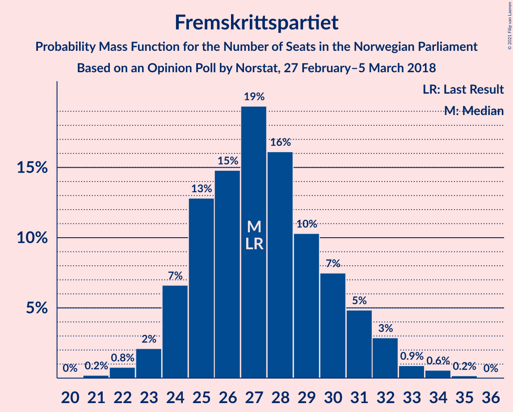
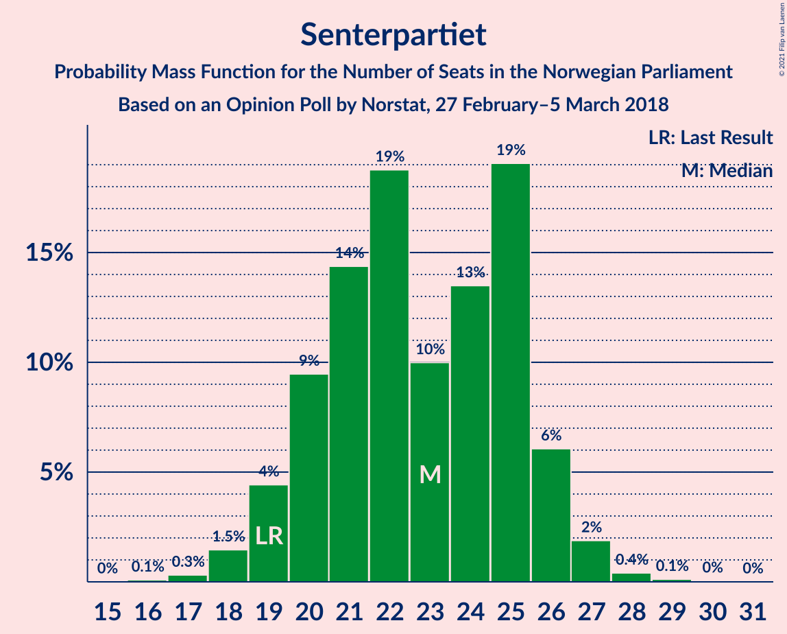
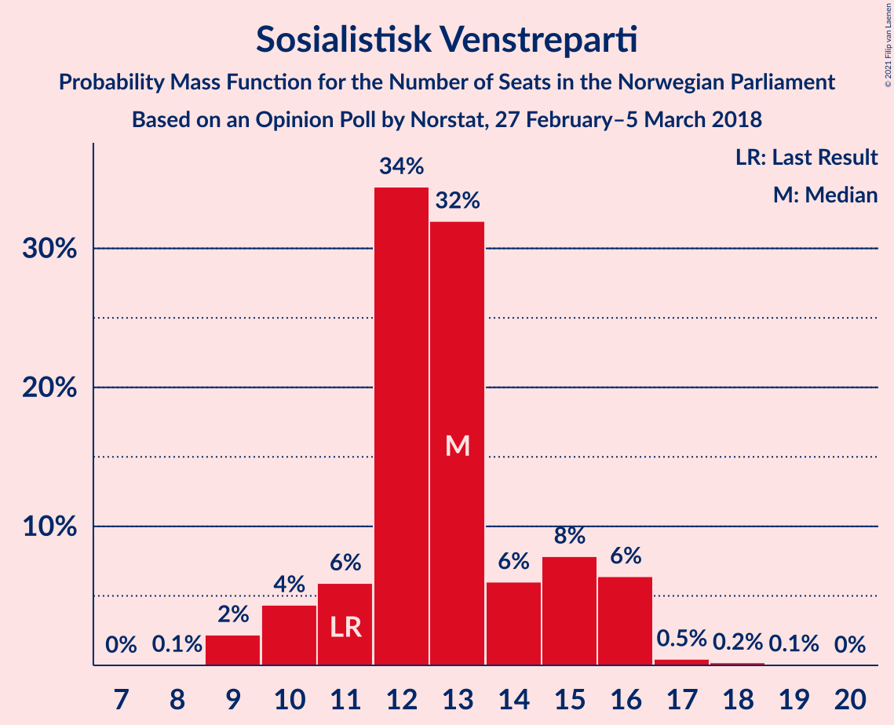
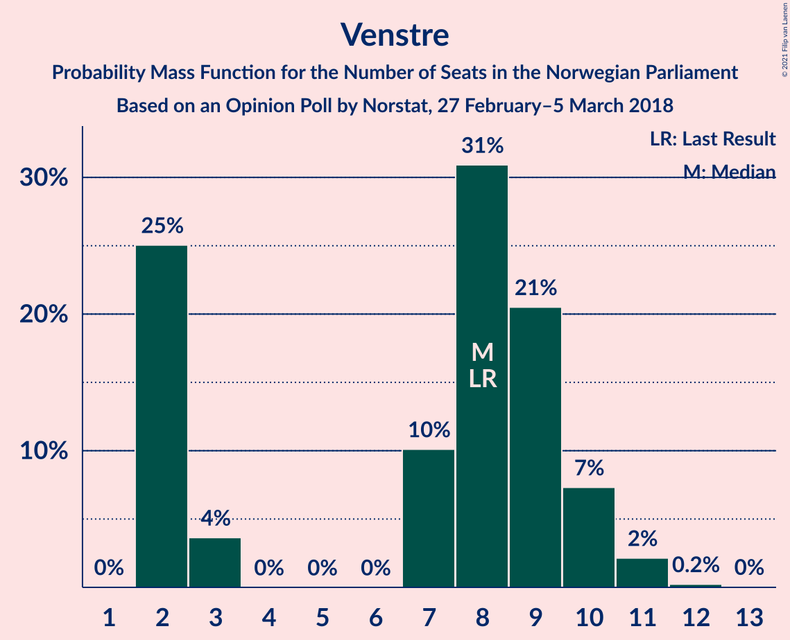
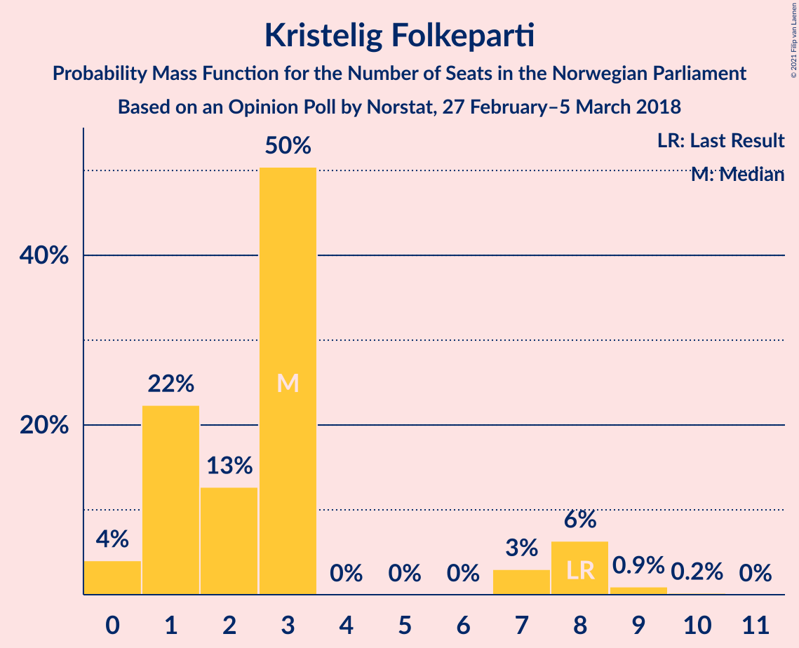
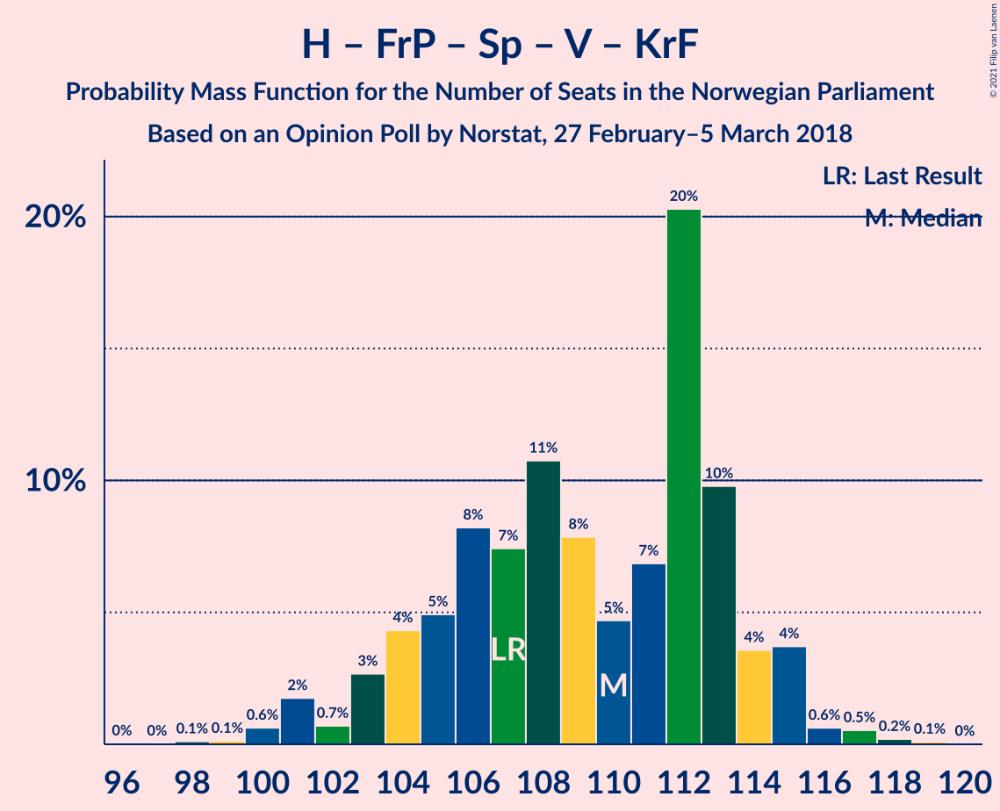
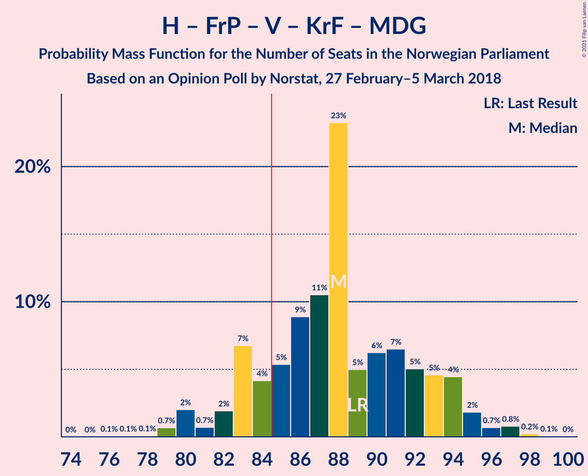
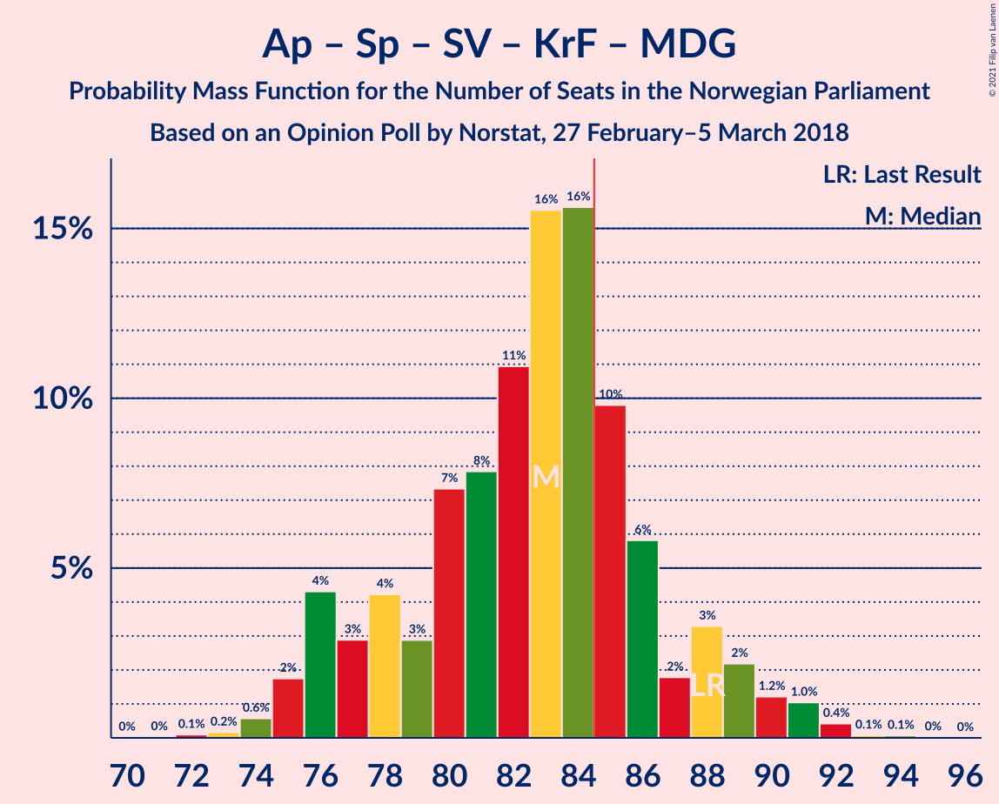

# Opinion Poll by Norstat, 27 February–5 March 2018

<a href="#voting-intentions">Voting Intentions</a> | <a href="#seats">Seats</a> | <a href="#coalitions">Coalitions</a> | <a href="#technical-information">Technical Information</a>

## Voting Intentions

### Confidence Intervals

| Party | Last Result | Poll Result | 80% Confidence Interval | 90% Confidence Interval | 95% Confidence Interval | 99% Confidence Interval |
|:-----:|:-----------:|:-----------:|:-----------------------:|:-----------------------:|:-----------------------:|:-----------------------:|
| Høyre | 25.0% | 27.4% | 25.6–29.4% |25.1–29.9% |24.6–30.4% |23.8–31.3% |
| Arbeiderpartiet | 27.4% | 23.3% | 21.6–25.2% |21.1–25.7% |20.7–26.2% |19.9–27.1% |
| Fremskrittspartiet | 15.2% | 15.1% | 13.6–16.7% |13.2–17.1% |12.9–17.5% |12.2–18.3% |
| Senterpartiet | 10.3% | 12.3% | 11.0–13.7% |10.6–14.2% |10.3–14.5% |9.7–15.3% |
| Sosialistisk Venstreparti | 6.0% | 7.0% | 6.0–8.2% |5.7–8.5% |5.5–8.8% |5.1–9.4% |
| Venstre | 4.4% | 4.3% | 3.6–5.3% |3.4–5.6% |3.2–5.8% |2.9–6.3% |
| Rødt | 2.4% | 3.2% | 2.6–4.1% |2.4–4.4% |2.3–4.6% |2.0–5.0% |
| Kristelig Folkeparti | 4.2% | 3.2% | 2.6–4.1% |2.4–4.4% |2.3–4.6% |2.0–5.0% |
| Miljøpartiet De Grønne | 3.2% | 2.8% | 2.2–3.6% |2.0–3.9% |1.9–4.1% |1.7–4.5% |

*Note:* The poll result column reflects the actual value used in the calculations. Published results may vary slightly, and in addition be rounded to fewer digits.

## Seats

### Confidence Intervals

| Party | Last Result | Median | 80% Confidence Interval | 90% Confidence Interval | 95% Confidence Interval | 99% Confidence Interval |
|:-----:|:-----------:|:------:|:-----------------------:|:-----------------------:|:-----------------------:|:-----------------------:|
| <a href="#høyre">Høyre</a> | 45 | 49 | 47–54 |45–57 |45–57 |43–57 |
| <a href="#arbeiderpartiet">Arbeiderpartiet</a> | 49 | 42 | 41–46 |39–47 |39–47 |37–49 |
| <a href="#fremskrittspartiet">Fremskrittspartiet</a> | 27 | 28 | 25–30 |24–31 |23–31 |23–33 |
| <a href="#senterpartiet">Senterpartiet</a> | 19 | 25 | 20–25 |19–25 |19–25 |18–26 |
| <a href="#sosialistisk-venstreparti">Sosialistisk Venstreparti</a> | 11 | 12 | 11–14 |11–15 |11–16 |9–18 |
| <a href="#venstre">Venstre</a> | 8 | 7 | 2–9 |2–10 |2–10 |2–11 |
| <a href="#rødt">Rødt</a> | 1 | 2 | 1–7 |1–7 |1–8 |1–9 |
| <a href="#kristelig-folkeparti">Kristelig Folkeparti</a> | 8 | 3 | 0–3 |0–8 |0–8 |0–8 |
| <a href="#miljøpartiet-de-grønne">Miljøpartiet De Grønne</a> | 1 | 1 | 1–2 |1–2 |0–2 |0–8 |

### Høyre

*For a full overview of the results for this party, see the [Høyre](party-høyre.html) page.*

| Number of Seats | Probability | Accumulated | Special Marks |
|:---------------:|:-----------:|:-----------:|:-------------:|
| 41 | 0.1% | 100% |  |
| 42 | 0.1% | 99.9% |  |
| 43 | 0.5% | 99.8% |  |
| 44 | 1.3% | 99.4% |  |
| 45 | 3% | 98% | Last Result |
| 46 | 3% | 95% |  |
| 47 | 10% | 92% |  |
| 48 | 4% | 82% |  |
| 49 | 45% | 79% | Median |
| 50 | 4% | 33% |  |
| 51 | 4% | 30% |  |
| 52 | 0.8% | 25% |  |
| 53 | 13% | 24% |  |
| 54 | 5% | 11% |  |
| 55 | 0.5% | 6% |  |
| 56 | 0.1% | 6% |  |
| 57 | 5% | 5% |  |
| 58 | 0.1% | 0.2% |  |
| 59 | 0.1% | 0.1% |  |
| 60 | 0% | 0% |  |

### Arbeiderpartiet

*For a full overview of the results for this party, see the [Arbeiderpartiet](party-arbeiderpartiet.html) page.*

| Number of Seats | Probability | Accumulated | Special Marks |
|:---------------:|:-----------:|:-----------:|:-------------:|
| 35 | 0.1% | 100% |  |
| 36 | 0.2% | 99.8% |  |
| 37 | 0.3% | 99.7% |  |
| 38 | 0.7% | 99.4% |  |
| 39 | 5% | 98.7% |  |
| 40 | 4% | 94% |  |
| 41 | 5% | 90% |  |
| 42 | 49% | 85% | Median |
| 43 | 4% | 36% |  |
| 44 | 2% | 32% |  |
| 45 | 13% | 31% |  |
| 46 | 11% | 18% |  |
| 47 | 5% | 7% |  |
| 48 | 0.2% | 2% |  |
| 49 | 2% | 2% | Last Result |
| 50 | 0.1% | 0.3% |  |
| 51 | 0.1% | 0.2% |  |
| 52 | 0.1% | 0.1% |  |
| 53 | 0% | 0% |  |

### Fremskrittspartiet

*For a full overview of the results for this party, see the [Fremskrittspartiet](party-fremskrittspartiet.html) page.*

| Number of Seats | Probability | Accumulated | Special Marks |
|:---------------:|:-----------:|:-----------:|:-------------:|
| 21 | 0.3% | 100% |  |
| 22 | 0.1% | 99.7% |  |
| 23 | 3% | 99.5% |  |
| 24 | 2% | 96% |  |
| 25 | 7% | 94% |  |
| 26 | 11% | 87% |  |
| 27 | 14% | 76% | Last Result |
| 28 | 48% | 62% | Median |
| 29 | 3% | 14% |  |
| 30 | 4% | 10% |  |
| 31 | 5% | 6% |  |
| 32 | 0.7% | 2% |  |
| 33 | 0.8% | 1.2% |  |
| 34 | 0.2% | 0.4% |  |
| 35 | 0.1% | 0.1% |  |
| 36 | 0% | 0% |  |

### Senterpartiet

*For a full overview of the results for this party, see the [Senterpartiet](party-senterpartiet.html) page.*

| Number of Seats | Probability | Accumulated | Special Marks |
|:---------------:|:-----------:|:-----------:|:-------------:|
| 17 | 0.2% | 100% |  |
| 18 | 1.2% | 99.8% |  |
| 19 | 4% | 98.6% | Last Result |
| 20 | 15% | 95% |  |
| 21 | 2% | 80% |  |
| 22 | 7% | 77% |  |
| 23 | 2% | 70% |  |
| 24 | 10% | 67% |  |
| 25 | 56% | 57% | Median |
| 26 | 1.1% | 2% |  |
| 27 | 0.2% | 0.4% |  |
| 28 | 0.1% | 0.3% |  |
| 29 | 0.1% | 0.2% |  |
| 30 | 0.1% | 0.1% |  |
| 31 | 0% | 0% |  |

### Sosialistisk Venstreparti

*For a full overview of the results for this party, see the [Sosialistisk Venstreparti](party-sosialistiskvenstreparti.html) page.*

| Number of Seats | Probability | Accumulated | Special Marks |
|:---------------:|:-----------:|:-----------:|:-------------:|
| 9 | 0.8% | 100% |  |
| 10 | 1.4% | 99.2% |  |
| 11 | 10% | 98% | Last Result |
| 12 | 58% | 88% | Median |
| 13 | 17% | 30% |  |
| 14 | 5% | 13% |  |
| 15 | 5% | 8% |  |
| 16 | 2% | 3% |  |
| 17 | 0.2% | 0.9% |  |
| 18 | 0.5% | 0.7% |  |
| 19 | 0.2% | 0.2% |  |
| 20 | 0% | 0% |  |

### Venstre

*For a full overview of the results for this party, see the [Venstre](party-venstre.html) page.*

| Number of Seats | Probability | Accumulated | Special Marks |
|:---------------:|:-----------:|:-----------:|:-------------:|
| 2 | 20% | 100% |  |
| 3 | 4% | 80% |  |
| 4 | 0% | 76% |  |
| 5 | 0% | 76% |  |
| 6 | 0% | 76% |  |
| 7 | 45% | 76% | Median |
| 8 | 17% | 31% | Last Result |
| 9 | 6% | 15% |  |
| 10 | 7% | 9% |  |
| 11 | 1.4% | 2% |  |
| 12 | 0.2% | 0.3% |  |
| 13 | 0% | 0.1% |  |
| 14 | 0% | 0% |  |

### Rødt

*For a full overview of the results for this party, see the [Rødt](party-rødt.html) page.*

| Number of Seats | Probability | Accumulated | Special Marks |
|:---------------:|:-----------:|:-----------:|:-------------:|
| 1 | 13% | 100% | Last Result |
| 2 | 75% | 87% | Median |
| 3 | 0% | 12% |  |
| 4 | 0% | 12% |  |
| 5 | 0% | 12% |  |
| 6 | 0% | 12% |  |
| 7 | 9% | 12% |  |
| 8 | 3% | 3% |  |
| 9 | 0.5% | 0.8% |  |
| 10 | 0.2% | 0.3% |  |
| 11 | 0% | 0% |  |

### Kristelig Folkeparti

*For a full overview of the results for this party, see the [Kristelig Folkeparti](party-kristeligfolkeparti.html) page.*

| Number of Seats | Probability | Accumulated | Special Marks |
|:---------------:|:-----------:|:-----------:|:-------------:|
| 0 | 10% | 100% |  |
| 1 | 16% | 90% |  |
| 2 | 4% | 74% |  |
| 3 | 64% | 70% | Median |
| 4 | 0% | 6% |  |
| 5 | 0% | 6% |  |
| 6 | 0% | 6% |  |
| 7 | 1.1% | 6% |  |
| 8 | 5% | 5% | Last Result |
| 9 | 0.3% | 0.5% |  |
| 10 | 0.1% | 0.2% |  |
| 11 | 0% | 0% |  |

### Miljøpartiet De Grønne

*For a full overview of the results for this party, see the [Miljøpartiet De Grønne](party-miljøpartietdegrønne.html) page.*

| Number of Seats | Probability | Accumulated | Special Marks |
|:---------------:|:-----------:|:-----------:|:-------------:|
| 0 | 3% | 100% |  |
| 1 | 81% | 97% | Last Result, Median |
| 2 | 15% | 16% |  |
| 3 | 0.1% | 1.2% |  |
| 4 | 0.1% | 1.1% |  |
| 5 | 0% | 1.0% |  |
| 6 | 0% | 1.0% |  |
| 7 | 0.2% | 1.0% |  |
| 8 | 0.7% | 0.8% |  |
| 9 | 0.1% | 0.1% |  |
| 10 | 0% | 0% |  |

## Coalitions

### Confidence Intervals

| Coalition | Last Result | Median | Majority? | 80% Confidence Interval | 90% Confidence Interval | 95% Confidence Interval | 99% Confidence Interval |
|:---------:|:-----------:|:------:|:---------:|:-----------------------:|:-----------------------:|:-----------------------:|:-----------------------:|
| Høyre – Fremskrittspartiet – Senterpartiet – Venstre – Kristelig Folkeparti | 107 | 112 | 100% | 105–112 | 104–114 | 104–115 | 100–116 |
| Høyre – Fremskrittspartiet – Venstre – Kristelig Folkeparti – Miljøpartiet De Grønne | 89 | 88 | 86% | 83–92 | 83–94 | 82–94 | 80–96 |
| Høyre – Fremskrittspartiet – Venstre – Kristelig Folkeparti | 88 | 87 | 73% | 82–91 | 82–93 | 81–93 | 79–94 |
| Høyre – Fremskrittspartiet – Venstre | 80 | 84 | 16% | 81–89 | 79–91 | 78–92 | 76–92 |
| Arbeiderpartiet – Senterpartiet – Sosialistisk Venstreparti – Kristelig Folkeparti – Miljøpartiet De Grønne | 88 | 83 | 24% | 78–86 | 76–87 | 76–89 | 75–91 |
| Arbeiderpartiet – Senterpartiet – Sosialistisk Venstreparti – Rødt – Miljøpartiet De Grønne | 81 | 82 | 27% | 78–87 | 76–87 | 76–88 | 75–90 |
| Høyre – Fremskrittspartiet | 72 | 77 | 4% | 73–81 | 73–82 | 71–88 | 70–88 |
| Arbeiderpartiet – Senterpartiet – Sosialistisk Venstreparti – Rødt | 80 | 81 | 14% | 77–86 | 75–86 | 75–87 | 73–89 |
| Arbeiderpartiet – Senterpartiet – Sosialistisk Venstreparti – Miljøpartiet De Grønne | 80 | 80 | 12% | 76–85 | 75–85 | 74–86 | 71–87 |
| Arbeiderpartiet – Senterpartiet – Sosialistisk Venstreparti | 79 | 79 | 3% | 74–84 | 74–84 | 73–85 | 70–86 |
| Arbeiderpartiet – Senterpartiet – Kristelig Folkeparti – Miljøpartiet De Grønne | 77 | 71 | 0% | 65–73 | 64–74 | 63–76 | 62–77 |
| Arbeiderpartiet – Senterpartiet – Kristelig Folkeparti | 76 | 70 | 0% | 63–72 | 63–73 | 62–73 | 61–75 |
| Arbeiderpartiet – Senterpartiet | 68 | 67 | 0% | 62–71 | 61–71 | 60–71 | 58–72 |
| Høyre – Venstre – Kristelig Folkeparti | 61 | 59 | 0% | 55–63 | 54–65 | 54–65 | 51–67 |
| Arbeiderpartiet – Sosialistisk Venstreparti | 60 | 54 | 0% | 53–59 | 52–60 | 52–61 | 49–64 |
| Senterpartiet – Venstre – Kristelig Folkeparti | 35 | 35 | 0% | 27–35 | 26–35 | 23–37 | 23–40 |

### Høyre – Fremskrittspartiet – Senterpartiet – Venstre – Kristelig Folkeparti

| Number of Seats | Probability | Accumulated | Special Marks |
|:---------------:|:-----------:|:-----------:|:-------------:|
| 97 | 0% | 100% |  |
| 98 | 0% | 99.9% |  |
| 99 | 0.2% | 99.9% |  |
| 100 | 0.2% | 99.7% |  |
| 101 | 0.1% | 99.4% |  |
| 102 | 0.8% | 99.3% |  |
| 103 | 0.5% | 98.5% |  |
| 104 | 8% | 98% |  |
| 105 | 4% | 91% |  |
| 106 | 7% | 87% |  |
| 107 | 10% | 80% | Last Result |
| 108 | 2% | 71% |  |
| 109 | 8% | 69% |  |
| 110 | 0.5% | 62% |  |
| 111 | 6% | 61% |  |
| 112 | 46% | 55% | Median |
| 113 | 4% | 9% |  |
| 114 | 0.6% | 5% |  |
| 115 | 4% | 5% |  |
| 116 | 0.2% | 0.5% |  |
| 117 | 0.2% | 0.3% |  |
| 118 | 0.1% | 0.1% |  |
| 119 | 0% | 0.1% |  |
| 120 | 0% | 0% |  |

### Høyre – Fremskrittspartiet – Venstre – Kristelig Folkeparti – Miljøpartiet De Grønne

| Number of Seats | Probability | Accumulated | Special Marks |
|:---------------:|:-----------:|:-----------:|:-------------:|
| 77 | 0% | 100% |  |
| 78 | 0.3% | 99.9% |  |
| 79 | 0% | 99.7% |  |
| 80 | 0.2% | 99.6% |  |
| 81 | 0.3% | 99.4% |  |
| 82 | 3% | 99.1% |  |
| 83 | 9% | 96% |  |
| 84 | 1.4% | 87% |  |
| 85 | 2% | 86% | Majority |
| 86 | 16% | 83% |  |
| 87 | 2% | 67% |  |
| 88 | 47% | 65% | Median |
| 89 | 0.3% | 18% | Last Result |
| 90 | 5% | 18% |  |
| 91 | 1.5% | 14% |  |
| 92 | 5% | 12% |  |
| 93 | 0.3% | 7% |  |
| 94 | 5% | 7% |  |
| 95 | 1.1% | 2% |  |
| 96 | 0.2% | 0.5% |  |
| 97 | 0.2% | 0.3% |  |
| 98 | 0.1% | 0.1% |  |
| 99 | 0% | 0% |  |

### Høyre – Fremskrittspartiet – Venstre – Kristelig Folkeparti

| Number of Seats | Probability | Accumulated | Special Marks |
|:---------------:|:-----------:|:-----------:|:-------------:|
| 76 | 0.1% | 100% |  |
| 77 | 0.3% | 99.9% |  |
| 78 | 0.1% | 99.6% |  |
| 79 | 0.3% | 99.5% |  |
| 80 | 0.6% | 99.2% |  |
| 81 | 3% | 98.6% |  |
| 82 | 10% | 96% |  |
| 83 | 2% | 86% |  |
| 84 | 12% | 85% |  |
| 85 | 6% | 73% | Majority |
| 86 | 3% | 67% |  |
| 87 | 46% | 64% | Median |
| 88 | 0.6% | 18% | Last Result |
| 89 | 5% | 17% |  |
| 90 | 2% | 13% |  |
| 91 | 3% | 10% |  |
| 92 | 0.4% | 7% |  |
| 93 | 5% | 7% |  |
| 94 | 1.3% | 2% |  |
| 95 | 0.1% | 0.4% |  |
| 96 | 0.2% | 0.3% |  |
| 97 | 0.1% | 0.1% |  |
| 98 | 0% | 0% |  |

### Høyre – Fremskrittspartiet – Venstre

| Number of Seats | Probability | Accumulated | Special Marks |
|:---------------:|:-----------:|:-----------:|:-------------:|
| 73 | 0.1% | 100% |  |
| 74 | 0.2% | 99.8% |  |
| 75 | 0.1% | 99.6% |  |
| 76 | 0.4% | 99.5% |  |
| 77 | 1.3% | 99.1% |  |
| 78 | 1.0% | 98% |  |
| 79 | 2% | 97% |  |
| 80 | 3% | 95% | Last Result |
| 81 | 11% | 92% |  |
| 82 | 12% | 81% |  |
| 83 | 7% | 69% |  |
| 84 | 46% | 62% | Median |
| 85 | 1.2% | 16% | Majority |
| 86 | 2% | 15% |  |
| 87 | 2% | 13% |  |
| 88 | 0.6% | 11% |  |
| 89 | 0.4% | 10% |  |
| 90 | 5% | 10% |  |
| 91 | 1.5% | 5% |  |
| 92 | 3% | 4% |  |
| 93 | 0.1% | 0.2% |  |
| 94 | 0% | 0.1% |  |
| 95 | 0.1% | 0.1% |  |
| 96 | 0% | 0% |  |

### Arbeiderpartiet – Senterpartiet – Sosialistisk Venstreparti – Kristelig Folkeparti – Miljøpartiet De Grønne

| Number of Seats | Probability | Accumulated | Special Marks |
|:---------------:|:-----------:|:-----------:|:-------------:|
| 72 | 0.2% | 100% |  |
| 73 | 0.1% | 99.8% |  |
| 74 | 0.1% | 99.7% |  |
| 75 | 0.1% | 99.6% |  |
| 76 | 5% | 99.4% |  |
| 77 | 4% | 95% |  |
| 78 | 3% | 91% |  |
| 79 | 0.9% | 87% |  |
| 80 | 1.4% | 87% |  |
| 81 | 10% | 85% |  |
| 82 | 2% | 75% |  |
| 83 | 46% | 74% | Median |
| 84 | 4% | 27% |  |
| 85 | 13% | 24% | Majority |
| 86 | 4% | 10% |  |
| 87 | 2% | 7% |  |
| 88 | 0.7% | 4% | Last Result |
| 89 | 2% | 4% |  |
| 90 | 1.2% | 2% |  |
| 91 | 0.4% | 0.5% |  |
| 92 | 0% | 0.2% |  |
| 93 | 0% | 0.1% |  |
| 94 | 0% | 0.1% |  |
| 95 | 0% | 0% |  |

### Arbeiderpartiet – Senterpartiet – Sosialistisk Venstreparti – Rødt – Miljøpartiet De Grønne

| Number of Seats | Probability | Accumulated | Special Marks |
|:---------------:|:-----------:|:-----------:|:-------------:|
| 72 | 0.1% | 100% |  |
| 73 | 0.2% | 99.9% |  |
| 74 | 0.1% | 99.7% |  |
| 75 | 1.3% | 99.6% |  |
| 76 | 5% | 98% |  |
| 77 | 0.4% | 93% |  |
| 78 | 3% | 93% |  |
| 79 | 2% | 90% |  |
| 80 | 5% | 87% |  |
| 81 | 0.6% | 83% | Last Result |
| 82 | 46% | 82% | Median |
| 83 | 3% | 36% |  |
| 84 | 6% | 33% |  |
| 85 | 12% | 27% | Majority |
| 86 | 2% | 15% |  |
| 87 | 10% | 14% |  |
| 88 | 3% | 4% |  |
| 89 | 0.6% | 1.4% |  |
| 90 | 0.3% | 0.8% |  |
| 91 | 0.1% | 0.5% |  |
| 92 | 0.3% | 0.4% |  |
| 93 | 0.1% | 0.1% |  |
| 94 | 0% | 0% |  |

### Høyre – Fremskrittspartiet

| Number of Seats | Probability | Accumulated | Special Marks |
|:---------------:|:-----------:|:-----------:|:-------------:|
| 67 | 0.1% | 100% |  |
| 68 | 0.1% | 99.9% |  |
| 69 | 0.2% | 99.8% |  |
| 70 | 0.8% | 99.6% |  |
| 71 | 2% | 98.8% |  |
| 72 | 2% | 97% | Last Result |
| 73 | 8% | 95% |  |
| 74 | 3% | 87% |  |
| 75 | 6% | 84% |  |
| 76 | 4% | 79% |  |
| 77 | 46% | 75% | Median |
| 78 | 4% | 29% |  |
| 79 | 2% | 25% |  |
| 80 | 12% | 23% |  |
| 81 | 2% | 11% |  |
| 82 | 4% | 8% |  |
| 83 | 0.2% | 5% |  |
| 84 | 0.6% | 5% |  |
| 85 | 0.3% | 4% | Majority |
| 86 | 0.2% | 4% |  |
| 87 | 0.8% | 3% |  |
| 88 | 3% | 3% |  |
| 89 | 0% | 0.1% |  |
| 90 | 0% | 0% |  |

### Arbeiderpartiet – Senterpartiet – Sosialistisk Venstreparti – Rødt

| Number of Seats | Probability | Accumulated | Special Marks |
|:---------------:|:-----------:|:-----------:|:-------------:|
| 71 | 0.1% | 100% |  |
| 72 | 0.2% | 99.9% |  |
| 73 | 0.2% | 99.7% |  |
| 74 | 1.1% | 99.5% |  |
| 75 | 5% | 98% |  |
| 76 | 0.3% | 93% |  |
| 77 | 5% | 93% |  |
| 78 | 1.5% | 88% |  |
| 79 | 5% | 86% |  |
| 80 | 0.3% | 82% | Last Result |
| 81 | 47% | 82% | Median |
| 82 | 2% | 35% |  |
| 83 | 16% | 33% |  |
| 84 | 2% | 17% |  |
| 85 | 1.4% | 14% | Majority |
| 86 | 9% | 13% |  |
| 87 | 3% | 4% |  |
| 88 | 0.3% | 0.9% |  |
| 89 | 0.2% | 0.6% |  |
| 90 | 0% | 0.4% |  |
| 91 | 0.3% | 0.3% |  |
| 92 | 0% | 0.1% |  |
| 93 | 0% | 0% |  |

### Arbeiderpartiet – Senterpartiet – Sosialistisk Venstreparti – Miljøpartiet De Grønne

| Number of Seats | Probability | Accumulated | Special Marks |
|:---------------:|:-----------:|:-----------:|:-------------:|
| 69 | 0% | 100% |  |
| 70 | 0.2% | 99.9% |  |
| 71 | 0.3% | 99.8% |  |
| 72 | 0.2% | 99.5% |  |
| 73 | 1.0% | 99.3% |  |
| 74 | 1.2% | 98% |  |
| 75 | 7% | 97% |  |
| 76 | 3% | 90% |  |
| 77 | 0.8% | 87% |  |
| 78 | 13% | 86% |  |
| 79 | 1.3% | 73% |  |
| 80 | 45% | 72% | Last Result, Median |
| 81 | 1.3% | 26% |  |
| 82 | 7% | 25% |  |
| 83 | 3% | 18% |  |
| 84 | 3% | 15% |  |
| 85 | 10% | 12% | Majority |
| 86 | 0.5% | 3% |  |
| 87 | 2% | 2% |  |
| 88 | 0.3% | 0.4% |  |
| 89 | 0% | 0.1% |  |
| 90 | 0% | 0.1% |  |
| 91 | 0.1% | 0.1% |  |
| 92 | 0% | 0% |  |

### Arbeiderpartiet – Senterpartiet – Sosialistisk Venstreparti

| Number of Seats | Probability | Accumulated | Special Marks |
|:---------------:|:-----------:|:-----------:|:-------------:|
| 68 | 0% | 100% |  |
| 69 | 0.2% | 99.9% |  |
| 70 | 0.4% | 99.8% |  |
| 71 | 0.2% | 99.3% |  |
| 72 | 0.7% | 99.1% |  |
| 73 | 2% | 98% |  |
| 74 | 7% | 96% |  |
| 75 | 3% | 90% |  |
| 76 | 10% | 87% |  |
| 77 | 4% | 76% |  |
| 78 | 1.3% | 72% |  |
| 79 | 46% | 71% | Last Result, Median |
| 80 | 1.2% | 25% |  |
| 81 | 9% | 24% |  |
| 82 | 0.5% | 15% |  |
| 83 | 2% | 14% |  |
| 84 | 9% | 12% |  |
| 85 | 1.1% | 3% | Majority |
| 86 | 2% | 2% |  |
| 87 | 0.1% | 0.2% |  |
| 88 | 0% | 0.1% |  |
| 89 | 0% | 0.1% |  |
| 90 | 0% | 0% |  |

### Arbeiderpartiet – Senterpartiet – Kristelig Folkeparti – Miljøpartiet De Grønne

| Number of Seats | Probability | Accumulated | Special Marks |
|:---------------:|:-----------:|:-----------:|:-------------:|
| 60 | 0.1% | 100% |  |
| 61 | 0.2% | 99.9% |  |
| 62 | 0.4% | 99.7% |  |
| 63 | 4% | 99.3% |  |
| 64 | 6% | 96% |  |
| 65 | 2% | 90% |  |
| 66 | 3% | 88% |  |
| 67 | 2% | 85% |  |
| 68 | 1.1% | 83% |  |
| 69 | 2% | 82% |  |
| 70 | 9% | 81% |  |
| 71 | 47% | 72% | Median |
| 72 | 12% | 25% |  |
| 73 | 4% | 13% |  |
| 74 | 6% | 9% |  |
| 75 | 0.2% | 3% |  |
| 76 | 2% | 3% |  |
| 77 | 0.3% | 0.5% | Last Result |
| 78 | 0.1% | 0.3% |  |
| 79 | 0% | 0.1% |  |
| 80 | 0% | 0.1% |  |
| 81 | 0% | 0% |  |

### Arbeiderpartiet – Senterpartiet – Kristelig Folkeparti

| Number of Seats | Probability | Accumulated | Special Marks |
|:---------------:|:-----------:|:-----------:|:-------------:|
| 59 | 0.2% | 100% |  |
| 60 | 0.2% | 99.8% |  |
| 61 | 0.4% | 99.5% |  |
| 62 | 4% | 99.1% |  |
| 63 | 6% | 96% |  |
| 64 | 3% | 89% |  |
| 65 | 3% | 87% |  |
| 66 | 2% | 84% |  |
| 67 | 1.4% | 83% |  |
| 68 | 9% | 81% |  |
| 69 | 2% | 72% |  |
| 70 | 48% | 70% | Median |
| 71 | 9% | 22% |  |
| 72 | 4% | 13% |  |
| 73 | 6% | 9% |  |
| 74 | 0.2% | 2% |  |
| 75 | 2% | 2% |  |
| 76 | 0.2% | 0.3% | Last Result |
| 77 | 0% | 0.1% |  |
| 78 | 0% | 0.1% |  |
| 79 | 0% | 0% |  |

### Arbeiderpartiet – Senterpartiet

| Number of Seats | Probability | Accumulated | Special Marks |
|:---------------:|:-----------:|:-----------:|:-------------:|
| 56 | 0% | 100% |  |
| 57 | 0.1% | 99.9% |  |
| 58 | 0.4% | 99.8% |  |
| 59 | 0.4% | 99.4% |  |
| 60 | 3% | 99.0% |  |
| 61 | 6% | 96% |  |
| 62 | 4% | 90% |  |
| 63 | 2% | 86% |  |
| 64 | 2% | 83% |  |
| 65 | 12% | 82% |  |
| 66 | 1.4% | 70% |  |
| 67 | 46% | 68% | Median |
| 68 | 2% | 23% | Last Result |
| 69 | 7% | 20% |  |
| 70 | 2% | 14% |  |
| 71 | 10% | 12% |  |
| 72 | 2% | 2% |  |
| 73 | 0.1% | 0.1% |  |
| 74 | 0% | 0.1% |  |
| 75 | 0% | 0.1% |  |
| 76 | 0% | 0% |  |

### Høyre – Venstre – Kristelig Folkeparti

| Number of Seats | Probability | Accumulated | Special Marks |
|:---------------:|:-----------:|:-----------:|:-------------:|
| 48 | 0.1% | 100% |  |
| 49 | 0.2% | 99.9% |  |
| 50 | 0.1% | 99.7% |  |
| 51 | 0.2% | 99.6% |  |
| 52 | 0.4% | 99.4% |  |
| 53 | 0.5% | 99.0% |  |
| 54 | 4% | 98% |  |
| 55 | 9% | 94% |  |
| 56 | 2% | 85% |  |
| 57 | 4% | 83% |  |
| 58 | 9% | 79% |  |
| 59 | 45% | 70% | Median |
| 60 | 8% | 25% |  |
| 61 | 3% | 17% | Last Result |
| 62 | 4% | 14% |  |
| 63 | 0.8% | 11% |  |
| 64 | 4% | 10% |  |
| 65 | 4% | 6% |  |
| 66 | 0.8% | 2% |  |
| 67 | 0.8% | 1.0% |  |
| 68 | 0.1% | 0.2% |  |
| 69 | 0% | 0.1% |  |
| 70 | 0% | 0.1% |  |
| 71 | 0% | 0% |  |

### Arbeiderpartiet – Sosialistisk Venstreparti

| Number of Seats | Probability | Accumulated | Special Marks |
|:---------------:|:-----------:|:-----------:|:-------------:|
| 47 | 0% | 100% |  |
| 48 | 0.2% | 99.9% |  |
| 49 | 0.8% | 99.8% |  |
| 50 | 0.4% | 99.0% |  |
| 51 | 0.7% | 98.6% |  |
| 52 | 5% | 98% |  |
| 53 | 4% | 93% |  |
| 54 | 47% | 89% | Median |
| 55 | 7% | 42% |  |
| 56 | 9% | 36% |  |
| 57 | 6% | 27% |  |
| 58 | 3% | 21% |  |
| 59 | 12% | 19% |  |
| 60 | 2% | 6% | Last Result |
| 61 | 3% | 5% |  |
| 62 | 2% | 2% |  |
| 63 | 0.1% | 0.7% |  |
| 64 | 0.4% | 0.6% |  |
| 65 | 0% | 0.2% |  |
| 66 | 0.1% | 0.1% |  |
| 67 | 0% | 0% |  |

### Senterpartiet – Venstre – Kristelig Folkeparti

| Number of Seats | Probability | Accumulated | Special Marks |
|:---------------:|:-----------:|:-----------:|:-------------:|
| 21 | 0.1% | 100% |  |
| 22 | 0.1% | 99.9% |  |
| 23 | 3% | 99.9% |  |
| 24 | 0.9% | 97% |  |
| 25 | 1.4% | 96% |  |
| 26 | 0.1% | 95% |  |
| 27 | 9% | 95% |  |
| 28 | 2% | 86% |  |
| 29 | 5% | 83% |  |
| 30 | 1.0% | 78% |  |
| 31 | 12% | 77% |  |
| 32 | 4% | 65% |  |
| 33 | 4% | 61% |  |
| 34 | 4% | 57% |  |
| 35 | 49% | 53% | Last Result, Median |
| 36 | 1.0% | 4% |  |
| 37 | 1.4% | 3% |  |
| 38 | 0.7% | 2% |  |
| 39 | 0.4% | 1.3% |  |
| 40 | 0.3% | 0.8% |  |
| 41 | 0.4% | 0.5% |  |
| 42 | 0.1% | 0.1% |  |
| 43 | 0% | 0% |  |

## Technical Information

### Opinion Poll

+ **Polling firm:** Norstat
+ **Commissioner(s):** —
+ **Fieldwork period:** 27 February–5 March 2018

### Calculations

+ **Sample size:** 930
+ **Simulations done:** 131,072
+ **Error estimate:** 2.79%

