# Opinion Poll by Respons Analyse, 1–5 March 2018

<a href="#voting-intentions">Voting Intentions</a> | <a href="#seats">Seats</a> | <a href="#coalitions">Coalitions</a> | <a href="#technical-information">Technical Information</a>

## Voting Intentions

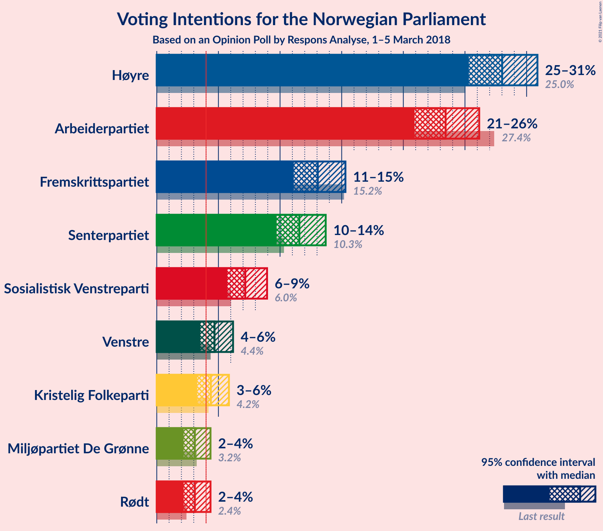

### Confidence Intervals

| Party | Last Result | Poll Result | 80% Confidence Interval | 90% Confidence Interval | 95% Confidence Interval | 99% Confidence Interval |
|:-----:|:-----------:|:-----------:|:-----------------------:|:-----------------------:|:-----------------------:|:-----------------------:|
| Høyre | 25.0% | 28.0% | 26.2–29.9% |25.7–30.4% |25.3–30.9% |24.5–31.8% |
| Arbeiderpartiet | 27.4% | 23.4% | 21.8–25.2% |21.3–25.7% |20.9–26.2% |20.1–27.0% |
| Fremskrittspartiet | 15.2% | 13.1% | 11.8–14.5% |11.4–14.9% |11.1–15.3% |10.5–16.0% |
| Senterpartiet | 10.3% | 11.6% | 10.3–13.0% |10.0–13.4% |9.7–13.7% |9.2–14.4% |
| Sosialistisk Venstreparti | 6.0% | 7.2% | 6.2–8.3% |6.0–8.7% |5.7–8.9% |5.3–9.5% |
| Venstre | 4.4% | 4.7% | 3.9–5.7% |3.7–5.9% |3.5–6.2% |3.2–6.7% |
| Kristelig Folkeparti | 4.2% | 4.4% | 3.7–5.3% |3.4–5.6% |3.3–5.9% |3.0–6.3% |
| Rødt | 2.4% | 3.1% | 2.5–3.9% |2.3–4.1% |2.2–4.4% |1.9–4.8% |
| Miljøpartiet De Grønne | 3.2% | 3.1% | 2.5–3.9% |2.3–4.1% |2.2–4.4% |1.9–4.8% |

*Note:* The poll result column reflects the actual value used in the calculations. Published results may vary slightly, and in addition be rounded to fewer digits.

## Seats

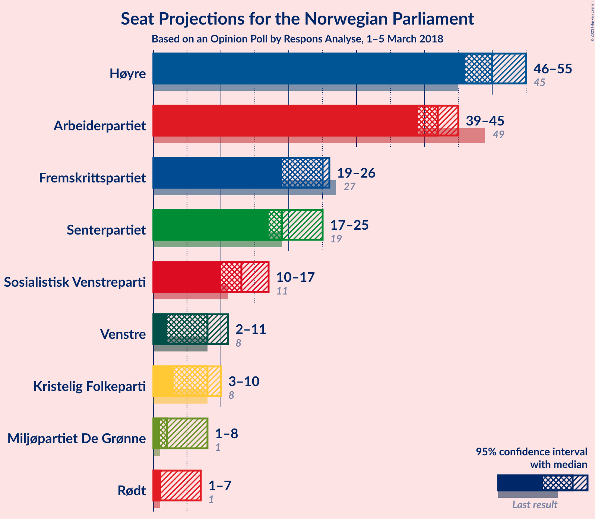

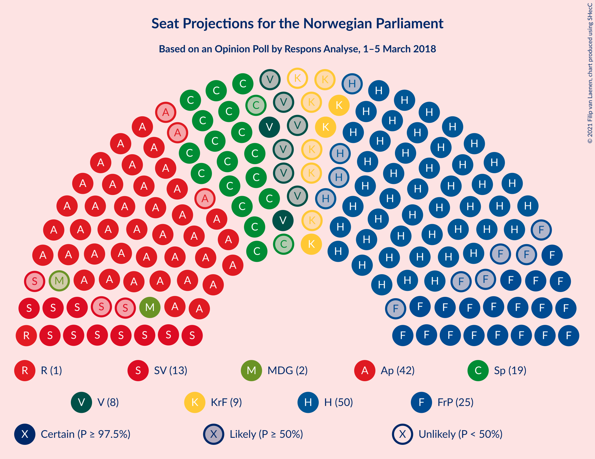

### Confidence Intervals

| Party | Last Result | Median | 80% Confidence Interval | 90% Confidence Interval | 95% Confidence Interval | 99% Confidence Interval |
|:-----:|:-----------:|:------:|:-----------------------:|:-----------------------:|:-----------------------:|:-----------------------:|
| <a href="#høyre">Høyre</a> | 45 | 50 | 47–53 |47–54 |46–55 |45–57 |
| <a href="#arbeiderpartiet">Arbeiderpartiet</a> | 49 | 42 | 41–44 |40–44 |39–45 |38–47 |
| <a href="#fremskrittspartiet">Fremskrittspartiet</a> | 27 | 25 | 22–26 |20–26 |19–26 |18–28 |
| <a href="#senterpartiet">Senterpartiet</a> | 19 | 19 | 18–23 |17–24 |17–25 |17–27 |
| <a href="#sosialistisk-venstreparti">Sosialistisk Venstreparti</a> | 11 | 13 | 12–14 |11–16 |10–17 |10–17 |
| <a href="#venstre">Venstre</a> | 8 | 8 | 7–10 |2–11 |2–11 |2–12 |
| <a href="#kristelig-folkeparti">Kristelig Folkeparti</a> | 8 | 8 | 3–9 |3–10 |3–10 |1–11 |
| <a href="#rødt">Rødt</a> | 1 | 1 | 1–2 |1–2 |1–7 |1–8 |
| <a href="#miljøpartiet-de-grønne">Miljøpartiet De Grønne</a> | 1 | 2 | 1–7 |1–7 |1–8 |1–8 |

### Høyre

*For a full overview of the results for this party, see the [Høyre](party-høyre.html) page.*

| Number of Seats | Probability | Accumulated | Special Marks |
|:---------------:|:-----------:|:-----------:|:-------------:|
| 42 | 0% | 100% |  |
| 43 | 0.1% | 99.9% |  |
| 44 | 0.3% | 99.8% |  |
| 45 | 1.3% | 99.5% | Last Result |
| 46 | 2% | 98% |  |
| 47 | 14% | 96% |  |
| 48 | 8% | 82% |  |
| 49 | 20% | 74% |  |
| 50 | 23% | 54% | Median |
| 51 | 9% | 31% |  |
| 52 | 10% | 22% |  |
| 53 | 7% | 12% |  |
| 54 | 3% | 6% |  |
| 55 | 2% | 3% |  |
| 56 | 0.2% | 0.9% |  |
| 57 | 0.4% | 0.7% |  |
| 58 | 0.1% | 0.3% |  |
| 59 | 0.1% | 0.2% |  |
| 60 | 0% | 0% |  |

### Arbeiderpartiet

*For a full overview of the results for this party, see the [Arbeiderpartiet](party-arbeiderpartiet.html) page.*

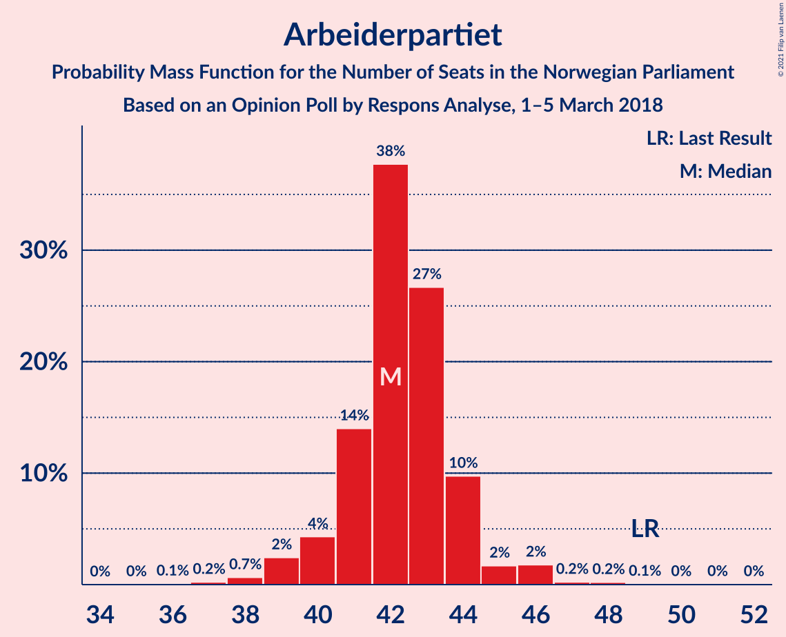

| Number of Seats | Probability | Accumulated | Special Marks |
|:---------------:|:-----------:|:-----------:|:-------------:|
| 36 | 0.1% | 100% |  |
| 37 | 0.2% | 99.9% |  |
| 38 | 0.7% | 99.7% |  |
| 39 | 2% | 99.0% |  |
| 40 | 4% | 97% |  |
| 41 | 14% | 92% |  |
| 42 | 38% | 78% | Median |
| 43 | 27% | 41% |  |
| 44 | 10% | 14% |  |
| 45 | 2% | 4% |  |
| 46 | 2% | 2% |  |
| 47 | 0.2% | 0.6% |  |
| 48 | 0.2% | 0.4% |  |
| 49 | 0.1% | 0.2% | Last Result |
| 50 | 0% | 0.1% |  |
| 51 | 0% | 0.1% |  |
| 52 | 0% | 0% |  |

### Fremskrittspartiet

*For a full overview of the results for this party, see the [Fremskrittspartiet](party-fremskrittspartiet.html) page.*

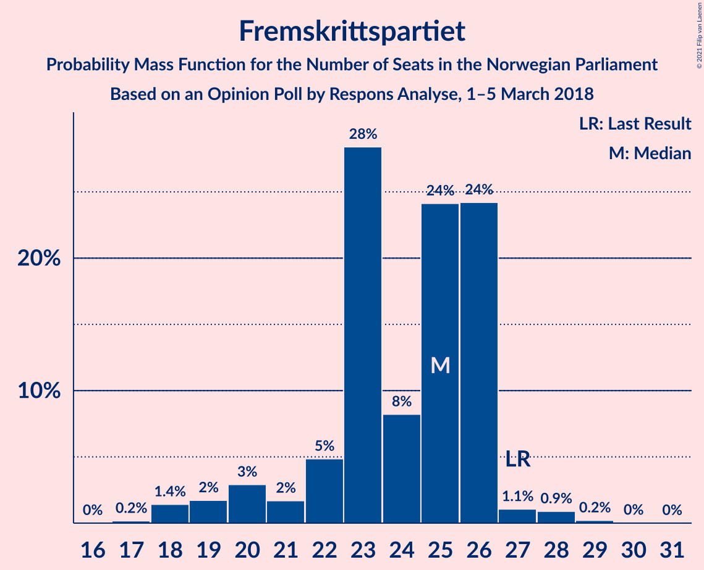

| Number of Seats | Probability | Accumulated | Special Marks |
|:---------------:|:-----------:|:-----------:|:-------------:|
| 17 | 0.2% | 100% |  |
| 18 | 1.4% | 99.8% |  |
| 19 | 2% | 98% |  |
| 20 | 3% | 97% |  |
| 21 | 2% | 94% |  |
| 22 | 5% | 92% |  |
| 23 | 28% | 87% |  |
| 24 | 8% | 59% |  |
| 25 | 24% | 51% | Median |
| 26 | 24% | 26% |  |
| 27 | 1.1% | 2% | Last Result |
| 28 | 0.9% | 1.2% |  |
| 29 | 0.2% | 0.3% |  |
| 30 | 0% | 0.1% |  |
| 31 | 0% | 0% |  |

### Senterpartiet

*For a full overview of the results for this party, see the [Senterpartiet](party-senterpartiet.html) page.*

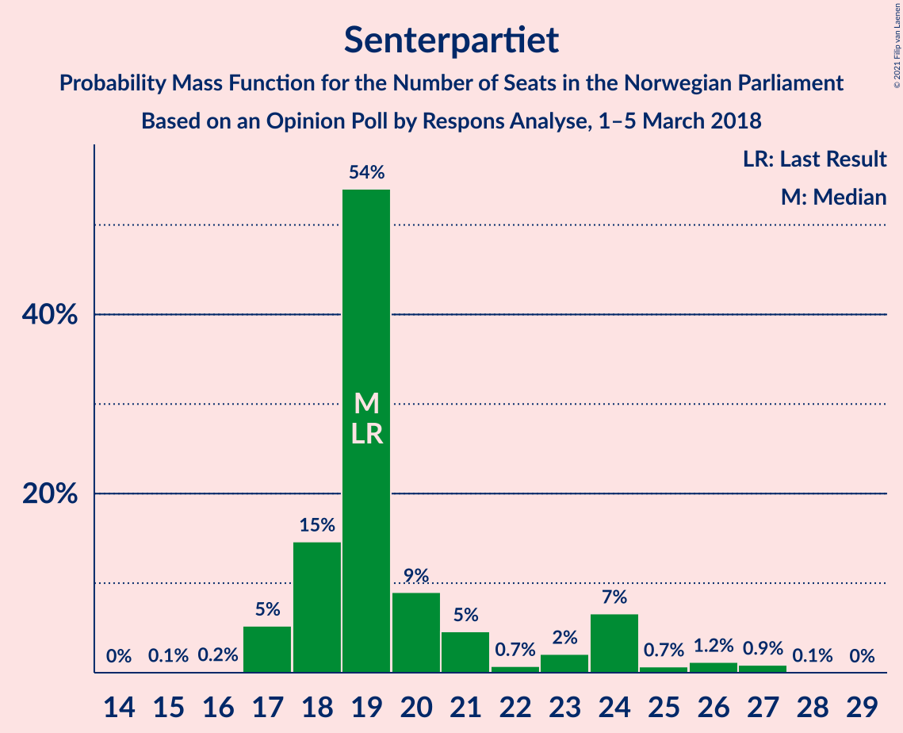

| Number of Seats | Probability | Accumulated | Special Marks |
|:---------------:|:-----------:|:-----------:|:-------------:|
| 15 | 0.1% | 100% |  |
| 16 | 0.2% | 99.9% |  |
| 17 | 5% | 99.8% |  |
| 18 | 15% | 95% |  |
| 19 | 54% | 80% | Last Result, Median |
| 20 | 9% | 26% |  |
| 21 | 5% | 17% |  |
| 22 | 0.7% | 12% |  |
| 23 | 2% | 12% |  |
| 24 | 7% | 9% |  |
| 25 | 0.7% | 3% |  |
| 26 | 1.2% | 2% |  |
| 27 | 0.9% | 1.0% |  |
| 28 | 0.1% | 0.1% |  |
| 29 | 0% | 0% |  |

### Sosialistisk Venstreparti

*For a full overview of the results for this party, see the [Sosialistisk Venstreparti](party-sosialistiskvenstreparti.html) page.*

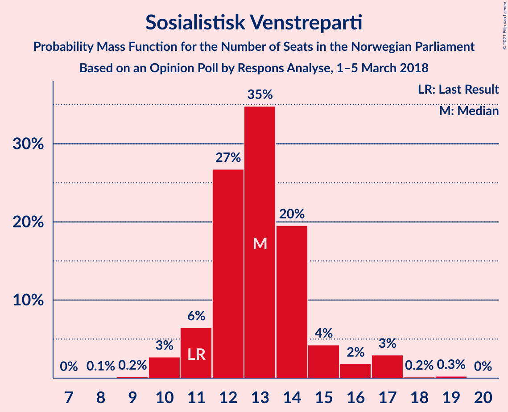

| Number of Seats | Probability | Accumulated | Special Marks |
|:---------------:|:-----------:|:-----------:|:-------------:|
| 8 | 0.1% | 100% |  |
| 9 | 0.2% | 99.9% |  |
| 10 | 3% | 99.8% |  |
| 11 | 6% | 97% | Last Result |
| 12 | 27% | 91% |  |
| 13 | 35% | 64% | Median |
| 14 | 20% | 29% |  |
| 15 | 4% | 9% |  |
| 16 | 2% | 5% |  |
| 17 | 3% | 3% |  |
| 18 | 0.2% | 0.4% |  |
| 19 | 0.3% | 0.3% |  |
| 20 | 0% | 0% |  |

### Venstre

*For a full overview of the results for this party, see the [Venstre](party-venstre.html) page.*

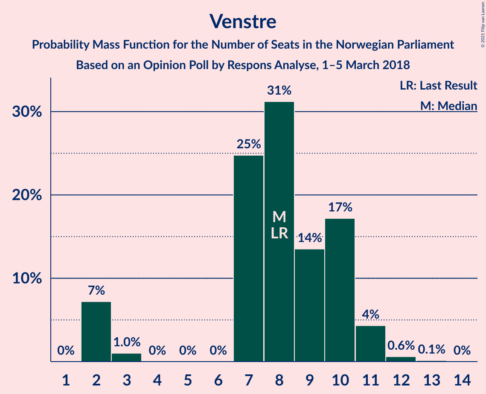

| Number of Seats | Probability | Accumulated | Special Marks |
|:---------------:|:-----------:|:-----------:|:-------------:|
| 2 | 7% | 100% |  |
| 3 | 1.0% | 93% |  |
| 4 | 0% | 92% |  |
| 5 | 0% | 92% |  |
| 6 | 0% | 92% |  |
| 7 | 25% | 92% |  |
| 8 | 31% | 67% | Last Result, Median |
| 9 | 14% | 36% |  |
| 10 | 17% | 22% |  |
| 11 | 4% | 5% |  |
| 12 | 0.6% | 0.7% |  |
| 13 | 0.1% | 0.1% |  |
| 14 | 0% | 0% |  |

### Kristelig Folkeparti

*For a full overview of the results for this party, see the [Kristelig Folkeparti](party-kristeligfolkeparti.html) page.*

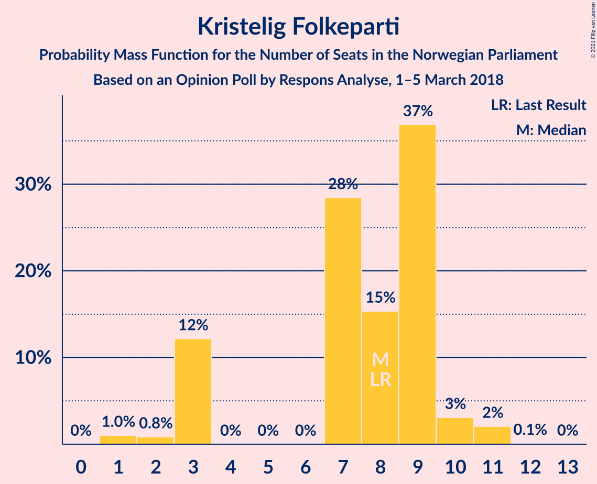

| Number of Seats | Probability | Accumulated | Special Marks |
|:---------------:|:-----------:|:-----------:|:-------------:|
| 1 | 1.0% | 100% |  |
| 2 | 0.8% | 99.0% |  |
| 3 | 12% | 98% |  |
| 4 | 0% | 86% |  |
| 5 | 0% | 86% |  |
| 6 | 0% | 86% |  |
| 7 | 28% | 86% |  |
| 8 | 15% | 57% | Last Result, Median |
| 9 | 37% | 42% |  |
| 10 | 3% | 5% |  |
| 11 | 2% | 2% |  |
| 12 | 0.1% | 0.1% |  |
| 13 | 0% | 0% |  |

### Rødt

*For a full overview of the results for this party, see the [Rødt](party-rødt.html) page.*

| Number of Seats | Probability | Accumulated | Special Marks |
|:---------------:|:-----------:|:-----------:|:-------------:|
| 1 | 68% | 100% | Last Result, Median |
| 2 | 29% | 32% |  |
| 3 | 0% | 3% |  |
| 4 | 0% | 3% |  |
| 5 | 0% | 3% |  |
| 6 | 0% | 3% |  |
| 7 | 2% | 3% |  |
| 8 | 2% | 2% |  |
| 9 | 0.1% | 0.1% |  |
| 10 | 0% | 0% |  |

### Miljøpartiet De Grønne

*For a full overview of the results for this party, see the [Miljøpartiet De Grønne](party-miljøpartietdegrønne.html) page.*

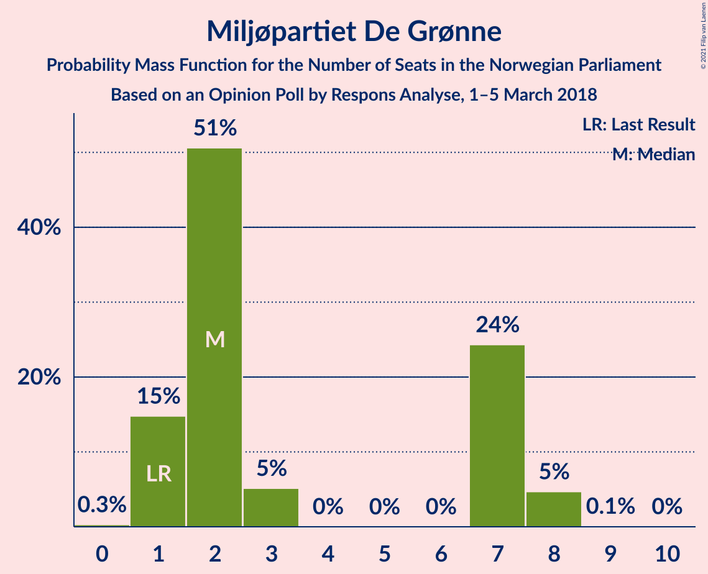

| Number of Seats | Probability | Accumulated | Special Marks |
|:---------------:|:-----------:|:-----------:|:-------------:|
| 0 | 0.3% | 100% |  |
| 1 | 15% | 99.7% | Last Result |
| 2 | 51% | 85% | Median |
| 3 | 5% | 34% |  |
| 4 | 0% | 29% |  |
| 5 | 0% | 29% |  |
| 6 | 0% | 29% |  |
| 7 | 24% | 29% |  |
| 8 | 5% | 5% |  |
| 9 | 0.1% | 0.1% |  |
| 10 | 0% | 0% |  |

## Coalitions

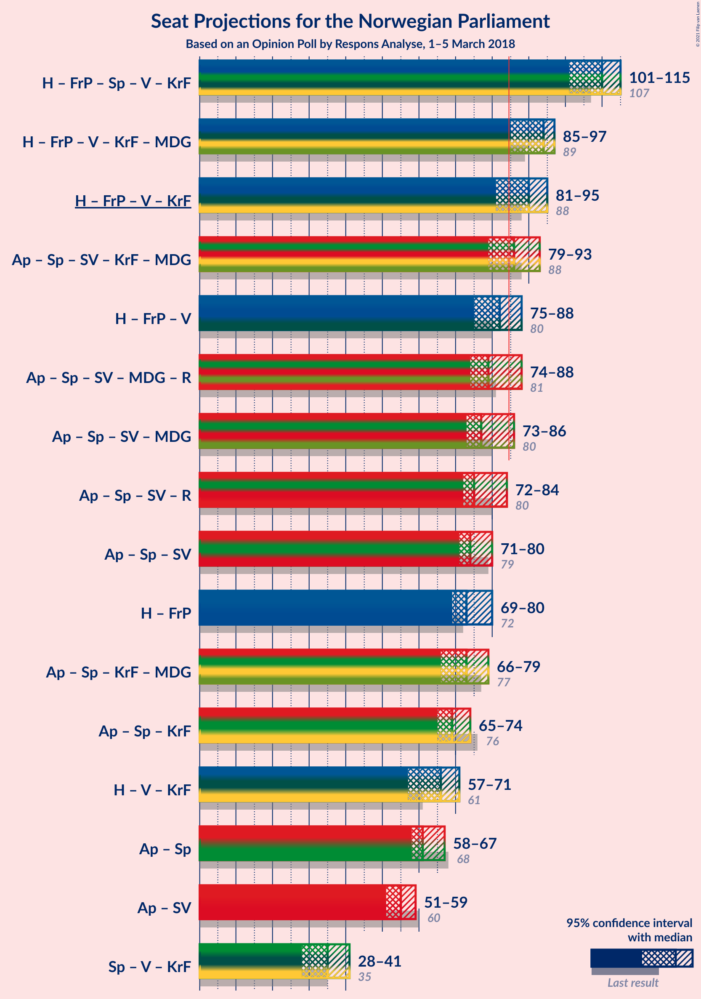

### Confidence Intervals

| Coalition | Last Result | Median | Majority? | 80% Confidence Interval | 90% Confidence Interval | 95% Confidence Interval | 99% Confidence Interval |
|:---------:|:-----------:|:------:|:---------:|:-----------------------:|:-----------------------:|:-----------------------:|:-----------------------:|
| Høyre – Fremskrittspartiet – Senterpartiet – Venstre – Kristelig Folkeparti | 107 | 110 | 100% | 106–113 | 103–114 | 101–115 | 100–117 |
| Høyre – Fremskrittspartiet – Venstre – Kristelig Folkeparti – Miljøpartiet De Grønne | 89 | 94 | 98% | 89–95 | 87–97 | 85–97 | 83–97 |
| Høyre – Fremskrittspartiet – Venstre – Kristelig Folkeparti | 88 | 90 | 89% | 84–93 | 82–95 | 81–95 | 80–95 |
| Arbeiderpartiet – Senterpartiet – Sosialistisk Venstreparti – Kristelig Folkeparti – Miljøpartiet De Grønne | 88 | 86 | 78% | 81–88 | 81–90 | 79–93 | 78–94 |
| Høyre – Fremskrittspartiet – Venstre | 80 | 82 | 15% | 78–86 | 77–87 | 75–88 | 73–90 |
| Arbeiderpartiet – Senterpartiet – Sosialistisk Venstreparti – Miljøpartiet De Grønne – Rødt | 81 | 79 | 11% | 76–85 | 74–87 | 74–88 | 74–89 |
| Arbeiderpartiet – Senterpartiet – Sosialistisk Venstreparti – Miljøpartiet De Grønne | 80 | 77 | 5% | 74–81 | 73–84 | 73–86 | 72–87 |
| Arbeiderpartiet – Senterpartiet – Sosialistisk Venstreparti – Rødt | 80 | 75 | 2% | 74–80 | 72–82 | 72–84 | 72–86 |
| Arbeiderpartiet – Senterpartiet – Sosialistisk Venstreparti | 79 | 74 | 0.1% | 72–78 | 71–79 | 71–80 | 69–82 |
| Høyre – Fremskrittspartiet | 72 | 73 | 0.1% | 71–77 | 70–79 | 69–80 | 67–81 |
| Arbeiderpartiet – Senterpartiet – Kristelig Folkeparti – Miljøpartiet De Grønne | 77 | 73 | 0% | 68–75 | 67–77 | 66–79 | 64–80 |
| Arbeiderpartiet – Senterpartiet – Kristelig Folkeparti | 76 | 69 | 0% | 66–72 | 65–74 | 65–74 | 63–77 |
| Høyre – Venstre – Kristelig Folkeparti | 61 | 66 | 0% | 62–69 | 58–70 | 57–71 | 56–72 |
| Arbeiderpartiet – Senterpartiet | 68 | 61 | 0% | 59–65 | 59–66 | 58–67 | 57–70 |
| Arbeiderpartiet – Sosialistisk Venstreparti | 60 | 55 | 0% | 53–57 | 52–58 | 51–59 | 49–60 |
| Senterpartiet – Venstre – Kristelig Folkeparti | 35 | 35 | 0% | 31–38 | 30–41 | 28–41 | 24–43 |

### Høyre – Fremskrittspartiet – Senterpartiet – Venstre – Kristelig Folkeparti

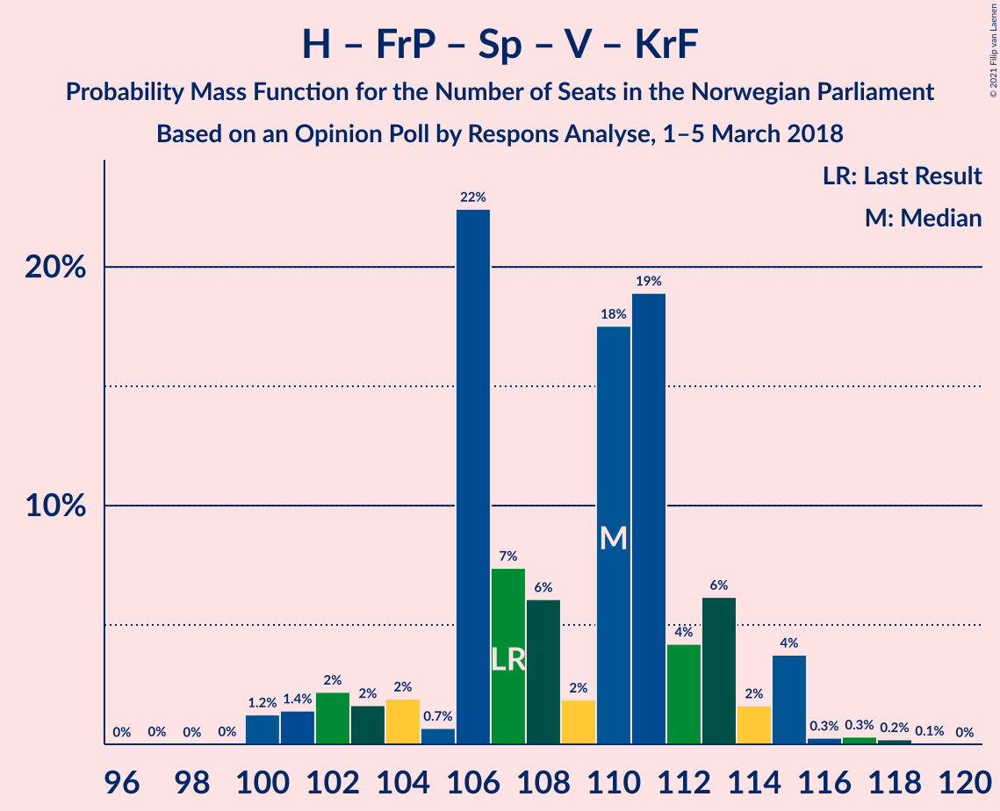

| Number of Seats | Probability | Accumulated | Special Marks |
|:---------------:|:-----------:|:-----------:|:-------------:|
| 97 | 0% | 100% |  |
| 98 | 0% | 99.9% |  |
| 99 | 0% | 99.9% |  |
| 100 | 1.2% | 99.9% |  |
| 101 | 1.4% | 98.7% |  |
| 102 | 2% | 97% |  |
| 103 | 2% | 95% |  |
| 104 | 2% | 93% |  |
| 105 | 0.7% | 92% |  |
| 106 | 22% | 91% |  |
| 107 | 7% | 68% | Last Result |
| 108 | 6% | 61% |  |
| 109 | 2% | 55% |  |
| 110 | 18% | 53% | Median |
| 111 | 19% | 36% |  |
| 112 | 4% | 17% |  |
| 113 | 6% | 12% |  |
| 114 | 2% | 6% |  |
| 115 | 4% | 5% |  |
| 116 | 0.3% | 0.9% |  |
| 117 | 0.3% | 0.6% |  |
| 118 | 0.2% | 0.3% |  |
| 119 | 0.1% | 0.1% |  |
| 120 | 0% | 0% |  |

### Høyre – Fremskrittspartiet – Venstre – Kristelig Folkeparti – Miljøpartiet De Grønne

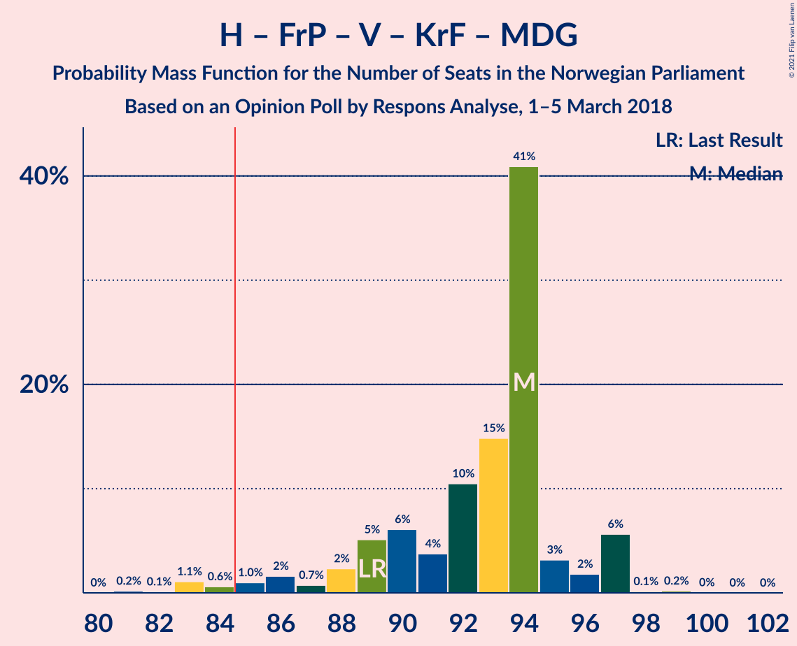

| Number of Seats | Probability | Accumulated | Special Marks |
|:---------------:|:-----------:|:-----------:|:-------------:|
| 81 | 0.2% | 100% |  |
| 82 | 0.1% | 99.8% |  |
| 83 | 1.1% | 99.7% |  |
| 84 | 0.6% | 98.6% |  |
| 85 | 1.0% | 98% | Majority |
| 86 | 2% | 97% |  |
| 87 | 0.7% | 95% |  |
| 88 | 2% | 95% |  |
| 89 | 5% | 92% | Last Result |
| 90 | 6% | 87% |  |
| 91 | 4% | 81% |  |
| 92 | 10% | 77% |  |
| 93 | 15% | 67% | Median |
| 94 | 41% | 52% |  |
| 95 | 3% | 11% |  |
| 96 | 2% | 8% |  |
| 97 | 6% | 6% |  |
| 98 | 0.1% | 0.4% |  |
| 99 | 0.2% | 0.3% |  |
| 100 | 0% | 0.1% |  |
| 101 | 0% | 0% |  |

### Høyre – Fremskrittspartiet – Venstre – Kristelig Folkeparti

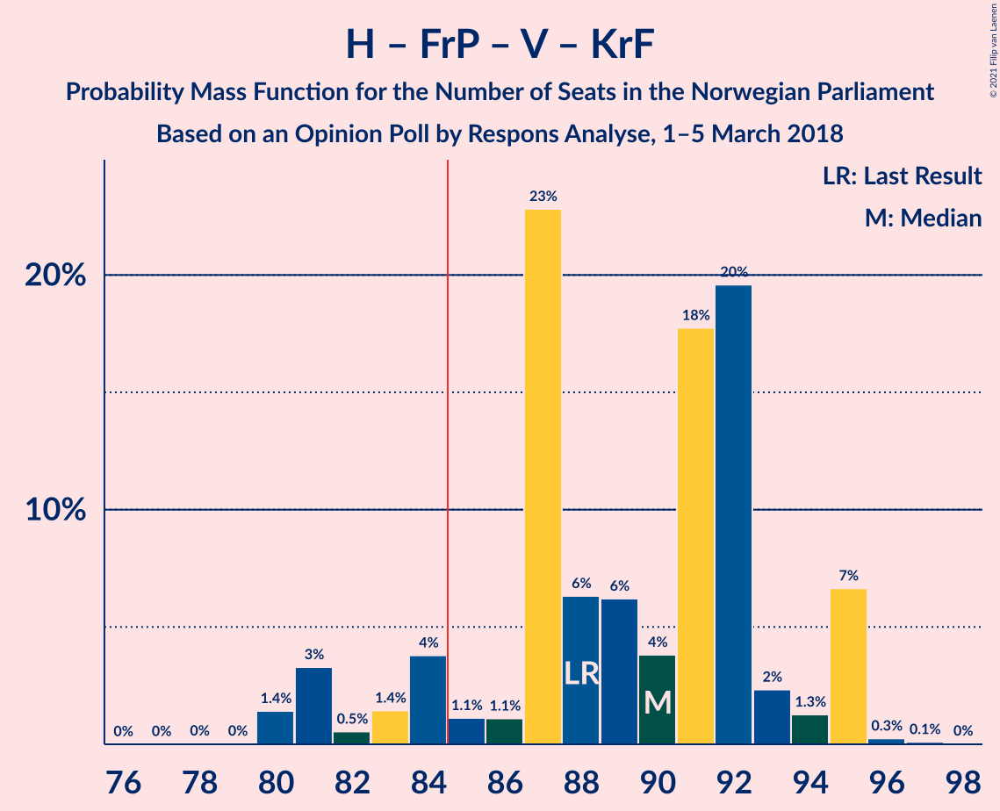

| Number of Seats | Probability | Accumulated | Special Marks |
|:---------------:|:-----------:|:-----------:|:-------------:|
| 77 | 0% | 100% |  |
| 78 | 0% | 99.9% |  |
| 79 | 0% | 99.9% |  |
| 80 | 1.4% | 99.9% |  |
| 81 | 3% | 98% |  |
| 82 | 0.5% | 95% |  |
| 83 | 1.4% | 95% |  |
| 84 | 4% | 93% |  |
| 85 | 1.1% | 89% | Majority |
| 86 | 1.1% | 88% |  |
| 87 | 23% | 87% |  |
| 88 | 6% | 64% | Last Result |
| 89 | 6% | 58% |  |
| 90 | 4% | 52% |  |
| 91 | 18% | 48% | Median |
| 92 | 20% | 30% |  |
| 93 | 2% | 11% |  |
| 94 | 1.3% | 8% |  |
| 95 | 7% | 7% |  |
| 96 | 0.3% | 0.4% |  |
| 97 | 0.1% | 0.1% |  |
| 98 | 0% | 0% |  |

### Arbeiderpartiet – Senterpartiet – Sosialistisk Venstreparti – Kristelig Folkeparti – Miljøpartiet De Grønne

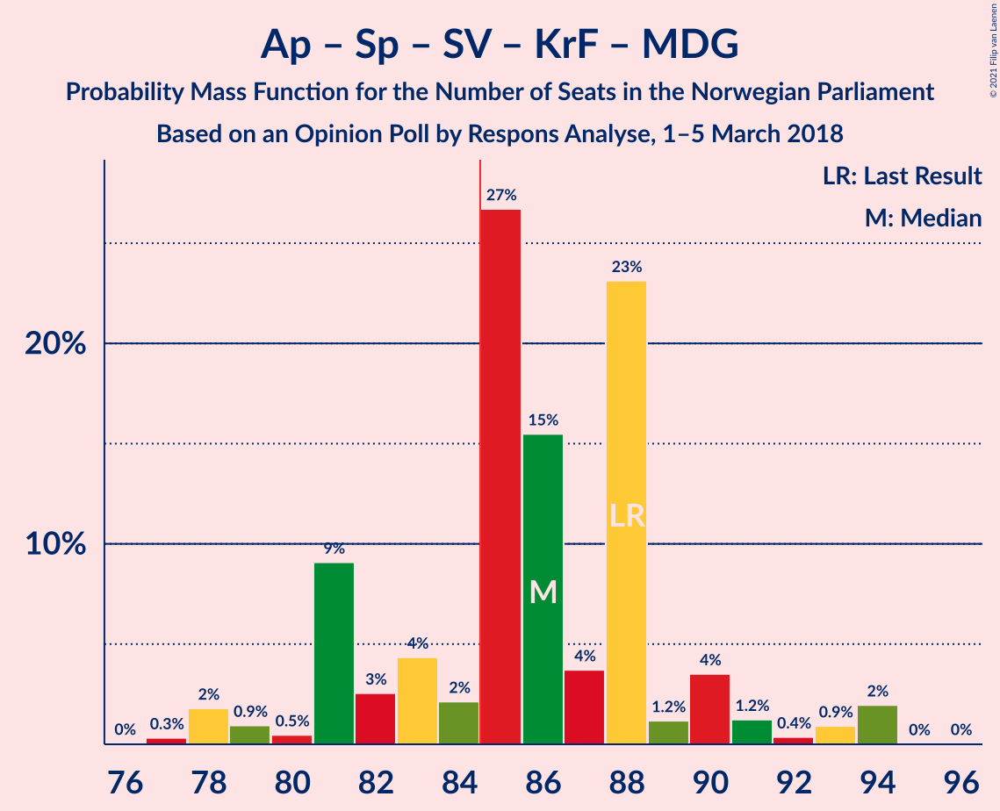

| Number of Seats | Probability | Accumulated | Special Marks |
|:---------------:|:-----------:|:-----------:|:-------------:|
| 76 | 0% | 100% |  |
| 77 | 0.3% | 99.9% |  |
| 78 | 2% | 99.6% |  |
| 79 | 0.9% | 98% |  |
| 80 | 0.5% | 97% |  |
| 81 | 9% | 96% |  |
| 82 | 3% | 87% |  |
| 83 | 4% | 85% |  |
| 84 | 2% | 80% | Median |
| 85 | 27% | 78% | Majority |
| 86 | 15% | 52% |  |
| 87 | 4% | 36% |  |
| 88 | 23% | 32% | Last Result |
| 89 | 1.2% | 9% |  |
| 90 | 4% | 8% |  |
| 91 | 1.2% | 5% |  |
| 92 | 0.4% | 3% |  |
| 93 | 0.9% | 3% |  |
| 94 | 2% | 2% |  |
| 95 | 0% | 0.1% |  |
| 96 | 0% | 0% |  |

### Høyre – Fremskrittspartiet – Venstre

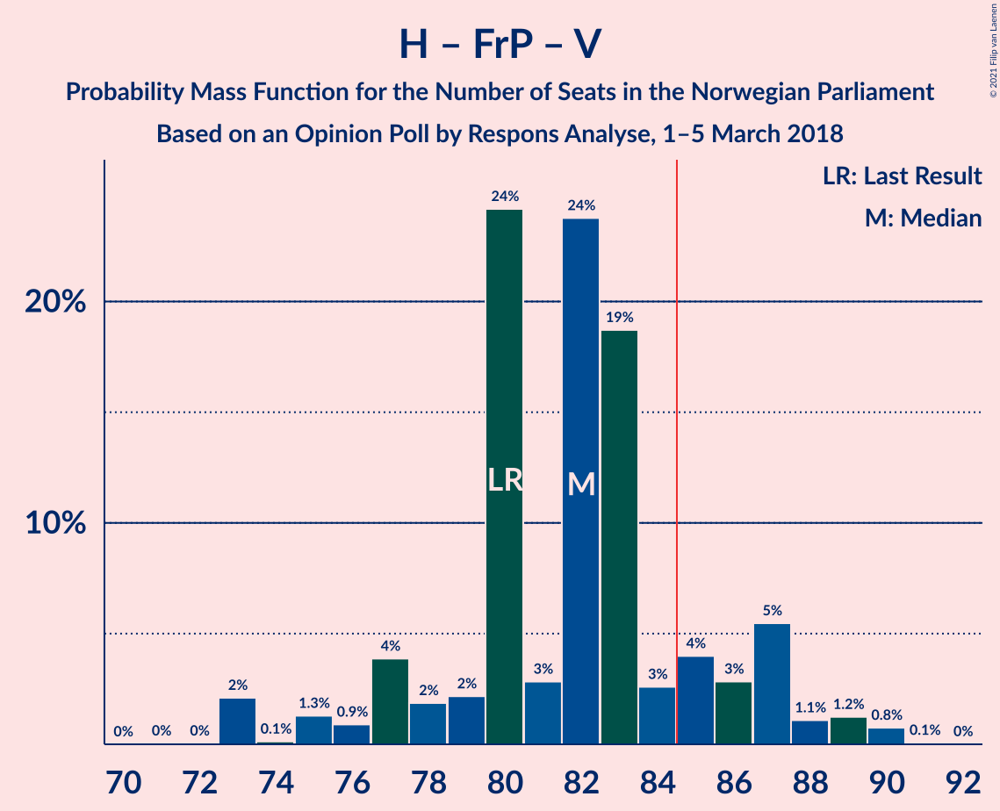

| Number of Seats | Probability | Accumulated | Special Marks |
|:---------------:|:-----------:|:-----------:|:-------------:|
| 71 | 0% | 100% |  |
| 72 | 0% | 99.9% |  |
| 73 | 2% | 99.9% |  |
| 74 | 0.1% | 98% |  |
| 75 | 1.3% | 98% |  |
| 76 | 0.9% | 96% |  |
| 77 | 4% | 95% |  |
| 78 | 2% | 92% |  |
| 79 | 2% | 90% |  |
| 80 | 24% | 88% | Last Result |
| 81 | 3% | 63% |  |
| 82 | 24% | 61% |  |
| 83 | 19% | 37% | Median |
| 84 | 3% | 18% |  |
| 85 | 4% | 15% | Majority |
| 86 | 3% | 11% |  |
| 87 | 5% | 9% |  |
| 88 | 1.1% | 3% |  |
| 89 | 1.2% | 2% |  |
| 90 | 0.8% | 0.8% |  |
| 91 | 0.1% | 0.1% |  |
| 92 | 0% | 0% |  |

### Arbeiderpartiet – Senterpartiet – Sosialistisk Venstreparti – Miljøpartiet De Grønne – Rødt

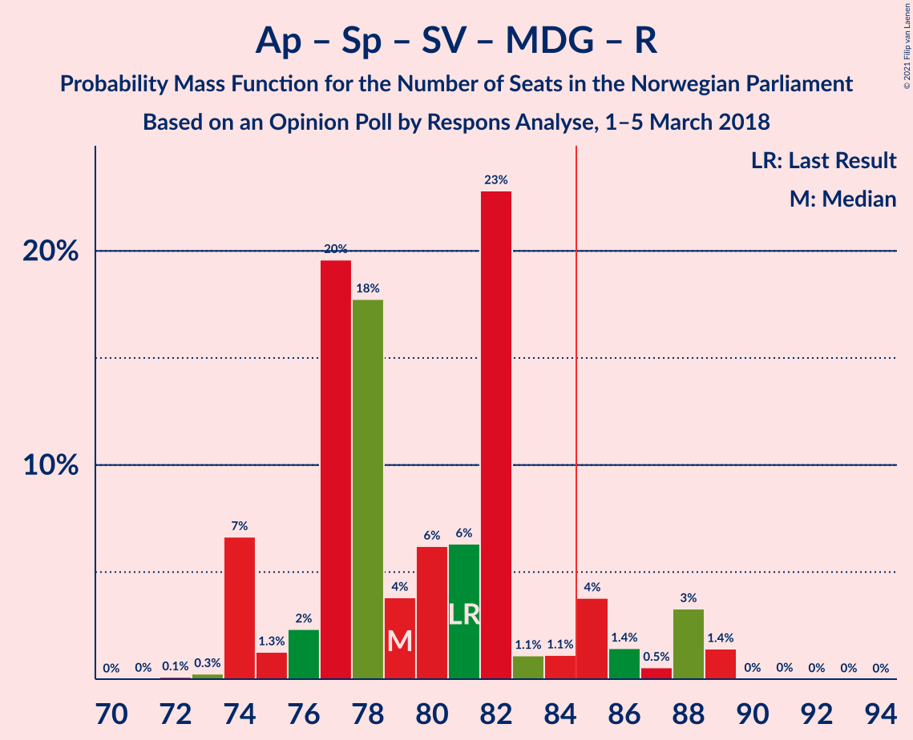

| Number of Seats | Probability | Accumulated | Special Marks |
|:---------------:|:-----------:|:-----------:|:-------------:|
| 72 | 0.1% | 100% |  |
| 73 | 0.3% | 99.9% |  |
| 74 | 7% | 99.6% |  |
| 75 | 1.3% | 93% |  |
| 76 | 2% | 92% |  |
| 77 | 20% | 89% | Median |
| 78 | 18% | 70% |  |
| 79 | 4% | 52% |  |
| 80 | 6% | 48% |  |
| 81 | 6% | 42% | Last Result |
| 82 | 23% | 36% |  |
| 83 | 1.1% | 13% |  |
| 84 | 1.1% | 12% |  |
| 85 | 4% | 11% | Majority |
| 86 | 1.4% | 7% |  |
| 87 | 0.5% | 5% |  |
| 88 | 3% | 5% |  |
| 89 | 1.4% | 2% |  |
| 90 | 0% | 0.1% |  |
| 91 | 0% | 0.1% |  |
| 92 | 0% | 0.1% |  |
| 93 | 0% | 0% |  |

### Arbeiderpartiet – Senterpartiet – Sosialistisk Venstreparti – Miljøpartiet De Grønne

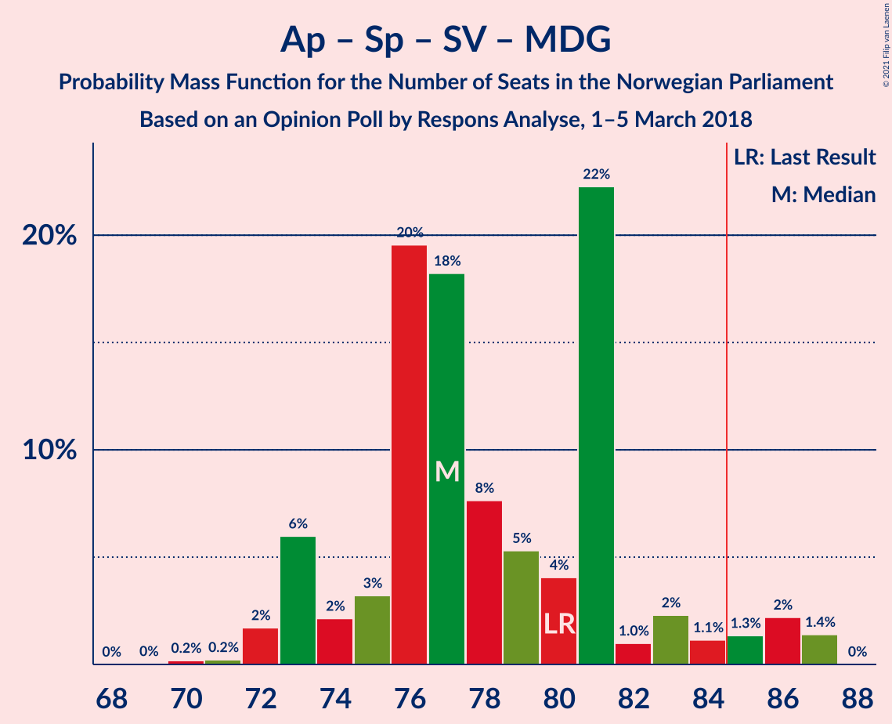

| Number of Seats | Probability | Accumulated | Special Marks |
|:---------------:|:-----------:|:-----------:|:-------------:|
| 69 | 0% | 100% |  |
| 70 | 0.2% | 99.9% |  |
| 71 | 0.2% | 99.8% |  |
| 72 | 2% | 99.5% |  |
| 73 | 6% | 98% |  |
| 74 | 2% | 92% |  |
| 75 | 3% | 90% |  |
| 76 | 20% | 86% | Median |
| 77 | 18% | 67% |  |
| 78 | 8% | 49% |  |
| 79 | 5% | 41% |  |
| 80 | 4% | 36% | Last Result |
| 81 | 22% | 32% |  |
| 82 | 1.0% | 9% |  |
| 83 | 2% | 8% |  |
| 84 | 1.1% | 6% |  |
| 85 | 1.3% | 5% | Majority |
| 86 | 2% | 4% |  |
| 87 | 1.4% | 1.4% |  |
| 88 | 0% | 0% |  |

### Arbeiderpartiet – Senterpartiet – Sosialistisk Venstreparti – Rødt

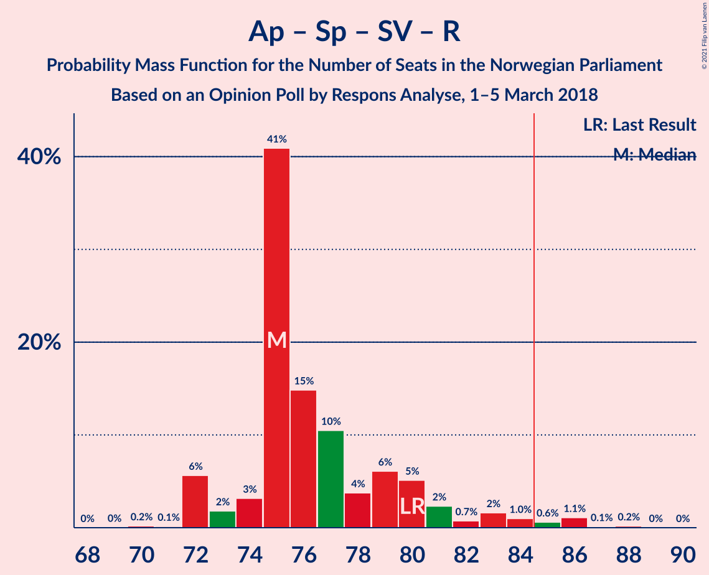

| Number of Seats | Probability | Accumulated | Special Marks |
|:---------------:|:-----------:|:-----------:|:-------------:|
| 69 | 0% | 100% |  |
| 70 | 0.2% | 99.9% |  |
| 71 | 0.1% | 99.7% |  |
| 72 | 6% | 99.6% |  |
| 73 | 2% | 94% |  |
| 74 | 3% | 92% |  |
| 75 | 41% | 89% | Median |
| 76 | 15% | 48% |  |
| 77 | 10% | 33% |  |
| 78 | 4% | 23% |  |
| 79 | 6% | 19% |  |
| 80 | 5% | 13% | Last Result |
| 81 | 2% | 8% |  |
| 82 | 0.7% | 5% |  |
| 83 | 2% | 5% |  |
| 84 | 1.0% | 3% |  |
| 85 | 0.6% | 2% | Majority |
| 86 | 1.1% | 1.4% |  |
| 87 | 0.1% | 0.3% |  |
| 88 | 0.2% | 0.2% |  |
| 89 | 0% | 0% |  |

### Arbeiderpartiet – Senterpartiet – Sosialistisk Venstreparti

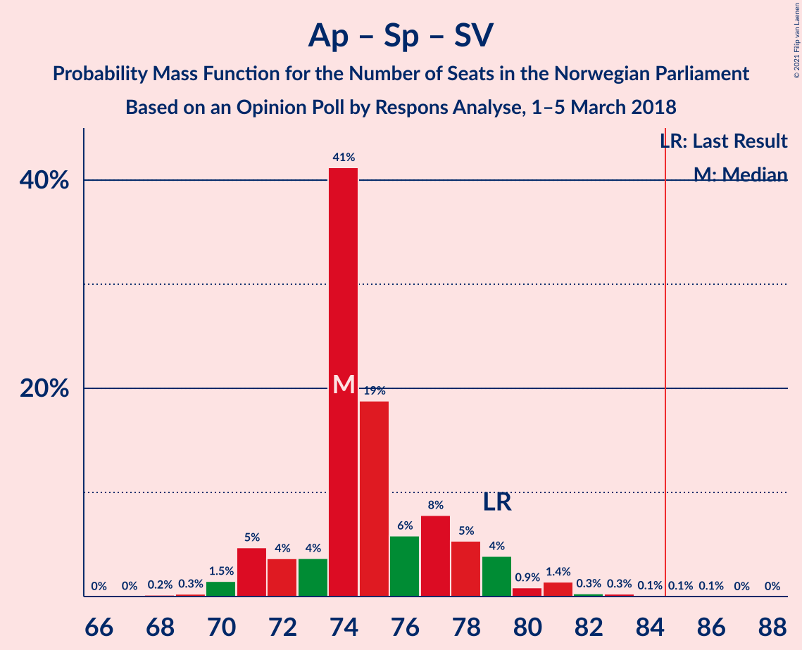

| Number of Seats | Probability | Accumulated | Special Marks |
|:---------------:|:-----------:|:-----------:|:-------------:|
| 66 | 0% | 100% |  |
| 67 | 0% | 99.9% |  |
| 68 | 0.2% | 99.9% |  |
| 69 | 0.3% | 99.7% |  |
| 70 | 1.5% | 99.5% |  |
| 71 | 5% | 98% |  |
| 72 | 4% | 93% |  |
| 73 | 4% | 90% |  |
| 74 | 41% | 86% | Median |
| 75 | 19% | 45% |  |
| 76 | 6% | 26% |  |
| 77 | 8% | 20% |  |
| 78 | 5% | 12% |  |
| 79 | 4% | 7% | Last Result |
| 80 | 0.9% | 3% |  |
| 81 | 1.4% | 2% |  |
| 82 | 0.3% | 0.8% |  |
| 83 | 0.3% | 0.5% |  |
| 84 | 0.1% | 0.2% |  |
| 85 | 0.1% | 0.1% | Majority |
| 86 | 0.1% | 0.1% |  |
| 87 | 0% | 0% |  |

### Høyre – Fremskrittspartiet

| Number of Seats | Probability | Accumulated | Special Marks |
|:---------------:|:-----------:|:-----------:|:-------------:|
| 65 | 0.1% | 100% |  |
| 66 | 0.1% | 99.9% |  |
| 67 | 0.4% | 99.7% |  |
| 68 | 1.3% | 99.3% |  |
| 69 | 2% | 98% |  |
| 70 | 3% | 96% |  |
| 71 | 5% | 94% |  |
| 72 | 14% | 89% | Last Result |
| 73 | 31% | 75% |  |
| 74 | 7% | 45% |  |
| 75 | 20% | 38% | Median |
| 76 | 5% | 18% |  |
| 77 | 3% | 13% |  |
| 78 | 3% | 10% |  |
| 79 | 4% | 7% |  |
| 80 | 2% | 3% |  |
| 81 | 0.6% | 0.9% |  |
| 82 | 0.1% | 0.3% |  |
| 83 | 0.1% | 0.2% |  |
| 84 | 0.1% | 0.2% |  |
| 85 | 0.1% | 0.1% | Majority |
| 86 | 0% | 0% |  |

### Arbeiderpartiet – Senterpartiet – Kristelig Folkeparti – Miljøpartiet De Grønne

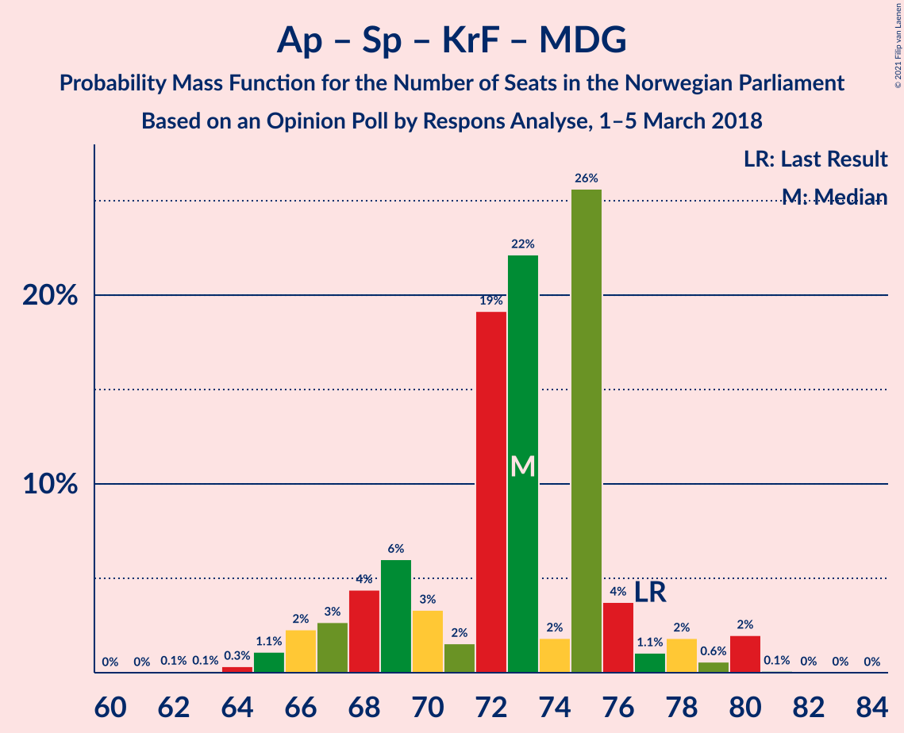

| Number of Seats | Probability | Accumulated | Special Marks |
|:---------------:|:-----------:|:-----------:|:-------------:|
| 62 | 0.1% | 100% |  |
| 63 | 0.1% | 99.9% |  |
| 64 | 0.3% | 99.8% |  |
| 65 | 1.1% | 99.5% |  |
| 66 | 2% | 98% |  |
| 67 | 3% | 96% |  |
| 68 | 4% | 93% |  |
| 69 | 6% | 89% |  |
| 70 | 3% | 83% |  |
| 71 | 2% | 80% | Median |
| 72 | 19% | 78% |  |
| 73 | 22% | 59% |  |
| 74 | 2% | 37% |  |
| 75 | 26% | 35% |  |
| 76 | 4% | 9% |  |
| 77 | 1.1% | 6% | Last Result |
| 78 | 2% | 5% |  |
| 79 | 0.6% | 3% |  |
| 80 | 2% | 2% |  |
| 81 | 0.1% | 0.2% |  |
| 82 | 0% | 0.1% |  |
| 83 | 0% | 0% |  |

### Arbeiderpartiet – Senterpartiet – Kristelig Folkeparti

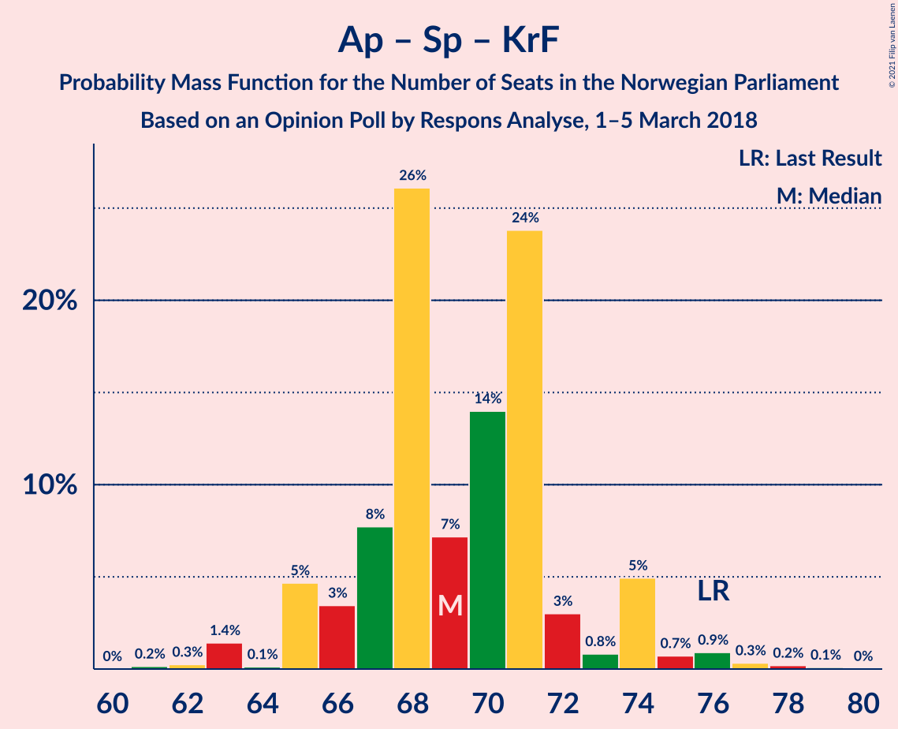

| Number of Seats | Probability | Accumulated | Special Marks |
|:---------------:|:-----------:|:-----------:|:-------------:|
| 61 | 0.2% | 100% |  |
| 62 | 0.3% | 99.8% |  |
| 63 | 1.4% | 99.6% |  |
| 64 | 0.1% | 98% |  |
| 65 | 5% | 98% |  |
| 66 | 3% | 93% |  |
| 67 | 8% | 90% |  |
| 68 | 26% | 82% |  |
| 69 | 7% | 56% | Median |
| 70 | 14% | 49% |  |
| 71 | 24% | 35% |  |
| 72 | 3% | 11% |  |
| 73 | 0.8% | 8% |  |
| 74 | 5% | 7% |  |
| 75 | 0.7% | 2% |  |
| 76 | 0.9% | 2% | Last Result |
| 77 | 0.3% | 0.7% |  |
| 78 | 0.2% | 0.3% |  |
| 79 | 0.1% | 0.1% |  |
| 80 | 0% | 0% |  |

### Høyre – Venstre – Kristelig Folkeparti

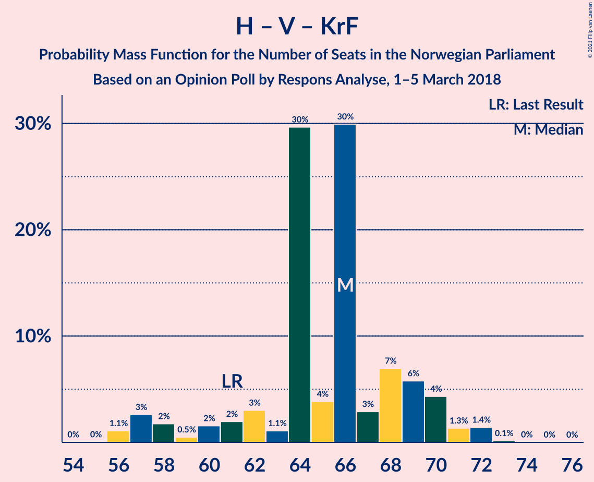

| Number of Seats | Probability | Accumulated | Special Marks |
|:---------------:|:-----------:|:-----------:|:-------------:|
| 54 | 0% | 100% |  |
| 55 | 0% | 99.9% |  |
| 56 | 1.1% | 99.9% |  |
| 57 | 3% | 98.8% |  |
| 58 | 2% | 96% |  |
| 59 | 0.5% | 94% |  |
| 60 | 2% | 94% |  |
| 61 | 2% | 92% | Last Result |
| 62 | 3% | 90% |  |
| 63 | 1.1% | 87% |  |
| 64 | 30% | 86% |  |
| 65 | 4% | 57% |  |
| 66 | 30% | 53% | Median |
| 67 | 3% | 23% |  |
| 68 | 7% | 20% |  |
| 69 | 6% | 13% |  |
| 70 | 4% | 7% |  |
| 71 | 1.3% | 3% |  |
| 72 | 1.4% | 2% |  |
| 73 | 0.1% | 0.2% |  |
| 74 | 0% | 0.1% |  |
| 75 | 0% | 0% |  |

### Arbeiderpartiet – Senterpartiet

| Number of Seats | Probability | Accumulated | Special Marks |
|:---------------:|:-----------:|:-----------:|:-------------:|
| 54 | 0% | 100% |  |
| 55 | 0.1% | 99.9% |  |
| 56 | 0.2% | 99.9% |  |
| 57 | 2% | 99.6% |  |
| 58 | 1.0% | 98% |  |
| 59 | 7% | 97% |  |
| 60 | 3% | 90% |  |
| 61 | 38% | 87% | Median |
| 62 | 26% | 49% |  |
| 63 | 7% | 23% |  |
| 64 | 4% | 16% |  |
| 65 | 7% | 12% |  |
| 66 | 2% | 5% |  |
| 67 | 1.2% | 3% |  |
| 68 | 1.0% | 2% | Last Result |
| 69 | 0.4% | 1.0% |  |
| 70 | 0.4% | 0.6% |  |
| 71 | 0.1% | 0.2% |  |
| 72 | 0.1% | 0.1% |  |
| 73 | 0% | 0% |  |

### Arbeiderpartiet – Sosialistisk Venstreparti

| Number of Seats | Probability | Accumulated | Special Marks |
|:---------------:|:-----------:|:-----------:|:-------------:|
| 47 | 0% | 100% |  |
| 48 | 0.1% | 99.9% |  |
| 49 | 0.7% | 99.9% |  |
| 50 | 0.4% | 99.1% |  |
| 51 | 2% | 98.7% |  |
| 52 | 5% | 97% |  |
| 53 | 8% | 92% |  |
| 54 | 4% | 84% |  |
| 55 | 43% | 80% | Median |
| 56 | 17% | 38% |  |
| 57 | 11% | 21% |  |
| 58 | 5% | 9% |  |
| 59 | 3% | 5% |  |
| 60 | 0.7% | 1.2% | Last Result |
| 61 | 0.2% | 0.5% |  |
| 62 | 0.1% | 0.3% |  |
| 63 | 0.1% | 0.2% |  |
| 64 | 0.1% | 0.1% |  |
| 65 | 0% | 0.1% |  |
| 66 | 0% | 0% |  |

### Senterpartiet – Venstre – Kristelig Folkeparti

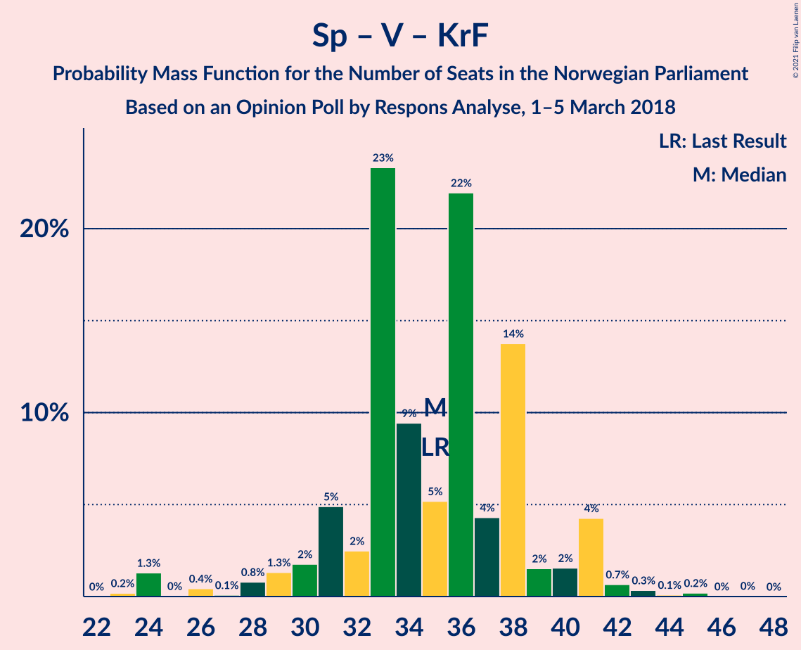

| Number of Seats | Probability | Accumulated | Special Marks |
|:---------------:|:-----------:|:-----------:|:-------------:|
| 23 | 0.2% | 100% |  |
| 24 | 1.3% | 99.8% |  |
| 25 | 0% | 98.5% |  |
| 26 | 0.4% | 98% |  |
| 27 | 0.1% | 98% |  |
| 28 | 0.8% | 98% |  |
| 29 | 1.3% | 97% |  |
| 30 | 2% | 96% |  |
| 31 | 5% | 94% |  |
| 32 | 2% | 89% |  |
| 33 | 23% | 87% |  |
| 34 | 9% | 63% |  |
| 35 | 5% | 54% | Last Result, Median |
| 36 | 22% | 49% |  |
| 37 | 4% | 27% |  |
| 38 | 14% | 22% |  |
| 39 | 2% | 9% |  |
| 40 | 2% | 7% |  |
| 41 | 4% | 6% |  |
| 42 | 0.7% | 1.4% |  |
| 43 | 0.3% | 0.7% |  |
| 44 | 0.1% | 0.3% |  |
| 45 | 0.2% | 0.3% |  |
| 46 | 0% | 0.1% |  |
| 47 | 0% | 0% |  |

## Technical Information

### Opinion Poll

+ **Polling firm:** Respons Analyse
+ **Commissioner(s):** —
+ **Fieldwork period:** 1–5 March 2018

### Calculations

+ **Sample size:** 1003
+ **Simulations done:** 131,072
+ **Error estimate:** 1.11%

