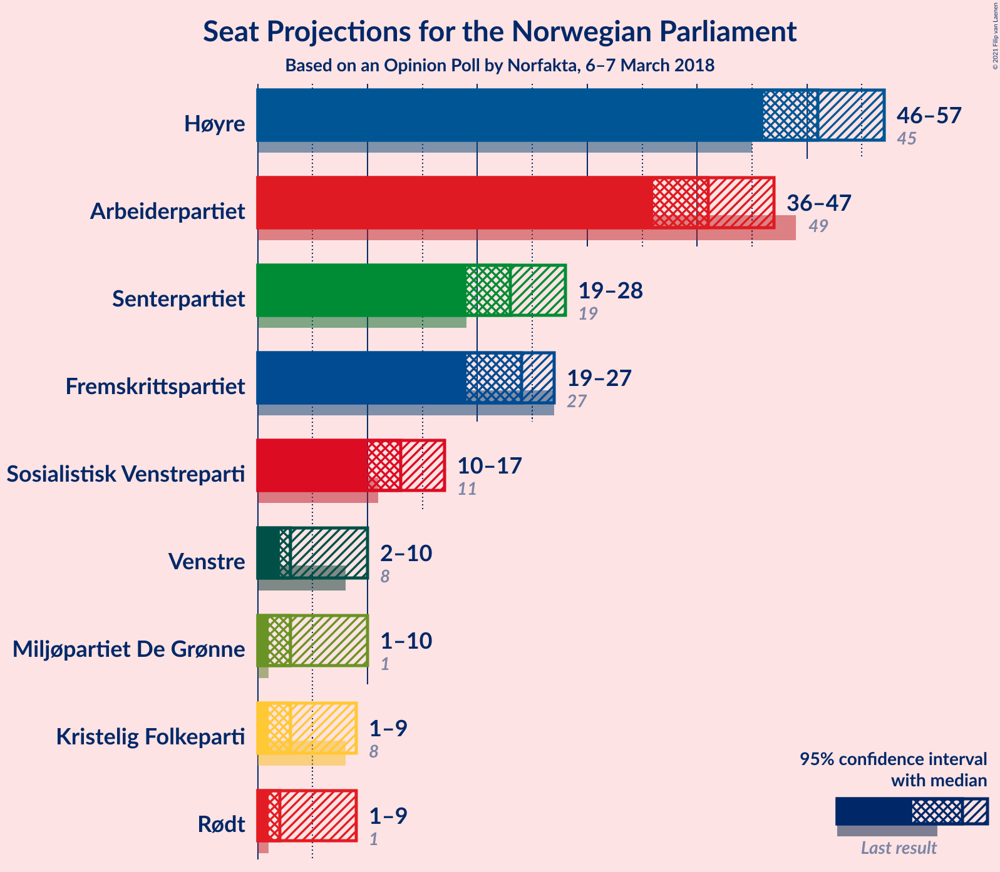
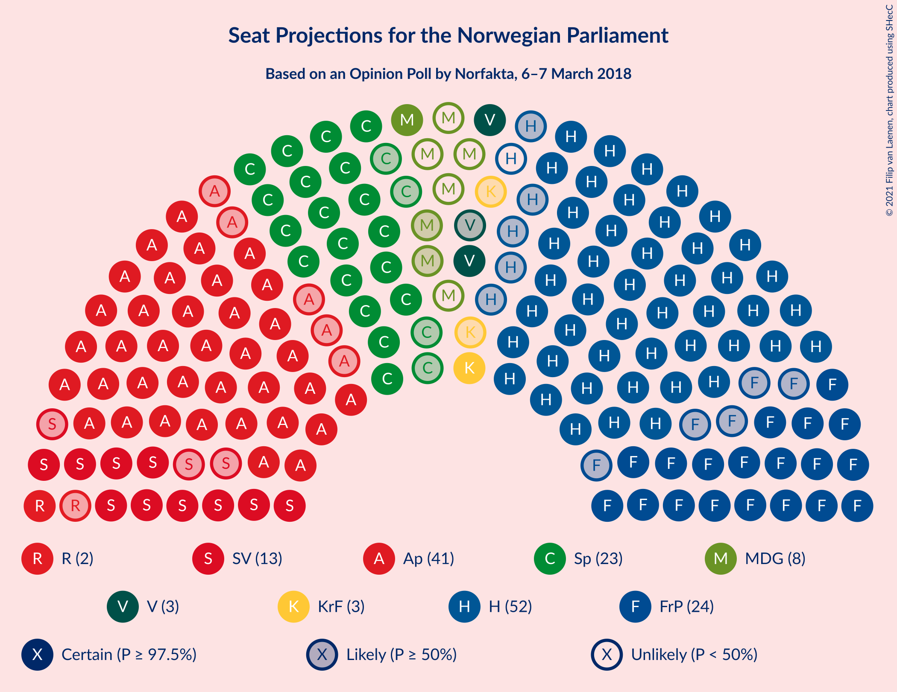
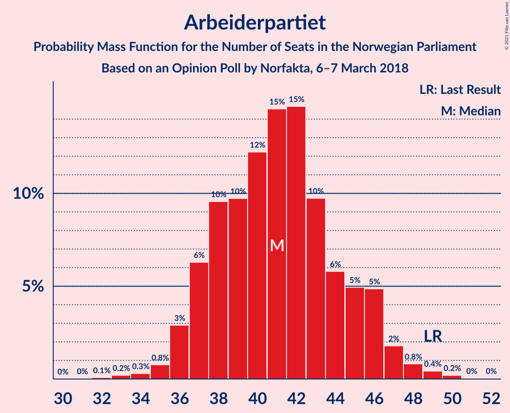
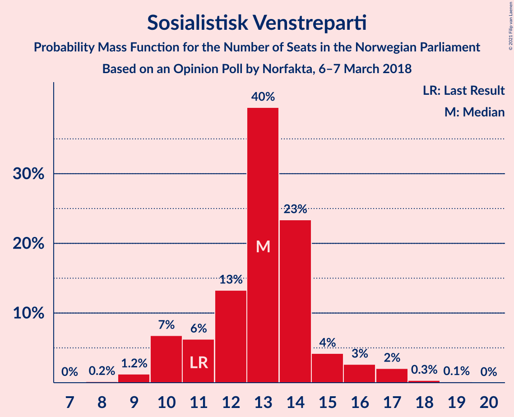
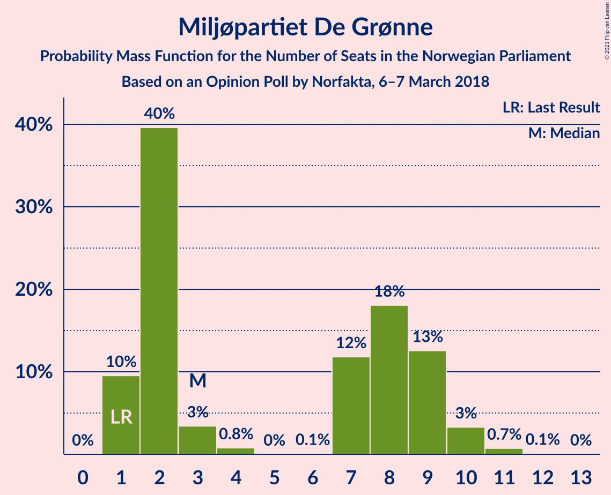
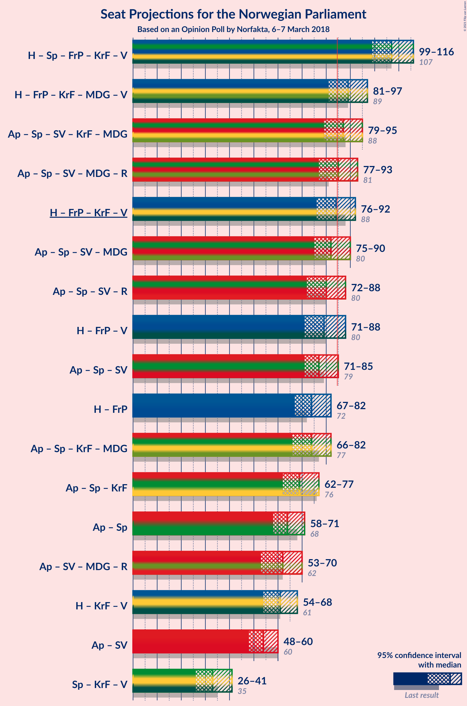
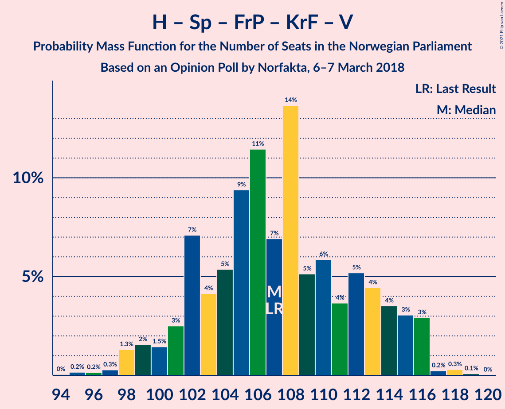
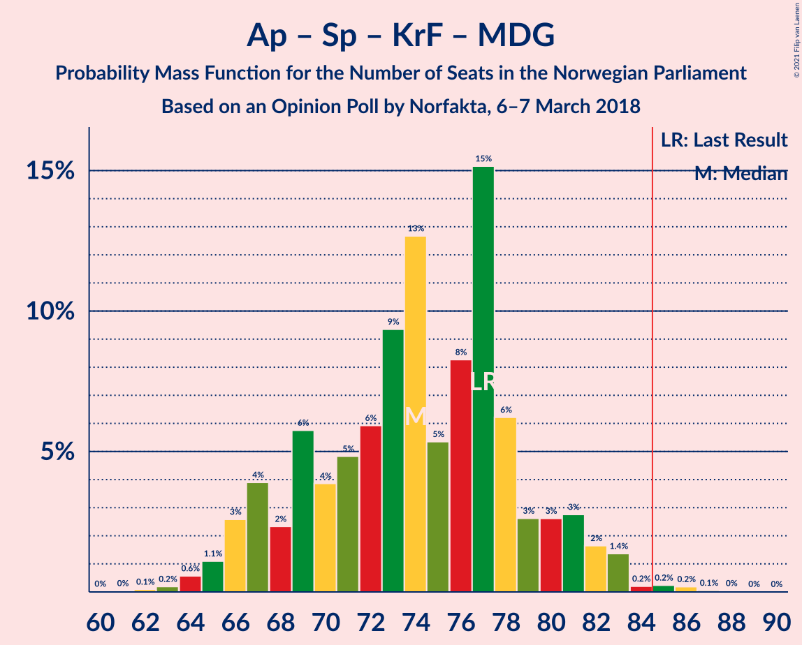
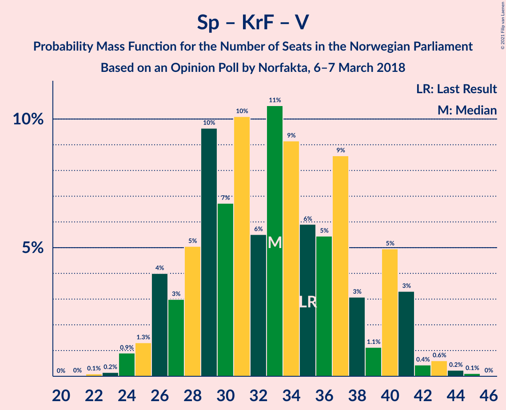

# Opinion Poll by Norfakta, 6–7 March 2018

<a href="#voting-intentions">Voting Intentions</a> | <a href="#seats">Seats</a> | <a href="#coalitions">Coalitions</a> | <a href="#technical-information">Technical Information</a>

## Voting Intentions

### Confidence Intervals

| Party | Last Result | Poll Result | 80% Confidence Interval | 90% Confidence Interval | 95% Confidence Interval | 99% Confidence Interval |
|:-----:|:-----------:|:-----------:|:-----------------------:|:-----------------------:|:-----------------------:|:-----------------------:|
| Høyre | 25.0% | 28.4% | 26.4–30.6% |25.9–31.2% |25.4–31.7% |24.5–32.7% |
| Arbeiderpartiet | 27.4% | 22.5% | 20.7–24.5% |20.2–25.1% |19.7–25.5% |18.9–26.5% |
| Senterpartiet | 10.3% | 12.8% | 11.4–14.4% |11.0–14.9% |10.6–15.3% |10.0–16.1% |
| Fremskrittspartiet | 15.2% | 12.6% | 11.2–14.3% |10.8–14.7% |10.5–15.2% |9.9–16.0% |
| Sosialistisk Venstreparti | 6.0% | 7.0% | 5.9–8.3% |5.6–8.6% |5.4–8.9% |4.9–9.6% |
| Miljøpartiet De Grønne | 3.2% | 3.9% | 3.2–5.0% |2.9–5.3% |2.8–5.5% |2.5–6.1% |
| Kristelig Folkeparti | 4.2% | 3.9% | 3.2–5.0% |2.9–5.3% |2.8–5.5% |2.5–6.1% |
| Venstre | 4.4% | 3.8% | 3.0–4.8% |2.8–5.1% |2.7–5.4% |2.3–5.9% |
| Rødt | 2.4% | 3.3% | 2.6–4.3% |2.4–4.5% |2.3–4.8% |2.0–5.3% |

*Note:* The poll result column reflects the actual value used in the calculations. Published results may vary slightly, and in addition be rounded to fewer digits.

## Seats

### Confidence Intervals

| Party | Last Result | Median | 80% Confidence Interval | 90% Confidence Interval | 95% Confidence Interval | 99% Confidence Interval |
|:-----:|:-----------:|:------:|:-----------------------:|:-----------------------:|:-----------------------:|:-----------------------:|
| <a href="#høyre">Høyre</a> | 45 | 51 | 47–55 |47–56 |46–58 |44–59 |
| <a href="#arbeiderpartiet">Arbeiderpartiet</a> | 49 | 39 | 37–44 |36–46 |36–48 |35–49 |
| <a href="#senterpartiet">Senterpartiet</a> | 19 | 22 | 20–26 |20–26 |20–27 |17–28 |
| <a href="#fremskrittspartiet">Fremskrittspartiet</a> | 27 | 24 | 21–25 |19–25 |19–26 |18–28 |
| <a href="#sosialistisk-venstreparti">Sosialistisk Venstreparti</a> | 11 | 13 | 11–14 |11–14 |10–15 |9–16 |
| <a href="#miljøpartiet-de-grønne">Miljøpartiet De Grønne</a> | 1 | 7 | 2–8 |2–8 |1–8 |1–10 |
| <a href="#kristelig-folkeparti">Kristelig Folkeparti</a> | 8 | 7 | 3–8 |2–9 |2–9 |1–10 |
| <a href="#venstre">Venstre</a> | 8 | 3 | 2–8 |2–9 |2–9 |2–10 |
| <a href="#rødt">Rødt</a> | 1 | 2 | 1–8 |1–9 |1–9 |1–9 |

### Høyre

*For a full overview of the results for this party, see the [Høyre](party-høyre.html) page.*

| Number of Seats | Probability | Accumulated | Special Marks |
|:---------------:|:-----------:|:-----------:|:-------------:|
| 41 | 0.1% | 100% |  |
| 42 | 0% | 99.9% |  |
| 43 | 0% | 99.9% |  |
| 44 | 0.4% | 99.8% |  |
| 45 | 1.0% | 99.5% | Last Result |
| 46 | 3% | 98% |  |
| 47 | 10% | 95% |  |
| 48 | 2% | 86% |  |
| 49 | 12% | 83% |  |
| 50 | 19% | 71% |  |
| 51 | 22% | 52% | Median |
| 52 | 13% | 30% |  |
| 53 | 2% | 17% |  |
| 54 | 3% | 15% |  |
| 55 | 4% | 12% |  |
| 56 | 4% | 8% |  |
| 57 | 1.2% | 4% |  |
| 58 | 0.9% | 3% |  |
| 59 | 1.5% | 2% |  |
| 60 | 0.4% | 0.5% |  |
| 61 | 0.1% | 0.1% |  |
| 62 | 0% | 0% |  |

### Arbeiderpartiet

*For a full overview of the results for this party, see the [Arbeiderpartiet](party-arbeiderpartiet.html) page.*

| Number of Seats | Probability | Accumulated | Special Marks |
|:---------------:|:-----------:|:-----------:|:-------------:|
| 31 | 0% | 100% |  |
| 32 | 0% | 99.9% |  |
| 33 | 0% | 99.9% |  |
| 34 | 0.3% | 99.9% |  |
| 35 | 0.4% | 99.6% |  |
| 36 | 4% | 99.2% |  |
| 37 | 16% | 95% |  |
| 38 | 21% | 79% |  |
| 39 | 16% | 59% | Median |
| 40 | 6% | 43% |  |
| 41 | 18% | 36% |  |
| 42 | 2% | 18% |  |
| 43 | 4% | 17% |  |
| 44 | 5% | 13% |  |
| 45 | 2% | 8% |  |
| 46 | 2% | 7% |  |
| 47 | 2% | 4% |  |
| 48 | 2% | 3% |  |
| 49 | 0.5% | 0.6% | Last Result |
| 50 | 0% | 0.1% |  |
| 51 | 0% | 0% |  |

### Senterpartiet

*For a full overview of the results for this party, see the [Senterpartiet](party-senterpartiet.html) page.*

| Number of Seats | Probability | Accumulated | Special Marks |
|:---------------:|:-----------:|:-----------:|:-------------:|
| 17 | 0.6% | 100% |  |
| 18 | 0.5% | 99.4% |  |
| 19 | 0.8% | 99.0% | Last Result |
| 20 | 14% | 98% |  |
| 21 | 26% | 84% |  |
| 22 | 19% | 58% | Median |
| 23 | 9% | 39% |  |
| 24 | 10% | 30% |  |
| 25 | 3% | 21% |  |
| 26 | 12% | 17% |  |
| 27 | 3% | 5% |  |
| 28 | 1.1% | 1.4% |  |
| 29 | 0.1% | 0.3% |  |
| 30 | 0.2% | 0.2% |  |
| 31 | 0% | 0% |  |

### Fremskrittspartiet

*For a full overview of the results for this party, see the [Fremskrittspartiet](party-fremskrittspartiet.html) page.*

| Number of Seats | Probability | Accumulated | Special Marks |
|:---------------:|:-----------:|:-----------:|:-------------:|
| 17 | 0.3% | 100% |  |
| 18 | 1.1% | 99.7% |  |
| 19 | 4% | 98.6% |  |
| 20 | 3% | 94% |  |
| 21 | 3% | 91% |  |
| 22 | 19% | 88% |  |
| 23 | 14% | 69% |  |
| 24 | 36% | 55% | Median |
| 25 | 15% | 19% |  |
| 26 | 2% | 4% |  |
| 27 | 0.9% | 2% | Last Result |
| 28 | 0.6% | 1.1% |  |
| 29 | 0.3% | 0.5% |  |
| 30 | 0.2% | 0.2% |  |
| 31 | 0% | 0% |  |

### Sosialistisk Venstreparti

*For a full overview of the results for this party, see the [Sosialistisk Venstreparti](party-sosialistiskvenstreparti.html) page.*

| Number of Seats | Probability | Accumulated | Special Marks |
|:---------------:|:-----------:|:-----------:|:-------------:|
| 8 | 0.1% | 100% |  |
| 9 | 1.1% | 99.9% |  |
| 10 | 3% | 98.8% |  |
| 11 | 11% | 96% | Last Result |
| 12 | 17% | 85% |  |
| 13 | 53% | 68% | Median |
| 14 | 12% | 15% |  |
| 15 | 1.4% | 3% |  |
| 16 | 1.0% | 1.4% |  |
| 17 | 0.3% | 0.4% |  |
| 18 | 0.1% | 0.1% |  |
| 19 | 0% | 0% |  |

### Miljøpartiet De Grønne

*For a full overview of the results for this party, see the [Miljøpartiet De Grønne](party-miljøpartietdegrønne.html) page.*

| Number of Seats | Probability | Accumulated | Special Marks |
|:---------------:|:-----------:|:-----------:|:-------------:|
| 1 | 4% | 100% | Last Result |
| 2 | 36% | 96% |  |
| 3 | 3% | 61% |  |
| 4 | 2% | 58% |  |
| 5 | 0% | 56% |  |
| 6 | 0% | 56% |  |
| 7 | 23% | 56% | Median |
| 8 | 30% | 33% |  |
| 9 | 1.0% | 2% |  |
| 10 | 0.9% | 1.3% |  |
| 11 | 0.3% | 0.4% |  |
| 12 | 0.1% | 0.1% |  |
| 13 | 0% | 0% |  |

### Kristelig Folkeparti

*For a full overview of the results for this party, see the [Kristelig Folkeparti](party-kristeligfolkeparti.html) page.*

| Number of Seats | Probability | Accumulated | Special Marks |
|:---------------:|:-----------:|:-----------:|:-------------:|
| 1 | 2% | 100% |  |
| 2 | 4% | 98% |  |
| 3 | 14% | 94% |  |
| 4 | 0% | 80% |  |
| 5 | 0% | 80% |  |
| 6 | 0% | 80% |  |
| 7 | 32% | 80% | Median |
| 8 | 42% | 48% | Last Result |
| 9 | 5% | 6% |  |
| 10 | 1.3% | 1.5% |  |
| 11 | 0.2% | 0.2% |  |
| 12 | 0% | 0% |  |

### Venstre

*For a full overview of the results for this party, see the [Venstre](party-venstre.html) page.*

| Number of Seats | Probability | Accumulated | Special Marks |
|:---------------:|:-----------:|:-----------:|:-------------:|
| 1 | 0.2% | 100% |  |
| 2 | 43% | 99.8% |  |
| 3 | 14% | 57% | Median |
| 4 | 0% | 43% |  |
| 5 | 0% | 43% |  |
| 6 | 0% | 43% |  |
| 7 | 7% | 43% |  |
| 8 | 30% | 37% | Last Result |
| 9 | 5% | 6% |  |
| 10 | 0.8% | 0.9% |  |
| 11 | 0.1% | 0.1% |  |
| 12 | 0% | 0% |  |

### Rødt

*For a full overview of the results for this party, see the [Rødt](party-rødt.html) page.*

| Number of Seats | Probability | Accumulated | Special Marks |
|:---------------:|:-----------:|:-----------:|:-------------:|
| 1 | 35% | 100% | Last Result |
| 2 | 34% | 65% | Median |
| 3 | 0% | 31% |  |
| 4 | 0% | 31% |  |
| 5 | 0% | 31% |  |
| 6 | 0% | 31% |  |
| 7 | 14% | 31% |  |
| 8 | 11% | 16% |  |
| 9 | 5% | 5% |  |
| 10 | 0.1% | 0.1% |  |
| 11 | 0.1% | 0.1% |  |
| 12 | 0% | 0% |  |

## Coalitions

### Confidence Intervals

| Coalition | Last Result | Median | Majority? | 80% Confidence Interval | 90% Confidence Interval | 95% Confidence Interval | 99% Confidence Interval |
|:---------:|:-----------:|:------:|:---------:|:-----------------------:|:-----------------------:|:-----------------------:|:-----------------------:|
| Høyre – Senterpartiet – Fremskrittspartiet – Kristelig Folkeparti – Venstre | 107 | 108 | 100% | 104–115 | 101–116 | 99–116 | 99–118 |
| Høyre – Fremskrittspartiet – Kristelig Folkeparti – Miljøpartiet De Grønne – Venstre | 89 | 91 | 92% | 85–96 | 83–97 | 80–97 | 80–98 |
| Arbeiderpartiet – Senterpartiet – Sosialistisk Venstreparti – Kristelig Folkeparti – Miljøpartiet De Grønne | 88 | 86 | 82% | 83–92 | 81–94 | 79–95 | 75–97 |
| Høyre – Fremskrittspartiet – Kristelig Folkeparti – Venstre | 88 | 86 | 55% | 81–89 | 79–91 | 78–92 | 76–94 |
| Arbeiderpartiet – Senterpartiet – Sosialistisk Venstreparti – Miljøpartiet De Grønne – Rødt | 81 | 83 | 45% | 80–88 | 78–90 | 77–91 | 75–93 |
| Arbeiderpartiet – Senterpartiet – Sosialistisk Venstreparti – Rødt | 80 | 78 | 8% | 73–84 | 72–86 | 72–89 | 71–89 |
| Arbeiderpartiet – Senterpartiet – Sosialistisk Venstreparti – Miljøpartiet De Grønne | 80 | 79 | 11% | 77–85 | 76–86 | 76–88 | 72–90 |
| Høyre – Fremskrittspartiet – Venstre | 80 | 78 | 8% | 75–83 | 73–85 | 70–87 | 69–90 |
| Arbeiderpartiet – Senterpartiet – Sosialistisk Venstreparti | 79 | 74 | 0.3% | 71–81 | 71–82 | 71–84 | 69–84 |
| Arbeiderpartiet – Senterpartiet – Kristelig Folkeparti – Miljøpartiet De Grønne | 77 | 74 | 0.3% | 70–79 | 68–81 | 67–83 | 64–83 |
| Høyre – Fremskrittspartiet | 72 | 74 | 1.0% | 71–78 | 68–79 | 65–81 | 65–85 |
| Arbeiderpartiet – Senterpartiet – Kristelig Folkeparti | 76 | 69 | 0% | 65–73 | 63–75 | 63–79 | 60–80 |
| Arbeiderpartiet – Senterpartiet | 68 | 62 | 0% | 58–67 | 58–69 | 58–70 | 57–72 |
| Høyre – Kristelig Folkeparti – Venstre | 61 | 61 | 0% | 59–67 | 58–67 | 56–69 | 55–69 |
| Arbeiderpartiet – Sosialistisk Venstreparti | 60 | 52 | 0% | 50–57 | 50–60 | 49–60 | 48–61 |
| Senterpartiet – Kristelig Folkeparti – Venstre | 35 | 33 | 0% | 29–41 | 27–41 | 26–41 | 25–43 |

### Høyre – Senterpartiet – Fremskrittspartiet – Kristelig Folkeparti – Venstre

| Number of Seats | Probability | Accumulated | Special Marks |
|:---------------:|:-----------:|:-----------:|:-------------:|
| 94 | 0.1% | 100% |  |
| 95 | 0% | 99.9% |  |
| 96 | 0% | 99.9% |  |
| 97 | 0.1% | 99.9% |  |
| 98 | 0.2% | 99.8% |  |
| 99 | 2% | 99.6% |  |
| 100 | 2% | 97% |  |
| 101 | 0.7% | 95% |  |
| 102 | 3% | 95% |  |
| 103 | 0.7% | 92% |  |
| 104 | 4% | 91% |  |
| 105 | 24% | 88% |  |
| 106 | 6% | 64% |  |
| 107 | 2% | 58% | Last Result, Median |
| 108 | 23% | 56% |  |
| 109 | 11% | 33% |  |
| 110 | 0.7% | 23% |  |
| 111 | 1.0% | 22% |  |
| 112 | 2% | 21% |  |
| 113 | 1.3% | 19% |  |
| 114 | 2% | 18% |  |
| 115 | 10% | 16% |  |
| 116 | 6% | 6% |  |
| 117 | 0.1% | 0.8% |  |
| 118 | 0.6% | 0.7% |  |
| 119 | 0% | 0% |  |

### Høyre – Fremskrittspartiet – Kristelig Folkeparti – Miljøpartiet De Grønne – Venstre

| Number of Seats | Probability | Accumulated | Special Marks |
|:---------------:|:-----------:|:-----------:|:-------------:|
| 78 | 0.1% | 100% |  |
| 79 | 0% | 99.9% |  |
| 80 | 4% | 99.9% |  |
| 81 | 0.1% | 96% |  |
| 82 | 0.3% | 96% |  |
| 83 | 3% | 96% |  |
| 84 | 1.0% | 93% |  |
| 85 | 10% | 92% | Majority |
| 86 | 3% | 82% |  |
| 87 | 2% | 79% |  |
| 88 | 3% | 76% |  |
| 89 | 4% | 73% | Last Result |
| 90 | 4% | 70% |  |
| 91 | 25% | 66% |  |
| 92 | 4% | 41% | Median |
| 93 | 3% | 37% |  |
| 94 | 23% | 34% |  |
| 95 | 0.3% | 11% |  |
| 96 | 0.4% | 10% |  |
| 97 | 9% | 10% |  |
| 98 | 0.5% | 0.8% |  |
| 99 | 0.1% | 0.3% |  |
| 100 | 0.1% | 0.2% |  |
| 101 | 0% | 0.1% |  |
| 102 | 0% | 0% |  |

### Arbeiderpartiet – Senterpartiet – Sosialistisk Venstreparti – Kristelig Folkeparti – Miljøpartiet De Grønne

| Number of Seats | Probability | Accumulated | Special Marks |
|:---------------:|:-----------:|:-----------:|:-------------:|
| 73 | 0.1% | 100% |  |
| 74 | 0.1% | 99.9% |  |
| 75 | 0.4% | 99.8% |  |
| 76 | 0.1% | 99.4% |  |
| 77 | 0.5% | 99.3% |  |
| 78 | 0.6% | 98.8% |  |
| 79 | 1.1% | 98% |  |
| 80 | 0.7% | 97% |  |
| 81 | 2% | 96% |  |
| 82 | 2% | 94% |  |
| 83 | 4% | 92% |  |
| 84 | 7% | 89% |  |
| 85 | 25% | 82% | Majority |
| 86 | 8% | 57% |  |
| 87 | 12% | 49% |  |
| 88 | 10% | 36% | Last Result, Median |
| 89 | 1.2% | 27% |  |
| 90 | 13% | 26% |  |
| 91 | 2% | 12% |  |
| 92 | 0.7% | 10% |  |
| 93 | 3% | 9% |  |
| 94 | 3% | 6% |  |
| 95 | 0.3% | 3% |  |
| 96 | 0.1% | 2% |  |
| 97 | 2% | 2% |  |
| 98 | 0.1% | 0.2% |  |
| 99 | 0.1% | 0.2% |  |
| 100 | 0.1% | 0.1% |  |
| 101 | 0% | 0% |  |

### Høyre – Fremskrittspartiet – Kristelig Folkeparti – Venstre

| Number of Seats | Probability | Accumulated | Special Marks |
|:---------------:|:-----------:|:-----------:|:-------------:|
| 74 | 0.1% | 100% |  |
| 75 | 0.1% | 99.9% |  |
| 76 | 0.4% | 99.8% |  |
| 77 | 0.1% | 99.3% |  |
| 78 | 3% | 99.2% |  |
| 79 | 4% | 96% |  |
| 80 | 1.3% | 93% |  |
| 81 | 4% | 91% |  |
| 82 | 2% | 87% |  |
| 83 | 14% | 85% |  |
| 84 | 17% | 72% |  |
| 85 | 4% | 55% | Median, Majority |
| 86 | 14% | 51% |  |
| 87 | 8% | 37% |  |
| 88 | 1.0% | 29% | Last Result |
| 89 | 21% | 28% |  |
| 90 | 2% | 7% |  |
| 91 | 0.6% | 5% |  |
| 92 | 3% | 5% |  |
| 93 | 0.5% | 1.2% |  |
| 94 | 0.3% | 0.7% |  |
| 95 | 0% | 0.4% |  |
| 96 | 0.4% | 0.4% |  |
| 97 | 0% | 0% |  |

### Arbeiderpartiet – Senterpartiet – Sosialistisk Venstreparti – Miljøpartiet De Grønne – Rødt

| Number of Seats | Probability | Accumulated | Special Marks |
|:---------------:|:-----------:|:-----------:|:-------------:|
| 73 | 0.4% | 100% |  |
| 74 | 0% | 99.6% |  |
| 75 | 0.3% | 99.6% |  |
| 76 | 0.5% | 99.3% |  |
| 77 | 3% | 98.8% |  |
| 78 | 0.6% | 95% |  |
| 79 | 2% | 95% |  |
| 80 | 21% | 93% |  |
| 81 | 1.0% | 72% | Last Result |
| 82 | 8% | 71% |  |
| 83 | 14% | 63% | Median |
| 84 | 4% | 49% |  |
| 85 | 17% | 45% | Majority |
| 86 | 14% | 28% |  |
| 87 | 2% | 15% |  |
| 88 | 4% | 13% |  |
| 89 | 1.3% | 9% |  |
| 90 | 4% | 7% |  |
| 91 | 3% | 4% |  |
| 92 | 0.1% | 0.8% |  |
| 93 | 0.4% | 0.7% |  |
| 94 | 0.1% | 0.2% |  |
| 95 | 0.1% | 0.1% |  |
| 96 | 0% | 0% |  |

### Arbeiderpartiet – Senterpartiet – Sosialistisk Venstreparti – Rødt

| Number of Seats | Probability | Accumulated | Special Marks |
|:---------------:|:-----------:|:-----------:|:-------------:|
| 68 | 0% | 100% |  |
| 69 | 0.1% | 99.9% |  |
| 70 | 0.1% | 99.8% |  |
| 71 | 0.5% | 99.7% |  |
| 72 | 9% | 99.2% |  |
| 73 | 0.4% | 90% |  |
| 74 | 0.3% | 90% |  |
| 75 | 23% | 89% |  |
| 76 | 3% | 66% | Median |
| 77 | 4% | 63% |  |
| 78 | 25% | 59% |  |
| 79 | 4% | 34% |  |
| 80 | 4% | 30% | Last Result |
| 81 | 3% | 27% |  |
| 82 | 2% | 24% |  |
| 83 | 3% | 21% |  |
| 84 | 10% | 18% |  |
| 85 | 1.0% | 8% | Majority |
| 86 | 3% | 7% |  |
| 87 | 0.3% | 4% |  |
| 88 | 0.1% | 4% |  |
| 89 | 4% | 4% |  |
| 90 | 0% | 0.1% |  |
| 91 | 0.1% | 0.1% |  |
| 92 | 0% | 0% |  |

### Arbeiderpartiet – Senterpartiet – Sosialistisk Venstreparti – Miljøpartiet De Grønne

| Number of Seats | Probability | Accumulated | Special Marks |
|:---------------:|:-----------:|:-----------:|:-------------:|
| 71 | 0.1% | 100% |  |
| 72 | 0.5% | 99.9% |  |
| 73 | 0.5% | 99.4% |  |
| 74 | 0.6% | 99.0% |  |
| 75 | 0.7% | 98% |  |
| 76 | 4% | 98% |  |
| 77 | 6% | 94% |  |
| 78 | 30% | 88% |  |
| 79 | 12% | 58% |  |
| 80 | 8% | 46% | Last Result |
| 81 | 1.4% | 38% | Median |
| 82 | 18% | 37% |  |
| 83 | 3% | 19% |  |
| 84 | 4% | 16% |  |
| 85 | 3% | 11% | Majority |
| 86 | 4% | 8% |  |
| 87 | 0.5% | 4% |  |
| 88 | 3% | 4% |  |
| 89 | 0.3% | 0.9% |  |
| 90 | 0.4% | 0.6% |  |
| 91 | 0% | 0.2% |  |
| 92 | 0.1% | 0.1% |  |
| 93 | 0% | 0% |  |

### Høyre – Fremskrittspartiet – Venstre

| Number of Seats | Probability | Accumulated | Special Marks |
|:---------------:|:-----------:|:-----------:|:-------------:|
| 67 | 0.1% | 100% |  |
| 68 | 0.4% | 99.9% |  |
| 69 | 0.1% | 99.5% |  |
| 70 | 2% | 99.4% |  |
| 71 | 0.4% | 97% |  |
| 72 | 0.3% | 97% |  |
| 73 | 3% | 97% |  |
| 74 | 2% | 93% |  |
| 75 | 9% | 92% |  |
| 76 | 8% | 83% |  |
| 77 | 14% | 75% |  |
| 78 | 13% | 61% | Median |
| 79 | 10% | 48% |  |
| 80 | 4% | 38% | Last Result |
| 81 | 10% | 34% |  |
| 82 | 13% | 23% |  |
| 83 | 3% | 11% |  |
| 84 | 0.2% | 8% |  |
| 85 | 4% | 8% | Majority |
| 86 | 0.7% | 4% |  |
| 87 | 0.3% | 3% |  |
| 88 | 1.2% | 2% |  |
| 89 | 0.3% | 1.3% |  |
| 90 | 0.5% | 1.0% |  |
| 91 | 0.1% | 0.5% |  |
| 92 | 0% | 0.4% |  |
| 93 | 0.4% | 0.4% |  |
| 94 | 0% | 0% |  |

### Arbeiderpartiet – Senterpartiet – Sosialistisk Venstreparti

| Number of Seats | Probability | Accumulated | Special Marks |
|:---------------:|:-----------:|:-----------:|:-------------:|
| 65 | 0.1% | 100% |  |
| 66 | 0.1% | 99.9% |  |
| 67 | 0% | 99.9% |  |
| 68 | 0.1% | 99.8% |  |
| 69 | 0.3% | 99.7% |  |
| 70 | 1.0% | 99.4% |  |
| 71 | 22% | 98% |  |
| 72 | 0.6% | 76% |  |
| 73 | 8% | 75% |  |
| 74 | 19% | 67% | Median |
| 75 | 6% | 48% |  |
| 76 | 20% | 42% |  |
| 77 | 1.2% | 22% |  |
| 78 | 5% | 20% |  |
| 79 | 2% | 15% | Last Result |
| 80 | 2% | 13% |  |
| 81 | 5% | 11% |  |
| 82 | 2% | 6% |  |
| 83 | 0.4% | 4% |  |
| 84 | 3% | 3% |  |
| 85 | 0.1% | 0.3% | Majority |
| 86 | 0% | 0.2% |  |
| 87 | 0.1% | 0.2% |  |
| 88 | 0.1% | 0.1% |  |
| 89 | 0% | 0% |  |

### Arbeiderpartiet – Senterpartiet – Kristelig Folkeparti – Miljøpartiet De Grønne

| Number of Seats | Probability | Accumulated | Special Marks |
|:---------------:|:-----------:|:-----------:|:-------------:|
| 60 | 0.1% | 100% |  |
| 61 | 0% | 99.9% |  |
| 62 | 0% | 99.9% |  |
| 63 | 0.4% | 99.9% |  |
| 64 | 0.2% | 99.5% |  |
| 65 | 1.0% | 99.3% |  |
| 66 | 0.3% | 98% |  |
| 67 | 0.7% | 98% |  |
| 68 | 3% | 97% |  |
| 69 | 4% | 94% |  |
| 70 | 0.7% | 90% |  |
| 71 | 9% | 90% |  |
| 72 | 13% | 81% |  |
| 73 | 15% | 67% |  |
| 74 | 15% | 52% |  |
| 75 | 3% | 37% | Median |
| 76 | 0.5% | 35% |  |
| 77 | 22% | 34% | Last Result |
| 78 | 1.1% | 12% |  |
| 79 | 1.2% | 11% |  |
| 80 | 3% | 10% |  |
| 81 | 3% | 7% |  |
| 82 | 0.6% | 3% |  |
| 83 | 3% | 3% |  |
| 84 | 0% | 0.4% |  |
| 85 | 0.3% | 0.3% | Majority |
| 86 | 0.1% | 0.1% |  |
| 87 | 0% | 0% |  |

### Høyre – Fremskrittspartiet

| Number of Seats | Probability | Accumulated | Special Marks |
|:---------------:|:-----------:|:-----------:|:-------------:|
| 63 | 0.1% | 100% |  |
| 64 | 0% | 99.9% |  |
| 65 | 3% | 99.8% |  |
| 66 | 0.6% | 97% |  |
| 67 | 0.4% | 96% |  |
| 68 | 2% | 96% |  |
| 69 | 2% | 94% |  |
| 70 | 0.8% | 92% |  |
| 71 | 9% | 91% |  |
| 72 | 2% | 83% | Last Result |
| 73 | 20% | 81% |  |
| 74 | 19% | 62% |  |
| 75 | 27% | 43% | Median |
| 76 | 1.4% | 16% |  |
| 77 | 2% | 15% |  |
| 78 | 7% | 13% |  |
| 79 | 2% | 7% |  |
| 80 | 2% | 4% |  |
| 81 | 0.6% | 3% |  |
| 82 | 0.1% | 2% |  |
| 83 | 0.6% | 2% |  |
| 84 | 0.2% | 1.2% |  |
| 85 | 0.5% | 1.0% | Majority |
| 86 | 0.3% | 0.5% |  |
| 87 | 0% | 0.2% |  |
| 88 | 0.1% | 0.2% |  |
| 89 | 0.1% | 0.1% |  |
| 90 | 0% | 0% |  |

### Arbeiderpartiet – Senterpartiet – Kristelig Folkeparti

| Number of Seats | Probability | Accumulated | Special Marks |
|:---------------:|:-----------:|:-----------:|:-------------:|
| 58 | 0.1% | 100% |  |
| 59 | 0% | 99.9% |  |
| 60 | 0.9% | 99.8% |  |
| 61 | 0.6% | 99.0% |  |
| 62 | 0.2% | 98% |  |
| 63 | 4% | 98% |  |
| 64 | 0.2% | 94% |  |
| 65 | 13% | 94% |  |
| 66 | 12% | 81% |  |
| 67 | 4% | 69% |  |
| 68 | 0.9% | 65% | Median |
| 69 | 20% | 64% |  |
| 70 | 11% | 44% |  |
| 71 | 13% | 33% |  |
| 72 | 5% | 20% |  |
| 73 | 8% | 15% |  |
| 74 | 2% | 7% |  |
| 75 | 0.9% | 5% |  |
| 76 | 0.7% | 4% | Last Result |
| 77 | 0.5% | 4% |  |
| 78 | 0.2% | 3% |  |
| 79 | 2% | 3% |  |
| 80 | 0.4% | 0.6% |  |
| 81 | 0.1% | 0.2% |  |
| 82 | 0% | 0.1% |  |
| 83 | 0.1% | 0.1% |  |
| 84 | 0% | 0% |  |

### Arbeiderpartiet – Senterpartiet

| Number of Seats | Probability | Accumulated | Special Marks |
|:---------------:|:-----------:|:-----------:|:-------------:|
| 53 | 0% | 100% |  |
| 54 | 0% | 99.9% |  |
| 55 | 0.1% | 99.9% |  |
| 56 | 0.1% | 99.8% |  |
| 57 | 0.9% | 99.7% |  |
| 58 | 22% | 98.8% |  |
| 59 | 0.5% | 76% |  |
| 60 | 5% | 76% |  |
| 61 | 16% | 71% | Median |
| 62 | 13% | 55% |  |
| 63 | 5% | 42% |  |
| 64 | 15% | 37% |  |
| 65 | 6% | 22% |  |
| 66 | 3% | 16% |  |
| 67 | 4% | 14% |  |
| 68 | 4% | 9% | Last Result |
| 69 | 1.2% | 6% |  |
| 70 | 3% | 5% |  |
| 71 | 0.4% | 1.5% |  |
| 72 | 0.8% | 1.0% |  |
| 73 | 0% | 0.3% |  |
| 74 | 0.2% | 0.2% |  |
| 75 | 0% | 0% |  |

### Høyre – Kristelig Folkeparti – Venstre

| Number of Seats | Probability | Accumulated | Special Marks |
|:---------------:|:-----------:|:-----------:|:-------------:|
| 50 | 0% | 100% |  |
| 51 | 0% | 99.9% |  |
| 52 | 0.1% | 99.9% |  |
| 53 | 0% | 99.9% |  |
| 54 | 0.1% | 99.9% |  |
| 55 | 1.3% | 99.8% |  |
| 56 | 2% | 98.5% |  |
| 57 | 0.5% | 96% |  |
| 58 | 5% | 96% |  |
| 59 | 6% | 91% |  |
| 60 | 21% | 85% |  |
| 61 | 16% | 63% | Last Result, Median |
| 62 | 5% | 48% |  |
| 63 | 11% | 43% |  |
| 64 | 4% | 31% |  |
| 65 | 11% | 28% |  |
| 66 | 2% | 17% |  |
| 67 | 10% | 15% |  |
| 68 | 0.3% | 5% |  |
| 69 | 4% | 4% |  |
| 70 | 0.1% | 0.2% |  |
| 71 | 0% | 0.1% |  |
| 72 | 0.1% | 0.1% |  |
| 73 | 0% | 0% |  |

### Arbeiderpartiet – Sosialistisk Venstreparti

| Number of Seats | Probability | Accumulated | Special Marks |
|:---------------:|:-----------:|:-----------:|:-------------:|
| 43 | 0.1% | 100% |  |
| 44 | 0% | 99.9% |  |
| 45 | 0% | 99.9% |  |
| 46 | 0.1% | 99.9% |  |
| 47 | 0.1% | 99.8% |  |
| 48 | 1.0% | 99.6% |  |
| 49 | 2% | 98.7% |  |
| 50 | 27% | 97% |  |
| 51 | 13% | 69% |  |
| 52 | 22% | 56% | Median |
| 53 | 11% | 34% |  |
| 54 | 7% | 23% |  |
| 55 | 1.2% | 16% |  |
| 56 | 1.3% | 15% |  |
| 57 | 4% | 14% |  |
| 58 | 2% | 10% |  |
| 59 | 1.1% | 7% |  |
| 60 | 5% | 6% | Last Result |
| 61 | 1.5% | 2% |  |
| 62 | 0.2% | 0.3% |  |
| 63 | 0.1% | 0.2% |  |
| 64 | 0% | 0% |  |

### Senterpartiet – Kristelig Folkeparti – Venstre

| Number of Seats | Probability | Accumulated | Special Marks |
|:---------------:|:-----------:|:-----------:|:-------------:|
| 22 | 0.1% | 100% |  |
| 23 | 0.2% | 99.9% |  |
| 24 | 0.2% | 99.7% |  |
| 25 | 2% | 99.6% |  |
| 26 | 3% | 98% |  |
| 27 | 2% | 95% |  |
| 28 | 2% | 93% |  |
| 29 | 2% | 91% |  |
| 30 | 15% | 89% |  |
| 31 | 10% | 74% |  |
| 32 | 0.3% | 64% | Median |
| 33 | 18% | 64% |  |
| 34 | 2% | 46% |  |
| 35 | 2% | 44% | Last Result |
| 36 | 12% | 42% |  |
| 37 | 8% | 30% |  |
| 38 | 5% | 21% |  |
| 39 | 0.5% | 16% |  |
| 40 | 5% | 15% |  |
| 41 | 9% | 11% |  |
| 42 | 0.2% | 1.4% |  |
| 43 | 0.8% | 1.2% |  |
| 44 | 0.4% | 0.5% |  |
| 45 | 0% | 0.1% |  |
| 46 | 0% | 0% |  |

## Technical Information

### Opinion Poll

+ **Polling firm:** Norfakta
+ **Commissioner(s):** —
+ **Fieldwork period:** 6–7 March 2018

### Calculations

+ **Sample size:** 791
+ **Simulations done:** 131,072
+ **Error estimate:** 1.55%

