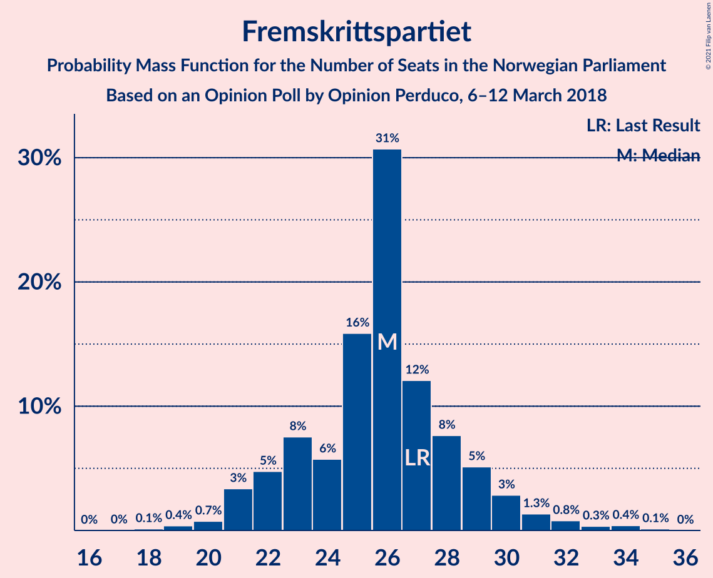
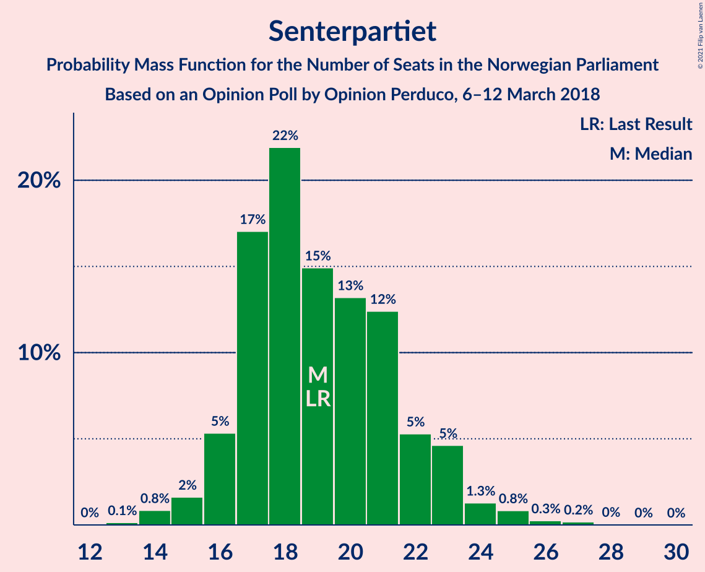
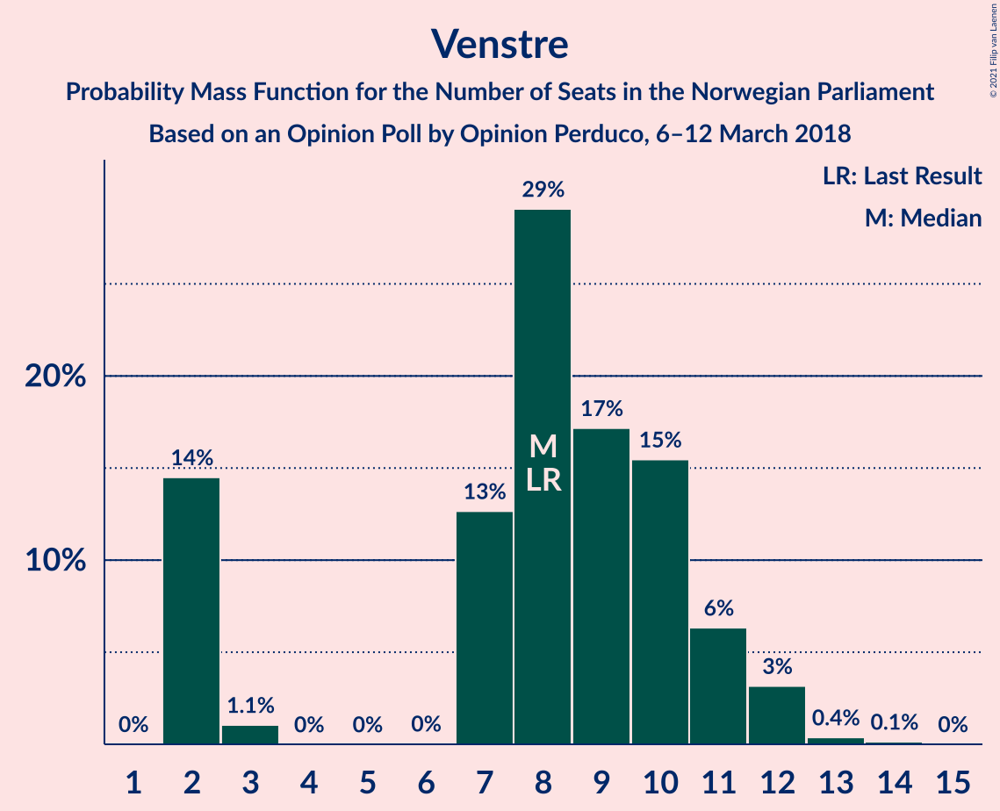
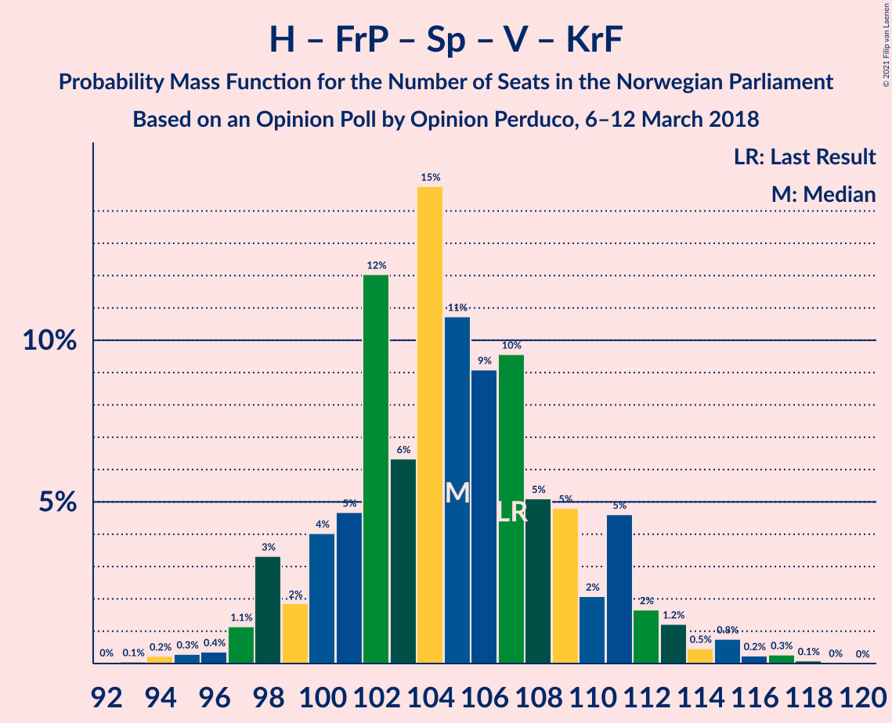
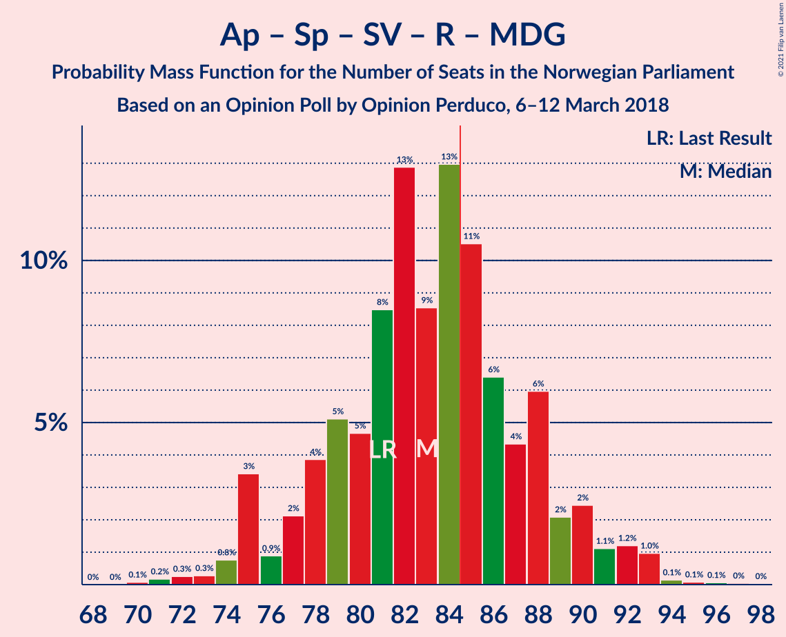
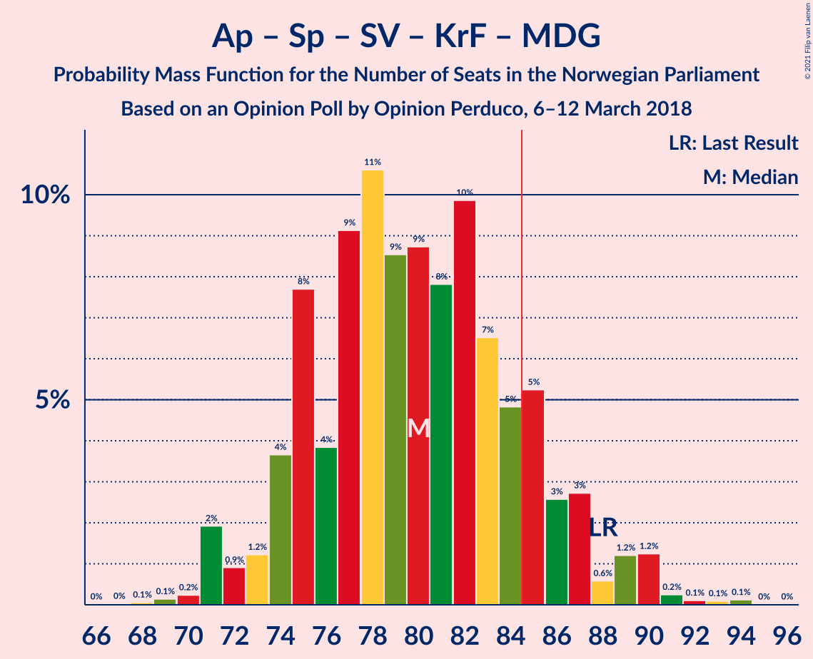
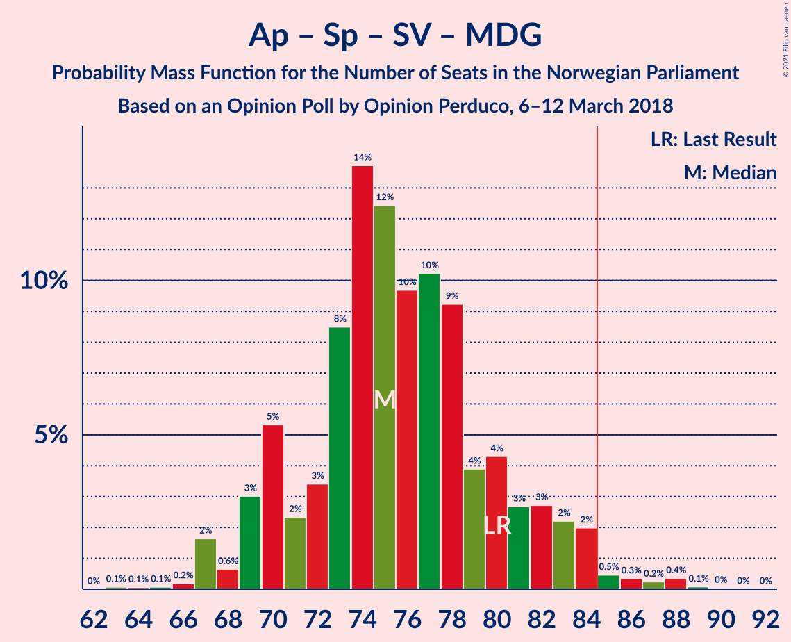
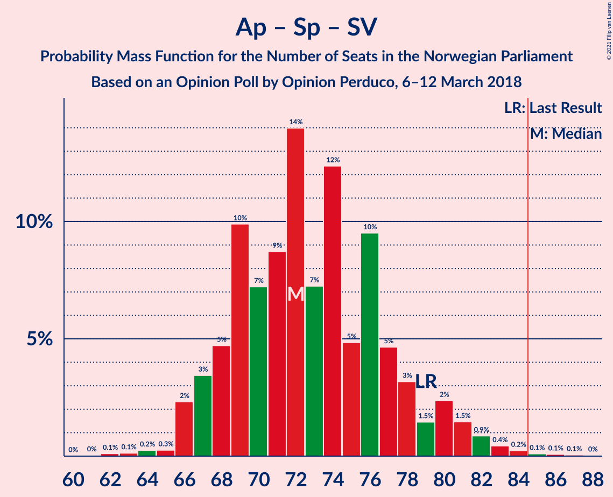
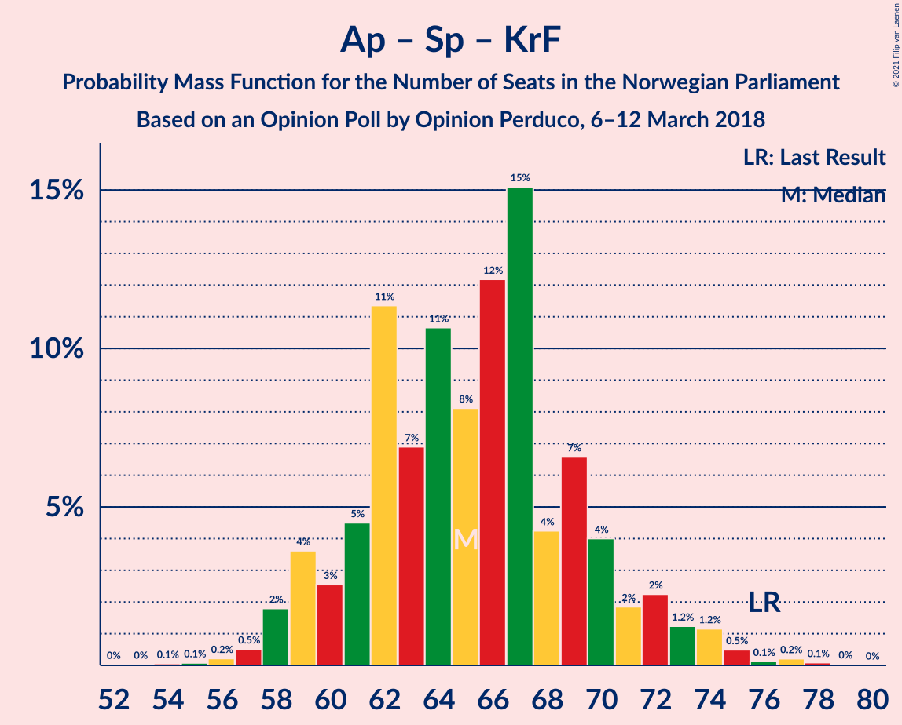
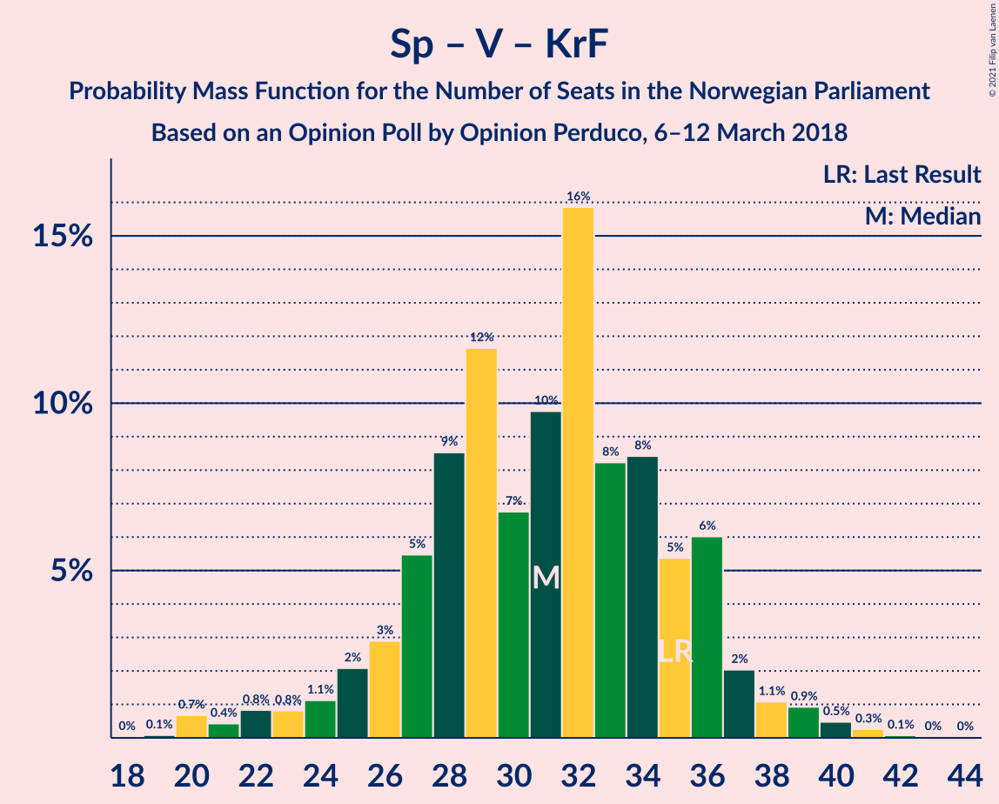

# Opinion Poll by Opinion Perduco, 6–12 March 2018

<a href="#voting-intentions">Voting Intentions</a> | <a href="#seats">Seats</a> | <a href="#coalitions">Coalitions</a> | <a href="#technical-information">Technical Information</a>

## Voting Intentions

### Confidence Intervals

| Party | Last Result | Poll Result | 80% Confidence Interval | 90% Confidence Interval | 95% Confidence Interval | 99% Confidence Interval |
|:-----:|:-----------:|:-----------:|:-----------------------:|:-----------------------:|:-----------------------:|:-----------------------:|
| Høyre | 25.0% | 27.3% | 25.2–29.6% |24.6–30.2% |24.1–30.8% |23.1–31.9% |
| Arbeiderpartiet | 27.4% | 23.4% | 21.4–25.5% |20.8–26.1% |20.3–26.7% |19.4–27.7% |
| Fremskrittspartiet | 15.2% | 14.5% | 12.8–16.3% |12.4–16.8% |12.0–17.3% |11.3–18.2% |
| Senterpartiet | 10.3% | 10.9% | 9.5–12.6% |9.2–13.1% |8.8–13.5% |8.2–14.4% |
| Sosialistisk Venstreparti | 6.0% | 6.9% | 5.8–8.3% |5.5–8.7% |5.2–9.0% |4.7–9.7% |
| Venstre | 4.4% | 4.7% | 3.8–5.9% |3.5–6.2% |3.3–6.5% |2.9–7.1% |
| Rødt | 2.4% | 4.5% | 3.7–5.7% |3.4–6.1% |3.2–6.4% |2.8–7.0% |
| Kristelig Folkeparti | 4.2% | 3.6% | 2.9–4.8% |2.7–5.1% |2.5–5.3% |2.2–5.9% |
| Miljøpartiet De Grønne | 3.2% | 3.2% | 2.5–4.3% |2.3–4.6% |2.1–4.8% |1.8–5.4% |

*Note:* The poll result column reflects the actual value used in the calculations. Published results may vary slightly, and in addition be rounded to fewer digits.

## Seats

### Confidence Intervals

| Party | Last Result | Median | 80% Confidence Interval | 90% Confidence Interval | 95% Confidence Interval | 99% Confidence Interval |
|:-----:|:-----------:|:------:|:-----------------------:|:-----------------------:|:-----------------------:|:-----------------------:|
| <a href="#høyre">Høyre</a> | 45 | 49 | 44–52 |43–54 |42–54 |40–57 |
| <a href="#arbeiderpartiet">Arbeiderpartiet</a> | 49 | 41 | 39–45 |39–46 |37–47 |36–50 |
| <a href="#fremskrittspartiet">Fremskrittspartiet</a> | 27 | 25 | 21–29 |21–30 |21–31 |20–32 |
| <a href="#senterpartiet">Senterpartiet</a> | 19 | 19 | 17–22 |16–23 |15–23 |14–25 |
| <a href="#sosialistisk-venstreparti">Sosialistisk Venstreparti</a> | 11 | 14 | 10–15 |9–16 |8–17 |8–17 |
| <a href="#venstre">Venstre</a> | 8 | 8 | 2–10 |2–11 |2–11 |2–13 |
| <a href="#rødt">Rødt</a> | 1 | 8 | 2–10 |2–11 |2–11 |1–12 |
| <a href="#kristelig-folkeparti">Kristelig Folkeparti</a> | 8 | 3 | 1–8 |1–9 |1–9 |0–10 |
| <a href="#miljøpartiet-de-grønne">Miljøpartiet De Grønne</a> | 1 | 2 | 1–7 |1–8 |1–8 |0–9 |

### Høyre

*For a full overview of the results for this party, see the [Høyre](party-høyre.html) page.*

| Number of Seats | Probability | Accumulated | Special Marks |
|:---------------:|:-----------:|:-----------:|:-------------:|
| 38 | 0.1% | 100% |  |
| 39 | 0.2% | 99.9% |  |
| 40 | 0.9% | 99.8% |  |
| 41 | 0.3% | 98.8% |  |
| 42 | 2% | 98.6% |  |
| 43 | 2% | 97% |  |
| 44 | 5% | 94% |  |
| 45 | 4% | 89% | Last Result |
| 46 | 11% | 85% |  |
| 47 | 9% | 75% |  |
| 48 | 13% | 66% |  |
| 49 | 7% | 53% | Median |
| 50 | 2% | 46% |  |
| 51 | 16% | 43% |  |
| 52 | 18% | 27% |  |
| 53 | 2% | 9% |  |
| 54 | 5% | 7% |  |
| 55 | 0.8% | 2% |  |
| 56 | 0.7% | 1.2% |  |
| 57 | 0.3% | 0.5% |  |
| 58 | 0.1% | 0.2% |  |
| 59 | 0.1% | 0.2% |  |
| 60 | 0% | 0% |  |

### Arbeiderpartiet

*For a full overview of the results for this party, see the [Arbeiderpartiet](party-arbeiderpartiet.html) page.*

| Number of Seats | Probability | Accumulated | Special Marks |
|:---------------:|:-----------:|:-----------:|:-------------:|
| 32 | 0% | 100% |  |
| 33 | 0% | 99.9% |  |
| 34 | 0.2% | 99.9% |  |
| 35 | 0% | 99.7% |  |
| 36 | 0.7% | 99.7% |  |
| 37 | 2% | 98.9% |  |
| 38 | 0.6% | 97% |  |
| 39 | 7% | 97% |  |
| 40 | 9% | 90% |  |
| 41 | 32% | 81% | Median |
| 42 | 29% | 49% |  |
| 43 | 8% | 20% |  |
| 44 | 2% | 12% |  |
| 45 | 6% | 11% |  |
| 46 | 0.9% | 5% |  |
| 47 | 2% | 4% |  |
| 48 | 1.2% | 2% |  |
| 49 | 0.6% | 1.3% | Last Result |
| 50 | 0.4% | 0.7% |  |
| 51 | 0.1% | 0.3% |  |
| 52 | 0% | 0.2% |  |
| 53 | 0.2% | 0.2% |  |
| 54 | 0% | 0% |  |

### Fremskrittspartiet

*For a full overview of the results for this party, see the [Fremskrittspartiet](party-fremskrittspartiet.html) page.*

| Number of Seats | Probability | Accumulated | Special Marks |
|:---------------:|:-----------:|:-----------:|:-------------:|
| 18 | 0.2% | 100% |  |
| 19 | 0.3% | 99.8% |  |
| 20 | 0.2% | 99.5% |  |
| 21 | 17% | 99.3% |  |
| 22 | 18% | 82% |  |
| 23 | 7% | 64% |  |
| 24 | 4% | 58% |  |
| 25 | 16% | 54% | Median |
| 26 | 5% | 38% |  |
| 27 | 11% | 33% | Last Result |
| 28 | 4% | 22% |  |
| 29 | 10% | 18% |  |
| 30 | 4% | 8% |  |
| 31 | 2% | 4% |  |
| 32 | 2% | 2% |  |
| 33 | 0.2% | 0.4% |  |
| 34 | 0.2% | 0.2% |  |
| 35 | 0% | 0% |  |

### Senterpartiet

*For a full overview of the results for this party, see the [Senterpartiet](party-senterpartiet.html) page.*

| Number of Seats | Probability | Accumulated | Special Marks |
|:---------------:|:-----------:|:-----------:|:-------------:|
| 13 | 0.1% | 100% |  |
| 14 | 0.5% | 99.9% |  |
| 15 | 4% | 99.4% |  |
| 16 | 2% | 96% |  |
| 17 | 11% | 94% |  |
| 18 | 28% | 83% |  |
| 19 | 13% | 55% | Last Result, Median |
| 20 | 22% | 42% |  |
| 21 | 4% | 20% |  |
| 22 | 7% | 16% |  |
| 23 | 7% | 9% |  |
| 24 | 1.4% | 2% |  |
| 25 | 0.5% | 1.0% |  |
| 26 | 0.3% | 0.5% |  |
| 27 | 0.1% | 0.2% |  |
| 28 | 0.1% | 0.1% |  |
| 29 | 0% | 0% |  |

### Sosialistisk Venstreparti

*For a full overview of the results for this party, see the [Sosialistisk Venstreparti](party-sosialistiskvenstreparti.html) page.*

| Number of Seats | Probability | Accumulated | Special Marks |
|:---------------:|:-----------:|:-----------:|:-------------:|
| 7 | 0% | 100% |  |
| 8 | 3% | 99.9% |  |
| 9 | 7% | 97% |  |
| 10 | 5% | 90% |  |
| 11 | 11% | 85% | Last Result |
| 12 | 8% | 74% |  |
| 13 | 12% | 66% |  |
| 14 | 24% | 54% | Median |
| 15 | 22% | 30% |  |
| 16 | 5% | 7% |  |
| 17 | 2% | 3% |  |
| 18 | 0.4% | 0.4% |  |
| 19 | 0% | 0% |  |

### Venstre

*For a full overview of the results for this party, see the [Venstre](party-venstre.html) page.*

| Number of Seats | Probability | Accumulated | Special Marks |
|:---------------:|:-----------:|:-----------:|:-------------:|
| 2 | 14% | 100% |  |
| 3 | 2% | 86% |  |
| 4 | 0% | 84% |  |
| 5 | 0% | 84% |  |
| 6 | 0% | 84% |  |
| 7 | 2% | 84% |  |
| 8 | 39% | 81% | Last Result, Median |
| 9 | 31% | 43% |  |
| 10 | 7% | 12% |  |
| 11 | 4% | 5% |  |
| 12 | 1.1% | 2% |  |
| 13 | 0.5% | 0.6% |  |
| 14 | 0.1% | 0.1% |  |
| 15 | 0% | 0% |  |

### Rødt

*For a full overview of the results for this party, see the [Rødt](party-rødt.html) page.*

| Number of Seats | Probability | Accumulated | Special Marks |
|:---------------:|:-----------:|:-----------:|:-------------:|
| 1 | 0.9% | 100% | Last Result |
| 2 | 13% | 99.1% |  |
| 3 | 0% | 86% |  |
| 4 | 0% | 86% |  |
| 5 | 0% | 86% |  |
| 6 | 0% | 86% |  |
| 7 | 24% | 86% |  |
| 8 | 21% | 61% | Median |
| 9 | 24% | 40% |  |
| 10 | 11% | 17% |  |
| 11 | 5% | 6% |  |
| 12 | 0.9% | 1.1% |  |
| 13 | 0.1% | 0.2% |  |
| 14 | 0% | 0% |  |

### Kristelig Folkeparti

*For a full overview of the results for this party, see the [Kristelig Folkeparti](party-kristeligfolkeparti.html) page.*

| Number of Seats | Probability | Accumulated | Special Marks |
|:---------------:|:-----------:|:-----------:|:-------------:|
| 0 | 0.8% | 100% |  |
| 1 | 10% | 99.2% |  |
| 2 | 12% | 89% |  |
| 3 | 55% | 77% | Median |
| 4 | 0% | 22% |  |
| 5 | 0% | 22% |  |
| 6 | 0% | 22% |  |
| 7 | 4% | 22% |  |
| 8 | 11% | 18% | Last Result |
| 9 | 5% | 7% |  |
| 10 | 0.9% | 1.1% |  |
| 11 | 0.2% | 0.3% |  |
| 12 | 0% | 0% |  |

### Miljøpartiet De Grønne

*For a full overview of the results for this party, see the [Miljøpartiet De Grønne](party-miljøpartietdegrønne.html) page.*

| Number of Seats | Probability | Accumulated | Special Marks |
|:---------------:|:-----------:|:-----------:|:-------------:|
| 0 | 1.4% | 100% |  |
| 1 | 26% | 98.6% | Last Result |
| 2 | 61% | 73% | Median |
| 3 | 0.6% | 12% |  |
| 4 | 0.1% | 11% |  |
| 5 | 0% | 11% |  |
| 6 | 0.3% | 11% |  |
| 7 | 4% | 11% |  |
| 8 | 5% | 6% |  |
| 9 | 1.1% | 1.3% |  |
| 10 | 0.2% | 0.2% |  |
| 11 | 0% | 0% |  |

## Coalitions

### Confidence Intervals

| Coalition | Last Result | Median | Majority? | 80% Confidence Interval | 90% Confidence Interval | 95% Confidence Interval | 99% Confidence Interval |
|:---------:|:-----------:|:------:|:---------:|:-----------------------:|:-----------------------:|:-----------------------:|:-----------------------:|
| Høyre – Fremskrittspartiet – Senterpartiet – Venstre – Kristelig Folkeparti | 107 | 104 | 100% | 101–110 | 98–112 | 97–112 | 95–118 |
| Høyre – Fremskrittspartiet – Venstre – Kristelig Folkeparti – Miljøpartiet De Grønne | 89 | 87 | 91% | 85–92 | 82–95 | 80–98 | 78–99 |
| Høyre – Fremskrittspartiet – Venstre – Kristelig Folkeparti | 88 | 85 | 55% | 81–90 | 79–93 | 77–94 | 75–97 |
| Arbeiderpartiet – Senterpartiet – Sosialistisk Venstreparti – Rødt – Miljøpartiet De Grønne | 81 | 84 | 45% | 79–88 | 76–90 | 75–92 | 72–94 |
| Høyre – Fremskrittspartiet – Venstre | 80 | 81 | 15% | 77–86 | 76–88 | 75–91 | 71–96 |
| Arbeiderpartiet – Senterpartiet – Sosialistisk Venstreparti – Kristelig Folkeparti – Miljøpartiet De Grønne | 88 | 79 | 10% | 76–85 | 74–87 | 73–90 | 71–91 |
| Arbeiderpartiet – Senterpartiet – Sosialistisk Venstreparti – Rødt | 80 | 82 | 9% | 77–84 | 74–87 | 71–89 | 70–91 |
| Arbeiderpartiet – Senterpartiet – Sosialistisk Venstreparti – Miljøpartiet De Grønne | 80 | 76 | 2% | 71–81 | 70–83 | 70–84 | 68–87 |
| Arbeiderpartiet – Senterpartiet – Sosialistisk Venstreparti | 79 | 74 | 0.4% | 69–77 | 69–80 | 67–82 | 64–83 |
| Høyre – Fremskrittspartiet | 72 | 74 | 2% | 70–77 | 68–81 | 67–81 | 66–86 |
| Arbeiderpartiet – Senterpartiet – Kristelig Folkeparti – Miljøpartiet De Grønne | 77 | 67 | 0% | 63–74 | 63–75 | 62–76 | 60–79 |
| Arbeiderpartiet – Senterpartiet – Kristelig Folkeparti | 76 | 65 | 0% | 61–69 | 61–72 | 60–74 | 57–75 |
| Arbeiderpartiet – Senterpartiet | 68 | 60 | 0% | 58–64 | 58–67 | 57–68 | 54–71 |
| Høyre – Venstre – Kristelig Folkeparti | 61 | 62 | 0% | 55–64 | 52–66 | 51–67 | 49–69 |
| Arbeiderpartiet – Sosialistisk Venstreparti | 60 | 56 | 0% | 51–57 | 49–59 | 48–61 | 47–63 |
| Senterpartiet – Venstre – Kristelig Folkeparti | 35 | 31 | 0% | 27–35 | 24–36 | 22–37 | 21–39 |

### Høyre – Fremskrittspartiet – Senterpartiet – Venstre – Kristelig Folkeparti

| Number of Seats | Probability | Accumulated | Special Marks |
|:---------------:|:-----------:|:-----------:|:-------------:|
| 93 | 0.1% | 100% |  |
| 94 | 0.3% | 99.9% |  |
| 95 | 0.3% | 99.6% |  |
| 96 | 0.6% | 99.3% |  |
| 97 | 2% | 98.6% |  |
| 98 | 2% | 96% |  |
| 99 | 2% | 94% |  |
| 100 | 1.2% | 92% |  |
| 101 | 3% | 91% |  |
| 102 | 9% | 87% |  |
| 103 | 23% | 78% |  |
| 104 | 21% | 55% | Median |
| 105 | 6% | 34% |  |
| 106 | 7% | 28% |  |
| 107 | 5% | 21% | Last Result |
| 108 | 1.1% | 15% |  |
| 109 | 2% | 14% |  |
| 110 | 3% | 12% |  |
| 111 | 4% | 9% |  |
| 112 | 3% | 5% |  |
| 113 | 0.1% | 2% |  |
| 114 | 0.3% | 2% |  |
| 115 | 0.9% | 2% |  |
| 116 | 0.1% | 0.8% |  |
| 117 | 0% | 0.7% |  |
| 118 | 0.6% | 0.6% |  |
| 119 | 0% | 0% |  |

### Høyre – Fremskrittspartiet – Venstre – Kristelig Folkeparti – Miljøpartiet De Grønne

| Number of Seats | Probability | Accumulated | Special Marks |
|:---------------:|:-----------:|:-----------:|:-------------:|
| 76 | 0.2% | 100% |  |
| 77 | 0.1% | 99.8% |  |
| 78 | 0.6% | 99.7% |  |
| 79 | 0.5% | 99.1% |  |
| 80 | 2% | 98.6% |  |
| 81 | 0.5% | 97% |  |
| 82 | 2% | 96% |  |
| 83 | 0.6% | 95% |  |
| 84 | 3% | 94% |  |
| 85 | 30% | 91% | Majority |
| 86 | 2% | 61% |  |
| 87 | 9% | 59% | Median |
| 88 | 19% | 50% |  |
| 89 | 6% | 31% | Last Result |
| 90 | 9% | 25% |  |
| 91 | 6% | 16% |  |
| 92 | 2% | 10% |  |
| 93 | 1.1% | 8% |  |
| 94 | 1.3% | 7% |  |
| 95 | 3% | 6% |  |
| 96 | 0.1% | 3% |  |
| 97 | 0.3% | 3% |  |
| 98 | 1.5% | 3% |  |
| 99 | 1.1% | 1.4% |  |
| 100 | 0% | 0.3% |  |
| 101 | 0.2% | 0.3% |  |
| 102 | 0.1% | 0.1% |  |
| 103 | 0% | 0% |  |

### Høyre – Fremskrittspartiet – Venstre – Kristelig Folkeparti

| Number of Seats | Probability | Accumulated | Special Marks |
|:---------------:|:-----------:|:-----------:|:-------------:|
| 73 | 0% | 100% |  |
| 74 | 0.2% | 99.9% |  |
| 75 | 0.3% | 99.8% |  |
| 76 | 0.1% | 99.5% |  |
| 77 | 2% | 99.3% |  |
| 78 | 0.9% | 97% |  |
| 79 | 3% | 96% |  |
| 80 | 1.0% | 93% |  |
| 81 | 3% | 92% |  |
| 82 | 3% | 89% |  |
| 83 | 28% | 86% |  |
| 84 | 4% | 59% |  |
| 85 | 10% | 55% | Median, Majority |
| 86 | 17% | 45% |  |
| 87 | 7% | 28% |  |
| 88 | 5% | 22% | Last Result |
| 89 | 4% | 16% |  |
| 90 | 5% | 13% |  |
| 91 | 2% | 8% |  |
| 92 | 0.9% | 6% |  |
| 93 | 0.9% | 5% |  |
| 94 | 2% | 4% |  |
| 95 | 0.2% | 2% |  |
| 96 | 0.1% | 2% |  |
| 97 | 2% | 2% |  |
| 98 | 0.1% | 0.1% |  |
| 99 | 0% | 0% |  |

### Arbeiderpartiet – Senterpartiet – Sosialistisk Venstreparti – Rødt – Miljøpartiet De Grønne

| Number of Seats | Probability | Accumulated | Special Marks |
|:---------------:|:-----------:|:-----------:|:-------------:|
| 71 | 0.1% | 100% |  |
| 72 | 2% | 99.9% |  |
| 73 | 0.1% | 98% |  |
| 74 | 0.2% | 98% |  |
| 75 | 2% | 98% |  |
| 76 | 0.9% | 96% |  |
| 77 | 0.9% | 95% |  |
| 78 | 2% | 94% |  |
| 79 | 5% | 92% |  |
| 80 | 4% | 87% |  |
| 81 | 5% | 84% | Last Result |
| 82 | 7% | 78% |  |
| 83 | 17% | 72% |  |
| 84 | 10% | 55% | Median |
| 85 | 4% | 45% | Majority |
| 86 | 28% | 41% |  |
| 87 | 3% | 14% |  |
| 88 | 3% | 11% |  |
| 89 | 1.0% | 8% |  |
| 90 | 3% | 7% |  |
| 91 | 0.9% | 4% |  |
| 92 | 2% | 3% |  |
| 93 | 0.1% | 0.7% |  |
| 94 | 0.3% | 0.5% |  |
| 95 | 0.2% | 0.2% |  |
| 96 | 0% | 0.1% |  |
| 97 | 0% | 0% |  |

### Høyre – Fremskrittspartiet – Venstre

| Number of Seats | Probability | Accumulated | Special Marks |
|:---------------:|:-----------:|:-----------:|:-------------:|
| 68 | 0% | 100% |  |
| 69 | 0% | 99.9% |  |
| 70 | 0.2% | 99.9% |  |
| 71 | 0.3% | 99.7% |  |
| 72 | 0.3% | 99.4% |  |
| 73 | 0.2% | 99.2% |  |
| 74 | 0.9% | 98.9% |  |
| 75 | 3% | 98% |  |
| 76 | 4% | 95% |  |
| 77 | 5% | 91% |  |
| 78 | 6% | 87% |  |
| 79 | 6% | 80% |  |
| 80 | 22% | 75% | Last Result |
| 81 | 7% | 53% |  |
| 82 | 9% | 46% | Median |
| 83 | 17% | 37% |  |
| 84 | 5% | 20% |  |
| 85 | 4% | 15% | Majority |
| 86 | 4% | 12% |  |
| 87 | 2% | 8% |  |
| 88 | 1.0% | 6% |  |
| 89 | 0.4% | 5% |  |
| 90 | 0.2% | 4% |  |
| 91 | 2% | 4% |  |
| 92 | 0.3% | 2% |  |
| 93 | 0% | 1.4% |  |
| 94 | 0.5% | 1.4% |  |
| 95 | 0% | 0.9% |  |
| 96 | 0.8% | 0.9% |  |
| 97 | 0% | 0% |  |

### Arbeiderpartiet – Senterpartiet – Sosialistisk Venstreparti – Kristelig Folkeparti – Miljøpartiet De Grønne

| Number of Seats | Probability | Accumulated | Special Marks |
|:---------------:|:-----------:|:-----------:|:-------------:|
| 69 | 0.2% | 100% |  |
| 70 | 0.1% | 99.8% |  |
| 71 | 1.1% | 99.7% |  |
| 72 | 0.7% | 98.6% |  |
| 73 | 2% | 98% |  |
| 74 | 3% | 96% |  |
| 75 | 1.4% | 93% |  |
| 76 | 10% | 92% |  |
| 77 | 1.2% | 82% |  |
| 78 | 4% | 81% |  |
| 79 | 27% | 76% | Median |
| 80 | 2% | 49% |  |
| 81 | 21% | 47% |  |
| 82 | 7% | 26% |  |
| 83 | 5% | 19% |  |
| 84 | 3% | 14% |  |
| 85 | 2% | 10% | Majority |
| 86 | 2% | 8% |  |
| 87 | 1.4% | 6% |  |
| 88 | 0.7% | 4% | Last Result |
| 89 | 0.5% | 4% |  |
| 90 | 2% | 3% |  |
| 91 | 0.5% | 0.8% |  |
| 92 | 0% | 0.3% |  |
| 93 | 0.2% | 0.3% |  |
| 94 | 0% | 0.1% |  |
| 95 | 0% | 0% |  |

### Arbeiderpartiet – Senterpartiet – Sosialistisk Venstreparti – Rødt

| Number of Seats | Probability | Accumulated | Special Marks |
|:---------------:|:-----------:|:-----------:|:-------------:|
| 67 | 0.1% | 100% |  |
| 68 | 0.2% | 99.9% |  |
| 69 | 0% | 99.7% |  |
| 70 | 1.1% | 99.7% |  |
| 71 | 1.5% | 98.6% |  |
| 72 | 0.3% | 97% |  |
| 73 | 0.1% | 97% |  |
| 74 | 3% | 97% |  |
| 75 | 1.3% | 94% |  |
| 76 | 1.1% | 93% |  |
| 77 | 2% | 92% |  |
| 78 | 6% | 90% |  |
| 79 | 9% | 84% |  |
| 80 | 6% | 75% | Last Result |
| 81 | 19% | 69% |  |
| 82 | 9% | 50% | Median |
| 83 | 2% | 41% |  |
| 84 | 30% | 39% |  |
| 85 | 3% | 9% | Majority |
| 86 | 0.6% | 6% |  |
| 87 | 2% | 5% |  |
| 88 | 0.5% | 4% |  |
| 89 | 2% | 3% |  |
| 90 | 0.5% | 1.4% |  |
| 91 | 0.6% | 0.9% |  |
| 92 | 0.1% | 0.3% |  |
| 93 | 0.2% | 0.2% |  |
| 94 | 0% | 0% |  |

### Arbeiderpartiet – Senterpartiet – Sosialistisk Venstreparti – Miljøpartiet De Grønne

| Number of Seats | Probability | Accumulated | Special Marks |
|:---------------:|:-----------:|:-----------:|:-------------:|
| 64 | 0% | 100% |  |
| 65 | 0.1% | 99.9% |  |
| 66 | 0.1% | 99.9% |  |
| 67 | 0.2% | 99.8% |  |
| 68 | 0.5% | 99.6% |  |
| 69 | 0.7% | 99.1% |  |
| 70 | 6% | 98% |  |
| 71 | 4% | 93% |  |
| 72 | 0.6% | 88% |  |
| 73 | 10% | 88% |  |
| 74 | 3% | 78% |  |
| 75 | 7% | 75% |  |
| 76 | 22% | 67% | Median |
| 77 | 8% | 45% |  |
| 78 | 21% | 37% |  |
| 79 | 3% | 16% |  |
| 80 | 2% | 13% | Last Result |
| 81 | 2% | 10% |  |
| 82 | 3% | 8% |  |
| 83 | 3% | 5% |  |
| 84 | 0.4% | 3% |  |
| 85 | 1.1% | 2% | Majority |
| 86 | 0.5% | 1.2% |  |
| 87 | 0.5% | 0.7% |  |
| 88 | 0.1% | 0.2% |  |
| 89 | 0.1% | 0.1% |  |
| 90 | 0% | 0.1% |  |
| 91 | 0% | 0% |  |

### Arbeiderpartiet – Senterpartiet – Sosialistisk Venstreparti

| Number of Seats | Probability | Accumulated | Special Marks |
|:---------------:|:-----------:|:-----------:|:-------------:|
| 61 | 0.1% | 100% |  |
| 62 | 0% | 99.9% |  |
| 63 | 0.2% | 99.9% |  |
| 64 | 0.5% | 99.7% |  |
| 65 | 0.3% | 99.3% |  |
| 66 | 0.3% | 99.0% |  |
| 67 | 1.3% | 98.7% |  |
| 68 | 1.3% | 97% |  |
| 69 | 9% | 96% |  |
| 70 | 2% | 87% |  |
| 71 | 6% | 85% |  |
| 72 | 7% | 78% |  |
| 73 | 9% | 71% |  |
| 74 | 21% | 62% | Median |
| 75 | 9% | 41% |  |
| 76 | 17% | 32% |  |
| 77 | 6% | 15% |  |
| 78 | 2% | 8% |  |
| 79 | 0.8% | 7% | Last Result |
| 80 | 1.2% | 6% |  |
| 81 | 2% | 5% |  |
| 82 | 2% | 3% |  |
| 83 | 0.3% | 0.7% |  |
| 84 | 0.1% | 0.4% |  |
| 85 | 0.1% | 0.4% | Majority |
| 86 | 0.2% | 0.3% |  |
| 87 | 0.1% | 0.1% |  |
| 88 | 0% | 0% |  |

### Høyre – Fremskrittspartiet

| Number of Seats | Probability | Accumulated | Special Marks |
|:---------------:|:-----------:|:-----------:|:-------------:|
| 62 | 0.1% | 100% |  |
| 63 | 0% | 99.9% |  |
| 64 | 0.2% | 99.9% |  |
| 65 | 0.1% | 99.7% |  |
| 66 | 0.3% | 99.6% |  |
| 67 | 2% | 99.2% |  |
| 68 | 3% | 97% |  |
| 69 | 3% | 94% |  |
| 70 | 5% | 91% |  |
| 71 | 6% | 86% |  |
| 72 | 17% | 80% | Last Result |
| 73 | 12% | 63% |  |
| 74 | 22% | 52% | Median |
| 75 | 3% | 30% |  |
| 76 | 9% | 27% |  |
| 77 | 9% | 18% |  |
| 78 | 1.5% | 9% |  |
| 79 | 0.7% | 8% |  |
| 80 | 2% | 7% |  |
| 81 | 3% | 5% |  |
| 82 | 0.3% | 2% |  |
| 83 | 0.1% | 2% |  |
| 84 | 0.5% | 2% |  |
| 85 | 0.2% | 2% | Majority |
| 86 | 1.3% | 1.4% |  |
| 87 | 0% | 0% |  |

### Arbeiderpartiet – Senterpartiet – Kristelig Folkeparti – Miljøpartiet De Grønne

| Number of Seats | Probability | Accumulated | Special Marks |
|:---------------:|:-----------:|:-----------:|:-------------:|
| 56 | 0.1% | 100% |  |
| 57 | 0.1% | 99.9% |  |
| 58 | 0.1% | 99.7% |  |
| 59 | 0.1% | 99.7% |  |
| 60 | 0.1% | 99.6% |  |
| 61 | 1.3% | 99.5% |  |
| 62 | 1.1% | 98% |  |
| 63 | 9% | 97% |  |
| 64 | 25% | 88% |  |
| 65 | 6% | 63% | Median |
| 66 | 3% | 56% |  |
| 67 | 20% | 54% |  |
| 68 | 8% | 33% |  |
| 69 | 5% | 25% |  |
| 70 | 3% | 20% |  |
| 71 | 2% | 16% |  |
| 72 | 2% | 14% |  |
| 73 | 3% | 13% |  |
| 74 | 4% | 10% |  |
| 75 | 2% | 7% |  |
| 76 | 2% | 4% |  |
| 77 | 0.6% | 2% | Last Result |
| 78 | 0.7% | 1.3% |  |
| 79 | 0.2% | 0.6% |  |
| 80 | 0.4% | 0.4% |  |
| 81 | 0% | 0.1% |  |
| 82 | 0% | 0% |  |

### Arbeiderpartiet – Senterpartiet – Kristelig Folkeparti

| Number of Seats | Probability | Accumulated | Special Marks |
|:---------------:|:-----------:|:-----------:|:-------------:|
| 54 | 0.1% | 100% |  |
| 55 | 0.1% | 99.8% |  |
| 56 | 0.2% | 99.8% |  |
| 57 | 0.3% | 99.6% |  |
| 58 | 0.8% | 99.4% |  |
| 59 | 0.5% | 98.6% |  |
| 60 | 1.4% | 98% |  |
| 61 | 9% | 97% |  |
| 62 | 29% | 88% |  |
| 63 | 4% | 59% | Median |
| 64 | 4% | 56% |  |
| 65 | 17% | 51% |  |
| 66 | 11% | 34% |  |
| 67 | 8% | 23% |  |
| 68 | 4% | 15% |  |
| 69 | 2% | 12% |  |
| 70 | 2% | 10% |  |
| 71 | 1.2% | 8% |  |
| 72 | 3% | 7% |  |
| 73 | 0.5% | 4% |  |
| 74 | 0.6% | 3% |  |
| 75 | 2% | 2% |  |
| 76 | 0.1% | 0.5% | Last Result |
| 77 | 0.1% | 0.4% |  |
| 78 | 0.1% | 0.3% |  |
| 79 | 0.2% | 0.2% |  |
| 80 | 0% | 0% |  |

### Arbeiderpartiet – Senterpartiet

| Number of Seats | Probability | Accumulated | Special Marks |
|:---------------:|:-----------:|:-----------:|:-------------:|
| 51 | 0.2% | 100% |  |
| 52 | 0% | 99.8% |  |
| 53 | 0.2% | 99.8% |  |
| 54 | 0.5% | 99.6% |  |
| 55 | 0.7% | 99.0% |  |
| 56 | 0.5% | 98% |  |
| 57 | 1.4% | 98% |  |
| 58 | 7% | 96% |  |
| 59 | 29% | 89% |  |
| 60 | 15% | 60% | Median |
| 61 | 5% | 45% |  |
| 62 | 19% | 40% |  |
| 63 | 8% | 21% |  |
| 64 | 6% | 13% |  |
| 65 | 1.3% | 8% |  |
| 66 | 0.8% | 6% |  |
| 67 | 2% | 6% |  |
| 68 | 2% | 4% | Last Result |
| 69 | 0.3% | 2% |  |
| 70 | 0.5% | 1.2% |  |
| 71 | 0.4% | 0.8% |  |
| 72 | 0.2% | 0.4% |  |
| 73 | 0.2% | 0.2% |  |
| 74 | 0% | 0% |  |

### Høyre – Venstre – Kristelig Folkeparti

| Number of Seats | Probability | Accumulated | Special Marks |
|:---------------:|:-----------:|:-----------:|:-------------:|
| 48 | 0.2% | 100% |  |
| 49 | 0.4% | 99.8% |  |
| 50 | 0.1% | 99.4% |  |
| 51 | 2% | 99.3% |  |
| 52 | 3% | 97% |  |
| 53 | 0.3% | 94% |  |
| 54 | 0.7% | 94% |  |
| 55 | 5% | 93% |  |
| 56 | 7% | 88% |  |
| 57 | 2% | 81% |  |
| 58 | 15% | 80% |  |
| 59 | 4% | 65% |  |
| 60 | 8% | 61% | Median |
| 61 | 2% | 53% | Last Result |
| 62 | 18% | 51% |  |
| 63 | 4% | 33% |  |
| 64 | 22% | 29% |  |
| 65 | 2% | 7% |  |
| 66 | 1.4% | 5% |  |
| 67 | 3% | 4% |  |
| 68 | 0.5% | 1.2% |  |
| 69 | 0.3% | 0.7% |  |
| 70 | 0.2% | 0.4% |  |
| 71 | 0.1% | 0.2% |  |
| 72 | 0.1% | 0.1% |  |
| 73 | 0% | 0.1% |  |
| 74 | 0% | 0% |  |

### Arbeiderpartiet – Sosialistisk Venstreparti

| Number of Seats | Probability | Accumulated | Special Marks |
|:---------------:|:-----------:|:-----------:|:-------------:|
| 43 | 0% | 100% |  |
| 44 | 0.1% | 99.9% |  |
| 45 | 0.2% | 99.9% |  |
| 46 | 0.1% | 99.7% |  |
| 47 | 0.8% | 99.6% |  |
| 48 | 2% | 98.8% |  |
| 49 | 2% | 97% |  |
| 50 | 5% | 95% |  |
| 51 | 7% | 90% |  |
| 52 | 4% | 83% |  |
| 53 | 2% | 79% |  |
| 54 | 13% | 77% |  |
| 55 | 11% | 64% | Median |
| 56 | 40% | 53% |  |
| 57 | 5% | 13% |  |
| 58 | 2% | 9% |  |
| 59 | 3% | 6% |  |
| 60 | 1.0% | 4% | Last Result |
| 61 | 1.2% | 3% |  |
| 62 | 1.0% | 2% |  |
| 63 | 0.1% | 0.6% |  |
| 64 | 0.1% | 0.5% |  |
| 65 | 0.2% | 0.4% |  |
| 66 | 0.1% | 0.1% |  |
| 67 | 0% | 0% |  |

### Senterpartiet – Venstre – Kristelig Folkeparti

| Number of Seats | Probability | Accumulated | Special Marks |
|:---------------:|:-----------:|:-----------:|:-------------:|
| 19 | 0.2% | 100% |  |
| 20 | 0% | 99.8% |  |
| 21 | 2% | 99.8% |  |
| 22 | 0.4% | 98% |  |
| 23 | 2% | 97% |  |
| 24 | 0.9% | 96% |  |
| 25 | 1.0% | 95% |  |
| 26 | 1.0% | 94% |  |
| 27 | 8% | 93% |  |
| 28 | 5% | 85% |  |
| 29 | 8% | 80% |  |
| 30 | 18% | 72% | Median |
| 31 | 22% | 54% |  |
| 32 | 8% | 32% |  |
| 33 | 5% | 24% |  |
| 34 | 9% | 20% |  |
| 35 | 6% | 11% | Last Result |
| 36 | 2% | 5% |  |
| 37 | 2% | 3% |  |
| 38 | 0.7% | 1.3% |  |
| 39 | 0.2% | 0.6% |  |
| 40 | 0.1% | 0.4% |  |
| 41 | 0% | 0.2% |  |
| 42 | 0% | 0.2% |  |
| 43 | 0.1% | 0.1% |  |
| 44 | 0% | 0% |  |

## Technical Information

### Opinion Poll

+ **Polling firm:** Opinion Perduco
+ **Commissioner(s):** —
+ **Fieldwork period:** 6–12 March 2018

### Calculations

+ **Sample size:** 685
+ **Simulations done:** 131,072
+ **Error estimate:** 1.48%

