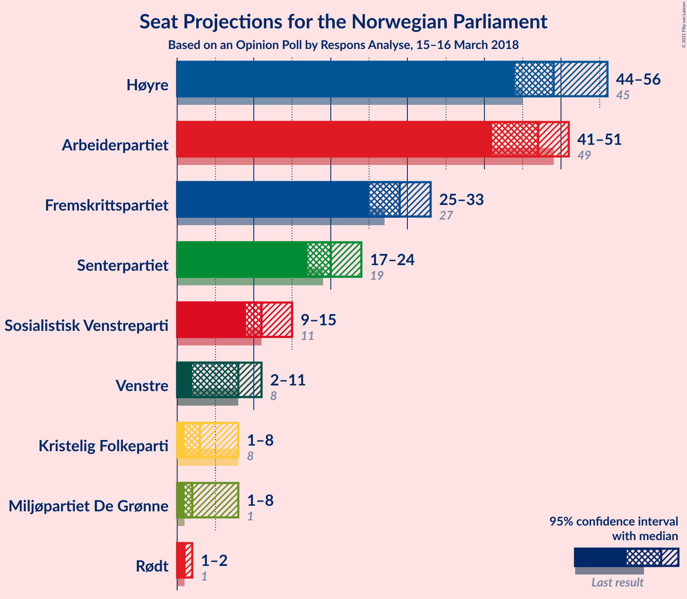
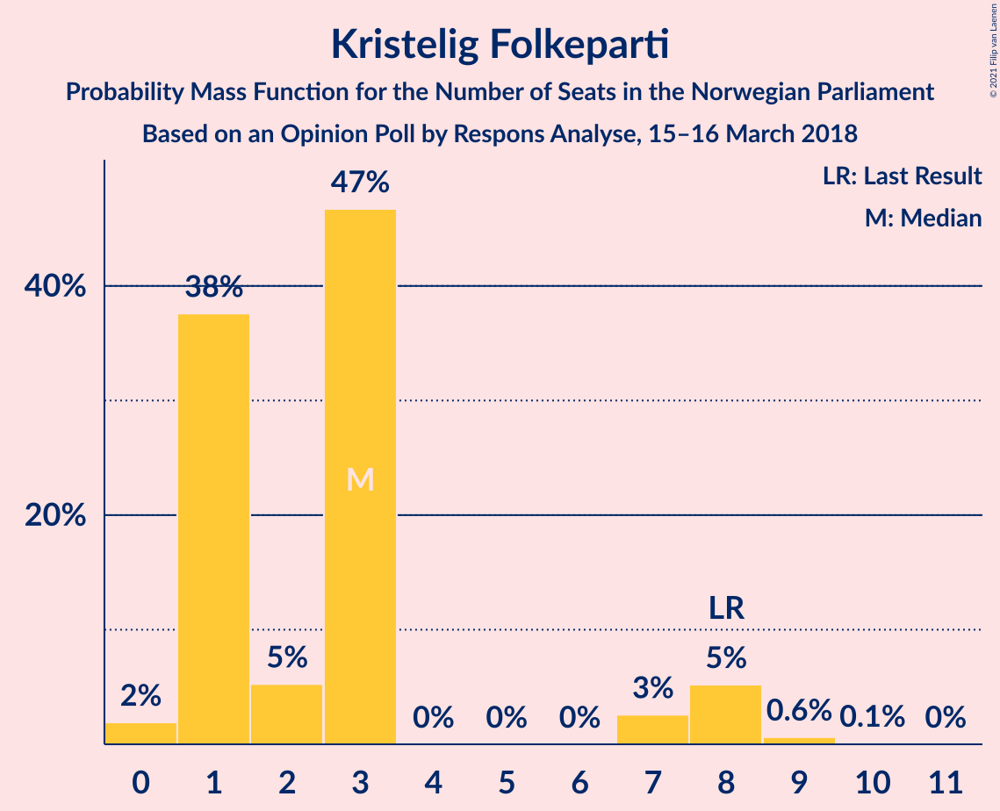
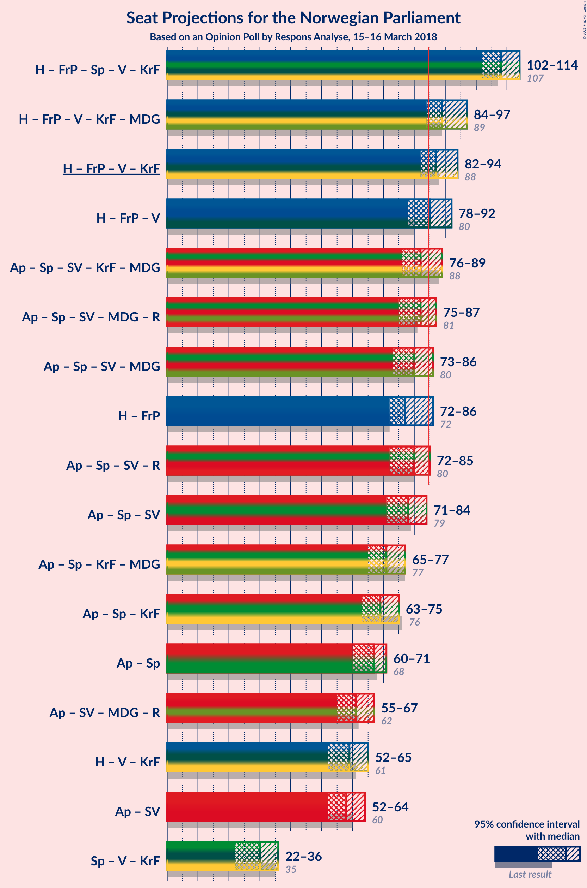
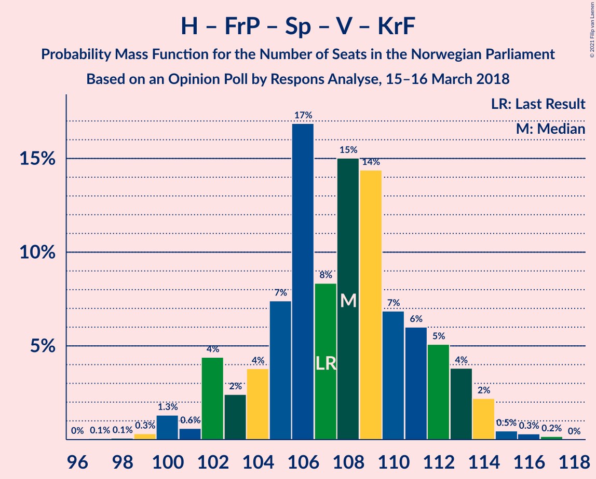
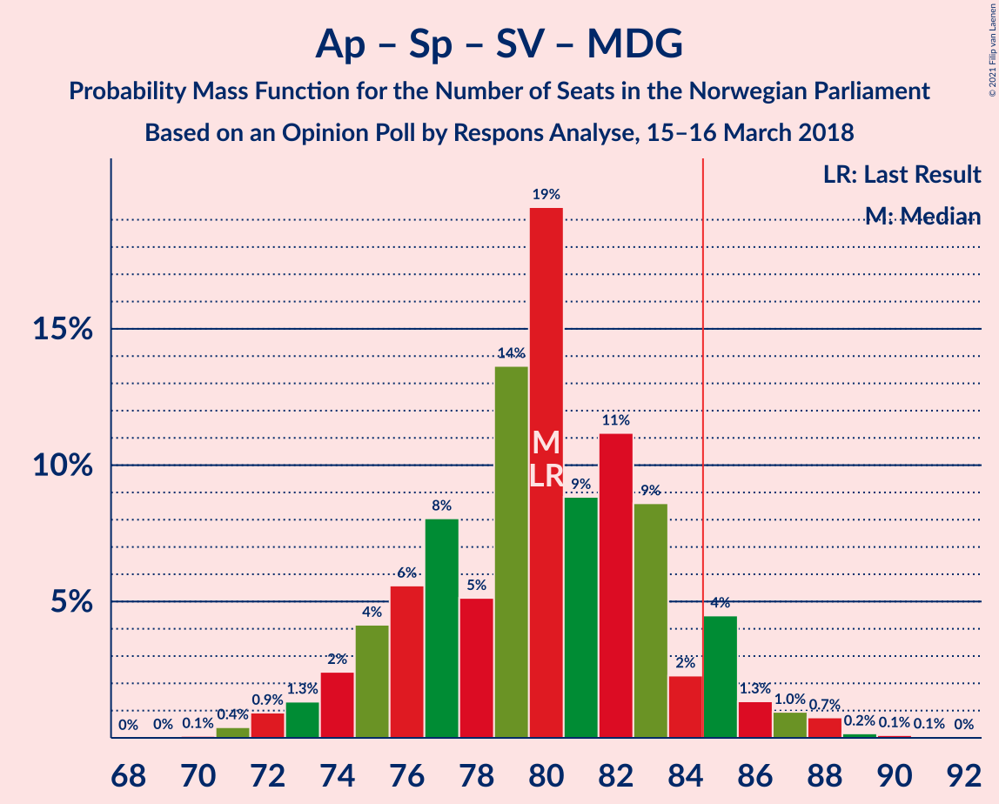

# Opinion Poll by Respons Analyse, 15–16 March 2018

<a href="#voting-intentions">Voting Intentions</a> | <a href="#seats">Seats</a> | <a href="#coalitions">Coalitions</a> | <a href="#technical-information">Technical Information</a>

## Voting Intentions

### Confidence Intervals

| Party | Last Result | Poll Result | 80% Confidence Interval | 90% Confidence Interval | 95% Confidence Interval | 99% Confidence Interval |
|:-----:|:-----------:|:-----------:|:-----------------------:|:-----------------------:|:-----------------------:|:-----------------------:|
| Høyre | 25.0% | 26.9% | 25.2–28.8% |24.7–29.3% |24.3–29.8% |23.5–30.7% |
| Arbeiderpartiet | 27.4% | 25.1% | 23.4–27.0% |23.0–27.5% |22.6–27.9% |21.8–28.8% |
| Fremskrittspartiet | 15.2% | 15.9% | 14.5–17.4% |14.1–17.9% |13.7–18.3% |13.1–19.0% |
| Senterpartiet | 10.3% | 10.8% | 9.6–12.1% |9.3–12.5% |9.0–12.9% |8.5–13.5% |
| Sosialistisk Venstreparti | 6.0% | 6.4% | 5.5–7.5% |5.2–7.8% |5.0–8.1% |4.6–8.6% |
| Venstre | 4.4% | 4.4% | 3.7–5.3% |3.5–5.6% |3.3–5.9% |3.0–6.3% |
| Kristelig Folkeparti | 4.2% | 3.2% | 2.6–4.0% |2.4–4.3% |2.3–4.5% |2.0–4.9% |
| Miljøpartiet De Grønne | 3.2% | 3.1% | 2.5–3.9% |2.3–4.2% |2.2–4.4% |1.9–4.8% |
| Rødt | 2.4% | 2.5% | 2.0–3.3% |1.8–3.5% |1.7–3.7% |1.5–4.1% |

*Note:* The poll result column reflects the actual value used in the calculations. Published results may vary slightly, and in addition be rounded to fewer digits.

## Seats

### Confidence Intervals

| Party | Last Result | Median | 80% Confidence Interval | 90% Confidence Interval | 95% Confidence Interval | 99% Confidence Interval |
|:-----:|:-----------:|:------:|:-----------------------:|:-----------------------:|:-----------------------:|:-----------------------:|
| <a href="#høyre">Høyre</a> | 45 | 48 | 46–54 |46–54 |44–54 |42–55 |
| <a href="#arbeiderpartiet">Arbeiderpartiet</a> | 49 | 45 | 43–49 |42–51 |41–51 |39–53 |
| <a href="#fremskrittspartiet">Fremskrittspartiet</a> | 27 | 30 | 26–32 |26–32 |25–34 |24–35 |
| <a href="#senterpartiet">Senterpartiet</a> | 19 | 20 | 17–22 |17–22 |16–23 |15–25 |
| <a href="#sosialistisk-venstreparti">Sosialistisk Venstreparti</a> | 11 | 12 | 10–14 |9–14 |9–15 |9–16 |
| <a href="#venstre">Venstre</a> | 8 | 8 | 3–9 |2–10 |2–11 |2–12 |
| <a href="#kristelig-folkeparti">Kristelig Folkeparti</a> | 8 | 3 | 1–3 |1–7 |0–8 |0–9 |
| <a href="#miljøpartiet-de-grønne">Miljøpartiet De Grønne</a> | 1 | 2 | 1–2 |1–8 |1–8 |1–9 |
| <a href="#rødt">Rødt</a> | 1 | 1 | 1–2 |1–2 |1–2 |1–2 |

### Høyre

*For a full overview of the results for this party, see the [Høyre](party-høyre.html) page.*

| Number of Seats | Probability | Accumulated | Special Marks |
|:---------------:|:-----------:|:-----------:|:-------------:|
| 40 | 0.1% | 100% |  |
| 41 | 0.1% | 99.9% |  |
| 42 | 0.9% | 99.8% |  |
| 43 | 0.6% | 98.9% |  |
| 44 | 0.8% | 98% |  |
| 45 | 2% | 97% | Last Result |
| 46 | 25% | 95% |  |
| 47 | 15% | 70% |  |
| 48 | 6% | 55% | Median |
| 49 | 14% | 49% |  |
| 50 | 2% | 35% |  |
| 51 | 14% | 33% |  |
| 52 | 4% | 20% |  |
| 53 | 2% | 16% |  |
| 54 | 12% | 14% |  |
| 55 | 1.3% | 2% |  |
| 56 | 0.2% | 0.4% |  |
| 57 | 0.1% | 0.2% |  |
| 58 | 0% | 0.1% |  |
| 59 | 0% | 0.1% |  |
| 60 | 0% | 0% |  |

### Arbeiderpartiet

*For a full overview of the results for this party, see the [Arbeiderpartiet](party-arbeiderpartiet.html) page.*

| Number of Seats | Probability | Accumulated | Special Marks |
|:---------------:|:-----------:|:-----------:|:-------------:|
| 38 | 0.1% | 100% |  |
| 39 | 1.3% | 99.9% |  |
| 40 | 0.9% | 98.5% |  |
| 41 | 0.8% | 98% |  |
| 42 | 3% | 97% |  |
| 43 | 22% | 94% |  |
| 44 | 16% | 71% |  |
| 45 | 7% | 56% | Median |
| 46 | 15% | 49% |  |
| 47 | 11% | 34% |  |
| 48 | 11% | 23% |  |
| 49 | 3% | 13% | Last Result |
| 50 | 4% | 9% |  |
| 51 | 4% | 6% |  |
| 52 | 1.1% | 2% |  |
| 53 | 0.6% | 0.8% |  |
| 54 | 0.1% | 0.2% |  |
| 55 | 0.1% | 0.1% |  |
| 56 | 0% | 0% |  |

### Fremskrittspartiet

*For a full overview of the results for this party, see the [Fremskrittspartiet](party-fremskrittspartiet.html) page.*

| Number of Seats | Probability | Accumulated | Special Marks |
|:---------------:|:-----------:|:-----------:|:-------------:|
| 23 | 0.1% | 100% |  |
| 24 | 1.3% | 99.8% |  |
| 25 | 3% | 98.5% |  |
| 26 | 14% | 95% |  |
| 27 | 7% | 82% | Last Result |
| 28 | 9% | 74% |  |
| 29 | 9% | 65% |  |
| 30 | 28% | 56% | Median |
| 31 | 17% | 28% |  |
| 32 | 7% | 11% |  |
| 33 | 0.9% | 4% |  |
| 34 | 1.1% | 3% |  |
| 35 | 2% | 2% |  |
| 36 | 0.4% | 0.4% |  |
| 37 | 0% | 0% |  |

### Senterpartiet

*For a full overview of the results for this party, see the [Senterpartiet](party-senterpartiet.html) page.*

| Number of Seats | Probability | Accumulated | Special Marks |
|:---------------:|:-----------:|:-----------:|:-------------:|
| 14 | 0.1% | 100% |  |
| 15 | 1.2% | 99.9% |  |
| 16 | 2% | 98.6% |  |
| 17 | 8% | 97% |  |
| 18 | 10% | 89% |  |
| 19 | 5% | 79% | Last Result |
| 20 | 24% | 74% | Median |
| 21 | 35% | 50% |  |
| 22 | 10% | 14% |  |
| 23 | 2% | 4% |  |
| 24 | 0.2% | 2% |  |
| 25 | 2% | 2% |  |
| 26 | 0.1% | 0.1% |  |
| 27 | 0% | 0% |  |

### Sosialistisk Venstreparti

*For a full overview of the results for this party, see the [Sosialistisk Venstreparti](party-sosialistiskvenstreparti.html) page.*

| Number of Seats | Probability | Accumulated | Special Marks |
|:---------------:|:-----------:|:-----------:|:-------------:|
| 8 | 0.4% | 100% |  |
| 9 | 8% | 99.6% |  |
| 10 | 20% | 92% |  |
| 11 | 19% | 72% | Last Result |
| 12 | 8% | 53% | Median |
| 13 | 26% | 45% |  |
| 14 | 15% | 20% |  |
| 15 | 4% | 5% |  |
| 16 | 0.8% | 1.0% |  |
| 17 | 0.1% | 0.2% |  |
| 18 | 0% | 0% |  |

### Venstre

*For a full overview of the results for this party, see the [Venstre](party-venstre.html) page.*

| Number of Seats | Probability | Accumulated | Special Marks |
|:---------------:|:-----------:|:-----------:|:-------------:|
| 2 | 8% | 100% |  |
| 3 | 13% | 92% |  |
| 4 | 0% | 79% |  |
| 5 | 0% | 79% |  |
| 6 | 0% | 79% |  |
| 7 | 6% | 79% |  |
| 8 | 24% | 73% | Last Result, Median |
| 9 | 40% | 50% |  |
| 10 | 5% | 9% |  |
| 11 | 3% | 4% |  |
| 12 | 0.8% | 0.8% |  |
| 13 | 0% | 0% |  |

### Kristelig Folkeparti

*For a full overview of the results for this party, see the [Kristelig Folkeparti](party-kristeligfolkeparti.html) page.*

| Number of Seats | Probability | Accumulated | Special Marks |
|:---------------:|:-----------:|:-----------:|:-------------:|
| 0 | 3% | 100% |  |
| 1 | 36% | 97% |  |
| 2 | 4% | 61% |  |
| 3 | 48% | 57% | Median |
| 4 | 0% | 8% |  |
| 5 | 0% | 8% |  |
| 6 | 0% | 8% |  |
| 7 | 4% | 8% |  |
| 8 | 3% | 4% | Last Result |
| 9 | 0.4% | 0.6% |  |
| 10 | 0.2% | 0.2% |  |
| 11 | 0% | 0% |  |

### Miljøpartiet De Grønne

*For a full overview of the results for this party, see the [Miljøpartiet De Grønne](party-miljøpartietdegrønne.html) page.*

| Number of Seats | Probability | Accumulated | Special Marks |
|:---------------:|:-----------:|:-----------:|:-------------:|
| 0 | 0.3% | 100% |  |
| 1 | 29% | 99.7% | Last Result |
| 2 | 61% | 70% | Median |
| 3 | 0.4% | 9% |  |
| 4 | 0% | 9% |  |
| 5 | 0% | 9% |  |
| 6 | 0% | 9% |  |
| 7 | 1.2% | 9% |  |
| 8 | 7% | 7% |  |
| 9 | 0.5% | 0.6% |  |
| 10 | 0% | 0% |  |

### Rødt

*For a full overview of the results for this party, see the [Rødt](party-rødt.html) page.*

| Number of Seats | Probability | Accumulated | Special Marks |
|:---------------:|:-----------:|:-----------:|:-------------:|
| 0 | 0.2% | 100% |  |
| 1 | 73% | 99.8% | Last Result, Median |
| 2 | 27% | 27% |  |
| 3 | 0% | 0.2% |  |
| 4 | 0% | 0.2% |  |
| 5 | 0% | 0.2% |  |
| 6 | 0% | 0.2% |  |
| 7 | 0.1% | 0.2% |  |
| 8 | 0.1% | 0.1% |  |
| 9 | 0% | 0% |  |

## Coalitions

### Confidence Intervals

| Coalition | Last Result | Median | Majority? | 80% Confidence Interval | 90% Confidence Interval | 95% Confidence Interval | 99% Confidence Interval |
|:---------:|:-----------:|:------:|:---------:|:-----------------------:|:-----------------------:|:-----------------------:|:-----------------------:|
| Høyre – Fremskrittspartiet – Senterpartiet – Venstre – Kristelig Folkeparti | 107 | 109 | 100% | 103–111 | 102–112 | 101–114 | 99–117 |
| Høyre – Fremskrittspartiet – Venstre – Kristelig Folkeparti – Miljøpartiet De Grønne | 89 | 90 | 94% | 87–94 | 84–96 | 83–96 | 82–98 |
| Høyre – Fremskrittspartiet – Venstre – Kristelig Folkeparti | 88 | 88 | 87% | 84–91 | 82–93 | 82–95 | 79–96 |
| Høyre – Fremskrittspartiet – Venstre | 80 | 86 | 71% | 81–89 | 80–90 | 79–92 | 76–95 |
| Arbeiderpartiet – Senterpartiet – Sosialistisk Venstreparti – Kristelig Folkeparti – Miljøpartiet De Grønne | 88 | 82 | 19% | 79–87 | 78–88 | 75–89 | 73–92 |
| Arbeiderpartiet – Senterpartiet – Sosialistisk Venstreparti – Miljøpartiet De Grønne – Rødt | 81 | 81 | 13% | 78–85 | 76–87 | 74–87 | 73–90 |
| Arbeiderpartiet – Senterpartiet – Sosialistisk Venstreparti – Miljøpartiet De Grønne | 80 | 79 | 7% | 76–84 | 74–85 | 73–86 | 72–88 |
| Arbeiderpartiet – Senterpartiet – Sosialistisk Venstreparti – Rødt | 80 | 79 | 6% | 75–82 | 73–85 | 73–86 | 71–87 |
| Arbeiderpartiet – Senterpartiet – Sosialistisk Venstreparti | 79 | 77 | 3% | 74–81 | 72–83 | 71–85 | 70–86 |
| Høyre – Fremskrittspartiet | 72 | 77 | 2% | 74–84 | 73–84 | 72–84 | 71–86 |
| Arbeiderpartiet – Senterpartiet – Kristelig Folkeparti – Miljøpartiet De Grønne | 77 | 69 | 0% | 67–75 | 66–77 | 64–77 | 63–80 |
| Arbeiderpartiet – Senterpartiet – Kristelig Folkeparti | 76 | 67 | 0% | 65–72 | 64–74 | 62–74 | 60–78 |
| Arbeiderpartiet – Senterpartiet | 68 | 65 | 0% | 63–70 | 62–71 | 60–71 | 59–74 |
| Høyre – Venstre – Kristelig Folkeparti | 61 | 58 | 0% | 56–63 | 54–65 | 52–66 | 49–66 |
| Arbeiderpartiet – Sosialistisk Venstreparti | 60 | 57 | 0% | 55–61 | 54–63 | 52–63 | 50–66 |
| Senterpartiet – Venstre – Kristelig Folkeparti | 35 | 31 | 0% | 25–33 | 25–34 | 23–35 | 20–38 |

### Høyre – Fremskrittspartiet – Senterpartiet – Venstre – Kristelig Folkeparti

| Number of Seats | Probability | Accumulated | Special Marks |
|:---------------:|:-----------:|:-----------:|:-------------:|
| 96 | 0% | 100% |  |
| 97 | 0.1% | 99.9% |  |
| 98 | 0.2% | 99.8% |  |
| 99 | 0.2% | 99.6% |  |
| 100 | 1.5% | 99.4% |  |
| 101 | 0.8% | 98% |  |
| 102 | 6% | 97% |  |
| 103 | 1.0% | 91% |  |
| 104 | 3% | 90% |  |
| 105 | 3% | 87% |  |
| 106 | 4% | 84% |  |
| 107 | 13% | 79% | Last Result |
| 108 | 4% | 66% |  |
| 109 | 34% | 62% | Median |
| 110 | 18% | 28% |  |
| 111 | 1.0% | 10% |  |
| 112 | 5% | 9% |  |
| 113 | 1.2% | 4% |  |
| 114 | 1.3% | 3% |  |
| 115 | 0.4% | 2% |  |
| 116 | 0.1% | 1.5% |  |
| 117 | 1.4% | 1.4% |  |
| 118 | 0% | 0% |  |

### Høyre – Fremskrittspartiet – Venstre – Kristelig Folkeparti – Miljøpartiet De Grønne

| Number of Seats | Probability | Accumulated | Special Marks |
|:---------------:|:-----------:|:-----------:|:-------------:|
| 79 | 0.1% | 100% |  |
| 80 | 0% | 99.9% |  |
| 81 | 0.1% | 99.9% |  |
| 82 | 0.8% | 99.8% |  |
| 83 | 2% | 98.9% |  |
| 84 | 3% | 97% |  |
| 85 | 0.6% | 94% | Majority |
| 86 | 4% | 94% |  |
| 87 | 2% | 90% |  |
| 88 | 9% | 88% |  |
| 89 | 9% | 79% | Last Result |
| 90 | 21% | 70% |  |
| 91 | 26% | 49% | Median |
| 92 | 10% | 23% |  |
| 93 | 3% | 14% |  |
| 94 | 3% | 10% |  |
| 95 | 2% | 7% |  |
| 96 | 3% | 5% |  |
| 97 | 2% | 2% |  |
| 98 | 0.2% | 0.5% |  |
| 99 | 0.1% | 0.3% |  |
| 100 | 0.2% | 0.2% |  |
| 101 | 0% | 0% |  |

### Høyre – Fremskrittspartiet – Venstre – Kristelig Folkeparti

| Number of Seats | Probability | Accumulated | Special Marks |
|:---------------:|:-----------:|:-----------:|:-------------:|
| 75 | 0.1% | 100% |  |
| 76 | 0% | 99.9% |  |
| 77 | 0.2% | 99.9% |  |
| 78 | 0.1% | 99.7% |  |
| 79 | 0% | 99.5% |  |
| 80 | 1.4% | 99.5% |  |
| 81 | 0.4% | 98% |  |
| 82 | 3% | 98% |  |
| 83 | 2% | 94% |  |
| 84 | 6% | 93% |  |
| 85 | 5% | 87% | Majority |
| 86 | 7% | 82% |  |
| 87 | 11% | 75% |  |
| 88 | 15% | 64% | Last Result |
| 89 | 30% | 50% | Median |
| 90 | 6% | 20% |  |
| 91 | 4% | 14% |  |
| 92 | 2% | 10% |  |
| 93 | 3% | 8% |  |
| 94 | 2% | 5% |  |
| 95 | 0.7% | 3% |  |
| 96 | 2% | 2% |  |
| 97 | 0% | 0.2% |  |
| 98 | 0.2% | 0.2% |  |
| 99 | 0% | 0% |  |

### Høyre – Fremskrittspartiet – Venstre

| Number of Seats | Probability | Accumulated | Special Marks |
|:---------------:|:-----------:|:-----------:|:-------------:|
| 74 | 0.1% | 100% |  |
| 75 | 0.3% | 99.9% |  |
| 76 | 0.6% | 99.6% |  |
| 77 | 0.1% | 99.1% |  |
| 78 | 0.4% | 98.9% |  |
| 79 | 3% | 98.6% |  |
| 80 | 1.4% | 95% | Last Result |
| 81 | 7% | 94% |  |
| 82 | 4% | 87% |  |
| 83 | 5% | 84% |  |
| 84 | 8% | 79% |  |
| 85 | 8% | 71% | Majority |
| 86 | 30% | 63% | Median |
| 87 | 17% | 33% |  |
| 88 | 5% | 16% |  |
| 89 | 4% | 11% |  |
| 90 | 2% | 7% |  |
| 91 | 0.4% | 4% |  |
| 92 | 1.4% | 4% |  |
| 93 | 0.4% | 2% |  |
| 94 | 2% | 2% |  |
| 95 | 0.5% | 0.5% |  |
| 96 | 0% | 0% |  |

### Arbeiderpartiet – Senterpartiet – Sosialistisk Venstreparti – Kristelig Folkeparti – Miljøpartiet De Grønne

| Number of Seats | Probability | Accumulated | Special Marks |
|:---------------:|:-----------:|:-----------:|:-------------:|
| 72 | 0% | 100% |  |
| 73 | 0.5% | 99.9% |  |
| 74 | 2% | 99.4% |  |
| 75 | 0.6% | 98% |  |
| 76 | 1.1% | 97% |  |
| 77 | 0.5% | 96% |  |
| 78 | 3% | 96% |  |
| 79 | 8% | 93% |  |
| 80 | 2% | 85% |  |
| 81 | 20% | 84% |  |
| 82 | 32% | 63% | Median |
| 83 | 9% | 31% |  |
| 84 | 3% | 22% |  |
| 85 | 3% | 19% | Majority |
| 86 | 5% | 16% |  |
| 87 | 5% | 11% |  |
| 88 | 1.0% | 5% | Last Result |
| 89 | 3% | 4% |  |
| 90 | 0.2% | 1.3% |  |
| 91 | 0.1% | 1.0% |  |
| 92 | 0.8% | 0.9% |  |
| 93 | 0.1% | 0.1% |  |
| 94 | 0% | 0% |  |

### Arbeiderpartiet – Senterpartiet – Sosialistisk Venstreparti – Miljøpartiet De Grønne – Rødt

| Number of Seats | Probability | Accumulated | Special Marks |
|:---------------:|:-----------:|:-----------:|:-------------:|
| 71 | 0.2% | 100% |  |
| 72 | 0% | 99.8% |  |
| 73 | 2% | 99.8% |  |
| 74 | 0.7% | 98% |  |
| 75 | 2% | 97% |  |
| 76 | 3% | 95% |  |
| 77 | 2% | 92% |  |
| 78 | 4% | 90% |  |
| 79 | 6% | 86% |  |
| 80 | 30% | 80% | Median |
| 81 | 15% | 50% | Last Result |
| 82 | 11% | 36% |  |
| 83 | 7% | 25% |  |
| 84 | 5% | 18% |  |
| 85 | 6% | 13% | Majority |
| 86 | 2% | 7% |  |
| 87 | 3% | 6% |  |
| 88 | 0.4% | 2% |  |
| 89 | 1.4% | 2% |  |
| 90 | 0% | 0.5% |  |
| 91 | 0.1% | 0.5% |  |
| 92 | 0.2% | 0.3% |  |
| 93 | 0% | 0.1% |  |
| 94 | 0.1% | 0.1% |  |
| 95 | 0% | 0% |  |

### Arbeiderpartiet – Senterpartiet – Sosialistisk Venstreparti – Miljøpartiet De Grønne

| Number of Seats | Probability | Accumulated | Special Marks |
|:---------------:|:-----------:|:-----------:|:-------------:|
| 70 | 0.2% | 100% |  |
| 71 | 0.1% | 99.8% |  |
| 72 | 2% | 99.7% |  |
| 73 | 0.7% | 98% |  |
| 74 | 2% | 97% |  |
| 75 | 4% | 95% |  |
| 76 | 2% | 91% |  |
| 77 | 5% | 89% |  |
| 78 | 9% | 84% |  |
| 79 | 26% | 75% | Median |
| 80 | 22% | 49% | Last Result |
| 81 | 8% | 27% |  |
| 82 | 2% | 19% |  |
| 83 | 4% | 17% |  |
| 84 | 6% | 13% |  |
| 85 | 3% | 7% | Majority |
| 86 | 2% | 4% |  |
| 87 | 0.3% | 2% |  |
| 88 | 1.3% | 2% |  |
| 89 | 0.1% | 0.5% |  |
| 90 | 0.1% | 0.4% |  |
| 91 | 0.2% | 0.3% |  |
| 92 | 0.1% | 0.1% |  |
| 93 | 0% | 0% |  |

### Arbeiderpartiet – Senterpartiet – Sosialistisk Venstreparti – Rødt

| Number of Seats | Probability | Accumulated | Special Marks |
|:---------------:|:-----------:|:-----------:|:-------------:|
| 69 | 0.2% | 100% |  |
| 70 | 0.1% | 99.8% |  |
| 71 | 0.2% | 99.7% |  |
| 72 | 2% | 99.5% |  |
| 73 | 3% | 98% |  |
| 74 | 2% | 95% |  |
| 75 | 3% | 93% |  |
| 76 | 3% | 90% |  |
| 77 | 10% | 86% |  |
| 78 | 26% | 77% | Median |
| 79 | 21% | 51% |  |
| 80 | 9% | 30% | Last Result |
| 81 | 9% | 21% |  |
| 82 | 2% | 12% |  |
| 83 | 4% | 10% |  |
| 84 | 0.6% | 6% |  |
| 85 | 3% | 6% | Majority |
| 86 | 2% | 3% |  |
| 87 | 0.8% | 1.1% |  |
| 88 | 0.1% | 0.2% |  |
| 89 | 0% | 0.1% |  |
| 90 | 0.1% | 0.1% |  |
| 91 | 0% | 0% |  |

### Arbeiderpartiet – Senterpartiet – Sosialistisk Venstreparti

| Number of Seats | Probability | Accumulated | Special Marks |
|:---------------:|:-----------:|:-----------:|:-------------:|
| 68 | 0.2% | 100% |  |
| 69 | 0.1% | 99.8% |  |
| 70 | 0.3% | 99.7% |  |
| 71 | 2% | 99.4% |  |
| 72 | 3% | 97% |  |
| 73 | 2% | 94% |  |
| 74 | 3% | 92% |  |
| 75 | 5% | 89% |  |
| 76 | 9% | 84% |  |
| 77 | 29% | 75% | Median |
| 78 | 25% | 46% |  |
| 79 | 7% | 22% | Last Result |
| 80 | 4% | 15% |  |
| 81 | 2% | 11% |  |
| 82 | 3% | 9% |  |
| 83 | 2% | 6% |  |
| 84 | 1.1% | 4% |  |
| 85 | 2% | 3% | Majority |
| 86 | 0.7% | 0.9% |  |
| 87 | 0% | 0.1% |  |
| 88 | 0% | 0.1% |  |
| 89 | 0.1% | 0.1% |  |
| 90 | 0% | 0% |  |

### Høyre – Fremskrittspartiet

| Number of Seats | Probability | Accumulated | Special Marks |
|:---------------:|:-----------:|:-----------:|:-------------:|
| 67 | 0.1% | 100% |  |
| 68 | 0.1% | 99.9% |  |
| 69 | 0.2% | 99.9% |  |
| 70 | 0.2% | 99.7% |  |
| 71 | 0.3% | 99.5% |  |
| 72 | 3% | 99.2% | Last Result |
| 73 | 3% | 96% |  |
| 74 | 7% | 93% |  |
| 75 | 3% | 86% |  |
| 76 | 14% | 83% |  |
| 77 | 29% | 69% |  |
| 78 | 8% | 40% | Median |
| 79 | 4% | 32% |  |
| 80 | 5% | 28% |  |
| 81 | 6% | 23% |  |
| 82 | 1.1% | 18% |  |
| 83 | 2% | 17% |  |
| 84 | 13% | 15% |  |
| 85 | 2% | 2% | Majority |
| 86 | 0.2% | 0.6% |  |
| 87 | 0.3% | 0.4% |  |
| 88 | 0% | 0.1% |  |
| 89 | 0% | 0% |  |

### Arbeiderpartiet – Senterpartiet – Kristelig Folkeparti – Miljøpartiet De Grønne

| Number of Seats | Probability | Accumulated | Special Marks |
|:---------------:|:-----------:|:-----------:|:-------------:|
| 61 | 0.2% | 100% |  |
| 62 | 0.2% | 99.8% |  |
| 63 | 2% | 99.5% |  |
| 64 | 1.0% | 98% |  |
| 65 | 0.2% | 97% |  |
| 66 | 5% | 96% |  |
| 67 | 2% | 91% |  |
| 68 | 28% | 90% |  |
| 69 | 14% | 62% |  |
| 70 | 4% | 48% | Median |
| 71 | 9% | 44% |  |
| 72 | 4% | 35% |  |
| 73 | 16% | 30% |  |
| 74 | 1.1% | 15% |  |
| 75 | 6% | 14% |  |
| 76 | 1.3% | 7% |  |
| 77 | 4% | 6% | Last Result |
| 78 | 0.3% | 2% |  |
| 79 | 0.7% | 1.4% |  |
| 80 | 0.2% | 0.7% |  |
| 81 | 0.4% | 0.5% |  |
| 82 | 0.1% | 0.1% |  |
| 83 | 0% | 0% |  |

### Arbeiderpartiet – Senterpartiet – Kristelig Folkeparti

| Number of Seats | Probability | Accumulated | Special Marks |
|:---------------:|:-----------:|:-----------:|:-------------:|
| 60 | 0.5% | 100% |  |
| 61 | 0.2% | 99.5% |  |
| 62 | 2% | 99.3% |  |
| 63 | 1.0% | 97% |  |
| 64 | 3% | 96% |  |
| 65 | 3% | 93% |  |
| 66 | 26% | 90% |  |
| 67 | 16% | 64% |  |
| 68 | 6% | 49% | Median |
| 69 | 14% | 43% |  |
| 70 | 4% | 29% |  |
| 71 | 13% | 24% |  |
| 72 | 4% | 11% |  |
| 73 | 0.6% | 7% |  |
| 74 | 4% | 6% |  |
| 75 | 1.0% | 2% |  |
| 76 | 0.1% | 1.0% | Last Result |
| 77 | 0.1% | 0.9% |  |
| 78 | 0.6% | 0.8% |  |
| 79 | 0.1% | 0.2% |  |
| 80 | 0% | 0% |  |

### Arbeiderpartiet – Senterpartiet

| Number of Seats | Probability | Accumulated | Special Marks |
|:---------------:|:-----------:|:-----------:|:-------------:|
| 57 | 0.1% | 100% |  |
| 58 | 0.4% | 99.9% |  |
| 59 | 0.8% | 99.6% |  |
| 60 | 2% | 98.8% |  |
| 61 | 0.9% | 96% |  |
| 62 | 3% | 96% |  |
| 63 | 20% | 93% |  |
| 64 | 13% | 73% |  |
| 65 | 14% | 60% | Median |
| 66 | 12% | 46% |  |
| 67 | 6% | 34% |  |
| 68 | 15% | 29% | Last Result |
| 69 | 4% | 14% |  |
| 70 | 4% | 10% |  |
| 71 | 5% | 7% |  |
| 72 | 0.3% | 2% |  |
| 73 | 0.3% | 1.4% |  |
| 74 | 0.8% | 1.1% |  |
| 75 | 0.1% | 0.3% |  |
| 76 | 0.1% | 0.2% |  |
| 77 | 0% | 0% |  |

### Høyre – Venstre – Kristelig Folkeparti

| Number of Seats | Probability | Accumulated | Special Marks |
|:---------------:|:-----------:|:-----------:|:-------------:|
| 48 | 0.3% | 100% |  |
| 49 | 0.3% | 99.7% |  |
| 50 | 0.8% | 99.3% |  |
| 51 | 0.6% | 98.6% |  |
| 52 | 2% | 98% |  |
| 53 | 0.5% | 96% |  |
| 54 | 0.9% | 96% |  |
| 55 | 4% | 95% |  |
| 56 | 16% | 91% |  |
| 57 | 6% | 75% |  |
| 58 | 30% | 69% |  |
| 59 | 5% | 40% | Median |
| 60 | 7% | 34% |  |
| 61 | 3% | 27% | Last Result |
| 62 | 5% | 25% |  |
| 63 | 11% | 20% |  |
| 64 | 4% | 9% |  |
| 65 | 2% | 5% |  |
| 66 | 3% | 3% |  |
| 67 | 0.1% | 0.5% |  |
| 68 | 0.3% | 0.4% |  |
| 69 | 0% | 0.1% |  |
| 70 | 0% | 0.1% |  |
| 71 | 0% | 0% |  |

### Arbeiderpartiet – Sosialistisk Venstreparti

| Number of Seats | Probability | Accumulated | Special Marks |
|:---------------:|:-----------:|:-----------:|:-------------:|
| 49 | 0.1% | 100% |  |
| 50 | 1.4% | 99.9% |  |
| 51 | 0.2% | 98% |  |
| 52 | 1.0% | 98% |  |
| 53 | 2% | 97% |  |
| 54 | 5% | 95% |  |
| 55 | 4% | 90% |  |
| 56 | 18% | 86% |  |
| 57 | 31% | 68% | Median |
| 58 | 13% | 36% |  |
| 59 | 7% | 23% |  |
| 60 | 6% | 17% | Last Result |
| 61 | 2% | 10% |  |
| 62 | 3% | 8% |  |
| 63 | 4% | 6% |  |
| 64 | 0.3% | 2% |  |
| 65 | 0.5% | 1.3% |  |
| 66 | 0.7% | 0.8% |  |
| 67 | 0% | 0.1% |  |
| 68 | 0.1% | 0.1% |  |
| 69 | 0% | 0% |  |

### Senterpartiet – Venstre – Kristelig Folkeparti

| Number of Seats | Probability | Accumulated | Special Marks |
|:---------------:|:-----------:|:-----------:|:-------------:|
| 18 | 0.2% | 100% |  |
| 19 | 0.1% | 99.8% |  |
| 20 | 0.3% | 99.8% |  |
| 21 | 0.6% | 99.5% |  |
| 22 | 0.3% | 98.8% |  |
| 23 | 2% | 98.5% |  |
| 24 | 1.2% | 97% |  |
| 25 | 12% | 96% |  |
| 26 | 2% | 84% |  |
| 27 | 4% | 82% |  |
| 28 | 9% | 78% |  |
| 29 | 6% | 69% |  |
| 30 | 12% | 63% |  |
| 31 | 5% | 51% | Median |
| 32 | 19% | 47% |  |
| 33 | 19% | 27% |  |
| 34 | 5% | 8% |  |
| 35 | 1.3% | 4% | Last Result |
| 36 | 0.3% | 2% |  |
| 37 | 0.5% | 2% |  |
| 38 | 2% | 2% |  |
| 39 | 0.1% | 0.2% |  |
| 40 | 0% | 0.1% |  |
| 41 | 0% | 0% |  |

## Technical Information

### Opinion Poll

+ **Polling firm:** Respons Analyse
+ **Commissioner(s):** —
+ **Fieldwork period:** 15–16 March 2018

### Calculations

+ **Sample size:** 1002
+ **Simulations done:** 131,072
+ **Error estimate:** 2.56%

