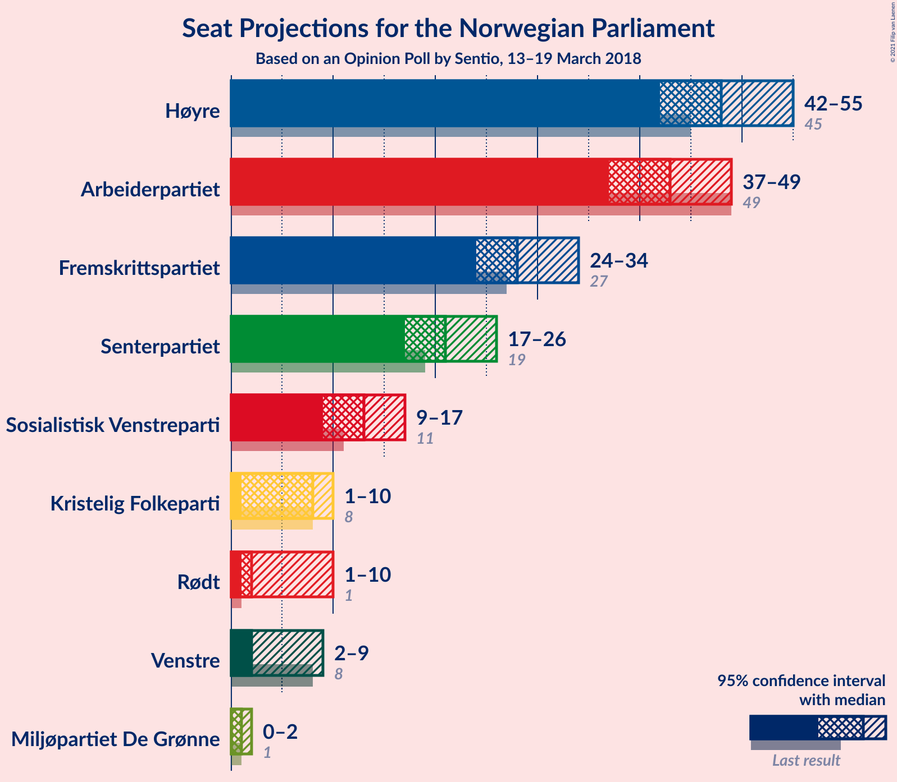
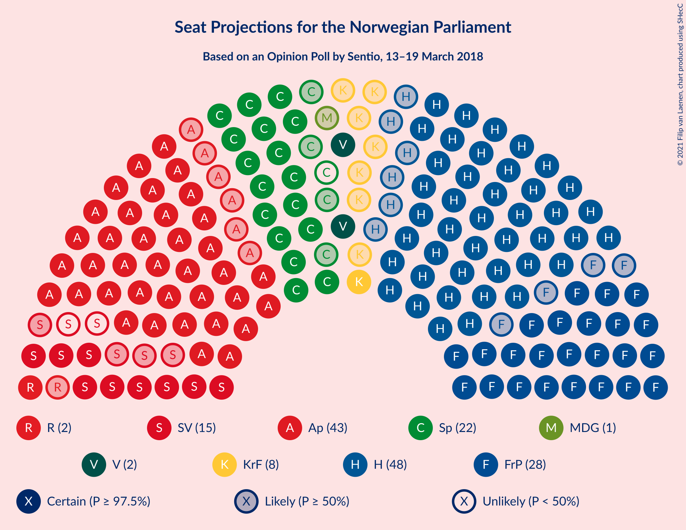
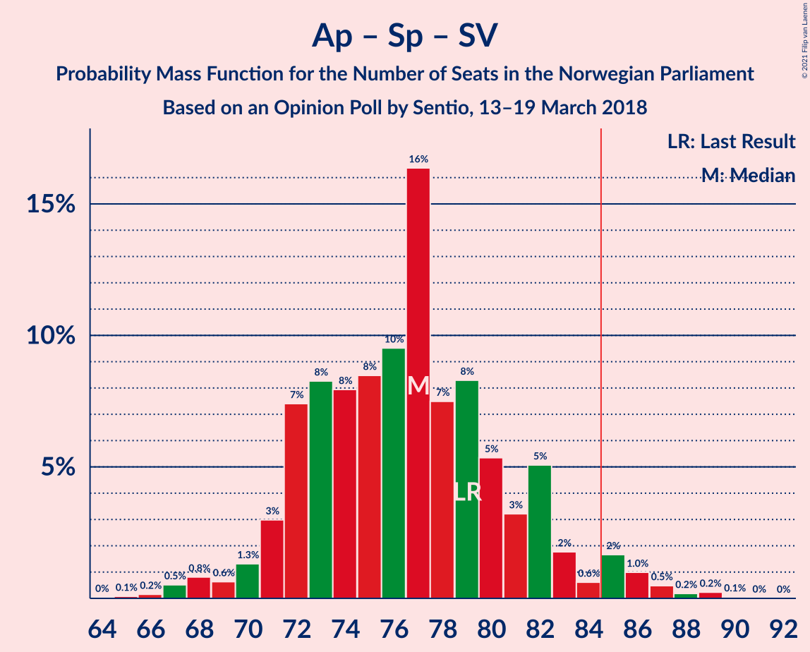
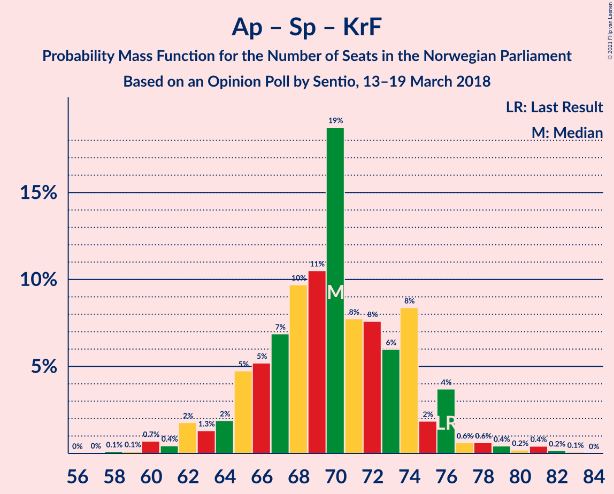
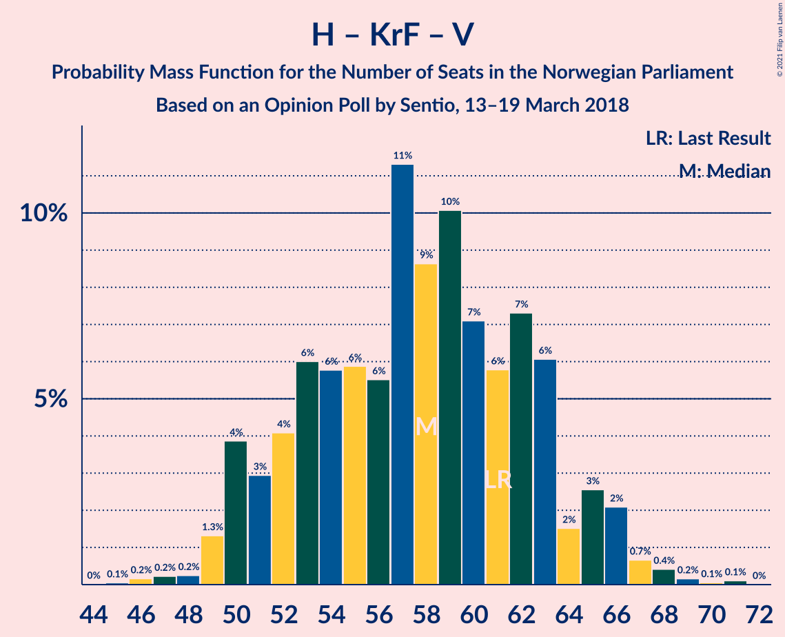

# Opinion Poll by Sentio, 13–19 March 2018

<a href="#voting-intentions">Voting Intentions</a> | <a href="#seats">Seats</a> | <a href="#coalitions">Coalitions</a> | <a href="#technical-information">Technical Information</a>

## Voting Intentions

### Confidence Intervals

| Party | Last Result | Poll Result | 80% Confidence Interval | 90% Confidence Interval | 95% Confidence Interval | 99% Confidence Interval |
|:-----:|:-----------:|:-----------:|:-----------------------:|:-----------------------:|:-----------------------:|:-----------------------:|
| Høyre | 25.0% | 26.6% | 24.6–28.8% |24.0–29.5% |23.5–30.0% |22.5–31.1% |
| Arbeiderpartiet | 27.4% | 23.2% | 21.3–25.4% |20.7–26.0% |20.3–26.5% |19.4–27.5% |
| Fremskrittspartiet | 15.2% | 15.8% | 14.1–17.6% |13.7–18.2% |13.3–18.7% |12.5–19.6% |
| Senterpartiet | 10.3% | 11.8% | 10.4–13.5% |10.0–14.0% |9.6–14.4% |9.0–15.3% |
| Sosialistisk Venstreparti | 6.0% | 7.0% | 5.9–8.4% |5.6–8.8% |5.4–9.2% |4.9–9.9% |
| Kristelig Folkeparti | 4.2% | 4.1% | 3.3–5.2% |3.0–5.5% |2.9–5.8% |2.5–6.4% |
| Rødt | 2.4% | 3.9% | 3.2–5.1% |2.9–5.4% |2.7–5.7% |2.4–6.2% |
| Venstre | 4.4% | 3.5% | 2.8–4.6% |2.6–4.9% |2.4–5.2% |2.1–5.7% |
| Miljøpartiet De Grønne | 3.2% | 2.5% | 1.9–3.5% |1.8–3.7% |1.6–4.0% |1.4–4.5% |

*Note:* The poll result column reflects the actual value used in the calculations. Published results may vary slightly, and in addition be rounded to fewer digits.

## Seats

### Confidence Intervals

| Party | Last Result | Median | 80% Confidence Interval | 90% Confidence Interval | 95% Confidence Interval | 99% Confidence Interval |
|:-----:|:-----------:|:------:|:-----------------------:|:-----------------------:|:-----------------------:|:-----------------------:|
| <a href="#høyre">Høyre</a> | 45 | 48 | 44–53 |43–55 |42–55 |40–55 |
| <a href="#arbeiderpartiet">Arbeiderpartiet</a> | 49 | 43 | 38–50 |38–50 |36–50 |34–51 |
| <a href="#fremskrittspartiet">Fremskrittspartiet</a> | 27 | 29 | 25–32 |24–33 |23–33 |22–36 |
| <a href="#senterpartiet">Senterpartiet</a> | 19 | 20 | 17–25 |17–28 |16–28 |16–29 |
| <a href="#sosialistisk-venstreparti">Sosialistisk Venstreparti</a> | 11 | 12 | 11–15 |11–18 |10–18 |9–18 |
| <a href="#kristelig-folkeparti">Kristelig Folkeparti</a> | 8 | 3 | 3–9 |2–10 |1–10 |1–11 |
| <a href="#rødt">Rødt</a> | 1 | 2 | 2–9 |1–10 |1–10 |1–11 |
| <a href="#venstre">Venstre</a> | 8 | 2 | 2–9 |2–9 |2–9 |1–10 |
| <a href="#miljøpartiet-de-grønne">Miljøpartiet De Grønne</a> | 1 | 1 | 1–2 |0–2 |0–7 |0–8 |

### Høyre

*For a full overview of the results for this party, see the [Høyre](party-høyre.html) page.*

| Number of Seats | Probability | Accumulated | Special Marks |
|:---------------:|:-----------:|:-----------:|:-------------:|
| 36 | 0.1% | 100% |  |
| 37 | 0% | 99.9% |  |
| 38 | 0.1% | 99.9% |  |
| 39 | 0.2% | 99.8% |  |
| 40 | 0.3% | 99.6% |  |
| 41 | 2% | 99.4% |  |
| 42 | 3% | 98% |  |
| 43 | 4% | 95% |  |
| 44 | 8% | 91% |  |
| 45 | 11% | 83% | Last Result |
| 46 | 13% | 72% |  |
| 47 | 3% | 59% |  |
| 48 | 9% | 57% | Median |
| 49 | 9% | 47% |  |
| 50 | 10% | 39% |  |
| 51 | 11% | 28% |  |
| 52 | 1.3% | 17% |  |
| 53 | 6% | 16% |  |
| 54 | 0.4% | 10% |  |
| 55 | 9% | 10% |  |
| 56 | 0.1% | 0.4% |  |
| 57 | 0% | 0.3% |  |
| 58 | 0.1% | 0.2% |  |
| 59 | 0% | 0.1% |  |
| 60 | 0.1% | 0.1% |  |
| 61 | 0% | 0% |  |

### Arbeiderpartiet

*For a full overview of the results for this party, see the [Arbeiderpartiet](party-arbeiderpartiet.html) page.*

| Number of Seats | Probability | Accumulated | Special Marks |
|:---------------:|:-----------:|:-----------:|:-------------:|
| 32 | 0% | 100% |  |
| 33 | 0.1% | 99.9% |  |
| 34 | 2% | 99.8% |  |
| 35 | 0.3% | 98% |  |
| 36 | 2% | 98% |  |
| 37 | 0.7% | 96% |  |
| 38 | 5% | 95% |  |
| 39 | 6% | 90% |  |
| 40 | 9% | 84% |  |
| 41 | 8% | 75% |  |
| 42 | 7% | 67% |  |
| 43 | 25% | 60% | Median |
| 44 | 8% | 35% |  |
| 45 | 7% | 27% |  |
| 46 | 3% | 20% |  |
| 47 | 4% | 17% |  |
| 48 | 0.5% | 13% |  |
| 49 | 0.3% | 13% | Last Result |
| 50 | 11% | 12% |  |
| 51 | 1.1% | 1.2% |  |
| 52 | 0% | 0.1% |  |
| 53 | 0.1% | 0.1% |  |
| 54 | 0% | 0% |  |

### Fremskrittspartiet

*For a full overview of the results for this party, see the [Fremskrittspartiet](party-fremskrittspartiet.html) page.*

| Number of Seats | Probability | Accumulated | Special Marks |
|:---------------:|:-----------:|:-----------:|:-------------:|
| 20 | 0.1% | 100% |  |
| 21 | 0.2% | 99.9% |  |
| 22 | 0.6% | 99.8% |  |
| 23 | 2% | 99.2% |  |
| 24 | 4% | 97% |  |
| 25 | 12% | 93% |  |
| 26 | 4% | 81% |  |
| 27 | 16% | 77% | Last Result |
| 28 | 10% | 61% |  |
| 29 | 7% | 50% | Median |
| 30 | 18% | 43% |  |
| 31 | 9% | 25% |  |
| 32 | 9% | 16% |  |
| 33 | 5% | 7% |  |
| 34 | 0.8% | 2% |  |
| 35 | 0.9% | 1.4% |  |
| 36 | 0.3% | 0.5% |  |
| 37 | 0.1% | 0.2% |  |
| 38 | 0.1% | 0.1% |  |
| 39 | 0% | 0% |  |

### Senterpartiet

*For a full overview of the results for this party, see the [Senterpartiet](party-senterpartiet.html) page.*

| Number of Seats | Probability | Accumulated | Special Marks |
|:---------------:|:-----------:|:-----------:|:-------------:|
| 15 | 0.1% | 100% |  |
| 16 | 4% | 99.8% |  |
| 17 | 12% | 96% |  |
| 18 | 7% | 84% |  |
| 19 | 10% | 77% | Last Result |
| 20 | 18% | 67% | Median |
| 21 | 9% | 49% |  |
| 22 | 6% | 40% |  |
| 23 | 18% | 34% |  |
| 24 | 4% | 16% |  |
| 25 | 3% | 12% |  |
| 26 | 2% | 9% |  |
| 27 | 1.3% | 8% |  |
| 28 | 6% | 7% |  |
| 29 | 0.6% | 0.6% |  |
| 30 | 0.1% | 0.1% |  |
| 31 | 0% | 0% |  |

### Sosialistisk Venstreparti

*For a full overview of the results for this party, see the [Sosialistisk Venstreparti](party-sosialistiskvenstreparti.html) page.*

| Number of Seats | Probability | Accumulated | Special Marks |
|:---------------:|:-----------:|:-----------:|:-------------:|
| 8 | 0.1% | 100% |  |
| 9 | 1.4% | 99.9% |  |
| 10 | 3% | 98% |  |
| 11 | 24% | 96% | Last Result |
| 12 | 25% | 72% | Median |
| 13 | 18% | 47% |  |
| 14 | 9% | 29% |  |
| 15 | 11% | 20% |  |
| 16 | 3% | 9% |  |
| 17 | 0.5% | 6% |  |
| 18 | 5% | 5% |  |
| 19 | 0.1% | 0.1% |  |
| 20 | 0% | 0% |  |

### Kristelig Folkeparti

*For a full overview of the results for this party, see the [Kristelig Folkeparti](party-kristeligfolkeparti.html) page.*

| Number of Seats | Probability | Accumulated | Special Marks |
|:---------------:|:-----------:|:-----------:|:-------------:|
| 0 | 0.2% | 100% |  |
| 1 | 4% | 99.8% |  |
| 2 | 2% | 96% |  |
| 3 | 44% | 94% | Median |
| 4 | 0% | 50% |  |
| 5 | 0% | 50% |  |
| 6 | 0% | 50% |  |
| 7 | 7% | 50% |  |
| 8 | 15% | 42% | Last Result |
| 9 | 21% | 27% |  |
| 10 | 3% | 5% |  |
| 11 | 2% | 2% |  |
| 12 | 0.1% | 0.2% |  |
| 13 | 0% | 0.1% |  |
| 14 | 0% | 0% |  |

### Rødt

*For a full overview of the results for this party, see the [Rødt](party-rødt.html) page.*

| Number of Seats | Probability | Accumulated | Special Marks |
|:---------------:|:-----------:|:-----------:|:-------------:|
| 1 | 5% | 100% | Last Result |
| 2 | 55% | 95% | Median |
| 3 | 0% | 40% |  |
| 4 | 0% | 40% |  |
| 5 | 0% | 40% |  |
| 6 | 0% | 40% |  |
| 7 | 10% | 40% |  |
| 8 | 15% | 30% |  |
| 9 | 10% | 15% |  |
| 10 | 4% | 5% |  |
| 11 | 1.2% | 2% |  |
| 12 | 0.2% | 0.3% |  |
| 13 | 0.1% | 0.1% |  |
| 14 | 0% | 0% |  |

### Venstre

*For a full overview of the results for this party, see the [Venstre](party-venstre.html) page.*

| Number of Seats | Probability | Accumulated | Special Marks |
|:---------------:|:-----------:|:-----------:|:-------------:|
| 0 | 0.1% | 100% |  |
| 1 | 2% | 99.9% |  |
| 2 | 63% | 98% | Median |
| 3 | 2% | 34% |  |
| 4 | 0% | 32% |  |
| 5 | 0% | 32% |  |
| 6 | 0% | 32% |  |
| 7 | 9% | 32% |  |
| 8 | 11% | 23% | Last Result |
| 9 | 10% | 12% |  |
| 10 | 2% | 2% |  |
| 11 | 0.2% | 0.2% |  |
| 12 | 0% | 0% |  |

### Miljøpartiet De Grønne

*For a full overview of the results for this party, see the [Miljøpartiet De Grønne](party-miljøpartietdegrønne.html) page.*

| Number of Seats | Probability | Accumulated | Special Marks |
|:---------------:|:-----------:|:-----------:|:-------------:|
| 0 | 9% | 100% |  |
| 1 | 71% | 91% | Last Result, Median |
| 2 | 16% | 19% |  |
| 3 | 0.2% | 4% |  |
| 4 | 0% | 4% |  |
| 5 | 0% | 3% |  |
| 6 | 0% | 3% |  |
| 7 | 1.0% | 3% |  |
| 8 | 2% | 2% |  |
| 9 | 0.3% | 0.3% |  |
| 10 | 0% | 0% |  |

## Coalitions

### Confidence Intervals

| Coalition | Last Result | Median | Majority? | 80% Confidence Interval | 90% Confidence Interval | 95% Confidence Interval | 99% Confidence Interval |
|:---------:|:-----------:|:------:|:---------:|:-----------------------:|:-----------------------:|:-----------------------:|:-----------------------:|
| Høyre – Fremskrittspartiet – Senterpartiet – Kristelig Folkeparti – Venstre | 107 | 107 | 100% | 102–112 | 102–114 | 100–116 | 98–118 |
| Høyre – Fremskrittspartiet – Kristelig Folkeparti – Venstre – Miljøpartiet De Grønne | 89 | 88 | 67% | 82–94 | 81–95 | 79–96 | 77–97 |
| Høyre – Fremskrittspartiet – Kristelig Folkeparti – Venstre | 88 | 86 | 64% | 81–92 | 80–94 | 78–94 | 76–96 |
| Arbeiderpartiet – Senterpartiet – Sosialistisk Venstreparti – Kristelig Folkeparti – Miljøpartiet De Grønne | 88 | 83 | 36% | 78–89 | 78–91 | 76–92 | 74–95 |
| Arbeiderpartiet – Senterpartiet – Sosialistisk Venstreparti – Rødt – Miljøpartiet De Grønne | 81 | 83 | 36% | 77–88 | 75–89 | 75–91 | 73–93 |
| Arbeiderpartiet – Senterpartiet – Sosialistisk Venstreparti – Rødt | 80 | 81 | 33% | 75–87 | 74–88 | 73–90 | 72–92 |
| Høyre – Fremskrittspartiet – Venstre | 80 | 80 | 19% | 77–87 | 73–89 | 72–89 | 70–93 |
| Arbeiderpartiet – Senterpartiet – Sosialistisk Venstreparti – Miljøpartiet De Grønne | 80 | 77 | 14% | 72–86 | 71–86 | 71–87 | 69–88 |
| Høyre – Fremskrittspartiet | 72 | 76 | 8% | 71–82 | 70–87 | 68–87 | 67–87 |
| Arbeiderpartiet – Senterpartiet – Sosialistisk Venstreparti | 79 | 75 | 14% | 71–85 | 71–85 | 70–85 | 68–87 |
| Arbeiderpartiet – Senterpartiet – Kristelig Folkeparti – Miljøpartiet De Grønne | 77 | 69 | 0% | 66–77 | 64–77 | 63–79 | 61–82 |
| Arbeiderpartiet – Senterpartiet – Kristelig Folkeparti | 76 | 68 | 0% | 64–76 | 62–76 | 62–79 | 60–81 |
| Arbeiderpartiet – Senterpartiet | 68 | 63 | 0% | 59–73 | 58–73 | 57–73 | 56–74 |
| Høyre – Kristelig Folkeparti – Venstre | 61 | 58 | 0% | 51–64 | 51–66 | 49–67 | 47–71 |
| Arbeiderpartiet – Sosialistisk Venstreparti | 60 | 55 | 0% | 51–62 | 49–62 | 47–62 | 45–65 |
| Senterpartiet – Kristelig Folkeparti – Venstre | 35 | 31 | 0% | 25–36 | 24–38 | 24–39 | 21–41 |

### Høyre – Fremskrittspartiet – Senterpartiet – Kristelig Folkeparti – Venstre

| Number of Seats | Probability | Accumulated | Special Marks |
|:---------------:|:-----------:|:-----------:|:-------------:|
| 94 | 0.1% | 100% |  |
| 95 | 0.1% | 99.9% |  |
| 96 | 0.1% | 99.9% |  |
| 97 | 0.2% | 99.8% |  |
| 98 | 0.3% | 99.6% |  |
| 99 | 0.4% | 99.3% |  |
| 100 | 1.5% | 99.0% |  |
| 101 | 0.3% | 97% |  |
| 102 | 9% | 97% | Median |
| 103 | 7% | 89% |  |
| 104 | 12% | 81% |  |
| 105 | 8% | 69% |  |
| 106 | 9% | 61% |  |
| 107 | 4% | 51% | Last Result |
| 108 | 7% | 47% |  |
| 109 | 6% | 40% |  |
| 110 | 3% | 34% |  |
| 111 | 11% | 31% |  |
| 112 | 13% | 20% |  |
| 113 | 2% | 7% |  |
| 114 | 0.8% | 5% |  |
| 115 | 0.4% | 5% |  |
| 116 | 2% | 4% |  |
| 117 | 1.0% | 2% |  |
| 118 | 1.0% | 1.2% |  |
| 119 | 0.1% | 0.1% |  |
| 120 | 0% | 0% |  |

### Høyre – Fremskrittspartiet – Kristelig Folkeparti – Venstre – Miljøpartiet De Grønne

| Number of Seats | Probability | Accumulated | Special Marks |
|:---------------:|:-----------:|:-----------:|:-------------:|
| 74 | 0% | 100% |  |
| 75 | 0% | 99.9% |  |
| 76 | 0.2% | 99.9% |  |
| 77 | 0.3% | 99.8% |  |
| 78 | 0.5% | 99.5% |  |
| 79 | 2% | 99.0% |  |
| 80 | 1.0% | 97% |  |
| 81 | 3% | 96% |  |
| 82 | 13% | 93% |  |
| 83 | 3% | 80% | Median |
| 84 | 11% | 78% |  |
| 85 | 2% | 67% | Majority |
| 86 | 2% | 65% |  |
| 87 | 12% | 63% |  |
| 88 | 12% | 51% |  |
| 89 | 4% | 39% | Last Result |
| 90 | 2% | 34% |  |
| 91 | 5% | 32% |  |
| 92 | 3% | 27% |  |
| 93 | 12% | 24% |  |
| 94 | 4% | 12% |  |
| 95 | 4% | 8% |  |
| 96 | 3% | 4% |  |
| 97 | 1.1% | 1.2% |  |
| 98 | 0% | 0.1% |  |
| 99 | 0% | 0.1% |  |
| 100 | 0% | 0% |  |

### Høyre – Fremskrittspartiet – Kristelig Folkeparti – Venstre

| Number of Seats | Probability | Accumulated | Special Marks |
|:---------------:|:-----------:|:-----------:|:-------------:|
| 72 | 0% | 100% |  |
| 73 | 0% | 99.9% |  |
| 74 | 0% | 99.9% |  |
| 75 | 0.4% | 99.9% |  |
| 76 | 0.1% | 99.6% |  |
| 77 | 0.7% | 99.5% |  |
| 78 | 3% | 98.7% |  |
| 79 | 0.8% | 96% |  |
| 80 | 3% | 95% |  |
| 81 | 12% | 92% |  |
| 82 | 3% | 80% | Median |
| 83 | 12% | 77% |  |
| 84 | 1.3% | 65% |  |
| 85 | 2% | 64% | Majority |
| 86 | 19% | 62% |  |
| 87 | 5% | 44% |  |
| 88 | 7% | 39% | Last Result |
| 89 | 2% | 31% |  |
| 90 | 2% | 29% |  |
| 91 | 5% | 27% |  |
| 92 | 13% | 22% |  |
| 93 | 2% | 9% |  |
| 94 | 4% | 7% |  |
| 95 | 1.5% | 2% |  |
| 96 | 0.6% | 0.7% |  |
| 97 | 0% | 0.1% |  |
| 98 | 0% | 0.1% |  |
| 99 | 0% | 0% |  |

### Arbeiderpartiet – Senterpartiet – Sosialistisk Venstreparti – Kristelig Folkeparti – Miljøpartiet De Grønne

| Number of Seats | Probability | Accumulated | Special Marks |
|:---------------:|:-----------:|:-----------:|:-------------:|
| 73 | 0.3% | 100% |  |
| 74 | 0.7% | 99.7% |  |
| 75 | 1.4% | 98.9% |  |
| 76 | 0.4% | 98% |  |
| 77 | 1.1% | 97% |  |
| 78 | 11% | 96% |  |
| 79 | 0.4% | 85% | Median |
| 80 | 5% | 85% |  |
| 81 | 10% | 80% |  |
| 82 | 14% | 70% |  |
| 83 | 7% | 56% |  |
| 84 | 13% | 49% |  |
| 85 | 3% | 36% | Majority |
| 86 | 3% | 32% |  |
| 87 | 8% | 29% |  |
| 88 | 0.6% | 21% | Last Result |
| 89 | 13% | 21% |  |
| 90 | 0.5% | 8% |  |
| 91 | 4% | 7% |  |
| 92 | 0.8% | 3% |  |
| 93 | 0.2% | 2% |  |
| 94 | 1.3% | 2% |  |
| 95 | 0.9% | 1.0% |  |
| 96 | 0.1% | 0.1% |  |
| 97 | 0% | 0% |  |

### Arbeiderpartiet – Senterpartiet – Sosialistisk Venstreparti – Rødt – Miljøpartiet De Grønne

| Number of Seats | Probability | Accumulated | Special Marks |
|:---------------:|:-----------:|:-----------:|:-------------:|
| 71 | 0% | 100% |  |
| 72 | 0% | 99.9% |  |
| 73 | 0.6% | 99.9% |  |
| 74 | 1.5% | 99.3% |  |
| 75 | 4% | 98% |  |
| 76 | 2% | 93% |  |
| 77 | 13% | 91% |  |
| 78 | 5% | 78% | Median |
| 79 | 2% | 73% |  |
| 80 | 2% | 71% |  |
| 81 | 7% | 69% | Last Result |
| 82 | 5% | 61% |  |
| 83 | 19% | 56% |  |
| 84 | 2% | 38% |  |
| 85 | 1.3% | 36% | Majority |
| 86 | 12% | 35% |  |
| 87 | 3% | 23% |  |
| 88 | 12% | 20% |  |
| 89 | 3% | 8% |  |
| 90 | 0.8% | 5% |  |
| 91 | 3% | 4% |  |
| 92 | 0.7% | 1.3% |  |
| 93 | 0.1% | 0.5% |  |
| 94 | 0.4% | 0.4% |  |
| 95 | 0% | 0.1% |  |
| 96 | 0% | 0.1% |  |
| 97 | 0% | 0.1% |  |
| 98 | 0% | 0% |  |

### Arbeiderpartiet – Senterpartiet – Sosialistisk Venstreparti – Rødt

| Number of Seats | Probability | Accumulated | Special Marks |
|:---------------:|:-----------:|:-----------:|:-------------:|
| 70 | 0% | 100% |  |
| 71 | 0% | 99.9% |  |
| 72 | 1.1% | 99.9% |  |
| 73 | 3% | 98.8% |  |
| 74 | 4% | 96% |  |
| 75 | 4% | 92% |  |
| 76 | 12% | 88% |  |
| 77 | 3% | 76% | Median |
| 78 | 5% | 73% |  |
| 79 | 2% | 68% |  |
| 80 | 4% | 66% | Last Result |
| 81 | 12% | 61% |  |
| 82 | 12% | 49% |  |
| 83 | 2% | 37% |  |
| 84 | 2% | 35% |  |
| 85 | 11% | 33% | Majority |
| 86 | 3% | 22% |  |
| 87 | 13% | 20% |  |
| 88 | 3% | 7% |  |
| 89 | 1.0% | 4% |  |
| 90 | 2% | 3% |  |
| 91 | 0.5% | 1.0% |  |
| 92 | 0.3% | 0.5% |  |
| 93 | 0.2% | 0.2% |  |
| 94 | 0% | 0.1% |  |
| 95 | 0% | 0.1% |  |
| 96 | 0% | 0% |  |

### Høyre – Fremskrittspartiet – Venstre

| Number of Seats | Probability | Accumulated | Special Marks |
|:---------------:|:-----------:|:-----------:|:-------------:|
| 68 | 0.1% | 100% |  |
| 69 | 0.2% | 99.9% |  |
| 70 | 2% | 99.7% |  |
| 71 | 0.2% | 98% |  |
| 72 | 1.2% | 98% |  |
| 73 | 2% | 96% |  |
| 74 | 0.8% | 95% |  |
| 75 | 2% | 94% |  |
| 76 | 2% | 92% |  |
| 77 | 5% | 91% |  |
| 78 | 22% | 86% |  |
| 79 | 5% | 64% | Median |
| 80 | 17% | 59% | Last Result |
| 81 | 3% | 43% |  |
| 82 | 6% | 40% |  |
| 83 | 12% | 33% |  |
| 84 | 3% | 22% |  |
| 85 | 7% | 19% | Majority |
| 86 | 2% | 12% |  |
| 87 | 0.2% | 10% |  |
| 88 | 0.5% | 10% |  |
| 89 | 8% | 9% |  |
| 90 | 0.7% | 2% |  |
| 91 | 0.1% | 0.8% |  |
| 92 | 0.2% | 0.7% |  |
| 93 | 0.5% | 0.5% |  |
| 94 | 0% | 0% |  |

### Arbeiderpartiet – Senterpartiet – Sosialistisk Venstreparti – Miljøpartiet De Grønne

| Number of Seats | Probability | Accumulated | Special Marks |
|:---------------:|:-----------:|:-----------:|:-------------:|
| 66 | 0% | 100% |  |
| 67 | 0.1% | 99.9% |  |
| 68 | 0% | 99.8% |  |
| 69 | 2% | 99.8% |  |
| 70 | 0.3% | 98% |  |
| 71 | 4% | 98% |  |
| 72 | 4% | 93% |  |
| 73 | 11% | 90% |  |
| 74 | 8% | 78% |  |
| 75 | 14% | 71% |  |
| 76 | 4% | 57% | Median |
| 77 | 4% | 53% |  |
| 78 | 5% | 49% |  |
| 79 | 4% | 44% |  |
| 80 | 2% | 39% | Last Result |
| 81 | 10% | 38% |  |
| 82 | 4% | 28% |  |
| 83 | 2% | 24% |  |
| 84 | 7% | 22% |  |
| 85 | 0.8% | 14% | Majority |
| 86 | 11% | 14% |  |
| 87 | 2% | 3% |  |
| 88 | 0.5% | 0.9% |  |
| 89 | 0.1% | 0.5% |  |
| 90 | 0% | 0.4% |  |
| 91 | 0% | 0.4% |  |
| 92 | 0.3% | 0.3% |  |
| 93 | 0% | 0% |  |

### Høyre – Fremskrittspartiet

| Number of Seats | Probability | Accumulated | Special Marks |
|:---------------:|:-----------:|:-----------:|:-------------:|
| 65 | 0.1% | 100% |  |
| 66 | 0.3% | 99.9% |  |
| 67 | 0.4% | 99.6% |  |
| 68 | 3% | 99.2% |  |
| 69 | 0.8% | 97% |  |
| 70 | 2% | 96% |  |
| 71 | 5% | 93% |  |
| 72 | 3% | 89% | Last Result |
| 73 | 4% | 85% |  |
| 74 | 11% | 82% |  |
| 75 | 5% | 71% |  |
| 76 | 22% | 66% |  |
| 77 | 5% | 44% | Median |
| 78 | 15% | 38% |  |
| 79 | 3% | 23% |  |
| 80 | 2% | 20% |  |
| 81 | 6% | 18% |  |
| 82 | 2% | 12% |  |
| 83 | 0.4% | 10% |  |
| 84 | 1.2% | 10% |  |
| 85 | 0.4% | 8% | Majority |
| 86 | 0.1% | 8% |  |
| 87 | 8% | 8% |  |
| 88 | 0% | 0.1% |  |
| 89 | 0.1% | 0.1% |  |
| 90 | 0% | 0.1% |  |
| 91 | 0% | 0% |  |

### Arbeiderpartiet – Senterpartiet – Sosialistisk Venstreparti

| Number of Seats | Probability | Accumulated | Special Marks |
|:---------------:|:-----------:|:-----------:|:-------------:|
| 65 | 0% | 100% |  |
| 66 | 0.1% | 99.9% |  |
| 67 | 0.1% | 99.8% |  |
| 68 | 2% | 99.7% |  |
| 69 | 0.2% | 98% |  |
| 70 | 1.1% | 98% |  |
| 71 | 8% | 97% |  |
| 72 | 13% | 88% |  |
| 73 | 8% | 75% |  |
| 74 | 13% | 66% |  |
| 75 | 5% | 53% | Median |
| 76 | 3% | 48% |  |
| 77 | 4% | 45% |  |
| 78 | 3% | 41% |  |
| 79 | 4% | 38% | Last Result |
| 80 | 6% | 34% |  |
| 81 | 4% | 27% |  |
| 82 | 2% | 23% |  |
| 83 | 7% | 21% |  |
| 84 | 0.5% | 14% |  |
| 85 | 12% | 14% | Majority |
| 86 | 1.2% | 2% |  |
| 87 | 0.5% | 0.9% |  |
| 88 | 0% | 0.4% |  |
| 89 | 0% | 0.4% |  |
| 90 | 0.2% | 0.3% |  |
| 91 | 0.1% | 0.1% |  |
| 92 | 0% | 0% |  |

### Arbeiderpartiet – Senterpartiet – Kristelig Folkeparti – Miljøpartiet De Grønne

| Number of Seats | Probability | Accumulated | Special Marks |
|:---------------:|:-----------:|:-----------:|:-------------:|
| 59 | 0.1% | 100% |  |
| 60 | 0.2% | 99.9% |  |
| 61 | 0.7% | 99.7% |  |
| 62 | 0.7% | 99.0% |  |
| 63 | 3% | 98% |  |
| 64 | 1.4% | 95% |  |
| 65 | 1.2% | 94% |  |
| 66 | 3% | 93% |  |
| 67 | 13% | 90% | Median |
| 68 | 6% | 77% |  |
| 69 | 21% | 70% |  |
| 70 | 5% | 49% |  |
| 71 | 7% | 45% |  |
| 72 | 6% | 38% |  |
| 73 | 0.9% | 32% |  |
| 74 | 3% | 31% |  |
| 75 | 6% | 29% |  |
| 76 | 3% | 22% |  |
| 77 | 15% | 19% | Last Result |
| 78 | 0.9% | 5% |  |
| 79 | 1.4% | 4% |  |
| 80 | 0.5% | 2% |  |
| 81 | 0.3% | 2% |  |
| 82 | 2% | 2% |  |
| 83 | 0% | 0.1% |  |
| 84 | 0% | 0.1% |  |
| 85 | 0% | 0% | Majority |

### Arbeiderpartiet – Senterpartiet – Kristelig Folkeparti

| Number of Seats | Probability | Accumulated | Special Marks |
|:---------------:|:-----------:|:-----------:|:-------------:|
| 58 | 0.1% | 100% |  |
| 59 | 0.1% | 99.8% |  |
| 60 | 0.9% | 99.8% |  |
| 61 | 0.7% | 98.9% |  |
| 62 | 4% | 98% |  |
| 63 | 0.7% | 95% |  |
| 64 | 4% | 94% |  |
| 65 | 1.3% | 90% |  |
| 66 | 14% | 89% | Median |
| 67 | 7% | 75% |  |
| 68 | 19% | 67% |  |
| 69 | 7% | 49% |  |
| 70 | 9% | 42% |  |
| 71 | 3% | 33% |  |
| 72 | 3% | 30% |  |
| 73 | 0.6% | 27% |  |
| 74 | 7% | 26% |  |
| 75 | 0.6% | 20% |  |
| 76 | 15% | 19% | Last Result |
| 77 | 0.6% | 5% |  |
| 78 | 1.4% | 4% |  |
| 79 | 0.8% | 3% |  |
| 80 | 0.5% | 2% |  |
| 81 | 1.1% | 1.2% |  |
| 82 | 0% | 0.1% |  |
| 83 | 0% | 0% |  |

### Arbeiderpartiet – Senterpartiet

| Number of Seats | Probability | Accumulated | Special Marks |
|:---------------:|:-----------:|:-----------:|:-------------:|
| 53 | 0% | 100% |  |
| 54 | 0.1% | 99.9% |  |
| 55 | 0.2% | 99.8% |  |
| 56 | 0.4% | 99.7% |  |
| 57 | 3% | 99.2% |  |
| 58 | 3% | 97% |  |
| 59 | 13% | 94% |  |
| 60 | 15% | 81% |  |
| 61 | 11% | 66% |  |
| 62 | 2% | 55% |  |
| 63 | 13% | 53% | Median |
| 64 | 2% | 40% |  |
| 65 | 6% | 38% |  |
| 66 | 2% | 32% |  |
| 67 | 4% | 30% |  |
| 68 | 3% | 26% | Last Result |
| 69 | 0.8% | 22% |  |
| 70 | 2% | 21% |  |
| 71 | 6% | 19% |  |
| 72 | 0.6% | 13% |  |
| 73 | 11% | 12% |  |
| 74 | 1.1% | 2% |  |
| 75 | 0.3% | 0.4% |  |
| 76 | 0.1% | 0.1% |  |
| 77 | 0% | 0% |  |

### Høyre – Kristelig Folkeparti – Venstre

| Number of Seats | Probability | Accumulated | Special Marks |
|:---------------:|:-----------:|:-----------:|:-------------:|
| 45 | 0.1% | 100% |  |
| 46 | 0.1% | 99.9% |  |
| 47 | 0.5% | 99.9% |  |
| 48 | 0.1% | 99.4% |  |
| 49 | 2% | 99.3% |  |
| 50 | 1.2% | 97% |  |
| 51 | 12% | 96% |  |
| 52 | 0.5% | 85% |  |
| 53 | 3% | 84% | Median |
| 54 | 7% | 81% |  |
| 55 | 8% | 74% |  |
| 56 | 11% | 66% |  |
| 57 | 3% | 55% |  |
| 58 | 5% | 52% |  |
| 59 | 5% | 47% |  |
| 60 | 10% | 43% |  |
| 61 | 10% | 33% | Last Result |
| 62 | 7% | 24% |  |
| 63 | 6% | 17% |  |
| 64 | 3% | 10% |  |
| 65 | 1.5% | 7% |  |
| 66 | 1.1% | 6% |  |
| 67 | 3% | 5% |  |
| 68 | 0.2% | 1.1% |  |
| 69 | 0.1% | 0.9% |  |
| 70 | 0% | 0.8% |  |
| 71 | 0.8% | 0.8% |  |
| 72 | 0% | 0% |  |

### Arbeiderpartiet – Sosialistisk Venstreparti

| Number of Seats | Probability | Accumulated | Special Marks |
|:---------------:|:-----------:|:-----------:|:-------------:|
| 45 | 2% | 100% |  |
| 46 | 0.1% | 98% |  |
| 47 | 1.0% | 98% |  |
| 48 | 0.4% | 97% |  |
| 49 | 2% | 97% |  |
| 50 | 3% | 95% |  |
| 51 | 5% | 92% |  |
| 52 | 3% | 87% |  |
| 53 | 5% | 84% |  |
| 54 | 23% | 79% |  |
| 55 | 10% | 56% | Median |
| 56 | 4% | 45% |  |
| 57 | 10% | 42% |  |
| 58 | 7% | 32% |  |
| 59 | 2% | 25% |  |
| 60 | 9% | 23% | Last Result |
| 61 | 0.7% | 14% |  |
| 62 | 11% | 14% |  |
| 63 | 1.3% | 2% |  |
| 64 | 0.2% | 0.8% |  |
| 65 | 0.3% | 0.5% |  |
| 66 | 0.2% | 0.2% |  |
| 67 | 0% | 0% |  |

### Senterpartiet – Kristelig Folkeparti – Venstre

| Number of Seats | Probability | Accumulated | Special Marks |
|:---------------:|:-----------:|:-----------:|:-------------:|
| 20 | 0.1% | 100% |  |
| 21 | 0.5% | 99.8% |  |
| 22 | 0.8% | 99.3% |  |
| 23 | 0.4% | 98.6% |  |
| 24 | 5% | 98% |  |
| 25 | 9% | 93% | Median |
| 26 | 6% | 84% |  |
| 27 | 1.2% | 78% |  |
| 28 | 15% | 77% |  |
| 29 | 5% | 63% |  |
| 30 | 2% | 58% |  |
| 31 | 10% | 56% |  |
| 32 | 11% | 46% |  |
| 33 | 9% | 35% |  |
| 34 | 10% | 26% |  |
| 35 | 3% | 16% | Last Result |
| 36 | 5% | 13% |  |
| 37 | 1.3% | 8% |  |
| 38 | 3% | 7% |  |
| 39 | 2% | 4% |  |
| 40 | 1.3% | 2% |  |
| 41 | 0.1% | 0.5% |  |
| 42 | 0.3% | 0.4% |  |
| 43 | 0.1% | 0.2% |  |
| 44 | 0.1% | 0.1% |  |
| 45 | 0% | 0% |  |

## Technical Information

### Opinion Poll

+ **Polling firm:** Sentio
+ **Commissioner(s):** —
+ **Fieldwork period:** 13–19 March 2018

### Calculations

+ **Sample size:** 710
+ **Simulations done:** 131,072
+ **Error estimate:** 4.92%

