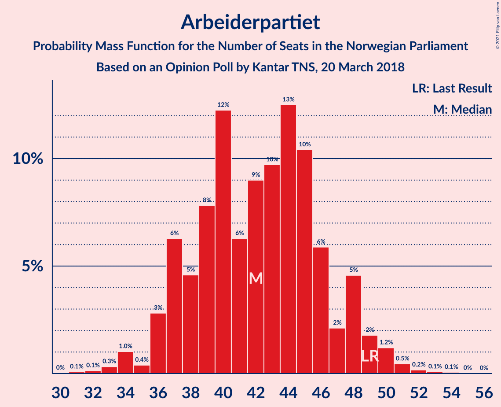
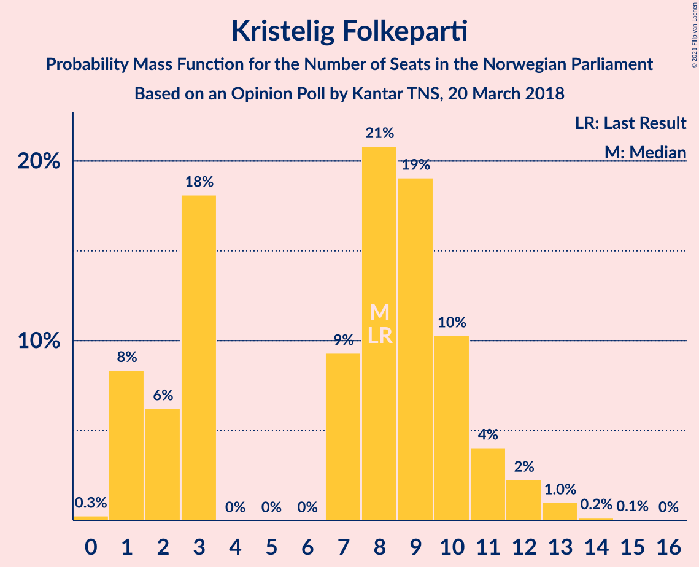
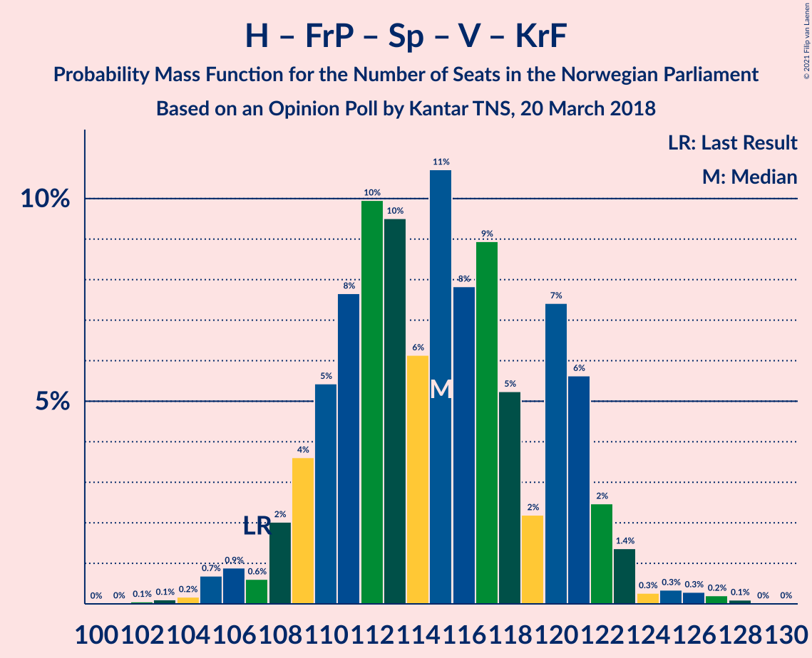
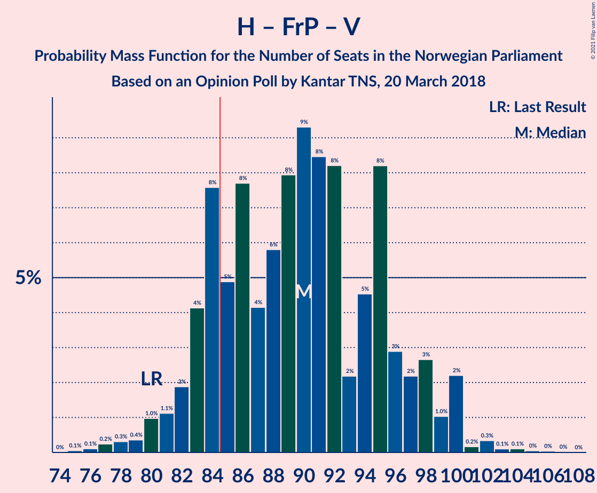
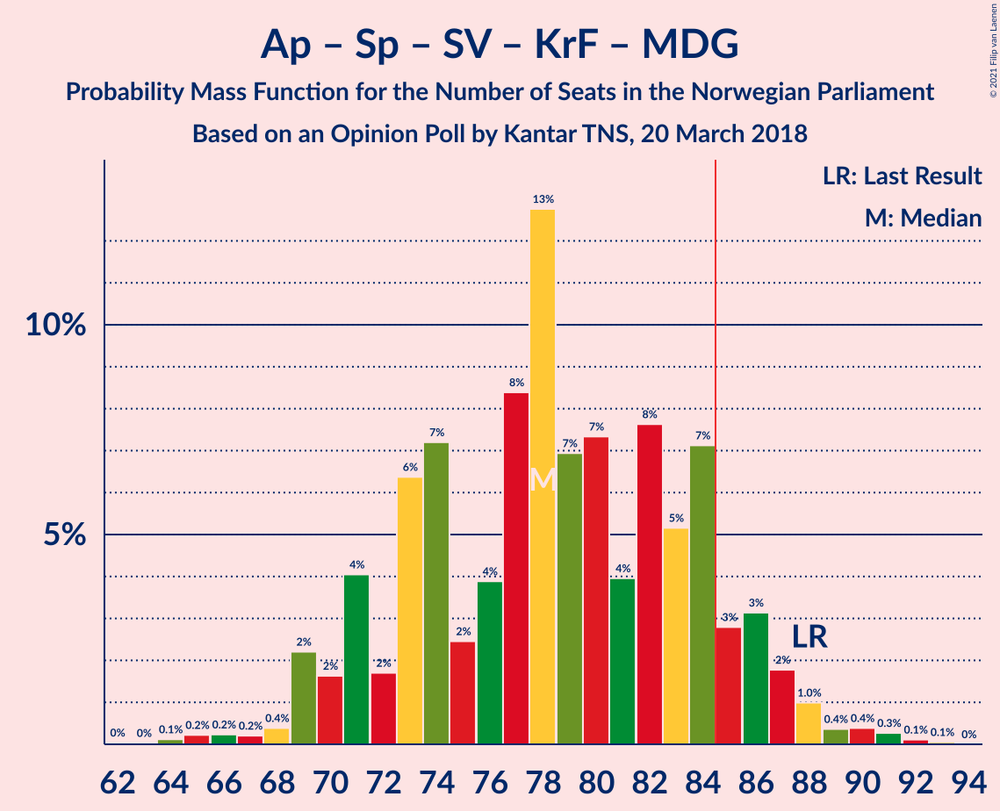
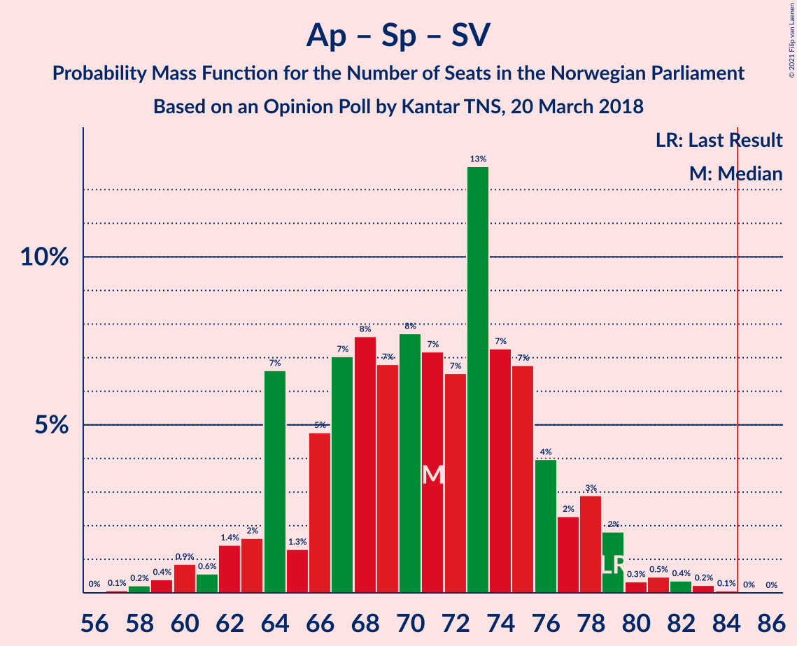
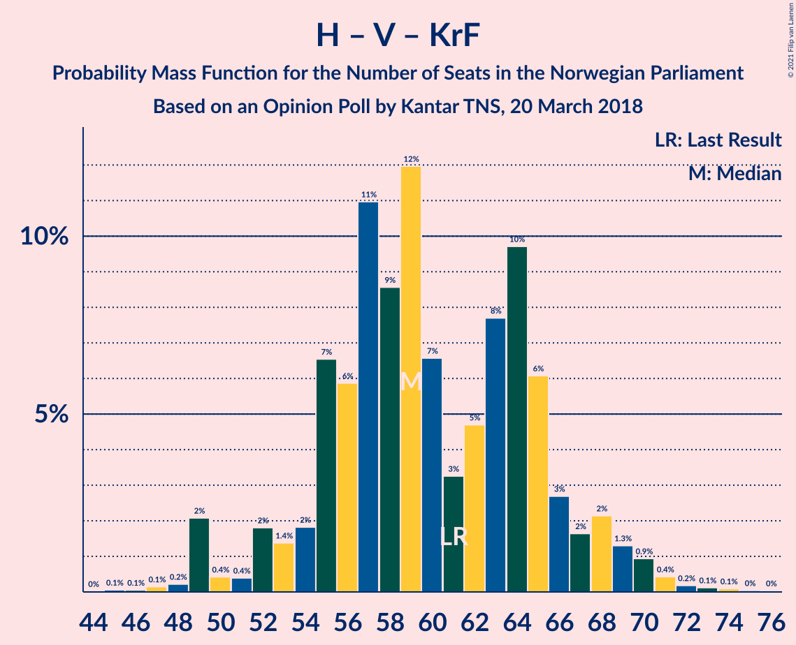
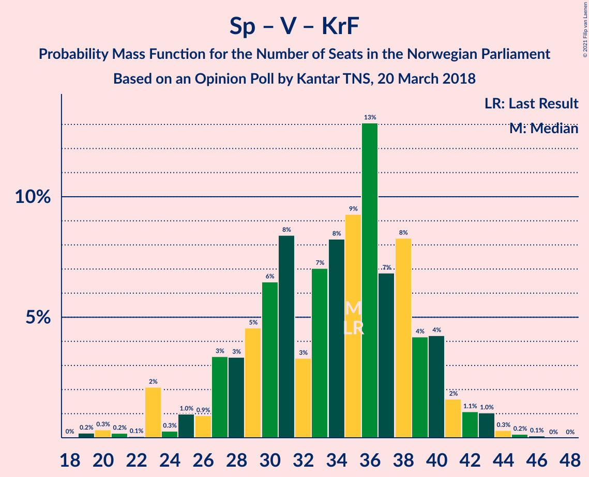

# Opinion Poll by Kantar TNS, 20 March 2018

<a href="#voting-intentions">Voting Intentions</a> | <a href="#seats">Seats</a> | <a href="#coalitions">Coalitions</a> | <a href="#technical-information">Technical Information</a>

## Voting Intentions

### Confidence Intervals

| Party | Last Result | Poll Result | 80% Confidence Interval | 90% Confidence Interval | 95% Confidence Interval | 99% Confidence Interval |
|:-----:|:-----------:|:-----------:|:-----------------------:|:-----------------------:|:-----------------------:|:-----------------------:|
| Høyre | 25.0% | 25.9% | 23.5–28.5% |22.8–29.3% |22.3–29.9% |21.1–31.2% |
| Arbeiderpartiet | 27.4% | 23.5% | 21.2–26.1% |20.5–26.8% |20.0–27.4% |18.9–28.7% |
| Fremskrittspartiet | 15.2% | 20.5% | 18.3–23.0% |17.7–23.6% |17.2–24.3% |16.2–25.5% |
| Senterpartiet | 10.3% | 10.2% | 8.7–12.2% |8.2–12.7% |7.9–13.2% |7.2–14.2% |
| Sosialistisk Venstreparti | 6.0% | 5.6% | 4.5–7.2% |4.2–7.6% |3.9–8.0% |3.4–8.8% |
| Venstre | 4.4% | 5.0% | 4.0–6.5% |3.7–6.9% |3.4–7.3% |3.0–8.1% |
| Kristelig Folkeparti | 4.2% | 4.4% | 3.4–5.8% |3.2–6.2% |2.9–6.6% |2.5–7.3% |
| Miljøpartiet De Grønne | 3.2% | 2.0% | 1.4–3.1% |1.2–3.4% |1.1–3.7% |0.9–4.3% |
| Rødt | 2.4% | 1.6% | 1.1–2.6% |0.9–2.9% |0.8–3.1% |0.6–3.7% |

*Note:* The poll result column reflects the actual value used in the calculations. Published results may vary slightly, and in addition be rounded to fewer digits.

## Seats

### Confidence Intervals

| Party | Last Result | Median | 80% Confidence Interval | 90% Confidence Interval | 95% Confidence Interval | 99% Confidence Interval |
|:-----:|:-----------:|:------:|:-----------------------:|:-----------------------:|:-----------------------:|:-----------------------:|
| <a href="#høyre">Høyre</a> | 45 | 45 | 40–50 |39–51 |37–51 |36–54 |
| <a href="#arbeiderpartiet">Arbeiderpartiet</a> | 49 | 42 | 37–48 |37–48 |34–50 |34–51 |
| <a href="#fremskrittspartiet">Fremskrittspartiet</a> | 27 | 36 | 32–43 |32–43 |30–44 |28–45 |
| <a href="#senterpartiet">Senterpartiet</a> | 19 | 19 | 15–23 |14–23 |14–24 |13–25 |
| <a href="#sosialistisk-venstreparti">Sosialistisk Venstreparti</a> | 11 | 10 | 8–13 |3–13 |2–15 |1–16 |
| <a href="#venstre">Venstre</a> | 8 | 9 | 3–12 |3–12 |2–13 |2–14 |
| <a href="#kristelig-folkeparti">Kristelig Folkeparti</a> | 8 | 8 | 1–10 |1–11 |1–12 |1–13 |
| <a href="#miljøpartiet-de-grønne">Miljøpartiet De Grønne</a> | 1 | 1 | 1 |1–2 |1–2 |0–2 |
| <a href="#rødt">Rødt</a> | 1 | 1 | 0–1 |0–1 |0–1 |0–2 |

### Høyre

*For a full overview of the results for this party, see the [Høyre](party-høyre.html) page.*

| Number of Seats | Probability | Accumulated | Special Marks |
|:---------------:|:-----------:|:-----------:|:-------------:|
| 34 | 0.1% | 100% |  |
| 35 | 0.1% | 99.9% |  |
| 36 | 2% | 99.8% |  |
| 37 | 1.0% | 98% |  |
| 38 | 1.5% | 97% |  |
| 39 | 1.4% | 96% |  |
| 40 | 7% | 94% |  |
| 41 | 5% | 87% |  |
| 42 | 5% | 82% |  |
| 43 | 9% | 77% |  |
| 44 | 7% | 68% |  |
| 45 | 22% | 60% | Last Result, Median |
| 46 | 5% | 38% |  |
| 47 | 12% | 33% |  |
| 48 | 10% | 21% |  |
| 49 | 0.6% | 11% |  |
| 50 | 5% | 10% |  |
| 51 | 4% | 6% |  |
| 52 | 0.9% | 2% |  |
| 53 | 0.4% | 1.1% |  |
| 54 | 0.2% | 0.7% |  |
| 55 | 0.1% | 0.5% |  |
| 56 | 0.3% | 0.4% |  |
| 57 | 0.1% | 0.1% |  |
| 58 | 0% | 0% |  |

### Arbeiderpartiet

*For a full overview of the results for this party, see the [Arbeiderpartiet](party-arbeiderpartiet.html) page.*

| Number of Seats | Probability | Accumulated | Special Marks |
|:---------------:|:-----------:|:-----------:|:-------------:|
| 30 | 0.1% | 100% |  |
| 31 | 0% | 99.9% |  |
| 32 | 0.2% | 99.9% |  |
| 33 | 0.2% | 99.7% |  |
| 34 | 2% | 99.5% |  |
| 35 | 0.5% | 97% |  |
| 36 | 0.6% | 97% |  |
| 37 | 9% | 96% |  |
| 38 | 4% | 87% |  |
| 39 | 6% | 83% |  |
| 40 | 14% | 77% |  |
| 41 | 5% | 63% |  |
| 42 | 17% | 58% | Median |
| 43 | 6% | 41% |  |
| 44 | 4% | 35% |  |
| 45 | 15% | 31% |  |
| 46 | 1.2% | 16% |  |
| 47 | 3% | 15% |  |
| 48 | 7% | 12% |  |
| 49 | 2% | 5% | Last Result |
| 50 | 2% | 3% |  |
| 51 | 0.6% | 0.9% |  |
| 52 | 0.3% | 0.4% |  |
| 53 | 0% | 0.1% |  |
| 54 | 0% | 0.1% |  |
| 55 | 0% | 0% |  |

### Fremskrittspartiet

*For a full overview of the results for this party, see the [Fremskrittspartiet](party-fremskrittspartiet.html) page.*

| Number of Seats | Probability | Accumulated | Special Marks |
|:---------------:|:-----------:|:-----------:|:-------------:|
| 27 | 0.1% | 100% | Last Result |
| 28 | 0.9% | 99.8% |  |
| 29 | 0.6% | 98.9% |  |
| 30 | 2% | 98% |  |
| 31 | 1.1% | 97% |  |
| 32 | 10% | 95% |  |
| 33 | 4% | 85% |  |
| 34 | 7% | 81% |  |
| 35 | 18% | 74% |  |
| 36 | 14% | 55% | Median |
| 37 | 6% | 42% |  |
| 38 | 4% | 35% |  |
| 39 | 5% | 31% |  |
| 40 | 7% | 26% |  |
| 41 | 1.2% | 19% |  |
| 42 | 3% | 18% |  |
| 43 | 11% | 14% |  |
| 44 | 2% | 3% |  |
| 45 | 0.6% | 0.8% |  |
| 46 | 0.1% | 0.3% |  |
| 47 | 0.1% | 0.2% |  |
| 48 | 0.1% | 0.1% |  |
| 49 | 0% | 0% |  |

### Senterpartiet

*For a full overview of the results for this party, see the [Senterpartiet](party-senterpartiet.html) page.*

| Number of Seats | Probability | Accumulated | Special Marks |
|:---------------:|:-----------:|:-----------:|:-------------:|
| 12 | 0.3% | 100% |  |
| 13 | 1.1% | 99.7% |  |
| 14 | 7% | 98.6% |  |
| 15 | 12% | 91% |  |
| 16 | 5% | 79% |  |
| 17 | 17% | 74% |  |
| 18 | 6% | 57% |  |
| 19 | 17% | 51% | Last Result, Median |
| 20 | 5% | 35% |  |
| 21 | 12% | 29% |  |
| 22 | 4% | 18% |  |
| 23 | 10% | 14% |  |
| 24 | 3% | 4% |  |
| 25 | 0.2% | 0.6% |  |
| 26 | 0.1% | 0.4% |  |
| 27 | 0.2% | 0.3% |  |
| 28 | 0% | 0.1% |  |
| 29 | 0% | 0% |  |

### Sosialistisk Venstreparti

*For a full overview of the results for this party, see the [Sosialistisk Venstreparti](party-sosialistiskvenstreparti.html) page.*

| Number of Seats | Probability | Accumulated | Special Marks |
|:---------------:|:-----------:|:-----------:|:-------------:|
| 1 | 1.5% | 100% |  |
| 2 | 2% | 98.5% |  |
| 3 | 2% | 97% |  |
| 4 | 0% | 95% |  |
| 5 | 0% | 95% |  |
| 6 | 0% | 95% |  |
| 7 | 2% | 95% |  |
| 8 | 18% | 93% |  |
| 9 | 19% | 74% |  |
| 10 | 7% | 56% | Median |
| 11 | 29% | 49% | Last Result |
| 12 | 9% | 20% |  |
| 13 | 5% | 10% |  |
| 14 | 2% | 5% |  |
| 15 | 1.0% | 3% |  |
| 16 | 1.3% | 2% |  |
| 17 | 0.2% | 0.3% |  |
| 18 | 0% | 0% |  |

### Venstre

*For a full overview of the results for this party, see the [Venstre](party-venstre.html) page.*

| Number of Seats | Probability | Accumulated | Special Marks |
|:---------------:|:-----------:|:-----------:|:-------------:|
| 2 | 4% | 100% |  |
| 3 | 9% | 96% |  |
| 4 | 0% | 86% |  |
| 5 | 0% | 86% |  |
| 6 | 0% | 86% |  |
| 7 | 10% | 86% |  |
| 8 | 8% | 77% | Last Result |
| 9 | 23% | 69% | Median |
| 10 | 30% | 46% |  |
| 11 | 5% | 16% |  |
| 12 | 8% | 11% |  |
| 13 | 2% | 3% |  |
| 14 | 1.0% | 1.3% |  |
| 15 | 0.3% | 0.3% |  |
| 16 | 0% | 0.1% |  |
| 17 | 0% | 0% |  |

### Kristelig Folkeparti

*For a full overview of the results for this party, see the [Kristelig Folkeparti](party-kristeligfolkeparti.html) page.*

| Number of Seats | Probability | Accumulated | Special Marks |
|:---------------:|:-----------:|:-----------:|:-------------:|
| 0 | 0.2% | 100% |  |
| 1 | 10% | 99.8% |  |
| 2 | 8% | 89% |  |
| 3 | 16% | 81% |  |
| 4 | 0% | 65% |  |
| 5 | 0% | 65% |  |
| 6 | 0% | 65% |  |
| 7 | 6% | 65% |  |
| 8 | 27% | 59% | Last Result, Median |
| 9 | 18% | 32% |  |
| 10 | 6% | 14% |  |
| 11 | 4% | 8% |  |
| 12 | 3% | 4% |  |
| 13 | 0.8% | 1.1% |  |
| 14 | 0.1% | 0.3% |  |
| 15 | 0.1% | 0.1% |  |
| 16 | 0% | 0% |  |

### Miljøpartiet De Grønne

*For a full overview of the results for this party, see the [Miljøpartiet De Grønne](party-miljøpartietdegrønne.html) page.*

| Number of Seats | Probability | Accumulated | Special Marks |
|:---------------:|:-----------:|:-----------:|:-------------:|
| 0 | 2% | 100% |  |
| 1 | 91% | 98% | Last Result, Median |
| 2 | 7% | 7% |  |
| 3 | 0% | 0.1% |  |
| 4 | 0% | 0.1% |  |
| 5 | 0% | 0.1% |  |
| 6 | 0% | 0.1% |  |
| 7 | 0% | 0.1% |  |
| 8 | 0% | 0.1% |  |
| 9 | 0.1% | 0.1% |  |
| 10 | 0% | 0% |  |

### Rødt

*For a full overview of the results for this party, see the [Rødt](party-rødt.html) page.*

| Number of Seats | Probability | Accumulated | Special Marks |
|:---------------:|:-----------:|:-----------:|:-------------:|
| 0 | 27% | 100% |  |
| 1 | 71% | 73% | Last Result, Median |
| 2 | 2% | 2% |  |
| 3 | 0% | 0.1% |  |
| 4 | 0% | 0.1% |  |
| 5 | 0% | 0.1% |  |
| 6 | 0% | 0.1% |  |
| 7 | 0% | 0.1% |  |
| 8 | 0% | 0% |  |

## Coalitions

### Confidence Intervals

| Coalition | Last Result | Median | Majority? | 80% Confidence Interval | 90% Confidence Interval | 95% Confidence Interval | 99% Confidence Interval |
|:---------:|:-----------:|:------:|:---------:|:-----------------------:|:-----------------------:|:-----------------------:|:-----------------------:|
| Høyre – Fremskrittspartiet – Senterpartiet – Venstre – Kristelig Folkeparti | 107 | 116 | 100% | 110–121 | 109–122 | 106–123 | 105–125 |
| Høyre – Fremskrittspartiet – Venstre – Kristelig Folkeparti – Miljøpartiet De Grønne | 89 | 98 | 99.9% | 92–103 | 90–106 | 89–108 | 85–109 |
| Høyre – Fremskrittspartiet – Venstre – Kristelig Folkeparti | 88 | 97 | 99.3% | 91–102 | 90–105 | 88–106 | 84–108 |
| Høyre – Fremskrittspartiet – Venstre | 80 | 90 | 91% | 85–97 | 82–100 | 80–100 | 77–100 |
| Høyre – Fremskrittspartiet | 72 | 80 | 26% | 76–88 | 73–90 | 71–90 | 70–92 |
| Arbeiderpartiet – Senterpartiet – Sosialistisk Venstreparti – Kristelig Folkeparti – Miljøpartiet De Grønne | 88 | 78 | 8% | 71–83 | 69–87 | 69–88 | 69–91 |
| Arbeiderpartiet – Senterpartiet – Sosialistisk Venstreparti – Miljøpartiet De Grønne – Rødt | 81 | 72 | 0.7% | 67–78 | 64–79 | 63–81 | 61–85 |
| Arbeiderpartiet – Senterpartiet – Sosialistisk Venstreparti – Miljøpartiet De Grønne | 80 | 71 | 0.1% | 67–77 | 63–78 | 62–80 | 60–84 |
| Arbeiderpartiet – Senterpartiet – Sosialistisk Venstreparti – Rødt | 80 | 71 | 0.1% | 66–77 | 63–79 | 61–80 | 60–84 |
| Arbeiderpartiet – Senterpartiet – Sosialistisk Venstreparti | 79 | 70 | 0.1% | 66–76 | 62–78 | 60–79 | 59–83 |
| Arbeiderpartiet – Senterpartiet – Kristelig Folkeparti – Miljøpartiet De Grønne | 77 | 67 | 0% | 62–74 | 60–76 | 60–78 | 58–79 |
| Arbeiderpartiet – Senterpartiet – Kristelig Folkeparti | 76 | 66 | 0% | 60–73 | 59–76 | 59–77 | 57–78 |
| Høyre – Venstre – Kristelig Folkeparti | 61 | 59 | 0% | 53–66 | 49–68 | 49–69 | 49–71 |
| Arbeiderpartiet – Senterpartiet | 68 | 61 | 0% | 57–65 | 54–67 | 51–68 | 50–71 |
| Arbeiderpartiet – Sosialistisk Venstreparti | 60 | 51 | 0% | 46–57 | 45–58 | 45–61 | 42–62 |
| Senterpartiet – Venstre – Kristelig Folkeparti | 35 | 35 | 0% | 27–39 | 23–40 | 23–42 | 20–43 |

### Høyre – Fremskrittspartiet – Senterpartiet – Venstre – Kristelig Folkeparti

| Number of Seats | Probability | Accumulated | Special Marks |
|:---------------:|:-----------:|:-----------:|:-------------:|
| 103 | 0.2% | 100% |  |
| 104 | 0.2% | 99.8% |  |
| 105 | 0.9% | 99.6% |  |
| 106 | 1.5% | 98.7% |  |
| 107 | 0.4% | 97% | Last Result |
| 108 | 1.1% | 97% |  |
| 109 | 2% | 96% |  |
| 110 | 6% | 94% |  |
| 111 | 13% | 88% |  |
| 112 | 6% | 75% |  |
| 113 | 4% | 70% |  |
| 114 | 5% | 66% |  |
| 115 | 6% | 61% |  |
| 116 | 16% | 55% |  |
| 117 | 16% | 39% | Median |
| 118 | 5% | 23% |  |
| 119 | 2% | 18% |  |
| 120 | 4% | 16% |  |
| 121 | 5% | 13% |  |
| 122 | 5% | 8% |  |
| 123 | 2% | 3% |  |
| 124 | 0.1% | 1.1% |  |
| 125 | 0.6% | 1.0% |  |
| 126 | 0.1% | 0.3% |  |
| 127 | 0.1% | 0.2% |  |
| 128 | 0.1% | 0.1% |  |
| 129 | 0% | 0% |  |

### Høyre – Fremskrittspartiet – Venstre – Kristelig Folkeparti – Miljøpartiet De Grønne

| Number of Seats | Probability | Accumulated | Special Marks |
|:---------------:|:-----------:|:-----------:|:-------------:|
| 83 | 0% | 100% |  |
| 84 | 0% | 99.9% |  |
| 85 | 0.6% | 99.9% | Majority |
| 86 | 0.1% | 99.3% |  |
| 87 | 0.4% | 99.2% |  |
| 88 | 0.7% | 98.8% |  |
| 89 | 2% | 98% | Last Result |
| 90 | 2% | 97% |  |
| 91 | 1.3% | 95% |  |
| 92 | 5% | 94% |  |
| 93 | 10% | 89% |  |
| 94 | 4% | 79% |  |
| 95 | 11% | 75% |  |
| 96 | 4% | 63% |  |
| 97 | 3% | 59% |  |
| 98 | 13% | 57% |  |
| 99 | 3% | 44% | Median |
| 100 | 17% | 40% |  |
| 101 | 3% | 23% |  |
| 102 | 5% | 20% |  |
| 103 | 7% | 15% |  |
| 104 | 2% | 8% |  |
| 105 | 1.0% | 6% |  |
| 106 | 2% | 5% |  |
| 107 | 0.5% | 3% |  |
| 108 | 0.4% | 3% |  |
| 109 | 2% | 2% |  |
| 110 | 0% | 0.2% |  |
| 111 | 0.1% | 0.1% |  |
| 112 | 0% | 0% |  |

### Høyre – Fremskrittspartiet – Venstre – Kristelig Folkeparti

| Number of Seats | Probability | Accumulated | Special Marks |
|:---------------:|:-----------:|:-----------:|:-------------:|
| 83 | 0% | 100% |  |
| 84 | 0.6% | 99.9% |  |
| 85 | 0.1% | 99.3% | Majority |
| 86 | 0.2% | 99.2% |  |
| 87 | 0.9% | 99.0% |  |
| 88 | 2% | 98% | Last Result |
| 89 | 0.5% | 97% |  |
| 90 | 2% | 96% |  |
| 91 | 5% | 94% |  |
| 92 | 10% | 89% |  |
| 93 | 5% | 79% |  |
| 94 | 11% | 74% |  |
| 95 | 4% | 63% |  |
| 96 | 4% | 59% |  |
| 97 | 11% | 55% |  |
| 98 | 3% | 44% | Median |
| 99 | 17% | 40% |  |
| 100 | 3% | 23% |  |
| 101 | 5% | 20% |  |
| 102 | 8% | 15% |  |
| 103 | 0.3% | 7% |  |
| 104 | 1.0% | 6% |  |
| 105 | 2% | 5% |  |
| 106 | 0.7% | 3% |  |
| 107 | 0.1% | 2% |  |
| 108 | 2% | 2% |  |
| 109 | 0.1% | 0.1% |  |
| 110 | 0.1% | 0.1% |  |
| 111 | 0% | 0% |  |

### Høyre – Fremskrittspartiet – Venstre

| Number of Seats | Probability | Accumulated | Special Marks |
|:---------------:|:-----------:|:-----------:|:-------------:|
| 76 | 0.2% | 100% |  |
| 77 | 0.6% | 99.8% |  |
| 78 | 0.4% | 99.1% |  |
| 79 | 0.3% | 98.8% |  |
| 80 | 1.2% | 98% | Last Result |
| 81 | 2% | 97% |  |
| 82 | 1.1% | 95% |  |
| 83 | 1.1% | 94% |  |
| 84 | 2% | 93% |  |
| 85 | 3% | 91% | Majority |
| 86 | 10% | 88% |  |
| 87 | 5% | 77% |  |
| 88 | 5% | 73% |  |
| 89 | 10% | 68% |  |
| 90 | 15% | 58% | Median |
| 91 | 9% | 43% |  |
| 92 | 7% | 33% |  |
| 93 | 3% | 27% |  |
| 94 | 7% | 24% |  |
| 95 | 3% | 17% |  |
| 96 | 3% | 14% |  |
| 97 | 3% | 12% |  |
| 98 | 3% | 9% |  |
| 99 | 0.6% | 6% |  |
| 100 | 5% | 5% |  |
| 101 | 0.1% | 0.2% |  |
| 102 | 0% | 0.1% |  |
| 103 | 0% | 0.1% |  |
| 104 | 0% | 0.1% |  |
| 105 | 0.1% | 0.1% |  |
| 106 | 0% | 0% |  |

### Høyre – Fremskrittspartiet

| Number of Seats | Probability | Accumulated | Special Marks |
|:---------------:|:-----------:|:-----------:|:-------------:|
| 69 | 0.3% | 100% |  |
| 70 | 0.6% | 99.7% |  |
| 71 | 3% | 99.1% |  |
| 72 | 0.7% | 96% | Last Result |
| 73 | 1.5% | 96% |  |
| 74 | 2% | 94% |  |
| 75 | 0.8% | 93% |  |
| 76 | 5% | 92% |  |
| 77 | 0.8% | 87% |  |
| 78 | 3% | 86% |  |
| 79 | 15% | 83% |  |
| 80 | 21% | 68% |  |
| 81 | 5% | 46% | Median |
| 82 | 3% | 42% |  |
| 83 | 3% | 39% |  |
| 84 | 10% | 36% |  |
| 85 | 5% | 26% | Majority |
| 86 | 3% | 21% |  |
| 87 | 2% | 18% |  |
| 88 | 6% | 16% |  |
| 89 | 3% | 10% |  |
| 90 | 5% | 6% |  |
| 91 | 0.1% | 0.7% |  |
| 92 | 0.4% | 0.6% |  |
| 93 | 0.1% | 0.2% |  |
| 94 | 0% | 0.1% |  |
| 95 | 0% | 0.1% |  |
| 96 | 0% | 0.1% |  |
| 97 | 0% | 0.1% |  |
| 98 | 0% | 0% |  |

### Arbeiderpartiet – Senterpartiet – Sosialistisk Venstreparti – Kristelig Folkeparti – Miljøpartiet De Grønne

| Number of Seats | Probability | Accumulated | Special Marks |
|:---------------:|:-----------:|:-----------:|:-------------:|
| 63 | 0.1% | 100% |  |
| 64 | 0% | 99.9% |  |
| 65 | 0% | 99.9% |  |
| 66 | 0% | 99.9% |  |
| 67 | 0.1% | 99.9% |  |
| 68 | 0.2% | 99.8% |  |
| 69 | 6% | 99.6% |  |
| 70 | 1.2% | 94% |  |
| 71 | 4% | 93% |  |
| 72 | 0.7% | 89% |  |
| 73 | 3% | 88% |  |
| 74 | 9% | 85% |  |
| 75 | 3% | 76% |  |
| 76 | 4% | 73% |  |
| 77 | 10% | 69% |  |
| 78 | 16% | 60% |  |
| 79 | 8% | 44% |  |
| 80 | 8% | 35% | Median |
| 81 | 3% | 27% |  |
| 82 | 12% | 25% |  |
| 83 | 3% | 13% |  |
| 84 | 2% | 10% |  |
| 85 | 2% | 8% | Majority |
| 86 | 0.8% | 6% |  |
| 87 | 2% | 5% |  |
| 88 | 0.9% | 3% | Last Result |
| 89 | 0.5% | 2% |  |
| 90 | 0.5% | 1.4% |  |
| 91 | 0.6% | 0.9% |  |
| 92 | 0.2% | 0.2% |  |
| 93 | 0% | 0% |  |

### Arbeiderpartiet – Senterpartiet – Sosialistisk Venstreparti – Miljøpartiet De Grønne – Rødt

| Number of Seats | Probability | Accumulated | Special Marks |
|:---------------:|:-----------:|:-----------:|:-------------:|
| 59 | 0.1% | 100% |  |
| 60 | 0.1% | 99.9% |  |
| 61 | 2% | 99.9% |  |
| 62 | 0.1% | 98% |  |
| 63 | 0.7% | 98% |  |
| 64 | 2% | 97% |  |
| 65 | 1.0% | 95% |  |
| 66 | 0.3% | 94% |  |
| 67 | 8% | 93% |  |
| 68 | 5% | 85% |  |
| 69 | 3% | 80% |  |
| 70 | 17% | 77% |  |
| 71 | 3% | 60% |  |
| 72 | 11% | 56% |  |
| 73 | 4% | 45% | Median |
| 74 | 4% | 41% |  |
| 75 | 11% | 37% |  |
| 76 | 5% | 26% |  |
| 77 | 10% | 21% |  |
| 78 | 5% | 11% |  |
| 79 | 2% | 6% |  |
| 80 | 0.5% | 4% |  |
| 81 | 2% | 3% | Last Result |
| 82 | 0.9% | 2% |  |
| 83 | 0.2% | 1.0% |  |
| 84 | 0.1% | 0.8% |  |
| 85 | 0.6% | 0.7% | Majority |
| 86 | 0% | 0.1% |  |
| 87 | 0% | 0% |  |

### Arbeiderpartiet – Senterpartiet – Sosialistisk Venstreparti – Miljøpartiet De Grønne

| Number of Seats | Probability | Accumulated | Special Marks |
|:---------------:|:-----------:|:-----------:|:-------------:|
| 58 | 0.1% | 100% |  |
| 59 | 0.1% | 99.9% |  |
| 60 | 0.6% | 99.9% |  |
| 61 | 2% | 99.3% |  |
| 62 | 0.3% | 98% |  |
| 63 | 2% | 97% |  |
| 64 | 0.8% | 95% |  |
| 65 | 0.6% | 94% |  |
| 66 | 2% | 93% |  |
| 67 | 11% | 91% |  |
| 68 | 3% | 80% |  |
| 69 | 15% | 78% |  |
| 70 | 4% | 63% |  |
| 71 | 12% | 59% |  |
| 72 | 6% | 47% | Median |
| 73 | 1.2% | 41% |  |
| 74 | 13% | 40% |  |
| 75 | 4% | 27% |  |
| 76 | 8% | 23% |  |
| 77 | 8% | 14% |  |
| 78 | 3% | 7% |  |
| 79 | 0.2% | 4% |  |
| 80 | 2% | 4% | Last Result |
| 81 | 0.8% | 2% |  |
| 82 | 0.5% | 1.3% |  |
| 83 | 0.1% | 0.8% |  |
| 84 | 0.6% | 0.7% |  |
| 85 | 0% | 0.1% | Majority |
| 86 | 0% | 0.1% |  |
| 87 | 0% | 0% |  |

### Arbeiderpartiet – Senterpartiet – Sosialistisk Venstreparti – Rødt

| Number of Seats | Probability | Accumulated | Special Marks |
|:---------------:|:-----------:|:-----------:|:-------------:|
| 58 | 0.1% | 100% |  |
| 59 | 0% | 99.9% |  |
| 60 | 2% | 99.8% |  |
| 61 | 0.4% | 98% |  |
| 62 | 0.5% | 97% |  |
| 63 | 2% | 97% |  |
| 64 | 1.0% | 95% |  |
| 65 | 2% | 94% |  |
| 66 | 7% | 92% |  |
| 67 | 5% | 85% |  |
| 68 | 3% | 80% |  |
| 69 | 17% | 77% |  |
| 70 | 3% | 60% |  |
| 71 | 13% | 56% |  |
| 72 | 3% | 43% | Median |
| 73 | 4% | 41% |  |
| 74 | 11% | 37% |  |
| 75 | 4% | 25% |  |
| 76 | 10% | 21% |  |
| 77 | 5% | 11% |  |
| 78 | 1.3% | 6% |  |
| 79 | 2% | 5% |  |
| 80 | 2% | 3% | Last Result |
| 81 | 0.7% | 2% |  |
| 82 | 0.4% | 1.2% |  |
| 83 | 0.1% | 0.8% |  |
| 84 | 0.6% | 0.7% |  |
| 85 | 0% | 0.1% | Majority |
| 86 | 0% | 0.1% |  |
| 87 | 0% | 0% |  |

### Arbeiderpartiet – Senterpartiet – Sosialistisk Venstreparti

| Number of Seats | Probability | Accumulated | Special Marks |
|:---------------:|:-----------:|:-----------:|:-------------:|
| 57 | 0.1% | 100% |  |
| 58 | 0% | 99.9% |  |
| 59 | 0.6% | 99.9% |  |
| 60 | 2% | 99.3% |  |
| 61 | 0.1% | 97% |  |
| 62 | 3% | 97% |  |
| 63 | 0.6% | 95% |  |
| 64 | 2% | 94% |  |
| 65 | 2% | 92% |  |
| 66 | 10% | 90% |  |
| 67 | 3% | 80% |  |
| 68 | 15% | 78% |  |
| 69 | 4% | 63% |  |
| 70 | 13% | 58% |  |
| 71 | 4% | 45% | Median |
| 72 | 1.0% | 41% |  |
| 73 | 14% | 40% |  |
| 74 | 4% | 26% |  |
| 75 | 8% | 22% |  |
| 76 | 8% | 14% |  |
| 77 | 1.3% | 6% |  |
| 78 | 2% | 5% |  |
| 79 | 2% | 4% | Last Result |
| 80 | 0.5% | 2% |  |
| 81 | 0.7% | 1.5% |  |
| 82 | 0.1% | 0.8% |  |
| 83 | 0.6% | 0.7% |  |
| 84 | 0% | 0.1% |  |
| 85 | 0% | 0.1% | Majority |
| 86 | 0% | 0% |  |

### Arbeiderpartiet – Senterpartiet – Kristelig Folkeparti – Miljøpartiet De Grønne

| Number of Seats | Probability | Accumulated | Special Marks |
|:---------------:|:-----------:|:-----------:|:-------------:|
| 53 | 0% | 100% |  |
| 54 | 0.1% | 99.9% |  |
| 55 | 0% | 99.8% |  |
| 56 | 0% | 99.8% |  |
| 57 | 0.1% | 99.8% |  |
| 58 | 0.2% | 99.7% |  |
| 59 | 2% | 99.4% |  |
| 60 | 6% | 98% |  |
| 61 | 1.0% | 92% |  |
| 62 | 3% | 91% |  |
| 63 | 2% | 88% |  |
| 64 | 3% | 86% |  |
| 65 | 2% | 83% |  |
| 66 | 16% | 81% |  |
| 67 | 16% | 65% |  |
| 68 | 9% | 49% |  |
| 69 | 1.4% | 39% |  |
| 70 | 3% | 38% | Median |
| 71 | 11% | 35% |  |
| 72 | 5% | 24% |  |
| 73 | 4% | 19% |  |
| 74 | 8% | 15% |  |
| 75 | 0.5% | 7% |  |
| 76 | 2% | 6% |  |
| 77 | 1.3% | 4% | Last Result |
| 78 | 1.1% | 3% |  |
| 79 | 1.0% | 1.5% |  |
| 80 | 0.2% | 0.5% |  |
| 81 | 0.2% | 0.3% |  |
| 82 | 0% | 0.1% |  |
| 83 | 0% | 0% |  |

### Arbeiderpartiet – Senterpartiet – Kristelig Folkeparti

| Number of Seats | Probability | Accumulated | Special Marks |
|:---------------:|:-----------:|:-----------:|:-------------:|
| 52 | 0% | 100% |  |
| 53 | 0.1% | 99.9% |  |
| 54 | 0% | 99.8% |  |
| 55 | 0% | 99.8% |  |
| 56 | 0.1% | 99.8% |  |
| 57 | 0.2% | 99.6% |  |
| 58 | 2% | 99.4% |  |
| 59 | 6% | 98% |  |
| 60 | 3% | 91% |  |
| 61 | 0.9% | 89% |  |
| 62 | 2% | 88% |  |
| 63 | 3% | 85% |  |
| 64 | 4% | 83% |  |
| 65 | 15% | 79% |  |
| 66 | 15% | 64% |  |
| 67 | 10% | 49% |  |
| 68 | 1.2% | 39% |  |
| 69 | 3% | 38% | Median |
| 70 | 11% | 35% |  |
| 71 | 6% | 24% |  |
| 72 | 4% | 18% |  |
| 73 | 8% | 14% |  |
| 74 | 0.3% | 7% |  |
| 75 | 1.4% | 6% |  |
| 76 | 2% | 5% | Last Result |
| 77 | 1.0% | 3% |  |
| 78 | 1.1% | 2% |  |
| 79 | 0.2% | 0.4% |  |
| 80 | 0.2% | 0.3% |  |
| 81 | 0% | 0.1% |  |
| 82 | 0% | 0% |  |

### Høyre – Venstre – Kristelig Folkeparti

| Number of Seats | Probability | Accumulated | Special Marks |
|:---------------:|:-----------:|:-----------:|:-------------:|
| 45 | 0.1% | 100% |  |
| 46 | 0% | 99.9% |  |
| 47 | 0.1% | 99.9% |  |
| 48 | 0% | 99.8% |  |
| 49 | 6% | 99.7% |  |
| 50 | 0.2% | 94% |  |
| 51 | 0.3% | 94% |  |
| 52 | 1.3% | 93% |  |
| 53 | 2% | 92% |  |
| 54 | 2% | 89% |  |
| 55 | 4% | 88% |  |
| 56 | 2% | 83% |  |
| 57 | 7% | 81% |  |
| 58 | 13% | 74% |  |
| 59 | 17% | 61% |  |
| 60 | 2% | 44% |  |
| 61 | 3% | 42% | Last Result |
| 62 | 3% | 40% | Median |
| 63 | 2% | 36% |  |
| 64 | 17% | 34% |  |
| 65 | 7% | 18% |  |
| 66 | 3% | 11% |  |
| 67 | 2% | 8% |  |
| 68 | 2% | 6% |  |
| 69 | 2% | 4% |  |
| 70 | 0.5% | 1.4% |  |
| 71 | 0.6% | 1.0% |  |
| 72 | 0.1% | 0.4% |  |
| 73 | 0.2% | 0.3% |  |
| 74 | 0.1% | 0.1% |  |
| 75 | 0% | 0% |  |

### Arbeiderpartiet – Senterpartiet

| Number of Seats | Probability | Accumulated | Special Marks |
|:---------------:|:-----------:|:-----------:|:-------------:|
| 49 | 0.1% | 100% |  |
| 50 | 2% | 99.8% |  |
| 51 | 0.6% | 98% |  |
| 52 | 0.6% | 97% |  |
| 53 | 0.4% | 97% |  |
| 54 | 2% | 97% |  |
| 55 | 0.9% | 94% |  |
| 56 | 2% | 93% |  |
| 57 | 24% | 92% |  |
| 58 | 9% | 68% |  |
| 59 | 4% | 59% |  |
| 60 | 4% | 55% |  |
| 61 | 4% | 51% | Median |
| 62 | 9% | 47% |  |
| 63 | 3% | 38% |  |
| 64 | 16% | 35% |  |
| 65 | 9% | 19% |  |
| 66 | 2% | 10% |  |
| 67 | 4% | 8% |  |
| 68 | 2% | 4% | Last Result |
| 69 | 0.3% | 2% |  |
| 70 | 0.4% | 1.4% |  |
| 71 | 0.7% | 1.0% |  |
| 72 | 0.2% | 0.3% |  |
| 73 | 0% | 0.1% |  |
| 74 | 0% | 0% |  |

### Arbeiderpartiet – Sosialistisk Venstreparti

| Number of Seats | Probability | Accumulated | Special Marks |
|:---------------:|:-----------:|:-----------:|:-------------:|
| 38 | 0% | 100% |  |
| 39 | 0% | 99.9% |  |
| 40 | 0.1% | 99.9% |  |
| 41 | 0.1% | 99.8% |  |
| 42 | 0.6% | 99.7% |  |
| 43 | 0.4% | 99.1% |  |
| 44 | 0.2% | 98.7% |  |
| 45 | 6% | 98% |  |
| 46 | 5% | 92% |  |
| 47 | 2% | 87% |  |
| 48 | 5% | 86% |  |
| 49 | 3% | 81% |  |
| 50 | 13% | 78% |  |
| 51 | 18% | 65% |  |
| 52 | 4% | 47% | Median |
| 53 | 7% | 43% |  |
| 54 | 6% | 36% |  |
| 55 | 1.0% | 30% |  |
| 56 | 17% | 29% |  |
| 57 | 5% | 12% |  |
| 58 | 3% | 7% |  |
| 59 | 0.8% | 4% |  |
| 60 | 0.9% | 4% | Last Result |
| 61 | 1.3% | 3% |  |
| 62 | 1.0% | 1.4% |  |
| 63 | 0% | 0.3% |  |
| 64 | 0.3% | 0.3% |  |
| 65 | 0% | 0% |  |

### Senterpartiet – Venstre – Kristelig Folkeparti

| Number of Seats | Probability | Accumulated | Special Marks |
|:---------------:|:-----------:|:-----------:|:-------------:|
| 18 | 0% | 100% |  |
| 19 | 0.4% | 99.9% |  |
| 20 | 0.1% | 99.5% |  |
| 21 | 0% | 99.5% |  |
| 22 | 0% | 99.5% |  |
| 23 | 6% | 99.4% |  |
| 24 | 0.5% | 93% |  |
| 25 | 0.7% | 93% |  |
| 26 | 0.3% | 92% |  |
| 27 | 6% | 92% |  |
| 28 | 2% | 86% |  |
| 29 | 3% | 84% |  |
| 30 | 1.2% | 81% |  |
| 31 | 13% | 80% |  |
| 32 | 2% | 67% |  |
| 33 | 4% | 65% |  |
| 34 | 8% | 61% |  |
| 35 | 11% | 53% | Last Result |
| 36 | 17% | 42% | Median |
| 37 | 2% | 25% |  |
| 38 | 12% | 23% |  |
| 39 | 4% | 11% |  |
| 40 | 3% | 7% |  |
| 41 | 2% | 5% |  |
| 42 | 1.4% | 3% |  |
| 43 | 1.1% | 2% |  |
| 44 | 0.2% | 0.4% |  |
| 45 | 0% | 0.2% |  |
| 46 | 0.1% | 0.2% |  |
| 47 | 0% | 0% |  |

## Technical Information

### Opinion Poll

+ **Polling firm:** Kantar TNS
+ **Commissioner(s):** —
+ **Fieldwork period:** 20 March 2018

### Calculations

+ **Sample size:** 498
+ **Simulations done:** 131,072
+ **Error estimate:** 3.11%

