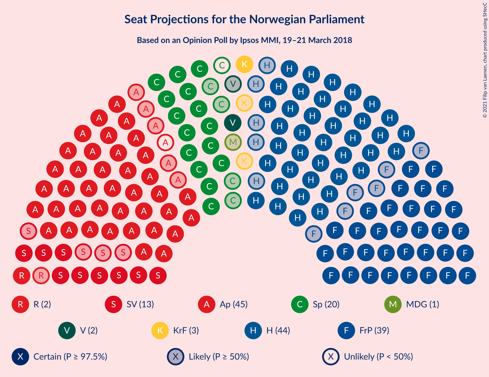
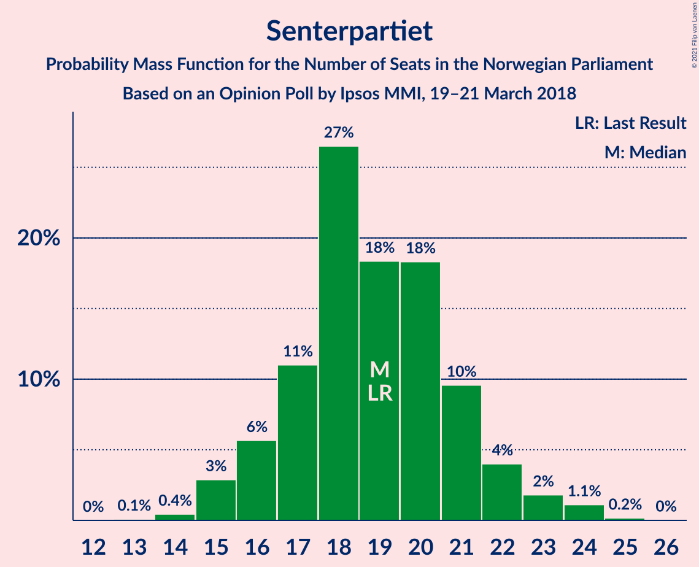
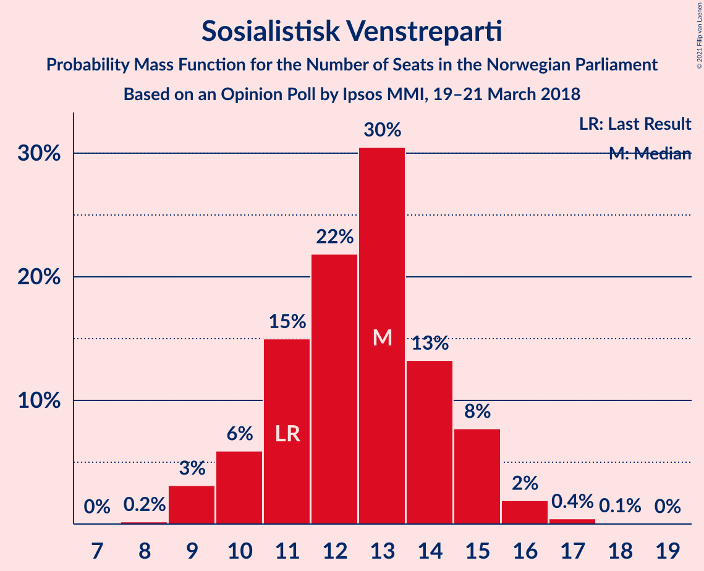
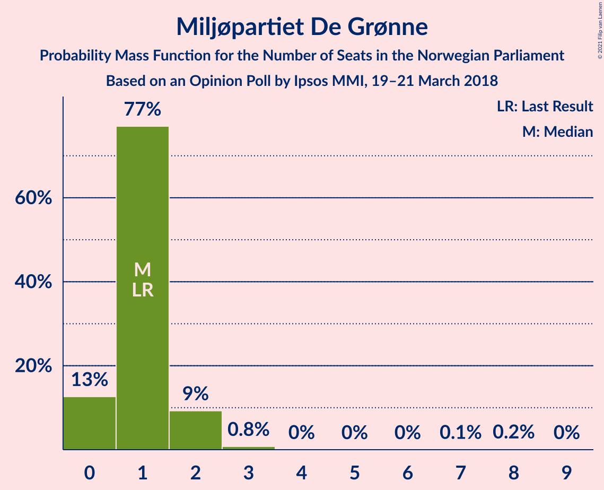
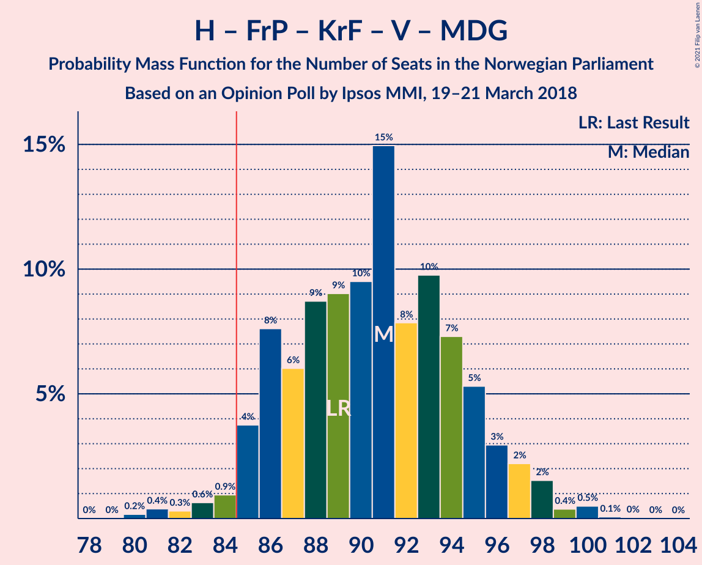
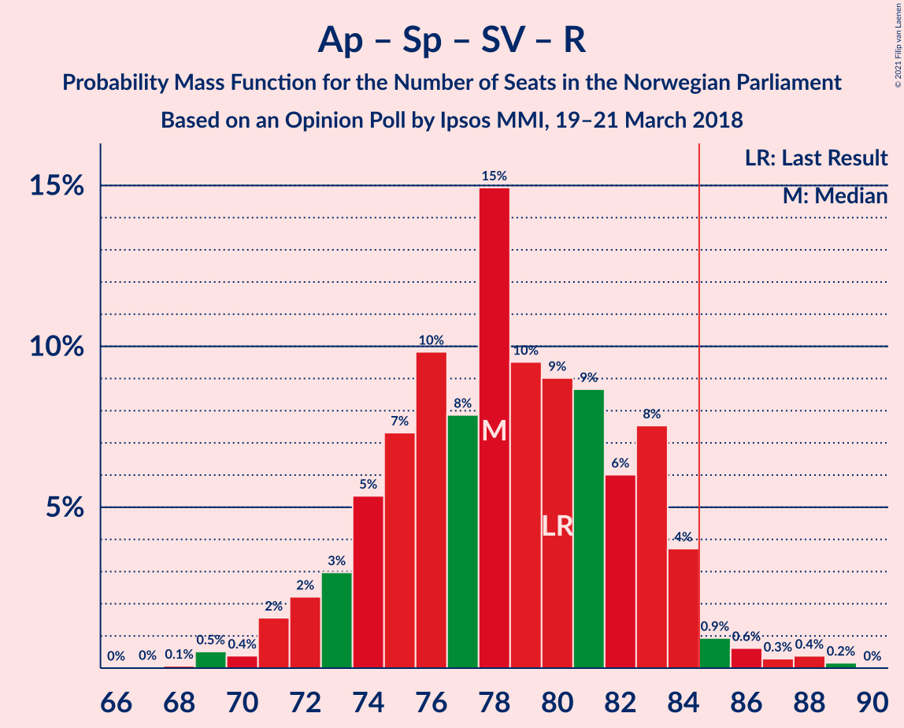
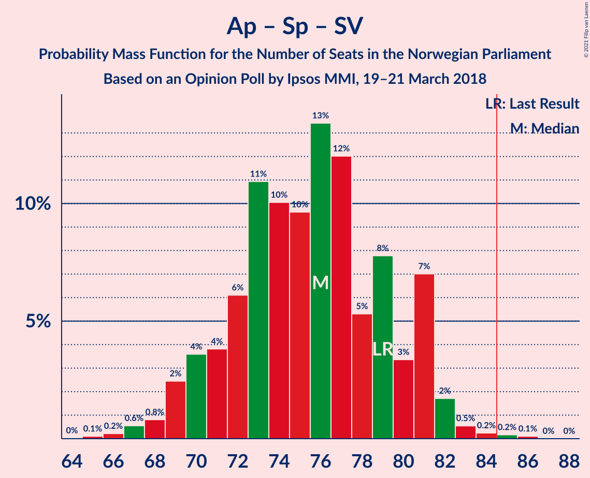
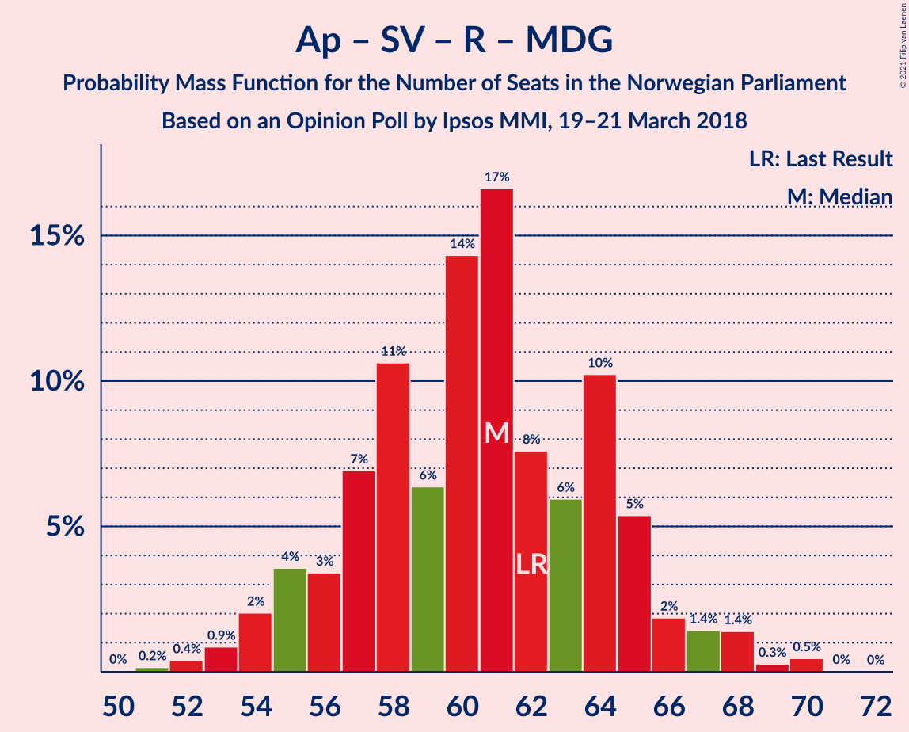
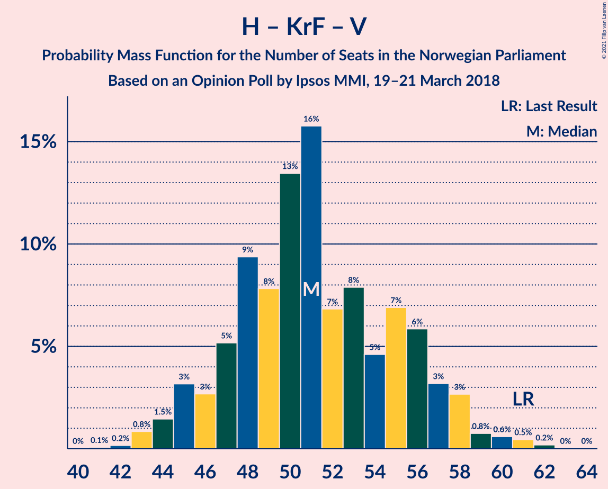
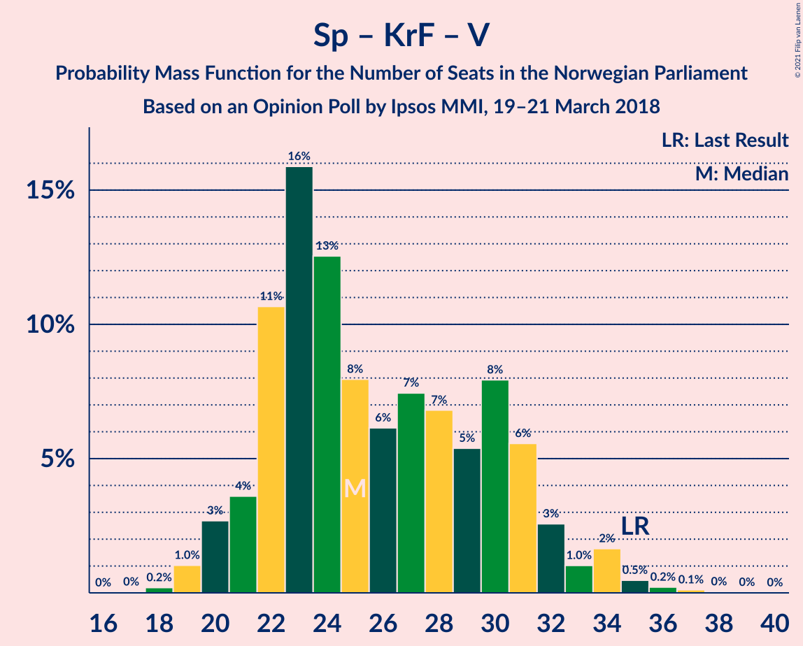

# Opinion Poll by Ipsos MMI, 19–21 March 2018

<a href="#voting-intentions">Voting Intentions</a> | <a href="#seats">Seats</a> | <a href="#coalitions">Coalitions</a> | <a href="#technical-information">Technical Information</a>

## Voting Intentions

### Confidence Intervals

| Party | Last Result | Poll Result | 80% Confidence Interval | 90% Confidence Interval | 95% Confidence Interval | 99% Confidence Interval |
|:-----:|:-----------:|:-----------:|:-----------------------:|:-----------------------:|:-----------------------:|:-----------------------:|
| Høyre | 25.0% | 23.9% | 22.1–25.7% |21.6–26.2% |21.2–26.7% |20.4–27.6% |
| Arbeiderpartiet | 27.4% | 23.6% | 21.9–25.5% |21.4–26.0% |21.0–26.5% |20.2–27.4% |
| Fremskrittspartiet | 15.2% | 20.7% | 19.1–22.5% |18.7–23.0% |18.3–23.5% |17.5–24.3% |
| Senterpartiet | 10.3% | 10.2% | 9.0–11.5% |8.7–11.9% |8.4–12.3% |7.8–13.0% |
| Sosialistisk Venstreparti | 6.0% | 6.6% | 5.7–7.8% |5.4–8.1% |5.2–8.4% |4.8–9.0% |
| Kristelig Folkeparti | 4.2% | 3.7% | 3.0–4.7% |2.9–4.9% |2.7–5.2% |2.4–5.7% |
| Rødt | 2.4% | 3.3% | 2.7–4.2% |2.5–4.5% |2.3–4.7% |2.1–5.1% |
| Venstre | 4.4% | 3.2% | 2.6–4.1% |2.4–4.3% |2.3–4.6% |2.0–5.0% |
| Miljøpartiet De Grønne | 3.2% | 2.4% | 1.8–3.1% |1.7–3.4% |1.6–3.6% |1.3–3.9% |

*Note:* The poll result column reflects the actual value used in the calculations. Published results may vary slightly, and in addition be rounded to fewer digits.

## Seats

### Confidence Intervals

| Party | Last Result | Median | 80% Confidence Interval | 90% Confidence Interval | 95% Confidence Interval | 99% Confidence Interval |
|:-----:|:-----------:|:------:|:-----------------------:|:-----------------------:|:-----------------------:|:-----------------------:|
| <a href="#høyre">Høyre</a> | 45 | 44 | 41–48 |40–49 |39–50 |37–52 |
| <a href="#arbeiderpartiet">Arbeiderpartiet</a> | 49 | 44 | 40–48 |40–49 |39–50 |37–51 |
| <a href="#fremskrittspartiet">Fremskrittspartiet</a> | 27 | 39 | 35–41 |34–42 |33–44 |32–45 |
| <a href="#senterpartiet">Senterpartiet</a> | 19 | 19 | 17–21 |16–22 |15–23 |14–24 |
| <a href="#sosialistisk-venstreparti">Sosialistisk Venstreparti</a> | 11 | 13 | 11–15 |10–15 |9–15 |9–17 |
| <a href="#kristelig-folkeparti">Kristelig Folkeparti</a> | 8 | 3 | 1–8 |1–9 |1–9 |1–10 |
| <a href="#rødt">Rødt</a> | 1 | 2 | 1–7 |1–8 |1–9 |1–9 |
| <a href="#venstre">Venstre</a> | 8 | 2 | 2–7 |2–8 |1–8 |1–9 |
| <a href="#miljøpartiet-de-grønne">Miljøpartiet De Grønne</a> | 1 | 1 | 0–2 |0–2 |0–2 |0–3 |

### Høyre

*For a full overview of the results for this party, see the [Høyre](party-høyre.html) page.*

| Number of Seats | Probability | Accumulated | Special Marks |
|:---------------:|:-----------:|:-----------:|:-------------:|
| 35 | 0.1% | 100% |  |
| 36 | 0.3% | 99.9% |  |
| 37 | 0.4% | 99.7% |  |
| 38 | 1.1% | 99.3% |  |
| 39 | 2% | 98% |  |
| 40 | 5% | 96% |  |
| 41 | 8% | 91% |  |
| 42 | 10% | 83% |  |
| 43 | 12% | 73% |  |
| 44 | 14% | 61% | Median |
| 45 | 14% | 46% | Last Result |
| 46 | 8% | 33% |  |
| 47 | 13% | 25% |  |
| 48 | 5% | 12% |  |
| 49 | 3% | 7% |  |
| 50 | 2% | 4% |  |
| 51 | 1.1% | 2% |  |
| 52 | 0.5% | 0.6% |  |
| 53 | 0.1% | 0.2% |  |
| 54 | 0.1% | 0.1% |  |
| 55 | 0% | 0% |  |

### Arbeiderpartiet

*For a full overview of the results for this party, see the [Arbeiderpartiet](party-arbeiderpartiet.html) page.*

| Number of Seats | Probability | Accumulated | Special Marks |
|:---------------:|:-----------:|:-----------:|:-------------:|
| 36 | 0.1% | 100% |  |
| 37 | 0.8% | 99.9% |  |
| 38 | 0.8% | 99.0% |  |
| 39 | 2% | 98% |  |
| 40 | 6% | 96% |  |
| 41 | 9% | 90% |  |
| 42 | 10% | 81% |  |
| 43 | 11% | 71% |  |
| 44 | 13% | 59% | Median |
| 45 | 17% | 47% |  |
| 46 | 9% | 30% |  |
| 47 | 8% | 21% |  |
| 48 | 7% | 13% |  |
| 49 | 3% | 6% | Last Result |
| 50 | 2% | 3% |  |
| 51 | 0.6% | 1.1% |  |
| 52 | 0.4% | 0.5% |  |
| 53 | 0% | 0.1% |  |
| 54 | 0.1% | 0.1% |  |
| 55 | 0% | 0% |  |

### Fremskrittspartiet

*For a full overview of the results for this party, see the [Fremskrittspartiet](party-fremskrittspartiet.html) page.*

| Number of Seats | Probability | Accumulated | Special Marks |
|:---------------:|:-----------:|:-----------:|:-------------:|
| 27 | 0% | 100% | Last Result |
| 28 | 0% | 100% |  |
| 29 | 0% | 100% |  |
| 30 | 0.1% | 100% |  |
| 31 | 0.2% | 99.9% |  |
| 32 | 0.4% | 99.8% |  |
| 33 | 2% | 99.4% |  |
| 34 | 4% | 97% |  |
| 35 | 8% | 93% |  |
| 36 | 11% | 85% |  |
| 37 | 6% | 74% |  |
| 38 | 13% | 68% |  |
| 39 | 21% | 55% | Median |
| 40 | 18% | 34% |  |
| 41 | 8% | 17% |  |
| 42 | 4% | 9% |  |
| 43 | 2% | 5% |  |
| 44 | 2% | 3% |  |
| 45 | 0.9% | 1.3% |  |
| 46 | 0.2% | 0.4% |  |
| 47 | 0.1% | 0.2% |  |
| 48 | 0% | 0% |  |

### Senterpartiet

*For a full overview of the results for this party, see the [Senterpartiet](party-senterpartiet.html) page.*

| Number of Seats | Probability | Accumulated | Special Marks |
|:---------------:|:-----------:|:-----------:|:-------------:|
| 13 | 0.1% | 100% |  |
| 14 | 0.4% | 99.9% |  |
| 15 | 3% | 99.5% |  |
| 16 | 6% | 97% |  |
| 17 | 11% | 91% |  |
| 18 | 27% | 80% |  |
| 19 | 18% | 53% | Last Result, Median |
| 20 | 18% | 35% |  |
| 21 | 10% | 17% |  |
| 22 | 4% | 7% |  |
| 23 | 2% | 3% |  |
| 24 | 1.1% | 1.3% |  |
| 25 | 0.2% | 0.2% |  |
| 26 | 0% | 0% |  |

### Sosialistisk Venstreparti

*For a full overview of the results for this party, see the [Sosialistisk Venstreparti](party-sosialistiskvenstreparti.html) page.*

| Number of Seats | Probability | Accumulated | Special Marks |
|:---------------:|:-----------:|:-----------:|:-------------:|
| 8 | 0.2% | 100% |  |
| 9 | 3% | 99.8% |  |
| 10 | 6% | 97% |  |
| 11 | 15% | 91% | Last Result |
| 12 | 22% | 76% |  |
| 13 | 30% | 54% | Median |
| 14 | 13% | 23% |  |
| 15 | 8% | 10% |  |
| 16 | 2% | 2% |  |
| 17 | 0.4% | 0.6% |  |
| 18 | 0.1% | 0.1% |  |
| 19 | 0% | 0% |  |

### Kristelig Folkeparti

*For a full overview of the results for this party, see the [Kristelig Folkeparti](party-kristeligfolkeparti.html) page.*

| Number of Seats | Probability | Accumulated | Special Marks |
|:---------------:|:-----------:|:-----------:|:-------------:|
| 0 | 0.3% | 100% |  |
| 1 | 13% | 99.7% |  |
| 2 | 25% | 87% |  |
| 3 | 28% | 62% | Median |
| 4 | 0% | 33% |  |
| 5 | 0% | 33% |  |
| 6 | 0% | 33% |  |
| 7 | 4% | 33% |  |
| 8 | 20% | 29% | Last Result |
| 9 | 7% | 9% |  |
| 10 | 2% | 2% |  |
| 11 | 0.4% | 0.5% |  |
| 12 | 0% | 0% |  |

### Rødt

*For a full overview of the results for this party, see the [Rødt](party-rødt.html) page.*

| Number of Seats | Probability | Accumulated | Special Marks |
|:---------------:|:-----------:|:-----------:|:-------------:|
| 1 | 13% | 100% | Last Result |
| 2 | 70% | 87% | Median |
| 3 | 0% | 17% |  |
| 4 | 0% | 17% |  |
| 5 | 0% | 17% |  |
| 6 | 0% | 17% |  |
| 7 | 7% | 17% |  |
| 8 | 7% | 10% |  |
| 9 | 3% | 3% |  |
| 10 | 0.3% | 0.3% |  |
| 11 | 0% | 0% |  |

### Venstre

*For a full overview of the results for this party, see the [Venstre](party-venstre.html) page.*

| Number of Seats | Probability | Accumulated | Special Marks |
|:---------------:|:-----------:|:-----------:|:-------------:|
| 1 | 4% | 100% |  |
| 2 | 79% | 96% | Median |
| 3 | 5% | 17% |  |
| 4 | 0.8% | 12% |  |
| 5 | 0% | 11% |  |
| 6 | 0% | 11% |  |
| 7 | 3% | 11% |  |
| 8 | 7% | 8% | Last Result |
| 9 | 1.1% | 1.4% |  |
| 10 | 0.2% | 0.2% |  |
| 11 | 0% | 0% |  |

### Miljøpartiet De Grønne

*For a full overview of the results for this party, see the [Miljøpartiet De Grønne](party-miljøpartietdegrønne.html) page.*

| Number of Seats | Probability | Accumulated | Special Marks |
|:---------------:|:-----------:|:-----------:|:-------------:|
| 0 | 13% | 100% |  |
| 1 | 77% | 87% | Last Result, Median |
| 2 | 9% | 10% |  |
| 3 | 0.8% | 1.0% |  |
| 4 | 0% | 0.3% |  |
| 5 | 0% | 0.2% |  |
| 6 | 0% | 0.2% |  |
| 7 | 0.1% | 0.2% |  |
| 8 | 0.2% | 0.2% |  |
| 9 | 0% | 0% |  |

## Coalitions

### Confidence Intervals

| Coalition | Last Result | Median | Majority? | 80% Confidence Interval | 90% Confidence Interval | 95% Confidence Interval | 99% Confidence Interval |
|:---------:|:-----------:|:------:|:---------:|:-----------------------:|:-----------------------:|:-----------------------:|:-----------------------:|
| Høyre – Fremskrittspartiet – Senterpartiet – Kristelig Folkeparti – Venstre | 107 | 108 | 100% | 104–113 | 103–114 | 102–115 | 99–117 |
| Høyre – Fremskrittspartiet – Kristelig Folkeparti – Venstre – Miljøpartiet De Grønne | 89 | 91 | 98% | 86–95 | 85–96 | 85–98 | 81–100 |
| Høyre – Fremskrittspartiet – Kristelig Folkeparti – Venstre | 88 | 90 | 94% | 85–94 | 84–96 | 83–96 | 80–98 |
| Høyre – Fremskrittspartiet – Venstre | 80 | 85 | 57% | 80–90 | 79–91 | 78–92 | 76–95 |
| Høyre – Fremskrittspartiet | 72 | 82 | 33% | 78–87 | 76–89 | 76–90 | 74–92 |
| Arbeiderpartiet – Senterpartiet – Sosialistisk Venstreparti – Kristelig Folkeparti – Miljøpartiet De Grønne | 88 | 80 | 18% | 76–85 | 75–87 | 74–88 | 71–89 |
| Arbeiderpartiet – Senterpartiet – Sosialistisk Venstreparti – Rødt – Miljøpartiet De Grønne | 81 | 79 | 6% | 75–84 | 73–85 | 73–85 | 71–89 |
| Arbeiderpartiet – Senterpartiet – Sosialistisk Venstreparti – Rødt | 80 | 78 | 2% | 74–83 | 73–84 | 71–84 | 69–88 |
| Arbeiderpartiet – Senterpartiet – Sosialistisk Venstreparti – Miljøpartiet De Grønne | 80 | 77 | 0.6% | 72–81 | 71–82 | 70–83 | 68–85 |
| Arbeiderpartiet – Senterpartiet – Sosialistisk Venstreparti | 79 | 76 | 0.3% | 71–80 | 70–81 | 69–82 | 67–84 |
| Arbeiderpartiet – Senterpartiet – Kristelig Folkeparti – Miljøpartiet De Grønne | 77 | 68 | 0% | 64–73 | 63–75 | 61–76 | 59–77 |
| Arbeiderpartiet – Senterpartiet – Kristelig Folkeparti | 76 | 67 | 0% | 63–72 | 62–74 | 60–75 | 58–76 |
| Arbeiderpartiet – Senterpartiet | 68 | 63 | 0% | 59–68 | 58–68 | 57–69 | 55–70 |
| Arbeiderpartiet – Sosialistisk Venstreparti – Rødt – Miljøpartiet De Grønne | 62 | 61 | 0% | 56–65 | 55–66 | 54–67 | 52–70 |
| Arbeiderpartiet – Sosialistisk Venstreparti | 60 | 57 | 0% | 53–61 | 52–62 | 51–62 | 49–64 |
| Høyre – Kristelig Folkeparti – Venstre | 61 | 51 | 0% | 47–56 | 45–57 | 44–58 | 43–61 |
| Senterpartiet – Kristelig Folkeparti – Venstre | 35 | 25 | 0% | 22–31 | 21–32 | 20–34 | 19–35 |

### Høyre – Fremskrittspartiet – Senterpartiet – Kristelig Folkeparti – Venstre

| Number of Seats | Probability | Accumulated | Special Marks |
|:---------------:|:-----------:|:-----------:|:-------------:|
| 97 | 0% | 100% |  |
| 98 | 0% | 99.9% |  |
| 99 | 0.5% | 99.9% |  |
| 100 | 0.3% | 99.4% |  |
| 101 | 1.4% | 99.1% |  |
| 102 | 1.4% | 98% |  |
| 103 | 2% | 96% |  |
| 104 | 5% | 94% |  |
| 105 | 10% | 89% |  |
| 106 | 6% | 79% |  |
| 107 | 8% | 73% | Last Result, Median |
| 108 | 17% | 65% |  |
| 109 | 14% | 48% |  |
| 110 | 6% | 34% |  |
| 111 | 11% | 28% |  |
| 112 | 7% | 17% |  |
| 113 | 3% | 10% |  |
| 114 | 4% | 7% |  |
| 115 | 2% | 3% |  |
| 116 | 0.9% | 1.4% |  |
| 117 | 0.4% | 0.6% |  |
| 118 | 0.2% | 0.2% |  |
| 119 | 0% | 0% |  |

### Høyre – Fremskrittspartiet – Kristelig Folkeparti – Venstre – Miljøpartiet De Grønne

| Number of Seats | Probability | Accumulated | Special Marks |
|:---------------:|:-----------:|:-----------:|:-------------:|
| 80 | 0.2% | 100% |  |
| 81 | 0.4% | 99.8% |  |
| 82 | 0.3% | 99.4% |  |
| 83 | 0.6% | 99.1% |  |
| 84 | 0.9% | 98% |  |
| 85 | 4% | 98% | Majority |
| 86 | 8% | 94% |  |
| 87 | 6% | 86% |  |
| 88 | 9% | 80% |  |
| 89 | 9% | 71% | Last Result, Median |
| 90 | 10% | 62% |  |
| 91 | 15% | 53% |  |
| 92 | 8% | 38% |  |
| 93 | 10% | 30% |  |
| 94 | 7% | 20% |  |
| 95 | 5% | 13% |  |
| 96 | 3% | 8% |  |
| 97 | 2% | 5% |  |
| 98 | 2% | 3% |  |
| 99 | 0.4% | 1.0% |  |
| 100 | 0.5% | 0.6% |  |
| 101 | 0.1% | 0.1% |  |
| 102 | 0% | 0.1% |  |
| 103 | 0% | 0% |  |

### Høyre – Fremskrittspartiet – Kristelig Folkeparti – Venstre

| Number of Seats | Probability | Accumulated | Special Marks |
|:---------------:|:-----------:|:-----------:|:-------------:|
| 79 | 0.1% | 100% |  |
| 80 | 0.4% | 99.8% |  |
| 81 | 0.4% | 99.5% |  |
| 82 | 0.5% | 99.1% |  |
| 83 | 1.1% | 98.5% |  |
| 84 | 4% | 97% |  |
| 85 | 7% | 94% | Majority |
| 86 | 7% | 87% |  |
| 87 | 9% | 80% |  |
| 88 | 10% | 71% | Last Result, Median |
| 89 | 9% | 62% |  |
| 90 | 14% | 53% |  |
| 91 | 10% | 39% |  |
| 92 | 10% | 30% |  |
| 93 | 7% | 20% |  |
| 94 | 4% | 12% |  |
| 95 | 3% | 8% |  |
| 96 | 3% | 5% |  |
| 97 | 1.4% | 2% |  |
| 98 | 0.5% | 1.0% |  |
| 99 | 0.3% | 0.5% |  |
| 100 | 0.1% | 0.1% |  |
| 101 | 0% | 0.1% |  |
| 102 | 0% | 0% |  |

### Høyre – Fremskrittspartiet – Venstre

| Number of Seats | Probability | Accumulated | Special Marks |
|:---------------:|:-----------:|:-----------:|:-------------:|
| 74 | 0.1% | 100% |  |
| 75 | 0.1% | 99.9% |  |
| 76 | 0.3% | 99.8% |  |
| 77 | 0.7% | 99.4% |  |
| 78 | 2% | 98.7% |  |
| 79 | 3% | 97% |  |
| 80 | 5% | 94% | Last Result |
| 81 | 4% | 90% |  |
| 82 | 9% | 86% |  |
| 83 | 6% | 77% |  |
| 84 | 14% | 71% |  |
| 85 | 7% | 57% | Median, Majority |
| 86 | 8% | 49% |  |
| 87 | 12% | 41% |  |
| 88 | 9% | 29% |  |
| 89 | 8% | 20% |  |
| 90 | 5% | 12% |  |
| 91 | 3% | 7% |  |
| 92 | 3% | 5% |  |
| 93 | 1.0% | 2% |  |
| 94 | 0.6% | 1.1% |  |
| 95 | 0.4% | 0.5% |  |
| 96 | 0.1% | 0.1% |  |
| 97 | 0% | 0.1% |  |
| 98 | 0% | 0% |  |

### Høyre – Fremskrittspartiet

| Number of Seats | Probability | Accumulated | Special Marks |
|:---------------:|:-----------:|:-----------:|:-------------:|
| 71 | 0% | 100% |  |
| 72 | 0.1% | 99.9% | Last Result |
| 73 | 0.3% | 99.8% |  |
| 74 | 0.7% | 99.6% |  |
| 75 | 1.1% | 98.9% |  |
| 76 | 3% | 98% |  |
| 77 | 3% | 95% |  |
| 78 | 5% | 91% |  |
| 79 | 5% | 86% |  |
| 80 | 10% | 81% |  |
| 81 | 9% | 71% |  |
| 82 | 13% | 62% |  |
| 83 | 8% | 50% | Median |
| 84 | 9% | 42% |  |
| 85 | 9% | 33% | Majority |
| 86 | 8% | 24% |  |
| 87 | 8% | 16% |  |
| 88 | 3% | 9% |  |
| 89 | 1.4% | 5% |  |
| 90 | 2% | 4% |  |
| 91 | 0.7% | 1.4% |  |
| 92 | 0.3% | 0.7% |  |
| 93 | 0.3% | 0.4% |  |
| 94 | 0% | 0% |  |

### Arbeiderpartiet – Senterpartiet – Sosialistisk Venstreparti – Kristelig Folkeparti – Miljøpartiet De Grønne

| Number of Seats | Probability | Accumulated | Special Marks |
|:---------------:|:-----------:|:-----------:|:-------------:|
| 69 | 0.1% | 100% |  |
| 70 | 0.1% | 99.9% |  |
| 71 | 0.3% | 99.8% |  |
| 72 | 0.8% | 99.5% |  |
| 73 | 0.9% | 98.7% |  |
| 74 | 2% | 98% |  |
| 75 | 3% | 96% |  |
| 76 | 6% | 92% |  |
| 77 | 5% | 87% |  |
| 78 | 10% | 82% |  |
| 79 | 11% | 72% |  |
| 80 | 12% | 61% | Median |
| 81 | 6% | 49% |  |
| 82 | 8% | 43% |  |
| 83 | 12% | 35% |  |
| 84 | 6% | 23% |  |
| 85 | 8% | 18% | Majority |
| 86 | 3% | 10% |  |
| 87 | 3% | 7% |  |
| 88 | 3% | 3% | Last Result |
| 89 | 0.4% | 0.8% |  |
| 90 | 0.2% | 0.4% |  |
| 91 | 0.1% | 0.2% |  |
| 92 | 0.1% | 0.1% |  |
| 93 | 0% | 0% |  |

### Arbeiderpartiet – Senterpartiet – Sosialistisk Venstreparti – Rødt – Miljøpartiet De Grønne

| Number of Seats | Probability | Accumulated | Special Marks |
|:---------------:|:-----------:|:-----------:|:-------------:|
| 68 | 0% | 100% |  |
| 69 | 0.1% | 99.9% |  |
| 70 | 0.3% | 99.9% |  |
| 71 | 0.5% | 99.5% |  |
| 72 | 1.4% | 99.0% |  |
| 73 | 3% | 98% |  |
| 74 | 3% | 95% |  |
| 75 | 4% | 92% |  |
| 76 | 7% | 87% |  |
| 77 | 10% | 80% |  |
| 78 | 10% | 70% |  |
| 79 | 14% | 60% | Median |
| 80 | 8% | 47% |  |
| 81 | 10% | 38% | Last Result |
| 82 | 8% | 28% |  |
| 83 | 7% | 20% |  |
| 84 | 7% | 13% |  |
| 85 | 4% | 6% | Majority |
| 86 | 1.1% | 2% |  |
| 87 | 0.5% | 1.4% |  |
| 88 | 0.4% | 0.9% |  |
| 89 | 0.4% | 0.5% |  |
| 90 | 0.1% | 0.2% |  |
| 91 | 0% | 0% |  |

### Arbeiderpartiet – Senterpartiet – Sosialistisk Venstreparti – Rødt

| Number of Seats | Probability | Accumulated | Special Marks |
|:---------------:|:-----------:|:-----------:|:-------------:|
| 67 | 0% | 100% |  |
| 68 | 0.1% | 99.9% |  |
| 69 | 0.5% | 99.9% |  |
| 70 | 0.4% | 99.4% |  |
| 71 | 2% | 99.0% |  |
| 72 | 2% | 97% |  |
| 73 | 3% | 95% |  |
| 74 | 5% | 92% |  |
| 75 | 7% | 87% |  |
| 76 | 10% | 80% |  |
| 77 | 8% | 70% |  |
| 78 | 15% | 62% | Median |
| 79 | 10% | 47% |  |
| 80 | 9% | 37% | Last Result |
| 81 | 9% | 28% |  |
| 82 | 6% | 20% |  |
| 83 | 8% | 14% |  |
| 84 | 4% | 6% |  |
| 85 | 0.9% | 2% | Majority |
| 86 | 0.6% | 1.5% |  |
| 87 | 0.3% | 0.9% |  |
| 88 | 0.4% | 0.6% |  |
| 89 | 0.2% | 0.2% |  |
| 90 | 0% | 0% |  |

### Arbeiderpartiet – Senterpartiet – Sosialistisk Venstreparti – Miljøpartiet De Grønne

| Number of Seats | Probability | Accumulated | Special Marks |
|:---------------:|:-----------:|:-----------:|:-------------:|
| 66 | 0.1% | 100% |  |
| 67 | 0.2% | 99.9% |  |
| 68 | 0.5% | 99.6% |  |
| 69 | 0.9% | 99.1% |  |
| 70 | 2% | 98% |  |
| 71 | 4% | 96% |  |
| 72 | 4% | 92% |  |
| 73 | 5% | 88% |  |
| 74 | 11% | 83% |  |
| 75 | 10% | 72% |  |
| 76 | 12% | 62% |  |
| 77 | 12% | 50% | Median |
| 78 | 11% | 38% |  |
| 79 | 6% | 27% |  |
| 80 | 8% | 21% | Last Result |
| 81 | 4% | 13% |  |
| 82 | 7% | 10% |  |
| 83 | 2% | 3% |  |
| 84 | 0.5% | 1.1% |  |
| 85 | 0.3% | 0.6% | Majority |
| 86 | 0.2% | 0.3% |  |
| 87 | 0.1% | 0.1% |  |
| 88 | 0% | 0% |  |

### Arbeiderpartiet – Senterpartiet – Sosialistisk Venstreparti

| Number of Seats | Probability | Accumulated | Special Marks |
|:---------------:|:-----------:|:-----------:|:-------------:|
| 65 | 0.1% | 100% |  |
| 66 | 0.2% | 99.9% |  |
| 67 | 0.6% | 99.6% |  |
| 68 | 0.8% | 99.1% |  |
| 69 | 2% | 98% |  |
| 70 | 4% | 96% |  |
| 71 | 4% | 92% |  |
| 72 | 6% | 88% |  |
| 73 | 11% | 82% |  |
| 74 | 10% | 71% |  |
| 75 | 10% | 61% |  |
| 76 | 13% | 52% | Median |
| 77 | 12% | 38% |  |
| 78 | 5% | 26% |  |
| 79 | 8% | 21% | Last Result |
| 80 | 3% | 13% |  |
| 81 | 7% | 10% |  |
| 82 | 2% | 3% |  |
| 83 | 0.5% | 1.1% |  |
| 84 | 0.2% | 0.5% |  |
| 85 | 0.2% | 0.3% | Majority |
| 86 | 0.1% | 0.1% |  |
| 87 | 0% | 0% |  |

### Arbeiderpartiet – Senterpartiet – Kristelig Folkeparti – Miljøpartiet De Grønne

| Number of Seats | Probability | Accumulated | Special Marks |
|:---------------:|:-----------:|:-----------:|:-------------:|
| 57 | 0.1% | 100% |  |
| 58 | 0.1% | 99.9% |  |
| 59 | 0.5% | 99.8% |  |
| 60 | 0.7% | 99.3% |  |
| 61 | 2% | 98.6% |  |
| 62 | 2% | 97% |  |
| 63 | 4% | 95% |  |
| 64 | 6% | 91% |  |
| 65 | 10% | 85% |  |
| 66 | 8% | 75% |  |
| 67 | 15% | 67% | Median |
| 68 | 9% | 53% |  |
| 69 | 7% | 44% |  |
| 70 | 7% | 37% |  |
| 71 | 10% | 30% |  |
| 72 | 8% | 20% |  |
| 73 | 4% | 12% |  |
| 74 | 3% | 8% |  |
| 75 | 2% | 5% |  |
| 76 | 3% | 3% |  |
| 77 | 0.4% | 0.7% | Last Result |
| 78 | 0.2% | 0.3% |  |
| 79 | 0.1% | 0.2% |  |
| 80 | 0.1% | 0.1% |  |
| 81 | 0% | 0% |  |

### Arbeiderpartiet – Senterpartiet – Kristelig Folkeparti

| Number of Seats | Probability | Accumulated | Special Marks |
|:---------------:|:-----------:|:-----------:|:-------------:|
| 56 | 0% | 100% |  |
| 57 | 0.1% | 99.9% |  |
| 58 | 0.4% | 99.8% |  |
| 59 | 0.8% | 99.4% |  |
| 60 | 1.1% | 98.5% |  |
| 61 | 2% | 97% |  |
| 62 | 4% | 95% |  |
| 63 | 6% | 91% |  |
| 64 | 9% | 85% |  |
| 65 | 9% | 76% |  |
| 66 | 16% | 68% | Median |
| 67 | 8% | 52% |  |
| 68 | 8% | 45% |  |
| 69 | 7% | 37% |  |
| 70 | 11% | 30% |  |
| 71 | 8% | 19% |  |
| 72 | 3% | 11% |  |
| 73 | 2% | 8% |  |
| 74 | 3% | 6% |  |
| 75 | 2% | 3% |  |
| 76 | 0.6% | 0.9% | Last Result |
| 77 | 0.1% | 0.3% |  |
| 78 | 0.1% | 0.2% |  |
| 79 | 0% | 0.1% |  |
| 80 | 0% | 0% |  |

### Arbeiderpartiet – Senterpartiet

| Number of Seats | Probability | Accumulated | Special Marks |
|:---------------:|:-----------:|:-----------:|:-------------:|
| 53 | 0.1% | 100% |  |
| 54 | 0.4% | 99.9% |  |
| 55 | 0.5% | 99.5% |  |
| 56 | 1.2% | 99.0% |  |
| 57 | 2% | 98% |  |
| 58 | 3% | 95% |  |
| 59 | 6% | 93% |  |
| 60 | 6% | 87% |  |
| 61 | 12% | 81% |  |
| 62 | 11% | 68% |  |
| 63 | 19% | 57% | Median |
| 64 | 9% | 38% |  |
| 65 | 6% | 29% |  |
| 66 | 6% | 23% |  |
| 67 | 6% | 17% |  |
| 68 | 7% | 10% | Last Result |
| 69 | 2% | 3% |  |
| 70 | 0.4% | 0.9% |  |
| 71 | 0.2% | 0.4% |  |
| 72 | 0.1% | 0.3% |  |
| 73 | 0.1% | 0.1% |  |
| 74 | 0% | 0% |  |

### Arbeiderpartiet – Sosialistisk Venstreparti – Rødt – Miljøpartiet De Grønne

| Number of Seats | Probability | Accumulated | Special Marks |
|:---------------:|:-----------:|:-----------:|:-------------:|
| 51 | 0.2% | 100% |  |
| 52 | 0.4% | 99.8% |  |
| 53 | 0.9% | 99.4% |  |
| 54 | 2% | 98.5% |  |
| 55 | 4% | 97% |  |
| 56 | 3% | 93% |  |
| 57 | 7% | 90% |  |
| 58 | 11% | 83% |  |
| 59 | 6% | 72% |  |
| 60 | 14% | 66% | Median |
| 61 | 17% | 51% |  |
| 62 | 8% | 35% | Last Result |
| 63 | 6% | 27% |  |
| 64 | 10% | 21% |  |
| 65 | 5% | 11% |  |
| 66 | 2% | 5% |  |
| 67 | 1.4% | 4% |  |
| 68 | 1.4% | 2% |  |
| 69 | 0.3% | 0.8% |  |
| 70 | 0.5% | 0.5% |  |
| 71 | 0% | 0.1% |  |
| 72 | 0% | 0% |  |

### Arbeiderpartiet – Sosialistisk Venstreparti

| Number of Seats | Probability | Accumulated | Special Marks |
|:---------------:|:-----------:|:-----------:|:-------------:|
| 47 | 0.1% | 100% |  |
| 48 | 0.2% | 99.9% |  |
| 49 | 0.5% | 99.7% |  |
| 50 | 1.4% | 99.2% |  |
| 51 | 2% | 98% |  |
| 52 | 5% | 95% |  |
| 53 | 8% | 90% |  |
| 54 | 8% | 83% |  |
| 55 | 11% | 74% |  |
| 56 | 8% | 63% |  |
| 57 | 14% | 56% | Median |
| 58 | 15% | 42% |  |
| 59 | 9% | 27% |  |
| 60 | 3% | 18% | Last Result |
| 61 | 9% | 15% |  |
| 62 | 3% | 6% |  |
| 63 | 1.2% | 2% |  |
| 64 | 0.7% | 1.2% |  |
| 65 | 0.3% | 0.4% |  |
| 66 | 0.1% | 0.1% |  |
| 67 | 0% | 0% |  |

### Høyre – Kristelig Folkeparti – Venstre

| Number of Seats | Probability | Accumulated | Special Marks |
|:---------------:|:-----------:|:-----------:|:-------------:|
| 41 | 0.1% | 100% |  |
| 42 | 0.2% | 99.9% |  |
| 43 | 0.8% | 99.7% |  |
| 44 | 1.5% | 98.9% |  |
| 45 | 3% | 97% |  |
| 46 | 3% | 94% |  |
| 47 | 5% | 92% |  |
| 48 | 9% | 86% |  |
| 49 | 8% | 77% | Median |
| 50 | 13% | 69% |  |
| 51 | 16% | 56% |  |
| 52 | 7% | 40% |  |
| 53 | 8% | 33% |  |
| 54 | 5% | 25% |  |
| 55 | 7% | 21% |  |
| 56 | 6% | 14% |  |
| 57 | 3% | 8% |  |
| 58 | 3% | 5% |  |
| 59 | 0.8% | 2% |  |
| 60 | 0.6% | 1.3% |  |
| 61 | 0.5% | 0.7% | Last Result |
| 62 | 0.2% | 0.2% |  |
| 63 | 0% | 0.1% |  |
| 64 | 0% | 0% |  |

### Senterpartiet – Kristelig Folkeparti – Venstre

| Number of Seats | Probability | Accumulated | Special Marks |
|:---------------:|:-----------:|:-----------:|:-------------:|
| 18 | 0.2% | 100% |  |
| 19 | 1.0% | 99.8% |  |
| 20 | 3% | 98.7% |  |
| 21 | 4% | 96% |  |
| 22 | 11% | 92% |  |
| 23 | 16% | 82% |  |
| 24 | 13% | 66% | Median |
| 25 | 8% | 53% |  |
| 26 | 6% | 45% |  |
| 27 | 7% | 39% |  |
| 28 | 7% | 32% |  |
| 29 | 5% | 25% |  |
| 30 | 8% | 20% |  |
| 31 | 6% | 12% |  |
| 32 | 3% | 6% |  |
| 33 | 1.0% | 4% |  |
| 34 | 2% | 3% |  |
| 35 | 0.5% | 0.9% | Last Result |
| 36 | 0.2% | 0.4% |  |
| 37 | 0.1% | 0.2% |  |
| 38 | 0% | 0.1% |  |
| 39 | 0% | 0% |  |

## Technical Information

### Opinion Poll

+ **Polling firm:** Ipsos MMI
+ **Commissioner(s):** —
+ **Fieldwork period:** 19–21 March 2018

### Calculations

+ **Sample size:** 935
+ **Simulations done:** 1,048,576
+ **Error estimate:** 2.19%

