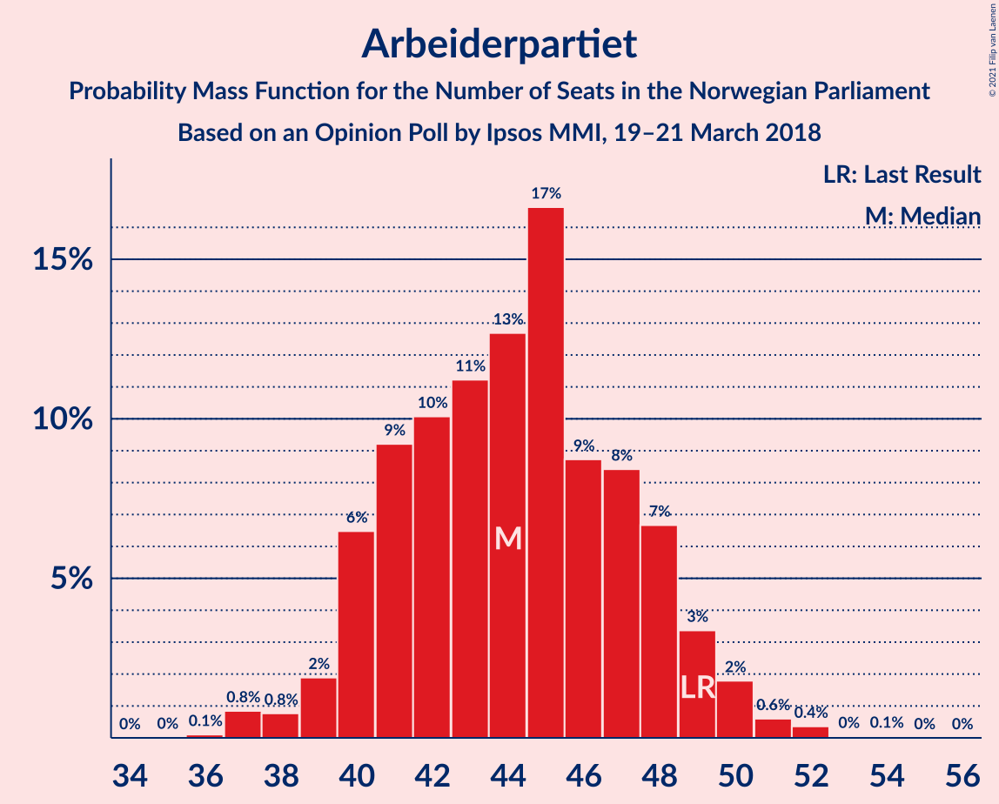
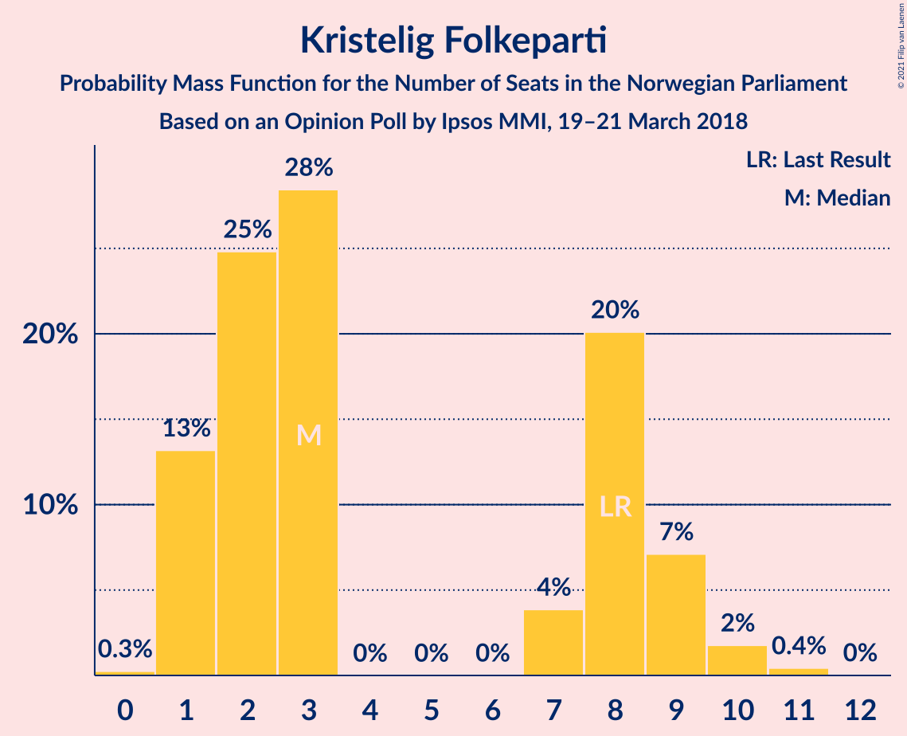
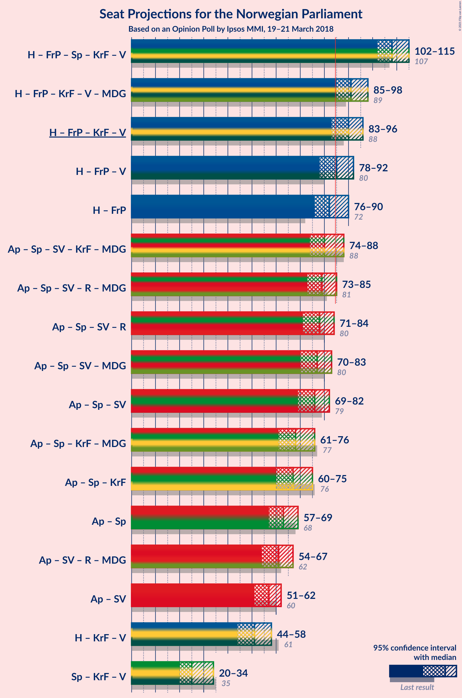
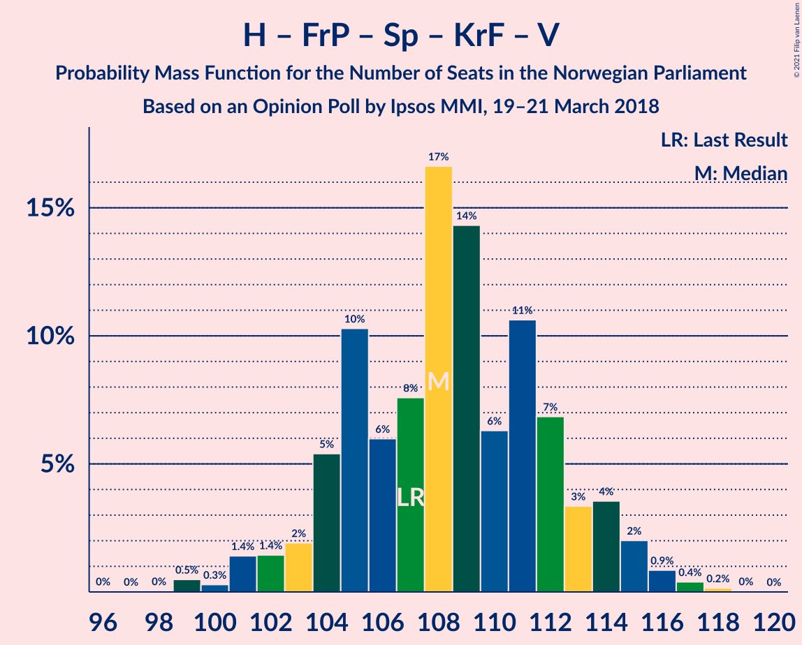
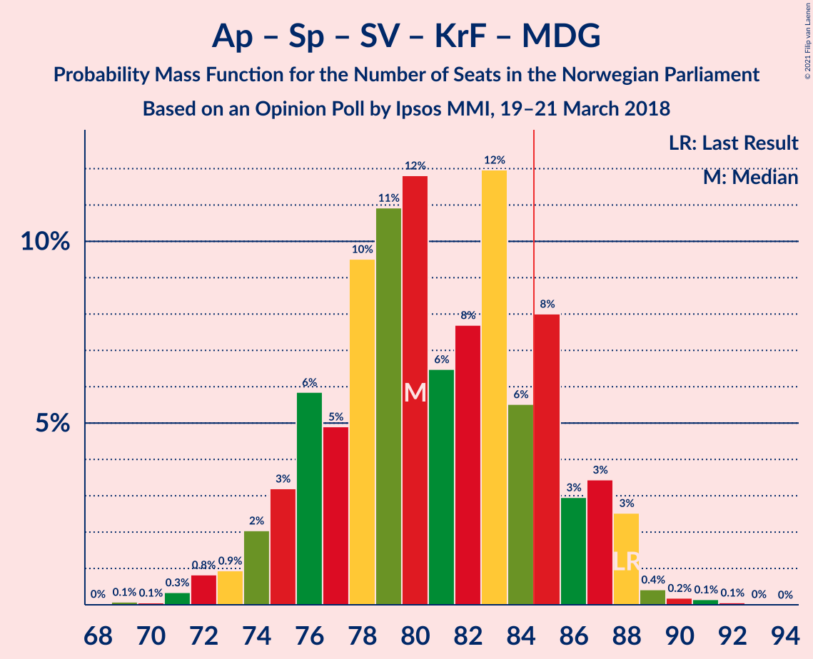

# Opinion Poll by Ipsos MMI, 19–21 March 2018

<a href="#voting-intentions">Voting Intentions</a> | <a href="#seats">Seats</a> | <a href="#coalitions">Coalitions</a> | <a href="#technical-information">Technical Information</a>

## Voting Intentions

### Confidence Intervals

| Party | Last Result | Poll Result | 80% Confidence Interval | 90% Confidence Interval | 95% Confidence Interval | 99% Confidence Interval |
|:-----:|:-----------:|:-----------:|:-----------------------:|:-----------------------:|:-----------------------:|:-----------------------:|
| Høyre | 25.0% | 23.9% | 22.1–25.7% |21.6–26.2% |21.2–26.7% |20.4–27.6% |
| Arbeiderpartiet | 27.4% | 23.6% | 21.9–25.5% |21.4–26.0% |21.0–26.5% |20.2–27.4% |
| Fremskrittspartiet | 15.2% | 20.7% | 19.1–22.5% |18.7–23.0% |18.3–23.5% |17.5–24.3% |
| Senterpartiet | 10.3% | 10.2% | 9.0–11.5% |8.7–11.9% |8.4–12.3% |7.8–13.0% |
| Sosialistisk Venstreparti | 6.0% | 6.6% | 5.7–7.8% |5.4–8.1% |5.2–8.4% |4.8–9.0% |
| Kristelig Folkeparti | 4.2% | 3.7% | 3.0–4.7% |2.9–4.9% |2.7–5.2% |2.4–5.7% |
| Rødt | 2.4% | 3.3% | 2.7–4.2% |2.5–4.5% |2.3–4.7% |2.1–5.1% |
| Venstre | 4.4% | 3.2% | 2.6–4.1% |2.4–4.3% |2.3–4.6% |2.0–5.0% |
| Miljøpartiet De Grønne | 3.2% | 2.4% | 1.8–3.1% |1.7–3.4% |1.6–3.6% |1.3–3.9% |

*Note:* The poll result column reflects the actual value used in the calculations. Published results may vary slightly, and in addition be rounded to fewer digits.

## Seats

### Confidence Intervals

| Party | Last Result | Median | 80% Confidence Interval | 90% Confidence Interval | 95% Confidence Interval | 99% Confidence Interval |
|:-----:|:-----------:|:------:|:-----------------------:|:-----------------------:|:-----------------------:|:-----------------------:|
| <a href="#høyre">Høyre</a> | 45 | 44 | 40–48 |40–49 |39–51 |37–52 |
| <a href="#arbeiderpartiet">Arbeiderpartiet</a> | 49 | 42 | 40–48 |40–50 |39–50 |38–50 |
| <a href="#fremskrittspartiet">Fremskrittspartiet</a> | 27 | 39 | 37–41 |36–42 |34–43 |32–45 |
| <a href="#senterpartiet">Senterpartiet</a> | 19 | 19 | 16–20 |15–21 |15–22 |14–24 |
| <a href="#sosialistisk-venstreparti">Sosialistisk Venstreparti</a> | 11 | 12 | 11–13 |10–14 |10–14 |10–17 |
| <a href="#kristelig-folkeparti">Kristelig Folkeparti</a> | 8 | 2 | 1–9 |1–9 |1–9 |1–10 |
| <a href="#rødt">Rødt</a> | 1 | 2 | 2–8 |1–8 |1–9 |1–10 |
| <a href="#venstre">Venstre</a> | 8 | 2 | 2–8 |2–8 |2–8 |1–9 |
| <a href="#miljøpartiet-de-grønne">Miljøpartiet De Grønne</a> | 1 | 1 | 1–2 |1–2 |1–2 |0–8 |

### Høyre

*For a full overview of the results for this party, see the [Høyre](party-høyre.html) page.*

| Number of Seats | Probability | Accumulated | Special Marks |
|:---------------:|:-----------:|:-----------:|:-------------:|
| 35 | 0% | 100% |  |
| 36 | 0.3% | 99.9% |  |
| 37 | 0.4% | 99.6% |  |
| 38 | 0.3% | 99.2% |  |
| 39 | 2% | 98.8% |  |
| 40 | 8% | 97% |  |
| 41 | 3% | 89% |  |
| 42 | 13% | 86% |  |
| 43 | 4% | 73% |  |
| 44 | 34% | 69% | Median |
| 45 | 5% | 35% | Last Result |
| 46 | 2% | 30% |  |
| 47 | 14% | 28% |  |
| 48 | 8% | 14% |  |
| 49 | 2% | 7% |  |
| 50 | 0.7% | 5% |  |
| 51 | 3% | 4% |  |
| 52 | 0.6% | 0.9% |  |
| 53 | 0.2% | 0.3% |  |
| 54 | 0.1% | 0.1% |  |
| 55 | 0% | 0% |  |

### Arbeiderpartiet

*For a full overview of the results for this party, see the [Arbeiderpartiet](party-arbeiderpartiet.html) page.*

| Number of Seats | Probability | Accumulated | Special Marks |
|:---------------:|:-----------:|:-----------:|:-------------:|
| 36 | 0.1% | 100% |  |
| 37 | 0.2% | 99.9% |  |
| 38 | 0.4% | 99.7% |  |
| 39 | 4% | 99.2% |  |
| 40 | 5% | 95% |  |
| 41 | 34% | 90% |  |
| 42 | 9% | 56% | Median |
| 43 | 4% | 47% |  |
| 44 | 7% | 43% |  |
| 45 | 9% | 36% |  |
| 46 | 10% | 27% |  |
| 47 | 5% | 16% |  |
| 48 | 2% | 11% |  |
| 49 | 0.2% | 9% | Last Result |
| 50 | 9% | 9% |  |
| 51 | 0.1% | 0.3% |  |
| 52 | 0.1% | 0.1% |  |
| 53 | 0% | 0.1% |  |
| 54 | 0% | 0% |  |

### Fremskrittspartiet

*For a full overview of the results for this party, see the [Fremskrittspartiet](party-fremskrittspartiet.html) page.*

| Number of Seats | Probability | Accumulated | Special Marks |
|:---------------:|:-----------:|:-----------:|:-------------:|
| 27 | 0% | 100% | Last Result |
| 28 | 0% | 100% |  |
| 29 | 0% | 100% |  |
| 30 | 0.1% | 100% |  |
| 31 | 0.1% | 99.9% |  |
| 32 | 0.5% | 99.8% |  |
| 33 | 0.6% | 99.3% |  |
| 34 | 2% | 98.7% |  |
| 35 | 1.0% | 97% |  |
| 36 | 5% | 96% |  |
| 37 | 7% | 91% |  |
| 38 | 15% | 85% |  |
| 39 | 26% | 70% | Median |
| 40 | 32% | 44% |  |
| 41 | 5% | 12% |  |
| 42 | 4% | 7% |  |
| 43 | 0.5% | 3% |  |
| 44 | 2% | 2% |  |
| 45 | 0.4% | 0.6% |  |
| 46 | 0.2% | 0.2% |  |
| 47 | 0% | 0% |  |

### Senterpartiet

*For a full overview of the results for this party, see the [Senterpartiet](party-senterpartiet.html) page.*

| Number of Seats | Probability | Accumulated | Special Marks |
|:---------------:|:-----------:|:-----------:|:-------------:|
| 13 | 0.1% | 100% |  |
| 14 | 1.1% | 99.9% |  |
| 15 | 5% | 98.8% |  |
| 16 | 7% | 93% |  |
| 17 | 12% | 86% |  |
| 18 | 10% | 74% |  |
| 19 | 27% | 64% | Last Result, Median |
| 20 | 32% | 37% |  |
| 21 | 2% | 6% |  |
| 22 | 2% | 3% |  |
| 23 | 0.7% | 1.4% |  |
| 24 | 0.5% | 0.7% |  |
| 25 | 0.2% | 0.2% |  |
| 26 | 0.1% | 0.1% |  |
| 27 | 0% | 0% |  |

### Sosialistisk Venstreparti

*For a full overview of the results for this party, see the [Sosialistisk Venstreparti](party-sosialistiskvenstreparti.html) page.*

| Number of Seats | Probability | Accumulated | Special Marks |
|:---------------:|:-----------:|:-----------:|:-------------:|
| 9 | 0.4% | 100% |  |
| 10 | 7% | 99.5% |  |
| 11 | 20% | 93% | Last Result |
| 12 | 38% | 73% | Median |
| 13 | 25% | 35% |  |
| 14 | 7% | 10% |  |
| 15 | 2% | 2% |  |
| 16 | 0.2% | 0.8% |  |
| 17 | 0.4% | 0.6% |  |
| 18 | 0.1% | 0.1% |  |
| 19 | 0.1% | 0.1% |  |
| 20 | 0% | 0% |  |

### Kristelig Folkeparti

*For a full overview of the results for this party, see the [Kristelig Folkeparti](party-kristeligfolkeparti.html) page.*

| Number of Seats | Probability | Accumulated | Special Marks |
|:---------------:|:-----------:|:-----------:|:-------------:|
| 0 | 0.3% | 100% |  |
| 1 | 26% | 99.7% |  |
| 2 | 41% | 74% | Median |
| 3 | 7% | 33% |  |
| 4 | 0% | 25% |  |
| 5 | 0% | 25% |  |
| 6 | 0% | 25% |  |
| 7 | 3% | 25% |  |
| 8 | 11% | 22% | Last Result |
| 9 | 10% | 12% |  |
| 10 | 2% | 2% |  |
| 11 | 0.2% | 0.3% |  |
| 12 | 0% | 0% |  |

### Rødt

*For a full overview of the results for this party, see the [Rødt](party-rødt.html) page.*

| Number of Seats | Probability | Accumulated | Special Marks |
|:---------------:|:-----------:|:-----------:|:-------------:|
| 1 | 9% | 100% | Last Result |
| 2 | 51% | 91% | Median |
| 3 | 0% | 40% |  |
| 4 | 0% | 40% |  |
| 5 | 0% | 40% |  |
| 6 | 0% | 40% |  |
| 7 | 23% | 40% |  |
| 8 | 14% | 17% |  |
| 9 | 2% | 3% |  |
| 10 | 1.1% | 1.1% |  |
| 11 | 0% | 0% |  |

### Venstre

*For a full overview of the results for this party, see the [Venstre](party-venstre.html) page.*

| Number of Seats | Probability | Accumulated | Special Marks |
|:---------------:|:-----------:|:-----------:|:-------------:|
| 0 | 0.1% | 100% |  |
| 1 | 2% | 99.9% |  |
| 2 | 85% | 98% | Median |
| 3 | 2% | 13% |  |
| 4 | 0% | 11% |  |
| 5 | 0% | 11% |  |
| 6 | 0% | 11% |  |
| 7 | 0.7% | 11% |  |
| 8 | 10% | 11% | Last Result |
| 9 | 0.9% | 1.0% |  |
| 10 | 0% | 0.1% |  |
| 11 | 0% | 0% |  |

### Miljøpartiet De Grønne

*For a full overview of the results for this party, see the [Miljøpartiet De Grønne](party-miljøpartietdegrønne.html) page.*

| Number of Seats | Probability | Accumulated | Special Marks |
|:---------------:|:-----------:|:-----------:|:-------------:|
| 0 | 2% | 100% |  |
| 1 | 84% | 98% | Last Result, Median |
| 2 | 13% | 14% |  |
| 3 | 0.2% | 0.8% |  |
| 4 | 0% | 0.6% |  |
| 5 | 0% | 0.6% |  |
| 6 | 0% | 0.6% |  |
| 7 | 0% | 0.6% |  |
| 8 | 0.5% | 0.5% |  |
| 9 | 0% | 0% |  |

## Coalitions

### Confidence Intervals

| Coalition | Last Result | Median | Majority? | 80% Confidence Interval | 90% Confidence Interval | 95% Confidence Interval | 99% Confidence Interval |
|:---------:|:-----------:|:------:|:---------:|:-----------------------:|:-----------------------:|:-----------------------:|:-----------------------:|
| Høyre – Fremskrittspartiet – Senterpartiet – Kristelig Folkeparti – Venstre | 107 | 108 | 100% | 103–112 | 101–113 | 101–115 | 101–116 |
| Høyre – Fremskrittspartiet – Kristelig Folkeparti – Venstre – Miljøpartiet De Grønne | 89 | 90 | 99.0% | 85–96 | 85–97 | 85–98 | 83–100 |
| Høyre – Fremskrittspartiet – Kristelig Folkeparti – Venstre | 88 | 89 | 88% | 84–95 | 84–96 | 84–97 | 82–99 |
| Høyre – Fremskrittspartiet – Venstre | 80 | 86 | 73% | 81–90 | 80–92 | 80–93 | 77–95 |
| Høyre – Fremskrittspartiet | 72 | 84 | 29% | 78–88 | 78–90 | 76–90 | 74–92 |
| Arbeiderpartiet – Senterpartiet – Sosialistisk Venstreparti – Kristelig Folkeparti – Miljøpartiet De Grønne | 88 | 78 | 10% | 75–85 | 74–87 | 72–87 | 70–89 |
| Arbeiderpartiet – Senterpartiet – Sosialistisk Venstreparti – Rødt – Miljøpartiet De Grønne | 81 | 80 | 12% | 74–85 | 73–85 | 72–85 | 70–87 |
| Arbeiderpartiet – Senterpartiet – Sosialistisk Venstreparti – Rødt | 80 | 79 | 0.9% | 73–84 | 72–84 | 70–84 | 69–86 |
| Arbeiderpartiet – Senterpartiet – Sosialistisk Venstreparti – Miljøpartiet De Grønne | 80 | 75 | 0.1% | 71–81 | 71–81 | 69–81 | 67–83 |
| Arbeiderpartiet – Senterpartiet – Sosialistisk Venstreparti | 79 | 74 | 0.1% | 70–79 | 70–80 | 68–80 | 66–82 |
| Arbeiderpartiet – Senterpartiet – Kristelig Folkeparti – Miljøpartiet De Grønne | 77 | 65 | 0% | 63–73 | 61–74 | 60–74 | 59–77 |
| Arbeiderpartiet – Senterpartiet – Kristelig Folkeparti | 76 | 64 | 0% | 62–72 | 60–73 | 59–73 | 58–76 |
| Arbeiderpartiet – Senterpartiet | 68 | 62 | 0% | 58–67 | 57–69 | 56–69 | 54–70 |
| Arbeiderpartiet – Sosialistisk Venstreparti | 60 | 54 | 0% | 53–60 | 51–61 | 51–61 | 50–61 |
| Høyre – Kristelig Folkeparti – Venstre | 61 | 50 | 0% | 47–57 | 45–58 | 45–61 | 44–61 |
| Senterpartiet – Kristelig Folkeparti – Venstre | 35 | 24 | 0% | 20–30 | 20–32 | 20–34 | 19–36 |

### Høyre – Fremskrittspartiet – Senterpartiet – Kristelig Folkeparti – Venstre

| Number of Seats | Probability | Accumulated | Special Marks |
|:---------------:|:-----------:|:-----------:|:-------------:|
| 98 | 0% | 100% |  |
| 99 | 0.1% | 99.9% |  |
| 100 | 0.1% | 99.8% |  |
| 101 | 7% | 99.8% |  |
| 102 | 1.1% | 92% |  |
| 103 | 4% | 91% |  |
| 104 | 1.1% | 88% |  |
| 105 | 10% | 87% |  |
| 106 | 1.2% | 77% | Median |
| 107 | 4% | 76% | Last Result |
| 108 | 33% | 72% |  |
| 109 | 4% | 39% |  |
| 110 | 3% | 35% |  |
| 111 | 15% | 31% |  |
| 112 | 8% | 16% |  |
| 113 | 3% | 7% |  |
| 114 | 2% | 5% |  |
| 115 | 3% | 3% |  |
| 116 | 0.3% | 0.5% |  |
| 117 | 0.1% | 0.2% |  |
| 118 | 0.1% | 0.1% |  |
| 119 | 0% | 0% |  |

### Høyre – Fremskrittspartiet – Kristelig Folkeparti – Venstre – Miljøpartiet De Grønne

| Number of Seats | Probability | Accumulated | Special Marks |
|:---------------:|:-----------:|:-----------:|:-------------:|
| 81 | 0% | 100% |  |
| 82 | 0.3% | 99.9% |  |
| 83 | 0.2% | 99.6% |  |
| 84 | 0.4% | 99.4% |  |
| 85 | 11% | 99.0% | Majority |
| 86 | 0.9% | 88% |  |
| 87 | 9% | 88% |  |
| 88 | 2% | 79% | Median |
| 89 | 22% | 77% | Last Result |
| 90 | 8% | 54% |  |
| 91 | 7% | 46% |  |
| 92 | 4% | 39% |  |
| 93 | 14% | 35% |  |
| 94 | 4% | 21% |  |
| 95 | 6% | 17% |  |
| 96 | 2% | 11% |  |
| 97 | 7% | 9% |  |
| 98 | 0.1% | 3% |  |
| 99 | 0.2% | 2% |  |
| 100 | 2% | 2% |  |
| 101 | 0.1% | 0.1% |  |
| 102 | 0% | 0% |  |

### Høyre – Fremskrittspartiet – Kristelig Folkeparti – Venstre

| Number of Seats | Probability | Accumulated | Special Marks |
|:---------------:|:-----------:|:-----------:|:-------------:|
| 79 | 0% | 100% |  |
| 80 | 0% | 99.9% |  |
| 81 | 0.4% | 99.9% |  |
| 82 | 0.2% | 99.5% |  |
| 83 | 0.4% | 99.4% |  |
| 84 | 11% | 99.0% |  |
| 85 | 1.2% | 88% | Majority |
| 86 | 9% | 87% |  |
| 87 | 2% | 78% | Median |
| 88 | 22% | 76% | Last Result |
| 89 | 8% | 54% |  |
| 90 | 7% | 45% |  |
| 91 | 10% | 38% |  |
| 92 | 7% | 28% |  |
| 93 | 4% | 20% |  |
| 94 | 5% | 16% |  |
| 95 | 2% | 11% |  |
| 96 | 6% | 9% |  |
| 97 | 0.2% | 3% |  |
| 98 | 1.1% | 2% |  |
| 99 | 1.2% | 1.3% |  |
| 100 | 0% | 0.1% |  |
| 101 | 0% | 0% |  |

### Høyre – Fremskrittspartiet – Venstre

| Number of Seats | Probability | Accumulated | Special Marks |
|:---------------:|:-----------:|:-----------:|:-------------:|
| 75 | 0.1% | 100% |  |
| 76 | 0.3% | 99.9% |  |
| 77 | 0.3% | 99.6% |  |
| 78 | 0.4% | 99.3% |  |
| 79 | 0.5% | 98.8% |  |
| 80 | 7% | 98% | Last Result |
| 81 | 4% | 91% |  |
| 82 | 2% | 87% |  |
| 83 | 10% | 85% |  |
| 84 | 2% | 76% |  |
| 85 | 11% | 73% | Median, Majority |
| 86 | 24% | 62% |  |
| 87 | 1.3% | 38% |  |
| 88 | 6% | 36% |  |
| 89 | 14% | 30% |  |
| 90 | 7% | 16% |  |
| 91 | 3% | 9% |  |
| 92 | 3% | 6% |  |
| 93 | 3% | 3% |  |
| 94 | 0.2% | 0.7% |  |
| 95 | 0.4% | 0.6% |  |
| 96 | 0.1% | 0.2% |  |
| 97 | 0% | 0.1% |  |
| 98 | 0% | 0% |  |

### Høyre – Fremskrittspartiet

| Number of Seats | Probability | Accumulated | Special Marks |
|:---------------:|:-----------:|:-----------:|:-------------:|
| 72 | 0.1% | 100% | Last Result |
| 73 | 0.1% | 99.9% |  |
| 74 | 0.5% | 99.8% |  |
| 75 | 0.5% | 99.3% |  |
| 76 | 2% | 98.8% |  |
| 77 | 0.4% | 97% |  |
| 78 | 8% | 97% |  |
| 79 | 4% | 89% |  |
| 80 | 3% | 85% |  |
| 81 | 13% | 82% |  |
| 82 | 2% | 69% |  |
| 83 | 13% | 67% | Median |
| 84 | 24% | 53% |  |
| 85 | 1.1% | 29% | Majority |
| 86 | 6% | 28% |  |
| 87 | 9% | 22% |  |
| 88 | 7% | 13% |  |
| 89 | 0.3% | 6% |  |
| 90 | 3% | 5% |  |
| 91 | 2% | 2% |  |
| 92 | 0.5% | 0.7% |  |
| 93 | 0% | 0.2% |  |
| 94 | 0.1% | 0.1% |  |
| 95 | 0% | 0% |  |

### Arbeiderpartiet – Senterpartiet – Sosialistisk Venstreparti – Kristelig Folkeparti – Miljøpartiet De Grønne

| Number of Seats | Probability | Accumulated | Special Marks |
|:---------------:|:-----------:|:-----------:|:-------------:|
| 69 | 0.4% | 100% |  |
| 70 | 0.1% | 99.5% |  |
| 71 | 0.6% | 99.5% |  |
| 72 | 3% | 98.9% |  |
| 73 | 0.5% | 96% |  |
| 74 | 2% | 96% |  |
| 75 | 5% | 94% |  |
| 76 | 24% | 89% | Median |
| 77 | 8% | 65% |  |
| 78 | 19% | 57% |  |
| 79 | 6% | 37% |  |
| 80 | 4% | 31% |  |
| 81 | 2% | 27% |  |
| 82 | 11% | 26% |  |
| 83 | 1.4% | 15% |  |
| 84 | 3% | 13% |  |
| 85 | 0.8% | 10% | Majority |
| 86 | 2% | 10% |  |
| 87 | 6% | 8% |  |
| 88 | 1.5% | 2% | Last Result |
| 89 | 0.1% | 0.6% |  |
| 90 | 0.2% | 0.5% |  |
| 91 | 0.2% | 0.3% |  |
| 92 | 0% | 0.1% |  |
| 93 | 0% | 0% |  |

### Arbeiderpartiet – Senterpartiet – Sosialistisk Venstreparti – Rødt – Miljøpartiet De Grønne

| Number of Seats | Probability | Accumulated | Special Marks |
|:---------------:|:-----------:|:-----------:|:-------------:|
| 69 | 0% | 100% |  |
| 70 | 1.2% | 99.9% |  |
| 71 | 1.1% | 98.7% |  |
| 72 | 0.2% | 98% |  |
| 73 | 6% | 97% |  |
| 74 | 2% | 91% |  |
| 75 | 5% | 89% |  |
| 76 | 4% | 84% | Median |
| 77 | 7% | 80% |  |
| 78 | 10% | 72% |  |
| 79 | 7% | 62% |  |
| 80 | 8% | 54% |  |
| 81 | 22% | 46% | Last Result |
| 82 | 2% | 24% |  |
| 83 | 9% | 22% |  |
| 84 | 1.1% | 13% |  |
| 85 | 11% | 12% | Majority |
| 86 | 0.4% | 1.0% |  |
| 87 | 0.2% | 0.6% |  |
| 88 | 0.4% | 0.4% |  |
| 89 | 0% | 0.1% |  |
| 90 | 0% | 0.1% |  |
| 91 | 0% | 0% |  |

### Arbeiderpartiet – Senterpartiet – Sosialistisk Venstreparti – Rødt

| Number of Seats | Probability | Accumulated | Special Marks |
|:---------------:|:-----------:|:-----------:|:-------------:|
| 68 | 0.1% | 100% |  |
| 69 | 2% | 99.9% |  |
| 70 | 0.2% | 98% |  |
| 71 | 0.1% | 97% |  |
| 72 | 7% | 97% |  |
| 73 | 2% | 91% |  |
| 74 | 6% | 89% |  |
| 75 | 4% | 83% | Median |
| 76 | 14% | 79% |  |
| 77 | 4% | 65% |  |
| 78 | 7% | 61% |  |
| 79 | 8% | 54% |  |
| 80 | 22% | 46% | Last Result |
| 81 | 2% | 23% |  |
| 82 | 9% | 21% |  |
| 83 | 0.8% | 12% |  |
| 84 | 11% | 12% |  |
| 85 | 0.4% | 0.9% | Majority |
| 86 | 0.2% | 0.6% |  |
| 87 | 0.3% | 0.4% |  |
| 88 | 0% | 0.1% |  |
| 89 | 0% | 0% |  |

### Arbeiderpartiet – Senterpartiet – Sosialistisk Venstreparti – Miljøpartiet De Grønne

| Number of Seats | Probability | Accumulated | Special Marks |
|:---------------:|:-----------:|:-----------:|:-------------:|
| 66 | 0.1% | 100% |  |
| 67 | 0.4% | 99.9% |  |
| 68 | 2% | 99.5% |  |
| 69 | 0.3% | 98% |  |
| 70 | 1.3% | 97% |  |
| 71 | 8% | 96% |  |
| 72 | 3% | 88% |  |
| 73 | 6% | 85% |  |
| 74 | 26% | 79% | Median |
| 75 | 8% | 53% |  |
| 76 | 11% | 45% |  |
| 77 | 14% | 34% |  |
| 78 | 7% | 20% |  |
| 79 | 1.5% | 12% |  |
| 80 | 0.6% | 11% | Last Result |
| 81 | 9% | 10% |  |
| 82 | 0.6% | 1.4% |  |
| 83 | 0.4% | 0.8% |  |
| 84 | 0.3% | 0.4% |  |
| 85 | 0% | 0.1% | Majority |
| 86 | 0% | 0.1% |  |
| 87 | 0% | 0% |  |

### Arbeiderpartiet – Senterpartiet – Sosialistisk Venstreparti

| Number of Seats | Probability | Accumulated | Special Marks |
|:---------------:|:-----------:|:-----------:|:-------------:|
| 65 | 0.1% | 100% |  |
| 66 | 0.5% | 99.9% |  |
| 67 | 2% | 99.4% |  |
| 68 | 1.2% | 98% |  |
| 69 | 0.2% | 96% |  |
| 70 | 9% | 96% |  |
| 71 | 3% | 87% |  |
| 72 | 7% | 84% |  |
| 73 | 25% | 78% | Median |
| 74 | 14% | 52% |  |
| 75 | 5% | 38% |  |
| 76 | 13% | 33% |  |
| 77 | 8% | 20% |  |
| 78 | 2% | 12% |  |
| 79 | 0.4% | 10% | Last Result |
| 80 | 9% | 10% |  |
| 81 | 0.3% | 1.0% |  |
| 82 | 0.3% | 0.7% |  |
| 83 | 0.3% | 0.4% |  |
| 84 | 0% | 0.1% |  |
| 85 | 0% | 0.1% | Majority |
| 86 | 0% | 0% |  |

### Arbeiderpartiet – Senterpartiet – Kristelig Folkeparti – Miljøpartiet De Grønne

| Number of Seats | Probability | Accumulated | Special Marks |
|:---------------:|:-----------:|:-----------:|:-------------:|
| 56 | 0% | 100% |  |
| 57 | 0% | 99.9% |  |
| 58 | 0.1% | 99.9% |  |
| 59 | 0.5% | 99.8% |  |
| 60 | 3% | 99.3% |  |
| 61 | 2% | 96% |  |
| 62 | 2% | 94% |  |
| 63 | 6% | 92% |  |
| 64 | 25% | 86% | Median |
| 65 | 13% | 61% |  |
| 66 | 15% | 48% |  |
| 67 | 2% | 33% |  |
| 68 | 2% | 31% |  |
| 69 | 1.5% | 29% |  |
| 70 | 5% | 28% |  |
| 71 | 9% | 23% |  |
| 72 | 2% | 14% |  |
| 73 | 3% | 12% |  |
| 74 | 6% | 8% |  |
| 75 | 0.4% | 2% |  |
| 76 | 0.1% | 2% |  |
| 77 | 1.3% | 2% | Last Result |
| 78 | 0.2% | 0.4% |  |
| 79 | 0.2% | 0.3% |  |
| 80 | 0.1% | 0.1% |  |
| 81 | 0% | 0% |  |

### Arbeiderpartiet – Senterpartiet – Kristelig Folkeparti

| Number of Seats | Probability | Accumulated | Special Marks |
|:---------------:|:-----------:|:-----------:|:-------------:|
| 56 | 0.1% | 100% |  |
| 57 | 0% | 99.9% |  |
| 58 | 0.6% | 99.9% |  |
| 59 | 3% | 99.3% |  |
| 60 | 2% | 96% |  |
| 61 | 2% | 94% |  |
| 62 | 6% | 92% |  |
| 63 | 25% | 86% | Median |
| 64 | 21% | 60% |  |
| 65 | 7% | 39% |  |
| 66 | 2% | 33% |  |
| 67 | 2% | 30% |  |
| 68 | 1.0% | 28% |  |
| 69 | 5% | 27% |  |
| 70 | 9% | 22% |  |
| 71 | 3% | 13% |  |
| 72 | 2% | 11% |  |
| 73 | 6% | 8% |  |
| 74 | 0.4% | 2% |  |
| 75 | 0.1% | 2% |  |
| 76 | 1.3% | 2% | Last Result |
| 77 | 0% | 0.4% |  |
| 78 | 0.2% | 0.4% |  |
| 79 | 0.1% | 0.1% |  |
| 80 | 0% | 0% |  |

### Arbeiderpartiet – Senterpartiet

| Number of Seats | Probability | Accumulated | Special Marks |
|:---------------:|:-----------:|:-----------:|:-------------:|
| 53 | 0.1% | 100% |  |
| 54 | 1.2% | 99.9% |  |
| 55 | 0.2% | 98.7% |  |
| 56 | 1.3% | 98% |  |
| 57 | 7% | 97% |  |
| 58 | 6% | 91% |  |
| 59 | 1.4% | 85% |  |
| 60 | 8% | 84% |  |
| 61 | 25% | 76% | Median |
| 62 | 15% | 51% |  |
| 63 | 10% | 35% |  |
| 64 | 8% | 25% |  |
| 65 | 3% | 17% |  |
| 66 | 3% | 14% |  |
| 67 | 2% | 11% |  |
| 68 | 0.6% | 10% | Last Result |
| 69 | 8% | 9% |  |
| 70 | 0.4% | 0.7% |  |
| 71 | 0% | 0.2% |  |
| 72 | 0.1% | 0.2% |  |
| 73 | 0% | 0.1% |  |
| 74 | 0% | 0% |  |

### Arbeiderpartiet – Sosialistisk Venstreparti

| Number of Seats | Probability | Accumulated | Special Marks |
|:---------------:|:-----------:|:-----------:|:-------------:|
| 48 | 0.1% | 100% |  |
| 49 | 0.2% | 99.9% |  |
| 50 | 2% | 99.7% |  |
| 51 | 3% | 98% |  |
| 52 | 4% | 95% |  |
| 53 | 24% | 90% |  |
| 54 | 18% | 67% | Median |
| 55 | 6% | 49% |  |
| 56 | 4% | 43% |  |
| 57 | 9% | 39% |  |
| 58 | 8% | 30% |  |
| 59 | 12% | 22% |  |
| 60 | 1.2% | 10% | Last Result |
| 61 | 9% | 9% |  |
| 62 | 0.1% | 0.4% |  |
| 63 | 0.1% | 0.3% |  |
| 64 | 0.1% | 0.2% |  |
| 65 | 0% | 0.1% |  |
| 66 | 0% | 0% |  |

### Høyre – Kristelig Folkeparti – Venstre

| Number of Seats | Probability | Accumulated | Special Marks |
|:---------------:|:-----------:|:-----------:|:-------------:|
| 41 | 0.3% | 100% |  |
| 42 | 0% | 99.7% |  |
| 43 | 0.1% | 99.6% |  |
| 44 | 0.5% | 99.5% |  |
| 45 | 8% | 99.0% |  |
| 46 | 0.2% | 91% |  |
| 47 | 11% | 91% |  |
| 48 | 26% | 80% | Median |
| 49 | 2% | 53% |  |
| 50 | 2% | 52% |  |
| 51 | 23% | 50% |  |
| 52 | 3% | 27% |  |
| 53 | 3% | 24% |  |
| 54 | 3% | 21% |  |
| 55 | 5% | 18% |  |
| 56 | 3% | 14% |  |
| 57 | 0.9% | 11% |  |
| 58 | 6% | 10% |  |
| 59 | 1.2% | 4% |  |
| 60 | 0.2% | 3% |  |
| 61 | 2% | 3% | Last Result |
| 62 | 0.2% | 0.4% |  |
| 63 | 0% | 0.1% |  |
| 64 | 0.1% | 0.1% |  |
| 65 | 0% | 0% |  |

### Senterpartiet – Kristelig Folkeparti – Venstre

| Number of Seats | Probability | Accumulated | Special Marks |
|:---------------:|:-----------:|:-----------:|:-------------:|
| 17 | 0.1% | 100% |  |
| 18 | 0.3% | 99.9% |  |
| 19 | 2% | 99.6% |  |
| 20 | 8% | 98% |  |
| 21 | 3% | 89% |  |
| 22 | 14% | 87% |  |
| 23 | 7% | 73% | Median |
| 24 | 33% | 66% |  |
| 25 | 3% | 33% |  |
| 26 | 7% | 30% |  |
| 27 | 4% | 23% |  |
| 28 | 3% | 19% |  |
| 29 | 1.1% | 17% |  |
| 30 | 7% | 16% |  |
| 31 | 2% | 9% |  |
| 32 | 3% | 6% |  |
| 33 | 0.2% | 4% |  |
| 34 | 2% | 4% |  |
| 35 | 1.4% | 2% | Last Result |
| 36 | 0.4% | 0.7% |  |
| 37 | 0.1% | 0.2% |  |
| 38 | 0.1% | 0.2% |  |
| 39 | 0.1% | 0.1% |  |
| 40 | 0% | 0% |  |

## Technical Information

### Opinion Poll

+ **Polling firm:** Ipsos MMI
+ **Commissioner(s):** —
+ **Fieldwork period:** 19–21 March 2018

### Calculations

+ **Sample size:** 935
+ **Simulations done:** 131,072
+ **Error estimate:** 2.36%

