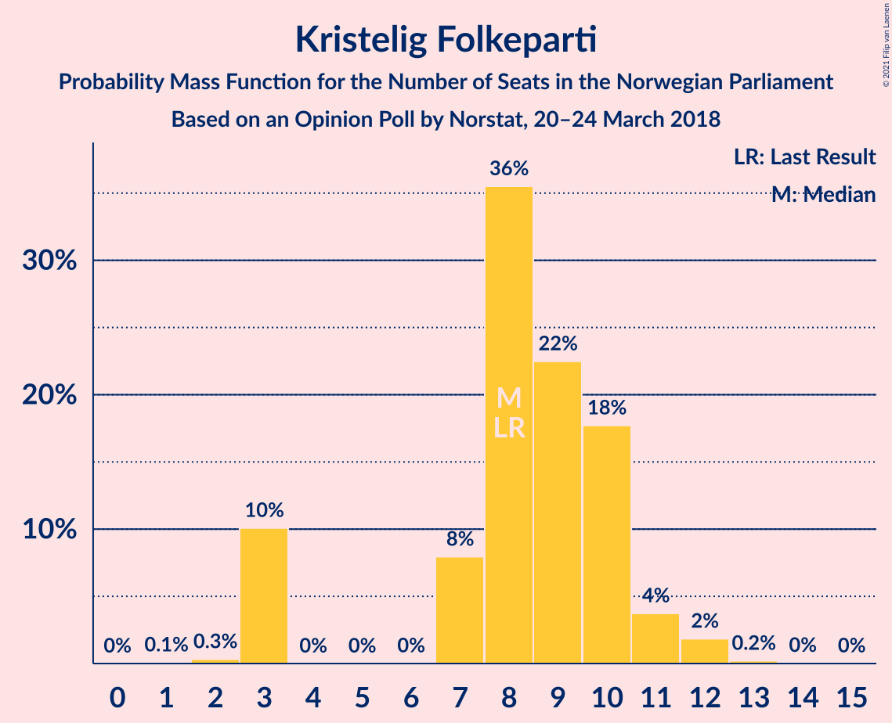
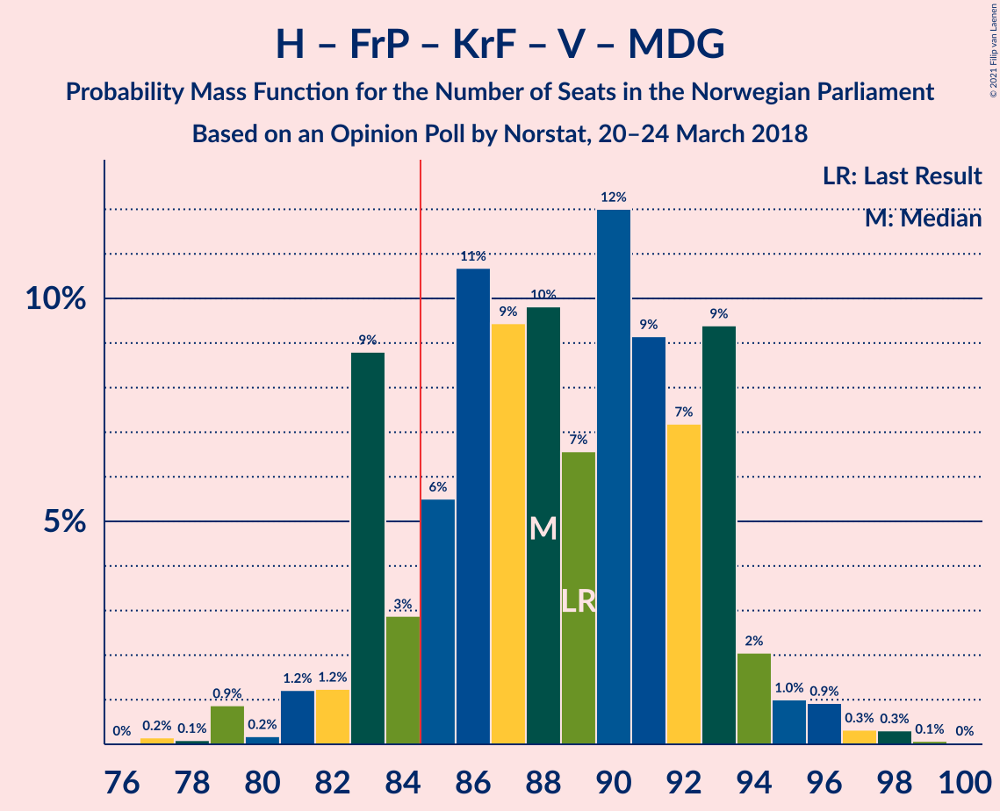
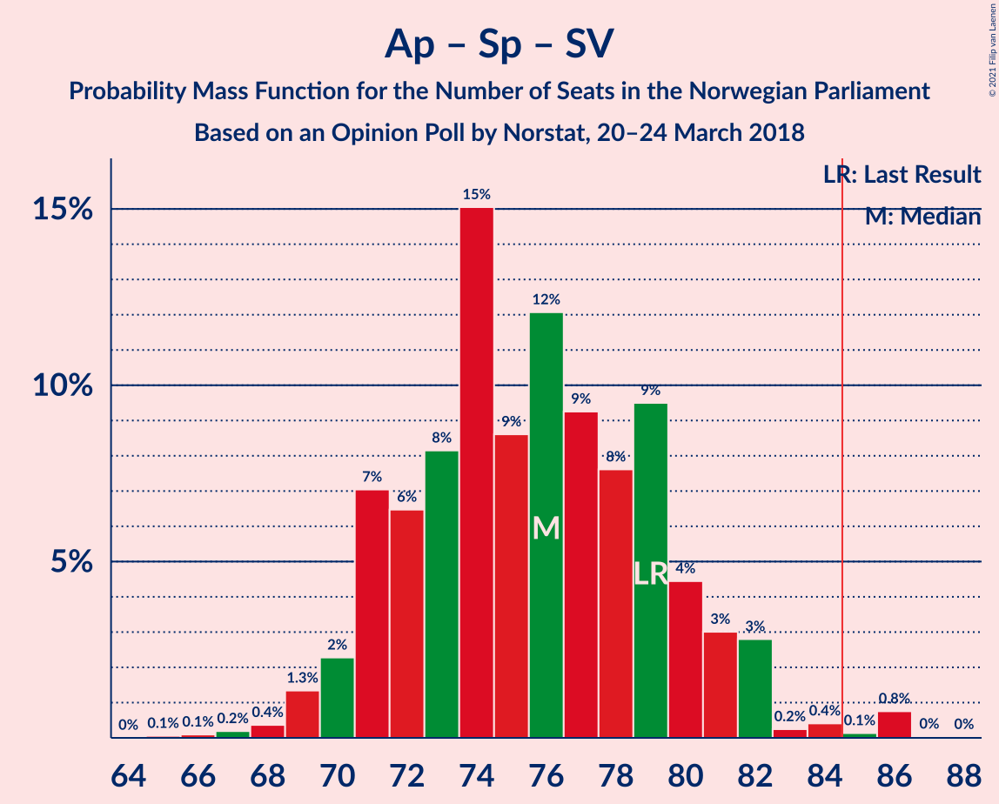

# Opinion Poll by Norstat, 20–24 March 2018

<a href="#voting-intentions">Voting Intentions</a> | <a href="#seats">Seats</a> | <a href="#coalitions">Coalitions</a> | <a href="#technical-information">Technical Information</a>

## Voting Intentions

### Confidence Intervals

| Party | Last Result | Poll Result | 80% Confidence Interval | 90% Confidence Interval | 95% Confidence Interval | 99% Confidence Interval |
|:-----:|:-----------:|:-----------:|:-----------------------:|:-----------------------:|:-----------------------:|:-----------------------:|
| Høyre | 25.0% | 25.3% | 23.6–27.2% |23.1–27.7% |22.7–28.2% |21.9–29.1% |
| Arbeiderpartiet | 27.4% | 24.3% | 22.6–26.1% |22.1–26.7% |21.7–27.1% |20.9–28.0% |
| Fremskrittspartiet | 15.2% | 15.4% | 14.0–17.0% |13.6–17.4% |13.2–17.8% |12.6–18.6% |
| Senterpartiet | 10.3% | 11.0% | 9.8–12.4% |9.4–12.8% |9.2–13.2% |8.6–13.8% |
| Sosialistisk Venstreparti | 6.0% | 6.6% | 5.7–7.7% |5.4–8.1% |5.2–8.4% |4.8–8.9% |
| Kristelig Folkeparti | 4.2% | 4.8% | 4.0–5.8% |3.8–6.1% |3.6–6.4% |3.3–6.9% |
| Venstre | 4.4% | 4.3% | 3.6–5.3% |3.4–5.5% |3.2–5.8% |2.9–6.3% |
| Rødt | 2.4% | 4.0% | 3.3–4.9% |3.1–5.2% |2.9–5.4% |2.6–5.9% |
| Miljøpartiet De Grønne | 3.2% | 2.3% | 1.8–3.1% |1.6–3.3% |1.5–3.5% |1.3–3.9% |

*Note:* The poll result column reflects the actual value used in the calculations. Published results may vary slightly, and in addition be rounded to fewer digits.

## Seats

### Confidence Intervals

| Party | Last Result | Median | 80% Confidence Interval | 90% Confidence Interval | 95% Confidence Interval | 99% Confidence Interval |
|:-----:|:-----------:|:------:|:-----------------------:|:-----------------------:|:-----------------------:|:-----------------------:|
| <a href="#høyre">Høyre</a> | 45 | 45 | 42–48 |41–50 |40–51 |38–53 |
| <a href="#arbeiderpartiet">Arbeiderpartiet</a> | 49 | 43 | 41–47 |40–49 |40–51 |39–51 |
| <a href="#fremskrittspartiet">Fremskrittspartiet</a> | 27 | 28 | 25–30 |25–32 |24–33 |22–34 |
| <a href="#senterpartiet">Senterpartiet</a> | 19 | 19 | 17–22 |17–23 |16–24 |15–25 |
| <a href="#sosialistisk-venstreparti">Sosialistisk Venstreparti</a> | 11 | 12 | 10–15 |9–15 |9–15 |8–16 |
| <a href="#kristelig-folkeparti">Kristelig Folkeparti</a> | 8 | 8 | 3–10 |3–11 |3–11 |3–12 |
| <a href="#venstre">Venstre</a> | 8 | 7 | 2–9 |2–9 |2–10 |2–11 |
| <a href="#rødt">Rødt</a> | 1 | 7 | 2–8 |2–9 |2–10 |1–11 |
| <a href="#miljøpartiet-de-grønne">Miljøpartiet De Grønne</a> | 1 | 1 | 0–2 |0–2 |0–2 |0–2 |

### Høyre

*For a full overview of the results for this party, see the [Høyre](party-høyre.html) page.*

| Number of Seats | Probability | Accumulated | Special Marks |
|:---------------:|:-----------:|:-----------:|:-------------:|
| 36 | 0.1% | 100% |  |
| 37 | 0.1% | 99.9% |  |
| 38 | 0.3% | 99.8% |  |
| 39 | 2% | 99.5% |  |
| 40 | 0.8% | 98% |  |
| 41 | 3% | 97% |  |
| 42 | 5% | 94% |  |
| 43 | 18% | 89% |  |
| 44 | 18% | 71% |  |
| 45 | 14% | 53% | Last Result, Median |
| 46 | 12% | 39% |  |
| 47 | 9% | 27% |  |
| 48 | 9% | 17% |  |
| 49 | 0.5% | 8% |  |
| 50 | 3% | 8% |  |
| 51 | 4% | 5% |  |
| 52 | 0.6% | 1.2% |  |
| 53 | 0.3% | 0.5% |  |
| 54 | 0.1% | 0.3% |  |
| 55 | 0.2% | 0.2% |  |
| 56 | 0% | 0% |  |

### Arbeiderpartiet

*For a full overview of the results for this party, see the [Arbeiderpartiet](party-arbeiderpartiet.html) page.*

| Number of Seats | Probability | Accumulated | Special Marks |
|:---------------:|:-----------:|:-----------:|:-------------:|
| 37 | 0.2% | 100% |  |
| 38 | 0.2% | 99.8% |  |
| 39 | 0.6% | 99.6% |  |
| 40 | 4% | 98.9% |  |
| 41 | 12% | 95% |  |
| 42 | 8% | 82% |  |
| 43 | 27% | 74% | Median |
| 44 | 9% | 47% |  |
| 45 | 13% | 38% |  |
| 46 | 7% | 25% |  |
| 47 | 8% | 18% |  |
| 48 | 4% | 10% |  |
| 49 | 1.2% | 6% | Last Result |
| 50 | 0.9% | 4% |  |
| 51 | 3% | 3% |  |
| 52 | 0.2% | 0.3% |  |
| 53 | 0% | 0.1% |  |
| 54 | 0.1% | 0.1% |  |
| 55 | 0% | 0% |  |

### Fremskrittspartiet

*For a full overview of the results for this party, see the [Fremskrittspartiet](party-fremskrittspartiet.html) page.*

| Number of Seats | Probability | Accumulated | Special Marks |
|:---------------:|:-----------:|:-----------:|:-------------:|
| 20 | 0.2% | 100% |  |
| 21 | 0.2% | 99.8% |  |
| 22 | 0.3% | 99.6% |  |
| 23 | 0.5% | 99.3% |  |
| 24 | 3% | 98.9% |  |
| 25 | 16% | 96% |  |
| 26 | 8% | 80% |  |
| 27 | 9% | 72% | Last Result |
| 28 | 27% | 63% | Median |
| 29 | 22% | 36% |  |
| 30 | 5% | 14% |  |
| 31 | 3% | 9% |  |
| 32 | 1.2% | 6% |  |
| 33 | 4% | 5% |  |
| 34 | 0.9% | 1.0% |  |
| 35 | 0% | 0.1% |  |
| 36 | 0% | 0% |  |

### Senterpartiet

*For a full overview of the results for this party, see the [Senterpartiet](party-senterpartiet.html) page.*

| Number of Seats | Probability | Accumulated | Special Marks |
|:---------------:|:-----------:|:-----------:|:-------------:|
| 14 | 0.3% | 100% |  |
| 15 | 0.3% | 99.7% |  |
| 16 | 2% | 99.3% |  |
| 17 | 12% | 97% |  |
| 18 | 20% | 85% |  |
| 19 | 16% | 65% | Last Result, Median |
| 20 | 8% | 49% |  |
| 21 | 26% | 41% |  |
| 22 | 6% | 14% |  |
| 23 | 6% | 9% |  |
| 24 | 2% | 3% |  |
| 25 | 0.3% | 0.7% |  |
| 26 | 0.1% | 0.4% |  |
| 27 | 0.2% | 0.3% |  |
| 28 | 0% | 0% |  |

### Sosialistisk Venstreparti

*For a full overview of the results for this party, see the [Sosialistisk Venstreparti](party-sosialistiskvenstreparti.html) page.*

| Number of Seats | Probability | Accumulated | Special Marks |
|:---------------:|:-----------:|:-----------:|:-------------:|
| 7 | 0.1% | 100% |  |
| 8 | 0.4% | 99.9% |  |
| 9 | 7% | 99.5% |  |
| 10 | 15% | 92% |  |
| 11 | 14% | 78% | Last Result |
| 12 | 21% | 64% | Median |
| 13 | 15% | 43% |  |
| 14 | 14% | 29% |  |
| 15 | 12% | 14% |  |
| 16 | 1.3% | 2% |  |
| 17 | 0.3% | 0.3% |  |
| 18 | 0% | 0% |  |

### Kristelig Folkeparti

*For a full overview of the results for this party, see the [Kristelig Folkeparti](party-kristeligfolkeparti.html) page.*

| Number of Seats | Probability | Accumulated | Special Marks |
|:---------------:|:-----------:|:-----------:|:-------------:|
| 2 | 0.4% | 100% |  |
| 3 | 10% | 99.6% |  |
| 4 | 0% | 89% |  |
| 5 | 0% | 89% |  |
| 6 | 0% | 89% |  |
| 7 | 12% | 89% |  |
| 8 | 33% | 78% | Last Result, Median |
| 9 | 27% | 45% |  |
| 10 | 12% | 18% |  |
| 11 | 4% | 6% |  |
| 12 | 2% | 2% |  |
| 13 | 0.2% | 0.3% |  |
| 14 | 0.1% | 0.1% |  |
| 15 | 0% | 0% |  |

### Venstre

*For a full overview of the results for this party, see the [Venstre](party-venstre.html) page.*

| Number of Seats | Probability | Accumulated | Special Marks |
|:---------------:|:-----------:|:-----------:|:-------------:|
| 2 | 28% | 100% |  |
| 3 | 10% | 72% |  |
| 4 | 0% | 62% |  |
| 5 | 0% | 62% |  |
| 6 | 0% | 62% |  |
| 7 | 13% | 62% | Median |
| 8 | 35% | 49% | Last Result |
| 9 | 10% | 14% |  |
| 10 | 3% | 5% |  |
| 11 | 1.0% | 1.4% |  |
| 12 | 0.5% | 0.5% |  |
| 13 | 0% | 0% |  |

### Rødt

*For a full overview of the results for this party, see the [Rødt](party-rødt.html) page.*

| Number of Seats | Probability | Accumulated | Special Marks |
|:---------------:|:-----------:|:-----------:|:-------------:|
| 1 | 2% | 100% | Last Result |
| 2 | 39% | 98% |  |
| 3 | 0% | 60% |  |
| 4 | 0% | 60% |  |
| 5 | 0% | 60% |  |
| 6 | 0% | 60% |  |
| 7 | 22% | 60% | Median |
| 8 | 30% | 37% |  |
| 9 | 3% | 7% |  |
| 10 | 4% | 5% |  |
| 11 | 0.7% | 0.7% |  |
| 12 | 0% | 0% |  |

### Miljøpartiet De Grønne

*For a full overview of the results for this party, see the [Miljøpartiet De Grønne](party-miljøpartietdegrønne.html) page.*

| Number of Seats | Probability | Accumulated | Special Marks |
|:---------------:|:-----------:|:-----------:|:-------------:|
| 0 | 22% | 100% |  |
| 1 | 67% | 78% | Last Result, Median |
| 2 | 11% | 11% |  |
| 3 | 0.1% | 0.5% |  |
| 4 | 0.1% | 0.4% |  |
| 5 | 0% | 0.2% |  |
| 6 | 0% | 0.2% |  |
| 7 | 0.1% | 0.2% |  |
| 8 | 0.1% | 0.1% |  |
| 9 | 0% | 0% |  |

## Coalitions

### Confidence Intervals

| Coalition | Last Result | Median | Majority? | 80% Confidence Interval | 90% Confidence Interval | 95% Confidence Interval | 99% Confidence Interval |
|:---------:|:-----------:|:------:|:---------:|:-----------------------:|:-----------------------:|:-----------------------:|:-----------------------:|
| Høyre – Fremskrittspartiet – Senterpartiet – Kristelig Folkeparti – Venstre | 107 | 106 | 100% | 102–111 | 101–112 | 100–114 | 99–115 |
| Høyre – Fremskrittspartiet – Kristelig Folkeparti – Venstre – Miljøpartiet De Grønne | 89 | 88 | 81% | 83–93 | 82–94 | 81–95 | 80–96 |
| Høyre – Fremskrittspartiet – Kristelig Folkeparti – Venstre | 88 | 87 | 78% | 82–92 | 80–93 | 80–94 | 79–95 |
| Arbeiderpartiet – Senterpartiet – Sosialistisk Venstreparti – Kristelig Folkeparti – Miljøpartiet De Grønne | 88 | 84 | 43% | 80–90 | 80–90 | 79–91 | 76–94 |
| Arbeiderpartiet – Senterpartiet – Sosialistisk Venstreparti – Rødt – Miljøpartiet De Grønne | 81 | 82 | 22% | 77–87 | 76–89 | 75–89 | 74–90 |
| Arbeiderpartiet – Senterpartiet – Sosialistisk Venstreparti – Rødt | 80 | 81 | 19% | 76–86 | 75–87 | 74–88 | 73–89 |
| Arbeiderpartiet – Senterpartiet – Sosialistisk Venstreparti – Miljøpartiet De Grønne | 80 | 76 | 4% | 73–81 | 72–82 | 71–87 | 69–87 |
| Høyre – Fremskrittspartiet – Venstre | 80 | 78 | 4% | 74–83 | 74–84 | 73–86 | 70–87 |
| Arbeiderpartiet – Senterpartiet – Sosialistisk Venstreparti | 79 | 75 | 3% | 72–80 | 71–82 | 70–86 | 68–86 |
| Arbeiderpartiet – Senterpartiet – Kristelig Folkeparti – Miljøpartiet De Grønne | 77 | 73 | 0% | 69–76 | 68–77 | 66–79 | 65–82 |
| Høyre – Fremskrittspartiet | 72 | 72 | 0% | 69–77 | 69–77 | 68–78 | 66–81 |
| Arbeiderpartiet – Senterpartiet – Kristelig Folkeparti | 76 | 72 | 0% | 68–76 | 67–76 | 66–77 | 64–81 |
| Arbeiderpartiet – Senterpartiet | 68 | 64 | 0% | 61–67 | 60–69 | 58–73 | 57–73 |
| Høyre – Kristelig Folkeparti – Venstre | 61 | 59 | 0% | 54–63 | 54–65 | 51–66 | 51–69 |
| Arbeiderpartiet – Sosialistisk Venstreparti | 60 | 56 | 0% | 51–61 | 51–62 | 51–64 | 50–64 |
| Senterpartiet – Kristelig Folkeparti – Venstre | 35 | 34 | 0% | 29–38 | 27–39 | 27–40 | 24–42 |

### Høyre – Fremskrittspartiet – Senterpartiet – Kristelig Folkeparti – Venstre

| Number of Seats | Probability | Accumulated | Special Marks |
|:---------------:|:-----------:|:-----------:|:-------------:|
| 95 | 0% | 100% |  |
| 96 | 0.2% | 99.9% |  |
| 97 | 0% | 99.8% |  |
| 98 | 0% | 99.7% |  |
| 99 | 1.2% | 99.7% |  |
| 100 | 1.1% | 98% |  |
| 101 | 4% | 97% |  |
| 102 | 6% | 93% |  |
| 103 | 10% | 87% |  |
| 104 | 5% | 78% |  |
| 105 | 11% | 72% |  |
| 106 | 15% | 61% |  |
| 107 | 4% | 46% | Last Result, Median |
| 108 | 16% | 43% |  |
| 109 | 13% | 27% |  |
| 110 | 3% | 14% |  |
| 111 | 5% | 11% |  |
| 112 | 1.5% | 6% |  |
| 113 | 1.4% | 4% |  |
| 114 | 2% | 3% |  |
| 115 | 0.9% | 1.2% |  |
| 116 | 0.1% | 0.3% |  |
| 117 | 0% | 0.2% |  |
| 118 | 0.1% | 0.1% |  |
| 119 | 0% | 0% |  |

### Høyre – Fremskrittspartiet – Kristelig Folkeparti – Venstre – Miljøpartiet De Grønne

| Number of Seats | Probability | Accumulated | Special Marks |
|:---------------:|:-----------:|:-----------:|:-------------:|
| 77 | 0.2% | 100% |  |
| 78 | 0% | 99.8% |  |
| 79 | 0.1% | 99.8% |  |
| 80 | 0.3% | 99.7% |  |
| 81 | 4% | 99.4% |  |
| 82 | 0.5% | 95% |  |
| 83 | 11% | 95% |  |
| 84 | 2% | 83% |  |
| 85 | 6% | 81% | Majority |
| 86 | 4% | 74% |  |
| 87 | 9% | 70% |  |
| 88 | 22% | 61% |  |
| 89 | 18% | 38% | Last Result, Median |
| 90 | 6% | 21% |  |
| 91 | 2% | 15% |  |
| 92 | 2% | 13% |  |
| 93 | 2% | 11% |  |
| 94 | 5% | 9% |  |
| 95 | 2% | 4% |  |
| 96 | 1.3% | 2% |  |
| 97 | 0.1% | 0.4% |  |
| 98 | 0.1% | 0.2% |  |
| 99 | 0% | 0.1% |  |
| 100 | 0.1% | 0.1% |  |
| 101 | 0% | 0% |  |

### Høyre – Fremskrittspartiet – Kristelig Folkeparti – Venstre

| Number of Seats | Probability | Accumulated | Special Marks |
|:---------------:|:-----------:|:-----------:|:-------------:|
| 76 | 0.2% | 100% |  |
| 77 | 0% | 99.8% |  |
| 78 | 0.1% | 99.7% |  |
| 79 | 0.5% | 99.7% |  |
| 80 | 4% | 99.2% |  |
| 81 | 0.6% | 95% |  |
| 82 | 11% | 94% |  |
| 83 | 2% | 83% |  |
| 84 | 3% | 80% |  |
| 85 | 8% | 78% | Majority |
| 86 | 8% | 70% |  |
| 87 | 20% | 62% |  |
| 88 | 18% | 42% | Last Result, Median |
| 89 | 9% | 24% |  |
| 90 | 3% | 15% |  |
| 91 | 2% | 12% |  |
| 92 | 2% | 11% |  |
| 93 | 5% | 9% |  |
| 94 | 3% | 3% |  |
| 95 | 0.5% | 0.8% |  |
| 96 | 0.1% | 0.4% |  |
| 97 | 0.1% | 0.3% |  |
| 98 | 0.1% | 0.2% |  |
| 99 | 0.1% | 0.1% |  |
| 100 | 0% | 0% |  |

### Arbeiderpartiet – Senterpartiet – Sosialistisk Venstreparti – Kristelig Folkeparti – Miljøpartiet De Grønne

| Number of Seats | Probability | Accumulated | Special Marks |
|:---------------:|:-----------:|:-----------:|:-------------:|
| 75 | 0.1% | 100% |  |
| 76 | 0.7% | 99.9% |  |
| 77 | 0.3% | 99.2% |  |
| 78 | 1.1% | 98.9% |  |
| 79 | 2% | 98% |  |
| 80 | 7% | 96% |  |
| 81 | 2% | 89% |  |
| 82 | 17% | 87% |  |
| 83 | 18% | 70% | Median |
| 84 | 8% | 52% |  |
| 85 | 3% | 43% | Majority |
| 86 | 4% | 40% |  |
| 87 | 9% | 36% |  |
| 88 | 2% | 27% | Last Result |
| 89 | 15% | 25% |  |
| 90 | 7% | 10% |  |
| 91 | 1.3% | 3% |  |
| 92 | 0.9% | 2% |  |
| 93 | 0.4% | 1.1% |  |
| 94 | 0.3% | 0.7% |  |
| 95 | 0.3% | 0.4% |  |
| 96 | 0% | 0.1% |  |
| 97 | 0.1% | 0.1% |  |
| 98 | 0% | 0% |  |

### Arbeiderpartiet – Senterpartiet – Sosialistisk Venstreparti – Rødt – Miljøpartiet De Grønne

| Number of Seats | Probability | Accumulated | Special Marks |
|:---------------:|:-----------:|:-----------:|:-------------:|
| 70 | 0.1% | 100% |  |
| 71 | 0.1% | 99.9% |  |
| 72 | 0.1% | 99.8% |  |
| 73 | 0.1% | 99.7% |  |
| 74 | 0.5% | 99.6% |  |
| 75 | 3% | 99.2% |  |
| 76 | 5% | 97% |  |
| 77 | 2% | 91% |  |
| 78 | 2% | 89% |  |
| 79 | 3% | 87% |  |
| 80 | 9% | 85% |  |
| 81 | 18% | 76% | Last Result |
| 82 | 20% | 58% | Median |
| 83 | 8% | 38% |  |
| 84 | 8% | 30% |  |
| 85 | 3% | 22% | Majority |
| 86 | 2% | 20% |  |
| 87 | 11% | 17% |  |
| 88 | 0.6% | 6% |  |
| 89 | 4% | 5% |  |
| 90 | 0.5% | 0.8% |  |
| 91 | 0.1% | 0.3% |  |
| 92 | 0% | 0.2% |  |
| 93 | 0.2% | 0.2% |  |
| 94 | 0% | 0% |  |

### Arbeiderpartiet – Senterpartiet – Sosialistisk Venstreparti – Rødt

| Number of Seats | Probability | Accumulated | Special Marks |
|:---------------:|:-----------:|:-----------:|:-------------:|
| 69 | 0.1% | 100% |  |
| 70 | 0% | 99.9% |  |
| 71 | 0.1% | 99.9% |  |
| 72 | 0.1% | 99.8% |  |
| 73 | 1.3% | 99.6% |  |
| 74 | 2% | 98% |  |
| 75 | 5% | 96% |  |
| 76 | 2% | 91% |  |
| 77 | 2% | 89% |  |
| 78 | 2% | 87% |  |
| 79 | 6% | 85% |  |
| 80 | 18% | 79% | Last Result |
| 81 | 22% | 62% | Median |
| 82 | 9% | 39% |  |
| 83 | 4% | 30% |  |
| 84 | 6% | 26% |  |
| 85 | 2% | 19% | Majority |
| 86 | 11% | 17% |  |
| 87 | 0.5% | 5% |  |
| 88 | 4% | 5% |  |
| 89 | 0.3% | 0.6% |  |
| 90 | 0.1% | 0.3% |  |
| 91 | 0% | 0.2% |  |
| 92 | 0.2% | 0.2% |  |
| 93 | 0% | 0% |  |

### Arbeiderpartiet – Senterpartiet – Sosialistisk Venstreparti – Miljøpartiet De Grønne

| Number of Seats | Probability | Accumulated | Special Marks |
|:---------------:|:-----------:|:-----------:|:-------------:|
| 67 | 0.2% | 100% |  |
| 68 | 0.2% | 99.8% |  |
| 69 | 0.6% | 99.6% |  |
| 70 | 0.9% | 99.0% |  |
| 71 | 1.5% | 98% |  |
| 72 | 5% | 97% |  |
| 73 | 16% | 92% |  |
| 74 | 13% | 76% |  |
| 75 | 13% | 63% | Median |
| 76 | 2% | 50% |  |
| 77 | 5% | 48% |  |
| 78 | 4% | 43% |  |
| 79 | 10% | 39% |  |
| 80 | 19% | 30% | Last Result |
| 81 | 1.1% | 11% |  |
| 82 | 5% | 10% |  |
| 83 | 0.2% | 5% |  |
| 84 | 0.8% | 4% |  |
| 85 | 0.3% | 4% | Majority |
| 86 | 0.2% | 3% |  |
| 87 | 3% | 3% |  |
| 88 | 0.1% | 0.2% |  |
| 89 | 0% | 0% |  |

### Høyre – Fremskrittspartiet – Venstre

| Number of Seats | Probability | Accumulated | Special Marks |
|:---------------:|:-----------:|:-----------:|:-------------:|
| 68 | 0% | 100% |  |
| 69 | 0.2% | 99.9% |  |
| 70 | 0.5% | 99.8% |  |
| 71 | 0.4% | 99.3% |  |
| 72 | 1.3% | 98.9% |  |
| 73 | 1.2% | 98% |  |
| 74 | 8% | 96% |  |
| 75 | 1.4% | 89% |  |
| 76 | 3% | 87% |  |
| 77 | 13% | 84% |  |
| 78 | 23% | 71% |  |
| 79 | 15% | 48% |  |
| 80 | 10% | 33% | Last Result, Median |
| 81 | 4% | 23% |  |
| 82 | 7% | 19% |  |
| 83 | 4% | 12% |  |
| 84 | 4% | 8% |  |
| 85 | 1.0% | 4% | Majority |
| 86 | 0.8% | 3% |  |
| 87 | 1.3% | 2% |  |
| 88 | 0.1% | 0.4% |  |
| 89 | 0.1% | 0.4% |  |
| 90 | 0.2% | 0.3% |  |
| 91 | 0.1% | 0.1% |  |
| 92 | 0% | 0% |  |

### Arbeiderpartiet – Senterpartiet – Sosialistisk Venstreparti

| Number of Seats | Probability | Accumulated | Special Marks |
|:---------------:|:-----------:|:-----------:|:-------------:|
| 67 | 0.4% | 100% |  |
| 68 | 0.5% | 99.6% |  |
| 69 | 0.9% | 99.1% |  |
| 70 | 2% | 98% |  |
| 71 | 5% | 96% |  |
| 72 | 12% | 91% |  |
| 73 | 12% | 79% |  |
| 74 | 17% | 68% | Median |
| 75 | 5% | 51% |  |
| 76 | 3% | 46% |  |
| 77 | 4% | 43% |  |
| 78 | 11% | 39% |  |
| 79 | 16% | 29% | Last Result |
| 80 | 3% | 12% |  |
| 81 | 2% | 10% |  |
| 82 | 4% | 8% |  |
| 83 | 0.4% | 4% |  |
| 84 | 0.6% | 4% |  |
| 85 | 0.1% | 3% | Majority |
| 86 | 3% | 3% |  |
| 87 | 0.1% | 0.2% |  |
| 88 | 0% | 0% |  |

### Arbeiderpartiet – Senterpartiet – Kristelig Folkeparti – Miljøpartiet De Grønne

| Number of Seats | Probability | Accumulated | Special Marks |
|:---------------:|:-----------:|:-----------:|:-------------:|
| 63 | 0.1% | 100% |  |
| 64 | 0.1% | 99.9% |  |
| 65 | 0.7% | 99.8% |  |
| 66 | 2% | 99.0% |  |
| 67 | 1.0% | 97% |  |
| 68 | 6% | 96% |  |
| 69 | 16% | 91% |  |
| 70 | 3% | 75% |  |
| 71 | 7% | 72% | Median |
| 72 | 10% | 65% |  |
| 73 | 8% | 55% |  |
| 74 | 18% | 47% |  |
| 75 | 14% | 29% |  |
| 76 | 6% | 14% |  |
| 77 | 6% | 9% | Last Result |
| 78 | 0.4% | 3% |  |
| 79 | 0.7% | 3% |  |
| 80 | 1.0% | 2% |  |
| 81 | 0.5% | 1.0% |  |
| 82 | 0.4% | 0.5% |  |
| 83 | 0% | 0.1% |  |
| 84 | 0% | 0% |  |

### Høyre – Fremskrittspartiet

| Number of Seats | Probability | Accumulated | Special Marks |
|:---------------:|:-----------:|:-----------:|:-------------:|
| 63 | 0% | 100% |  |
| 64 | 0.1% | 99.9% |  |
| 65 | 0.2% | 99.8% |  |
| 66 | 0.7% | 99.6% |  |
| 67 | 1.0% | 98.9% |  |
| 68 | 1.3% | 98% |  |
| 69 | 9% | 97% |  |
| 70 | 15% | 88% |  |
| 71 | 15% | 73% |  |
| 72 | 11% | 58% | Last Result |
| 73 | 6% | 47% | Median |
| 74 | 6% | 41% |  |
| 75 | 12% | 35% |  |
| 76 | 6% | 23% |  |
| 77 | 12% | 17% |  |
| 78 | 3% | 5% |  |
| 79 | 0.7% | 2% |  |
| 80 | 0.5% | 1.1% |  |
| 81 | 0.2% | 0.6% |  |
| 82 | 0.3% | 0.5% |  |
| 83 | 0.1% | 0.2% |  |
| 84 | 0% | 0.1% |  |
| 85 | 0% | 0% | Majority |

### Arbeiderpartiet – Senterpartiet – Kristelig Folkeparti

| Number of Seats | Probability | Accumulated | Special Marks |
|:---------------:|:-----------:|:-----------:|:-------------:|
| 62 | 0.1% | 100% |  |
| 63 | 0.1% | 99.9% |  |
| 64 | 0.7% | 99.8% |  |
| 65 | 1.4% | 99.0% |  |
| 66 | 2% | 98% |  |
| 67 | 1.4% | 96% |  |
| 68 | 12% | 94% |  |
| 69 | 9% | 82% |  |
| 70 | 10% | 73% | Median |
| 71 | 9% | 64% |  |
| 72 | 11% | 54% |  |
| 73 | 16% | 44% |  |
| 74 | 11% | 28% |  |
| 75 | 4% | 16% |  |
| 76 | 8% | 12% | Last Result |
| 77 | 1.1% | 3% |  |
| 78 | 0.7% | 2% |  |
| 79 | 0.6% | 2% |  |
| 80 | 0.4% | 1.1% |  |
| 81 | 0.6% | 0.7% |  |
| 82 | 0% | 0.1% |  |
| 83 | 0% | 0% |  |

### Arbeiderpartiet – Senterpartiet

| Number of Seats | Probability | Accumulated | Special Marks |
|:---------------:|:-----------:|:-----------:|:-------------:|
| 55 | 0% | 100% |  |
| 56 | 0.1% | 99.9% |  |
| 57 | 0.7% | 99.8% |  |
| 58 | 2% | 99.1% |  |
| 59 | 2% | 97% |  |
| 60 | 4% | 95% |  |
| 61 | 25% | 91% |  |
| 62 | 4% | 66% | Median |
| 63 | 7% | 61% |  |
| 64 | 24% | 55% |  |
| 65 | 7% | 31% |  |
| 66 | 11% | 24% |  |
| 67 | 4% | 13% |  |
| 68 | 5% | 10% | Last Result |
| 69 | 0.5% | 5% |  |
| 70 | 0.6% | 5% |  |
| 71 | 0.7% | 4% |  |
| 72 | 0.5% | 3% |  |
| 73 | 3% | 3% |  |
| 74 | 0% | 0.1% |  |
| 75 | 0% | 0% |  |

### Høyre – Kristelig Folkeparti – Venstre

| Number of Seats | Probability | Accumulated | Special Marks |
|:---------------:|:-----------:|:-----------:|:-------------:|
| 49 | 0% | 100% |  |
| 50 | 0.1% | 99.9% |  |
| 51 | 3% | 99.9% |  |
| 52 | 0.5% | 97% |  |
| 53 | 0.4% | 96% |  |
| 54 | 14% | 96% |  |
| 55 | 2% | 82% |  |
| 56 | 3% | 80% |  |
| 57 | 8% | 77% |  |
| 58 | 7% | 69% |  |
| 59 | 16% | 62% |  |
| 60 | 13% | 46% | Median |
| 61 | 5% | 33% | Last Result |
| 62 | 18% | 28% |  |
| 63 | 3% | 10% |  |
| 64 | 1.4% | 8% |  |
| 65 | 2% | 6% |  |
| 66 | 2% | 4% |  |
| 67 | 0.4% | 2% |  |
| 68 | 0.5% | 2% |  |
| 69 | 0.8% | 1.2% |  |
| 70 | 0.3% | 0.4% |  |
| 71 | 0% | 0% |  |

### Arbeiderpartiet – Sosialistisk Venstreparti

| Number of Seats | Probability | Accumulated | Special Marks |
|:---------------:|:-----------:|:-----------:|:-------------:|
| 47 | 0.1% | 100% |  |
| 48 | 0.1% | 99.9% |  |
| 49 | 0.3% | 99.8% |  |
| 50 | 1.2% | 99.5% |  |
| 51 | 9% | 98% |  |
| 52 | 4% | 89% |  |
| 53 | 10% | 86% |  |
| 54 | 4% | 76% |  |
| 55 | 10% | 72% | Median |
| 56 | 16% | 62% |  |
| 57 | 12% | 46% |  |
| 58 | 16% | 34% |  |
| 59 | 2% | 18% |  |
| 60 | 6% | 17% | Last Result |
| 61 | 5% | 11% |  |
| 62 | 3% | 6% |  |
| 63 | 0.1% | 4% |  |
| 64 | 3% | 4% |  |
| 65 | 0.2% | 0.2% |  |
| 66 | 0% | 0% |  |

### Senterpartiet – Kristelig Folkeparti – Venstre

| Number of Seats | Probability | Accumulated | Special Marks |
|:---------------:|:-----------:|:-----------:|:-------------:|
| 22 | 0.1% | 100% |  |
| 23 | 0% | 99.9% |  |
| 24 | 0.7% | 99.9% |  |
| 25 | 0.4% | 99.3% |  |
| 26 | 0.1% | 98.8% |  |
| 27 | 4% | 98.7% |  |
| 28 | 0.8% | 95% |  |
| 29 | 9% | 94% |  |
| 30 | 8% | 85% |  |
| 31 | 12% | 77% |  |
| 32 | 6% | 65% |  |
| 33 | 9% | 60% |  |
| 34 | 10% | 51% | Median |
| 35 | 7% | 41% | Last Result |
| 36 | 8% | 34% |  |
| 37 | 5% | 26% |  |
| 38 | 15% | 20% |  |
| 39 | 2% | 6% |  |
| 40 | 1.5% | 3% |  |
| 41 | 0.8% | 2% |  |
| 42 | 0.8% | 1.1% |  |
| 43 | 0.3% | 0.3% |  |
| 44 | 0% | 0% |  |

## Technical Information

### Opinion Poll

+ **Polling firm:** Norstat
+ **Commissioner(s):** —
+ **Fieldwork period:** 20–24 March 2018

### Calculations

+ **Sample size:** 955
+ **Simulations done:** 131,072
+ **Error estimate:** 2.47%

