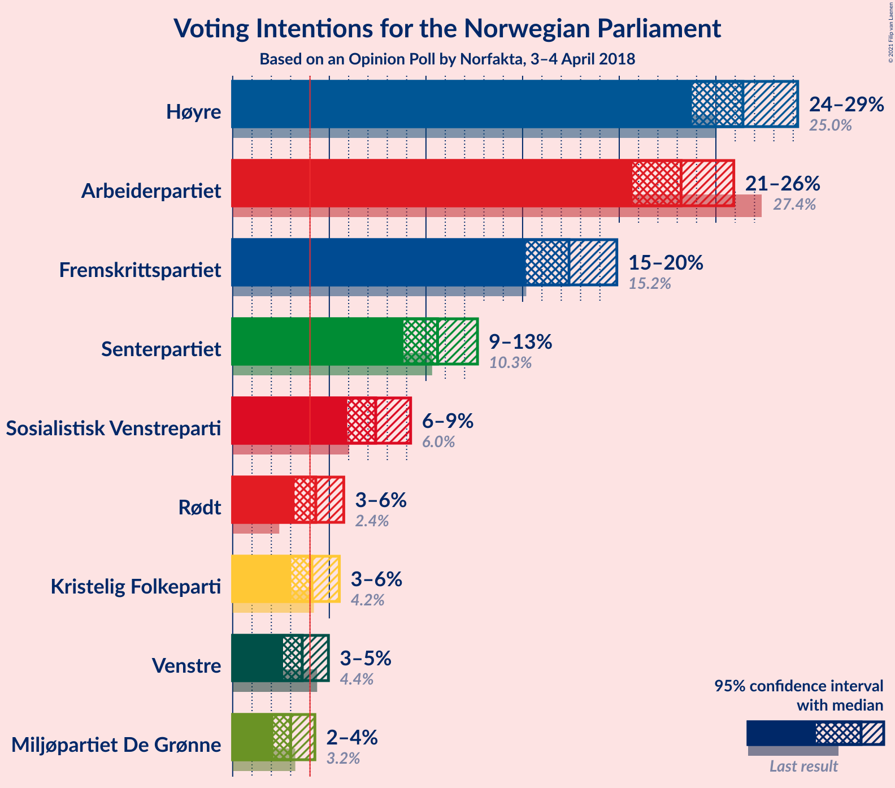
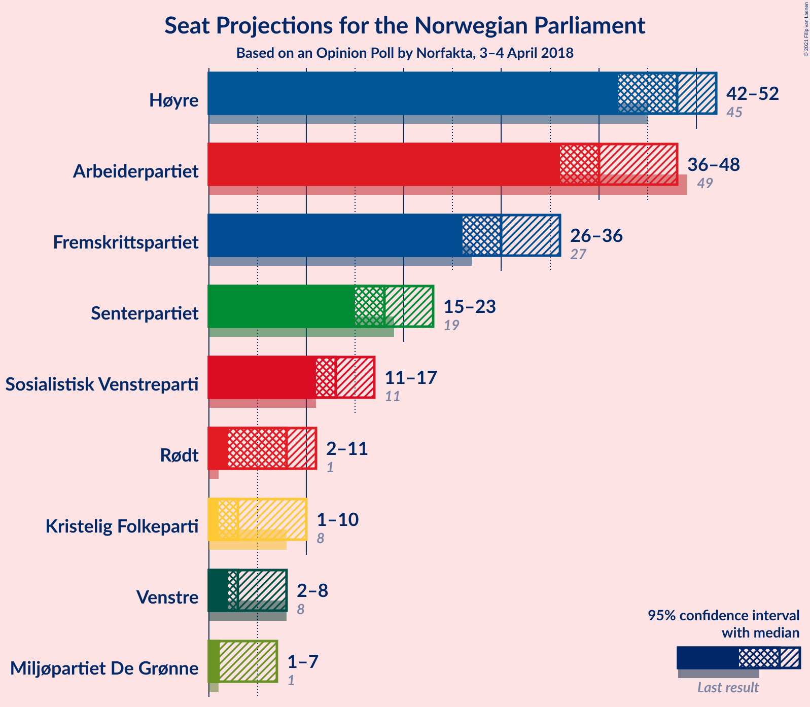
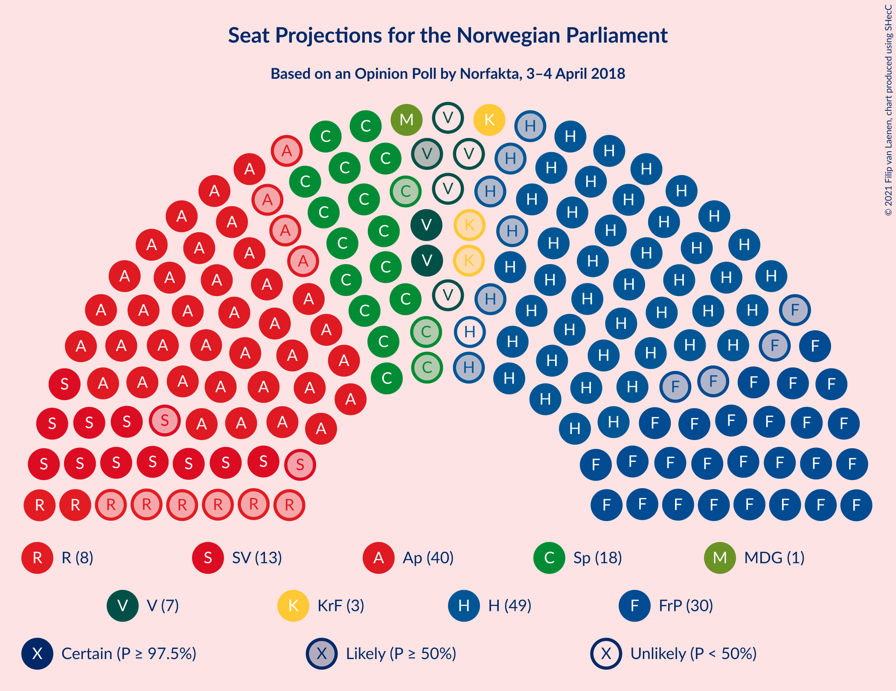
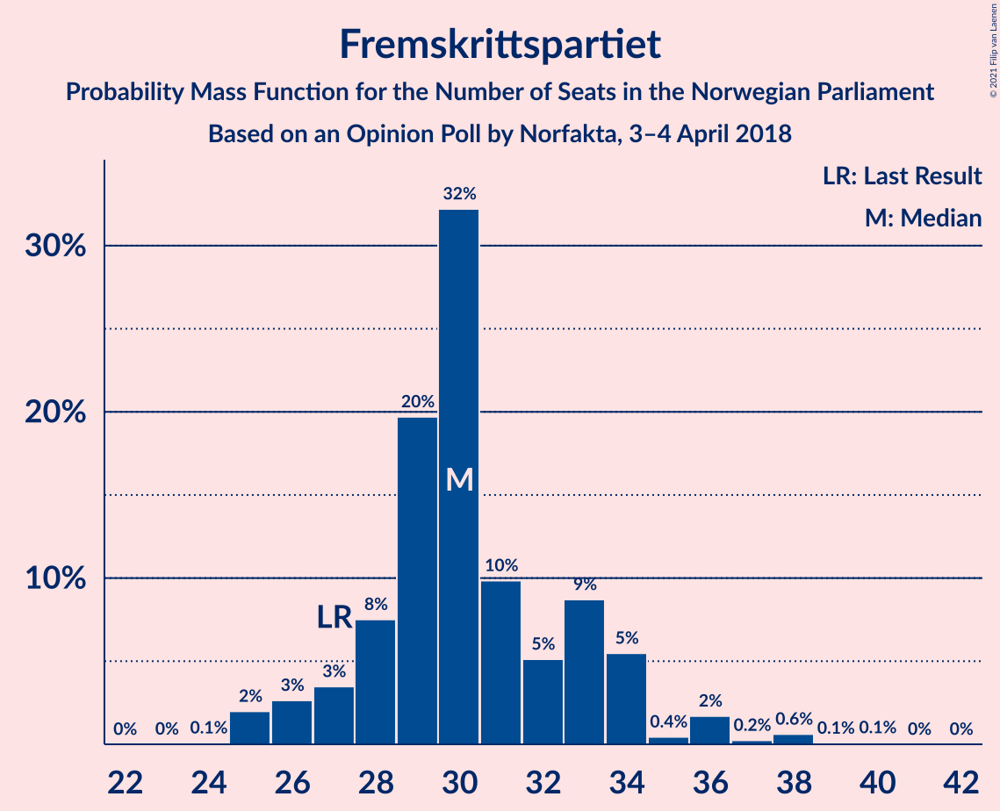
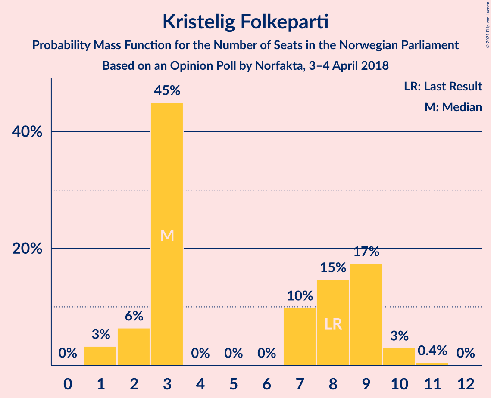
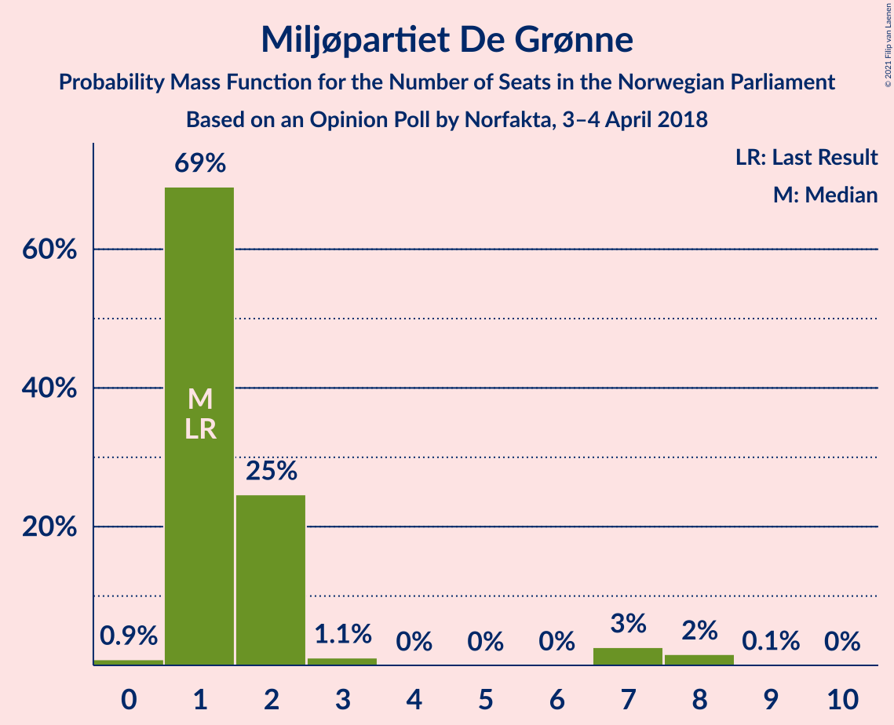
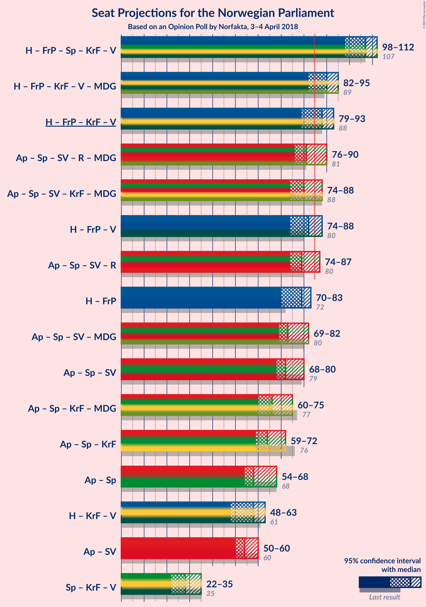
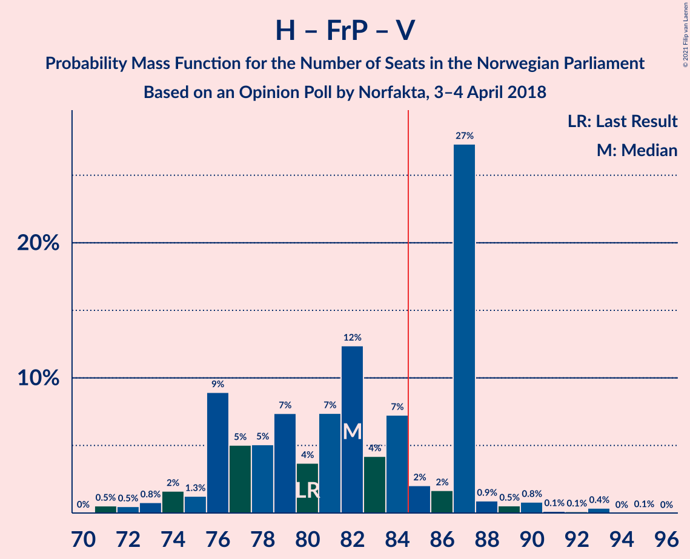
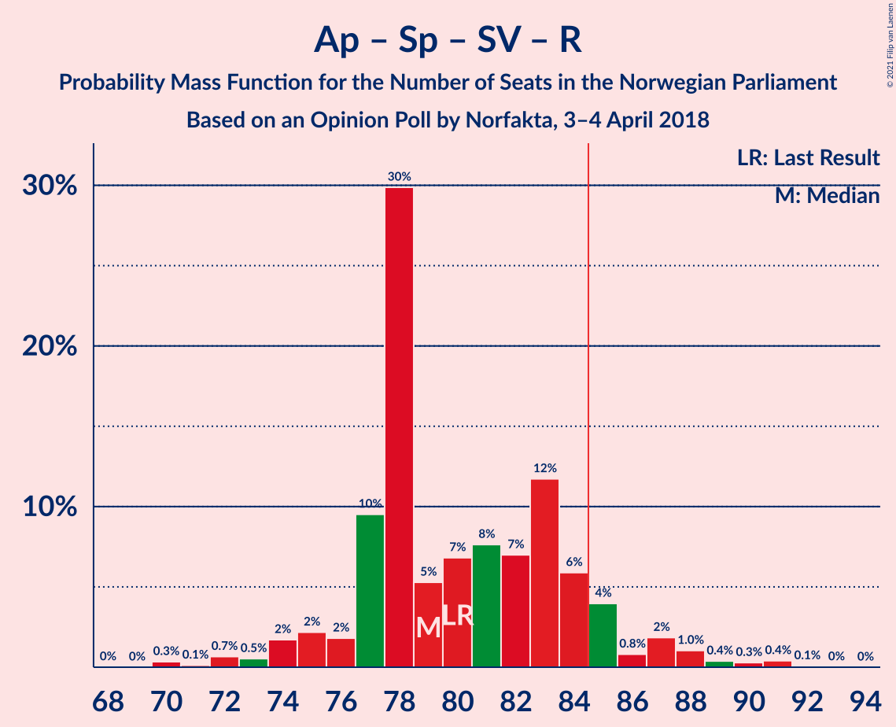
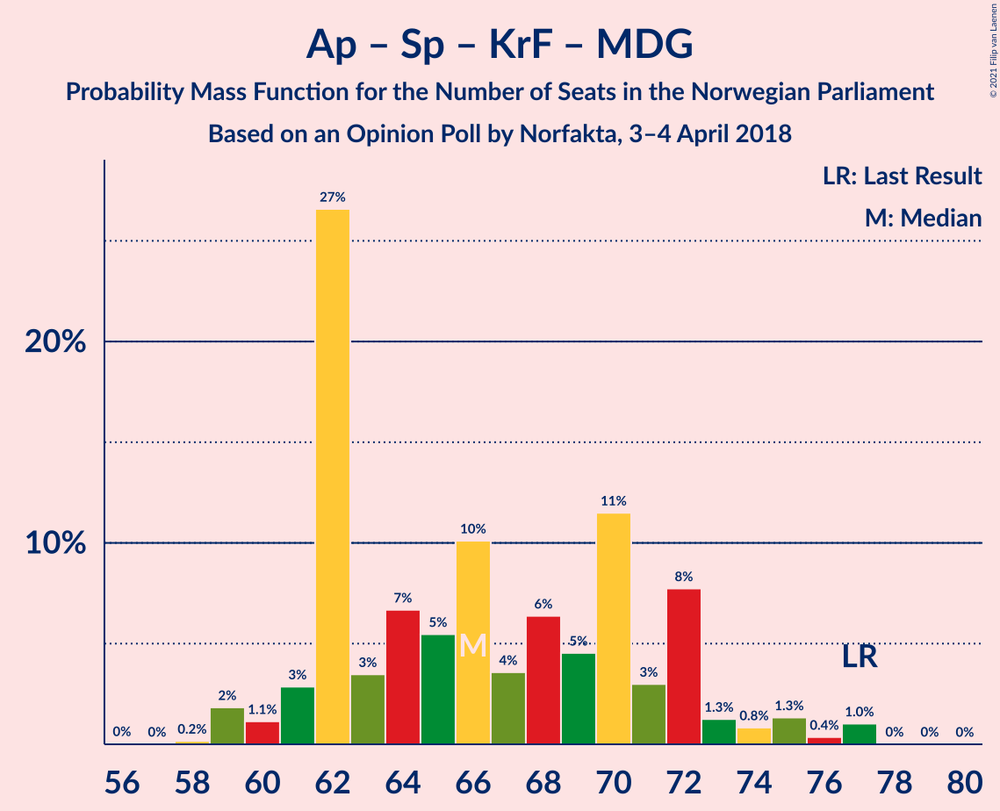

# Opinion Poll by Norfakta, 3–4 April 2018

<a href="#voting-intentions">Voting Intentions</a> | <a href="#seats">Seats</a> | <a href="#coalitions">Coalitions</a> | <a href="#technical-information">Technical Information</a>

## Voting Intentions

### Confidence Intervals

| Party | Last Result | Poll Result | 80% Confidence Interval | 90% Confidence Interval | 95% Confidence Interval | 99% Confidence Interval |
|:-----:|:-----------:|:-----------:|:-----------------------:|:-----------------------:|:-----------------------:|:-----------------------:|
| Høyre | 25.0% | 26.4% | 24.7–28.2% |24.2–28.8% |23.8–29.2% |22.9–30.1% |
| Arbeiderpartiet | 27.4% | 23.2% | 21.6–25.0% |21.1–25.5% |20.7–25.9% |19.9–26.8% |
| Fremskrittspartiet | 15.2% | 17.4% | 15.9–19.0% |15.5–19.5% |15.2–19.9% |14.5–20.7% |
| Senterpartiet | 10.3% | 10.6% | 9.4–11.9% |9.1–12.3% |8.8–12.7% |8.3–13.3% |
| Sosialistisk Venstreparti | 6.0% | 7.4% | 6.4–8.6% |6.2–8.9% |5.9–9.2% |5.5–9.8% |
| Rødt | 2.4% | 4.3% | 3.6–5.2% |3.4–5.5% |3.2–5.7% |2.9–6.2% |
| Kristelig Folkeparti | 4.2% | 4.1% | 3.4–5.0% |3.2–5.3% |3.0–5.5% |2.7–6.0% |
| Venstre | 4.4% | 3.6% | 2.9–4.5% |2.8–4.7% |2.6–5.0% |2.3–5.4% |
| Miljøpartiet De Grønne | 3.2% | 3.0% | 2.4–3.8% |2.2–4.1% |2.1–4.3% |1.9–4.7% |

*Note:* The poll result column reflects the actual value used in the calculations. Published results may vary slightly, and in addition be rounded to fewer digits.

## Seats

### Confidence Intervals

| Party | Last Result | Median | 80% Confidence Interval | 90% Confidence Interval | 95% Confidence Interval | 99% Confidence Interval |
|:-----:|:-----------:|:------:|:-----------------------:|:-----------------------:|:-----------------------:|:-----------------------:|
| <a href="#høyre">Høyre</a> | 45 | 48 | 43–50 |42–51 |42–52 |40–55 |
| <a href="#arbeiderpartiet">Arbeiderpartiet</a> | 49 | 40 | 38–44 |37–46 |36–48 |35–48 |
| <a href="#fremskrittspartiet">Fremskrittspartiet</a> | 27 | 30 | 28–33 |27–34 |26–36 |25–38 |
| <a href="#senterpartiet">Senterpartiet</a> | 19 | 18 | 17–20 |16–22 |15–23 |14–24 |
| <a href="#sosialistisk-venstreparti">Sosialistisk Venstreparti</a> | 11 | 13 | 11–15 |11–16 |11–17 |10–18 |
| <a href="#rødt">Rødt</a> | 1 | 8 | 2–10 |2–10 |2–11 |1–11 |
| <a href="#kristelig-folkeparti">Kristelig Folkeparti</a> | 8 | 3 | 3–9 |2–9 |1–10 |1–10 |
| <a href="#venstre">Venstre</a> | 8 | 3 | 2–8 |2–8 |2–8 |1–10 |
| <a href="#miljøpartiet-de-grønne">Miljøpartiet De Grønne</a> | 1 | 1 | 1–2 |1–3 |1–7 |0–8 |

### Høyre

*For a full overview of the results for this party, see the [Høyre](party-høyre.html) page.*

| Number of Seats | Probability | Accumulated | Special Marks |
|:---------------:|:-----------:|:-----------:|:-------------:|
| 38 | 0.2% | 100% |  |
| 39 | 0.1% | 99.8% |  |
| 40 | 0.8% | 99.7% |  |
| 41 | 0.6% | 98.9% |  |
| 42 | 7% | 98% |  |
| 43 | 7% | 91% |  |
| 44 | 3% | 84% |  |
| 45 | 11% | 81% | Last Result |
| 46 | 13% | 69% |  |
| 47 | 5% | 57% |  |
| 48 | 3% | 52% | Median |
| 49 | 14% | 48% |  |
| 50 | 28% | 34% |  |
| 51 | 3% | 6% |  |
| 52 | 0.8% | 3% |  |
| 53 | 0.8% | 2% |  |
| 54 | 0.7% | 1.4% |  |
| 55 | 0.6% | 0.7% |  |
| 56 | 0.1% | 0.1% |  |
| 57 | 0% | 0% |  |

### Arbeiderpartiet

*For a full overview of the results for this party, see the [Arbeiderpartiet](party-arbeiderpartiet.html) page.*

| Number of Seats | Probability | Accumulated | Special Marks |
|:---------------:|:-----------:|:-----------:|:-------------:|
| 34 | 0.2% | 100% |  |
| 35 | 0.5% | 99.7% |  |
| 36 | 2% | 99.2% |  |
| 37 | 4% | 97% |  |
| 38 | 9% | 93% |  |
| 39 | 5% | 84% |  |
| 40 | 33% | 79% | Median |
| 41 | 16% | 46% |  |
| 42 | 14% | 30% |  |
| 43 | 5% | 17% |  |
| 44 | 2% | 11% |  |
| 45 | 1.3% | 9% |  |
| 46 | 4% | 8% |  |
| 47 | 0.7% | 4% |  |
| 48 | 3% | 3% |  |
| 49 | 0.2% | 0.3% | Last Result |
| 50 | 0% | 0.1% |  |
| 51 | 0.1% | 0.1% |  |
| 52 | 0% | 0% |  |

### Fremskrittspartiet

*For a full overview of the results for this party, see the [Fremskrittspartiet](party-fremskrittspartiet.html) page.*

| Number of Seats | Probability | Accumulated | Special Marks |
|:---------------:|:-----------:|:-----------:|:-------------:|
| 24 | 0.1% | 100% |  |
| 25 | 2% | 99.9% |  |
| 26 | 3% | 98% |  |
| 27 | 3% | 95% | Last Result |
| 28 | 8% | 92% |  |
| 29 | 20% | 84% |  |
| 30 | 32% | 65% | Median |
| 31 | 10% | 32% |  |
| 32 | 5% | 23% |  |
| 33 | 9% | 17% |  |
| 34 | 5% | 9% |  |
| 35 | 0.4% | 3% |  |
| 36 | 2% | 3% |  |
| 37 | 0.2% | 1.0% |  |
| 38 | 0.6% | 0.8% |  |
| 39 | 0.1% | 0.2% |  |
| 40 | 0.1% | 0.1% |  |
| 41 | 0% | 0% |  |

### Senterpartiet

*For a full overview of the results for this party, see the [Senterpartiet](party-senterpartiet.html) page.*

| Number of Seats | Probability | Accumulated | Special Marks |
|:---------------:|:-----------:|:-----------:|:-------------:|
| 13 | 0.1% | 100% |  |
| 14 | 0.6% | 99.9% |  |
| 15 | 3% | 99.3% |  |
| 16 | 5% | 96% |  |
| 17 | 6% | 91% |  |
| 18 | 49% | 85% | Median |
| 19 | 16% | 36% | Last Result |
| 20 | 12% | 20% |  |
| 21 | 2% | 8% |  |
| 22 | 2% | 5% |  |
| 23 | 2% | 3% |  |
| 24 | 0.9% | 1.0% |  |
| 25 | 0.1% | 0.1% |  |
| 26 | 0% | 0% |  |

### Sosialistisk Venstreparti

*For a full overview of the results for this party, see the [Sosialistisk Venstreparti](party-sosialistiskvenstreparti.html) page.*

| Number of Seats | Probability | Accumulated | Special Marks |
|:---------------:|:-----------:|:-----------:|:-------------:|
| 9 | 0.3% | 100% |  |
| 10 | 2% | 99.7% |  |
| 11 | 9% | 98% | Last Result |
| 12 | 29% | 89% |  |
| 13 | 12% | 60% | Median |
| 14 | 18% | 48% |  |
| 15 | 23% | 30% |  |
| 16 | 4% | 7% |  |
| 17 | 2% | 4% |  |
| 18 | 1.5% | 2% |  |
| 19 | 0.1% | 0.1% |  |
| 20 | 0% | 0% |  |

### Rødt

*For a full overview of the results for this party, see the [Rødt](party-rødt.html) page.*

| Number of Seats | Probability | Accumulated | Special Marks |
|:---------------:|:-----------:|:-----------:|:-------------:|
| 1 | 1.5% | 100% | Last Result |
| 2 | 14% | 98.5% |  |
| 3 | 0% | 85% |  |
| 4 | 0% | 85% |  |
| 5 | 0% | 85% |  |
| 6 | 0% | 85% |  |
| 7 | 12% | 85% |  |
| 8 | 46% | 73% | Median |
| 9 | 14% | 27% |  |
| 10 | 9% | 13% |  |
| 11 | 3% | 4% |  |
| 12 | 0.3% | 0.3% |  |
| 13 | 0% | 0% |  |

### Kristelig Folkeparti

*For a full overview of the results for this party, see the [Kristelig Folkeparti](party-kristeligfolkeparti.html) page.*

| Number of Seats | Probability | Accumulated | Special Marks |
|:---------------:|:-----------:|:-----------:|:-------------:|
| 1 | 3% | 100% |  |
| 2 | 6% | 97% |  |
| 3 | 45% | 90% | Median |
| 4 | 0% | 45% |  |
| 5 | 0% | 45% |  |
| 6 | 0% | 45% |  |
| 7 | 10% | 45% |  |
| 8 | 15% | 36% | Last Result |
| 9 | 17% | 21% |  |
| 10 | 3% | 3% |  |
| 11 | 0.4% | 0.5% |  |
| 12 | 0% | 0% |  |

### Venstre

*For a full overview of the results for this party, see the [Venstre](party-venstre.html) page.*

| Number of Seats | Probability | Accumulated | Special Marks |
|:---------------:|:-----------:|:-----------:|:-------------:|
| 1 | 1.4% | 100% |  |
| 2 | 48% | 98.6% |  |
| 3 | 1.0% | 50% | Median |
| 4 | 0% | 49% |  |
| 5 | 0% | 49% |  |
| 6 | 0% | 49% |  |
| 7 | 33% | 49% |  |
| 8 | 14% | 17% | Last Result |
| 9 | 2% | 2% |  |
| 10 | 0.7% | 0.7% |  |
| 11 | 0% | 0% |  |

### Miljøpartiet De Grønne

*For a full overview of the results for this party, see the [Miljøpartiet De Grønne](party-miljøpartietdegrønne.html) page.*

| Number of Seats | Probability | Accumulated | Special Marks |
|:---------------:|:-----------:|:-----------:|:-------------:|
| 0 | 0.9% | 100% |  |
| 1 | 69% | 99.1% | Last Result, Median |
| 2 | 25% | 30% |  |
| 3 | 1.1% | 5% |  |
| 4 | 0% | 4% |  |
| 5 | 0% | 4% |  |
| 6 | 0% | 4% |  |
| 7 | 3% | 4% |  |
| 8 | 2% | 2% |  |
| 9 | 0.1% | 0.1% |  |
| 10 | 0% | 0% |  |

## Coalitions

### Confidence Intervals

| Coalition | Last Result | Median | Majority? | 80% Confidence Interval | 90% Confidence Interval | 95% Confidence Interval | 99% Confidence Interval |
|:---------:|:-----------:|:------:|:---------:|:-----------------------:|:-----------------------:|:-----------------------:|:-----------------------:|
| Høyre – Fremskrittspartiet – Senterpartiet – Kristelig Folkeparti – Venstre | 107 | 107 | 100% | 102–109 | 100–110 | 98–112 | 97–115 |
| Høyre – Fremskrittspartiet – Kristelig Folkeparti – Venstre – Miljøpartiet De Grønne | 89 | 90 | 91% | 85–92 | 84–94 | 82–95 | 78–98 |
| Høyre – Fremskrittspartiet – Kristelig Folkeparti – Venstre | 88 | 88 | 82% | 82–91 | 81–92 | 79–93 | 76–96 |
| Arbeiderpartiet – Senterpartiet – Sosialistisk Venstreparti – Rødt – Miljøpartiet De Grønne | 81 | 81 | 18% | 78–87 | 77–88 | 76–90 | 73–93 |
| Arbeiderpartiet – Senterpartiet – Sosialistisk Venstreparti – Kristelig Folkeparti – Miljøpartiet De Grønne | 88 | 80 | 19% | 74–85 | 74–87 | 74–88 | 73–89 |
| Høyre – Fremskrittspartiet – Venstre | 80 | 82 | 34% | 76–87 | 76–87 | 74–88 | 71–92 |
| Arbeiderpartiet – Senterpartiet – Sosialistisk Venstreparti – Rødt | 80 | 79 | 9% | 77–84 | 75–85 | 74–87 | 71–91 |
| Høyre – Fremskrittspartiet | 72 | 79 | 2% | 72–82 | 71–82 | 70–83 | 69–87 |
| Arbeiderpartiet – Senterpartiet – Sosialistisk Venstreparti – Miljøpartiet De Grønne | 80 | 73 | 0.4% | 71–80 | 71–81 | 69–82 | 68–84 |
| Arbeiderpartiet – Senterpartiet – Sosialistisk Venstreparti | 79 | 72 | 0.1% | 70–77 | 69–79 | 68–80 | 67–82 |
| Arbeiderpartiet – Senterpartiet – Kristelig Folkeparti – Miljøpartiet De Grønne | 77 | 66 | 0% | 62–72 | 61–72 | 60–75 | 59–77 |
| Arbeiderpartiet – Senterpartiet – Kristelig Folkeparti | 76 | 64 | 0% | 61–70 | 60–71 | 59–72 | 58–75 |
| Arbeiderpartiet – Senterpartiet | 68 | 58 | 0% | 56–63 | 55–66 | 54–68 | 53–68 |
| Høyre – Kristelig Folkeparti – Venstre | 61 | 58 | 0% | 52–60 | 49–61 | 48–63 | 46–66 |
| Arbeiderpartiet – Sosialistisk Venstreparti | 60 | 54 | 0% | 52–58 | 51–59 | 50–60 | 48–62 |
| Senterpartiet – Kristelig Folkeparti – Venstre | 35 | 28 | 0% | 25–32 | 23–34 | 22–35 | 20–38 |

### Høyre – Fremskrittspartiet – Senterpartiet – Kristelig Folkeparti – Venstre

| Number of Seats | Probability | Accumulated | Special Marks |
|:---------------:|:-----------:|:-----------:|:-------------:|
| 94 | 0.1% | 100% |  |
| 95 | 0.1% | 99.9% |  |
| 96 | 0.2% | 99.9% |  |
| 97 | 2% | 99.6% |  |
| 98 | 1.1% | 98% |  |
| 99 | 2% | 97% |  |
| 100 | 1.2% | 95% |  |
| 101 | 1.3% | 94% |  |
| 102 | 7% | 93% | Median |
| 103 | 13% | 86% |  |
| 104 | 10% | 73% |  |
| 105 | 6% | 63% |  |
| 106 | 4% | 57% |  |
| 107 | 7% | 53% | Last Result |
| 108 | 29% | 45% |  |
| 109 | 9% | 16% |  |
| 110 | 2% | 7% |  |
| 111 | 2% | 5% |  |
| 112 | 0.9% | 3% |  |
| 113 | 1.0% | 2% |  |
| 114 | 0.2% | 1.3% |  |
| 115 | 0.7% | 1.0% |  |
| 116 | 0.3% | 0.4% |  |
| 117 | 0% | 0% |  |

### Høyre – Fremskrittspartiet – Kristelig Folkeparti – Venstre – Miljøpartiet De Grønne

| Number of Seats | Probability | Accumulated | Special Marks |
|:---------------:|:-----------:|:-----------:|:-------------:|
| 77 | 0.1% | 100% |  |
| 78 | 0.4% | 99.9% |  |
| 79 | 0.3% | 99.5% |  |
| 80 | 0.4% | 99.2% |  |
| 81 | 1.0% | 98.8% |  |
| 82 | 2% | 98% |  |
| 83 | 0.8% | 96% |  |
| 84 | 4% | 95% |  |
| 85 | 6% | 91% | Median, Majority |
| 86 | 12% | 85% |  |
| 87 | 7% | 74% |  |
| 88 | 8% | 67% |  |
| 89 | 7% | 59% | Last Result |
| 90 | 5% | 52% |  |
| 91 | 30% | 47% |  |
| 92 | 10% | 17% |  |
| 93 | 2% | 7% |  |
| 94 | 2% | 6% |  |
| 95 | 2% | 3% |  |
| 96 | 0.5% | 2% |  |
| 97 | 0.7% | 1.2% |  |
| 98 | 0.1% | 0.5% |  |
| 99 | 0.3% | 0.4% |  |
| 100 | 0% | 0% |  |

### Høyre – Fremskrittspartiet – Kristelig Folkeparti – Venstre

| Number of Seats | Probability | Accumulated | Special Marks |
|:---------------:|:-----------:|:-----------:|:-------------:|
| 75 | 0% | 100% |  |
| 76 | 0.5% | 99.9% |  |
| 77 | 0.3% | 99.5% |  |
| 78 | 0.5% | 99.2% |  |
| 79 | 1.4% | 98.7% |  |
| 80 | 1.3% | 97% |  |
| 81 | 2% | 96% |  |
| 82 | 5% | 94% |  |
| 83 | 3% | 89% |  |
| 84 | 5% | 86% | Median |
| 85 | 14% | 82% | Majority |
| 86 | 7% | 68% |  |
| 87 | 9% | 61% |  |
| 88 | 4% | 52% | Last Result |
| 89 | 5% | 48% |  |
| 90 | 28% | 43% |  |
| 91 | 9% | 15% |  |
| 92 | 2% | 6% |  |
| 93 | 2% | 4% |  |
| 94 | 0.2% | 2% |  |
| 95 | 0.4% | 1.3% |  |
| 96 | 0.4% | 0.9% |  |
| 97 | 0.4% | 0.5% |  |
| 98 | 0% | 0.1% |  |
| 99 | 0% | 0% |  |

### Arbeiderpartiet – Senterpartiet – Sosialistisk Venstreparti – Rødt – Miljøpartiet De Grønne

| Number of Seats | Probability | Accumulated | Special Marks |
|:---------------:|:-----------:|:-----------:|:-------------:|
| 71 | 0% | 100% |  |
| 72 | 0.4% | 99.9% |  |
| 73 | 0.4% | 99.5% |  |
| 74 | 0.4% | 99.1% |  |
| 75 | 0.2% | 98.7% |  |
| 76 | 2% | 98% |  |
| 77 | 2% | 96% |  |
| 78 | 9% | 94% |  |
| 79 | 28% | 85% |  |
| 80 | 5% | 57% | Median |
| 81 | 4% | 52% | Last Result |
| 82 | 9% | 48% |  |
| 83 | 7% | 39% |  |
| 84 | 14% | 32% |  |
| 85 | 5% | 18% | Majority |
| 86 | 3% | 14% |  |
| 87 | 5% | 11% |  |
| 88 | 2% | 6% |  |
| 89 | 1.3% | 4% |  |
| 90 | 1.4% | 3% |  |
| 91 | 0.5% | 1.3% |  |
| 92 | 0.3% | 0.8% |  |
| 93 | 0.5% | 0.5% |  |
| 94 | 0% | 0.1% |  |
| 95 | 0% | 0% |  |

### Arbeiderpartiet – Senterpartiet – Sosialistisk Venstreparti – Kristelig Folkeparti – Miljøpartiet De Grønne

| Number of Seats | Probability | Accumulated | Special Marks |
|:---------------:|:-----------:|:-----------:|:-------------:|
| 71 | 0.1% | 100% |  |
| 72 | 0.2% | 99.9% |  |
| 73 | 0.3% | 99.7% |  |
| 74 | 28% | 99.4% |  |
| 75 | 2% | 72% | Median |
| 76 | 5% | 69% |  |
| 77 | 1.5% | 65% |  |
| 78 | 7% | 63% |  |
| 79 | 6% | 57% |  |
| 80 | 11% | 51% |  |
| 81 | 2% | 39% |  |
| 82 | 4% | 37% |  |
| 83 | 11% | 33% |  |
| 84 | 3% | 22% |  |
| 85 | 10% | 19% | Majority |
| 86 | 4% | 9% |  |
| 87 | 2% | 6% |  |
| 88 | 2% | 4% | Last Result |
| 89 | 2% | 2% |  |
| 90 | 0.2% | 0.3% |  |
| 91 | 0% | 0.1% |  |
| 92 | 0% | 0.1% |  |
| 93 | 0% | 0% |  |

### Høyre – Fremskrittspartiet – Venstre

| Number of Seats | Probability | Accumulated | Special Marks |
|:---------------:|:-----------:|:-----------:|:-------------:|
| 70 | 0% | 100% |  |
| 71 | 0.5% | 99.9% |  |
| 72 | 0.5% | 99.4% |  |
| 73 | 0.8% | 98.9% |  |
| 74 | 2% | 98% |  |
| 75 | 1.3% | 97% |  |
| 76 | 9% | 95% |  |
| 77 | 5% | 86% |  |
| 78 | 5% | 81% |  |
| 79 | 7% | 76% |  |
| 80 | 4% | 69% | Last Result |
| 81 | 7% | 65% | Median |
| 82 | 12% | 58% |  |
| 83 | 4% | 45% |  |
| 84 | 7% | 41% |  |
| 85 | 2% | 34% | Majority |
| 86 | 2% | 32% |  |
| 87 | 27% | 30% |  |
| 88 | 0.9% | 3% |  |
| 89 | 0.5% | 2% |  |
| 90 | 0.8% | 1.5% |  |
| 91 | 0.1% | 0.7% |  |
| 92 | 0.1% | 0.5% |  |
| 93 | 0.4% | 0.4% |  |
| 94 | 0% | 0.1% |  |
| 95 | 0.1% | 0.1% |  |
| 96 | 0% | 0% |  |

### Arbeiderpartiet – Senterpartiet – Sosialistisk Venstreparti – Rødt

| Number of Seats | Probability | Accumulated | Special Marks |
|:---------------:|:-----------:|:-----------:|:-------------:|
| 70 | 0.3% | 100% |  |
| 71 | 0.1% | 99.6% |  |
| 72 | 0.7% | 99.5% |  |
| 73 | 0.5% | 98.8% |  |
| 74 | 2% | 98% |  |
| 75 | 2% | 97% |  |
| 76 | 2% | 94% |  |
| 77 | 10% | 93% |  |
| 78 | 30% | 83% |  |
| 79 | 5% | 53% | Median |
| 80 | 7% | 48% | Last Result |
| 81 | 8% | 41% |  |
| 82 | 7% | 33% |  |
| 83 | 12% | 26% |  |
| 84 | 6% | 15% |  |
| 85 | 4% | 9% | Majority |
| 86 | 0.8% | 5% |  |
| 87 | 2% | 4% |  |
| 88 | 1.0% | 2% |  |
| 89 | 0.4% | 1.2% |  |
| 90 | 0.3% | 0.8% |  |
| 91 | 0.4% | 0.5% |  |
| 92 | 0.1% | 0.1% |  |
| 93 | 0% | 0% |  |

### Høyre – Fremskrittspartiet

| Number of Seats | Probability | Accumulated | Special Marks |
|:---------------:|:-----------:|:-----------:|:-------------:|
| 66 | 0.1% | 100% |  |
| 67 | 0.1% | 99.9% |  |
| 68 | 0.1% | 99.8% |  |
| 69 | 1.0% | 99.6% |  |
| 70 | 2% | 98.6% |  |
| 71 | 4% | 96% |  |
| 72 | 5% | 92% | Last Result |
| 73 | 2% | 88% |  |
| 74 | 13% | 85% |  |
| 75 | 7% | 72% |  |
| 76 | 5% | 66% |  |
| 77 | 4% | 61% |  |
| 78 | 2% | 57% | Median |
| 79 | 8% | 55% |  |
| 80 | 34% | 46% |  |
| 81 | 0.8% | 12% |  |
| 82 | 7% | 11% |  |
| 83 | 2% | 4% |  |
| 84 | 0.4% | 2% |  |
| 85 | 0.9% | 2% | Majority |
| 86 | 0.3% | 1.0% |  |
| 87 | 0.5% | 0.6% |  |
| 88 | 0% | 0.1% |  |
| 89 | 0% | 0.1% |  |
| 90 | 0.1% | 0.1% |  |
| 91 | 0% | 0% |  |

### Arbeiderpartiet – Senterpartiet – Sosialistisk Venstreparti – Miljøpartiet De Grønne

| Number of Seats | Probability | Accumulated | Special Marks |
|:---------------:|:-----------:|:-----------:|:-------------:|
| 65 | 0% | 100% |  |
| 66 | 0% | 99.9% |  |
| 67 | 0.2% | 99.9% |  |
| 68 | 0.6% | 99.7% |  |
| 69 | 3% | 99.1% |  |
| 70 | 1.3% | 96% |  |
| 71 | 35% | 95% |  |
| 72 | 6% | 60% | Median |
| 73 | 6% | 54% |  |
| 74 | 2% | 49% |  |
| 75 | 8% | 46% |  |
| 76 | 12% | 38% |  |
| 77 | 8% | 26% |  |
| 78 | 4% | 18% |  |
| 79 | 3% | 14% |  |
| 80 | 5% | 11% | Last Result |
| 81 | 3% | 6% |  |
| 82 | 0.8% | 3% |  |
| 83 | 2% | 2% |  |
| 84 | 0.4% | 0.7% |  |
| 85 | 0.2% | 0.4% | Majority |
| 86 | 0.1% | 0.1% |  |
| 87 | 0% | 0% |  |

### Arbeiderpartiet – Senterpartiet – Sosialistisk Venstreparti

| Number of Seats | Probability | Accumulated | Special Marks |
|:---------------:|:-----------:|:-----------:|:-------------:|
| 64 | 0% | 100% |  |
| 65 | 0.1% | 99.9% |  |
| 66 | 0.3% | 99.8% |  |
| 67 | 1.1% | 99.6% |  |
| 68 | 3% | 98% |  |
| 69 | 3% | 95% |  |
| 70 | 35% | 93% |  |
| 71 | 7% | 57% | Median |
| 72 | 6% | 51% |  |
| 73 | 5% | 45% |  |
| 74 | 9% | 40% |  |
| 75 | 12% | 31% |  |
| 76 | 7% | 18% |  |
| 77 | 2% | 11% |  |
| 78 | 0.9% | 9% |  |
| 79 | 6% | 8% | Last Result |
| 80 | 0.5% | 3% |  |
| 81 | 0.4% | 2% |  |
| 82 | 2% | 2% |  |
| 83 | 0% | 0.1% |  |
| 84 | 0.1% | 0.1% |  |
| 85 | 0.1% | 0.1% | Majority |
| 86 | 0% | 0% |  |

### Arbeiderpartiet – Senterpartiet – Kristelig Folkeparti – Miljøpartiet De Grønne

| Number of Seats | Probability | Accumulated | Special Marks |
|:---------------:|:-----------:|:-----------:|:-------------:|
| 56 | 0% | 100% |  |
| 57 | 0% | 99.9% |  |
| 58 | 0.2% | 99.9% |  |
| 59 | 2% | 99.8% |  |
| 60 | 1.1% | 98% |  |
| 61 | 3% | 97% |  |
| 62 | 27% | 94% | Median |
| 63 | 3% | 67% |  |
| 64 | 7% | 64% |  |
| 65 | 5% | 57% |  |
| 66 | 10% | 52% |  |
| 67 | 4% | 42% |  |
| 68 | 6% | 38% |  |
| 69 | 5% | 32% |  |
| 70 | 11% | 27% |  |
| 71 | 3% | 16% |  |
| 72 | 8% | 13% |  |
| 73 | 1.3% | 5% |  |
| 74 | 0.8% | 4% |  |
| 75 | 1.3% | 3% |  |
| 76 | 0.4% | 1.5% |  |
| 77 | 1.0% | 1.1% | Last Result |
| 78 | 0% | 0.1% |  |
| 79 | 0% | 0% |  |

### Arbeiderpartiet – Senterpartiet – Kristelig Folkeparti

| Number of Seats | Probability | Accumulated | Special Marks |
|:---------------:|:-----------:|:-----------:|:-------------:|
| 55 | 0.1% | 100% |  |
| 56 | 0.1% | 99.9% |  |
| 57 | 0.4% | 99.9% |  |
| 58 | 2% | 99.5% |  |
| 59 | 2% | 98% |  |
| 60 | 3% | 96% |  |
| 61 | 26% | 93% | Median |
| 62 | 7% | 67% |  |
| 63 | 7% | 60% |  |
| 64 | 6% | 53% |  |
| 65 | 11% | 47% |  |
| 66 | 3% | 36% |  |
| 67 | 8% | 33% |  |
| 68 | 3% | 25% |  |
| 69 | 10% | 22% |  |
| 70 | 3% | 11% |  |
| 71 | 5% | 9% |  |
| 72 | 0.8% | 3% |  |
| 73 | 1.2% | 2% |  |
| 74 | 0.2% | 1.2% |  |
| 75 | 1.0% | 1.0% |  |
| 76 | 0% | 0.1% | Last Result |
| 77 | 0% | 0% |  |

### Arbeiderpartiet – Senterpartiet

| Number of Seats | Probability | Accumulated | Special Marks |
|:---------------:|:-----------:|:-----------:|:-------------:|
| 51 | 0% | 100% |  |
| 52 | 0.3% | 99.9% |  |
| 53 | 2% | 99.7% |  |
| 54 | 1.2% | 98% |  |
| 55 | 2% | 97% |  |
| 56 | 11% | 95% |  |
| 57 | 5% | 84% |  |
| 58 | 29% | 79% | Median |
| 59 | 11% | 50% |  |
| 60 | 14% | 39% |  |
| 61 | 9% | 25% |  |
| 62 | 4% | 16% |  |
| 63 | 2% | 12% |  |
| 64 | 1.3% | 10% |  |
| 65 | 3% | 9% |  |
| 66 | 0.6% | 6% |  |
| 67 | 0.6% | 5% |  |
| 68 | 4% | 4% | Last Result |
| 69 | 0% | 0.1% |  |
| 70 | 0.1% | 0.1% |  |
| 71 | 0% | 0% |  |

### Høyre – Kristelig Folkeparti – Venstre

| Number of Seats | Probability | Accumulated | Special Marks |
|:---------------:|:-----------:|:-----------:|:-------------:|
| 45 | 0.1% | 100% |  |
| 46 | 0.5% | 99.9% |  |
| 47 | 0.1% | 99.4% |  |
| 48 | 3% | 99.4% |  |
| 49 | 2% | 96% |  |
| 50 | 0.8% | 94% |  |
| 51 | 2% | 93% |  |
| 52 | 2% | 91% |  |
| 53 | 3% | 89% |  |
| 54 | 6% | 86% | Median |
| 55 | 5% | 80% |  |
| 56 | 14% | 75% |  |
| 57 | 9% | 61% |  |
| 58 | 6% | 52% |  |
| 59 | 4% | 46% |  |
| 60 | 35% | 42% |  |
| 61 | 3% | 7% | Last Result |
| 62 | 0.9% | 4% |  |
| 63 | 0.5% | 3% |  |
| 64 | 1.2% | 2% |  |
| 65 | 0.4% | 1.0% |  |
| 66 | 0.2% | 0.5% |  |
| 67 | 0.3% | 0.3% |  |
| 68 | 0% | 0% |  |

### Arbeiderpartiet – Sosialistisk Venstreparti

| Number of Seats | Probability | Accumulated | Special Marks |
|:---------------:|:-----------:|:-----------:|:-------------:|
| 46 | 0.1% | 100% |  |
| 47 | 0.2% | 99.9% |  |
| 48 | 0.6% | 99.8% |  |
| 49 | 0.9% | 99.2% |  |
| 50 | 1.1% | 98% |  |
| 51 | 4% | 97% |  |
| 52 | 38% | 93% |  |
| 53 | 4% | 55% | Median |
| 54 | 10% | 51% |  |
| 55 | 10% | 41% |  |
| 56 | 4% | 31% |  |
| 57 | 14% | 27% |  |
| 58 | 4% | 12% |  |
| 59 | 4% | 8% |  |
| 60 | 3% | 4% | Last Result |
| 61 | 0.7% | 1.3% |  |
| 62 | 0.4% | 0.7% |  |
| 63 | 0.1% | 0.2% |  |
| 64 | 0.1% | 0.1% |  |
| 65 | 0% | 0% |  |

### Senterpartiet – Kristelig Folkeparti – Venstre

| Number of Seats | Probability | Accumulated | Special Marks |
|:---------------:|:-----------:|:-----------:|:-------------:|
| 19 | 0.3% | 100% |  |
| 20 | 0.5% | 99.7% |  |
| 21 | 0.9% | 99.2% |  |
| 22 | 1.2% | 98% |  |
| 23 | 4% | 97% |  |
| 24 | 2% | 93% | Median |
| 25 | 8% | 92% |  |
| 26 | 1.5% | 83% |  |
| 27 | 4% | 82% |  |
| 28 | 31% | 78% |  |
| 29 | 25% | 47% |  |
| 30 | 7% | 21% |  |
| 31 | 2% | 15% |  |
| 32 | 4% | 13% |  |
| 33 | 3% | 8% |  |
| 34 | 2% | 5% |  |
| 35 | 1.0% | 3% | Last Result |
| 36 | 0.7% | 2% |  |
| 37 | 0.2% | 1.1% |  |
| 38 | 0.4% | 0.9% |  |
| 39 | 0.4% | 0.5% |  |
| 40 | 0% | 0% |  |

## Technical Information

### Opinion Poll

+ **Polling firm:** Norfakta
+ **Commissioner(s):** —
+ **Fieldwork period:** 3–4 April 2018

### Calculations

+ **Sample size:** 1000
+ **Simulations done:** 1,048,576
+ **Error estimate:** 3.95%

