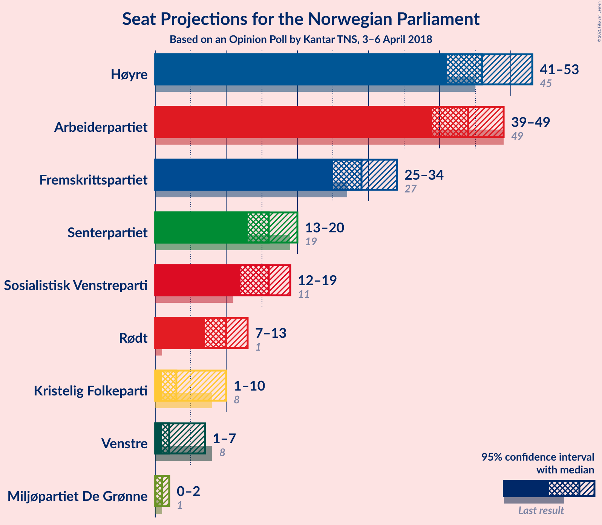
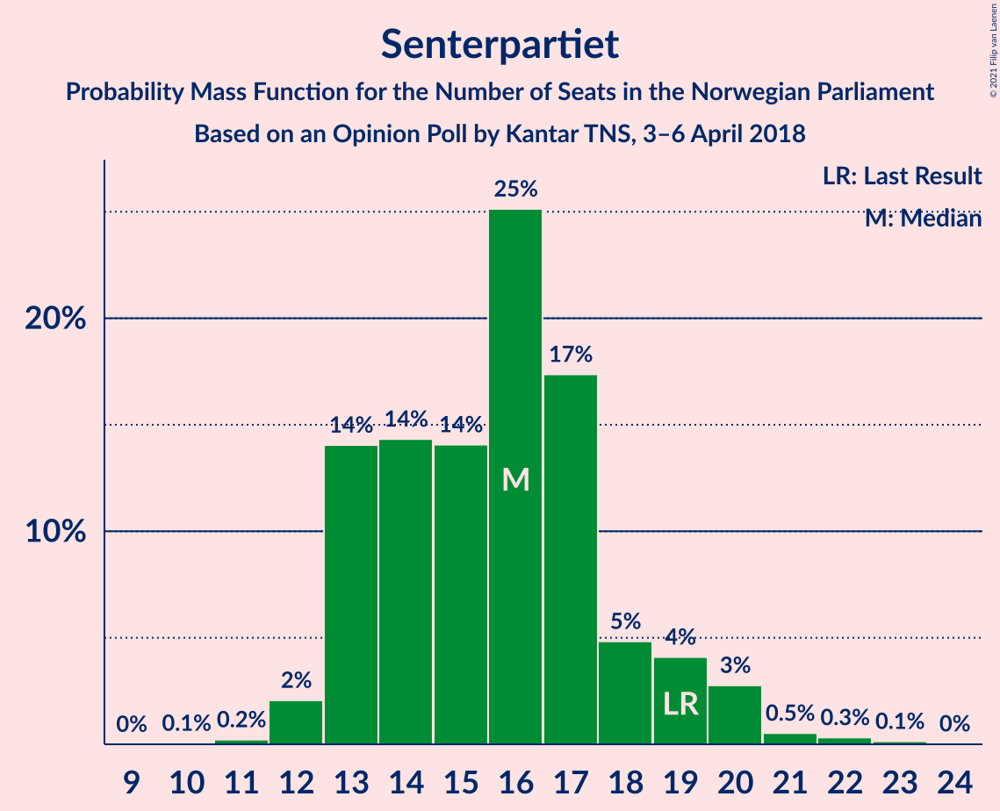
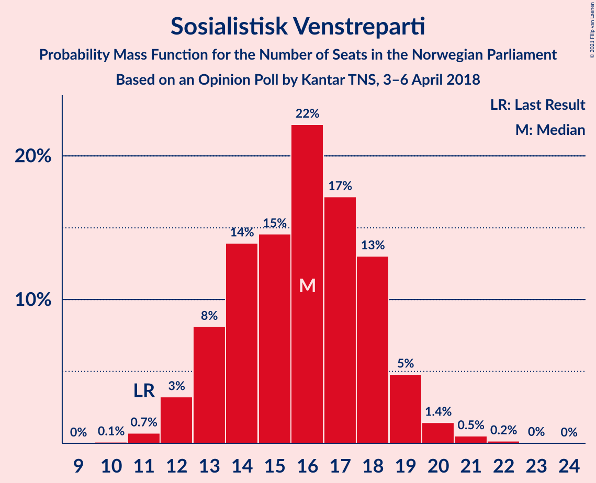
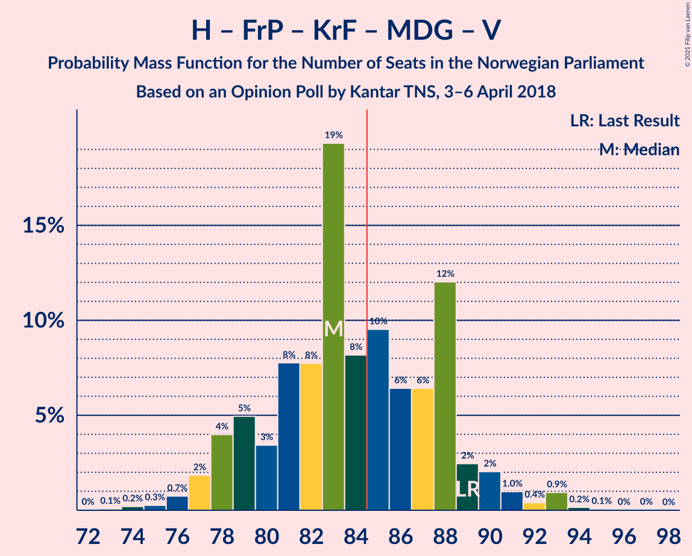
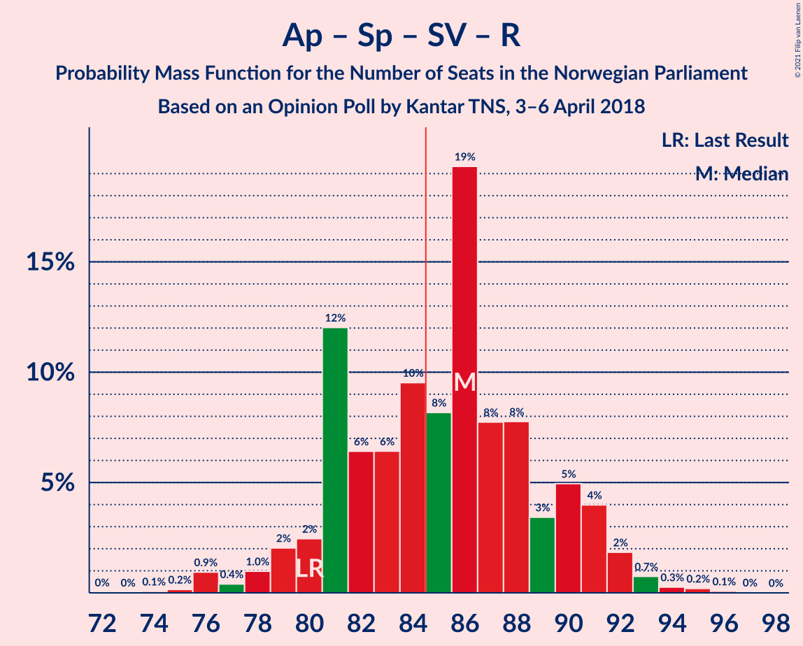
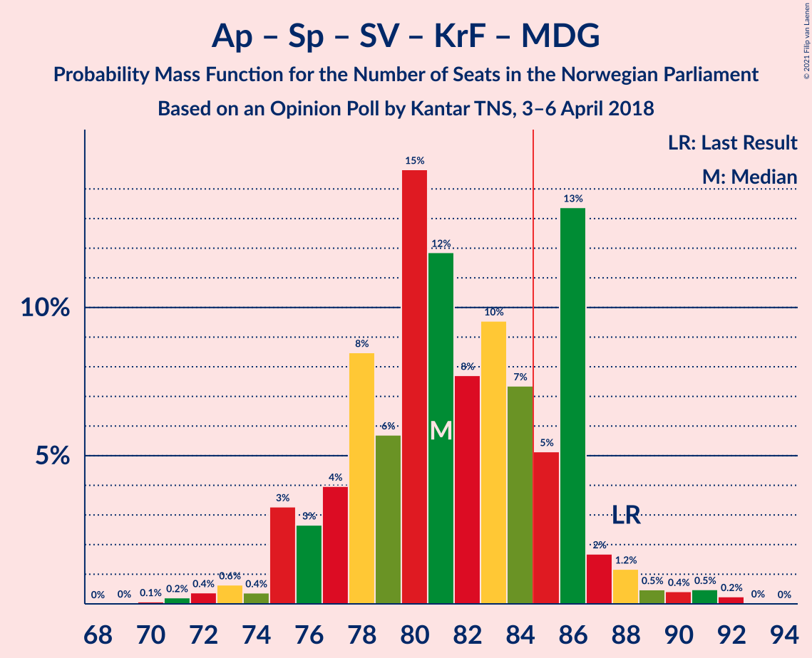
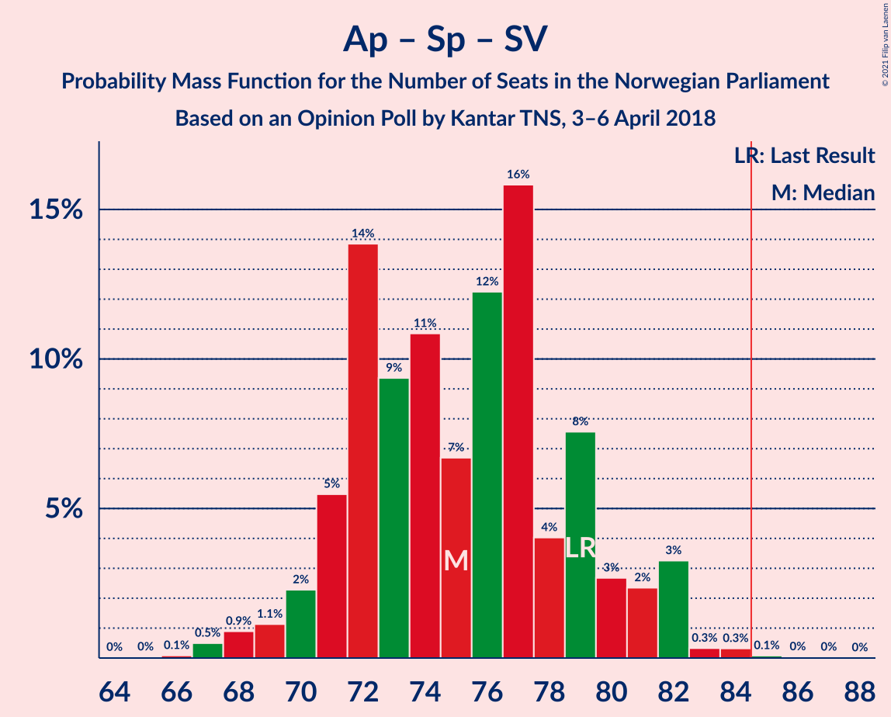

# Opinion Poll by Kantar TNS, 3–6 April 2018

<a href="#voting-intentions">Voting Intentions</a> | <a href="#seats">Seats</a> | <a href="#coalitions">Coalitions</a> | <a href="#technical-information">Technical Information</a>

## Voting Intentions

### Confidence Intervals

| Party | Last Result | Poll Result | 80% Confidence Interval | 90% Confidence Interval | 95% Confidence Interval | 99% Confidence Interval |
|:-----:|:-----------:|:-----------:|:-----------------------:|:-----------------------:|:-----------------------:|:-----------------------:|
| Høyre | 25.0% | 26.3% | 24.3–28.4% |23.8–29.0% |23.3–29.5% |22.4–30.5% |
| Arbeiderpartiet | 27.4% | 24.1% | 22.2–26.2% |21.7–26.7% |21.2–27.2% |20.3–28.2% |
| Fremskrittspartiet | 15.2% | 16.2% | 14.6–18.0% |14.1–18.5% |13.8–19.0% |13.0–19.9% |
| Senterpartiet | 10.3% | 8.9% | 7.7–10.4% |7.4–10.8% |7.1–11.2% |6.6–11.9% |
| Sosialistisk Venstreparti | 6.0% | 8.7% | 7.5–10.1% |7.2–10.5% |6.9–10.9% |6.4–11.6% |
| Rødt | 2.4% | 5.4% | 4.5–6.6% |4.3–7.0% |4.1–7.3% |3.6–7.9% |
| Kristelig Folkeparti | 4.2% | 3.8% | 3.0–4.8% |2.8–5.1% |2.6–5.3% |2.3–5.9% |
| Miljøpartiet De Grønne | 3.2% | 2.8% | 2.2–3.8% |2.0–4.0% |1.9–4.3% |1.6–4.8% |
| Venstre | 4.4% | 2.8% | 2.2–3.8% |2.0–4.0% |1.9–4.3% |1.6–4.8% |

*Note:* The poll result column reflects the actual value used in the calculations. Published results may vary slightly, and in addition be rounded to fewer digits.

## Seats

### Confidence Intervals

| Party | Last Result | Median | 80% Confidence Interval | 90% Confidence Interval | 95% Confidence Interval | 99% Confidence Interval |
|:-----:|:-----------:|:------:|:-----------------------:|:-----------------------:|:-----------------------:|:-----------------------:|
| <a href="#høyre">Høyre</a> | 45 | 46 | 43–50 |43–51 |42–52 |40–53 |
| <a href="#arbeiderpartiet">Arbeiderpartiet</a> | 49 | 45 | 39–47 |39–48 |39–49 |37–50 |
| <a href="#fremskrittspartiet">Fremskrittspartiet</a> | 27 | 32 | 27–33 |26–33 |25–34 |23–36 |
| <a href="#senterpartiet">Senterpartiet</a> | 19 | 16 | 14–18 |13–19 |13–19 |12–21 |
| <a href="#sosialistisk-venstreparti">Sosialistisk Venstreparti</a> | 11 | 15 | 13–18 |13–18 |12–19 |11–21 |
| <a href="#rødt">Rødt</a> | 1 | 10 | 8–11 |2–12 |2–13 |2–14 |
| <a href="#kristelig-folkeparti">Kristelig Folkeparti</a> | 8 | 3 | 1–8 |1–9 |1–10 |0–11 |
| <a href="#miljøpartiet-de-grønne">Miljøpartiet De Grønne</a> | 1 | 1 | 1–2 |0–2 |0–6 |0–8 |
| <a href="#venstre">Venstre</a> | 8 | 2 | 1–2 |1–2 |0–7 |0–9 |

### Høyre

*For a full overview of the results for this party, see the [Høyre](party-høyre.html) page.*

| Number of Seats | Probability | Accumulated | Special Marks |
|:---------------:|:-----------:|:-----------:|:-------------:|
| 38 | 0.2% | 100% |  |
| 39 | 0.2% | 99.8% |  |
| 40 | 0.5% | 99.6% |  |
| 41 | 0.6% | 99.1% |  |
| 42 | 3% | 98.5% |  |
| 43 | 15% | 95% |  |
| 44 | 2% | 81% |  |
| 45 | 20% | 79% | Last Result |
| 46 | 12% | 59% | Median |
| 47 | 20% | 47% |  |
| 48 | 10% | 27% |  |
| 49 | 1.3% | 17% |  |
| 50 | 9% | 16% |  |
| 51 | 3% | 6% |  |
| 52 | 2% | 4% |  |
| 53 | 1.1% | 1.4% |  |
| 54 | 0.2% | 0.4% |  |
| 55 | 0.2% | 0.2% |  |
| 56 | 0% | 0% |  |

### Arbeiderpartiet

*For a full overview of the results for this party, see the [Arbeiderpartiet](party-arbeiderpartiet.html) page.*

| Number of Seats | Probability | Accumulated | Special Marks |
|:---------------:|:-----------:|:-----------:|:-------------:|
| 35 | 0% | 100% |  |
| 36 | 0.2% | 99.9% |  |
| 37 | 0.6% | 99.7% |  |
| 38 | 0.6% | 99.2% |  |
| 39 | 11% | 98.6% |  |
| 40 | 3% | 88% |  |
| 41 | 12% | 85% |  |
| 42 | 6% | 73% |  |
| 43 | 10% | 67% |  |
| 44 | 2% | 57% |  |
| 45 | 32% | 56% | Median |
| 46 | 7% | 24% |  |
| 47 | 11% | 17% |  |
| 48 | 2% | 6% |  |
| 49 | 3% | 4% | Last Result |
| 50 | 0.3% | 0.7% |  |
| 51 | 0.3% | 0.5% |  |
| 52 | 0.1% | 0.1% |  |
| 53 | 0% | 0.1% |  |
| 54 | 0% | 0% |  |

### Fremskrittspartiet

*For a full overview of the results for this party, see the [Fremskrittspartiet](party-fremskrittspartiet.html) page.*

| Number of Seats | Probability | Accumulated | Special Marks |
|:---------------:|:-----------:|:-----------:|:-------------:|
| 22 | 0.1% | 100% |  |
| 23 | 0.6% | 99.9% |  |
| 24 | 0.6% | 99.3% |  |
| 25 | 3% | 98.6% |  |
| 26 | 4% | 96% |  |
| 27 | 3% | 92% | Last Result |
| 28 | 4% | 88% |  |
| 29 | 3% | 84% |  |
| 30 | 5% | 81% |  |
| 31 | 8% | 76% |  |
| 32 | 54% | 68% | Median |
| 33 | 10% | 13% |  |
| 34 | 2% | 3% |  |
| 35 | 0.4% | 1.1% |  |
| 36 | 0.6% | 0.7% |  |
| 37 | 0.1% | 0.1% |  |
| 38 | 0% | 0% |  |

### Senterpartiet

*For a full overview of the results for this party, see the [Senterpartiet](party-senterpartiet.html) page.*

| Number of Seats | Probability | Accumulated | Special Marks |
|:---------------:|:-----------:|:-----------:|:-------------:|
| 11 | 0.1% | 100% |  |
| 12 | 2% | 99.8% |  |
| 13 | 4% | 98% |  |
| 14 | 14% | 94% |  |
| 15 | 21% | 79% |  |
| 16 | 40% | 59% | Median |
| 17 | 8% | 19% |  |
| 18 | 4% | 10% |  |
| 19 | 5% | 7% | Last Result |
| 20 | 1.1% | 2% |  |
| 21 | 0.2% | 0.6% |  |
| 22 | 0.4% | 0.4% |  |
| 23 | 0% | 0.1% |  |
| 24 | 0% | 0% |  |

### Sosialistisk Venstreparti

*For a full overview of the results for this party, see the [Sosialistisk Venstreparti](party-sosialistiskvenstreparti.html) page.*

| Number of Seats | Probability | Accumulated | Special Marks |
|:---------------:|:-----------:|:-----------:|:-------------:|
| 10 | 0.2% | 100% |  |
| 11 | 1.1% | 99.8% | Last Result |
| 12 | 3% | 98.7% |  |
| 13 | 23% | 96% |  |
| 14 | 9% | 73% |  |
| 15 | 15% | 64% | Median |
| 16 | 12% | 49% |  |
| 17 | 23% | 37% |  |
| 18 | 10% | 14% |  |
| 19 | 2% | 4% |  |
| 20 | 2% | 2% |  |
| 21 | 0.4% | 0.5% |  |
| 22 | 0.1% | 0.1% |  |
| 23 | 0% | 0% |  |

### Rødt

*For a full overview of the results for this party, see the [Rødt](party-rødt.html) page.*

| Number of Seats | Probability | Accumulated | Special Marks |
|:---------------:|:-----------:|:-----------:|:-------------:|
| 1 | 0% | 100% | Last Result |
| 2 | 7% | 100% |  |
| 3 | 0% | 93% |  |
| 4 | 0% | 93% |  |
| 5 | 0% | 93% |  |
| 6 | 0% | 93% |  |
| 7 | 1.1% | 93% |  |
| 8 | 6% | 92% |  |
| 9 | 12% | 86% |  |
| 10 | 37% | 74% | Median |
| 11 | 27% | 37% |  |
| 12 | 7% | 10% |  |
| 13 | 2% | 3% |  |
| 14 | 1.0% | 1.3% |  |
| 15 | 0.3% | 0.3% |  |
| 16 | 0% | 0% |  |

### Kristelig Folkeparti

*For a full overview of the results for this party, see the [Kristelig Folkeparti](party-kristeligfolkeparti.html) page.*

| Number of Seats | Probability | Accumulated | Special Marks |
|:---------------:|:-----------:|:-----------:|:-------------:|
| 0 | 0.5% | 100% |  |
| 1 | 18% | 99.5% |  |
| 2 | 20% | 81% |  |
| 3 | 31% | 61% | Median |
| 4 | 0% | 30% |  |
| 5 | 0% | 30% |  |
| 6 | 0% | 30% |  |
| 7 | 10% | 30% |  |
| 8 | 14% | 20% | Last Result |
| 9 | 3% | 6% |  |
| 10 | 2% | 3% |  |
| 11 | 0.5% | 0.5% |  |
| 12 | 0% | 0% |  |

### Miljøpartiet De Grønne

*For a full overview of the results for this party, see the [Miljøpartiet De Grønne](party-miljøpartietdegrønne.html) page.*

| Number of Seats | Probability | Accumulated | Special Marks |
|:---------------:|:-----------:|:-----------:|:-------------:|
| 0 | 5% | 100% |  |
| 1 | 73% | 95% | Last Result, Median |
| 2 | 19% | 22% |  |
| 3 | 0.4% | 3% |  |
| 4 | 0% | 3% |  |
| 5 | 0% | 3% |  |
| 6 | 0.7% | 3% |  |
| 7 | 0.3% | 2% |  |
| 8 | 1.4% | 1.5% |  |
| 9 | 0.1% | 0.1% |  |
| 10 | 0% | 0% |  |

### Venstre

*For a full overview of the results for this party, see the [Venstre](party-venstre.html) page.*

| Number of Seats | Probability | Accumulated | Special Marks |
|:---------------:|:-----------:|:-----------:|:-------------:|
| 0 | 3% | 100% |  |
| 1 | 18% | 97% |  |
| 2 | 76% | 79% | Median |
| 3 | 0% | 4% |  |
| 4 | 0% | 4% |  |
| 5 | 0% | 4% |  |
| 6 | 0% | 4% |  |
| 7 | 2% | 4% |  |
| 8 | 1.2% | 2% | Last Result |
| 9 | 0.5% | 0.6% |  |
| 10 | 0% | 0% |  |

## Coalitions

### Confidence Intervals

| Coalition | Last Result | Median | Majority? | 80% Confidence Interval | 90% Confidence Interval | 95% Confidence Interval | 99% Confidence Interval |
|:---------:|:-----------:|:------:|:---------:|:-----------------------:|:-----------------------:|:-----------------------:|:-----------------------:|
| Høyre – Fremskrittspartiet – Senterpartiet – Kristelig Folkeparti – Venstre | 107 | 100 | 100% | 95–103 | 94–107 | 93–107 | 91–107 |
| Høyre – Fremskrittspartiet – Kristelig Folkeparti – Miljøpartiet De Grønne – Venstre | 89 | 85 | 57% | 80–90 | 78–93 | 78–93 | 76–94 |
| Arbeiderpartiet – Senterpartiet – Sosialistisk Venstreparti – Rødt – Miljøpartiet De Grønne | 81 | 85 | 72% | 81–90 | 77–91 | 77–93 | 76–95 |
| Høyre – Fremskrittspartiet – Kristelig Folkeparti – Venstre | 88 | 84 | 28% | 79–88 | 78–92 | 76–92 | 74–93 |
| Arbeiderpartiet – Senterpartiet – Sosialistisk Venstreparti – Rødt | 80 | 84 | 43% | 79–89 | 76–91 | 76–91 | 75–93 |
| Arbeiderpartiet – Senterpartiet – Sosialistisk Venstreparti – Kristelig Folkeparti – Miljøpartiet De Grønne | 88 | 80 | 9% | 78–84 | 76–86 | 72–87 | 71–91 |
| Høyre – Fremskrittspartiet – Venstre | 80 | 79 | 10% | 75–85 | 73–85 | 72–86 | 68–88 |
| Høyre – Fremskrittspartiet | 72 | 78 | 1.4% | 73–82 | 70–83 | 69–84 | 66–86 |
| Arbeiderpartiet – Senterpartiet – Sosialistisk Venstreparti – Miljøpartiet De Grønne | 80 | 76 | 0.7% | 73–80 | 71–82 | 69–83 | 68–85 |
| Arbeiderpartiet – Senterpartiet – Sosialistisk Venstreparti | 79 | 74 | 0.2% | 71–79 | 70–80 | 68–82 | 67–84 |
| Arbeiderpartiet – Senterpartiet – Kristelig Folkeparti – Miljøpartiet De Grønne | 77 | 65 | 0% | 60–69 | 60–71 | 59–72 | 54–75 |
| Arbeiderpartiet – Senterpartiet – Kristelig Folkeparti | 76 | 63 | 0% | 59–67 | 59–69 | 57–71 | 54–74 |
| Arbeiderpartiet – Senterpartiet | 68 | 60 | 0% | 55–64 | 55–65 | 53–66 | 51–66 |
| Arbeiderpartiet – Sosialistisk Venstreparti | 60 | 59 | 0% | 56–62 | 55–64 | 54–65 | 52–66 |
| Høyre – Kristelig Folkeparti – Venstre | 61 | 52 | 0% | 48–59 | 48–59 | 45–60 | 45–63 |
| Senterpartiet – Kristelig Folkeparti – Venstre | 35 | 21 | 0% | 17–26 | 17–28 | 17–29 | 16–32 |

### Høyre – Fremskrittspartiet – Senterpartiet – Kristelig Folkeparti – Venstre

| Number of Seats | Probability | Accumulated | Special Marks |
|:---------------:|:-----------:|:-----------:|:-------------:|
| 87 | 0.1% | 100% |  |
| 88 | 0.1% | 99.9% |  |
| 89 | 0.1% | 99.8% |  |
| 90 | 0.1% | 99.7% |  |
| 91 | 0.3% | 99.6% |  |
| 92 | 1.2% | 99.3% |  |
| 93 | 3% | 98% |  |
| 94 | 3% | 95% |  |
| 95 | 21% | 92% |  |
| 96 | 3% | 71% |  |
| 97 | 1.5% | 68% |  |
| 98 | 6% | 67% |  |
| 99 | 6% | 60% | Median |
| 100 | 27% | 55% |  |
| 101 | 13% | 27% |  |
| 102 | 3% | 14% |  |
| 103 | 3% | 11% |  |
| 104 | 0.8% | 8% |  |
| 105 | 0.9% | 7% |  |
| 106 | 0.5% | 7% |  |
| 107 | 6% | 6% | Last Result |
| 108 | 0.1% | 0.2% |  |
| 109 | 0% | 0.1% |  |
| 110 | 0.1% | 0.1% |  |
| 111 | 0% | 0% |  |

### Høyre – Fremskrittspartiet – Kristelig Folkeparti – Miljøpartiet De Grønne – Venstre

| Number of Seats | Probability | Accumulated | Special Marks |
|:---------------:|:-----------:|:-----------:|:-------------:|
| 72 | 0.1% | 100% |  |
| 73 | 0% | 99.9% |  |
| 74 | 0% | 99.9% |  |
| 75 | 0.2% | 99.9% |  |
| 76 | 1.0% | 99.7% |  |
| 77 | 0.6% | 98.7% |  |
| 78 | 4% | 98% |  |
| 79 | 1.1% | 95% |  |
| 80 | 4% | 93% |  |
| 81 | 12% | 89% |  |
| 82 | 6% | 77% |  |
| 83 | 12% | 72% |  |
| 84 | 3% | 60% | Median |
| 85 | 27% | 57% | Majority |
| 86 | 11% | 30% |  |
| 87 | 4% | 19% |  |
| 88 | 3% | 15% |  |
| 89 | 2% | 13% | Last Result |
| 90 | 3% | 11% |  |
| 91 | 0.7% | 7% |  |
| 92 | 0.1% | 7% |  |
| 93 | 6% | 7% |  |
| 94 | 0.6% | 0.7% |  |
| 95 | 0.1% | 0.1% |  |
| 96 | 0% | 0.1% |  |
| 97 | 0% | 0% |  |

### Arbeiderpartiet – Senterpartiet – Sosialistisk Venstreparti – Rødt – Miljøpartiet De Grønne

| Number of Seats | Probability | Accumulated | Special Marks |
|:---------------:|:-----------:|:-----------:|:-------------:|
| 75 | 0% | 100% |  |
| 76 | 0.6% | 99.9% |  |
| 77 | 6% | 99.3% |  |
| 78 | 0.2% | 94% |  |
| 79 | 1.4% | 94% |  |
| 80 | 2% | 92% |  |
| 81 | 1.5% | 90% | Last Result |
| 82 | 2% | 89% |  |
| 83 | 3% | 86% |  |
| 84 | 12% | 84% |  |
| 85 | 26% | 72% | Majority |
| 86 | 5% | 46% |  |
| 87 | 3% | 41% | Median |
| 88 | 15% | 39% |  |
| 89 | 11% | 24% |  |
| 90 | 5% | 13% |  |
| 91 | 3% | 8% |  |
| 92 | 0.4% | 4% |  |
| 93 | 3% | 4% |  |
| 94 | 1.0% | 2% |  |
| 95 | 0.3% | 0.6% |  |
| 96 | 0.1% | 0.3% |  |
| 97 | 0.2% | 0.2% |  |
| 98 | 0% | 0% |  |

### Høyre – Fremskrittspartiet – Kristelig Folkeparti – Venstre

| Number of Seats | Probability | Accumulated | Special Marks |
|:---------------:|:-----------:|:-----------:|:-------------:|
| 72 | 0.2% | 100% |  |
| 73 | 0.1% | 99.8% |  |
| 74 | 0.3% | 99.7% |  |
| 75 | 1.0% | 99.4% |  |
| 76 | 3% | 98% |  |
| 77 | 0.4% | 96% |  |
| 78 | 3% | 96% |  |
| 79 | 5% | 92% |  |
| 80 | 11% | 87% |  |
| 81 | 15% | 76% |  |
| 82 | 3% | 61% |  |
| 83 | 5% | 59% | Median |
| 84 | 26% | 54% |  |
| 85 | 12% | 28% | Majority |
| 86 | 3% | 16% |  |
| 87 | 2% | 14% |  |
| 88 | 1.5% | 11% | Last Result |
| 89 | 2% | 10% |  |
| 90 | 1.4% | 8% |  |
| 91 | 0.2% | 6% |  |
| 92 | 6% | 6% |  |
| 93 | 0.6% | 0.7% |  |
| 94 | 0% | 0.1% |  |
| 95 | 0% | 0% |  |

### Arbeiderpartiet – Senterpartiet – Sosialistisk Venstreparti – Rødt

| Number of Seats | Probability | Accumulated | Special Marks |
|:---------------:|:-----------:|:-----------:|:-------------:|
| 73 | 0% | 100% |  |
| 74 | 0.1% | 99.9% |  |
| 75 | 0.6% | 99.9% |  |
| 76 | 6% | 99.3% |  |
| 77 | 0.1% | 93% |  |
| 78 | 0.7% | 93% |  |
| 79 | 3% | 93% |  |
| 80 | 2% | 89% | Last Result |
| 81 | 3% | 87% |  |
| 82 | 4% | 85% |  |
| 83 | 11% | 81% |  |
| 84 | 27% | 70% |  |
| 85 | 3% | 43% | Majority |
| 86 | 12% | 40% | Median |
| 87 | 6% | 28% |  |
| 88 | 12% | 23% |  |
| 89 | 4% | 11% |  |
| 90 | 1.1% | 7% |  |
| 91 | 4% | 5% |  |
| 92 | 0.6% | 2% |  |
| 93 | 1.0% | 1.3% |  |
| 94 | 0.2% | 0.3% |  |
| 95 | 0% | 0.1% |  |
| 96 | 0% | 0.1% |  |
| 97 | 0.1% | 0.1% |  |
| 98 | 0% | 0% |  |

### Arbeiderpartiet – Senterpartiet – Sosialistisk Venstreparti – Kristelig Folkeparti – Miljøpartiet De Grønne

| Number of Seats | Probability | Accumulated | Special Marks |
|:---------------:|:-----------:|:-----------:|:-------------:|
| 69 | 0% | 100% |  |
| 70 | 0% | 99.9% |  |
| 71 | 1.0% | 99.9% |  |
| 72 | 2% | 98.9% |  |
| 73 | 0.2% | 97% |  |
| 74 | 0.4% | 97% |  |
| 75 | 1.3% | 97% |  |
| 76 | 1.3% | 95% |  |
| 77 | 2% | 94% |  |
| 78 | 25% | 92% |  |
| 79 | 15% | 67% |  |
| 80 | 14% | 52% | Median |
| 81 | 16% | 39% |  |
| 82 | 7% | 22% |  |
| 83 | 3% | 15% |  |
| 84 | 3% | 13% |  |
| 85 | 4% | 9% | Majority |
| 86 | 2% | 5% |  |
| 87 | 1.0% | 3% |  |
| 88 | 0.6% | 2% | Last Result |
| 89 | 0.4% | 2% |  |
| 90 | 0.6% | 1.2% |  |
| 91 | 0.3% | 0.6% |  |
| 92 | 0.2% | 0.2% |  |
| 93 | 0% | 0% |  |

### Høyre – Fremskrittspartiet – Venstre

| Number of Seats | Probability | Accumulated | Special Marks |
|:---------------:|:-----------:|:-----------:|:-------------:|
| 68 | 0.6% | 100% |  |
| 69 | 0.2% | 99.3% |  |
| 70 | 0.5% | 99.2% |  |
| 71 | 0.8% | 98.7% |  |
| 72 | 2% | 98% |  |
| 73 | 2% | 96% |  |
| 74 | 3% | 94% |  |
| 75 | 2% | 91% |  |
| 76 | 3% | 89% |  |
| 77 | 13% | 86% |  |
| 78 | 8% | 73% |  |
| 79 | 23% | 65% |  |
| 80 | 4% | 42% | Last Result, Median |
| 81 | 19% | 38% |  |
| 82 | 8% | 19% |  |
| 83 | 1.0% | 12% |  |
| 84 | 0.5% | 11% |  |
| 85 | 6% | 10% | Majority |
| 86 | 3% | 4% |  |
| 87 | 0.2% | 1.3% |  |
| 88 | 1.0% | 1.1% |  |
| 89 | 0.1% | 0.1% |  |
| 90 | 0% | 0% |  |

### Høyre – Fremskrittspartiet

| Number of Seats | Probability | Accumulated | Special Marks |
|:---------------:|:-----------:|:-----------:|:-------------:|
| 66 | 0.6% | 100% |  |
| 67 | 0.1% | 99.3% |  |
| 68 | 0.5% | 99.2% |  |
| 69 | 2% | 98.7% |  |
| 70 | 2% | 97% |  |
| 71 | 3% | 95% |  |
| 72 | 1.5% | 92% | Last Result |
| 73 | 1.3% | 91% |  |
| 74 | 4% | 89% |  |
| 75 | 13% | 85% |  |
| 76 | 7% | 72% |  |
| 77 | 14% | 65% |  |
| 78 | 13% | 51% | Median |
| 79 | 19% | 39% |  |
| 80 | 8% | 20% |  |
| 81 | 1.0% | 11% |  |
| 82 | 0.4% | 10% |  |
| 83 | 6% | 10% |  |
| 84 | 3% | 4% |  |
| 85 | 0.3% | 1.4% | Majority |
| 86 | 1.0% | 1.1% |  |
| 87 | 0% | 0.1% |  |
| 88 | 0.1% | 0.1% |  |
| 89 | 0% | 0% |  |

### Arbeiderpartiet – Senterpartiet – Sosialistisk Venstreparti – Miljøpartiet De Grønne

| Number of Seats | Probability | Accumulated | Special Marks |
|:---------------:|:-----------:|:-----------:|:-------------:|
| 66 | 0.1% | 100% |  |
| 67 | 0% | 99.9% |  |
| 68 | 1.0% | 99.9% |  |
| 69 | 2% | 98.9% |  |
| 70 | 1.0% | 97% |  |
| 71 | 2% | 96% |  |
| 72 | 3% | 94% |  |
| 73 | 11% | 91% |  |
| 74 | 4% | 81% |  |
| 75 | 25% | 77% |  |
| 76 | 11% | 52% |  |
| 77 | 3% | 41% | Median |
| 78 | 23% | 38% |  |
| 79 | 3% | 15% |  |
| 80 | 6% | 12% | Last Result |
| 81 | 0.2% | 6% |  |
| 82 | 1.3% | 6% |  |
| 83 | 2% | 5% |  |
| 84 | 2% | 2% |  |
| 85 | 0.4% | 0.7% | Majority |
| 86 | 0.2% | 0.3% |  |
| 87 | 0.1% | 0.1% |  |
| 88 | 0% | 0.1% |  |
| 89 | 0% | 0% |  |

### Arbeiderpartiet – Senterpartiet – Sosialistisk Venstreparti

| Number of Seats | Probability | Accumulated | Special Marks |
|:---------------:|:-----------:|:-----------:|:-------------:|
| 64 | 0% | 100% |  |
| 65 | 0.1% | 99.9% |  |
| 66 | 0.1% | 99.9% |  |
| 67 | 1.2% | 99.7% |  |
| 68 | 1.3% | 98.5% |  |
| 69 | 2% | 97% |  |
| 70 | 3% | 95% |  |
| 71 | 3% | 92% |  |
| 72 | 11% | 90% |  |
| 73 | 4% | 78% |  |
| 74 | 27% | 75% |  |
| 75 | 9% | 48% |  |
| 76 | 12% | 39% | Median |
| 77 | 14% | 27% |  |
| 78 | 1.1% | 13% |  |
| 79 | 7% | 12% | Last Result |
| 80 | 0.6% | 5% |  |
| 81 | 1.4% | 5% |  |
| 82 | 3% | 4% |  |
| 83 | 0.1% | 0.6% |  |
| 84 | 0.4% | 0.5% |  |
| 85 | 0.1% | 0.2% | Majority |
| 86 | 0% | 0% |  |

### Arbeiderpartiet – Senterpartiet – Kristelig Folkeparti – Miljøpartiet De Grønne

| Number of Seats | Probability | Accumulated | Special Marks |
|:---------------:|:-----------:|:-----------:|:-------------:|
| 54 | 1.0% | 100% |  |
| 55 | 0% | 99.0% |  |
| 56 | 0.1% | 98.9% |  |
| 57 | 0.2% | 98.9% |  |
| 58 | 1.1% | 98.7% |  |
| 59 | 0.5% | 98% |  |
| 60 | 8% | 97% |  |
| 61 | 3% | 89% |  |
| 62 | 12% | 86% |  |
| 63 | 3% | 74% |  |
| 64 | 11% | 70% |  |
| 65 | 28% | 59% | Median |
| 66 | 11% | 32% |  |
| 67 | 7% | 21% |  |
| 68 | 4% | 14% |  |
| 69 | 3% | 10% |  |
| 70 | 2% | 8% |  |
| 71 | 2% | 6% |  |
| 72 | 2% | 4% |  |
| 73 | 0.5% | 2% |  |
| 74 | 0.7% | 1.2% |  |
| 75 | 0.2% | 0.5% |  |
| 76 | 0.3% | 0.3% |  |
| 77 | 0% | 0.1% | Last Result |
| 78 | 0% | 0% |  |

### Arbeiderpartiet – Senterpartiet – Kristelig Folkeparti

| Number of Seats | Probability | Accumulated | Special Marks |
|:---------------:|:-----------:|:-----------:|:-------------:|
| 53 | 0% | 100% |  |
| 54 | 1.1% | 99.9% |  |
| 55 | 0% | 98.9% |  |
| 56 | 0.2% | 98.8% |  |
| 57 | 1.2% | 98.6% |  |
| 58 | 0.5% | 97% |  |
| 59 | 9% | 97% |  |
| 60 | 4% | 88% |  |
| 61 | 14% | 85% |  |
| 62 | 2% | 71% |  |
| 63 | 21% | 70% |  |
| 64 | 20% | 49% | Median |
| 65 | 10% | 28% |  |
| 66 | 6% | 18% |  |
| 67 | 5% | 12% |  |
| 68 | 1.4% | 7% |  |
| 69 | 1.2% | 5% |  |
| 70 | 1.2% | 4% |  |
| 71 | 2% | 3% |  |
| 72 | 0.1% | 1.2% |  |
| 73 | 0.5% | 1.1% |  |
| 74 | 0.4% | 0.5% |  |
| 75 | 0.1% | 0.1% |  |
| 76 | 0% | 0% | Last Result |

### Arbeiderpartiet – Senterpartiet

| Number of Seats | Probability | Accumulated | Special Marks |
|:---------------:|:-----------:|:-----------:|:-------------:|
| 51 | 0.6% | 100% |  |
| 52 | 1.1% | 99.4% |  |
| 53 | 1.3% | 98% |  |
| 54 | 0.4% | 97% |  |
| 55 | 11% | 97% |  |
| 56 | 3% | 86% |  |
| 57 | 13% | 83% |  |
| 58 | 10% | 70% |  |
| 59 | 3% | 60% |  |
| 60 | 13% | 57% |  |
| 61 | 29% | 44% | Median |
| 62 | 2% | 16% |  |
| 63 | 1.1% | 13% |  |
| 64 | 5% | 12% |  |
| 65 | 4% | 7% |  |
| 66 | 2% | 3% |  |
| 67 | 0.1% | 0.5% |  |
| 68 | 0.1% | 0.3% | Last Result |
| 69 | 0.2% | 0.2% |  |
| 70 | 0% | 0.1% |  |
| 71 | 0% | 0% |  |

### Arbeiderpartiet – Sosialistisk Venstreparti

| Number of Seats | Probability | Accumulated | Special Marks |
|:---------------:|:-----------:|:-----------:|:-------------:|
| 49 | 0% | 100% |  |
| 50 | 0.1% | 99.9% |  |
| 51 | 0.2% | 99.9% |  |
| 52 | 0.2% | 99.7% |  |
| 53 | 1.1% | 99.5% |  |
| 54 | 2% | 98% |  |
| 55 | 3% | 96% |  |
| 56 | 15% | 93% |  |
| 57 | 3% | 79% |  |
| 58 | 23% | 76% |  |
| 59 | 15% | 52% |  |
| 60 | 6% | 38% | Last Result, Median |
| 61 | 2% | 32% |  |
| 62 | 22% | 30% |  |
| 63 | 3% | 9% |  |
| 64 | 2% | 5% |  |
| 65 | 2% | 3% |  |
| 66 | 0.3% | 0.8% |  |
| 67 | 0.2% | 0.5% |  |
| 68 | 0.1% | 0.3% |  |
| 69 | 0% | 0.2% |  |
| 70 | 0.1% | 0.1% |  |
| 71 | 0% | 0% |  |

### Høyre – Kristelig Folkeparti – Venstre

| Number of Seats | Probability | Accumulated | Special Marks |
|:---------------:|:-----------:|:-----------:|:-------------:|
| 43 | 0.1% | 100% |  |
| 44 | 0.2% | 99.8% |  |
| 45 | 2% | 99.6% |  |
| 46 | 0.2% | 97% |  |
| 47 | 0.2% | 97% |  |
| 48 | 17% | 97% |  |
| 49 | 11% | 80% |  |
| 50 | 1.1% | 69% |  |
| 51 | 3% | 68% | Median |
| 52 | 29% | 65% |  |
| 53 | 11% | 36% |  |
| 54 | 1.1% | 25% |  |
| 55 | 6% | 24% |  |
| 56 | 4% | 18% |  |
| 57 | 3% | 14% |  |
| 58 | 1.1% | 11% |  |
| 59 | 6% | 10% |  |
| 60 | 2% | 4% |  |
| 61 | 1.1% | 2% | Last Result |
| 62 | 0.1% | 0.7% |  |
| 63 | 0.5% | 0.5% |  |
| 64 | 0% | 0.1% |  |
| 65 | 0% | 0% |  |

### Senterpartiet – Kristelig Folkeparti – Venstre

| Number of Seats | Probability | Accumulated | Special Marks |
|:---------------:|:-----------:|:-----------:|:-------------:|
| 14 | 0.1% | 100% |  |
| 15 | 0.2% | 99.9% |  |
| 16 | 0.3% | 99.6% |  |
| 17 | 12% | 99.3% |  |
| 18 | 13% | 87% |  |
| 19 | 4% | 74% |  |
| 20 | 9% | 71% |  |
| 21 | 22% | 61% | Median |
| 22 | 7% | 40% |  |
| 23 | 3% | 32% |  |
| 24 | 8% | 29% |  |
| 25 | 2% | 21% |  |
| 26 | 12% | 20% |  |
| 27 | 2% | 8% |  |
| 28 | 0.7% | 6% |  |
| 29 | 3% | 5% |  |
| 30 | 0.8% | 2% |  |
| 31 | 0.8% | 1.3% |  |
| 32 | 0.1% | 0.5% |  |
| 33 | 0.3% | 0.4% |  |
| 34 | 0.1% | 0.1% |  |
| 35 | 0.1% | 0.1% | Last Result |
| 36 | 0% | 0% |  |

## Technical Information

### Opinion Poll

+ **Polling firm:** Kantar TNS
+ **Commissioner(s):** —
+ **Fieldwork period:** 3–6 April 2018

### Calculations

+ **Sample size:** 772
+ **Simulations done:** 131,072
+ **Error estimate:** 2.65%

