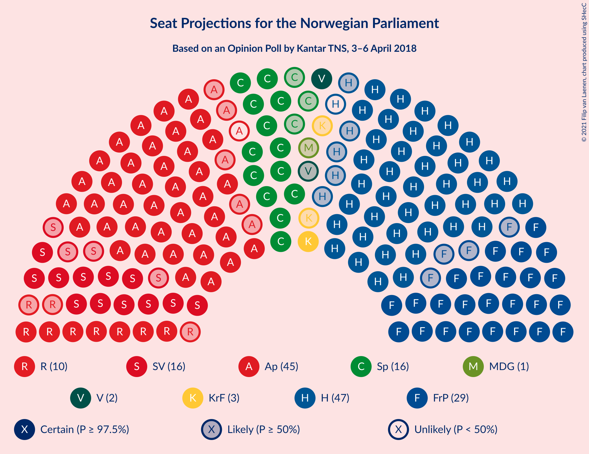
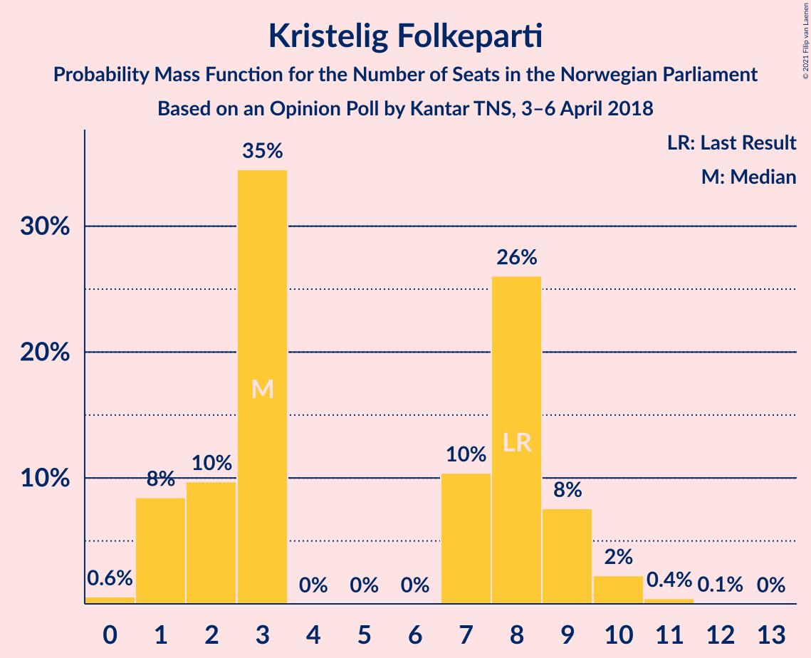
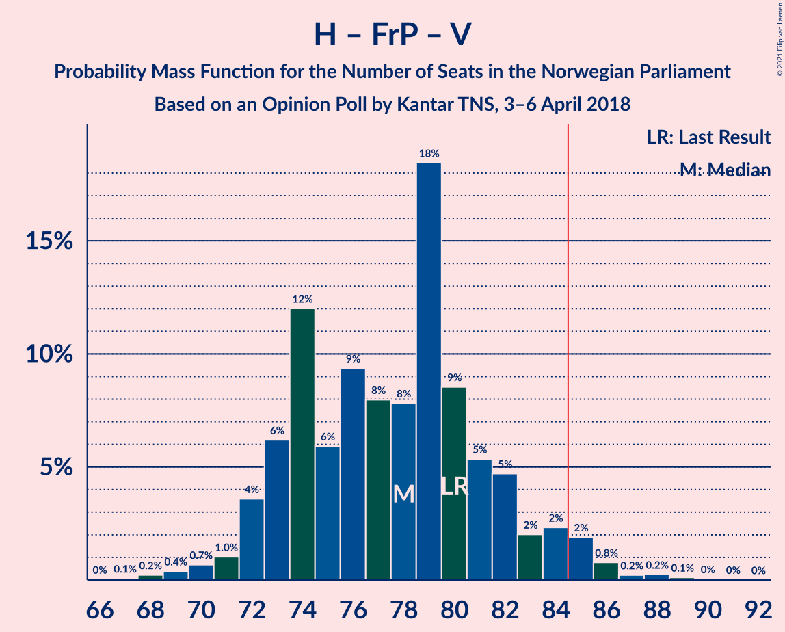
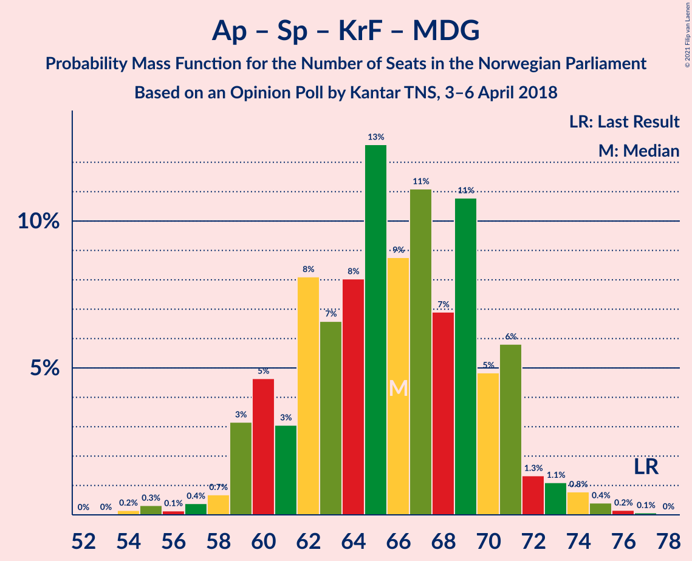
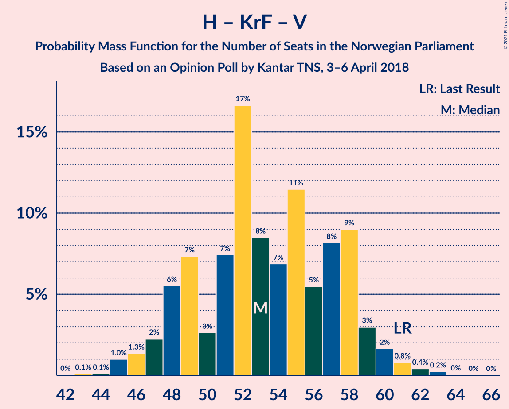
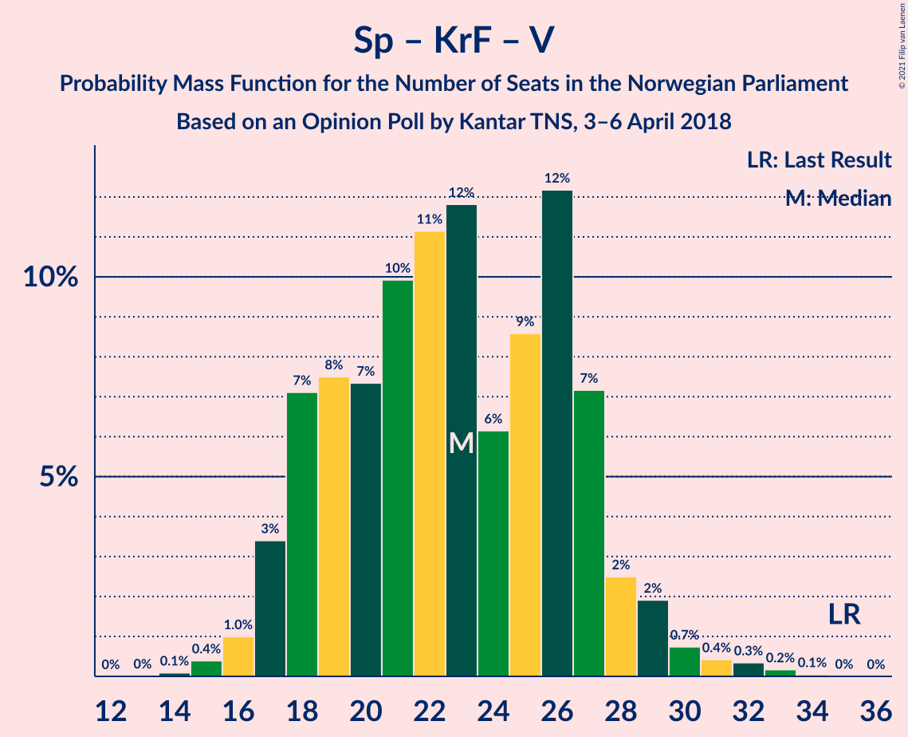

# Opinion Poll by Kantar TNS, 3–6 April 2018

<a href="#voting-intentions">Voting Intentions</a> | <a href="#seats">Seats</a> | <a href="#coalitions">Coalitions</a> | <a href="#technical-information">Technical Information</a>

## Voting Intentions

### Confidence Intervals

| Party | Last Result | Poll Result | 80% Confidence Interval | 90% Confidence Interval | 95% Confidence Interval | 99% Confidence Interval |
|:-----:|:-----------:|:-----------:|:-----------------------:|:-----------------------:|:-----------------------:|:-----------------------:|
| Høyre | 25.0% | 26.3% | 24.3–28.4% |23.8–29.0% |23.3–29.5% |22.4–30.5% |
| Arbeiderpartiet | 27.4% | 24.1% | 22.2–26.2% |21.7–26.7% |21.2–27.2% |20.3–28.2% |
| Fremskrittspartiet | 15.2% | 16.2% | 14.6–18.0% |14.1–18.5% |13.8–19.0% |13.0–19.9% |
| Senterpartiet | 10.3% | 8.9% | 7.7–10.4% |7.4–10.8% |7.1–11.2% |6.6–11.9% |
| Sosialistisk Venstreparti | 6.0% | 8.7% | 7.5–10.1% |7.2–10.5% |6.9–10.9% |6.4–11.6% |
| Rødt | 2.4% | 5.4% | 4.5–6.6% |4.3–7.0% |4.1–7.3% |3.6–7.9% |
| Kristelig Folkeparti | 4.2% | 3.8% | 3.0–4.8% |2.8–5.1% |2.6–5.3% |2.3–5.9% |
| Miljøpartiet De Grønne | 3.2% | 2.8% | 2.2–3.8% |2.0–4.0% |1.9–4.3% |1.6–4.8% |
| Venstre | 4.4% | 2.8% | 2.2–3.8% |2.0–4.0% |1.9–4.3% |1.6–4.8% |

*Note:* The poll result column reflects the actual value used in the calculations. Published results may vary slightly, and in addition be rounded to fewer digits.

## Seats

### Confidence Intervals

| Party | Last Result | Median | 80% Confidence Interval | 90% Confidence Interval | 95% Confidence Interval | 99% Confidence Interval |
|:-----:|:-----------:|:------:|:-----------------------:|:-----------------------:|:-----------------------:|:-----------------------:|
| <a href="#høyre">Høyre</a> | 45 | 46 | 42–50 |42–51 |41–53 |40–55 |
| <a href="#arbeiderpartiet">Arbeiderpartiet</a> | 49 | 44 | 40–47 |39–48 |39–49 |37–51 |
| <a href="#fremskrittspartiet">Fremskrittspartiet</a> | 27 | 29 | 27–32 |26–33 |25–34 |23–35 |
| <a href="#senterpartiet">Senterpartiet</a> | 19 | 16 | 13–18 |13–19 |13–20 |12–21 |
| <a href="#sosialistisk-venstreparti">Sosialistisk Venstreparti</a> | 11 | 16 | 13–18 |13–19 |12–19 |11–21 |
| <a href="#rødt">Rødt</a> | 1 | 10 | 8–12 |8–13 |7–13 |2–14 |
| <a href="#kristelig-folkeparti">Kristelig Folkeparti</a> | 8 | 3 | 2–9 |1–9 |1–10 |0–10 |
| <a href="#miljøpartiet-de-grønne">Miljøpartiet De Grønne</a> | 1 | 1 | 1–2 |0–2 |0–2 |0–8 |
| <a href="#venstre">Venstre</a> | 8 | 2 | 1–2 |1–2 |1–7 |0–8 |

### Høyre

*For a full overview of the results for this party, see the [Høyre](party-høyre.html) page.*

| Number of Seats | Probability | Accumulated | Special Marks |
|:---------------:|:-----------:|:-----------:|:-------------:|
| 38 | 0.1% | 100% |  |
| 39 | 0.2% | 99.9% |  |
| 40 | 1.0% | 99.6% |  |
| 41 | 2% | 98.6% |  |
| 42 | 8% | 97% |  |
| 43 | 6% | 89% |  |
| 44 | 11% | 83% |  |
| 45 | 14% | 72% | Last Result |
| 46 | 8% | 57% | Median |
| 47 | 17% | 49% |  |
| 48 | 15% | 32% |  |
| 49 | 4% | 17% |  |
| 50 | 5% | 13% |  |
| 51 | 3% | 7% |  |
| 52 | 2% | 5% |  |
| 53 | 2% | 3% |  |
| 54 | 0.3% | 1.0% |  |
| 55 | 0.4% | 0.7% |  |
| 56 | 0.2% | 0.4% |  |
| 57 | 0.1% | 0.1% |  |
| 58 | 0% | 0% |  |

### Arbeiderpartiet

*For a full overview of the results for this party, see the [Arbeiderpartiet](party-arbeiderpartiet.html) page.*

| Number of Seats | Probability | Accumulated | Special Marks |
|:---------------:|:-----------:|:-----------:|:-------------:|
| 35 | 0.1% | 100% |  |
| 36 | 0.1% | 99.9% |  |
| 37 | 0.6% | 99.8% |  |
| 38 | 1.0% | 99.2% |  |
| 39 | 4% | 98% |  |
| 40 | 5% | 95% |  |
| 41 | 12% | 90% |  |
| 42 | 8% | 78% |  |
| 43 | 15% | 70% |  |
| 44 | 14% | 55% | Median |
| 45 | 18% | 40% |  |
| 46 | 7% | 22% |  |
| 47 | 8% | 15% |  |
| 48 | 3% | 7% |  |
| 49 | 2% | 4% | Last Result |
| 50 | 1.2% | 2% |  |
| 51 | 0.5% | 0.9% |  |
| 52 | 0.3% | 0.4% |  |
| 53 | 0.1% | 0.1% |  |
| 54 | 0% | 0% |  |

### Fremskrittspartiet

*For a full overview of the results for this party, see the [Fremskrittspartiet](party-fremskrittspartiet.html) page.*

| Number of Seats | Probability | Accumulated | Special Marks |
|:---------------:|:-----------:|:-----------:|:-------------:|
| 22 | 0.1% | 100% |  |
| 23 | 0.4% | 99.9% |  |
| 24 | 0.4% | 99.5% |  |
| 25 | 3% | 99.1% |  |
| 26 | 4% | 96% |  |
| 27 | 15% | 91% | Last Result |
| 28 | 13% | 76% |  |
| 29 | 17% | 62% | Median |
| 30 | 19% | 46% |  |
| 31 | 9% | 26% |  |
| 32 | 10% | 18% |  |
| 33 | 4% | 8% |  |
| 34 | 2% | 4% |  |
| 35 | 1.4% | 2% |  |
| 36 | 0.2% | 0.3% |  |
| 37 | 0% | 0.1% |  |
| 38 | 0% | 0.1% |  |
| 39 | 0% | 0% |  |

### Senterpartiet

*For a full overview of the results for this party, see the [Senterpartiet](party-senterpartiet.html) page.*

| Number of Seats | Probability | Accumulated | Special Marks |
|:---------------:|:-----------:|:-----------:|:-------------:|
| 10 | 0.1% | 100% |  |
| 11 | 0.2% | 99.9% |  |
| 12 | 2% | 99.7% |  |
| 13 | 14% | 98% |  |
| 14 | 14% | 84% |  |
| 15 | 14% | 69% |  |
| 16 | 25% | 55% | Median |
| 17 | 17% | 30% |  |
| 18 | 5% | 13% |  |
| 19 | 4% | 8% | Last Result |
| 20 | 3% | 4% |  |
| 21 | 0.5% | 1.0% |  |
| 22 | 0.3% | 0.5% |  |
| 23 | 0.1% | 0.2% |  |
| 24 | 0% | 0% |  |

### Sosialistisk Venstreparti

*For a full overview of the results for this party, see the [Sosialistisk Venstreparti](party-sosialistiskvenstreparti.html) page.*

| Number of Seats | Probability | Accumulated | Special Marks |
|:---------------:|:-----------:|:-----------:|:-------------:|
| 10 | 0.1% | 100% |  |
| 11 | 0.7% | 99.9% | Last Result |
| 12 | 3% | 99.2% |  |
| 13 | 8% | 96% |  |
| 14 | 14% | 88% |  |
| 15 | 15% | 74% |  |
| 16 | 22% | 59% | Median |
| 17 | 17% | 37% |  |
| 18 | 13% | 20% |  |
| 19 | 5% | 7% |  |
| 20 | 1.4% | 2% |  |
| 21 | 0.5% | 0.7% |  |
| 22 | 0.2% | 0.2% |  |
| 23 | 0% | 0.1% |  |
| 24 | 0% | 0% |  |

### Rødt

*For a full overview of the results for this party, see the [Rødt](party-rødt.html) page.*

| Number of Seats | Probability | Accumulated | Special Marks |
|:---------------:|:-----------:|:-----------:|:-------------:|
| 1 | 0% | 100% | Last Result |
| 2 | 2% | 100% |  |
| 3 | 0% | 98% |  |
| 4 | 0% | 98% |  |
| 5 | 0% | 98% |  |
| 6 | 0% | 98% |  |
| 7 | 2% | 98% |  |
| 8 | 11% | 96% |  |
| 9 | 27% | 85% |  |
| 10 | 23% | 58% | Median |
| 11 | 17% | 35% |  |
| 12 | 11% | 17% |  |
| 13 | 5% | 6% |  |
| 14 | 0.9% | 1.2% |  |
| 15 | 0.3% | 0.4% |  |
| 16 | 0.1% | 0.1% |  |
| 17 | 0% | 0% |  |

### Kristelig Folkeparti

*For a full overview of the results for this party, see the [Kristelig Folkeparti](party-kristeligfolkeparti.html) page.*

| Number of Seats | Probability | Accumulated | Special Marks |
|:---------------:|:-----------:|:-----------:|:-------------:|
| 0 | 0.6% | 100% |  |
| 1 | 8% | 99.4% |  |
| 2 | 10% | 91% |  |
| 3 | 35% | 81% | Median |
| 4 | 0% | 47% |  |
| 5 | 0% | 47% |  |
| 6 | 0% | 47% |  |
| 7 | 10% | 47% |  |
| 8 | 26% | 36% | Last Result |
| 9 | 8% | 10% |  |
| 10 | 2% | 3% |  |
| 11 | 0.4% | 0.5% |  |
| 12 | 0.1% | 0.1% |  |
| 13 | 0% | 0% |  |

### Miljøpartiet De Grønne

*For a full overview of the results for this party, see the [Miljøpartiet De Grønne](party-miljøpartietdegrønne.html) page.*

| Number of Seats | Probability | Accumulated | Special Marks |
|:---------------:|:-----------:|:-----------:|:-------------:|
| 0 | 7% | 100% |  |
| 1 | 72% | 93% | Last Result, Median |
| 2 | 18% | 21% |  |
| 3 | 0.4% | 2% |  |
| 4 | 0% | 2% |  |
| 5 | 0% | 2% |  |
| 6 | 0.1% | 2% |  |
| 7 | 0.1% | 2% |  |
| 8 | 2% | 2% |  |
| 9 | 0.1% | 0.1% |  |
| 10 | 0% | 0% |  |

### Venstre

*For a full overview of the results for this party, see the [Venstre](party-venstre.html) page.*

| Number of Seats | Probability | Accumulated | Special Marks |
|:---------------:|:-----------:|:-----------:|:-------------:|
| 0 | 1.4% | 100% |  |
| 1 | 18% | 98.6% |  |
| 2 | 76% | 81% | Median |
| 3 | 0% | 5% |  |
| 4 | 0% | 5% |  |
| 5 | 0% | 5% |  |
| 6 | 0% | 5% |  |
| 7 | 3% | 5% |  |
| 8 | 2% | 2% | Last Result |
| 9 | 0.3% | 0.3% |  |
| 10 | 0% | 0% |  |

## Coalitions

### Confidence Intervals

| Coalition | Last Result | Median | Majority? | 80% Confidence Interval | 90% Confidence Interval | 95% Confidence Interval | 99% Confidence Interval |
|:---------:|:-----------:|:------:|:---------:|:-----------------------:|:-----------------------:|:-----------------------:|:-----------------------:|
| Høyre – Fremskrittspartiet – Senterpartiet – Kristelig Folkeparti – Venstre | 107 | 98 | 100% | 94–102 | 93–104 | 92–105 | 90–107 |
| Arbeiderpartiet – Senterpartiet – Sosialistisk Venstreparti – Rødt – Miljøpartiet De Grønne | 81 | 87 | 70% | 82–91 | 81–92 | 80–93 | 77–95 |
| Arbeiderpartiet – Senterpartiet – Sosialistisk Venstreparti – Rødt | 80 | 86 | 59% | 81–90 | 80–91 | 78–92 | 76–94 |
| Høyre – Fremskrittspartiet – Kristelig Folkeparti – Miljøpartiet De Grønne – Venstre | 89 | 83 | 41% | 79–88 | 78–89 | 77–91 | 75–93 |
| Høyre – Fremskrittspartiet – Kristelig Folkeparti – Venstre | 88 | 82 | 30% | 78–87 | 77–88 | 76–89 | 74–92 |
| Arbeiderpartiet – Senterpartiet – Sosialistisk Venstreparti – Kristelig Folkeparti – Miljøpartiet De Grønne | 88 | 81 | 23% | 77–86 | 76–86 | 75–88 | 72–91 |
| Høyre – Fremskrittspartiet – Venstre | 80 | 78 | 3% | 73–82 | 72–84 | 72–85 | 69–87 |
| Arbeiderpartiet – Senterpartiet – Sosialistisk Venstreparti – Miljøpartiet De Grønne | 80 | 77 | 0.7% | 73–81 | 72–83 | 70–83 | 68–85 |
| Høyre – Fremskrittspartiet | 72 | 76 | 0.5% | 72–80 | 70–81 | 70–83 | 67–85 |
| Arbeiderpartiet – Senterpartiet – Sosialistisk Venstreparti | 79 | 75 | 0.2% | 71–79 | 71–81 | 69–82 | 67–83 |
| Arbeiderpartiet – Senterpartiet – Kristelig Folkeparti – Miljøpartiet De Grønne | 77 | 66 | 0% | 61–70 | 60–71 | 59–73 | 56–75 |
| Arbeiderpartiet – Senterpartiet – Kristelig Folkeparti | 76 | 64 | 0% | 59–69 | 58–70 | 58–71 | 54–73 |
| Arbeiderpartiet – Senterpartiet | 68 | 59 | 0% | 56–63 | 55–64 | 54–66 | 52–67 |
| Arbeiderpartiet – Sosialistisk Venstreparti | 60 | 60 | 0% | 56–63 | 55–65 | 54–66 | 52–67 |
| Høyre – Kristelig Folkeparti – Venstre | 61 | 53 | 0% | 48–58 | 48–59 | 46–60 | 45–62 |
| Senterpartiet – Kristelig Folkeparti – Venstre | 35 | 23 | 0% | 18–27 | 18–28 | 17–29 | 15–32 |

### Høyre – Fremskrittspartiet – Senterpartiet – Kristelig Folkeparti – Venstre

| Number of Seats | Probability | Accumulated | Special Marks |
|:---------------:|:-----------:|:-----------:|:-------------:|
| 87 | 0% | 100% |  |
| 88 | 0.1% | 99.9% |  |
| 89 | 0.3% | 99.9% |  |
| 90 | 0.5% | 99.6% |  |
| 91 | 1.4% | 99.1% |  |
| 92 | 2% | 98% |  |
| 93 | 4% | 96% |  |
| 94 | 3% | 92% |  |
| 95 | 11% | 89% |  |
| 96 | 9% | 78% | Median |
| 97 | 9% | 69% |  |
| 98 | 11% | 60% |  |
| 99 | 10% | 49% |  |
| 100 | 17% | 39% |  |
| 101 | 7% | 22% |  |
| 102 | 6% | 15% |  |
| 103 | 2% | 9% |  |
| 104 | 3% | 6% |  |
| 105 | 1.4% | 3% |  |
| 106 | 0.6% | 2% |  |
| 107 | 1.0% | 1.3% | Last Result |
| 108 | 0.2% | 0.3% |  |
| 109 | 0.1% | 0.2% |  |
| 110 | 0% | 0.1% |  |
| 111 | 0% | 0% |  |

### Arbeiderpartiet – Senterpartiet – Sosialistisk Venstreparti – Rødt – Miljøpartiet De Grønne

| Number of Seats | Probability | Accumulated | Special Marks |
|:---------------:|:-----------:|:-----------:|:-------------:|
| 75 | 0% | 100% |  |
| 76 | 0.2% | 99.9% |  |
| 77 | 0.8% | 99.8% |  |
| 78 | 0.4% | 99.0% |  |
| 79 | 0.8% | 98.6% |  |
| 80 | 1.2% | 98% |  |
| 81 | 3% | 97% | Last Result |
| 82 | 12% | 94% |  |
| 83 | 5% | 82% |  |
| 84 | 7% | 77% |  |
| 85 | 8% | 70% | Majority |
| 86 | 8% | 62% |  |
| 87 | 19% | 54% | Median |
| 88 | 9% | 34% |  |
| 89 | 9% | 26% |  |
| 90 | 4% | 17% |  |
| 91 | 5% | 13% |  |
| 92 | 4% | 8% |  |
| 93 | 3% | 4% |  |
| 94 | 1.1% | 2% |  |
| 95 | 0.4% | 0.8% |  |
| 96 | 0.3% | 0.4% |  |
| 97 | 0.1% | 0.1% |  |
| 98 | 0% | 0.1% |  |
| 99 | 0% | 0% |  |

### Arbeiderpartiet – Senterpartiet – Sosialistisk Venstreparti – Rødt

| Number of Seats | Probability | Accumulated | Special Marks |
|:---------------:|:-----------:|:-----------:|:-------------:|
| 73 | 0% | 100% |  |
| 74 | 0.1% | 99.9% |  |
| 75 | 0.2% | 99.9% |  |
| 76 | 0.9% | 99.7% |  |
| 77 | 0.4% | 98.8% |  |
| 78 | 1.0% | 98% |  |
| 79 | 2% | 97% |  |
| 80 | 2% | 95% | Last Result |
| 81 | 12% | 93% |  |
| 82 | 6% | 81% |  |
| 83 | 6% | 74% |  |
| 84 | 10% | 68% |  |
| 85 | 8% | 59% | Majority |
| 86 | 19% | 50% | Median |
| 87 | 8% | 31% |  |
| 88 | 8% | 23% |  |
| 89 | 3% | 16% |  |
| 90 | 5% | 12% |  |
| 91 | 4% | 7% |  |
| 92 | 2% | 3% |  |
| 93 | 0.7% | 1.3% |  |
| 94 | 0.3% | 0.6% |  |
| 95 | 0.2% | 0.3% |  |
| 96 | 0.1% | 0.1% |  |
| 97 | 0% | 0% |  |

### Høyre – Fremskrittspartiet – Kristelig Folkeparti – Miljøpartiet De Grønne – Venstre

| Number of Seats | Probability | Accumulated | Special Marks |
|:---------------:|:-----------:|:-----------:|:-------------:|
| 73 | 0.1% | 100% |  |
| 74 | 0.2% | 99.9% |  |
| 75 | 0.3% | 99.7% |  |
| 76 | 0.7% | 99.4% |  |
| 77 | 2% | 98.7% |  |
| 78 | 4% | 97% |  |
| 79 | 5% | 93% |  |
| 80 | 3% | 88% |  |
| 81 | 8% | 84% | Median |
| 82 | 8% | 77% |  |
| 83 | 19% | 69% |  |
| 84 | 8% | 50% |  |
| 85 | 10% | 41% | Majority |
| 86 | 6% | 32% |  |
| 87 | 6% | 26% |  |
| 88 | 12% | 19% |  |
| 89 | 2% | 7% | Last Result |
| 90 | 2% | 5% |  |
| 91 | 1.0% | 3% |  |
| 92 | 0.4% | 2% |  |
| 93 | 0.9% | 1.2% |  |
| 94 | 0.2% | 0.3% |  |
| 95 | 0.1% | 0.1% |  |
| 96 | 0% | 0.1% |  |
| 97 | 0% | 0% |  |

### Høyre – Fremskrittspartiet – Kristelig Folkeparti – Venstre

| Number of Seats | Probability | Accumulated | Special Marks |
|:---------------:|:-----------:|:-----------:|:-------------:|
| 71 | 0% | 100% |  |
| 72 | 0.1% | 99.9% |  |
| 73 | 0.3% | 99.9% |  |
| 74 | 0.4% | 99.6% |  |
| 75 | 1.1% | 99.2% |  |
| 76 | 3% | 98% |  |
| 77 | 4% | 96% |  |
| 78 | 5% | 92% |  |
| 79 | 4% | 87% |  |
| 80 | 9% | 83% | Median |
| 81 | 9% | 74% |  |
| 82 | 19% | 66% |  |
| 83 | 8% | 46% |  |
| 84 | 8% | 38% |  |
| 85 | 7% | 30% | Majority |
| 86 | 5% | 23% |  |
| 87 | 12% | 18% |  |
| 88 | 3% | 6% | Last Result |
| 89 | 1.2% | 3% |  |
| 90 | 0.8% | 2% |  |
| 91 | 0.4% | 1.4% |  |
| 92 | 0.8% | 1.0% |  |
| 93 | 0.2% | 0.2% |  |
| 94 | 0% | 0.1% |  |
| 95 | 0% | 0% |  |

### Arbeiderpartiet – Senterpartiet – Sosialistisk Venstreparti – Kristelig Folkeparti – Miljøpartiet De Grønne

| Number of Seats | Probability | Accumulated | Special Marks |
|:---------------:|:-----------:|:-----------:|:-------------:|
| 70 | 0.1% | 100% |  |
| 71 | 0.2% | 99.9% |  |
| 72 | 0.4% | 99.7% |  |
| 73 | 0.6% | 99.3% |  |
| 74 | 0.4% | 98.7% |  |
| 75 | 3% | 98% |  |
| 76 | 3% | 95% |  |
| 77 | 4% | 92% |  |
| 78 | 8% | 88% |  |
| 79 | 6% | 80% |  |
| 80 | 15% | 74% | Median |
| 81 | 12% | 60% |  |
| 82 | 8% | 48% |  |
| 83 | 10% | 40% |  |
| 84 | 7% | 30% |  |
| 85 | 5% | 23% | Majority |
| 86 | 13% | 18% |  |
| 87 | 2% | 5% |  |
| 88 | 1.2% | 3% | Last Result |
| 89 | 0.5% | 2% |  |
| 90 | 0.4% | 1.2% |  |
| 91 | 0.5% | 0.8% |  |
| 92 | 0.2% | 0.3% |  |
| 93 | 0% | 0.1% |  |
| 94 | 0% | 0% |  |

### Høyre – Fremskrittspartiet – Venstre

| Number of Seats | Probability | Accumulated | Special Marks |
|:---------------:|:-----------:|:-----------:|:-------------:|
| 67 | 0.1% | 100% |  |
| 68 | 0.2% | 99.9% |  |
| 69 | 0.4% | 99.7% |  |
| 70 | 0.7% | 99.3% |  |
| 71 | 1.0% | 98.6% |  |
| 72 | 4% | 98% |  |
| 73 | 6% | 94% |  |
| 74 | 12% | 88% |  |
| 75 | 6% | 76% |  |
| 76 | 9% | 70% |  |
| 77 | 8% | 61% | Median |
| 78 | 8% | 53% |  |
| 79 | 18% | 45% |  |
| 80 | 9% | 26% | Last Result |
| 81 | 5% | 18% |  |
| 82 | 5% | 12% |  |
| 83 | 2% | 8% |  |
| 84 | 2% | 6% |  |
| 85 | 2% | 3% | Majority |
| 86 | 0.8% | 1.4% |  |
| 87 | 0.2% | 0.6% |  |
| 88 | 0.2% | 0.4% |  |
| 89 | 0.1% | 0.2% |  |
| 90 | 0% | 0.1% |  |
| 91 | 0% | 0% |  |

### Arbeiderpartiet – Senterpartiet – Sosialistisk Venstreparti – Miljøpartiet De Grønne

| Number of Seats | Probability | Accumulated | Special Marks |
|:---------------:|:-----------:|:-----------:|:-------------:|
| 67 | 0% | 100% |  |
| 68 | 0.4% | 99.9% |  |
| 69 | 0.8% | 99.5% |  |
| 70 | 1.5% | 98.7% |  |
| 71 | 1.4% | 97% |  |
| 72 | 4% | 96% |  |
| 73 | 15% | 92% |  |
| 74 | 8% | 77% |  |
| 75 | 11% | 69% |  |
| 76 | 5% | 58% |  |
| 77 | 11% | 52% | Median |
| 78 | 18% | 41% |  |
| 79 | 5% | 23% |  |
| 80 | 7% | 17% | Last Result |
| 81 | 2% | 10% |  |
| 82 | 3% | 8% |  |
| 83 | 4% | 5% |  |
| 84 | 0.8% | 2% |  |
| 85 | 0.4% | 0.7% | Majority |
| 86 | 0.2% | 0.4% |  |
| 87 | 0.1% | 0.1% |  |
| 88 | 0.1% | 0.1% |  |
| 89 | 0% | 0% |  |

### Høyre – Fremskrittspartiet

| Number of Seats | Probability | Accumulated | Special Marks |
|:---------------:|:-----------:|:-----------:|:-------------:|
| 65 | 0% | 100% |  |
| 66 | 0.2% | 99.9% |  |
| 67 | 0.2% | 99.7% |  |
| 68 | 0.7% | 99.5% |  |
| 69 | 1.1% | 98.8% |  |
| 70 | 4% | 98% |  |
| 71 | 4% | 94% |  |
| 72 | 15% | 90% | Last Result |
| 73 | 6% | 75% |  |
| 74 | 9% | 69% |  |
| 75 | 8% | 60% | Median |
| 76 | 8% | 52% |  |
| 77 | 19% | 44% |  |
| 78 | 10% | 26% |  |
| 79 | 6% | 16% |  |
| 80 | 4% | 10% |  |
| 81 | 2% | 7% |  |
| 82 | 1.0% | 4% |  |
| 83 | 2% | 3% |  |
| 84 | 0.9% | 1.5% |  |
| 85 | 0.2% | 0.5% | Majority |
| 86 | 0.2% | 0.3% |  |
| 87 | 0.1% | 0.1% |  |
| 88 | 0% | 0.1% |  |
| 89 | 0% | 0% |  |

### Arbeiderpartiet – Senterpartiet – Sosialistisk Venstreparti

| Number of Seats | Probability | Accumulated | Special Marks |
|:---------------:|:-----------:|:-----------:|:-------------:|
| 65 | 0% | 100% |  |
| 66 | 0.1% | 99.9% |  |
| 67 | 0.5% | 99.8% |  |
| 68 | 0.9% | 99.3% |  |
| 69 | 1.1% | 98% |  |
| 70 | 2% | 97% |  |
| 71 | 5% | 95% |  |
| 72 | 14% | 90% |  |
| 73 | 9% | 76% |  |
| 74 | 11% | 66% |  |
| 75 | 7% | 55% |  |
| 76 | 12% | 49% | Median |
| 77 | 16% | 37% |  |
| 78 | 4% | 21% |  |
| 79 | 8% | 17% | Last Result |
| 80 | 3% | 9% |  |
| 81 | 2% | 6% |  |
| 82 | 3% | 4% |  |
| 83 | 0.3% | 0.8% |  |
| 84 | 0.3% | 0.5% |  |
| 85 | 0.1% | 0.2% | Majority |
| 86 | 0% | 0.1% |  |
| 87 | 0% | 0% |  |

### Arbeiderpartiet – Senterpartiet – Kristelig Folkeparti – Miljøpartiet De Grønne

| Number of Seats | Probability | Accumulated | Special Marks |
|:---------------:|:-----------:|:-----------:|:-------------:|
| 54 | 0.2% | 100% |  |
| 55 | 0.3% | 99.8% |  |
| 56 | 0.1% | 99.5% |  |
| 57 | 0.4% | 99.4% |  |
| 58 | 0.7% | 99.0% |  |
| 59 | 3% | 98% |  |
| 60 | 5% | 95% |  |
| 61 | 3% | 90% |  |
| 62 | 8% | 87% |  |
| 63 | 7% | 79% |  |
| 64 | 8% | 73% | Median |
| 65 | 13% | 65% |  |
| 66 | 9% | 52% |  |
| 67 | 11% | 43% |  |
| 68 | 7% | 32% |  |
| 69 | 11% | 25% |  |
| 70 | 5% | 15% |  |
| 71 | 6% | 10% |  |
| 72 | 1.3% | 4% |  |
| 73 | 1.1% | 3% |  |
| 74 | 0.8% | 1.5% |  |
| 75 | 0.4% | 0.7% |  |
| 76 | 0.2% | 0.3% |  |
| 77 | 0.1% | 0.1% | Last Result |
| 78 | 0% | 0% |  |

### Arbeiderpartiet – Senterpartiet – Kristelig Folkeparti

| Number of Seats | Probability | Accumulated | Special Marks |
|:---------------:|:-----------:|:-----------:|:-------------:|
| 53 | 0.1% | 100% |  |
| 54 | 0.5% | 99.9% |  |
| 55 | 0.3% | 99.5% |  |
| 56 | 0.5% | 99.2% |  |
| 57 | 0.6% | 98.7% |  |
| 58 | 3% | 98% |  |
| 59 | 5% | 95% |  |
| 60 | 5% | 90% |  |
| 61 | 7% | 85% |  |
| 62 | 6% | 78% |  |
| 63 | 10% | 72% | Median |
| 64 | 12% | 62% |  |
| 65 | 9% | 49% |  |
| 66 | 10% | 40% |  |
| 67 | 7% | 30% |  |
| 68 | 10% | 23% |  |
| 69 | 5% | 13% |  |
| 70 | 5% | 8% |  |
| 71 | 1.3% | 3% |  |
| 72 | 0.6% | 2% |  |
| 73 | 0.5% | 0.9% |  |
| 74 | 0.3% | 0.4% |  |
| 75 | 0.1% | 0.1% |  |
| 76 | 0% | 0.1% | Last Result |
| 77 | 0% | 0% |  |

### Arbeiderpartiet – Senterpartiet

| Number of Seats | Probability | Accumulated | Special Marks |
|:---------------:|:-----------:|:-----------:|:-------------:|
| 50 | 0.1% | 100% |  |
| 51 | 0.3% | 99.9% |  |
| 52 | 0.8% | 99.6% |  |
| 53 | 0.6% | 98.8% |  |
| 54 | 2% | 98% |  |
| 55 | 6% | 97% |  |
| 56 | 12% | 91% |  |
| 57 | 6% | 79% |  |
| 58 | 14% | 73% |  |
| 59 | 9% | 59% |  |
| 60 | 17% | 50% | Median |
| 61 | 8% | 33% |  |
| 62 | 8% | 25% |  |
| 63 | 8% | 17% |  |
| 64 | 5% | 9% |  |
| 65 | 2% | 4% |  |
| 66 | 2% | 3% |  |
| 67 | 0.5% | 0.8% |  |
| 68 | 0.1% | 0.3% | Last Result |
| 69 | 0.1% | 0.2% |  |
| 70 | 0.1% | 0.1% |  |
| 71 | 0% | 0% |  |

### Arbeiderpartiet – Sosialistisk Venstreparti

| Number of Seats | Probability | Accumulated | Special Marks |
|:---------------:|:-----------:|:-----------:|:-------------:|
| 50 | 0.1% | 100% |  |
| 51 | 0.2% | 99.9% |  |
| 52 | 0.6% | 99.7% |  |
| 53 | 0.7% | 99.1% |  |
| 54 | 3% | 98% |  |
| 55 | 3% | 96% |  |
| 56 | 7% | 93% |  |
| 57 | 10% | 86% |  |
| 58 | 11% | 76% |  |
| 59 | 15% | 65% |  |
| 60 | 14% | 50% | Last Result, Median |
| 61 | 10% | 36% |  |
| 62 | 11% | 26% |  |
| 63 | 7% | 16% |  |
| 64 | 3% | 9% |  |
| 65 | 2% | 6% |  |
| 66 | 2% | 3% |  |
| 67 | 0.9% | 1.2% |  |
| 68 | 0.1% | 0.3% |  |
| 69 | 0.1% | 0.2% |  |
| 70 | 0% | 0.1% |  |
| 71 | 0% | 0% |  |

### Høyre – Kristelig Folkeparti – Venstre

| Number of Seats | Probability | Accumulated | Special Marks |
|:---------------:|:-----------:|:-----------:|:-------------:|
| 43 | 0.1% | 100% |  |
| 44 | 0.1% | 99.9% |  |
| 45 | 1.0% | 99.8% |  |
| 46 | 1.3% | 98.8% |  |
| 47 | 2% | 97% |  |
| 48 | 6% | 95% |  |
| 49 | 7% | 90% |  |
| 50 | 3% | 82% |  |
| 51 | 7% | 80% | Median |
| 52 | 17% | 72% |  |
| 53 | 8% | 56% |  |
| 54 | 7% | 47% |  |
| 55 | 11% | 40% |  |
| 56 | 5% | 29% |  |
| 57 | 8% | 23% |  |
| 58 | 9% | 15% |  |
| 59 | 3% | 6% |  |
| 60 | 2% | 3% |  |
| 61 | 0.8% | 2% | Last Result |
| 62 | 0.4% | 0.7% |  |
| 63 | 0.2% | 0.3% |  |
| 64 | 0% | 0.1% |  |
| 65 | 0% | 0.1% |  |
| 66 | 0% | 0% |  |

### Senterpartiet – Kristelig Folkeparti – Venstre

| Number of Seats | Probability | Accumulated | Special Marks |
|:---------------:|:-----------:|:-----------:|:-------------:|
| 14 | 0.1% | 100% |  |
| 15 | 0.4% | 99.9% |  |
| 16 | 1.0% | 99.5% |  |
| 17 | 3% | 98% |  |
| 18 | 7% | 95% |  |
| 19 | 8% | 88% |  |
| 20 | 7% | 80% |  |
| 21 | 10% | 73% | Median |
| 22 | 11% | 63% |  |
| 23 | 12% | 52% |  |
| 24 | 6% | 40% |  |
| 25 | 9% | 34% |  |
| 26 | 12% | 26% |  |
| 27 | 7% | 13% |  |
| 28 | 2% | 6% |  |
| 29 | 2% | 4% |  |
| 30 | 0.7% | 2% |  |
| 31 | 0.4% | 1.0% |  |
| 32 | 0.3% | 0.6% |  |
| 33 | 0.2% | 0.2% |  |
| 34 | 0.1% | 0.1% |  |
| 35 | 0% | 0% | Last Result |

## Technical Information

### Opinion Poll

+ **Polling firm:** Kantar TNS
+ **Commissioner(s):** —
+ **Fieldwork period:** 3–6 April 2018

### Calculations

+ **Sample size:** 772
+ **Simulations done:** 1,048,576
+ **Error estimate:** 1.57%

