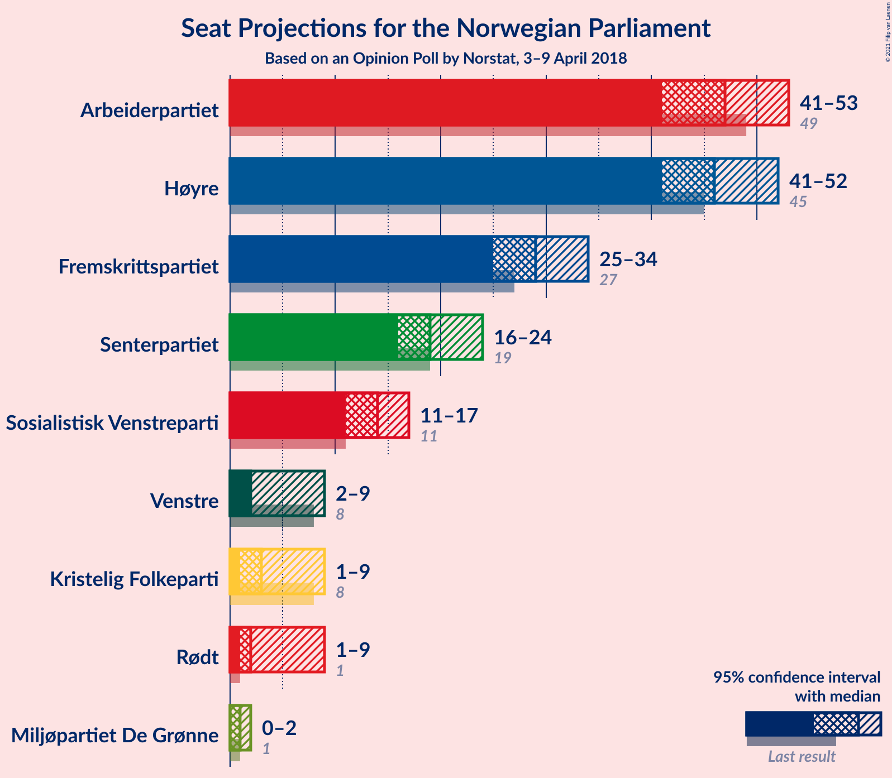
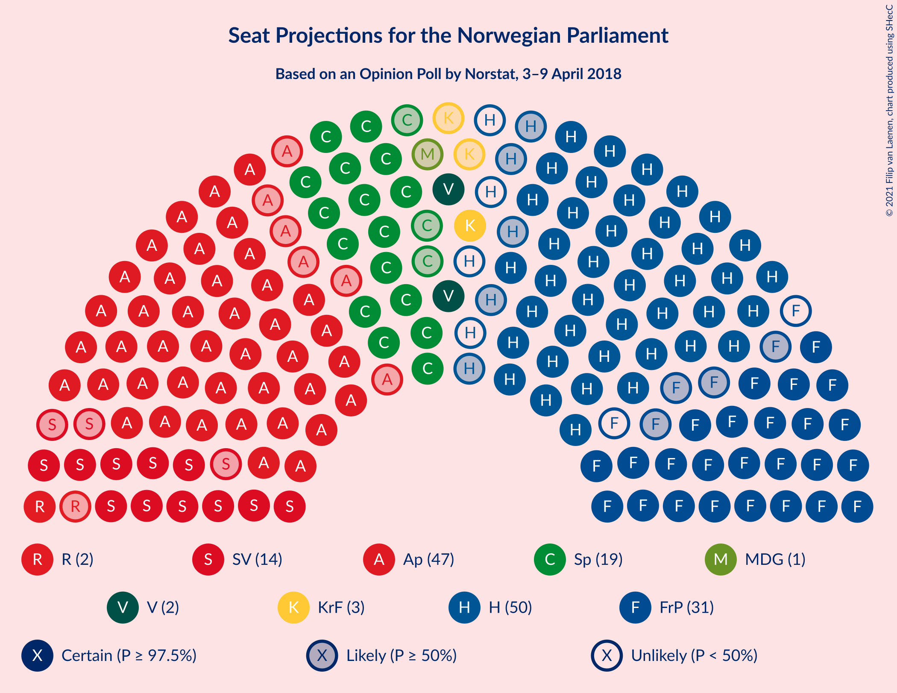
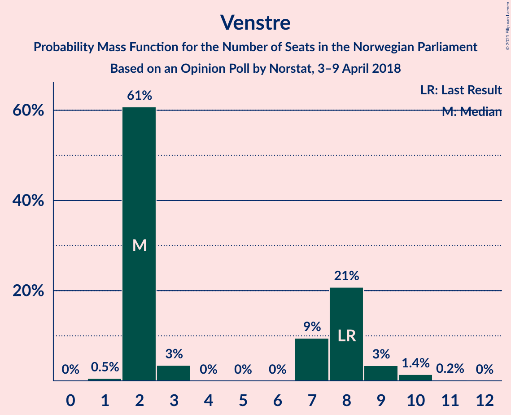
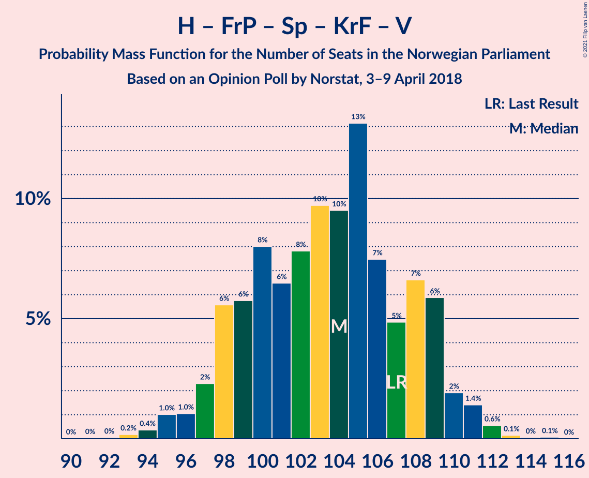
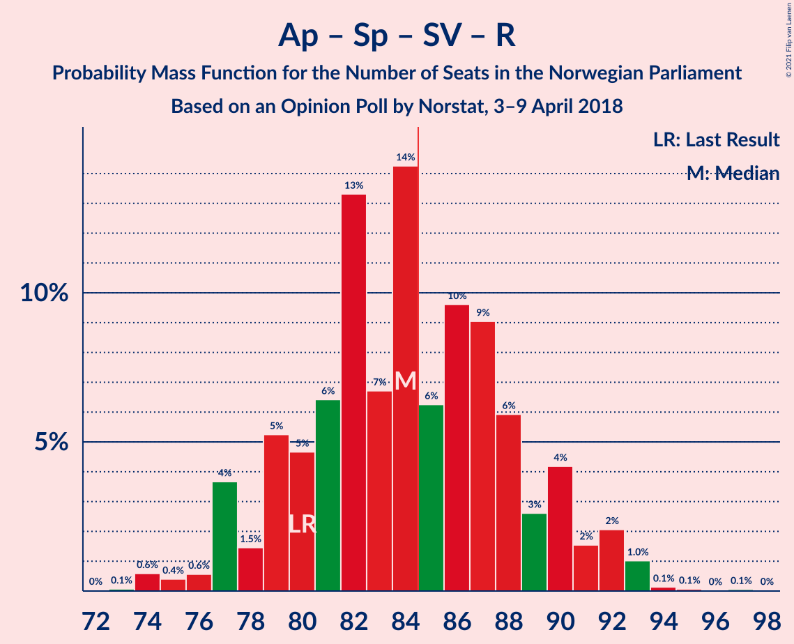

# Opinion Poll by Norstat, 3–9 April 2018

<a href="#voting-intentions">Voting Intentions</a> | <a href="#seats">Seats</a> | <a href="#coalitions">Coalitions</a> | <a href="#technical-information">Technical Information</a>

## Voting Intentions

### Confidence Intervals

| Party | Last Result | Poll Result | 80% Confidence Interval | 90% Confidence Interval | 95% Confidence Interval | 99% Confidence Interval |
|:-----:|:-----------:|:-----------:|:-----------------------:|:-----------------------:|:-----------------------:|:-----------------------:|
| Arbeiderpartiet | 27.4% | 25.2% | 23.4–27.1% |22.9–27.6% |22.5–28.1% |21.7–29.0% |
| Høyre | 25.0% | 25.1% | 23.3–27.0% |22.8–27.5% |22.4–28.0% |21.6–28.9% |
| Fremskrittspartiet | 15.2% | 15.8% | 14.3–17.4% |13.9–17.9% |13.6–18.3% |12.9–19.1% |
| Senterpartiet | 10.3% | 10.7% | 9.5–12.1% |9.2–12.5% |8.9–12.9% |8.3–13.6% |
| Sosialistisk Venstreparti | 6.0% | 7.5% | 6.4–8.7% |6.2–9.0% |5.9–9.3% |5.5–10.0% |
| Rødt | 2.4% | 3.8% | 3.1–4.7% |2.9–5.0% |2.7–5.2% |2.4–5.7% |
| Venstre | 4.4% | 3.7% | 3.0–4.6% |2.8–4.9% |2.6–5.1% |2.3–5.6% |
| Kristelig Folkeparti | 4.2% | 3.7% | 3.0–4.6% |2.8–4.9% |2.6–5.1% |2.3–5.6% |
| Miljøpartiet De Grønne | 3.2% | 2.5% | 1.9–3.3% |1.8–3.5% |1.7–3.7% |1.4–4.1% |

*Note:* The poll result column reflects the actual value used in the calculations. Published results may vary slightly, and in addition be rounded to fewer digits.

## Seats

### Confidence Intervals

| Party | Last Result | Median | 80% Confidence Interval | 90% Confidence Interval | 95% Confidence Interval | 99% Confidence Interval |
|:-----:|:-----------:|:------:|:-----------------------:|:-----------------------:|:-----------------------:|:-----------------------:|
| <a href="#arbeiderpartiet">Arbeiderpartiet</a> | 49 | 47 | 43–50 |42–52 |41–53 |40–54 |
| <a href="#høyre">Høyre</a> | 45 | 46 | 42–50 |42–51 |41–52 |39–53 |
| <a href="#fremskrittspartiet">Fremskrittspartiet</a> | 27 | 29 | 26–32 |25–33 |25–34 |24–35 |
| <a href="#senterpartiet">Senterpartiet</a> | 19 | 19 | 17–23 |17–23 |16–24 |15–25 |
| <a href="#sosialistisk-venstreparti">Sosialistisk Venstreparti</a> | 11 | 14 | 12–16 |11–17 |11–17 |10–18 |
| <a href="#rødt">Rødt</a> | 1 | 2 | 2–9 |2–9 |1–9 |1–10 |
| <a href="#venstre">Venstre</a> | 8 | 2 | 2–8 |2–9 |2–9 |1–10 |
| <a href="#kristelig-folkeparti">Kristelig Folkeparti</a> | 8 | 3 | 1–8 |1–8 |1–9 |1–10 |
| <a href="#miljøpartiet-de-grønne">Miljøpartiet De Grønne</a> | 1 | 1 | 1–2 |0–2 |0–2 |0–7 |

### Arbeiderpartiet

*For a full overview of the results for this party, see the [Arbeiderpartiet](party-arbeiderpartiet.html) page.*

| Number of Seats | Probability | Accumulated | Special Marks |
|:---------------:|:-----------:|:-----------:|:-------------:|
| 38 | 0% | 100% |  |
| 39 | 0.2% | 99.9% |  |
| 40 | 0.8% | 99.7% |  |
| 41 | 2% | 99.0% |  |
| 42 | 4% | 97% |  |
| 43 | 10% | 94% |  |
| 44 | 8% | 83% |  |
| 45 | 12% | 75% |  |
| 46 | 13% | 63% |  |
| 47 | 19% | 50% | Median |
| 48 | 13% | 32% |  |
| 49 | 4% | 19% | Last Result |
| 50 | 6% | 14% |  |
| 51 | 3% | 8% |  |
| 52 | 2% | 5% |  |
| 53 | 2% | 3% |  |
| 54 | 0.2% | 0.6% |  |
| 55 | 0.2% | 0.3% |  |
| 56 | 0.2% | 0.2% |  |
| 57 | 0% | 0% |  |

### Høyre

*For a full overview of the results for this party, see the [Høyre](party-høyre.html) page.*

| Number of Seats | Probability | Accumulated | Special Marks |
|:---------------:|:-----------:|:-----------:|:-------------:|
| 37 | 0.1% | 100% |  |
| 38 | 0.3% | 99.9% |  |
| 39 | 0.7% | 99.6% |  |
| 40 | 1.1% | 98.9% |  |
| 41 | 2% | 98% |  |
| 42 | 8% | 96% |  |
| 43 | 6% | 88% |  |
| 44 | 10% | 82% |  |
| 45 | 11% | 72% | Last Result |
| 46 | 14% | 60% | Median |
| 47 | 13% | 46% |  |
| 48 | 9% | 33% |  |
| 49 | 6% | 24% |  |
| 50 | 12% | 19% |  |
| 51 | 4% | 7% |  |
| 52 | 1.4% | 3% |  |
| 53 | 1.4% | 2% |  |
| 54 | 0.2% | 0.4% |  |
| 55 | 0.1% | 0.2% |  |
| 56 | 0% | 0% |  |

### Fremskrittspartiet

*For a full overview of the results for this party, see the [Fremskrittspartiet](party-fremskrittspartiet.html) page.*

| Number of Seats | Probability | Accumulated | Special Marks |
|:---------------:|:-----------:|:-----------:|:-------------:|
| 22 | 0.1% | 100% |  |
| 23 | 0.1% | 99.8% |  |
| 24 | 1.1% | 99.7% |  |
| 25 | 5% | 98.6% |  |
| 26 | 4% | 94% |  |
| 27 | 10% | 90% | Last Result |
| 28 | 23% | 80% |  |
| 29 | 15% | 56% | Median |
| 30 | 9% | 41% |  |
| 31 | 15% | 32% |  |
| 32 | 11% | 18% |  |
| 33 | 3% | 7% |  |
| 34 | 2% | 4% |  |
| 35 | 2% | 2% |  |
| 36 | 0.2% | 0.3% |  |
| 37 | 0% | 0.1% |  |
| 38 | 0.1% | 0.1% |  |
| 39 | 0% | 0% |  |

### Senterpartiet

*For a full overview of the results for this party, see the [Senterpartiet](party-senterpartiet.html) page.*

| Number of Seats | Probability | Accumulated | Special Marks |
|:---------------:|:-----------:|:-----------:|:-------------:|
| 14 | 0.1% | 100% |  |
| 15 | 1.4% | 99.9% |  |
| 16 | 3% | 98% |  |
| 17 | 8% | 96% |  |
| 18 | 15% | 88% |  |
| 19 | 25% | 73% | Last Result, Median |
| 20 | 18% | 48% |  |
| 21 | 9% | 30% |  |
| 22 | 11% | 21% |  |
| 23 | 6% | 10% |  |
| 24 | 4% | 4% |  |
| 25 | 0.4% | 0.6% |  |
| 26 | 0.2% | 0.2% |  |
| 27 | 0.1% | 0.1% |  |
| 28 | 0% | 0% |  |

### Sosialistisk Venstreparti

*For a full overview of the results for this party, see the [Sosialistisk Venstreparti](party-sosialistiskvenstreparti.html) page.*

| Number of Seats | Probability | Accumulated | Special Marks |
|:---------------:|:-----------:|:-----------:|:-------------:|
| 9 | 0.3% | 100% |  |
| 10 | 2% | 99.7% |  |
| 11 | 6% | 98% | Last Result |
| 12 | 20% | 92% |  |
| 13 | 18% | 73% |  |
| 14 | 21% | 54% | Median |
| 15 | 19% | 34% |  |
| 16 | 7% | 15% |  |
| 17 | 6% | 8% |  |
| 18 | 1.0% | 1.4% |  |
| 19 | 0.3% | 0.4% |  |
| 20 | 0% | 0.1% |  |
| 21 | 0% | 0% |  |

### Rødt

*For a full overview of the results for this party, see the [Rødt](party-rødt.html) page.*

| Number of Seats | Probability | Accumulated | Special Marks |
|:---------------:|:-----------:|:-----------:|:-------------:|
| 1 | 4% | 100% | Last Result |
| 2 | 61% | 96% | Median |
| 3 | 0% | 35% |  |
| 4 | 0% | 35% |  |
| 5 | 0% | 35% |  |
| 6 | 0% | 35% |  |
| 7 | 5% | 35% |  |
| 8 | 17% | 31% |  |
| 9 | 11% | 13% |  |
| 10 | 2% | 2% |  |
| 11 | 0.4% | 0.4% |  |
| 12 | 0% | 0% |  |

### Venstre

*For a full overview of the results for this party, see the [Venstre](party-venstre.html) page.*

| Number of Seats | Probability | Accumulated | Special Marks |
|:---------------:|:-----------:|:-----------:|:-------------:|
| 1 | 0.5% | 100% |  |
| 2 | 61% | 99.5% | Median |
| 3 | 3% | 39% |  |
| 4 | 0% | 35% |  |
| 5 | 0% | 35% |  |
| 6 | 0% | 35% |  |
| 7 | 9% | 35% |  |
| 8 | 21% | 26% | Last Result |
| 9 | 3% | 5% |  |
| 10 | 1.4% | 2% |  |
| 11 | 0.2% | 0.2% |  |
| 12 | 0% | 0% |  |

### Kristelig Folkeparti

*For a full overview of the results for this party, see the [Kristelig Folkeparti](party-kristeligfolkeparti.html) page.*

| Number of Seats | Probability | Accumulated | Special Marks |
|:---------------:|:-----------:|:-----------:|:-------------:|
| 0 | 0.4% | 100% |  |
| 1 | 13% | 99.6% |  |
| 2 | 6% | 87% |  |
| 3 | 52% | 81% | Median |
| 4 | 0% | 30% |  |
| 5 | 0% | 30% |  |
| 6 | 0% | 30% |  |
| 7 | 4% | 30% |  |
| 8 | 21% | 25% | Last Result |
| 9 | 3% | 5% |  |
| 10 | 0.9% | 1.1% |  |
| 11 | 0.1% | 0.1% |  |
| 12 | 0% | 0% |  |

### Miljøpartiet De Grønne

*For a full overview of the results for this party, see the [Miljøpartiet De Grønne](party-miljøpartietdegrønne.html) page.*

| Number of Seats | Probability | Accumulated | Special Marks |
|:---------------:|:-----------:|:-----------:|:-------------:|
| 0 | 5% | 100% |  |
| 1 | 81% | 95% | Last Result, Median |
| 2 | 12% | 13% |  |
| 3 | 0.7% | 2% |  |
| 4 | 0.3% | 0.9% |  |
| 5 | 0% | 0.7% |  |
| 6 | 0% | 0.7% |  |
| 7 | 0.4% | 0.7% |  |
| 8 | 0.3% | 0.3% |  |
| 9 | 0% | 0% |  |

## Coalitions

### Confidence Intervals

| Coalition | Last Result | Median | Majority? | 80% Confidence Interval | 90% Confidence Interval | 95% Confidence Interval | 99% Confidence Interval |
|:---------:|:-----------:|:------:|:---------:|:-----------------------:|:-----------------------:|:-----------------------:|:-----------------------:|
| Høyre – Fremskrittspartiet – Senterpartiet – Kristelig Folkeparti – Venstre | 107 | 104 | 100% | 98–109 | 97–109 | 96–110 | 94–112 |
| Arbeiderpartiet – Senterpartiet – Sosialistisk Venstreparti – Kristelig Folkeparti – Miljøpartiet De Grønne | 88 | 85 | 54% | 80–91 | 79–92 | 78–93 | 76–95 |
| Arbeiderpartiet – Senterpartiet – Sosialistisk Venstreparti – Rødt – Miljøpartiet De Grønne | 81 | 85 | 58% | 80–91 | 79–92 | 78–93 | 75–94 |
| Arbeiderpartiet – Senterpartiet – Sosialistisk Venstreparti – Rødt | 80 | 84 | 43% | 79–89 | 77–90 | 77–92 | 74–93 |
| Høyre – Fremskrittspartiet – Kristelig Folkeparti – Venstre – Miljøpartiet De Grønne | 89 | 85 | 57% | 80–90 | 79–92 | 77–92 | 76–95 |
| Høyre – Fremskrittspartiet – Kristelig Folkeparti – Venstre | 88 | 84 | 42% | 78–89 | 77–90 | 76–91 | 75–94 |
| Arbeiderpartiet – Senterpartiet – Sosialistisk Venstreparti – Miljøpartiet De Grønne | 80 | 81 | 18% | 76–85 | 75–87 | 74–89 | 73–90 |
| Arbeiderpartiet – Senterpartiet – Sosialistisk Venstreparti | 79 | 80 | 8% | 75–84 | 74–86 | 73–88 | 71–89 |
| Høyre – Fremskrittspartiet – Venstre | 80 | 79 | 12% | 75–85 | 73–86 | 72–87 | 70–89 |
| Høyre – Fremskrittspartiet | 72 | 76 | 0.6% | 70–80 | 70–81 | 68–82 | 66–85 |
| Arbeiderpartiet – Senterpartiet – Kristelig Folkeparti – Miljøpartiet De Grønne | 77 | 71 | 0% | 67–76 | 65–77 | 65–79 | 63–82 |
| Arbeiderpartiet – Senterpartiet – Kristelig Folkeparti | 76 | 70 | 0% | 65–75 | 64–76 | 64–78 | 62–81 |
| Arbeiderpartiet – Senterpartiet | 68 | 66 | 0% | 62–70 | 61–72 | 60–73 | 58–75 |
| Arbeiderpartiet – Sosialistisk Venstreparti | 60 | 60 | 0% | 56–64 | 55–66 | 54–67 | 53–69 |
| Høyre – Kristelig Folkeparti – Venstre | 61 | 55 | 0% | 50–60 | 49–61 | 47–62 | 46–65 |
| Senterpartiet – Kristelig Folkeparti – Venstre | 35 | 28 | 0% | 23–32 | 22–34 | 21–35 | 20–38 |

### Høyre – Fremskrittspartiet – Senterpartiet – Kristelig Folkeparti – Venstre

| Number of Seats | Probability | Accumulated | Special Marks |
|:---------------:|:-----------:|:-----------:|:-------------:|
| 91 | 0% | 100% |  |
| 92 | 0% | 99.9% |  |
| 93 | 0.2% | 99.9% |  |
| 94 | 0.4% | 99.7% |  |
| 95 | 1.0% | 99.4% |  |
| 96 | 1.0% | 98% |  |
| 97 | 2% | 97% |  |
| 98 | 6% | 95% |  |
| 99 | 6% | 89% | Median |
| 100 | 8% | 84% |  |
| 101 | 6% | 76% |  |
| 102 | 8% | 69% |  |
| 103 | 10% | 61% |  |
| 104 | 10% | 52% |  |
| 105 | 13% | 42% |  |
| 106 | 7% | 29% |  |
| 107 | 5% | 21% | Last Result |
| 108 | 7% | 17% |  |
| 109 | 6% | 10% |  |
| 110 | 2% | 4% |  |
| 111 | 1.4% | 2% |  |
| 112 | 0.6% | 0.8% |  |
| 113 | 0.1% | 0.3% |  |
| 114 | 0% | 0.1% |  |
| 115 | 0.1% | 0.1% |  |
| 116 | 0% | 0% |  |

### Arbeiderpartiet – Senterpartiet – Sosialistisk Venstreparti – Kristelig Folkeparti – Miljøpartiet De Grønne

| Number of Seats | Probability | Accumulated | Special Marks |
|:---------------:|:-----------:|:-----------:|:-------------:|
| 74 | 0% | 100% |  |
| 75 | 0.1% | 99.9% |  |
| 76 | 0.4% | 99.8% |  |
| 77 | 1.4% | 99.4% |  |
| 78 | 1.4% | 98% |  |
| 79 | 3% | 97% |  |
| 80 | 4% | 94% |  |
| 81 | 7% | 89% |  |
| 82 | 11% | 82% |  |
| 83 | 6% | 71% |  |
| 84 | 12% | 66% | Median |
| 85 | 7% | 54% | Majority |
| 86 | 11% | 46% |  |
| 87 | 7% | 35% |  |
| 88 | 7% | 28% | Last Result |
| 89 | 6% | 21% |  |
| 90 | 5% | 15% |  |
| 91 | 4% | 10% |  |
| 92 | 3% | 6% |  |
| 93 | 2% | 3% |  |
| 94 | 0.9% | 1.4% |  |
| 95 | 0.1% | 0.6% |  |
| 96 | 0.2% | 0.4% |  |
| 97 | 0.1% | 0.2% |  |
| 98 | 0.1% | 0.1% |  |
| 99 | 0% | 0% |  |

### Arbeiderpartiet – Senterpartiet – Sosialistisk Venstreparti – Rødt – Miljøpartiet De Grønne

| Number of Seats | Probability | Accumulated | Special Marks |
|:---------------:|:-----------:|:-----------:|:-------------:|
| 74 | 0.1% | 100% |  |
| 75 | 0.5% | 99.9% |  |
| 76 | 0.5% | 99.5% |  |
| 77 | 0.7% | 98.9% |  |
| 78 | 3% | 98% |  |
| 79 | 3% | 95% |  |
| 80 | 4% | 92% |  |
| 81 | 5% | 88% | Last Result |
| 82 | 5% | 84% |  |
| 83 | 12% | 79% | Median |
| 84 | 10% | 67% |  |
| 85 | 15% | 58% | Majority |
| 86 | 6% | 43% |  |
| 87 | 10% | 37% |  |
| 88 | 10% | 28% |  |
| 89 | 5% | 18% |  |
| 90 | 3% | 13% |  |
| 91 | 5% | 10% |  |
| 92 | 2% | 5% |  |
| 93 | 2% | 4% |  |
| 94 | 1.1% | 1.4% |  |
| 95 | 0.1% | 0.3% |  |
| 96 | 0.1% | 0.2% |  |
| 97 | 0% | 0.1% |  |
| 98 | 0.1% | 0.1% |  |
| 99 | 0% | 0% |  |

### Arbeiderpartiet – Senterpartiet – Sosialistisk Venstreparti – Rødt

| Number of Seats | Probability | Accumulated | Special Marks |
|:---------------:|:-----------:|:-----------:|:-------------:|
| 73 | 0.1% | 100% |  |
| 74 | 0.6% | 99.9% |  |
| 75 | 0.4% | 99.3% |  |
| 76 | 0.6% | 98.9% |  |
| 77 | 4% | 98% |  |
| 78 | 1.5% | 95% |  |
| 79 | 5% | 93% |  |
| 80 | 5% | 88% | Last Result |
| 81 | 6% | 83% |  |
| 82 | 13% | 77% | Median |
| 83 | 7% | 64% |  |
| 84 | 14% | 57% |  |
| 85 | 6% | 43% | Majority |
| 86 | 10% | 36% |  |
| 87 | 9% | 27% |  |
| 88 | 6% | 18% |  |
| 89 | 3% | 12% |  |
| 90 | 4% | 9% |  |
| 91 | 2% | 5% |  |
| 92 | 2% | 3% |  |
| 93 | 1.0% | 1.3% |  |
| 94 | 0.1% | 0.3% |  |
| 95 | 0.1% | 0.2% |  |
| 96 | 0% | 0.1% |  |
| 97 | 0.1% | 0.1% |  |
| 98 | 0% | 0% |  |

### Høyre – Fremskrittspartiet – Kristelig Folkeparti – Venstre – Miljøpartiet De Grønne

| Number of Seats | Probability | Accumulated | Special Marks |
|:---------------:|:-----------:|:-----------:|:-------------:|
| 72 | 0.1% | 100% |  |
| 73 | 0% | 99.9% |  |
| 74 | 0.1% | 99.9% |  |
| 75 | 0.1% | 99.8% |  |
| 76 | 1.0% | 99.7% |  |
| 77 | 2% | 98.7% |  |
| 78 | 2% | 97% |  |
| 79 | 4% | 95% |  |
| 80 | 3% | 91% |  |
| 81 | 6% | 88% | Median |
| 82 | 9% | 82% |  |
| 83 | 10% | 73% |  |
| 84 | 6% | 64% |  |
| 85 | 14% | 57% | Majority |
| 86 | 7% | 43% |  |
| 87 | 13% | 36% |  |
| 88 | 6% | 23% |  |
| 89 | 5% | 17% | Last Result |
| 90 | 5% | 12% |  |
| 91 | 1.4% | 7% |  |
| 92 | 4% | 5% |  |
| 93 | 0.6% | 2% |  |
| 94 | 0.4% | 1.1% |  |
| 95 | 0.6% | 0.7% |  |
| 96 | 0.1% | 0.1% |  |
| 97 | 0% | 0% |  |

### Høyre – Fremskrittspartiet – Kristelig Folkeparti – Venstre

| Number of Seats | Probability | Accumulated | Special Marks |
|:---------------:|:-----------:|:-----------:|:-------------:|
| 71 | 0.1% | 100% |  |
| 72 | 0% | 99.9% |  |
| 73 | 0.1% | 99.9% |  |
| 74 | 0.1% | 99.8% |  |
| 75 | 1.2% | 99.7% |  |
| 76 | 2% | 98.5% |  |
| 77 | 2% | 96% |  |
| 78 | 5% | 95% |  |
| 79 | 3% | 90% |  |
| 80 | 5% | 87% | Median |
| 81 | 10% | 82% |  |
| 82 | 10% | 72% |  |
| 83 | 6% | 62% |  |
| 84 | 15% | 57% |  |
| 85 | 10% | 42% | Majority |
| 86 | 12% | 33% |  |
| 87 | 5% | 21% |  |
| 88 | 5% | 16% | Last Result |
| 89 | 4% | 12% |  |
| 90 | 3% | 8% |  |
| 91 | 3% | 5% |  |
| 92 | 0.7% | 2% |  |
| 93 | 0.5% | 1.1% |  |
| 94 | 0.5% | 0.5% |  |
| 95 | 0.1% | 0.1% |  |
| 96 | 0% | 0% |  |

### Arbeiderpartiet – Senterpartiet – Sosialistisk Venstreparti – Miljøpartiet De Grønne

| Number of Seats | Probability | Accumulated | Special Marks |
|:---------------:|:-----------:|:-----------:|:-------------:|
| 70 | 0.1% | 100% |  |
| 71 | 0.1% | 99.9% |  |
| 72 | 0.2% | 99.8% |  |
| 73 | 1.1% | 99.6% |  |
| 74 | 1.4% | 98% |  |
| 75 | 3% | 97% |  |
| 76 | 7% | 94% |  |
| 77 | 5% | 88% |  |
| 78 | 7% | 82% |  |
| 79 | 11% | 75% |  |
| 80 | 7% | 64% | Last Result |
| 81 | 13% | 57% | Median |
| 82 | 9% | 44% |  |
| 83 | 12% | 35% |  |
| 84 | 5% | 22% |  |
| 85 | 9% | 18% | Majority |
| 86 | 3% | 9% |  |
| 87 | 1.0% | 6% |  |
| 88 | 0.8% | 5% |  |
| 89 | 3% | 4% |  |
| 90 | 1.0% | 1.4% |  |
| 91 | 0.4% | 0.5% |  |
| 92 | 0.1% | 0.1% |  |
| 93 | 0% | 0% |  |

### Arbeiderpartiet – Senterpartiet – Sosialistisk Venstreparti

| Number of Seats | Probability | Accumulated | Special Marks |
|:---------------:|:-----------:|:-----------:|:-------------:|
| 69 | 0.1% | 100% |  |
| 70 | 0.1% | 99.9% |  |
| 71 | 0.2% | 99.7% |  |
| 72 | 1.3% | 99.5% |  |
| 73 | 2% | 98% |  |
| 74 | 3% | 97% |  |
| 75 | 7% | 94% |  |
| 76 | 4% | 87% |  |
| 77 | 8% | 83% |  |
| 78 | 11% | 75% |  |
| 79 | 9% | 63% | Last Result |
| 80 | 15% | 55% | Median |
| 81 | 6% | 40% |  |
| 82 | 12% | 34% |  |
| 83 | 5% | 22% |  |
| 84 | 8% | 17% |  |
| 85 | 2% | 8% | Majority |
| 86 | 0.9% | 6% |  |
| 87 | 1.3% | 5% |  |
| 88 | 2% | 4% |  |
| 89 | 0.9% | 1.3% |  |
| 90 | 0.3% | 0.4% |  |
| 91 | 0.1% | 0.1% |  |
| 92 | 0% | 0% |  |

### Høyre – Fremskrittspartiet – Venstre

| Number of Seats | Probability | Accumulated | Special Marks |
|:---------------:|:-----------:|:-----------:|:-------------:|
| 68 | 0.1% | 100% |  |
| 69 | 0.3% | 99.8% |  |
| 70 | 0.7% | 99.5% |  |
| 71 | 0.5% | 98.8% |  |
| 72 | 1.0% | 98% |  |
| 73 | 2% | 97% |  |
| 74 | 3% | 95% |  |
| 75 | 5% | 92% |  |
| 76 | 7% | 87% |  |
| 77 | 9% | 80% | Median |
| 78 | 11% | 71% |  |
| 79 | 9% | 59% |  |
| 80 | 9% | 50% | Last Result |
| 81 | 10% | 41% |  |
| 82 | 7% | 30% |  |
| 83 | 9% | 23% |  |
| 84 | 3% | 15% |  |
| 85 | 5% | 12% | Majority |
| 86 | 4% | 7% |  |
| 87 | 1.2% | 3% |  |
| 88 | 0.9% | 2% |  |
| 89 | 0.5% | 1.0% |  |
| 90 | 0.2% | 0.4% |  |
| 91 | 0.2% | 0.2% |  |
| 92 | 0% | 0% |  |

### Høyre – Fremskrittspartiet

| Number of Seats | Probability | Accumulated | Special Marks |
|:---------------:|:-----------:|:-----------:|:-------------:|
| 64 | 0% | 100% |  |
| 65 | 0.1% | 99.9% |  |
| 66 | 0.4% | 99.9% |  |
| 67 | 0.8% | 99.5% |  |
| 68 | 2% | 98.7% |  |
| 69 | 1.3% | 96% |  |
| 70 | 7% | 95% |  |
| 71 | 4% | 88% |  |
| 72 | 5% | 84% | Last Result |
| 73 | 8% | 79% |  |
| 74 | 9% | 71% |  |
| 75 | 10% | 62% | Median |
| 76 | 11% | 52% |  |
| 77 | 9% | 41% |  |
| 78 | 11% | 32% |  |
| 79 | 8% | 21% |  |
| 80 | 3% | 13% |  |
| 81 | 6% | 9% |  |
| 82 | 2% | 4% |  |
| 83 | 1.3% | 2% |  |
| 84 | 0.2% | 0.8% |  |
| 85 | 0.3% | 0.6% | Majority |
| 86 | 0.3% | 0.3% |  |
| 87 | 0% | 0% |  |

### Arbeiderpartiet – Senterpartiet – Kristelig Folkeparti – Miljøpartiet De Grønne

| Number of Seats | Probability | Accumulated | Special Marks |
|:---------------:|:-----------:|:-----------:|:-------------:|
| 61 | 0.1% | 100% |  |
| 62 | 0.1% | 99.9% |  |
| 63 | 0.5% | 99.7% |  |
| 64 | 2% | 99.3% |  |
| 65 | 4% | 98% |  |
| 66 | 3% | 93% |  |
| 67 | 6% | 90% |  |
| 68 | 6% | 84% |  |
| 69 | 11% | 79% |  |
| 70 | 12% | 67% | Median |
| 71 | 8% | 56% |  |
| 72 | 9% | 48% |  |
| 73 | 7% | 39% |  |
| 74 | 10% | 31% |  |
| 75 | 5% | 22% |  |
| 76 | 10% | 17% |  |
| 77 | 2% | 7% | Last Result |
| 78 | 1.5% | 4% |  |
| 79 | 1.0% | 3% |  |
| 80 | 0.6% | 2% |  |
| 81 | 0.3% | 1.3% |  |
| 82 | 0.8% | 1.0% |  |
| 83 | 0.2% | 0.2% |  |
| 84 | 0% | 0% |  |

### Arbeiderpartiet – Senterpartiet – Kristelig Folkeparti

| Number of Seats | Probability | Accumulated | Special Marks |
|:---------------:|:-----------:|:-----------:|:-------------:|
| 60 | 0.1% | 100% |  |
| 61 | 0.2% | 99.9% |  |
| 62 | 0.4% | 99.7% |  |
| 63 | 1.4% | 99.3% |  |
| 64 | 5% | 98% |  |
| 65 | 3% | 93% |  |
| 66 | 5% | 90% |  |
| 67 | 9% | 84% |  |
| 68 | 9% | 76% |  |
| 69 | 11% | 66% | Median |
| 70 | 8% | 55% |  |
| 71 | 9% | 47% |  |
| 72 | 7% | 38% |  |
| 73 | 11% | 31% |  |
| 74 | 5% | 20% |  |
| 75 | 9% | 15% |  |
| 76 | 2% | 6% | Last Result |
| 77 | 1.3% | 4% |  |
| 78 | 0.9% | 3% |  |
| 79 | 0.6% | 2% |  |
| 80 | 0.2% | 1.1% |  |
| 81 | 0.8% | 1.0% |  |
| 82 | 0.1% | 0.1% |  |
| 83 | 0% | 0% |  |

### Arbeiderpartiet – Senterpartiet

| Number of Seats | Probability | Accumulated | Special Marks |
|:---------------:|:-----------:|:-----------:|:-------------:|
| 56 | 0.1% | 100% |  |
| 57 | 0.1% | 99.9% |  |
| 58 | 0.3% | 99.8% |  |
| 59 | 1.2% | 99.5% |  |
| 60 | 2% | 98% |  |
| 61 | 5% | 97% |  |
| 62 | 5% | 91% |  |
| 63 | 9% | 86% |  |
| 64 | 8% | 77% |  |
| 65 | 11% | 68% |  |
| 66 | 11% | 57% | Median |
| 67 | 16% | 46% |  |
| 68 | 6% | 30% | Last Result |
| 69 | 7% | 24% |  |
| 70 | 9% | 17% |  |
| 71 | 2% | 8% |  |
| 72 | 1.4% | 6% |  |
| 73 | 3% | 4% |  |
| 74 | 0.6% | 1.2% |  |
| 75 | 0.1% | 0.6% |  |
| 76 | 0.4% | 0.5% |  |
| 77 | 0% | 0.1% |  |
| 78 | 0% | 0% |  |

### Arbeiderpartiet – Sosialistisk Venstreparti

| Number of Seats | Probability | Accumulated | Special Marks |
|:---------------:|:-----------:|:-----------:|:-------------:|
| 51 | 0.2% | 100% |  |
| 52 | 0.2% | 99.8% |  |
| 53 | 0.5% | 99.6% |  |
| 54 | 2% | 99.0% |  |
| 55 | 4% | 97% |  |
| 56 | 5% | 94% |  |
| 57 | 8% | 88% |  |
| 58 | 11% | 80% |  |
| 59 | 13% | 69% |  |
| 60 | 9% | 56% | Last Result |
| 61 | 18% | 47% | Median |
| 62 | 8% | 29% |  |
| 63 | 7% | 21% |  |
| 64 | 5% | 14% |  |
| 65 | 4% | 10% |  |
| 66 | 2% | 6% |  |
| 67 | 1.2% | 4% |  |
| 68 | 2% | 2% |  |
| 69 | 0.4% | 0.6% |  |
| 70 | 0.1% | 0.2% |  |
| 71 | 0% | 0.1% |  |
| 72 | 0.1% | 0.1% |  |
| 73 | 0% | 0% |  |

### Høyre – Kristelig Folkeparti – Venstre

| Number of Seats | Probability | Accumulated | Special Marks |
|:---------------:|:-----------:|:-----------:|:-------------:|
| 43 | 0% | 100% |  |
| 44 | 0.1% | 99.9% |  |
| 45 | 0.3% | 99.9% |  |
| 46 | 0.7% | 99.5% |  |
| 47 | 2% | 98.8% |  |
| 48 | 1.1% | 97% |  |
| 49 | 6% | 96% |  |
| 50 | 5% | 90% |  |
| 51 | 8% | 85% | Median |
| 52 | 10% | 77% |  |
| 53 | 8% | 67% |  |
| 54 | 7% | 59% |  |
| 55 | 14% | 52% |  |
| 56 | 6% | 38% |  |
| 57 | 9% | 32% |  |
| 58 | 5% | 23% |  |
| 59 | 7% | 18% |  |
| 60 | 3% | 11% |  |
| 61 | 4% | 8% | Last Result |
| 62 | 1.3% | 4% |  |
| 63 | 1.2% | 2% |  |
| 64 | 0.6% | 1.1% |  |
| 65 | 0.1% | 0.5% |  |
| 66 | 0.3% | 0.4% |  |
| 67 | 0% | 0.1% |  |
| 68 | 0% | 0% |  |

### Senterpartiet – Kristelig Folkeparti – Venstre

| Number of Seats | Probability | Accumulated | Special Marks |
|:---------------:|:-----------:|:-----------:|:-------------:|
| 18 | 0.1% | 100% |  |
| 19 | 0.1% | 99.9% |  |
| 20 | 0.7% | 99.8% |  |
| 21 | 2% | 99.1% |  |
| 22 | 3% | 97% |  |
| 23 | 8% | 94% |  |
| 24 | 7% | 86% | Median |
| 25 | 7% | 79% |  |
| 26 | 4% | 71% |  |
| 27 | 8% | 67% |  |
| 28 | 11% | 59% |  |
| 29 | 15% | 47% |  |
| 30 | 7% | 32% |  |
| 31 | 9% | 25% |  |
| 32 | 6% | 16% |  |
| 33 | 3% | 10% |  |
| 34 | 3% | 7% |  |
| 35 | 1.4% | 4% | Last Result |
| 36 | 0.8% | 2% |  |
| 37 | 0.9% | 2% |  |
| 38 | 0.4% | 0.8% |  |
| 39 | 0.4% | 0.5% |  |
| 40 | 0% | 0.1% |  |
| 41 | 0% | 0% |  |

## Technical Information

### Opinion Poll

+ **Polling firm:** Norstat
+ **Commissioner(s):** —
+ **Fieldwork period:** 3–9 April 2018

### Calculations

+ **Sample size:** 925
+ **Simulations done:** 1,048,576
+ **Error estimate:** 1.37%

