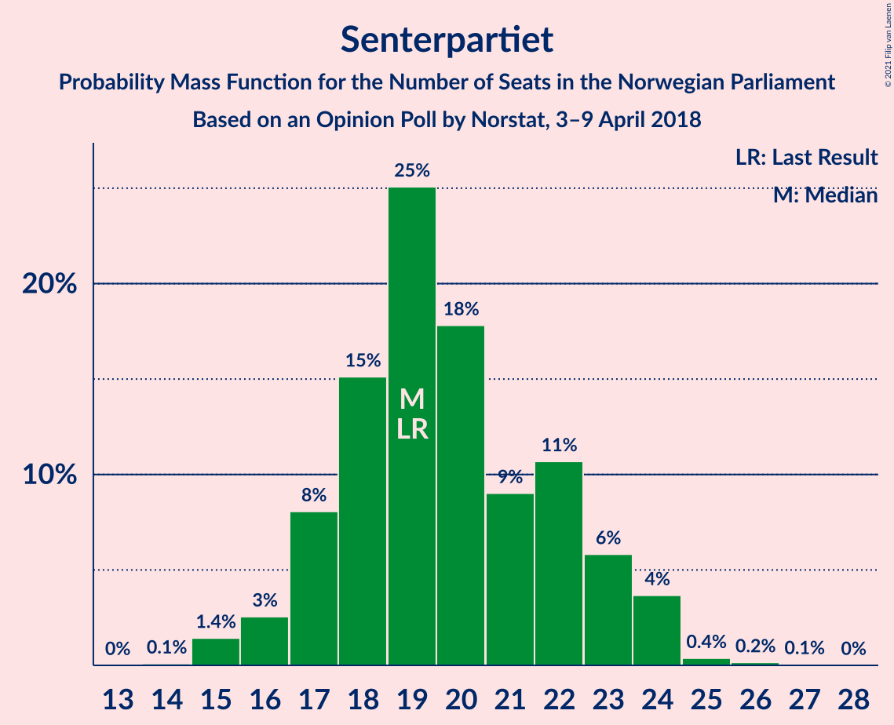
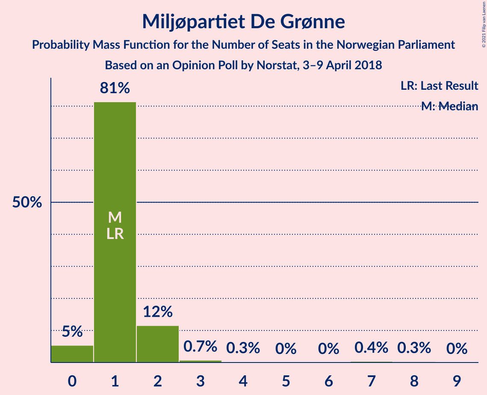
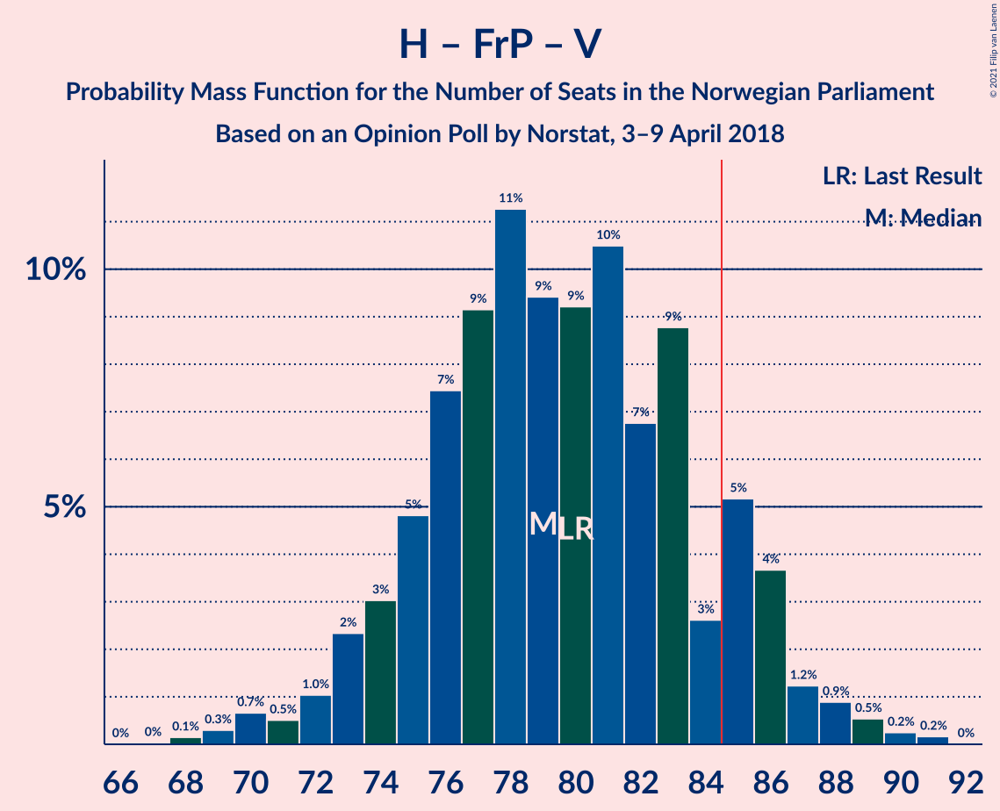
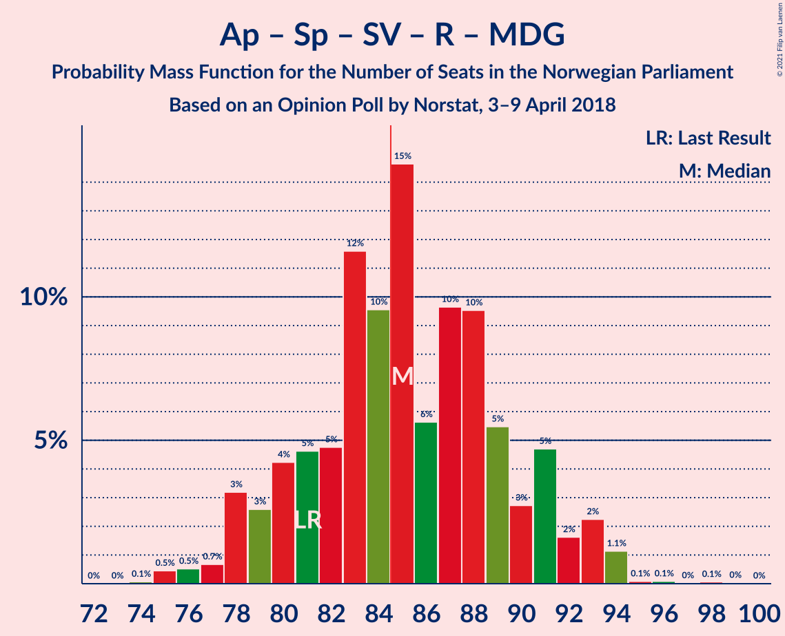
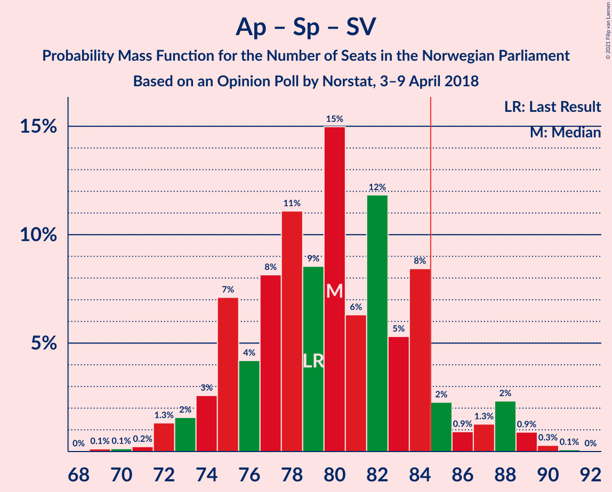
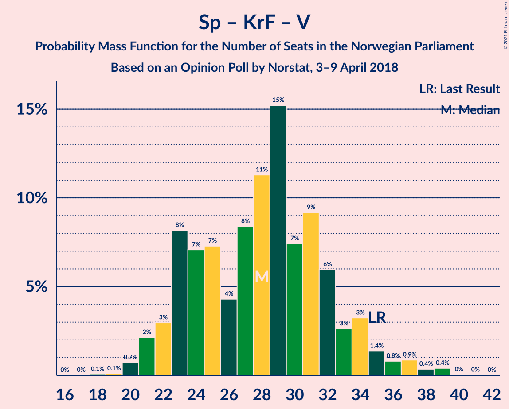

# Opinion Poll by Norstat, 3–9 April 2018

<a href="#voting-intentions">Voting Intentions</a> | <a href="#seats">Seats</a> | <a href="#coalitions">Coalitions</a> | <a href="#technical-information">Technical Information</a>

## Voting Intentions

### Confidence Intervals

| Party | Last Result | Poll Result | 80% Confidence Interval | 90% Confidence Interval | 95% Confidence Interval | 99% Confidence Interval |
|:-----:|:-----------:|:-----------:|:-----------------------:|:-----------------------:|:-----------------------:|:-----------------------:|
| Arbeiderpartiet | 27.4% | 25.2% | 23.4–27.1% |22.9–27.6% |22.5–28.1% |21.7–29.0% |
| Høyre | 25.0% | 25.1% | 23.3–27.0% |22.8–27.5% |22.4–28.0% |21.6–28.9% |
| Fremskrittspartiet | 15.2% | 15.8% | 14.3–17.4% |13.9–17.9% |13.6–18.3% |12.9–19.1% |
| Senterpartiet | 10.3% | 10.7% | 9.5–12.1% |9.2–12.5% |8.9–12.9% |8.3–13.6% |
| Sosialistisk Venstreparti | 6.0% | 7.5% | 6.4–8.7% |6.2–9.0% |5.9–9.3% |5.5–10.0% |
| Rødt | 2.4% | 3.8% | 3.1–4.7% |2.9–5.0% |2.7–5.2% |2.4–5.7% |
| Venstre | 4.4% | 3.7% | 3.0–4.6% |2.8–4.9% |2.6–5.1% |2.3–5.6% |
| Kristelig Folkeparti | 4.2% | 3.7% | 3.0–4.6% |2.8–4.9% |2.6–5.1% |2.3–5.6% |
| Miljøpartiet De Grønne | 3.2% | 2.5% | 1.9–3.3% |1.8–3.5% |1.7–3.7% |1.4–4.1% |

*Note:* The poll result column reflects the actual value used in the calculations. Published results may vary slightly, and in addition be rounded to fewer digits.

## Seats

### Confidence Intervals

| Party | Last Result | Median | 80% Confidence Interval | 90% Confidence Interval | 95% Confidence Interval | 99% Confidence Interval |
|:-----:|:-----------:|:------:|:-----------------------:|:-----------------------:|:-----------------------:|:-----------------------:|
| <a href="#arbeiderpartiet">Arbeiderpartiet</a> | 49 | 46 | 42–50 |42–50 |40–50 |39–53 |
| <a href="#høyre">Høyre</a> | 45 | 49 | 45–52 |44–53 |43–53 |40–54 |
| <a href="#fremskrittspartiet">Fremskrittspartiet</a> | 27 | 29 | 27–32 |26–34 |25–35 |25–35 |
| <a href="#senterpartiet">Senterpartiet</a> | 19 | 19 | 17–21 |16–22 |16–25 |15–26 |
| <a href="#sosialistisk-venstreparti">Sosialistisk Venstreparti</a> | 11 | 13 | 11–15 |10–16 |10–16 |9–18 |
| <a href="#rødt">Rødt</a> | 1 | 2 | 2–9 |2–9 |2–10 |1–10 |
| <a href="#venstre">Venstre</a> | 8 | 2 | 2–8 |2–9 |2–9 |2–10 |
| <a href="#kristelig-folkeparti">Kristelig Folkeparti</a> | 8 | 3 | 1–3 |1–7 |1–8 |0–11 |
| <a href="#miljøpartiet-de-grønne">Miljøpartiet De Grønne</a> | 1 | 1 | 1–2 |1–2 |1–2 |0–8 |

### Arbeiderpartiet

*For a full overview of the results for this party, see the [Arbeiderpartiet](party-arbeiderpartiet.html) page.*

| Number of Seats | Probability | Accumulated | Special Marks |
|:---------------:|:-----------:|:-----------:|:-------------:|
| 37 | 0.1% | 100% |  |
| 38 | 0.2% | 99.9% |  |
| 39 | 2% | 99.8% |  |
| 40 | 0.6% | 98% |  |
| 41 | 2% | 97% |  |
| 42 | 7% | 96% |  |
| 43 | 22% | 89% |  |
| 44 | 3% | 66% |  |
| 45 | 9% | 63% |  |
| 46 | 15% | 55% | Median |
| 47 | 18% | 39% |  |
| 48 | 1.3% | 21% |  |
| 49 | 2% | 20% | Last Result |
| 50 | 16% | 18% |  |
| 51 | 0.4% | 2% |  |
| 52 | 0.7% | 1.4% |  |
| 53 | 0.5% | 0.7% |  |
| 54 | 0.1% | 0.2% |  |
| 55 | 0.1% | 0.1% |  |
| 56 | 0% | 0% |  |

### Høyre

*For a full overview of the results for this party, see the [Høyre](party-høyre.html) page.*

| Number of Seats | Probability | Accumulated | Special Marks |
|:---------------:|:-----------:|:-----------:|:-------------:|
| 37 | 0.1% | 100% |  |
| 38 | 0.1% | 99.9% |  |
| 39 | 0.2% | 99.8% |  |
| 40 | 0.3% | 99.6% |  |
| 41 | 0.7% | 99.3% |  |
| 42 | 1.0% | 98.6% |  |
| 43 | 3% | 98% |  |
| 44 | 1.4% | 95% |  |
| 45 | 4% | 94% | Last Result |
| 46 | 18% | 89% |  |
| 47 | 2% | 72% |  |
| 48 | 13% | 69% |  |
| 49 | 14% | 56% | Median |
| 50 | 18% | 42% |  |
| 51 | 5% | 24% |  |
| 52 | 11% | 19% |  |
| 53 | 5% | 7% |  |
| 54 | 2% | 2% |  |
| 55 | 0.2% | 0.5% |  |
| 56 | 0.2% | 0.3% |  |
| 57 | 0.1% | 0.1% |  |
| 58 | 0% | 0% |  |

### Fremskrittspartiet

*For a full overview of the results for this party, see the [Fremskrittspartiet](party-fremskrittspartiet.html) page.*

| Number of Seats | Probability | Accumulated | Special Marks |
|:---------------:|:-----------:|:-----------:|:-------------:|
| 22 | 0.1% | 100% |  |
| 23 | 0.1% | 99.9% |  |
| 24 | 0.2% | 99.8% |  |
| 25 | 4% | 99.6% |  |
| 26 | 2% | 96% |  |
| 27 | 5% | 94% | Last Result |
| 28 | 28% | 88% |  |
| 29 | 18% | 60% | Median |
| 30 | 9% | 42% |  |
| 31 | 6% | 33% |  |
| 32 | 21% | 27% |  |
| 33 | 0.5% | 6% |  |
| 34 | 1.4% | 5% |  |
| 35 | 4% | 4% |  |
| 36 | 0.1% | 0.2% |  |
| 37 | 0% | 0.1% |  |
| 38 | 0.1% | 0.1% |  |
| 39 | 0% | 0% |  |

### Senterpartiet

*For a full overview of the results for this party, see the [Senterpartiet](party-senterpartiet.html) page.*

| Number of Seats | Probability | Accumulated | Special Marks |
|:---------------:|:-----------:|:-----------:|:-------------:|
| 14 | 0% | 100% |  |
| 15 | 0.9% | 99.9% |  |
| 16 | 5% | 99.0% |  |
| 17 | 37% | 94% |  |
| 18 | 7% | 57% |  |
| 19 | 20% | 50% | Last Result, Median |
| 20 | 12% | 30% |  |
| 21 | 12% | 18% |  |
| 22 | 0.8% | 5% |  |
| 23 | 1.4% | 5% |  |
| 24 | 0.4% | 3% |  |
| 25 | 1.5% | 3% |  |
| 26 | 1.1% | 1.3% |  |
| 27 | 0.2% | 0.2% |  |
| 28 | 0% | 0% |  |

### Sosialistisk Venstreparti

*For a full overview of the results for this party, see the [Sosialistisk Venstreparti](party-sosialistiskvenstreparti.html) page.*

| Number of Seats | Probability | Accumulated | Special Marks |
|:---------------:|:-----------:|:-----------:|:-------------:|
| 9 | 1.1% | 100% |  |
| 10 | 4% | 98.9% |  |
| 11 | 5% | 95% | Last Result |
| 12 | 18% | 90% |  |
| 13 | 34% | 72% | Median |
| 14 | 10% | 38% |  |
| 15 | 21% | 28% |  |
| 16 | 5% | 7% |  |
| 17 | 2% | 2% |  |
| 18 | 0.4% | 0.5% |  |
| 19 | 0.2% | 0.2% |  |
| 20 | 0% | 0% |  |

### Rødt

*For a full overview of the results for this party, see the [Rødt](party-rødt.html) page.*

| Number of Seats | Probability | Accumulated | Special Marks |
|:---------------:|:-----------:|:-----------:|:-------------:|
| 1 | 2% | 100% | Last Result |
| 2 | 63% | 98% | Median |
| 3 | 0% | 35% |  |
| 4 | 0% | 35% |  |
| 5 | 0% | 35% |  |
| 6 | 0% | 35% |  |
| 7 | 2% | 35% |  |
| 8 | 13% | 33% |  |
| 9 | 16% | 20% |  |
| 10 | 4% | 5% |  |
| 11 | 0.2% | 0.2% |  |
| 12 | 0% | 0% |  |

### Venstre

*For a full overview of the results for this party, see the [Venstre](party-venstre.html) page.*

| Number of Seats | Probability | Accumulated | Special Marks |
|:---------------:|:-----------:|:-----------:|:-------------:|
| 1 | 0.2% | 100% |  |
| 2 | 52% | 99.8% | Median |
| 3 | 0.5% | 48% |  |
| 4 | 0% | 48% |  |
| 5 | 0% | 48% |  |
| 6 | 0% | 48% |  |
| 7 | 5% | 48% |  |
| 8 | 37% | 43% | Last Result |
| 9 | 5% | 6% |  |
| 10 | 1.0% | 1.3% |  |
| 11 | 0.3% | 0.3% |  |
| 12 | 0% | 0% |  |

### Kristelig Folkeparti

*For a full overview of the results for this party, see the [Kristelig Folkeparti](party-kristeligfolkeparti.html) page.*

| Number of Seats | Probability | Accumulated | Special Marks |
|:---------------:|:-----------:|:-----------:|:-------------:|
| 0 | 1.1% | 100% |  |
| 1 | 26% | 98.9% |  |
| 2 | 6% | 73% |  |
| 3 | 59% | 66% | Median |
| 4 | 0% | 7% |  |
| 5 | 0% | 7% |  |
| 6 | 0% | 7% |  |
| 7 | 4% | 7% |  |
| 8 | 2% | 3% | Last Result |
| 9 | 0.6% | 1.4% |  |
| 10 | 0.2% | 0.8% |  |
| 11 | 0.4% | 0.6% |  |
| 12 | 0.1% | 0.1% |  |
| 13 | 0% | 0% |  |

### Miljøpartiet De Grønne

*For a full overview of the results for this party, see the [Miljøpartiet De Grønne](party-miljøpartietdegrønne.html) page.*

| Number of Seats | Probability | Accumulated | Special Marks |
|:---------------:|:-----------:|:-----------:|:-------------:|
| 0 | 2% | 100% |  |
| 1 | 87% | 98% | Last Result, Median |
| 2 | 10% | 12% |  |
| 3 | 0.7% | 1.4% |  |
| 4 | 0% | 0.7% |  |
| 5 | 0% | 0.6% |  |
| 6 | 0% | 0.6% |  |
| 7 | 0.1% | 0.6% |  |
| 8 | 0.5% | 0.5% |  |
| 9 | 0% | 0% |  |

## Coalitions

### Confidence Intervals

| Coalition | Last Result | Median | Majority? | 80% Confidence Interval | 90% Confidence Interval | 95% Confidence Interval | 99% Confidence Interval |
|:---------:|:-----------:|:------:|:---------:|:-----------------------:|:-----------------------:|:-----------------------:|:-----------------------:|
| Høyre – Fremskrittspartiet – Senterpartiet – Kristelig Folkeparti – Venstre | 107 | 104 | 100% | 101–110 | 97–110 | 97–111 | 94–113 |
| Høyre – Fremskrittspartiet – Kristelig Folkeparti – Venstre – Miljøpartiet De Grønne | 89 | 87 | 76% | 81–92 | 81–93 | 79–95 | 76–95 |
| Høyre – Fremskrittspartiet – Kristelig Folkeparti – Venstre | 88 | 86 | 68% | 80–91 | 80–92 | 78–93 | 75–94 |
| Høyre – Fremskrittspartiet – Venstre | 80 | 83 | 27% | 78–88 | 77–89 | 74–91 | 70–91 |
| Arbeiderpartiet – Senterpartiet – Sosialistisk Venstreparti – Rødt – Miljøpartiet De Grønne | 81 | 83 | 31% | 78–89 | 77–89 | 76–90 | 75–94 |
| Arbeiderpartiet – Senterpartiet – Sosialistisk Venstreparti – Kristelig Folkeparti – Miljøpartiet De Grønne | 88 | 81 | 8% | 77–84 | 76–87 | 76–89 | 74–94 |
| Arbeiderpartiet – Senterpartiet – Sosialistisk Venstreparti – Rødt | 80 | 82 | 23% | 77–88 | 76–88 | 74–89 | 74–93 |
| Arbeiderpartiet – Senterpartiet – Sosialistisk Venstreparti – Miljøpartiet De Grønne | 80 | 80 | 4% | 75–81 | 74–84 | 73–86 | 70–89 |
| Arbeiderpartiet – Senterpartiet – Sosialistisk Venstreparti | 79 | 79 | 3% | 74–80 | 72–82 | 72–85 | 69–88 |
| Høyre – Fremskrittspartiet | 72 | 78 | 3% | 74–82 | 73–83 | 71–85 | 67–88 |
| Arbeiderpartiet – Senterpartiet – Kristelig Folkeparti – Miljøpartiet De Grønne | 77 | 68 | 0% | 64–71 | 64–73 | 63–75 | 61–80 |
| Arbeiderpartiet – Senterpartiet – Kristelig Folkeparti | 76 | 67 | 0% | 63–70 | 63–71 | 62–73 | 60–79 |
| Arbeiderpartiet – Senterpartiet | 68 | 64 | 0% | 62–67 | 60–69 | 59–70 | 58–73 |
| Arbeiderpartiet – Sosialistisk Venstreparti | 60 | 58 | 0% | 55–63 | 54–63 | 52–65 | 51–66 |
| Høyre – Kristelig Folkeparti – Venstre | 61 | 55 | 0% | 52–63 | 51–63 | 49–63 | 46–63 |
| Senterpartiet – Kristelig Folkeparti – Venstre | 35 | 28 | 0% | 22–30 | 22–31 | 21–32 | 19–36 |

### Høyre – Fremskrittspartiet – Senterpartiet – Kristelig Folkeparti – Venstre

| Number of Seats | Probability | Accumulated | Special Marks |
|:---------------:|:-----------:|:-----------:|:-------------:|
| 92 | 0.1% | 100% |  |
| 93 | 0.2% | 99.9% |  |
| 94 | 0.3% | 99.7% |  |
| 95 | 0.1% | 99.4% |  |
| 96 | 0.6% | 99.3% |  |
| 97 | 4% | 98.7% |  |
| 98 | 1.1% | 95% |  |
| 99 | 1.4% | 94% |  |
| 100 | 2% | 92% |  |
| 101 | 10% | 90% |  |
| 102 | 5% | 80% | Median |
| 103 | 16% | 75% |  |
| 104 | 24% | 59% |  |
| 105 | 4% | 35% |  |
| 106 | 2% | 30% |  |
| 107 | 3% | 28% | Last Result |
| 108 | 2% | 26% |  |
| 109 | 7% | 24% |  |
| 110 | 13% | 17% |  |
| 111 | 3% | 4% |  |
| 112 | 0.3% | 1.0% |  |
| 113 | 0.6% | 0.7% |  |
| 114 | 0.1% | 0.1% |  |
| 115 | 0% | 0% |  |

### Høyre – Fremskrittspartiet – Kristelig Folkeparti – Venstre – Miljøpartiet De Grønne

| Number of Seats | Probability | Accumulated | Special Marks |
|:---------------:|:-----------:|:-----------:|:-------------:|
| 74 | 0.1% | 100% |  |
| 75 | 0.3% | 99.9% |  |
| 76 | 0.2% | 99.6% |  |
| 77 | 0.2% | 99.3% |  |
| 78 | 0.8% | 99.1% |  |
| 79 | 1.3% | 98% |  |
| 80 | 0.5% | 97% |  |
| 81 | 10% | 97% |  |
| 82 | 8% | 87% |  |
| 83 | 1.3% | 79% |  |
| 84 | 2% | 78% | Median |
| 85 | 6% | 76% | Majority |
| 86 | 8% | 70% |  |
| 87 | 16% | 62% |  |
| 88 | 18% | 46% |  |
| 89 | 3% | 28% | Last Result |
| 90 | 2% | 25% |  |
| 91 | 3% | 23% |  |
| 92 | 14% | 20% |  |
| 93 | 3% | 6% |  |
| 94 | 0.2% | 3% |  |
| 95 | 3% | 3% |  |
| 96 | 0.2% | 0.2% |  |
| 97 | 0% | 0% |  |

### Høyre – Fremskrittspartiet – Kristelig Folkeparti – Venstre

| Number of Seats | Probability | Accumulated | Special Marks |
|:---------------:|:-----------:|:-----------:|:-------------:|
| 73 | 0.3% | 100% |  |
| 74 | 0.1% | 99.7% |  |
| 75 | 0.3% | 99.6% |  |
| 76 | 0.6% | 99.3% |  |
| 77 | 0.5% | 98.8% |  |
| 78 | 0.8% | 98% |  |
| 79 | 1.0% | 97% |  |
| 80 | 13% | 96% |  |
| 81 | 5% | 83% |  |
| 82 | 2% | 79% |  |
| 83 | 2% | 76% | Median |
| 84 | 6% | 74% |  |
| 85 | 7% | 68% | Majority |
| 86 | 16% | 62% |  |
| 87 | 18% | 45% |  |
| 88 | 3% | 27% | Last Result |
| 89 | 2% | 24% |  |
| 90 | 2% | 23% |  |
| 91 | 14% | 20% |  |
| 92 | 3% | 6% |  |
| 93 | 3% | 3% |  |
| 94 | 0.7% | 0.9% |  |
| 95 | 0.2% | 0.2% |  |
| 96 | 0% | 0% |  |

### Høyre – Fremskrittspartiet – Venstre

| Number of Seats | Probability | Accumulated | Special Marks |
|:---------------:|:-----------:|:-----------:|:-------------:|
| 67 | 0.1% | 100% |  |
| 68 | 0.1% | 99.9% |  |
| 69 | 0.1% | 99.8% |  |
| 70 | 0.4% | 99.7% |  |
| 71 | 0.1% | 99.2% |  |
| 72 | 0.3% | 99.1% |  |
| 73 | 0.9% | 98.8% |  |
| 74 | 0.6% | 98% |  |
| 75 | 0.7% | 97% |  |
| 76 | 0.9% | 97% |  |
| 77 | 4% | 96% |  |
| 78 | 4% | 92% |  |
| 79 | 10% | 88% |  |
| 80 | 2% | 77% | Last Result, Median |
| 81 | 3% | 76% |  |
| 82 | 4% | 73% |  |
| 83 | 23% | 70% |  |
| 84 | 20% | 47% |  |
| 85 | 3% | 27% | Majority |
| 86 | 5% | 24% |  |
| 87 | 2% | 20% |  |
| 88 | 11% | 17% |  |
| 89 | 2% | 7% |  |
| 90 | 0.6% | 4% |  |
| 91 | 3% | 4% |  |
| 92 | 0.1% | 0.3% |  |
| 93 | 0.2% | 0.2% |  |
| 94 | 0% | 0% |  |

### Arbeiderpartiet – Senterpartiet – Sosialistisk Venstreparti – Rødt – Miljøpartiet De Grønne

| Number of Seats | Probability | Accumulated | Special Marks |
|:---------------:|:-----------:|:-----------:|:-------------:|
| 74 | 0.2% | 100% |  |
| 75 | 0.7% | 99.8% |  |
| 76 | 3% | 99.1% |  |
| 77 | 3% | 97% |  |
| 78 | 14% | 94% |  |
| 79 | 3% | 80% |  |
| 80 | 2% | 77% |  |
| 81 | 3% | 75% | Last Result, Median |
| 82 | 18% | 72% |  |
| 83 | 17% | 54% |  |
| 84 | 7% | 37% |  |
| 85 | 6% | 31% | Majority |
| 86 | 2% | 25% |  |
| 87 | 2% | 23% |  |
| 88 | 5% | 21% |  |
| 89 | 13% | 16% |  |
| 90 | 1.0% | 3% |  |
| 91 | 0.5% | 2% |  |
| 92 | 0.4% | 2% |  |
| 93 | 0.5% | 1.2% |  |
| 94 | 0.3% | 0.7% |  |
| 95 | 0.1% | 0.4% |  |
| 96 | 0.3% | 0.3% |  |
| 97 | 0% | 0% |  |

### Arbeiderpartiet – Senterpartiet – Sosialistisk Venstreparti – Kristelig Folkeparti – Miljøpartiet De Grønne

| Number of Seats | Probability | Accumulated | Special Marks |
|:---------------:|:-----------:|:-----------:|:-------------:|
| 72 | 0% | 100% |  |
| 73 | 0% | 99.9% |  |
| 74 | 0.6% | 99.9% |  |
| 75 | 0.2% | 99.3% |  |
| 76 | 5% | 99.1% |  |
| 77 | 5% | 94% |  |
| 78 | 9% | 89% |  |
| 79 | 13% | 80% |  |
| 80 | 3% | 67% |  |
| 81 | 16% | 64% |  |
| 82 | 1.3% | 48% | Median |
| 83 | 22% | 47% |  |
| 84 | 16% | 25% |  |
| 85 | 1.2% | 8% | Majority |
| 86 | 2% | 7% |  |
| 87 | 1.4% | 5% |  |
| 88 | 1.3% | 4% | Last Result |
| 89 | 0.5% | 3% |  |
| 90 | 0.1% | 2% |  |
| 91 | 0.5% | 2% |  |
| 92 | 0.3% | 2% |  |
| 93 | 0.3% | 1.2% |  |
| 94 | 0.4% | 0.9% |  |
| 95 | 0.2% | 0.5% |  |
| 96 | 0.1% | 0.3% |  |
| 97 | 0% | 0.2% |  |
| 98 | 0.1% | 0.2% |  |
| 99 | 0.1% | 0.1% |  |
| 100 | 0% | 0% |  |

### Arbeiderpartiet – Senterpartiet – Sosialistisk Venstreparti – Rødt

| Number of Seats | Probability | Accumulated | Special Marks |
|:---------------:|:-----------:|:-----------:|:-------------:|
| 73 | 0.2% | 100% |  |
| 74 | 3% | 99.7% |  |
| 75 | 0.2% | 97% |  |
| 76 | 3% | 96% |  |
| 77 | 14% | 94% |  |
| 78 | 3% | 80% |  |
| 79 | 2% | 76% |  |
| 80 | 3% | 75% | Last Result, Median |
| 81 | 19% | 72% |  |
| 82 | 16% | 53% |  |
| 83 | 8% | 37% |  |
| 84 | 6% | 29% |  |
| 85 | 1.4% | 23% | Majority |
| 86 | 0.9% | 21% |  |
| 87 | 8% | 20% |  |
| 88 | 10% | 13% |  |
| 89 | 0.5% | 3% |  |
| 90 | 1.0% | 2% |  |
| 91 | 0.7% | 2% |  |
| 92 | 0.2% | 0.8% |  |
| 93 | 0.2% | 0.7% |  |
| 94 | 0.3% | 0.4% |  |
| 95 | 0.1% | 0.1% |  |
| 96 | 0% | 0% |  |

### Arbeiderpartiet – Senterpartiet – Sosialistisk Venstreparti – Miljøpartiet De Grønne

| Number of Seats | Probability | Accumulated | Special Marks |
|:---------------:|:-----------:|:-----------:|:-------------:|
| 70 | 1.0% | 100% |  |
| 71 | 0% | 98.9% |  |
| 72 | 0.3% | 98.9% |  |
| 73 | 3% | 98.6% |  |
| 74 | 3% | 96% |  |
| 75 | 5% | 93% |  |
| 76 | 16% | 87% |  |
| 77 | 9% | 71% |  |
| 78 | 6% | 62% |  |
| 79 | 1.1% | 56% | Median |
| 80 | 30% | 55% | Last Result |
| 81 | 16% | 26% |  |
| 82 | 3% | 10% |  |
| 83 | 1.3% | 7% |  |
| 84 | 1.5% | 6% |  |
| 85 | 1.0% | 4% | Majority |
| 86 | 1.5% | 3% |  |
| 87 | 0.8% | 2% |  |
| 88 | 0.4% | 1.0% |  |
| 89 | 0.2% | 0.6% |  |
| 90 | 0.2% | 0.4% |  |
| 91 | 0% | 0.1% |  |
| 92 | 0.1% | 0.1% |  |
| 93 | 0% | 0% |  |

### Arbeiderpartiet – Senterpartiet – Sosialistisk Venstreparti

| Number of Seats | Probability | Accumulated | Special Marks |
|:---------------:|:-----------:|:-----------:|:-------------:|
| 68 | 0% | 100% |  |
| 69 | 1.0% | 99.9% |  |
| 70 | 0.1% | 98.9% |  |
| 71 | 0.4% | 98.9% |  |
| 72 | 5% | 98% |  |
| 73 | 0.5% | 93% |  |
| 74 | 6% | 93% |  |
| 75 | 17% | 87% |  |
| 76 | 8% | 70% |  |
| 77 | 6% | 62% |  |
| 78 | 5% | 56% | Median |
| 79 | 26% | 51% | Last Result |
| 80 | 16% | 25% |  |
| 81 | 3% | 9% |  |
| 82 | 2% | 6% |  |
| 83 | 1.3% | 5% |  |
| 84 | 0.3% | 3% |  |
| 85 | 1.4% | 3% | Majority |
| 86 | 1.0% | 2% |  |
| 87 | 0.1% | 0.7% |  |
| 88 | 0.3% | 0.6% |  |
| 89 | 0.1% | 0.2% |  |
| 90 | 0% | 0.1% |  |
| 91 | 0% | 0.1% |  |
| 92 | 0% | 0% |  |

### Høyre – Fremskrittspartiet

| Number of Seats | Probability | Accumulated | Special Marks |
|:---------------:|:-----------:|:-----------:|:-------------:|
| 64 | 0.1% | 100% |  |
| 65 | 0.1% | 99.9% |  |
| 66 | 0.2% | 99.8% |  |
| 67 | 0.4% | 99.6% |  |
| 68 | 0.7% | 99.2% |  |
| 69 | 0.2% | 98.6% |  |
| 70 | 0.5% | 98% |  |
| 71 | 1.4% | 98% |  |
| 72 | 0.6% | 97% | Last Result |
| 73 | 3% | 96% |  |
| 74 | 3% | 93% |  |
| 75 | 20% | 90% |  |
| 76 | 6% | 70% |  |
| 77 | 13% | 64% |  |
| 78 | 2% | 51% | Median |
| 79 | 5% | 49% |  |
| 80 | 11% | 43% |  |
| 81 | 7% | 32% |  |
| 82 | 17% | 25% |  |
| 83 | 4% | 8% |  |
| 84 | 2% | 4% |  |
| 85 | 2% | 3% | Majority |
| 86 | 0.2% | 0.8% |  |
| 87 | 0.1% | 0.6% |  |
| 88 | 0.1% | 0.5% |  |
| 89 | 0.4% | 0.4% |  |
| 90 | 0% | 0% |  |

### Arbeiderpartiet – Senterpartiet – Kristelig Folkeparti – Miljøpartiet De Grønne

| Number of Seats | Probability | Accumulated | Special Marks |
|:---------------:|:-----------:|:-----------:|:-------------:|
| 59 | 0.1% | 100% |  |
| 60 | 0.1% | 99.9% |  |
| 61 | 0.4% | 99.7% |  |
| 62 | 1.0% | 99.3% |  |
| 63 | 2% | 98% |  |
| 64 | 8% | 96% |  |
| 65 | 2% | 88% |  |
| 66 | 16% | 86% |  |
| 67 | 7% | 70% |  |
| 68 | 26% | 62% |  |
| 69 | 9% | 36% | Median |
| 70 | 2% | 27% |  |
| 71 | 17% | 25% |  |
| 72 | 3% | 8% |  |
| 73 | 0.7% | 5% |  |
| 74 | 1.4% | 4% |  |
| 75 | 0.9% | 3% |  |
| 76 | 0.2% | 2% |  |
| 77 | 0.8% | 2% | Last Result |
| 78 | 0.1% | 1.2% |  |
| 79 | 0.4% | 1.1% |  |
| 80 | 0.3% | 0.7% |  |
| 81 | 0.1% | 0.4% |  |
| 82 | 0.1% | 0.3% |  |
| 83 | 0.2% | 0.2% |  |
| 84 | 0% | 0% |  |

### Arbeiderpartiet – Senterpartiet – Kristelig Folkeparti

| Number of Seats | Probability | Accumulated | Special Marks |
|:---------------:|:-----------:|:-----------:|:-------------:|
| 58 | 0.2% | 100% |  |
| 59 | 0.2% | 99.8% |  |
| 60 | 0.3% | 99.6% |  |
| 61 | 1.1% | 99.3% |  |
| 62 | 3% | 98% |  |
| 63 | 8% | 96% |  |
| 64 | 2% | 87% |  |
| 65 | 20% | 86% |  |
| 66 | 7% | 66% |  |
| 67 | 24% | 59% |  |
| 68 | 9% | 36% | Median |
| 69 | 3% | 27% |  |
| 70 | 17% | 24% |  |
| 71 | 3% | 8% |  |
| 72 | 0.7% | 4% |  |
| 73 | 1.4% | 4% |  |
| 74 | 0.6% | 2% |  |
| 75 | 0.2% | 2% |  |
| 76 | 0.3% | 1.5% | Last Result |
| 77 | 0.1% | 1.2% |  |
| 78 | 0.5% | 1.0% |  |
| 79 | 0.2% | 0.5% |  |
| 80 | 0.1% | 0.3% |  |
| 81 | 0.1% | 0.2% |  |
| 82 | 0.1% | 0.1% |  |
| 83 | 0% | 0% |  |

### Arbeiderpartiet – Senterpartiet

| Number of Seats | Probability | Accumulated | Special Marks |
|:---------------:|:-----------:|:-----------:|:-------------:|
| 56 | 0.2% | 100% |  |
| 57 | 0.3% | 99.8% |  |
| 58 | 0.3% | 99.5% |  |
| 59 | 4% | 99.2% |  |
| 60 | 3% | 95% |  |
| 61 | 2% | 92% |  |
| 62 | 23% | 90% |  |
| 63 | 6% | 67% |  |
| 64 | 23% | 61% |  |
| 65 | 5% | 39% | Median |
| 66 | 3% | 34% |  |
| 67 | 23% | 31% |  |
| 68 | 2% | 8% | Last Result |
| 69 | 2% | 6% |  |
| 70 | 2% | 4% |  |
| 71 | 0.4% | 2% |  |
| 72 | 0.7% | 2% |  |
| 73 | 0.5% | 0.9% |  |
| 74 | 0.1% | 0.4% |  |
| 75 | 0.2% | 0.3% |  |
| 76 | 0.1% | 0.1% |  |
| 77 | 0% | 0.1% |  |
| 78 | 0% | 0% |  |

### Arbeiderpartiet – Sosialistisk Venstreparti

| Number of Seats | Probability | Accumulated | Special Marks |
|:---------------:|:-----------:|:-----------:|:-------------:|
| 49 | 0.1% | 100% |  |
| 50 | 0.1% | 99.9% |  |
| 51 | 1.0% | 99.8% |  |
| 52 | 2% | 98.8% |  |
| 53 | 2% | 97% |  |
| 54 | 3% | 96% |  |
| 55 | 4% | 93% |  |
| 56 | 26% | 89% |  |
| 57 | 4% | 63% |  |
| 58 | 10% | 59% |  |
| 59 | 2% | 48% | Median |
| 60 | 3% | 46% | Last Result |
| 61 | 7% | 43% |  |
| 62 | 17% | 36% |  |
| 63 | 16% | 19% |  |
| 64 | 1.3% | 4% |  |
| 65 | 2% | 3% |  |
| 66 | 0.6% | 1.1% |  |
| 67 | 0.2% | 0.5% |  |
| 68 | 0.2% | 0.3% |  |
| 69 | 0.1% | 0.1% |  |
| 70 | 0.1% | 0.1% |  |
| 71 | 0% | 0% |  |

### Høyre – Kristelig Folkeparti – Venstre

| Number of Seats | Probability | Accumulated | Special Marks |
|:---------------:|:-----------:|:-----------:|:-------------:|
| 45 | 0.1% | 100% |  |
| 46 | 0.3% | 99.8% |  |
| 47 | 0.6% | 99.5% |  |
| 48 | 0.9% | 98.9% |  |
| 49 | 2% | 98% |  |
| 50 | 0.3% | 96% |  |
| 51 | 1.3% | 96% |  |
| 52 | 9% | 95% |  |
| 53 | 9% | 85% |  |
| 54 | 9% | 76% | Median |
| 55 | 19% | 67% |  |
| 56 | 3% | 48% |  |
| 57 | 19% | 46% |  |
| 58 | 4% | 26% |  |
| 59 | 2% | 22% |  |
| 60 | 3% | 21% |  |
| 61 | 0.4% | 18% | Last Result |
| 62 | 2% | 17% |  |
| 63 | 15% | 16% |  |
| 64 | 0.3% | 0.4% |  |
| 65 | 0% | 0.1% |  |
| 66 | 0% | 0.1% |  |
| 67 | 0% | 0.1% |  |
| 68 | 0% | 0.1% |  |
| 69 | 0% | 0% |  |

### Senterpartiet – Kristelig Folkeparti – Venstre

| Number of Seats | Probability | Accumulated | Special Marks |
|:---------------:|:-----------:|:-----------:|:-------------:|
| 19 | 0.9% | 100% |  |
| 20 | 1.2% | 99.0% |  |
| 21 | 0.6% | 98% |  |
| 22 | 22% | 97% |  |
| 23 | 6% | 75% |  |
| 24 | 10% | 70% | Median |
| 25 | 4% | 60% |  |
| 26 | 4% | 56% |  |
| 27 | 1.1% | 52% |  |
| 28 | 25% | 51% |  |
| 29 | 2% | 26% |  |
| 30 | 15% | 24% |  |
| 31 | 3% | 8% |  |
| 32 | 2% | 5% |  |
| 33 | 0.9% | 2% |  |
| 34 | 0.4% | 2% |  |
| 35 | 0.2% | 1.2% | Last Result |
| 36 | 0.7% | 0.9% |  |
| 37 | 0.1% | 0.2% |  |
| 38 | 0% | 0.1% |  |
| 39 | 0% | 0.1% |  |
| 40 | 0% | 0% |  |

## Technical Information

### Opinion Poll

+ **Polling firm:** Norstat
+ **Commissioner(s):** —
+ **Fieldwork period:** 3–9 April 2018

### Calculations

+ **Sample size:** 925
+ **Simulations done:** 131,072
+ **Error estimate:** 3.32%

