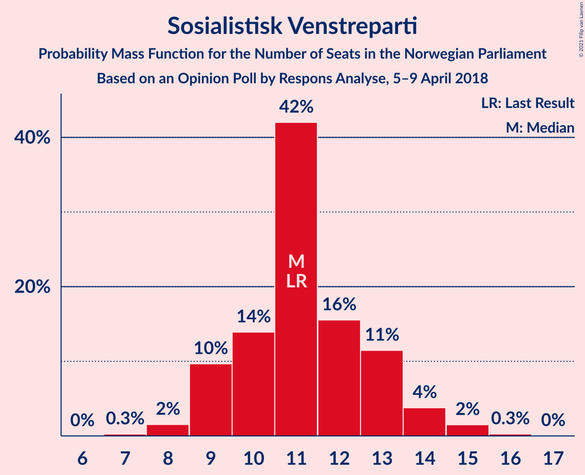
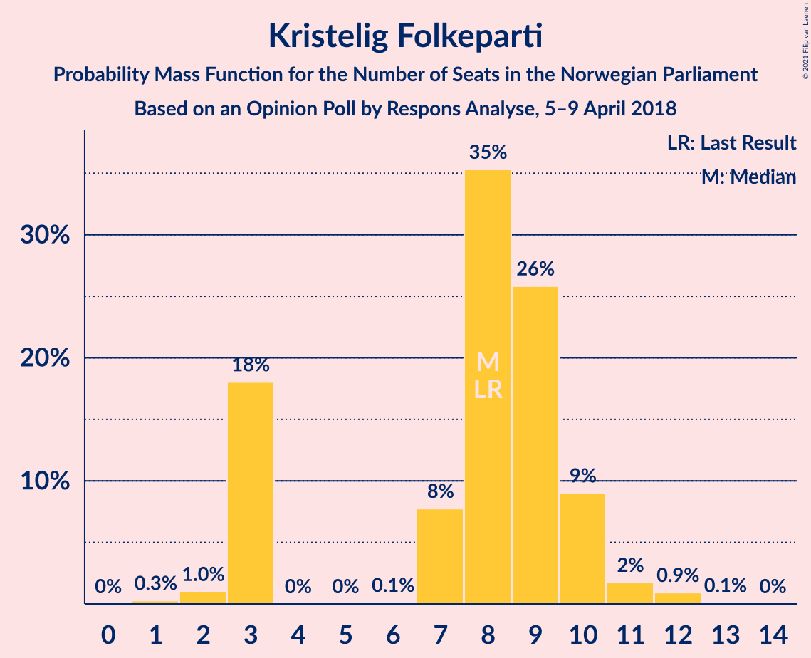
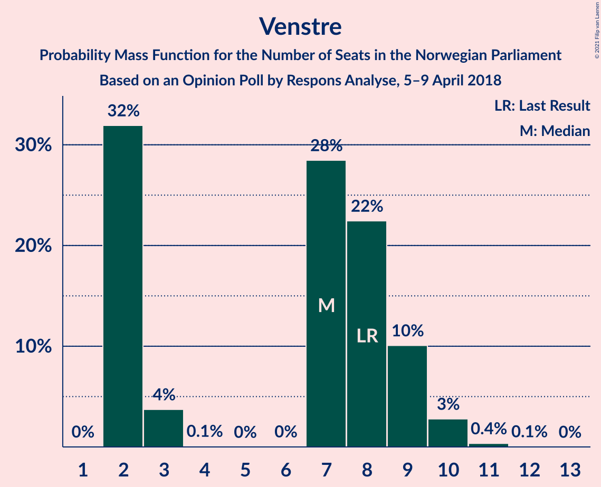
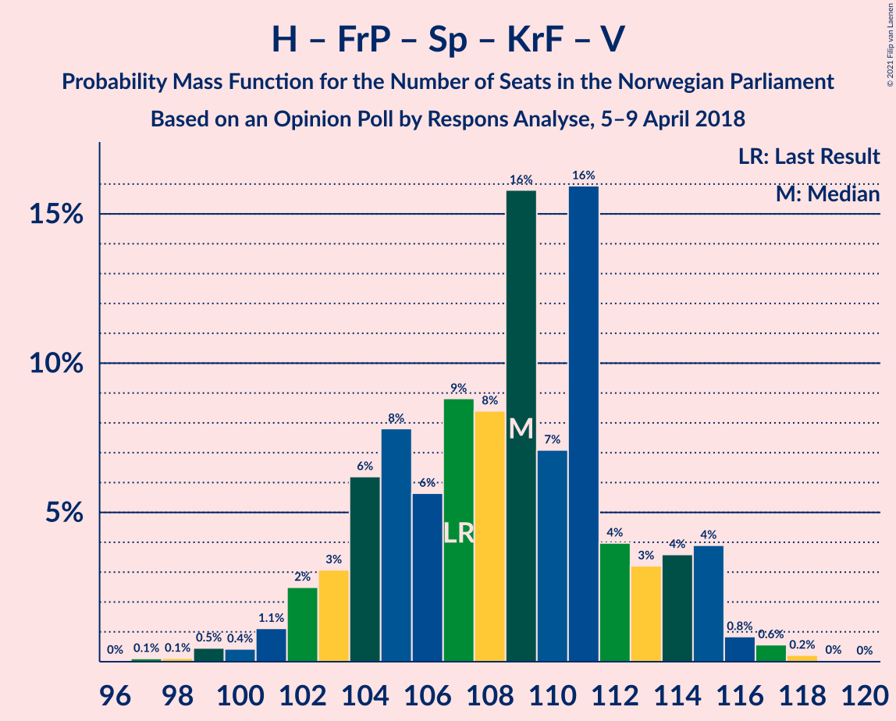
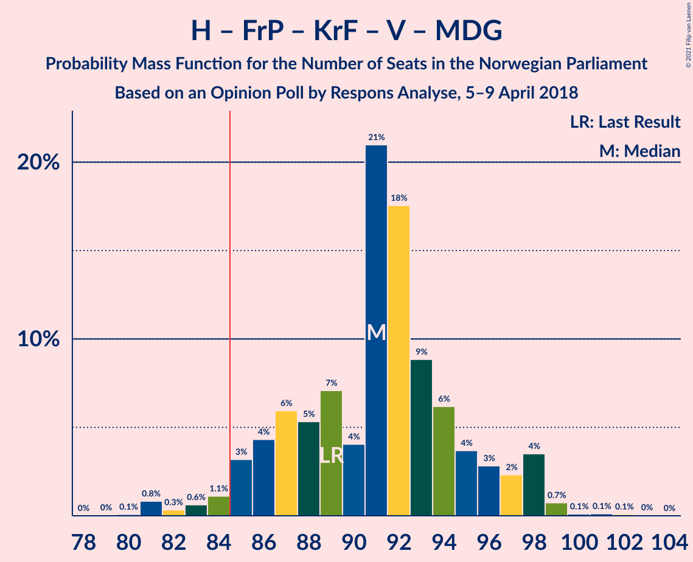
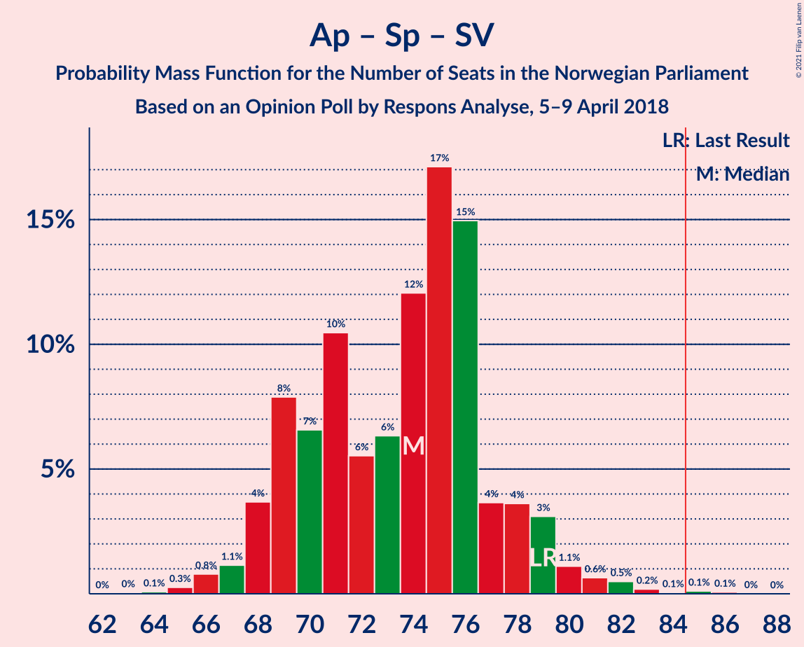
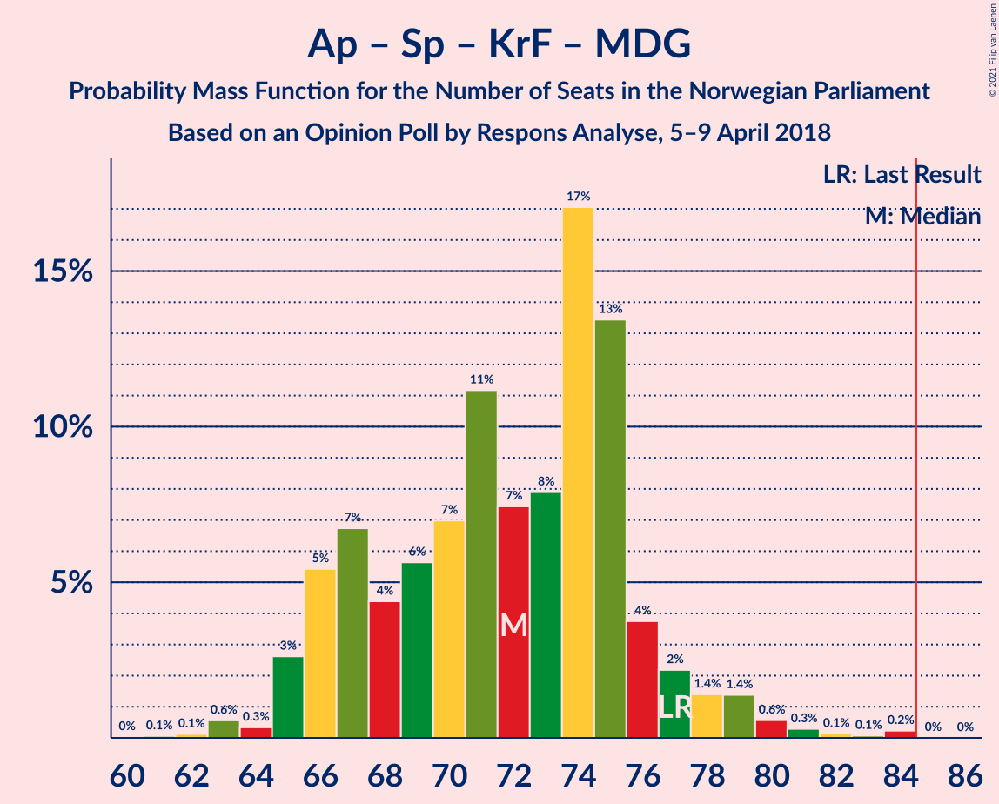
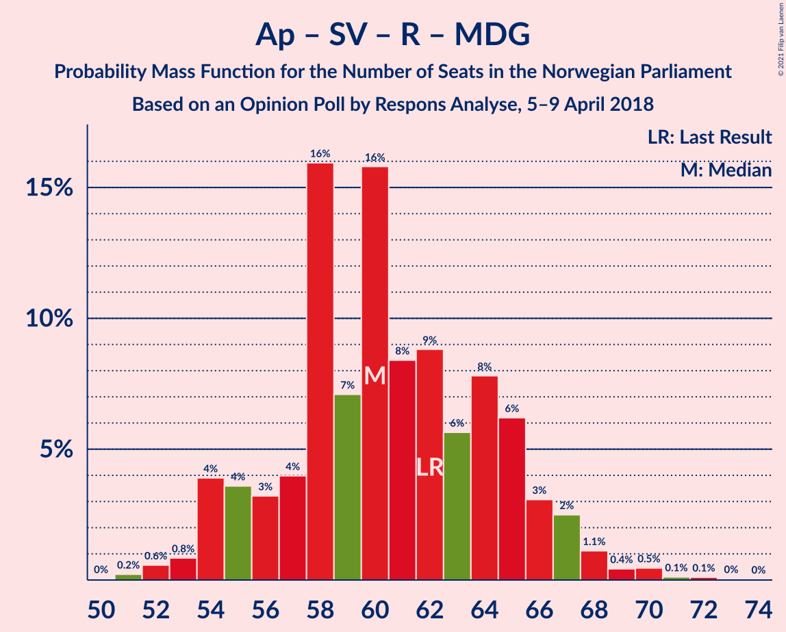

# Opinion Poll by Respons Analyse, 5–9 April 2018

<a href="#voting-intentions">Voting Intentions</a> | <a href="#seats">Seats</a> | <a href="#coalitions">Coalitions</a> | <a href="#technical-information">Technical Information</a>

## Voting Intentions

### Confidence Intervals

| Party | Last Result | Poll Result | 80% Confidence Interval | 90% Confidence Interval | 95% Confidence Interval | 99% Confidence Interval |
|:-----:|:-----------:|:-----------:|:-----------------------:|:-----------------------:|:-----------------------:|:-----------------------:|
| Høyre | 25.0% | 25.9% | 24.2–27.7% |23.7–28.2% |23.2–28.7% |22.5–29.6% |
| Arbeiderpartiet | 27.4% | 23.4% | 21.7–25.2% |21.2–25.7% |20.9–26.1% |20.1–27.0% |
| Fremskrittspartiet | 15.2% | 16.2% | 14.8–17.8% |14.4–18.2% |14.0–18.6% |13.4–19.4% |
| Senterpartiet | 10.3% | 10.9% | 9.7–12.3% |9.4–12.6% |9.1–13.0% |8.6–13.7% |
| Sosialistisk Venstreparti | 6.0% | 6.2% | 5.3–7.3% |5.1–7.6% |4.9–7.9% |4.5–8.4% |
| Kristelig Folkeparti | 4.2% | 4.5% | 3.7–5.5% |3.6–5.7% |3.4–6.0% |3.0–6.5% |
| Venstre | 4.4% | 4.1% | 3.4–5.0% |3.2–5.3% |3.0–5.5% |2.7–6.0% |
| Rødt | 2.4% | 3.9% | 3.2–4.8% |3.0–5.1% |2.9–5.3% |2.6–5.8% |
| Miljøpartiet De Grønne | 3.2% | 3.1% | 2.5–3.9% |2.3–4.2% |2.2–4.4% |1.9–4.8% |

*Note:* The poll result column reflects the actual value used in the calculations. Published results may vary slightly, and in addition be rounded to fewer digits.

## Seats

### Confidence Intervals

| Party | Last Result | Median | 80% Confidence Interval | 90% Confidence Interval | 95% Confidence Interval | 99% Confidence Interval |
|:-----:|:-----------:|:------:|:-----------------------:|:-----------------------:|:-----------------------:|:-----------------------:|
| <a href="#høyre">Høyre</a> | 45 | 46 | 43–50 |42–52 |42–53 |40–54 |
| <a href="#arbeiderpartiet">Arbeiderpartiet</a> | 49 | 43 | 40–46 |39–46 |39–47 |37–49 |
| <a href="#fremskrittspartiet">Fremskrittspartiet</a> | 27 | 29 | 26–32 |26–33 |25–34 |24–36 |
| <a href="#senterpartiet">Senterpartiet</a> | 19 | 19 | 17–22 |17–23 |17–23 |15–25 |
| <a href="#sosialistisk-venstreparti">Sosialistisk Venstreparti</a> | 11 | 11 | 9–13 |9–14 |9–14 |8–15 |
| <a href="#kristelig-folkeparti">Kristelig Folkeparti</a> | 8 | 8 | 3–10 |3–10 |3–11 |2–12 |
| <a href="#venstre">Venstre</a> | 8 | 7 | 2–9 |2–9 |2–10 |2–10 |
| <a href="#rødt">Rødt</a> | 1 | 2 | 2–8 |2–9 |2–9 |1–10 |
| <a href="#miljøpartiet-de-grønne">Miljøpartiet De Grønne</a> | 1 | 2 | 1–3 |1–7 |1–7 |1–8 |

### Høyre

*For a full overview of the results for this party, see the [Høyre](party-høyre.html) page.*

| Number of Seats | Probability | Accumulated | Special Marks |
|:---------------:|:-----------:|:-----------:|:-------------:|
| 37 | 0.1% | 100% |  |
| 38 | 0.1% | 99.9% |  |
| 39 | 0.2% | 99.8% |  |
| 40 | 0.2% | 99.7% |  |
| 41 | 1.4% | 99.5% |  |
| 42 | 7% | 98% |  |
| 43 | 8% | 92% |  |
| 44 | 7% | 84% |  |
| 45 | 5% | 77% | Last Result |
| 46 | 27% | 71% | Median |
| 47 | 9% | 44% |  |
| 48 | 12% | 36% |  |
| 49 | 13% | 24% |  |
| 50 | 2% | 11% |  |
| 51 | 2% | 8% |  |
| 52 | 2% | 6% |  |
| 53 | 2% | 4% |  |
| 54 | 2% | 2% |  |
| 55 | 0.1% | 0.2% |  |
| 56 | 0% | 0.1% |  |
| 57 | 0% | 0% |  |

### Arbeiderpartiet

*For a full overview of the results for this party, see the [Arbeiderpartiet](party-arbeiderpartiet.html) page.*

| Number of Seats | Probability | Accumulated | Special Marks |
|:---------------:|:-----------:|:-----------:|:-------------:|
| 36 | 0.1% | 100% |  |
| 37 | 0.9% | 99.8% |  |
| 38 | 1.4% | 98.9% |  |
| 39 | 7% | 98% |  |
| 40 | 5% | 91% |  |
| 41 | 15% | 86% |  |
| 42 | 15% | 71% |  |
| 43 | 22% | 55% | Median |
| 44 | 10% | 33% |  |
| 45 | 6% | 23% |  |
| 46 | 13% | 18% |  |
| 47 | 2% | 5% |  |
| 48 | 2% | 2% |  |
| 49 | 0.4% | 0.8% | Last Result |
| 50 | 0.2% | 0.5% |  |
| 51 | 0.1% | 0.3% |  |
| 52 | 0.1% | 0.2% |  |
| 53 | 0% | 0% |  |

### Fremskrittspartiet

*For a full overview of the results for this party, see the [Fremskrittspartiet](party-fremskrittspartiet.html) page.*

| Number of Seats | Probability | Accumulated | Special Marks |
|:---------------:|:-----------:|:-----------:|:-------------:|
| 22 | 0.1% | 100% |  |
| 23 | 0.1% | 99.9% |  |
| 24 | 0.6% | 99.8% |  |
| 25 | 3% | 99.2% |  |
| 26 | 7% | 96% |  |
| 27 | 8% | 89% | Last Result |
| 28 | 21% | 81% |  |
| 29 | 23% | 60% | Median |
| 30 | 9% | 37% |  |
| 31 | 9% | 28% |  |
| 32 | 11% | 19% |  |
| 33 | 4% | 9% |  |
| 34 | 3% | 4% |  |
| 35 | 0.9% | 1.4% |  |
| 36 | 0.4% | 0.5% |  |
| 37 | 0.1% | 0.1% |  |
| 38 | 0% | 0% |  |

### Senterpartiet

*For a full overview of the results for this party, see the [Senterpartiet](party-senterpartiet.html) page.*

| Number of Seats | Probability | Accumulated | Special Marks |
|:---------------:|:-----------:|:-----------:|:-------------:|
| 14 | 0.1% | 100% |  |
| 15 | 0.5% | 99.9% |  |
| 16 | 1.4% | 99.3% |  |
| 17 | 11% | 98% |  |
| 18 | 18% | 87% |  |
| 19 | 21% | 69% | Last Result, Median |
| 20 | 18% | 48% |  |
| 21 | 18% | 30% |  |
| 22 | 7% | 12% |  |
| 23 | 3% | 5% |  |
| 24 | 1.4% | 2% |  |
| 25 | 0.4% | 0.7% |  |
| 26 | 0.2% | 0.3% |  |
| 27 | 0% | 0.1% |  |
| 28 | 0% | 0% |  |

### Sosialistisk Venstreparti

*For a full overview of the results for this party, see the [Sosialistisk Venstreparti](party-sosialistiskvenstreparti.html) page.*

| Number of Seats | Probability | Accumulated | Special Marks |
|:---------------:|:-----------:|:-----------:|:-------------:|
| 7 | 0.3% | 100% |  |
| 8 | 2% | 99.7% |  |
| 9 | 10% | 98% |  |
| 10 | 14% | 89% |  |
| 11 | 42% | 75% | Last Result, Median |
| 12 | 16% | 33% |  |
| 13 | 11% | 17% |  |
| 14 | 4% | 6% |  |
| 15 | 2% | 2% |  |
| 16 | 0.3% | 0.3% |  |
| 17 | 0% | 0% |  |

### Kristelig Folkeparti

*For a full overview of the results for this party, see the [Kristelig Folkeparti](party-kristeligfolkeparti.html) page.*

| Number of Seats | Probability | Accumulated | Special Marks |
|:---------------:|:-----------:|:-----------:|:-------------:|
| 1 | 0.3% | 100% |  |
| 2 | 1.0% | 99.7% |  |
| 3 | 18% | 98.7% |  |
| 4 | 0% | 81% |  |
| 5 | 0% | 81% |  |
| 6 | 0.1% | 81% |  |
| 7 | 8% | 81% |  |
| 8 | 35% | 73% | Last Result, Median |
| 9 | 26% | 38% |  |
| 10 | 9% | 12% |  |
| 11 | 2% | 3% |  |
| 12 | 0.9% | 1.0% |  |
| 13 | 0.1% | 0.1% |  |
| 14 | 0% | 0% |  |

### Venstre

*For a full overview of the results for this party, see the [Venstre](party-venstre.html) page.*

| Number of Seats | Probability | Accumulated | Special Marks |
|:---------------:|:-----------:|:-----------:|:-------------:|
| 2 | 32% | 100% |  |
| 3 | 4% | 68% |  |
| 4 | 0.1% | 64% |  |
| 5 | 0% | 64% |  |
| 6 | 0% | 64% |  |
| 7 | 28% | 64% | Median |
| 8 | 22% | 36% | Last Result |
| 9 | 10% | 13% |  |
| 10 | 3% | 3% |  |
| 11 | 0.4% | 0.4% |  |
| 12 | 0.1% | 0.1% |  |
| 13 | 0% | 0% |  |

### Rødt

*For a full overview of the results for this party, see the [Rødt](party-rødt.html) page.*

| Number of Seats | Probability | Accumulated | Special Marks |
|:---------------:|:-----------:|:-----------:|:-------------:|
| 1 | 2% | 100% | Last Result |
| 2 | 57% | 98% | Median |
| 3 | 0% | 41% |  |
| 4 | 0% | 41% |  |
| 5 | 0% | 41% |  |
| 6 | 0.1% | 41% |  |
| 7 | 13% | 41% |  |
| 8 | 19% | 28% |  |
| 9 | 7% | 9% |  |
| 10 | 2% | 2% |  |
| 11 | 0.2% | 0.2% |  |
| 12 | 0% | 0% |  |

### Miljøpartiet De Grønne

*For a full overview of the results for this party, see the [Miljøpartiet De Grønne](party-miljøpartietdegrønne.html) page.*

| Number of Seats | Probability | Accumulated | Special Marks |
|:---------------:|:-----------:|:-----------:|:-------------:|
| 0 | 0.2% | 100% |  |
| 1 | 47% | 99.8% | Last Result |
| 2 | 42% | 53% | Median |
| 3 | 2% | 11% |  |
| 4 | 0.2% | 9% |  |
| 5 | 0% | 9% |  |
| 6 | 1.2% | 9% |  |
| 7 | 6% | 8% |  |
| 8 | 2% | 2% |  |
| 9 | 0.3% | 0.3% |  |
| 10 | 0% | 0% |  |

## Coalitions

### Confidence Intervals

| Coalition | Last Result | Median | Majority? | 80% Confidence Interval | 90% Confidence Interval | 95% Confidence Interval | 99% Confidence Interval |
|:---------:|:-----------:|:------:|:---------:|:-----------------------:|:-----------------------:|:-----------------------:|:-----------------------:|
| Høyre – Fremskrittspartiet – Senterpartiet – Kristelig Folkeparti – Venstre | 107 | 109 | 100% | 104–113 | 103–115 | 102–115 | 99–117 |
| Høyre – Fremskrittspartiet – Kristelig Folkeparti – Venstre – Miljøpartiet De Grønne | 89 | 91 | 97% | 86–95 | 85–97 | 84–98 | 81–99 |
| Høyre – Fremskrittspartiet – Kristelig Folkeparti – Venstre | 88 | 90 | 91% | 85–94 | 83–95 | 81–97 | 80–97 |
| Arbeiderpartiet – Senterpartiet – Sosialistisk Venstreparti – Kristelig Folkeparti – Miljøpartiet De Grønne | 88 | 83 | 43% | 78–87 | 77–89 | 76–90 | 74–93 |
| Høyre – Fremskrittspartiet – Venstre | 80 | 81 | 18% | 77–86 | 76–88 | 74–89 | 73–91 |
| Arbeiderpartiet – Senterpartiet – Sosialistisk Venstreparti – Rødt – Miljøpartiet De Grønne | 81 | 79 | 9% | 75–84 | 74–86 | 72–88 | 72–89 |
| Arbeiderpartiet – Senterpartiet – Sosialistisk Venstreparti – Rødt | 80 | 78 | 3% | 74–83 | 72–84 | 71–85 | 70–88 |
| Høyre – Fremskrittspartiet | 72 | 75 | 2% | 72–81 | 71–82 | 70–83 | 68–86 |
| Arbeiderpartiet – Senterpartiet – Sosialistisk Venstreparti – Miljøpartiet De Grønne | 80 | 76 | 0.9% | 71–80 | 70–81 | 69–82 | 67–86 |
| Arbeiderpartiet – Senterpartiet – Sosialistisk Venstreparti | 79 | 74 | 0.2% | 69–77 | 68–79 | 68–80 | 66–82 |
| Arbeiderpartiet – Senterpartiet – Kristelig Folkeparti – Miljøpartiet De Grønne | 77 | 72 | 0% | 67–76 | 66–77 | 65–79 | 63–81 |
| Arbeiderpartiet – Senterpartiet – Kristelig Folkeparti | 76 | 70 | 0% | 65–74 | 64–75 | 63–76 | 61–78 |
| Arbeiderpartiet – Senterpartiet | 68 | 63 | 0% | 58–66 | 57–67 | 57–68 | 56–71 |
| Arbeiderpartiet – Sosialistisk Venstreparti – Rødt – Miljøpartiet De Grønne | 62 | 60 | 0% | 56–65 | 54–66 | 54–67 | 52–70 |
| Høyre – Kristelig Folkeparti – Venstre | 61 | 60 | 0% | 54–64 | 53–65 | 53–66 | 49–68 |
| Arbeiderpartiet – Sosialistisk Venstreparti | 60 | 54 | 0% | 51–57 | 50–58 | 49–59 | 47–62 |
| Senterpartiet – Kristelig Folkeparti – Venstre | 35 | 34 | 0% | 28–37 | 26–38 | 24–39 | 23–41 |

### Høyre – Fremskrittspartiet – Senterpartiet – Kristelig Folkeparti – Venstre

| Number of Seats | Probability | Accumulated | Special Marks |
|:---------------:|:-----------:|:-----------:|:-------------:|
| 96 | 0% | 100% |  |
| 97 | 0.1% | 99.9% |  |
| 98 | 0.1% | 99.8% |  |
| 99 | 0.5% | 99.7% |  |
| 100 | 0.4% | 99.2% |  |
| 101 | 1.1% | 98.8% |  |
| 102 | 2% | 98% |  |
| 103 | 3% | 95% |  |
| 104 | 6% | 92% |  |
| 105 | 8% | 86% |  |
| 106 | 6% | 78% |  |
| 107 | 9% | 72% | Last Result |
| 108 | 8% | 64% |  |
| 109 | 16% | 55% | Median |
| 110 | 7% | 39% |  |
| 111 | 16% | 32% |  |
| 112 | 4% | 16% |  |
| 113 | 3% | 12% |  |
| 114 | 4% | 9% |  |
| 115 | 4% | 6% |  |
| 116 | 0.8% | 2% |  |
| 117 | 0.6% | 0.9% |  |
| 118 | 0.2% | 0.3% |  |
| 119 | 0% | 0.1% |  |
| 120 | 0% | 0% |  |

### Høyre – Fremskrittspartiet – Kristelig Folkeparti – Venstre – Miljøpartiet De Grønne

| Number of Seats | Probability | Accumulated | Special Marks |
|:---------------:|:-----------:|:-----------:|:-------------:|
| 79 | 0% | 100% |  |
| 80 | 0.1% | 99.9% |  |
| 81 | 0.8% | 99.8% |  |
| 82 | 0.3% | 99.0% |  |
| 83 | 0.6% | 98.7% |  |
| 84 | 1.1% | 98% |  |
| 85 | 3% | 97% | Majority |
| 86 | 4% | 94% |  |
| 87 | 6% | 89% |  |
| 88 | 5% | 83% |  |
| 89 | 7% | 78% | Last Result |
| 90 | 4% | 71% |  |
| 91 | 21% | 67% |  |
| 92 | 18% | 46% | Median |
| 93 | 9% | 28% |  |
| 94 | 6% | 20% |  |
| 95 | 4% | 13% |  |
| 96 | 3% | 10% |  |
| 97 | 2% | 7% |  |
| 98 | 4% | 5% |  |
| 99 | 0.7% | 1.1% |  |
| 100 | 0.1% | 0.4% |  |
| 101 | 0.1% | 0.3% |  |
| 102 | 0.1% | 0.1% |  |
| 103 | 0% | 0% |  |

### Høyre – Fremskrittspartiet – Kristelig Folkeparti – Venstre

| Number of Seats | Probability | Accumulated | Special Marks |
|:---------------:|:-----------:|:-----------:|:-------------:|
| 76 | 0.1% | 100% |  |
| 77 | 0.1% | 99.9% |  |
| 78 | 0.1% | 99.8% |  |
| 79 | 0.2% | 99.7% |  |
| 80 | 1.1% | 99.6% |  |
| 81 | 1.0% | 98% |  |
| 82 | 0.8% | 97% |  |
| 83 | 2% | 97% |  |
| 84 | 3% | 94% |  |
| 85 | 6% | 91% | Majority |
| 86 | 8% | 85% |  |
| 87 | 9% | 76% |  |
| 88 | 5% | 68% | Last Result |
| 89 | 10% | 62% |  |
| 90 | 25% | 52% | Median |
| 91 | 10% | 28% |  |
| 92 | 5% | 18% |  |
| 93 | 3% | 13% |  |
| 94 | 3% | 10% |  |
| 95 | 2% | 7% |  |
| 96 | 0.8% | 4% |  |
| 97 | 3% | 4% |  |
| 98 | 0.2% | 0.4% |  |
| 99 | 0.1% | 0.2% |  |
| 100 | 0.1% | 0.1% |  |
| 101 | 0% | 0% |  |

### Arbeiderpartiet – Senterpartiet – Sosialistisk Venstreparti – Kristelig Folkeparti – Miljøpartiet De Grønne

| Number of Seats | Probability | Accumulated | Special Marks |
|:---------------:|:-----------:|:-----------:|:-------------:|
| 71 | 0% | 100% |  |
| 72 | 0.1% | 99.9% |  |
| 73 | 0.2% | 99.9% |  |
| 74 | 0.7% | 99.7% |  |
| 75 | 0.6% | 99.0% |  |
| 76 | 2% | 98% |  |
| 77 | 2% | 97% |  |
| 78 | 9% | 95% |  |
| 79 | 5% | 85% |  |
| 80 | 5% | 80% |  |
| 81 | 12% | 75% |  |
| 82 | 6% | 63% |  |
| 83 | 8% | 57% | Median |
| 84 | 6% | 49% |  |
| 85 | 15% | 43% | Majority |
| 86 | 16% | 28% |  |
| 87 | 4% | 12% |  |
| 88 | 3% | 8% | Last Result |
| 89 | 2% | 6% |  |
| 90 | 2% | 4% |  |
| 91 | 0.5% | 2% |  |
| 92 | 0.3% | 1.0% |  |
| 93 | 0.3% | 0.7% |  |
| 94 | 0.3% | 0.4% |  |
| 95 | 0.1% | 0.1% |  |
| 96 | 0% | 0% |  |

### Høyre – Fremskrittspartiet – Venstre

| Number of Seats | Probability | Accumulated | Special Marks |
|:---------------:|:-----------:|:-----------:|:-------------:|
| 70 | 0% | 100% |  |
| 71 | 0.1% | 99.9% |  |
| 72 | 0.2% | 99.8% |  |
| 73 | 0.9% | 99.6% |  |
| 74 | 2% | 98.6% |  |
| 75 | 2% | 97% |  |
| 76 | 3% | 95% |  |
| 77 | 6% | 92% |  |
| 78 | 3% | 87% |  |
| 79 | 6% | 83% |  |
| 80 | 7% | 77% | Last Result |
| 81 | 21% | 70% |  |
| 82 | 18% | 49% | Median |
| 83 | 8% | 31% |  |
| 84 | 5% | 23% |  |
| 85 | 5% | 18% | Majority |
| 86 | 4% | 13% |  |
| 87 | 2% | 9% |  |
| 88 | 3% | 7% |  |
| 89 | 4% | 5% |  |
| 90 | 0.4% | 1.0% |  |
| 91 | 0.3% | 0.6% |  |
| 92 | 0.2% | 0.3% |  |
| 93 | 0% | 0.1% |  |
| 94 | 0% | 0.1% |  |
| 95 | 0% | 0% |  |

### Arbeiderpartiet – Senterpartiet – Sosialistisk Venstreparti – Rødt – Miljøpartiet De Grønne

| Number of Seats | Probability | Accumulated | Special Marks |
|:---------------:|:-----------:|:-----------:|:-------------:|
| 69 | 0.1% | 100% |  |
| 70 | 0.1% | 99.9% |  |
| 71 | 0.2% | 99.8% |  |
| 72 | 3% | 99.6% |  |
| 73 | 0.8% | 96% |  |
| 74 | 2% | 96% |  |
| 75 | 3% | 93% |  |
| 76 | 3% | 90% |  |
| 77 | 5% | 87% | Median |
| 78 | 10% | 82% |  |
| 79 | 25% | 72% |  |
| 80 | 10% | 48% |  |
| 81 | 5% | 38% | Last Result |
| 82 | 9% | 32% |  |
| 83 | 8% | 24% |  |
| 84 | 6% | 15% |  |
| 85 | 3% | 9% | Majority |
| 86 | 2% | 6% |  |
| 87 | 0.8% | 3% |  |
| 88 | 1.0% | 3% |  |
| 89 | 1.1% | 2% |  |
| 90 | 0.2% | 0.4% |  |
| 91 | 0.1% | 0.3% |  |
| 92 | 0.1% | 0.2% |  |
| 93 | 0.1% | 0.1% |  |
| 94 | 0% | 0% |  |

### Arbeiderpartiet – Senterpartiet – Sosialistisk Venstreparti – Rødt

| Number of Seats | Probability | Accumulated | Special Marks |
|:---------------:|:-----------:|:-----------:|:-------------:|
| 67 | 0.1% | 100% |  |
| 68 | 0.1% | 99.9% |  |
| 69 | 0.1% | 99.7% |  |
| 70 | 0.7% | 99.6% |  |
| 71 | 4% | 98.9% |  |
| 72 | 2% | 95% |  |
| 73 | 3% | 93% |  |
| 74 | 4% | 90% |  |
| 75 | 6% | 87% | Median |
| 76 | 9% | 80% |  |
| 77 | 18% | 72% |  |
| 78 | 21% | 54% |  |
| 79 | 4% | 33% |  |
| 80 | 7% | 29% | Last Result |
| 81 | 5% | 22% |  |
| 82 | 6% | 17% |  |
| 83 | 4% | 11% |  |
| 84 | 3% | 6% |  |
| 85 | 1.1% | 3% | Majority |
| 86 | 0.6% | 2% |  |
| 87 | 0.3% | 1.3% |  |
| 88 | 0.8% | 1.0% |  |
| 89 | 0.1% | 0.2% |  |
| 90 | 0% | 0.1% |  |
| 91 | 0% | 0% |  |

### Høyre – Fremskrittspartiet

| Number of Seats | Probability | Accumulated | Special Marks |
|:---------------:|:-----------:|:-----------:|:-------------:|
| 66 | 0.1% | 100% |  |
| 67 | 0.1% | 99.9% |  |
| 68 | 0.3% | 99.8% |  |
| 69 | 1.3% | 99.4% |  |
| 70 | 1.4% | 98% |  |
| 71 | 5% | 97% |  |
| 72 | 7% | 92% | Last Result |
| 73 | 7% | 84% |  |
| 74 | 15% | 77% |  |
| 75 | 20% | 62% | Median |
| 76 | 6% | 42% |  |
| 77 | 6% | 35% |  |
| 78 | 8% | 30% |  |
| 79 | 6% | 21% |  |
| 80 | 4% | 15% |  |
| 81 | 6% | 11% |  |
| 82 | 2% | 6% |  |
| 83 | 2% | 4% |  |
| 84 | 0.5% | 2% |  |
| 85 | 0.5% | 2% | Majority |
| 86 | 1.1% | 1.3% |  |
| 87 | 0.1% | 0.2% |  |
| 88 | 0% | 0% |  |

### Arbeiderpartiet – Senterpartiet – Sosialistisk Venstreparti – Miljøpartiet De Grønne

| Number of Seats | Probability | Accumulated | Special Marks |
|:---------------:|:-----------:|:-----------:|:-------------:|
| 65 | 0% | 100% |  |
| 66 | 0.1% | 99.9% |  |
| 67 | 0.6% | 99.9% |  |
| 68 | 0.5% | 99.2% |  |
| 69 | 1.4% | 98.8% |  |
| 70 | 7% | 97% |  |
| 71 | 3% | 91% |  |
| 72 | 7% | 88% |  |
| 73 | 10% | 81% |  |
| 74 | 5% | 71% |  |
| 75 | 11% | 67% | Median |
| 76 | 11% | 56% |  |
| 77 | 24% | 45% |  |
| 78 | 6% | 20% |  |
| 79 | 3% | 15% |  |
| 80 | 5% | 11% | Last Result |
| 81 | 3% | 6% |  |
| 82 | 2% | 4% |  |
| 83 | 0.9% | 2% |  |
| 84 | 0.2% | 1.1% |  |
| 85 | 0.3% | 0.9% | Majority |
| 86 | 0.3% | 0.6% |  |
| 87 | 0.2% | 0.3% |  |
| 88 | 0% | 0% |  |

### Arbeiderpartiet – Senterpartiet – Sosialistisk Venstreparti

| Number of Seats | Probability | Accumulated | Special Marks |
|:---------------:|:-----------:|:-----------:|:-------------:|
| 63 | 0% | 100% |  |
| 64 | 0.1% | 99.9% |  |
| 65 | 0.3% | 99.9% |  |
| 66 | 0.8% | 99.6% |  |
| 67 | 1.1% | 98.8% |  |
| 68 | 4% | 98% |  |
| 69 | 8% | 94% |  |
| 70 | 7% | 86% |  |
| 71 | 10% | 80% |  |
| 72 | 6% | 69% |  |
| 73 | 6% | 64% | Median |
| 74 | 12% | 57% |  |
| 75 | 17% | 45% |  |
| 76 | 15% | 28% |  |
| 77 | 4% | 13% |  |
| 78 | 4% | 9% |  |
| 79 | 3% | 6% | Last Result |
| 80 | 1.1% | 3% |  |
| 81 | 0.6% | 2% |  |
| 82 | 0.5% | 0.9% |  |
| 83 | 0.2% | 0.4% |  |
| 84 | 0.1% | 0.2% |  |
| 85 | 0.1% | 0.2% | Majority |
| 86 | 0.1% | 0.1% |  |
| 87 | 0% | 0% |  |

### Arbeiderpartiet – Senterpartiet – Kristelig Folkeparti – Miljøpartiet De Grønne

| Number of Seats | Probability | Accumulated | Special Marks |
|:---------------:|:-----------:|:-----------:|:-------------:|
| 60 | 0% | 100% |  |
| 61 | 0.1% | 99.9% |  |
| 62 | 0.1% | 99.9% |  |
| 63 | 0.6% | 99.8% |  |
| 64 | 0.3% | 99.2% |  |
| 65 | 3% | 98.8% |  |
| 66 | 5% | 96% |  |
| 67 | 7% | 91% |  |
| 68 | 4% | 84% |  |
| 69 | 6% | 80% |  |
| 70 | 7% | 74% |  |
| 71 | 11% | 67% |  |
| 72 | 7% | 56% | Median |
| 73 | 8% | 48% |  |
| 74 | 17% | 41% |  |
| 75 | 13% | 23% |  |
| 76 | 4% | 10% |  |
| 77 | 2% | 6% | Last Result |
| 78 | 1.4% | 4% |  |
| 79 | 1.4% | 3% |  |
| 80 | 0.6% | 1.3% |  |
| 81 | 0.3% | 0.7% |  |
| 82 | 0.1% | 0.5% |  |
| 83 | 0.1% | 0.3% |  |
| 84 | 0.2% | 0.2% |  |
| 85 | 0% | 0% | Majority |

### Arbeiderpartiet – Senterpartiet – Kristelig Folkeparti

| Number of Seats | Probability | Accumulated | Special Marks |
|:---------------:|:-----------:|:-----------:|:-------------:|
| 59 | 0.1% | 100% |  |
| 60 | 0.1% | 99.9% |  |
| 61 | 0.7% | 99.8% |  |
| 62 | 0.6% | 99.1% |  |
| 63 | 2% | 98% |  |
| 64 | 4% | 97% |  |
| 65 | 6% | 93% |  |
| 66 | 10% | 88% |  |
| 67 | 6% | 78% |  |
| 68 | 6% | 71% |  |
| 69 | 10% | 65% |  |
| 70 | 9% | 55% | Median |
| 71 | 6% | 46% |  |
| 72 | 18% | 40% |  |
| 73 | 5% | 22% |  |
| 74 | 12% | 18% |  |
| 75 | 3% | 6% |  |
| 76 | 1.4% | 3% | Last Result |
| 77 | 1.2% | 2% |  |
| 78 | 0.3% | 0.6% |  |
| 79 | 0.1% | 0.3% |  |
| 80 | 0.2% | 0.2% |  |
| 81 | 0% | 0% |  |

### Arbeiderpartiet – Senterpartiet

| Number of Seats | Probability | Accumulated | Special Marks |
|:---------------:|:-----------:|:-----------:|:-------------:|
| 53 | 0% | 100% |  |
| 54 | 0.1% | 99.9% |  |
| 55 | 0.2% | 99.8% |  |
| 56 | 0.9% | 99.6% |  |
| 57 | 4% | 98.6% |  |
| 58 | 6% | 94% |  |
| 59 | 6% | 89% |  |
| 60 | 12% | 83% |  |
| 61 | 9% | 71% |  |
| 62 | 11% | 62% | Median |
| 63 | 10% | 51% |  |
| 64 | 17% | 41% |  |
| 65 | 14% | 24% |  |
| 66 | 4% | 10% |  |
| 67 | 2% | 6% |  |
| 68 | 2% | 4% | Last Result |
| 69 | 1.0% | 2% |  |
| 70 | 0.3% | 0.9% |  |
| 71 | 0.3% | 0.6% |  |
| 72 | 0.2% | 0.3% |  |
| 73 | 0.1% | 0.1% |  |
| 74 | 0% | 0% |  |

### Arbeiderpartiet – Sosialistisk Venstreparti – Rødt – Miljøpartiet De Grønne

| Number of Seats | Probability | Accumulated | Special Marks |
|:---------------:|:-----------:|:-----------:|:-------------:|
| 50 | 0% | 100% |  |
| 51 | 0.2% | 99.9% |  |
| 52 | 0.6% | 99.7% |  |
| 53 | 0.8% | 99.1% |  |
| 54 | 4% | 98% |  |
| 55 | 4% | 94% |  |
| 56 | 3% | 91% |  |
| 57 | 4% | 88% |  |
| 58 | 16% | 84% | Median |
| 59 | 7% | 68% |  |
| 60 | 16% | 61% |  |
| 61 | 8% | 45% |  |
| 62 | 9% | 36% | Last Result |
| 63 | 6% | 28% |  |
| 64 | 8% | 22% |  |
| 65 | 6% | 14% |  |
| 66 | 3% | 8% |  |
| 67 | 2% | 5% |  |
| 68 | 1.1% | 2% |  |
| 69 | 0.4% | 1.2% |  |
| 70 | 0.5% | 0.8% |  |
| 71 | 0.1% | 0.3% |  |
| 72 | 0.1% | 0.2% |  |
| 73 | 0% | 0.1% |  |
| 74 | 0% | 0% |  |

### Høyre – Kristelig Folkeparti – Venstre

| Number of Seats | Probability | Accumulated | Special Marks |
|:---------------:|:-----------:|:-----------:|:-------------:|
| 47 | 0.1% | 100% |  |
| 48 | 0.1% | 99.9% |  |
| 49 | 0.4% | 99.8% |  |
| 50 | 0.1% | 99.5% |  |
| 51 | 1.0% | 99.4% |  |
| 52 | 0.8% | 98% |  |
| 53 | 5% | 98% |  |
| 54 | 4% | 92% |  |
| 55 | 4% | 89% |  |
| 56 | 3% | 85% |  |
| 57 | 7% | 82% |  |
| 58 | 7% | 74% |  |
| 59 | 9% | 68% |  |
| 60 | 9% | 59% |  |
| 61 | 15% | 50% | Last Result, Median |
| 62 | 15% | 35% |  |
| 63 | 7% | 20% |  |
| 64 | 4% | 14% |  |
| 65 | 4% | 9% |  |
| 66 | 3% | 5% |  |
| 67 | 0.5% | 2% |  |
| 68 | 1.1% | 1.5% |  |
| 69 | 0.2% | 0.4% |  |
| 70 | 0.1% | 0.1% |  |
| 71 | 0% | 0.1% |  |
| 72 | 0% | 0% |  |

### Arbeiderpartiet – Sosialistisk Venstreparti

| Number of Seats | Probability | Accumulated | Special Marks |
|:---------------:|:-----------:|:-----------:|:-------------:|
| 45 | 0.1% | 100% |  |
| 46 | 0.2% | 99.9% |  |
| 47 | 0.4% | 99.7% |  |
| 48 | 1.0% | 99.3% |  |
| 49 | 2% | 98% |  |
| 50 | 5% | 96% |  |
| 51 | 10% | 91% |  |
| 52 | 12% | 80% |  |
| 53 | 9% | 68% |  |
| 54 | 21% | 60% | Median |
| 55 | 5% | 38% |  |
| 56 | 12% | 33% |  |
| 57 | 14% | 21% |  |
| 58 | 2% | 7% |  |
| 59 | 3% | 5% |  |
| 60 | 1.4% | 2% | Last Result |
| 61 | 0.3% | 0.8% |  |
| 62 | 0.2% | 0.5% |  |
| 63 | 0.1% | 0.3% |  |
| 64 | 0.1% | 0.2% |  |
| 65 | 0.1% | 0.1% |  |
| 66 | 0% | 0% |  |

### Senterpartiet – Kristelig Folkeparti – Venstre

| Number of Seats | Probability | Accumulated | Special Marks |
|:---------------:|:-----------:|:-----------:|:-------------:|
| 21 | 0% | 100% |  |
| 22 | 0.2% | 99.9% |  |
| 23 | 2% | 99.7% |  |
| 24 | 2% | 98% |  |
| 25 | 0.6% | 96% |  |
| 26 | 1.2% | 96% |  |
| 27 | 4% | 95% |  |
| 28 | 4% | 90% |  |
| 29 | 8% | 87% |  |
| 30 | 6% | 79% |  |
| 31 | 6% | 73% |  |
| 32 | 8% | 66% |  |
| 33 | 8% | 58% |  |
| 34 | 10% | 50% | Median |
| 35 | 14% | 40% | Last Result |
| 36 | 14% | 26% |  |
| 37 | 6% | 12% |  |
| 38 | 2% | 6% |  |
| 39 | 2% | 4% |  |
| 40 | 0.5% | 1.2% |  |
| 41 | 0.4% | 0.7% |  |
| 42 | 0.2% | 0.3% |  |
| 43 | 0.1% | 0.1% |  |
| 44 | 0% | 0% |  |

## Technical Information

### Opinion Poll

+ **Polling firm:** Respons Analyse
+ **Commissioner(s):** —
+ **Fieldwork period:** 5–9 April 2018

### Calculations

+ **Sample size:** 1001
+ **Simulations done:** 1,048,576
+ **Error estimate:** 1.46%

