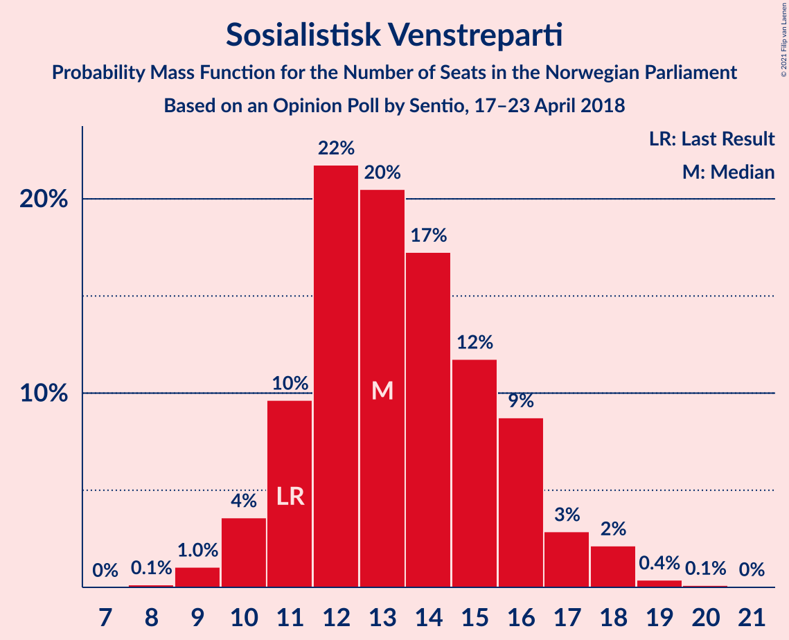
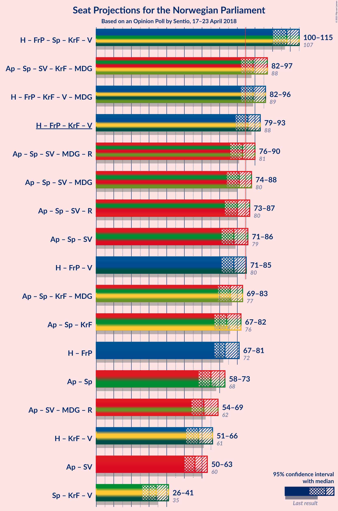
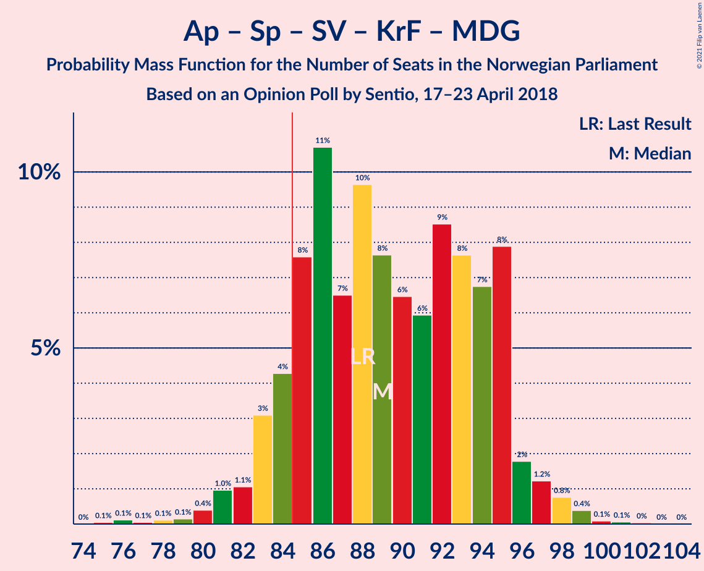
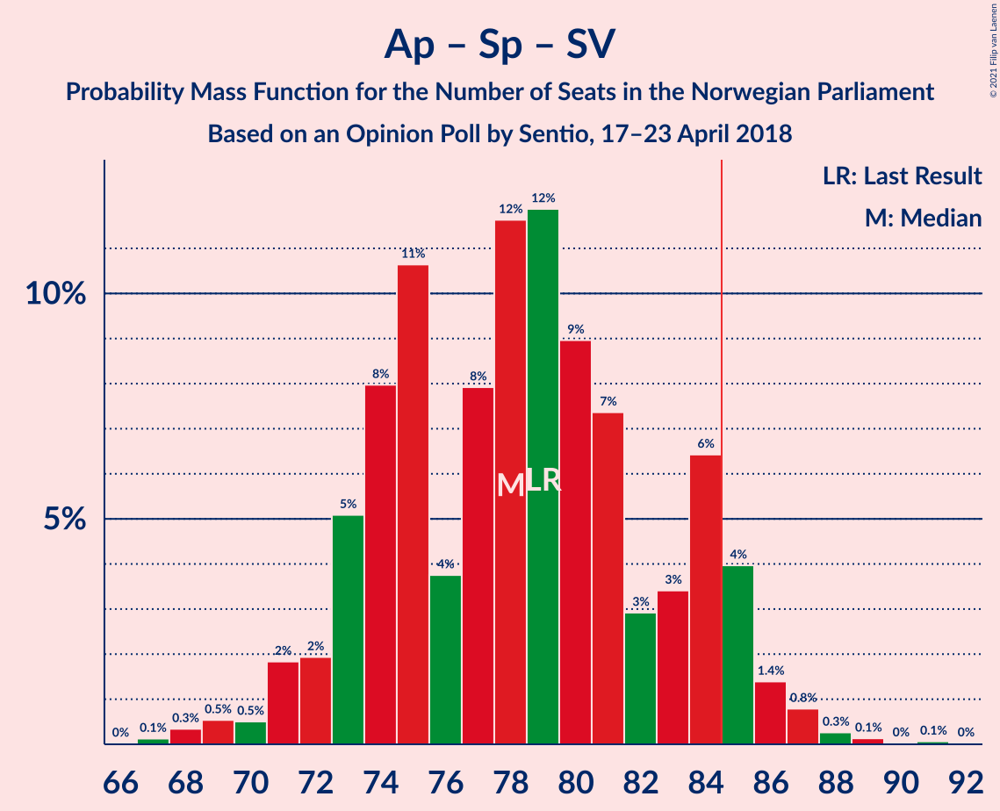
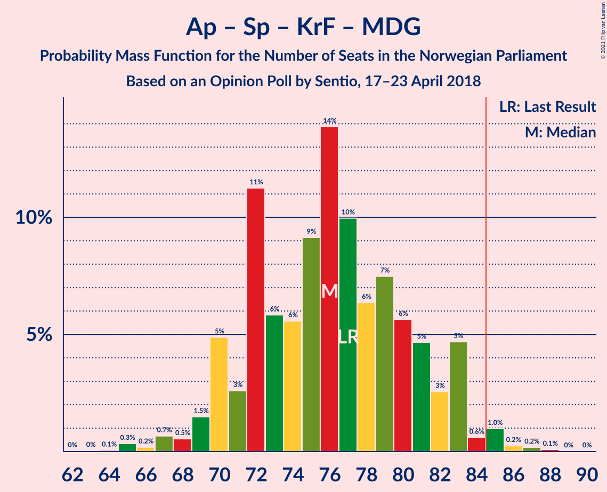
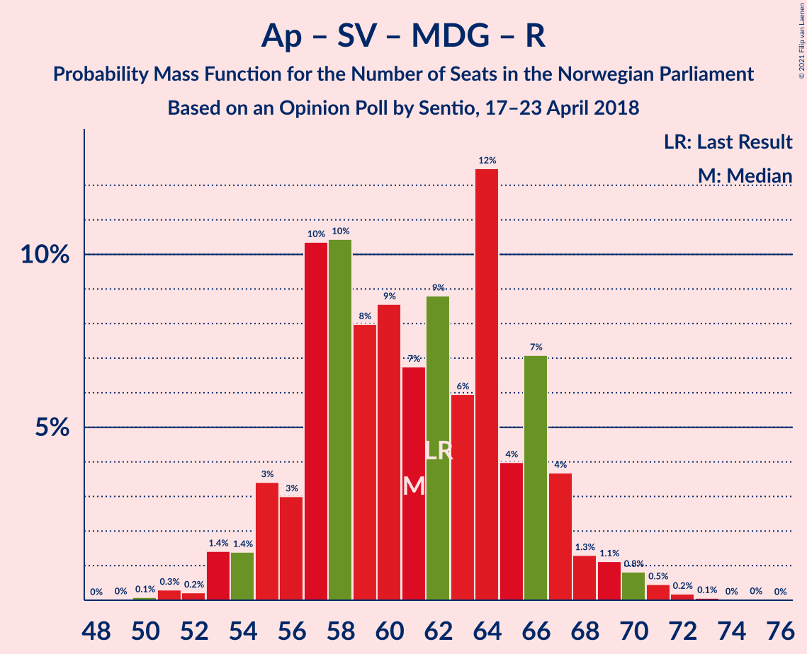

# Opinion Poll by Sentio, 17–23 April 2018

<a href="#voting-intentions">Voting Intentions</a> | <a href="#seats">Seats</a> | <a href="#coalitions">Coalitions</a> | <a href="#technical-information">Technical Information</a>

## Voting Intentions

### Confidence Intervals

| Party | Last Result | Poll Result | 80% Confidence Interval | 90% Confidence Interval | 95% Confidence Interval | 99% Confidence Interval |
|:-----:|:-----------:|:-----------:|:-----------------------:|:-----------------------:|:-----------------------:|:-----------------------:|
| Høyre | 25.0% | 25.2% | 23.1–27.4% |22.6–28.0% |22.1–28.6% |21.1–29.7% |
| Arbeiderpartiet | 27.4% | 23.9% | 21.9–26.0% |21.3–26.7% |20.8–27.2% |19.9–28.3% |
| Fremskrittspartiet | 15.2% | 15.7% | 14.0–17.6% |13.5–18.1% |13.1–18.6% |12.4–19.5% |
| Senterpartiet | 10.3% | 11.9% | 10.4–13.6% |10.0–14.1% |9.6–14.5% |9.0–15.4% |
| Sosialistisk Venstreparti | 6.0% | 7.3% | 6.2–8.8% |5.9–9.2% |5.6–9.5% |5.1–10.3% |
| Kristelig Folkeparti | 4.2% | 5.0% | 4.1–6.2% |3.8–6.6% |3.6–6.9% |3.2–7.5% |
| Venstre | 4.4% | 3.7% | 2.9–4.8% |2.7–5.1% |2.5–5.3% |2.2–5.9% |
| Miljøpartiet De Grønne | 3.2% | 3.1% | 2.4–4.1% |2.2–4.4% |2.0–4.7% |1.7–5.2% |
| Rødt | 2.4% | 2.8% | 2.1–3.8% |1.9–4.1% |1.8–4.3% |1.5–4.8% |

*Note:* The poll result column reflects the actual value used in the calculations. Published results may vary slightly, and in addition be rounded to fewer digits.

## Seats

### Confidence Intervals

| Party | Last Result | Median | 80% Confidence Interval | 90% Confidence Interval | 95% Confidence Interval | 99% Confidence Interval |
|:-----:|:-----------:|:------:|:-----------------------:|:-----------------------:|:-----------------------:|:-----------------------:|
| <a href="#høyre">Høyre</a> | 45 | 45 | 42–51 |40–51 |40–52 |37–53 |
| <a href="#arbeiderpartiet">Arbeiderpartiet</a> | 49 | 43 | 40–48 |39–49 |38–49 |36–52 |
| <a href="#fremskrittspartiet">Fremskrittspartiet</a> | 27 | 28 | 25–31 |25–32 |24–34 |22–35 |
| <a href="#senterpartiet">Senterpartiet</a> | 19 | 21 | 18–25 |18–26 |17–26 |16–28 |
| <a href="#sosialistisk-venstreparti">Sosialistisk Venstreparti</a> | 11 | 13 | 11–16 |11–17 |10–18 |9–19 |
| <a href="#kristelig-folkeparti">Kristelig Folkeparti</a> | 8 | 9 | 7–11 |3–12 |3–12 |2–13 |
| <a href="#venstre">Venstre</a> | 8 | 2 | 2–8 |2–9 |2–10 |1–10 |
| <a href="#miljøpartiet-de-grønne">Miljøpartiet De Grønne</a> | 1 | 2 | 1–7 |1–8 |1–8 |0–9 |
| <a href="#rødt">Rødt</a> | 1 | 2 | 1–2 |1–7 |1–8 |1–9 |

### Høyre

*For a full overview of the results for this party, see the [Høyre](party-høyre.html) page.*

| Number of Seats | Probability | Accumulated | Special Marks |
|:---------------:|:-----------:|:-----------:|:-------------:|
| 35 | 0% | 100% |  |
| 36 | 0.1% | 99.9% |  |
| 37 | 0.4% | 99.8% |  |
| 38 | 0.8% | 99.4% |  |
| 39 | 0.8% | 98.6% |  |
| 40 | 4% | 98% |  |
| 41 | 4% | 94% |  |
| 42 | 11% | 90% |  |
| 43 | 10% | 80% |  |
| 44 | 14% | 69% |  |
| 45 | 7% | 55% | Last Result, Median |
| 46 | 14% | 48% |  |
| 47 | 7% | 34% |  |
| 48 | 7% | 27% |  |
| 49 | 5% | 21% |  |
| 50 | 6% | 16% |  |
| 51 | 5% | 10% |  |
| 52 | 4% | 5% |  |
| 53 | 0.3% | 0.7% |  |
| 54 | 0.2% | 0.4% |  |
| 55 | 0.1% | 0.2% |  |
| 56 | 0% | 0.1% |  |
| 57 | 0% | 0.1% |  |
| 58 | 0% | 0% |  |

### Arbeiderpartiet

*For a full overview of the results for this party, see the [Arbeiderpartiet](party-arbeiderpartiet.html) page.*

| Number of Seats | Probability | Accumulated | Special Marks |
|:---------------:|:-----------:|:-----------:|:-------------:|
| 34 | 0% | 100% |  |
| 35 | 0.1% | 99.9% |  |
| 36 | 0.4% | 99.8% |  |
| 37 | 2% | 99.4% |  |
| 38 | 2% | 98% |  |
| 39 | 2% | 95% |  |
| 40 | 6% | 93% |  |
| 41 | 15% | 87% |  |
| 42 | 15% | 72% |  |
| 43 | 10% | 57% | Median |
| 44 | 11% | 47% |  |
| 45 | 13% | 35% |  |
| 46 | 7% | 23% |  |
| 47 | 5% | 16% |  |
| 48 | 4% | 11% |  |
| 49 | 5% | 7% | Last Result |
| 50 | 1.1% | 2% |  |
| 51 | 0.4% | 0.9% |  |
| 52 | 0.4% | 0.6% |  |
| 53 | 0.1% | 0.2% |  |
| 54 | 0% | 0% |  |

### Fremskrittspartiet

*For a full overview of the results for this party, see the [Fremskrittspartiet](party-fremskrittspartiet.html) page.*

| Number of Seats | Probability | Accumulated | Special Marks |
|:---------------:|:-----------:|:-----------:|:-------------:|
| 20 | 0.1% | 100% |  |
| 21 | 0.2% | 99.9% |  |
| 22 | 0.4% | 99.7% |  |
| 23 | 0.8% | 99.3% |  |
| 24 | 3% | 98% |  |
| 25 | 9% | 95% |  |
| 26 | 16% | 86% |  |
| 27 | 11% | 70% | Last Result |
| 28 | 12% | 59% | Median |
| 29 | 14% | 48% |  |
| 30 | 17% | 33% |  |
| 31 | 8% | 17% |  |
| 32 | 5% | 9% |  |
| 33 | 1.4% | 4% |  |
| 34 | 2% | 3% |  |
| 35 | 0.8% | 1.2% |  |
| 36 | 0.4% | 0.4% |  |
| 37 | 0.1% | 0.1% |  |
| 38 | 0% | 0% |  |

### Senterpartiet

*For a full overview of the results for this party, see the [Senterpartiet](party-senterpartiet.html) page.*

| Number of Seats | Probability | Accumulated | Special Marks |
|:---------------:|:-----------:|:-----------:|:-------------:|
| 15 | 0.2% | 100% |  |
| 16 | 0.8% | 99.8% |  |
| 17 | 3% | 99.0% |  |
| 18 | 8% | 96% |  |
| 19 | 8% | 88% | Last Result |
| 20 | 18% | 80% |  |
| 21 | 18% | 63% | Median |
| 22 | 10% | 44% |  |
| 23 | 11% | 34% |  |
| 24 | 12% | 23% |  |
| 25 | 5% | 11% |  |
| 26 | 4% | 6% |  |
| 27 | 2% | 2% |  |
| 28 | 0.4% | 0.7% |  |
| 29 | 0.1% | 0.2% |  |
| 30 | 0.1% | 0.1% |  |
| 31 | 0% | 0% |  |

### Sosialistisk Venstreparti

*For a full overview of the results for this party, see the [Sosialistisk Venstreparti](party-sosialistiskvenstreparti.html) page.*

| Number of Seats | Probability | Accumulated | Special Marks |
|:---------------:|:-----------:|:-----------:|:-------------:|
| 8 | 0.1% | 100% |  |
| 9 | 1.0% | 99.8% |  |
| 10 | 4% | 98.8% |  |
| 11 | 10% | 95% | Last Result |
| 12 | 22% | 86% |  |
| 13 | 20% | 64% | Median |
| 14 | 17% | 43% |  |
| 15 | 12% | 26% |  |
| 16 | 9% | 14% |  |
| 17 | 3% | 6% |  |
| 18 | 2% | 3% |  |
| 19 | 0.4% | 0.5% |  |
| 20 | 0.1% | 0.2% |  |
| 21 | 0% | 0% |  |

### Kristelig Folkeparti

*For a full overview of the results for this party, see the [Kristelig Folkeparti](party-kristeligfolkeparti.html) page.*

| Number of Seats | Probability | Accumulated | Special Marks |
|:---------------:|:-----------:|:-----------:|:-------------:|
| 1 | 0.3% | 100% |  |
| 2 | 0.2% | 99.7% |  |
| 3 | 9% | 99.5% |  |
| 4 | 0% | 90% |  |
| 5 | 0% | 90% |  |
| 6 | 0% | 90% |  |
| 7 | 4% | 90% |  |
| 8 | 19% | 86% | Last Result |
| 9 | 29% | 67% | Median |
| 10 | 21% | 38% |  |
| 11 | 8% | 16% |  |
| 12 | 6% | 8% |  |
| 13 | 2% | 2% |  |
| 14 | 0.3% | 0.5% |  |
| 15 | 0.1% | 0.1% |  |
| 16 | 0% | 0% |  |

### Venstre

*For a full overview of the results for this party, see the [Venstre](party-venstre.html) page.*

| Number of Seats | Probability | Accumulated | Special Marks |
|:---------------:|:-----------:|:-----------:|:-------------:|
| 1 | 1.0% | 100% |  |
| 2 | 59% | 99.0% | Median |
| 3 | 8% | 40% |  |
| 4 | 0% | 32% |  |
| 5 | 0% | 32% |  |
| 6 | 0% | 32% |  |
| 7 | 12% | 32% |  |
| 8 | 11% | 19% | Last Result |
| 9 | 5% | 9% |  |
| 10 | 3% | 3% |  |
| 11 | 0.3% | 0.3% |  |
| 12 | 0% | 0.1% |  |
| 13 | 0% | 0% |  |

### Miljøpartiet De Grønne

*For a full overview of the results for this party, see the [Miljøpartiet De Grønne](party-miljøpartietdegrønne.html) page.*

| Number of Seats | Probability | Accumulated | Special Marks |
|:---------------:|:-----------:|:-----------:|:-------------:|
| 0 | 2% | 100% |  |
| 1 | 41% | 98% | Last Result |
| 2 | 40% | 57% | Median |
| 3 | 4% | 17% |  |
| 4 | 0.8% | 13% |  |
| 5 | 0% | 12% |  |
| 6 | 0% | 12% |  |
| 7 | 3% | 12% |  |
| 8 | 7% | 9% |  |
| 9 | 1.2% | 2% |  |
| 10 | 0.3% | 0.3% |  |
| 11 | 0% | 0% |  |

### Rødt

*For a full overview of the results for this party, see the [Rødt](party-rødt.html) page.*

| Number of Seats | Probability | Accumulated | Special Marks |
|:---------------:|:-----------:|:-----------:|:-------------:|
| 0 | 0.1% | 100% |  |
| 1 | 46% | 99.9% | Last Result |
| 2 | 48% | 54% | Median |
| 3 | 0% | 6% |  |
| 4 | 0% | 6% |  |
| 5 | 0% | 6% |  |
| 6 | 0% | 6% |  |
| 7 | 4% | 6% |  |
| 8 | 2% | 3% |  |
| 9 | 0.7% | 0.7% |  |
| 10 | 0% | 0.1% |  |
| 11 | 0% | 0% |  |

## Coalitions

### Confidence Intervals

| Coalition | Last Result | Median | Majority? | 80% Confidence Interval | 90% Confidence Interval | 95% Confidence Interval | 99% Confidence Interval |
|:---------:|:-----------:|:------:|:---------:|:-----------------------:|:-----------------------:|:-----------------------:|:-----------------------:|
| Høyre – Fremskrittspartiet – Senterpartiet – Kristelig Folkeparti – Venstre | 107 | 108 | 100% | 103–112 | 102–114 | 100–115 | 98–117 |
| Arbeiderpartiet – Senterpartiet – Sosialistisk Venstreparti – Kristelig Folkeparti – Miljøpartiet De Grønne | 88 | 89 | 90% | 84–95 | 83–95 | 82–97 | 80–99 |
| Høyre – Fremskrittspartiet – Kristelig Folkeparti – Venstre – Miljøpartiet De Grønne | 89 | 89 | 83% | 83–94 | 82–95 | 82–96 | 79–99 |
| Høyre – Fremskrittspartiet – Kristelig Folkeparti – Venstre | 88 | 86 | 67% | 81–92 | 81–93 | 79–93 | 77–97 |
| Arbeiderpartiet – Senterpartiet – Sosialistisk Venstreparti – Miljøpartiet De Grønne – Rødt | 81 | 83 | 33% | 77–88 | 76–88 | 76–90 | 72–92 |
| Arbeiderpartiet – Senterpartiet – Sosialistisk Venstreparti – Miljøpartiet De Grønne | 80 | 81 | 21% | 76–86 | 75–87 | 74–88 | 70–91 |
| Arbeiderpartiet – Senterpartiet – Sosialistisk Venstreparti – Rødt | 80 | 80 | 17% | 75–86 | 74–87 | 73–87 | 70–90 |
| Arbeiderpartiet – Senterpartiet – Sosialistisk Venstreparti | 79 | 78 | 7% | 73–84 | 72–85 | 71–86 | 68–88 |
| Høyre – Fremskrittspartiet – Venstre | 80 | 78 | 3% | 72–83 | 72–84 | 71–85 | 69–88 |
| Arbeiderpartiet – Senterpartiet – Kristelig Folkeparti – Miljøpartiet De Grønne | 77 | 76 | 2% | 71–81 | 70–83 | 69–83 | 66–86 |
| Arbeiderpartiet – Senterpartiet – Kristelig Folkeparti | 76 | 74 | 0.1% | 69–79 | 68–81 | 67–82 | 64–84 |
| Høyre – Fremskrittspartiet | 72 | 73 | 0.3% | 69–79 | 68–81 | 67–81 | 65–84 |
| Arbeiderpartiet – Senterpartiet | 68 | 65 | 0% | 60–70 | 59–71 | 58–73 | 56–74 |
| Arbeiderpartiet – Sosialistisk Venstreparti – Miljøpartiet De Grønne – Rødt | 62 | 61 | 0% | 57–66 | 55–67 | 54–69 | 52–71 |
| Høyre – Kristelig Folkeparti – Venstre | 61 | 58 | 0% | 53–64 | 52–65 | 51–66 | 48–68 |
| Arbeiderpartiet – Sosialistisk Venstreparti | 60 | 56 | 0% | 53–61 | 51–63 | 50–63 | 48–66 |
| Senterpartiet – Kristelig Folkeparti – Venstre | 35 | 34 | 0% | 29–39 | 28–40 | 26–41 | 24–44 |

### Høyre – Fremskrittspartiet – Senterpartiet – Kristelig Folkeparti – Venstre

| Number of Seats | Probability | Accumulated | Special Marks |
|:---------------:|:-----------:|:-----------:|:-------------:|
| 95 | 0% | 100% |  |
| 96 | 0.1% | 99.9% |  |
| 97 | 0.2% | 99.9% |  |
| 98 | 0.5% | 99.7% |  |
| 99 | 0.8% | 99.2% |  |
| 100 | 1.1% | 98% |  |
| 101 | 1.3% | 97% |  |
| 102 | 4% | 96% |  |
| 103 | 7% | 92% |  |
| 104 | 4% | 85% |  |
| 105 | 12% | 81% | Median |
| 106 | 6% | 69% |  |
| 107 | 9% | 63% | Last Result |
| 108 | 7% | 54% |  |
| 109 | 9% | 47% |  |
| 110 | 8% | 39% |  |
| 111 | 10% | 31% |  |
| 112 | 10% | 20% |  |
| 113 | 3% | 10% |  |
| 114 | 3% | 7% |  |
| 115 | 1.4% | 3% |  |
| 116 | 1.4% | 2% |  |
| 117 | 0.2% | 0.6% |  |
| 118 | 0.3% | 0.4% |  |
| 119 | 0.1% | 0.1% |  |
| 120 | 0% | 0% |  |

### Arbeiderpartiet – Senterpartiet – Sosialistisk Venstreparti – Kristelig Folkeparti – Miljøpartiet De Grønne

| Number of Seats | Probability | Accumulated | Special Marks |
|:---------------:|:-----------:|:-----------:|:-------------:|
| 75 | 0.1% | 100% |  |
| 76 | 0.1% | 99.9% |  |
| 77 | 0.1% | 99.8% |  |
| 78 | 0.1% | 99.8% |  |
| 79 | 0.1% | 99.7% |  |
| 80 | 0.4% | 99.5% |  |
| 81 | 1.0% | 99.1% |  |
| 82 | 1.1% | 98% |  |
| 83 | 3% | 97% |  |
| 84 | 4% | 94% |  |
| 85 | 8% | 90% | Majority |
| 86 | 11% | 82% |  |
| 87 | 7% | 71% |  |
| 88 | 10% | 65% | Last Result, Median |
| 89 | 8% | 55% |  |
| 90 | 6% | 48% |  |
| 91 | 6% | 41% |  |
| 92 | 9% | 35% |  |
| 93 | 8% | 27% |  |
| 94 | 7% | 19% |  |
| 95 | 8% | 12% |  |
| 96 | 2% | 4% |  |
| 97 | 1.2% | 3% |  |
| 98 | 0.8% | 1.4% |  |
| 99 | 0.4% | 0.6% |  |
| 100 | 0.1% | 0.2% |  |
| 101 | 0.1% | 0.1% |  |
| 102 | 0% | 0.1% |  |
| 103 | 0% | 0% |  |

### Høyre – Fremskrittspartiet – Kristelig Folkeparti – Venstre – Miljøpartiet De Grønne

| Number of Seats | Probability | Accumulated | Special Marks |
|:---------------:|:-----------:|:-----------:|:-------------:|
| 76 | 0.1% | 100% |  |
| 77 | 0.1% | 99.9% |  |
| 78 | 0.2% | 99.8% |  |
| 79 | 0.2% | 99.6% |  |
| 80 | 0.8% | 99.4% |  |
| 81 | 1.0% | 98.6% |  |
| 82 | 4% | 98% |  |
| 83 | 6% | 94% |  |
| 84 | 5% | 88% |  |
| 85 | 3% | 83% | Majority |
| 86 | 6% | 79% | Median |
| 87 | 9% | 73% |  |
| 88 | 10% | 64% |  |
| 89 | 12% | 54% | Last Result |
| 90 | 9% | 42% |  |
| 91 | 6% | 33% |  |
| 92 | 4% | 27% |  |
| 93 | 8% | 23% |  |
| 94 | 8% | 14% |  |
| 95 | 3% | 6% |  |
| 96 | 1.2% | 3% |  |
| 97 | 1.1% | 2% |  |
| 98 | 0.6% | 1.1% |  |
| 99 | 0.3% | 0.6% |  |
| 100 | 0.2% | 0.2% |  |
| 101 | 0.1% | 0.1% |  |
| 102 | 0% | 0% |  |

### Høyre – Fremskrittspartiet – Kristelig Folkeparti – Venstre

| Number of Seats | Probability | Accumulated | Special Marks |
|:---------------:|:-----------:|:-----------:|:-------------:|
| 73 | 0% | 100% |  |
| 74 | 0.1% | 99.9% |  |
| 75 | 0.1% | 99.9% |  |
| 76 | 0.2% | 99.7% |  |
| 77 | 0.6% | 99.5% |  |
| 78 | 0.6% | 98.9% |  |
| 79 | 1.4% | 98% |  |
| 80 | 2% | 97% |  |
| 81 | 8% | 95% |  |
| 82 | 7% | 88% |  |
| 83 | 7% | 81% |  |
| 84 | 7% | 74% | Median |
| 85 | 7% | 67% | Majority |
| 86 | 11% | 60% |  |
| 87 | 8% | 49% |  |
| 88 | 10% | 41% | Last Result |
| 89 | 6% | 31% |  |
| 90 | 4% | 24% |  |
| 91 | 7% | 20% |  |
| 92 | 7% | 13% |  |
| 93 | 3% | 6% |  |
| 94 | 1.1% | 2% |  |
| 95 | 0.5% | 1.3% |  |
| 96 | 0.2% | 0.8% |  |
| 97 | 0.3% | 0.6% |  |
| 98 | 0.2% | 0.3% |  |
| 99 | 0.1% | 0.1% |  |
| 100 | 0% | 0% |  |

### Arbeiderpartiet – Senterpartiet – Sosialistisk Venstreparti – Miljøpartiet De Grønne – Rødt

| Number of Seats | Probability | Accumulated | Special Marks |
|:---------------:|:-----------:|:-----------:|:-------------:|
| 70 | 0.1% | 100% |  |
| 71 | 0.2% | 99.9% |  |
| 72 | 0.3% | 99.7% |  |
| 73 | 0.2% | 99.4% |  |
| 74 | 0.5% | 99.2% |  |
| 75 | 1.2% | 98.7% |  |
| 76 | 3% | 98% |  |
| 77 | 7% | 94% |  |
| 78 | 7% | 87% |  |
| 79 | 4% | 80% |  |
| 80 | 6% | 76% |  |
| 81 | 10% | 69% | Last Result, Median |
| 82 | 8% | 59% |  |
| 83 | 11% | 51% |  |
| 84 | 7% | 40% |  |
| 85 | 7% | 33% | Majority |
| 86 | 7% | 26% |  |
| 87 | 7% | 19% |  |
| 88 | 8% | 12% |  |
| 89 | 2% | 5% |  |
| 90 | 1.4% | 3% |  |
| 91 | 0.6% | 2% |  |
| 92 | 0.6% | 1.1% |  |
| 93 | 0.2% | 0.5% |  |
| 94 | 0.1% | 0.3% |  |
| 95 | 0.1% | 0.1% |  |
| 96 | 0% | 0.1% |  |
| 97 | 0% | 0% |  |

### Arbeiderpartiet – Senterpartiet – Sosialistisk Venstreparti – Miljøpartiet De Grønne

| Number of Seats | Probability | Accumulated | Special Marks |
|:---------------:|:-----------:|:-----------:|:-------------:|
| 69 | 0.1% | 100% |  |
| 70 | 0.4% | 99.9% |  |
| 71 | 0.2% | 99.5% |  |
| 72 | 0.5% | 99.2% |  |
| 73 | 1.1% | 98.7% |  |
| 74 | 2% | 98% |  |
| 75 | 5% | 95% |  |
| 76 | 7% | 90% |  |
| 77 | 9% | 83% |  |
| 78 | 5% | 74% |  |
| 79 | 11% | 69% | Median |
| 80 | 8% | 59% | Last Result |
| 81 | 8% | 51% |  |
| 82 | 10% | 42% |  |
| 83 | 6% | 32% |  |
| 84 | 4% | 25% |  |
| 85 | 9% | 21% | Majority |
| 86 | 7% | 13% |  |
| 87 | 3% | 6% |  |
| 88 | 1.3% | 3% |  |
| 89 | 0.7% | 2% |  |
| 90 | 0.7% | 1.2% |  |
| 91 | 0.3% | 0.5% |  |
| 92 | 0.1% | 0.2% |  |
| 93 | 0.1% | 0.2% |  |
| 94 | 0% | 0% |  |

### Arbeiderpartiet – Senterpartiet – Sosialistisk Venstreparti – Rødt

| Number of Seats | Probability | Accumulated | Special Marks |
|:---------------:|:-----------:|:-----------:|:-------------:|
| 68 | 0.1% | 100% |  |
| 69 | 0.2% | 99.9% |  |
| 70 | 0.3% | 99.8% |  |
| 71 | 0.6% | 99.4% |  |
| 72 | 1.1% | 98.9% |  |
| 73 | 1.2% | 98% |  |
| 74 | 3% | 97% |  |
| 75 | 8% | 94% |  |
| 76 | 8% | 86% |  |
| 77 | 4% | 77% |  |
| 78 | 6% | 73% |  |
| 79 | 9% | 67% | Median |
| 80 | 12% | 58% | Last Result |
| 81 | 10% | 46% |  |
| 82 | 9% | 36% |  |
| 83 | 6% | 27% |  |
| 84 | 3% | 21% |  |
| 85 | 5% | 17% | Majority |
| 86 | 6% | 12% |  |
| 87 | 4% | 6% |  |
| 88 | 1.0% | 2% |  |
| 89 | 0.8% | 1.4% |  |
| 90 | 0.2% | 0.6% |  |
| 91 | 0.2% | 0.4% |  |
| 92 | 0.1% | 0.2% |  |
| 93 | 0.1% | 0.1% |  |
| 94 | 0% | 0% |  |

### Arbeiderpartiet – Senterpartiet – Sosialistisk Venstreparti

| Number of Seats | Probability | Accumulated | Special Marks |
|:---------------:|:-----------:|:-----------:|:-------------:|
| 67 | 0.1% | 100% |  |
| 68 | 0.3% | 99.8% |  |
| 69 | 0.5% | 99.5% |  |
| 70 | 0.5% | 98.9% |  |
| 71 | 2% | 98% |  |
| 72 | 2% | 97% |  |
| 73 | 5% | 95% |  |
| 74 | 8% | 90% |  |
| 75 | 11% | 82% |  |
| 76 | 4% | 71% |  |
| 77 | 8% | 67% | Median |
| 78 | 12% | 59% |  |
| 79 | 12% | 48% | Last Result |
| 80 | 9% | 36% |  |
| 81 | 7% | 27% |  |
| 82 | 3% | 19% |  |
| 83 | 3% | 17% |  |
| 84 | 6% | 13% |  |
| 85 | 4% | 7% | Majority |
| 86 | 1.4% | 3% |  |
| 87 | 0.8% | 1.3% |  |
| 88 | 0.3% | 0.5% |  |
| 89 | 0.1% | 0.3% |  |
| 90 | 0% | 0.1% |  |
| 91 | 0.1% | 0.1% |  |
| 92 | 0% | 0% |  |

### Høyre – Fremskrittspartiet – Venstre

| Number of Seats | Probability | Accumulated | Special Marks |
|:---------------:|:-----------:|:-----------:|:-------------:|
| 65 | 0% | 100% |  |
| 66 | 0.1% | 99.9% |  |
| 67 | 0.1% | 99.9% |  |
| 68 | 0.2% | 99.8% |  |
| 69 | 0.5% | 99.5% |  |
| 70 | 1.1% | 99.0% |  |
| 71 | 1.5% | 98% |  |
| 72 | 8% | 96% |  |
| 73 | 5% | 89% |  |
| 74 | 12% | 84% |  |
| 75 | 7% | 72% | Median |
| 76 | 7% | 65% |  |
| 77 | 7% | 58% |  |
| 78 | 6% | 51% |  |
| 79 | 10% | 45% |  |
| 80 | 8% | 35% | Last Result |
| 81 | 5% | 27% |  |
| 82 | 11% | 22% |  |
| 83 | 4% | 11% |  |
| 84 | 4% | 7% |  |
| 85 | 1.3% | 3% | Majority |
| 86 | 1.1% | 2% |  |
| 87 | 0.4% | 0.9% |  |
| 88 | 0.2% | 0.5% |  |
| 89 | 0.1% | 0.3% |  |
| 90 | 0.1% | 0.2% |  |
| 91 | 0.1% | 0.2% |  |
| 92 | 0% | 0% |  |

### Arbeiderpartiet – Senterpartiet – Kristelig Folkeparti – Miljøpartiet De Grønne

| Number of Seats | Probability | Accumulated | Special Marks |
|:---------------:|:-----------:|:-----------:|:-------------:|
| 63 | 0% | 100% |  |
| 64 | 0.1% | 99.9% |  |
| 65 | 0.3% | 99.9% |  |
| 66 | 0.2% | 99.5% |  |
| 67 | 0.7% | 99.3% |  |
| 68 | 0.5% | 98.7% |  |
| 69 | 1.5% | 98% |  |
| 70 | 5% | 97% |  |
| 71 | 3% | 92% |  |
| 72 | 11% | 89% |  |
| 73 | 6% | 78% |  |
| 74 | 6% | 72% |  |
| 75 | 9% | 67% | Median |
| 76 | 14% | 57% |  |
| 77 | 10% | 43% | Last Result |
| 78 | 6% | 34% |  |
| 79 | 7% | 27% |  |
| 80 | 6% | 20% |  |
| 81 | 5% | 14% |  |
| 82 | 3% | 9% |  |
| 83 | 5% | 7% |  |
| 84 | 0.6% | 2% |  |
| 85 | 1.0% | 2% | Majority |
| 86 | 0.2% | 0.6% |  |
| 87 | 0.2% | 0.3% |  |
| 88 | 0.1% | 0.1% |  |
| 89 | 0% | 0% |  |

### Arbeiderpartiet – Senterpartiet – Kristelig Folkeparti

| Number of Seats | Probability | Accumulated | Special Marks |
|:---------------:|:-----------:|:-----------:|:-------------:|
| 61 | 0% | 100% |  |
| 62 | 0.1% | 99.9% |  |
| 63 | 0.3% | 99.8% |  |
| 64 | 0.2% | 99.5% |  |
| 65 | 0.5% | 99.3% |  |
| 66 | 1.3% | 98.8% |  |
| 67 | 1.5% | 98% |  |
| 68 | 5% | 96% |  |
| 69 | 5% | 91% |  |
| 70 | 11% | 86% |  |
| 71 | 7% | 76% |  |
| 72 | 5% | 69% |  |
| 73 | 10% | 63% | Median |
| 74 | 10% | 53% |  |
| 75 | 10% | 43% |  |
| 76 | 9% | 32% | Last Result |
| 77 | 8% | 23% |  |
| 78 | 3% | 15% |  |
| 79 | 4% | 12% |  |
| 80 | 2% | 7% |  |
| 81 | 2% | 5% |  |
| 82 | 2% | 3% |  |
| 83 | 0.6% | 1.1% |  |
| 84 | 0.4% | 0.5% |  |
| 85 | 0.1% | 0.1% | Majority |
| 86 | 0% | 0% |  |

### Høyre – Fremskrittspartiet

| Number of Seats | Probability | Accumulated | Special Marks |
|:---------------:|:-----------:|:-----------:|:-------------:|
| 61 | 0% | 100% |  |
| 62 | 0% | 99.9% |  |
| 63 | 0.1% | 99.9% |  |
| 64 | 0.3% | 99.8% |  |
| 65 | 0.7% | 99.5% |  |
| 66 | 0.8% | 98.9% |  |
| 67 | 2% | 98% |  |
| 68 | 4% | 96% |  |
| 69 | 3% | 93% |  |
| 70 | 10% | 89% |  |
| 71 | 7% | 79% |  |
| 72 | 15% | 73% | Last Result |
| 73 | 9% | 57% | Median |
| 74 | 10% | 49% |  |
| 75 | 11% | 39% |  |
| 76 | 5% | 28% |  |
| 77 | 7% | 24% |  |
| 78 | 5% | 17% |  |
| 79 | 3% | 12% |  |
| 80 | 4% | 9% |  |
| 81 | 3% | 6% |  |
| 82 | 1.1% | 2% |  |
| 83 | 0.4% | 0.9% |  |
| 84 | 0.3% | 0.6% |  |
| 85 | 0.2% | 0.3% | Majority |
| 86 | 0.1% | 0.1% |  |
| 87 | 0% | 0% |  |

### Arbeiderpartiet – Senterpartiet

| Number of Seats | Probability | Accumulated | Special Marks |
|:---------------:|:-----------:|:-----------:|:-------------:|
| 54 | 0.1% | 100% |  |
| 55 | 0.2% | 99.9% |  |
| 56 | 0.3% | 99.8% |  |
| 57 | 0.9% | 99.4% |  |
| 58 | 1.3% | 98.5% |  |
| 59 | 2% | 97% |  |
| 60 | 6% | 95% |  |
| 61 | 10% | 89% |  |
| 62 | 8% | 79% |  |
| 63 | 8% | 72% |  |
| 64 | 9% | 64% | Median |
| 65 | 9% | 54% |  |
| 66 | 14% | 45% |  |
| 67 | 8% | 31% |  |
| 68 | 8% | 23% | Last Result |
| 69 | 4% | 15% |  |
| 70 | 3% | 11% |  |
| 71 | 4% | 9% |  |
| 72 | 2% | 5% |  |
| 73 | 3% | 3% |  |
| 74 | 0.4% | 0.7% |  |
| 75 | 0.1% | 0.3% |  |
| 76 | 0.1% | 0.2% |  |
| 77 | 0.1% | 0.1% |  |
| 78 | 0% | 0.1% |  |
| 79 | 0% | 0% |  |

### Arbeiderpartiet – Sosialistisk Venstreparti – Miljøpartiet De Grønne – Rødt

| Number of Seats | Probability | Accumulated | Special Marks |
|:---------------:|:-----------:|:-----------:|:-------------:|
| 50 | 0.1% | 100% |  |
| 51 | 0.3% | 99.9% |  |
| 52 | 0.2% | 99.6% |  |
| 53 | 1.4% | 99.4% |  |
| 54 | 1.4% | 98% |  |
| 55 | 3% | 97% |  |
| 56 | 3% | 93% |  |
| 57 | 10% | 90% |  |
| 58 | 10% | 80% |  |
| 59 | 8% | 69% |  |
| 60 | 9% | 61% | Median |
| 61 | 7% | 53% |  |
| 62 | 9% | 46% | Last Result |
| 63 | 6% | 37% |  |
| 64 | 12% | 31% |  |
| 65 | 4% | 19% |  |
| 66 | 7% | 15% |  |
| 67 | 4% | 8% |  |
| 68 | 1.3% | 4% |  |
| 69 | 1.1% | 3% |  |
| 70 | 0.8% | 2% |  |
| 71 | 0.5% | 0.8% |  |
| 72 | 0.2% | 0.3% |  |
| 73 | 0.1% | 0.1% |  |
| 74 | 0% | 0.1% |  |
| 75 | 0% | 0% |  |

### Høyre – Kristelig Folkeparti – Venstre

| Number of Seats | Probability | Accumulated | Special Marks |
|:---------------:|:-----------:|:-----------:|:-------------:|
| 46 | 0.1% | 100% |  |
| 47 | 0.2% | 99.8% |  |
| 48 | 0.6% | 99.7% |  |
| 49 | 0.5% | 99.1% |  |
| 50 | 0.8% | 98.6% |  |
| 51 | 2% | 98% |  |
| 52 | 3% | 96% |  |
| 53 | 5% | 93% |  |
| 54 | 5% | 88% |  |
| 55 | 11% | 83% |  |
| 56 | 12% | 72% | Median |
| 57 | 7% | 59% |  |
| 58 | 8% | 53% |  |
| 59 | 6% | 45% |  |
| 60 | 6% | 39% |  |
| 61 | 6% | 32% | Last Result |
| 62 | 10% | 26% |  |
| 63 | 4% | 16% |  |
| 64 | 6% | 12% |  |
| 65 | 2% | 6% |  |
| 66 | 2% | 4% |  |
| 67 | 1.0% | 2% |  |
| 68 | 0.3% | 0.8% |  |
| 69 | 0.2% | 0.4% |  |
| 70 | 0.1% | 0.2% |  |
| 71 | 0% | 0.1% |  |
| 72 | 0% | 0% |  |

### Arbeiderpartiet – Sosialistisk Venstreparti

| Number of Seats | Probability | Accumulated | Special Marks |
|:---------------:|:-----------:|:-----------:|:-------------:|
| 46 | 0% | 100% |  |
| 47 | 0.1% | 99.9% |  |
| 48 | 0.4% | 99.9% |  |
| 49 | 0.4% | 99.4% |  |
| 50 | 2% | 99.0% |  |
| 51 | 3% | 97% |  |
| 52 | 3% | 94% |  |
| 53 | 6% | 91% |  |
| 54 | 9% | 85% |  |
| 55 | 16% | 76% |  |
| 56 | 11% | 60% | Median |
| 57 | 9% | 49% |  |
| 58 | 10% | 40% |  |
| 59 | 5% | 30% |  |
| 60 | 11% | 25% | Last Result |
| 61 | 5% | 14% |  |
| 62 | 3% | 9% |  |
| 63 | 3% | 6% |  |
| 64 | 1.3% | 2% |  |
| 65 | 0.6% | 1.2% |  |
| 66 | 0.4% | 0.5% |  |
| 67 | 0.1% | 0.2% |  |
| 68 | 0% | 0.1% |  |
| 69 | 0% | 0% |  |

### Senterpartiet – Kristelig Folkeparti – Venstre

| Number of Seats | Probability | Accumulated | Special Marks |
|:---------------:|:-----------:|:-----------:|:-------------:|
| 22 | 0.1% | 100% |  |
| 23 | 0.3% | 99.9% |  |
| 24 | 0.1% | 99.6% |  |
| 25 | 0.3% | 99.5% |  |
| 26 | 2% | 99.2% |  |
| 27 | 1.2% | 97% |  |
| 28 | 3% | 96% |  |
| 29 | 4% | 93% |  |
| 30 | 3% | 89% |  |
| 31 | 6% | 86% |  |
| 32 | 13% | 80% | Median |
| 33 | 12% | 66% |  |
| 34 | 7% | 55% |  |
| 35 | 9% | 48% | Last Result |
| 36 | 13% | 39% |  |
| 37 | 7% | 26% |  |
| 38 | 6% | 19% |  |
| 39 | 5% | 14% |  |
| 40 | 4% | 9% |  |
| 41 | 2% | 4% |  |
| 42 | 0.7% | 2% |  |
| 43 | 0.9% | 1.4% |  |
| 44 | 0.2% | 0.5% |  |
| 45 | 0.2% | 0.3% |  |
| 46 | 0.1% | 0.1% |  |
| 47 | 0% | 0% |  |

## Technical Information

### Opinion Poll

+ **Polling firm:** Sentio
+ **Commissioner(s):** —
+ **Fieldwork period:** 17–23 April 2018

### Calculations

+ **Sample size:** 683
+ **Simulations done:** 1,048,576
+ **Error estimate:** 2.59%

