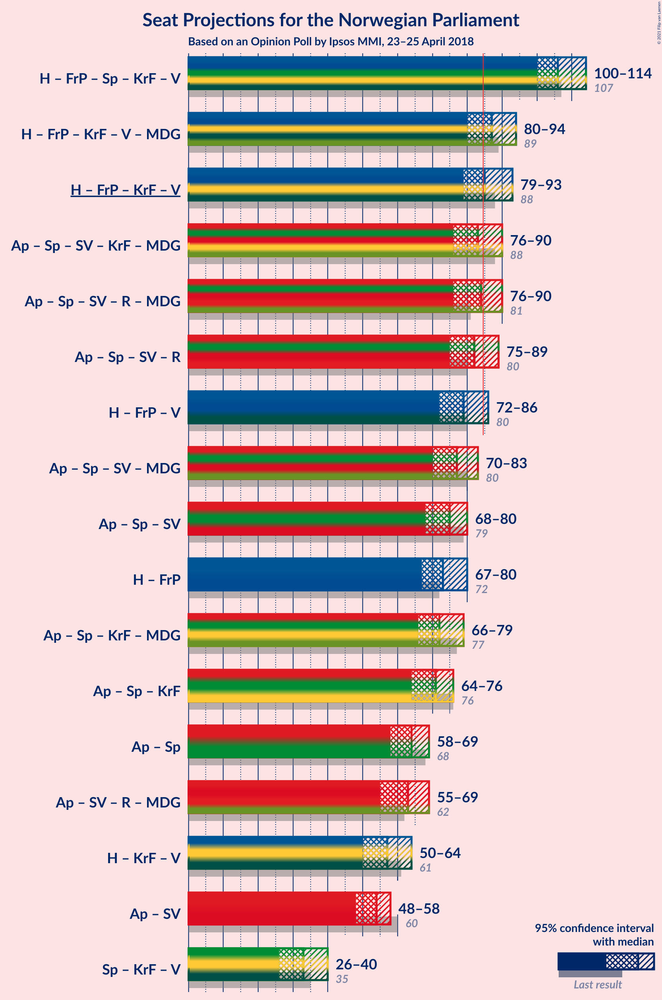
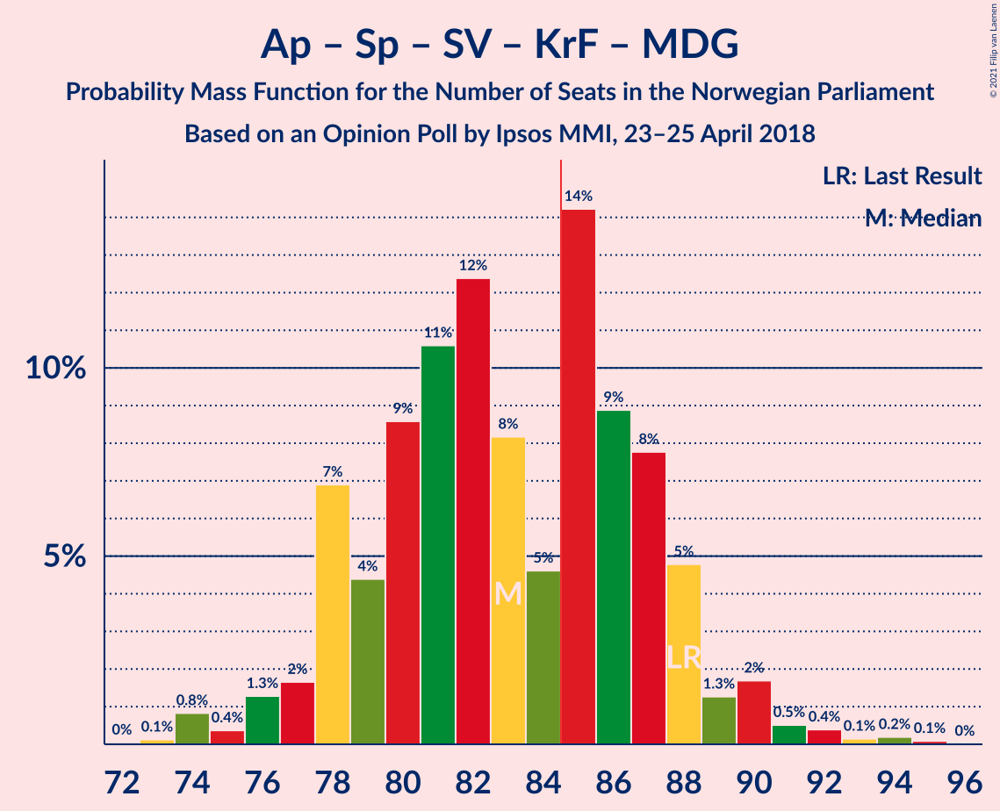
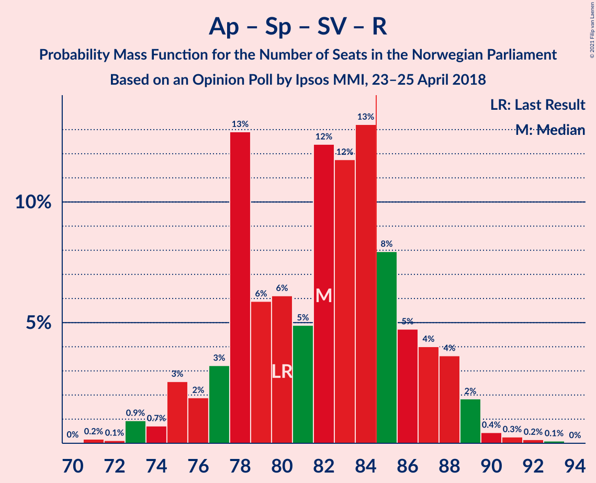
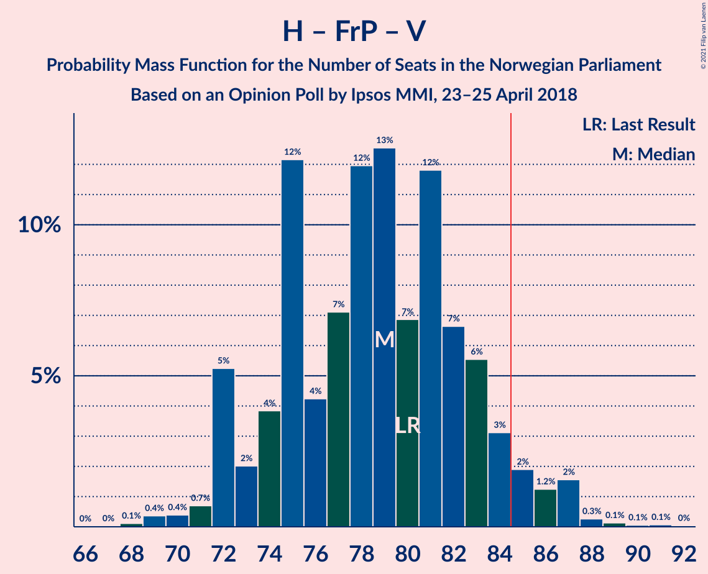
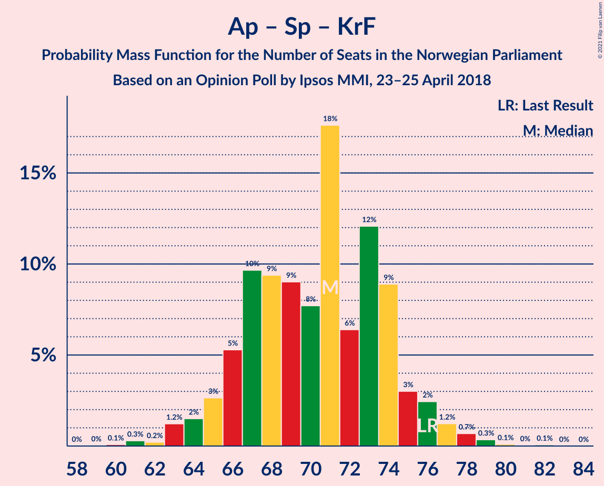
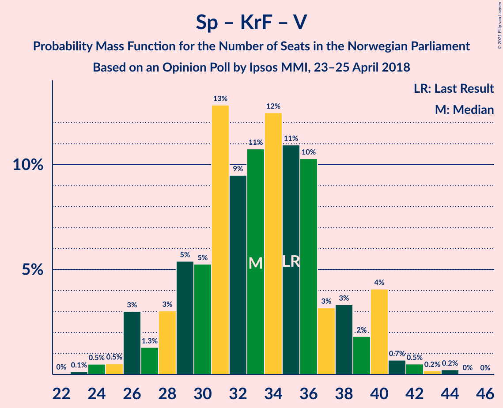

# Opinion Poll by Ipsos MMI, 23–25 April 2018

<a href="#voting-intentions">Voting Intentions</a> | <a href="#seats">Seats</a> | <a href="#coalitions">Coalitions</a> | <a href="#technical-information">Technical Information</a>

## Voting Intentions

### Confidence Intervals

| Party | Last Result | Poll Result | 80% Confidence Interval | 90% Confidence Interval | 95% Confidence Interval | 99% Confidence Interval |
|:-----:|:-----------:|:-----------:|:-----------------------:|:-----------------------:|:-----------------------:|:-----------------------:|
| Høyre | 25.0% | 25.0% | 23.2–26.9% |22.7–27.4% |22.3–27.8% |21.5–28.8% |
| Arbeiderpartiet | 27.4% | 23.3% | 21.6–25.1% |21.1–25.6% |20.7–26.1% |19.9–27.0% |
| Fremskrittspartiet | 15.2% | 16.0% | 14.6–17.7% |14.2–18.1% |13.8–18.5% |13.2–19.3% |
| Senterpartiet | 10.3% | 11.9% | 10.6–13.4% |10.3–13.8% |10.0–14.1% |9.4–14.9% |
| Sosialistisk Venstreparti | 6.0% | 6.1% | 5.2–7.2% |4.9–7.5% |4.7–7.8% |4.3–8.3% |
| Rødt | 2.4% | 4.7% | 3.9–5.7% |3.7–6.0% |3.5–6.2% |3.2–6.7% |
| Kristelig Folkeparti | 4.2% | 4.4% | 3.6–5.3% |3.4–5.6% |3.2–5.9% |2.9–6.4% |
| Venstre | 4.4% | 4.0% | 3.3–5.0% |3.1–5.3% |3.0–5.5% |2.6–6.0% |
| Miljøpartiet De Grønne | 3.2% | 3.0% | 2.4–3.8% |2.2–4.1% |2.1–4.3% |1.8–4.7% |

*Note:* The poll result column reflects the actual value used in the calculations. Published results may vary slightly, and in addition be rounded to fewer digits.

## Seats

### Confidence Intervals

| Party | Last Result | Median | 80% Confidence Interval | 90% Confidence Interval | 95% Confidence Interval | 99% Confidence Interval |
|:-----:|:-----------:|:------:|:-----------------------:|:-----------------------:|:-----------------------:|:-----------------------:|
| <a href="#høyre">Høyre</a> | 45 | 46 | 42–47 |42–48 |40–48 |38–51 |
| <a href="#arbeiderpartiet">Arbeiderpartiet</a> | 49 | 43 | 40–44 |40–46 |39–47 |37–48 |
| <a href="#fremskrittspartiet">Fremskrittspartiet</a> | 27 | 28 | 27–31 |27–31 |26–32 |24–34 |
| <a href="#senterpartiet">Senterpartiet</a> | 19 | 21 | 19–24 |18–25 |18–26 |17–26 |
| <a href="#sosialistisk-venstreparti">Sosialistisk Venstreparti</a> | 11 | 11 | 10–12 |9–13 |8–13 |8–14 |
| <a href="#rødt">Rødt</a> | 1 | 8 | 2–10 |2–10 |2–10 |2–12 |
| <a href="#kristelig-folkeparti">Kristelig Folkeparti</a> | 8 | 8 | 3–9 |3–10 |2–11 |1–11 |
| <a href="#venstre">Venstre</a> | 8 | 7 | 2–8 |2–9 |2–9 |2–10 |
| <a href="#miljøpartiet-de-grønne">Miljøpartiet De Grønne</a> | 1 | 1 | 1–2 |1–2 |1–3 |0–8 |

### Høyre

*For a full overview of the results for this party, see the [Høyre](party-høyre.html) page.*

| Number of Seats | Probability | Accumulated | Special Marks |
|:---------------:|:-----------:|:-----------:|:-------------:|
| 37 | 0.3% | 100% |  |
| 38 | 0.3% | 99.7% |  |
| 39 | 0.8% | 99.4% |  |
| 40 | 1.2% | 98.6% |  |
| 41 | 1.3% | 97% |  |
| 42 | 7% | 96% |  |
| 43 | 11% | 89% |  |
| 44 | 12% | 78% |  |
| 45 | 5% | 66% | Last Result |
| 46 | 23% | 61% | Median |
| 47 | 30% | 38% |  |
| 48 | 6% | 8% |  |
| 49 | 0.3% | 2% |  |
| 50 | 0.2% | 2% |  |
| 51 | 1.1% | 2% |  |
| 52 | 0.2% | 0.5% |  |
| 53 | 0.3% | 0.3% |  |
| 54 | 0% | 0% |  |

### Arbeiderpartiet

*For a full overview of the results for this party, see the [Arbeiderpartiet](party-arbeiderpartiet.html) page.*

| Number of Seats | Probability | Accumulated | Special Marks |
|:---------------:|:-----------:|:-----------:|:-------------:|
| 35 | 0% | 100% |  |
| 36 | 0.3% | 99.9% |  |
| 37 | 1.2% | 99.7% |  |
| 38 | 0.6% | 98% |  |
| 39 | 2% | 98% |  |
| 40 | 8% | 96% |  |
| 41 | 22% | 88% |  |
| 42 | 10% | 66% |  |
| 43 | 41% | 56% | Median |
| 44 | 6% | 15% |  |
| 45 | 3% | 9% |  |
| 46 | 2% | 6% |  |
| 47 | 3% | 4% |  |
| 48 | 0.4% | 0.7% |  |
| 49 | 0.1% | 0.3% | Last Result |
| 50 | 0.1% | 0.2% |  |
| 51 | 0% | 0.1% |  |
| 52 | 0% | 0.1% |  |
| 53 | 0% | 0% |  |

### Fremskrittspartiet

*For a full overview of the results for this party, see the [Fremskrittspartiet](party-fremskrittspartiet.html) page.*

| Number of Seats | Probability | Accumulated | Special Marks |
|:---------------:|:-----------:|:-----------:|:-------------:|
| 22 | 0% | 100% |  |
| 23 | 0.2% | 99.9% |  |
| 24 | 0.6% | 99.8% |  |
| 25 | 1.3% | 99.2% |  |
| 26 | 3% | 98% |  |
| 27 | 26% | 95% | Last Result |
| 28 | 23% | 69% | Median |
| 29 | 11% | 46% |  |
| 30 | 5% | 35% |  |
| 31 | 26% | 29% |  |
| 32 | 2% | 4% |  |
| 33 | 0.6% | 2% |  |
| 34 | 0.9% | 1.1% |  |
| 35 | 0.1% | 0.3% |  |
| 36 | 0.1% | 0.2% |  |
| 37 | 0% | 0% |  |

### Senterpartiet

*For a full overview of the results for this party, see the [Senterpartiet](party-senterpartiet.html) page.*

| Number of Seats | Probability | Accumulated | Special Marks |
|:---------------:|:-----------:|:-----------:|:-------------:|
| 15 | 0.1% | 100% |  |
| 16 | 0% | 99.9% |  |
| 17 | 2% | 99.9% |  |
| 18 | 3% | 98% |  |
| 19 | 15% | 95% | Last Result |
| 20 | 7% | 80% |  |
| 21 | 27% | 73% | Median |
| 22 | 9% | 46% |  |
| 23 | 11% | 37% |  |
| 24 | 20% | 26% |  |
| 25 | 2% | 7% |  |
| 26 | 4% | 5% |  |
| 27 | 0.3% | 0.4% |  |
| 28 | 0.1% | 0.1% |  |
| 29 | 0% | 0% |  |

### Sosialistisk Venstreparti

*For a full overview of the results for this party, see the [Sosialistisk Venstreparti](party-sosialistiskvenstreparti.html) page.*

| Number of Seats | Probability | Accumulated | Special Marks |
|:---------------:|:-----------:|:-----------:|:-------------:|
| 7 | 0.3% | 100% |  |
| 8 | 3% | 99.6% |  |
| 9 | 4% | 97% |  |
| 10 | 18% | 93% |  |
| 11 | 35% | 75% | Last Result, Median |
| 12 | 33% | 40% |  |
| 13 | 4% | 6% |  |
| 14 | 2% | 2% |  |
| 15 | 0.1% | 0.3% |  |
| 16 | 0.2% | 0.2% |  |
| 17 | 0% | 0% |  |

### Rødt

*For a full overview of the results for this party, see the [Rødt](party-rødt.html) page.*

| Number of Seats | Probability | Accumulated | Special Marks |
|:---------------:|:-----------:|:-----------:|:-------------:|
| 1 | 0% | 100% | Last Result |
| 2 | 35% | 100% |  |
| 3 | 0% | 65% |  |
| 4 | 0% | 65% |  |
| 5 | 0% | 65% |  |
| 6 | 0.6% | 65% |  |
| 7 | 6% | 65% |  |
| 8 | 30% | 59% | Median |
| 9 | 18% | 29% |  |
| 10 | 9% | 11% |  |
| 11 | 1.1% | 2% |  |
| 12 | 0.4% | 0.7% |  |
| 13 | 0.2% | 0.2% |  |
| 14 | 0% | 0% |  |

### Kristelig Folkeparti

*For a full overview of the results for this party, see the [Kristelig Folkeparti](party-kristeligfolkeparti.html) page.*

| Number of Seats | Probability | Accumulated | Special Marks |
|:---------------:|:-----------:|:-----------:|:-------------:|
| 1 | 2% | 100% |  |
| 2 | 0.3% | 98% |  |
| 3 | 30% | 97% |  |
| 4 | 0% | 68% |  |
| 5 | 0% | 68% |  |
| 6 | 0% | 68% |  |
| 7 | 14% | 68% |  |
| 8 | 14% | 54% | Last Result, Median |
| 9 | 34% | 40% |  |
| 10 | 3% | 6% |  |
| 11 | 2% | 3% |  |
| 12 | 0.2% | 0.2% |  |
| 13 | 0% | 0% |  |

### Venstre

*For a full overview of the results for this party, see the [Venstre](party-venstre.html) page.*

| Number of Seats | Probability | Accumulated | Special Marks |
|:---------------:|:-----------:|:-----------:|:-------------:|
| 2 | 20% | 100% |  |
| 3 | 28% | 79% |  |
| 4 | 0% | 51% |  |
| 5 | 0% | 51% |  |
| 6 | 0% | 51% |  |
| 7 | 11% | 51% | Median |
| 8 | 30% | 40% | Last Result |
| 9 | 8% | 10% |  |
| 10 | 1.1% | 1.2% |  |
| 11 | 0.1% | 0.2% |  |
| 12 | 0.1% | 0.1% |  |
| 13 | 0% | 0% |  |

### Miljøpartiet De Grønne

*For a full overview of the results for this party, see the [Miljøpartiet De Grønne](party-miljøpartietdegrønne.html) page.*

| Number of Seats | Probability | Accumulated | Special Marks |
|:---------------:|:-----------:|:-----------:|:-------------:|
| 0 | 0.7% | 100% |  |
| 1 | 69% | 99.3% | Last Result, Median |
| 2 | 26% | 30% |  |
| 3 | 1.4% | 3% |  |
| 4 | 0% | 2% |  |
| 5 | 0% | 2% |  |
| 6 | 0.1% | 2% |  |
| 7 | 1.4% | 2% |  |
| 8 | 0.6% | 0.6% |  |
| 9 | 0% | 0% |  |

## Coalitions

### Confidence Intervals

| Coalition | Last Result | Median | Majority? | 80% Confidence Interval | 90% Confidence Interval | 95% Confidence Interval | 99% Confidence Interval |
|:---------:|:-----------:|:------:|:---------:|:-----------------------:|:-----------------------:|:-----------------------:|:-----------------------:|
| Høyre – Fremskrittspartiet – Senterpartiet – Kristelig Folkeparti – Venstre | 107 | 108 | 100% | 104–111 | 103–112 | 102–112 | 98–114 |
| Høyre – Fremskrittspartiet – Kristelig Folkeparti – Venstre – Miljøpartiet De Grønne | 89 | 87 | 82% | 84–91 | 83–94 | 82–94 | 79–96 |
| Høyre – Fremskrittspartiet – Kristelig Folkeparti – Venstre | 88 | 85 | 55% | 83–90 | 81–93 | 80–93 | 77–94 |
| Arbeiderpartiet – Senterpartiet – Sosialistisk Venstreparti – Rødt – Miljøpartiet De Grønne | 81 | 84 | 45% | 79–86 | 76–88 | 76–89 | 75–92 |
| Arbeiderpartiet – Senterpartiet – Sosialistisk Venstreparti – Kristelig Folkeparti – Miljøpartiet De Grønne | 88 | 83 | 45% | 80–87 | 79–88 | 77–88 | 75–91 |
| Arbeiderpartiet – Senterpartiet – Sosialistisk Venstreparti – Rødt | 80 | 82 | 18% | 78–85 | 75–86 | 75–87 | 73–90 |
| Høyre – Fremskrittspartiet – Venstre | 80 | 81 | 6% | 74–84 | 74–85 | 72–85 | 69–87 |
| Arbeiderpartiet – Senterpartiet – Sosialistisk Venstreparti – Miljøpartiet De Grønne | 80 | 77 | 0.3% | 73–80 | 72–80 | 72–82 | 69–83 |
| Arbeiderpartiet – Senterpartiet – Sosialistisk Venstreparti | 79 | 76 | 0.1% | 72–78 | 71–78 | 70–79 | 67–81 |
| Høyre – Fremskrittspartiet | 72 | 73 | 0% | 70–78 | 70–78 | 69–79 | 67–82 |
| Arbeiderpartiet – Senterpartiet – Kristelig Folkeparti – Miljøpartiet De Grønne | 77 | 72 | 0% | 69–76 | 67–77 | 66–78 | 65–79 |
| Arbeiderpartiet – Senterpartiet – Kristelig Folkeparti | 76 | 70 | 0% | 68–75 | 65–75 | 64–76 | 63–78 |
| Arbeiderpartiet – Senterpartiet | 68 | 64 | 0% | 61–66 | 60–67 | 60–67 | 57–69 |
| Høyre – Kristelig Folkeparti – Venstre | 61 | 57 | 0% | 53–60 | 53–64 | 52–64 | 49–64 |
| Arbeiderpartiet – Sosialistisk Venstreparti | 60 | 53 | 0% | 52–55 | 51–57 | 49–57 | 47–59 |
| Senterpartiet – Kristelig Folkeparti – Venstre | 35 | 34 | 0% | 31–36 | 29–37 | 28–38 | 24–41 |

### Høyre – Fremskrittspartiet – Senterpartiet – Kristelig Folkeparti – Venstre

| Number of Seats | Probability | Accumulated | Special Marks |
|:---------------:|:-----------:|:-----------:|:-------------:|
| 96 | 0% | 100% |  |
| 97 | 0.1% | 99.9% |  |
| 98 | 0.6% | 99.9% |  |
| 99 | 0.3% | 99.3% |  |
| 100 | 0.4% | 98.9% |  |
| 101 | 0.6% | 98.5% |  |
| 102 | 2% | 98% |  |
| 103 | 4% | 96% |  |
| 104 | 10% | 92% |  |
| 105 | 3% | 82% |  |
| 106 | 14% | 80% |  |
| 107 | 6% | 65% | Last Result |
| 108 | 19% | 59% |  |
| 109 | 8% | 40% |  |
| 110 | 0.9% | 33% | Median |
| 111 | 24% | 32% |  |
| 112 | 6% | 8% |  |
| 113 | 0.4% | 2% |  |
| 114 | 1.0% | 1.4% |  |
| 115 | 0.3% | 0.4% |  |
| 116 | 0% | 0.2% |  |
| 117 | 0.1% | 0.1% |  |
| 118 | 0% | 0.1% |  |
| 119 | 0% | 0% |  |

### Høyre – Fremskrittspartiet – Kristelig Folkeparti – Venstre – Miljøpartiet De Grønne

| Number of Seats | Probability | Accumulated | Special Marks |
|:---------------:|:-----------:|:-----------:|:-------------:|
| 75 | 0.1% | 100% |  |
| 76 | 0% | 99.9% |  |
| 77 | 0% | 99.9% |  |
| 78 | 0.3% | 99.9% |  |
| 79 | 0.4% | 99.6% |  |
| 80 | 0.6% | 99.2% |  |
| 81 | 0.3% | 98.6% |  |
| 82 | 2% | 98% |  |
| 83 | 5% | 96% |  |
| 84 | 9% | 91% |  |
| 85 | 23% | 82% | Majority |
| 86 | 4% | 59% |  |
| 87 | 7% | 55% |  |
| 88 | 7% | 47% |  |
| 89 | 5% | 41% | Last Result |
| 90 | 2% | 35% | Median |
| 91 | 25% | 33% |  |
| 92 | 1.3% | 8% |  |
| 93 | 0.9% | 7% |  |
| 94 | 5% | 6% |  |
| 95 | 0.3% | 0.8% |  |
| 96 | 0.3% | 0.5% |  |
| 97 | 0.2% | 0.2% |  |
| 98 | 0% | 0.1% |  |
| 99 | 0% | 0% |  |

### Høyre – Fremskrittspartiet – Kristelig Folkeparti – Venstre

| Number of Seats | Probability | Accumulated | Special Marks |
|:---------------:|:-----------:|:-----------:|:-------------:|
| 74 | 0.1% | 100% |  |
| 75 | 0% | 99.9% |  |
| 76 | 0% | 99.9% |  |
| 77 | 0.6% | 99.8% |  |
| 78 | 0.6% | 99.3% |  |
| 79 | 0.3% | 98.6% |  |
| 80 | 2% | 98% |  |
| 81 | 5% | 96% |  |
| 82 | 0.6% | 91% |  |
| 83 | 14% | 91% |  |
| 84 | 22% | 77% |  |
| 85 | 7% | 55% | Majority |
| 86 | 3% | 47% |  |
| 87 | 10% | 45% |  |
| 88 | 2% | 35% | Last Result |
| 89 | 2% | 33% | Median |
| 90 | 24% | 31% |  |
| 91 | 2% | 7% |  |
| 92 | 0.2% | 6% |  |
| 93 | 5% | 6% |  |
| 94 | 0.2% | 0.5% |  |
| 95 | 0.3% | 0.4% |  |
| 96 | 0% | 0.1% |  |
| 97 | 0% | 0% |  |

### Arbeiderpartiet – Senterpartiet – Sosialistisk Venstreparti – Rødt – Miljøpartiet De Grønne

| Number of Seats | Probability | Accumulated | Special Marks |
|:---------------:|:-----------:|:-----------:|:-------------:|
| 73 | 0% | 100% |  |
| 74 | 0.3% | 99.9% |  |
| 75 | 0.2% | 99.6% |  |
| 76 | 5% | 99.5% |  |
| 77 | 0.2% | 94% |  |
| 78 | 2% | 94% |  |
| 79 | 24% | 93% |  |
| 80 | 2% | 69% |  |
| 81 | 2% | 67% | Last Result |
| 82 | 10% | 65% |  |
| 83 | 3% | 55% |  |
| 84 | 7% | 53% | Median |
| 85 | 22% | 45% | Majority |
| 86 | 14% | 23% |  |
| 87 | 0.6% | 9% |  |
| 88 | 5% | 9% |  |
| 89 | 2% | 4% |  |
| 90 | 0.3% | 2% |  |
| 91 | 0.6% | 1.4% |  |
| 92 | 0.6% | 0.7% |  |
| 93 | 0% | 0.2% |  |
| 94 | 0% | 0.1% |  |
| 95 | 0.1% | 0.1% |  |
| 96 | 0% | 0% |  |

### Arbeiderpartiet – Senterpartiet – Sosialistisk Venstreparti – Kristelig Folkeparti – Miljøpartiet De Grønne

| Number of Seats | Probability | Accumulated | Special Marks |
|:---------------:|:-----------:|:-----------:|:-------------:|
| 73 | 0.2% | 100% |  |
| 74 | 0.1% | 99.8% |  |
| 75 | 0.3% | 99.7% |  |
| 76 | 0.7% | 99.4% |  |
| 77 | 1.2% | 98.7% |  |
| 78 | 1.0% | 97% |  |
| 79 | 6% | 96% |  |
| 80 | 23% | 90% |  |
| 81 | 6% | 67% |  |
| 82 | 6% | 61% |  |
| 83 | 9% | 55% |  |
| 84 | 1.4% | 46% | Median |
| 85 | 1.4% | 45% | Majority |
| 86 | 31% | 43% |  |
| 87 | 5% | 12% |  |
| 88 | 5% | 7% | Last Result |
| 89 | 0.2% | 2% |  |
| 90 | 1.3% | 2% |  |
| 91 | 0.5% | 0.8% |  |
| 92 | 0.2% | 0.3% |  |
| 93 | 0.1% | 0.1% |  |
| 94 | 0% | 0% |  |

### Arbeiderpartiet – Senterpartiet – Sosialistisk Venstreparti – Rødt

| Number of Seats | Probability | Accumulated | Special Marks |
|:---------------:|:-----------:|:-----------:|:-------------:|
| 71 | 0% | 100% |  |
| 72 | 0.2% | 99.9% |  |
| 73 | 0.3% | 99.8% |  |
| 74 | 0.3% | 99.5% |  |
| 75 | 5% | 99.2% |  |
| 76 | 0.9% | 94% |  |
| 77 | 1.3% | 93% |  |
| 78 | 25% | 92% |  |
| 79 | 2% | 67% |  |
| 80 | 5% | 65% | Last Result |
| 81 | 7% | 59% |  |
| 82 | 7% | 52% |  |
| 83 | 4% | 45% | Median |
| 84 | 23% | 41% |  |
| 85 | 9% | 18% | Majority |
| 86 | 5% | 9% |  |
| 87 | 2% | 4% |  |
| 88 | 0.3% | 2% |  |
| 89 | 0.6% | 1.4% |  |
| 90 | 0.4% | 0.8% |  |
| 91 | 0.3% | 0.4% |  |
| 92 | 0% | 0.1% |  |
| 93 | 0% | 0.1% |  |
| 94 | 0.1% | 0.1% |  |
| 95 | 0% | 0% |  |

### Høyre – Fremskrittspartiet – Venstre

| Number of Seats | Probability | Accumulated | Special Marks |
|:---------------:|:-----------:|:-----------:|:-------------:|
| 69 | 0.5% | 100% |  |
| 70 | 0.1% | 99.5% |  |
| 71 | 0.3% | 99.4% |  |
| 72 | 2% | 99.1% |  |
| 73 | 2% | 97% |  |
| 74 | 14% | 96% |  |
| 75 | 0.9% | 82% |  |
| 76 | 0.7% | 81% |  |
| 77 | 5% | 80% |  |
| 78 | 8% | 76% |  |
| 79 | 3% | 68% |  |
| 80 | 6% | 65% | Last Result |
| 81 | 45% | 60% | Median |
| 82 | 3% | 15% |  |
| 83 | 1.3% | 12% |  |
| 84 | 4% | 11% |  |
| 85 | 5% | 6% | Majority |
| 86 | 0.3% | 0.8% |  |
| 87 | 0.3% | 0.6% |  |
| 88 | 0.1% | 0.3% |  |
| 89 | 0.1% | 0.1% |  |
| 90 | 0% | 0.1% |  |
| 91 | 0% | 0% |  |

### Arbeiderpartiet – Senterpartiet – Sosialistisk Venstreparti – Miljøpartiet De Grønne

| Number of Seats | Probability | Accumulated | Special Marks |
|:---------------:|:-----------:|:-----------:|:-------------:|
| 66 | 0% | 100% |  |
| 67 | 0.3% | 99.9% |  |
| 68 | 0.1% | 99.7% |  |
| 69 | 0.1% | 99.6% |  |
| 70 | 0.9% | 99.5% |  |
| 71 | 1.0% | 98.6% |  |
| 72 | 4% | 98% |  |
| 73 | 4% | 94% |  |
| 74 | 11% | 90% |  |
| 75 | 4% | 79% |  |
| 76 | 5% | 74% | Median |
| 77 | 50% | 69% |  |
| 78 | 3% | 19% |  |
| 79 | 3% | 16% |  |
| 80 | 10% | 13% | Last Result |
| 81 | 0.4% | 3% |  |
| 82 | 2% | 3% |  |
| 83 | 0.2% | 0.6% |  |
| 84 | 0.1% | 0.4% |  |
| 85 | 0.1% | 0.3% | Majority |
| 86 | 0% | 0.2% |  |
| 87 | 0.1% | 0.2% |  |
| 88 | 0% | 0% |  |

### Arbeiderpartiet – Senterpartiet – Sosialistisk Venstreparti

| Number of Seats | Probability | Accumulated | Special Marks |
|:---------------:|:-----------:|:-----------:|:-------------:|
| 65 | 0.2% | 100% |  |
| 66 | 0.3% | 99.8% |  |
| 67 | 0.2% | 99.6% |  |
| 68 | 0.7% | 99.4% |  |
| 69 | 1.1% | 98.7% |  |
| 70 | 1.4% | 98% |  |
| 71 | 4% | 96% |  |
| 72 | 9% | 92% |  |
| 73 | 7% | 83% |  |
| 74 | 6% | 77% |  |
| 75 | 5% | 71% | Median |
| 76 | 51% | 66% |  |
| 77 | 2% | 15% |  |
| 78 | 10% | 13% |  |
| 79 | 2% | 3% | Last Result |
| 80 | 0.5% | 1.5% |  |
| 81 | 0.7% | 1.0% |  |
| 82 | 0.1% | 0.3% |  |
| 83 | 0.1% | 0.2% |  |
| 84 | 0% | 0.2% |  |
| 85 | 0% | 0.1% | Majority |
| 86 | 0.1% | 0.1% |  |
| 87 | 0% | 0% |  |

### Høyre – Fremskrittspartiet

| Number of Seats | Probability | Accumulated | Special Marks |
|:---------------:|:-----------:|:-----------:|:-------------:|
| 64 | 0.1% | 100% |  |
| 65 | 0.1% | 99.9% |  |
| 66 | 0.1% | 99.8% |  |
| 67 | 1.0% | 99.7% |  |
| 68 | 0.3% | 98.7% |  |
| 69 | 1.1% | 98% |  |
| 70 | 8% | 97% |  |
| 71 | 9% | 89% |  |
| 72 | 14% | 80% | Last Result |
| 73 | 22% | 66% |  |
| 74 | 2% | 44% | Median |
| 75 | 6% | 42% |  |
| 76 | 9% | 36% |  |
| 77 | 0.9% | 28% |  |
| 78 | 24% | 27% |  |
| 79 | 2% | 3% |  |
| 80 | 0.3% | 1.2% |  |
| 81 | 0.3% | 0.9% |  |
| 82 | 0.4% | 0.6% |  |
| 83 | 0.2% | 0.3% |  |
| 84 | 0.1% | 0.1% |  |
| 85 | 0% | 0% | Majority |

### Arbeiderpartiet – Senterpartiet – Kristelig Folkeparti – Miljøpartiet De Grønne

| Number of Seats | Probability | Accumulated | Special Marks |
|:---------------:|:-----------:|:-----------:|:-------------:|
| 61 | 0.1% | 100% |  |
| 62 | 0% | 99.9% |  |
| 63 | 0% | 99.9% |  |
| 64 | 0.1% | 99.9% |  |
| 65 | 2% | 99.7% |  |
| 66 | 3% | 98% |  |
| 67 | 0.3% | 95% |  |
| 68 | 2% | 95% |  |
| 69 | 21% | 93% |  |
| 70 | 10% | 73% |  |
| 71 | 10% | 62% |  |
| 72 | 4% | 52% |  |
| 73 | 0.7% | 47% | Median |
| 74 | 24% | 47% |  |
| 75 | 7% | 23% |  |
| 76 | 8% | 16% |  |
| 77 | 4% | 8% | Last Result |
| 78 | 3% | 4% |  |
| 79 | 0.9% | 1.2% |  |
| 80 | 0.1% | 0.3% |  |
| 81 | 0.1% | 0.2% |  |
| 82 | 0% | 0.1% |  |
| 83 | 0% | 0% |  |

### Arbeiderpartiet – Senterpartiet – Kristelig Folkeparti

| Number of Seats | Probability | Accumulated | Special Marks |
|:---------------:|:-----------:|:-----------:|:-------------:|
| 60 | 0.1% | 100% |  |
| 61 | 0.1% | 99.9% |  |
| 62 | 0.3% | 99.8% |  |
| 63 | 0.7% | 99.6% |  |
| 64 | 3% | 98.8% |  |
| 65 | 0.9% | 95% |  |
| 66 | 0.5% | 95% |  |
| 67 | 4% | 94% |  |
| 68 | 24% | 90% |  |
| 69 | 10% | 66% |  |
| 70 | 7% | 56% |  |
| 71 | 3% | 49% |  |
| 72 | 1.1% | 46% | Median |
| 73 | 27% | 45% |  |
| 74 | 4% | 18% |  |
| 75 | 9% | 14% |  |
| 76 | 3% | 4% | Last Result |
| 77 | 0.2% | 1.1% |  |
| 78 | 0.7% | 0.9% |  |
| 79 | 0.1% | 0.1% |  |
| 80 | 0% | 0.1% |  |
| 81 | 0% | 0% |  |

### Arbeiderpartiet – Senterpartiet

| Number of Seats | Probability | Accumulated | Special Marks |
|:---------------:|:-----------:|:-----------:|:-------------:|
| 55 | 0.1% | 100% |  |
| 56 | 0.1% | 99.8% |  |
| 57 | 0.3% | 99.8% |  |
| 58 | 0.6% | 99.5% |  |
| 59 | 1.2% | 98.9% |  |
| 60 | 4% | 98% |  |
| 61 | 10% | 94% |  |
| 62 | 10% | 84% |  |
| 63 | 3% | 74% |  |
| 64 | 26% | 72% | Median |
| 65 | 19% | 45% |  |
| 66 | 21% | 27% |  |
| 67 | 3% | 6% |  |
| 68 | 1.4% | 2% | Last Result |
| 69 | 0.6% | 1.1% |  |
| 70 | 0.1% | 0.5% |  |
| 71 | 0.1% | 0.3% |  |
| 72 | 0% | 0.2% |  |
| 73 | 0.1% | 0.2% |  |
| 74 | 0% | 0% |  |

### Høyre – Kristelig Folkeparti – Venstre

| Number of Seats | Probability | Accumulated | Special Marks |
|:---------------:|:-----------:|:-----------:|:-------------:|
| 46 | 0.1% | 100% |  |
| 47 | 0.1% | 99.9% |  |
| 48 | 0.1% | 99.8% |  |
| 49 | 0.3% | 99.8% |  |
| 50 | 0.7% | 99.5% |  |
| 51 | 0.7% | 98.7% |  |
| 52 | 0.8% | 98% |  |
| 53 | 10% | 97% |  |
| 54 | 3% | 87% |  |
| 55 | 10% | 85% |  |
| 56 | 2% | 74% |  |
| 57 | 27% | 72% |  |
| 58 | 3% | 45% |  |
| 59 | 30% | 42% |  |
| 60 | 4% | 12% |  |
| 61 | 0.5% | 8% | Last Result, Median |
| 62 | 0.5% | 7% |  |
| 63 | 1.3% | 7% |  |
| 64 | 5% | 6% |  |
| 65 | 0.1% | 0.4% |  |
| 66 | 0.1% | 0.3% |  |
| 67 | 0.1% | 0.2% |  |
| 68 | 0% | 0.1% |  |
| 69 | 0% | 0% |  |

### Arbeiderpartiet – Sosialistisk Venstreparti

| Number of Seats | Probability | Accumulated | Special Marks |
|:---------------:|:-----------:|:-----------:|:-------------:|
| 45 | 0.4% | 100% |  |
| 46 | 0.1% | 99.6% |  |
| 47 | 0.3% | 99.5% |  |
| 48 | 2% | 99.2% |  |
| 49 | 1.4% | 98% |  |
| 50 | 0.7% | 96% |  |
| 51 | 5% | 95% |  |
| 52 | 24% | 90% |  |
| 53 | 18% | 66% |  |
| 54 | 9% | 48% | Median |
| 55 | 29% | 39% |  |
| 56 | 5% | 10% |  |
| 57 | 3% | 5% |  |
| 58 | 1.1% | 2% |  |
| 59 | 0.3% | 0.7% |  |
| 60 | 0.1% | 0.4% | Last Result |
| 61 | 0.2% | 0.3% |  |
| 62 | 0% | 0.1% |  |
| 63 | 0% | 0.1% |  |
| 64 | 0% | 0% |  |

### Senterpartiet – Kristelig Folkeparti – Venstre

| Number of Seats | Probability | Accumulated | Special Marks |
|:---------------:|:-----------:|:-----------:|:-------------:|
| 23 | 0.5% | 100% |  |
| 24 | 0.3% | 99.5% |  |
| 25 | 0.3% | 99.2% |  |
| 26 | 0.9% | 99.0% |  |
| 27 | 0.4% | 98% |  |
| 28 | 2% | 98% |  |
| 29 | 3% | 95% |  |
| 30 | 1.4% | 92% |  |
| 31 | 3% | 91% |  |
| 32 | 2% | 88% |  |
| 33 | 32% | 86% |  |
| 34 | 14% | 54% |  |
| 35 | 24% | 40% | Last Result |
| 36 | 10% | 16% | Median |
| 37 | 2% | 5% |  |
| 38 | 1.5% | 3% |  |
| 39 | 0.1% | 2% |  |
| 40 | 0.6% | 2% |  |
| 41 | 0.9% | 1.2% |  |
| 42 | 0.2% | 0.3% |  |
| 43 | 0% | 0.1% |  |
| 44 | 0.1% | 0.1% |  |
| 45 | 0% | 0% |  |

## Technical Information

### Opinion Poll

+ **Polling firm:** Ipsos MMI
+ **Commissioner(s):** —
+ **Fieldwork period:** 23–25 April 2018

### Calculations

+ **Sample size:** 941
+ **Simulations done:** 131,072
+ **Error estimate:** 1.72%

