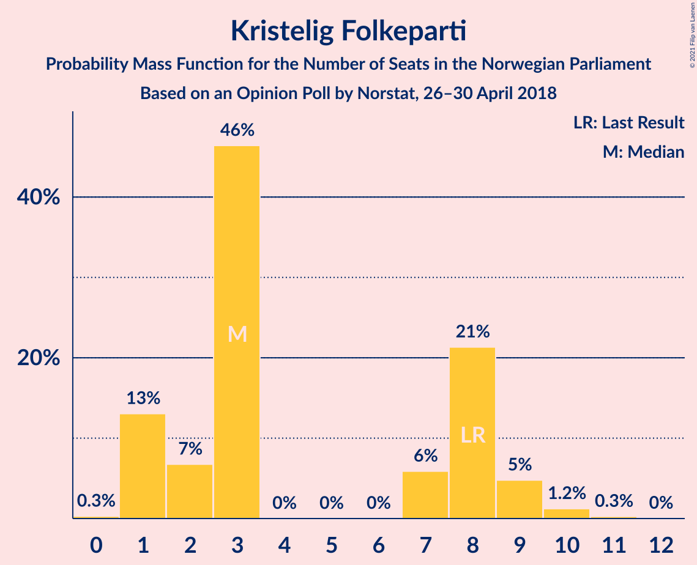
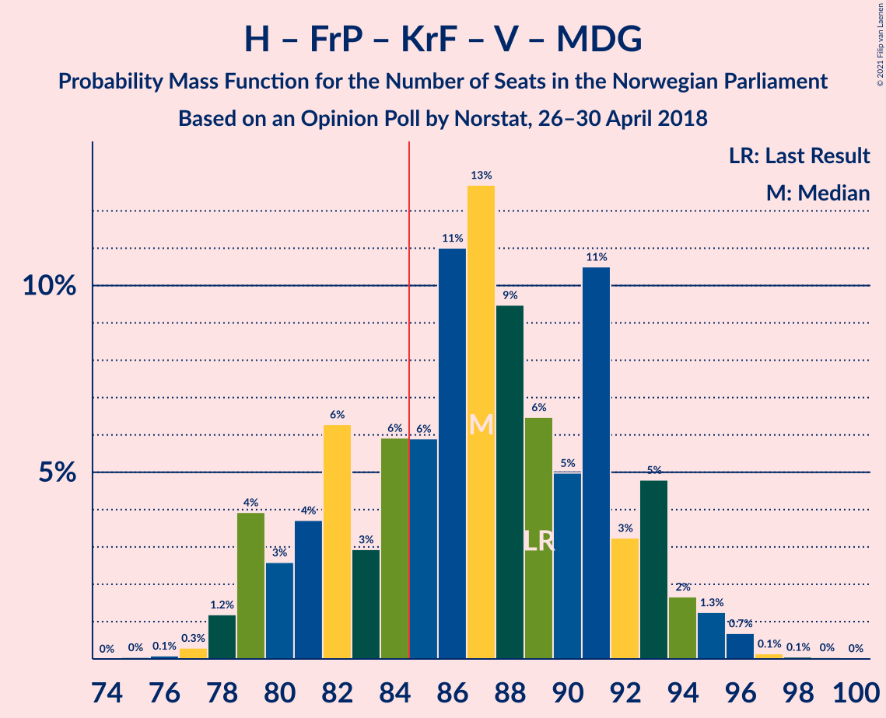
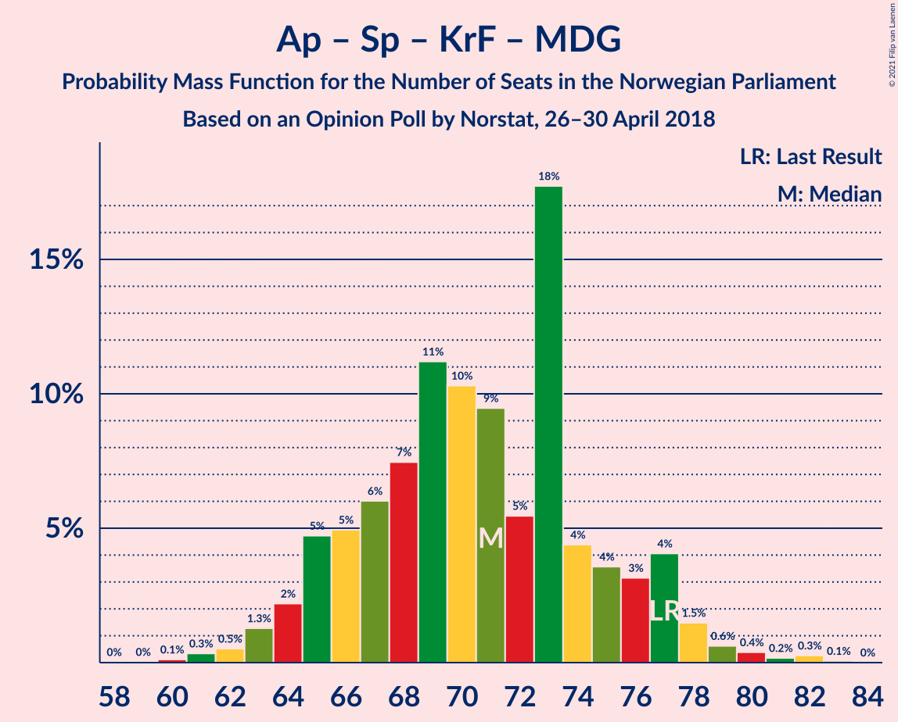

# Opinion Poll by Norstat, 26–30 April 2018

<a href="#voting-intentions">Voting Intentions</a> | <a href="#seats">Seats</a> | <a href="#coalitions">Coalitions</a> | <a href="#technical-information">Technical Information</a>

## Voting Intentions

### Confidence Intervals

| Party | Last Result | Poll Result | 80% Confidence Interval | 90% Confidence Interval | 95% Confidence Interval | 99% Confidence Interval |
|:-----:|:-----------:|:-----------:|:-----------------------:|:-----------------------:|:-----------------------:|:-----------------------:|
| Høyre | 25.0% | 26.4% | 24.6–28.3% |24.1–28.8% |23.6–29.3% |22.8–30.2% |
| Arbeiderpartiet | 27.4% | 24.0% | 22.3–25.9% |21.8–26.4% |21.4–26.9% |20.6–27.8% |
| Fremskrittspartiet | 15.2% | 15.3% | 13.9–16.9% |13.5–17.4% |13.2–17.8% |12.5–18.6% |
| Senterpartiet | 10.3% | 10.9% | 9.7–12.3% |9.4–12.8% |9.1–13.1% |8.5–13.8% |
| Sosialistisk Venstreparti | 6.0% | 6.8% | 5.8–7.9% |5.5–8.3% |5.3–8.6% |4.9–9.1% |
| Rødt | 2.4% | 4.0% | 3.2–4.9% |3.0–5.2% |2.9–5.4% |2.6–5.9% |
| Venstre | 4.4% | 3.6% | 3.0–4.6% |2.8–4.8% |2.6–5.1% |2.3–5.5% |
| Kristelig Folkeparti | 4.2% | 3.6% | 3.0–4.6% |2.8–4.8% |2.6–5.1% |2.3–5.5% |
| Miljøpartiet De Grønne | 3.2% | 2.9% | 2.3–3.7% |2.1–4.0% |2.0–4.2% |1.7–4.6% |

*Note:* The poll result column reflects the actual value used in the calculations. Published results may vary slightly, and in addition be rounded to fewer digits.

## Seats

### Confidence Intervals

| Party | Last Result | Median | 80% Confidence Interval | 90% Confidence Interval | 95% Confidence Interval | 99% Confidence Interval |
|:-----:|:-----------:|:------:|:-----------------------:|:-----------------------:|:-----------------------:|:-----------------------:|
| <a href="#høyre">Høyre</a> | 45 | 48 | 45–53 |43–53 |43–54 |41–56 |
| <a href="#arbeiderpartiet">Arbeiderpartiet</a> | 49 | 44 | 41–48 |40–49 |40–50 |38–52 |
| <a href="#fremskrittspartiet">Fremskrittspartiet</a> | 27 | 28 | 25–31 |25–32 |24–33 |23–34 |
| <a href="#senterpartiet">Senterpartiet</a> | 19 | 20 | 18–23 |17–24 |17–24 |15–25 |
| <a href="#sosialistisk-venstreparti">Sosialistisk Venstreparti</a> | 11 | 13 | 11–14 |10–15 |10–16 |9–17 |
| <a href="#rødt">Rødt</a> | 1 | 2 | 2–9 |2–9 |1–10 |1–11 |
| <a href="#venstre">Venstre</a> | 8 | 2 | 2–8 |2–9 |2–9 |1–10 |
| <a href="#kristelig-folkeparti">Kristelig Folkeparti</a> | 8 | 3 | 1–8 |1–9 |1–9 |1–10 |
| <a href="#miljøpartiet-de-grønne">Miljøpartiet De Grønne</a> | 1 | 1 | 1–2 |1–3 |1–8 |0–8 |

### Høyre

*For a full overview of the results for this party, see the [Høyre](party-høyre.html) page.*

| Number of Seats | Probability | Accumulated | Special Marks |
|:---------------:|:-----------:|:-----------:|:-------------:|
| 39 | 0% | 100% |  |
| 40 | 0.1% | 99.9% |  |
| 41 | 0.6% | 99.8% |  |
| 42 | 2% | 99.2% |  |
| 43 | 3% | 98% |  |
| 44 | 4% | 95% |  |
| 45 | 11% | 91% | Last Result |
| 46 | 9% | 80% |  |
| 47 | 11% | 72% |  |
| 48 | 11% | 61% | Median |
| 49 | 11% | 50% |  |
| 50 | 13% | 38% |  |
| 51 | 4% | 25% |  |
| 52 | 7% | 21% |  |
| 53 | 10% | 14% |  |
| 54 | 2% | 4% |  |
| 55 | 1.1% | 2% |  |
| 56 | 0.3% | 0.7% |  |
| 57 | 0.2% | 0.4% |  |
| 58 | 0.1% | 0.1% |  |
| 59 | 0% | 0.1% |  |
| 60 | 0% | 0.1% |  |
| 61 | 0% | 0% |  |

### Arbeiderpartiet

*For a full overview of the results for this party, see the [Arbeiderpartiet](party-arbeiderpartiet.html) page.*

| Number of Seats | Probability | Accumulated | Special Marks |
|:---------------:|:-----------:|:-----------:|:-------------:|
| 37 | 0.2% | 100% |  |
| 38 | 0.5% | 99.8% |  |
| 39 | 1.2% | 99.3% |  |
| 40 | 5% | 98% |  |
| 41 | 9% | 93% |  |
| 42 | 10% | 84% |  |
| 43 | 14% | 74% |  |
| 44 | 12% | 60% | Median |
| 45 | 13% | 47% |  |
| 46 | 14% | 35% |  |
| 47 | 9% | 20% |  |
| 48 | 6% | 12% |  |
| 49 | 3% | 6% | Last Result |
| 50 | 2% | 3% |  |
| 51 | 0.5% | 2% |  |
| 52 | 0.9% | 1.1% |  |
| 53 | 0.1% | 0.3% |  |
| 54 | 0.1% | 0.1% |  |
| 55 | 0% | 0% |  |

### Fremskrittspartiet

*For a full overview of the results for this party, see the [Fremskrittspartiet](party-fremskrittspartiet.html) page.*

| Number of Seats | Probability | Accumulated | Special Marks |
|:---------------:|:-----------:|:-----------:|:-------------:|
| 21 | 0.1% | 100% |  |
| 22 | 0.4% | 99.9% |  |
| 23 | 1.1% | 99.5% |  |
| 24 | 2% | 98% |  |
| 25 | 7% | 96% |  |
| 26 | 10% | 90% |  |
| 27 | 19% | 80% | Last Result |
| 28 | 16% | 61% | Median |
| 29 | 22% | 45% |  |
| 30 | 9% | 24% |  |
| 31 | 7% | 15% |  |
| 32 | 4% | 8% |  |
| 33 | 2% | 4% |  |
| 34 | 2% | 2% |  |
| 35 | 0.3% | 0.5% |  |
| 36 | 0.1% | 0.2% |  |
| 37 | 0% | 0% |  |

### Senterpartiet

*For a full overview of the results for this party, see the [Senterpartiet](party-senterpartiet.html) page.*

| Number of Seats | Probability | Accumulated | Special Marks |
|:---------------:|:-----------:|:-----------:|:-------------:|
| 14 | 0.1% | 100% |  |
| 15 | 0.4% | 99.9% |  |
| 16 | 1.3% | 99.5% |  |
| 17 | 6% | 98% |  |
| 18 | 17% | 92% |  |
| 19 | 17% | 76% | Last Result |
| 20 | 15% | 58% | Median |
| 21 | 13% | 44% |  |
| 22 | 18% | 31% |  |
| 23 | 5% | 13% |  |
| 24 | 6% | 8% |  |
| 25 | 1.5% | 2% |  |
| 26 | 0.3% | 0.5% |  |
| 27 | 0.1% | 0.2% |  |
| 28 | 0.1% | 0.1% |  |
| 29 | 0% | 0% |  |

### Sosialistisk Venstreparti

*For a full overview of the results for this party, see the [Sosialistisk Venstreparti](party-sosialistiskvenstreparti.html) page.*

| Number of Seats | Probability | Accumulated | Special Marks |
|:---------------:|:-----------:|:-----------:|:-------------:|
| 8 | 0.3% | 100% |  |
| 9 | 1.3% | 99.7% |  |
| 10 | 8% | 98% |  |
| 11 | 16% | 90% | Last Result |
| 12 | 23% | 75% |  |
| 13 | 24% | 52% | Median |
| 14 | 18% | 28% |  |
| 15 | 7% | 10% |  |
| 16 | 2% | 3% |  |
| 17 | 0.8% | 1.1% |  |
| 18 | 0.2% | 0.3% |  |
| 19 | 0% | 0% |  |

### Rødt

*For a full overview of the results for this party, see the [Rødt](party-rødt.html) page.*

| Number of Seats | Probability | Accumulated | Special Marks |
|:---------------:|:-----------:|:-----------:|:-------------:|
| 1 | 3% | 100% | Last Result |
| 2 | 49% | 97% | Median |
| 3 | 0% | 48% |  |
| 4 | 0% | 48% |  |
| 5 | 0% | 48% |  |
| 6 | 0.1% | 48% |  |
| 7 | 8% | 47% |  |
| 8 | 23% | 39% |  |
| 9 | 11% | 16% |  |
| 10 | 3% | 4% |  |
| 11 | 1.2% | 1.3% |  |
| 12 | 0.1% | 0.1% |  |
| 13 | 0% | 0% |  |

### Venstre

*For a full overview of the results for this party, see the [Venstre](party-venstre.html) page.*

| Number of Seats | Probability | Accumulated | Special Marks |
|:---------------:|:-----------:|:-----------:|:-------------:|
| 1 | 0.8% | 100% |  |
| 2 | 62% | 99.2% | Median |
| 3 | 5% | 38% |  |
| 4 | 0.3% | 33% |  |
| 5 | 0% | 33% |  |
| 6 | 0.1% | 33% |  |
| 7 | 7% | 32% |  |
| 8 | 17% | 26% | Last Result |
| 9 | 7% | 9% |  |
| 10 | 1.2% | 1.3% |  |
| 11 | 0.1% | 0.2% |  |
| 12 | 0% | 0% |  |

### Kristelig Folkeparti

*For a full overview of the results for this party, see the [Kristelig Folkeparti](party-kristeligfolkeparti.html) page.*

| Number of Seats | Probability | Accumulated | Special Marks |
|:---------------:|:-----------:|:-----------:|:-------------:|
| 0 | 0.3% | 100% |  |
| 1 | 13% | 99.7% |  |
| 2 | 7% | 87% |  |
| 3 | 46% | 80% | Median |
| 4 | 0% | 34% |  |
| 5 | 0% | 34% |  |
| 6 | 0% | 34% |  |
| 7 | 6% | 33% |  |
| 8 | 21% | 28% | Last Result |
| 9 | 5% | 6% |  |
| 10 | 1.2% | 2% |  |
| 11 | 0.3% | 0.3% |  |
| 12 | 0% | 0% |  |

### Miljøpartiet De Grønne

*For a full overview of the results for this party, see the [Miljøpartiet De Grønne](party-miljøpartietdegrønne.html) page.*

| Number of Seats | Probability | Accumulated | Special Marks |
|:---------------:|:-----------:|:-----------:|:-------------:|
| 0 | 2% | 100% |  |
| 1 | 50% | 98% | Last Result, Median |
| 2 | 40% | 48% |  |
| 3 | 4% | 8% |  |
| 4 | 0.1% | 4% |  |
| 5 | 0% | 4% |  |
| 6 | 0% | 4% |  |
| 7 | 1.0% | 4% |  |
| 8 | 3% | 3% |  |
| 9 | 0.3% | 0.3% |  |
| 10 | 0% | 0% |  |

## Coalitions

### Confidence Intervals

| Coalition | Last Result | Median | Majority? | 80% Confidence Interval | 90% Confidence Interval | 95% Confidence Interval | 99% Confidence Interval |
|:---------:|:-----------:|:------:|:---------:|:-----------------------:|:-----------------------:|:-----------------------:|:-----------------------:|
| Høyre – Fremskrittspartiet – Senterpartiet – Kristelig Folkeparti – Venstre | 107 | 106 | 100% | 99–110 | 98–111 | 97–112 | 96–114 |
| Høyre – Fremskrittspartiet – Kristelig Folkeparti – Venstre – Miljøpartiet De Grønne | 89 | 87 | 73% | 81–92 | 79–93 | 79–94 | 78–96 |
| Høyre – Fremskrittspartiet – Kristelig Folkeparti – Venstre | 88 | 85 | 61% | 79–90 | 78–91 | 77–93 | 76–94 |
| Arbeiderpartiet – Senterpartiet – Sosialistisk Venstreparti – Rødt – Miljøpartiet De Grønne | 81 | 84 | 39% | 78–90 | 78–91 | 76–92 | 75–93 |
| Arbeiderpartiet – Senterpartiet – Sosialistisk Venstreparti – Kristelig Folkeparti – Miljøpartiet De Grønne | 88 | 83 | 38% | 78–88 | 77–90 | 76–90 | 74–93 |
| Arbeiderpartiet – Senterpartiet – Sosialistisk Venstreparti – Rødt | 80 | 82 | 26% | 77–88 | 76–90 | 75–90 | 73–91 |
| Høyre – Fremskrittspartiet – Venstre | 80 | 81 | 16% | 76–86 | 74–87 | 73–89 | 71–91 |
| Arbeiderpartiet – Senterpartiet – Sosialistisk Venstreparti – Miljøpartiet De Grønne | 80 | 79 | 5% | 74–84 | 73–85 | 71–86 | 70–88 |
| Arbeiderpartiet – Senterpartiet – Sosialistisk Venstreparti | 79 | 77 | 3% | 73–82 | 71–83 | 70–85 | 69–87 |
| Høyre – Fremskrittspartiet | 72 | 77 | 1.5% | 72–81 | 71–82 | 70–83 | 68–86 |
| Arbeiderpartiet – Senterpartiet – Kristelig Folkeparti – Miljøpartiet De Grønne | 77 | 71 | 0% | 66–76 | 65–77 | 64–78 | 61–81 |
| Arbeiderpartiet – Senterpartiet – Kristelig Folkeparti | 76 | 69 | 0% | 64–74 | 63–75 | 62–76 | 60–78 |
| Arbeiderpartiet – Senterpartiet | 68 | 64 | 0% | 60–69 | 60–69 | 59–71 | 57–73 |
| Høyre – Kristelig Folkeparti – Venstre | 61 | 57 | 0% | 51–62 | 50–63 | 50–64 | 47–67 |
| Arbeiderpartiet – Sosialistisk Venstreparti | 60 | 57 | 0% | 53–61 | 52–62 | 51–63 | 50–66 |
| Senterpartiet – Kristelig Folkeparti – Venstre | 35 | 28 | 0% | 24–34 | 23–35 | 22–36 | 21–38 |

### Høyre – Fremskrittspartiet – Senterpartiet – Kristelig Folkeparti – Venstre

| Number of Seats | Probability | Accumulated | Special Marks |
|:---------------:|:-----------:|:-----------:|:-------------:|
| 93 | 0% | 100% |  |
| 94 | 0.1% | 99.9% |  |
| 95 | 0.1% | 99.8% |  |
| 96 | 0.5% | 99.7% |  |
| 97 | 3% | 99.1% |  |
| 98 | 3% | 96% |  |
| 99 | 6% | 93% |  |
| 100 | 4% | 87% |  |
| 101 | 2% | 84% | Median |
| 102 | 5% | 81% |  |
| 103 | 5% | 76% |  |
| 104 | 6% | 71% |  |
| 105 | 9% | 65% |  |
| 106 | 6% | 55% |  |
| 107 | 19% | 50% | Last Result |
| 108 | 10% | 30% |  |
| 109 | 9% | 21% |  |
| 110 | 3% | 11% |  |
| 111 | 5% | 8% |  |
| 112 | 2% | 3% |  |
| 113 | 1.2% | 2% |  |
| 114 | 0.5% | 0.8% |  |
| 115 | 0.2% | 0.3% |  |
| 116 | 0.1% | 0.2% |  |
| 117 | 0% | 0.1% |  |
| 118 | 0% | 0% |  |

### Høyre – Fremskrittspartiet – Kristelig Folkeparti – Venstre – Miljøpartiet De Grønne

| Number of Seats | Probability | Accumulated | Special Marks |
|:---------------:|:-----------:|:-----------:|:-------------:|
| 75 | 0% | 100% |  |
| 76 | 0.1% | 99.9% |  |
| 77 | 0.3% | 99.8% |  |
| 78 | 1.2% | 99.6% |  |
| 79 | 4% | 98% |  |
| 80 | 3% | 94% |  |
| 81 | 4% | 92% |  |
| 82 | 6% | 88% | Median |
| 83 | 3% | 82% |  |
| 84 | 6% | 79% |  |
| 85 | 6% | 73% | Majority |
| 86 | 11% | 67% |  |
| 87 | 13% | 56% |  |
| 88 | 9% | 43% |  |
| 89 | 6% | 34% | Last Result |
| 90 | 5% | 27% |  |
| 91 | 11% | 22% |  |
| 92 | 3% | 12% |  |
| 93 | 5% | 9% |  |
| 94 | 2% | 4% |  |
| 95 | 1.3% | 2% |  |
| 96 | 0.7% | 1.0% |  |
| 97 | 0.1% | 0.3% |  |
| 98 | 0.1% | 0.1% |  |
| 99 | 0% | 0.1% |  |
| 100 | 0% | 0% |  |

### Høyre – Fremskrittspartiet – Kristelig Folkeparti – Venstre

| Number of Seats | Probability | Accumulated | Special Marks |
|:---------------:|:-----------:|:-----------:|:-------------:|
| 73 | 0% | 100% |  |
| 74 | 0.2% | 99.9% |  |
| 75 | 0.2% | 99.8% |  |
| 76 | 0.7% | 99.6% |  |
| 77 | 3% | 98.8% |  |
| 78 | 3% | 96% |  |
| 79 | 4% | 93% |  |
| 80 | 5% | 89% |  |
| 81 | 5% | 84% | Median |
| 82 | 5% | 80% |  |
| 83 | 6% | 75% |  |
| 84 | 8% | 69% |  |
| 85 | 16% | 61% | Majority |
| 86 | 8% | 45% |  |
| 87 | 8% | 37% |  |
| 88 | 6% | 29% | Last Result |
| 89 | 9% | 23% |  |
| 90 | 4% | 14% |  |
| 91 | 5% | 10% |  |
| 92 | 2% | 5% |  |
| 93 | 2% | 3% |  |
| 94 | 0.9% | 1.3% |  |
| 95 | 0.1% | 0.4% |  |
| 96 | 0.1% | 0.2% |  |
| 97 | 0% | 0.1% |  |
| 98 | 0% | 0% |  |

### Arbeiderpartiet – Senterpartiet – Sosialistisk Venstreparti – Rødt – Miljøpartiet De Grønne

| Number of Seats | Probability | Accumulated | Special Marks |
|:---------------:|:-----------:|:-----------:|:-------------:|
| 72 | 0% | 100% |  |
| 73 | 0.1% | 99.9% |  |
| 74 | 0.2% | 99.8% |  |
| 75 | 1.0% | 99.6% |  |
| 76 | 2% | 98.6% |  |
| 77 | 2% | 97% |  |
| 78 | 5% | 95% |  |
| 79 | 5% | 90% |  |
| 80 | 9% | 85% | Median |
| 81 | 6% | 77% | Last Result |
| 82 | 8% | 70% |  |
| 83 | 8% | 62% |  |
| 84 | 16% | 54% |  |
| 85 | 8% | 39% | Majority |
| 86 | 6% | 30% |  |
| 87 | 5% | 25% |  |
| 88 | 4% | 20% |  |
| 89 | 5% | 16% |  |
| 90 | 4% | 11% |  |
| 91 | 3% | 7% |  |
| 92 | 3% | 4% |  |
| 93 | 0.7% | 1.1% |  |
| 94 | 0.2% | 0.4% |  |
| 95 | 0.2% | 0.2% |  |
| 96 | 0% | 0.1% |  |
| 97 | 0% | 0% |  |

### Arbeiderpartiet – Senterpartiet – Sosialistisk Venstreparti – Kristelig Folkeparti – Miljøpartiet De Grønne

| Number of Seats | Probability | Accumulated | Special Marks |
|:---------------:|:-----------:|:-----------:|:-------------:|
| 72 | 0.2% | 100% |  |
| 73 | 0.2% | 99.8% |  |
| 74 | 0.6% | 99.6% |  |
| 75 | 1.4% | 99.0% |  |
| 76 | 2% | 98% |  |
| 77 | 3% | 96% |  |
| 78 | 4% | 93% |  |
| 79 | 6% | 89% |  |
| 80 | 7% | 83% |  |
| 81 | 7% | 76% | Median |
| 82 | 10% | 69% |  |
| 83 | 13% | 59% |  |
| 84 | 9% | 46% |  |
| 85 | 9% | 38% | Majority |
| 86 | 11% | 29% |  |
| 87 | 6% | 18% |  |
| 88 | 4% | 12% | Last Result |
| 89 | 4% | 9% |  |
| 90 | 3% | 5% |  |
| 91 | 0.6% | 2% |  |
| 92 | 0.7% | 1.5% |  |
| 93 | 0.3% | 0.7% |  |
| 94 | 0.2% | 0.4% |  |
| 95 | 0.2% | 0.2% |  |
| 96 | 0% | 0.1% |  |
| 97 | 0% | 0% |  |

### Arbeiderpartiet – Senterpartiet – Sosialistisk Venstreparti – Rødt

| Number of Seats | Probability | Accumulated | Special Marks |
|:---------------:|:-----------:|:-----------:|:-------------:|
| 70 | 0% | 100% |  |
| 71 | 0.1% | 99.9% |  |
| 72 | 0.2% | 99.9% |  |
| 73 | 0.7% | 99.7% |  |
| 74 | 1.4% | 99.0% |  |
| 75 | 2% | 98% |  |
| 76 | 5% | 96% |  |
| 77 | 3% | 91% |  |
| 78 | 11% | 88% |  |
| 79 | 5% | 77% | Median |
| 80 | 7% | 72% | Last Result |
| 81 | 9% | 65% |  |
| 82 | 13% | 56% |  |
| 83 | 11% | 43% |  |
| 84 | 6% | 32% |  |
| 85 | 6% | 26% | Majority |
| 86 | 3% | 21% |  |
| 87 | 6% | 18% |  |
| 88 | 4% | 12% |  |
| 89 | 3% | 8% |  |
| 90 | 4% | 6% |  |
| 91 | 1.2% | 2% |  |
| 92 | 0.3% | 0.4% |  |
| 93 | 0.1% | 0.1% |  |
| 94 | 0% | 0.1% |  |
| 95 | 0% | 0% |  |

### Høyre – Fremskrittspartiet – Venstre

| Number of Seats | Probability | Accumulated | Special Marks |
|:---------------:|:-----------:|:-----------:|:-------------:|
| 69 | 0.1% | 100% |  |
| 70 | 0.3% | 99.8% |  |
| 71 | 0.5% | 99.6% |  |
| 72 | 0.7% | 99.1% |  |
| 73 | 1.3% | 98% |  |
| 74 | 3% | 97% |  |
| 75 | 2% | 94% |  |
| 76 | 4% | 91% |  |
| 77 | 8% | 87% |  |
| 78 | 8% | 79% | Median |
| 79 | 9% | 71% |  |
| 80 | 7% | 62% | Last Result |
| 81 | 14% | 55% |  |
| 82 | 10% | 41% |  |
| 83 | 7% | 31% |  |
| 84 | 8% | 23% |  |
| 85 | 5% | 16% | Majority |
| 86 | 3% | 11% |  |
| 87 | 4% | 9% |  |
| 88 | 1.5% | 4% |  |
| 89 | 1.0% | 3% |  |
| 90 | 1.4% | 2% |  |
| 91 | 0.3% | 0.5% |  |
| 92 | 0.2% | 0.3% |  |
| 93 | 0% | 0.1% |  |
| 94 | 0% | 0% |  |

### Arbeiderpartiet – Senterpartiet – Sosialistisk Venstreparti – Miljøpartiet De Grønne

| Number of Seats | Probability | Accumulated | Special Marks |
|:---------------:|:-----------:|:-----------:|:-------------:|
| 68 | 0.1% | 100% |  |
| 69 | 0.1% | 99.9% |  |
| 70 | 0.6% | 99.8% |  |
| 71 | 2% | 99.2% |  |
| 72 | 0.9% | 97% |  |
| 73 | 4% | 96% |  |
| 74 | 5% | 93% |  |
| 75 | 8% | 88% |  |
| 76 | 8% | 80% |  |
| 77 | 7% | 71% |  |
| 78 | 14% | 64% | Median |
| 79 | 6% | 51% |  |
| 80 | 8% | 45% | Last Result |
| 81 | 8% | 36% |  |
| 82 | 13% | 28% |  |
| 83 | 5% | 15% |  |
| 84 | 5% | 10% |  |
| 85 | 2% | 5% | Majority |
| 86 | 1.2% | 3% |  |
| 87 | 1.0% | 2% |  |
| 88 | 0.7% | 1.1% |  |
| 89 | 0.3% | 0.4% |  |
| 90 | 0.1% | 0.2% |  |
| 91 | 0% | 0.1% |  |
| 92 | 0% | 0% |  |

### Arbeiderpartiet – Senterpartiet – Sosialistisk Venstreparti

| Number of Seats | Probability | Accumulated | Special Marks |
|:---------------:|:-----------:|:-----------:|:-------------:|
| 67 | 0.1% | 100% |  |
| 68 | 0.3% | 99.9% |  |
| 69 | 1.0% | 99.5% |  |
| 70 | 2% | 98.5% |  |
| 71 | 3% | 97% |  |
| 72 | 4% | 94% |  |
| 73 | 6% | 90% |  |
| 74 | 10% | 84% |  |
| 75 | 7% | 74% |  |
| 76 | 14% | 67% |  |
| 77 | 7% | 53% | Median |
| 78 | 7% | 46% |  |
| 79 | 9% | 39% | Last Result |
| 80 | 13% | 30% |  |
| 81 | 5% | 17% |  |
| 82 | 7% | 12% |  |
| 83 | 2% | 5% |  |
| 84 | 0.7% | 3% |  |
| 85 | 1.1% | 3% | Majority |
| 86 | 0.8% | 1.4% |  |
| 87 | 0.5% | 0.6% |  |
| 88 | 0.1% | 0.1% |  |
| 89 | 0% | 0.1% |  |
| 90 | 0% | 0% |  |

### Høyre – Fremskrittspartiet

| Number of Seats | Probability | Accumulated | Special Marks |
|:---------------:|:-----------:|:-----------:|:-------------:|
| 66 | 0% | 100% |  |
| 67 | 0.3% | 99.9% |  |
| 68 | 0.5% | 99.6% |  |
| 69 | 0.9% | 99.1% |  |
| 70 | 3% | 98% |  |
| 71 | 3% | 95% |  |
| 72 | 6% | 92% | Last Result |
| 73 | 7% | 86% |  |
| 74 | 8% | 79% |  |
| 75 | 9% | 71% |  |
| 76 | 9% | 62% | Median |
| 77 | 9% | 53% |  |
| 78 | 8% | 44% |  |
| 79 | 13% | 36% |  |
| 80 | 9% | 23% |  |
| 81 | 6% | 15% |  |
| 82 | 5% | 9% |  |
| 83 | 2% | 4% |  |
| 84 | 0.7% | 2% |  |
| 85 | 0.9% | 1.5% | Majority |
| 86 | 0.2% | 0.6% |  |
| 87 | 0.1% | 0.4% |  |
| 88 | 0.2% | 0.3% |  |
| 89 | 0.1% | 0.1% |  |
| 90 | 0% | 0% |  |

### Arbeiderpartiet – Senterpartiet – Kristelig Folkeparti – Miljøpartiet De Grønne

| Number of Seats | Probability | Accumulated | Special Marks |
|:---------------:|:-----------:|:-----------:|:-------------:|
| 59 | 0% | 100% |  |
| 60 | 0.1% | 99.9% |  |
| 61 | 0.3% | 99.8% |  |
| 62 | 0.5% | 99.5% |  |
| 63 | 1.3% | 99.0% |  |
| 64 | 2% | 98% |  |
| 65 | 5% | 95% |  |
| 66 | 5% | 91% |  |
| 67 | 6% | 86% |  |
| 68 | 7% | 80% | Median |
| 69 | 11% | 72% |  |
| 70 | 10% | 61% |  |
| 71 | 9% | 51% |  |
| 72 | 5% | 41% |  |
| 73 | 18% | 36% |  |
| 74 | 4% | 18% |  |
| 75 | 4% | 14% |  |
| 76 | 3% | 10% |  |
| 77 | 4% | 7% | Last Result |
| 78 | 1.5% | 3% |  |
| 79 | 0.6% | 2% |  |
| 80 | 0.4% | 0.9% |  |
| 81 | 0.2% | 0.5% |  |
| 82 | 0.3% | 0.3% |  |
| 83 | 0.1% | 0.1% |  |
| 84 | 0% | 0% |  |

### Arbeiderpartiet – Senterpartiet – Kristelig Folkeparti

| Number of Seats | Probability | Accumulated | Special Marks |
|:---------------:|:-----------:|:-----------:|:-------------:|
| 58 | 0% | 100% |  |
| 59 | 0.2% | 99.9% |  |
| 60 | 0.5% | 99.8% |  |
| 61 | 1.1% | 99.3% |  |
| 62 | 1.2% | 98% |  |
| 63 | 4% | 97% |  |
| 64 | 6% | 93% |  |
| 65 | 4% | 87% |  |
| 66 | 7% | 82% |  |
| 67 | 10% | 76% | Median |
| 68 | 11% | 65% |  |
| 69 | 9% | 54% |  |
| 70 | 7% | 45% |  |
| 71 | 18% | 37% |  |
| 72 | 6% | 20% |  |
| 73 | 4% | 14% |  |
| 74 | 4% | 10% |  |
| 75 | 2% | 6% |  |
| 76 | 3% | 5% | Last Result |
| 77 | 1.0% | 2% |  |
| 78 | 0.3% | 0.7% |  |
| 79 | 0.1% | 0.4% |  |
| 80 | 0.2% | 0.3% |  |
| 81 | 0.1% | 0.1% |  |
| 82 | 0% | 0% |  |

### Arbeiderpartiet – Senterpartiet

| Number of Seats | Probability | Accumulated | Special Marks |
|:---------------:|:-----------:|:-----------:|:-------------:|
| 55 | 0.1% | 100% |  |
| 56 | 0.2% | 99.9% |  |
| 57 | 0.8% | 99.7% |  |
| 58 | 1.4% | 98.9% |  |
| 59 | 2% | 98% |  |
| 60 | 6% | 96% |  |
| 61 | 11% | 90% |  |
| 62 | 6% | 79% |  |
| 63 | 11% | 72% |  |
| 64 | 14% | 61% | Median |
| 65 | 10% | 47% |  |
| 66 | 7% | 37% |  |
| 67 | 4% | 30% |  |
| 68 | 16% | 27% | Last Result |
| 69 | 6% | 11% |  |
| 70 | 2% | 5% |  |
| 71 | 0.4% | 3% |  |
| 72 | 0.6% | 2% |  |
| 73 | 1.0% | 2% |  |
| 74 | 0.4% | 0.5% |  |
| 75 | 0% | 0.1% |  |
| 76 | 0% | 0% |  |

### Høyre – Kristelig Folkeparti – Venstre

| Number of Seats | Probability | Accumulated | Special Marks |
|:---------------:|:-----------:|:-----------:|:-------------:|
| 45 | 0% | 100% |  |
| 46 | 0.2% | 99.9% |  |
| 47 | 0.4% | 99.8% |  |
| 48 | 0.3% | 99.4% |  |
| 49 | 1.4% | 99.1% |  |
| 50 | 6% | 98% |  |
| 51 | 2% | 92% |  |
| 52 | 6% | 90% |  |
| 53 | 5% | 84% | Median |
| 54 | 8% | 79% |  |
| 55 | 9% | 71% |  |
| 56 | 8% | 62% |  |
| 57 | 10% | 55% |  |
| 58 | 10% | 45% |  |
| 59 | 7% | 35% |  |
| 60 | 8% | 28% |  |
| 61 | 7% | 21% | Last Result |
| 62 | 6% | 14% |  |
| 63 | 3% | 8% |  |
| 64 | 2% | 4% |  |
| 65 | 0.9% | 2% |  |
| 66 | 0.6% | 1.3% |  |
| 67 | 0.5% | 0.7% |  |
| 68 | 0.1% | 0.2% |  |
| 69 | 0% | 0.1% |  |
| 70 | 0% | 0% |  |

### Arbeiderpartiet – Sosialistisk Venstreparti

| Number of Seats | Probability | Accumulated | Special Marks |
|:---------------:|:-----------:|:-----------:|:-------------:|
| 48 | 0.1% | 100% |  |
| 49 | 0.2% | 99.9% |  |
| 50 | 1.0% | 99.7% |  |
| 51 | 2% | 98.7% |  |
| 52 | 6% | 97% |  |
| 53 | 6% | 91% |  |
| 54 | 7% | 84% |  |
| 55 | 12% | 77% |  |
| 56 | 8% | 65% |  |
| 57 | 10% | 57% | Median |
| 58 | 19% | 47% |  |
| 59 | 10% | 29% |  |
| 60 | 5% | 19% | Last Result |
| 61 | 7% | 14% |  |
| 62 | 3% | 7% |  |
| 63 | 1.3% | 3% |  |
| 64 | 0.7% | 2% |  |
| 65 | 0.5% | 1.4% |  |
| 66 | 0.8% | 0.9% |  |
| 67 | 0.1% | 0.1% |  |
| 68 | 0% | 0% |  |

### Senterpartiet – Kristelig Folkeparti – Venstre

| Number of Seats | Probability | Accumulated | Special Marks |
|:---------------:|:-----------:|:-----------:|:-------------:|
| 19 | 0.1% | 100% |  |
| 20 | 0.3% | 99.9% |  |
| 21 | 0.8% | 99.6% |  |
| 22 | 2% | 98.7% |  |
| 23 | 5% | 97% |  |
| 24 | 5% | 92% |  |
| 25 | 9% | 87% | Median |
| 26 | 6% | 78% |  |
| 27 | 11% | 72% |  |
| 28 | 13% | 61% |  |
| 29 | 11% | 48% |  |
| 30 | 8% | 37% |  |
| 31 | 8% | 29% |  |
| 32 | 5% | 21% |  |
| 33 | 5% | 16% |  |
| 34 | 4% | 11% |  |
| 35 | 3% | 7% | Last Result |
| 36 | 2% | 4% |  |
| 37 | 1.0% | 2% |  |
| 38 | 0.7% | 1.1% |  |
| 39 | 0.2% | 0.4% |  |
| 40 | 0.2% | 0.2% |  |
| 41 | 0% | 0% |  |

## Technical Information

### Opinion Poll

+ **Polling firm:** Norstat
+ **Commissioner(s):** —
+ **Fieldwork period:** 26–30 April 2018

### Calculations

+ **Sample size:** 933
+ **Simulations done:** 1,048,576
+ **Error estimate:** 1.68%

