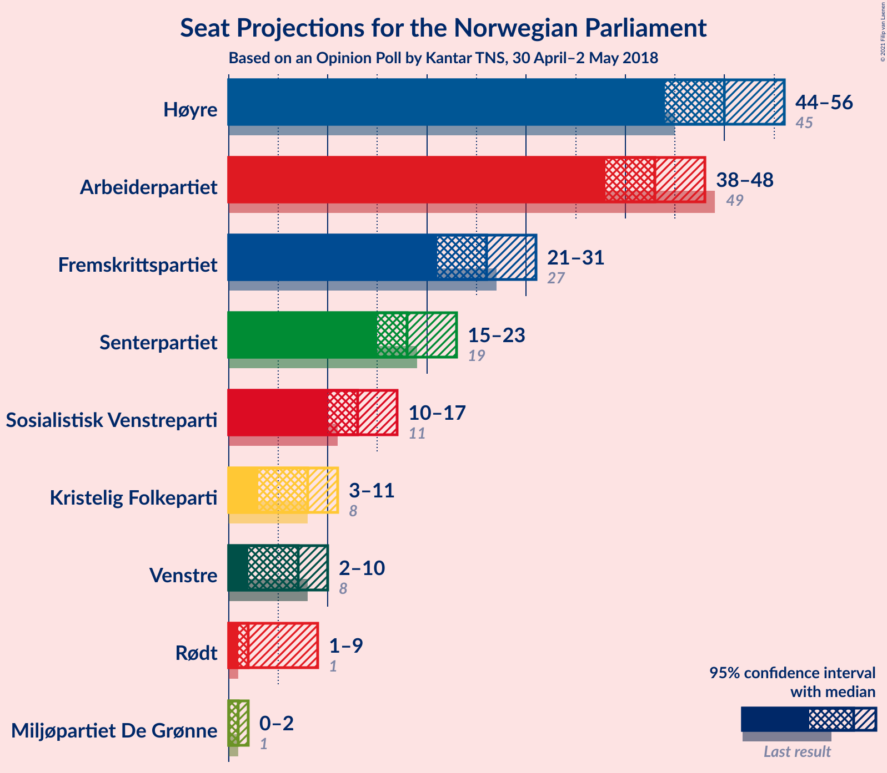
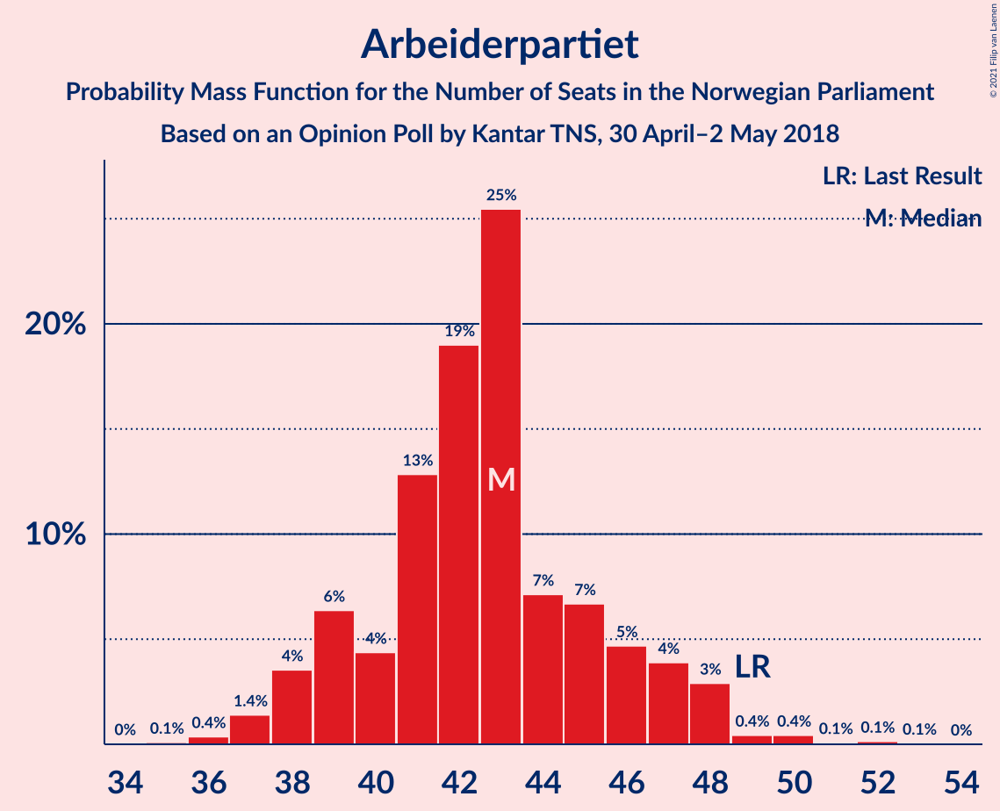
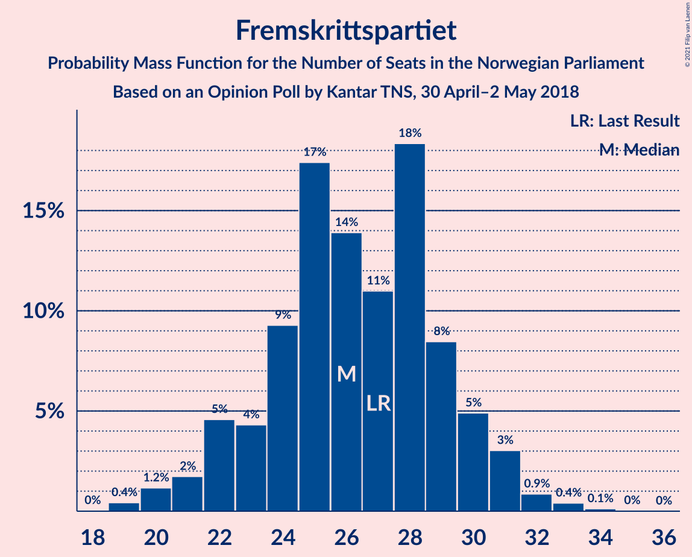
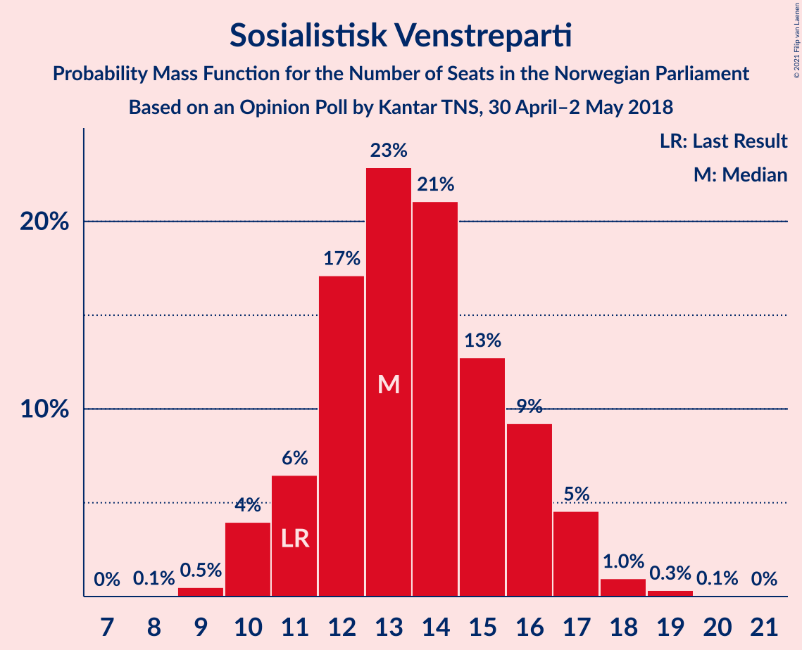
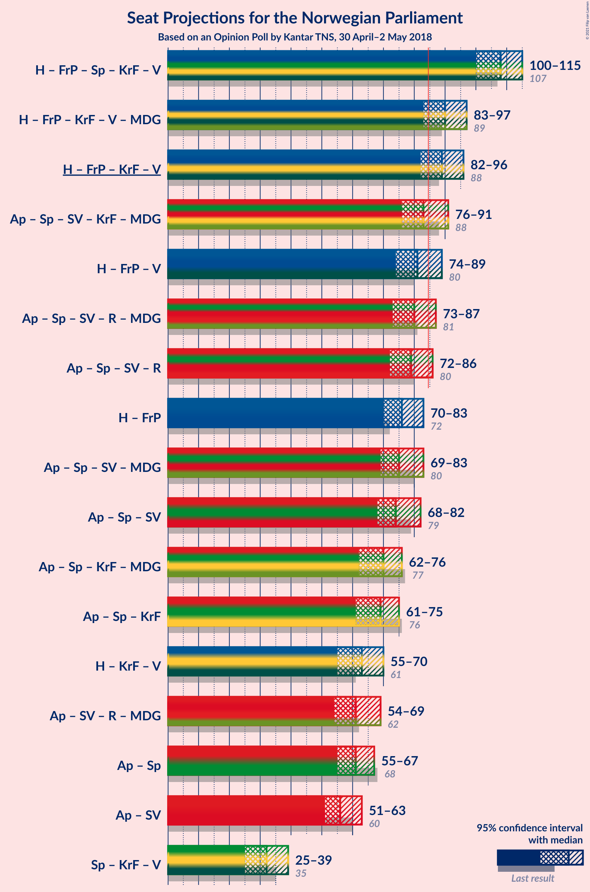
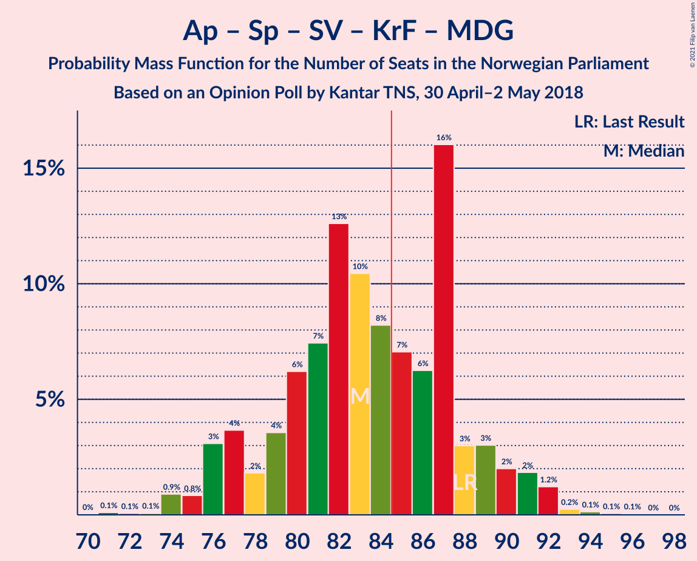
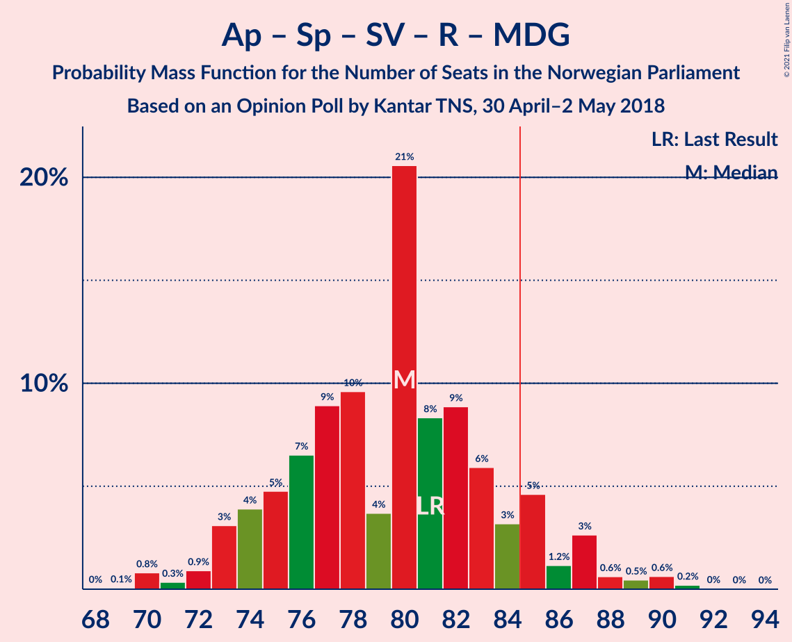
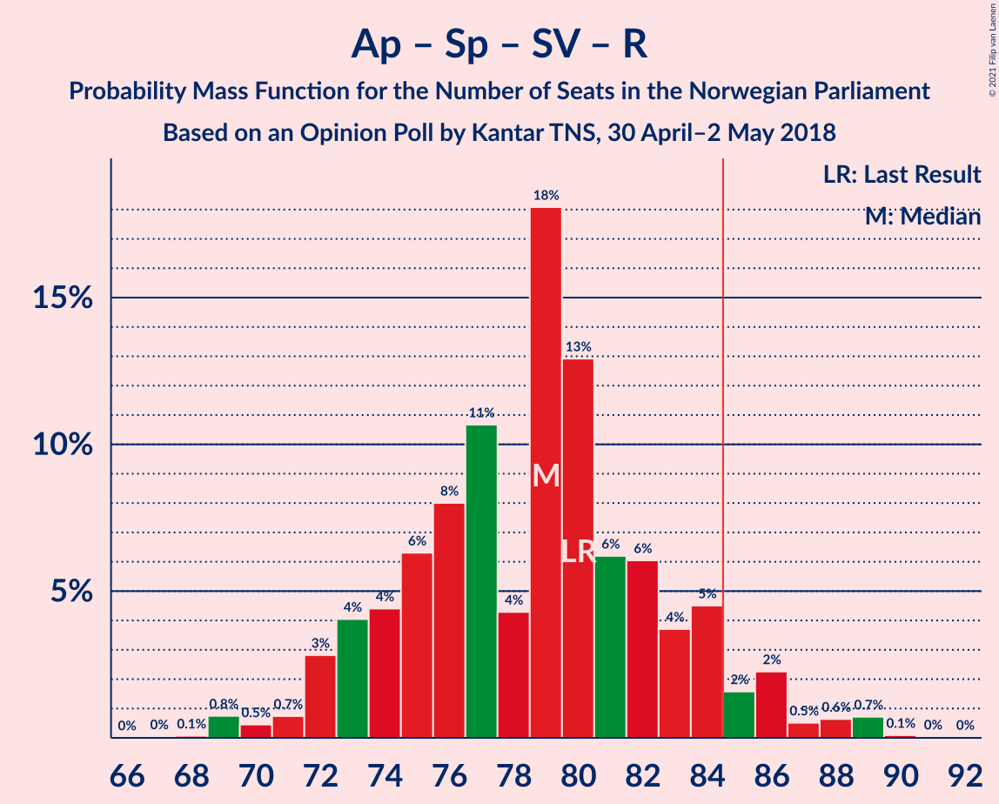
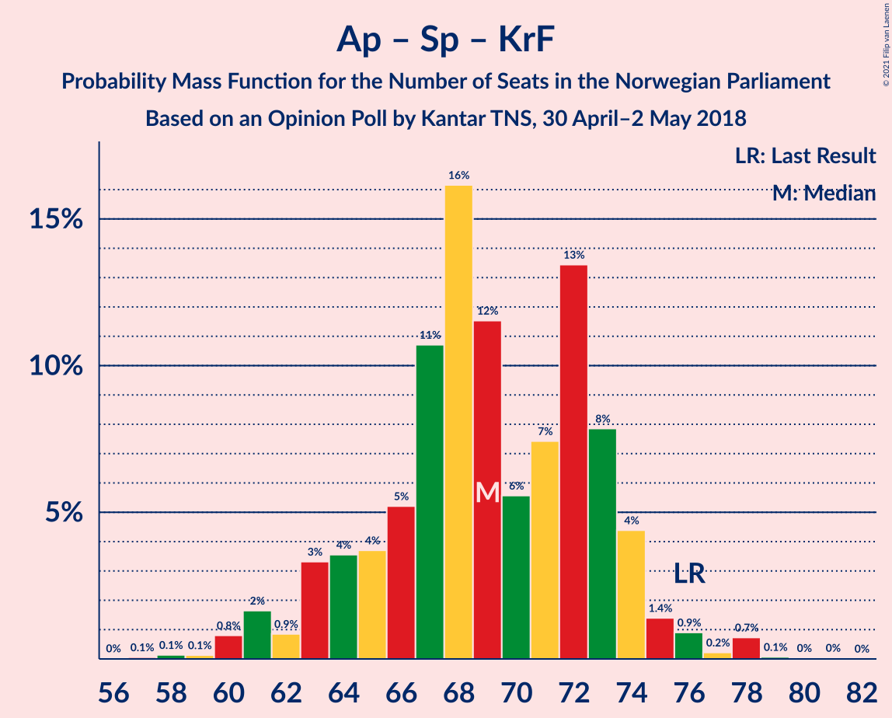

# Opinion Poll by Kantar TNS, 30 April–2 May 2018

<a href="#voting-intentions">Voting Intentions</a> | <a href="#seats">Seats</a> | <a href="#coalitions">Coalitions</a> | <a href="#technical-information">Technical Information</a>

## Voting Intentions

### Confidence Intervals

| Party | Last Result | Poll Result | 80% Confidence Interval | 90% Confidence Interval | 95% Confidence Interval | 99% Confidence Interval |
|:-----:|:-----------:|:-----------:|:-----------------------:|:-----------------------:|:-----------------------:|:-----------------------:|
| Høyre | 25.0% | 28.1% | 26.1–30.3% |25.6–30.9% |25.1–31.4% |24.1–32.4% |
| Arbeiderpartiet | 27.4% | 23.7% | 21.9–25.8% |21.3–26.4% |20.9–26.9% |20.0–27.9% |
| Fremskrittspartiet | 15.2% | 14.7% | 13.2–16.5% |12.8–16.9% |12.4–17.4% |11.7–18.3% |
| Senterpartiet | 10.3% | 10.3% | 9.0–11.9% |8.7–12.3% |8.4–12.7% |7.8–13.4% |
| Sosialistisk Venstreparti | 6.0% | 7.6% | 6.5–9.0% |6.2–9.4% |5.9–9.7% |5.5–10.4% |
| Kristelig Folkeparti | 4.2% | 4.6% | 3.8–5.8% |3.6–6.1% |3.4–6.4% |3.0–7.0% |
| Venstre | 4.4% | 4.1% | 3.3–5.2% |3.1–5.5% |2.9–5.8% |2.6–6.3% |
| Rødt | 2.4% | 3.7% | 3.0–4.8% |2.8–5.1% |2.6–5.3% |2.3–5.9% |
| Miljøpartiet De Grønne | 3.2% | 2.3% | 1.8–3.2% |1.6–3.4% |1.5–3.6% |1.2–4.1% |

*Note:* The poll result column reflects the actual value used in the calculations. Published results may vary slightly, and in addition be rounded to fewer digits.

## Seats

### Confidence Intervals

| Party | Last Result | Median | 80% Confidence Interval | 90% Confidence Interval | 95% Confidence Interval | 99% Confidence Interval |
|:-----:|:-----------:|:------:|:-----------------------:|:-----------------------:|:-----------------------:|:-----------------------:|
| <a href="#høyre">Høyre</a> | 45 | 49 | 47–55 |45–55 |44–56 |42–58 |
| <a href="#arbeiderpartiet">Arbeiderpartiet</a> | 49 | 43 | 39–46 |39–48 |38–48 |36–50 |
| <a href="#fremskrittspartiet">Fremskrittspartiet</a> | 27 | 26 | 22–29 |22–30 |21–30 |20–32 |
| <a href="#senterpartiet">Senterpartiet</a> | 19 | 19 | 16–20 |15–22 |15–23 |14–23 |
| <a href="#sosialistisk-venstreparti">Sosialistisk Venstreparti</a> | 11 | 13 | 11–16 |11–17 |11–18 |10–19 |
| <a href="#kristelig-folkeparti">Kristelig Folkeparti</a> | 8 | 8 | 3–10 |3–11 |3–11 |2–11 |
| <a href="#venstre">Venstre</a> | 8 | 2 | 2–9 |2–9 |2–9 |2–10 |
| <a href="#rødt">Rødt</a> | 1 | 2 | 1–8 |1–9 |1–9 |1–10 |
| <a href="#miljøpartiet-de-grønne">Miljøpartiet De Grønne</a> | 1 | 1 | 0–2 |0–2 |0–2 |0–3 |

### Høyre

*For a full overview of the results for this party, see the [Høyre](party-høyre.html) page.*

| Number of Seats | Probability | Accumulated | Special Marks |
|:---------------:|:-----------:|:-----------:|:-------------:|
| 41 | 0.1% | 100% |  |
| 42 | 0.8% | 99.8% |  |
| 43 | 1.1% | 99.0% |  |
| 44 | 2% | 98% |  |
| 45 | 1.1% | 96% | Last Result |
| 46 | 3% | 94% |  |
| 47 | 4% | 92% |  |
| 48 | 13% | 88% |  |
| 49 | 28% | 75% | Median |
| 50 | 11% | 48% |  |
| 51 | 8% | 36% |  |
| 52 | 11% | 28% |  |
| 53 | 5% | 17% |  |
| 54 | 2% | 12% |  |
| 55 | 8% | 11% |  |
| 56 | 2% | 3% |  |
| 57 | 0.1% | 1.0% |  |
| 58 | 0.8% | 0.9% |  |
| 59 | 0% | 0.1% |  |
| 60 | 0.1% | 0.1% |  |
| 61 | 0% | 0% |  |

### Arbeiderpartiet

*For a full overview of the results for this party, see the [Arbeiderpartiet](party-arbeiderpartiet.html) page.*

| Number of Seats | Probability | Accumulated | Special Marks |
|:---------------:|:-----------:|:-----------:|:-------------:|
| 34 | 0% | 100% |  |
| 35 | 0.1% | 99.9% |  |
| 36 | 0.8% | 99.8% |  |
| 37 | 0.4% | 99.0% |  |
| 38 | 3% | 98.6% |  |
| 39 | 14% | 96% |  |
| 40 | 2% | 81% |  |
| 41 | 9% | 79% |  |
| 42 | 16% | 70% |  |
| 43 | 22% | 54% | Median |
| 44 | 4% | 32% |  |
| 45 | 11% | 28% |  |
| 46 | 10% | 17% |  |
| 47 | 1.0% | 7% |  |
| 48 | 4% | 6% |  |
| 49 | 0.3% | 2% | Last Result |
| 50 | 1.5% | 2% |  |
| 51 | 0.1% | 0.5% |  |
| 52 | 0.4% | 0.4% |  |
| 53 | 0% | 0% |  |

### Fremskrittspartiet

*For a full overview of the results for this party, see the [Fremskrittspartiet](party-fremskrittspartiet.html) page.*

| Number of Seats | Probability | Accumulated | Special Marks |
|:---------------:|:-----------:|:-----------:|:-------------:|
| 18 | 0% | 100% |  |
| 19 | 0.1% | 99.9% |  |
| 20 | 0.6% | 99.9% |  |
| 21 | 4% | 99.3% |  |
| 22 | 7% | 96% |  |
| 23 | 0.8% | 89% |  |
| 24 | 4% | 88% |  |
| 25 | 18% | 84% |  |
| 26 | 24% | 66% | Median |
| 27 | 19% | 42% | Last Result |
| 28 | 9% | 23% |  |
| 29 | 8% | 14% |  |
| 30 | 4% | 6% |  |
| 31 | 0.4% | 2% |  |
| 32 | 0.9% | 1.1% |  |
| 33 | 0.2% | 0.3% |  |
| 34 | 0.1% | 0.1% |  |
| 35 | 0% | 0% |  |

### Senterpartiet

*For a full overview of the results for this party, see the [Senterpartiet](party-senterpartiet.html) page.*

| Number of Seats | Probability | Accumulated | Special Marks |
|:---------------:|:-----------:|:-----------:|:-------------:|
| 12 | 0.1% | 100% |  |
| 13 | 0.2% | 99.9% |  |
| 14 | 2% | 99.7% |  |
| 15 | 7% | 98% |  |
| 16 | 3% | 91% |  |
| 17 | 15% | 88% |  |
| 18 | 14% | 73% |  |
| 19 | 24% | 59% | Last Result, Median |
| 20 | 26% | 35% |  |
| 21 | 2% | 9% |  |
| 22 | 3% | 7% |  |
| 23 | 3% | 3% |  |
| 24 | 0% | 0.1% |  |
| 25 | 0.1% | 0.1% |  |
| 26 | 0% | 0% |  |

### Sosialistisk Venstreparti

*For a full overview of the results for this party, see the [Sosialistisk Venstreparti](party-sosialistiskvenstreparti.html) page.*

| Number of Seats | Probability | Accumulated | Special Marks |
|:---------------:|:-----------:|:-----------:|:-------------:|
| 9 | 0.2% | 100% |  |
| 10 | 2% | 99.8% |  |
| 11 | 9% | 98% | Last Result |
| 12 | 19% | 88% |  |
| 13 | 25% | 69% | Median |
| 14 | 9% | 44% |  |
| 15 | 20% | 35% |  |
| 16 | 7% | 15% |  |
| 17 | 5% | 8% |  |
| 18 | 2% | 3% |  |
| 19 | 0.5% | 0.8% |  |
| 20 | 0.2% | 0.3% |  |
| 21 | 0.1% | 0.1% |  |
| 22 | 0% | 0% |  |

### Kristelig Folkeparti

*For a full overview of the results for this party, see the [Kristelig Folkeparti](party-kristeligfolkeparti.html) page.*

| Number of Seats | Probability | Accumulated | Special Marks |
|:---------------:|:-----------:|:-----------:|:-------------:|
| 1 | 0.1% | 100% |  |
| 2 | 0.4% | 99.9% |  |
| 3 | 10% | 99.5% |  |
| 4 | 0% | 89% |  |
| 5 | 0% | 89% |  |
| 6 | 0% | 89% |  |
| 7 | 8% | 89% |  |
| 8 | 45% | 81% | Last Result, Median |
| 9 | 13% | 36% |  |
| 10 | 14% | 22% |  |
| 11 | 8% | 8% |  |
| 12 | 0.2% | 0.2% |  |
| 13 | 0.1% | 0.1% |  |
| 14 | 0% | 0% |  |

### Venstre

*For a full overview of the results for this party, see the [Venstre](party-venstre.html) page.*

| Number of Seats | Probability | Accumulated | Special Marks |
|:---------------:|:-----------:|:-----------:|:-------------:|
| 1 | 0.1% | 100% |  |
| 2 | 53% | 99.9% | Median |
| 3 | 0.4% | 47% |  |
| 4 | 0% | 47% |  |
| 5 | 0% | 47% |  |
| 6 | 0% | 47% |  |
| 7 | 12% | 47% |  |
| 8 | 23% | 35% | Last Result |
| 9 | 10% | 12% |  |
| 10 | 1.5% | 2% |  |
| 11 | 0.4% | 0.5% |  |
| 12 | 0% | 0.1% |  |
| 13 | 0% | 0% |  |

### Rødt

*For a full overview of the results for this party, see the [Rødt](party-rødt.html) page.*

| Number of Seats | Probability | Accumulated | Special Marks |
|:---------------:|:-----------:|:-----------:|:-------------:|
| 1 | 12% | 100% | Last Result |
| 2 | 49% | 88% | Median |
| 3 | 0% | 38% |  |
| 4 | 0% | 38% |  |
| 5 | 0% | 38% |  |
| 6 | 0% | 38% |  |
| 7 | 6% | 38% |  |
| 8 | 26% | 32% |  |
| 9 | 5% | 6% |  |
| 10 | 0.9% | 1.1% |  |
| 11 | 0.2% | 0.2% |  |
| 12 | 0% | 0% |  |

### Miljøpartiet De Grønne

*For a full overview of the results for this party, see the [Miljøpartiet De Grønne](party-miljøpartietdegrønne.html) page.*

| Number of Seats | Probability | Accumulated | Special Marks |
|:---------------:|:-----------:|:-----------:|:-------------:|
| 0 | 25% | 100% |  |
| 1 | 64% | 75% | Last Result, Median |
| 2 | 10% | 11% |  |
| 3 | 0.3% | 0.7% |  |
| 4 | 0% | 0.4% |  |
| 5 | 0% | 0.4% |  |
| 6 | 0% | 0.4% |  |
| 7 | 0.3% | 0.4% |  |
| 8 | 0.1% | 0.1% |  |
| 9 | 0% | 0% |  |

## Coalitions

### Confidence Intervals

| Coalition | Last Result | Median | Majority? | 80% Confidence Interval | 90% Confidence Interval | 95% Confidence Interval | 99% Confidence Interval |
|:---------:|:-----------:|:------:|:---------:|:-----------------------:|:-----------------------:|:-----------------------:|:-----------------------:|
| Høyre – Fremskrittspartiet – Senterpartiet – Kristelig Folkeparti – Venstre | 107 | 107 | 100% | 102–114 | 102–115 | 101–115 | 100–119 |
| Høyre – Fremskrittspartiet – Kristelig Folkeparti – Venstre – Miljøpartiet De Grønne | 89 | 89 | 95% | 85–96 | 85–96 | 82–97 | 81–100 |
| Høyre – Fremskrittspartiet – Kristelig Folkeparti – Venstre | 88 | 89 | 85% | 84–95 | 84–95 | 81–96 | 80–99 |
| Arbeiderpartiet – Senterpartiet – Sosialistisk Venstreparti – Kristelig Folkeparti – Miljøpartiet De Grønne | 88 | 84 | 49% | 80–87 | 77–91 | 77–92 | 76–92 |
| Høyre – Fremskrittspartiet – Venstre | 80 | 81 | 11% | 76–85 | 75–87 | 75–90 | 73–91 |
| Arbeiderpartiet – Senterpartiet – Sosialistisk Venstreparti – Rødt – Miljøpartiet De Grønne | 81 | 80 | 15% | 74–85 | 74–85 | 73–88 | 70–89 |
| Arbeiderpartiet – Senterpartiet – Sosialistisk Venstreparti – Rødt | 80 | 80 | 5% | 73–84 | 73–84 | 72–87 | 69–88 |
| Arbeiderpartiet – Senterpartiet – Sosialistisk Venstreparti – Miljøpartiet De Grønne | 80 | 76 | 2% | 72–81 | 70–83 | 70–84 | 68–87 |
| Arbeiderpartiet – Senterpartiet – Sosialistisk Venstreparti | 79 | 74 | 2% | 71–80 | 69–82 | 69–83 | 67–86 |
| Høyre – Fremskrittspartiet | 72 | 76 | 0.3% | 72–80 | 70–82 | 70–82 | 66–84 |
| Arbeiderpartiet – Senterpartiet – Kristelig Folkeparti – Miljøpartiet De Grønne | 77 | 70 | 0% | 66–74 | 64–75 | 63–76 | 63–79 |
| Arbeiderpartiet – Senterpartiet – Kristelig Folkeparti | 76 | 69 | 0% | 65–73 | 63–75 | 63–75 | 61–78 |
| Arbeiderpartiet – Senterpartiet | 68 | 61 | 0% | 57–65 | 57–67 | 56–69 | 54–71 |
| Høyre – Kristelig Folkeparti – Venstre | 61 | 64 | 0% | 58–68 | 55–68 | 53–68 | 53–72 |
| Arbeiderpartiet – Sosialistisk Venstreparti | 60 | 57 | 0% | 52–61 | 51–63 | 51–63 | 47–65 |
| Senterpartiet – Kristelig Folkeparti – Venstre | 35 | 30 | 0% | 28–37 | 26–39 | 25–39 | 24–39 |

### Høyre – Fremskrittspartiet – Senterpartiet – Kristelig Folkeparti – Venstre

| Number of Seats | Probability | Accumulated | Special Marks |
|:---------------:|:-----------:|:-----------:|:-------------:|
| 97 | 0% | 100% |  |
| 98 | 0.1% | 99.9% |  |
| 99 | 0.2% | 99.8% |  |
| 100 | 2% | 99.6% |  |
| 101 | 0.6% | 98% |  |
| 102 | 8% | 97% |  |
| 103 | 8% | 89% |  |
| 104 | 3% | 81% | Median |
| 105 | 9% | 78% |  |
| 106 | 12% | 69% |  |
| 107 | 12% | 57% | Last Result |
| 108 | 8% | 45% |  |
| 109 | 8% | 38% |  |
| 110 | 4% | 29% |  |
| 111 | 10% | 26% |  |
| 112 | 1.3% | 15% |  |
| 113 | 4% | 14% |  |
| 114 | 2% | 10% |  |
| 115 | 7% | 8% |  |
| 116 | 0.5% | 2% |  |
| 117 | 0.4% | 1.0% |  |
| 118 | 0.1% | 0.6% |  |
| 119 | 0.5% | 0.5% |  |
| 120 | 0% | 0% |  |

### Høyre – Fremskrittspartiet – Kristelig Folkeparti – Venstre – Miljøpartiet De Grønne

| Number of Seats | Probability | Accumulated | Special Marks |
|:---------------:|:-----------:|:-----------:|:-------------:|
| 79 | 0% | 100% |  |
| 80 | 0.2% | 99.9% |  |
| 81 | 2% | 99.8% |  |
| 82 | 0.3% | 98% |  |
| 83 | 0.8% | 97% |  |
| 84 | 1.2% | 97% |  |
| 85 | 13% | 95% | Majority |
| 86 | 6% | 83% | Median |
| 87 | 6% | 77% |  |
| 88 | 3% | 71% |  |
| 89 | 21% | 68% | Last Result |
| 90 | 10% | 47% |  |
| 91 | 3% | 37% |  |
| 92 | 8% | 34% |  |
| 93 | 8% | 26% |  |
| 94 | 1.3% | 17% |  |
| 95 | 3% | 16% |  |
| 96 | 8% | 13% |  |
| 97 | 3% | 5% |  |
| 98 | 0.2% | 2% |  |
| 99 | 0.7% | 1.5% |  |
| 100 | 0.7% | 0.8% |  |
| 101 | 0.1% | 0.1% |  |
| 102 | 0% | 0% |  |

### Høyre – Fremskrittspartiet – Kristelig Folkeparti – Venstre

| Number of Seats | Probability | Accumulated | Special Marks |
|:---------------:|:-----------:|:-----------:|:-------------:|
| 78 | 0.1% | 100% |  |
| 79 | 0.2% | 99.9% |  |
| 80 | 2% | 99.7% |  |
| 81 | 0.4% | 98% |  |
| 82 | 1.0% | 97% |  |
| 83 | 0.8% | 96% |  |
| 84 | 11% | 95% |  |
| 85 | 3% | 85% | Median, Majority |
| 86 | 11% | 82% |  |
| 87 | 3% | 71% |  |
| 88 | 12% | 68% | Last Result |
| 89 | 17% | 56% |  |
| 90 | 5% | 39% |  |
| 91 | 12% | 34% |  |
| 92 | 2% | 21% |  |
| 93 | 4% | 20% |  |
| 94 | 4% | 16% |  |
| 95 | 9% | 12% |  |
| 96 | 1.0% | 3% |  |
| 97 | 0.1% | 2% |  |
| 98 | 0.5% | 1.5% |  |
| 99 | 0.9% | 1.0% |  |
| 100 | 0.1% | 0.1% |  |
| 101 | 0% | 0% |  |

### Arbeiderpartiet – Senterpartiet – Sosialistisk Venstreparti – Kristelig Folkeparti – Miljøpartiet De Grønne

| Number of Seats | Probability | Accumulated | Special Marks |
|:---------------:|:-----------:|:-----------:|:-------------:|
| 72 | 0.1% | 100% |  |
| 73 | 0.1% | 99.9% |  |
| 74 | 0.1% | 99.8% |  |
| 75 | 0.1% | 99.8% |  |
| 76 | 0.9% | 99.7% |  |
| 77 | 4% | 98.8% |  |
| 78 | 3% | 95% |  |
| 79 | 1.1% | 92% |  |
| 80 | 14% | 91% |  |
| 81 | 4% | 77% |  |
| 82 | 2% | 73% |  |
| 83 | 17% | 71% |  |
| 84 | 4% | 53% | Median |
| 85 | 19% | 49% | Majority |
| 86 | 4% | 31% |  |
| 87 | 16% | 26% |  |
| 88 | 1.4% | 10% | Last Result |
| 89 | 0.4% | 9% |  |
| 90 | 3% | 8% |  |
| 91 | 1.1% | 5% |  |
| 92 | 4% | 4% |  |
| 93 | 0.2% | 0.5% |  |
| 94 | 0.1% | 0.2% |  |
| 95 | 0% | 0.1% |  |
| 96 | 0% | 0.1% |  |
| 97 | 0% | 0% |  |

### Høyre – Fremskrittspartiet – Venstre

| Number of Seats | Probability | Accumulated | Special Marks |
|:---------------:|:-----------:|:-----------:|:-------------:|
| 69 | 0% | 100% |  |
| 70 | 0% | 99.9% |  |
| 71 | 0.1% | 99.9% |  |
| 72 | 0.2% | 99.8% |  |
| 73 | 0.2% | 99.7% |  |
| 74 | 0.9% | 99.5% |  |
| 75 | 5% | 98.5% |  |
| 76 | 8% | 94% |  |
| 77 | 8% | 86% | Median |
| 78 | 5% | 78% |  |
| 79 | 1.2% | 72% |  |
| 80 | 11% | 71% | Last Result |
| 81 | 22% | 60% |  |
| 82 | 10% | 38% |  |
| 83 | 4% | 28% |  |
| 84 | 12% | 23% |  |
| 85 | 2% | 11% | Majority |
| 86 | 1.3% | 10% |  |
| 87 | 3% | 8% |  |
| 88 | 0.5% | 5% |  |
| 89 | 0.4% | 4% |  |
| 90 | 3% | 4% |  |
| 91 | 0.7% | 0.8% |  |
| 92 | 0.1% | 0.1% |  |
| 93 | 0% | 0.1% |  |
| 94 | 0% | 0% |  |

### Arbeiderpartiet – Senterpartiet – Sosialistisk Venstreparti – Rødt – Miljøpartiet De Grønne

| Number of Seats | Probability | Accumulated | Special Marks |
|:---------------:|:-----------:|:-----------:|:-------------:|
| 69 | 0.1% | 100% |  |
| 70 | 0.9% | 99.9% |  |
| 71 | 0.5% | 99.0% |  |
| 72 | 0.1% | 98.5% |  |
| 73 | 1.0% | 98% |  |
| 74 | 9% | 97% |  |
| 75 | 4% | 88% |  |
| 76 | 4% | 84% |  |
| 77 | 2% | 80% |  |
| 78 | 12% | 79% | Median |
| 79 | 5% | 66% |  |
| 80 | 17% | 61% |  |
| 81 | 12% | 44% | Last Result |
| 82 | 3% | 32% |  |
| 83 | 11% | 29% |  |
| 84 | 3% | 18% |  |
| 85 | 11% | 15% | Majority |
| 86 | 0.8% | 5% |  |
| 87 | 1.0% | 4% |  |
| 88 | 0.4% | 3% |  |
| 89 | 2% | 2% |  |
| 90 | 0.2% | 0.3% |  |
| 91 | 0.1% | 0.1% |  |
| 92 | 0% | 0% |  |

### Arbeiderpartiet – Senterpartiet – Sosialistisk Venstreparti – Rødt

| Number of Seats | Probability | Accumulated | Special Marks |
|:---------------:|:-----------:|:-----------:|:-------------:|
| 68 | 0.1% | 100% |  |
| 69 | 0.7% | 99.9% |  |
| 70 | 0.7% | 99.2% |  |
| 71 | 0.2% | 98.5% |  |
| 72 | 3% | 98% |  |
| 73 | 8% | 95% |  |
| 74 | 3% | 87% |  |
| 75 | 1.3% | 84% |  |
| 76 | 8% | 83% |  |
| 77 | 8% | 74% | Median |
| 78 | 3% | 66% |  |
| 79 | 10% | 63% |  |
| 80 | 21% | 53% | Last Result |
| 81 | 3% | 32% |  |
| 82 | 6% | 29% |  |
| 83 | 6% | 23% |  |
| 84 | 13% | 17% |  |
| 85 | 1.2% | 5% | Majority |
| 86 | 0.8% | 3% |  |
| 87 | 0.3% | 3% |  |
| 88 | 2% | 2% |  |
| 89 | 0.2% | 0.2% |  |
| 90 | 0% | 0.1% |  |
| 91 | 0% | 0% |  |

### Arbeiderpartiet – Senterpartiet – Sosialistisk Venstreparti – Miljøpartiet De Grønne

| Number of Seats | Probability | Accumulated | Special Marks |
|:---------------:|:-----------:|:-----------:|:-------------:|
| 65 | 0% | 100% |  |
| 66 | 0% | 99.9% |  |
| 67 | 0.3% | 99.9% |  |
| 68 | 0.8% | 99.7% |  |
| 69 | 0.9% | 98.9% |  |
| 70 | 3% | 98% |  |
| 71 | 0.8% | 95% |  |
| 72 | 20% | 94% |  |
| 73 | 6% | 74% |  |
| 74 | 7% | 68% |  |
| 75 | 7% | 61% |  |
| 76 | 9% | 54% | Median |
| 77 | 16% | 45% |  |
| 78 | 6% | 29% |  |
| 79 | 10% | 23% |  |
| 80 | 3% | 13% | Last Result |
| 81 | 1.1% | 10% |  |
| 82 | 3% | 9% |  |
| 83 | 4% | 6% |  |
| 84 | 0.3% | 3% |  |
| 85 | 0.1% | 2% | Majority |
| 86 | 0.1% | 2% |  |
| 87 | 2% | 2% |  |
| 88 | 0.1% | 0.2% |  |
| 89 | 0% | 0% |  |

### Arbeiderpartiet – Senterpartiet – Sosialistisk Venstreparti

| Number of Seats | Probability | Accumulated | Special Marks |
|:---------------:|:-----------:|:-----------:|:-------------:|
| 63 | 0% | 100% |  |
| 64 | 0% | 99.9% |  |
| 65 | 0% | 99.9% |  |
| 66 | 0.3% | 99.9% |  |
| 67 | 0.6% | 99.6% |  |
| 68 | 0.9% | 99.0% |  |
| 69 | 3% | 98% |  |
| 70 | 3% | 95% |  |
| 71 | 14% | 92% |  |
| 72 | 10% | 78% |  |
| 73 | 3% | 67% |  |
| 74 | 15% | 64% |  |
| 75 | 0.6% | 50% | Median |
| 76 | 19% | 49% |  |
| 77 | 3% | 31% |  |
| 78 | 15% | 27% |  |
| 79 | 2% | 12% | Last Result |
| 80 | 0.7% | 10% |  |
| 81 | 1.3% | 9% |  |
| 82 | 5% | 8% |  |
| 83 | 0.4% | 3% |  |
| 84 | 0.1% | 2% |  |
| 85 | 0.1% | 2% | Majority |
| 86 | 2% | 2% |  |
| 87 | 0.1% | 0.2% |  |
| 88 | 0% | 0% |  |

### Høyre – Fremskrittspartiet

| Number of Seats | Probability | Accumulated | Special Marks |
|:---------------:|:-----------:|:-----------:|:-------------:|
| 63 | 0.1% | 100% |  |
| 64 | 0.1% | 99.9% |  |
| 65 | 0% | 99.8% |  |
| 66 | 0.4% | 99.8% |  |
| 67 | 0.3% | 99.4% |  |
| 68 | 0.3% | 99.1% |  |
| 69 | 0.8% | 98.7% |  |
| 70 | 4% | 98% |  |
| 71 | 1.2% | 94% |  |
| 72 | 8% | 93% | Last Result |
| 73 | 5% | 85% |  |
| 74 | 17% | 81% |  |
| 75 | 10% | 63% | Median |
| 76 | 11% | 54% |  |
| 77 | 4% | 43% |  |
| 78 | 12% | 39% |  |
| 79 | 11% | 27% |  |
| 80 | 7% | 16% |  |
| 81 | 3% | 9% |  |
| 82 | 3% | 6% |  |
| 83 | 1.3% | 2% |  |
| 84 | 0.7% | 0.9% |  |
| 85 | 0.1% | 0.3% | Majority |
| 86 | 0.1% | 0.2% |  |
| 87 | 0% | 0.1% |  |
| 88 | 0% | 0% |  |

### Arbeiderpartiet – Senterpartiet – Kristelig Folkeparti – Miljøpartiet De Grønne

| Number of Seats | Probability | Accumulated | Special Marks |
|:---------------:|:-----------:|:-----------:|:-------------:|
| 58 | 0% | 100% |  |
| 59 | 0% | 99.9% |  |
| 60 | 0.2% | 99.9% |  |
| 61 | 0.1% | 99.8% |  |
| 62 | 0.1% | 99.7% |  |
| 63 | 4% | 99.5% |  |
| 64 | 0.7% | 95% |  |
| 65 | 3% | 95% |  |
| 66 | 4% | 92% |  |
| 67 | 3% | 88% |  |
| 68 | 12% | 85% |  |
| 69 | 19% | 72% |  |
| 70 | 11% | 53% |  |
| 71 | 8% | 42% | Median |
| 72 | 3% | 34% |  |
| 73 | 7% | 31% |  |
| 74 | 15% | 24% |  |
| 75 | 6% | 9% |  |
| 76 | 1.0% | 3% |  |
| 77 | 0.8% | 2% | Last Result |
| 78 | 0.3% | 2% |  |
| 79 | 1.2% | 1.4% |  |
| 80 | 0.1% | 0.2% |  |
| 81 | 0% | 0.1% |  |
| 82 | 0.1% | 0.1% |  |
| 83 | 0% | 0% |  |

### Arbeiderpartiet – Senterpartiet – Kristelig Folkeparti

| Number of Seats | Probability | Accumulated | Special Marks |
|:---------------:|:-----------:|:-----------:|:-------------:|
| 56 | 0% | 100% |  |
| 57 | 0% | 99.9% |  |
| 58 | 0% | 99.9% |  |
| 59 | 0.2% | 99.9% |  |
| 60 | 0.1% | 99.7% |  |
| 61 | 0.1% | 99.6% |  |
| 62 | 1.3% | 99.5% |  |
| 63 | 3% | 98% |  |
| 64 | 3% | 95% |  |
| 65 | 5% | 92% |  |
| 66 | 2% | 86% |  |
| 67 | 10% | 84% |  |
| 68 | 14% | 74% |  |
| 69 | 17% | 60% |  |
| 70 | 8% | 42% | Median |
| 71 | 4% | 34% |  |
| 72 | 2% | 30% |  |
| 73 | 19% | 28% |  |
| 74 | 3% | 9% |  |
| 75 | 4% | 6% |  |
| 76 | 0.4% | 2% | Last Result |
| 77 | 0.1% | 2% |  |
| 78 | 1.4% | 2% |  |
| 79 | 0% | 0.2% |  |
| 80 | 0.1% | 0.2% |  |
| 81 | 0.1% | 0.1% |  |
| 82 | 0% | 0% |  |

### Arbeiderpartiet – Senterpartiet

| Number of Seats | Probability | Accumulated | Special Marks |
|:---------------:|:-----------:|:-----------:|:-------------:|
| 52 | 0.1% | 100% |  |
| 53 | 0.2% | 99.8% |  |
| 54 | 0.4% | 99.6% |  |
| 55 | 0.4% | 99.2% |  |
| 56 | 3% | 98.8% |  |
| 57 | 8% | 96% |  |
| 58 | 2% | 88% |  |
| 59 | 14% | 86% |  |
| 60 | 19% | 72% |  |
| 61 | 10% | 53% |  |
| 62 | 9% | 43% | Median |
| 63 | 9% | 34% |  |
| 64 | 8% | 26% |  |
| 65 | 11% | 18% |  |
| 66 | 1.5% | 7% |  |
| 67 | 1.2% | 5% |  |
| 68 | 0.5% | 4% | Last Result |
| 69 | 1.3% | 4% |  |
| 70 | 0.1% | 2% |  |
| 71 | 2% | 2% |  |
| 72 | 0% | 0.1% |  |
| 73 | 0.1% | 0.1% |  |
| 74 | 0% | 0% |  |

### Høyre – Kristelig Folkeparti – Venstre

| Number of Seats | Probability | Accumulated | Special Marks |
|:---------------:|:-----------:|:-----------:|:-------------:|
| 51 | 0.1% | 100% |  |
| 52 | 0.1% | 99.8% |  |
| 53 | 2% | 99.8% |  |
| 54 | 2% | 97% |  |
| 55 | 0.9% | 95% |  |
| 56 | 0.5% | 94% |  |
| 57 | 3% | 94% |  |
| 58 | 9% | 90% |  |
| 59 | 1.4% | 82% | Median |
| 60 | 9% | 80% |  |
| 61 | 8% | 72% | Last Result |
| 62 | 10% | 64% |  |
| 63 | 3% | 54% |  |
| 64 | 11% | 51% |  |
| 65 | 9% | 40% |  |
| 66 | 10% | 31% |  |
| 67 | 9% | 21% |  |
| 68 | 10% | 12% |  |
| 69 | 0.5% | 2% |  |
| 70 | 0.5% | 2% |  |
| 71 | 0.5% | 1.5% |  |
| 72 | 0.7% | 1.0% |  |
| 73 | 0% | 0.4% |  |
| 74 | 0.1% | 0.3% |  |
| 75 | 0.3% | 0.3% |  |
| 76 | 0% | 0% |  |

### Arbeiderpartiet – Sosialistisk Venstreparti

| Number of Seats | Probability | Accumulated | Special Marks |
|:---------------:|:-----------:|:-----------:|:-------------:|
| 47 | 0.6% | 100% |  |
| 48 | 0.1% | 99.4% |  |
| 49 | 0.3% | 99.3% |  |
| 50 | 1.1% | 99.0% |  |
| 51 | 7% | 98% |  |
| 52 | 4% | 90% |  |
| 53 | 8% | 86% |  |
| 54 | 13% | 78% |  |
| 55 | 4% | 65% |  |
| 56 | 10% | 61% | Median |
| 57 | 9% | 51% |  |
| 58 | 15% | 41% |  |
| 59 | 12% | 26% |  |
| 60 | 4% | 14% | Last Result |
| 61 | 2% | 10% |  |
| 62 | 3% | 8% |  |
| 63 | 4% | 5% |  |
| 64 | 0.6% | 1.2% |  |
| 65 | 0.4% | 0.6% |  |
| 66 | 0.2% | 0.2% |  |
| 67 | 0.1% | 0.1% |  |
| 68 | 0% | 0% |  |

### Senterpartiet – Kristelig Folkeparti – Venstre

| Number of Seats | Probability | Accumulated | Special Marks |
|:---------------:|:-----------:|:-----------:|:-------------:|
| 19 | 0.1% | 100% |  |
| 20 | 0.1% | 99.9% |  |
| 21 | 0.1% | 99.8% |  |
| 22 | 0.1% | 99.7% |  |
| 23 | 0.2% | 99.7% |  |
| 24 | 2% | 99.5% |  |
| 25 | 0.7% | 98% |  |
| 26 | 3% | 97% |  |
| 27 | 3% | 94% |  |
| 28 | 12% | 91% |  |
| 29 | 20% | 79% | Median |
| 30 | 12% | 58% |  |
| 31 | 5% | 47% |  |
| 32 | 5% | 42% |  |
| 33 | 6% | 37% |  |
| 34 | 8% | 31% |  |
| 35 | 1.5% | 23% | Last Result |
| 36 | 5% | 22% |  |
| 37 | 8% | 17% |  |
| 38 | 0.5% | 9% |  |
| 39 | 8% | 8% |  |
| 40 | 0.1% | 0.3% |  |
| 41 | 0.1% | 0.2% |  |
| 42 | 0.1% | 0.1% |  |
| 43 | 0% | 0% |  |

## Technical Information

### Opinion Poll

+ **Polling firm:** Kantar TNS
+ **Commissioner(s):** —
+ **Fieldwork period:** 30 April–2 May 2018

### Calculations

+ **Sample size:** 775
+ **Simulations done:** 131,072
+ **Error estimate:** 1.57%

