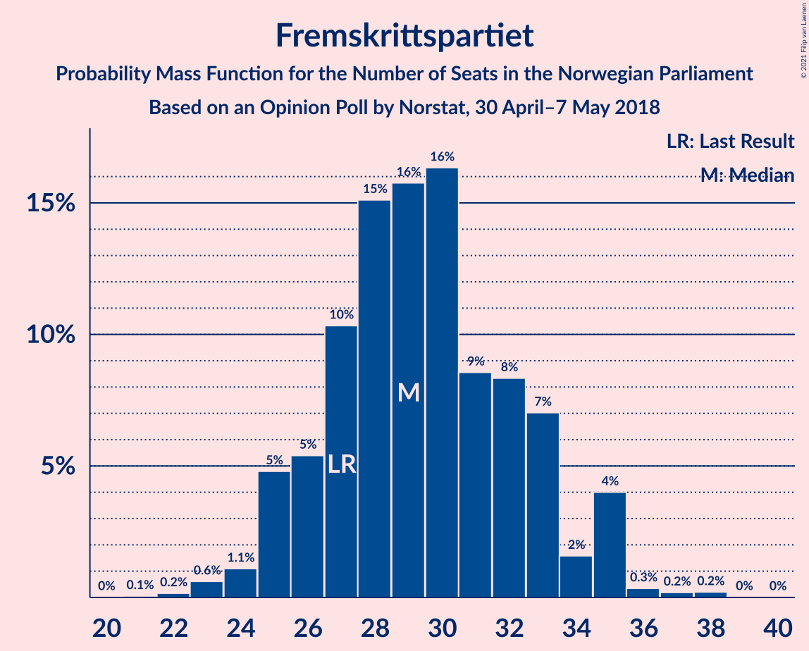
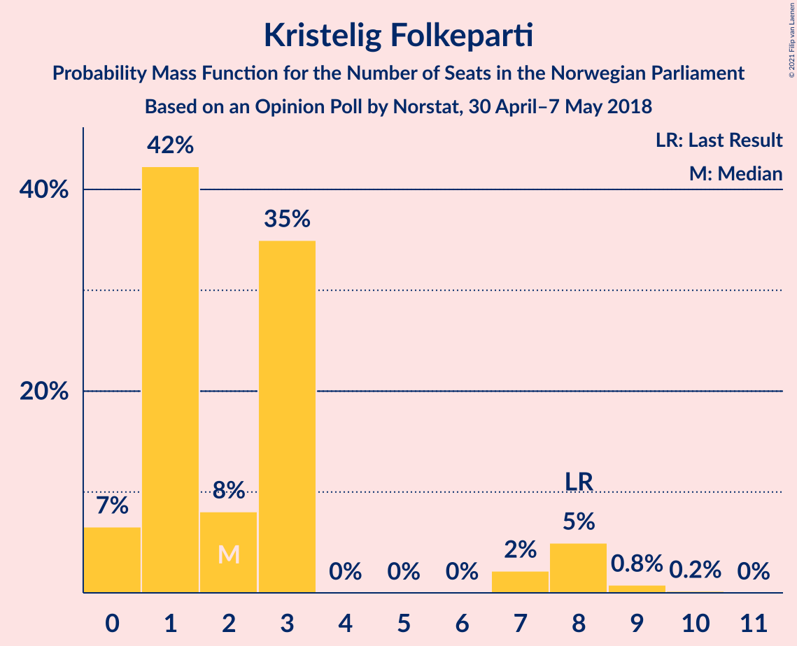
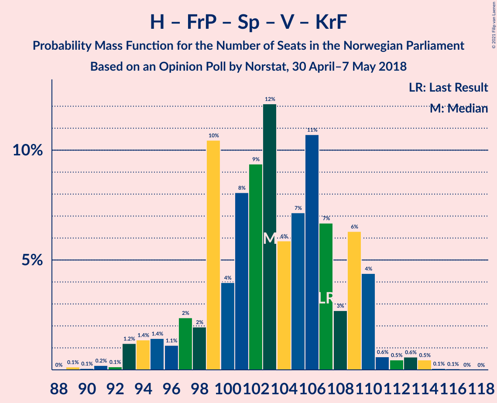
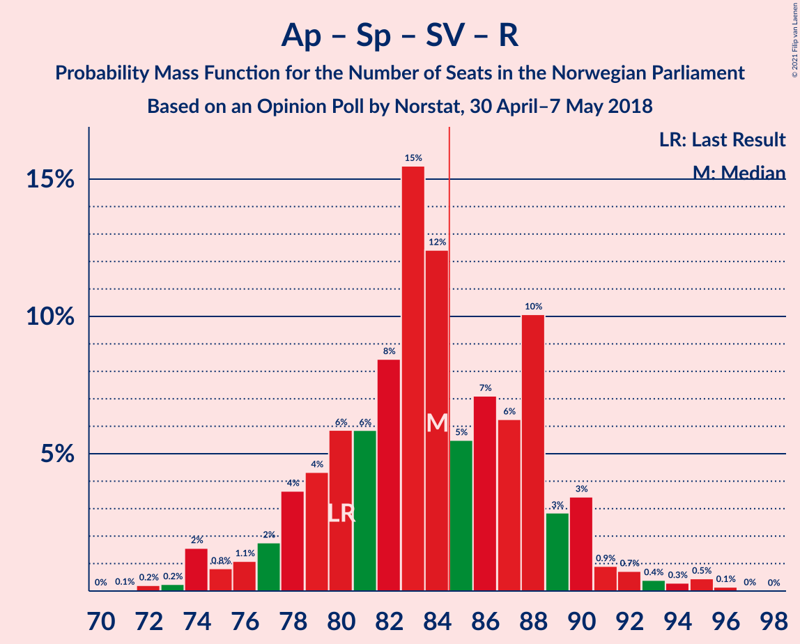
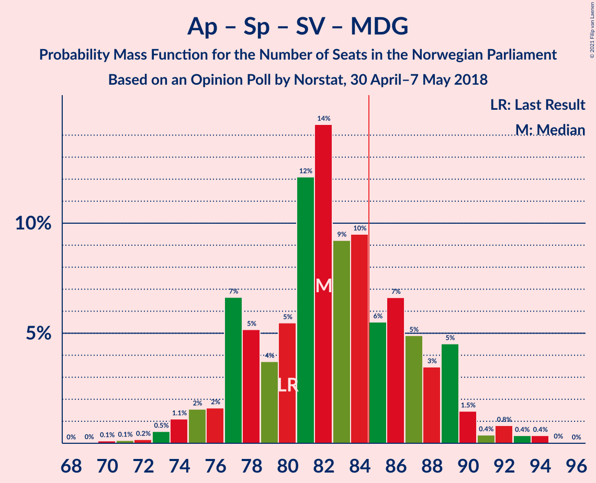
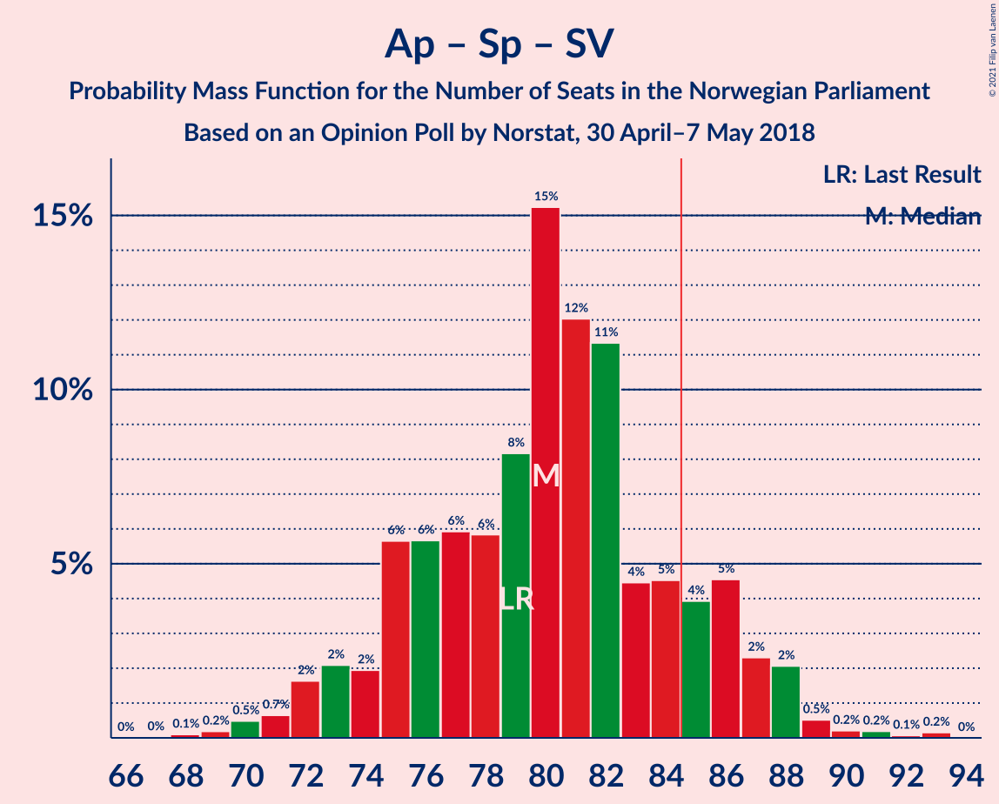
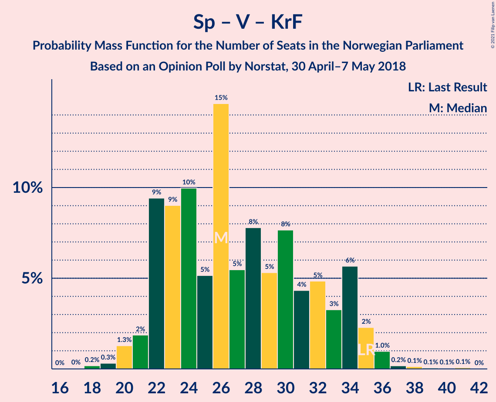

# Opinion Poll by Norstat, 30 April–7 May 2018

<a href="#voting-intentions">Voting Intentions</a> | <a href="#seats">Seats</a> | <a href="#coalitions">Coalitions</a> | <a href="#technical-information">Technical Information</a>

## Voting Intentions

### Confidence Intervals

| Party | Last Result | Poll Result | 80% Confidence Interval | 90% Confidence Interval | 95% Confidence Interval | 99% Confidence Interval |
|:-----:|:-----------:|:-----------:|:-----------------------:|:-----------------------:|:-----------------------:|:-----------------------:|
| Arbeiderpartiet | 27.4% | 26.0% | 24.0–28.2% |23.4–28.9% |22.9–29.4% |22.0–30.5% |
| Høyre | 25.0% | 25.5% | 23.4–27.7% |22.9–28.3% |22.4–28.8% |21.4–29.9% |
| Fremskrittspartiet | 15.2% | 15.9% | 14.3–17.8% |13.8–18.4% |13.4–18.8% |12.7–19.8% |
| Senterpartiet | 10.3% | 11.0% | 9.6–12.6% |9.2–13.1% |8.9–13.5% |8.2–14.3% |
| Sosialistisk Venstreparti | 6.0% | 6.5% | 5.5–7.9% |5.2–8.3% |4.9–8.6% |4.5–9.3% |
| Venstre | 4.4% | 3.8% | 3.0–4.9% |2.8–5.3% |2.7–5.5% |2.3–6.1% |
| Rødt | 2.4% | 3.6% | 2.8–4.6% |2.6–4.9% |2.4–5.2% |2.1–5.8% |
| Miljøpartiet De Grønne | 3.2% | 3.1% | 2.4–4.1% |2.2–4.4% |2.1–4.7% |1.8–5.2% |
| Kristelig Folkeparti | 4.2% | 3.0% | 2.3–4.0% |2.1–4.3% |2.0–4.5% |1.7–5.1% |

*Note:* The poll result column reflects the actual value used in the calculations. Published results may vary slightly, and in addition be rounded to fewer digits.

## Seats

### Confidence Intervals

| Party | Last Result | Median | 80% Confidence Interval | 90% Confidence Interval | 95% Confidence Interval | 99% Confidence Interval |
|:-----:|:-----------:|:------:|:-----------------------:|:-----------------------:|:-----------------------:|:-----------------------:|
| <a href="#arbeiderpartiet">Arbeiderpartiet</a> | 49 | 47 | 43–51 |42–54 |41–55 |40–55 |
| <a href="#høyre">Høyre</a> | 45 | 46 | 43–51 |42–52 |41–52 |38–54 |
| <a href="#fremskrittspartiet">Fremskrittspartiet</a> | 27 | 29 | 26–32 |25–33 |25–34 |24–35 |
| <a href="#senterpartiet">Senterpartiet</a> | 19 | 21 | 17–23 |17–23 |16–24 |15–26 |
| <a href="#sosialistisk-venstreparti">Sosialistisk Venstreparti</a> | 11 | 12 | 10–14 |9–15 |9–15 |8–17 |
| <a href="#venstre">Venstre</a> | 8 | 2 | 2–8 |2–9 |2–10 |1–11 |
| <a href="#rødt">Rødt</a> | 1 | 2 | 1–8 |1–9 |1–9 |1–10 |
| <a href="#miljøpartiet-de-grønne">Miljøpartiet De Grønne</a> | 1 | 2 | 1–8 |1–8 |1–8 |0–9 |
| <a href="#kristelig-folkeparti">Kristelig Folkeparti</a> | 8 | 3 | 0–6 |0–7 |0–8 |0–9 |

### Arbeiderpartiet

*For a full overview of the results for this party, see the [Arbeiderpartiet](party-arbeiderpartiet.html) page.*

| Number of Seats | Probability | Accumulated | Special Marks |
|:---------------:|:-----------:|:-----------:|:-------------:|
| 39 | 0.1% | 100% |  |
| 40 | 1.0% | 99.9% |  |
| 41 | 4% | 98.9% |  |
| 42 | 1.4% | 95% |  |
| 43 | 5% | 94% |  |
| 44 | 4% | 89% |  |
| 45 | 2% | 86% |  |
| 46 | 4% | 84% |  |
| 47 | 32% | 80% | Median |
| 48 | 21% | 48% |  |
| 49 | 10% | 27% | Last Result |
| 50 | 4% | 17% |  |
| 51 | 4% | 13% |  |
| 52 | 0.7% | 9% |  |
| 53 | 3% | 8% |  |
| 54 | 3% | 5% |  |
| 55 | 2% | 3% |  |
| 56 | 0.1% | 0.3% |  |
| 57 | 0% | 0.1% |  |
| 58 | 0% | 0.1% |  |
| 59 | 0% | 0.1% |  |
| 60 | 0.1% | 0.1% |  |
| 61 | 0% | 0% |  |

### Høyre

*For a full overview of the results for this party, see the [Høyre](party-høyre.html) page.*

| Number of Seats | Probability | Accumulated | Special Marks |
|:---------------:|:-----------:|:-----------:|:-------------:|
| 36 | 0.1% | 100% |  |
| 37 | 0.1% | 99.9% |  |
| 38 | 0.4% | 99.8% |  |
| 39 | 0.3% | 99.4% |  |
| 40 | 1.0% | 99.1% |  |
| 41 | 3% | 98% |  |
| 42 | 4% | 96% |  |
| 43 | 5% | 91% |  |
| 44 | 12% | 86% |  |
| 45 | 4% | 74% | Last Result |
| 46 | 31% | 70% | Median |
| 47 | 2% | 38% |  |
| 48 | 4% | 36% |  |
| 49 | 2% | 32% |  |
| 50 | 19% | 30% |  |
| 51 | 3% | 10% |  |
| 52 | 6% | 7% |  |
| 53 | 0.7% | 2% |  |
| 54 | 0.5% | 0.8% |  |
| 55 | 0.2% | 0.4% |  |
| 56 | 0.1% | 0.2% |  |
| 57 | 0% | 0.1% |  |
| 58 | 0% | 0.1% |  |
| 59 | 0% | 0% |  |

### Fremskrittspartiet

*For a full overview of the results for this party, see the [Fremskrittspartiet](party-fremskrittspartiet.html) page.*

| Number of Seats | Probability | Accumulated | Special Marks |
|:---------------:|:-----------:|:-----------:|:-------------:|
| 21 | 0.1% | 100% |  |
| 22 | 0.1% | 99.9% |  |
| 23 | 0.2% | 99.8% |  |
| 24 | 1.0% | 99.6% |  |
| 25 | 4% | 98.6% |  |
| 26 | 5% | 95% |  |
| 27 | 28% | 90% | Last Result |
| 28 | 10% | 62% |  |
| 29 | 18% | 52% | Median |
| 30 | 10% | 34% |  |
| 31 | 12% | 24% |  |
| 32 | 5% | 12% |  |
| 33 | 2% | 7% |  |
| 34 | 2% | 4% |  |
| 35 | 2% | 2% |  |
| 36 | 0% | 0.2% |  |
| 37 | 0.1% | 0.2% |  |
| 38 | 0% | 0.1% |  |
| 39 | 0% | 0% |  |

### Senterpartiet

*For a full overview of the results for this party, see the [Senterpartiet](party-senterpartiet.html) page.*

| Number of Seats | Probability | Accumulated | Special Marks |
|:---------------:|:-----------:|:-----------:|:-------------:|
| 14 | 0.2% | 100% |  |
| 15 | 2% | 99.8% |  |
| 16 | 2% | 98% |  |
| 17 | 11% | 96% |  |
| 18 | 3% | 85% |  |
| 19 | 18% | 82% | Last Result |
| 20 | 9% | 64% |  |
| 21 | 28% | 55% | Median |
| 22 | 6% | 27% |  |
| 23 | 17% | 21% |  |
| 24 | 2% | 4% |  |
| 25 | 1.4% | 2% |  |
| 26 | 0.4% | 0.5% |  |
| 27 | 0.1% | 0.2% |  |
| 28 | 0% | 0.1% |  |
| 29 | 0% | 0.1% |  |
| 30 | 0% | 0.1% |  |
| 31 | 0% | 0% |  |

### Sosialistisk Venstreparti

*For a full overview of the results for this party, see the [Sosialistisk Venstreparti](party-sosialistiskvenstreparti.html) page.*

| Number of Seats | Probability | Accumulated | Special Marks |
|:---------------:|:-----------:|:-----------:|:-------------:|
| 7 | 0% | 100% |  |
| 8 | 0.9% | 99.9% |  |
| 9 | 4% | 99.0% |  |
| 10 | 6% | 95% |  |
| 11 | 32% | 89% | Last Result |
| 12 | 7% | 56% | Median |
| 13 | 31% | 50% |  |
| 14 | 10% | 18% |  |
| 15 | 6% | 8% |  |
| 16 | 1.2% | 2% |  |
| 17 | 0.7% | 1.1% |  |
| 18 | 0.4% | 0.4% |  |
| 19 | 0% | 0.1% |  |
| 20 | 0% | 0% |  |

### Venstre

*For a full overview of the results for this party, see the [Venstre](party-venstre.html) page.*

| Number of Seats | Probability | Accumulated | Special Marks |
|:---------------:|:-----------:|:-----------:|:-------------:|
| 1 | 1.0% | 100% |  |
| 2 | 61% | 99.0% | Median |
| 3 | 2% | 38% |  |
| 4 | 0% | 36% |  |
| 5 | 0% | 36% |  |
| 6 | 0% | 36% |  |
| 7 | 4% | 36% |  |
| 8 | 22% | 32% | Last Result |
| 9 | 7% | 9% |  |
| 10 | 1.2% | 3% |  |
| 11 | 1.5% | 2% |  |
| 12 | 0% | 0.2% |  |
| 13 | 0.1% | 0.1% |  |
| 14 | 0% | 0% |  |

### Rødt

*For a full overview of the results for this party, see the [Rødt](party-rødt.html) page.*

| Number of Seats | Probability | Accumulated | Special Marks |
|:---------------:|:-----------:|:-----------:|:-------------:|
| 1 | 11% | 100% | Last Result |
| 2 | 71% | 89% | Median |
| 3 | 0% | 18% |  |
| 4 | 0% | 18% |  |
| 5 | 0% | 18% |  |
| 6 | 0% | 18% |  |
| 7 | 5% | 18% |  |
| 8 | 6% | 13% |  |
| 9 | 6% | 7% |  |
| 10 | 1.2% | 2% |  |
| 11 | 0.2% | 0.3% |  |
| 12 | 0% | 0% |  |

### Miljøpartiet De Grønne

*For a full overview of the results for this party, see the [Miljøpartiet De Grønne](party-miljøpartietdegrønne.html) page.*

| Number of Seats | Probability | Accumulated | Special Marks |
|:---------------:|:-----------:|:-----------:|:-------------:|
| 0 | 1.0% | 100% |  |
| 1 | 41% | 99.0% | Last Result |
| 2 | 22% | 58% | Median |
| 3 | 3% | 36% |  |
| 4 | 0% | 33% |  |
| 5 | 0% | 33% |  |
| 6 | 0% | 33% |  |
| 7 | 0.9% | 33% |  |
| 8 | 31% | 32% |  |
| 9 | 0.9% | 1.0% |  |
| 10 | 0.1% | 0.2% |  |
| 11 | 0% | 0.1% |  |
| 12 | 0% | 0% |  |

### Kristelig Folkeparti

*For a full overview of the results for this party, see the [Kristelig Folkeparti](party-kristeligfolkeparti.html) page.*

| Number of Seats | Probability | Accumulated | Special Marks |
|:---------------:|:-----------:|:-----------:|:-------------:|
| 0 | 16% | 100% |  |
| 1 | 18% | 84% |  |
| 2 | 2% | 65% |  |
| 3 | 54% | 64% | Median |
| 4 | 0% | 10% |  |
| 5 | 0% | 10% |  |
| 6 | 0.1% | 10% |  |
| 7 | 6% | 10% |  |
| 8 | 3% | 3% | Last Result |
| 9 | 0.4% | 0.5% |  |
| 10 | 0.1% | 0.1% |  |
| 11 | 0% | 0% |  |

## Coalitions

### Confidence Intervals

| Coalition | Last Result | Median | Majority? | 80% Confidence Interval | 90% Confidence Interval | 95% Confidence Interval | 99% Confidence Interval |
|:---------:|:-----------:|:------:|:---------:|:-----------------------:|:-----------------------:|:-----------------------:|:-----------------------:|
| Høyre – Fremskrittspartiet – Senterpartiet – Venstre – Kristelig Folkeparti | 107 | 102 | 100% | 99–108 | 97–108 | 96–110 | 92–113 |
| Høyre – Fremskrittspartiet – Venstre – Miljøpartiet De Grønne – Kristelig Folkeparti | 89 | 86 | 77% | 81–90 | 79–92 | 79–93 | 75–97 |
| Arbeiderpartiet – Senterpartiet – Sosialistisk Venstreparti – Miljøpartiet De Grønne – Kristelig Folkeparti | 88 | 86 | 71% | 80–92 | 79–92 | 78–93 | 73–95 |
| Arbeiderpartiet – Senterpartiet – Sosialistisk Venstreparti – Rødt – Miljøpartiet De Grønne | 81 | 87 | 76% | 81–91 | 79–92 | 78–93 | 76–96 |
| Høyre – Fremskrittspartiet – Venstre – Kristelig Folkeparti | 88 | 82 | 24% | 78–88 | 77–90 | 76–91 | 73–93 |
| Arbeiderpartiet – Senterpartiet – Sosialistisk Venstreparti – Rødt | 80 | 83 | 23% | 79–88 | 77–90 | 76–90 | 72–94 |
| Arbeiderpartiet – Senterpartiet – Sosialistisk Venstreparti – Miljøpartiet De Grønne | 80 | 83 | 44% | 77–89 | 76–89 | 75–89 | 72–93 |
| Høyre – Fremskrittspartiet – Venstre | 80 | 81 | 16% | 75–85 | 74–88 | 73–88 | 71–89 |
| Arbeiderpartiet – Senterpartiet – Sosialistisk Venstreparti | 79 | 81 | 10% | 75–85 | 74–87 | 71–88 | 69–88 |
| Høyre – Fremskrittspartiet | 72 | 74 | 1.0% | 71–80 | 70–81 | 69–83 | 66–85 |
| Arbeiderpartiet – Senterpartiet – Miljøpartiet De Grønne – Kristelig Folkeparti | 77 | 75 | 0.2% | 68–79 | 66–79 | 65–80 | 62–84 |
| Arbeiderpartiet – Senterpartiet – Kristelig Folkeparti | 76 | 71 | 0% | 66–74 | 64–78 | 62–78 | 60–83 |
| Arbeiderpartiet – Senterpartiet | 68 | 68 | 0% | 63–72 | 61–74 | 60–75 | 58–77 |
| Arbeiderpartiet – Sosialistisk Venstreparti | 60 | 59 | 0% | 57–64 | 53–65 | 52–68 | 51–68 |
| Høyre – Venstre – Kristelig Folkeparti | 61 | 53 | 0% | 51–57 | 48–61 | 47–63 | 43–64 |
| Senterpartiet – Venstre – Kristelig Folkeparti | 35 | 27 | 0% | 24–32 | 21–33 | 21–34 | 18–37 |

### Høyre – Fremskrittspartiet – Senterpartiet – Venstre – Kristelig Folkeparti

| Number of Seats | Probability | Accumulated | Special Marks |
|:---------------:|:-----------:|:-----------:|:-------------:|
| 89 | 0.1% | 100% |  |
| 90 | 0.2% | 99.9% |  |
| 91 | 0.2% | 99.8% |  |
| 92 | 0% | 99.5% |  |
| 93 | 0.2% | 99.5% |  |
| 94 | 0.1% | 99.3% |  |
| 95 | 1.2% | 99.1% |  |
| 96 | 2% | 98% |  |
| 97 | 3% | 96% |  |
| 98 | 1.1% | 93% |  |
| 99 | 23% | 92% |  |
| 100 | 3% | 69% |  |
| 101 | 13% | 66% | Median |
| 102 | 4% | 53% |  |
| 103 | 11% | 49% |  |
| 104 | 3% | 37% |  |
| 105 | 3% | 34% |  |
| 106 | 0.7% | 31% |  |
| 107 | 20% | 30% | Last Result |
| 108 | 6% | 10% |  |
| 109 | 2% | 5% |  |
| 110 | 1.1% | 3% |  |
| 111 | 0.7% | 2% |  |
| 112 | 0.3% | 0.8% |  |
| 113 | 0.1% | 0.5% |  |
| 114 | 0.4% | 0.5% |  |
| 115 | 0% | 0.1% |  |
| 116 | 0% | 0% |  |

### Høyre – Fremskrittspartiet – Venstre – Miljøpartiet De Grønne – Kristelig Folkeparti

| Number of Seats | Probability | Accumulated | Special Marks |
|:---------------:|:-----------:|:-----------:|:-------------:|
| 72 | 0% | 100% |  |
| 73 | 0% | 99.9% |  |
| 74 | 0.2% | 99.9% |  |
| 75 | 0.3% | 99.7% |  |
| 76 | 0.2% | 99.4% |  |
| 77 | 0.1% | 99.1% |  |
| 78 | 0.8% | 99.0% |  |
| 79 | 4% | 98% |  |
| 80 | 3% | 94% |  |
| 81 | 3% | 91% |  |
| 82 | 4% | 87% | Median |
| 83 | 4% | 84% |  |
| 84 | 3% | 80% |  |
| 85 | 20% | 77% | Majority |
| 86 | 23% | 57% |  |
| 87 | 10% | 34% |  |
| 88 | 2% | 24% |  |
| 89 | 4% | 22% | Last Result |
| 90 | 9% | 19% |  |
| 91 | 1.3% | 9% |  |
| 92 | 4% | 8% |  |
| 93 | 2% | 4% |  |
| 94 | 0.7% | 2% |  |
| 95 | 0.1% | 1.3% |  |
| 96 | 0.1% | 1.1% |  |
| 97 | 0.9% | 1.0% |  |
| 98 | 0% | 0.1% |  |
| 99 | 0% | 0% |  |

### Arbeiderpartiet – Senterpartiet – Sosialistisk Venstreparti – Miljøpartiet De Grønne – Kristelig Folkeparti

| Number of Seats | Probability | Accumulated | Special Marks |
|:---------------:|:-----------:|:-----------:|:-------------:|
| 72 | 0.2% | 100% |  |
| 73 | 0.3% | 99.8% |  |
| 74 | 0.1% | 99.4% |  |
| 75 | 0.8% | 99.3% |  |
| 76 | 0.3% | 98% |  |
| 77 | 0.6% | 98% |  |
| 78 | 0.4% | 98% |  |
| 79 | 6% | 97% |  |
| 80 | 3% | 92% |  |
| 81 | 4% | 88% |  |
| 82 | 7% | 84% |  |
| 83 | 2% | 77% |  |
| 84 | 4% | 75% |  |
| 85 | 12% | 71% | Median, Majority |
| 86 | 22% | 59% |  |
| 87 | 2% | 36% |  |
| 88 | 2% | 34% | Last Result |
| 89 | 5% | 33% |  |
| 90 | 2% | 27% |  |
| 91 | 0.6% | 25% |  |
| 92 | 22% | 24% |  |
| 93 | 0.3% | 3% |  |
| 94 | 1.0% | 2% |  |
| 95 | 1.1% | 1.3% |  |
| 96 | 0.1% | 0.3% |  |
| 97 | 0% | 0.1% |  |
| 98 | 0% | 0.1% |  |
| 99 | 0.1% | 0.1% |  |
| 100 | 0% | 0.1% |  |
| 101 | 0% | 0% |  |

### Arbeiderpartiet – Senterpartiet – Sosialistisk Venstreparti – Rødt – Miljøpartiet De Grønne

| Number of Seats | Probability | Accumulated | Special Marks |
|:---------------:|:-----------:|:-----------:|:-------------:|
| 73 | 0% | 100% |  |
| 74 | 0% | 99.9% |  |
| 75 | 0.1% | 99.9% |  |
| 76 | 0.5% | 99.8% |  |
| 77 | 0.4% | 99.3% |  |
| 78 | 3% | 98.9% |  |
| 79 | 1.2% | 95% |  |
| 80 | 2% | 94% |  |
| 81 | 4% | 92% | Last Result |
| 82 | 2% | 88% |  |
| 83 | 6% | 87% |  |
| 84 | 5% | 80% | Median |
| 85 | 20% | 76% | Majority |
| 86 | 5% | 55% |  |
| 87 | 11% | 50% |  |
| 88 | 2% | 39% |  |
| 89 | 6% | 38% |  |
| 90 | 2% | 32% |  |
| 91 | 25% | 30% |  |
| 92 | 2% | 5% |  |
| 93 | 1.1% | 3% |  |
| 94 | 0.6% | 2% |  |
| 95 | 0.2% | 1.1% |  |
| 96 | 0.5% | 0.9% |  |
| 97 | 0.2% | 0.5% |  |
| 98 | 0.2% | 0.3% |  |
| 99 | 0% | 0.1% |  |
| 100 | 0% | 0.1% |  |
| 101 | 0% | 0% |  |

### Høyre – Fremskrittspartiet – Venstre – Kristelig Folkeparti

| Number of Seats | Probability | Accumulated | Special Marks |
|:---------------:|:-----------:|:-----------:|:-------------:|
| 69 | 0% | 100% |  |
| 70 | 0% | 99.9% |  |
| 71 | 0.2% | 99.9% |  |
| 72 | 0.2% | 99.7% |  |
| 73 | 0.5% | 99.5% |  |
| 74 | 0.2% | 99.1% |  |
| 75 | 0.6% | 98.9% |  |
| 76 | 1.1% | 98% |  |
| 77 | 2% | 97% |  |
| 78 | 25% | 95% |  |
| 79 | 2% | 70% |  |
| 80 | 6% | 68% | Median |
| 81 | 2% | 62% |  |
| 82 | 11% | 61% |  |
| 83 | 5% | 50% |  |
| 84 | 20% | 45% |  |
| 85 | 5% | 24% | Majority |
| 86 | 6% | 20% |  |
| 87 | 2% | 13% |  |
| 88 | 4% | 12% | Last Result |
| 89 | 2% | 8% |  |
| 90 | 1.2% | 6% |  |
| 91 | 3% | 5% |  |
| 92 | 0.4% | 1.1% |  |
| 93 | 0.5% | 0.7% |  |
| 94 | 0.1% | 0.2% |  |
| 95 | 0% | 0.1% |  |
| 96 | 0% | 0.1% |  |
| 97 | 0% | 0% |  |

### Arbeiderpartiet – Senterpartiet – Sosialistisk Venstreparti – Rødt

| Number of Seats | Probability | Accumulated | Special Marks |
|:---------------:|:-----------:|:-----------:|:-------------:|
| 71 | 0% | 100% |  |
| 72 | 0.9% | 99.9% |  |
| 73 | 0.1% | 99.0% |  |
| 74 | 0.1% | 98.9% |  |
| 75 | 0.7% | 98.7% |  |
| 76 | 2% | 98% |  |
| 77 | 4% | 96% |  |
| 78 | 1.3% | 92% |  |
| 79 | 9% | 91% |  |
| 80 | 4% | 81% | Last Result |
| 81 | 2% | 78% |  |
| 82 | 10% | 76% | Median |
| 83 | 23% | 66% |  |
| 84 | 20% | 43% |  |
| 85 | 3% | 23% | Majority |
| 86 | 4% | 20% |  |
| 87 | 4% | 16% |  |
| 88 | 3% | 13% |  |
| 89 | 3% | 9% |  |
| 90 | 4% | 6% |  |
| 91 | 0.8% | 2% |  |
| 92 | 0.1% | 1.0% |  |
| 93 | 0.2% | 0.9% |  |
| 94 | 0.3% | 0.6% |  |
| 95 | 0.2% | 0.3% |  |
| 96 | 0% | 0.1% |  |
| 97 | 0% | 0.1% |  |
| 98 | 0% | 0% |  |

### Arbeiderpartiet – Senterpartiet – Sosialistisk Venstreparti – Miljøpartiet De Grønne

| Number of Seats | Probability | Accumulated | Special Marks |
|:---------------:|:-----------:|:-----------:|:-------------:|
| 70 | 0.3% | 100% |  |
| 71 | 0.1% | 99.7% |  |
| 72 | 0.3% | 99.5% |  |
| 73 | 0.2% | 99.2% |  |
| 74 | 1.4% | 99.0% |  |
| 75 | 0.9% | 98% |  |
| 76 | 3% | 97% |  |
| 77 | 5% | 94% |  |
| 78 | 3% | 89% |  |
| 79 | 6% | 86% |  |
| 80 | 3% | 80% | Last Result |
| 81 | 6% | 77% |  |
| 82 | 5% | 71% | Median |
| 83 | 21% | 66% |  |
| 84 | 0.8% | 45% |  |
| 85 | 13% | 44% | Majority |
| 86 | 0.7% | 32% |  |
| 87 | 3% | 31% |  |
| 88 | 2% | 28% |  |
| 89 | 25% | 26% |  |
| 90 | 0.1% | 1.1% |  |
| 91 | 0.3% | 1.0% |  |
| 92 | 0.2% | 0.7% |  |
| 93 | 0.2% | 0.5% |  |
| 94 | 0.2% | 0.3% |  |
| 95 | 0.1% | 0.1% |  |
| 96 | 0% | 0% |  |

### Høyre – Fremskrittspartiet – Venstre

| Number of Seats | Probability | Accumulated | Special Marks |
|:---------------:|:-----------:|:-----------:|:-------------:|
| 67 | 0.1% | 100% |  |
| 68 | 0.1% | 99.9% |  |
| 69 | 0% | 99.8% |  |
| 70 | 0.2% | 99.8% |  |
| 71 | 0.3% | 99.5% |  |
| 72 | 1.2% | 99.2% |  |
| 73 | 3% | 98% |  |
| 74 | 3% | 95% |  |
| 75 | 22% | 92% |  |
| 76 | 2% | 70% |  |
| 77 | 3% | 68% | Median |
| 78 | 4% | 66% |  |
| 79 | 4% | 62% |  |
| 80 | 3% | 58% | Last Result |
| 81 | 19% | 55% |  |
| 82 | 16% | 36% |  |
| 83 | 2% | 20% |  |
| 84 | 2% | 18% |  |
| 85 | 7% | 16% | Majority |
| 86 | 2% | 9% |  |
| 87 | 1.0% | 7% |  |
| 88 | 4% | 6% |  |
| 89 | 1.1% | 2% |  |
| 90 | 0.3% | 0.5% |  |
| 91 | 0.1% | 0.2% |  |
| 92 | 0.1% | 0.2% |  |
| 93 | 0% | 0.1% |  |
| 94 | 0% | 0% |  |

### Arbeiderpartiet – Senterpartiet – Sosialistisk Venstreparti

| Number of Seats | Probability | Accumulated | Special Marks |
|:---------------:|:-----------:|:-----------:|:-------------:|
| 68 | 0.2% | 100% |  |
| 69 | 0.5% | 99.8% |  |
| 70 | 1.0% | 99.3% |  |
| 71 | 0.8% | 98% |  |
| 72 | 0.2% | 97% |  |
| 73 | 2% | 97% |  |
| 74 | 4% | 95% |  |
| 75 | 3% | 92% |  |
| 76 | 4% | 89% |  |
| 77 | 11% | 85% |  |
| 78 | 5% | 74% |  |
| 79 | 2% | 69% | Last Result |
| 80 | 10% | 67% | Median |
| 81 | 25% | 56% |  |
| 82 | 16% | 32% |  |
| 83 | 3% | 16% |  |
| 84 | 2% | 12% |  |
| 85 | 2% | 10% | Majority |
| 86 | 2% | 8% |  |
| 87 | 3% | 6% |  |
| 88 | 2% | 3% |  |
| 89 | 0% | 0.3% |  |
| 90 | 0.1% | 0.3% |  |
| 91 | 0.1% | 0.2% |  |
| 92 | 0.1% | 0.2% |  |
| 93 | 0% | 0% |  |

### Høyre – Fremskrittspartiet

| Number of Seats | Probability | Accumulated | Special Marks |
|:---------------:|:-----------:|:-----------:|:-------------:|
| 63 | 0.1% | 100% |  |
| 64 | 0.1% | 99.9% |  |
| 65 | 0.1% | 99.8% |  |
| 66 | 0.3% | 99.7% |  |
| 67 | 0.5% | 99.3% |  |
| 68 | 0.5% | 98.8% |  |
| 69 | 2% | 98% |  |
| 70 | 3% | 96% |  |
| 71 | 5% | 94% |  |
| 72 | 4% | 88% | Last Result |
| 73 | 23% | 84% |  |
| 74 | 13% | 61% |  |
| 75 | 2% | 48% | Median |
| 76 | 6% | 47% |  |
| 77 | 8% | 41% |  |
| 78 | 2% | 34% |  |
| 79 | 20% | 31% |  |
| 80 | 5% | 12% |  |
| 81 | 3% | 7% |  |
| 82 | 0.7% | 3% |  |
| 83 | 0.7% | 3% |  |
| 84 | 0.9% | 2% |  |
| 85 | 0.8% | 1.0% | Majority |
| 86 | 0% | 0.2% |  |
| 87 | 0% | 0.2% |  |
| 88 | 0.1% | 0.2% |  |
| 89 | 0% | 0.1% |  |
| 90 | 0% | 0% |  |

### Arbeiderpartiet – Senterpartiet – Miljøpartiet De Grønne – Kristelig Folkeparti

| Number of Seats | Probability | Accumulated | Special Marks |
|:---------------:|:-----------:|:-----------:|:-------------:|
| 59 | 0.2% | 100% |  |
| 60 | 0% | 99.8% |  |
| 61 | 0.1% | 99.8% |  |
| 62 | 0.4% | 99.6% |  |
| 63 | 0.5% | 99.2% |  |
| 64 | 0.9% | 98.7% |  |
| 65 | 0.9% | 98% |  |
| 66 | 2% | 97% |  |
| 67 | 1.0% | 95% |  |
| 68 | 9% | 94% |  |
| 69 | 4% | 85% |  |
| 70 | 6% | 81% |  |
| 71 | 3% | 75% |  |
| 72 | 7% | 72% |  |
| 73 | 3% | 65% | Median |
| 74 | 9% | 62% |  |
| 75 | 19% | 53% |  |
| 76 | 5% | 34% |  |
| 77 | 0.6% | 29% | Last Result |
| 78 | 0.8% | 29% |  |
| 79 | 24% | 28% |  |
| 80 | 2% | 4% |  |
| 81 | 0.2% | 2% |  |
| 82 | 0.4% | 2% |  |
| 83 | 0% | 1.2% |  |
| 84 | 1.0% | 1.1% |  |
| 85 | 0% | 0.2% | Majority |
| 86 | 0% | 0.1% |  |
| 87 | 0.1% | 0.1% |  |
| 88 | 0% | 0% |  |

### Arbeiderpartiet – Senterpartiet – Kristelig Folkeparti

| Number of Seats | Probability | Accumulated | Special Marks |
|:---------------:|:-----------:|:-----------:|:-------------:|
| 58 | 0.2% | 100% |  |
| 59 | 0.2% | 99.8% |  |
| 60 | 0.1% | 99.6% |  |
| 61 | 0.7% | 99.5% |  |
| 62 | 1.3% | 98.8% |  |
| 63 | 1.0% | 97% |  |
| 64 | 2% | 96% |  |
| 65 | 3% | 94% |  |
| 66 | 9% | 91% |  |
| 67 | 8% | 82% |  |
| 68 | 8% | 74% |  |
| 69 | 3% | 66% |  |
| 70 | 5% | 63% |  |
| 71 | 25% | 58% | Median |
| 72 | 2% | 34% |  |
| 73 | 3% | 31% |  |
| 74 | 19% | 28% |  |
| 75 | 2% | 9% |  |
| 76 | 0.5% | 7% | Last Result |
| 77 | 1.2% | 7% |  |
| 78 | 4% | 5% |  |
| 79 | 0.4% | 1.4% |  |
| 80 | 0.1% | 1.0% |  |
| 81 | 0% | 0.9% |  |
| 82 | 0% | 0.9% |  |
| 83 | 0.8% | 0.9% |  |
| 84 | 0% | 0% |  |

### Arbeiderpartiet – Senterpartiet

| Number of Seats | Probability | Accumulated | Special Marks |
|:---------------:|:-----------:|:-----------:|:-------------:|
| 56 | 0% | 100% |  |
| 57 | 0% | 99.9% |  |
| 58 | 0.7% | 99.9% |  |
| 59 | 1.2% | 99.2% |  |
| 60 | 0.8% | 98% |  |
| 61 | 2% | 97% |  |
| 62 | 3% | 95% |  |
| 63 | 3% | 92% |  |
| 64 | 4% | 89% |  |
| 65 | 6% | 85% |  |
| 66 | 15% | 79% |  |
| 67 | 3% | 64% |  |
| 68 | 25% | 61% | Last Result, Median |
| 69 | 4% | 36% |  |
| 70 | 5% | 32% |  |
| 71 | 17% | 27% |  |
| 72 | 0.9% | 10% |  |
| 73 | 1.4% | 9% |  |
| 74 | 4% | 8% |  |
| 75 | 2% | 4% |  |
| 76 | 0.2% | 2% |  |
| 77 | 1.0% | 1.3% |  |
| 78 | 0.2% | 0.3% |  |
| 79 | 0.1% | 0.1% |  |
| 80 | 0% | 0% |  |

### Arbeiderpartiet – Sosialistisk Venstreparti

| Number of Seats | Probability | Accumulated | Special Marks |
|:---------------:|:-----------:|:-----------:|:-------------:|
| 49 | 0.2% | 100% |  |
| 50 | 0.2% | 99.8% |  |
| 51 | 0.4% | 99.6% |  |
| 52 | 2% | 99.1% |  |
| 53 | 2% | 97% |  |
| 54 | 1.2% | 95% |  |
| 55 | 1.2% | 94% |  |
| 56 | 2% | 92% |  |
| 57 | 5% | 90% |  |
| 58 | 16% | 86% |  |
| 59 | 21% | 70% | Median |
| 60 | 22% | 49% | Last Result |
| 61 | 2% | 27% |  |
| 62 | 3% | 24% |  |
| 63 | 10% | 21% |  |
| 64 | 5% | 11% |  |
| 65 | 2% | 6% |  |
| 66 | 0.5% | 5% |  |
| 67 | 1.5% | 4% |  |
| 68 | 2% | 3% |  |
| 69 | 0.2% | 0.4% |  |
| 70 | 0.1% | 0.2% |  |
| 71 | 0.1% | 0.1% |  |
| 72 | 0% | 0.1% |  |
| 73 | 0.1% | 0.1% |  |
| 74 | 0% | 0% |  |

### Høyre – Venstre – Kristelig Folkeparti

| Number of Seats | Probability | Accumulated | Special Marks |
|:---------------:|:-----------:|:-----------:|:-------------:|
| 41 | 0.2% | 100% |  |
| 42 | 0% | 99.8% |  |
| 43 | 0.3% | 99.8% |  |
| 44 | 0.2% | 99.5% |  |
| 45 | 0.4% | 99.2% |  |
| 46 | 0.6% | 98.9% |  |
| 47 | 3% | 98% |  |
| 48 | 0.9% | 96% |  |
| 49 | 1.3% | 95% |  |
| 50 | 0.9% | 93% |  |
| 51 | 27% | 92% | Median |
| 52 | 13% | 65% |  |
| 53 | 5% | 52% |  |
| 54 | 3% | 47% |  |
| 55 | 23% | 44% |  |
| 56 | 4% | 21% |  |
| 57 | 6% | 16% |  |
| 58 | 2% | 10% |  |
| 59 | 2% | 8% |  |
| 60 | 0.7% | 6% |  |
| 61 | 2% | 6% | Last Result |
| 62 | 0.5% | 4% |  |
| 63 | 3% | 3% |  |
| 64 | 0.7% | 0.9% |  |
| 65 | 0% | 0.1% |  |
| 66 | 0% | 0.1% |  |
| 67 | 0% | 0.1% |  |
| 68 | 0% | 0% |  |

### Senterpartiet – Venstre – Kristelig Folkeparti

| Number of Seats | Probability | Accumulated | Special Marks |
|:---------------:|:-----------:|:-----------:|:-------------:|
| 18 | 0.6% | 100% |  |
| 19 | 0.2% | 99.4% |  |
| 20 | 2% | 99.2% |  |
| 21 | 3% | 98% |  |
| 22 | 1.5% | 95% |  |
| 23 | 2% | 93% |  |
| 24 | 4% | 91% |  |
| 25 | 2% | 87% |  |
| 26 | 30% | 85% | Median |
| 27 | 15% | 54% |  |
| 28 | 16% | 39% |  |
| 29 | 8% | 23% |  |
| 30 | 3% | 16% |  |
| 31 | 3% | 13% |  |
| 32 | 3% | 10% |  |
| 33 | 3% | 7% |  |
| 34 | 1.2% | 3% |  |
| 35 | 1.5% | 2% | Last Result |
| 36 | 0.2% | 0.7% |  |
| 37 | 0.2% | 0.6% |  |
| 38 | 0.2% | 0.3% |  |
| 39 | 0% | 0.1% |  |
| 40 | 0.1% | 0.1% |  |
| 41 | 0% | 0% |  |

## Technical Information

### Opinion Poll

+ **Polling firm:** Norstat
+ **Commissioner(s):** —
+ **Fieldwork period:** 30 April–7 May 2018

### Calculations

+ **Sample size:** 703
+ **Simulations done:** 131,072
+ **Error estimate:** 2.38%

