# Opinion Poll by Respons Analyse, 3–7 May 2018

<a href="#voting-intentions">Voting Intentions</a> | <a href="#seats">Seats</a> | <a href="#coalitions">Coalitions</a> | <a href="#technical-information">Technical Information</a>

## Voting Intentions

### Confidence Intervals

| Party | Last Result | Poll Result | 80% Confidence Interval | 90% Confidence Interval | 95% Confidence Interval | 99% Confidence Interval |
|:-----:|:-----------:|:-----------:|:-----------------------:|:-----------------------:|:-----------------------:|:-----------------------:|
| Høyre | 25.0% | 26.2% | 24.5–28.1% |24.0–28.6% |23.6–29.1% |22.8–30.0% |
| Arbeiderpartiet | 27.4% | 25.5% | 23.8–27.4% |23.4–27.9% |22.9–28.3% |22.1–29.2% |
| Fremskrittspartiet | 15.2% | 16.1% | 14.7–17.6% |14.3–18.1% |13.9–18.5% |13.3–19.3% |
| Senterpartiet | 10.3% | 9.5% | 8.4–10.8% |8.1–11.1% |7.8–11.5% |7.3–12.1% |
| Sosialistisk Venstreparti | 6.0% | 7.3% | 6.3–8.4% |6.1–8.8% |5.8–9.1% |5.4–9.7% |
| Kristelig Folkeparti | 4.2% | 3.7% | 3.0–4.6% |2.8–4.8% |2.7–5.1% |2.4–5.5% |
| Rødt | 2.4% | 3.5% | 2.9–4.4% |2.7–4.6% |2.5–4.8% |2.2–5.3% |
| Venstre | 4.4% | 3.5% | 2.9–4.4% |2.7–4.6% |2.5–4.8% |2.2–5.3% |
| Miljøpartiet De Grønne | 3.2% | 3.2% | 2.6–4.0% |2.4–4.3% |2.3–4.5% |2.0–4.9% |

*Note:* The poll result column reflects the actual value used in the calculations. Published results may vary slightly, and in addition be rounded to fewer digits.

## Seats

### Confidence Intervals

| Party | Last Result | Median | 80% Confidence Interval | 90% Confidence Interval | 95% Confidence Interval | 99% Confidence Interval |
|:-----:|:-----------:|:------:|:-----------------------:|:-----------------------:|:-----------------------:|:-----------------------:|
| <a href="#høyre">Høyre</a> | 45 | 48 | 45–52 |43–53 |42–54 |41–56 |
| <a href="#arbeiderpartiet">Arbeiderpartiet</a> | 49 | 47 | 44–50 |43–52 |42–54 |40–55 |
| <a href="#fremskrittspartiet">Fremskrittspartiet</a> | 27 | 30 | 27–33 |26–33 |25–34 |24–36 |
| <a href="#senterpartiet">Senterpartiet</a> | 19 | 18 | 15–20 |15–21 |14–21 |13–23 |
| <a href="#sosialistisk-venstreparti">Sosialistisk Venstreparti</a> | 11 | 13 | 11–15 |11–16 |11–17 |10–18 |
| <a href="#kristelig-folkeparti">Kristelig Folkeparti</a> | 8 | 3 | 1–8 |1–9 |1–9 |1–10 |
| <a href="#rødt">Rødt</a> | 1 | 2 | 1–8 |1–8 |1–9 |1–9 |
| <a href="#venstre">Venstre</a> | 8 | 2 | 2–8 |2–8 |2–9 |1–10 |
| <a href="#miljøpartiet-de-grønne">Miljøpartiet De Grønne</a> | 1 | 2 | 1–7 |1–8 |1–8 |1–9 |

### Høyre

*For a full overview of the results for this party, see the [Høyre](party-høyre.html) page.*

| Number of Seats | Probability | Accumulated | Special Marks |
|:---------------:|:-----------:|:-----------:|:-------------:|
| 39 | 0% | 100% |  |
| 40 | 0.2% | 99.9% |  |
| 41 | 0.7% | 99.7% |  |
| 42 | 2% | 99.1% |  |
| 43 | 3% | 97% |  |
| 44 | 3% | 94% |  |
| 45 | 8% | 91% | Last Result |
| 46 | 12% | 83% |  |
| 47 | 8% | 71% |  |
| 48 | 16% | 63% | Median |
| 49 | 10% | 47% |  |
| 50 | 13% | 36% |  |
| 51 | 7% | 23% |  |
| 52 | 8% | 16% |  |
| 53 | 4% | 8% |  |
| 54 | 2% | 3% |  |
| 55 | 1.1% | 2% |  |
| 56 | 0.4% | 0.6% |  |
| 57 | 0.1% | 0.2% |  |
| 58 | 0.1% | 0.1% |  |
| 59 | 0% | 0% |  |

### Arbeiderpartiet

*For a full overview of the results for this party, see the [Arbeiderpartiet](party-arbeiderpartiet.html) page.*

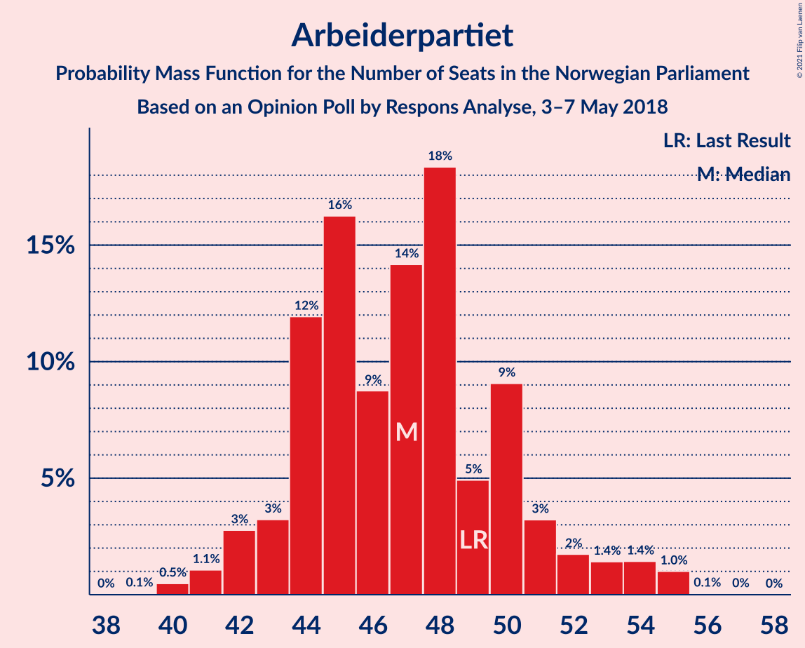

| Number of Seats | Probability | Accumulated | Special Marks |
|:---------------:|:-----------:|:-----------:|:-------------:|
| 39 | 0.1% | 100% |  |
| 40 | 0.5% | 99.9% |  |
| 41 | 1.1% | 99.4% |  |
| 42 | 3% | 98% |  |
| 43 | 3% | 96% |  |
| 44 | 12% | 92% |  |
| 45 | 16% | 80% |  |
| 46 | 9% | 64% |  |
| 47 | 14% | 55% | Median |
| 48 | 18% | 41% |  |
| 49 | 5% | 23% | Last Result |
| 50 | 9% | 18% |  |
| 51 | 3% | 9% |  |
| 52 | 2% | 6% |  |
| 53 | 1.4% | 4% |  |
| 54 | 1.4% | 3% |  |
| 55 | 1.0% | 1.1% |  |
| 56 | 0.1% | 0.1% |  |
| 57 | 0% | 0% |  |

### Fremskrittspartiet

*For a full overview of the results for this party, see the [Fremskrittspartiet](party-fremskrittspartiet.html) page.*

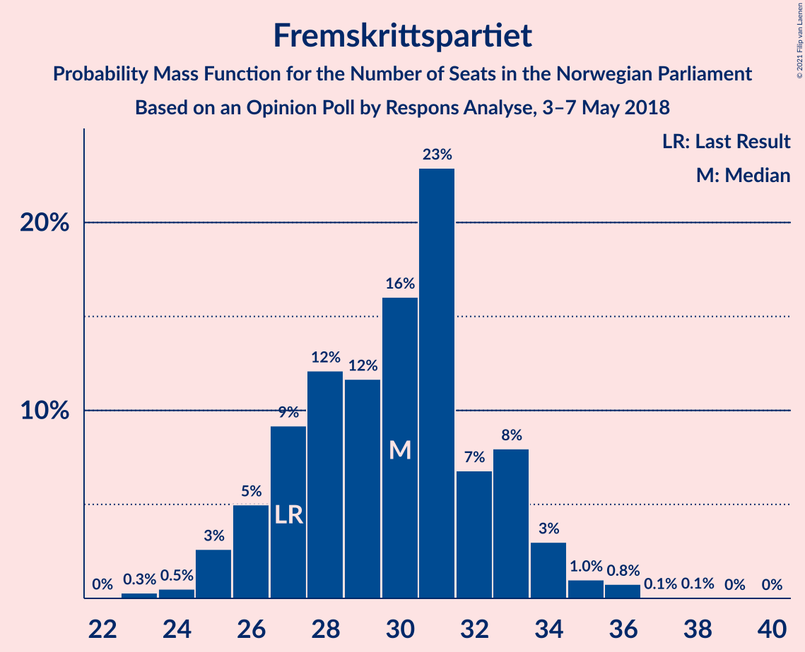

| Number of Seats | Probability | Accumulated | Special Marks |
|:---------------:|:-----------:|:-----------:|:-------------:|
| 23 | 0.3% | 100% |  |
| 24 | 0.5% | 99.7% |  |
| 25 | 3% | 99.2% |  |
| 26 | 5% | 97% |  |
| 27 | 9% | 92% | Last Result |
| 28 | 12% | 82% |  |
| 29 | 12% | 70% |  |
| 30 | 16% | 59% | Median |
| 31 | 23% | 43% |  |
| 32 | 7% | 20% |  |
| 33 | 8% | 13% |  |
| 34 | 3% | 5% |  |
| 35 | 1.0% | 2% |  |
| 36 | 0.8% | 0.9% |  |
| 37 | 0.1% | 0.1% |  |
| 38 | 0.1% | 0.1% |  |
| 39 | 0% | 0% |  |

### Senterpartiet

*For a full overview of the results for this party, see the [Senterpartiet](party-senterpartiet.html) page.*

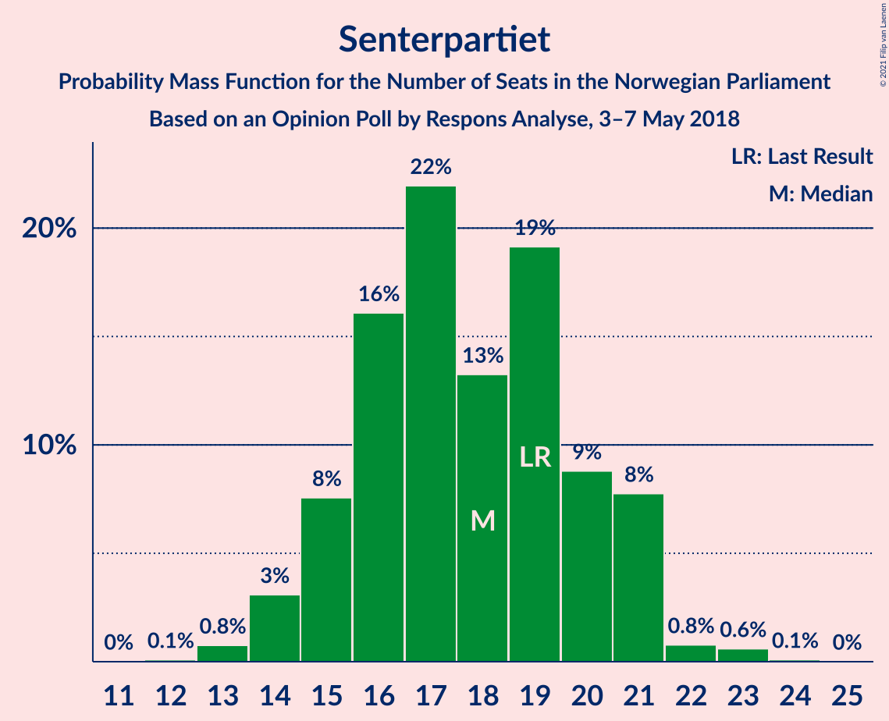

| Number of Seats | Probability | Accumulated | Special Marks |
|:---------------:|:-----------:|:-----------:|:-------------:|
| 12 | 0.1% | 100% |  |
| 13 | 0.8% | 99.9% |  |
| 14 | 3% | 99.1% |  |
| 15 | 8% | 96% |  |
| 16 | 16% | 88% |  |
| 17 | 22% | 72% |  |
| 18 | 13% | 50% | Median |
| 19 | 19% | 37% | Last Result |
| 20 | 9% | 18% |  |
| 21 | 8% | 9% |  |
| 22 | 0.8% | 1.5% |  |
| 23 | 0.6% | 0.7% |  |
| 24 | 0.1% | 0.1% |  |
| 25 | 0% | 0% |  |

### Sosialistisk Venstreparti

*For a full overview of the results for this party, see the [Sosialistisk Venstreparti](party-sosialistiskvenstreparti.html) page.*

| Number of Seats | Probability | Accumulated | Special Marks |
|:---------------:|:-----------:|:-----------:|:-------------:|
| 9 | 0.2% | 100% |  |
| 10 | 2% | 99.8% |  |
| 11 | 12% | 98% | Last Result |
| 12 | 13% | 86% |  |
| 13 | 26% | 73% | Median |
| 14 | 23% | 47% |  |
| 15 | 16% | 24% |  |
| 16 | 4% | 8% |  |
| 17 | 3% | 4% |  |
| 18 | 1.1% | 1.2% |  |
| 19 | 0.1% | 0.1% |  |
| 20 | 0% | 0% |  |

### Kristelig Folkeparti

*For a full overview of the results for this party, see the [Kristelig Folkeparti](party-kristeligfolkeparti.html) page.*

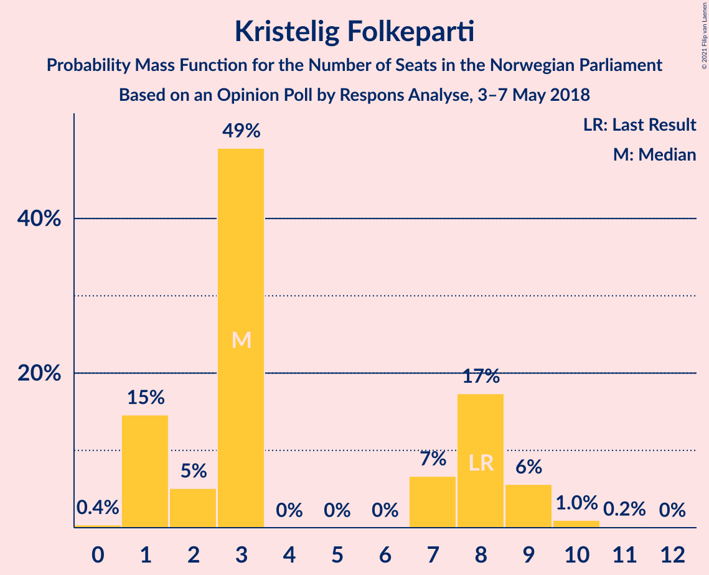

| Number of Seats | Probability | Accumulated | Special Marks |
|:---------------:|:-----------:|:-----------:|:-------------:|
| 0 | 0.4% | 100% |  |
| 1 | 15% | 99.6% |  |
| 2 | 5% | 85% |  |
| 3 | 49% | 80% | Median |
| 4 | 0% | 31% |  |
| 5 | 0% | 31% |  |
| 6 | 0% | 31% |  |
| 7 | 7% | 31% |  |
| 8 | 17% | 24% | Last Result |
| 9 | 6% | 7% |  |
| 10 | 1.0% | 1.2% |  |
| 11 | 0.2% | 0.2% |  |
| 12 | 0% | 0% |  |

### Rødt

*For a full overview of the results for this party, see the [Rødt](party-rødt.html) page.*

| Number of Seats | Probability | Accumulated | Special Marks |
|:---------------:|:-----------:|:-----------:|:-------------:|
| 1 | 14% | 100% | Last Result |
| 2 | 65% | 86% | Median |
| 3 | 0% | 21% |  |
| 4 | 0% | 21% |  |
| 5 | 0% | 21% |  |
| 6 | 0% | 21% |  |
| 7 | 4% | 21% |  |
| 8 | 14% | 17% |  |
| 9 | 2% | 3% |  |
| 10 | 0.4% | 0.5% |  |
| 11 | 0.1% | 0.1% |  |
| 12 | 0% | 0% |  |

### Venstre

*For a full overview of the results for this party, see the [Venstre](party-venstre.html) page.*

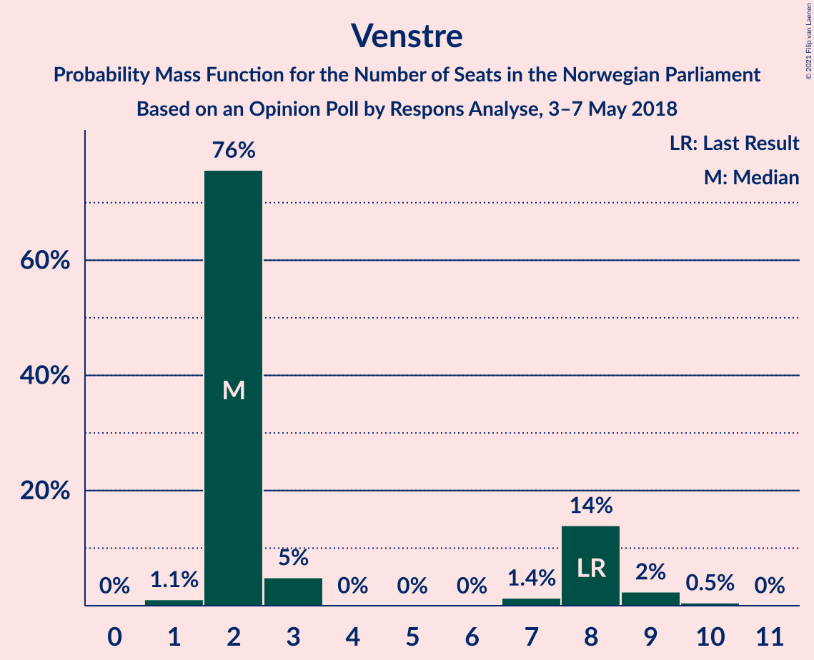

| Number of Seats | Probability | Accumulated | Special Marks |
|:---------------:|:-----------:|:-----------:|:-------------:|
| 1 | 1.1% | 100% |  |
| 2 | 76% | 98.9% | Median |
| 3 | 5% | 23% |  |
| 4 | 0% | 18% |  |
| 5 | 0% | 18% |  |
| 6 | 0% | 18% |  |
| 7 | 1.4% | 18% |  |
| 8 | 14% | 17% | Last Result |
| 9 | 2% | 3% |  |
| 10 | 0.5% | 0.6% |  |
| 11 | 0% | 0% |  |

### Miljøpartiet De Grønne

*For a full overview of the results for this party, see the [Miljøpartiet De Grønne](party-miljøpartietdegrønne.html) page.*

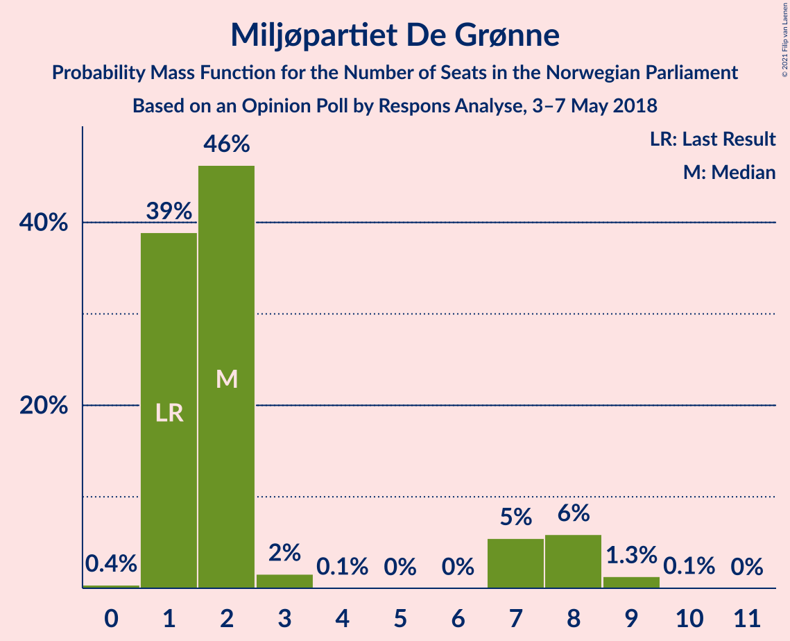

| Number of Seats | Probability | Accumulated | Special Marks |
|:---------------:|:-----------:|:-----------:|:-------------:|
| 0 | 0.4% | 100% |  |
| 1 | 39% | 99.6% | Last Result |
| 2 | 46% | 61% | Median |
| 3 | 2% | 14% |  |
| 4 | 0.1% | 13% |  |
| 5 | 0% | 13% |  |
| 6 | 0% | 13% |  |
| 7 | 5% | 13% |  |
| 8 | 6% | 7% |  |
| 9 | 1.3% | 1.4% |  |
| 10 | 0.1% | 0.1% |  |
| 11 | 0% | 0% |  |

## Coalitions

### Confidence Intervals

| Coalition | Last Result | Median | Majority? | 80% Confidence Interval | 90% Confidence Interval | 95% Confidence Interval | 99% Confidence Interval |
|:---------:|:-----------:|:------:|:---------:|:-----------------------:|:-----------------------:|:-----------------------:|:-----------------------:|
| Høyre – Fremskrittspartiet – Senterpartiet – Kristelig Folkeparti – Venstre | 107 | 103 | 100% | 98–108 | 97–109 | 96–110 | 93–111 |
| Høyre – Fremskrittspartiet – Kristelig Folkeparti – Venstre – Miljøpartiet De Grønne | 89 | 88 | 83% | 82–93 | 82–94 | 81–95 | 79–97 |
| Høyre – Fremskrittspartiet – Kristelig Folkeparti – Venstre | 88 | 86 | 57% | 81–91 | 80–92 | 79–93 | 76–94 |
| Arbeiderpartiet – Senterpartiet – Sosialistisk Venstreparti – Kristelig Folkeparti – Miljøpartiet De Grønne | 88 | 85 | 51% | 79–89 | 78–90 | 78–91 | 76–94 |
| Arbeiderpartiet – Senterpartiet – Sosialistisk Venstreparti – Rødt – Miljøpartiet De Grønne | 81 | 83 | 43% | 78–88 | 77–89 | 76–90 | 75–93 |
| Høyre – Fremskrittspartiet – Venstre | 80 | 81 | 25% | 76–86 | 74–88 | 74–89 | 72–90 |
| Arbeiderpartiet – Senterpartiet – Sosialistisk Venstreparti – Rødt | 80 | 81 | 17% | 76–87 | 75–87 | 74–88 | 72–90 |
| Arbeiderpartiet – Senterpartiet – Sosialistisk Venstreparti – Miljøpartiet De Grønne | 80 | 80 | 12% | 75–85 | 75–86 | 74–87 | 73–90 |
| Arbeiderpartiet – Senterpartiet – Sosialistisk Venstreparti | 79 | 78 | 4% | 73–82 | 72–83 | 72–85 | 70–87 |
| Høyre – Fremskrittspartiet | 72 | 78 | 3% | 73–83 | 71–83 | 71–85 | 69–87 |
| Arbeiderpartiet – Senterpartiet – Kristelig Folkeparti – Miljøpartiet De Grønne | 77 | 71 | 0% | 67–76 | 65–77 | 64–78 | 62–81 |
| Arbeiderpartiet – Senterpartiet – Kristelig Folkeparti | 76 | 69 | 0% | 65–74 | 63–75 | 62–75 | 60–78 |
| Arbeiderpartiet – Sosialistisk Venstreparti – Rødt – Miljøpartiet De Grønne | 62 | 66 | 0% | 61–71 | 60–72 | 59–73 | 58–76 |
| Arbeiderpartiet – Senterpartiet | 68 | 64 | 0% | 60–69 | 60–70 | 59–71 | 57–73 |
| Arbeiderpartiet – Sosialistisk Venstreparti | 60 | 60 | 0% | 56–64 | 55–66 | 55–67 | 53–70 |
| Høyre – Kristelig Folkeparti – Venstre | 61 | 56 | 0% | 51–61 | 50–62 | 49–63 | 47–65 |
| Senterpartiet – Kristelig Folkeparti – Venstre | 35 | 25 | 0% | 20–30 | 20–31 | 19–33 | 18–35 |

### Høyre – Fremskrittspartiet – Senterpartiet – Kristelig Folkeparti – Venstre

| Number of Seats | Probability | Accumulated | Special Marks |
|:---------------:|:-----------:|:-----------:|:-------------:|
| 91 | 0.1% | 100% |  |
| 92 | 0.1% | 99.8% |  |
| 93 | 0.2% | 99.7% |  |
| 94 | 0.3% | 99.5% |  |
| 95 | 1.1% | 99.1% |  |
| 96 | 1.4% | 98% |  |
| 97 | 5% | 97% |  |
| 98 | 3% | 92% |  |
| 99 | 7% | 88% |  |
| 100 | 8% | 82% |  |
| 101 | 5% | 74% | Median |
| 102 | 5% | 69% |  |
| 103 | 17% | 63% |  |
| 104 | 7% | 47% |  |
| 105 | 12% | 40% |  |
| 106 | 7% | 28% |  |
| 107 | 8% | 21% | Last Result |
| 108 | 6% | 13% |  |
| 109 | 2% | 7% |  |
| 110 | 4% | 5% |  |
| 111 | 0.6% | 0.9% |  |
| 112 | 0.2% | 0.3% |  |
| 113 | 0.1% | 0.2% |  |
| 114 | 0.1% | 0.1% |  |
| 115 | 0% | 0% |  |

### Høyre – Fremskrittspartiet – Kristelig Folkeparti – Venstre – Miljøpartiet De Grønne

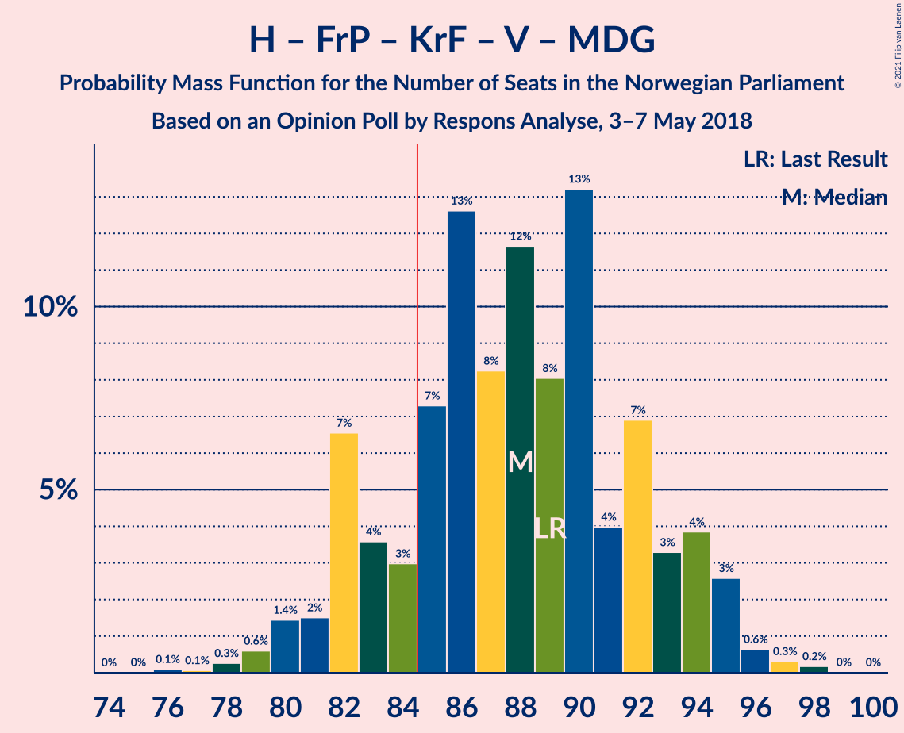

| Number of Seats | Probability | Accumulated | Special Marks |
|:---------------:|:-----------:|:-----------:|:-------------:|
| 76 | 0.1% | 100% |  |
| 77 | 0.1% | 99.9% |  |
| 78 | 0.3% | 99.8% |  |
| 79 | 0.6% | 99.5% |  |
| 80 | 1.4% | 98.9% |  |
| 81 | 2% | 98% |  |
| 82 | 7% | 96% |  |
| 83 | 4% | 89% |  |
| 84 | 3% | 86% |  |
| 85 | 7% | 83% | Median, Majority |
| 86 | 13% | 76% |  |
| 87 | 8% | 63% |  |
| 88 | 12% | 55% |  |
| 89 | 8% | 43% | Last Result |
| 90 | 13% | 35% |  |
| 91 | 4% | 22% |  |
| 92 | 7% | 18% |  |
| 93 | 3% | 11% |  |
| 94 | 4% | 8% |  |
| 95 | 3% | 4% |  |
| 96 | 0.6% | 1.2% |  |
| 97 | 0.3% | 0.5% |  |
| 98 | 0.2% | 0.2% |  |
| 99 | 0% | 0% |  |

### Høyre – Fremskrittspartiet – Kristelig Folkeparti – Venstre

| Number of Seats | Probability | Accumulated | Special Marks |
|:---------------:|:-----------:|:-----------:|:-------------:|
| 73 | 0.1% | 100% |  |
| 74 | 0.1% | 99.9% |  |
| 75 | 0.2% | 99.8% |  |
| 76 | 0.3% | 99.7% |  |
| 77 | 0.7% | 99.4% |  |
| 78 | 1.1% | 98.7% |  |
| 79 | 2% | 98% |  |
| 80 | 3% | 95% |  |
| 81 | 8% | 92% |  |
| 82 | 7% | 84% |  |
| 83 | 8% | 77% | Median |
| 84 | 12% | 69% |  |
| 85 | 5% | 57% | Majority |
| 86 | 12% | 52% |  |
| 87 | 9% | 40% |  |
| 88 | 12% | 31% | Last Result |
| 89 | 2% | 19% |  |
| 90 | 4% | 16% |  |
| 91 | 7% | 12% |  |
| 92 | 2% | 5% |  |
| 93 | 3% | 3% |  |
| 94 | 0.2% | 0.6% |  |
| 95 | 0.2% | 0.4% |  |
| 96 | 0.1% | 0.2% |  |
| 97 | 0.1% | 0.1% |  |
| 98 | 0% | 0% |  |

### Arbeiderpartiet – Senterpartiet – Sosialistisk Venstreparti – Kristelig Folkeparti – Miljøpartiet De Grønne

| Number of Seats | Probability | Accumulated | Special Marks |
|:---------------:|:-----------:|:-----------:|:-------------:|
| 73 | 0.1% | 100% |  |
| 74 | 0.1% | 99.9% |  |
| 75 | 0.2% | 99.9% |  |
| 76 | 0.7% | 99.6% |  |
| 77 | 1.0% | 98.9% |  |
| 78 | 5% | 98% |  |
| 79 | 4% | 93% |  |
| 80 | 3% | 89% |  |
| 81 | 2% | 86% |  |
| 82 | 14% | 84% |  |
| 83 | 8% | 70% | Median |
| 84 | 11% | 62% |  |
| 85 | 7% | 51% | Majority |
| 86 | 9% | 44% |  |
| 87 | 14% | 35% |  |
| 88 | 7% | 20% | Last Result |
| 89 | 5% | 13% |  |
| 90 | 3% | 8% |  |
| 91 | 2% | 5% |  |
| 92 | 1.1% | 2% |  |
| 93 | 0.7% | 1.2% |  |
| 94 | 0.3% | 0.5% |  |
| 95 | 0.1% | 0.2% |  |
| 96 | 0.1% | 0.1% |  |
| 97 | 0% | 0% |  |

### Arbeiderpartiet – Senterpartiet – Sosialistisk Venstreparti – Rødt – Miljøpartiet De Grønne

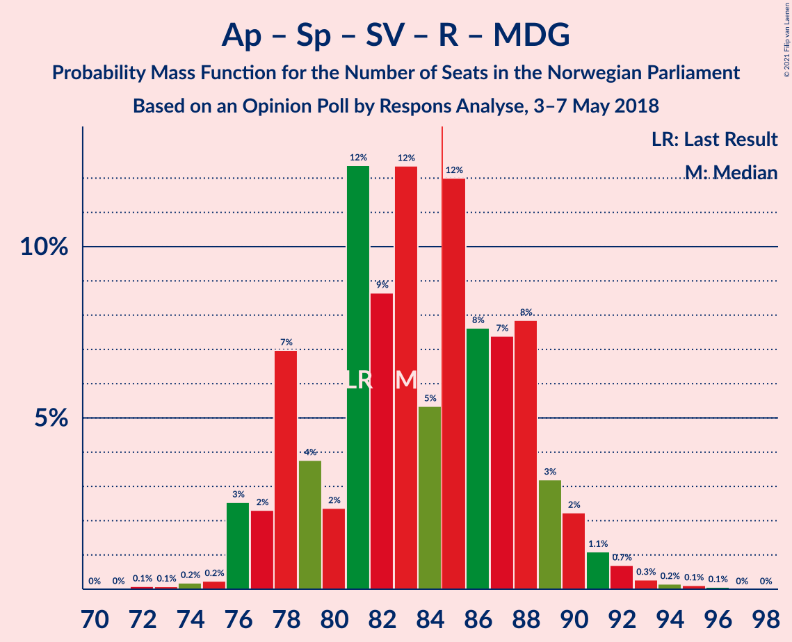

| Number of Seats | Probability | Accumulated | Special Marks |
|:---------------:|:-----------:|:-----------:|:-------------:|
| 72 | 0.1% | 100% |  |
| 73 | 0.1% | 99.9% |  |
| 74 | 0.2% | 99.8% |  |
| 75 | 0.2% | 99.6% |  |
| 76 | 3% | 99.4% |  |
| 77 | 2% | 97% |  |
| 78 | 7% | 95% |  |
| 79 | 4% | 88% |  |
| 80 | 2% | 84% |  |
| 81 | 12% | 81% | Last Result |
| 82 | 9% | 69% | Median |
| 83 | 12% | 60% |  |
| 84 | 5% | 48% |  |
| 85 | 12% | 43% | Majority |
| 86 | 8% | 31% |  |
| 87 | 7% | 23% |  |
| 88 | 8% | 16% |  |
| 89 | 3% | 8% |  |
| 90 | 2% | 5% |  |
| 91 | 1.1% | 2% |  |
| 92 | 0.7% | 1.3% |  |
| 93 | 0.3% | 0.6% |  |
| 94 | 0.2% | 0.3% |  |
| 95 | 0.1% | 0.2% |  |
| 96 | 0.1% | 0.1% |  |
| 97 | 0% | 0% |  |

### Høyre – Fremskrittspartiet – Venstre

| Number of Seats | Probability | Accumulated | Special Marks |
|:---------------:|:-----------:|:-----------:|:-------------:|
| 70 | 0.1% | 100% |  |
| 71 | 0.2% | 99.9% |  |
| 72 | 0.2% | 99.7% |  |
| 73 | 2% | 99.4% |  |
| 74 | 4% | 98% |  |
| 75 | 2% | 94% |  |
| 76 | 3% | 92% |  |
| 77 | 5% | 89% |  |
| 78 | 9% | 85% |  |
| 79 | 7% | 76% |  |
| 80 | 12% | 69% | Last Result, Median |
| 81 | 11% | 57% |  |
| 82 | 6% | 46% |  |
| 83 | 12% | 40% |  |
| 84 | 3% | 28% |  |
| 85 | 14% | 25% | Majority |
| 86 | 2% | 10% |  |
| 87 | 2% | 9% |  |
| 88 | 3% | 7% |  |
| 89 | 2% | 4% |  |
| 90 | 2% | 2% |  |
| 91 | 0.2% | 0.3% |  |
| 92 | 0.1% | 0.1% |  |
| 93 | 0% | 0% |  |

### Arbeiderpartiet – Senterpartiet – Sosialistisk Venstreparti – Rødt

| Number of Seats | Probability | Accumulated | Special Marks |
|:---------------:|:-----------:|:-----------:|:-------------:|
| 71 | 0.2% | 100% |  |
| 72 | 0.3% | 99.8% |  |
| 73 | 0.6% | 99.5% |  |
| 74 | 3% | 98.8% |  |
| 75 | 4% | 96% |  |
| 76 | 3% | 92% |  |
| 77 | 7% | 89% |  |
| 78 | 4% | 82% |  |
| 79 | 13% | 78% |  |
| 80 | 8% | 65% | Last Result, Median |
| 81 | 12% | 57% |  |
| 82 | 8% | 45% |  |
| 83 | 13% | 37% |  |
| 84 | 7% | 24% |  |
| 85 | 3% | 17% | Majority |
| 86 | 4% | 14% |  |
| 87 | 7% | 11% |  |
| 88 | 2% | 4% |  |
| 89 | 1.4% | 2% |  |
| 90 | 0.6% | 1.1% |  |
| 91 | 0.3% | 0.5% |  |
| 92 | 0.1% | 0.2% |  |
| 93 | 0.1% | 0.1% |  |
| 94 | 0% | 0% |  |

### Arbeiderpartiet – Senterpartiet – Sosialistisk Venstreparti – Miljøpartiet De Grønne

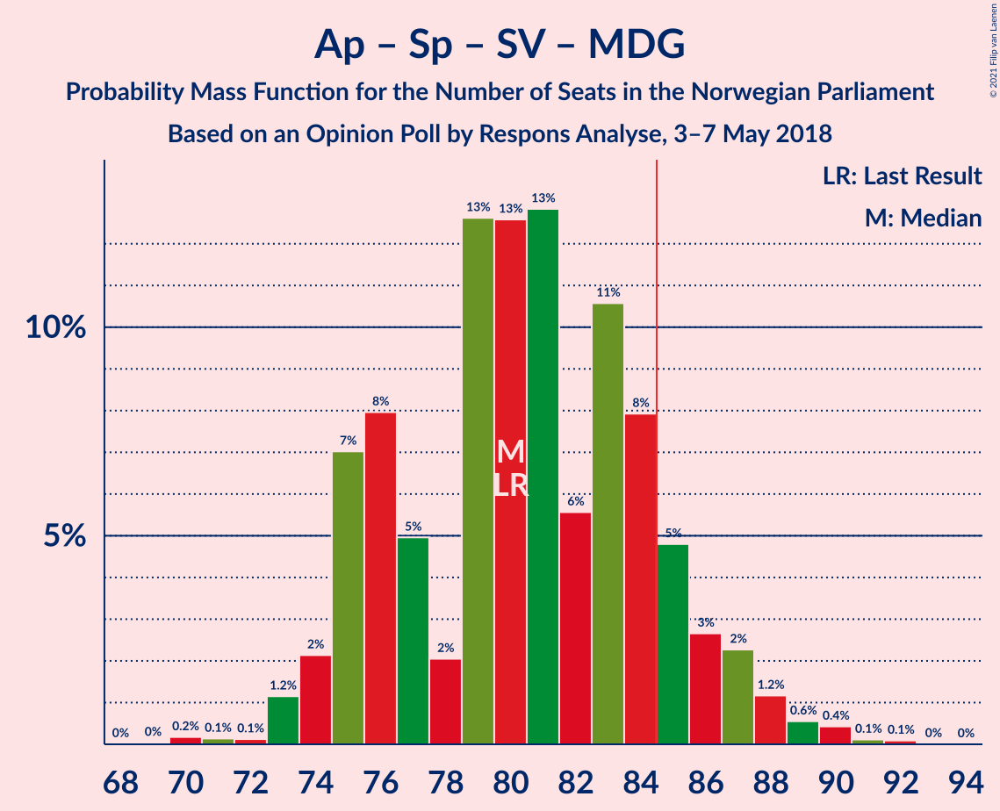

| Number of Seats | Probability | Accumulated | Special Marks |
|:---------------:|:-----------:|:-----------:|:-------------:|
| 69 | 0% | 100% |  |
| 70 | 0.2% | 99.9% |  |
| 71 | 0.1% | 99.8% |  |
| 72 | 0.1% | 99.6% |  |
| 73 | 1.2% | 99.5% |  |
| 74 | 2% | 98% |  |
| 75 | 7% | 96% |  |
| 76 | 8% | 89% |  |
| 77 | 5% | 81% |  |
| 78 | 2% | 76% |  |
| 79 | 13% | 74% |  |
| 80 | 13% | 62% | Last Result, Median |
| 81 | 13% | 49% |  |
| 82 | 6% | 36% |  |
| 83 | 11% | 31% |  |
| 84 | 8% | 20% |  |
| 85 | 5% | 12% | Majority |
| 86 | 3% | 7% |  |
| 87 | 2% | 5% |  |
| 88 | 1.2% | 2% |  |
| 89 | 0.6% | 1.2% |  |
| 90 | 0.4% | 0.7% |  |
| 91 | 0.1% | 0.2% |  |
| 92 | 0.1% | 0.1% |  |
| 93 | 0% | 0% |  |

### Arbeiderpartiet – Senterpartiet – Sosialistisk Venstreparti

| Number of Seats | Probability | Accumulated | Special Marks |
|:---------------:|:-----------:|:-----------:|:-------------:|
| 68 | 0.1% | 100% |  |
| 69 | 0.2% | 99.9% |  |
| 70 | 0.5% | 99.6% |  |
| 71 | 2% | 99.1% |  |
| 72 | 3% | 98% |  |
| 73 | 4% | 94% |  |
| 74 | 7% | 90% |  |
| 75 | 9% | 83% |  |
| 76 | 4% | 74% |  |
| 77 | 11% | 70% |  |
| 78 | 11% | 59% | Median |
| 79 | 14% | 48% | Last Result |
| 80 | 8% | 34% |  |
| 81 | 12% | 26% |  |
| 82 | 7% | 14% |  |
| 83 | 2% | 7% |  |
| 84 | 1.2% | 5% |  |
| 85 | 2% | 4% | Majority |
| 86 | 0.7% | 2% |  |
| 87 | 0.9% | 1.3% |  |
| 88 | 0.2% | 0.4% |  |
| 89 | 0.1% | 0.2% |  |
| 90 | 0% | 0% |  |

### Høyre – Fremskrittspartiet

| Number of Seats | Probability | Accumulated | Special Marks |
|:---------------:|:-----------:|:-----------:|:-------------:|
| 67 | 0.1% | 100% |  |
| 68 | 0.3% | 99.9% |  |
| 69 | 0.4% | 99.6% |  |
| 70 | 0.8% | 99.2% |  |
| 71 | 4% | 98% |  |
| 72 | 3% | 95% | Last Result |
| 73 | 4% | 92% |  |
| 74 | 4% | 88% |  |
| 75 | 8% | 83% |  |
| 76 | 10% | 76% |  |
| 77 | 7% | 66% |  |
| 78 | 13% | 59% | Median |
| 79 | 10% | 46% |  |
| 80 | 7% | 36% |  |
| 81 | 9% | 29% |  |
| 82 | 4% | 20% |  |
| 83 | 13% | 17% |  |
| 84 | 1.2% | 4% |  |
| 85 | 0.6% | 3% | Majority |
| 86 | 0.7% | 2% |  |
| 87 | 1.1% | 1.3% |  |
| 88 | 0.1% | 0.1% |  |
| 89 | 0% | 0% |  |

### Arbeiderpartiet – Senterpartiet – Kristelig Folkeparti – Miljøpartiet De Grønne

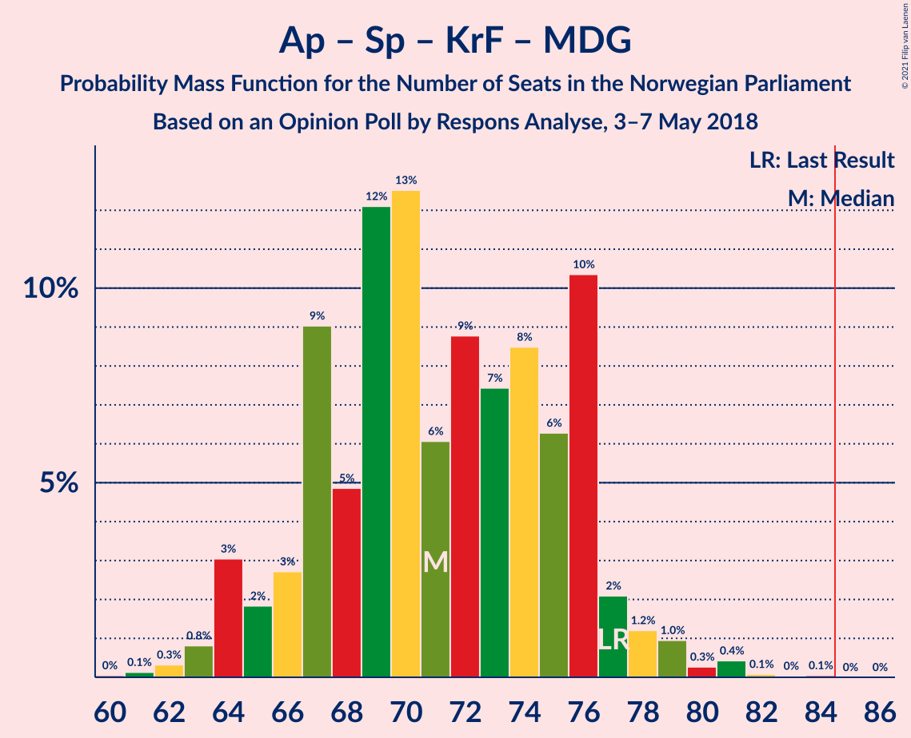

| Number of Seats | Probability | Accumulated | Special Marks |
|:---------------:|:-----------:|:-----------:|:-------------:|
| 60 | 0% | 100% |  |
| 61 | 0.1% | 99.9% |  |
| 62 | 0.3% | 99.8% |  |
| 63 | 0.8% | 99.5% |  |
| 64 | 3% | 98.7% |  |
| 65 | 2% | 96% |  |
| 66 | 3% | 94% |  |
| 67 | 9% | 91% |  |
| 68 | 5% | 82% |  |
| 69 | 12% | 77% |  |
| 70 | 13% | 65% | Median |
| 71 | 6% | 53% |  |
| 72 | 9% | 46% |  |
| 73 | 7% | 38% |  |
| 74 | 8% | 30% |  |
| 75 | 6% | 22% |  |
| 76 | 10% | 15% |  |
| 77 | 2% | 5% | Last Result |
| 78 | 1.2% | 3% |  |
| 79 | 1.0% | 2% |  |
| 80 | 0.3% | 0.9% |  |
| 81 | 0.4% | 0.6% |  |
| 82 | 0.1% | 0.2% |  |
| 83 | 0% | 0.1% |  |
| 84 | 0.1% | 0.1% |  |
| 85 | 0% | 0% | Majority |

### Arbeiderpartiet – Senterpartiet – Kristelig Folkeparti

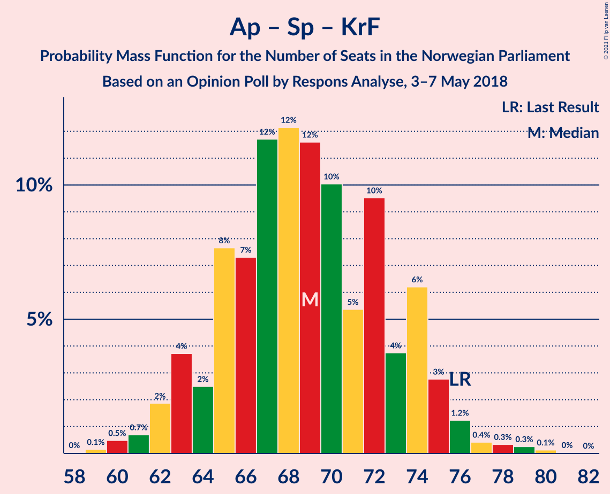

| Number of Seats | Probability | Accumulated | Special Marks |
|:---------------:|:-----------:|:-----------:|:-------------:|
| 58 | 0% | 100% |  |
| 59 | 0.1% | 99.9% |  |
| 60 | 0.5% | 99.8% |  |
| 61 | 0.7% | 99.3% |  |
| 62 | 2% | 98.6% |  |
| 63 | 4% | 97% |  |
| 64 | 2% | 93% |  |
| 65 | 8% | 91% |  |
| 66 | 7% | 83% |  |
| 67 | 12% | 76% |  |
| 68 | 12% | 64% | Median |
| 69 | 12% | 52% |  |
| 70 | 10% | 40% |  |
| 71 | 5% | 30% |  |
| 72 | 10% | 25% |  |
| 73 | 4% | 15% |  |
| 74 | 6% | 11% |  |
| 75 | 3% | 5% |  |
| 76 | 1.2% | 2% | Last Result |
| 77 | 0.4% | 1.2% |  |
| 78 | 0.3% | 0.8% |  |
| 79 | 0.3% | 0.4% |  |
| 80 | 0.1% | 0.2% |  |
| 81 | 0% | 0% |  |

### Arbeiderpartiet – Sosialistisk Venstreparti – Rødt – Miljøpartiet De Grønne

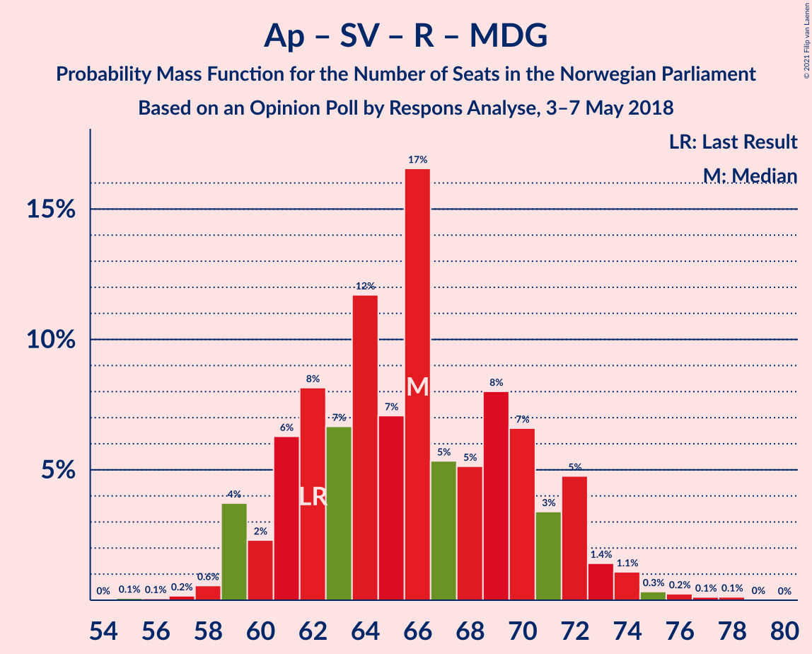

| Number of Seats | Probability | Accumulated | Special Marks |
|:---------------:|:-----------:|:-----------:|:-------------:|
| 55 | 0.1% | 100% |  |
| 56 | 0.1% | 99.9% |  |
| 57 | 0.2% | 99.8% |  |
| 58 | 0.6% | 99.7% |  |
| 59 | 4% | 99.1% |  |
| 60 | 2% | 95% |  |
| 61 | 6% | 93% |  |
| 62 | 8% | 87% | Last Result |
| 63 | 7% | 79% |  |
| 64 | 12% | 72% | Median |
| 65 | 7% | 60% |  |
| 66 | 17% | 53% |  |
| 67 | 5% | 37% |  |
| 68 | 5% | 31% |  |
| 69 | 8% | 26% |  |
| 70 | 7% | 18% |  |
| 71 | 3% | 12% |  |
| 72 | 5% | 8% |  |
| 73 | 1.4% | 3% |  |
| 74 | 1.1% | 2% |  |
| 75 | 0.3% | 0.9% |  |
| 76 | 0.2% | 0.5% |  |
| 77 | 0.1% | 0.3% |  |
| 78 | 0.1% | 0.2% |  |
| 79 | 0% | 0% |  |

### Arbeiderpartiet – Senterpartiet

| Number of Seats | Probability | Accumulated | Special Marks |
|:---------------:|:-----------:|:-----------:|:-------------:|
| 56 | 0.2% | 100% |  |
| 57 | 0.6% | 99.8% |  |
| 58 | 1.3% | 99.1% |  |
| 59 | 2% | 98% |  |
| 60 | 6% | 95% |  |
| 61 | 9% | 89% |  |
| 62 | 5% | 80% |  |
| 63 | 8% | 75% |  |
| 64 | 18% | 67% |  |
| 65 | 10% | 49% | Median |
| 66 | 9% | 39% |  |
| 67 | 14% | 30% |  |
| 68 | 4% | 17% | Last Result |
| 69 | 6% | 12% |  |
| 70 | 1.4% | 6% |  |
| 71 | 2% | 4% |  |
| 72 | 1.4% | 2% |  |
| 73 | 0.4% | 0.6% |  |
| 74 | 0.1% | 0.2% |  |
| 75 | 0.1% | 0.1% |  |
| 76 | 0% | 0% |  |

### Arbeiderpartiet – Sosialistisk Venstreparti

| Number of Seats | Probability | Accumulated | Special Marks |
|:---------------:|:-----------:|:-----------:|:-------------:|
| 51 | 0.1% | 100% |  |
| 52 | 0.2% | 99.9% |  |
| 53 | 0.3% | 99.7% |  |
| 54 | 1.0% | 99.4% |  |
| 55 | 4% | 98% |  |
| 56 | 6% | 94% |  |
| 57 | 7% | 88% |  |
| 58 | 12% | 81% |  |
| 59 | 10% | 70% |  |
| 60 | 12% | 59% | Last Result, Median |
| 61 | 9% | 47% |  |
| 62 | 16% | 38% |  |
| 63 | 10% | 22% |  |
| 64 | 3% | 12% |  |
| 65 | 4% | 9% |  |
| 66 | 2% | 6% |  |
| 67 | 2% | 4% |  |
| 68 | 0.7% | 2% |  |
| 69 | 0.5% | 1.4% |  |
| 70 | 0.8% | 0.9% |  |
| 71 | 0.1% | 0.1% |  |
| 72 | 0% | 0% |  |

### Høyre – Kristelig Folkeparti – Venstre

| Number of Seats | Probability | Accumulated | Special Marks |
|:---------------:|:-----------:|:-----------:|:-------------:|
| 45 | 0.1% | 100% |  |
| 46 | 0.2% | 99.9% |  |
| 47 | 0.5% | 99.7% |  |
| 48 | 0.8% | 99.2% |  |
| 49 | 1.1% | 98% |  |
| 50 | 3% | 97% |  |
| 51 | 6% | 94% |  |
| 52 | 8% | 88% |  |
| 53 | 16% | 79% | Median |
| 54 | 5% | 64% |  |
| 55 | 6% | 58% |  |
| 56 | 10% | 52% |  |
| 57 | 11% | 42% |  |
| 58 | 8% | 32% |  |
| 59 | 5% | 24% |  |
| 60 | 9% | 19% |  |
| 61 | 4% | 10% | Last Result |
| 62 | 3% | 6% |  |
| 63 | 1.0% | 3% |  |
| 64 | 1.1% | 2% |  |
| 65 | 0.5% | 0.9% |  |
| 66 | 0.1% | 0.4% |  |
| 67 | 0.1% | 0.3% |  |
| 68 | 0.1% | 0.2% |  |
| 69 | 0% | 0% |  |

### Senterpartiet – Kristelig Folkeparti – Venstre

| Number of Seats | Probability | Accumulated | Special Marks |
|:---------------:|:-----------:|:-----------:|:-------------:|
| 17 | 0.2% | 100% |  |
| 18 | 0.8% | 99.8% |  |
| 19 | 2% | 99.0% |  |
| 20 | 8% | 97% |  |
| 21 | 9% | 89% |  |
| 22 | 8% | 80% |  |
| 23 | 7% | 73% | Median |
| 24 | 8% | 66% |  |
| 25 | 10% | 57% |  |
| 26 | 12% | 47% |  |
| 27 | 11% | 35% |  |
| 28 | 7% | 25% |  |
| 29 | 6% | 17% |  |
| 30 | 5% | 11% |  |
| 31 | 2% | 6% |  |
| 32 | 1.3% | 4% |  |
| 33 | 1.0% | 3% |  |
| 34 | 1.1% | 2% |  |
| 35 | 0.3% | 0.6% | Last Result |
| 36 | 0.2% | 0.3% |  |
| 37 | 0% | 0.1% |  |
| 38 | 0% | 0% |  |

## Technical Information

### Opinion Poll

+ **Polling firm:** Respons Analyse
+ **Commissioner(s):** —
+ **Fieldwork period:** 3–7 May 2018

### Calculations

+ **Sample size:** 1002
+ **Simulations done:** 1,048,576
+ **Error estimate:** 1.78%

