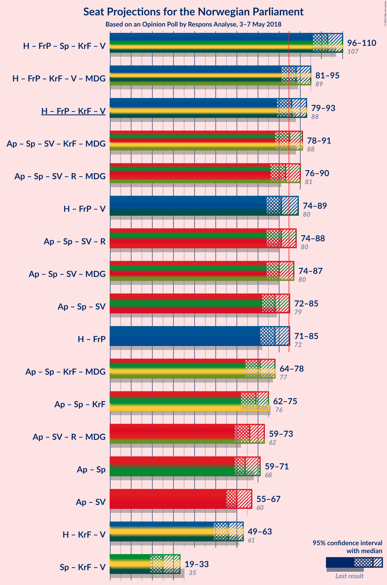
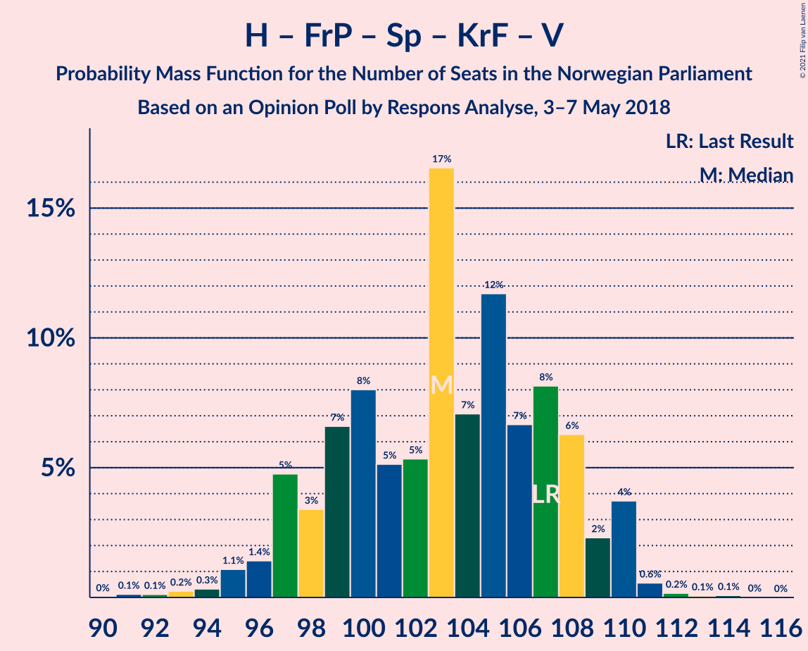
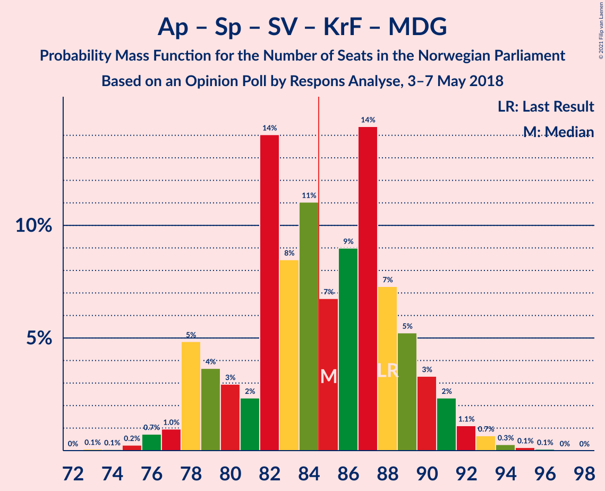
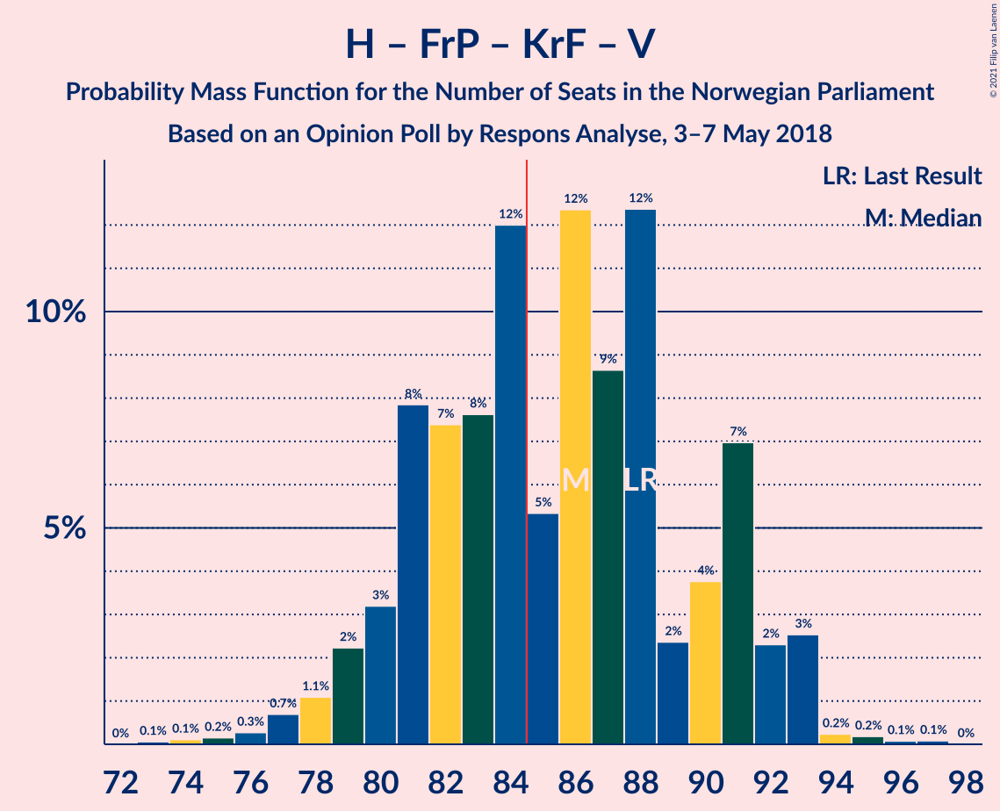
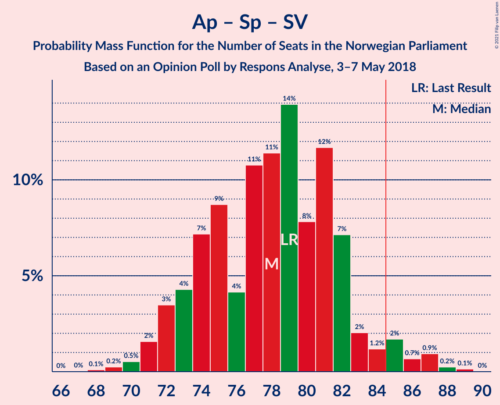
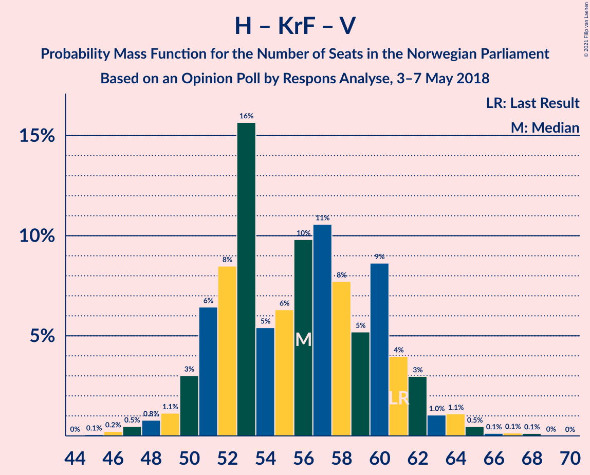

# Opinion Poll by Respons Analyse, 3–7 May 2018

<a href="#voting-intentions">Voting Intentions</a> | <a href="#seats">Seats</a> | <a href="#coalitions">Coalitions</a> | <a href="#technical-information">Technical Information</a>

## Voting Intentions

### Confidence Intervals

| Party | Last Result | Poll Result | 80% Confidence Interval | 90% Confidence Interval | 95% Confidence Interval | 99% Confidence Interval |
|:-----:|:-----------:|:-----------:|:-----------------------:|:-----------------------:|:-----------------------:|:-----------------------:|
| Høyre | 25.0% | 26.2% | 24.5–28.1% |24.0–28.6% |23.6–29.1% |22.8–30.0% |
| Arbeiderpartiet | 27.4% | 25.5% | 23.8–27.4% |23.4–27.9% |22.9–28.3% |22.1–29.2% |
| Fremskrittspartiet | 15.2% | 16.1% | 14.7–17.6% |14.3–18.1% |13.9–18.5% |13.3–19.3% |
| Senterpartiet | 10.3% | 9.5% | 8.4–10.8% |8.1–11.1% |7.8–11.5% |7.3–12.1% |
| Sosialistisk Venstreparti | 6.0% | 7.3% | 6.3–8.4% |6.1–8.8% |5.8–9.1% |5.4–9.7% |
| Kristelig Folkeparti | 4.2% | 3.7% | 3.0–4.6% |2.8–4.8% |2.7–5.1% |2.4–5.5% |
| Rødt | 2.4% | 3.5% | 2.9–4.4% |2.7–4.6% |2.5–4.8% |2.2–5.3% |
| Venstre | 4.4% | 3.5% | 2.9–4.4% |2.7–4.6% |2.5–4.8% |2.2–5.3% |
| Miljøpartiet De Grønne | 3.2% | 3.2% | 2.6–4.0% |2.4–4.3% |2.3–4.5% |2.0–4.9% |

*Note:* The poll result column reflects the actual value used in the calculations. Published results may vary slightly, and in addition be rounded to fewer digits.

## Seats

### Confidence Intervals

| Party | Last Result | Median | 80% Confidence Interval | 90% Confidence Interval | 95% Confidence Interval | 99% Confidence Interval |
|:-----:|:-----------:|:------:|:-----------------------:|:-----------------------:|:-----------------------:|:-----------------------:|
| <a href="#høyre">Høyre</a> | 45 | 47 | 45–53 |44–54 |43–56 |40–56 |
| <a href="#arbeiderpartiet">Arbeiderpartiet</a> | 49 | 48 | 43–51 |42–52 |42–53 |40–55 |
| <a href="#fremskrittspartiet">Fremskrittspartiet</a> | 27 | 30 | 27–32 |26–34 |26–36 |24–36 |
| <a href="#senterpartiet">Senterpartiet</a> | 19 | 17 | 16–20 |15–21 |14–21 |13–22 |
| <a href="#sosialistisk-venstreparti">Sosialistisk Venstreparti</a> | 11 | 13 | 12–16 |11–16 |10–17 |10–18 |
| <a href="#kristelig-folkeparti">Kristelig Folkeparti</a> | 8 | 3 | 1–8 |1–9 |1–9 |1–10 |
| <a href="#rødt">Rødt</a> | 1 | 2 | 1–8 |1–8 |1–8 |1–10 |
| <a href="#venstre">Venstre</a> | 8 | 2 | 2–8 |2–8 |2–9 |1–10 |
| <a href="#miljøpartiet-de-grønne">Miljøpartiet De Grønne</a> | 1 | 2 | 1–7 |1–8 |1–8 |0–9 |

### Høyre

*For a full overview of the results for this party, see the [Høyre](party-høyre.html) page.*

| Number of Seats | Probability | Accumulated | Special Marks |
|:---------------:|:-----------:|:-----------:|:-------------:|
| 39 | 0% | 100% |  |
| 40 | 0.7% | 99.9% |  |
| 41 | 0.2% | 99.2% |  |
| 42 | 1.2% | 99.0% |  |
| 43 | 2% | 98% |  |
| 44 | 3% | 96% |  |
| 45 | 5% | 93% | Last Result |
| 46 | 25% | 88% |  |
| 47 | 19% | 63% | Median |
| 48 | 11% | 44% |  |
| 49 | 9% | 33% |  |
| 50 | 2% | 24% |  |
| 51 | 11% | 22% |  |
| 52 | 1.0% | 11% |  |
| 53 | 0.9% | 10% |  |
| 54 | 5% | 9% |  |
| 55 | 1.4% | 4% |  |
| 56 | 2% | 3% |  |
| 57 | 0% | 0.2% |  |
| 58 | 0.2% | 0.2% |  |
| 59 | 0% | 0% |  |

### Arbeiderpartiet

*For a full overview of the results for this party, see the [Arbeiderpartiet](party-arbeiderpartiet.html) page.*

| Number of Seats | Probability | Accumulated | Special Marks |
|:---------------:|:-----------:|:-----------:|:-------------:|
| 39 | 0% | 100% |  |
| 40 | 1.0% | 99.9% |  |
| 41 | 0.6% | 99.0% |  |
| 42 | 4% | 98% |  |
| 43 | 7% | 94% |  |
| 44 | 8% | 87% |  |
| 45 | 9% | 78% |  |
| 46 | 7% | 70% |  |
| 47 | 4% | 63% |  |
| 48 | 10% | 59% | Median |
| 49 | 6% | 49% | Last Result |
| 50 | 21% | 43% |  |
| 51 | 15% | 22% |  |
| 52 | 4% | 7% |  |
| 53 | 1.1% | 3% |  |
| 54 | 0.2% | 1.5% |  |
| 55 | 1.2% | 1.3% |  |
| 56 | 0.1% | 0.1% |  |
| 57 | 0% | 0% |  |

### Fremskrittspartiet

*For a full overview of the results for this party, see the [Fremskrittspartiet](party-fremskrittspartiet.html) page.*

| Number of Seats | Probability | Accumulated | Special Marks |
|:---------------:|:-----------:|:-----------:|:-------------:|
| 23 | 0.4% | 100% |  |
| 24 | 0.6% | 99.5% |  |
| 25 | 1.3% | 98.9% |  |
| 26 | 5% | 98% |  |
| 27 | 4% | 93% | Last Result |
| 28 | 22% | 89% |  |
| 29 | 14% | 67% |  |
| 30 | 21% | 53% | Median |
| 31 | 14% | 31% |  |
| 32 | 11% | 18% |  |
| 33 | 0.9% | 7% |  |
| 34 | 1.0% | 6% |  |
| 35 | 1.3% | 5% |  |
| 36 | 3% | 4% |  |
| 37 | 0% | 0.2% |  |
| 38 | 0.2% | 0.2% |  |
| 39 | 0% | 0% |  |

### Senterpartiet

*For a full overview of the results for this party, see the [Senterpartiet](party-senterpartiet.html) page.*

| Number of Seats | Probability | Accumulated | Special Marks |
|:---------------:|:-----------:|:-----------:|:-------------:|
| 12 | 0.1% | 100% |  |
| 13 | 0.4% | 99.8% |  |
| 14 | 3% | 99.4% |  |
| 15 | 5% | 97% |  |
| 16 | 32% | 92% |  |
| 17 | 15% | 60% | Median |
| 18 | 5% | 45% |  |
| 19 | 16% | 39% | Last Result |
| 20 | 15% | 24% |  |
| 21 | 8% | 9% |  |
| 22 | 0.6% | 0.8% |  |
| 23 | 0.1% | 0.2% |  |
| 24 | 0.1% | 0.1% |  |
| 25 | 0% | 0% |  |

### Sosialistisk Venstreparti

*For a full overview of the results for this party, see the [Sosialistisk Venstreparti](party-sosialistiskvenstreparti.html) page.*

| Number of Seats | Probability | Accumulated | Special Marks |
|:---------------:|:-----------:|:-----------:|:-------------:|
| 9 | 0.4% | 100% |  |
| 10 | 3% | 99.6% |  |
| 11 | 3% | 97% | Last Result |
| 12 | 12% | 94% |  |
| 13 | 44% | 82% | Median |
| 14 | 21% | 38% |  |
| 15 | 5% | 17% |  |
| 16 | 9% | 12% |  |
| 17 | 3% | 4% |  |
| 18 | 0.3% | 0.7% |  |
| 19 | 0.3% | 0.4% |  |
| 20 | 0.1% | 0.1% |  |
| 21 | 0% | 0% |  |

### Kristelig Folkeparti

*For a full overview of the results for this party, see the [Kristelig Folkeparti](party-kristeligfolkeparti.html) page.*

| Number of Seats | Probability | Accumulated | Special Marks |
|:---------------:|:-----------:|:-----------:|:-------------:|
| 0 | 0.3% | 100% |  |
| 1 | 15% | 99.7% |  |
| 2 | 4% | 85% |  |
| 3 | 61% | 81% | Median |
| 4 | 0% | 19% |  |
| 5 | 0% | 19% |  |
| 6 | 0% | 19% |  |
| 7 | 5% | 19% |  |
| 8 | 9% | 15% | Last Result |
| 9 | 4% | 6% |  |
| 10 | 1.4% | 2% |  |
| 11 | 0.2% | 0.2% |  |
| 12 | 0% | 0% |  |

### Rødt

*For a full overview of the results for this party, see the [Rødt](party-rødt.html) page.*

| Number of Seats | Probability | Accumulated | Special Marks |
|:---------------:|:-----------:|:-----------:|:-------------:|
| 1 | 23% | 100% | Last Result |
| 2 | 47% | 77% | Median |
| 3 | 0% | 31% |  |
| 4 | 0% | 31% |  |
| 5 | 0% | 31% |  |
| 6 | 0% | 31% |  |
| 7 | 7% | 31% |  |
| 8 | 22% | 24% |  |
| 9 | 0.6% | 2% |  |
| 10 | 0.9% | 1.0% |  |
| 11 | 0.1% | 0.1% |  |
| 12 | 0% | 0% |  |

### Venstre

*For a full overview of the results for this party, see the [Venstre](party-venstre.html) page.*

| Number of Seats | Probability | Accumulated | Special Marks |
|:---------------:|:-----------:|:-----------:|:-------------:|
| 1 | 2% | 100% |  |
| 2 | 77% | 98% | Median |
| 3 | 6% | 21% |  |
| 4 | 0% | 15% |  |
| 5 | 0% | 15% |  |
| 6 | 0% | 15% |  |
| 7 | 3% | 15% |  |
| 8 | 8% | 12% | Last Result |
| 9 | 2% | 4% |  |
| 10 | 1.1% | 1.2% |  |
| 11 | 0.1% | 0.1% |  |
| 12 | 0% | 0% |  |

### Miljøpartiet De Grønne

*For a full overview of the results for this party, see the [Miljøpartiet De Grønne](party-miljøpartietdegrønne.html) page.*

| Number of Seats | Probability | Accumulated | Special Marks |
|:---------------:|:-----------:|:-----------:|:-------------:|
| 0 | 0.7% | 100% |  |
| 1 | 39% | 99.3% | Last Result |
| 2 | 44% | 60% | Median |
| 3 | 4% | 17% |  |
| 4 | 0.3% | 13% |  |
| 5 | 0% | 13% |  |
| 6 | 0% | 13% |  |
| 7 | 5% | 13% |  |
| 8 | 7% | 8% |  |
| 9 | 0.7% | 0.8% |  |
| 10 | 0.1% | 0.1% |  |
| 11 | 0% | 0% |  |

## Coalitions

### Confidence Intervals

| Coalition | Last Result | Median | Majority? | 80% Confidence Interval | 90% Confidence Interval | 95% Confidence Interval | 99% Confidence Interval |
|:---------:|:-----------:|:------:|:---------:|:-----------------------:|:-----------------------:|:-----------------------:|:-----------------------:|
| Høyre – Fremskrittspartiet – Senterpartiet – Kristelig Folkeparti – Venstre | 107 | 100 | 100% | 97–107 | 97–109 | 95–110 | 93–111 |
| Høyre – Fremskrittspartiet – Kristelig Folkeparti – Venstre – Miljøpartiet De Grønne | 89 | 86 | 65% | 82–92 | 82–94 | 81–94 | 79–97 |
| Arbeiderpartiet – Senterpartiet – Sosialistisk Venstreparti – Kristelig Folkeparti – Miljøpartiet De Grønne | 88 | 84 | 50% | 80–90 | 78–91 | 78–93 | 76–94 |
| Høyre – Fremskrittspartiet – Kristelig Folkeparti – Venstre | 88 | 84 | 38% | 80–90 | 80–91 | 79–92 | 76–94 |
| Arbeiderpartiet – Senterpartiet – Sosialistisk Venstreparti – Rødt – Miljøpartiet De Grønne | 81 | 85 | 62% | 79–89 | 78–89 | 77–90 | 75–93 |
| Høyre – Fremskrittspartiet – Venstre | 80 | 80 | 18% | 77–87 | 76–88 | 74–89 | 73–89 |
| Arbeiderpartiet – Senterpartiet – Sosialistisk Venstreparti – Miljøpartiet De Grønne | 80 | 80 | 25% | 76–87 | 75–87 | 75–88 | 71–90 |
| Arbeiderpartiet – Senterpartiet – Sosialistisk Venstreparti – Rødt | 80 | 83 | 35% | 77–87 | 75–87 | 75–88 | 72–90 |
| Høyre – Fremskrittspartiet | 72 | 76 | 5% | 74–83 | 72–84 | 71–87 | 68–87 |
| Arbeiderpartiet – Senterpartiet – Sosialistisk Venstreparti | 79 | 79 | 16% | 73–85 | 73–85 | 71–86 | 70–87 |
| Arbeiderpartiet – Senterpartiet – Kristelig Folkeparti – Miljøpartiet De Grønne | 77 | 70 | 0% | 67–76 | 65–78 | 63–79 | 62–80 |
| Arbeiderpartiet – Senterpartiet – Kristelig Folkeparti | 76 | 69 | 0% | 64–74 | 62–75 | 60–76 | 60–78 |
| Arbeiderpartiet – Senterpartiet | 68 | 66 | 0% | 60–71 | 59–71 | 58–71 | 57–73 |
| Arbeiderpartiet – Sosialistisk Venstreparti | 60 | 61 | 0% | 56–65 | 55–66 | 54–68 | 53–69 |
| Høyre – Kristelig Folkeparti – Venstre | 61 | 54 | 0% | 51–60 | 50–62 | 49–63 | 48–64 |
| Senterpartiet – Kristelig Folkeparti – Venstre | 35 | 25 | 0% | 21–29 | 20–30 | 19–32 | 18–35 |

### Høyre – Fremskrittspartiet – Senterpartiet – Kristelig Folkeparti – Venstre

| Number of Seats | Probability | Accumulated | Special Marks |
|:---------------:|:-----------:|:-----------:|:-------------:|
| 89 | 0% | 100% |  |
| 90 | 0% | 99.9% |  |
| 91 | 0% | 99.9% |  |
| 92 | 0.1% | 99.9% |  |
| 93 | 0.5% | 99.8% |  |
| 94 | 0.3% | 99.3% |  |
| 95 | 2% | 99.1% |  |
| 96 | 2% | 97% |  |
| 97 | 15% | 96% |  |
| 98 | 2% | 80% |  |
| 99 | 11% | 78% | Median |
| 100 | 18% | 67% |  |
| 101 | 3% | 49% |  |
| 102 | 3% | 46% |  |
| 103 | 8% | 43% |  |
| 104 | 2% | 35% |  |
| 105 | 9% | 33% |  |
| 106 | 5% | 24% |  |
| 107 | 10% | 19% | Last Result |
| 108 | 2% | 10% |  |
| 109 | 4% | 7% |  |
| 110 | 3% | 4% |  |
| 111 | 0.3% | 0.7% |  |
| 112 | 0.1% | 0.4% |  |
| 113 | 0.3% | 0.4% |  |
| 114 | 0.1% | 0.1% |  |
| 115 | 0% | 0% |  |

### Høyre – Fremskrittspartiet – Kristelig Folkeparti – Venstre – Miljøpartiet De Grønne

| Number of Seats | Probability | Accumulated | Special Marks |
|:---------------:|:-----------:|:-----------:|:-------------:|
| 76 | 0% | 100% |  |
| 77 | 0% | 99.9% |  |
| 78 | 0.3% | 99.9% |  |
| 79 | 0.2% | 99.6% |  |
| 80 | 0.5% | 99.4% |  |
| 81 | 3% | 98.9% |  |
| 82 | 29% | 96% |  |
| 83 | 1.4% | 67% |  |
| 84 | 0.9% | 66% | Median |
| 85 | 7% | 65% | Majority |
| 86 | 11% | 58% |  |
| 87 | 5% | 47% |  |
| 88 | 6% | 42% |  |
| 89 | 7% | 37% | Last Result |
| 90 | 4% | 30% |  |
| 91 | 14% | 25% |  |
| 92 | 1.5% | 11% |  |
| 93 | 4% | 10% |  |
| 94 | 5% | 6% |  |
| 95 | 0.2% | 1.3% |  |
| 96 | 0.4% | 1.1% |  |
| 97 | 0.4% | 0.6% |  |
| 98 | 0.2% | 0.2% |  |
| 99 | 0% | 0% |  |

### Arbeiderpartiet – Senterpartiet – Sosialistisk Venstreparti – Kristelig Folkeparti – Miljøpartiet De Grønne

| Number of Seats | Probability | Accumulated | Special Marks |
|:---------------:|:-----------:|:-----------:|:-------------:|
| 73 | 0% | 100% |  |
| 74 | 0% | 99.9% |  |
| 75 | 0% | 99.9% |  |
| 76 | 1.4% | 99.9% |  |
| 77 | 0.5% | 98% |  |
| 78 | 4% | 98% |  |
| 79 | 2% | 94% |  |
| 80 | 9% | 92% |  |
| 81 | 2% | 83% |  |
| 82 | 5% | 81% |  |
| 83 | 19% | 76% | Median |
| 84 | 8% | 57% |  |
| 85 | 9% | 50% | Majority |
| 86 | 6% | 40% |  |
| 87 | 6% | 34% |  |
| 88 | 6% | 28% | Last Result |
| 89 | 2% | 22% |  |
| 90 | 14% | 19% |  |
| 91 | 2% | 5% |  |
| 92 | 0.5% | 3% |  |
| 93 | 2% | 3% |  |
| 94 | 0.8% | 0.9% |  |
| 95 | 0.1% | 0.1% |  |
| 96 | 0% | 0% |  |

### Høyre – Fremskrittspartiet – Kristelig Folkeparti – Venstre

| Number of Seats | Probability | Accumulated | Special Marks |
|:---------------:|:-----------:|:-----------:|:-------------:|
| 74 | 0% | 100% |  |
| 75 | 0.1% | 99.9% |  |
| 76 | 0.5% | 99.8% |  |
| 77 | 0.6% | 99.3% |  |
| 78 | 0.4% | 98.7% |  |
| 79 | 3% | 98% |  |
| 80 | 16% | 95% |  |
| 81 | 16% | 79% |  |
| 82 | 2% | 63% | Median |
| 83 | 9% | 61% |  |
| 84 | 13% | 51% |  |
| 85 | 4% | 38% | Majority |
| 86 | 4% | 34% |  |
| 87 | 5% | 30% |  |
| 88 | 7% | 25% | Last Result |
| 89 | 1.5% | 18% |  |
| 90 | 7% | 16% |  |
| 91 | 6% | 10% |  |
| 92 | 2% | 3% |  |
| 93 | 0.8% | 1.3% |  |
| 94 | 0% | 0.5% |  |
| 95 | 0.1% | 0.5% |  |
| 96 | 0.4% | 0.4% |  |
| 97 | 0% | 0% |  |

### Arbeiderpartiet – Senterpartiet – Sosialistisk Venstreparti – Rødt – Miljøpartiet De Grønne

| Number of Seats | Probability | Accumulated | Special Marks |
|:---------------:|:-----------:|:-----------:|:-------------:|
| 73 | 0.4% | 100% |  |
| 74 | 0.1% | 99.6% |  |
| 75 | 0% | 99.5% |  |
| 76 | 0.8% | 99.5% |  |
| 77 | 2% | 98.7% |  |
| 78 | 6% | 97% |  |
| 79 | 7% | 90% |  |
| 80 | 1.5% | 84% |  |
| 81 | 7% | 82% | Last Result |
| 82 | 5% | 75% | Median |
| 83 | 4% | 70% |  |
| 84 | 4% | 66% |  |
| 85 | 13% | 62% | Majority |
| 86 | 9% | 49% |  |
| 87 | 2% | 39% |  |
| 88 | 16% | 37% |  |
| 89 | 16% | 21% |  |
| 90 | 3% | 5% |  |
| 91 | 0.4% | 2% |  |
| 92 | 0.6% | 1.3% |  |
| 93 | 0.5% | 0.7% |  |
| 94 | 0.1% | 0.2% |  |
| 95 | 0% | 0.1% |  |
| 96 | 0% | 0% |  |

### Høyre – Fremskrittspartiet – Venstre

| Number of Seats | Probability | Accumulated | Special Marks |
|:---------------:|:-----------:|:-----------:|:-------------:|
| 69 | 0% | 100% |  |
| 70 | 0.1% | 99.9% |  |
| 71 | 0% | 99.8% |  |
| 72 | 0.1% | 99.8% |  |
| 73 | 0.7% | 99.7% |  |
| 74 | 3% | 99.0% |  |
| 75 | 0.5% | 96% |  |
| 76 | 1.5% | 95% |  |
| 77 | 18% | 94% |  |
| 78 | 20% | 75% |  |
| 79 | 1.4% | 56% | Median |
| 80 | 8% | 54% | Last Result |
| 81 | 9% | 46% |  |
| 82 | 7% | 37% |  |
| 83 | 8% | 31% |  |
| 84 | 4% | 22% |  |
| 85 | 5% | 18% | Majority |
| 86 | 3% | 13% |  |
| 87 | 4% | 10% |  |
| 88 | 3% | 7% |  |
| 89 | 4% | 4% |  |
| 90 | 0.1% | 0.3% |  |
| 91 | 0.1% | 0.2% |  |
| 92 | 0% | 0.1% |  |
| 93 | 0% | 0% |  |

### Arbeiderpartiet – Senterpartiet – Sosialistisk Venstreparti – Miljøpartiet De Grønne

| Number of Seats | Probability | Accumulated | Special Marks |
|:---------------:|:-----------:|:-----------:|:-------------:|
| 70 | 0.2% | 100% |  |
| 71 | 0.4% | 99.8% |  |
| 72 | 0.2% | 99.3% |  |
| 73 | 0.1% | 99.1% |  |
| 74 | 0.9% | 99.1% |  |
| 75 | 6% | 98% |  |
| 76 | 6% | 92% |  |
| 77 | 11% | 86% |  |
| 78 | 4% | 76% |  |
| 79 | 4% | 72% |  |
| 80 | 19% | 67% | Last Result, Median |
| 81 | 4% | 48% |  |
| 82 | 4% | 44% |  |
| 83 | 7% | 40% |  |
| 84 | 9% | 33% |  |
| 85 | 7% | 25% | Majority |
| 86 | 0.7% | 18% |  |
| 87 | 14% | 17% |  |
| 88 | 3% | 3% |  |
| 89 | 0.1% | 0.7% |  |
| 90 | 0.2% | 0.6% |  |
| 91 | 0.4% | 0.5% |  |
| 92 | 0.1% | 0.1% |  |
| 93 | 0% | 0% |  |

### Arbeiderpartiet – Senterpartiet – Sosialistisk Venstreparti – Rødt

| Number of Seats | Probability | Accumulated | Special Marks |
|:---------------:|:-----------:|:-----------:|:-------------:|
| 71 | 0.2% | 100% |  |
| 72 | 0.4% | 99.8% |  |
| 73 | 0.4% | 99.4% |  |
| 74 | 0.2% | 98.9% |  |
| 75 | 5% | 98.7% |  |
| 76 | 4% | 94% |  |
| 77 | 1.5% | 90% |  |
| 78 | 14% | 89% |  |
| 79 | 4% | 75% |  |
| 80 | 7% | 70% | Last Result, Median |
| 81 | 6% | 63% |  |
| 82 | 5% | 58% |  |
| 83 | 11% | 53% |  |
| 84 | 7% | 42% |  |
| 85 | 0.9% | 35% | Majority |
| 86 | 1.4% | 34% |  |
| 87 | 29% | 33% |  |
| 88 | 3% | 4% |  |
| 89 | 0.5% | 1.1% |  |
| 90 | 0.2% | 0.6% |  |
| 91 | 0.3% | 0.4% |  |
| 92 | 0% | 0.1% |  |
| 93 | 0% | 0.1% |  |
| 94 | 0% | 0% |  |

### Høyre – Fremskrittspartiet

| Number of Seats | Probability | Accumulated | Special Marks |
|:---------------:|:-----------:|:-----------:|:-------------:|
| 67 | 0.1% | 100% |  |
| 68 | 0.5% | 99.9% |  |
| 69 | 0.2% | 99.4% |  |
| 70 | 0.8% | 99.2% |  |
| 71 | 1.4% | 98% |  |
| 72 | 3% | 97% | Last Result |
| 73 | 4% | 94% |  |
| 74 | 2% | 91% |  |
| 75 | 20% | 89% |  |
| 76 | 22% | 69% |  |
| 77 | 2% | 47% | Median |
| 78 | 10% | 45% |  |
| 79 | 8% | 35% |  |
| 80 | 4% | 27% |  |
| 81 | 7% | 23% |  |
| 82 | 4% | 16% |  |
| 83 | 4% | 12% |  |
| 84 | 3% | 8% |  |
| 85 | 0.6% | 5% | Majority |
| 86 | 0.6% | 4% |  |
| 87 | 3% | 3% |  |
| 88 | 0.1% | 0.1% |  |
| 89 | 0% | 0% |  |

### Arbeiderpartiet – Senterpartiet – Sosialistisk Venstreparti

| Number of Seats | Probability | Accumulated | Special Marks |
|:---------------:|:-----------:|:-----------:|:-------------:|
| 68 | 0.2% | 100% |  |
| 69 | 0.2% | 99.8% |  |
| 70 | 0.8% | 99.6% |  |
| 71 | 3% | 98.8% |  |
| 72 | 0.5% | 96% |  |
| 73 | 8% | 96% |  |
| 74 | 4% | 88% |  |
| 75 | 6% | 85% |  |
| 76 | 9% | 79% |  |
| 77 | 7% | 70% |  |
| 78 | 8% | 63% | Median |
| 79 | 16% | 55% | Last Result |
| 80 | 5% | 38% |  |
| 81 | 6% | 33% |  |
| 82 | 10% | 27% |  |
| 83 | 0.5% | 18% |  |
| 84 | 0.9% | 17% |  |
| 85 | 13% | 16% | Majority |
| 86 | 2% | 3% |  |
| 87 | 0.2% | 0.6% |  |
| 88 | 0.1% | 0.4% |  |
| 89 | 0.4% | 0.4% |  |
| 90 | 0% | 0% |  |

### Arbeiderpartiet – Senterpartiet – Kristelig Folkeparti – Miljøpartiet De Grønne

| Number of Seats | Probability | Accumulated | Special Marks |
|:---------------:|:-----------:|:-----------:|:-------------:|
| 60 | 0% | 100% |  |
| 61 | 0.1% | 99.9% |  |
| 62 | 0.6% | 99.8% |  |
| 63 | 3% | 99.2% |  |
| 64 | 2% | 97% |  |
| 65 | 0.5% | 95% |  |
| 66 | 3% | 95% |  |
| 67 | 9% | 92% |  |
| 68 | 3% | 83% |  |
| 69 | 2% | 80% |  |
| 70 | 28% | 77% | Median |
| 71 | 4% | 50% |  |
| 72 | 11% | 46% |  |
| 73 | 3% | 35% |  |
| 74 | 4% | 32% |  |
| 75 | 7% | 27% |  |
| 76 | 13% | 20% |  |
| 77 | 2% | 7% | Last Result |
| 78 | 2% | 5% |  |
| 79 | 2% | 3% |  |
| 80 | 0.8% | 1.1% |  |
| 81 | 0.2% | 0.3% |  |
| 82 | 0% | 0.1% |  |
| 83 | 0% | 0.1% |  |
| 84 | 0% | 0% |  |

### Arbeiderpartiet – Senterpartiet – Kristelig Folkeparti

| Number of Seats | Probability | Accumulated | Special Marks |
|:---------------:|:-----------:|:-----------:|:-------------:|
| 58 | 0% | 100% |  |
| 59 | 0.1% | 99.9% |  |
| 60 | 2% | 99.8% |  |
| 61 | 0.6% | 97% |  |
| 62 | 4% | 97% |  |
| 63 | 0.7% | 93% |  |
| 64 | 2% | 92% |  |
| 65 | 5% | 90% |  |
| 66 | 6% | 85% |  |
| 67 | 12% | 79% |  |
| 68 | 7% | 67% | Median |
| 69 | 21% | 61% |  |
| 70 | 8% | 39% |  |
| 71 | 7% | 31% |  |
| 72 | 4% | 24% |  |
| 73 | 2% | 21% |  |
| 74 | 14% | 19% |  |
| 75 | 1.2% | 5% |  |
| 76 | 3% | 4% | Last Result |
| 77 | 0.3% | 1.2% |  |
| 78 | 0.6% | 0.8% |  |
| 79 | 0.2% | 0.2% |  |
| 80 | 0% | 0.1% |  |
| 81 | 0% | 0% |  |

### Arbeiderpartiet – Senterpartiet

| Number of Seats | Probability | Accumulated | Special Marks |
|:---------------:|:-----------:|:-----------:|:-------------:|
| 56 | 0.2% | 100% |  |
| 57 | 0.8% | 99.7% |  |
| 58 | 3% | 99.0% |  |
| 59 | 3% | 96% |  |
| 60 | 3% | 92% |  |
| 61 | 6% | 90% |  |
| 62 | 6% | 84% |  |
| 63 | 6% | 77% |  |
| 64 | 9% | 71% |  |
| 65 | 9% | 62% | Median |
| 66 | 21% | 53% |  |
| 67 | 4% | 32% |  |
| 68 | 7% | 29% | Last Result |
| 69 | 7% | 22% |  |
| 70 | 0.4% | 15% |  |
| 71 | 13% | 15% |  |
| 72 | 0.6% | 2% |  |
| 73 | 1.1% | 1.3% |  |
| 74 | 0% | 0.1% |  |
| 75 | 0% | 0.1% |  |
| 76 | 0.1% | 0.1% |  |
| 77 | 0% | 0% |  |

### Arbeiderpartiet – Sosialistisk Venstreparti

| Number of Seats | Probability | Accumulated | Special Marks |
|:---------------:|:-----------:|:-----------:|:-------------:|
| 52 | 0.4% | 100% |  |
| 53 | 0.6% | 99.6% |  |
| 54 | 2% | 99.0% |  |
| 55 | 3% | 97% |  |
| 56 | 5% | 94% |  |
| 57 | 10% | 89% |  |
| 58 | 2% | 79% |  |
| 59 | 9% | 76% |  |
| 60 | 8% | 68% | Last Result |
| 61 | 13% | 60% | Median |
| 62 | 2% | 47% |  |
| 63 | 20% | 45% |  |
| 64 | 3% | 25% |  |
| 65 | 14% | 22% |  |
| 66 | 3% | 8% |  |
| 67 | 1.3% | 4% |  |
| 68 | 1.5% | 3% |  |
| 69 | 1.5% | 2% |  |
| 70 | 0.1% | 0.1% |  |
| 71 | 0.1% | 0.1% |  |
| 72 | 0% | 0% |  |

### Høyre – Kristelig Folkeparti – Venstre

| Number of Seats | Probability | Accumulated | Special Marks |
|:---------------:|:-----------:|:-----------:|:-------------:|
| 45 | 0.1% | 100% |  |
| 46 | 0.2% | 99.9% |  |
| 47 | 0.2% | 99.7% |  |
| 48 | 1.2% | 99.5% |  |
| 49 | 3% | 98% |  |
| 50 | 2% | 96% |  |
| 51 | 20% | 93% |  |
| 52 | 21% | 73% | Median |
| 53 | 2% | 52% |  |
| 54 | 7% | 51% |  |
| 55 | 4% | 43% |  |
| 56 | 9% | 39% |  |
| 57 | 5% | 30% |  |
| 58 | 3% | 25% |  |
| 59 | 9% | 22% |  |
| 60 | 4% | 13% |  |
| 61 | 3% | 9% | Last Result |
| 62 | 3% | 6% |  |
| 63 | 1.4% | 3% |  |
| 64 | 1.0% | 1.4% |  |
| 65 | 0.1% | 0.4% |  |
| 66 | 0.2% | 0.3% |  |
| 67 | 0.1% | 0.1% |  |
| 68 | 0% | 0% |  |

### Senterpartiet – Kristelig Folkeparti – Venstre

| Number of Seats | Probability | Accumulated | Special Marks |
|:---------------:|:-----------:|:-----------:|:-------------:|
| 16 | 0.1% | 100% |  |
| 17 | 0.1% | 99.8% |  |
| 18 | 0.4% | 99.8% |  |
| 19 | 3% | 99.4% |  |
| 20 | 6% | 96% |  |
| 21 | 23% | 91% |  |
| 22 | 7% | 68% | Median |
| 23 | 7% | 61% |  |
| 24 | 4% | 54% |  |
| 25 | 16% | 50% |  |
| 26 | 15% | 34% |  |
| 27 | 1.5% | 19% |  |
| 28 | 5% | 18% |  |
| 29 | 4% | 13% |  |
| 30 | 4% | 9% |  |
| 31 | 2% | 5% |  |
| 32 | 1.5% | 3% |  |
| 33 | 0.7% | 2% |  |
| 34 | 0.2% | 0.9% |  |
| 35 | 0.5% | 0.7% | Last Result |
| 36 | 0.1% | 0.1% |  |
| 37 | 0.1% | 0.1% |  |
| 38 | 0% | 0% |  |

## Technical Information

### Opinion Poll

+ **Polling firm:** Respons Analyse
+ **Commissioner(s):** —
+ **Fieldwork period:** 3–7 May 2018

### Calculations

+ **Sample size:** 1002
+ **Simulations done:** 131,072
+ **Error estimate:** 1.65%

