# Opinion Poll by Norfakta, 8–9 May 2018

<a href="#voting-intentions">Voting Intentions</a> | <a href="#seats">Seats</a> | <a href="#coalitions">Coalitions</a> | <a href="#technical-information">Technical Information</a>

## Voting Intentions

### Confidence Intervals

| Party | Last Result | Poll Result | 80% Confidence Interval | 90% Confidence Interval | 95% Confidence Interval | 99% Confidence Interval |
|:-----:|:-----------:|:-----------:|:-----------------------:|:-----------------------:|:-----------------------:|:-----------------------:|
| Høyre | 25.0% | 26.7% | 24.7–28.7% |24.2–29.3% |23.7–29.8% |22.8–30.8% |
| Arbeiderpartiet | 27.4% | 24.7% | 22.8–26.7% |22.3–27.3% |21.8–27.8% |21.0–28.8% |
| Fremskrittspartiet | 15.2% | 15.4% | 13.9–17.2% |13.5–17.7% |13.1–18.1% |12.4–18.9% |
| Senterpartiet | 10.3% | 10.5% | 9.2–12.0% |8.9–12.4% |8.6–12.8% |8.0–13.5% |
| Sosialistisk Venstreparti | 6.0% | 6.9% | 5.9–8.2% |5.6–8.6% |5.4–8.9% |4.9–9.5% |
| Venstre | 4.4% | 4.0% | 3.2–5.0% |3.0–5.3% |2.8–5.5% |2.5–6.1% |
| Kristelig Folkeparti | 4.2% | 4.0% | 3.2–5.0% |3.0–5.3% |2.8–5.5% |2.5–6.1% |
| Rødt | 2.4% | 3.2% | 2.5–4.2% |2.3–4.4% |2.2–4.7% |1.9–5.2% |
| Miljøpartiet De Grønne | 3.2% | 3.0% | 2.3–3.9% |2.1–4.1% |2.0–4.4% |1.7–4.9% |

*Note:* The poll result column reflects the actual value used in the calculations. Published results may vary slightly, and in addition be rounded to fewer digits.

## Seats

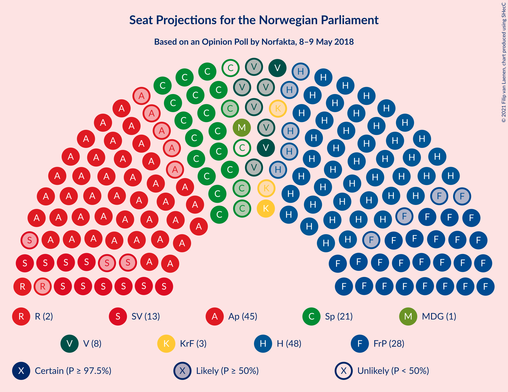

### Confidence Intervals

| Party | Last Result | Median | 80% Confidence Interval | 90% Confidence Interval | 95% Confidence Interval | 99% Confidence Interval |
|:-----:|:-----------:|:------:|:-----------------------:|:-----------------------:|:-----------------------:|:-----------------------:|
| <a href="#høyre">Høyre</a> | 45 | 48 | 45–53 |44–53 |43–54 |41–57 |
| <a href="#arbeiderpartiet">Arbeiderpartiet</a> | 49 | 45 | 42–49 |41–49 |40–51 |39–54 |
| <a href="#fremskrittspartiet">Fremskrittspartiet</a> | 27 | 28 | 26–31 |25–32 |24–32 |23–34 |
| <a href="#senterpartiet">Senterpartiet</a> | 19 | 19 | 17–22 |17–22 |16–22 |15–25 |
| <a href="#sosialistisk-venstreparti">Sosialistisk Venstreparti</a> | 11 | 13 | 11–15 |10–15 |10–16 |9–17 |
| <a href="#venstre">Venstre</a> | 8 | 8 | 2–9 |2–9 |2–10 |2–11 |
| <a href="#kristelig-folkeparti">Kristelig Folkeparti</a> | 8 | 3 | 2–9 |2–10 |1–10 |1–10 |
| <a href="#rødt">Rødt</a> | 1 | 2 | 1–7 |1–8 |1–8 |1–9 |
| <a href="#miljøpartiet-de-grønne">Miljøpartiet De Grønne</a> | 1 | 1 | 1–2 |1–8 |1–8 |0–9 |

### Høyre

*For a full overview of the results for this party, see the [Høyre](party-høyre.html) page.*

| Number of Seats | Probability | Accumulated | Special Marks |
|:---------------:|:-----------:|:-----------:|:-------------:|
| 39 | 0.1% | 100% |  |
| 40 | 0.2% | 99.9% |  |
| 41 | 0.4% | 99.7% |  |
| 42 | 2% | 99.2% |  |
| 43 | 1.2% | 98% |  |
| 44 | 3% | 96% |  |
| 45 | 16% | 94% | Last Result |
| 46 | 7% | 77% |  |
| 47 | 14% | 70% |  |
| 48 | 10% | 56% | Median |
| 49 | 9% | 46% |  |
| 50 | 13% | 37% |  |
| 51 | 8% | 24% |  |
| 52 | 6% | 16% |  |
| 53 | 6% | 10% |  |
| 54 | 2% | 4% |  |
| 55 | 1.2% | 2% |  |
| 56 | 0.5% | 1.3% |  |
| 57 | 0.5% | 0.8% |  |
| 58 | 0.1% | 0.3% |  |
| 59 | 0.2% | 0.2% |  |
| 60 | 0% | 0% |  |

### Arbeiderpartiet

*For a full overview of the results for this party, see the [Arbeiderpartiet](party-arbeiderpartiet.html) page.*

| Number of Seats | Probability | Accumulated | Special Marks |
|:---------------:|:-----------:|:-----------:|:-------------:|
| 37 | 0.1% | 100% |  |
| 38 | 0.4% | 99.9% |  |
| 39 | 0.5% | 99.5% |  |
| 40 | 2% | 99.0% |  |
| 41 | 3% | 97% |  |
| 42 | 6% | 94% |  |
| 43 | 18% | 88% |  |
| 44 | 17% | 70% |  |
| 45 | 7% | 52% | Median |
| 46 | 4% | 46% |  |
| 47 | 16% | 41% |  |
| 48 | 12% | 25% |  |
| 49 | 9% | 14% | Last Result |
| 50 | 2% | 5% |  |
| 51 | 1.1% | 3% |  |
| 52 | 0.3% | 1.5% |  |
| 53 | 0.6% | 1.2% |  |
| 54 | 0.5% | 0.6% |  |
| 55 | 0.1% | 0.1% |  |
| 56 | 0% | 0% |  |

### Fremskrittspartiet

*For a full overview of the results for this party, see the [Fremskrittspartiet](party-fremskrittspartiet.html) page.*

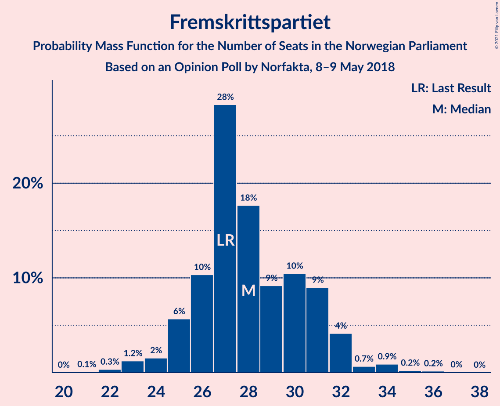

| Number of Seats | Probability | Accumulated | Special Marks |
|:---------------:|:-----------:|:-----------:|:-------------:|
| 21 | 0.1% | 100% |  |
| 22 | 0.3% | 99.9% |  |
| 23 | 1.2% | 99.6% |  |
| 24 | 2% | 98% |  |
| 25 | 6% | 97% |  |
| 26 | 10% | 91% |  |
| 27 | 28% | 81% | Last Result |
| 28 | 18% | 52% | Median |
| 29 | 9% | 35% |  |
| 30 | 10% | 26% |  |
| 31 | 9% | 15% |  |
| 32 | 4% | 6% |  |
| 33 | 0.7% | 2% |  |
| 34 | 0.9% | 1.4% |  |
| 35 | 0.2% | 0.5% |  |
| 36 | 0.2% | 0.2% |  |
| 37 | 0% | 0.1% |  |
| 38 | 0% | 0% |  |

### Senterpartiet

*For a full overview of the results for this party, see the [Senterpartiet](party-senterpartiet.html) page.*

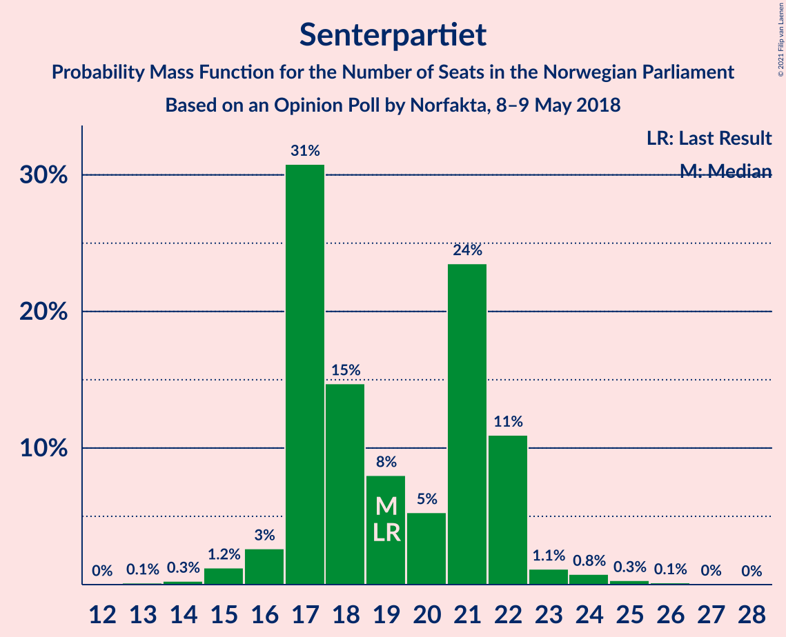

| Number of Seats | Probability | Accumulated | Special Marks |
|:---------------:|:-----------:|:-----------:|:-------------:|
| 13 | 0.1% | 100% |  |
| 14 | 0.3% | 99.8% |  |
| 15 | 1.2% | 99.6% |  |
| 16 | 3% | 98% |  |
| 17 | 31% | 96% |  |
| 18 | 15% | 65% |  |
| 19 | 8% | 50% | Last Result, Median |
| 20 | 5% | 42% |  |
| 21 | 24% | 37% |  |
| 22 | 11% | 13% |  |
| 23 | 1.1% | 2% |  |
| 24 | 0.8% | 1.3% |  |
| 25 | 0.3% | 0.5% |  |
| 26 | 0.1% | 0.2% |  |
| 27 | 0% | 0.1% |  |
| 28 | 0% | 0% |  |

### Sosialistisk Venstreparti

*For a full overview of the results for this party, see the [Sosialistisk Venstreparti](party-sosialistiskvenstreparti.html) page.*

| Number of Seats | Probability | Accumulated | Special Marks |
|:---------------:|:-----------:|:-----------:|:-------------:|
| 8 | 0.2% | 100% |  |
| 9 | 0.8% | 99.8% |  |
| 10 | 5% | 99.0% |  |
| 11 | 13% | 94% | Last Result |
| 12 | 21% | 81% |  |
| 13 | 29% | 59% | Median |
| 14 | 17% | 30% |  |
| 15 | 9% | 13% |  |
| 16 | 3% | 4% |  |
| 17 | 0.4% | 0.7% |  |
| 18 | 0.2% | 0.3% |  |
| 19 | 0% | 0.1% |  |
| 20 | 0% | 0% |  |

### Venstre

*For a full overview of the results for this party, see the [Venstre](party-venstre.html) page.*

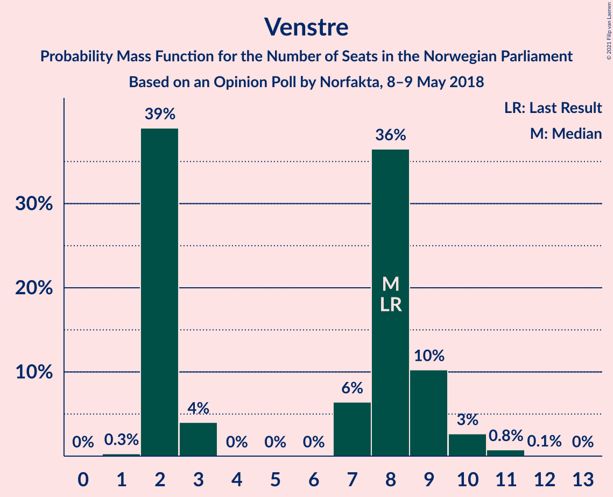

| Number of Seats | Probability | Accumulated | Special Marks |
|:---------------:|:-----------:|:-----------:|:-------------:|
| 1 | 0.3% | 100% |  |
| 2 | 39% | 99.7% |  |
| 3 | 4% | 61% |  |
| 4 | 0% | 57% |  |
| 5 | 0% | 57% |  |
| 6 | 0% | 57% |  |
| 7 | 6% | 57% |  |
| 8 | 36% | 50% | Last Result, Median |
| 9 | 10% | 14% |  |
| 10 | 3% | 4% |  |
| 11 | 0.8% | 0.9% |  |
| 12 | 0.1% | 0.1% |  |
| 13 | 0% | 0% |  |

### Kristelig Folkeparti

*For a full overview of the results for this party, see the [Kristelig Folkeparti](party-kristeligfolkeparti.html) page.*

| Number of Seats | Probability | Accumulated | Special Marks |
|:---------------:|:-----------:|:-----------:|:-------------:|
| 0 | 0.3% | 100% |  |
| 1 | 3% | 99.7% |  |
| 2 | 8% | 96% |  |
| 3 | 40% | 88% | Median |
| 4 | 0% | 48% |  |
| 5 | 0% | 48% |  |
| 6 | 0% | 48% |  |
| 7 | 11% | 48% |  |
| 8 | 20% | 37% | Last Result |
| 9 | 11% | 17% |  |
| 10 | 5% | 6% |  |
| 11 | 0.4% | 0.5% |  |
| 12 | 0.1% | 0.1% |  |
| 13 | 0% | 0% |  |

### Rødt

*For a full overview of the results for this party, see the [Rødt](party-rødt.html) page.*

| Number of Seats | Probability | Accumulated | Special Marks |
|:---------------:|:-----------:|:-----------:|:-------------:|
| 1 | 22% | 100% | Last Result |
| 2 | 64% | 78% | Median |
| 3 | 0% | 13% |  |
| 4 | 0% | 13% |  |
| 5 | 0% | 13% |  |
| 6 | 0% | 13% |  |
| 7 | 6% | 13% |  |
| 8 | 6% | 7% |  |
| 9 | 1.4% | 2% |  |
| 10 | 0.2% | 0.2% |  |
| 11 | 0% | 0% |  |

### Miljøpartiet De Grønne

*For a full overview of the results for this party, see the [Miljøpartiet De Grønne](party-miljøpartietdegrønne.html) page.*

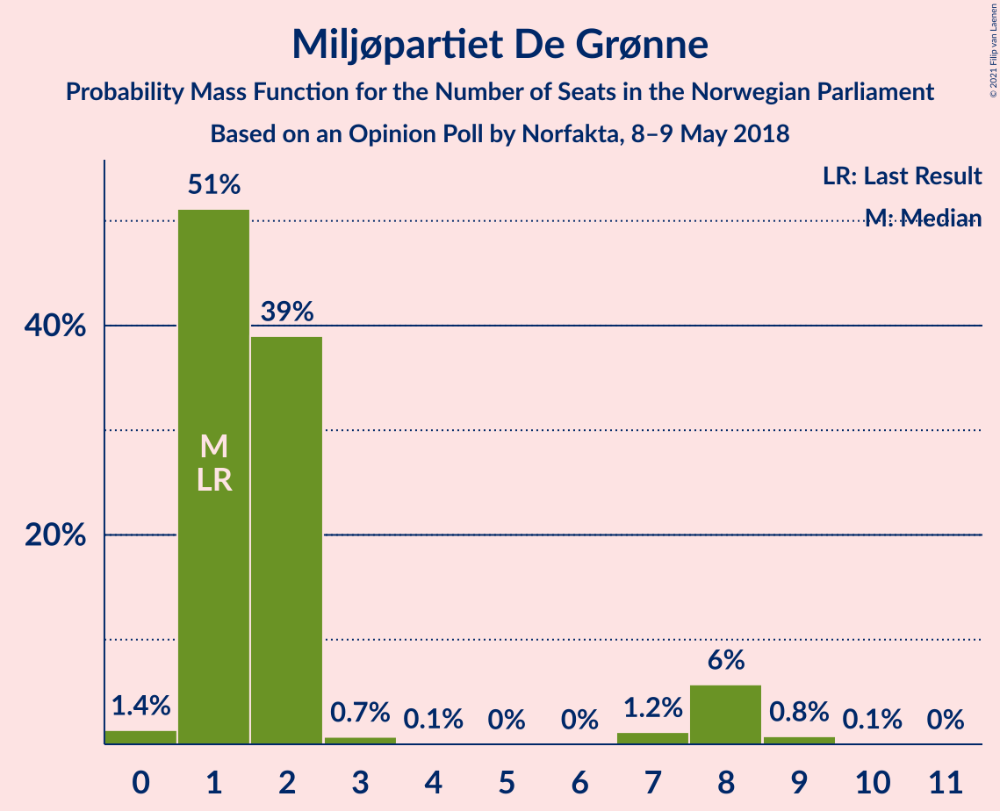

| Number of Seats | Probability | Accumulated | Special Marks |
|:---------------:|:-----------:|:-----------:|:-------------:|
| 0 | 1.4% | 100% |  |
| 1 | 51% | 98.6% | Last Result, Median |
| 2 | 39% | 47% |  |
| 3 | 0.7% | 9% |  |
| 4 | 0.1% | 8% |  |
| 5 | 0% | 8% |  |
| 6 | 0% | 8% |  |
| 7 | 1.2% | 8% |  |
| 8 | 6% | 7% |  |
| 9 | 0.8% | 0.8% |  |
| 10 | 0.1% | 0.1% |  |
| 11 | 0% | 0% |  |

## Coalitions

### Confidence Intervals

| Coalition | Last Result | Median | Majority? | 80% Confidence Interval | 90% Confidence Interval | 95% Confidence Interval | 99% Confidence Interval |
|:---------:|:-----------:|:------:|:---------:|:-----------------------:|:-----------------------:|:-----------------------:|:-----------------------:|
| Høyre – Fremskrittspartiet – Senterpartiet – Kristelig Folkeparti – Venstre | 107 | 106 | 100% | 102–111 | 101–111 | 99–113 | 97–115 |
| Høyre – Fremskrittspartiet – Kristelig Folkeparti – Venstre – Miljøpartiet De Grønne | 89 | 89 | 94% | 85–95 | 83–96 | 82–96 | 78–98 |
| Høyre – Fremskrittspartiet – Kristelig Folkeparti – Venstre | 88 | 87 | 72% | 83–93 | 81–94 | 80–94 | 77–96 |
| Arbeiderpartiet – Senterpartiet – Sosialistisk Venstreparti – Kristelig Folkeparti – Miljøpartiet De Grønne | 88 | 84 | 49% | 81–89 | 79–90 | 78–91 | 75–94 |
| Arbeiderpartiet – Senterpartiet – Sosialistisk Venstreparti – Rødt – Miljøpartiet De Grønne | 81 | 82 | 28% | 76–86 | 75–88 | 75–89 | 73–92 |
| Høyre – Fremskrittspartiet – Venstre | 80 | 82 | 23% | 78–85 | 76–87 | 75–89 | 73–91 |
| Arbeiderpartiet – Senterpartiet – Sosialistisk Venstreparti – Miljøpartiet De Grønne | 80 | 80 | 6% | 74–84 | 73–85 | 73–87 | 71–88 |
| Arbeiderpartiet – Senterpartiet – Sosialistisk Venstreparti – Rødt | 80 | 80 | 6% | 74–84 | 73–86 | 73–87 | 71–91 |
| Arbeiderpartiet – Senterpartiet – Sosialistisk Venstreparti | 79 | 78 | 2% | 72–82 | 72–82 | 71–84 | 69–86 |
| Høyre – Fremskrittspartiet | 72 | 76 | 1.5% | 72–81 | 71–83 | 70–83 | 68–86 |
| Arbeiderpartiet – Senterpartiet – Kristelig Folkeparti – Miljøpartiet De Grønne | 77 | 72 | 0.1% | 68–76 | 66–78 | 65–79 | 63–81 |
| Arbeiderpartiet – Senterpartiet – Kristelig Folkeparti | 76 | 70 | 0% | 66–74 | 64–76 | 63–77 | 61–80 |
| Arbeiderpartiet – Senterpartiet | 68 | 65 | 0% | 60–69 | 60–69 | 59–71 | 56–74 |
| Høyre – Kristelig Folkeparti – Venstre | 61 | 59 | 0% | 55–65 | 52–67 | 52–67 | 49–69 |
| Arbeiderpartiet – Sosialistisk Venstreparti | 60 | 58 | 0% | 55–62 | 53–62 | 53–64 | 51–66 |
| Senterpartiet – Kristelig Folkeparti – Venstre | 35 | 31 | 0% | 24–34 | 23–36 | 22–37 | 20–39 |

### Høyre – Fremskrittspartiet – Senterpartiet – Kristelig Folkeparti – Venstre

| Number of Seats | Probability | Accumulated | Special Marks |
|:---------------:|:-----------:|:-----------:|:-------------:|
| 95 | 0.2% | 100% |  |
| 96 | 0.1% | 99.8% |  |
| 97 | 0.5% | 99.7% |  |
| 98 | 1.4% | 99.2% |  |
| 99 | 2% | 98% |  |
| 100 | 1.1% | 96% |  |
| 101 | 3% | 95% |  |
| 102 | 2% | 92% |  |
| 103 | 6% | 90% |  |
| 104 | 17% | 84% |  |
| 105 | 10% | 67% |  |
| 106 | 13% | 57% | Median |
| 107 | 4% | 44% | Last Result |
| 108 | 14% | 40% |  |
| 109 | 5% | 27% |  |
| 110 | 9% | 22% |  |
| 111 | 8% | 13% |  |
| 112 | 2% | 5% |  |
| 113 | 1.3% | 3% |  |
| 114 | 1.0% | 1.5% |  |
| 115 | 0.3% | 0.5% |  |
| 116 | 0.2% | 0.2% |  |
| 117 | 0% | 0.1% |  |
| 118 | 0% | 0% |  |

### Høyre – Fremskrittspartiet – Kristelig Folkeparti – Venstre – Miljøpartiet De Grønne

| Number of Seats | Probability | Accumulated | Special Marks |
|:---------------:|:-----------:|:-----------:|:-------------:|
| 76 | 0.1% | 100% |  |
| 77 | 0% | 99.9% |  |
| 78 | 0.3% | 99.8% |  |
| 79 | 0.1% | 99.5% |  |
| 80 | 0.2% | 99.3% |  |
| 81 | 0.9% | 99.2% |  |
| 82 | 2% | 98% |  |
| 83 | 2% | 97% |  |
| 84 | 1.0% | 95% |  |
| 85 | 14% | 94% | Majority |
| 86 | 2% | 79% |  |
| 87 | 5% | 77% |  |
| 88 | 19% | 72% | Median |
| 89 | 10% | 53% | Last Result |
| 90 | 10% | 43% |  |
| 91 | 8% | 34% |  |
| 92 | 5% | 26% |  |
| 93 | 5% | 21% |  |
| 94 | 6% | 16% |  |
| 95 | 2% | 10% |  |
| 96 | 6% | 8% |  |
| 97 | 0.5% | 2% |  |
| 98 | 0.9% | 1.2% |  |
| 99 | 0.2% | 0.3% |  |
| 100 | 0.1% | 0.1% |  |
| 101 | 0% | 0% |  |

### Høyre – Fremskrittspartiet – Kristelig Folkeparti – Venstre

| Number of Seats | Probability | Accumulated | Special Marks |
|:---------------:|:-----------:|:-----------:|:-------------:|
| 75 | 0.2% | 100% |  |
| 76 | 0% | 99.8% |  |
| 77 | 0.4% | 99.8% |  |
| 78 | 0.3% | 99.3% |  |
| 79 | 0.4% | 99.1% |  |
| 80 | 3% | 98.7% |  |
| 81 | 3% | 95% |  |
| 82 | 2% | 93% |  |
| 83 | 11% | 91% |  |
| 84 | 7% | 80% |  |
| 85 | 2% | 72% | Majority |
| 86 | 7% | 71% |  |
| 87 | 19% | 64% | Median |
| 88 | 5% | 44% | Last Result |
| 89 | 15% | 39% |  |
| 90 | 3% | 24% |  |
| 91 | 7% | 22% |  |
| 92 | 2% | 15% |  |
| 93 | 5% | 13% |  |
| 94 | 6% | 8% |  |
| 95 | 0.8% | 2% |  |
| 96 | 0.9% | 1.1% |  |
| 97 | 0.1% | 0.2% |  |
| 98 | 0.1% | 0.1% |  |
| 99 | 0% | 0% |  |

### Arbeiderpartiet – Senterpartiet – Sosialistisk Venstreparti – Kristelig Folkeparti – Miljøpartiet De Grønne

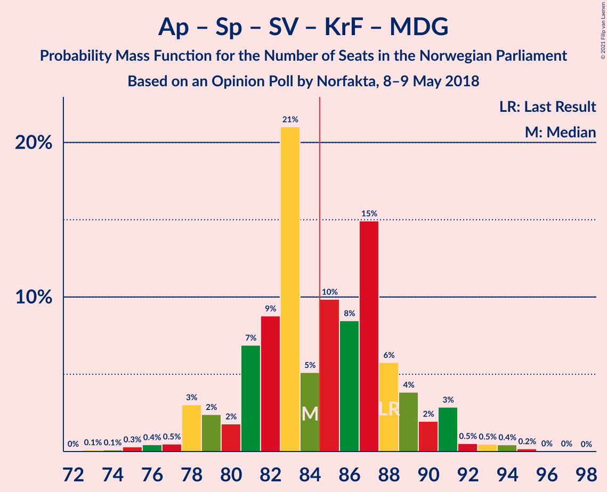

| Number of Seats | Probability | Accumulated | Special Marks |
|:---------------:|:-----------:|:-----------:|:-------------:|
| 73 | 0.1% | 100% |  |
| 74 | 0.1% | 99.8% |  |
| 75 | 0.3% | 99.7% |  |
| 76 | 0.4% | 99.4% |  |
| 77 | 0.5% | 99.0% |  |
| 78 | 3% | 98% |  |
| 79 | 2% | 95% |  |
| 80 | 2% | 93% |  |
| 81 | 7% | 91% | Median |
| 82 | 9% | 84% |  |
| 83 | 21% | 76% |  |
| 84 | 5% | 55% |  |
| 85 | 10% | 49% | Majority |
| 86 | 8% | 40% |  |
| 87 | 15% | 31% |  |
| 88 | 6% | 16% | Last Result |
| 89 | 4% | 10% |  |
| 90 | 2% | 7% |  |
| 91 | 3% | 5% |  |
| 92 | 0.5% | 2% |  |
| 93 | 0.5% | 1.2% |  |
| 94 | 0.4% | 0.7% |  |
| 95 | 0.2% | 0.3% |  |
| 96 | 0% | 0.1% |  |
| 97 | 0% | 0.1% |  |
| 98 | 0% | 0% |  |

### Arbeiderpartiet – Senterpartiet – Sosialistisk Venstreparti – Rødt – Miljøpartiet De Grønne

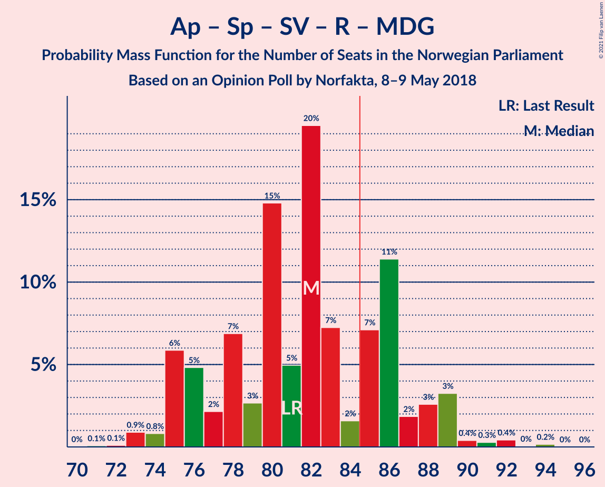

| Number of Seats | Probability | Accumulated | Special Marks |
|:---------------:|:-----------:|:-----------:|:-------------:|
| 71 | 0.1% | 100% |  |
| 72 | 0.1% | 99.9% |  |
| 73 | 0.9% | 99.8% |  |
| 74 | 0.8% | 98.9% |  |
| 75 | 6% | 98% |  |
| 76 | 5% | 92% |  |
| 77 | 2% | 87% |  |
| 78 | 7% | 85% |  |
| 79 | 3% | 78% |  |
| 80 | 15% | 76% | Median |
| 81 | 5% | 61% | Last Result |
| 82 | 20% | 56% |  |
| 83 | 7% | 36% |  |
| 84 | 2% | 29% |  |
| 85 | 7% | 28% | Majority |
| 86 | 11% | 20% |  |
| 87 | 2% | 9% |  |
| 88 | 3% | 7% |  |
| 89 | 3% | 5% |  |
| 90 | 0.4% | 1.3% |  |
| 91 | 0.3% | 0.9% |  |
| 92 | 0.4% | 0.7% |  |
| 93 | 0% | 0.2% |  |
| 94 | 0.2% | 0.2% |  |
| 95 | 0% | 0% |  |

### Høyre – Fremskrittspartiet – Venstre

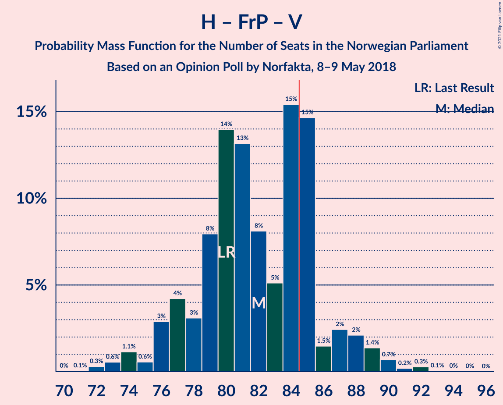

| Number of Seats | Probability | Accumulated | Special Marks |
|:---------------:|:-----------:|:-----------:|:-------------:|
| 70 | 0% | 100% |  |
| 71 | 0.1% | 99.9% |  |
| 72 | 0.3% | 99.9% |  |
| 73 | 0.6% | 99.6% |  |
| 74 | 1.1% | 99.0% |  |
| 75 | 0.6% | 98% |  |
| 76 | 3% | 97% |  |
| 77 | 4% | 94% |  |
| 78 | 3% | 90% |  |
| 79 | 8% | 87% |  |
| 80 | 14% | 79% | Last Result |
| 81 | 13% | 65% |  |
| 82 | 8% | 52% |  |
| 83 | 5% | 44% |  |
| 84 | 15% | 39% | Median |
| 85 | 15% | 23% | Majority |
| 86 | 1.5% | 9% |  |
| 87 | 2% | 7% |  |
| 88 | 2% | 5% |  |
| 89 | 1.4% | 3% |  |
| 90 | 0.7% | 1.3% |  |
| 91 | 0.2% | 0.6% |  |
| 92 | 0.3% | 0.4% |  |
| 93 | 0.1% | 0.1% |  |
| 94 | 0% | 0.1% |  |
| 95 | 0% | 0% |  |

### Arbeiderpartiet – Senterpartiet – Sosialistisk Venstreparti – Miljøpartiet De Grønne

| Number of Seats | Probability | Accumulated | Special Marks |
|:---------------:|:-----------:|:-----------:|:-------------:|
| 68 | 0% | 100% |  |
| 69 | 0.1% | 99.9% |  |
| 70 | 0.3% | 99.8% |  |
| 71 | 0.9% | 99.6% |  |
| 72 | 1.1% | 98.7% |  |
| 73 | 5% | 98% |  |
| 74 | 10% | 93% |  |
| 75 | 5% | 83% |  |
| 76 | 6% | 79% |  |
| 77 | 4% | 72% |  |
| 78 | 12% | 68% | Median |
| 79 | 4% | 56% |  |
| 80 | 18% | 52% | Last Result |
| 81 | 9% | 35% |  |
| 82 | 3% | 26% |  |
| 83 | 5% | 23% |  |
| 84 | 13% | 18% |  |
| 85 | 1.1% | 6% | Majority |
| 86 | 2% | 5% |  |
| 87 | 2% | 3% |  |
| 88 | 0.4% | 0.8% |  |
| 89 | 0.3% | 0.4% |  |
| 90 | 0.1% | 0.1% |  |
| 91 | 0% | 0.1% |  |
| 92 | 0% | 0% |  |

### Arbeiderpartiet – Senterpartiet – Sosialistisk Venstreparti – Rødt

| Number of Seats | Probability | Accumulated | Special Marks |
|:---------------:|:-----------:|:-----------:|:-------------:|
| 69 | 0.1% | 100% |  |
| 70 | 0.2% | 99.9% |  |
| 71 | 0.9% | 99.7% |  |
| 72 | 0.5% | 98.8% |  |
| 73 | 6% | 98% |  |
| 74 | 2% | 92% |  |
| 75 | 6% | 90% |  |
| 76 | 5% | 84% |  |
| 77 | 5% | 79% |  |
| 78 | 8% | 74% |  |
| 79 | 10% | 66% | Median |
| 80 | 10% | 57% | Last Result |
| 81 | 19% | 47% |  |
| 82 | 5% | 28% |  |
| 83 | 2% | 23% |  |
| 84 | 14% | 21% |  |
| 85 | 1.0% | 6% | Majority |
| 86 | 2% | 5% |  |
| 87 | 2% | 3% |  |
| 88 | 0.9% | 2% |  |
| 89 | 0.2% | 0.8% |  |
| 90 | 0.1% | 0.7% |  |
| 91 | 0.3% | 0.5% |  |
| 92 | 0% | 0.2% |  |
| 93 | 0.1% | 0.1% |  |
| 94 | 0% | 0% |  |

### Arbeiderpartiet – Senterpartiet – Sosialistisk Venstreparti

| Number of Seats | Probability | Accumulated | Special Marks |
|:---------------:|:-----------:|:-----------:|:-------------:|
| 67 | 0.1% | 100% |  |
| 68 | 0.2% | 99.9% |  |
| 69 | 1.1% | 99.7% |  |
| 70 | 0.6% | 98.5% |  |
| 71 | 1.0% | 98% |  |
| 72 | 11% | 97% |  |
| 73 | 7% | 86% |  |
| 74 | 8% | 79% |  |
| 75 | 4% | 71% |  |
| 76 | 10% | 67% |  |
| 77 | 7% | 57% | Median |
| 78 | 6% | 51% |  |
| 79 | 20% | 45% | Last Result |
| 80 | 4% | 24% |  |
| 81 | 1.4% | 20% |  |
| 82 | 15% | 19% |  |
| 83 | 0.8% | 4% |  |
| 84 | 1.2% | 3% |  |
| 85 | 1.0% | 2% | Majority |
| 86 | 0.7% | 1.1% |  |
| 87 | 0.2% | 0.4% |  |
| 88 | 0.1% | 0.1% |  |
| 89 | 0% | 0% |  |

### Høyre – Fremskrittspartiet

| Number of Seats | Probability | Accumulated | Special Marks |
|:---------------:|:-----------:|:-----------:|:-------------:|
| 65 | 0% | 100% |  |
| 66 | 0.1% | 99.9% |  |
| 67 | 0.2% | 99.8% |  |
| 68 | 0.7% | 99.7% |  |
| 69 | 0.3% | 99.0% |  |
| 70 | 2% | 98.7% |  |
| 71 | 2% | 96% |  |
| 72 | 12% | 94% | Last Result |
| 73 | 5% | 82% |  |
| 74 | 8% | 77% |  |
| 75 | 11% | 70% |  |
| 76 | 10% | 59% | Median |
| 77 | 16% | 49% |  |
| 78 | 5% | 32% |  |
| 79 | 7% | 27% |  |
| 80 | 8% | 20% |  |
| 81 | 2% | 12% |  |
| 82 | 4% | 10% |  |
| 83 | 3% | 6% |  |
| 84 | 0.8% | 2% |  |
| 85 | 0.4% | 1.5% | Majority |
| 86 | 0.5% | 1.0% |  |
| 87 | 0.3% | 0.5% |  |
| 88 | 0.2% | 0.2% |  |
| 89 | 0% | 0.1% |  |
| 90 | 0% | 0% |  |

### Arbeiderpartiet – Senterpartiet – Kristelig Folkeparti – Miljøpartiet De Grønne

| Number of Seats | Probability | Accumulated | Special Marks |
|:---------------:|:-----------:|:-----------:|:-------------:|
| 59 | 0.1% | 100% |  |
| 60 | 0% | 99.9% |  |
| 61 | 0.1% | 99.9% |  |
| 62 | 0.3% | 99.8% |  |
| 63 | 0.7% | 99.6% |  |
| 64 | 0.9% | 98.9% |  |
| 65 | 3% | 98% |  |
| 66 | 2% | 95% |  |
| 67 | 2% | 94% |  |
| 68 | 5% | 92% | Median |
| 69 | 22% | 86% |  |
| 70 | 3% | 64% |  |
| 71 | 7% | 61% |  |
| 72 | 10% | 54% |  |
| 73 | 9% | 44% |  |
| 74 | 19% | 35% |  |
| 75 | 3% | 16% |  |
| 76 | 4% | 13% |  |
| 77 | 2% | 9% | Last Result |
| 78 | 3% | 7% |  |
| 79 | 2% | 4% |  |
| 80 | 0.5% | 1.4% |  |
| 81 | 0.6% | 0.9% |  |
| 82 | 0.1% | 0.3% |  |
| 83 | 0.1% | 0.2% |  |
| 84 | 0.1% | 0.1% |  |
| 85 | 0% | 0.1% | Majority |
| 86 | 0% | 0% |  |

### Arbeiderpartiet – Senterpartiet – Kristelig Folkeparti

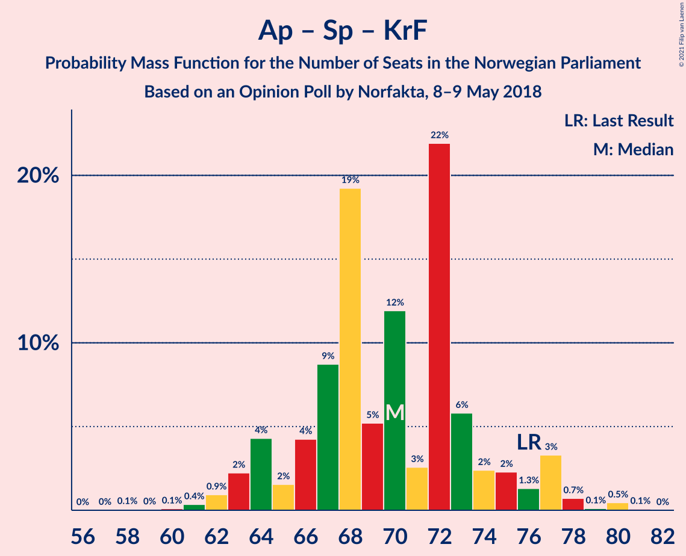

| Number of Seats | Probability | Accumulated | Special Marks |
|:---------------:|:-----------:|:-----------:|:-------------:|
| 58 | 0.1% | 100% |  |
| 59 | 0% | 99.9% |  |
| 60 | 0.1% | 99.8% |  |
| 61 | 0.4% | 99.7% |  |
| 62 | 0.9% | 99.4% |  |
| 63 | 2% | 98% |  |
| 64 | 4% | 96% |  |
| 65 | 2% | 92% |  |
| 66 | 4% | 90% |  |
| 67 | 9% | 86% | Median |
| 68 | 19% | 77% |  |
| 69 | 5% | 58% |  |
| 70 | 12% | 53% |  |
| 71 | 3% | 41% |  |
| 72 | 22% | 38% |  |
| 73 | 6% | 17% |  |
| 74 | 2% | 11% |  |
| 75 | 2% | 8% |  |
| 76 | 1.3% | 6% | Last Result |
| 77 | 3% | 5% |  |
| 78 | 0.7% | 1.4% |  |
| 79 | 0.1% | 0.7% |  |
| 80 | 0.5% | 0.6% |  |
| 81 | 0.1% | 0.1% |  |
| 82 | 0% | 0% |  |

### Arbeiderpartiet – Senterpartiet

| Number of Seats | Probability | Accumulated | Special Marks |
|:---------------:|:-----------:|:-----------:|:-------------:|
| 55 | 0.1% | 100% |  |
| 56 | 0.9% | 99.9% |  |
| 57 | 0.4% | 99.0% |  |
| 58 | 1.0% | 98.6% |  |
| 59 | 2% | 98% |  |
| 60 | 13% | 96% |  |
| 61 | 11% | 83% |  |
| 62 | 3% | 72% |  |
| 63 | 4% | 68% |  |
| 64 | 13% | 64% | Median |
| 65 | 15% | 51% |  |
| 66 | 9% | 36% |  |
| 67 | 5% | 27% |  |
| 68 | 5% | 22% | Last Result |
| 69 | 13% | 17% |  |
| 70 | 2% | 4% |  |
| 71 | 1.0% | 3% |  |
| 72 | 0.4% | 2% |  |
| 73 | 0.6% | 1.3% |  |
| 74 | 0.6% | 0.7% |  |
| 75 | 0.1% | 0.1% |  |
| 76 | 0% | 0% |  |

### Høyre – Kristelig Folkeparti – Venstre

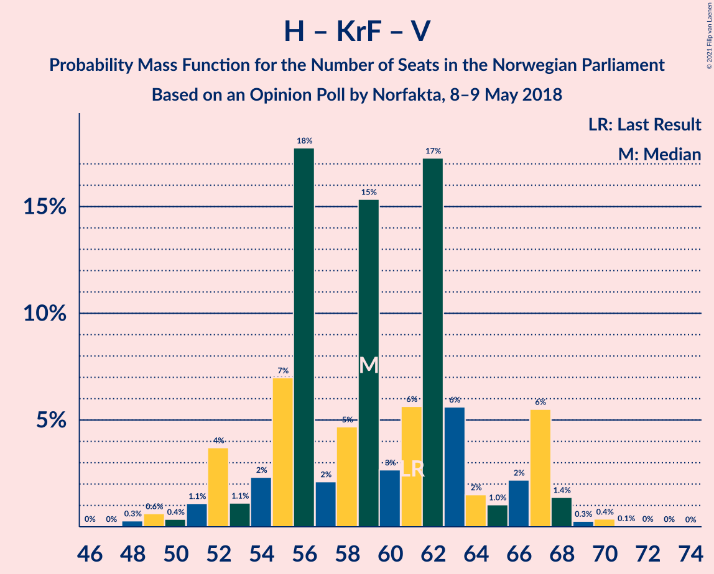

| Number of Seats | Probability | Accumulated | Special Marks |
|:---------------:|:-----------:|:-----------:|:-------------:|
| 46 | 0% | 100% |  |
| 47 | 0% | 99.9% |  |
| 48 | 0.3% | 99.9% |  |
| 49 | 0.6% | 99.6% |  |
| 50 | 0.4% | 99.0% |  |
| 51 | 1.1% | 98.7% |  |
| 52 | 4% | 98% |  |
| 53 | 1.1% | 94% |  |
| 54 | 2% | 93% |  |
| 55 | 7% | 90% |  |
| 56 | 18% | 83% |  |
| 57 | 2% | 66% |  |
| 58 | 5% | 64% |  |
| 59 | 15% | 59% | Median |
| 60 | 3% | 44% |  |
| 61 | 6% | 41% | Last Result |
| 62 | 17% | 35% |  |
| 63 | 6% | 18% |  |
| 64 | 2% | 12% |  |
| 65 | 1.0% | 11% |  |
| 66 | 2% | 10% |  |
| 67 | 6% | 8% |  |
| 68 | 1.4% | 2% |  |
| 69 | 0.3% | 0.7% |  |
| 70 | 0.4% | 0.5% |  |
| 71 | 0.1% | 0.1% |  |
| 72 | 0% | 0.1% |  |
| 73 | 0% | 0% |  |

### Arbeiderpartiet – Sosialistisk Venstreparti

| Number of Seats | Probability | Accumulated | Special Marks |
|:---------------:|:-----------:|:-----------:|:-------------:|
| 48 | 0% | 100% |  |
| 49 | 0.2% | 99.9% |  |
| 50 | 0.2% | 99.8% |  |
| 51 | 0.5% | 99.6% |  |
| 52 | 1.3% | 99.0% |  |
| 53 | 3% | 98% |  |
| 54 | 3% | 95% |  |
| 55 | 13% | 92% |  |
| 56 | 12% | 78% |  |
| 57 | 11% | 66% |  |
| 58 | 10% | 55% | Median |
| 59 | 8% | 46% |  |
| 60 | 9% | 37% | Last Result |
| 61 | 17% | 29% |  |
| 62 | 7% | 12% |  |
| 63 | 2% | 5% |  |
| 64 | 1.4% | 3% |  |
| 65 | 0.9% | 2% |  |
| 66 | 0.5% | 0.8% |  |
| 67 | 0.1% | 0.3% |  |
| 68 | 0.1% | 0.2% |  |
| 69 | 0.1% | 0.1% |  |
| 70 | 0.1% | 0.1% |  |
| 71 | 0% | 0% |  |

### Senterpartiet – Kristelig Folkeparti – Venstre

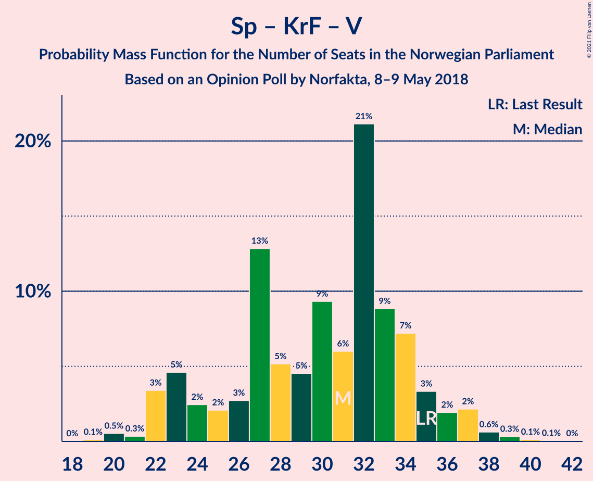

| Number of Seats | Probability | Accumulated | Special Marks |
|:---------------:|:-----------:|:-----------:|:-------------:|
| 19 | 0.1% | 100% |  |
| 20 | 0.5% | 99.8% |  |
| 21 | 0.3% | 99.3% |  |
| 22 | 3% | 99.0% |  |
| 23 | 5% | 96% |  |
| 24 | 2% | 91% |  |
| 25 | 2% | 88% |  |
| 26 | 3% | 86% |  |
| 27 | 13% | 84% |  |
| 28 | 5% | 71% |  |
| 29 | 5% | 66% |  |
| 30 | 9% | 61% | Median |
| 31 | 6% | 52% |  |
| 32 | 21% | 46% |  |
| 33 | 9% | 25% |  |
| 34 | 7% | 16% |  |
| 35 | 3% | 9% | Last Result |
| 36 | 2% | 5% |  |
| 37 | 2% | 3% |  |
| 38 | 0.6% | 1.2% |  |
| 39 | 0.3% | 0.6% |  |
| 40 | 0.1% | 0.2% |  |
| 41 | 0.1% | 0.1% |  |
| 42 | 0% | 0% |  |

## Technical Information

### Opinion Poll

+ **Polling firm:** Norfakta
+ **Commissioner(s):** —
+ **Fieldwork period:** 8–9 May 2018

### Calculations

+ **Sample size:** 810
+ **Simulations done:** 524,288
+ **Error estimate:** 3.08%

