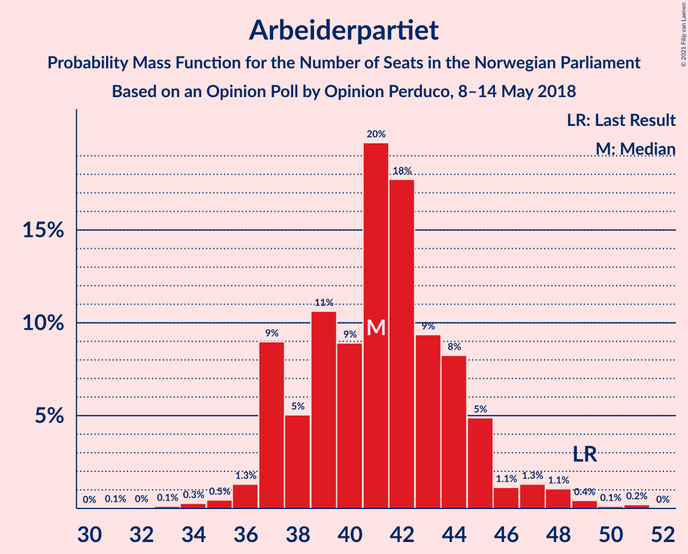
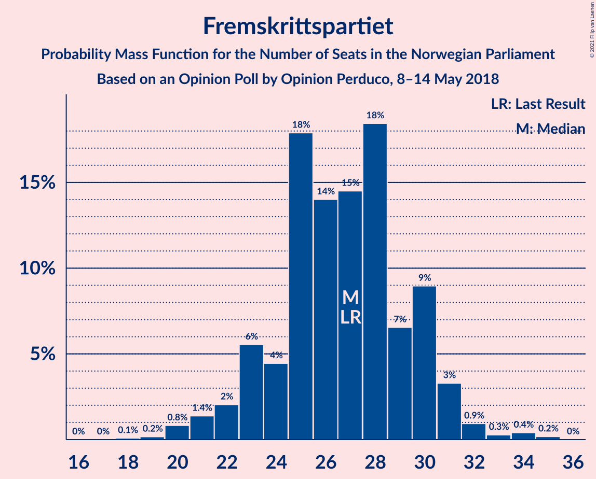
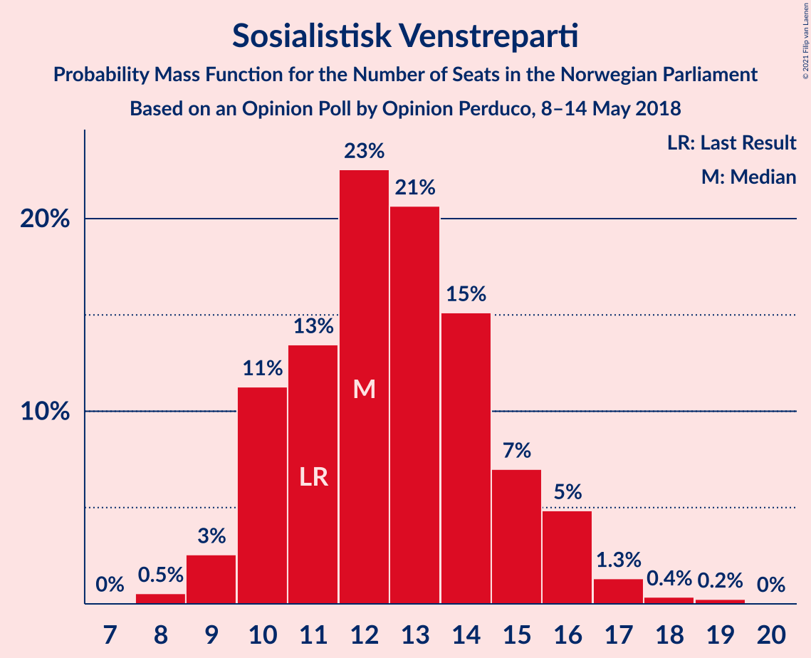
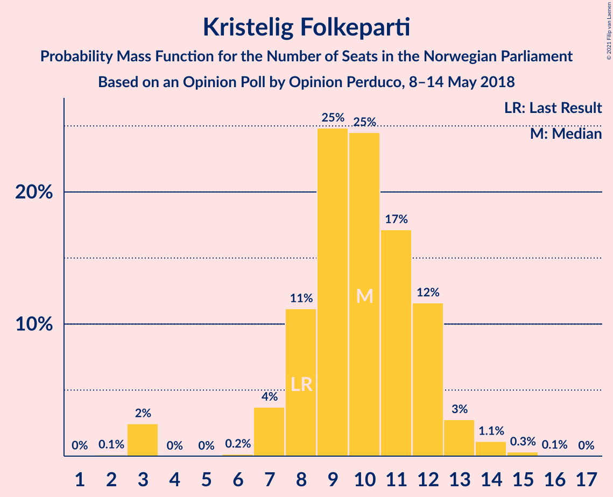
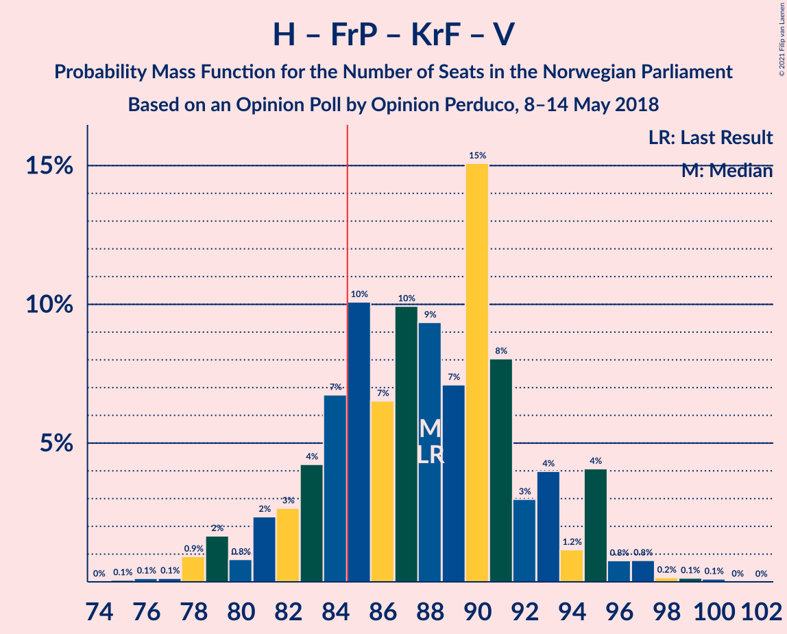
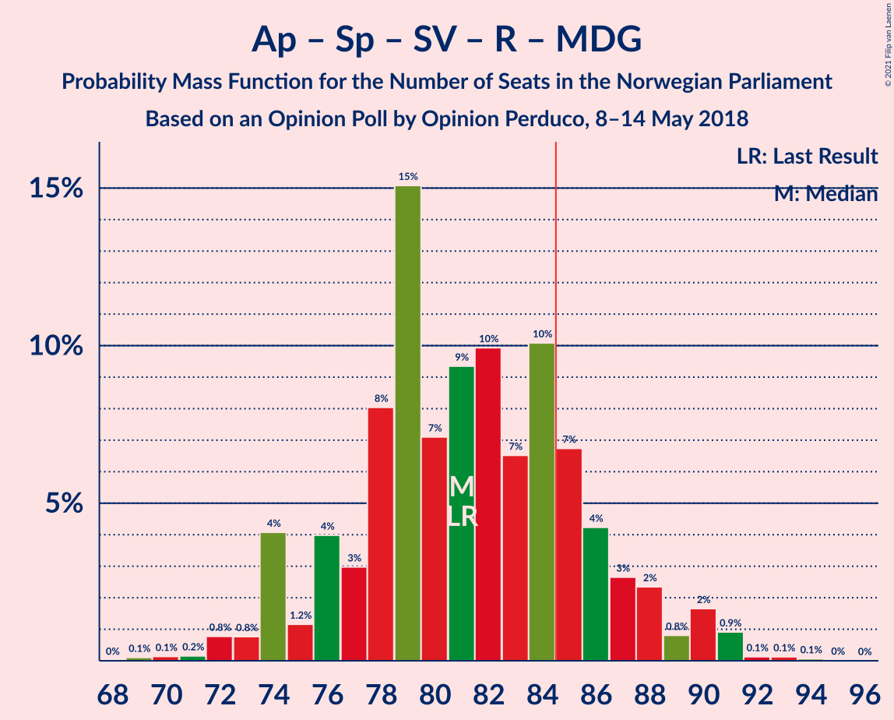
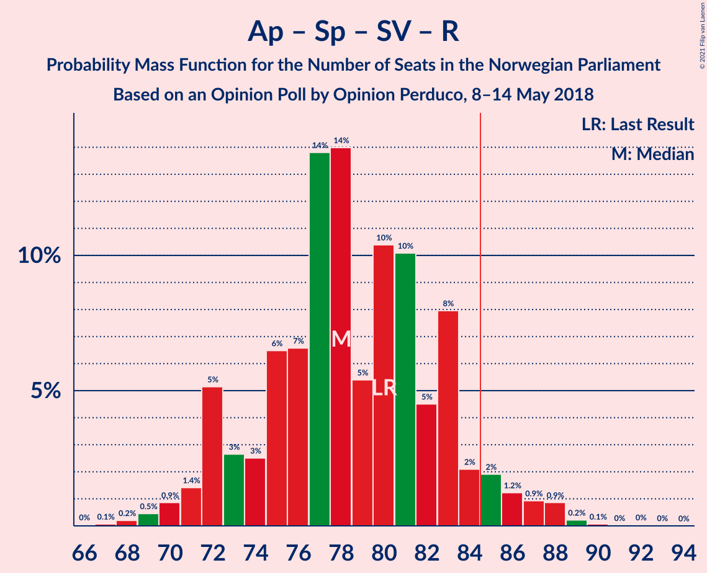
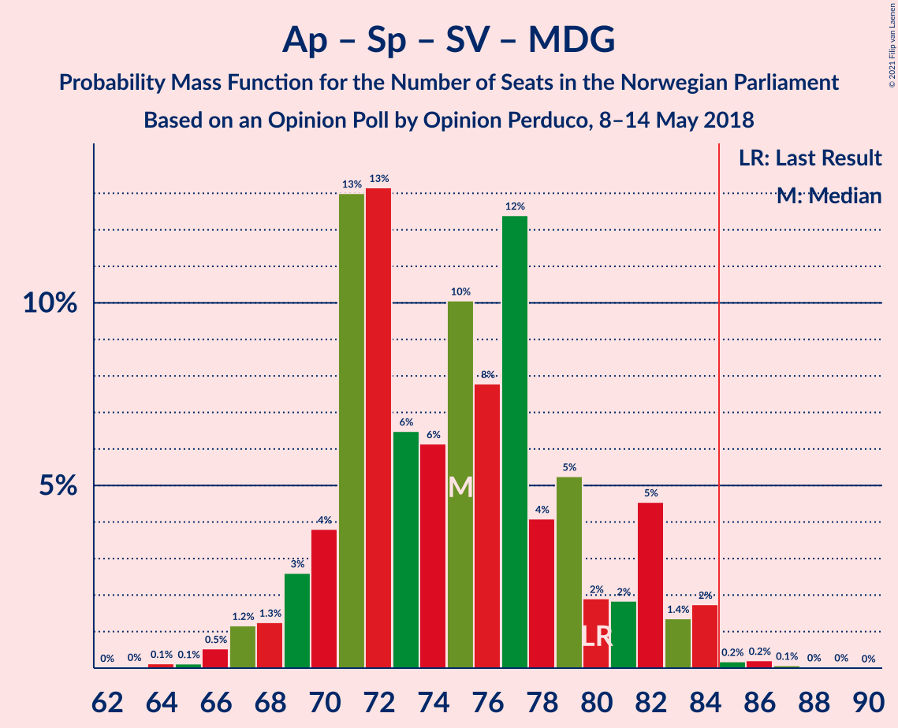
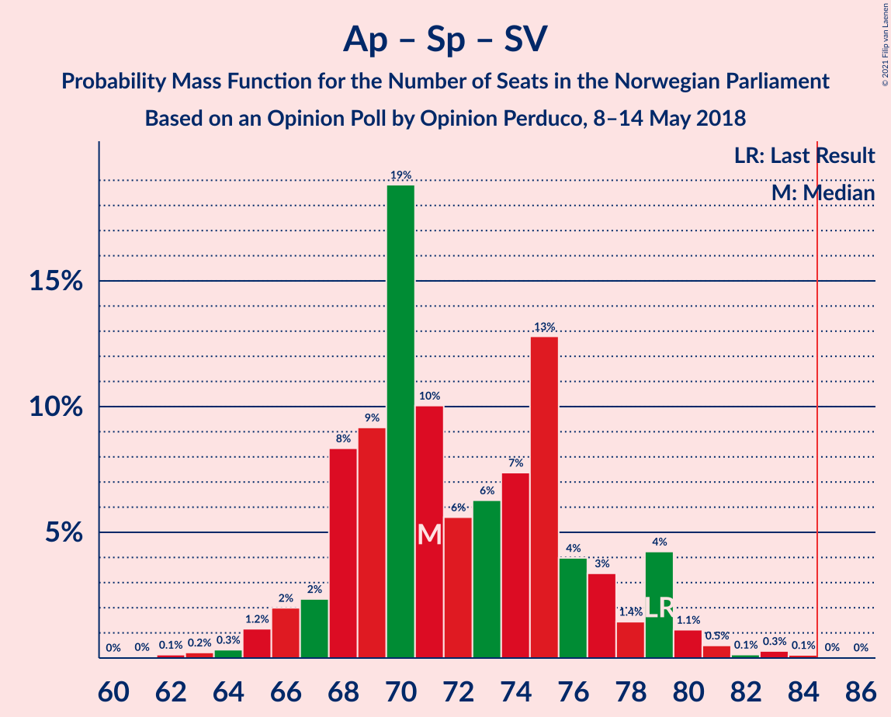
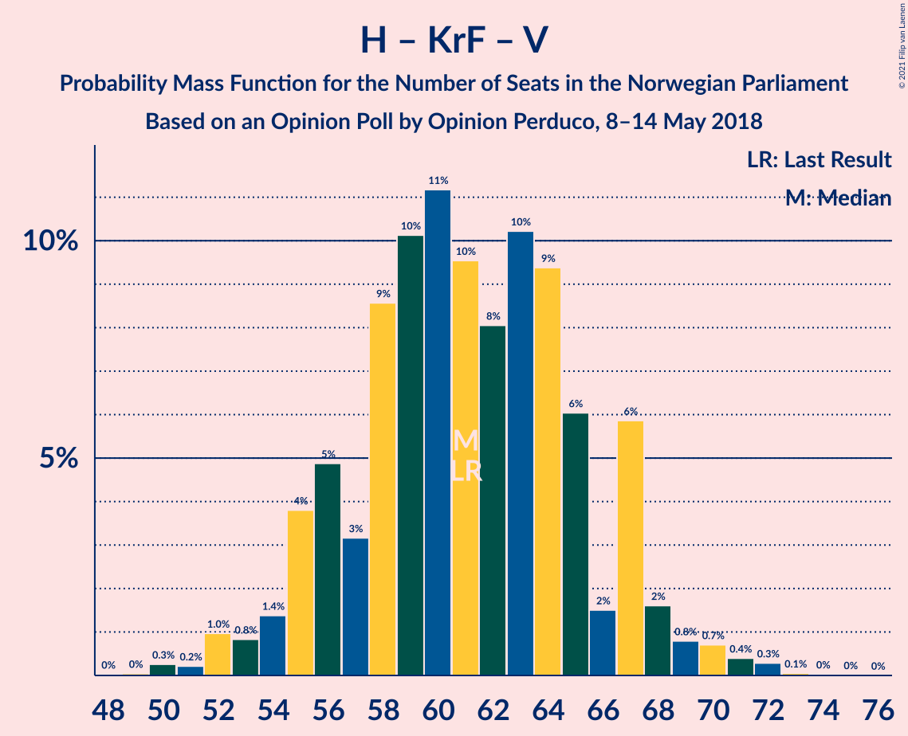

# Opinion Poll by Opinion Perduco, 8–14 May 2018

<a href="#voting-intentions">Voting Intentions</a> | <a href="#seats">Seats</a> | <a href="#coalitions">Coalitions</a> | <a href="#technical-information">Technical Information</a>

## Voting Intentions

### Confidence Intervals

| Party | Last Result | Poll Result | 80% Confidence Interval | 90% Confidence Interval | 95% Confidence Interval | 99% Confidence Interval |
|:-----:|:-----------:|:-----------:|:-----------------------:|:-----------------------:|:-----------------------:|:-----------------------:|
| Høyre | 25.0% | 26.5% | 24.4–28.8% |23.9–29.4% |23.4–29.9% |22.4–31.0% |
| Arbeiderpartiet | 27.4% | 22.8% | 20.8–24.9% |20.2–25.5% |19.8–26.0% |18.9–27.1% |
| Fremskrittspartiet | 15.2% | 14.9% | 13.3–16.8% |12.8–17.3% |12.5–17.8% |11.7–18.7% |
| Senterpartiet | 10.3% | 10.4% | 9.1–12.1% |8.7–12.5% |8.4–13.0% |7.8–13.8% |
| Sosialistisk Venstreparti | 6.0% | 7.1% | 6.0–8.5% |5.7–8.9% |5.4–9.3% |4.9–10.0% |
| Kristelig Folkeparti | 4.2% | 5.5% | 4.5–6.8% |4.3–7.1% |4.0–7.5% |3.6–8.1% |
| Rødt | 2.4% | 4.3% | 3.5–5.5% |3.3–5.9% |3.1–6.1% |2.7–6.8% |
| Venstre | 4.4% | 3.8% | 3.0–4.9% |2.8–5.2% |2.6–5.5% |2.3–6.1% |
| Miljøpartiet De Grønne | 3.2% | 3.3% | 2.6–4.4% |2.4–4.7% |2.2–5.0% |1.9–5.5% |

*Note:* The poll result column reflects the actual value used in the calculations. Published results may vary slightly, and in addition be rounded to fewer digits.

## Seats

### Confidence Intervals

| Party | Last Result | Median | 80% Confidence Interval | 90% Confidence Interval | 95% Confidence Interval | 99% Confidence Interval |
|:-----:|:-----------:|:------:|:-----------------------:|:-----------------------:|:-----------------------:|:-----------------------:|
| <a href="#høyre">Høyre</a> | 45 | 45 | 42–50 |41–51 |41–54 |39–55 |
| <a href="#arbeiderpartiet">Arbeiderpartiet</a> | 49 | 40 | 38–45 |37–46 |37–48 |34–50 |
| <a href="#fremskrittspartiet">Fremskrittspartiet</a> | 27 | 26 | 22–29 |22–30 |21–32 |20–35 |
| <a href="#senterpartiet">Senterpartiet</a> | 19 | 18 | 17–21 |16–23 |15–23 |14–24 |
| <a href="#sosialistisk-venstreparti">Sosialistisk Venstreparti</a> | 11 | 12 | 10–15 |10–15 |9–16 |8–18 |
| <a href="#kristelig-folkeparti">Kristelig Folkeparti</a> | 8 | 9 | 8–12 |7–13 |3–13 |3–15 |
| <a href="#rødt">Rødt</a> | 1 | 7 | 2–10 |2–10 |2–10 |1–12 |
| <a href="#venstre">Venstre</a> | 8 | 7 | 2–8 |2–9 |2–9 |1–11 |
| <a href="#miljøpartiet-de-grønne">Miljøpartiet De Grønne</a> | 1 | 2 | 1–8 |1–8 |1–8 |0–9 |

### Høyre

*For a full overview of the results for this party, see the [Høyre](party-høyre.html) page.*

| Number of Seats | Probability | Accumulated | Special Marks |
|:---------------:|:-----------:|:-----------:|:-------------:|
| 37 | 0.3% | 100% |  |
| 38 | 0.2% | 99.7% |  |
| 39 | 0.3% | 99.5% |  |
| 40 | 0.7% | 99.2% |  |
| 41 | 6% | 98.5% |  |
| 42 | 7% | 93% |  |
| 43 | 10% | 85% |  |
| 44 | 23% | 75% |  |
| 45 | 5% | 52% | Last Result, Median |
| 46 | 9% | 48% |  |
| 47 | 8% | 39% |  |
| 48 | 8% | 30% |  |
| 49 | 6% | 22% |  |
| 50 | 9% | 16% |  |
| 51 | 2% | 7% |  |
| 52 | 0.8% | 5% |  |
| 53 | 0.9% | 4% |  |
| 54 | 2% | 3% |  |
| 55 | 1.0% | 1.2% |  |
| 56 | 0% | 0.2% |  |
| 57 | 0.1% | 0.2% |  |
| 58 | 0% | 0.1% |  |
| 59 | 0% | 0.1% |  |
| 60 | 0% | 0.1% |  |
| 61 | 0.1% | 0.1% |  |
| 62 | 0% | 0% |  |

### Arbeiderpartiet

*For a full overview of the results for this party, see the [Arbeiderpartiet](party-arbeiderpartiet.html) page.*

| Number of Seats | Probability | Accumulated | Special Marks |
|:---------------:|:-----------:|:-----------:|:-------------:|
| 31 | 0.2% | 100% |  |
| 32 | 0% | 99.7% |  |
| 33 | 0.1% | 99.7% |  |
| 34 | 0.3% | 99.7% |  |
| 35 | 0.2% | 99.3% |  |
| 36 | 0.6% | 99.2% |  |
| 37 | 5% | 98.6% |  |
| 38 | 5% | 94% |  |
| 39 | 33% | 89% |  |
| 40 | 10% | 56% | Median |
| 41 | 7% | 46% |  |
| 42 | 7% | 39% |  |
| 43 | 15% | 32% |  |
| 44 | 3% | 17% |  |
| 45 | 9% | 14% |  |
| 46 | 1.3% | 5% |  |
| 47 | 0.8% | 4% |  |
| 48 | 2% | 3% |  |
| 49 | 0.1% | 0.8% | Last Result |
| 50 | 0.4% | 0.7% |  |
| 51 | 0.3% | 0.3% |  |
| 52 | 0% | 0% |  |

### Fremskrittspartiet

*For a full overview of the results for this party, see the [Fremskrittspartiet](party-fremskrittspartiet.html) page.*

| Number of Seats | Probability | Accumulated | Special Marks |
|:---------------:|:-----------:|:-----------:|:-------------:|
| 18 | 0% | 100% |  |
| 19 | 0.3% | 99.9% |  |
| 20 | 2% | 99.6% |  |
| 21 | 1.4% | 98% |  |
| 22 | 8% | 96% |  |
| 23 | 3% | 88% |  |
| 24 | 8% | 85% |  |
| 25 | 12% | 76% |  |
| 26 | 31% | 64% | Median |
| 27 | 15% | 33% | Last Result |
| 28 | 5% | 18% |  |
| 29 | 5% | 13% |  |
| 30 | 3% | 8% |  |
| 31 | 2% | 5% |  |
| 32 | 2% | 3% |  |
| 33 | 0.2% | 1.3% |  |
| 34 | 0.5% | 1.2% |  |
| 35 | 0.6% | 0.7% |  |
| 36 | 0% | 0% |  |

### Senterpartiet

*For a full overview of the results for this party, see the [Senterpartiet](party-senterpartiet.html) page.*

| Number of Seats | Probability | Accumulated | Special Marks |
|:---------------:|:-----------:|:-----------:|:-------------:|
| 12 | 0.1% | 100% |  |
| 13 | 0.4% | 99.9% |  |
| 14 | 2% | 99.5% |  |
| 15 | 1.5% | 98% |  |
| 16 | 5% | 96% |  |
| 17 | 35% | 92% |  |
| 18 | 16% | 56% | Median |
| 19 | 15% | 40% | Last Result |
| 20 | 13% | 25% |  |
| 21 | 4% | 12% |  |
| 22 | 2% | 8% |  |
| 23 | 5% | 7% |  |
| 24 | 0.9% | 1.2% |  |
| 25 | 0.1% | 0.2% |  |
| 26 | 0.1% | 0.1% |  |
| 27 | 0% | 0% |  |

### Sosialistisk Venstreparti

*For a full overview of the results for this party, see the [Sosialistisk Venstreparti](party-sosialistiskvenstreparti.html) page.*

| Number of Seats | Probability | Accumulated | Special Marks |
|:---------------:|:-----------:|:-----------:|:-------------:|
| 7 | 0.1% | 100% |  |
| 8 | 0.8% | 99.9% |  |
| 9 | 3% | 99.1% |  |
| 10 | 11% | 96% |  |
| 11 | 4% | 86% | Last Result |
| 12 | 40% | 82% | Median |
| 13 | 15% | 42% |  |
| 14 | 7% | 26% |  |
| 15 | 16% | 20% |  |
| 16 | 1.4% | 4% |  |
| 17 | 2% | 2% |  |
| 18 | 0.5% | 0.7% |  |
| 19 | 0.1% | 0.2% |  |
| 20 | 0% | 0% |  |

### Kristelig Folkeparti

*For a full overview of the results for this party, see the [Kristelig Folkeparti](party-kristeligfolkeparti.html) page.*

| Number of Seats | Probability | Accumulated | Special Marks |
|:---------------:|:-----------:|:-----------:|:-------------:|
| 2 | 0.1% | 100% |  |
| 3 | 3% | 99.9% |  |
| 4 | 0% | 97% |  |
| 5 | 0% | 97% |  |
| 6 | 1.3% | 97% |  |
| 7 | 1.1% | 96% |  |
| 8 | 7% | 95% | Last Result |
| 9 | 43% | 88% | Median |
| 10 | 17% | 46% |  |
| 11 | 14% | 29% |  |
| 12 | 7% | 15% |  |
| 13 | 5% | 7% |  |
| 14 | 1.0% | 2% |  |
| 15 | 0.9% | 1.1% |  |
| 16 | 0.1% | 0.2% |  |
| 17 | 0% | 0% |  |

### Rødt

*For a full overview of the results for this party, see the [Rødt](party-rødt.html) page.*

| Number of Seats | Probability | Accumulated | Special Marks |
|:---------------:|:-----------:|:-----------:|:-------------:|
| 1 | 2% | 100% | Last Result |
| 2 | 25% | 98% |  |
| 3 | 0% | 73% |  |
| 4 | 0% | 73% |  |
| 5 | 0% | 73% |  |
| 6 | 0.5% | 73% |  |
| 7 | 30% | 73% | Median |
| 8 | 16% | 43% |  |
| 9 | 12% | 27% |  |
| 10 | 13% | 15% |  |
| 11 | 1.2% | 2% |  |
| 12 | 0.3% | 0.8% |  |
| 13 | 0.5% | 0.5% |  |
| 14 | 0% | 0% |  |

### Venstre

*For a full overview of the results for this party, see the [Venstre](party-venstre.html) page.*

| Number of Seats | Probability | Accumulated | Special Marks |
|:---------------:|:-----------:|:-----------:|:-------------:|
| 1 | 0.6% | 100% |  |
| 2 | 39% | 99.4% |  |
| 3 | 1.2% | 61% |  |
| 4 | 0% | 60% |  |
| 5 | 0% | 60% |  |
| 6 | 0.2% | 60% |  |
| 7 | 12% | 59% | Median |
| 8 | 42% | 47% | Last Result |
| 9 | 3% | 5% |  |
| 10 | 1.1% | 2% |  |
| 11 | 0.5% | 0.6% |  |
| 12 | 0.1% | 0.1% |  |
| 13 | 0% | 0% |  |

### Miljøpartiet De Grønne

*For a full overview of the results for this party, see the [Miljøpartiet De Grønne](party-miljøpartietdegrønne.html) page.*

| Number of Seats | Probability | Accumulated | Special Marks |
|:---------------:|:-----------:|:-----------:|:-------------:|
| 0 | 0.8% | 100% |  |
| 1 | 33% | 99.2% | Last Result |
| 2 | 28% | 67% | Median |
| 3 | 0.8% | 38% |  |
| 4 | 0% | 38% |  |
| 5 | 0% | 38% |  |
| 6 | 0% | 38% |  |
| 7 | 25% | 38% |  |
| 8 | 11% | 13% |  |
| 9 | 1.1% | 2% |  |
| 10 | 0.4% | 0.5% |  |
| 11 | 0.1% | 0.1% |  |
| 12 | 0% | 0% |  |

## Coalitions

### Confidence Intervals

| Coalition | Last Result | Median | Majority? | 80% Confidence Interval | 90% Confidence Interval | 95% Confidence Interval | 99% Confidence Interval |
|:---------:|:-----------:|:------:|:---------:|:-----------------------:|:-----------------------:|:-----------------------:|:-----------------------:|
| Høyre – Fremskrittspartiet – Senterpartiet – Kristelig Folkeparti – Venstre | 107 | 104 | 100% | 101–111 | 100–112 | 98–113 | 95–116 |
| Høyre – Fremskrittspartiet – Kristelig Folkeparti – Venstre – Miljøpartiet De Grønne | 89 | 91 | 89% | 84–94 | 84–96 | 82–97 | 81–100 |
| Høyre – Fremskrittspartiet – Kristelig Folkeparti – Venstre | 88 | 87 | 76% | 83–91 | 80–93 | 80–95 | 76–99 |
| Arbeiderpartiet – Senterpartiet – Sosialistisk Venstreparti – Kristelig Folkeparti – Miljøpartiet De Grønne | 88 | 84 | 45% | 81–91 | 79–95 | 77–95 | 74–95 |
| Arbeiderpartiet – Senterpartiet – Sosialistisk Venstreparti – Rødt – Miljøpartiet De Grønne | 81 | 82 | 24% | 78–86 | 76–89 | 74–89 | 70–93 |
| Arbeiderpartiet – Senterpartiet – Sosialistisk Venstreparti – Rødt | 80 | 78 | 11% | 75–85 | 73–85 | 72–87 | 69–88 |
| Høyre – Fremskrittspartiet – Venstre | 80 | 78 | 4% | 72–82 | 71–83 | 69–87 | 67–89 |
| Arbeiderpartiet – Senterpartiet – Sosialistisk Venstreparti – Miljøpartiet De Grønne | 80 | 75 | 1.1% | 71–82 | 70–84 | 68–84 | 65–86 |
| Høyre – Fremskrittspartiet | 72 | 70 | 0.5% | 68–76 | 67–80 | 67–81 | 64–84 |
| Arbeiderpartiet – Senterpartiet – Sosialistisk Venstreparti | 79 | 71 | 0.1% | 68–76 | 67–79 | 66–80 | 63–83 |
| Arbeiderpartiet – Senterpartiet – Kristelig Folkeparti – Miljøpartiet De Grønne | 77 | 72 | 0.1% | 68–78 | 66–80 | 64–80 | 63–84 |
| Arbeiderpartiet – Senterpartiet – Kristelig Folkeparti | 76 | 68 | 0% | 65–74 | 64–75 | 63–76 | 60–79 |
| Høyre – Kristelig Folkeparti – Venstre | 61 | 61 | 0% | 56–67 | 55–68 | 54–68 | 52–71 |
| Arbeiderpartiet – Senterpartiet | 68 | 59 | 0% | 56–65 | 55–65 | 54–67 | 51–71 |
| Arbeiderpartiet – Sosialistisk Venstreparti | 60 | 53 | 0% | 51–58 | 50–59 | 49–61 | 45–63 |
| Senterpartiet – Kristelig Folkeparti – Venstre | 35 | 34 | 0% | 29–37 | 28–38 | 27–39 | 24–42 |

### Høyre – Fremskrittspartiet – Senterpartiet – Kristelig Folkeparti – Venstre

| Number of Seats | Probability | Accumulated | Special Marks |
|:---------------:|:-----------:|:-----------:|:-------------:|
| 93 | 0% | 100% |  |
| 94 | 0.1% | 99.9% |  |
| 95 | 0.7% | 99.9% |  |
| 96 | 0.3% | 99.2% |  |
| 97 | 0.9% | 98.9% |  |
| 98 | 2% | 98% |  |
| 99 | 0.7% | 96% |  |
| 100 | 3% | 95% |  |
| 101 | 9% | 93% |  |
| 102 | 8% | 83% |  |
| 103 | 6% | 75% |  |
| 104 | 21% | 69% |  |
| 105 | 3% | 47% | Median |
| 106 | 11% | 44% |  |
| 107 | 6% | 33% | Last Result |
| 108 | 3% | 28% |  |
| 109 | 11% | 24% |  |
| 110 | 1.1% | 14% |  |
| 111 | 7% | 13% |  |
| 112 | 2% | 5% |  |
| 113 | 1.4% | 4% |  |
| 114 | 0.5% | 2% |  |
| 115 | 1.1% | 2% |  |
| 116 | 0.6% | 0.9% |  |
| 117 | 0.2% | 0.3% |  |
| 118 | 0% | 0.1% |  |
| 119 | 0% | 0% |  |

### Høyre – Fremskrittspartiet – Kristelig Folkeparti – Venstre – Miljøpartiet De Grønne

| Number of Seats | Probability | Accumulated | Special Marks |
|:---------------:|:-----------:|:-----------:|:-------------:|
| 77 | 0.1% | 100% |  |
| 78 | 0% | 99.9% |  |
| 79 | 0% | 99.9% |  |
| 80 | 0.1% | 99.9% |  |
| 81 | 2% | 99.8% |  |
| 82 | 1.4% | 98% |  |
| 83 | 1.4% | 97% |  |
| 84 | 6% | 95% |  |
| 85 | 1.3% | 89% | Majority |
| 86 | 2% | 88% |  |
| 87 | 8% | 86% |  |
| 88 | 8% | 78% |  |
| 89 | 2% | 69% | Last Result, Median |
| 90 | 4% | 67% |  |
| 91 | 17% | 63% |  |
| 92 | 11% | 46% |  |
| 93 | 6% | 35% |  |
| 94 | 22% | 29% |  |
| 95 | 1.5% | 7% |  |
| 96 | 0.3% | 5% |  |
| 97 | 2% | 5% |  |
| 98 | 0.4% | 2% |  |
| 99 | 0.9% | 2% |  |
| 100 | 0.6% | 1.1% |  |
| 101 | 0.3% | 0.5% |  |
| 102 | 0.1% | 0.1% |  |
| 103 | 0% | 0% |  |

### Høyre – Fremskrittspartiet – Kristelig Folkeparti – Venstre

| Number of Seats | Probability | Accumulated | Special Marks |
|:---------------:|:-----------:|:-----------:|:-------------:|
| 75 | 0% | 100% |  |
| 76 | 0.7% | 99.9% |  |
| 77 | 0% | 99.3% |  |
| 78 | 1.0% | 99.3% |  |
| 79 | 0.4% | 98% |  |
| 80 | 5% | 98% |  |
| 81 | 1.0% | 93% |  |
| 82 | 1.1% | 92% |  |
| 83 | 14% | 91% |  |
| 84 | 1.3% | 77% |  |
| 85 | 9% | 76% | Majority |
| 86 | 9% | 67% |  |
| 87 | 22% | 58% | Median |
| 88 | 3% | 36% | Last Result |
| 89 | 4% | 33% |  |
| 90 | 11% | 29% |  |
| 91 | 10% | 19% |  |
| 92 | 3% | 9% |  |
| 93 | 2% | 6% |  |
| 94 | 0.4% | 3% |  |
| 95 | 1.4% | 3% |  |
| 96 | 0.2% | 2% |  |
| 97 | 0.3% | 1.4% |  |
| 98 | 0.4% | 1.2% |  |
| 99 | 0.7% | 0.8% |  |
| 100 | 0.1% | 0.1% |  |
| 101 | 0% | 0% |  |

### Arbeiderpartiet – Senterpartiet – Sosialistisk Venstreparti – Kristelig Folkeparti – Miljøpartiet De Grønne

| Number of Seats | Probability | Accumulated | Special Marks |
|:---------------:|:-----------:|:-----------:|:-------------:|
| 72 | 0% | 100% |  |
| 73 | 0.4% | 99.9% |  |
| 74 | 0.1% | 99.5% |  |
| 75 | 0.6% | 99.5% |  |
| 76 | 0.3% | 98.8% |  |
| 77 | 1.2% | 98.5% |  |
| 78 | 1.4% | 97% |  |
| 79 | 2% | 96% |  |
| 80 | 1.5% | 94% |  |
| 81 | 10% | 92% | Median |
| 82 | 4% | 82% |  |
| 83 | 9% | 79% |  |
| 84 | 25% | 69% |  |
| 85 | 9% | 45% | Majority |
| 86 | 8% | 36% |  |
| 87 | 6% | 28% |  |
| 88 | 2% | 22% | Last Result |
| 89 | 0.7% | 21% |  |
| 90 | 5% | 20% |  |
| 91 | 5% | 15% |  |
| 92 | 1.2% | 10% |  |
| 93 | 0.5% | 8% |  |
| 94 | 0.1% | 8% |  |
| 95 | 8% | 8% |  |
| 96 | 0.1% | 0.2% |  |
| 97 | 0.1% | 0.1% |  |
| 98 | 0% | 0.1% |  |
| 99 | 0% | 0% |  |

### Arbeiderpartiet – Senterpartiet – Sosialistisk Venstreparti – Rødt – Miljøpartiet De Grønne

| Number of Seats | Probability | Accumulated | Special Marks |
|:---------------:|:-----------:|:-----------:|:-------------:|
| 69 | 0.1% | 100% |  |
| 70 | 0.7% | 99.9% |  |
| 71 | 0.4% | 99.2% |  |
| 72 | 0.3% | 98.8% |  |
| 73 | 0.2% | 98.6% |  |
| 74 | 1.4% | 98% |  |
| 75 | 0.4% | 97% |  |
| 76 | 2% | 97% |  |
| 77 | 3% | 94% |  |
| 78 | 10% | 91% |  |
| 79 | 11% | 81% | Median |
| 80 | 4% | 71% |  |
| 81 | 3% | 67% | Last Result |
| 82 | 22% | 64% |  |
| 83 | 9% | 42% |  |
| 84 | 9% | 33% |  |
| 85 | 1.3% | 24% | Majority |
| 86 | 14% | 23% |  |
| 87 | 1.1% | 9% |  |
| 88 | 1.0% | 8% |  |
| 89 | 5% | 7% |  |
| 90 | 0.4% | 2% |  |
| 91 | 1.0% | 2% |  |
| 92 | 0% | 0.7% |  |
| 93 | 0.7% | 0.7% |  |
| 94 | 0% | 0.1% |  |
| 95 | 0% | 0% |  |

### Arbeiderpartiet – Senterpartiet – Sosialistisk Venstreparti – Rødt

| Number of Seats | Probability | Accumulated | Special Marks |
|:---------------:|:-----------:|:-----------:|:-------------:|
| 67 | 0.1% | 100% |  |
| 68 | 0.3% | 99.9% |  |
| 69 | 0.6% | 99.5% |  |
| 70 | 0.9% | 98.9% |  |
| 71 | 0.4% | 98% |  |
| 72 | 2% | 98% |  |
| 73 | 0.3% | 95% |  |
| 74 | 1.5% | 95% |  |
| 75 | 22% | 93% |  |
| 76 | 6% | 71% |  |
| 77 | 11% | 65% | Median |
| 78 | 17% | 54% |  |
| 79 | 4% | 37% |  |
| 80 | 2% | 33% | Last Result |
| 81 | 8% | 31% |  |
| 82 | 8% | 22% |  |
| 83 | 2% | 14% |  |
| 84 | 1.3% | 12% |  |
| 85 | 6% | 11% | Majority |
| 86 | 1.4% | 5% |  |
| 87 | 1.4% | 3% |  |
| 88 | 2% | 2% |  |
| 89 | 0.1% | 0.2% |  |
| 90 | 0% | 0.1% |  |
| 91 | 0% | 0.1% |  |
| 92 | 0.1% | 0.1% |  |
| 93 | 0% | 0% |  |

### Høyre – Fremskrittspartiet – Venstre

| Number of Seats | Probability | Accumulated | Special Marks |
|:---------------:|:-----------:|:-----------:|:-------------:|
| 65 | 0.1% | 100% |  |
| 66 | 0% | 99.9% |  |
| 67 | 0.5% | 99.9% |  |
| 68 | 0.5% | 99.4% |  |
| 69 | 3% | 98.9% |  |
| 70 | 0.2% | 96% |  |
| 71 | 4% | 96% |  |
| 72 | 12% | 92% |  |
| 73 | 0.9% | 79% |  |
| 74 | 7% | 79% |  |
| 75 | 2% | 71% |  |
| 76 | 7% | 70% |  |
| 77 | 2% | 62% |  |
| 78 | 27% | 60% | Median |
| 79 | 5% | 32% |  |
| 80 | 9% | 28% | Last Result |
| 81 | 3% | 19% |  |
| 82 | 8% | 15% |  |
| 83 | 3% | 7% |  |
| 84 | 0.9% | 5% |  |
| 85 | 0.7% | 4% | Majority |
| 86 | 0.4% | 3% |  |
| 87 | 1.2% | 3% |  |
| 88 | 0.5% | 1.5% |  |
| 89 | 0.9% | 0.9% |  |
| 90 | 0% | 0% |  |

### Arbeiderpartiet – Senterpartiet – Sosialistisk Venstreparti – Miljøpartiet De Grønne

| Number of Seats | Probability | Accumulated | Special Marks |
|:---------------:|:-----------:|:-----------:|:-------------:|
| 63 | 0.1% | 100% |  |
| 64 | 0.1% | 99.8% |  |
| 65 | 0.5% | 99.7% |  |
| 66 | 0.1% | 99.2% |  |
| 67 | 0.3% | 99.1% |  |
| 68 | 2% | 98.8% |  |
| 69 | 1.2% | 97% |  |
| 70 | 4% | 95% |  |
| 71 | 11% | 92% |  |
| 72 | 4% | 80% | Median |
| 73 | 5% | 77% |  |
| 74 | 7% | 72% |  |
| 75 | 23% | 65% |  |
| 76 | 11% | 42% |  |
| 77 | 9% | 31% |  |
| 78 | 2% | 22% |  |
| 79 | 2% | 20% |  |
| 80 | 1.5% | 18% | Last Result |
| 81 | 3% | 16% |  |
| 82 | 3% | 13% |  |
| 83 | 0.4% | 9% |  |
| 84 | 8% | 9% |  |
| 85 | 0.4% | 1.1% | Majority |
| 86 | 0.5% | 0.8% |  |
| 87 | 0% | 0.2% |  |
| 88 | 0.2% | 0.2% |  |
| 89 | 0.1% | 0.1% |  |
| 90 | 0% | 0% |  |

### Høyre – Fremskrittspartiet

| Number of Seats | Probability | Accumulated | Special Marks |
|:---------------:|:-----------:|:-----------:|:-------------:|
| 62 | 0% | 100% |  |
| 63 | 0.1% | 99.9% |  |
| 64 | 0.5% | 99.8% |  |
| 65 | 0.6% | 99.3% |  |
| 66 | 1.0% | 98.6% |  |
| 67 | 4% | 98% |  |
| 68 | 4% | 94% |  |
| 69 | 6% | 90% |  |
| 70 | 34% | 83% |  |
| 71 | 4% | 49% | Median |
| 72 | 19% | 45% | Last Result |
| 73 | 3% | 26% |  |
| 74 | 11% | 24% |  |
| 75 | 2% | 13% |  |
| 76 | 2% | 11% |  |
| 77 | 0.5% | 9% |  |
| 78 | 0.6% | 8% |  |
| 79 | 2% | 8% |  |
| 80 | 2% | 6% |  |
| 81 | 2% | 4% |  |
| 82 | 0.7% | 1.4% |  |
| 83 | 0.2% | 0.7% |  |
| 84 | 0% | 0.5% |  |
| 85 | 0% | 0.5% | Majority |
| 86 | 0.5% | 0.5% |  |
| 87 | 0% | 0% |  |

### Arbeiderpartiet – Senterpartiet – Sosialistisk Venstreparti

| Number of Seats | Probability | Accumulated | Special Marks |
|:---------------:|:-----------:|:-----------:|:-------------:|
| 62 | 0.3% | 100% |  |
| 63 | 0.5% | 99.7% |  |
| 64 | 0.3% | 99.2% |  |
| 65 | 0.2% | 98.9% |  |
| 66 | 2% | 98.7% |  |
| 67 | 2% | 97% |  |
| 68 | 24% | 95% |  |
| 69 | 5% | 71% |  |
| 70 | 13% | 66% | Median |
| 71 | 6% | 54% |  |
| 72 | 6% | 48% |  |
| 73 | 5% | 42% |  |
| 74 | 7% | 37% |  |
| 75 | 9% | 30% |  |
| 76 | 12% | 21% |  |
| 77 | 2% | 9% |  |
| 78 | 1.4% | 7% |  |
| 79 | 1.1% | 5% | Last Result |
| 80 | 2% | 4% |  |
| 81 | 1.3% | 2% |  |
| 82 | 0.1% | 1.0% |  |
| 83 | 0.7% | 0.9% |  |
| 84 | 0.1% | 0.2% |  |
| 85 | 0% | 0.1% | Majority |
| 86 | 0.1% | 0.1% |  |
| 87 | 0% | 0% |  |

### Arbeiderpartiet – Senterpartiet – Kristelig Folkeparti – Miljøpartiet De Grønne

| Number of Seats | Probability | Accumulated | Special Marks |
|:---------------:|:-----------:|:-----------:|:-------------:|
| 59 | 0% | 100% |  |
| 60 | 0% | 99.9% |  |
| 61 | 0.1% | 99.9% |  |
| 62 | 0.1% | 99.8% |  |
| 63 | 1.0% | 99.7% |  |
| 64 | 1.5% | 98.7% |  |
| 65 | 2% | 97% |  |
| 66 | 1.1% | 95% |  |
| 67 | 0.3% | 94% |  |
| 68 | 4% | 94% |  |
| 69 | 11% | 90% | Median |
| 70 | 7% | 79% |  |
| 71 | 5% | 72% |  |
| 72 | 22% | 67% |  |
| 73 | 10% | 45% |  |
| 74 | 2% | 35% |  |
| 75 | 13% | 33% |  |
| 76 | 4% | 20% |  |
| 77 | 3% | 16% | Last Result |
| 78 | 2% | 12% |  |
| 79 | 1.3% | 10% |  |
| 80 | 7% | 9% |  |
| 81 | 0.1% | 1.3% |  |
| 82 | 0.4% | 1.2% |  |
| 83 | 0.1% | 0.7% |  |
| 84 | 0.5% | 0.6% |  |
| 85 | 0.1% | 0.1% | Majority |
| 86 | 0% | 0% |  |

### Arbeiderpartiet – Senterpartiet – Kristelig Folkeparti

| Number of Seats | Probability | Accumulated | Special Marks |
|:---------------:|:-----------:|:-----------:|:-------------:|
| 57 | 0.1% | 100% |  |
| 58 | 0.1% | 99.9% |  |
| 59 | 0% | 99.8% |  |
| 60 | 0.3% | 99.8% |  |
| 61 | 0.9% | 99.5% |  |
| 62 | 0.3% | 98.5% |  |
| 63 | 3% | 98% |  |
| 64 | 2% | 95% |  |
| 65 | 21% | 93% |  |
| 66 | 6% | 72% |  |
| 67 | 3% | 66% | Median |
| 68 | 15% | 63% |  |
| 69 | 7% | 48% |  |
| 70 | 2% | 41% |  |
| 71 | 3% | 39% |  |
| 72 | 14% | 36% |  |
| 73 | 5% | 21% |  |
| 74 | 10% | 16% |  |
| 75 | 3% | 6% |  |
| 76 | 1.4% | 3% | Last Result |
| 77 | 0.7% | 2% |  |
| 78 | 0.2% | 1.1% |  |
| 79 | 0.8% | 1.0% |  |
| 80 | 0.1% | 0.1% |  |
| 81 | 0% | 0% |  |

### Høyre – Kristelig Folkeparti – Venstre

| Number of Seats | Probability | Accumulated | Special Marks |
|:---------------:|:-----------:|:-----------:|:-------------:|
| 48 | 0.1% | 100% |  |
| 49 | 0% | 99.9% |  |
| 50 | 0.1% | 99.9% |  |
| 51 | 0.2% | 99.8% |  |
| 52 | 0.9% | 99.6% |  |
| 53 | 0.9% | 98.7% |  |
| 54 | 2% | 98% |  |
| 55 | 2% | 96% |  |
| 56 | 9% | 94% |  |
| 57 | 5% | 85% |  |
| 58 | 8% | 80% |  |
| 59 | 5% | 72% |  |
| 60 | 5% | 67% |  |
| 61 | 28% | 63% | Last Result, Median |
| 62 | 4% | 34% |  |
| 63 | 4% | 31% |  |
| 64 | 4% | 27% |  |
| 65 | 11% | 23% |  |
| 66 | 1.1% | 12% |  |
| 67 | 1.4% | 11% |  |
| 68 | 8% | 9% |  |
| 69 | 0.3% | 0.9% |  |
| 70 | 0.1% | 0.6% |  |
| 71 | 0.1% | 0.5% |  |
| 72 | 0.1% | 0.4% |  |
| 73 | 0.2% | 0.3% |  |
| 74 | 0% | 0.1% |  |
| 75 | 0% | 0% |  |

### Arbeiderpartiet – Senterpartiet

| Number of Seats | Probability | Accumulated | Special Marks |
|:---------------:|:-----------:|:-----------:|:-------------:|
| 50 | 0.2% | 100% |  |
| 51 | 0.6% | 99.8% |  |
| 52 | 0.2% | 99.2% |  |
| 53 | 0.3% | 99.0% |  |
| 54 | 3% | 98.7% |  |
| 55 | 2% | 96% |  |
| 56 | 27% | 94% |  |
| 57 | 5% | 67% |  |
| 58 | 12% | 62% | Median |
| 59 | 2% | 50% |  |
| 60 | 15% | 48% |  |
| 61 | 10% | 33% |  |
| 62 | 2% | 23% |  |
| 63 | 6% | 21% |  |
| 64 | 2% | 15% |  |
| 65 | 8% | 13% |  |
| 66 | 2% | 5% |  |
| 67 | 1.3% | 3% |  |
| 68 | 0.4% | 1.2% | Last Result |
| 69 | 0.2% | 0.9% |  |
| 70 | 0.2% | 0.7% |  |
| 71 | 0.5% | 0.5% |  |
| 72 | 0% | 0% |  |

### Arbeiderpartiet – Sosialistisk Venstreparti

| Number of Seats | Probability | Accumulated | Special Marks |
|:---------------:|:-----------:|:-----------:|:-------------:|
| 43 | 0.1% | 100% |  |
| 44 | 0.1% | 99.8% |  |
| 45 | 0.2% | 99.7% |  |
| 46 | 0.3% | 99.5% |  |
| 47 | 0.8% | 99.2% |  |
| 48 | 0.8% | 98% |  |
| 49 | 3% | 98% |  |
| 50 | 4% | 95% |  |
| 51 | 29% | 91% |  |
| 52 | 6% | 61% | Median |
| 53 | 9% | 55% |  |
| 54 | 10% | 47% |  |
| 55 | 15% | 37% |  |
| 56 | 4% | 22% |  |
| 57 | 4% | 18% |  |
| 58 | 8% | 14% |  |
| 59 | 2% | 6% |  |
| 60 | 1.4% | 4% | Last Result |
| 61 | 0.5% | 3% |  |
| 62 | 0.3% | 2% |  |
| 63 | 2% | 2% |  |
| 64 | 0.2% | 0.4% |  |
| 65 | 0% | 0.2% |  |
| 66 | 0.1% | 0.1% |  |
| 67 | 0% | 0% |  |

### Senterpartiet – Kristelig Folkeparti – Venstre

| Number of Seats | Probability | Accumulated | Special Marks |
|:---------------:|:-----------:|:-----------:|:-------------:|
| 20 | 0.1% | 100% |  |
| 21 | 0% | 99.9% |  |
| 22 | 0.1% | 99.9% |  |
| 23 | 0.2% | 99.8% |  |
| 24 | 0.1% | 99.6% |  |
| 25 | 0.5% | 99.4% |  |
| 26 | 1.2% | 99.0% |  |
| 27 | 1.5% | 98% |  |
| 28 | 5% | 96% |  |
| 29 | 3% | 91% |  |
| 30 | 2% | 88% |  |
| 31 | 12% | 86% |  |
| 32 | 7% | 74% |  |
| 33 | 3% | 67% |  |
| 34 | 28% | 64% | Median |
| 35 | 12% | 36% | Last Result |
| 36 | 3% | 24% |  |
| 37 | 16% | 21% |  |
| 38 | 2% | 5% |  |
| 39 | 0.5% | 3% |  |
| 40 | 1.2% | 2% |  |
| 41 | 0.1% | 1.2% |  |
| 42 | 0.8% | 1.0% |  |
| 43 | 0.1% | 0.2% |  |
| 44 | 0% | 0.1% |  |
| 45 | 0% | 0% |  |

## Technical Information

### Opinion Poll

+ **Polling firm:** Opinion Perduco
+ **Commissioner(s):** —
+ **Fieldwork period:** 8–14 May 2018

### Calculations

+ **Sample size:** 690
+ **Simulations done:** 131,072
+ **Error estimate:** 2.96%

