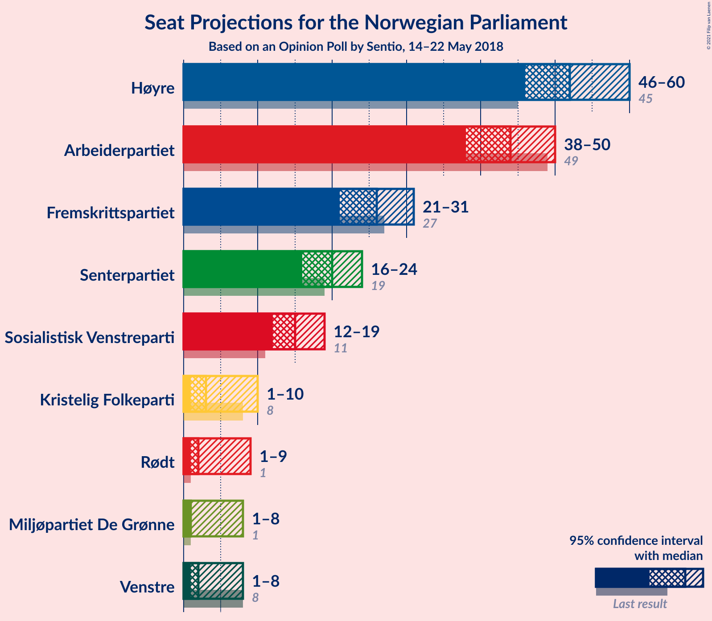
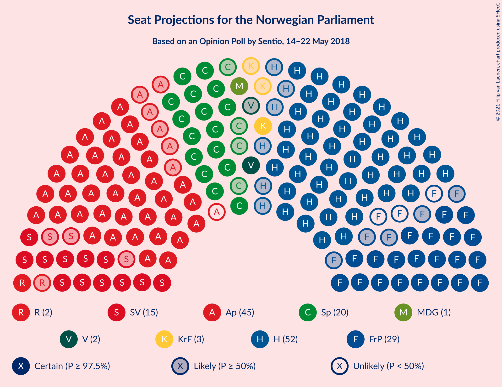
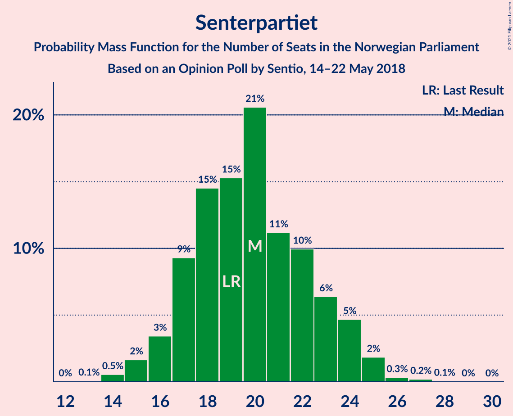
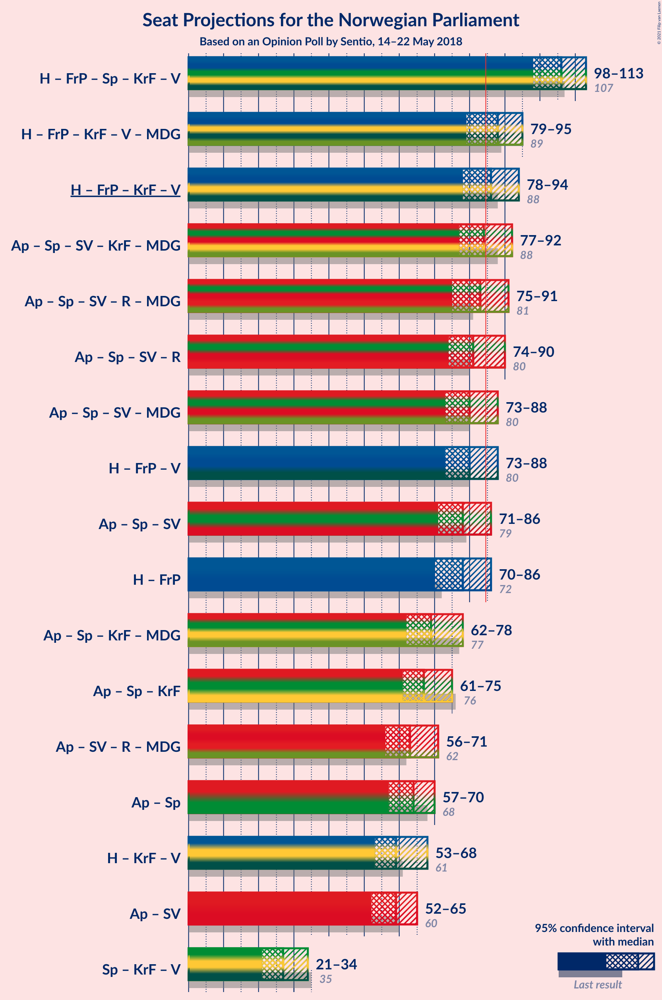
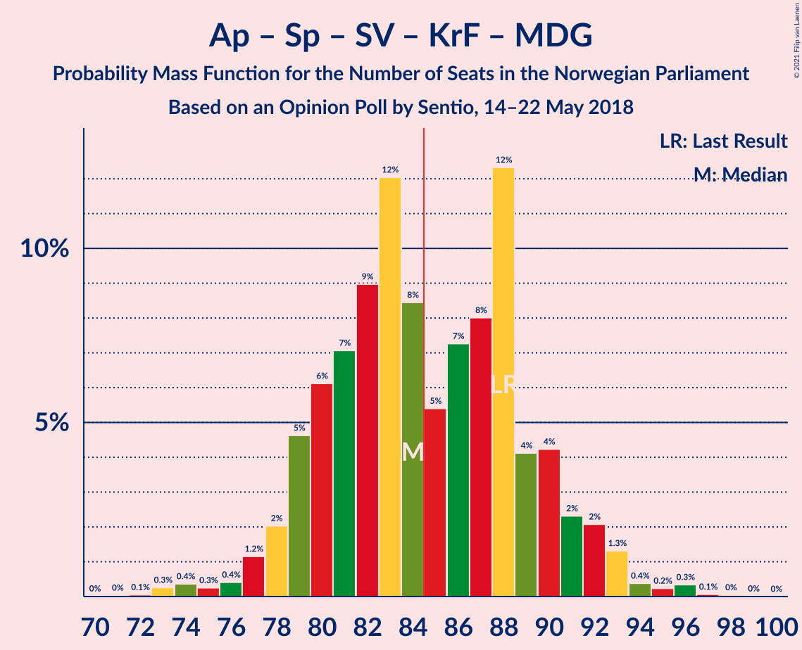
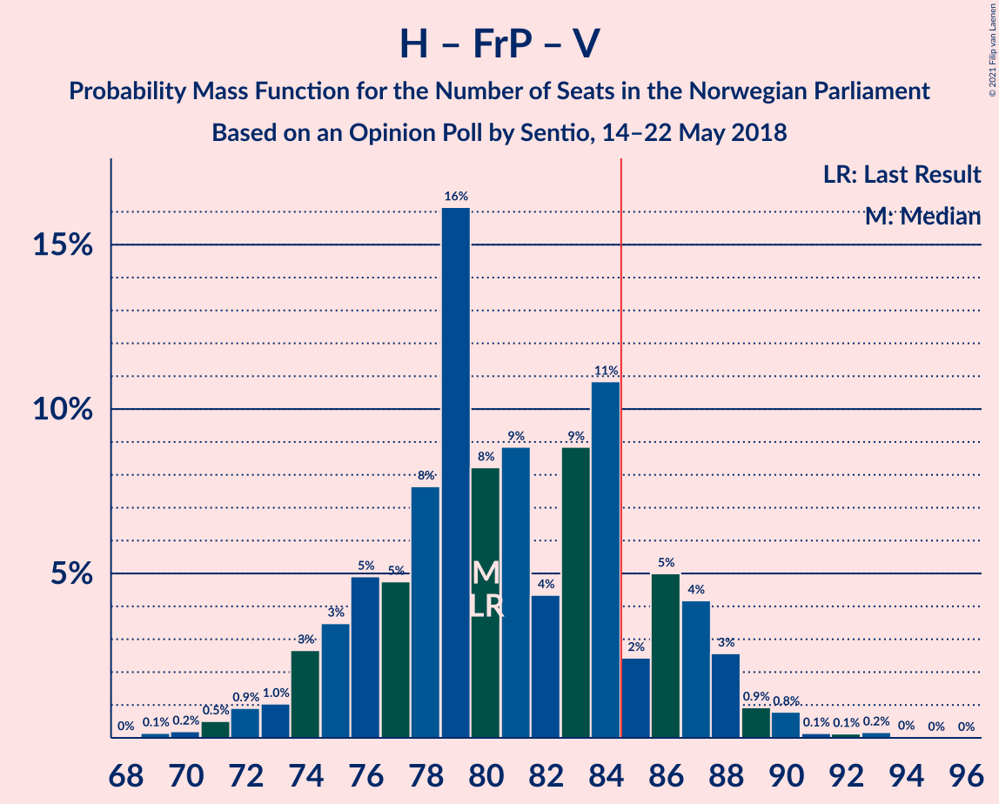
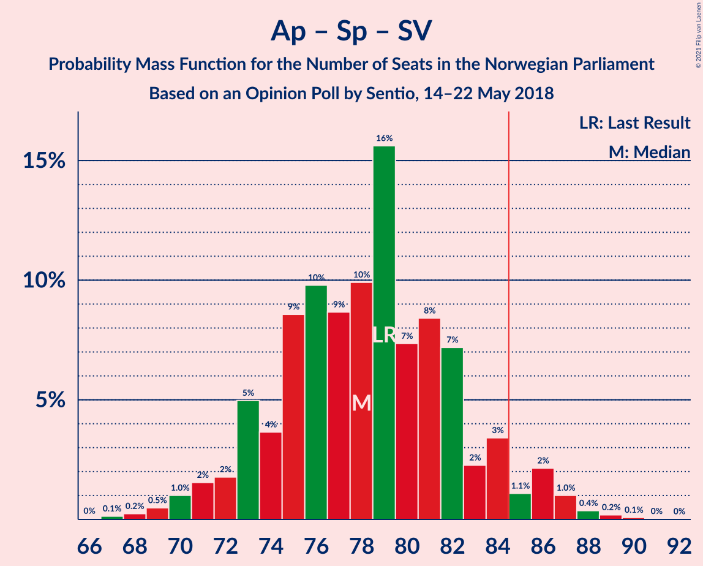
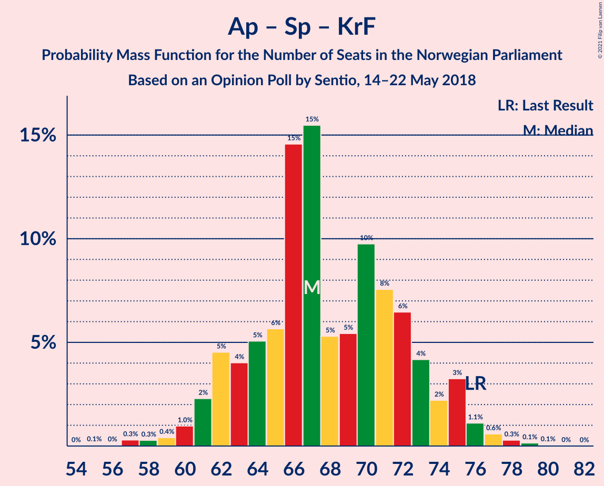
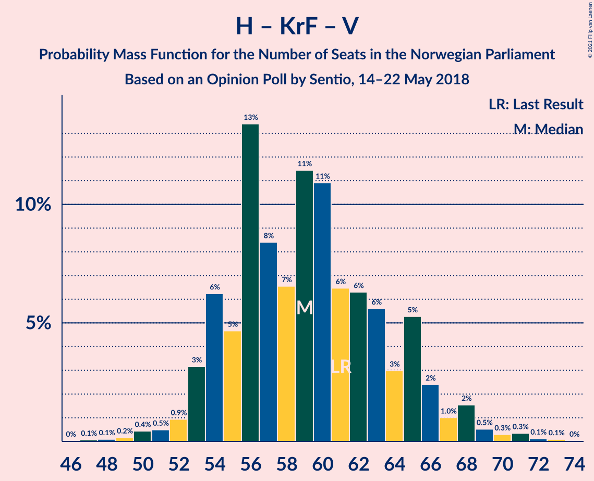

# Opinion Poll by Sentio, 14–22 May 2018

<a href="#voting-intentions">Voting Intentions</a> | <a href="#seats">Seats</a> | <a href="#coalitions">Coalitions</a> | <a href="#technical-information">Technical Information</a>

## Voting Intentions

### Confidence Intervals

| Party | Last Result | Poll Result | 80% Confidence Interval | 90% Confidence Interval | 95% Confidence Interval | 99% Confidence Interval |
|:-----:|:-----------:|:-----------:|:-----------------------:|:-----------------------:|:-----------------------:|:-----------------------:|
| Høyre | 25.0% | 28.4% | 26.3–30.6% |25.7–31.2% |25.2–31.8% |24.2–32.8% |
| Arbeiderpartiet | 27.4% | 23.5% | 21.6–25.6% |21.0–26.2% |20.6–26.7% |19.7–27.8% |
| Fremskrittspartiet | 15.2% | 14.0% | 12.4–15.7% |12.0–16.2% |11.6–16.7% |10.9–17.6% |
| Senterpartiet | 10.3% | 10.7% | 9.3–12.3% |8.9–12.7% |8.6–13.1% |8.0–13.9% |
| Sosialistisk Venstreparti | 6.0% | 8.0% | 6.9–9.5% |6.5–9.9% |6.2–10.2% |5.7–11.0% |
| Kristelig Folkeparti | 4.2% | 3.7% | 3.0–4.8% |2.8–5.1% |2.6–5.4% |2.3–5.9% |
| Rødt | 2.4% | 3.5% | 2.7–4.5% |2.5–4.8% |2.3–5.1% |2.0–5.6% |
| Venstre | 4.4% | 3.2% | 2.5–4.2% |2.3–4.5% |2.1–4.7% |1.8–5.3% |
| Miljøpartiet De Grønne | 3.2% | 2.9% | 2.2–3.9% |2.1–4.2% |1.9–4.4% |1.6–4.9% |

*Note:* The poll result column reflects the actual value used in the calculations. Published results may vary slightly, and in addition be rounded to fewer digits.

## Seats

### Confidence Intervals

| Party | Last Result | Median | 80% Confidence Interval | 90% Confidence Interval | 95% Confidence Interval | 99% Confidence Interval |
|:-----:|:-----------:|:------:|:-----------------------:|:-----------------------:|:-----------------------:|:-----------------------:|
| <a href="#høyre">Høyre</a> | 45 | 50 | 47–55 |46–58 |45–59 |44–61 |
| <a href="#arbeiderpartiet">Arbeiderpartiet</a> | 49 | 42 | 39–47 |39–48 |38–50 |36–50 |
| <a href="#fremskrittspartiet">Fremskrittspartiet</a> | 27 | 27 | 23–28 |22–30 |21–30 |19–32 |
| <a href="#senterpartiet">Senterpartiet</a> | 19 | 21 | 18–23 |17–23 |16–24 |15–26 |
| <a href="#sosialistisk-venstreparti">Sosialistisk Venstreparti</a> | 11 | 15 | 13–18 |12–18 |12–19 |11–20 |
| <a href="#kristelig-folkeparti">Kristelig Folkeparti</a> | 8 | 8 | 3–9 |2–10 |1–10 |1–11 |
| <a href="#rødt">Rødt</a> | 1 | 2 | 2–9 |1–9 |1–9 |1–10 |
| <a href="#venstre">Venstre</a> | 8 | 2 | 2–7 |2–7 |1–8 |1–9 |
| <a href="#miljøpartiet-de-grønne">Miljøpartiet De Grønne</a> | 1 | 1 | 1–2 |1–3 |1–8 |0–9 |

### Høyre

*For a full overview of the results for this party, see the [Høyre](party-høyre.html) page.*

| Number of Seats | Probability | Accumulated | Special Marks |
|:---------------:|:-----------:|:-----------:|:-------------:|
| 42 | 0.3% | 100% |  |
| 43 | 0.2% | 99.7% |  |
| 44 | 1.1% | 99.5% |  |
| 45 | 3% | 98% | Last Result |
| 46 | 1.4% | 96% |  |
| 47 | 5% | 94% |  |
| 48 | 8% | 90% |  |
| 49 | 9% | 82% |  |
| 50 | 36% | 72% | Median |
| 51 | 11% | 36% |  |
| 52 | 3% | 25% |  |
| 53 | 3% | 22% |  |
| 54 | 8% | 19% |  |
| 55 | 2% | 11% |  |
| 56 | 0.8% | 9% |  |
| 57 | 1.3% | 8% |  |
| 58 | 3% | 7% |  |
| 59 | 1.5% | 4% |  |
| 60 | 2% | 2% |  |
| 61 | 0.3% | 0.6% |  |
| 62 | 0.2% | 0.3% |  |
| 63 | 0% | 0.1% |  |
| 64 | 0.1% | 0.1% |  |
| 65 | 0% | 0% |  |

### Arbeiderpartiet

*For a full overview of the results for this party, see the [Arbeiderpartiet](party-arbeiderpartiet.html) page.*

| Number of Seats | Probability | Accumulated | Special Marks |
|:---------------:|:-----------:|:-----------:|:-------------:|
| 34 | 0% | 100% |  |
| 35 | 0.2% | 99.9% |  |
| 36 | 0.5% | 99.7% |  |
| 37 | 0.8% | 99.2% |  |
| 38 | 2% | 98% |  |
| 39 | 11% | 96% |  |
| 40 | 6% | 85% |  |
| 41 | 11% | 80% |  |
| 42 | 40% | 68% | Median |
| 43 | 5% | 28% |  |
| 44 | 6% | 23% |  |
| 45 | 3% | 17% |  |
| 46 | 0.9% | 15% |  |
| 47 | 8% | 14% |  |
| 48 | 1.2% | 6% |  |
| 49 | 1.1% | 5% | Last Result |
| 50 | 3% | 4% |  |
| 51 | 0.1% | 0.3% |  |
| 52 | 0.1% | 0.2% |  |
| 53 | 0% | 0.1% |  |
| 54 | 0% | 0.1% |  |
| 55 | 0% | 0% |  |

### Fremskrittspartiet

*For a full overview of the results for this party, see the [Fremskrittspartiet](party-fremskrittspartiet.html) page.*

| Number of Seats | Probability | Accumulated | Special Marks |
|:---------------:|:-----------:|:-----------:|:-------------:|
| 17 | 0.1% | 100% |  |
| 18 | 0.1% | 99.9% |  |
| 19 | 0.6% | 99.9% |  |
| 20 | 1.0% | 99.3% |  |
| 21 | 3% | 98% |  |
| 22 | 3% | 95% |  |
| 23 | 6% | 92% |  |
| 24 | 8% | 86% |  |
| 25 | 5% | 78% |  |
| 26 | 9% | 73% |  |
| 27 | 42% | 64% | Last Result, Median |
| 28 | 12% | 22% |  |
| 29 | 3% | 10% |  |
| 30 | 6% | 7% |  |
| 31 | 0.3% | 0.9% |  |
| 32 | 0.4% | 0.6% |  |
| 33 | 0.1% | 0.2% |  |
| 34 | 0% | 0.1% |  |
| 35 | 0% | 0.1% |  |
| 36 | 0% | 0% |  |

### Senterpartiet

*For a full overview of the results for this party, see the [Senterpartiet](party-senterpartiet.html) page.*

| Number of Seats | Probability | Accumulated | Special Marks |
|:---------------:|:-----------:|:-----------:|:-------------:|
| 14 | 0.2% | 100% |  |
| 15 | 1.1% | 99.7% |  |
| 16 | 3% | 98.6% |  |
| 17 | 5% | 96% |  |
| 18 | 13% | 91% |  |
| 19 | 13% | 78% | Last Result |
| 20 | 12% | 65% |  |
| 21 | 8% | 53% | Median |
| 22 | 34% | 45% |  |
| 23 | 8% | 10% |  |
| 24 | 2% | 3% |  |
| 25 | 0.6% | 1.3% |  |
| 26 | 0.4% | 0.6% |  |
| 27 | 0.3% | 0.3% |  |
| 28 | 0% | 0% |  |

### Sosialistisk Venstreparti

*For a full overview of the results for this party, see the [Sosialistisk Venstreparti](party-sosialistiskvenstreparti.html) page.*

| Number of Seats | Probability | Accumulated | Special Marks |
|:---------------:|:-----------:|:-----------:|:-------------:|
| 10 | 0.3% | 100% |  |
| 11 | 1.0% | 99.7% | Last Result |
| 12 | 4% | 98.7% |  |
| 13 | 8% | 95% |  |
| 14 | 11% | 86% |  |
| 15 | 40% | 76% | Median |
| 16 | 18% | 35% |  |
| 17 | 7% | 18% |  |
| 18 | 8% | 11% |  |
| 19 | 2% | 3% |  |
| 20 | 0.6% | 0.8% |  |
| 21 | 0.1% | 0.2% |  |
| 22 | 0.1% | 0.1% |  |
| 23 | 0.1% | 0.1% |  |
| 24 | 0% | 0% |  |

### Kristelig Folkeparti

*For a full overview of the results for this party, see the [Kristelig Folkeparti](party-kristeligfolkeparti.html) page.*

| Number of Seats | Probability | Accumulated | Special Marks |
|:---------------:|:-----------:|:-----------:|:-------------:|
| 0 | 0.4% | 100% |  |
| 1 | 4% | 99.6% |  |
| 2 | 4% | 95% |  |
| 3 | 33% | 92% |  |
| 4 | 0% | 59% |  |
| 5 | 0% | 59% |  |
| 6 | 0% | 59% |  |
| 7 | 4% | 59% |  |
| 8 | 45% | 55% | Last Result, Median |
| 9 | 5% | 11% |  |
| 10 | 3% | 6% |  |
| 11 | 2% | 2% |  |
| 12 | 0.1% | 0.2% |  |
| 13 | 0% | 0% |  |

### Rødt

*For a full overview of the results for this party, see the [Rødt](party-rødt.html) page.*

| Number of Seats | Probability | Accumulated | Special Marks |
|:---------------:|:-----------:|:-----------:|:-------------:|
| 1 | 7% | 100% | Last Result |
| 2 | 65% | 93% | Median |
| 3 | 0% | 29% |  |
| 4 | 0% | 29% |  |
| 5 | 0% | 29% |  |
| 6 | 0.1% | 29% |  |
| 7 | 5% | 29% |  |
| 8 | 10% | 24% |  |
| 9 | 12% | 14% |  |
| 10 | 2% | 2% |  |
| 11 | 0.4% | 0.4% |  |
| 12 | 0% | 0% |  |

### Venstre

*For a full overview of the results for this party, see the [Venstre](party-venstre.html) page.*

| Number of Seats | Probability | Accumulated | Special Marks |
|:---------------:|:-----------:|:-----------:|:-------------:|
| 0 | 0.3% | 100% |  |
| 1 | 4% | 99.7% |  |
| 2 | 83% | 96% | Median |
| 3 | 0.6% | 12% |  |
| 4 | 0.1% | 12% |  |
| 5 | 0% | 11% |  |
| 6 | 0% | 11% |  |
| 7 | 7% | 11% |  |
| 8 | 3% | 4% | Last Result |
| 9 | 1.1% | 1.2% |  |
| 10 | 0.1% | 0.1% |  |
| 11 | 0% | 0% |  |

### Miljøpartiet De Grønne

*For a full overview of the results for this party, see the [Miljøpartiet De Grønne](party-miljøpartietdegrønne.html) page.*

| Number of Seats | Probability | Accumulated | Special Marks |
|:---------------:|:-----------:|:-----------:|:-------------:|
| 0 | 1.3% | 100% |  |
| 1 | 69% | 98.7% | Last Result, Median |
| 2 | 24% | 30% |  |
| 3 | 0.4% | 5% |  |
| 4 | 0% | 5% |  |
| 5 | 0% | 5% |  |
| 6 | 0% | 5% |  |
| 7 | 0.3% | 5% |  |
| 8 | 3% | 5% |  |
| 9 | 2% | 2% |  |
| 10 | 0.1% | 0.1% |  |
| 11 | 0% | 0% |  |

## Coalitions

### Confidence Intervals

| Coalition | Last Result | Median | Majority? | 80% Confidence Interval | 90% Confidence Interval | 95% Confidence Interval | 99% Confidence Interval |
|:---------:|:-----------:|:------:|:---------:|:-----------------------:|:-----------------------:|:-----------------------:|:-----------------------:|
| Høyre – Fremskrittspartiet – Senterpartiet – Kristelig Folkeparti – Venstre | 107 | 108 | 100% | 101–111 | 99–111 | 96–112 | 95–114 |
| Høyre – Fremskrittspartiet – Kristelig Folkeparti – Venstre – Miljøpartiet De Grønne | 89 | 88 | 80% | 83–91 | 81–93 | 79–94 | 76–97 |
| Høyre – Fremskrittspartiet – Kristelig Folkeparti – Venstre | 88 | 87 | 64% | 81–89 | 80–92 | 78–93 | 75–95 |
| Arbeiderpartiet – Senterpartiet – Sosialistisk Venstreparti – Kristelig Folkeparti – Miljøpartiet De Grønne | 88 | 87 | 64% | 80–89 | 79–91 | 79–92 | 76–94 |
| Arbeiderpartiet – Senterpartiet – Sosialistisk Venstreparti – Rødt – Miljøpartiet De Grønne | 81 | 82 | 36% | 80–88 | 77–89 | 76–91 | 74–94 |
| Arbeiderpartiet – Senterpartiet – Sosialistisk Venstreparti – Rødt | 80 | 81 | 20% | 78–86 | 76–88 | 75–90 | 72–93 |
| Høyre – Fremskrittspartiet – Venstre | 80 | 79 | 8% | 77–83 | 74–86 | 72–88 | 70–92 |
| Arbeiderpartiet – Senterpartiet – Sosialistisk Venstreparti – Miljøpartiet De Grønne | 80 | 80 | 12% | 75–85 | 75–86 | 73–87 | 70–89 |
| Arbeiderpartiet – Senterpartiet – Sosialistisk Venstreparti | 79 | 79 | 4% | 73–83 | 73–84 | 72–86 | 69–87 |
| Høyre – Fremskrittspartiet | 72 | 77 | 2% | 72–81 | 71–84 | 70–84 | 68–88 |
| Arbeiderpartiet – Senterpartiet – Kristelig Folkeparti – Miljøpartiet De Grønne | 77 | 72 | 0% | 63–74 | 63–75 | 63–77 | 60–80 |
| Arbeiderpartiet – Senterpartiet – Kristelig Folkeparti | 76 | 70 | 0% | 62–72 | 62–73 | 62–75 | 59–78 |
| Arbeiderpartiet – Senterpartiet | 68 | 64 | 0% | 58–67 | 58–68 | 57–70 | 55–71 |
| Høyre – Kristelig Folkeparti – Venstre | 61 | 60 | 0% | 56–63 | 53–66 | 52–68 | 50–71 |
| Arbeiderpartiet – Sosialistisk Venstreparti | 60 | 57 | 0% | 54–63 | 54–64 | 53–65 | 49–66 |
| Senterpartiet – Kristelig Folkeparti – Venstre | 35 | 30 | 0% | 23–32 | 23–33 | 21–36 | 18–37 |

### Høyre – Fremskrittspartiet – Senterpartiet – Kristelig Folkeparti – Venstre

| Number of Seats | Probability | Accumulated | Special Marks |
|:---------------:|:-----------:|:-----------:|:-------------:|
| 91 | 0.1% | 100% |  |
| 92 | 0% | 99.9% |  |
| 93 | 0.1% | 99.9% |  |
| 94 | 0.3% | 99.8% |  |
| 95 | 2% | 99.6% |  |
| 96 | 0.3% | 98% |  |
| 97 | 0.9% | 97% |  |
| 98 | 0.8% | 97% |  |
| 99 | 2% | 96% |  |
| 100 | 1.0% | 93% |  |
| 101 | 4% | 92% |  |
| 102 | 18% | 88% |  |
| 103 | 4% | 70% |  |
| 104 | 4% | 66% |  |
| 105 | 6% | 62% |  |
| 106 | 0.5% | 56% |  |
| 107 | 2% | 55% | Last Result |
| 108 | 6% | 53% | Median |
| 109 | 34% | 47% |  |
| 110 | 2% | 13% |  |
| 111 | 8% | 11% |  |
| 112 | 2% | 3% |  |
| 113 | 0.3% | 0.9% |  |
| 114 | 0.1% | 0.6% |  |
| 115 | 0.3% | 0.5% |  |
| 116 | 0.1% | 0.1% |  |
| 117 | 0% | 0.1% |  |
| 118 | 0% | 0% |  |

### Høyre – Fremskrittspartiet – Kristelig Folkeparti – Venstre – Miljøpartiet De Grønne

| Number of Seats | Probability | Accumulated | Special Marks |
|:---------------:|:-----------:|:-----------:|:-------------:|
| 75 | 0% | 100% |  |
| 76 | 2% | 99.9% |  |
| 77 | 0.1% | 98% |  |
| 78 | 0.1% | 98% |  |
| 79 | 0.8% | 98% |  |
| 80 | 1.0% | 97% |  |
| 81 | 3% | 96% |  |
| 82 | 0.7% | 93% |  |
| 83 | 6% | 93% |  |
| 84 | 7% | 86% |  |
| 85 | 10% | 80% | Majority |
| 86 | 3% | 70% |  |
| 87 | 4% | 66% |  |
| 88 | 37% | 62% | Median |
| 89 | 7% | 25% | Last Result |
| 90 | 5% | 18% |  |
| 91 | 3% | 12% |  |
| 92 | 2% | 9% |  |
| 93 | 3% | 7% |  |
| 94 | 2% | 4% |  |
| 95 | 0.9% | 2% |  |
| 96 | 0.8% | 1.4% |  |
| 97 | 0.3% | 0.7% |  |
| 98 | 0.2% | 0.3% |  |
| 99 | 0.1% | 0.1% |  |
| 100 | 0% | 0% |  |

### Høyre – Fremskrittspartiet – Kristelig Folkeparti – Venstre

| Number of Seats | Probability | Accumulated | Special Marks |
|:---------------:|:-----------:|:-----------:|:-------------:|
| 72 | 0% | 100% |  |
| 73 | 0% | 99.9% |  |
| 74 | 0.2% | 99.9% |  |
| 75 | 2% | 99.6% |  |
| 76 | 0.2% | 98% |  |
| 77 | 0.2% | 98% |  |
| 78 | 0.8% | 98% |  |
| 79 | 1.5% | 97% |  |
| 80 | 3% | 95% |  |
| 81 | 7% | 92% |  |
| 82 | 4% | 85% |  |
| 83 | 6% | 81% |  |
| 84 | 11% | 75% |  |
| 85 | 2% | 64% | Majority |
| 86 | 9% | 62% |  |
| 87 | 33% | 53% | Median |
| 88 | 7% | 20% | Last Result |
| 89 | 4% | 13% |  |
| 90 | 2% | 9% |  |
| 91 | 2% | 7% |  |
| 92 | 2% | 5% |  |
| 93 | 0.8% | 3% |  |
| 94 | 0.9% | 2% |  |
| 95 | 0.7% | 1.1% |  |
| 96 | 0.2% | 0.4% |  |
| 97 | 0.1% | 0.2% |  |
| 98 | 0% | 0.1% |  |
| 99 | 0% | 0% |  |

### Arbeiderpartiet – Senterpartiet – Sosialistisk Venstreparti – Kristelig Folkeparti – Miljøpartiet De Grønne

| Number of Seats | Probability | Accumulated | Special Marks |
|:---------------:|:-----------:|:-----------:|:-------------:|
| 72 | 0% | 100% |  |
| 73 | 0.1% | 99.9% |  |
| 74 | 0% | 99.8% |  |
| 75 | 0.1% | 99.8% |  |
| 76 | 0.7% | 99.7% |  |
| 77 | 0.4% | 98.9% |  |
| 78 | 0.8% | 98.6% |  |
| 79 | 8% | 98% |  |
| 80 | 2% | 90% |  |
| 81 | 7% | 88% |  |
| 82 | 6% | 81% |  |
| 83 | 7% | 75% |  |
| 84 | 4% | 68% |  |
| 85 | 3% | 64% | Majority |
| 86 | 6% | 61% |  |
| 87 | 6% | 55% | Median |
| 88 | 36% | 48% | Last Result |
| 89 | 2% | 12% |  |
| 90 | 5% | 10% |  |
| 91 | 2% | 5% |  |
| 92 | 0.7% | 3% |  |
| 93 | 0.6% | 2% |  |
| 94 | 0.9% | 1.4% |  |
| 95 | 0.1% | 0.5% |  |
| 96 | 0.2% | 0.4% |  |
| 97 | 0.2% | 0.2% |  |
| 98 | 0% | 0% |  |

### Arbeiderpartiet – Senterpartiet – Sosialistisk Venstreparti – Rødt – Miljøpartiet De Grønne

| Number of Seats | Probability | Accumulated | Special Marks |
|:---------------:|:-----------:|:-----------:|:-------------:|
| 71 | 0% | 100% |  |
| 72 | 0.1% | 99.9% |  |
| 73 | 0.2% | 99.8% |  |
| 74 | 0.7% | 99.6% |  |
| 75 | 0.9% | 98.9% |  |
| 76 | 0.9% | 98% |  |
| 77 | 2% | 97% |  |
| 78 | 2% | 95% |  |
| 79 | 2% | 93% |  |
| 80 | 4% | 91% |  |
| 81 | 7% | 87% | Last Result, Median |
| 82 | 33% | 80% |  |
| 83 | 9% | 47% |  |
| 84 | 2% | 38% |  |
| 85 | 11% | 36% | Majority |
| 86 | 6% | 25% |  |
| 87 | 4% | 19% |  |
| 88 | 7% | 15% |  |
| 89 | 3% | 8% |  |
| 90 | 1.4% | 5% |  |
| 91 | 0.8% | 3% |  |
| 92 | 0.2% | 2% |  |
| 93 | 0.2% | 2% |  |
| 94 | 2% | 2% |  |
| 95 | 0.2% | 0.3% |  |
| 96 | 0% | 0.1% |  |
| 97 | 0% | 0.1% |  |
| 98 | 0% | 0% |  |

### Arbeiderpartiet – Senterpartiet – Sosialistisk Venstreparti – Rødt

| Number of Seats | Probability | Accumulated | Special Marks |
|:---------------:|:-----------:|:-----------:|:-------------:|
| 70 | 0.1% | 100% |  |
| 71 | 0.2% | 99.9% |  |
| 72 | 0.4% | 99.6% |  |
| 73 | 0.8% | 99.3% |  |
| 74 | 0.9% | 98.5% |  |
| 75 | 2% | 98% |  |
| 76 | 3% | 96% |  |
| 77 | 2% | 93% |  |
| 78 | 3% | 91% |  |
| 79 | 5% | 88% |  |
| 80 | 7% | 82% | Last Result, Median |
| 81 | 37% | 75% |  |
| 82 | 4% | 38% |  |
| 83 | 3% | 34% |  |
| 84 | 10% | 30% |  |
| 85 | 7% | 20% | Majority |
| 86 | 6% | 14% |  |
| 87 | 0.7% | 7% |  |
| 88 | 3% | 7% |  |
| 89 | 1.0% | 4% |  |
| 90 | 0.7% | 3% |  |
| 91 | 0.1% | 2% |  |
| 92 | 0.1% | 2% |  |
| 93 | 2% | 2% |  |
| 94 | 0% | 0.1% |  |
| 95 | 0% | 0% |  |

### Høyre – Fremskrittspartiet – Venstre

| Number of Seats | Probability | Accumulated | Special Marks |
|:---------------:|:-----------:|:-----------:|:-------------:|
| 69 | 0.1% | 100% |  |
| 70 | 0.7% | 99.9% |  |
| 71 | 0.4% | 99.2% |  |
| 72 | 2% | 98.8% |  |
| 73 | 1.4% | 97% |  |
| 74 | 0.9% | 96% |  |
| 75 | 0.7% | 95% |  |
| 76 | 2% | 94% |  |
| 77 | 7% | 92% |  |
| 78 | 12% | 85% |  |
| 79 | 35% | 73% | Median |
| 80 | 8% | 38% | Last Result |
| 81 | 14% | 30% |  |
| 82 | 2% | 16% |  |
| 83 | 4% | 14% |  |
| 84 | 1.4% | 10% |  |
| 85 | 1.0% | 8% | Majority |
| 86 | 4% | 7% |  |
| 87 | 0.8% | 3% |  |
| 88 | 1.1% | 3% |  |
| 89 | 0.4% | 1.5% |  |
| 90 | 0.4% | 1.1% |  |
| 91 | 0.1% | 0.7% |  |
| 92 | 0.5% | 0.6% |  |
| 93 | 0% | 0.1% |  |
| 94 | 0% | 0% |  |

### Arbeiderpartiet – Senterpartiet – Sosialistisk Venstreparti – Miljøpartiet De Grønne

| Number of Seats | Probability | Accumulated | Special Marks |
|:---------------:|:-----------:|:-----------:|:-------------:|
| 69 | 0.2% | 100% |  |
| 70 | 0.6% | 99.8% |  |
| 71 | 0.4% | 99.2% |  |
| 72 | 0.4% | 98.8% |  |
| 73 | 1.5% | 98% |  |
| 74 | 1.1% | 97% |  |
| 75 | 9% | 96% |  |
| 76 | 7% | 86% |  |
| 77 | 2% | 79% |  |
| 78 | 6% | 77% |  |
| 79 | 13% | 71% | Median |
| 80 | 34% | 58% | Last Result |
| 81 | 4% | 24% |  |
| 82 | 2% | 20% |  |
| 83 | 3% | 18% |  |
| 84 | 3% | 15% |  |
| 85 | 5% | 12% | Majority |
| 86 | 2% | 7% |  |
| 87 | 3% | 5% |  |
| 88 | 1.4% | 2% |  |
| 89 | 0.5% | 0.8% |  |
| 90 | 0.1% | 0.3% |  |
| 91 | 0.1% | 0.2% |  |
| 92 | 0.1% | 0.1% |  |
| 93 | 0% | 0.1% |  |
| 94 | 0% | 0% |  |

### Arbeiderpartiet – Senterpartiet – Sosialistisk Venstreparti

| Number of Seats | Probability | Accumulated | Special Marks |
|:---------------:|:-----------:|:-----------:|:-------------:|
| 67 | 0% | 100% |  |
| 68 | 0.3% | 99.9% |  |
| 69 | 0.7% | 99.6% |  |
| 70 | 0.6% | 98.9% |  |
| 71 | 0.4% | 98% |  |
| 72 | 2% | 98% |  |
| 73 | 8% | 96% |  |
| 74 | 4% | 88% |  |
| 75 | 7% | 85% |  |
| 76 | 5% | 78% |  |
| 77 | 10% | 72% |  |
| 78 | 11% | 62% | Median |
| 79 | 31% | 51% | Last Result |
| 80 | 4% | 20% |  |
| 81 | 2% | 16% |  |
| 82 | 4% | 14% |  |
| 83 | 4% | 10% |  |
| 84 | 2% | 7% |  |
| 85 | 0.3% | 4% | Majority |
| 86 | 3% | 4% |  |
| 87 | 0.8% | 1.2% |  |
| 88 | 0.2% | 0.3% |  |
| 89 | 0.1% | 0.2% |  |
| 90 | 0% | 0.1% |  |
| 91 | 0.1% | 0.1% |  |
| 92 | 0% | 0% |  |

### Høyre – Fremskrittspartiet

| Number of Seats | Probability | Accumulated | Special Marks |
|:---------------:|:-----------:|:-----------:|:-------------:|
| 66 | 0.1% | 100% |  |
| 67 | 0.1% | 99.9% |  |
| 68 | 0.7% | 99.8% |  |
| 69 | 0.6% | 99.0% |  |
| 70 | 2% | 98% |  |
| 71 | 5% | 96% |  |
| 72 | 2% | 91% | Last Result |
| 73 | 2% | 90% |  |
| 74 | 5% | 88% |  |
| 75 | 7% | 83% |  |
| 76 | 9% | 76% |  |
| 77 | 34% | 67% | Median |
| 78 | 7% | 33% |  |
| 79 | 12% | 27% |  |
| 80 | 3% | 15% |  |
| 81 | 3% | 12% |  |
| 82 | 2% | 9% |  |
| 83 | 0.6% | 7% |  |
| 84 | 5% | 6% |  |
| 85 | 0.5% | 2% | Majority |
| 86 | 0.7% | 1.3% |  |
| 87 | 0.1% | 0.6% |  |
| 88 | 0.3% | 0.5% |  |
| 89 | 0.1% | 0.2% |  |
| 90 | 0% | 0% |  |

### Arbeiderpartiet – Senterpartiet – Kristelig Folkeparti – Miljøpartiet De Grønne

| Number of Seats | Probability | Accumulated | Special Marks |
|:---------------:|:-----------:|:-----------:|:-------------:|
| 58 | 0% | 100% |  |
| 59 | 0.2% | 99.9% |  |
| 60 | 0.4% | 99.8% |  |
| 61 | 0.5% | 99.4% |  |
| 62 | 0.5% | 98.9% |  |
| 63 | 10% | 98% |  |
| 64 | 1.0% | 89% |  |
| 65 | 4% | 88% |  |
| 66 | 1.3% | 84% |  |
| 67 | 4% | 83% |  |
| 68 | 11% | 78% |  |
| 69 | 5% | 68% |  |
| 70 | 5% | 63% |  |
| 71 | 8% | 58% |  |
| 72 | 4% | 50% | Median |
| 73 | 34% | 46% |  |
| 74 | 2% | 12% |  |
| 75 | 5% | 10% |  |
| 76 | 1.3% | 5% |  |
| 77 | 0.8% | 3% | Last Result |
| 78 | 1.0% | 2% |  |
| 79 | 0.9% | 1.5% |  |
| 80 | 0.2% | 0.5% |  |
| 81 | 0.2% | 0.3% |  |
| 82 | 0.1% | 0.1% |  |
| 83 | 0% | 0% |  |

### Arbeiderpartiet – Senterpartiet – Kristelig Folkeparti

| Number of Seats | Probability | Accumulated | Special Marks |
|:---------------:|:-----------:|:-----------:|:-------------:|
| 57 | 0.1% | 100% |  |
| 58 | 0.1% | 99.8% |  |
| 59 | 0.4% | 99.7% |  |
| 60 | 1.1% | 99.3% |  |
| 61 | 0.7% | 98% |  |
| 62 | 9% | 98% |  |
| 63 | 2% | 88% |  |
| 64 | 5% | 86% |  |
| 65 | 2% | 82% |  |
| 66 | 15% | 80% |  |
| 67 | 2% | 65% |  |
| 68 | 5% | 63% |  |
| 69 | 5% | 58% |  |
| 70 | 8% | 53% |  |
| 71 | 4% | 45% | Median |
| 72 | 33% | 41% |  |
| 73 | 4% | 8% |  |
| 74 | 2% | 5% |  |
| 75 | 0.5% | 3% |  |
| 76 | 0.6% | 2% | Last Result |
| 77 | 0.9% | 2% |  |
| 78 | 0.6% | 0.8% |  |
| 79 | 0.1% | 0.2% |  |
| 80 | 0.1% | 0.2% |  |
| 81 | 0% | 0% |  |

### Arbeiderpartiet – Senterpartiet

| Number of Seats | Probability | Accumulated | Special Marks |
|:---------------:|:-----------:|:-----------:|:-------------:|
| 53 | 0.1% | 100% |  |
| 54 | 0.2% | 99.9% |  |
| 55 | 0.5% | 99.7% |  |
| 56 | 2% | 99.3% |  |
| 57 | 3% | 98% |  |
| 58 | 6% | 95% |  |
| 59 | 13% | 89% |  |
| 60 | 2% | 76% |  |
| 61 | 4% | 74% |  |
| 62 | 9% | 70% |  |
| 63 | 7% | 60% | Median |
| 64 | 34% | 54% |  |
| 65 | 4% | 20% |  |
| 66 | 5% | 16% |  |
| 67 | 3% | 11% |  |
| 68 | 4% | 8% | Last Result |
| 69 | 0.6% | 4% |  |
| 70 | 3% | 4% |  |
| 71 | 0.2% | 0.6% |  |
| 72 | 0.2% | 0.5% |  |
| 73 | 0% | 0.3% |  |
| 74 | 0.2% | 0.3% |  |
| 75 | 0% | 0.1% |  |
| 76 | 0.1% | 0.1% |  |
| 77 | 0% | 0% |  |

### Høyre – Kristelig Folkeparti – Venstre

| Number of Seats | Probability | Accumulated | Special Marks |
|:---------------:|:-----------:|:-----------:|:-------------:|
| 47 | 0.2% | 100% |  |
| 48 | 0.1% | 99.7% |  |
| 49 | 0.1% | 99.7% |  |
| 50 | 2% | 99.6% |  |
| 51 | 0.2% | 98% |  |
| 52 | 0.4% | 98% |  |
| 53 | 3% | 97% |  |
| 54 | 2% | 95% |  |
| 55 | 1.0% | 93% |  |
| 56 | 10% | 92% |  |
| 57 | 8% | 81% |  |
| 58 | 3% | 73% |  |
| 59 | 14% | 70% |  |
| 60 | 37% | 56% | Median |
| 61 | 3% | 19% | Last Result |
| 62 | 3% | 15% |  |
| 63 | 4% | 13% |  |
| 64 | 2% | 9% |  |
| 65 | 1.3% | 7% |  |
| 66 | 3% | 6% |  |
| 67 | 0.4% | 3% |  |
| 68 | 0.5% | 3% |  |
| 69 | 1.0% | 2% |  |
| 70 | 0.4% | 1.3% |  |
| 71 | 0.7% | 0.9% |  |
| 72 | 0.1% | 0.1% |  |
| 73 | 0% | 0% |  |

### Arbeiderpartiet – Sosialistisk Venstreparti

| Number of Seats | Probability | Accumulated | Special Marks |
|:---------------:|:-----------:|:-----------:|:-------------:|
| 48 | 0% | 100% |  |
| 49 | 0.6% | 99.9% |  |
| 50 | 0.3% | 99.4% |  |
| 51 | 0.3% | 99.1% |  |
| 52 | 0.5% | 98.7% |  |
| 53 | 1.0% | 98% |  |
| 54 | 7% | 97% |  |
| 55 | 11% | 90% |  |
| 56 | 7% | 79% |  |
| 57 | 39% | 71% | Median |
| 58 | 11% | 32% |  |
| 59 | 3% | 21% |  |
| 60 | 0.7% | 18% | Last Result |
| 61 | 3% | 17% |  |
| 62 | 2% | 14% |  |
| 63 | 4% | 13% |  |
| 64 | 5% | 9% |  |
| 65 | 3% | 4% |  |
| 66 | 0.2% | 0.6% |  |
| 67 | 0.1% | 0.4% |  |
| 68 | 0% | 0.3% |  |
| 69 | 0.2% | 0.3% |  |
| 70 | 0% | 0.1% |  |
| 71 | 0% | 0% |  |

### Senterpartiet – Kristelig Folkeparti – Venstre

| Number of Seats | Probability | Accumulated | Special Marks |
|:---------------:|:-----------:|:-----------:|:-------------:|
| 18 | 0.5% | 100% |  |
| 19 | 0.3% | 99.4% |  |
| 20 | 0.3% | 99.2% |  |
| 21 | 3% | 98.9% |  |
| 22 | 0.7% | 96% |  |
| 23 | 10% | 95% |  |
| 24 | 4% | 86% |  |
| 25 | 5% | 81% |  |
| 26 | 4% | 76% |  |
| 27 | 8% | 72% |  |
| 28 | 2% | 65% |  |
| 29 | 10% | 63% |  |
| 30 | 4% | 52% |  |
| 31 | 5% | 48% | Median |
| 32 | 34% | 43% |  |
| 33 | 5% | 9% |  |
| 34 | 1.4% | 4% |  |
| 35 | 0.3% | 3% | Last Result |
| 36 | 2% | 3% |  |
| 37 | 0.5% | 0.9% |  |
| 38 | 0.3% | 0.5% |  |
| 39 | 0.2% | 0.2% |  |
| 40 | 0% | 0% |  |

## Technical Information

### Opinion Poll

+ **Polling firm:** Sentio
+ **Commissioner(s):** —
+ **Fieldwork period:** 14–22 May 2018

### Calculations

+ **Sample size:** 723
+ **Simulations done:** 131,072
+ **Error estimate:** 1.55%

