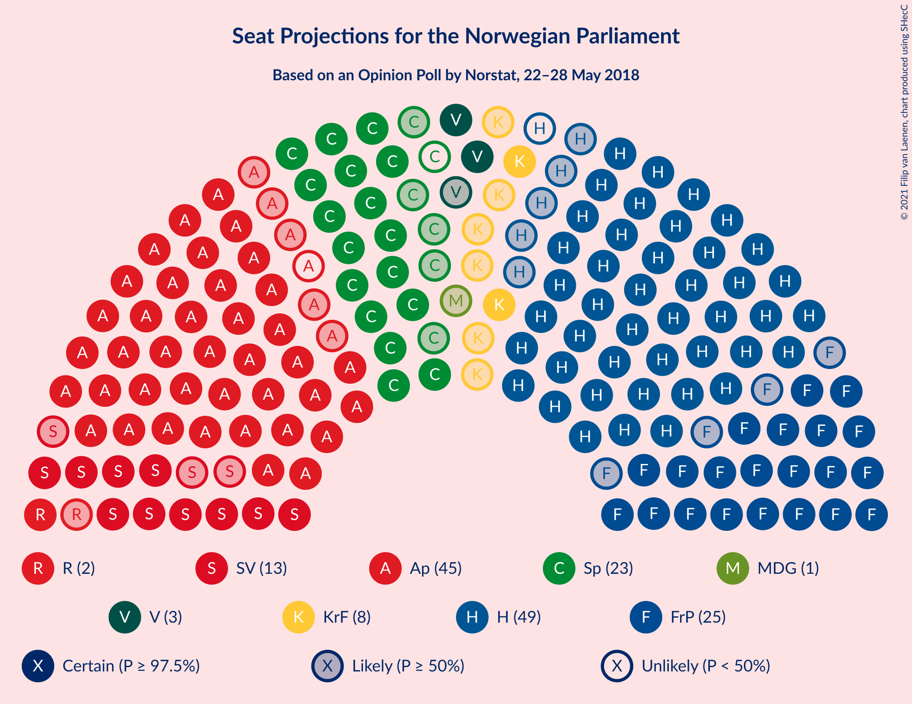
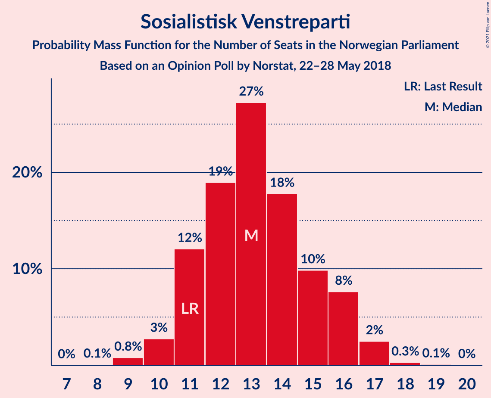
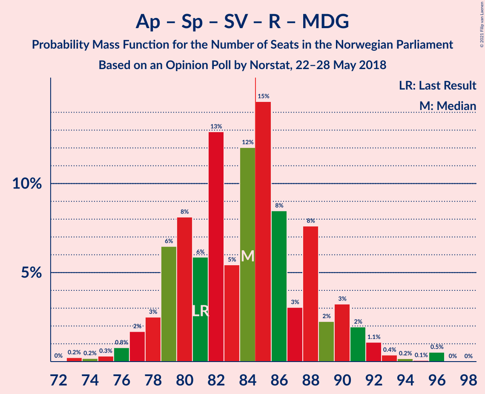
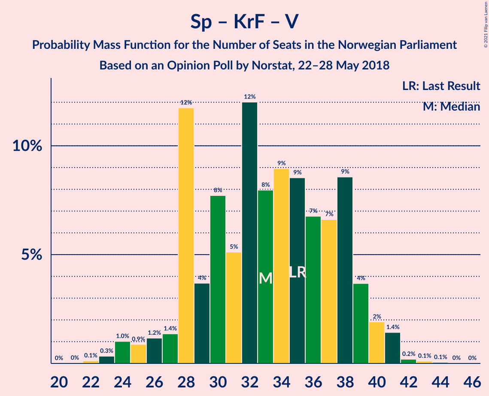

# Opinion Poll by Norstat, 22–28 May 2018

<a href="#voting-intentions">Voting Intentions</a> | <a href="#seats">Seats</a> | <a href="#coalitions">Coalitions</a> | <a href="#technical-information">Technical Information</a>

## Voting Intentions

### Confidence Intervals

| Party | Last Result | Poll Result | 80% Confidence Interval | 90% Confidence Interval | 95% Confidence Interval | 99% Confidence Interval |
|:-----:|:-----------:|:-----------:|:-----------------------:|:-----------------------:|:-----------------------:|:-----------------------:|
| Høyre | 25.0% | 26.4% | 24.6–28.3% |24.1–28.8% |23.6–29.3% |22.8–30.2% |
| Arbeiderpartiet | 27.4% | 23.6% | 21.9–25.4% |21.4–26.0% |21.0–26.4% |20.1–27.3% |
| Fremskrittspartiet | 15.2% | 13.9% | 12.5–15.4% |12.1–15.9% |11.8–16.3% |11.2–17.0% |
| Senterpartiet | 10.3% | 11.7% | 10.5–13.2% |10.1–13.6% |9.8–14.0% |9.2–14.7% |
| Sosialistisk Venstreparti | 6.0% | 7.2% | 6.2–8.4% |5.9–8.8% |5.7–9.1% |5.3–9.7% |
| Kristelig Folkeparti | 4.2% | 4.2% | 3.5–5.2% |3.3–5.5% |3.1–5.7% |2.8–6.2% |
| Venstre | 4.4% | 4.1% | 3.4–5.1% |3.2–5.3% |3.0–5.6% |2.7–6.1% |
| Rødt | 2.4% | 4.0% | 3.3–4.9% |3.1–5.2% |2.9–5.5% |2.6–5.9% |
| Miljøpartiet De Grønne | 3.2% | 2.7% | 2.1–3.5% |2.0–3.7% |1.8–3.9% |1.6–4.4% |

*Note:* The poll result column reflects the actual value used in the calculations. Published results may vary slightly, and in addition be rounded to fewer digits.

## Seats

### Confidence Intervals

| Party | Last Result | Median | 80% Confidence Interval | 90% Confidence Interval | 95% Confidence Interval | 99% Confidence Interval |
|:-----:|:-----------:|:------:|:-----------------------:|:-----------------------:|:-----------------------:|:-----------------------:|
| <a href="#høyre">Høyre</a> | 45 | 48 | 45–52 |44–53 |43–54 |41–55 |
| <a href="#arbeiderpartiet">Arbeiderpartiet</a> | 49 | 44 | 41–47 |40–47 |39–48 |37–50 |
| <a href="#fremskrittspartiet">Fremskrittspartiet</a> | 27 | 25 | 23–29 |22–30 |21–30 |20–31 |
| <a href="#senterpartiet">Senterpartiet</a> | 19 | 22 | 19–24 |18–25 |17–26 |16–27 |
| <a href="#sosialistisk-venstreparti">Sosialistisk Venstreparti</a> | 11 | 13 | 11–16 |11–16 |10–17 |9–17 |
| <a href="#kristelig-folkeparti">Kristelig Folkeparti</a> | 8 | 8 | 3–9 |3–10 |2–10 |1–11 |
| <a href="#venstre">Venstre</a> | 8 | 3 | 2–9 |2–9 |2–10 |2–11 |
| <a href="#rødt">Rødt</a> | 1 | 2 | 2–8 |2–9 |1–10 |1–11 |
| <a href="#miljøpartiet-de-grønne">Miljøpartiet De Grønne</a> | 1 | 1 | 1–2 |1–2 |0–2 |0–8 |

### Høyre

*For a full overview of the results for this party, see the [Høyre](party-høyre.html) page.*

| Number of Seats | Probability | Accumulated | Special Marks |
|:---------------:|:-----------:|:-----------:|:-------------:|
| 38 | 0% | 100% |  |
| 39 | 0.1% | 99.9% |  |
| 40 | 0.1% | 99.9% |  |
| 41 | 0.5% | 99.8% |  |
| 42 | 1.0% | 99.2% |  |
| 43 | 2% | 98% |  |
| 44 | 6% | 96% |  |
| 45 | 11% | 90% | Last Result |
| 46 | 14% | 79% |  |
| 47 | 14% | 65% |  |
| 48 | 11% | 51% | Median |
| 49 | 14% | 40% |  |
| 50 | 9% | 26% |  |
| 51 | 3% | 17% |  |
| 52 | 6% | 13% |  |
| 53 | 3% | 7% |  |
| 54 | 3% | 4% |  |
| 55 | 1.1% | 2% |  |
| 56 | 0.3% | 0.4% |  |
| 57 | 0.1% | 0.1% |  |
| 58 | 0% | 0% |  |

### Arbeiderpartiet

*For a full overview of the results for this party, see the [Arbeiderpartiet](party-arbeiderpartiet.html) page.*

| Number of Seats | Probability | Accumulated | Special Marks |
|:---------------:|:-----------:|:-----------:|:-------------:|
| 35 | 0% | 100% |  |
| 36 | 0.1% | 99.9% |  |
| 37 | 0.3% | 99.8% |  |
| 38 | 1.2% | 99.5% |  |
| 39 | 2% | 98% |  |
| 40 | 6% | 96% |  |
| 41 | 6% | 91% |  |
| 42 | 8% | 85% |  |
| 43 | 19% | 77% |  |
| 44 | 17% | 57% | Median |
| 45 | 16% | 40% |  |
| 46 | 6% | 24% |  |
| 47 | 13% | 18% |  |
| 48 | 3% | 5% |  |
| 49 | 1.0% | 2% | Last Result |
| 50 | 0.3% | 0.5% |  |
| 51 | 0.2% | 0.2% |  |
| 52 | 0% | 0.1% |  |
| 53 | 0% | 0.1% |  |
| 54 | 0% | 0% |  |

### Fremskrittspartiet

*For a full overview of the results for this party, see the [Fremskrittspartiet](party-fremskrittspartiet.html) page.*

| Number of Seats | Probability | Accumulated | Special Marks |
|:---------------:|:-----------:|:-----------:|:-------------:|
| 18 | 0.1% | 100% |  |
| 19 | 0.3% | 99.9% |  |
| 20 | 0.8% | 99.6% |  |
| 21 | 2% | 98.8% |  |
| 22 | 5% | 97% |  |
| 23 | 6% | 91% |  |
| 24 | 16% | 86% |  |
| 25 | 23% | 70% | Median |
| 26 | 11% | 47% |  |
| 27 | 11% | 36% | Last Result |
| 28 | 13% | 26% |  |
| 29 | 7% | 13% |  |
| 30 | 5% | 6% |  |
| 31 | 0.7% | 1.2% |  |
| 32 | 0.2% | 0.5% |  |
| 33 | 0.2% | 0.3% |  |
| 34 | 0% | 0% |  |

### Senterpartiet

*For a full overview of the results for this party, see the [Senterpartiet](party-senterpartiet.html) page.*

| Number of Seats | Probability | Accumulated | Special Marks |
|:---------------:|:-----------:|:-----------:|:-------------:|
| 15 | 0.1% | 100% |  |
| 16 | 0.5% | 99.9% |  |
| 17 | 2% | 99.4% |  |
| 18 | 6% | 97% |  |
| 19 | 6% | 92% | Last Result |
| 20 | 11% | 85% |  |
| 21 | 21% | 74% |  |
| 22 | 22% | 53% | Median |
| 23 | 18% | 31% |  |
| 24 | 7% | 13% |  |
| 25 | 3% | 6% |  |
| 26 | 2% | 3% |  |
| 27 | 0.5% | 0.7% |  |
| 28 | 0.1% | 0.2% |  |
| 29 | 0.1% | 0.1% |  |
| 30 | 0% | 0% |  |

### Sosialistisk Venstreparti

*For a full overview of the results for this party, see the [Sosialistisk Venstreparti](party-sosialistiskvenstreparti.html) page.*

| Number of Seats | Probability | Accumulated | Special Marks |
|:---------------:|:-----------:|:-----------:|:-------------:|
| 8 | 0.1% | 100% |  |
| 9 | 0.8% | 99.9% |  |
| 10 | 3% | 99.1% |  |
| 11 | 12% | 96% | Last Result |
| 12 | 19% | 84% |  |
| 13 | 27% | 65% | Median |
| 14 | 18% | 38% |  |
| 15 | 10% | 20% |  |
| 16 | 8% | 11% |  |
| 17 | 2% | 3% |  |
| 18 | 0.3% | 0.4% |  |
| 19 | 0.1% | 0.1% |  |
| 20 | 0% | 0% |  |

### Kristelig Folkeparti

*For a full overview of the results for this party, see the [Kristelig Folkeparti](party-kristeligfolkeparti.html) page.*

| Number of Seats | Probability | Accumulated | Special Marks |
|:---------------:|:-----------:|:-----------:|:-------------:|
| 1 | 1.3% | 100% |  |
| 2 | 2% | 98.7% |  |
| 3 | 33% | 97% |  |
| 4 | 0% | 64% |  |
| 5 | 0% | 64% |  |
| 6 | 0.1% | 64% |  |
| 7 | 10% | 64% |  |
| 8 | 28% | 54% | Last Result, Median |
| 9 | 19% | 26% |  |
| 10 | 6% | 7% |  |
| 11 | 1.2% | 1.4% |  |
| 12 | 0.2% | 0.2% |  |
| 13 | 0% | 0% |  |

### Venstre

*For a full overview of the results for this party, see the [Venstre](party-venstre.html) page.*

| Number of Seats | Probability | Accumulated | Special Marks |
|:---------------:|:-----------:|:-----------:|:-------------:|
| 1 | 0.1% | 100% |  |
| 2 | 38% | 99.9% |  |
| 3 | 13% | 62% | Median |
| 4 | 0% | 49% |  |
| 5 | 0% | 49% |  |
| 6 | 0% | 49% |  |
| 7 | 7% | 49% |  |
| 8 | 28% | 42% | Last Result |
| 9 | 11% | 14% |  |
| 10 | 2% | 3% |  |
| 11 | 0.4% | 0.5% |  |
| 12 | 0.1% | 0.1% |  |
| 13 | 0% | 0% |  |

### Rødt

*For a full overview of the results for this party, see the [Rødt](party-rødt.html) page.*

| Number of Seats | Probability | Accumulated | Special Marks |
|:---------------:|:-----------:|:-----------:|:-------------:|
| 1 | 3% | 100% | Last Result |
| 2 | 66% | 97% | Median |
| 3 | 0% | 32% |  |
| 4 | 0% | 32% |  |
| 5 | 0% | 32% |  |
| 6 | 0% | 32% |  |
| 7 | 10% | 32% |  |
| 8 | 14% | 21% |  |
| 9 | 5% | 8% |  |
| 10 | 2% | 3% |  |
| 11 | 0.5% | 0.6% |  |
| 12 | 0.1% | 0.1% |  |
| 13 | 0% | 0% |  |

### Miljøpartiet De Grønne

*For a full overview of the results for this party, see the [Miljøpartiet De Grønne](party-miljøpartietdegrønne.html) page.*

| Number of Seats | Probability | Accumulated | Special Marks |
|:---------------:|:-----------:|:-----------:|:-------------:|
| 0 | 4% | 100% |  |
| 1 | 71% | 96% | Last Result, Median |
| 2 | 22% | 25% |  |
| 3 | 0.5% | 2% |  |
| 4 | 0.1% | 2% |  |
| 5 | 0% | 2% |  |
| 6 | 0% | 2% |  |
| 7 | 0.9% | 2% |  |
| 8 | 0.8% | 0.8% |  |
| 9 | 0% | 0% |  |

## Coalitions

### Confidence Intervals

| Coalition | Last Result | Median | Majority? | 80% Confidence Interval | 90% Confidence Interval | 95% Confidence Interval | 99% Confidence Interval |
|:---------:|:-----------:|:------:|:---------:|:-----------------------:|:-----------------------:|:-----------------------:|:-----------------------:|
| Høyre – Fremskrittspartiet – Senterpartiet – Kristelig Folkeparti – Venstre | 107 | 107 | 100% | 102–111 | 101–112 | 99–113 | 97–115 |
| Arbeiderpartiet – Senterpartiet – Sosialistisk Venstreparti – Kristelig Folkeparti – Miljøpartiet De Grønne | 88 | 86 | 75% | 82–92 | 80–94 | 77–94 | 76–94 |
| Høyre – Fremskrittspartiet – Kristelig Folkeparti – Venstre – Miljøpartiet De Grønne | 89 | 86 | 73% | 82–91 | 80–92 | 79–93 | 74–95 |
| Høyre – Fremskrittspartiet – Kristelig Folkeparti – Venstre | 88 | 85 | 56% | 81–90 | 79–91 | 78–92 | 73–94 |
| Arbeiderpartiet – Senterpartiet – Sosialistisk Venstreparti – Rødt – Miljøpartiet De Grønne | 81 | 84 | 43% | 79–88 | 78–90 | 77–91 | 75–96 |
| Arbeiderpartiet – Senterpartiet – Sosialistisk Venstreparti – Rødt | 80 | 83 | 27% | 78–87 | 77–89 | 76–90 | 74–95 |
| Arbeiderpartiet – Senterpartiet – Sosialistisk Venstreparti – Miljøpartiet De Grønne | 80 | 80 | 10% | 75–84 | 74–86 | 73–86 | 71–88 |
| Arbeiderpartiet – Senterpartiet – Sosialistisk Venstreparti | 79 | 79 | 3% | 74–83 | 73–84 | 72–85 | 69–87 |
| Høyre – Fremskrittspartiet – Venstre | 80 | 79 | 4% | 73–83 | 73–84 | 71–85 | 70–88 |
| Høyre – Fremskrittspartiet | 72 | 73 | 0.1% | 69–78 | 68–79 | 68–81 | 65–83 |
| Arbeiderpartiet – Senterpartiet – Kristelig Folkeparti – Miljøpartiet De Grønne | 77 | 73 | 0% | 69–78 | 67–80 | 65–80 | 64–81 |
| Arbeiderpartiet – Senterpartiet – Kristelig Folkeparti | 76 | 72 | 0% | 67–76 | 65–78 | 64–78 | 62–79 |
| Arbeiderpartiet – Senterpartiet | 68 | 65 | 0% | 61–69 | 60–70 | 59–71 | 57–72 |
| Høyre – Kristelig Folkeparti – Venstre | 61 | 59 | 0% | 54–64 | 53–66 | 52–67 | 51–69 |
| Arbeiderpartiet – Sosialistisk Venstreparti | 60 | 57 | 0% | 53–61 | 52–61 | 52–62 | 50–64 |
| Senterpartiet – Kristelig Folkeparti – Venstre | 35 | 33 | 0% | 28–38 | 28–39 | 26–40 | 24–41 |

### Høyre – Fremskrittspartiet – Senterpartiet – Kristelig Folkeparti – Venstre

| Number of Seats | Probability | Accumulated | Special Marks |
|:---------------:|:-----------:|:-----------:|:-------------:|
| 94 | 0.1% | 100% |  |
| 95 | 0.1% | 99.9% |  |
| 96 | 0.1% | 99.8% |  |
| 97 | 1.0% | 99.7% |  |
| 98 | 0.7% | 98.7% |  |
| 99 | 1.0% | 98% |  |
| 100 | 2% | 97% |  |
| 101 | 5% | 95% |  |
| 102 | 3% | 91% |  |
| 103 | 3% | 88% |  |
| 104 | 9% | 85% |  |
| 105 | 13% | 76% |  |
| 106 | 10% | 63% | Median |
| 107 | 12% | 53% | Last Result |
| 108 | 11% | 41% |  |
| 109 | 5% | 30% |  |
| 110 | 10% | 25% |  |
| 111 | 6% | 15% |  |
| 112 | 4% | 8% |  |
| 113 | 2% | 4% |  |
| 114 | 1.3% | 2% |  |
| 115 | 0.5% | 0.7% |  |
| 116 | 0.2% | 0.3% |  |
| 117 | 0.1% | 0.1% |  |
| 118 | 0% | 0% |  |

### Arbeiderpartiet – Senterpartiet – Sosialistisk Venstreparti – Kristelig Folkeparti – Miljøpartiet De Grønne

| Number of Seats | Probability | Accumulated | Special Marks |
|:---------------:|:-----------:|:-----------:|:-------------:|
| 74 | 0% | 100% |  |
| 75 | 0.1% | 99.9% |  |
| 76 | 0.4% | 99.8% |  |
| 77 | 2% | 99.4% |  |
| 78 | 0.8% | 97% |  |
| 79 | 1.5% | 97% |  |
| 80 | 3% | 95% |  |
| 81 | 2% | 93% |  |
| 82 | 3% | 90% |  |
| 83 | 6% | 87% |  |
| 84 | 6% | 81% |  |
| 85 | 16% | 75% | Majority |
| 86 | 16% | 59% |  |
| 87 | 9% | 43% |  |
| 88 | 7% | 34% | Last Result, Median |
| 89 | 5% | 26% |  |
| 90 | 6% | 21% |  |
| 91 | 4% | 14% |  |
| 92 | 4% | 10% |  |
| 93 | 0.7% | 6% |  |
| 94 | 5% | 5% |  |
| 95 | 0.2% | 0.5% |  |
| 96 | 0.1% | 0.3% |  |
| 97 | 0.1% | 0.2% |  |
| 98 | 0% | 0% |  |

### Høyre – Fremskrittspartiet – Kristelig Folkeparti – Venstre – Miljøpartiet De Grønne

| Number of Seats | Probability | Accumulated | Special Marks |
|:---------------:|:-----------:|:-----------:|:-------------:|
| 74 | 0.5% | 100% |  |
| 75 | 0.1% | 99.5% |  |
| 76 | 0.1% | 99.4% |  |
| 77 | 0.2% | 99.3% |  |
| 78 | 0.5% | 99.1% |  |
| 79 | 2% | 98.6% |  |
| 80 | 2% | 96% |  |
| 81 | 3% | 95% |  |
| 82 | 4% | 92% |  |
| 83 | 7% | 88% |  |
| 84 | 8% | 81% |  |
| 85 | 14% | 73% | Median, Majority |
| 86 | 12% | 59% |  |
| 87 | 5% | 47% |  |
| 88 | 13% | 42% |  |
| 89 | 7% | 29% | Last Result |
| 90 | 8% | 22% |  |
| 91 | 7% | 14% |  |
| 92 | 3% | 7% |  |
| 93 | 2% | 4% |  |
| 94 | 1.1% | 2% |  |
| 95 | 0.4% | 0.8% |  |
| 96 | 0.1% | 0.4% |  |
| 97 | 0.2% | 0.3% |  |
| 98 | 0% | 0.1% |  |
| 99 | 0% | 0% |  |

### Høyre – Fremskrittspartiet – Kristelig Folkeparti – Venstre

| Number of Seats | Probability | Accumulated | Special Marks |
|:---------------:|:-----------:|:-----------:|:-------------:|
| 73 | 0.5% | 100% |  |
| 74 | 0.1% | 99.4% |  |
| 75 | 0.2% | 99.4% |  |
| 76 | 0.4% | 99.2% |  |
| 77 | 1.1% | 98.8% |  |
| 78 | 2% | 98% |  |
| 79 | 3% | 96% |  |
| 80 | 2% | 93% |  |
| 81 | 8% | 90% |  |
| 82 | 3% | 83% |  |
| 83 | 8% | 80% |  |
| 84 | 15% | 71% | Median |
| 85 | 12% | 56% | Majority |
| 86 | 5% | 44% |  |
| 87 | 13% | 39% |  |
| 88 | 6% | 26% | Last Result |
| 89 | 8% | 20% |  |
| 90 | 6% | 12% |  |
| 91 | 2% | 6% |  |
| 92 | 2% | 3% |  |
| 93 | 0.8% | 1.5% |  |
| 94 | 0.3% | 0.7% |  |
| 95 | 0.2% | 0.4% |  |
| 96 | 0.2% | 0.3% |  |
| 97 | 0% | 0% |  |

### Arbeiderpartiet – Senterpartiet – Sosialistisk Venstreparti – Rødt – Miljøpartiet De Grønne

| Number of Seats | Probability | Accumulated | Special Marks |
|:---------------:|:-----------:|:-----------:|:-------------:|
| 73 | 0.2% | 100% |  |
| 74 | 0.2% | 99.7% |  |
| 75 | 0.3% | 99.6% |  |
| 76 | 0.8% | 99.2% |  |
| 77 | 2% | 98% |  |
| 78 | 3% | 97% |  |
| 79 | 6% | 94% |  |
| 80 | 8% | 88% |  |
| 81 | 6% | 80% | Last Result |
| 82 | 13% | 74% | Median |
| 83 | 5% | 61% |  |
| 84 | 12% | 55% |  |
| 85 | 15% | 43% | Majority |
| 86 | 8% | 29% |  |
| 87 | 3% | 20% |  |
| 88 | 8% | 17% |  |
| 89 | 2% | 10% |  |
| 90 | 3% | 7% |  |
| 91 | 2% | 4% |  |
| 92 | 1.1% | 2% |  |
| 93 | 0.4% | 1.2% |  |
| 94 | 0.2% | 0.8% |  |
| 95 | 0.1% | 0.6% |  |
| 96 | 0.5% | 0.6% |  |
| 97 | 0% | 0% |  |

### Arbeiderpartiet – Senterpartiet – Sosialistisk Venstreparti – Rødt

| Number of Seats | Probability | Accumulated | Special Marks |
|:---------------:|:-----------:|:-----------:|:-------------:|
| 71 | 0.1% | 100% |  |
| 72 | 0.3% | 99.9% |  |
| 73 | 0.1% | 99.7% |  |
| 74 | 0.4% | 99.5% |  |
| 75 | 1.2% | 99.1% |  |
| 76 | 2% | 98% |  |
| 77 | 3% | 96% |  |
| 78 | 7% | 93% |  |
| 79 | 8% | 86% |  |
| 80 | 7% | 78% | Last Result |
| 81 | 13% | 71% | Median |
| 82 | 5% | 58% |  |
| 83 | 12% | 53% |  |
| 84 | 14% | 41% |  |
| 85 | 8% | 27% | Majority |
| 86 | 7% | 19% |  |
| 87 | 4% | 12% |  |
| 88 | 3% | 8% |  |
| 89 | 1.5% | 5% |  |
| 90 | 2% | 4% |  |
| 91 | 0.5% | 1.4% |  |
| 92 | 0.2% | 0.9% |  |
| 93 | 0.1% | 0.7% |  |
| 94 | 0.1% | 0.6% |  |
| 95 | 0.5% | 0.5% |  |
| 96 | 0% | 0% |  |

### Arbeiderpartiet – Senterpartiet – Sosialistisk Venstreparti – Miljøpartiet De Grønne

| Number of Seats | Probability | Accumulated | Special Marks |
|:---------------:|:-----------:|:-----------:|:-------------:|
| 69 | 0.1% | 100% |  |
| 70 | 0.2% | 99.9% |  |
| 71 | 0.6% | 99.7% |  |
| 72 | 0.6% | 99.1% |  |
| 73 | 2% | 98% |  |
| 74 | 4% | 97% |  |
| 75 | 5% | 93% |  |
| 76 | 3% | 89% |  |
| 77 | 13% | 85% |  |
| 78 | 12% | 72% |  |
| 79 | 5% | 60% |  |
| 80 | 12% | 56% | Last Result, Median |
| 81 | 6% | 43% |  |
| 82 | 8% | 37% |  |
| 83 | 14% | 29% |  |
| 84 | 5% | 15% |  |
| 85 | 2% | 10% | Majority |
| 86 | 6% | 8% |  |
| 87 | 0.5% | 2% |  |
| 88 | 0.9% | 1.2% |  |
| 89 | 0.1% | 0.3% |  |
| 90 | 0.1% | 0.2% |  |
| 91 | 0.1% | 0.1% |  |
| 92 | 0% | 0% |  |

### Arbeiderpartiet – Senterpartiet – Sosialistisk Venstreparti

| Number of Seats | Probability | Accumulated | Special Marks |
|:---------------:|:-----------:|:-----------:|:-------------:|
| 67 | 0% | 100% |  |
| 68 | 0.1% | 99.9% |  |
| 69 | 0.4% | 99.8% |  |
| 70 | 0.6% | 99.4% |  |
| 71 | 0.7% | 98.8% |  |
| 72 | 2% | 98% |  |
| 73 | 4% | 96% |  |
| 74 | 4% | 92% |  |
| 75 | 5% | 88% |  |
| 76 | 13% | 83% |  |
| 77 | 12% | 70% |  |
| 78 | 6% | 58% |  |
| 79 | 12% | 52% | Last Result, Median |
| 80 | 6% | 40% |  |
| 81 | 8% | 34% |  |
| 82 | 13% | 27% |  |
| 83 | 5% | 13% |  |
| 84 | 6% | 8% |  |
| 85 | 2% | 3% | Majority |
| 86 | 0.3% | 1.2% |  |
| 87 | 0.6% | 0.8% |  |
| 88 | 0.1% | 0.2% |  |
| 89 | 0.1% | 0.1% |  |
| 90 | 0.1% | 0.1% |  |
| 91 | 0% | 0% |  |

### Høyre – Fremskrittspartiet – Venstre

| Number of Seats | Probability | Accumulated | Special Marks |
|:---------------:|:-----------:|:-----------:|:-------------:|
| 67 | 0.1% | 100% |  |
| 68 | 0.2% | 99.9% |  |
| 69 | 0.2% | 99.8% |  |
| 70 | 1.2% | 99.6% |  |
| 71 | 2% | 98% |  |
| 72 | 0.8% | 96% |  |
| 73 | 6% | 95% |  |
| 74 | 2% | 90% |  |
| 75 | 8% | 88% |  |
| 76 | 7% | 80% | Median |
| 77 | 9% | 73% |  |
| 78 | 9% | 64% |  |
| 79 | 8% | 55% |  |
| 80 | 10% | 47% | Last Result |
| 81 | 14% | 37% |  |
| 82 | 11% | 23% |  |
| 83 | 4% | 12% |  |
| 84 | 5% | 9% |  |
| 85 | 1.3% | 4% | Majority |
| 86 | 0.8% | 2% |  |
| 87 | 0.5% | 2% |  |
| 88 | 0.7% | 1.1% |  |
| 89 | 0.1% | 0.4% |  |
| 90 | 0.2% | 0.3% |  |
| 91 | 0.1% | 0.1% |  |
| 92 | 0% | 0% |  |

### Høyre – Fremskrittspartiet

| Number of Seats | Probability | Accumulated | Special Marks |
|:---------------:|:-----------:|:-----------:|:-------------:|
| 62 | 0.1% | 100% |  |
| 63 | 0.1% | 99.9% |  |
| 64 | 0.2% | 99.8% |  |
| 65 | 0.3% | 99.7% |  |
| 66 | 0.7% | 99.4% |  |
| 67 | 1.1% | 98.7% |  |
| 68 | 5% | 98% |  |
| 69 | 5% | 92% |  |
| 70 | 14% | 87% |  |
| 71 | 3% | 73% |  |
| 72 | 8% | 70% | Last Result |
| 73 | 13% | 62% | Median |
| 74 | 11% | 49% |  |
| 75 | 10% | 39% |  |
| 76 | 5% | 29% |  |
| 77 | 4% | 24% |  |
| 78 | 11% | 21% |  |
| 79 | 5% | 9% |  |
| 80 | 1.3% | 4% |  |
| 81 | 2% | 3% |  |
| 82 | 0.5% | 1.1% |  |
| 83 | 0.4% | 0.6% |  |
| 84 | 0.1% | 0.2% |  |
| 85 | 0% | 0.1% | Majority |
| 86 | 0% | 0% |  |

### Arbeiderpartiet – Senterpartiet – Kristelig Folkeparti – Miljøpartiet De Grønne

| Number of Seats | Probability | Accumulated | Special Marks |
|:---------------:|:-----------:|:-----------:|:-------------:|
| 61 | 0% | 100% |  |
| 62 | 0.2% | 99.9% |  |
| 63 | 0.2% | 99.8% |  |
| 64 | 0.9% | 99.6% |  |
| 65 | 2% | 98.7% |  |
| 66 | 1.5% | 97% |  |
| 67 | 2% | 95% |  |
| 68 | 2% | 93% |  |
| 69 | 4% | 91% |  |
| 70 | 8% | 86% |  |
| 71 | 5% | 78% |  |
| 72 | 13% | 74% |  |
| 73 | 18% | 61% |  |
| 74 | 10% | 43% |  |
| 75 | 6% | 33% | Median |
| 76 | 14% | 27% |  |
| 77 | 3% | 13% | Last Result |
| 78 | 2% | 11% |  |
| 79 | 3% | 9% |  |
| 80 | 5% | 6% |  |
| 81 | 0.4% | 0.8% |  |
| 82 | 0.1% | 0.3% |  |
| 83 | 0.1% | 0.2% |  |
| 84 | 0.1% | 0.1% |  |
| 85 | 0% | 0% | Majority |

### Arbeiderpartiet – Senterpartiet – Kristelig Folkeparti

| Number of Seats | Probability | Accumulated | Special Marks |
|:---------------:|:-----------:|:-----------:|:-------------:|
| 60 | 0% | 100% |  |
| 61 | 0.2% | 99.9% |  |
| 62 | 0.4% | 99.7% |  |
| 63 | 0.9% | 99.3% |  |
| 64 | 2% | 98% |  |
| 65 | 2% | 96% |  |
| 66 | 2% | 94% |  |
| 67 | 3% | 92% |  |
| 68 | 5% | 89% |  |
| 69 | 7% | 84% |  |
| 70 | 6% | 77% |  |
| 71 | 13% | 71% |  |
| 72 | 17% | 58% |  |
| 73 | 11% | 41% |  |
| 74 | 6% | 31% | Median |
| 75 | 13% | 25% |  |
| 76 | 2% | 12% | Last Result |
| 77 | 3% | 10% |  |
| 78 | 6% | 7% |  |
| 79 | 0.7% | 1.0% |  |
| 80 | 0.1% | 0.3% |  |
| 81 | 0.1% | 0.2% |  |
| 82 | 0% | 0.1% |  |
| 83 | 0% | 0% |  |

### Arbeiderpartiet – Senterpartiet

| Number of Seats | Probability | Accumulated | Special Marks |
|:---------------:|:-----------:|:-----------:|:-------------:|
| 55 | 0.1% | 100% |  |
| 56 | 0.1% | 99.9% |  |
| 57 | 0.6% | 99.8% |  |
| 58 | 0.9% | 99.2% |  |
| 59 | 1.2% | 98% |  |
| 60 | 3% | 97% |  |
| 61 | 6% | 94% |  |
| 62 | 5% | 88% |  |
| 63 | 7% | 83% |  |
| 64 | 16% | 76% |  |
| 65 | 12% | 60% |  |
| 66 | 11% | 48% | Median |
| 67 | 9% | 38% |  |
| 68 | 7% | 28% | Last Result |
| 69 | 11% | 21% |  |
| 70 | 7% | 10% |  |
| 71 | 1.3% | 3% |  |
| 72 | 1.3% | 2% |  |
| 73 | 0.3% | 0.5% |  |
| 74 | 0.1% | 0.2% |  |
| 75 | 0.1% | 0.1% |  |
| 76 | 0% | 0% |  |

### Høyre – Kristelig Folkeparti – Venstre

| Number of Seats | Probability | Accumulated | Special Marks |
|:---------------:|:-----------:|:-----------:|:-------------:|
| 47 | 0% | 100% |  |
| 48 | 0.1% | 99.9% |  |
| 49 | 0.1% | 99.9% |  |
| 50 | 0.3% | 99.8% |  |
| 51 | 1.3% | 99.5% |  |
| 52 | 2% | 98% |  |
| 53 | 2% | 96% |  |
| 54 | 4% | 94% |  |
| 55 | 7% | 90% |  |
| 56 | 6% | 83% |  |
| 57 | 7% | 76% |  |
| 58 | 12% | 69% |  |
| 59 | 9% | 57% | Median |
| 60 | 6% | 48% |  |
| 61 | 9% | 42% | Last Result |
| 62 | 10% | 34% |  |
| 63 | 11% | 23% |  |
| 64 | 4% | 12% |  |
| 65 | 3% | 8% |  |
| 66 | 2% | 5% |  |
| 67 | 1.2% | 3% |  |
| 68 | 0.3% | 2% |  |
| 69 | 1.4% | 2% |  |
| 70 | 0.3% | 0.4% |  |
| 71 | 0.1% | 0.1% |  |
| 72 | 0% | 0.1% |  |
| 73 | 0% | 0% |  |

### Arbeiderpartiet – Sosialistisk Venstreparti

| Number of Seats | Probability | Accumulated | Special Marks |
|:---------------:|:-----------:|:-----------:|:-------------:|
| 47 | 0.1% | 100% |  |
| 48 | 0.1% | 99.9% |  |
| 49 | 0.3% | 99.9% |  |
| 50 | 0.7% | 99.6% |  |
| 51 | 1.4% | 98.9% |  |
| 52 | 4% | 98% |  |
| 53 | 4% | 94% |  |
| 54 | 8% | 90% |  |
| 55 | 12% | 82% |  |
| 56 | 16% | 70% |  |
| 57 | 7% | 54% | Median |
| 58 | 12% | 47% |  |
| 59 | 11% | 35% |  |
| 60 | 11% | 23% | Last Result |
| 61 | 10% | 13% |  |
| 62 | 1.2% | 3% |  |
| 63 | 1.1% | 2% |  |
| 64 | 0.4% | 0.6% |  |
| 65 | 0.1% | 0.2% |  |
| 66 | 0.1% | 0.1% |  |
| 67 | 0% | 0% |  |

### Senterpartiet – Kristelig Folkeparti – Venstre

| Number of Seats | Probability | Accumulated | Special Marks |
|:---------------:|:-----------:|:-----------:|:-------------:|
| 22 | 0.1% | 100% |  |
| 23 | 0.3% | 99.9% |  |
| 24 | 1.0% | 99.5% |  |
| 25 | 0.9% | 98% |  |
| 26 | 1.2% | 98% |  |
| 27 | 1.4% | 96% |  |
| 28 | 12% | 95% |  |
| 29 | 4% | 83% |  |
| 30 | 8% | 80% |  |
| 31 | 5% | 72% |  |
| 32 | 12% | 67% |  |
| 33 | 8% | 55% | Median |
| 34 | 9% | 47% |  |
| 35 | 9% | 38% | Last Result |
| 36 | 7% | 29% |  |
| 37 | 7% | 23% |  |
| 38 | 9% | 16% |  |
| 39 | 4% | 7% |  |
| 40 | 2% | 4% |  |
| 41 | 1.4% | 2% |  |
| 42 | 0.2% | 0.4% |  |
| 43 | 0.1% | 0.2% |  |
| 44 | 0.1% | 0.1% |  |
| 45 | 0% | 0% |  |

## Technical Information

### Opinion Poll

+ **Polling firm:** Norstat
+ **Commissioner(s):** —
+ **Fieldwork period:** 22–28 May 2018

### Calculations

+ **Sample size:** 929
+ **Simulations done:** 1,048,576
+ **Error estimate:** 1.77%

